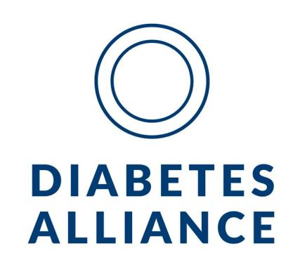
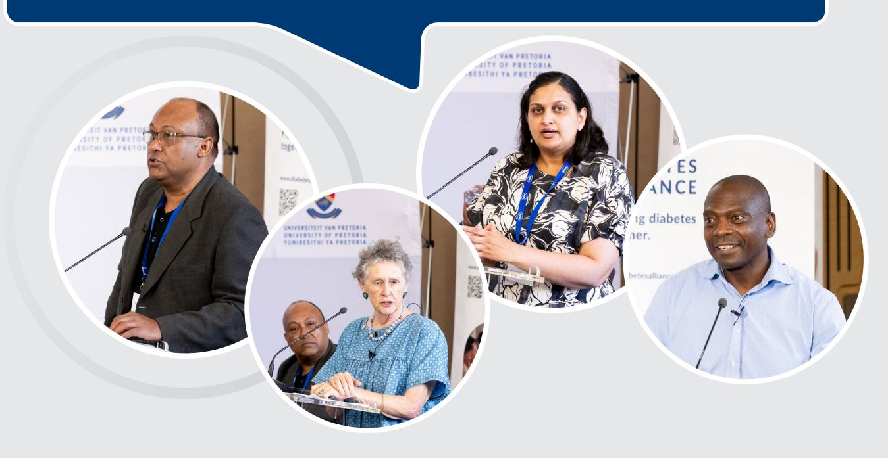
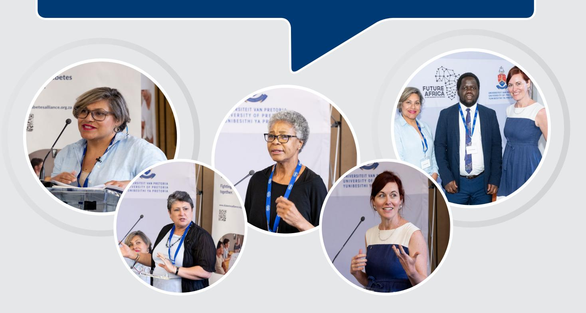
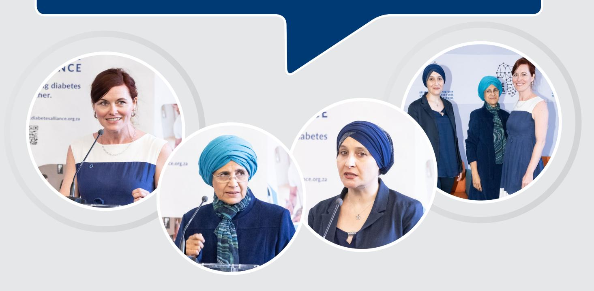
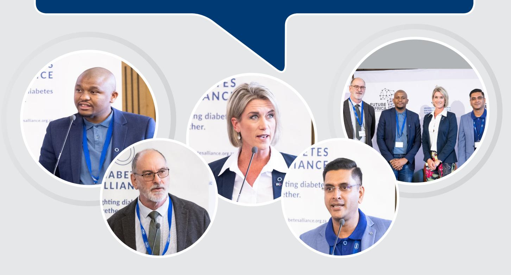

## **2023 Diabetes Summit** Diabetes Targets, Translating Policy into Reality

**May 2024**

| Themes                                          | NSP Goal   | Objectives                                                                                                                        |
|-------------------------------------------------|------------|-----------------------------------------------------------------------------------------------------------------------------------|
| Awareness and prevention                        | NSP Goal 1 | To prioritise prevention and control of NCDs+                                                                                  |
| Education                                       | NSP Goal 2 | To promote and enable health and wellness across the life course.                                                              |
| Management and access to care                | NSP Goal 3 | To ensure that people living with NCDs+. receive integrated, people-centred health services to prevent and control NCDs+.   |
| Surveillance                                    | NSP Goal 5 | To monitor strategic trends and determinants of NCDs+ to evaluate progress in their prevention and control.                 |
| Innovation and research                         | NSP Goal 4 | To promote and support national capacity for high-quality research and development for the prevention and control of NCDs+. |
| Investing in diabetes prevention and control | NSP Goal 1 | To prioritise prevention and control of NCDs+.                                                                                 |

*Table 1: Diabetes Summit themes aligned to the NSP goals*

During the Summit, several critical challenges were identified that impede optimal diabetes prevention and care in South Africa:

- **1. Low awareness levels:** There exists a pervasive lack of awareness about diabetes and non-communicable diseases (NCDs) across the healthcare system and within communities.
- **2. Lack of structured education for healthcare workers:** The absence of an evidence-based diabetes education programme for health workers at all levels of care poses a significant obstacle.
- **3. Lack of recognition of Diabetes Nurse Educators:** Despite their pivotal role, professional nurses trained as Diabetes Nurse Educators remain unrecognized and inadequately integrated into the healthcare system. These nurses possess the potential to play a crucial role in empowering people living with diabetes to effectively manage their condition.
- **4. Gaps in the cascades of care:** Significant gaps persist within the diabetes care cascades, detrimentally impacting the quality of care provided.
- **5. Underutilization of community healthcare workers (CHWs):** The potential of CHWs remains largely untapped. They should be actively involved in community screening for diabetes and hypertension, as well as in recognizing diabetes symptoms and complications, and facilitating timely referrals for appropriate care.
- **6. Absence of dedicated diabetes surveillance systems:** South Africa lacks a dedicated diabetes surveillance system, resulting in an underestimation of the true extent of the diabetes burden.

The Diabetes Alliance acknowledges the challenges posed by constrained resources within the National Department of Health (NDOH) and the provincial departments of health, necessitating the need to "do more with less." However, proactive investment in diabetes prevention and care today can help alleviate the immense strain that diabetes and its complications will place on the healthcare system in the future. Investments are crucial across various areas, including diabetes education, prevention, awareness, introduction of new pharmaceuticals, monitoring equipment, and innovative diabetes technologies.

To this end, the 2023 Diabetes Summit has crafted a list of recommendations. The Diabetes Alliance is fully committed to working in collaboration with the South African government including the Department of Health and all stakeholders to plan and execute these recommendations effectively. Establishing a national coordinating body for NCDs is essential to ensure effective oversight and implementation of the NSP.

The following is a summary of the key recommendations made by the speakers across the main themes of awareness and prevention, education, management and access to care, surveillance, and research and innovation.

| Themes                          | Summary of key recommendations                                                                                                                                                                                                                       |
|---------------------------------|------------------------------------------------------------------------------------------------------------------------------------------------------------------------------------------------------------------------------------------------------|
| Awareness and prevention: | 1. Implement WHO Best Buys –By implementing the Who Best Buys such as the promotion of healthy diets and physical activity, South Africa can significantly improve public health outcomes and mitigate the socioeconomic impact of NCDs. |
|                                 | 2. Leverage revenue generated from the Health Promotion Levy –The revenue generated from the Health Promotion Levy can be directed towards combating diabetes by funding the implementation of the National Strategic Plan.              |

| Education: | 3. Develop an evidence-based structured diabetes education programme – Resources should be allocated to develop a comprehensive diabetes education programme for individuals living with diabetes.                                                                                                         |
|------------|---------------------------------------------------------------------------------------------------------------------------------------------------------------------------------------------------------------------------------------------------------------------------------------------------------------------|
|            | 4. Build a skilled health workforce for diabetes care - A comprehensive training programme should be developed to enhance the skills and knowledge of healthcare workers, including doctors, nurses, clinical associates, community health workers (CHWs), and others, in diabetes management and care. |

| Themes                               | Summary of key recommendations                                                                                                                                                                                                                                                                                                                  |
|--------------------------------------|-------------------------------------------------------------------------------------------------------------------------------------------------------------------------------------------------------------------------------------------------------------------------------------------------------------------------------------------------|
| Management and access to care: | 5. Enhance task shifting and care coordination – By harnessing the expertise of both CHWs and Clinical Associates, South Africa can enhance its diabetes care infrastructure, expand access to quality care, and ultimately improve health outcomes.                                                                                |
|                                      | 6. Introduce new diabetes drugs and devices in the public health sector – Introducing new therapeutic options and devices into the public sector to allow healthcare professionals customize treatment plans according to each patient's needs is essential for improving diabetes outcomes and ad dressing diabetes inequities. |

| Surveillance: | 7. Develop a diabetes surveillance system including a national diabetes registry - By seamlessly integrating with existing health information systems, an integrated, digitized diabetes surveillance system can pro vide real-time data on diabetes prevalence, risk factors, and outcomes, enabling targeted interventions and research initiatives. |
|---------------|-----------------------------------------------------------------------------------------------------------------------------------------------------------------------------------------------------------------------------------------------------------------------------------------------------------------------------------------------------------------------|
|               | 8. Implement WHO-recommended surveillance tools such as the Integrated Disease Surveillance and Response (IDSR) and the WHO STEPwise approach – By adopting these tools, South Africa can enhance its capacity for diabetes surveillance and data collection, enabling more accurate monitoring of diabetes prevalence, risk factors, and outcomes.    |

| Research and innovation: | 9. Formulate a tailored national diabetes research agenda – Developing                                                                     |
|--------------------------------|-----------------------------------------------------------------------------------------------------------------------------------------------|
|                                | a context-specific national research agenda for diabetes by prioritising                                                                      |
|                                | research areas and allocating resources to support related activities can generate evidence-based information to guide policy development. |
|                                |                                                                                                                                               |

| 10.Explore alternative funding sources such as the Health Promotion  |
|----------------------------------------------------------------------|
| Levy and the Global Fund – In a context of constrained resources, it |
| becomes imperative to explore new funding sources or innovative      |
| approaches to maximize the impact of available resources.            |
|                                                                      |

### **1. Awareness and Prevention**

*NSP Goal 1 - To prioritise prevention and control of NCDs+*

### **Overview**

Both within the healthcare system and in communities, there exists a concerning lack of awareness regarding diabetes and NCDs. Consequently, there is a delay in responding to the biological risk factors associated with diabetes, such as overweight, obesity, raised blood pressure, elevated blood glucose levels, and abnormal blood lipids. This delay extends to addressing the onset of diabetes complications and the necessary referrals from primary to tertiary healthcare facilities. Furthermore, within communities, this low level of awareness results in individuals neglecting to manage their diabetes risks and failing to undergo diabetes screening at healthcare facilities. Compounding this issue, many individuals remain unaware of the symptoms of diabetes, leading them to seek medical attention only when they are already experiencing illness.

- **• Limited public awareness** South Africans generally lack awareness about the drivers of NCDs, which encompass five primary behavioural risk factors. These factors include unhealthy diet, tobacco use, physical inactivity, harmful alcohol consumption, and exposure to air pollution. These behaviours significantly elevate the risk of developing NCDs. Despite their substantial impact on preventing diabetes and obesity, counselling on physical activity, weight management, and diet, along with blood glucose screening, are insufficiently provided.
- **• Limited healthcare worker awareness** Timely responses to the biological risk factors for diabetes, including overweight, obesity, raised blood pressure, raised blood glucose, and abnormal blood lipids, are often lacking in health facilities. Complications of diabetes are frequently not diagnosed promptly, leading to delayed referrals from primary to tertiary facilities. Moreover, many health facilities face shortages of critical human resources, such as dietitians and podiatrists.
- **• One out of every two people living with diabetes remains undiagnosed** Many South Africans do not undergo regular screening and lack awareness of the symptoms of diabetes. As a result, they only seek medical attention when they become ill, leading to delays in diagnosis and treatment initiation. This trend is particularly prevalent among economically disadvantaged populations, especially those residing in rural areas, who often face challenges in accessing healthcare facilities due to long distances and financial constraints. Consequently, a significant portion of this population remains undiagnosed.
- **• Poor policy/programme implementation**  Despite initiatives aimed at addressing health risks associated with diabetes and hypertension, targeting their socio-economic, environmental, behavioural, and cultural determinants, it remains unclear whether these programmes have been effectively implemented and what their overall impact has been. There are limited to no efforts made to monitor the implementation of policies and programmes and evaluate their impact.
- **• Limited resources for diabetes prevention and awareness** At various levels, there is an urgent need for diabetes awareness and prevention initiatives. However, these efforts currently lack allocated budgets and a clear mandate. Moreover, awareness and prevention efforts for NCDs do not fall under the purview of the NCDs Directorate but rather under the health promotion unit.
- **• Lack of post-natal screening for Type 2 diabetes for women with gestational diabetes** About 50% of women who had diabetes during pregnancy are susceptible to developing Type 2 diabetes within 8-10 years. Despite women's regular visits to health facilities during and after pregnancy, there is a missed opportunity to prevent diabetes by not monitoring and screening them postpartum. Moreover, strategies targeting women of childbearing age to mitigate the risk of Type 2 diabetes are not being implemented.

#### **Solutions**

- **• Implement WHO Best Buys –** The WHO Best Buys comprise a collection of cost-effective interventions and policy measures designed to combat NCDs, including diabetes. Identified by the World Health Organization (WHO), these interventions are highly effective in alleviating the burden of NCDs and enhancing population health. Examples of WHO Best Buys include tobacco taxation, salt reduction, alcohol control policies, and the promotion of healthy diets and physical activity. By implementing these evidence-based interventions, South Africa can significantly improve public health outcomes and mitigate the socioeconomic impact of NCDs.
- **• Leverage revenue generated from the Health Promotion Levy –** In 2018, South Africa implemented a tax on sugar-sweetened beverages of approximately 10%, known as the Health Promotion Levy (HPL) or 'sugar tax'. The revenue generated from the HPL can be directed towards combating diabetes by funding the implementation of the National Strategic Plan, including awareness and prevention programmes in communities and health facilities.
- **• Organise screening campaigns with linkage to care -** The location where people are screened plays a crucial role in ensuring that screening campaigns receive support from communities. Pre-screening awareness drives are essential to educate and inform the community about the importance of screening for diabetes and NCDs+. Additionally, linkage to care must accompany screening campaigns to ensure that individuals who screen positive receive appropriate follow-up and access to healthcare services.
- **• Upskill and empower community healthcare workers (CHWs) -** Community health workers play a crucial role in raising awareness and preventing NCDs, including diabetes, in the communities they serve. it is imperative that CHWs receive adequate training and support to effectively raise awareness and promote community-based NCD prevention initiatives.
- **• Implement post-natal screening –** Pregnancy presents a prime opportunity to promote longterm intergenerational health and lifestyle modifications, as women consistently visit healthcare facilities for ante- and post-natal care. Healthcare workers have a unique chance to screen mothers for Type 2 diabetes and offer guidance on healthy diets and physical activity. With their influence within households, women can actively encourage healthy living among their families.
- **• A national coordinating body for NCDs –** Establishing a national coordinating body for NCDs is essential to ensure effective oversight and implementation of the NSP. Such a body would streamline efforts, coordinate resources, and monitor progress toward achieving the NSP's objectives, thereby enhancing the nation's response to the growing burden of NCDs including diabetes.

### **2. Education**

*NSP Goal 2 - To promote and enable health and wellness across the life course*

### **Overview**

A well-trained workforce is crucial for effective diabetes prevention and care. However, there is currently a shortage of skills for managing chronic conditions like diabetes. Investing in training programmes can significantly strengthen the diabetes response in healthcare facilities, particularly through task-shifting to dedicated trained nurses. Skilled doctors are needed to scale up diabetes treatment when necessary. Lastly, many people living with diabetes do not receive timely and consistent diabetes education, leading to challenges in self-management. Diabetes education plays a critical role in empowering individuals to effectively manage their condition and safeguard their health.

- **• No structured diabetes education programme in South Africa** Diabetes self-management education plays a pivotal role in improving health and controlling blood glucose levels, making it a cornerstone of diabetes management. Individuals living with diabetes require education on adopting healthy lifestyles, effectively managing their condition, and understanding their medication regimen. However, South Africa faces significant challenges in this regard. There is currently no standardised diabetes education programme in the country.
- **• Limited resources allocated for the development of a workforce skilled in diabetes**  Many healthcare workers lack the confidence, knowledge, and skills necessary to effectively prevent and manage diabetes. The quality of diabetes education received at diagnosis cannot be guaranteed, and patients often receive education only after complications arise. Healthcare workers also face challenges in accessing readily available information about diabetes management and care. South Africa urgently needs to adapt the training of its health workforce to address the increasing burden of diabetes across primary, secondary, and tertiary healthcare levels.
- **• Lack of integration of diabetes nurse educators** In South Africa, diabetes nurse educators lack recognition and integration into the public healthcare system, despite being embraced in the private sector. This lack of dedicated diabetes education contributes to patient struggles in managing their condition. Currently, there are no designated positions for diabetes nurse educators in the public sector, and specialising as a nurse educator is not actively promoted as a career option.
- **• Limited support for NPOs dedicated to diabetes** Numerous non-profit organizations (NPOs) are keen to contribute to the diabetes response, such as through community education and awareness campaigns, but they need additional support. Just like NPOs involved in the HIV response receive recognition, it is crucial to acknowledge the efforts of those dedicated to diabetes. Establishing partnerships with these organizations can significantly strengthen awareness and prevention efforts.

### **Solutions**

**• Develop an evidence-based structured diabetes education programme –** Resources should be allocated to develop a comprehensive diabetes education programme for individuals living with diabetes, integrating a predefined curriculum with clear aims and measurable learning objectives. The programme must be relevant to the community's needs and tailored to the local setting, including considerations such as language, ethnicity, traditional beliefs, and culture. Accompanying written materials are essential.

- **• Build a skilled health workforce for diabetes care -** A comprehensive training programme should be developed to enhance the skills and knowledge of healthcare workers, including doctors, nurses, clinical associates, community health workers (CHWs), and others, in diabetes management and care. This programme should enable task-shifting and equip healthcare workers with the essential skills for providing diabetes education, including adherence counselling, close monitoring, and frequent patient evaluations. CHWs represent a valuable resource for diabetes care due to their role in community engagement. By training CHWs to deliver education, support, and outreach within their communities, individuals living with diabetes can receive tailored assistance that addresses their unique needs and challenges. CHWs can contribute to increasing awareness about diabetes, promoting healthy behaviours, facilitating access to healthcare services, and providing ongoing support for self-management.
- **• Integrate Diabetes Nurse Educators into the public health system –** Diabetes predominantly requires self-management, underscoring the vital role Diabetes Nurse Educators play in empowering patients to understand and navigate their condition. Professional Nurses should be encouraged and incentivized to specialize as Diabetes Nurse Educators. Formal recognition of their qualifications is imperative to fully leverage their expertise in diabetes management. Additionally, the government should establish dedicated positions for them within healthcare facilities.
- **• Draw from the success of existing diabetes education projects** South Africa has witnessed the successful implementation of various diabetes education programmes over the years, including the Tshwane Insulin Project at the University of Pretoria, the "GREAT" Programme at Stellenbosch University and the Department of Health, the COUPLE's Project by the Chronic Disease Initiative for Africa at the University of Cape Town, and the Basic & Advanced Diabetes Courses at Groote Schuur Hospital. The Department of Health plays a crucial role in ensuring the continuity and expansion of these initiatives to reach a broader audience of people living with diabetes. Additionally, further research into Diabetes Self-Management Education and Support (DSME/S) is imperative to facilitate the implementation and sustainability of evidence-based programmes.
- **• Leverage the power of digital technologies –** With a mobile phone penetration rate of 90% in South Africa, there is a remarkable opportunity to leverage telehealth platforms such as WhatsApp for diabetes awareness and education initiatives. For example, the diabetes NPO Sweet Life is actively developing a diabetes education chatbot to capitalize on this widespread mobile connectivity, aiming to improve access to information and support for individuals living with diabetes. Similar initiatives are being implemented globally, yielding promising results in leveraging mobile connectivity for healthcare outreach and education, including diabetes management.

### **3. Management and access to care**

*NSP Goal 3 - To ensure that people living with NCDs+ receive integrated, peoplecentred health services to prevent and control NCDs+*

### **Overview**

By all accounts, diabetes care in South Africa falls short of desired outcomes, including glucose control and complication prevention. Persistent gaps exist in the diabetes care cascades across primary, secondary, and tertiary levels of the health system. The primary healthcare system is ill-prepared to effectively address the diabetes epidemic and implement a person-centred care approach, as outlined in the NSP. Healthcare workers often overlook signs requiring referrals, and clinical inertia remains a significant challenge. Additionally, essential glucose monitoring tools such as glucometers and testing strips are frequently unavailable for patients in need.

- **• Suboptimal diabetes care:** 
  - **• Poor glycaemic control** Despite the availability of a wide range of pharmacological agents, many patients struggle to achieve optimal glycaemic control, as well as target blood pressure and cholesterol levels. Lowering these levels is crucial to reduce the risks of diabetes complications and related mortality.
  - **• Poor adherence to care pathways and late referrals**  Identifying high-risk individuals and conducting screening for diabetes and its complications are crucial. Equally important are timely referrals between primary, secondary, and tertiary care levels. However, despite established pathways, adherence is often lacking.
  - **• Delays in intensifying diabetes treatment** Treatment for individuals living with diabetes is not being scaled up in a timely manner. Clinical inertia is common, resulting in delays in transitioning patients to higher-level drugs or insulin therapy when treatment goals are not met.
- **• Limited access to glucose testing tools for self-monitoring of blood glucose** Access to glucose testing tools is fundamental for individuals living with diabetes, yet concerns persist regarding their availability and affordability. Many people living with diabetes are not provided with glucometers and testing strips when needed, and innovative technologies such as Continuous Glucose Monitoring devices are not accessible in the public sector.
- **• Poor implementation of a diabetes care team approach** Individuals living with diabetes benefit from comprehensive care delivered by a multidisciplinary team, which may include primary care providers, diabetes educators, podiatrists, dentists, ophthalmologists, optometrists, psychologists or social workers, care managers, and dieticians. However, many people living with diabetes lack access to such a comprehensive care team. Additionally, disparities in the distribution of skills across districts create challenges for patients who must travel to another facility to access essential health services.
- **• Health inequities in diabetes** There is a significant disparity between the resources available in the public and private healthcare sectors in South Africa. Despite the availability of new diabetes drugs, many individuals do not have access to them, exacerbating health inequities. The limited availability of these drugs in the public sector further widens the gap. For instance, insulin pens, which are crucial for diabetes management, are currently restricted to specific patient groups, while others are limited to using syringes and vials. Expanding access to devices such as insulin pens and continuous glucose monitors to a broader population can enhance adherence and improve health outcomes for all.

#### **Solutions**

- **• Enhance task shifting and care coordination –** By harnessing the expertise of both community health workers and Clinical Associates, South Africa can enhance its diabetes care infrastructure, expand access to quality care, and ultimately improve health outcomes. Empowering community health workers with training and resources enables them to identify individuals at risk of diabetes, deliver preventive interventions, and support people living with diabetes in managing their condition effectively. Additionally, integrating Clinical Associates into diabetes care teams enhances care coordination, facilitates streamlined patient management, improves communication within and between healthcare facilities, and ensures continuity of care for individuals with diabetes.
- **• Introduce new diabetes drugs and devices in the public health sector –** Introducing new therapeutic options and devices into the public sector is essential for improving diabetes outcomes and addressing diabetes inequities. Over the past two decades, the introduction of new treatment options targeting specific pathophysiological pathways has led to significant improvements in treatment effectiveness. With a broader array of therapeutic options available, healthcare professionals can now customize treatment plans according to each patient's needs, ultimately enhancing their health outcomes and quality of life.
- **• Strengthen the primary healthcare system for diabetes –** To tackle the diabetes crisis in South Africa effectively, it is essential to allocate adequate resources, funding, and commitment to primary care. By addressing barriers within primary healthcare and seizing available opportunities, South Africa can transition towards a healthcare system that prioritizes the holistic well-being of individuals with diabetes. Bridging the care gap for diagnosis and treatment initiation, along with strengthening linkage to care, are critical steps in preventing the severe consequences of undiagnosed and unmanaged diabetes.

### **4. Surveillance**

*NSP Goal 5 - To monitor strategic trends and determinants of NCDs+ to evaluate progress in their prevention and control*

### **Overview**

There is a significant underestimation of the challenges posed by diabetes in South Africa. Currently, diabetes prevalence data for South Africa is primarily obtained from estimates released by the International Diabetes Federation (IDF). Despite the escalating prevalence of diabetes in the country, there is a lack of data to closely track the trends. Poor surveillance severely hampers efforts in prevention and care. Patient records are still predominantly paper-based, and there is a notable absence of data standardisation. While there is legislation addressing Health Information Systems (HIS), the current legislative framework lacks integration. There is an urgent need to streamline data collection processes to make it easier for healthcare workers to capture accurate and comprehensive data.

- **• No coordinated diabetes surveillance system** The absence of a coordinated diabetes surveillance system leads to unreliable data for monitoring diabetes prevalence, trends, and outcomes. Without this data, tracking the targets outlined by the NSP or evaluating progress in diabetes prevention and management becomes challenging. Moreover, the lack of data hampers planning, resource allocation, and the formulation of effective strategies to combat the diabetes burden. Ultimately, the absence of a diabetes surveillance system contributes to suboptimal care and poor outcomes for individuals living with diabetes.
- **• Inadequate diabetes-related indicators on the District Health Information System (DHIS)** – The District Health Information System (DHIS) serves as the primary data collection tool for the public healthcare sector. Its purpose is to empower healthcare workers to analyse service provision levels, predict service needs, and evaluate performance against health service targets. However, diabetes-related indicators captured by DHIS are limited, including patient visits, screening frequency, age distribution and proportions of newly diagnosed individuals with diabetes. Notably, the absence of patient identifiers poses challenges for data accuracy, potentially leading to duplicate records. Enhanced data collection mechanisms and expanded indicators are essential to provide a more comprehensive understanding of diabetes prevalence and management at the district level.
- **• Paper-based medical records and failing filing systems** Relying on paper-based medical records and outdated filing systems creates substantial gaps in diabetes care, compromising both continuity and quality of care delivery. This reliance often leads to inefficiencies, errors, and delays in accessing vital patient information, hindering healthcare providers' ability to make informed decisions and provide timely interventions. Additionally, the lack of robust filing systems contributes to lost or misplaced records, exacerbating the challenge of fragmented care.

#### **Solutions**

**• Develop a diabetes surveillance system including a national diabetes registry** - An integrated, digitised diabetes surveillance system offers a holistic approach to understanding and addressing the diabetes burden. By seamlessly integrating with existing health information systems, this system can provide real-time data on diabetes prevalence, risk factors, and outcomes, enabling targeted interventions and research initiatives. Key features should include user-friendly interfaces for healthcare workers to input data, robust tracking mechanisms, and the establishment of a national diabetes registry to centralize patient information and inform care strategies. This comprehensive approach holds promise for improving diabetes management and outcomes across South Africa.

- **• Ensure the National Public Health Institute of South Africa (NAPHISA) fulfils its legislated mandate –** According to the NAPHISA Act of 2018, NAPHISA is tasked with providing integrated and coordinated disease and injury surveillance, research, monitoring, and evaluation of services and interventions addressing major public health issues in South Africa. It is imperative that NAPHISA fulfils its function of disease surveillance for non-communicable diseases, including diabetes.
- **• Implement WHO-recommended surveillance tools such as the Integrated Disease Surveillance and Response (IDSR) and the WHO STEPwise approach –** The IDSR is a comprehensive strategy adopted by countries in the WHO African Region to strengthen national public health surveillance and response systems at various levels. In South Africa, priority conditions for surveillance include diabetes, hypertension, and epilepsy. The WHO STEPwise approach to NCD risk factor surveillance (STEPS) is a standardized method for collecting, analysing, and disseminating data on key NCD risk factors, including both behavioural (tobacco use, alcohol use, physical inactivity, unhealthy diet) and biological factors (overweight and obesity, raised blood pressure, raised blood glucose, abnormal blood lipids). By adopting these tools, South Africa can enhance its capacity for diabetes surveillance and data collection, enabling more accurate monitoring of diabetes prevalence, risk factors, and outcomes.
- **• Transition to electronic medical records –** Transitioning to electronic medical records (EMRs) offers numerous advantages, including improved efficiency, better access to information, and enhanced care coordination. Investing in EMRs is essential for addressing existing gaps in diabetes care and realizing long-term benefits such as improved patient outcomes, streamlined workflows, and enhanced care coordination.

### **5. Research and Innovation**

*NSP Goal 4 - To promote and support national capacity for high-quality research and development for the prevention and control of NCDs+*

### **Overview**

Innovation and research are pivotal in overcoming the challenges that could impede the attainment of the NSP's 90-60-50 targets. Implementation research not only addresses these challenges but also informs policy and guides implementation strategies. Despite the escalating diabetes epidemic, research funding remains inadequate. Establishing partnerships is often essential for research and innovation endeavours. To effectively prioritize evidence-based research areas, a collaborative research environment involving academic institutions, relevant public organizations, and civil society is imperative. Additionally, identifying and fostering opportunities for public-private partnerships in research is essential for advancing diabetes prevention and care efforts.

- **• Inadequate Research Funding –** Despite the growing prevalence of diabetes, research funding remains insufficient.
- **• Lack of a national diabetes research agenda –** South Africa lacks a comprehensive research agenda that addresses the challenges of diabetes prevention and care, aligned with the priorities of the National Department of Health.
- **• Limited research capacity -** The country faces a shortage of academic institutions and researchers dedicated to diabetes research, considering the scale of the diabetes problem in South Africa.
- **• Research-to-policy gap –** Diabetes research should effectively inform policy and interventions to improve health outcomes and reduce health disparities. Scaling up evidence-based interventions in diabetes prevention, treatment, and care is essential.

### **Solutions**

- **• Formulate a tailored national diabetes research agenda –** Developing a context-specific national research agenda for diabetes involves prioritizing research areas and allocating resources to support related activities. This approach fosters innovation, generates new scientific knowledge, and directly enhances the quality of diabetes care. Furthermore, it equips policymakers, healthcare providers, and public health officials with evidence-based information to guide policy development and promote health equity by addressing disparities.
- **• Foster collaborations and partnerships –** Cultivate collaborations and partnerships, both within academia, other relevant entities, and civil society, as well as between public and private sectors, to steer evidence-based research efforts towards identified focus areas and advance diabetes-related research.
- **• Allocate dedicated funding for diabetes research –** Prioritize funding specifically earmarked for diabetes research to facilitate the implementation of research projects aimed at improving the South African diabetes response.
- **• Scale up successful evidence-based interventions –** Support the scaling up of evidence-based interventions resulting from research endeavours. Implementation science plays a crucial role in translating research findings into tangible improvements in diabetes prevention and care. Supporting research projects with the potential to address pertinent needs and enhance diabetes outcomes, such as the Tshwane Insulin Project (TIP) and the PRO-Active Telemedicine Tactical Operation (PROTECTOR) programme, is essential for achieving this objective.

### **6. Investing in diabetes prevention and control**

### **Overview**

Investments are crucial across various facets of diabetes care, spanning education, prevention, awareness, pharmaceuticals, testing equipment, and emerging technologies. Insufficient funding in diabetes prevention and control is proving to be costly for South Africa. For example, suboptimal diabetes care contributes to the development of diabetes complications, which not only affect individuals and their livelihoods but also strain healthcare and social welfare systems. These complications are preventable, highlighting the need for improved diabetes control strategies. Investing in diabetes prevention and control now ensures significant savings in the future.

The Discovery Diabetes Care Programme demonstrates the benefits of investing in diabetes. Recognizing the importance of proactive intervention, Discovery Health has pioneered an ecosystem for diabetes care. This initiative encompasses data utilization, proactive care coordination, and empowering patients for self-management, resulting in tangible benefits for both patients and the healthcare scheme.

### **Opportunities**

- **• Alternative funding sources such as the Health Promotion Levy and the Global Fund –** In a context of constrained resources, it becomes imperative to explore new funding sources or innovative approaches to maximize the impact of available resources. The Global Fund and the Health Promotion Levy emerge as promising avenues for South Africa in this regard. Leveraging the Global Fund grant allocation, initiatives focused on health system strengthening or the integration of care to address comorbidities could serve to bolster the diabetes response, optimizing the utilization of funds and advancing diabetes prevention and control efforts.
- **• Human rights approach to diabetes funding** The Health Finance Institute underscores the importance of economic burden modelling for diabetes prevention and control, highlighting the long-term benefits of diabetes interventions. Moreover, viewing diabetes through a human rights lens reveals the significant human suffering caused by undiagnosed and poorly managed diabetes, making a strong case for increased investments in diabetes prevention and care.
- **• Collaboration with regional and global partners –** Collaborating with regional and global partners, such as the WHO or Africa CDC, presents an opportunity for South Africa to access technical expertise and support aimed at reducing the diabetes burden through the introduction of cost-effective solutions. For instance, the WHO Global Diabetes Compact, launched in April 2021, aims to mitigate diabetes risk and ensure equitable access to comprehensive, affordable, and quality management. South Africa stands to benefit from this initiative, particularly from its workstream 4, which provides support for regional and national grant proposals.

#### **Contribution of the Diabetes Alliance**

- **• Advocacy and Awareness –** The Diabetes Alliance is committed to increasing advocacy efforts aimed at raising awareness about the importance of diabetes prevention and control. By highlighting the social and economic burden of diabetes and its complications, the Alliance aims to garner support for increased investments among policymakers, healthcare providers, and the general public.
- **• Public-Private Partnerships –** The Diabetes Alliance serves as a catalyst for fostering collaborations between government entities, private sector organizations, non-profit organizations, and academic institutions. By providing a platform for dialogue and collaboration, the Alliance aims to pool resources and expertise for diabetes prevention and control initiatives. These partnerships can help leverage funding and improve the efficiency of interventions.
- **• Funding Allocation –** The Diabetes Alliance advocates for dedicated funding streams for diabetes prevention and control within national and provincial healthcare budgets. Prioritizing diabetes within healthcare budgets can ensure sustained funding for essential programmes and services outlined in the National Strategic Plan. This strategic allocation of funds can support the implementation of key initiatives aimed at addressing the diabetes epidemic in South Africa.

## Conclusion

The 2023 Diabetes Summit showcased the Diabetes Alliance's role as a leading advocate for diabetes in South Africa. The convergence of diabetes experts and opinion leaders, along with the insightful contributions and active involvement of individuals living with the condition, greatly contributed to the success of the event. Now in its second edition, the Diabetes Summit has become a cornerstone event on the national health calendar, significantly advancing the well-being of South Africans living with diabetes.

While the Diabetes Alliance provided the platform, the speakers generously shared their expertise. Now, it is incumbent upon the government and all stakeholders to translate the recommendations into action and fulfil the aspirations of the 4.3 million South Africans living with diabetes who seek to lead healthy and productive lives.

The 90-60-50 diabetes targets outlined in the National Strategic Plan are within reach, but their achievement necessitates a comprehensive, collaborative approach, as exemplified by the diverse range of speakers at the 2023 Diabetes Summit. A "whole-of-society", "whole-of-government" approach, strong leadership, multisectoral collaboration, equitable and sustainable funding, and meaningful engagement of individuals with diabetes are essential components of this successful endeavour.

The Diabetes Alliance reaffirms its commitment as a key partner to the Department of Health in implementing the National Strategic Plan and supporting all efforts to enhance diabetes prevention and control in South Africa. Together with our partners and members, we stand ready to collaborate with the South African government to alleviate the burden of diabetes in our country.