### **SYMPTOM-BASED INTEGRATED APPROACH TO THE ADULT IN PRIMARY CARE**

**EMERGENCIESSYMPTOMS**

### **NOT FOR DISTRIBUTION**

- [Terms of download: by downloading this file,](https://knowledgetranslation.co.za/download-form/download-id/1822/)  you agree that it is for personal use, you may not share, sub-license, re-sell, claim as your own, or distribute graphics.
- If you received this via other channels, please consider downloading your own copy from [knowledgetranslation.co.za/resources](https://knowledgetranslation.co.za/resources/).
- Providing us with your contact details will assist with keeping you updated should there be urgent changes to the guide that may affect your clinical practice.

**TBHIVCOVID-19ASTHMA/COPDCARDIOVASCULAR DISEASEDIABETESMENTAL HEALTH CONDITIONSEPILEPSYMUSCULOSKELETAL DISORDERSWOMEN'S HEALTHPALLIATIVE CARE**

### **PREFACE**

### **ADULT PRIMARY CARE (APC) 2023**

### **Commissioned and published by: The South African National Department of Health.**

### **What is APC?**

The Adult Primary Care (APC) clinical tool is a comprehensive approach to the primary care of the adult 18 years or older. APC has been developed using approved clinical policies and guidelines issued by the National Department of Health and is intended for use by all health care practitioners working at primary care level in South Africa as a clinicaldecision-making tool.

Along with guiding the delivery of sound clinical care, APC aims to uphold its key values:

- Acknowledgement of each patient's uniqueness and multiple roles within a family and community
- •Respect for a patient's concerns and choices
- The development of a trusting relationship with a patient
- Communication with a patient should be effective, courteous and empathic
- The delivery of follow-up care especially for patients with chronic conditions
- Linking the patient to community-based resources and support
- Ensuring continuity of care, where possible.

A training package that consists of simulated case scenarios accompanies this tool.

APC is being implemented as part of the Integrated Clinical Services Management (ICSM), a key focus within the Ideal Clinic Realisation and Maintenance (ICRM) initiative to improve the quality of care delivered, and is complemented by the Health for All health promotion tool to promote healthy lifestyles and health education.

An APC eBook for easy electronic viewing is available for download from the Knowledge Hub.

**[TB](#page-85-0)**

**CONTENTS SYMPTOMSCONTENTS CHRONIC CONDITIONS**

### **How to use APC?**

APC is designed to reflect the process of conducting a clinical consultation with an adult patient in primary care:

It is divided into three main sections:

- 1.Address the patient's general health
- 2.Symptoms

**[HEPATITIS B \(HBV\)](#page-116-0) [COVID-19](#page-117-0)**

- 3.Chronic Conditions.
- In the stable patient start by addressing the patient's general health then address the patient's symptom/s and/or chronic conditions.
- In the patient presenting with one or more symptoms, start by identifying the patient's main symptom. Use the Symptoms contents page to find the relevant symptom page in the clinical tool. Decide if the patient needs urgent attention (indicated in the red box) and if not, follow the algorithm to either a management plan or to consider a chronic condition in the chronic condition section of the clinical tool.
- In the patient known with a chronic condition, use the Chronic Conditions contents page to find that condition in the clinical tool. Go to the colour-coded Routine Care pages for that condition to manage the patient's chronic condition using the 'Assess, Advise and Treat' framework.
- •Arrows refer you to another page in the clinical tool:
- The return arrow ( ) indicates that you need to consult another page once you have completed the current page. We suggest you make a note of additional pages to consult.
- The direct arrow ( ) guides you to leave the current page and continue on another page.
- The assessment tables on the Routine Care pages are arranged in 3 tones to reflect those aspects of the history, examination and investigations to consider.

**[HIV](#page-102-0) [CHRONIC RESPIRATORY DISEASE](#page-119-0) [CARDIOMETABOLIC CONDITIONS](#page-123-0) [MUSCULOSKELETAL DISORDERS](#page-147-0) [MENTAL HEALTH](#page-136-0) [EPILEPSY](#page-145-0) [WOMEN'S HEALTH](#page-150-0) [PALLIATIVE CARE](#page-166-0)**

- • All medications have been colour coded in either orange, blue or purple to indicate prescriber level for that particular indication and at that dose:
- Orange-highlighted medications may be prescribed by a **doctor or a nurse** according to his/her scope of practice.
- Purple-highlighted medications are **doctor**-**initiated** medications. This means a doctor needs to start the medication and a nurse can continue it according to his/her scope of practice.
- Blue-highlighted medications are **doctor**-**prescribed** medications. This means that these medications may only be prescribed by a doctor.
- Refer to the Health for All health promotion tool when you see the icon below.

APC and its preceding versions have been developed, tested and refined by the Knowledge Translation Unit in consultation with the South African National Department of Health, particularly the National Essential Medicines List Committee and Clinical Programmes, and a wide range of clinicians, policy makers and end-users. For any queries contact The Knowledge Translation Unit, email ktu@uct.ac.za or visit [www.knowledgetranslation.co.za](http://www.knowledgetranslation.co.za)

NEMLC/Affordable Medicines Directorates endorse all recommendations in APC approved through the NEMLC process as published in the STGs and EML.

**DISCLAIMER:**The content of this document has been developed specifically for health care professionals practising in South Africa, and which content, at the date of first publication, is reasonably believed to represent best practice in the relevant fields of healthcare. This information is provided on an "as is" basis and neither the Health Foundation of South Africa (NPC) or any of its affiliates make any representations, conditions, warranties or guarantees, whether express or implied, regarding accuracy, relevance, usefulness or fitness for purpose. Accordingly, you use this information at your sole risk. To the fullest extent permitted by law, the Health Foundation of South Africa (NPC), all its affiliates (including but not limited to the Knowledge Translation Unit) shall not be held liable or responsible for any aspect of healthcare administered in reliance upon, or with the aid of, this information or any other use of this information, including any use which is not in accordance with any guidelines or (mis-)use outside South Africa. Users of the content are strongly advised to independently verify any interpretation of the information, consult a variety of sources and use their own professional judgment when treating patients using this information. It is the responsibility of users to ensure that the information contained in this document is appropriate to the care required for each of their patients within their respective geographical regions. The information contained in this document does not constitute a substitute for such professional judgment.

### **What is new in ADULT PRIMARY CARE (APC) 2023.**

### **APC 2023 aligns with the following National Department of Health policies and clinical protocols:**

- Standard Treatment Guidelines and Essential Medicines List for South Africa. Primary Healthcare Level, 2020 Edition (v3).
- TB Screening and Testing Standard Operating Procedure, June 2022.
- •National Guidelines on the Treatment of Latent TB Infection, February 2023.
- NDOH. National HIV Testing Services Policy, April 2023. *(Updated August 2023).*
- NDOH: 2023 ART Clinical Guidelines for the Management of HIV in Adults, Pregnancy and Breastfeeding, Adolescents, Children, Infants and Neonates, June 2023.
- NDOH: Guideline for Vertical Transmission Prevention of Communicable Infections 2023, August 2023.
- • National Clinical guidelines of Post-Exposure Prophylaxis in occupational and non-occupational exposures. NDOH. Approved 2019. Published 2020.
- 2021 Updated guidelines for the provision of Pre-Exposure Prophylaxis (PrEP) to persons at substantial risk of HIV infection. NDOH. October 2021.
- National guidelines for the management of Viral Hepatitis. NDOH. December 2019.
- Management of Rifampicin-Resistant Tuberculosis: A Clinical Reference Guide. November 2019
- Guidance document on the use of lateral flow lipoarabinomannan assay for the diagnosis of active tuberculosis in people living with HIV. NDOH. December 2020.
- Comprehensive STI Clinical Management Guidelines. NDOH. 2021-2025.
- Maternal, Perinatal, and Neonatal Health Policy. NDOH. 21 June 2021.
- National Contraception clinical guidelines. NDOH. 2019
- Clinical Guidelines for Breast Cancer Control and Management. NDOH. 2019.
- National User Guide on the Prevention and Treatment of Hypertension in Adults at PHC level. NDOH. 2021.
- National guidelines for the treatment of Malaria, South Africa, 2019
- COVID-19 Clinical Management Guidelines version 5
- Guide to Antigen Testing for SARS-COV-2 in South Africa. NDOH. 2023.
- COVID-19 Disease: Infection Prevention and control Guidelines. Version 3. July 2021

### **What are the APC 2023 updates?**

New pages and extensively revised sections include:

- The HIV section has been revised to include the transitioning of all patients to a dolutegravirbased ART regimen with updates to the clinic visit and blood test monitoring schedules. Pages that have been extensively revised include: Start or re-start ART, Switch ART, manage the unsuppressed VL pages.
- The TB section has been updated to include a new page "Assess and manage TB infection" which provides guidance on managing TB exposures in TB contacts and treating latent TB infection. Updated recommendations regarding increased active TB screening and testing have also been included.
- The contraception section has been revised to include a new pregnancy diagnosis page as well as recommendations around the newly available intrauterine device: LNG-IUD.
- • COVID-19 content has been integrated into existing pages and new pages have been added: Screen all patients for COVID-19, COVID-19 diagnosis, Acute COVID-19, Ongoing COVID symptoms, Long COVID: routine care
- A new section has been added on preventing HIV with pre-exposure prophylaxis (PrEP).
- Other new pages in this update include: Chronic pain, Skin ulcer or non-healing wound: routine care, Support the patient taking chronic medication, Observation post vaccination.
- For more details, find a full '**Summary of Changes'** document on the Knowledge Hub.

### **Keep up to date with expected changes in clinical guidance**

Clinical guidance and policies are continuously being updated as new evidence becomes available and clinicians are urged to be aware of expected changes in clinical practice.

### Clinical guidance updates expected in 2023/2024 include:

- Clinical Management of RR-TB 6-month BPaLL regimen
- Maternity Care Guidelines

Check regularly for new NDOH circulars, notices or memorandums indicating updates as per standard practice in government.

*Any distribution of the APC publication must remain unaltered. Users are strictly prohibited from reproducing, selling, reselling, or exploiting the APC publication or information contained therein for any commercial purposes.*

*APC is revised and improved based on feedback from end-users. Send your feedback to* [ktu@uct.ac.za](http://ktu@uct.ac.za)

**[TB](#page-85-0)**

### **PRESCRIBE RATIONALLY**

Scan QR code to download Medsafety App to report medication adverse events.

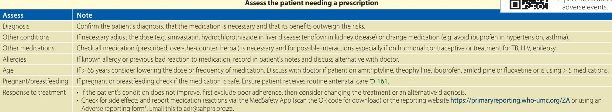

### **Advise the patient needing a prescription**

Explain to the patient when and how to take the medication and what to do if side effects occur. Ask the patient to repeat your explanation to ensure s/he understands how to take the medication.

- Ensure patient knows the generic name of all his/her medication and advise to ask prescriber/pharmacist if s/he does not understand a change to regular medication.
- •Educate the patient on the importance of adherence and that not adhering to medication may lead to relapse or worsening of the condition and in some instances, resistance to the medication.
- Over-the counter medications and herbal treatments may interfere with prescribed medication. Encourage patient to discuss with prescriber before using them.

### **Treat the patient needing a prescription**

- Ensure that the appropriate prescriber writes the prescription: orange-highlighted medications may be prescribed by a doctor or a nurse according to his/her scope of practice. Purple-highlighted medications may be initiated by a doctor and continued by a nurse according to his/her scope of practice. Blue-highlighted medications may be prescribed by a doctor only.
- •Consult the South African Medicines Formulary (SAMF) or MIC helpline (021) 406 6829 if unsure about your medicine choice and dosing, side-effects or drug interactions.
- If medications listed in APC are not available, check Therapeutic Class list2 and local formulary to identify specific medicine that has been approved for use in your facility.
- Once patient stable on chronic medication and agrees to be registered for Central Chronic Medicines Dispensing and Distribution (CCMDD) programme, help patient select a pick up point (PuP). Then create 6-month repeat prescription (see below). Write neatly. Patient will collect first supply at facility, then next 5 months from chosen PuP. Patient to return to facility every 6 months.

|                                                                                                   |                                                              | P R E S C R                                                                                                                    | I P T I O N             |                            |           |           |                 |                   |           | Pat ien t's                                                                                                  |
|---------------------------------------------------------------------------------------------------|--------------------------------------------------------------|-----------------------------------------------------------------------------------------------------------------------------------------------|----------------------------------------|----------------------------|-----------|-----------|-----------------|-------------------|-----------|--------------------------------------------------------------------------------------------------------------------|
|                                                                                                   | PAT IEN T'S NA ME AN D S URN AM E |                                                                                                                                               |                                        |                            |           |           |                 |                   |           | age                                                                                                                |
| Pat ien t's nd nam e a sur nam e Pre ip tio n d ate scr | ID ALL ERG IES                                      |                                                                                                                                               |                                        |                            |           |           | Age             |                   |           | Pat ien t's ID o r ber rt n pas spo um                                                  |
|                                                                                                   | DAT E                                                     | DET AIL S O F P RES CRI PTI ON                                                                                           |                                        |                            |           |           | REP EAT S |                   |           | alle Pat ien t's ies                                                                                   |
| f Ge ic n ner am e o dic fu ll atio n in me                      |                                                              | Prin t th of t he d the blo cks belo s in e na me rug w NO TE ON E IT EM PER BO X |                                        | 1 of 6 (INIT IAL) | 2 of 6 | 3 of 6 | 4 of 6       | 5 of 6         | 6 of 6 | rg                                                                                                                 |
| th, fre Do stre se, ng qu enc y                                           |                                                              |                                                                                                                                               | Dat e                               |                            |           |           |                 |                   |           | Nu mb f re ts er o pea                                                                              |
| mb f re Nu ts er o pea fo nth (ma xim r 6 s) um mo         |                                                              |                                                                                                                                               | Qua ntit y                       |                            |           |           |                 |                   |           | (ma xim fo nth s) r 6 um mo De lete th bo wh ose xes ere re pea |
|                                                                                                   |                                                              | ival ent or e qu                                                                                                                     | Batc h N o                       |                            |           |           |                 |                   |           | ede d not ne                                                                                              |
| ific Pre ibe r's ual atio scr nam e, q ns                              |                                                              |                                                                                                                                               | Disp ens er Sign atu re |                            |           |           |                 |                   |           | f is                                                                                                               |
| and sig nat ure                                                                          |                                                              | Pres crib & q uali fica igna ture tion er n am e, s s                                                        | Prin t Na me                     |                            |           |           |                 | Dat e o sue |           |                                                                                                                    |
|                                                                                                   |                                                              |                                                                                                                                               |                                        |                            |           |           |                 |                   |           | d Na me an of dis sig nat ure pen ser                                                |

### **SCREEN ALL PATIENTS FOR COVID-19 AND TB**

- Health care workers need to wear a surgical or N95 mask. Patients need to wear cloth or surgical masks and keep 1-2m apart from each other. Ensure queues are distanced.
- Have 70% alcohol-based hand sanitiser or soap and water handwashing stations available for all patients entering facility.
- Ensure a separate patient pathway for patients suspected of having COVID-19. All waiting areas need to be well-ventilated (open doors and all windows) or outside.
- Ensure triage station has a supply of surgical masks to give to symptomatic patients and patient information leaflets for close contacts1

#### **If patient known with COVID-19 and returning with worsening symptoms, fast track this patient:**

Give surgical mask and send patient to separate area identified for emergency care of COVID-19 patients for urgent attention [40](#page-36-0).

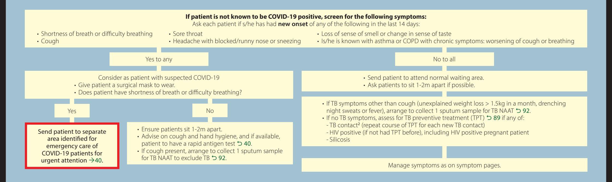

1Close COVID-19 contact is when a person has had face-to-face (within 1 metre) contact with someone with COVID-19, or has been in a closed environment (like room or vehicle) with someone with COVID-19 for at least 15 minutes. 2A TB contact refers to a patient who shared an enclosed space (at work, socially, in a hostel, or in a household setting), for ≥ 1 night or for frequent/extended daytime periods, with an adult/adolescent with pulmonary TB ("index patient"), during the 3-month period before the index patient started their TB treatment.

**[HIV](#page-102-0) [CHRONIC RESPIRATORY DISEASE](#page-119-0) [CARDIOMETABOLIC CONDITIONS](#page-123-0) [MUSCULOSKELETAL DISORDERS](#page-147-0) [MENTAL HEALTH](#page-136-0) [EPILEPSY](#page-145-0) [WOMEN'S HEALTH](#page-150-0) [PALLIATIVE CARE](#page-166-0)**

**[HEPATITIS B \(HBV\)](#page-116-0) [COVID-19](#page-117-0)**

**[TB](#page-85-0)**

**CONTENTS SYMPTOMSCONTENTS CHRONIC CONDITIONS**

### **INITIAL ASSESSMENT OF THE PATIENT**

#### **Give urgent attention to the patient with any of:** •Bleeding

•Fitting

•

- Difficulty breathing or breathless while talking
- •Respiratory rate ≥ 30 breaths/minute
- •Chest pain
- Headache *and* vomiting

Decreased consciousness

- •Aggressive, confused or agitated
- •Overdose of drugs/medication
- Recent sexual assault
- •Vomiting or coughing blood

#### •Burn

- Eye injury
- •Severe pain
- •Suspected fracture or joint dislocation
- Recent sudden onset weakness, numbness or visual disturbance
- •Unable to pass urine
- •Sudden facial swelling
- Pregnant *with* abdominal pain/vaginal bleeding
- •Purple/red rash that does not disappear with gentle pressure

**Management:**

**[TB](#page-85-0)**

**CONTENTS SYMPTOMSCONTENTS CHRONIC CONDITIONS**

- Check and record BP, pulse, respiratory rate and temperature and ensure patient is urgently seen by nurse or doctor.
- •If decreased consciousness, fitting, confused, unable to sit up or known diabetic, also check glucose.

| • I • I •                                                                                                                                                                                                                                                                                                                                                                                                                                                                                                                                                                                                                 | ine he ien d ing Do ut te sts t at t n ot t a ro p rep ro om on p ne e ur g en ly he k a d r d w ht, lse d t Ro ine ig B P, p ut tur c c n ec or e u an em p era e. f c f f ic hin / d lty bre hin lso he k re i at ira tor rat ou g g u g, a c c sp y e. f kn d be d fee lin l l, a lso he k g luc ia ic a t ow n n g un we c c ose                                   | ion tte nt                                                                                                                                                                                                                                                                                                                                                                                                                                                                                                                                                                                                                                                                                                                                                                                                                                                                                                  |  |  |
|---------------------------------------------------------------------------------------------------------------------------------------------------------------------------------------------------------------------------------------------------------------------------------------------------------------------------------------------------------------------------------------------------------------------------------------------------------------------------------------------------------------------------------------------------------------------------------------------------------------------------------------|------------------------------------------------------------------------------------------------------------------------------------------------------------------------------------------------------------------------------------------------------------------------------------------------------------------------------------------------------------------------------------------------------------------------------------------------------------------------------------------------------------------------------------------------------------------------------------------------------------------------------------------------------------------------------------------------------|-------------------------------------------------------------------------------------------------------------------------------------------------------------------------------------------------------------------------------------------------------------------------------------------------------------------------------------------------------------------------------------------------------------------------------------------------------------------------------------------------------------------------------------------------------------------------------------------------------------------------------------------------------------------------------------------------------------------------------------------------------------------------------------------------------------------------------------------------------------------------------------------------------------------|--|--|
| En lse lar, B P ≥ 18 0 / 110 B P < 9 0 / 6 0 Pu irr or eg ≥ u • • h Pre wi B P ≥ 0 / 9 0 Te 3 nt t 14 tur e ≥ g na mp era • •                                                                                                                                                                                                                                                                                                                                                                  | he ien it h a f t he fo l low ing is s ly by t at t w t su re p ny o ee n p ro mp nu 10 0 o 5 0 Re ira 3 0 tor rat r < sp e ≥ y • luc f d be 8 °C G 3 (or 4 i ia ic ) o t 11 .1 < < r ≥ ose •                                                                                                                                                                                                                                                                                                              | do cto rse or r: Ox ion 9 2% tur at at st g en sa < re y • dro l kin Ox ion < 8 7% ion (w 20 ) tur at to ert 15- y g en sa p on ex a g m •                                                                                                                                                                                                                                                                                                                                                                                                                                                                                                                                                                                                                              |  |  |
| Co inu nt                                                                                                                                                                                                                                                                                                                                                                                                                                                                                                                                                                                                                       | he ien d t he ien it h hy ion e t t nt at t a at t w ert o a sse ss p reg na p n p p en s                                                                                                                                                                                                                                                                                                                                                                                                                                                                                                                        | d /o d ia be tes an r :                                                                                                                                                                                                                                                                                                                                                                                                                                                                                                                                                                                                                                                                                                                                                                                                                                                                   |  |  |
| Pat ien is p t nt reg na                                                                                                                                                                                                                                                                                                                                                                                                                                                                                                                                                                                            | ha hy Pat ien ion t ert s p en s                                                                                                                                                                                                                                                                                                                                                                                                                                                                                                                                                                                                                                       | ha d be Pat ien ia t tes s                                                                                                                                                                                                                                                                                                                                                                                                                                                                                                                                                                                                                                                                                                                                                                                                                                                                |  |  |
| he k a bo k ing is it: C t c o v fer Mi d Up Ar C ( M U A C ) irc p er m um en ce • ht lcu lat B 1 He ig M I to ca e • b H • Ra d r he i p sus • Sy hi lis p • he k a is it: C t e c ve ry v B P • d k Ur ine ip ic st • k g luc ly f g luc d k Fin ric i ine ip ic st g erp ose on ose on ur • H I V • | he k a is it: C t e c ve ry v B P • f irs lso he k he ht lcu late 1 At is it a ig B M I t v to c c ca • he k o C c nc e a ea r: y fer f tr We ht, (a lso he k 3 h ly ig ist irc t i ing w a c um en ce c c m on y • los ht ) ig to e w e d k Ur ine ip ic st • f g Fin k g luc (a lso he k i luc d k ) ric ine ip st ic g erp ose c c ose on ur • | he k a is it: C t e c ve ry v B P • k g luc (on ly f u l l o b le Fin ric i ot et sta g erp ose nw e r n y • d ) ica ion t on m e s f f in Ur d k o ly k g luc ine ip st ic i ric 11. 1 ≥ n g erp ose • f irs lso he k he ht lcu lat B 1 At is it a ig M I t v to c c ca e he k o C c nc e a ea r: y fer We ht, (a lso he k 3 h ly ig ist irc t w a c um en ce c c m on • f tr los ht ) i ing ig to y e w e d k Ur ine ip ic st • Vis l ac ity ua u • |  |  |
| 1BM I = ig ht ( kg ) ÷ hei ht ( m) ÷ h eig ht ( m). we g                                                                                                                                                                                                                                                                                                                                                                                                                                                                                                                                    |                                                                                                                                                                                                                                                                                                                                                                                                                                                                                                                                                                                                                                                                                                      |                                                                                                                                                                                                                                                                                                                                                                                                                                                                                                                                                                                                                                                                                                                                                                                                                                                                                                                   |  |  |

**[HIV](#page-102-0) [COVID-19](#page-117-0) [CHRONIC RESPIRATORY DISEASE](#page-119-0) [HEPATITIS B \(HBV\)](#page-116-0) [CARDIOMETABOLIC CONDITIONS](#page-123-0) [MUSCULOSKELETAL DISORDERS](#page-147-0) [MENTAL HEALTH](#page-136-0) [EPILEPSY](#page-145-0) [WOMEN'S HEALTH](#page-150-0) [PALLIATIVE CARE](#page-166-0)**

**9**

### **ADDRESS THE PATIENT'S GENERAL HEALTH**

**Assess the patient's general health at every visit.**

| As se ss                                                        | he W n t o a sse ss                                                                                                                                                                                                                                                                                       | No te                                                                                                                                                                                                                                                                                                                                                                                                                                                                                                                                                                                                                                                                                                                                                                                                                                                                                                                                                                                                                                                                                                                                                                                                                                                     |
|-----------------------------------------------------------------------|--------------------------------------------------------------------------------------------------------------------------------------------------------------------------------------------------------------------------------------------------------------------------------------------------------------------------|--------------------------------------------------------------------------------------------------------------------------------------------------------------------------------------------------------------------------------------------------------------------------------------------------------------------------------------------------------------------------------------------------------------------------------------------------------------------------------------------------------------------------------------------------------------------------------------------------------------------------------------------------------------------------------------------------------------------------------------------------------------------------------------------------------------------------------------------------------------------------------------------------------------------------------------------------------------------------------------------------------------------------------------------------------------------------------------------------------------------------------------------------------------------------------------------------------------------------------------------------------------|
| Sy tom mp s                                                  | Eve vis it ry                                                                                                                                                                                                                                                                                                   | Ma tom tom nag e s mp s a s o n s mp p ag es. y y                                                                                                                                                                                                                                                                                                                                                                                                                                                                                                                                                                                                                                                                                                                                                                                                                                                                                                                                                                                                                                                                                                                                                                  |
| T B                                                                | Eve vis it ry                                                                                                                                                                                                                                                                                                   | f c h (an du ), w ht los ht fev lu de  lso d for ( )  I ion ig ig T B 9 2. A T B p ive T P T 8 9. t c rat eat t tre atm t urr en ou g e s, n sw s o r er, exc as ses s n ee rev en en y                                                                                                                                                                                                                                                                                                                                                                                                                                                                                                                                                                                                                                                                                                                                                                                                                                                                                |
| Fam ly lan i nin p g                                | Eve vis it ry                                                                                                                                                                                                                                                                                                   | 's c ds  d p lan f p l ca  Ass ien ive 154 I ive 16 1. at t tra t nt, ten ata ess p on cep ne e an reg na ncy p s. reg na g an re • f d p lan dv l vi l loa d low d 1 I H I V p it ive nin ise ien ion i is s at t to tra t t os an g p reg na ncy , a p us e c on cep un ra er up p res se •                                                                                                                                                                                                                                                                                                                                                                                                                                                                                                                                                                                                                                                                                   |
| Sex l hea lt h ua                                      | Eve vis it ry                                                                                                                                                                                                                                                                                                   | k a bo l sy  d s l p b lem  As ita 49 5 8. ut tom g en mp s an exu a ro s • f ri ky l be hav lt le p do lia b ly, has de f lu f a lco ho l dru fe dv I iou ip /s, r in / ive ice art s sex ua r: n ew or m u ne r use s c on ms un re se x u n en ce o g s, g sa sex a •                                                                                                                                                                                                                                                                                                                                                                                                                                                                                                                                                                                                                                                                                                                       |
| De ion p res s                                            | Eve vis it ry                                                                                                                                                                                                                                                                                                   | he h, has fe lt do de d, ho les fe lt litt le lea do hin f y he  In t ien t: 1 ) r 2 ) int in ing ? I it 143 ast t at st o t to p m on p wn p res se p e s o ere r p sur e g s es e r ,                                                                                                                                                                                                                                                                                                                                                                                                                                                                                                                                                                                                                                                                                                                                                                                                                                                                                    |
| A lco ho l / dru g use                           | Eve vis it ry                                                                                                                                                                                                                                                                                                   | In t he has ) dru k ≥ dr ks 2/s ) u d l leg l dru ) m d p he d ? I f y ast at ien t: 1 4 in ion 2 i r 3 isu ip t ion t ter ica t ion to p y ear p n ess se a g s o se res cr or ov er- -co un m e s es , ,  142 any                                                                                                                                                                                                                                                                                                                                                                                                                                                                                                                                                                                                                                                                                                                                                                                                                             |
| kin Sm o g                                                   | Eve vis it ry                                                                                                                                                                                                                                                                                                   |  f p kes I ien 14 1. at t sm e t top o , en co ura g o s                                                                                                                                                                                                                                                                                                                                                                                                                                                                                                                                                                                                                                                                                                                                                                                                                                                                                                                                                                                                                                                                                                                                                    |
| l de k O ris r p ers on                          | f > I 65 vis it t e y ear s: a ve ry                                                                                                                                                                                                                                                       |    I f p has ha fun hec k for fev fus at ien t in ct ion tom est ing 24 ina tom 5 9, c ion 85 a c ng e , c sy mp s s ug g a c au se: er , ur ry sy mp s on • de low d do (g fu l l do f a b d ). d u d h do f p Co i ing ica ion ive i iot ics A R T Av i ica ion D isc it r i ien t nt t cto at t o ns r u s er me ses ses o an o nn ece ssa ry me s. uss w n • d line heo hy l line de bu fen lo d f lu d iaz itr ip ine i ip ine ine is ing ica ion ty t t 5 m t ≥ ep am , am p , co p ro , am or oxe or us e s. , , f m for  I b lem d d lea hs, de de iso rie nta t ion at st 6 m t i nt ia 148 em ory p ro s a n on co ns r me • |
| ht ( ) We ig B M I                               | ly Yea r                                                                                                                                                                                                                                                                                                           | ht ( kg ) ÷ he ht (m ) ÷ he ht (m ). B M I = ig ig ig we • f  f fer for l su I B M I > 25 127 I B M I < 18. it ion 5, r tr ort e nu a p p •                                                                                                                                                                                                                                                                                                                                                                                                                                                                                                                                                                                                                                                                                                                                                                                                                                                                                                                                                                    |
| B P                                                                | he de d lt Firs is it, ing t v t n p en on re su                                                                                                                                                                                                                            | hec k f ≥  f p d  C B P: i 14 0 / 9 0 13 2. I B P ≥ 14 0 / 9 0 15 9. nt reg na an                                                                                                                                                                                                                                                                                                                                                                                                                                                                                                                                                                                                                                                                                                                                                                                                                                                                                                                                                                                                                                                                             |
| C V D r k is                                              | f ≥ fac I k 40 2 ris tor r ≥ y ear s o s                                                                                                                                                                                                                                             | k  f irs he de d k. Ass C V D r is 127 is it, ing ris at t v t ess n p en on • k fac kin fer hy d bet ho les l > b ling h Ris B M I > 25, ist ircu > 8 0cm (wo ) o r 94 (m ), ion ia 2, p /s i it tor ert ter 5. nt s: s mo g, wa c m en ce ma n cm an p en s es, c o are w • , ly C V D 3 (m ). set < 5 5 y < 6 5 y ear on an ear s o r w om an ear s                                                                                                                                                                                                                                                                                                                                                                                                                                                                                                                                                                  |
| bet k D ia ris es                                      | f irs f: At is it i t v f ≥ I 45 y ear s o r • I f B M I ≥ d ≥ he k fac 25 1 o r ri t tor an s •                                                                                                                         | f n  I kno d bet hec k g luc ot ia ic, 17. wn c ose • Ris k fac hy l in hy b ling h d bet ly d d hn d lar d ica ivit ion i it ia ic o ian ise In ian ic ity, iov ise tor act ert nt st et s: p s y, p en s , p are or s w es, p o cy var ase ca r asc u ase • , , d bet du b ba by d g luc lera d fas luc ia rin iou ig > 4 0 0 0g iou im ire im ire ing T B in p to t ast es g p reg na ncy or p rev s , p rev s p a ose nce or p a g ose or ear y                                                                                                                                                                                                                                                                                                                                                                              |
| H I V                                                           | f st I kno atu s u n wn • f se l ly h ly I ive 6-1 2 m act t xu a on : • f p l vi I it nt: ant ata reg na eve ry en s • f fee I bre d h ly ast ing 3 m t on : • | for  Tes H I V 110 t                                                                                                                                                                                                                                                                                                                                                                                                                                                                                                                                                                                                                                                                                                                                                                                                                                                                                                                                                                                                                                                                                                                                                                                                                   |
| l sc Ce rvic a ree n f w ( i ) om an | he de d W n n ee                                                                                                                                                                                                                                                                                          | do l sc h 1 fro  H I V n ive 3 c ica 0 y 3 0 at art 55 eg : erv ree ns, ea c ear s a p m ag e •  H I V p do l sc H I V d (re d les f ag ), he ly it ive rvic t iag is t n 3 55 os ce a ree n a no s g ar s o e -y ear : •                                                                                                                                                                                                                                                                                                                                                                                                                                                                                                                                                                                                                                                                                                                                                                                                             |
| hec k Bre ast c f w ( i ) om an         | Firs is it t v • On ive ho he ly ntr t e t co ace p or rm on rap y : y ear • f > h ly I 40 6 m t y ear s: on •                                                                                                  | for   C hec k lum bre d a l lae in ast 43 xi 25 p s s an • f o ho he fer for f av la b le. I in it iat ion i i e t at n rm on rap y, re m am mo g ram a •                                                                                                                                                                                                                                                                                                                                                                                                                                                                                                                                                                                                                                                                                                                                                                                                                                                                                                                                         |
|                                                                       |                                                                                                                                                                                                                                                                                                                          |  Co inu he ien 's g l he lt h nt e t e t at t 11 o m an ag p en era a                                                                                                                                                                                                                                                                                                                                                                                                                                                                                                                                                                                                                                                                                                                                                                                                                                                                                                                                                                                                                                                                                                                     |
|                                                                       |                                                                                                                                                                                                                                                                                                                          |                                                                                                                                                                                                                                                                                                                                                                                                                                                                                                                                                                                                                                                                                                                                                                                                                                                                                                                                                                                                                                                                                                                                                                                                                                                              |

1Viral load < 50. 2One drink is 1 tot of spirits, or 1 small glass (125mL) of wine or 1 can/bottle (330mL) of beer. 3Cardiovascular disease (CVD) includes ischaemic heart disease, peripheral vascular disease and stroke/TIA.

**[HEPATITIS B \(HBV\)](#page-116-0) [COVID-19](#page-117-0)**

**[TB](#page-85-0)**

**CONTENTS SYMPTOMSCONTENTS CHRONIC CONDITIONS**

 Ask the patient about his/her concerns and expectations from this visit, and try to address these. Educate patient that not all tests, treatments and procedures help prevent or treat disease. Some provide little or no benefit and may even cause harm (like doing x-rays or giving antibiotics unnecessarily). Help the patient to choose lifestyle changes to improve and maintain his/her general health. Support the patient to change [177](#page-173-0). **Avoid alcohol/drug use** In the past year, has patient: 1) drunk ≥ 4 drinks1/session, 2) used illegal drugs or 3) misused **Stress**Assess and manage stress [86](#page-82-0). **Smoking** Alert patient to the risks and encourage to stop [141](#page-137-0). **Physical activity** Aim for at least 30 minutes of moderate exercise (e.g. brisk walking) on most days of the week. Increase activities of daily **Be sun safe** Avoid sun exposure, especially between 10h00 and 15h00. Use sunscreen and protective clothing (e.g. hat) when outdoors. If albinism [79](#page-75-0). **Road safety** Use pedestrian crossings to cross the road. Use a seat belt. **Have safe sex** Have only 1 partnership at a time. If HIV negative, test for HIV between partners and consider male medical circumcision. Advise partner/s and children to test for HIV. Use condoms. **Diet** Eat a variety of foods in moderation. Reduce portion sizes. Increase fruit, vegetables, nuts and legumes. Choose whole grain bread/rice or potatoes rather than white **Breast self-awareness** Educate that breast cancer is common in women and treatable if found early. Although uncommon, men can still get breast cancer. Advise woman to be aware of changes in her breast that are not normal for her.Encourage patient to look and feel for changes:

**Advise the patient about his/her general health**

living like gardening, housework, walking instead of taking transport, using stairs instead of lifts.

•

 Exercise with arms if unable to use legs.

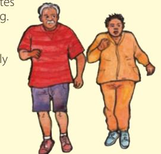

- Check in mirror, when washing, and when lying on back.
- Check skin, under arms, each breast and nipples. Advise to seek care if: painless hard lump in
- breast/under arm, nipple discharge, nipple retraction (pulled in), skin changes (rash, dimpling).
- bread/rice.

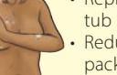

- Replace brick margarine/butter with vegetable oil or soft tub margarine. Remove skin and fat from meat.
- Reduce salty processed foods like gravies, stock cubes, packet soup. Avoid adding salt to food.
- Avoid/use less sugar.

- If woman planning pregnancy:
  - Give folic acid 5mg daily up to 13 weeks gestation. If on anticonvulsants, family history or previous baby with neural tube defect, continue folic acid throughout pregnancy.
- If on valproate, refer to doctor to consider switching medications before patient falls pregnant (risk of birth defects).
- Review the patient's immunisation history and give if needed:

| W he n                                                                                                                                                                                                                                                        | No te                                                                                                                                                                                                                                                                                                                                                                                                                                                                                                                                                                                                  |
|---------------------------------------------------------------------------------------------------------------------------------------------------------------------------------------------------------------------------------------------------------------------|-----------------------------------------------------------------------------------------------------------------------------------------------------------------------------------------------------------------------------------------------------------------------------------------------------------------------------------------------------------------------------------------------------------------------------------------------------------------------------------------------------------------------------------------------------------------------------------------------------------|
| A l l p l ly f hig h r k. at ien ts, ia i is esp ec • f bo de d. I ost er nee •                                                                                                       | Vac C O V I D- ina te ins t se 19. c ag a ve re • h r k: e l de ly, d bet be ( 2 ≥ ), hy hea d ( f n ), hro ki dn d Hig is ia ity B M I 3 0 ion ise H I V i A R Vs T B, c nic ise ert rt ot r es, o s p en s or ase on ey ase • , , hro lun d li ke hm nic ise ( C O P D ), c ast c g ase a, an cer |
| 65 • > y ear s H I V p it ive os • hro hea lun d C nic ise rt o r g ase • f a l ca Pre im ig nt t t g na wo ma n a e o nn ua mp a n • | f lu ly. G ive in ine 0.5 L I M y en za vac c m ear • Av d f H I V p h C D4 i i it ive it 10 0. < o os w •                                                                                                                                                                                                                                                                                                                                                                              |
| f w fac f f I kin in a hea lt h c i lity (m d ica l an d n d ica l st ) or g are e on -m e a                                                                                    | f n for f I ive be ive 3 do he it is B v ine L I M im d iate ly, ks a d 6 m hs. ot at 1m at 4 t g n e, g ses o p acc me we e n on                                                                                                                                                                                                                                                                                                                                              |
| f p I nt reg na                                                                                                                                                                                                                                         | f n lrea dy do f te d d ht he d d r d I ive ive 1 i ( T T ) o ip ia ( T ) v ine 0.5 L I M int in ot tan tox r te tan a g n, g se o us o us, r acc m o a rm an eco r d. ter nit ma y cas e r eco r                                                                                                                                                                                                               |
|                                                                                                                                                                                                                                                                     |                                                                                                                                                                                                                                                                                                                                                                                                                                                                                                                                                                                                           |

**Treat preventively to maintain the patient's general health** 

### **Observe patient for adverse events following vaccination [12](#page-8-0).**

1One drink is 1 tot of spirits, or 1 small glass (125mL) of wine or 1 can/bottle (330mL) of beer. 2BMI = weight (kg) ÷ height (m) ÷ height (m).

**[HIV](#page-102-0) [COVID-19](#page-117-0) [CHRONIC RESPIRATORY DISEASE](#page-119-0) [HEPATITIS B \(HBV\)](#page-116-0) [CARDIOMETABOLIC CONDITIONS](#page-123-0) [MUSCULOSKELETAL DISORDERS](#page-147-0) [MENTAL HEALTH](#page-136-0) [EPILEPSY](#page-145-0) [WOMEN'S HEALTH](#page-150-0) [PALLIATIVE CARE](#page-166-0)**

**11**

14

### **OBSERVATION POST VACCINATION**

- Observe patient for at least 15 minutes after vaccination. If patient known with severe allergies: observe for longer (30 minutes).
- Check for signs or symptoms that may indicate an adverse reaction:

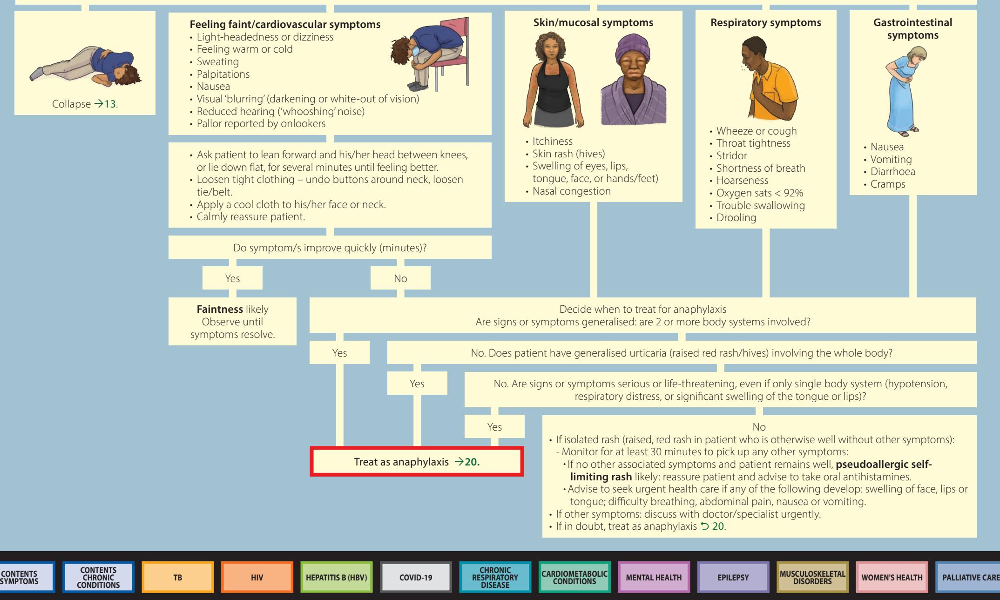

### **COLLAPSE FOLLOWING VACCINATION**

#### Collapse

- Call for help.
- Lie patient on his/her back and raise legs.
- Check response: if unresponsive, check circulation, airway and breathing.
- If no pulse/not breathing, start CPR [14](#page-10-0).
- If breathing and pulse present: assess timing of collapse and duration of loss of consciousness and check breathing, pulse and BP:
- •Collapse occurred suddenly, at the time of injection (before, during or immediately after).
- Loss of consciousness usually lasts 20 seconds to 1 minute and is relieved by lying patient down and raising legs.
- •BP: briefly low but rapidly normal again.
- Pulse may be slow.
- Breathing usually normal but may be rapid, deep (hyperventilation).
- •No other signs or symptoms present.

### **Fainting episode** likely

### **Management:**

- If not already done, lie patient flat and raise legs.
- Loosen any tight clothing: undo buttons around the neck, loosen tie/or tight belt.
- •Apply cool cloth to face/neck.
- Calmly reassure patient explain what happened and assure them that they will be alright.
- Check for any other injuries they may have sustained falling.
- • Stay with the patient until they are fully recovered. Patient should remain lying with legs up until feeling better.

#### **Refer if:**

- Head injury.
- Known with a heart condition or other serious illness.
- Patient has unusual symptoms, such as chest pain, shortness of breath, confusion, blurred vision, or difficulty talking.

### **Report:**

- Report electronically using the Med Safety app or complete NDoH Case Reporting Form (CRF) for Adverse Events Following Immunisation (AEFI) and report to sub-district or district office and provincial EPI manager within 24 hours.
- Replace all medications/equipment used and seal emergency kit.

-  Collapse occurred 5-10 minutes after the injection (could occur up to 1 hour after).
- • Loss of consciousness is not brief and not relieved by lying patient down and raising legs.
- BP < 90/60 and remains low
- Pulse > 120
- Breathing: may have wheeze, stridor, cough
- Other signs and symptoms (like swelling or rash) present.

#### Treat as **anaphylaxis** [20](#page-16-0).

**[TB](#page-85-0)**

**[HIV](#page-102-0) [COVID-19](#page-117-0) [CHRONIC RESPIRATORY DISEASE](#page-119-0) [HEPATITIS B \(HBV\)](#page-116-0) [CARDIOMETABOLIC CONDITIONS](#page-123-0) [MUSCULOSKELETAL DISORDERS](#page-147-0) [MENTAL HEALTH](#page-136-0) [EPILEPSY](#page-145-0) [WOMEN'S HEALTH](#page-150-0) [PALLIATIVE CARE](#page-166-0)**

### **THE EMERGENCY PATIENT**

| ien bre h ing l l t at w e d f d f f ic lty I i u • isy ion sat t , n o ura it h he d a ox y g en d, f re in j I ira tor ure sp • d, tea ton g ue , co le. ox y g en an d fro h t he ies it m w p   | he Do t es p for Ca l l he • l for Fe e ca • he k a C c • G ive bre 1 • he k p Re c c • d m As se ss an an ag e a Br h ing t ea bre h ing at or ox y g en fac k 94 %, ive < g e m as b lue l 9 ip / rat y e < or s ba lve k t t nn ec g va m as o d s low ly de l ive h bre h at r e ac                                        | d t hy l st lat ien ice ica im at t re sp on o v o or p s u No f i lp d a d e l de br i l lat ( A E uto te xte an n a ma rna or d p lse for f 1 ds i im 0 s rot u m ax um o ec on lse fe lt Pu he k bre h C ing at c : Pa ien ing bre h ing t t g t at asp or no lea irw ay r. c h w it h ba lve k a he d t at tta g va m as c o o xy g en lse f n lse C 1  2 inu I P R tes tar t u ev ery m o p u , s irw br h ing irc lat ion d lev l o f c t ay ea , c u an e , C irc lat ion u b l h Est is I V a a cce ss. • f p lse d u b le I 0 a ( B P < 9 0 / 6 0, 5 nst < u n a • de d c iou he in st cre ase on sc sn ess , c p a or he fa lur 2): i ive ine 0. 5m ute art at ac e g rop g l I V. Re 3 m inu t e tes to a t ota p ea ve ry , u p f 3 o | ion ? f i D ) o de br i l lat r or. ds 6 ev ery sec on 15 iou on sc sn es s l o f c Le ve on sc las ( ): As G Co Sc G C S ses s g ow ma ore • Be Be ba st to st v mo r re sp on se er be ds 6 O 5 Or ien tat y s c om ma n l fus 5 Lo ise in 4 Co s to ca p a n e | fe No lse lt o p u r u ns ure 1  Sta C P R rt 15 iou sn es s l re Ey ing sp on se e o p en d 4 Sp tan e on eo us d 3 To ice vo |
|--------------------------------------------------------------------------------------------------------------------------------------------------------------------------------------------------------------------------------------------------------------------------------------------------------------------------------------------------------------------------------------------------------------|-----------------------------------------------------------------------------------------------------------------------------------------------------------------------------------------------------------------------------------------------------------------------------------------------------------------------------------------------------------------------------------------------------------------------------------------------------------------------------------------------------------------------------------------------------------------------------------------------------------------------------------|-------------------------------------------------------------------------------------------------------------------------------------------------------------------------------------------------------------------------------------------------------------------------------------------------------------------------------------------------------------------------------------------------------------------------------------------------------------------------------------------------------------------------------------------------------------------------------------------------------------------------------------------------------------------------------------------------------------------------------------------------------------------------------------------------------------------------------------------------------------------------------------------------------------------------------------------------------------------------------------------------------------------------------------------------------------------------------------------------------------------------------------------------------------------------------------------------------------------------------------------------------------------------------------------------------------------------------------------------------------------------------------------------------------------------------------------------------------------------------------|----------------------------------------------------------------------------------------------------------------------------------------------------------------------------------------------------------------------------------------------------------------------------------------------------------------------------------------------------------------------------------------------------------------------------------------------------------------------------------------------------------------------------------------|------------------------------------------------------------------------------------------------------------------------------------------------------------------------------------------------------------------------------------------------------------|
|                                                                                                                                                                                                                                                                                                                                                                                                              |                                                                                                                                                                                                                                                                                                                                                                                                                                                                                                                                                                                                                                   |                                                                                                                                                                                                                                                                                                                                                                                                                                                                                                                                                                                                                                                                                                                                                                                                                                                                                                                                                                                                                                                                                                                                                                                                                                                                                                                                                                                                                                                                                     |                                                                                                                                                                                                                                                                                                                                                                                                                                                                                                                                        |                                                                                                                                                                                                                                                            |
|                                                                                                                                                                                                                                                                                                                                                                                                              |                                                                                                                                                                                                                                                                                                                                                                                                                                                                                                                                                                                                                                   |                                                                                                                                                                                                                                                                                                                                                                                                                                                                                                                                                                                                                                                                                                                                                                                                                                                                                                                                                                                                                                                                                                                                                                                                                                                                                                                                                                                                                                                                                     |                                                                                                                                                                                                                                                                                                                                                                                                                                                                                                                                        |                                                                                                                                                                                                                                                            |
|                                                                                                                                                                                                                                                                                                                                                                                                              |                                                                                                                                                                                                                                                                                                                                                                                                                                                                                                                                                                                                                                   |                                                                                                                                                                                                                                                                                                                                                                                                                                                                                                                                                                                                                                                                                                                                                                                                                                                                                                                                                                                                                                                                                                                                                                                                                                                                                                                                                                                                                                                                                     |                                                                                                                                                                                                                                                                                                                                                                                                                                                                                                                                        |                                                                                                                                                                                                                                                            |
|                                                                                                                                                                                                                                                                                                                                                                                                              |                                                                                                                                                                                                                                                                                                                                                                                                                                                                                                                                                                                                                                   |                                                                                                                                                                                                                                                                                                                                                                                                                                                                                                                                                                                                                                                                                                                                                                                                                                                                                                                                                                                                                                                                                                                                                                                                                                                                                                                                                                                                                                                                                     |                                                                                                                                                                                                                                                                                                                                                                                                                                                                                                                                        |                                                                                                                                                                                                                                                            |
|                                                                                                                                                                                                                                                                                                                                                                                                              |                                                                                                                                                                                                                                                                                                                                                                                                                                                                                                                                                                                                                                   |                                                                                                                                                                                                                                                                                                                                                                                                                                                                                                                                                                                                                                                                                                                                                                                                                                                                                                                                                                                                                                                                                                                                                                                                                                                                                                                                                                                                                                                                                     |                                                                                                                                                                                                                                                                                                                                                                                                                                                                                                                                        |                                                                                                                                                                                                                                                            |
|                                                                                                                                                                                                                                                                                                                                                                                                              |                                                                                                                                                                                                                                                                                                                                                                                                                                                                                                                                                                                                                                   |                                                                                                                                                                                                                                                                                                                                                                                                                                                                                                                                                                                                                                                                                                                                                                                                                                                                                                                                                                                                                                                                                                                                                                                                                                                                                                                                                                                                                                                                                     |                                                                                                                                                                                                                                                                                                                                                                                                                                                                                                                                        |                                                                                                                                                                                                                                                            |
|                                                                                                                                                                                                                                                                                                                                                                                                              |                                                                                                                                                                                                                                                                                                                                                                                                                                                                                                                                                                                                                                   |                                                                                                                                                                                                                                                                                                                                                                                                                                                                                                                                                                                                                                                                                                                                                                                                                                                                                                                                                                                                                                                                                                                                                                                                                                                                                                                                                                                                                                                                                     |                                                                                                                                                                                                                                                                                                                                                                                                                                                                                                                                        |                                                                                                                                                                                                                                                            |
|                                                                                                                                                                                                                                                                                                                                                                                                              |                                                                                                                                                                                                                                                                                                                                                                                                                                                                                                                                                                                                                                   |                                                                                                                                                                                                                                                                                                                                                                                                                                                                                                                                                                                                                                                                                                                                                                                                                                                                                                                                                                                                                                                                                                                                                                                                                                                                                                                                                                                                                                                                                     |                                                                                                                                                                                                                                                                                                                                                                                                                                                                                                                                        |                                                                                                                                                                                                                                                            |
| f lu ds ba i Int i te u • f f ic d i lty ert u b < 9 4% ay or f s d de I ag s o r n u • d / te t res on an irw in 1 ay p a on ot p ne um Ins lar ert o - h o d-c in i ro- or m irw Ar ay ran g - | ien at t. f u ba lve k a d s l l ing i t s g va m as n bre h ing ion at tur at , o xy g en sa lue l /to ip s ng ue bre h les at sn ess , m ore d bre h s ds / at cre ase ou n de de d t he ion i iat a: t v e rac en s , l ke ly i rax : bo la a bo 3r d r i b g e re ca nn u ve lar l icu ine he be t c st t rg en u | mg f lse he I B P < 9 0 / 6 0, 10 0 o ≥ p u r av y • b lee d d h lor de ing ive ium i 0. 9 % , g so c L I V r i d ly, i l sy l ic B P > 1 t u nt sto ap rep ea f kn he b lem 9 0. I art ow n p ro or se ve re fec d, d s d in ion ive ins ium t te tea su sp ec g o h lor i de L I V o inu 0. 9 % 5 0 0m r 3 0 m tes c ve , l sy l Co i ic B P > 9 0. inu e 1 L t u nt sto nt rep ea ho ly. f bre h 6 Sto i ing at ur p ors en s. w Sto b lee d ing ly d p : a p p p res su re an • lev l b. f b lee d l l se im I ing i ate st e ve re, ly bo iq in j to t a ap p urn ue ve ury                                                                                                                                                                                                                                                                                                    | h dra fro W it in 3 Ina 4 ws m p a p p rop ds f le 3 A bn l ion to wo r orm a x in 2 Inc p a om p ds ds 2 Ext in to so un en p a 1 No 1 No ne ne d d s le A ive ing to co res g a s sco re ou • f I G C S ≤ int ba ien 8, te at t. u p -                                   | iat 2 To in r e p a No 1 ne he i b le re ns f 1 5: t o                                                                                                                                            |
| fer ly t e ur g en : inu ort nt e t p , co o a sse ss lac iou it ing sn ess or vo m , p ha d f it  f de ing / j 19, i ust an ag                                                                                                                                                  | d m irw bre h ing at an ag e a ay, le ft lat l ly (re ) p in ing era co ve ry d c  f bu iou 16, i ase on sc sne ss                                                                                                                                                                                                                                                                                                                                                                                                         | irc lat ion d lev l o f c iou u an e on sc sn ess it ion os 2 f b 2 f fev 2 f ra h i ite /st ing 2, i i 1, 4, er s                                                                                                                                                                                                                                                                                                                                                                                                                                                                                                                                                                                                                                                                                                                                                                                                                                                                                                                                                                                                                                                                                                                                                                                                                                                | f a hy lax 2 i is 0. 7, na p                                                                                                                                                                                                                                                                                                                                                                                                                                                                               |                                                                                                                                                                                                                                                            |
|                                                                                                                                                                                                                                                                                                                                                                                                              |                                                                                                                                                                                                                                                                                                                                                                                                                                                                                                                                                                                                                                   | de s ho lav e u an e cre to e a s o n s y mp m p ag e.                                                                                                                                                                                                                                                                                                                                                                                                                                                                                                                                                                                                                                                                                                                                                                                                                                                                                                                                                                                                                                                                                                                                                                                                                                                                                                                                                                           | , c rns                                                                                                                                                                                                                                                                                                                                                                                                                                                                                                                             | 6                                                                                                                                                                                                                                                         |

# **CARDIOPULMONARY RESUSCITATION (CPR)**

|                                                                                                                                                                                                                                                                                                                                                                                                                                                                                                                                                                                                                                                                                                                                                                                                                                                                                                             | he ien it h n In t at t w p                                                                                                                                                                                                                                                                                                                                                                                                   | lse d t he im d s t o p , re co r e a n u                                                                                                                                                                                                                                                                                                                                                                                                                                            | he ion tar t c st co mp res s s:                                                                                                                                                                                                                                                                                                                                                                                                                                                                                                                                              |                                                                                                                                                                                                                                                                                                                                                             |                                                                                |
|-------------------------------------------------------------------------------------------------------------------------------------------------------------------------------------------------------------------------------------------------------------------------------------------------------------------------------------------------------------------------------------------------------------------------------------------------------------------------------------------------------------------------------------------------------------------------------------------------------------------------------------------------------------------------------------------------------------------------------------------------------------------------------------------------------------------------------------------------------------------------------------------------------------|-------------------------------------------------------------------------------------------------------------------------------------------------------------------------------------------------------------------------------------------------------------------------------------------------------------------------------------------------------------------------------------------------------------------------------------------------------|--------------------------------------------------------------------------------------------------------------------------------------------------------------------------------------------------------------------------------------------------------------------------------------------------------------------------------------------------------------------------------------------------------------------------------------------------------------------------------------------------------------------------|----------------------------------------------------------------------------------------------------------------------------------------------------------------------------------------------------------------------------------------------------------------------------------------------------------------------------------------------------------------------------------------------------------------------------------------------------------------------------------------------------------------------------------------------------------------------------------------------------------|-------------------------------------------------------------------------------------------------------------------------------------------------------------------------------------------------------------------------------------------------------------------------------------------------------------------------------------------------------------|--------------------------------------------------------------------------------|
| les G ive inu nt co ou s c y c • h m de f i br At ito / tac on r •                                                                                                                                                                                                                                                                                                                                                                                                                                                                                                                                                                                                                                                                                                                                                                        | f 3 he 0 c ion st o co mp res s l lat d p i or an au se co mp res s                                                                                                                                                                                                                                                                                                                    | d bre hs h ba lve 2 it at s a n w g- va -m he k l he hy hm ion in it ia s t art t o c c r                                                                                                                                                                                                                                                                                                                                      | k a he d t o 1 0 0 % tta at as c ox y g en :                                                                                                                                                                                                                                                                                                                                                                                                                                                                                                                | 10 -15 L /m in.                                                                                                                                                                                                                                                                                                                                 |                                                                                |
| f i Ve icu lar br i l lat ion ( V F ) ntr ho k o f 1 G ive 20 s c f m ha de f i br l lat I ic i ive on op s or, g                                                                                                                                                                                                                                                                                                                                                                                                                                                                                                                                                                                                                                                                      | hy d ia (p V T ) ca r                                                                                                                                                                                                                                                                                                                                                                                                         | As le sto y                                                                                                                                                                                                                                                                                                                                                                                                                                                                                                     | An he ot y lse les lec ica Pu tr s e                                                                                                                                                                                                                                                                                                                                                                                                                                                                                                                                       | hy hm t r r : l a iv ity ( ) P E A ct                                                                                                                                                                                                                                                                                |                                                                                |
|                                                                                                                                                                                                                                                                                                                                                                                                                                                                                                                                                                                                                                                                                                                                                                                                                                                                                                             | d ly Im iat me e res • fte A r 2 inu tes m o •                                                                                                                                                                                                                                                                                                                                                           | h c C P R, ing it tar t sta rt w om p res s f C P R, ion p au se co mp res s s a n                                                                                                                                                                                                                                                                                                                                                   | ion s. d r he k he hy hm art t ec c r :                                                                                                                                                                                                                                                                                                                                                                                                                                                                                                                           |                                                                                                                                                                                                                                                                                                                                                             |                                                                                |
| V F                                                                                                                                                                                                                                                                                                                                                                                                                                                                                                                                                                                                                                                                                                                                                                                                                                                                                                      | V T p                                                                                                                                                                                                                                                                                                                                                                                                                                           | le As sto y                                                                                                                                                                                                                                                                                                                                                                                                                                                                                                     |                                                                                                                                                                                                                                                                                                                                                                                                                                                                                                                                                                                                          | he hy hm Ot t r r                                                                                                                                                                                                                                                                                                                            |                                                                                |
| G ive ho k o f 1 J ( inc j les it h e 20 -15 0 s c rea se ou w                                                                                                                                                                                                                                                                                                                                                                                                                                                                                                                                                                                                                                                                                                                                                                                  | h s ho k g ive ). ac c n                                                                                                                                                                                                                                                                                                                                                                                                         |                                                                                                                                                                                                                                                                                                                                                                                                                                                                                                                          | Fe l for e ca                                                                                                                                                                                                                                                                                                                                                                                                                                                                                                                                                                                | i d p lse for rot to 10 u up se co n                                                                                                                                                                                                                                                                                       | ds                                                                             |
| f m ha de f i br l lat d s I ic i ive ins tea on op s or, g                                                                                                                                                                                                                                                                                                                                                                                                                                                                                                                                                                                                                                                                                                                                                                                        | ho k o f 3 6 0 J. c                                                                                                                                                                                                                                                                                                                                                                                                                 |                                                                                                                                                                                                                                                                                                                                                                                                                                                                                                                          | lse fe lt No p u                                                                                                                                                                                                                                                                                                                                                                                                                                                                                                                                                                          | Un su re                                                                                                                                                                                                                                                                                                                                              | lse fe lt Pu                                                          |
|                                                                                                                                                                                                                                                                                                                                                                                                                                                                                                                                                                                                                                                                                                                                                                                                                                                                                                             |                                                                                                                                                                                                                                                                                                                                                                                                                                                       |                                                                                                                                                                                                                                                                                                                                                                                                                                                                                                                          | P                                                                                                                                                                                                                                                                                                                                                                                                                                                                                                                                                                                                        | E A                                                                                                                                                                                                                                                                                                                                                      | Sto C P R p d c he k an c                           |
| Im d iat ly C P R, ing it h c tar t sta rt me e res w • dre l 1 1 ( lut ) G ive ine L 1:1 0 0 0 s ion a na m o • fte f A 2 m inu C P R, tes r e ve ry o p au se co •                                                                                                                                                                                                                                                                                                                                                                                                                                                                                                                                                                | ion om p res s s. fo l low d by I V, 5m L s i ter e he k he ion mp res s s, r ec c                                                                                                                                                                                                                                                                                   | le w d h lor de ium i 0. 9 %. ate r o r so c hy hm d m bo art t r an an ag e a s a ve                                                                                                                                                                                                                                                                                                                                                      | dre l les Re ine 2 t a p ea na ev ery cy c                                                                                                                                                                                                                                                                                                                                                                                                                                                                                                                        | (ev ). 3- 5 m inu tes ery                                                                                                                                                                                                                                                                                                                 | bre h ing at  14                                               |
| f fte d s ho k, g da I V F o V T: r 3 ive io 3 r p a r am ron e c • f fte I V F o V T p ist ho k o t s r p ers s a r n ex c r re cu rs, - de ba f ba d, Do i int ion I int ive cto r to t te co ns r u u g • k for d m b le Lo i o an an ag e p os s ca use : • f tr I d iar ho /vo it ing de hy dra ion t au ma r ea m or - ,  f g luc b le t f te I 3 17 I e < os or un a o m ea su re - f m de d bre h s ds I / nt at ore re so na cre ase ou n on - | h i le W fo l low d by 0 0m I V, 10 g e m fur ive he io da t e 1 g r a m ron bre h e ds 1 6 s at ve ry ec on ive d ium h lor i de 0. 9 % , g so c  °C f o ≤ 3 5 16 I tu mp era re de de d t he 1 i iat s or e rac a, v | iv ing inu C P R: nt g co ou s d h lor de L s ium i 0. 9 %. o c I V. 5 0m g d c he inu t st an on ou s c co mp res s f n L I V r i d ly. Re i de d. 1 t ap p ea ee do /p d iso ing isc it ve r se o n us s w , ho l ke ly ion i ten ot s p ne um rax : | ion s. f u I d isc it h do cto ns ure us s w r. , h s l loc l p he lp l ia ist iso p ec or a o n lar bo la a bo ins 3r ert g e re ca nn ve u                                                                                                                                                                                                                                                                                                                      |  ine 17 8. d r b d-c lav lar l i in i icu ine m                                                                                                                                                                                                                                                               |                                                                                |
| i de he C De P R: n t to c w o s p f n lse fte f c I r 3 0 m inu inu C tes t o p a o on ou s u • f o I ing V F /p V T, ≤ 3 °C tem tu 5 ng o p era re or - C P R a d d /tr fer inu isc nt t co e n us s an s ur g en f n f a bo d p de I C P R a top on e o ve , s n ron ou nc e - be l l for fam ly. ing i nt rea ve me co un se                                                                                                                                                                                                                                        | P R: do /p iso ing ov er se o n , ly. d. Ar a ran g e                                                                                                                                                                                                                                                                                                                                           | En ien is at t su re p • lac he l o f o P e e ne • h do k Pu ic s wn q u • A l low he st to ret c • Do int t t c no err up • h c l lea Sw it op w o g •                                                                                                                                                                                                | Ho ive he to st w g c co ly f irm fac f o be d, ing I on su r e. n use ha d o low ha l f o f st lac P n ve r er ern um ly, ha d de h o f 5 d fas ( -6c ) a t t r p m n l s ha be to tw urn no rm a p e ee n c om les ion iv ing i nt om p res s s u n s g ve d fat 2 inu i ig tes to ue ev ery m av o | ion mp res s s ba k bo d o ien at c ar r m ov e p he l o f se d ha d o n t e e co n n op ( 10 0-1 20 inu ). te p er m ion p res s s. lat he k he hy ion ing art t s o r c c r ue | f lo t o nto or. f f irs ha d. t o n hm |
| alin e is als o k ine hrin ren now n a s e p p e.                                                                                                                                                                                                                                                                                                                                                                                                                                                                                                                                                                                                                                                                                                                                                                                                                       |                                                                                                                                                                                                                                                                                                                                                                                                                                                       |                                                                                                                                                                                                                                                                                                                                                                                                                                                                                                                          |                                                                                                                                                                                                                                                                                                                                                                                                                                                                                                                                                                                                          |                                                                                                                                                                                                                                                                                                                                                             |                                                                                |
| CON TS CHR TEN TS SYM TEN IC CON ON TB HIV MS DIT ION S EME RGE NCI ES                                                                                                                                                                                                                                                                                                                                                                                                                                                                                                                                                                                                                                                                                                                                                                                      | HEP ATI TIS B (H BV)                                                                                                                                                                                                                                                                                                                                                                                                                      | IC RES CHR ON CAR COV ID-1 9 RY DIS PIR ATO EAS E                                                                                                                                                                                                                                                                                                                                                                                                                                       | LIC CON DIO ABO MET MEN TAL HE ALT H DIT ION S                                                                                                                                                                                                                                                                                                                                                                                                                                                                                                                          | SCU LOS MU L DIS KEL ETA EPI LEP SY ORD ERS                                                                                                                                                                                                                                                                                   | WO MEN 'S H EAL TH PAL LIAT                                  |

### **DECREASED CONSCIOUSNESS**

#### **Give urgent attention to the patient with decreased consciousness:**

- First assess and manage airway, breathing, circulation and level of consciousness [14](#page-10-0).
- •Identify all injuries and look for cause: undress patient and assess front and back. If injured, use log-roll to turn. Then cover and keep warm.
- •If fits, injuries or burns, also manage on symptom pages.
- If sudden decreased consciousness and any of: generalised itch/rash, face/tongue swelling, wheeze, difficulty breathing, abdominal pain, vomiting or exposure to possible allergen1, check for anaphylaxis [20](#page-16-0).
- •Check glucose, temperature and pupils:

| luc G os e                                                                                                                                                                                                                                                                                                                                                                                                                                                                                                                                                                                                                                                          |                                                                                                                                                                                                                                                                                                                                                                                                                                                                                                                                                                                                                           | Te tu mp era re                                                                                                                                                                                                                                                                                                                                                                                                                                   |                                                                                                                                                                                                                                                                                                                                                                                                                                                                                                                                                                                                                                                                                                                                                                                                                                                                                                                                                                                                                                                                                                                                                                                                                                                                                                                                                                                                                                                                                                                                                                                                                                                                                                   | ls Pu i p                                                                                                                                                                                                                                                                                                                                                                                                                                                                                                                                                                                                                                                                                                                                                                                                                                                                                                                                                                                                                                                                                            |                                                                                                                                                                                                                                                                                                                                                                                                                                                                                                                                                                                                                                                                                                                                                                                                                                                                                                                                                                                                                                                                                                                                                                                                                                                                                                                                                                                                                                                                                                                                                 |                                                                                                                                                                             |                                                                                                                                                                                                                                                                                                                                             |
|------------------------------------------------------------------------------------------------------------------------------------------------------------------------------------------------------------------------------------------------------------------------------------------------------------------------------------------------------------------------------------------------------------------------------------------------------------------------------------------------------------------------------------------------------------------------------------------------------------------------------------------------------------------------------|---------------------------------------------------------------------------------------------------------------------------------------------------------------------------------------------------------------------------------------------------------------------------------------------------------------------------------------------------------------------------------------------------------------------------------------------------------------------------------------------------------------------------------------------------------------------------------------------------------------------------|---------------------------------------------------------------------------------------------------------------------------------------------------------------------------------------------------------------------------------------------------------------------------------------------------------------------------------------------------------------------------------------------------------------------------------------------------------------|---------------------------------------------------------------------------------------------------------------------------------------------------------------------------------------------------------------------------------------------------------------------------------------------------------------------------------------------------------------------------------------------------------------------------------------------------------------------------------------------------------------------------------------------------------------------------------------------------------------------------------------------------------------------------------------------------------------------------------------------------------------------------------------------------------------------------------------------------------------------------------------------------------------------------------------------------------------------------------------------------------------------------------------------------------------------------------------------------------------------------------------------------------------------------------------------------------------------------------------------------------------------------------------------------------------------------------------------------------------------------------------------------------------------------------------------------------------------------------------------------------------------------------------------------------------------------------------------------------------------------------------------------------------------------------------------------|---------------------------------------------------------------------------------------------------------------------------------------------------------------------------------------------------------------------------------------------------------------------------------------------------------------------------------------------------------------------------------------------------------------------------------------------------------------------------------------------------------------------------------------------------------------------------------------------------------------------------------------------------------------------------------------------------------------------------------------------------------------------------------------------------------------------------------------------------------------------------------------------------------------------------------------------------------------------------------------------------------------------------------------------------------------------------------------------------------------|-------------------------------------------------------------------------------------------------------------------------------------------------------------------------------------------------------------------------------------------------------------------------------------------------------------------------------------------------------------------------------------------------------------------------------------------------------------------------------------------------------------------------------------------------------------------------------------------------------------------------------------------------------------------------------------------------------------------------------------------------------------------------------------------------------------------------------------------------------------------------------------------------------------------------------------------------------------------------------------------------------------------------------------------------------------------------------------------------------------------------------------------------------------------------------------------------------------------------------------------------------------------------------------------------------------------------------------------------------------------------------------------------------------------------------------------------------------------------------------------------------------------------------------------------|-----------------------------------------------------------------------------------------------------------------------------------------------------------------------------|---------------------------------------------------------------------------------------------------------------------------------------------------------------------------------------------------------------------------------------------------------------------------------------------------------------------------------------------|
|                                                                                                                                                                                                                                                                                                                                                                                                                                                                                                                                                                                                                                                                              |                                                                                                                                                                                                                                                                                                                                                                                                                                                                                                                                                                                                                           |                                                                                                                                                                                                                                                                                                                                                                                                                                                               |                                                                                                                                                                                                                                                                                                                                                                                                                                                                                                                                                                                                                                                                                                                                                                                                                                                                                                                                                                                                                                                                                                                                                                                                                                                                                                                                                                                                                                                                                                                                                                                                                                                                                                   |                                                                                                                                                                                                                                                                                                                                                                                                                                                                                                                                                                                                                                                                                                                                                                                                                                                                                                                                                                                                                                                                                                               |                                                                                                                                                                                                                                                                                                                                                                                                                                                                                                                                                                                                                                                                                                                                                                                                                                                                                                                                                                                                                                                                                                                                                                                                                                                                                                                                                                                                                                                                                                                                                 |                                                                                                                                                                             |                                                                                                                                                                                                                                                                                                                                             |
| b le < 3 or un a                                                                                                                                                                                                                                                                                                                                                                                                                                                                                                                                                                                                                                              | ≥ 1 1.1                                                                                                                                                                                                                                                                                                                                                                                                                                                                                                                                                                                                                | ≤ 3 5 °C                                                                                                                                                                                                                                                                                                                                                                                                                                                | ≥ 3 8 °C                                                                                                                                                                                                                                                                                                                                                                                                                                                                                                                                                                                                                                                                                                                                                                                                                                                                                                                                                                                                                                                                                                                                                                                                                                                                                                                                                                                                                                                                                                                                                                                                                                                                                    |                                                                                                                                                                                                                                                                                                                                                                                                                                                                                                                                                                                                                                                                                                                                                                                                                                                                                                                                                                                                                                                                                                               | P inp int o                                                                                                                                                                                                                                                                                                                                                                                                                                                                                                                                                                                                                                                                                                                                                                                                                                                                                                                                                                                                                                                                                                                                                                                                                                                                                                                                                                                                                                                                                                                            | h Bo t                                                                                                                                                                | l Un eq ua                                                                                                                                                                                                                                                                                                                         |
| to me as ure                                                                                                                                                                                                                                                                                                                                                                                                                                                                                                                                                                                                                                                        |                                                                                                                                                                                                                                                                                                                                                                                                                                                                                                                                                                                                                           |                                                                                                                                                                                                                                                                                                                                                                                                                                                               |                                                                                                                                                                                                                                                                                                                                                                                                                                                                                                                                                                                                                                                                                                                                                                                                                                                                                                                                                                                                                                                                                                                                                                                                                                                                                                                                                                                                                                                                                                                                                                                                                                                                                                   |                                                                                                                                                                                                                                                                                                                                                                                                                                                                                                                                                                                                                                                                                                                                                                                                                                                                                                                                                                                                                                                                                                               |                                                                                                                                                                                                                                                                                                                                                                                                                                                                                                                                                                                                                                                                                                                                                                                                                                                                                                                                                                                                                                                                                                                                                                                                                                                                                                                                                                                                                                                                                                                                                 | l ly eq ua                                                                                                                                                         | d or res p on                                                                                                                                                                                                                                                                                                                   |
| G ive de xtr os e • 2 5 kg 10 % L / I V. m f kn lco ho l I ow n a ive use r, g h iam ine 10 0m t g be for I M / I V e de xtr os e. he k g luc Re c c os e • fte r 1 5 m inu tes a : f st i i l l < ive 3, g fur he de t xtr r os e 2 2 kg 10 % L / I V. m On luc ce g os e • ≥ 3 inu nt , co e de e 5 % xtr os L I V 6 ho ly. 1 ur | d G ive ium so • h lor i de 0. 9 % c kg 15 -20 L / m he I V o r t ve f irs ho t ur, he n 1 0m L / t kg ho / ur fte he t rea r. Sto f i p • bre h ing at wo rse ns f kn I ow n • d be d ia tes an fer l de lay re ra ho > 2 urs : ho ive rt g s ing ins l in t ac u / kg 0.1 it un (no ) 3. I M I V t | l d Re / mo ve co • lot h ing t c we d c an ov er h w it w arm b lan ket s. Wa I V rm • f lu ds i 40 °C to (av i d c l d o o f lu ds ). i f n I o • res p on se or tem tu p era re ≤ 3 2 °C, lso a us e a ing wa rm de ice v | ftr 4/ G ive iax 2g I V I M to ce on e • for i b le ing it is. co ve r p os s me n d Av i in j ing 1g I M t at > o ec on e in j ion ite t ec s f p I ien in lar ia a at t w as ma rea • d m lar 5 p lso ia t it ive est an a os , a kg ive 2. 4m / I M. tes ate g ar un g fy. fer No i Re ly it h in t t ur g en w ho Re d a 6 rte te urs co r su na do fer l let in ter se re ra f a la b le, I i rte te su na un av a - ive in ine d i lut in ine g q u : e q u kg de 20 / in e 5 % xtr mg os kg low 0m L / G ive I V 5-1 as s in fus ion ho I f I V 4 ov er urs b le, 6 i ive in 2 I M t p no os s g do d lut d d i in ium ses e so h lor i de 0. 9 %. c f te °C I > 4 0 tu mp era re : • lot h Re ing mo ve c - fan Us d w ate to e an r s p ray - l p ien at t. co o ly ks l lae Ap ice i to p -p ac ax - , in d n k. g ro an ec | l leg l dr d I /o a ug us e a n r ira to rat 12 e < res p ry Op io i d o do l ke ly i ve r se fac k G ive 10 0 % e m as • ox y g en G lox ive 0.4 na on e mg • 7 im d ly. I V / I M iat me e Re ass ess ev ery • f 2 m inu i tes : ira 12 tor rat res p e < y , ive inc ing do g rea s ses lox ( 0. 8m 2m na on e g, g, ) e 4m 2 m inu tes g ve ry , l o f 1 0m to a t ota up g. Na lox f f on e w ea rs o k ly, ic ito q u mo n r los ly d g ive c e an fur f he do lat i t r ses er de d. ne e f n do I o r es p on se or ov er d h s isc it us s w p | Exc ive ion t ess se cre s o r le t itc h ing mu sc w Or ho ha iso ing te g an op sp p o n l ke ly i G ive ine I V at 2m rop g • d ly. im iat me e f n Re 5 inu i tes ass ess ev ery m o : • (s i l l ha ive t res p on se s e xce ss ly low B P ion iste ret nt sec s, p ers lse ), g d do ive te or p re p ea ses u f a ine inu tro 5 tes o p ev ery m , do b l ing he do h t im t u se ea c e: f so 4m 8m 16 3 2m I g, g, mg g. me , he ive t res p on se, g sa me or du d do Co inu i l nt nt re ce se. e u l le d. ion ret tro sec s c on fte Su ion ion ct t se cre s o n. • We P P E - fu l ly ar ca re rem ov e • d c lot he d ina nta te co m s a n h s k in. wa s /p h o he kn iso ing it t se o n w r o r u n ow l loc l p he lp l  ia ist iso ine 17 ec or a o n | d i lat d e im lan St t u he ot or r dr ug do ov er se l ke ly i bst n s u an ce, 8. | ly to p oo r l ht: ig Ra ise • he d by a de 3 0 g ree s. f d, I in j ure • ke bo dy ep ht d ig str a an lt t i ise t o r a he d (av i d a o be d ing n ine ). sp |

•Refer urgently.

•While awaiting transport:

**CONTENTS SYMPTOMSCONTENTS CHRONIC CONDITIONS**

**[TB](#page-85-0)**

Check BP, pulse, respiratory rate, oxygen saturation and GCS every 15 minutes. Insert urinary catheter.

**[HEPATITIS B \(HBV\)](#page-116-0) [COVID-19](#page-117-0)**

If BP < 90/60, pulse > 100 or < 50, respiratory rate > 20 or < 9, oxygen saturation < 94% or drop in GCS, reassess and manage airway, breathing, circulation and level of consciousness [14](#page-10-0).

1Common allergens include medication, food or insect bite/sting within the past few hours. 2If dextrose 10% unavailable: mix 1 part dextrose 50% to 4 parts water for injection to make dextrose 10% solution. 3Avoid IV insulin as it may cause low potassium and heart dysrhythmia. Avoid using an insulin needle to give IM insulin. 4Do not mix Ringer's lactate and IV ceftriaxone. Flush IV line with sodium chloride 0.9% before and after IV ceftriaxone. 5Test for malaria with rapid diagnostic test if available, and parasite slide microscopy. 6To give IM quinine: first calculate volume of sodium chloride 0.9% in mL: weight x 20 ÷ 100. Then add this volume of sodium chloride 0.9% to quinine 20mg/kg and inject half the volume into each thigh. 7Give naloxone IM only if IV not possible.

**[HIV](#page-102-0) [CHRONIC RESPIRATORY DISEASE](#page-119-0) [CARDIOMETABOLIC CONDITIONS](#page-123-0) [MUSCULOSKELETAL DISORDERS](#page-147-0) [MENTAL HEALTH](#page-136-0) [EPILEPSY](#page-145-0) [WOMEN'S HEALTH](#page-150-0) [PALLIATIVE CARE](#page-166-0)**

### **ASSESS AND MANAGE GLUCOSE**

If known diabetes [130](#page-126-0).

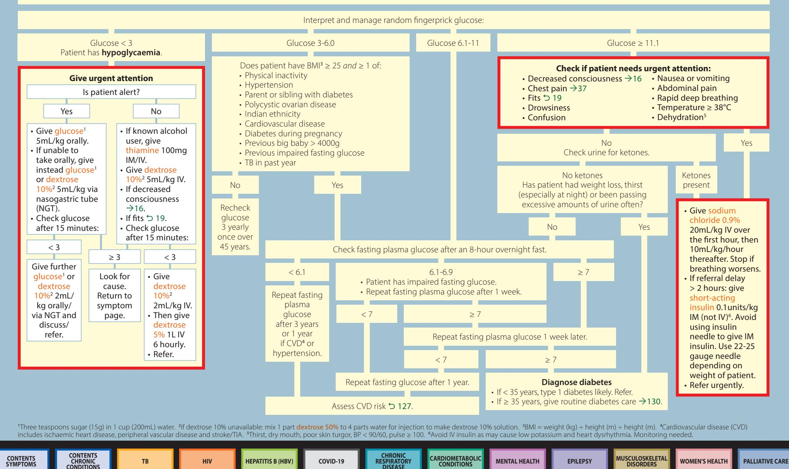

## **THE INJURED PATIENT**

#### **Give urgent attention to the injured patient:**

First assess and manage airway, breathing, circulation and level of consciousness [14](#page-10-0).

•Identify all injuries and look for cause: undress patient and assess front and back. If head or spine injury, use log-roll to turn. Then cover and keep warm.

| d Bru is ing an b loo d in ine ur d G ive ium so h lor i de 0. 9 % c | d a d a f: Wo un n ny o Po fus ion (co l d, le, or p er p a • b, lse ) be low in j nu m no p u ury lsa le b lee d Exc ive i ing t ess or p u • Pe ing d t he d / tra t ne w ou n o a • | d a f: Fra ctu re an ny o fus l d, le, b, k b be low Po ion (co We /n or p er p a nu m a um • • lse ) be low fra fra ctu ctu no p u re re le t htn fra Inc ing in, ig Op ctu rea s p a m usc ess en re • • , bn l b b fra in im 2 i ctu nu m ess > r res • | d d a f: He in j a ury an ny o los f c loo d o lea f lu d lea k An iou B i ing y s o on sc sn ess r c r • • Se izu / f it fro re m no se or ea r • he da he ls u l o d Se Pu i ve re a c p ne q ua r re sp on • • ly l ht Am ia ig to ne s p oo r • |  |  |
|-------------------------------------------------------------------------------------------------------------------------------------------|-------------------------------------------------------------------------------------------------------------------------------------------------------------------------------------------------------------------------------------------------------------------------------------------------------------------------------------------------------------------------------------|---------------------------------------------------------------------------------------------------------------------------------------------------------------------------------------------------------------------------------------------------------------------------------------------------------------------------------------------------------------------------------------------------------------------------------------------------------------------------------------------------------------------|-----------------------------------------------------------------------------------------------------------------------------------------------------------------------------------------------------------------------------------------------------------------------------------------------------------------------------------------------------------------------------------------------------------------------------------------------------------------------------------------------------------------|--|--|
| ho ly 1 L I V ur for ho 2 urs ,                                                                          | k he b do /c /a st ne c me n                                                                                                                                                                                                                                                                                                                          | fem for Su d lv is o ine Se de ity te sp ec ur, p e r s p ve re m • • fra ctu re                                                                                                                                                                                                                                                                                                                                                         | fra Su d s ku l l We k /n b l im b /s te ctu sp ec re a um • • d e Bru is ing Vo it ing 2 t im ≥ ar ou n y es or m es • •                                                                                                                                                                                                                                                         |  |  |
| he L t n 5 0 0m                                                                                                            | I f B P < / ive d ium 9 0 6 0, g so •                                                                                                                                                                                                                                                                                                        |                                                                                                                                                                                                                                                                                                                                                                                                                                                                                                                     | be h d e he in 1 in j ot ars ≥ r ury •                                                                                                                                                                                                                                                                                                                                                                                                                                   |  |  |
| ho ly. for A im ur                                                                                                         | h lor de d ly, i 0. 9 % 1 L I V r i t c ap rep ea                                                                                                                                                                                                                                                                             | f p I in ive h ine I M low I V 1. 10 3-1 0m a sev ere , g m orp mg or g s •                                                                                                                                                                                                                                                                                                                                                              | B loo d be h in d e dr Dr lco ho l int ica ion t ar um ug or a ox • •                                                                                                                                                                                                                                                                                                                                                                      |  |  |
| ine tp ut ur ou                                                                                                               | l sy l i ic B P > 9 0. Co inu t sto nt un e                                                                                                                                                                                                                                                                                               | d f s he d Av i i in j o ev ere a ury                                                                                                                                                                                                                                                                                                                                                                                                                                        |                                                                                                                                                                                                                                                                                                                                                                                                                                                                                                                 |  |  |
| L / ho > 2 0 0m ur.                                                                                                     | f L 6 ho ly. Sto i bre h ing 1 at ur p                                                                                                                                                                                                                                                                                                          | f p fus kn bn be low fra I ion /n ctu oo r p er ea ess um ess re: , w •                                                                                                                                                                                                                                                                                                                                                                                 | f k de k b l b o bn l I G C S < 15 /sp ine /n im te , n ec n rne ss, ea um r a orm a w •                                                                                                                                                                                                                                                                                                                              |  |  |
| Sto f i p                                                                                                                        | wo rse ns.                                                                                                                                                                                                                                                                                                                                                                    | ly l ig int l p it ion i ls, ly ig i d n k c l lar d s d ba / b loc ks t g en re- a n o n orm a os p up ap p r ec o an an g s                                                                                                                                                                                                                                                      |                                                                                                                                                                                                                                                                                                                                                                                                                                                                                                                 |  |  |
| bre h ing at                                                                                                                     | f e lsa le I ive i t xc ess or p u •                                                                                                                                                                                                                                                                                                            | f o fra for l, h f he d. I ig ia irr ig it ctu ate ate p en re: re mo ve e n m r w o a •                                                                                                                                                                                                                                                                                                                                     |                                                                                                                                                                                                                                                                                                                                                                                                                                                                                                                 |  |  |
| wo rse ns                                                                                                                           | b lee d ing ly d ire ct , a p p p res su re                                                                                                                                                                                                                                                                                               | d h lor de d c h s l ke d g ium i 0. 9 % it ine so c an ov er a -so a au ze w                                                                                                                                                                                                                                                                                                                                                         | f p ls u l o d p ly l ht, kee bo dy ht d I i ig ig to st up ne q ua r re sp on oo r p ra an •                                                                                                                                                                                                                                                                                                                         |  |  |
| d e lev l b. im ate an                                                                                                  |                                                                                                                                                                                                                                                                                                                                                                                     | ftr 2/ G ive iax I V I M. e 1 ce on g                                                                                                                                                                                                                                                                                                                                                                                                                                           | i lt t ise he d (av i d be d ing ine ). t o r a a o n sp                                                                                                                                                                                                                                                                                                                                                                                               |  |  |
| f b lee d d p I ing ist se ve re an ers s, •                                                    |                                                                                                                                                                                                                                                                                                                                                                                     | Sp l l b t b l bo d be low fra f f its d d /m da lam he 3 2 / kg int im im i ise j int I i iaz i ive in 0m ctu to o mo o a ve an re. , av o ep am zo , g p ny g • •                                                                                                                                                                         |                                                                                                                                                                                                                                                                                                                                                                                                                                                                                                                 |  |  |
|                                                                                                                                           | ly iq bo in j to t a ap p urn ue ve ury                                                                                                                                                                                                                                                                                                         | f p lv fra he ht ly d h b l f so d h lor de (no de ) o I ic ie s ig ip im i ise 20 0m L o ium i 0. 9 % r 6 0 m ctu t et t s to t xtr e re, aro un mo c ose ve •                                                                                                                                                                                            |                                                                                                                                                                                                                                                                                                                                                                                                                                                                                                                 |  |  |
|                                                                                                                                           |                                                                                                                                                                                                                                                                                                                                                                                     |                                                                                                                                                                                                                                                                                                                                                                                                                                                                                                                     |                                                                                                                                                                                                                                                                                                                                                                                                                                                                                                                 |  |  |

 Refer urgently. While awaiting transport, check BP, pulse, respiratory rate, oxygen saturation and GCS every 15 minutes. If open wound, give tetanus toxoid 0.5mL IM if none in past 5 years. If BP < 90/60, pulse > 100 or < 50, respiratory rate > 20 or < 9, oxygen saturation < 94% or drop in GCS, reassess airway, breathing, circulation, level of consciousness [14](#page-10-0).

### **Approach to the injured patient not needing urgent attention:**

 Refer same day if pregnant, known bleeding disorder, on anticoagulant, involved in high-speed collision, ejected from or hit by vehicle or fell > 3 metres. If assault or abuse [88](#page-84-0). If open wound, give tetanus toxoid 0.5mL IM if none in past 5 years.

- **Wound** Apply direct pressure to stop bleeding. Remove foreign material, loose/dead skin. Wash well with chlorhexidine 0.05% aqueous solution under running water for 5 minutes. Apply povidone iodine 10% solution if dirty. If sutures needed: inject lidocaine 1% or 2% 3mg/kg5 around wound to numb area. Apply non-adherent dressing for 24 hours. Avoid suturing if > 12 hours (body), > 24 hours (head/neck), remaining foreign material, infected, gunshot or deep puncture: If not suitable for suturing: pack wound with saline-soaked gauze and give cefalexin6 500mg 6 hourly for 5 days. Review in 2 days. Suture if needed and no infection unless gunshot/deep puncture (irrigate and dress every 2 days instead). Give paracetamol 1g 4-6 hourly (up to 4g in 24 hours) as needed for up to 5 days. Advise patient to return if signs of infection (red, warm, painful, swollen, foul-smell or pus). Remove sutures after 5 days (face), 4 days (neck), 10 days (leg) or 7 days (rest of body). **Fracture** Splint limb to immobilise joint above and below fracture. Give paracetamol 1g 4-6 hourly (up to 4g in 24 hours) and add ibuprofen7 400mg 8 hourly with food for up to 5 days if needed. **Head injury** Observe for 2 hours before discharging. If mild headache, dizziness or mental fogginess, **concussion** likely: Advise complete rest for 2 days. If no symptoms ≥ 3 days, gradually increase exertion. Advise that recovery can take > 1 month. Give paracetamol 1g 4-6 hourly (up to 4g in 24 hours) as needed for up to 5 days. •Advise to return immediately if any of above
- Refer if unable to close wound easily, weakness/numbness below injury or cosmetic concerns.
- If not healed completely after 3 months or heals by < 50% after 6 weeks on treatment [76](#page-72-0).

**[TB](#page-85-0)**

•

•

**CONTENTS SYMPTOMSCONTENTS CHRONIC CONDITIONS**

1Dilute 10mg morphine with 9mL of sodium chloride 0.9%. Give diluted morphine 3mL IV over 3 minutes (1mL/minute). If needed, give another 1mL/min until pain improved, up to 10mL. Stop if BP drops < 90/60. 2Do not mix Ringer's lactate and IV ceftriaxone. Flush IV line with sodium chloride 0.9% before and after IV ceftriaxone. 3IV phenytoin can cause low blood pressure and heart dysrhythmia: maximum infusion rate is 50mg/minute; monitor ECG and BP. If IV phenytoin unavailable, give face mask oxygen and refer urgently. 4One drink is 1 tot of spirits, or 1 small glass (125mL) of wine or 1 can/bottle (330mL) of beer. 5To calculate volume to inject, use 0.15mL/kg of lidocaine 2% and 0.3mL/kg of lidocaine 1%. 6If cefalexin unavailable, use instead flucloxacillin 500mg 6 hourly for 5 days. If severe penicillin allergy (history of anaphylaxis, urticaria or angioedema), give azithromycin 500mg daily for 3 days instead. 7Avoid ibuprofen if peptic ulcer, asthma, hypertension, heart failure, kidney disease.

**[HIV](#page-102-0) [CHRONIC RESPIRATORY DISEASE](#page-119-0) [CARDIOMETABOLIC CONDITIONS](#page-123-0) [MUSCULOSKELETAL DISORDERS](#page-147-0) [MENTAL HEALTH](#page-136-0) [EPILEPSY](#page-145-0) [WOMEN'S HEALTH](#page-150-0) [PALLIATIVE CARE](#page-166-0)**

**[HEPATITIS B \(HBV\)](#page-116-0) [COVID-19](#page-117-0)**

 Do x-ray and refer to doctor same day.

symptoms of severity develop.

### **SEIZURES/FITS**

#### **Give urgent attention to the patient who is unconscious and fitting:**

- If current head injury [18](#page-14-0).
- •Place in left lateral lying (recovery) position and give 100% face mask oxygen.
- •Establish IV access.
- If glucose <3 or unable to measure, give dextrose 10%1 5mL/kg IV. If known alcohol user, give thiamine 100mg IM/IV before dextrose. Recheck glucose after 15 minutes: if still < 3, give further dextrose 10%1 2mL/kg IV. Once glucose ≥ 3, continue dextrose 5% 1L 6 hourly.
- •If ≥ 20 weeks pregnant up to 1 week postpartum [159](#page-155-0).

**[TB](#page-85-0)**

**CONTENTS SYMPTOMSCONTENTS CHRONIC CONDITIONS**

- If not pregnant or < 20 weeks pregnant, give diazepam 10mg IV over at least 2 minutes or midazolam 10mg IM/buccal2. If still fitting after 5 minutes, repeat diazepam/midazolam dose.
- • If still fitting 5 minutes after second dose of diazepam/midazolam *or* patient does not recover consciousness between fits, refer urgently. If available, doctor to give phenytoin 20mg/kg IV in 200mL sodium chloride 0.9% (*not* dextrose) in a different line to diazepam, over 60 minutes with BP and ECG monitoring. If dysrhythmia develops, interrupt infusion and restart slowly. Refer urgently.

#### **Approach to the patient who is not fitting now**

Confirm that patient indeed had a fit: jerking movements of part of or the whole body, usually lasting < 3 minutes. May have had tongue biting, incontinence, post-fit drowsiness and confusion.

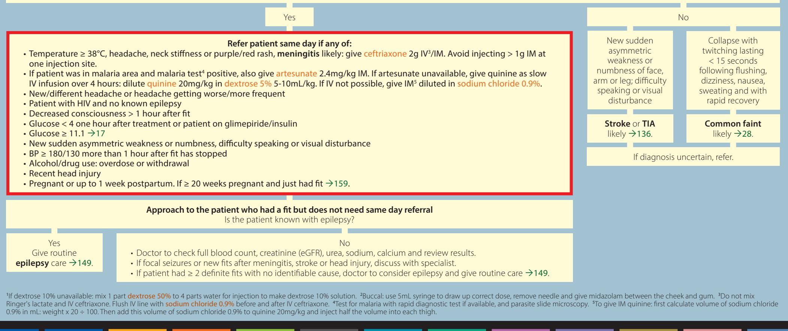

**[HIV](#page-102-0) [COVID-19](#page-117-0) [CHRONIC RESPIRATORY DISEASE](#page-119-0) [HEPATITIS B \(HBV\)](#page-116-0) [CARDIOMETABOLIC CONDITIONS](#page-123-0) [MUSCULOSKELETAL DISORDERS](#page-147-0) [MENTAL HEALTH](#page-136-0) [EPILEPSY](#page-145-0) [WOMEN'S HEALTH](#page-150-0) [PALLIATIVE CARE](#page-166-0)**

### **ANAPHYLAXIS**

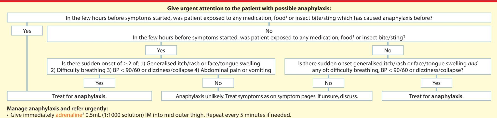

- Raise legs and give 100% face mask oxygen.
- Give sodium chloride 0.9% 1-2L IV rapidly regardless of BP. Then, if BP < 90/60, also give sodium chloride 0.9% 500mL IV rapidly, repeat until systolic BP > 90. Continue 1L 6 hourly. Stop if breathing worsens.
- • If persistent wheeze or difficulty breathing despite adrenaline2, also give 1mL salbutamol 0.5% solution and 2mL ipratropium bromide solution in 4mL sodium chloride 0.9% via nebuliser every 20 minutes for 3 doses. If needed, assess and further manage airway [14](#page-10-0).
- Give hydrocortisone 200mg IM/slow IV immediately *and* promethazine 50mg IM/slow IV.

#### **Assess the patient with previous anaphylaxis**

| As se ss                    | W he n t o a sse ss | No te                                                                                                                                                                                                                                                                                                                                                                                                                                                                                                                                                                                                                                                                                                                                                                                                                                                                                                                                                                                                                                                                                                                                                                                                                                                                                                                                                                                                            |
|-----------------------------------|------------------------------------|---------------------------------------------------------------------------------------------------------------------------------------------------------------------------------------------------------------------------------------------------------------------------------------------------------------------------------------------------------------------------------------------------------------------------------------------------------------------------------------------------------------------------------------------------------------------------------------------------------------------------------------------------------------------------------------------------------------------------------------------------------------------------------------------------------------------------------------------------------------------------------------------------------------------------------------------------------------------------------------------------------------------------------------------------------------------------------------------------------------------------------------------------------------------------------------------------------------------------------------------------------------------------------------------------------------------------------------------------------------------------------------------------------------------|
| Tri g g er               | At d iag is no s    | Ens list has d t he h a hy lax f irm /s. Co lu de d foo d 1 a d b /st ia vie at ien t w it is t tr ig tr ig in ica t ion ins ect ites ing ure a s p ec re we p na p o c on g er mm on g ers c m e s, n s.                                                                                                                                                                                                                                                                                                                                                                                                                                                                                                                                                                                                                                                                                                                                                                                                                                                                                                                                                                                                                 |
| Ot he l lerg r a y | d At iag is no s    | f re h, w hee ht hes d f f ic lty bre hin lu de hm  f kno hm hm  I ig i 123 I ive ine 125 nt t t o at t t ut t cu rre co ug ze, c r g, exc as a wn as a, g ro as a c are u • f p f  I hes dry ly, hy kin k les de l bo be hin d kne li ke ly 6 9. atc itc rist ins i o , sc a s on w s, a n e ws or es, ec ze ma • ,  f it hy, d, r d w hea ls t hat d de ly d u l ly d hin ho ica ia li ke ly I ise isa it 24 rt 6 9. c re a ap p ear su n an sua p p ear w urs , u r • f re hy b loc ke d n day for ks, l ler h li ke ly  I ing itc /ru / 4 w ic r in it is 34 nt ost cu rre sne ez or nn ose m s > ee a g y • f bo h e d hy, l ler li ke ly  I itc ic c j iv it is 31 t ter ct y es wa y an a g on un • |

#### **Advise the patient with previous anaphylaxis**

**[HIV](#page-102-0) [CHRONIC RESPIRATORY DISEASE](#page-119-0) [CARDIOMETABOLIC CONDITIONS](#page-123-0) [MUSCULOSKELETAL DISORDERS](#page-147-0) [MENTAL HEALTH](#page-136-0) [EPILEPSY](#page-145-0) [WOMEN'S HEALTH](#page-150-0) [PALLIATIVE CARE](#page-166-0)**

- Advise to avoid identified trigger/s and if trigger is a medication, to always inform health worker.
- Ensure patient has a plan in case of anaphylaxis: ambulance telephone number, nearest hospital and reliable transport plan.

**[HEPATITIS B \(HBV\)](#page-116-0) [COVID-19](#page-117-0)**

- •If adrenaline2 auto-injector device (like EpiPen®) prescribed, ensure patient knows when and how to use it:
- If exposed to trigger, use immediately if any of: itch/rash, face/tongue swelling, itchy/tight throat, cough, wheeze, difficulty breathing, dizziness/collapse, abdominal pain or vomiting. After use, immediately phone for ambulance.
- Advise to read instructions found in packaging.

**CONTENTS SYMPTOMSCONTENTS CHRONIC CONDITIONS**

**[TB](#page-85-0)**

Arrange a MedicAlert® bracelet [178](#page-174-0) and advise patient to always wear it.

1Common foods causing anaphylaxis include peanuts, tree nuts, egg, milk and fish. 2Adrenaline is also known as epinephrine.

**20**

# **BURNS**

Calculate the percentage total body surface area (% TBSA) burnt using the figure below.

### **Give urgent attention to the patient with burn/s and any of:**

• Drowsy or confused Electric/chemical burn

•

•

•

•

- Circumferential burn of chest/limbsBurn to face, hand/foot, genitals, joint
- Full-thickness burn (white/black, painless, leathery, dry) •
  - Oxygen saturation < 94%
  - Temperature ≥ 38°C
  - •BP < 90/60
  - Other injury

- **Management:**
- •Remove clothing. Cool burn with cool tap water or wet towel/s for 30 minutes. Keep warm with clean, dry sheet.
- • Give face mask oxygen if burn > 10% TBSA, inhalation injury, oxygen saturation < 94% or drowsy/confused. Doctor to consider intubation.
- •If > 10% TBSA:
- Insert a large-bore IV line. If % TBSA burnt > 40% or if transport to hospital likely to take more than 45 minutes, insert a second IV line.
- Give sodium chloride 0.9% IV 4mL x weight (kg) x % TBSA over 24 hours. Give half this volume in first 8 hours from time of burn. Calculate the hourly volume (mL) = total volume (mL) ÷ 2 ÷ 8.
- Insert a urine catheter and document urine output every hour. •Give paracetamol 1g orally 4-6 hourly (up to 4g in 24 hours).

Partial thickness burn (pink/red, blisters, painful, wet) > 10% TBSA

**Inhalation injury** likely (burns to face/neck, difficulty breathing,

- •If pain severe, give morphine 3-10mg slow IV1.
- •If other injuries, manage [18](#page-14-0).

hoarse, stridor or black sputum)

- •Clean and dress burn gently:
- Remove loose/dead skin and clean burn with sodium chloride 0.9%.
- If full thickness or > 10% TBSA burn, apply paraffin gauze and cover with plastic wrap.
- If hospital transfer delayed > 12 hours, apply paraffin gauze and cover with dry gauze and bandage.
- If none of above, apply Burnshield® and cover with bandage. If not available, use a non-adherent dressing or wrap in clean, dry sheet and blanket.
- •Give tetanus toxoid 0.5mL IM if none in past 5 years.
- • Monitor hourly while awaiting transport: BP, pulse, respiratory rate, oxygen saturation, level of consciousness and urine output.
- •Refer urgently.

### **Approach to the patient with burn/s not needing urgent attention**

- Cool burn < 3 hours old with cool tap water or wet towel/s for 30 minutes.
- Give paracetamol 1g 4-6 hourly (up to 4g in 24 hours) as needed for up to 5 days.
- •Remove loose/dead skin and gently clean burn with sodium chloride 0.9%. Then cover with paraffin gauze dressing.
- Give tetanus toxoid 0.5mL IM if none in past 5 years.

**[TB](#page-85-0)**

- If cigarette burns, burn with specific shape of object (e.g. iron, grid, knife/fork, car cigarette lighter, light bulb), repeated/unexplained burns or other unexplained injuries, consider abuse [88](#page-84-0) and self-harm [83](#page-79-0).
- Review daily until burn healed:

**CONTENTS SYMPTOMSCONTENTS CHRONIC CONDITIONS**

- Dress burn with paraffin gauze dressing. If signs of infection (redness, swelling), apply povidone iodine 5% cream daily.
- If severe infection (extensive redness or swelling, foul-smell, pus or temperature ≥ 38°C), pain despite medication or burn not healed within 2 weeks, refer

1Dilute 10mg morphine with 9mL of sodium chloride 0.9%. Give diluted morphine 3mL IV over 3 minutes (1mL/minute). If needed, give another 1mL/min until pain improved, up to 10mL. Stop if BP drops < 90/60.

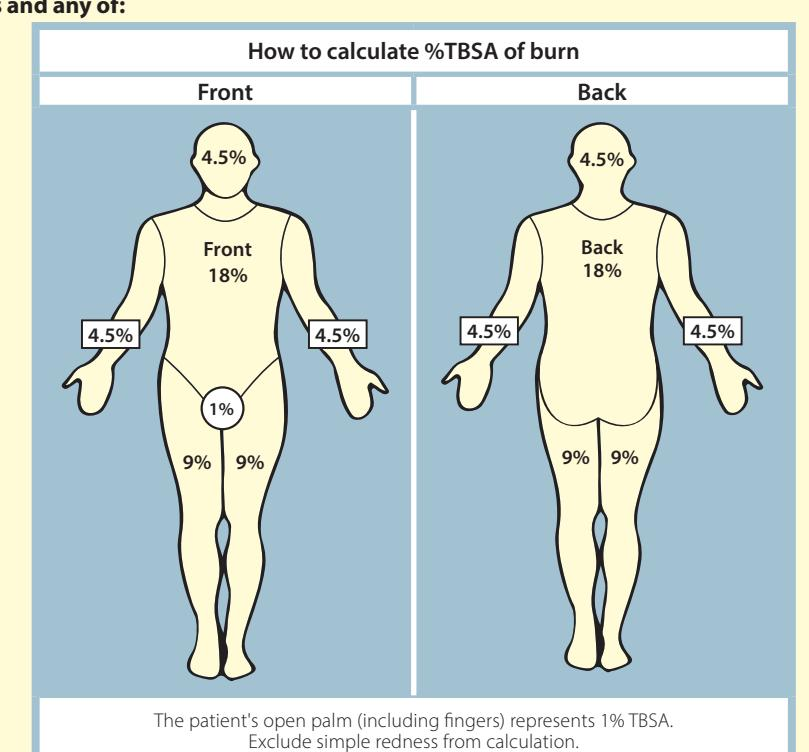

**[HIV](#page-102-0) [COVID-19](#page-117-0) [CHRONIC RESPIRATORY DISEASE](#page-119-0) [HEPATITIS B \(HBV\)](#page-116-0) [CARDIOMETABOLIC CONDITIONS](#page-123-0) [MUSCULOSKELETAL DISORDERS](#page-147-0) [MENTAL HEALTH](#page-136-0) [EPILEPSY](#page-145-0) [WOMEN'S HEALTH](#page-150-0) [PALLIATIVE CARE](#page-166-0)**

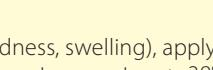

### **BITES AND STINGS**

#### **Give urgent attention to the patient with a bite/sting and any of:**

- **Snake bite** (even if bite marks not seen) or venom in eyes
- •If sudden generalised itch/rash, face/tongue swelling, wheeze, difficulty breathing, BP < 90/60, dizziness/collapse, abdominal pain or vomiting, check for anaphylaxis [20](#page-16-0).
- •Weakness, drooping eyelids, difficulty swallowing and speaking, double vision
- Animal/human bite with any of: multiple bites, deep/large wound, loss of tissue, involving joint/bone, temperature ≥ 38°C or pus
- •BP < 90/60
- •Excessive or pulsatile bleeding

### **Manage and refer:**

- If **snake bite or venom in eyes:**
- Keep patient calm and still. Remove jewellery and immobilise bitten limb.
- If venom in eyes: irrigate eye thoroughly for at least 20 minutes with water or sodium chloride 0.9%. If available, instil 1 drop tetracaine 1% eye drops before irrigating.
- Clean bite with chlorhexidine 0.05% solution. Avoid applying tourniquet or sucking out venom.
- Discuss pain management and need for antivenom with local poison helpline [178](#page-174-0).
- If excessive or pulsatile bleeding, apply direct pressure and elevate limb. If bleeding severe and persists, apply tourniquet above injury.
- If BP < 90/60, give sodium chloride 0.9% 1L IV rapidly, repeat until systolic BP > 90. Continue 1L 6 hourly. Stop if breathing worsens.
- •Remove loose/dead skin. Clean wound with chlorhexidine 0.05% or povidone iodine 10% solution and irrigate under running water for 10 minutes. Avoid suturing the wound.
- Give tetanus toxoid 0.5mL IM if none in past 5 years.

### **Approach to the patient with a bite/sting not needing urgent attention**

### **Human or animal bite/s**

- Remove loose/dead skin. Clean wound with chlorhexidine 0.05% or povidone iodine 10% solution and irrigate under running water for 10 minutes.
- •Avoid suturing puncture wounds.
- If animal bite, consider rabies post-exposure prophylaxis:
- If bite/scratch with visible blood, licking of eyes/mouth/broken skin by a dog, cat, mongoose, jackal, cattle or goat; or any contact with a bat:
- Inject rabies immunoglobulin 20IU/kg at the site of the bite *and*
- Inject rabies vaccine 1 ampoule IM into deltoid muscle (not buttock). Repeat vaccine on days 3, 7 and 14 (if impaired immunity1, also give a 5th dose on day 28).
- If scratch with no visible blood, give rabies vaccine only as above.
- If rabies immunoglobulin or vaccine unavailable, refer. If unsure, contact rabies hotline for advice [178](#page-174-0).
- •Give paracetamol 1g 4-6 hourly (up to 4g in 24 hours) as needed for up to 5 days.
- If bite punctured the skin with visible bleeding, bite to hand or from human or bat: give amoxicillin/ clavulanic acid 875/125mg 12 hourly for 5 days. If severe penicillin allergy2, give instead azithromycin 500mg daily for 3 days and metronidazole3 400mg 8 hourly for 5 days.
- If human bite, severe enough to cause bleeding, also assess need for hepatitis B post-exposure prophylaxis (PEP) [108](#page-104-0). Risk of HIV transmission through biting is negligible and HIV PEP not needed.
- If bite infected and no response to antibiotics within 48 hours, refer.

### **Insect/spider/scorpion sting or bite/s**

- Remove stinger. Clean wound with soap and water. Apply ice pack for pain/swelling.
- If severe pain, redness, swelling or itch:
- Give chlorphenamine 4mg 6-8 hourly for up to 5 days.
- Apply calamine lotion as needed.
- Give paracetamol 1g 4-6 hourly (up to 4g in 24 hours) as needed for up to 5 days.
- If spider bite, advise patient to return if signs of infection (skin red, warm, painful) and give flucloxacillin 500mg 6 hourly for 5 days. If severe penicillin allergy2, give instead azithromycin 500mg daily for 3 days.
- If very painful scorpion sting, inject lignocaine 2% 2mL around site.
- If hypersensitivity response to insect bites red raised bump/s that blister and heal with hyperpigmentation (darkened skin), **papular urticaria** likely: apply hydrocortisone 1% daily for 5 days.
- If long-term itch, give cetirizine 10mg once daily.
- Advise to reduce exposure to insects:
  - Treat pets, use bed nets, wash bedding, use insect repellents.
  - Clear away puddles of water around house.

### **If human/animal/spider bite or scorpion sting, give tetanus toxoid 0.5mL IM if none in past 5 years.**

1Known with HIV, diabetes or cancer, pregnant or receiving chemotherapy or corticosteroids. 2History of angioedema, anaphylaxis or urticaria. 3Advise no alcohol until 24 hours after last dose of metronidazole.

### **WEIGHT LOSS**

Check that the patient that says s/he has unintentionally lost weight has indeed done so. Compare current weight with previous records and ask if clothes still fit.

Investigate unintentional weight loss of > 5% of body weight.

**[TB](#page-85-0)**

**CONTENTS SYMPTOMSCONTENTS CHRONIC CONDITIONS**

Calculate % weight loss = (previous weight - current weight) ÷ previous weight x 100

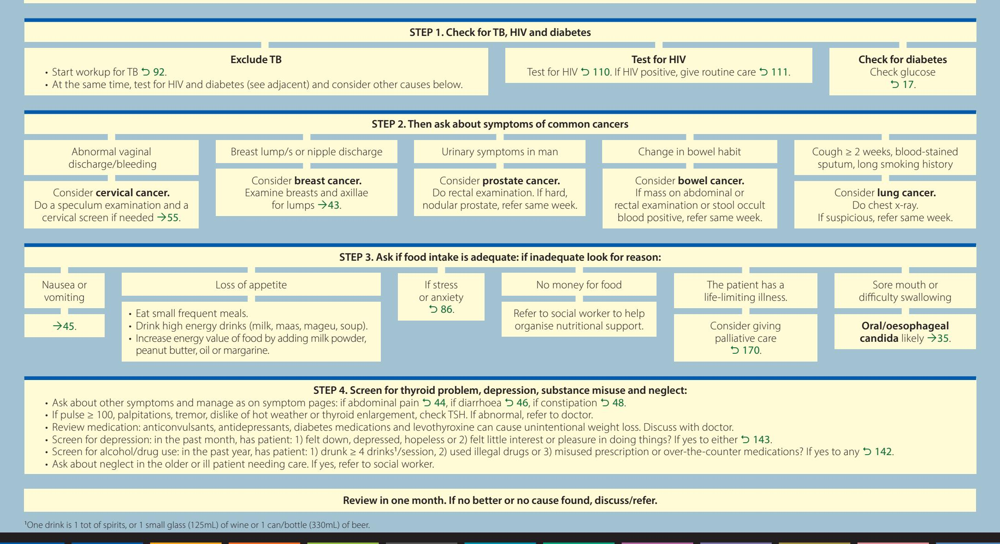

**[HIV](#page-102-0) [COVID-19](#page-117-0) [CHRONIC RESPIRATORY DISEASE](#page-119-0) [HEPATITIS B \(HBV\)](#page-116-0) [CARDIOMETABOLIC CONDITIONS](#page-123-0) [MUSCULOSKELETAL DISORDERS](#page-147-0) [MENTAL HEALTH](#page-136-0) [EPILEPSY](#page-145-0) [WOMEN'S HEALTH](#page-150-0) [PALLIATIVE CARE](#page-166-0)**

# **FEVER**

A patient with a fever has a temperature ≥ 38°C now or in past 3 days.

#### **Give urgent attention to the patient with a fever and any of:**

- Fits or just had a fit [19](#page-15-0).
- • Decreased consciousness [16](#page-12-0)
- •Neck stiffness, drowsy/confused or purple/red rash, **meningitis** likely
- **Management:**
- •If BP < 90/60, give sodium chloride 0.9% 500mL IV over 30 minutes, repeat until systolic BP > 90. Continue 1L 6 hourly. Stop if breathing worsens.
- •If likely **meningitis**, decreased consciousness, fits or respiratory rate > 30/difficulty breathing: give ceftriaxone 2g IV1/IM. Avoid injecting > 1g IM at one injection site.

•

- If patient was in a malaria area in past 3 months and malaria test2 positive: give artesunate 2.4mg/kg IM and notify. Refer urgently within 6 hours. Record artesunate dose in referral letter. If artesunate unavailable, give quinine as slow IV infusion over 4 hours: dilute quinine 20mg/kg in dextrose 5% 5-10mL/kg. If IV not possible, give IM3 diluted in sodium chloride 0.9%.
- •If glucose < 3 or ≥ 11.1 [17](#page-13-0).
- Refer urgently.

### Respiratory rate > 30 or difficulty breathing

- BP < 90/60
- Tender in right lower abdomen, **appendicitis** likely
- Severe abdominal or back pain
- Jaundice
- •Easy bleeding or bruising

### **Approach to the patient with a fever not needing urgent attention**

- If on abacavir, check for abacavir hypersensitivity reaction (AHR) [116](#page-112-0).
- •Has patient been in a malaria area in past 3 months?

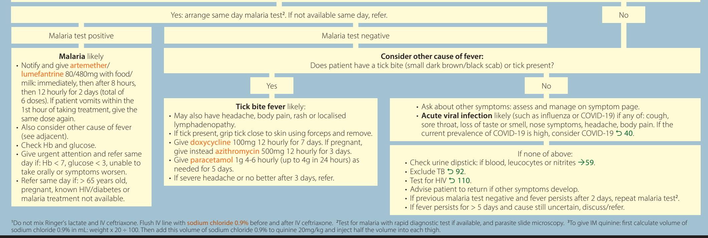

### **LUMP/SWELLING IN NECK, AXILLA OR GROIN**

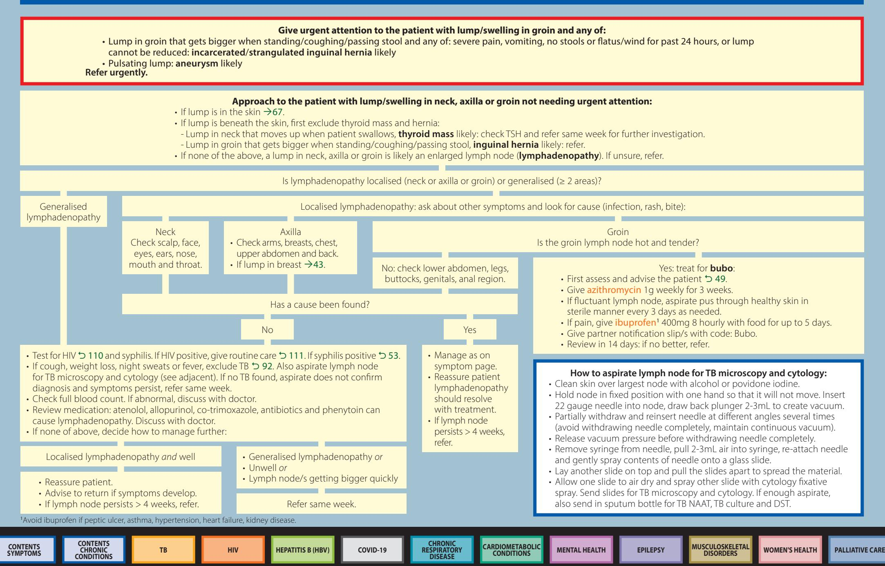

### **WEAKNESS OR TIREDNESS**

#### **Give urgent attention to the patient with weakness or tiredness and any of:**

- New sudden asymmetric weakness or numbness of face, arm or leg; difficulty speaking or visual disturbance: consider **stroke** or **TIA** [136](#page-132-0)•
- Chest pain [37](#page-33-0)
- Difficulty breathing or respiratory rate ≥ 30 [38](#page-34-0)
- •Difficulty breathing worse on lying flat and leg swelling, **heart failure** likely [137](#page-133-0).
- Temperature ≥ 38°C now or in past few days [24](#page-20-0)

### **Management:**

- Glucose < 3 (or < 4 if diabetes) Glucose ≥ 11.1
  - Dehydration: thirst, dry mouth, poor skin turgor, drowsiness/confusion, BP < 90/60, pulse ≥ 100
  - Hb < 6 [27](#page-23-0)
  - •Worsening weakness of leg/s
- • If dehydrated, give oral rehydration solution (ORS) and observe. If unable to drink or BP < 90/60, give sodium chloride 0.9% 500mL IV over 30 minutes, repeat until systolic BP > 90. Continue 1L 6 hourly. Stop if breathing worsens. If IV rehydration needed or no better with oral rehydration after 2 hours, refer.
- If glucose < 3 or ≥ 11.1 [17](#page-13-0) or if diabetes and glucose < 4 [130](#page-126-0).
- •If worsening weakness of leg/s, refer urgently.

### **Approach to patient with tiredness not needing urgent attention:**

- •Look for a cause for tiredness when it persists so that the patient is unable to complete routine tasks and it disrupts work, social and family life.
- First check symptoms, medications, mental health and for chronic conditions:

### **Check symptoms**

- If fever now or in past 3 days [24](#page-20-0).
- If cough, weight loss, night sweats or fever, exclude TB [92](#page-88-0).
- If difficulty breathing worse on lying flat and leg swelling, **heart failure** likely [135](#page-131-0).
- If patient has difficulty sleeping [87](#page-83-0).
- If weight gain, low mood, dry skin, constipation or cold intolerance, check TSH. If abnormal, refer to doctor.

### **Check chronic conditions**

- Test for HIV [110](#page-106-0). If HIV positive, give routine care [111](#page-107-0).
- Exclude pregnancy [157](#page-153-0).
- Exclude anaemia: check Hb. If < 12 (woman) or < 13 (man), **anaemia** likely [27](#page-23-0).
- Exclude diabetes: check glucose [17](#page-13-0).
- If ongoing symptoms following acute COVID-19, assess for Long COVID [42](#page-38-0).
- If patient has a life-limiting illness, also consider giving palliative care [170](#page-166-0).

### **Check medications**

- If on abacavir or zidovudine, check for urgent side effects [116](#page-112-0).
- Chlorphenamine, enalapril, amlodipine, fluoxetine, amitriptyline, metoclopramide, sodium valproate, phenytoin and spironolactone can cause weakness or tiredness. Discuss with doctor.

### **Check mental health**

- In the past month, has patient: 1) felt down, depressed, hopeless or 2) felt little interest or pleasure in doing things? If yes to either [143](#page-139-0).
- In the past year, has patient: 1) drunk ≥ 4 drinks1/ session, 2) used illegal drugs or 3) misused prescription or over-the-counter medications? If yes to any [142](#page-138-0).
- •If none of the above, assess for stress and anxiety [86](#page-82-0).

No Yes Is there muscle weakness on examination2? Ask about duration of tiredness: < 1 month ≥ 1 month If available, refer to doctor. Doctor to confirm weakness and: Check potassium, sodium, calcium, phosphate, TSH. Discuss/refer to specialist. • If no doctor available, refer. • If any other symptoms managed above, reassure that tiredness should resolve with treatment. Advise to return if no better in 1 month. • Check FBC, differential count, sodium, calcium, creatinine and ALT. If abnormal, discuss with doctor. If likely cause found, reassure that tiredness should resolve with treatment. If tiredness persists despite treatment, discuss/refer. If no cause found, review in 1 month. If tiredness persists and cause still not found, discuss/refer. 1One drink is 1 tot of spirits, or 1 small glass (125mL) of wine or 1 can/bottle (330mL) of beer. 2If unsure how to examine for muscle weakness, discuss with doctor. **[HEPATITIS B \(HBV\)](#page-116-0) [COVID-19](#page-117-0) [TB](#page-85-0) CONTENTS SYMPTOMS CONTENTS CHRONIC CONDITIONS[HIV](#page-102-0) [CHRONIC RESPIRATORY DISEASE](#page-119-0) [CARDIOMETABOLIC CONDITIONS](#page-123-0) [MUSCULOSKELETAL DISORDERS](#page-147-0) [MENTAL HEALTH](#page-136-0) [EPILEPSY](#page-145-0) [WOMEN'S HEALTH](#page-150-0) [PALLIATIVE CARE](#page-166-0)**

### **PALLOR AND ANAEMIA**

- Patient has pallor if s/he has pale conjunctiva or palms. Compare patient's palms to your own.
- Check Hb: **anaemia** likely if:
- Non pregnant woman has Hb < 12.
- Pregnant woman has Hb < 11 [160](#page-156-0).

**[TB](#page-85-0)**

**CONTENTS SYMPTOMSCONTENTS CHRONIC CONDITIONS**

Man has Hb < 13.

| he h p l lor d a f: G ive ion ien it /an ia t a tte nt to t at t w ur g en p a ae m an ny o b < l len leg de d bru H 6 B P < 9 0 / 6 0 Sw W i /ea is ing o s sp rea sy • • • • fa Pu lse D izz / int Ja d ice Pu le /re d r h t ha do 10 0 t t ≥ y un rp as es no • • • • he lp lac k 1 o b loo dy ls d h p Re ira 3 0 C in ita ion B isa it to rat st t st e ≥ sp ry p a or p a s r oo p p ea r w res su re • • • d r fer ly Ma t na g e a n e ur g en : f re d, fac k o I ira inc ive to rat sp ry e rea se g e m as xy g en • I f B P < / ive d ium h lor i de L I V o inu i l sy l ic B P > Co inu L 6 ho ly. Sto i f bre h ing 9 0 6 0, 0. 9 % 5 0 0m r 3 0 m tes t u nt sto 9 0. nt e 1 at g so c ve , re p ea ur p w ors en s. • |                                                                                                                                                                                                                                                                                                                                                                                                                                                                                                                                                                                                                                                                                                                                                                                                                                                                                                                                                                                                                                                                                                                                                                                                                                                                                                                                                                                                                                                                                                                                                                                                                                                                                                                                                                                                                                                                                                                                                                                                                                                                                                                                                                                                                                                                                                                                                                                                                                                                                                    |                                                                                                                                                                                                                                                                                                                                                                                           |                                                                                                                                                                                                                                                                                                                                                                                                                                                                                                                                                                                                                                                                                                                                                                                                                                                                                                                                                                                                                                                                                                                                                                                      |                                                                                                                |  |  |
|-----------------------------------------------------------------------------------------------------------------------------------------------------------------------------------------------------------------------------------------------------------------------------------------------------------------------------------------------------------------------------------------------------------------------------------------------------------------------------------------------------------------------------------------------------------------------------------------------------------------------------------------------------------------------------------------------------------------------------------------------------------------------------------------------------------------------------------------------------------------------------------------------------------------------------------------------------------------------------------------------------------------------------------------------------------------------------------------------------------------------------------------------------------------------------------------------------------------------------------------------------------------------------------------------------------------------------------------------------------------------------------------------------------------------------------------------------------------------------------------------------|----------------------------------------------------------------------------------------------------------------------------------------------------------------------------------------------------------------------------------------------------------------------------------------------------------------------------------------------------------------------------------------------------------------------------------------------------------------------------------------------------------------------------------------------------------------------------------------------------------------------------------------------------------------------------------------------------------------------------------------------------------------------------------------------------------------------------------------------------------------------------------------------------------------------------------------------------------------------------------------------------------------------------------------------------------------------------------------------------------------------------------------------------------------------------------------------------------------------------------------------------------------------------------------------------------------------------------------------------------------------------------------------------------------------------------------------------------------------------------------------------------------------------------------------------------------------------------------------------------------------------------------------------------------------------------------------------------------------------------------------------------------------------------------------------------------------------------------------------------------------------------------------------------------------------------------------------------------------------------------------------------------------------------------------------------------------------------------------------------------------------------------------------------------------------------------------------------------------------------------------------------------------------------------------------------------------------------------------------------------------------------------------------------------------------------------------------------------------------------------------------|-------------------------------------------------------------------------------------------------------------------------------------------------------------------------------------------------------------------------------------------------------------------------------------------------------------------------------------------------------------------------------------------|--------------------------------------------------------------------------------------------------------------------------------------------------------------------------------------------------------------------------------------------------------------------------------------------------------------------------------------------------------------------------------------------------------------------------------------------------------------------------------------------------------------------------------------------------------------------------------------------------------------------------------------------------------------------------------------------------------------------------------------------------------------------------------------------------------------------------------------------------------------------------------------------------------------------------------------------------------------------------------------------------------------------------------------------------------------------------------------------------------------------------------------------------------------------------------------|----------------------------------------------------------------------------------------------------------------|--|--|
| h t he ien it h p l lor /an ia d ing ion Ap o t at t w t n t a tte nt p roa c p a ae m no ee ur g en for  d  Te H I V 11 0 a T B 9 2. st n •  Exc lu de 15 7. p reg na nc y • 2 f fev da d lar hs, da lar 2. f p lar ia li ke ly I in 3 in ia a in 3 ia t I it ive 4. ast ast nt est er no w or p y s, a n a m a rea p mo ar ran g e s am e y ma os , m a • f n d fu l l b loo d c ( ) a d m fur he d l l vo lum ( ) 3 re lt: I F B C ing M C V ot nt, nt t to p reg na se n ou n an ag e r a cco r m ea n c e e su •                                                                                                                                                                                                                                                                                                                                                                                                                                          |                                                                                                                                                                                                                                                                                                                                                                                                                                                                                                                                                                                                                                                                                                                                                                                                                                                                                                                                                                                                                                                                                                                                                                                                                                                                                                                                                                                                                                                                                                                                                                                                                                                                                                                                                                                                                                                                                                                                                                                                                                                                                                                                                                                                                                                                                                                                                                                                                                                                                                    |                                                                                                                                                                                                                                                                                                                                                                                           |                                                                                                                                                                                                                                                                                                                                                                                                                                                                                                                                                                                                                                                                                                                                                                                                                                                                                                                                                                                                                                                                                                                                                                                      |                                                                                                                |  |  |
| C 3 low C 3 n l C 3 hig h M V M V M V orm a                                                                                                                                                                                                                                                                                                                                                                                                                                                                                                                                                                                                                                                                                                                                                                                                                                                                                                                                                                                                                                                                                                                                                                                                                                                                                                                                                                                                      |                                                                                                                                                                                                                                                                                                                                                                                                                                                                                                                                                                                                                                                                                                                                                                                                                                                                                                                                                                                                                                                                                                                                                                                                                                                                                                                                                                                                                                                                                                                                                                                                                                                                                                                                                                                                                                                                                                                                                                                                                                                                                                                                                                                                                                                                                                                                                                                                                                                                                                    |                                                                                                                                                                                                                                                                                                                                                                                           |                                                                                                                                                                                                                                                                                                                                                                                                                                                                                                                                                                                                                                                                                                                                                                                                                                                                                                                                                                                                                                                                                                                                                                                      |                                                                                                                |  |  |
|                                                                                                                                                                                                                                                                                                                                                                                                                                                                                                                                                                                                                                                                                                                                                                                                                                                                                                                                                                                                                                                                                                                                                                                                                                                                                                                                                                                                                                                                                                     | f ic Iro de ien ia li ke ly n cy an ae m ho lon ha ds ? Is p ien io at t a m an or a wo ma n w no g er s p er                                                                                                                                                                                                                                                                                                                                                                                                                                                                                                                                                                                                                                                                                                                                                                                                                                                                                                                                                                                                                                                                                                                                                                                                                                                                                                                                                                                                                                                                                                                                                                                                                                                                                                                                                                                                                                                                                                                                                                                                                                                                                                                                                                                                                                                                             | Sy ic ste m d ise as e hro                                                                                                                                                                                                                                                                                                                                        | Ma ic a ia li ke ly t cro cy na em kn lco ho l 4? Pat ien isu t p ost art n t p um or ow o m se a ic                                                                                                                                                                                                                                                                                                                                                                                                                                                                                                                                                                                                                                                                                                                                                                                                                                                                                                                                                                                       |                                                                                                                |  |  |
| Ye s                                                                                                                                                                                                                                                                                                                                                                                                                                                                                                                                                                                                                                                                                                                                                                                                                                                                                                                                                                                                                                                                                                                                                                                                                                                                                                                                                                                                                                                                                             | No                                                                                                                                                                                                                                                                                                                                                                                                                                                                                                                                                                                                                                                                                                                                                                                                                                                                                                                                                                                                                                                                                                                                                                                                                                                                                                                                                                                                                                                                                                                                                                                                                                                                                                                                                                                                                                                                                                                                                                                                                                                                                                                                                                                                                                                                                                                                                                                                                                                                                                 | or c n d it ion li ke ly co n                                                                                                                                                                                                                                                                                                                               | Ye s                                                                                                                                                                                                                                                                                                                                                                                                                                                                                                                                                                                                                                                                                                                                                                                                                                                                                                                                                                                                                                                                                                                                                                              | No                                                                                                             |  |  |
| D isc / uss fer to re loo k for hi d de n b loo d los s.                                                                                                                                                                                                                                                                                                                                                                                                                                                                                                                                                                                                                                                                                                                                                                                                                                                                                                                                                                                                                                                                                                                                                                                                                                                                                                                                                                                      |  k a bo bn l va l b lee d f a bn l As ina ing i 57 ut a orm a g orm a : • fer lp ha d fer fum ho ly h G ive B P C 1 70 20 0m 12 wi te te t rou s s u co mp ou n mg or rou s ara g ur • foo d. f n ler d b do l p d fer I (a mi in, it ing ip ion ), g ive in ot to ate nst at ste na a na use a, v om , co a rou s lp ha d B P C fer fum k ly h foo d te 34 0m te 40 0m wi t su co mp ou n g or rou s ara g on ce we e b m h ly f b de f n be fte ks, fer Re H i H r i r 4 t t tre atm t: tte p ea on on en cre ase s o o r a ee re w - l 3 hs fte b r he l va lue Co inu i H nt e t tm t u nt nt rea en mo a r ea c s n orm a - A dv ise : • foo ds h i live ki dn h, be len ls, dr d To ric n i ina i ie t t, e t ts, ea ron r, ey, m ea g g s, s p c an s, p ea s, nu : - fru d for f ie d c ls. ds h i he lp bso it a i Fo ric ita mi C iro ion t t n ere a o n v n n a rp : g ua va s, p ep p ers , f lo be bro li, c li st rrie ora ng es, raw s, cco au we r. d dr kin /co f fe h m ls a he fer h i bso lso d Av i in it int it ion A i tea s t t o g e w ea se er e w ron a rp av o - kin b let h m l k o lc b let iro it i ium ta n t ta g a s w r c a s. Wa ha ls m be b lac k w h t his l. t t st it tm t, r t is rn oo ay co me rea en ea ssu re no rm a - | f d I H I V, T B a n • p reg na nc y lu de d, exc d fer isc /re uss f p I ate int is • kn h it ow n w li fe- lim it ing l lne lso i ss, a de i co ns r ivin g g l liat ive p a ca re  17 0. | lat de f ic li ke ly Fo ien e cy Re d f o do d vie ica ion i i ine t w me n z vu or : • lsa d h do ico isc it t nts cto an nv u uss w r. , fo lat da ly l b n l. G ive i i H e 5 t mg un orm a • f Re H b m h ly H b t t tre atm t: i p ea on on en • de f n be fte ks, fer r i r 4 tte cre ase s o o r a w ee re dv A ise : • foo fo To ds h i lic d: live t ric i ea n ac r, e g g s, - for f ie d c ls, fru h, i itru it, s ina t ere a c s p c he b les len ls, dry be i ot eta t r g ree n v eg an s, , ts. p ea nu  d a lco ho l Av i 14 2. o - f c hro d ho fer I nic iar r ea , re • | fer Re to for inv est ig ate vit in B1 2 am de f ic ien cy. |  |  |
| 1Bla ck s ls m be sed by ble On ly r efe r if bla ck s ls s ed bef 2Te st f ala h ra id d t if ilab le, a nd lide 3Me cel l vo lum e ( MC V) hel ide ntif f an ia. C hec k o too iro n ta ts. too tart iro n tr eat nt. ria wit iag tic tes asit icro ay cau ore me or m p nos ava par e s m sco py. an ps y c aus e o aem n FBC ult she f M CV low l or hig h c ed refe 4D rink dr ink s/w eek dr ink s/s . On e d rink t of ll g lass (12 L) o f w n/b le ( mL ) o f be et i to 14 ≥ 4 ion is 1 to irits 1 s 5m ine 1 ca ott 330 res , no rma om par ren ce ran ge. s > or ess sp , or ma or er.                                                                                                                                                                                                                                                                                                                                                                                                                                                           |                                                                                                                                                                                                                                                                                                                                                                                                                                                                                                                                                                                                                                                                                                                                                                                                                                                                                                                                                                                                                                                                                                                                                                                                                                                                                                                                                                                                                                                                                                                                                                                                                                                                                                                                                                                                                                                                                                                                                                                                                                                                                                                                                                                                                                                                                                                                                                                                                                                                                                    |                                                                                                                                                                                                                                                                                                                                                                                           |                                                                                                                                                                                                                                                                                                                                                                                                                                                                                                                                                                                                                                                                                                                                                                                                                                                                                                                                                                                                                                                                                                                                                                                      |                                                                                                                |  |  |

**[HIV](#page-102-0) [COVID-19](#page-117-0) [CHRONIC RESPIRATORY DISEASE](#page-119-0) [HEPATITIS B \(HBV\)](#page-116-0) [CARDIOMETABOLIC CONDITIONS](#page-123-0) [MUSCULOSKELETAL DISORDERS](#page-147-0) [MENTAL HEALTH](#page-136-0) [EPILEPSY](#page-145-0) [WOMEN'S HEALTH](#page-150-0) [PALLIATIVE CARE](#page-166-0)**

# **COLLAPSE/FALLS**

#### **Give urgent attention to the patient who has collapsed and any of:**

- •Collapse following vaccination [13](#page-9-0)
- New sudden asymmetric weakness or numbness of face, arm or leg; difficulty speaking or visual disturbance: consider **stroke** or **TIA**[136](#page-132-0)
- •Decreased consciousness [16](#page-12-0)
- Fit [19](#page-15-0)
- •Chest pain [37](#page-33-0)
- •Difficulty breathing [38](#page-34-0)
- Glucose < 3 (or < 4 if diabetes) [17](#page-13-0)
- Sudden collapse and any of: generalised itch/rash, face/tongue swelling, wheeze, difficulty breathing, abdominal pain, vomiting or exposure to possible allergen1, check for **anaphylaxis** [20](#page-16-0)

- •Systolic BP < 90
- •Pulse < 50 or irregular
- Palpitations
- •Family history of collapse or sudden death
- •Abnormal ECG
- Known heart problem
- •Collapse with exercise
- •Vomited blood or blood in stool
- Pregnant or missed/overdue period with abdominal pain and vaginal bleeding
- •Severe back or abdominal pain

Recent injury

•

### **Manage and refer urgently:**

If BP < 90/60, give sodium chloride 0.9% 500mL IV over 30 minutes, repeat until systolic BP > 90. Continue 1L 6 hourly. Stop if breathing worsens.

**[HEPATITIS B \(HBV\)](#page-116-0) [COVID-19](#page-117-0)**

### **Approach to the patient who has collapsed not needing urgent attention:**

- Ensure patient has had an ECG. If abnormal, refer same day.
- Check Hb: if <12 (woman) or < 13 (man), **anaemia** likely [27](#page-23-0).

**[TB](#page-85-0)**

**CONTENTS SYMPTOMSCONTENTS CHRONIC CONDITIONS**

- Screen for alcohol/drug use. In the past year, has patient: 1) drunk ≥ 4 drinks2/session, 2) used illegal drugs or 3) misused prescription or over-the-counter medications? If yes to any [142](#page-138-0).
- • Check BP: if ≥ 140/90 [132](#page-128-0). Then measure BP after lying for 5 minutes and repeat after standing for 3 minutes. Does systolic BP drop by ≥ 20 *or* diastolic BP drop by ≥ 10?

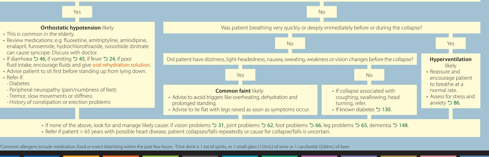

**[HIV](#page-102-0) [CHRONIC RESPIRATORY DISEASE](#page-119-0) [CARDIOMETABOLIC CONDITIONS](#page-123-0) [MUSCULOSKELETAL DISORDERS](#page-147-0) [MENTAL HEALTH](#page-136-0) [EPILEPSY](#page-145-0) [WOMEN'S HEALTH](#page-150-0) [PALLIATIVE CARE](#page-166-0)**

# **DIZZINESS**

•

•

•

Recent head injury

movements or walk

Unable to stand without support

New sudden severe dizziness with nausea/vomiting, abnormal eye

- • New sudden asymmetric weakness or numbness of face, arm or leg; difficulty speaking or visual disturbance: consider **stroke** or **TIA** [136](#page-132-0).
- •BP < 90/60
- •Pulse < 50 or irregular
- •Glucose < 3 (or < 4 if diabetes) [17](#page-13-0)
- •Chest pain [37](#page-33-0)

•

### **Manage and refer urgently:**

If BP < 90/60, give sodium chloride 0.9% 500mL IV over 30 minutes, repeat until systolic BP > 90. Continue 1L 6 hourly. Stop if breathing worsens.

### **Approach to the patient with dizziness not needing urgent attention:**

- Ask about ear symptoms. If present [33](#page-29-0). If hearing loss, refer same week.
- Ask about fainting/collapse attacks. If present, do ECG. If ECG abnormal, refer same day.
- Screen for alcohol/drug use: in the past year, has patient: 1) drunk ≥ 4 drinks1/session, 2) used illegal drugs or 3) misused prescription or over-the-counter medications? If yes to any [142](#page-138-0).
- Review medication: antidepressants, hypertension and epilepsy treatment, furosemide and efavirenz can cause dizziness. Discuss with doctor.
- •Check Hb: if < 12 (woman) or < 13 (man), **anaemia** likely [27](#page-23-0).
- Check BP: if ≥ 140/90 [132](#page-128-0). Measure BP after lying for 5 minutes and repeat after standing for 3 minutes. Does systolic BP drop by ≥ 20 or diastolic BP drop by ≥ 10?

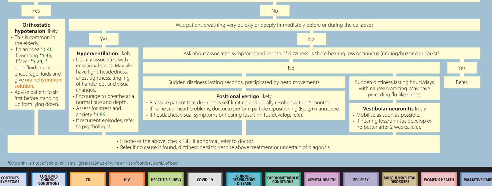

| f: G ive ion he ien it h he da he d a t a tte nt to t at t w ur g en p a c an ny o  d de he da he d he da he De d c Su izz ine Pe ist inc iou 16 t cre ase on sc sn ess n s ev ere a c or ss rs en a c s e • • • d n  He da he ha is g ing d m fre ing A R T B P ≥ 18 0 / 11 0 a 13 2 t t ett nt sta rt ot nt n p reg na a c w ors e a n ore q ue • • k p d  da he ha ke he l low f irs Pre B P ≥ 0 / 9 0 9 He ien is w in ing Fo ing izu nt 1 w tp art 14 15 t t w at t o t t s a c a s p r ors e m orn a e re g na or ee os um , a n • • •  k s f fn dro fus d o le d r h: l ke ly he d Su d de kn /n bn f fac /ar / leg h p b lem Ne i /co /re ing it is i Re in j 13 6 t nt me n n w ea ess um ess o e m or sp ee c ro c ess ws y n e r p urp as ce a ury • • • , b lem 3 Pe ist /vo it ing Un l p i ls Ne is ion in 1 t n w v p ro s o r e y e p a rs en au sea m eq ua up • • • d r fer ly Ma t na g e a n e ur g en : f te l ke ly ftr 1/ d I ≥ 3 8 °C ing it is i ive iax 2g I V I M. Av i in j ing 1g I M in j ion ite tu t at t mp era re or me n : g ce on e o ec > on e ec s • f lar hs d m lar 2 p kg f a la b le, low fus ho d lut kg I in ia a in 3 ia t it ive ive 2.4 / I M. I i ive in ine I V in ion i in ine 20 / in % ast nt est tes ate rte te 4 5 a m a rea p mo an a os : g ar un mg su na un ava g q u as s ov er urs : e q u mg • de L / kg I f I V n i b le, ive I M 3 d i lut d in d ium h lor i de xtr 5- 10 ot 0. 9 %. ose m p oss g e so c |                                                                                                                                                                                                                                                                                                                                                                                                                                                                                                                                                                                                                                                                                                                                                                                                                                                                                                                                                                                                                                                                                                                                                                                                                                                                                                                                                                                                                                                                                                                                                                                                                                                                                                                                                                                                                                                                                                                                                                                                           |                                                                                                                                                                                                                                                                                                                                                                                                                                                                                                                                                                                                                                                                                                                                                                                                                                                                                                                                                                                                                                                                                                                                                                                                                                                                                                                                                                                                                                                                                                                                                                                                                                                                                                                |                                                                                                                                                                                                                                                                                                                                                                                                                                                                                                                                                                                                                                                         |                                                                                                                                                                                                                                                                                                                                                                                                                                                                                                                                                                                                                                                                                                                                                                                                |                                                                                                                                                                                                                       |  |  |
|-----------------------------------------------------------------------------------------------------------------------------------------------------------------------------------------------------------------------------------------------------------------------------------------------------------------------------------------------------------------------------------------------------------------------------------------------------------------------------------------------------------------------------------------------------------------------------------------------------------------------------------------------------------------------------------------------------------------------------------------------------------------------------------------------------------------------------------------------------------------------------------------------------------------------------------------------------------------------------------------------------------------------------------------------------------------------------------------------------------------------------------------------------------------------------------------------------------------------------------------------------------------------------------------------------------------------------------------------------------------------------------------------------------------------------------------------------------------------------------------------------------------------------------------------------------------------------------------------------------------------------------------------------------------------------------------------------------------------------------------------------------------------------------------------------------------------------------------------------------------------------------------------------------------------------------------------------------------------------------------------------------------------------------------------------------------------------------------------------------------------------------------------------------------------------------------------------------------------------------------------------------------------------------------------------------------------------------------------------------------------------------------------------------------------------------------------------------------------------------------------------------------------------------------------------------------------------------------------------------------------------------------------------------------------------------------------------------------------------------------------------------------------------------------------------------------------------------------------------------------------------------------------------------------------------------------------------------------------------------------------------|-----------------------------------------------------------------------------------------------------------------------------------------------------------------------------------------------------------------------------------------------------------------------------------------------------------------------------------------------------------------------------------------------------------------------------------------------------------------------------------------------------------------------------------------------------------------------------------------------------------------------------------------------------------------------------------------------------------------------------------------------------------------------------------------------------------------------------------------------------------------------------------------------------------------------------------------------------------------------------------------------------------------------------------------------------------------------------------------------------------------------------------------------------------------------------------------------------------------------------------------------------------------------------------------------------------------------------------------------------------------------------------------------------------------------------------------------------------------------------------------------------------------------------------------------------------------------------------------------------------------------------------------------------------------------------------------------------------------------------------------------------------------------------------------------------------------------------------------------------------------------------------------------------------------------------------------------------------------------------------------------------------|----------------------------------------------------------------------------------------------------------------------------------------------------------------------------------------------------------------------------------------------------------------------------------------------------------------------------------------------------------------------------------------------------------------------------------------------------------------------------------------------------------------------------------------------------------------------------------------------------------------------------------------------------------------------------------------------------------------------------------------------------------------------------------------------------------------------------------------------------------------------------------------------------------------------------------------------------------------------------------------------------------------------------------------------------------------------------------------------------------------------------------------------------------------------------------------------------------------------------------------------------------------------------------------------------------------------------------------------------------------------------------------------------------------------------------------------------------------------------------------------------------------------------------------------------------------------------------------------------------------------------------------------------------------------------------------------------------------|---------------------------------------------------------------------------------------------------------------------------------------------------------------------------------------------------------------------------------------------------------------------------------------------------------------------------------------------------------------------------------------------------------------------------------------------------------------------------------------------------------------------------------------------------------------------------------------------------------------------------------------------------------|------------------------------------------------------------------------------------------------------------------------------------------------------------------------------------------------------------------------------------------------------------------------------------------------------------------------------------------------------------------------------------------------------------------------------------------------------------------------------------------------------------------------------------------------------------------------------------------------------------------------------------------------------------------------------------------------------------------------------------------------------------------------------------------------|-----------------------------------------------------------------------------------------------------------------------------------------------------------------------------------------------------------------------|--|--|
|                                                                                                                                                                                                                                                                                                                                                                                                                                                                                                                                                                                                                                                                                                                                                                                                                                                                                                                                                                                                                                                                                                                                                                                                                                                                                                                                                                                                                                                                                                                                                                                                                                                                                                                                                                                                                                                                                                                                                                                                                                                                                                                                                                                                                                                                                                                                                                                                                                                                                                                                                                                                                                                                                                                                                                                                                                                                                                                                                                                                     | h t he h he da he d Ap ien it ing ion o t at t w t n t a tte nt p roa c p a c no ee ur g en fev Do ha d bo dy l d ? at ien t in t c es p ve er an p a or rec en om mo n c o                                                                                                                                                                                                                                                                                                                                                                                                                                                                                                                                                                                                                                                                                                                                                                                                                                                                                                                                                                                                                                                                                                                                                                                                                                                                                                                                                                                                                                                                                                                                                                                                                                                    |                                                                                                                                                                                                                                                                                                                                                                                                                                                                                                                                                                                                                                                                                                                                                                                                                                                                                                                                                                                                                                                                                                                                                                                                                                                                                                                                                                                                                                                                                                                                                                                                                                                                                                                |                                                                                                                                                                                                                                                                                                                                                                                                                                                                                                                                                                                                                                                         |                                                                                                                                                                                                                                                                                                                                                                                                                                                                                                                                                                                                                                                                                                                                                                                                |                                                                                                                                                                                                                       |  |  |
| Ye No s f: t Ha ha d r l d a d n hic k n l /p l d ha Do he da he ha hro b b d b lin h at ien t nt ost isc at ien t g et t s t t a t ing isa wi t s p ece co mm on co n ow an y o asa na sa rg e, es p rec urr en a c re g , he hin for he d /c he ks, he da he be d for d ? lig ht /n ha lve let ly hin ho ? in ing ise it ivit wi 72 t t re t p a w n p us g on e a e a c w ors e o n n wa r na use a o r o se ns y, so co mp e urs                                                                                                                                                                                                                                                                                                                                                                                                                                                                                                                                                                                                                                                                                                                                                                                                                                                                                                                                                                                                                                                                                                                                                                                                                                                                                                                                                                                                                                                                                                                                                                                                                                                                                                                                                                                                                                                                                                                                                                                                                                                                                                                            |                                                                                                                                                                                                                                                                                                                                                                                                                                                                                                                                                                                                                                                                                                                                                                                                                                                                                                                                                                                                                                                                                                                                                                                                                                                                                                                                                                                                                                                                                                                                                                                                                                                                                                                                                                                                                                                                                                                                                                                                           |                                                                                                                                                                                                                                                                                                                                                                                                                                                                                                                                                                                                                                                                                                                                                                                                                                                                                                                                                                                                                                                                                                                                                                                                                                                                                                                                                                                                                                                                                                                                                                                                                                                                                                                |                                                                                                                                                                                                                                                                                                                                                                                                                                                                                                                                                                                                                                                         |                                                                                                                                                                                                                                                                                                                                                                                                                                                                                                                                                                                                                                                                                                                                                                                                |                                                                                                                                                                                                                       |  |  |
| Ye s S inu it is li ke ly s l 1g ho ly G ive 4- 6 (up cet p ara am o ur • for ho ) da to 4g in 24 to 5 urs up y s. G d h lor de ive ium i 0. 9 % so c no se • dro de d. p s a s n ee G l ine 0. 05 % 2 dro ive taz ox y me o p s • h n l 8 ho ly for in e ri 5 ost to ac ur up da dv hic h A ise ins t o s. ag a ve rus e w y b loc ke d n ma y wo rse n ose f sy da fev °C, I 10 ≥ 3 8 tom s ≥ mp y s, er • len l d ha fac l p isc ia in t n p uru asa rg e, a da fte ≥ 3 tom y s, o r sy mp s w ors en a r l im ic i l l in init ia t, g ive p rov em en am ox ho ly for da f se 5 0 0m 8 5 I g ur y s. ve re l lin l lerg 4, g d ic i ive in ste p en a y a for it hro in da ly da 5 0 0m i 3 az my c g y s. f re for  I H I V 11 0. nt, tes t cu rre • f to h in fec l ling I ion ot t or sw e ov er • fer /ar d e da inu s s ou n y e, r e sa me y.                                                                                                                                                                                                                                                                                                                                                                                                                                                                                                                                                                                                                                                                                                                                                                                                                                                                                                                                                                                                                                                                                                                                                                                                                                                                                           | No f in lar hs, I ia a in 3 ast nt a ma rea p mo ar ran g e • da lar 2. f p lar ia t I it ive ia est sam e ma os , m a y 2 li ke ly 4. f p has k b (sm l l da k bro / I ien ic ite at t a t a r wn • b lac k s b ) o k p k b fev li ke ly ic ic ite r t t, t ca res en er 2 4. f n f a bo ira l in fec ion I ute t tre at on e o ve, as ac v : • de  dv Co i C O V I D- 19 40 A ise ien at t to ns r p - lat ho for da fro f iso t 7 sta rt o e a me y s m his / he tom r sy mp s. dv k in do d s l d A ise ia ista to ea r m as ors an oc nce w - hi le u l l, a d c h e l de ly ho W i it /t tac t w nw e vo on r se h c hro d /g h ha ds. wit nic ise ase s rou p s, w as n l 1g ho ly (up G ive 4- 6 4g in cet to p ara am o ur - ho de d for da la 24 ) a Exp in to 5 urs s n ee up y s. b de d. A dv d t i iot ics ot ise to st a an ar e n ne e re n hy dra int in ion t ma a dv f w f A ise n i ing i to tur tom re ors en sy mp s: - f f ic 3 f fac h / d lty bre hin i at 8, i in co ug u g e p a | Ye s ig ine li ke ly M ra l 1g ho ly G ive 4- 6 (up cet to p ara am o ur • fen ho ) o i bu 5 4 4g in 24 0 0m urs r p ro g ho ly h foo d for da 8 wit 5 to ur up y s. f n lso lop de I ive i eto au sea , a g m c ram • 10 8 ho ly 3 do to mg ur up ses dv d t A ise nis ig ine to t m re co g e a n rea ra • ly, da k, q in iet t ea r res r ro om u dv lar ls, kee hy dra d, A ise te re g u me a p • lar d s lee hy ise ien reg u exe rc , g oo p g e. he da he d de fy Ke iary i i ig to nt tr ep a a c g ers • li ke lac k o f s lee hu f fe ine str p, ng er, ess , ca , ho late he Av d f p b le. i i i c co , c ese o oss d o Av i ini est nta o rog en -co ng •  ive ntr t 15 4. co ace p s f ≥ fer for I ks /m h, r / d 2 att t isc ac on e uss • d ica ion ig ine t to t m me p rev en ra s. A dv lg ly he ise to ia o us e a na es n w n n ec ess ary | C he k B c • k a bo As • htn d Tig ess ar ou n he d o lise d a r g en era li ke in p res su re- p a Te ion he da he ns a c li ke ly l 1g G ive cet p ara am o • 6 ho ly de d ur as ne e for da 5 to up y s. for d As st ses s res s a n •  xie 8 6. ty an A dv lar ise re g u • ise exe rc Ov he da eru se ma y ca use a | No f ≥ /  P. I 14 0 9 0 13 2. d s f p ite in: ut ty p e a n o a Co Pat ien 5 nst t t > an hin in o r te ac g p a ve in, p a de ten r ian l l a G t c e k ne c li ke ly les mu sc C he k C R P. c • G ive cet p ara • lar ho Mu 4-6 1g scu ur k ho 4g in 24 ne c in da 5 to p a up y li ke ly Rev iew ne • 6 C R P > d 4. 5, isc list ia sp ec sa he f u lg da i ing ia > 2 c s: s an a es | 0 y ea rs, les mp it is rte r l am o ly (up to for ) urs s. da f i xt y : h it uss w da me y. /w k y s ee |  |  |
|                                                                                                                                                                                                                                                                                                                                                                                                                                                                                                                                                                                                                                                                                                                                                                                                                                                                                                                                                                                                                                                                                                                                                                                                                                                                                                                                                                                                                                                                                                                                                                                                                                                                                                                                                                                                                                                                                                                                                                                                                                                                                                                                                                                                                                                                                                                                                                                                                                                                                                                                                                                                                                                                                                                                                                                                                                                                                                                                                                                                     | 3 f e 3 2, i in 3. ar p a                                                                                                                                                                                                                                                                                                                                                                                                                                                                                                                                                                                                                                                                                                                                                                                                                                                                                                                                                                                                                                                                                                                                                                                                                                                                                                                                                                                                                                                                                                                                                                                                                                                                                                                                                                                                                                                                                                                                                    | for hs, dv du 3 m ise t to nt ≥ on a re ce am ou                                                                                                                                                                                                                                                                                                                                                                                                                                                                                                                                                                                                                                                                                                                                                                                                                                                                                                                                                                                                                                                                                                                                                                                                                                                                                                                                                                                                                                                                                                                                                                                                                  | d. da he ho l d He im use a c s u p                                                                                                                                                                                                                                                                                                                                                                                                                                                                                                                                                                              | hin hs f de it 2 nt rov e w mo o cre ase                                                                                                                                                                                                                                                                                                                                                                                                                                                                                                                                                                                                                                                                                                                   | d u se.                                                                                                                                                                                                            |  |  |

#### **If diagnosis uncertain or poor response to treatment, discuss/refer.**

**[HIV](#page-102-0) [CHRONIC RESPIRATORY DISEASE](#page-119-0) [CARDIOMETABOLIC CONDITIONS](#page-123-0) [MUSCULOSKELETAL DISORDERS](#page-147-0) [MENTAL HEALTH](#page-136-0) [EPILEPSY](#page-145-0) [WOMEN'S HEALTH](#page-150-0) [PALLIATIVE CARE](#page-166-0)**

1Do not mix Ringer's lactate and IV ceftriaxone. Flush IV line with sodium chloride 0.9% before and after IV ceftriaxone. 2Test for malaria with rapid diagnostic test if available, and parasite slide microscopy. 3To give IM quinine: first calculate volume of sodium chloride 0.9% in mL: weight x 20 ÷ 100. Then add this volume of sodium chloride 0.9% to quinine 20mg/kg and inject half the volume into each thigh. 4History of anaphylaxis, urticaria or angioedema. 5Avoid ibuprofen if peptic ulcer, asthma, hypertension, heart failure, kidney disease.

**[HEPATITIS B \(HBV\)](#page-116-0) [COVID-19](#page-117-0)**

**[TB](#page-85-0)**

**CONTENTS SYMPTOMSCONTENTS CHRONIC CONDITIONS**

# **EYE/VISION SYMPTOMS**

#### **Give urgent attention to the patient with eye or vision symptoms and any of:** One painful red eye

•

•

•

•

 Sudden loss or change in vision (including blurred or reduced vision) •

•

•

•

 Chemical burn Corneal ulcer

Hazy cornea

Penetrating or metallic foreign body

Sudden drooping of eyelid

Shingles involving eye or nose

 Penetrating injury Eyelid laceration

- • New sudden asymmetric weakness or numbness of face, arm or leg; difficulty speaking or visual disturbance: consider stroke or TIA [136](#page-132-0).
- BP ≥ 180/110 and not pregnant [132](#page-128-0).
- •Pregnant or up to 1 week post-partum, and BP ≥ 140/90: treat as **severe pre-eclampsia** [159](#page-155-0).
- •Yellow eyes: **jaundice** likely [79](#page-75-0).
- Whole eyelid swollen, red and painful: **orbital cellulitis** likely

### **Manage and refer urgently:**

•

- If painful eye with redness, blurred vision, haloes around light, dilated unreactive pupil, headache or nausea/vomiting, **acute glaucoma** likely. Give acetazolamide orally 500mg, then 250mg 6 hourly.
- If **orbital cellulitis** likely, give ceftriaxone 2g IV1/IM. Avoid injecting > 1g IM at one injection site.
- •If **chemical burn**: irrigate eye for at least 20 minutes with sodium chloride 0.9% or water. If pain, instil 1 drop tetracaine 1% eye drops to affected eye. Apply chloramphenicol 1% ointment 6 hourly.
- If **penetrating** or **metallic foreign body**: avoid removing. Cover gently. Avoid lying flat. If deep corneal/scleral injury and delay in transfer, instil 1 drop atropine 1% and chloramphenicol 1% ointment. •
- If pain, give paracetamol 1g 4 hourly.

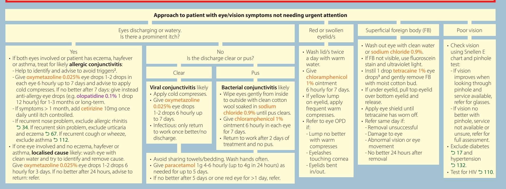

1Do not mix Ringer's lactate and IV ceftriaxone. Flush IV line with sodium chloride 0.9% before and after IV ceftriaxone. 2Common triggers include pollens, household pets, house dust mite, cockroaches and moulds. 3Strictly avoid giving tetracaine eye drops to patient to take home as they can cause blindness if used too often.

### **FACE SYMPTOMS**

#### **Give urgent attention to the patient with face symptoms and any of:**

- New sudden asymmetric weakness or numbness of face (with no/minimal forehead involvement), arm or leg; difficulty speaking or visual disturbance: consider **stroke** or **TIA** [136](#page-132-0).
- •Sudden face/tongue swelling and any of: difficulty breathing, BP < 90/60, dizziness/collapse, abdominal pain, vomiting or exposure to possible allergen1, check for anaphylaxis [20](#page-16-0).
- •Painful red facial swelling and temperature ≥ 38°C: **facial cellulitis** likely
- New swelling of face and blood/protein in urine: **kidney disease** likely

**[TB](#page-85-0)**

**CONTENTS SYMPTOMSCONTENTS CHRONIC CONDITIONS**

### **Manage and refer urgently:**

•

- If likely facial cellulitis with if whole eyelid swollen, red and painful, **orbital cellulitis** likely: give ceftriaxone 2g IV2/IM. Avoid injecting > 1g IM at one injection site.
- •If **kidney disease** likely: if pulse > 100 or respiratory rate > 30, give face mask oxygen and furosemide 80mg slow IV, avoid IV fluids. If BP > 150/100, give amlodipine 5mg and furosemide 40mg orally.

| Ap h t ien it h fac d ing ion at t w to t n t a tte nt p roa c o p e s y mp ms no ee ur g en f ra h o fac 6 I 7. s n e • f g h p b lem  I 3 6. to ot um or ro • Ma d fac /s: ing to tom na g e a cco r e s y mp • |                                                                                                                                                                                                                                                                                                                                                                                                                                                  |                                                                                                                                                                                                                                                                                                                                                                                                                                                                                                                                                                                                                                                                                                                                                                                                                                                                                                                                                                                                                                                                                                                                                                                                                                                                                                                  |                                                                                                                                                                                                                                                                                                                                                                                                                                                                                                                                                                                                                                                                                                                                                                                                                                                                       |                                                                                                                                                                                                                                                                                                                                                                                                                                                                                                                                                                                                                                                                                                                                                                                                                                                                                                                                                                                                                                                                                                                                                                                                                                         |                                                                                                                                                                                                                                                                                                                                                                                                                                                                                                                                                             |  |
|---------------------------------------------------------------------------------------------------------------------------------------------------------------------------------------------------------------------------------------------------------------------------------------------------------------------------------------------------------------------------------------------------------------------------------|--------------------------------------------------------------------------------------------------------------------------------------------------------------------------------------------------------------------------------------------------------------------------------------------------------------------------------------------------------------------------------------------------------------------------------------------------|------------------------------------------------------------------------------------------------------------------------------------------------------------------------------------------------------------------------------------------------------------------------------------------------------------------------------------------------------------------------------------------------------------------------------------------------------------------------------------------------------------------------------------------------------------------------------------------------------------------------------------------------------------------------------------------------------------------------------------------------------------------------------------------------------------------------------------------------------------------------------------------------------------------------------------------------------------------------------------------------------------------------------------------------------------------------------------------------------------------------------------------------------------------------------------------------------------------------------------------------------------------------------------------------------------------|-----------------------------------------------------------------------------------------------------------------------------------------------------------------------------------------------------------------------------------------------------------------------------------------------------------------------------------------------------------------------------------------------------------------------------------------------------------------------------------------------------------------------------------------------------------------------------------------------------------------------------------------------------------------------------------------------------------------------------------------------------------------------------------------------------------------------------------------------------------------------|-----------------------------------------------------------------------------------------------------------------------------------------------------------------------------------------------------------------------------------------------------------------------------------------------------------------------------------------------------------------------------------------------------------------------------------------------------------------------------------------------------------------------------------------------------------------------------------------------------------------------------------------------------------------------------------------------------------------------------------------------------------------------------------------------------------------------------------------------------------------------------------------------------------------------------------------------------------------------------------------------------------------------------------------------------------------------------------------------------------------------------------------------------------------------------------------------------------------------------------------|-------------------------------------------------------------------------------------------------------------------------------------------------------------------------------------------------------------------------------------------------------------------------------------------------------------------------------------------------------------------------------------------------------------------------------------------------------------------------------------------------------------------------------------------------------------|--|
| Pa in on Re nt cu rre int en se, f ic l, ia su p er b b ing sta in p a ig ina l Tr em lg li ke ly ia ne ura G ive •                                                                                                                                                                                           | de f fac i on e s o e Pre hin les vio us s g on de f fac i sam e s o e he Po ic st- et rp lg li ke ly ia ne ura G itr ip l ine 3 ive ty am • (or f ≥ 25 10 i mg mg ht. f 65 ) a ig I t n y ea rs in no re sp on se, cre ase | Fac in e p a he hin for he d he ks, he da he Pa in /c n p us g on e a e a c w for be d d. T hic k n l /p l ing ost wo rse on n wa r asa na sa d ha l d. isc t c rg e, r ec en om mo n c o li ke ly S inu it is s l 1 ho ly G ive 4-6 (up in tam to 4g p ara ce o g ur • ho ) a de d for da 24 5 to urs s n ee up y s. d h lor de dro de d. G ive ium i 0. 9 % so c no se p s a s n ee • l dro h n l G ive ine 0. 05 % 2 in ri taz ost ox y me o p s ea c • ho ly de d for f 5 da A dv 8 xim ise ur as ne e a ma um o y s. hic h m b loc ke d n ins t o ag a ve rus e w ay wo rse n ose f sy da fev len l I 10 ≥ 3 8 °C, tom t n s ≥ mp y s, er p uru asa • | Su d de kn ive n p rog res s w ea ess f o de f fac d u b le i o ne s o e a n na for k le he d o los to in wr e a r c e e y e. ha d t Ma im ire ast y ve p a e dry or ey e. Be l l 's p lsy li ke ly a G dn ive iso p re ne as so on as • b le (w hin ho i it 48 p oss urs f o da ly ): g ive 6 0m i t o nse g for da I f n be fte 7 tte y s. o r a r da fer 10 s, r e y Pro tec t e y e: • A dv b e ise at ien t n ot to p ru y e. - | Sw l lin f fac e g o e les l lin f lip fu l sw l lin f Pa in /ey Pa in s s we g o s es e g o f fac / bo h s de t i on e s o h fev he da he wi t er, a c An ioe de li ke ly g ma bo dy in. p a f a bst I irw ion t ay o ruc , as ses s • d m  irw 14 an an ag e a ay d m for hy lax li ke ly is Mu an an ag e an ap mp s  G l 20 ive tam p ara ce o • f n bst ho ly (up I irw ion 1g 4- 6 t o a ay o ruc ur : • f u h p ho i ica ria itc in 24 ) rt t, to 4g or res en urs ir iz ine de d for ive t 10 to g ce mg or as ne e up ha da ine 25 -5 0m I M. 5 et p rom z g y s. f o l: s l, dv I ri ri A ise ien at t |                                                                                                                                                                                                                                                                                                                                                                                                                                                                                                                                                             |  |
| l tam p ara ce o ho ly 1g 4- 6 ur de d. as ne e f n de d, I ee • d d t do l a ram a ho ly. 5 0m 6 g ur fer Re • 1Co alle inc lud mm on rge ns                                                                                                                                      | by 25 mg ev ery ks, 2 w 75 to ee up mg f n de d. i ee f p ks, in ≥ 4 a w ee • d a dv ise ass ess an  61 f p fer I oo r re sp on se, re • foo edi ion d o r in t b ite/ cat e m sec                                                                                                  | fac d ha da isc in ≥ 3 tom rg e, e p a y s, o r sy mp s w ors en fte l im f c l d, r in it ia ive t o a p rov em en om mo n c o g l l ho ly for da f se ic i in 5 0 0m 8 5 I am ox g ur y s. ve re l lin l ler 4, g d a it hro in ic i ive in ste p en a g y a z my c da ly for da 5 0 0m i 3 g y s. f re for  I H I V 11 0. nt, te st cu rre • fer f: Re i • h i fec To ion ot t n - l lin d e Sw inu e g ov er s s o r a rou n e y - f fn Ne k s t i c ess - Po to tre atm t or res p on se en - few . 2D stin ithi n th ho mix Rin 's la nd IV c ast ot cta te a g w e p urs o n ger                                                                                                                                                    | h dro Ke ist wi t ep ey e m o p s. - h t Co it nt ve r e y e w ran sp are - f hie l d du he da rin t i ey e s g y, la b le. i ava li d c los d a ht. Ta ig t n p e e y e e - fer f: Re da i sa me y • Ot d it is m ia e - ha he C in ing ng e ar - Re he d nt inj ce a ury - Da e t ma g o c orn ea - f d Un iag is su re o no s - eft riax . Flu sh IV l ine wi th s od ium ch lor ide one                                                                                       | lap lap top n e na en a d e du sta rt a cat ne ve r re n e d fut ien i it in at t to p av o ure d Do vie ica ion cto r to t re w me fy He lp de d a dv to i nt i ise to an • d t 5. i rig avo g ers l sw l lin lve Mo nit i t or un e g res o s. • f sw I l lin lvin t re e g no so g or no • bv fer da iou o s c au se, re sa me y. d Re in ien 's n at t ote co r p s. • A dv ly ise to tur t re n u rg en • f d f f ic lty bre hin i i at u g or tom sy mp s w ors en efo afte ftri 3A d if 0.9 % b nd r IV voi re a ce axo ne.                                                                                                                                                                                                   | p / he etu to s ca n r rn k a fte da r 5 wo r y s d t ha t sy tom an mp s l ly lve usu a res o hin ks. wi 2 t we e fer f: Re i • f fn Ne k s t i c ess - Pa fu l sc l in rot a - l lin sw e g f Lo he ing ss o ar - b do l p A mi in na a - f be daq uili 4H isto on ne. ry o |  |

anaphylaxis, urticaria or angioedema. 5Common triggers include foods (milk, eggs, nuts, wheat, seafood), medications, insect bites/stings and latex.

**[HIV](#page-102-0) [CHRONIC RESPIRATORY DISEASE](#page-119-0) [CARDIOMETABOLIC CONDITIONS](#page-123-0) [MUSCULOSKELETAL DISORDERS](#page-147-0) [MENTAL HEALTH](#page-136-0) [EPILEPSY](#page-145-0) [WOMEN'S HEALTH](#page-150-0) [PALLIATIVE CARE](#page-166-0)**

**[HEPATITIS B \(HBV\)](#page-116-0) [COVID-19](#page-117-0)**

### **EAR/HEARING SYMPTOMS**

 If ear also itchy, consider otitis externa (see adjacent). Able to view eardrum?Discharge from ear Painful ear If normal looking ear, **referred pain** likely, check mouth and face: If gum or tooth problem [36](#page-32-0). If painful swelling of one/both sides of face, **mumps** likely [32](#page-28-0). If pain in temporomandibular joint, check for joint problem [62](#page-58-0). If red bulging eardrum, **acute otitis media** likely: ©University of Cape Town Symptoms for < 2 weeks**Chronic suppurative otitis media** likely Clean ear1repeatedly. If poor response to treatment, test for HIV [110](#page-106-0) and TB [92](#page-88-0). • Refer if: No better after 4 weeks Hole in eardrum large, not getting smaller after 3 months, or persists > 6 months. Difficulty hearing Yellow/white deposit on eardrum, **cholesteatoma**likely. Refer same day if: Painful swelling behind ear, **mastoiditis** likely Neck stiffness Any of: Pain > 2 days Pain that wakes patient at night Temperature ≥ 38°C in past 2 days YesYesTreat for **acute otitis media**: No Give paracetamol 1g 4-6 hourly (up to 4g in 24 hours) as needed for up to 5 days. • If no better in 2 days, advise to return: treat for **acute otitis media:**NoItchy ear **Otitis externa** likely Clean ear.1 After cleaning, instil acetic acid 2% in alcohol 4 drops in ear 6 hourly for 5 days. Give paracetamol 1g 4-6 hourly (up to 4g in 24 hours) as needed for up to 5 days. If severe pain, firm red swelling or temperature ≥ 38°C, give flucloxacillin2 500mg *or* cefalexin 500mg 6 hourly for 5 days. Refer if: No better after 5 days Blisters on ear, **herpes zoster** likely Red swollen painful ear lobe, **cellulitis** likely Redness, swelling and/or pus in ear canal ©University of Cape Town Symptoms ≥ 2 weeks, hole in eardrum©University of Cape Town Difficulty hearing or tinnitus If on amikacin, discuss with TB doctor. If itchy/painful ear or discharge from ear, see adjacent column/s. Look in ear for foreign body and wax: Foreign body Syringe ear/s with warm water. Avoid syringing and refer instead if: Hole in eardrum Chronic suppurative otitis media If unsuccessful after 3 attempts or causes pain, stop and refer/ discuss with doctor. If hearing no better after foreign body/ wax removal, refer for hearing test. Wax Arrange hearing test. Look for cause: Ask about prolonged exposure to loud noise. Review medication: aspirin, NSAIDs and furosemide. Refer if : Sudden onset One-sided Dizziness/vertigo Patient taking amikacin Normal looking ear ©University of Cape Town **How to syringe an ear** Fill a large syringe (50-200mL) with warm water. Ask patient to hold container under ear against neck to catch water. Gently pull ear upwards and backwards to straighten ear canal. Place tip of syringe at ear canal opening (no further than 8mm into canal) and direct water spray upwards in ear canal. Ask about ear itch, discharge from ear, ear pain or difficulty hearing/tinnitus (ringing/buzzing in ear/s). Then look in ear. **Acute otitis media** likely Give paracetamol 1g 4-6 hourly (up to 4g in 24 hours) as needed for up to 5 days. • Give amoxicillin2 1.5g 12 hourly for 5 days. If patient has had amoxicillin in last 30 days: give instead amoxicillin/clavulanic acid2 875/125mg 12 hourly for 5 days. If nose symptoms, consider and treat for **allergic rhinitis** [34](#page-30-0). If discharge, clean ear1 and avoid getting ear wet. If recurrent episodes, test for HIV [110](#page-106-0) and refer. If no response to treatment after 3 days, refer. Refer same day if: neck stiffness or painful swelling behind ear, **mastoiditis** likely

1Cleaning the ear (dry mopping): roll a piece of clean soft tissue into a wick. Carefully insert wick into ear with twisting action. Remove wick and replace with clean dry wick. Repeat until wick is dry when removed. Never leave wick or other object inside ear. The ear can only heal if dry. 2If severe penicillin allergy (history of anaphylaxis, urticaria or angioedema), give instead azithromycin 500mg daily for 3 days.

**[HIV](#page-102-0) [COVID-19](#page-117-0) [CHRONIC RESPIRATORY DISEASE](#page-119-0) [HEPATITIS B \(HBV\)](#page-116-0) [CARDIOMETABOLIC CONDITIONS](#page-123-0) [MUSCULOSKELETAL DISORDERS](#page-147-0) [MENTAL HEALTH](#page-136-0) [EPILEPSY](#page-145-0) [WOMEN'S HEALTH](#page-150-0) [PALLIATIVE CARE](#page-166-0)**

**[TB](#page-85-0)**

**CONTENTS SYMPTOMSCONTENTS CHRONIC CONDITIONS**

### **NOSE SYMPTOMS**

**Give urgent attention to the patient with nose symptoms and:** 

Head injury with clear watery discharge from nose [18](#page-14-0).

**Refer urgently.**

|                                                                                                                                                                                                                                                                                                                                                                                                                                                                                                                                                                                                                                                                                                                                                                                                                                                                                                                                                                                                                                                                                                                                                                                                                                                                                                                                                                                                                                                                                                                                                                                                                                                                                         | h t he ien it h n Ap o t at t w p roa c p os Ma na g e a cco                                                                                                                                                                                                                                                                                                                                                                                                                                                                                                                                                                                                                                                                                                                                                                                                                                                                                                                                                                                                                                                                                                                                                                                                                                                                                                                                                                                                                                                                                                                                                                                                                                                                                                                                                                                                                                                                                                                                                                                                                                                                                            | d ing ion to t n t a tte nt e s y mp ms no ee ur g en d ing /s: to tom r no se sy mp                                                                                                                                                                                                                                                                                                                                                                                                                                                                                                                                                                                                                                                                                                                                                                                                                                                                                                                                                                                                                                                                                                                                                                                                                                                                                                                                                                                                                                                                                                                                                                                                                                                                                                                                                                                                                                                                                                                                                                                                                                                                                                                                                                                                                                                                                                                                                                                                                                                                                                    |                                                                                                                                                                                                                                                                                                                                                                                                                                                                                                                                                                                                                                                                                                                                                                                                                                          |                                                                                                                                                                                                                                                                                                                                                                                                                                                                                                                                                                                                                                                                                                                                                                                                                                                                                                                                                                                                                                                                                                                                                                                                                                                                                                                                                                                                                                                                                                                                                                                                                                                                                                                                                                                                                                                                                                                                                                                                                                                                                                                                                           |
|-----------------------------------------------------------------------------------------------------------------------------------------------------------------------------------------------------------------------------------------------------------------------------------------------------------------------------------------------------------------------------------------------------------------------------------------------------------------------------------------------------------------------------------------------------------------------------------------------------------------------------------------------------------------------------------------------------------------------------------------------------------------------------------------------------------------------------------------------------------------------------------------------------------------------------------------------------------------------------------------------------------------------------------------------------------------------------------------------------------------------------------------------------------------------------------------------------------------------------------------------------------------------------------------------------------------------------------------------------------------------------------------------------------------------------------------------------------------------------------------------------------------------------------------------------------------------------------------------------------------------------------------------------------------------------------------|---------------------------------------------------------------------------------------------------------------------------------------------------------------------------------------------------------------------------------------------------------------------------------------------------------------------------------------------------------------------------------------------------------------------------------------------------------------------------------------------------------------------------------------------------------------------------------------------------------------------------------------------------------------------------------------------------------------------------------------------------------------------------------------------------------------------------------------------------------------------------------------------------------------------------------------------------------------------------------------------------------------------------------------------------------------------------------------------------------------------------------------------------------------------------------------------------------------------------------------------------------------------------------------------------------------------------------------------------------------------------------------------------------------------------------------------------------------------------------------------------------------------------------------------------------------------------------------------------------------------------------------------------------------------------------------------------------------------------------------------------------------------------------------------------------------------------------------------------------------------------------------------------------------------------------------------------------------------------------------------------------------------------------------------------------------------------------------------------------------------------------------------------------------------------------------------------------------|-----------------------------------------------------------------------------------------------------------------------------------------------------------------------------------------------------------------------------------------------------------------------------------------------------------------------------------------------------------------------------------------------------------------------------------------------------------------------------------------------------------------------------------------------------------------------------------------------------------------------------------------------------------------------------------------------------------------------------------------------------------------------------------------------------------------------------------------------------------------------------------------------------------------------------------------------------------------------------------------------------------------------------------------------------------------------------------------------------------------------------------------------------------------------------------------------------------------------------------------------------------------------------------------------------------------------------------------------------------------------------------------------------------------------------------------------------------------------------------------------------------------------------------------------------------------------------------------------------------------------------------------------------------------------------------------------------------------------------------------------------------------------------------------------------------------------------------------------------------------------------------------------------------------------------------------------------------------------------------------------------------------------------------------------------------------------------------------------------------------------------------------------------------------------------------------------------------------------------------------------------------------------------------------------------------------------------------------------------------------------------------------------------------------------------------------------------------------------------------------------------------------------------------------------------------------------------------------------------------------------------------------------------------------------|------------------------------------------------------------------------------------------------------------------------------------------------------------------------------------------------------------------------------------------------------------------------------------------------------------------------------------------------------------------------------------------------------------------------------------------------------------------------------------------------------------------------------------------------------------------------------------------------------------------------------------------------------------------------------------------------------------------------------------------------------------------------------------------------------------------------------------------|-----------------------------------------------------------------------------------------------------------------------------------------------------------------------------------------------------------------------------------------------------------------------------------------------------------------------------------------------------------------------------------------------------------------------------------------------------------------------------------------------------------------------------------------------------------------------------------------------------------------------------------------------------------------------------------------------------------------------------------------------------------------------------------------------------------------------------------------------------------------------------------------------------------------------------------------------------------------------------------------------------------------------------------------------------------------------------------------------------------------------------------------------------------------------------------------------------------------------------------------------------------------------------------------------------------------------------------------------------------------------------------------------------------------------------------------------------------------------------------------------------------------------------------------------------------------------------------------------------------------------------------------------------------------------------------------------------------------------------------------------------------------------------------------------------------------------------------------------------------------------------------------------------------------------------------------------------------------------------------------------------------------------------------------------------------------------------------------------------------------------------------------------------------|
|                                                                                                                                                                                                                                                                                                                                                                                                                                                                                                                                                                                                                                                                                                                                                                                                                                                                                                                                                                                                                                                                                                                                                                                                                                                                                                                                                                                                                                                                                                                                                                                                                                                                                         | lee d B ing no se                                                                                                                                                                                                                                                                                                                                                                                                                                                                                                                                                                                                                                                                                                                                                                                                                                                                                                                                                                                                                                                                                                                                                                                                                                                                                                                                                                                                                                                                                                                                                                                                                                                                                                                                                                                                                                                                                                                                                                                                                                                                                                                                                                              |                                                                                                                                                                                                                                                                                                                                                                                                                                                                                                                                                                                                                                                                                                                                                                                                                                                                                                                                                                                                                                                                                                                                                                                                                                                                                                                                                                                                                                                                                                                                                                                                                                                                                                                                                                                                                                                                                                                                                                                                                                                                                                                                                                                                                                                                                                                                                                                                                                                                                                                                                                                                                                                                       |                                                                                                                                                                                                                                                                                                                                                                                                                                                                                                                                                                                                                                                                                                                                                                                                                                          |                                                                                                                                                                                                                                                                                                                                                                                                                                                                                                                                                                                                                                                                                                                                                                                                                                                                                                                                                                                                                                                                                                                                                                                                                                                                                                                                                                                                                                                                                                                                                                                                                                                                                                                                                                                                                                                                                                                                                                                                                                                                                                                                                           |
| hro fev So t at re or er l fec li ke ly Ac ira in ion ute t v f lu ( li ke l d, C O V I D- ) in 19 co mm on co en za or f te °C, hi l ls o bo dy I 3 8 in, tur e ≥ mp era c r p a • f lu li ke ly. in C O V I D- 19 en za or m ore for  As C O V I D- 19 40 ses s - dv k in do d s l A ise ia to w ea r m as ors an oc • d hi le l l, a d c h ista W i it tac t w nc e. un we vo on l de ly ho h c hro d /t wi nic ise /g t e r se ase s rou p s, h ha ds wa s n l 1 ho ly (up G ive 4-6 4g in 24 tam to p ara ce o g ur • ho de d for da ) a to 5 urs s n ee up y s. Exp la b de d. A dv in i iot ics ise t ot to an ar e n ne e • d m hy dra int in ion t a t res n a a dv f w f A ise n i ing i to tur tom re ors en sy mp s: • f f ic  f fac h / d lty bre hin i at 3 8, i in co ug u g e p a  f e  3 2, i in 3 3. ar p a | he hin for he d Pa in w / n p us g on e a he ks, he da he be d ing c e a c w ors e o n n for d, l d t c wa r rec en om mo n c o S inu it is li ke ly s l 1 ho ly G ive 4-6 tam p ara ce o g ur • (up 24 ho ) a de d to 4g in urs s n ee for da 5 to up y s. d h lor de G ive ium i 0. 9 % so c no se • dro de d. p s a s n ee G l ine ive taz 0. 05 % 2 ox y me o • dro h n l 8 ho ly in ri ost p s ea c ur as de d for f 5 da xim ne e a ma um o y s. A dv hic h m ise ins t o ag a ve rus e w ay b loc ke d n wo rse n ose f sy da fev I 10 tom s ≥ mp y s, er • fac °C, len d ha ≥ 3 8 t isc p uru rg e, e da in ≥ 3 tom p a y s, o r sy mp s fte l im r in it ia t, wo rse n a p rov em en ic i l l in ho ly ive 5 0 0m 8 g am ox g ur for da f se l lin 5 I ic i y s. ve re p en l ler 1, g d a hro ive in it in ste a g a my c y z for da ly da 5 0 0m i 3 g y s.  f re for I H I V 11 0. nt, te st cu rre • f p b fer I i iot ic, to t oo r re sp on se an re • fer f: Re da i sa me y • h i fec To ion ot t n - l lin d e Sw inu e g ov er s s o r a rou n e y - k s f fn Ne i t c ess - | y mp hy b loc ke d Re ing itc /ru / nt cu rre sne ez or nn y da for ks. ha 4 w Ma st > no se mo y s ee y ve hy hro itc r t at. ey es, ea rs o l ler ic h in it is li ke ly A g r lp de fy d a dv d He i i ise i to nt to an av o • 2. tr ig g ers G f lu 3 n l sp ive ica 10 0m t so ne asa ray cg • ( ) h n l tw da dv 1 s in ri ice A ise ost p ray ea c a y. le o ds d ien im at t to utw p a no zz ar an ds d a d s f f in ly. i ni vig up wa r an vo g oro us h lor he ho ly G ive ine 4m 6- 8 c p na m g ur • de d for da ly he to 5 as ne e up y s o n w n (s de f fe da ). tom i ct is s t ion sy mp s w ors en e e f n b loc ke d a ht, I ig ive t n ose ve ry g • l dro h ine 0. 05 % 2 in taz ox y me o p s ea c for f 5 l at ht da str i ni xim no g a ma um o y s. dv hic h m A ise ins t o ag a ve rus e w ay wo rse n b loc ke d n ose f re I b lem lu de l ler nt ic cu rre ey e p ro , ex c a g •  nj ivit is 31 ct co un f re kin b lem lu de I ica ria nt t cu rre s p ro , ex c ur •  d e 67 an cze ma f re h o he lu de I nt cu rre co ug r w eze , ex c • hm  12 3. ast a fte f sy Rev r 3 hs: l l iew nt i tom t i a mo mp s s • l le d de d a d he ite t c tro to no on sp g oo ren ce l sp d d c ht. ir iz ine 10 ni et at na sa ray , a mg g f sy d p de I ist ite tom mp s s ev ere an ers sp • fer tre atm t, r en e | Ru nn y no se h p wi iste t nt ers h, a d /o co ug n r fre hro nt t at q ue lea rin c g Up irw p er a ay h co ug dro sy n me l dr (p ip ) tn os asa li ke ly he k t hro C at: c • ion ret sec s o r b b les ton co e ap p ea ran ce be at ma y se en f t ba k o hro at. c for Tre at as • l ler ic a g h in it is (se r e d j nt a ace lum ). co n f n I o • im t p rov em en fte ks, r 2 a we e fer / d isc re uss | Fir ly h n ls t he inc ost ri et m p og r • for h p 10 inu it ien tes at t m w d lea for d. itt ing nin s an g wa r C he k B P: c • f < / d I 9 0 6 0, g ive ium so - h lor de d ly, i 0. 9 % 1 L I V r i c ap l sy lic B P > t u nt i sto 9 0. rep ea Co ho ly. Sto f inu e 1 L 6 i nt ur p bre hin at g wo rse ns. f ≥  I 0 / 9 0 13 2. 14 - f st l l b lee d I i ing ins ert • , b h do for f f in ism io ut m p ara ke d r b bo ( B I P P ) so i ast p e a n l /s: int ri ost g au ze o n f b lee d dv I ing ise st to op s, a - da ret xt to urn ne y rem ov e B I P P g au ze. f b lee d fer I ing ists p ers , re - ly. t urg en f p I at ien t o irin n a sp or • far do in, vie cto r to wa r re w d d f o far ica ion i in, t me an n w ar he k I N R. c c dv d n kin A ise i ic to av o ose -p g • d c f re i tac t s ort nt an on p cu rre b lee ds f c l ly b b hy I inu ing itc t on a ru or • de l ler hin i ic r it is no se, co ns r a g (se d ). j nt e a ace f re b lee ds d n I nt cu rre an o • h a bo im it t w p rov em en ve fer t, r ma na g em en e |
| 1Hi f an hy laxi dem a. 2 Co rtic aria ioe trig sto ry o ap s, u or ang mm on ger                                                                                                                                                                                                                                                                                                                                                                                                                                                                                                                                                                                                                                                                                                                                                                                                                                                                                                                                                                                                                                                                                                                                                                                                                                                                                                                                                                                                                                                                                                                                              | clu de llen hou seh old hou se d s in ite, ts, ust po s, pe m co                                                                                                                                                                                                                                                                                                                                                                                                                                                                                                                                                                                                                                                                                                                                                                                                                                                                                                                                                                                                                                                                                                                                                                                                                                                                                                                                                                                                                                                                                                                                                                                                                                                                                                                                                                                                                                                                                                                                                                                                                                                                                              | ckr hes d m lds. 3If lop vir/ ir/r ina rito ir o r at oac an ou on nav aza nav                                                                                                                                                                                                                                                                                                                                                                                                                                                                                                                                                                                                                                                                                                                                                                                                                                                                                                                                                                                                                                                                                                                                                                                                                                                                                                                                                                                                                                                                                                                                                                                                                                                                                                                                                                                                                                                                                                                                                                                                                                                                                                                                                                                                                                                                                                                                                                                                                                                                                                                                  | oid flu iton avi tica r, av son                                                                                                                                                                                                                                                                                                                                                                                                                                                                                                                                                                                                                                                                                                                                                                                        | dis s/re fer ead inst e, cus                                                                                                                                                                                                                                                                                                                                                                                                                                                                                                                                                                                                                                                                                                                                                                                                                                                                                                                                                                                                                                                                                                                                                                                                                                                                                                                                                                                                                                                                                                                                                                                                                                                                                                                                                                                                                                                                                                                                                                                                                                                                                                            |

**[TB](#page-85-0) CONTENTS SYMPTOMS CONTENTS CHRONIC CONDITIONS[HIV](#page-102-0) [CHRONIC RESPIRATORY DISEASE](#page-119-0) [CARDIOMETABOLIC CONDITIONS](#page-123-0) [MUSCULOSKELETAL DISORDERS](#page-147-0) [MENTAL HEALTH](#page-136-0) [EPILEPSY](#page-145-0) [WOMEN'S HEALTH](#page-150-0) [PALLIATIVE CARE](#page-166-0)**

**[HEPATITIS B \(HBV\)](#page-116-0) [COVID-19](#page-117-0)**

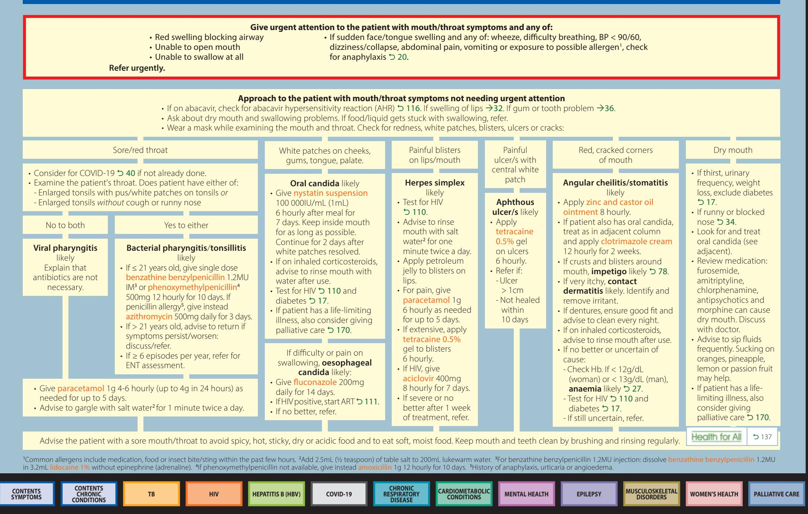

### **GUM/TEETH SYMPTOMS**

- **Give urgent attention to the patient with gum/teeth symptoms and any of:**
- Temperature ≥ 38°C and swelling of face/jaw/next to tooth
- •Unable to eat or drink
- •Tooth pain that is felt without touching tooth/gum or that wakes patient at night

### **Refer urgently.**

© BMJ Best Practice

### **Approach to the patient with gum/teeth symptoms not needing urgent attention:**

- Is there tooth pain, red or bleeding/enlarged gums?
- Look in mouth: lift lips to look at teeth and gums:

Brown/black staining of teeth at gumline, holes, pits or missing teeth. May have tooth pain with hot or cold food/drink.

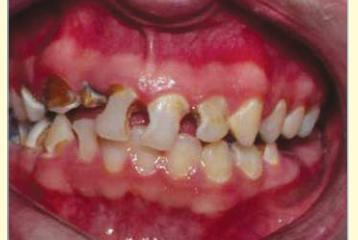

© BMJ Best Practice

### **Dental caries** likely

- Advise patient to care for his/her mouth (below).
- Refer to dentist.

### **Gum problem** likely

- Advise patient to care for his/her mouth (below).
- Review medication: phenytoin and amlodipine may cause gum overgrowth. Discuss with doctor.
- Rinse mouth with salt water mouthwash1 for 1 minute twice a day.
- If no better with good mouth care, rinse with chlorhexidine 0.2% mouthwash twice a day for 5 days, after brushing teeth: Swirl in mouth but do not swallow.
- Avoid repeated use as can damage teeth.
- Advise to avoid eating/drinking for 30 minutes after rinsing.
- Give as needed for pain paracetamol 1g 4-6 hourly (up to 4g in 24 hours) for up to 5 days.
- Refer to dentist if:

•

- No better after 5 days
- Foul-smelling breath
- Swollen gums
- Temperature ≥ 38°C
- Mobile teeth
- Loss of gum or bone around tooth
- HIV or diabetes

Previous/current tooth pain with pus in mouth, swelling next to tooth

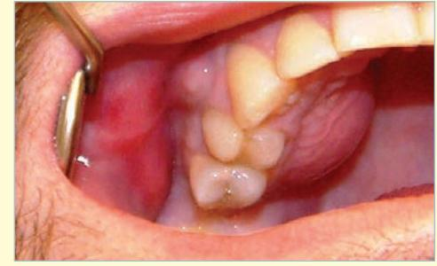

© University of Cape Town

### **Dental abscess** likely

- Give paracetamol 1g 4-6 hourly (up to 4g in 24 hours) for up to 5 days.
- Give amoxicillin 500mg 8 hourly for 5 days. If penicillin allergic, give instead azithromycin 500mg daily for 3 days.
- Give metronidazole2 400mg 8 hourly for 5 days.
- Refer to dentist.
- Advise to return and refer urgently if symptoms worsen, temperature ≥ 38°C or no better after 2 days.
- Refer same day if > 65 years, alcohol/drug misuse, HIV or diabetes.

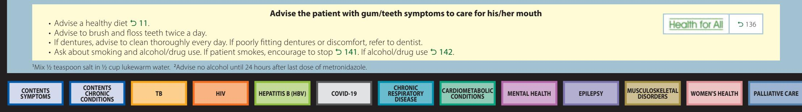

### **CHEST PAIN**

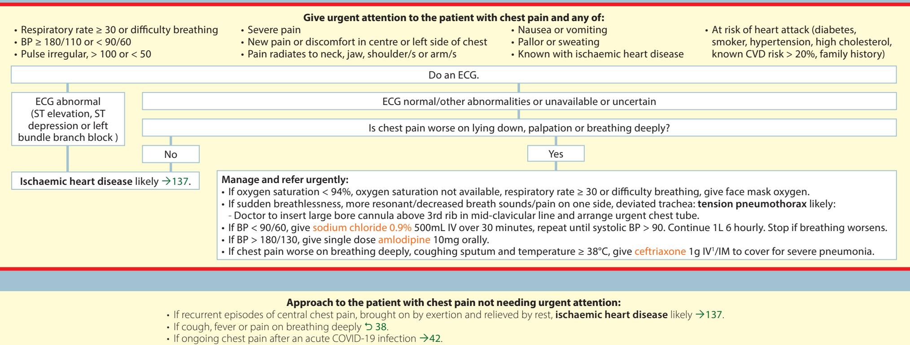

Ask about site of pain and associated symptoms:

| l o h e hu ly do / be d for d Re ig ric in wi ing ing ing tro ste ast t at rna r e p p a ng er or wn n wa r ,                                                                                                                                                                                                                                                                                                                                                                                                                                                                                                                                                                                                                                                                                                                                                            | de ho dra l j Te ion t c ost ct n r a oc n un , fev h no er or co ug                                                                                                                                                                                                                            | Bu rni in ng p a de f i on on e s o                      |
|-----------------------------------------------------------------------------------------------------------------------------------------------------------------------------------------------------------------------------------------------------------------------------------------------------------------------------------------------------------------------------------------------------------------------------------------------------------------------------------------------------------------------------------------------------------------------------------------------------------------------------------------------------------------------------------------------------------------------------------------------------------------------------------------------------------------------------------------------------------------------------------------------------------------------------------------------------------------------------------|----------------------------------------------------------------------------------------------------------------------------------------------------------------------------------------------------------------------------------------------------------------------------------------------------------------------------------------------------------------|----------------------------------------------------------------------------------------------|
| ( he bu ) li ke ly Dy ia art sp ep s rn fen  f fe foo f izz A dv N S A I D S ( bu /as ), q kin lim lco ho l, c d, dr ks, late ht ls. ise to st i irin it s 14 1, it a ine icy in ni op p ro p u mo g a , sp y g me a •  f w fer (w ) o (m ), a C D r k I ist irc > 8 0c r 9 4c V is 12 7. a c um en ce m om an m an sse ss •                                                                                                                                                                                                                                                                                                                            | Mu los ke let l p b lem li ke ly scu a ro G bu fen ho ly h ive i 40 0m 8 wi t p ro g ur •                                                                                                                                                                            | bo dy h o it w r ho h wi t ut ras                           |
| lan le 2 3 da ly for da G ive 0m i 14 to so p raz o g up s. y • fer k i f a f: n be fte da fu l d f f ic lty l low Re in / i ing iste tte r 7 s t tm t, s tom tur nt sa me w ee ny o o r a y rea en y mp s re n, p a u sw a , p ers • b do l m b loo d l (oc lt b loo d p ), w ht los H b < (w ) o (m ), n mi ing mi in mi it ive ig 12 13 t t o r st r < vo , a na ass vo oo cu os e s, om an an ew , d > fam ly his f st h ha l ca in 5 0 y i /o tor p a an ea rs, or o om ac eso p g ea nc er. y | foo d for da (av d f p 5 i i ic to t up s o ep y lce hm hy he ion st ert art u r, a a, p en s , fa lur ki dn d ). i ise e o r ey ase f p ks, fer I in ists 4 w a p ers > ee re • | He ste rp es zo r h les (s ing ) 6 li ke ly 8. |
| f d fer k. I iag is u in, ert no s nc a re sa me ee w                                                                                                                                                                                                                                                                                                                                                                                                                                                                                                                                                                                                                                                                                                                                                                                                                                                                          |                                                                                                                                                                                                                                                                                                                                                                |                                                                                              |

1Do not mix Ringer's lactate and IV ceftriaxone. Flush IV line with sodium chloride 0.9% before and after IV ceftriaxone. 2Avoid if on atazanavir/ritonavir. Discuss with specialist.

# **COUGH OR DIFFICULTY BREATHING**

### **Give urgent attention to the patient with cough or difficulty breathing and any of:**

• Wheeze/tight chest [39](#page-35-0)

- • BP < 90/60•
- Difficulty breathing worse on lying flat and leg swelling: **heart failure** likely [135](#page-131-0)•Confused or agitated

### **Manage and refer urgently:**

- •
- •Pulse > 120

- Oxygen saturation < 92% at rest, or sats drop to < 87% on exertion (walking 15-20m)
- Coughs ≥ 1 tablespoon fresh blood
- Swelling and pain in one calf

 Sudden breathlessness, more resonant/decreased breath sounds/pain on 1 side, deviated trachea, BP < 90/60: **tension pneumothorax** likely

•

If short of breath or oxygen saturation < 95%, give oxygen: 1-4L/min via nasal prongs or 6-10L/min via facemask (up to 10-15L/min via non-rebreather mask). Aim for oxygen saturation ≥ 90%.

•

- •If **tension pneumothorax** likely: insert large bore cannula above 3rd rib in mid-clavicular line. Arrange urgent chest tube.
- If BP < 90/60, give sodium chloride 0.9% 500mL IV over 30 minutes, repeat until systolic BP > 90. Continue 1L 6 hourly. Stop if breathing worsens.
- If rapid deep breathing, check glucose: if ≥ 11.1 [17](#page-13-0).
- •Check temperature: if referral delay > 2 hours, temperature ≥ 38°C and respiratory rate ≥ 30, give ceftriaxone1 1g IV/IM to treat for possible severe **bacterial pneumonia**.

| f f ic Ap h t he ien it h c h o d i lty bre h ing d ing ion o t at t w at t n t a tte nt p roa c p ou g r u no ee ur g en   for f o ba he k for ba hy ( R ) Te H I V 11 0. I ir, c ir it ivit ion A H 11 6. st ct n a cav c a cav p ers en s y rea • for d 1 le for  Te T B: s T B N A A T 9 2. st utu en sp m sam p • f p kes  I ien at t s e t top 14 1. mo , e nc ou rag o s • Ma fur he d du d r f c h o d f f ic lty bre hin ing ion i t to rat at na g e r a cco r an ec urr en ce o ou g r u g: •                                                                                                                                                                     |                                                                                                                                                                                                                                                                                                                                                                                                                                                                                                                                                                                                                                                                                                  |                                                                                                                                                                            |                                                                                                                                                                                                                                                                                                                                                                                                                                                                                                                           |                                                                                                                                                                                                                                                                                      |                                                                                                                                                                                                                            |                                                                                                                                                                                             |
|----------------------------------------------------------------------------------------------------------------------------------------------------------------------------------------------------------------------------------------------------------------------------------------------------------------------------------------------------------------------------------------------------------------------------------------------------------------------------------------------------------------------------------------------------------------------------------------------------------------------------------------------------------------------------------------------------------------------------------------------------------------------------------------------------------------------------------------------------------------------------------------------------------------------------------------------------------------------------------------------------------------------------------------------------------------------------------------------------------------------------------------------------------------------------------------------|--------------------------------------------------------------------------------------------------------------------------------------------------------------------------------------------------------------------------------------------------------------------------------------------------------------------------------------------------------------------------------------------------------------------------------------------------------------------------------------------------------------------------------------------------------------------------------------------------------------------------------------------------------------------------------------------------|----------------------------------------------------------------------------------------------------------------------------------------------------------------------------|---------------------------------------------------------------------------------------------------------------------------------------------------------------------------------------------------------------------------------------------------------------------------------------------------------------------------------------------------------------------------------------------------------------------------------------------------------------------------------------------------------------------------|--------------------------------------------------------------------------------------------------------------------------------------------------------------------------------------------------------------------------------------------------------------------------------------|----------------------------------------------------------------------------------------------------------------------------------------------------------------------------------------------------------------------------|---------------------------------------------------------------------------------------------------------------------------------------------------------------------------------------------|
| ha ha d c h < ks d Pat ien 2 it is n t ot t. s ou g we e an rec urr en                                                                                                                                                                                                                                                                                                                                                                                                                                                                                                                                                                                                                                                                                                                                                                                                                                                                                                                                                                                                                                                     |                                                                                                                                                                                                                                                                                                                                                                                                                                                                                                                                                                                                                                                                                                  |                                                                                                                                                                            | ha ha d c h d f f ic lty bre hin ks ha de Pat ien / i ≥ 2 iso t at nt s ou g u g w ee or s re cu rre ep s                                                                                                                                                                                                                                                                                                        |                                                                                                                                                                                                                                                                                      |                                                                                                                                                                                                                            |                                                                                                                                                                                             |
| f: p Is p hin h a lse °C ? at ien t c utu wi t te ≥ 1 0 0, r ira tor rat 20 te tur 3 8 e ≥ e ≥ ou g g sp m ny o u ra esp y or mp era                                                                                                                                                                                                                                                                                                                                                                                                                                                                                                                                                                                                                                                                                                                                                                                                                                                                                                                                 |                                                                                                                                                                                                                                                                                                                                                                                                                                                                                                                                                                                                                                                                                                  |                                                                                                                                                                            | f it hy b loc ke d n fre hro lea de de ly b lem  I / rin i ing 34 nt t at c ose , o r o r q ue c g, co ns r u n r no se p ro s • lso de hm d  d o he for h o d f f ic lty bre hin A i C O P D 12 3 a i t t at co ns r as a a n n r ca use co ug r u g: • |                                                                                                                                                                                                                                                                                      |                                                                                                                                                                                                                            |                                                                                                                                                                                             |
| No ira l in fec ion li ke ly Ac ute t v f re l d a d n ht I ig / nt t ce co n ow • he hin st o utu sor e c r co ug g sp m, bro h it is li ke ly. ute ac nc f fev hi l ls o bo dy I in, er, c r p a • f lu in C O V I D- 19 en za or m ore li ke ly. for C O As V I D- 19 ses s  40 A dv hat b ise t t i iot ics t an are no • de d. f p / fev I in ive ne e a er: g l 1g ho ly 4- 6 (up cet p ara am o ur for ho ) to 4g in 24 to 5 urs up da dv d hy dra A ise ion st a t y s. re n dv f sy A ise n i to tur tom re mp s • fev de lop wo rse n, a ne w er ve s be fte ks. r 2 tte or no r a we e | Ye s ia li ke ly Pn eu mo n f irm he h c k les bro hia l bre hin Co wi / st x t at n on c -ra y or rac nc g • lta t ion on au scu f p d he li ke ly d f f ic lt, fer I i to t c oo r a ren ce or acc ess ur g en are u re • f: lun he live ki dn d d be An H I V, > 65 / / / ise ia art tes y o y ea rs, g r ey ase • , lco ho l m ? isu or a se |                                                                                                                                                                            | h d dry H I V w it C D4 20 0 a < n f h, s ho bre h. rtn at co ug ess o Pn is p ia ( P P ) st J eu mo cy ne um on li ke ly f irm Do cto r to co n on •                                                                                                                                                                                                               | Pe iste nt rs rin sno g or lee p oo r s p bs O ive tru ct lee s p ap no ea                                                                                                                                      | Re nt ce up p er ira tor tra ct res p y fec in ion t , n o d f f ic lty bre hin i at g u fec Po in iou st- t s | ker Sm o or ly d t sto rec en p p e f w ht los I ig e s, • de lun i co ns r g  23 ca nc er |
|                                                                                                                                                                                                                                                                                                                                                                                                                                                                                                                                                                                                                                                                                                                                                                                                                                                                                                                                                                                                                                                                                                                                                                                              | 2 Ye ic i l l in /c lav lan ic a i d ive s: g am ox u c / ho ly for da 87 5 125 12 5 mg ur y s.                                                                                                                                                                                                                                                                                                                                                                                                                                                                                                  | 2 No ic i l l in ive : g am ox ho ly for da 1g 8 5 ur y s.                                                     | he st x c -ra y. le G ive im -tr co ox azo • ho ly for 3 20 / 16 0 0m 6 g, ur ks. I f < kg, du do 3 3 w 5 6 ee re ce se  G ive H I V r ine 11 1. t ou ca re • fer da f: x l Re i ica / aty sa me y -ra y p • la b le o i irat un ava r re sp ory 24 rat e >        | li ke ly f o ht I ig ve rw e •  12 7. Re fer f: i • larg d t ls, i en e on s bre hin / sto at p s g ho kes /g c asp s hi le s lee ing w p | h li ke ly co ug h Rea ssu re c ou g • ho l d r lve s u eso on its ow n.                                                                              | f co hin I ug g • utu sp m da f st mo y s o hs for 3 m t ≥ on                                                                   |
|                                                                                                                                                                                                                                                                                                                                                                                                                                                                                                                                                                                                                                                                                                                                                                                                                                                                                                                                                                                                                                                                                                                                                                                              | f p fev l 1g I in / ive 4- 6 cet a er: g p ara am o • ho for da dv 24 ) A ise to 5 st a urs up y s. re Rev da f n be fer A dv iew in 2 i tte y s: o r, re • f > he fte I 5 0 y eat st x r tr ea rs: rep c -ra y a • lve d. ia r p ne um on eso                                                                                                                                                                                                                  | ho ly (up 4g in to ur d hy dra ion t n f w ise to tur n i re ors e. eat nt to me en su re |                                                                                                                                                                                                                                                                                                                                                                                                                                                                                                                           |                                                                                                                                                                                                                                                                                      | dv A ise to tur re n • f c h p i ists ou g ers ks. > 8 w ee                                                                                                          | hro ic 2 y ea rs, c n bro h it is nc li ke ly. D isc uss                                                                                 |
|                                                                                                                                                                                                                                                                                                                                                                                                                                                                                                                                                                                                                                                                                                                                                                                                                                                                                                                                                                                                                                                                                                                                                                                              |                                                                                                                                                                                                                                                                                                                                                                                                                                                                                                                                                                                                                                                                                                  |                                                                                                                                                                            |                                                                                                                                                                                                                                                                                                                                                                                                                                                                                                                           |                                                                                                                                                                                                                                                                                      |                                                                                                                                                                                                                            |                                                                                                                                                                                             |

**If diagnosis uncertain or poor response to treatment, refer. If patient has life-limiting illness, also consider giving palliative care [170](#page-166-0).** 

1Do not mix Ringer's lactate and IV ceftriaxone. Flush IV line with sodium chloride 0.9% before and after IV ceftriaxone. 2 If penicillin allergy, give instead moxifloxacin 400mg daily for 5 days. 3If < 40kg, give 160/800mg; if 40-56kg, give 240/1200mg; if ≥ 56 kg, give 320/1600mg.

- Breathless at rest or while talking
- Respiratory rate ≥ 30

### **WHEEZE/TIGHT CHEST**

If sudden wheeze/tight chest and any of: generalised itch/rash, face/tongue swelling, BP < 90/60, dizziness/collapse, abdominal pain, vomiting or exposure to possible allergen1, check for anaphylaxis [20](#page-16-0).

If difficulty breathing worse on lying flat and leg swelling, **heart failure** likely [135](#page-131-0).

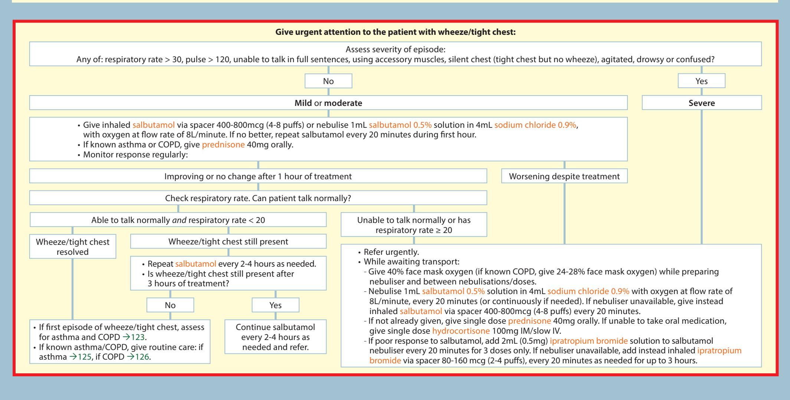

1Common allergens include medication, food or insect bite/sting within the past few hours.

**[TB](#page-85-0)**

**CONTENTS SYMPTOMSCONTENTS CHRONIC CONDITIONS**

**[HIV](#page-102-0) [COVID-19](#page-117-0) [CHRONIC RESPIRATORY DISEASE](#page-119-0) [HEPATITIS B \(HBV\)](#page-116-0) [CARDIOMETABOLIC CONDITIONS](#page-123-0) [MUSCULOSKELETAL DISORDERS](#page-147-0) [MENTAL HEALTH](#page-136-0) [EPILEPSY](#page-145-0) [WOMEN'S HEALTH](#page-150-0) [PALLIATIVE CARE](#page-166-0)**

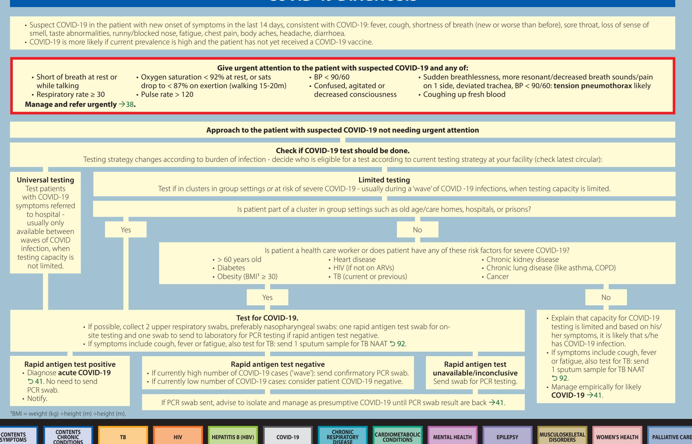

### **ACUTE COVID-19**

| he ien it h a in fec ion l i ke ly in fec ion ive As C O V I D- 19 (p C O V I D- 19 ) t at t w te t t t se ss p cu or res um p |                                                                                                                                                                                                                                                                                                                                                                                                                                                                                                                                                                                                                                                                                                                                                                                                                                                                                                                                                                                                                                                                           |  |  |  |
|--------------------------------------------------------------------------------------------------------------------------------------------------------------------------------------------------------------------------------------------------------------------|---------------------------------------------------------------------------------------------------------------------------------------------------------------------------------------------------------------------------------------------------------------------------------------------------------------------------------------------------------------------------------------------------------------------------------------------------------------------------------------------------------------------------------------------------------------------------------------------------------------------------------------------------------------------------------------------------------------------------------------------------------------------------------------------------------------------------------------------------------------------------------------------------------------------------------------------------------------------------------------------------------------------------------------------------------------------------|--|--|--|
| As se ss                                                                                                                                                                                                                                                     | No te                                                                                                                                                                                                                                                                                                                                                                                                                                                                                                                                                                                                                                                                                                                                                                                                                                                                                                                                                                                                                                                                  |  |  |  |
| Sy tom mp s                                                                                                                                                                                                                                               | Ma tom tom nag e s y mp s a s o n s y mp p ag es.                                                                                                                                                                                                                                                                                                                                                                                                                                                                                                                                                                                                                                                                                                                                                                                                                                                                                                                                                                               |  |  |  |
| hro d C nic it ion /s co n                                                                                                                                                                                                                 | f p has hro d hec k t hat l l co l le d. f ica l ly k i f p has d bet I ien nic it ion it is w Sp i ien ia at t ntr at t c co n , c e o ec as es. • f kno d bet d n b lt hs: ke b d c day I ia H A1c in p 3 H A1c inin ast nt ta t e t wn es an o re su mo an rea o •                                                                                                                                                                                                                                                                                                                                                                                                                                                                                                                                            |  |  |  |
| Bes lac for t p e ca re                                                                                                                                                                                                                          | f kno d bet d a f: ≥ hro ki dn d do f in k g luc h ket kno h v luc l ( b ) I ia 6 0 y nic ise ric 11 wit in u rin ien it H A1c 10 % t at t ntr > > wn es an ny o ear s, c ey ase , ra n m g erp ose on es p res en e o r p wn w ery p oo r g ose co o • d a he k fac h a 1> hy hae hea d he l va lar d ke hro d d fer l for r ri B M I 3 0, ion isc mi ise ip ise iou / T I A, H I V, T B, c nic irat ise isc t tor ert rt s st an no s su c s: p en s c ase , p er ra scu ase , p rev ro an cer , c re sp ory ase uss re ra , , ly dm iss ion ear a |  |  |  |
| D bet ia es scr ee n                                                                                                                                                                                                                             | f n kno h d bet d a f: 1 ≥ hy fam ly his f d bet (p b ling ), s f d bet 2 o d bet du hec k g luc  I it ia B M I 3 0, ion i ia /s i ive ia ia rin 17. ot ert tor nt tom est wn es an ny o p en s o es are mp s s ug g o es r es g p reg na ncy , c ose w y y ,                                                                                                                                                                                                                                                                                                                                                                                                                                                                                                                                                   |  |  |  |

#### **Advise the patient with acute COVID-19 infection or likely infection (presumptive COVID-19)**

- Advise patient to inform household members to use strict hygiene and prevention measures and monitor themselves for symptoms. Close contacts no longer need to quarantine or isolate, even if symptoms develop. Advise to use a mask and avoid indoor social gatherings as much as possible for at least 5 days.
- Advise the patient with known diabetes:
- Explain that s/he is at risk of severe COVID-19. Advise to go to nearest emergency centre if s/he develops shortness of breath, weakness or high fevers/chills. Advise to check glucose each morning upon waking and keep a record: if fasting glucose persistently ≥ 8, advise to return for review of insulin doses.
- Check patient understands to monitor symptoms at home (see red box below).

**[TB](#page-85-0)**

**CONTENTS SYMPTOMSCONTENTS CHRONIC CONDITIONS**

- Check patient understands how to safely isolate. Refer to community-based services for follow up if available.
- Provide medical certificate for sick leave for 7 days from date that symptoms started. This may need to be extended.
- Explain that patient may discontinue isolation 7 days after date that symptoms started. If symptoms have not resolved by 7 days, advise to continue isolating until 10 days completed.

### **Treat the patient with acute COVID-19 infection or likely infection (presumptive COVID-19)**

For fever/pain, advise to take paracetamol 1g 4-6 hourly (up to 4g in 24 hours) orally as needed, rather than NSAIDS4. If using NSAIDS4 for other condition/s, avoid discontinuing.

### **Review the patient with acute COVID-19 infection or likely infection (presumptive COVID-19)**

Advise that there is no need to return to facility unless condition worsens. Advise to return for TB test if cough persists ≥ 2 weeks. Ensure correct contact details. Include a second phone number.

**Advise to return urgently to health facility if: Shortness of breath, difficulty breathing, persistent chest pain/pressure, new confusion or worsening drowsiness.**

1BMI = weight (kg) ÷height (m) ÷height (m). 2Weight loss, thirst (especially at night) or passing excessive amounts of urine often. 3Non-steroidal anti-inflammatory drugs (like ibuprofen).

### **ONGOING COVID-19 SYMPTOMS**

Manage the patient with COVID-19 symptoms that have lasted for more than 4 weeks.

**[TB](#page-85-0)**

**CONTENTS SYMPTOMSCONTENTS CHRONIC CONDITIONS**

- Common ongoing symptoms include: tiredness, breathlessness, cough, smell/taste abnormalities, headache, dizziness, cognitive slowing ('brain fog'), joint/muscle pain and chest pain.
- Confirm that patient had COVID-19: either positive COVID-19 test or a typical history of COVID-19. If no positive test and uncertain about COVID-19 history, discuss with specialist.

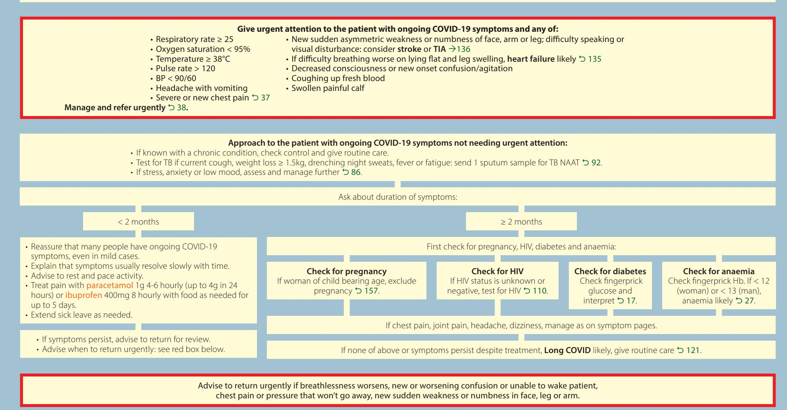

**[HIV](#page-102-0) [CHRONIC RESPIRATORY DISEASE](#page-119-0) [CARDIOMETABOLIC CONDITIONS](#page-123-0) [MUSCULOSKELETAL DISORDERS](#page-147-0) [MENTAL HEALTH](#page-136-0) [EPILEPSY](#page-145-0) [WOMEN'S HEALTH](#page-150-0) [PALLIATIVE CARE](#page-166-0)**

**[HEPATITIS B \(HBV\)](#page-116-0) [COVID-19](#page-117-0)**

# **BREAST SYMPTOMS**

#### **Approach to the patient with a breast symptom who is not breastfeeding**

| Bre lum /s ast p                                                                                                                                                                                                                                                                                                                                                                               |                                                                                                                                                                                                                                                                                                              | Bre ast in p a                                                                                                                                                                                                                                                                   |                                                                                                                                                                                                                                                                                                                                                                                                                                                                                                                                                                                                                                                                                                                                                                                                                                                                                                                                                | Nip le d ha /re isc tra ct p rg e                                                                                                                                                                                                                                    | Bre lar ion ast en g em                                                                                                                                                                                                                                                      | t en                                                                                                                                                                                                                                                                                                                                                                                                                                                                                                                                                                                                                                                                                                                                                                                                                                                                                                                                          |                                                                                                                                                  |                                                                                     |
|------------------------------------------------------------------------------------------------------------------------------------------------------------------------------------------------------------------------------------------------------------------------------------------------------------------------------------------------------------------------------------------------------------|--------------------------------------------------------------------------------------------------------------------------------------------------------------------------------------------------------------------------------------------------------------------------------------------------------------|----------------------------------------------------------------------------------------------------------------------------------------------------------------------------------------------------------------------------------------------------------------------------------------------|------------------------------------------------------------------------------------------------------------------------------------------------------------------------------------------------------------------------------------------------------------------------------------------------------------------------------------------------------------------------------------------------------------------------------------------------------------------------------------------------------------------------------------------------------------------------------------------------------------------------------------------------------------------------------------------------------------------------------------------------------------------------------------------------------------------------------------------------------------------------------------------------------------------------------------------------|----------------------------------------------------------------------------------------------------------------------------------------------------------------------------------------------------------------------------------------------------------------------------------------------------|------------------------------------------------------------------------------------------------------------------------------------------------------------------------------------------------------------------------------------------------------------------------------------------------|--------------------------------------------------------------------------------------------------------------------------------------------------------------------------------------------------------------------------------------------------------------------------------------------------------------------------------------------------------------------------------------------------------------------------------------------------------------------------------------------------------------------------------------------------------------------------------------------------------------------------------------------------------------------------------------------------------------------------------------------------------------------------------------------------------------------------------------------------------------------------------------------------------------------------------------------------|--------------------------------------------------------------------------------------------------------------------------------------------------|-------------------------------------------------------------------------------------|
| f: p fam ly his f bre lar f ix d An ien 25 i irre at t > tor ast y o y ea rs, y o ca nc er, g u e lum kin /n le c ha le d ha l lar ly h n de ? ip ni isc i p, s p ng es, p p rg e o r ax y mp o Ye No s |                                                                                                                                                                                                                                                                                                              | ha li ke ly du bre Re in is u t t p e t ast ass ure a n o ca nc er. • I f lum /s, d j nt. p see a ace • lu de  Exc 15 7. p reg na nc y •             |                                                                                                                                                                                                                                                                                                                                                                                                                                                                                                                                                                                                                                                                                                                                                                                                                                                                                                                                                | fer bre lin Re ic / Re ion to ast c g • Bre Un k i f a it ast sam e w ee loo d-s d B ine ta - de d d ha On i isc e-s rg e - Pat ien t ≥ 5 0 y ea rs - | l f o ly bre I ast a n on e • f: lar fer bre ing to ast ny o en g , re lin l ic / Re ion Bre ast c g a Un it. C he k i f t his be is ity. c o s • |                                                                                                                                                                                                                                                                                                                                                                                                                                                                                                                                                                                                                                                                                                                                                                                                                                                                                                                                                  |                                                                                                                                                  |                                                                                     |
| fer Re sam e                                                                                                                                                                                                                                                                                                                                                                                      | bre On ast e                                                                                                                                                                                                                                                                                        | Bo t                                                                                                                                                                                                                                                                                      | h bre ast s                                                                                                                                                                                                                                                                                                                                                                                                                                                                                                                                                                                                                                                                                                                                                                                                                                                                                                                           |                                                                                                                                                                                                                                                                                                    |                                                                                                                                                                                                                                                                                                | le Ma - kin le c ha S /n ip p ng es - Bre /ax l lar lum ast i y p -                                                                                                                                                                                                                                                                                                                                                                                                                                                                                                                                                                                                                                                                                                                                                                                                            | f 1 > I B M I 25 C as ses s k  ris 12 7. Rev d iew ica t ion m e : • | V D                                                                              |
| k to we e bre ast a lin ic / c Re l ion g a Bre ast Un it.                                                                                                                                                                                                                                                                                           | Re ine -ex am bre da f 7 o ast on y l cy le. nst me rua c f lum I ists p p ers , fer bre to ast re lin / Re l ic ion c g a Bre hin Un it w it ast da 21 s. y | l ly Pa in usu a oc • Re his t is ass ure • f p I in, ive a g p • be de Ma i a s e y • ha ho et c ng e m dv A ise to tur re • da 6 0 s. y | i bro ic c ha li ke ly F st cy ng e be for d a d h p d. io im wi io t cu rs e p er n p rov es er f itt d a dv l l- bra ise ing co mm on an a we l 1g ho ly (up ho ) a de d w h foo d for da 4- 6 4g in 24 it 5 cet to to ara am o ur urs s n ee up y s. f fe f ho l co f n be fte hs ion I r 3 ion ct ntr t tte nt ntr t o rm on a ace p o r a mo on co ace p ,  d 15 4. f sy ha /w fer bre lin / Re l Bre hin n i ic ion Un it w it tom to ast ast mp s c ng e ors en : re c g a |                                                                                                                                                                                                                                                                                                    |                                                                                                                                                                                                                                                                                                | f p d g ho I ive ip ics nt, t t reg na re ass ure an an sy c • , l ca  de 16 0. i ten ata t ts, an re an p res san fe Rev d d lo iew ica t ion ni ip ine m e , am : • ho de bre ip ics i t t t ts, ast an sy c , an p res san cau se en l co d h do ive D isc it ntr t ora ace p an uss w f o fav lop de le I do toc i nip ire me ram ca n c au se p n e nz, d ha D h do de isc isc it i itc cto to rg e. uss w r. co ns r sw f ca fer d  I in, ica ion 11 rta t use un ce re me • |                                                                                                                                                  | fav ire nz, ine ca n t. em en r. cto r hin g |
| h t he ien it h a br ho is br fee d ing Ap o t at t w st to st p roa c p ea sy mp m w ea                                                                                                                                                                                                                               |                                                                                                                                                                                                                                                                                                              |                                                                                                                                                                                                                                                                                              |                                                                                                                                                                                                                                                                                                                                                                                                                                                                                                                                                                                                                                                                                                                                                                                                                                                                                                                                                |                                                                                                                                                                                                                                                                                                    |                                                                                                                                                                                                                                                                                                |                                                                                                                                                                                                                                                                                                                                                                                                                                                                                                                                                                                                                                                                                                                                                                                                                                                                                                                                                  |                                                                                                                                                  |                                                                                     |
| fu Pa l /cr ke d n les in ip ac p                                                                                                                                                                                                                                                                                                                                            |                                                                                                                                                                                                                                                                                                              | fu Pa l bre /s ho lum in ast wit ut p                                                                                                                                                                                                                       |                                                                                                                                                                                                                                                                                                                                                                                                                                                                                                                                                                                                                                                                                                                                                                                                                                                                                                                                                |                                                                                                                                                                                                                                                                                                    | fu Pa l bre /s h lum in ast wit p                                                                                                                                                                                                                                |                                                                                                                                                                                                                                                                                                                                                                                                                                                                                                                                                                                                                                                                                                                                                                                                                                                                                                                                                  |                                                                                                                                                  |                                                                                     |
| l ly du lat hin he lp lat h Us e t to ua o p oo r c g: c • ba by ly. p rop er                                                                                                                                                                                                                                                   |                                                                                                                                                                                                                                                                                                              | bo dy Te 3 8 °C in ? tur e ≥ mp era or p a                                                                                                                                                                                                         |                                                                                                                                                                                                                                                                                                                                                                                                                                                                                                                                                                                                                                                                                                                                                                                                                                                                                                                                                | bo dy Te 3 8 °C in ? tur e ≥ mp era or p a                                                                                                                                                                                                               |                                                                                                                                                                                                                                                                                                |                                                                                                                                                                                                                                                                                                                                                                                                                                                                                                                                                                                                                                                                                                                                                                                                                                                                                                                                                  |                                                                                                                                                  |                                                                                     |

- Avoid using soap on nipples.
- Advise to apply breastmilk to nipples after feeding and expose to air. Apply zinc and castor oil ointment between feeds.

- Yes: **mastitis** likely Give flucloxacillin3 500mg 6 hourly for 5 days and paracetamol
- 1g 4-6 hourly (up to 4g in 24 hours) as needed for up to 5 days.
- •Advise warm compresses.
- If no better after 2 days or breast lump (abscess) develops, refer.
- If HIV negative, advise to continue breastfeeding.
- If HIV positive: if only one breast affected, express and discard milk from this side. Continue breastfeeding from other side.
- If both breasts affected, advise to temporarily stop feeding from breast, express, heat-treat2 milk, and cup-feed baby until cracks/mastitis resolve. If heat treating not possible: explore circumstances at home to assess safety of formula feeding. If barriers to safe formula feeding, advise to continue breastfeeding and emphasize importance of strict ART adherence and viral suppression.

Refer to breastfeeding counsellor/lactation consultant or support group. If HIV positive, give routine HIV care [111](#page-107-0) and prevent transmission to baby [168](#page-164-0).

1BMI = weight (kg) ÷ height (m) ÷ height (m). 2Heat-treat milk to rid it of HIV and bacteria: place breastmilk in sterilized glass jar. Close lid and place in pot. Fill pot with water 2cm above milk and heat water. Remove jar when water is rapidly boiling. 3If severe penicillin allergy (history of anaphylaxis, urticaria or angioedema), give instead azithromycin 500mg daily for 3 days.

**Blocked duct**likely

> Refer same day.

Yes

**Breast abscess** likely

No

 Advise frequent breastfeeds, warm compresses and to gently massage breast. Advise to return if fever/body pain develops or if breast lump persists: consider other causes and discuss/refer.

No

**Engorgement** likely

### **ABDOMINAL PAIN**

#### **Give urgent attention to the patient with abdominal pain and any of:**

- •Chest pain [37](#page-33-0)
- Pregnant [159](#page-155-0)
- •Recent delivery/miscarriage/termination of pregnancy [164](#page-160-0)
- •Glucose ≥ 11.1 [17](#page-13-0)
- Unable to pass urine [59](#page-55-0)
- •Jaundice
- •Abdominal or pelvic mass
- Pulsatile abdominal mass: **abdominal aortic aneurysm** likely
- **Manage and refer urgently:**
- •If **abdominal aortic aneurysm** likely: avoid giving IV fluids even if BP < 90/60 (raising blood pressure may worsen rupture).
- If BP < 90/60 or **pancreatitis** likely, give sodium chloride 0.9% 500mL IV over 30 minutes, repeat until systolic BP > 90. Continue 1L 6 hourly. Stop if breathing worsens.
- • If pain severe, give morphine 10mg IM or diluted morphine2 3-10mg slow IV: start with 3mL IV over 3 minutes. If needed, give another 1mL/minute until pain improved, up to 10mL. Stop if BP drops < 90/60.

#### **Approach to the patient with abdominal pain not needing urgent attention:**

- If cramping abdominal pain with recent onset vomiting, diarrhoea, loss of appetite, body pain or fever, **gastroenteritis** likely [45](#page-41-0).
- •If on ART, check for urgent side effects [116](#page-112-0).
- If urinary symptoms (burning/frequency/urgency) or leucocytes/nitrites/blood on dipstick [59](#page-55-0).
- Is pain in the lower abdomen *and* is patient a woman?

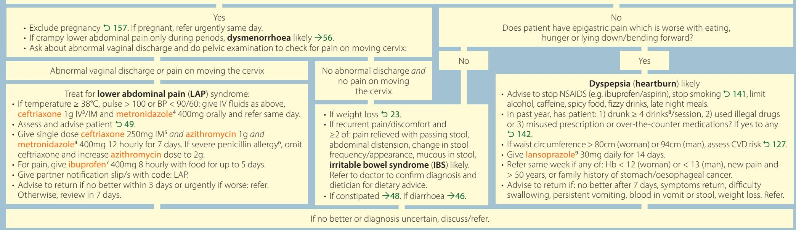

1Common allergens include medication, food or insect bite/sting within the past few hours. 2Dilute 10mg morphine with 9mL of sodium chloride 0.9%. 3Do not mix Ringer's lactate and IV ceftriaxone. Flush IV line with sodium chloride 0.9% before and after IV ceftriaxone. 4Advise no alcohol until 24 hours after last dose of metronidazole. 5For ceftriaxone 250mg IM injection: dissolve 250mg in 0.9mL lidocaine 1% without epinephrine (adrenaline). 6History of anaphylaxis, urticaria or angioedema. 7Avoid if peptic ulcer, asthma, hypertension, heart failure or kidney disease. 8One drink is 1 tot of spirits, or 1 small glass (125mL) of wine or 1 can/bottle (330mL) of beer. 9If HIV positive on atazanavir/ritonavir, avoid lansoprazole, discuss/refer.

- Pain in right lower abdomen with nausea/vomiting/fever: **appendicitis** likely
  - ••Guarding, rigidity or rebound tenderness: **peritonitis** likely
  - Severe pain in right upper abdomen with nausea/fever/loss of appetite: **cholecystitis** likely
  - •Sudden severe upper abdominal pain spreading to back with nausea/vomiting: **pancreatitis** likely
  - •No stools or flatus/wind for past 24 hours
  - If sudden abdominal pain and any of: generalised itch/rash, face/tongue swelling, difficulty breathing, BP < 90/60, dizziness/collapse or exposure to possible allergen1 check for anaphylaxis [20](#page-16-0).

- **Give urgent attention to the patient with nausea/vomiting and any of:**
  - • Guarding, rigidity or rebound tenderness: **peritonitis** likely
  - Tender in right lower abdomen: **appendicitis** likely
  - • Sudden severe upper abdominal pain spreading to back: **pancreatitis** likely
  - BP < 90/60
  - •Vomiting blood

- •Jaundice
- •Abdominal pain/distention and no stools or flatus/wind
- Drowsy/confused/rapid deep breathing
- • If sudden nausea/vomiting and any of: generalised itch/rash, face/tongue swelling, wheeze, difficulty breathing, BP < 90/60, dizziness/collapse or exposure to possible allergen1, check for anaphylaxis [20](#page-16-0).

• Neck stiffness, drowsy/confused or purple/red rash: **meningitis** likely

 If patient has watery diarrhoea (with or without vomiting) and has been in cholera outbreak area

#### **Manage and refer urgently:**

in past 5 days, **cholera** likely [47](#page-43-0)

•

•

 Headache [30](#page-26-0)Chest pain [37](#page-33-0)

- •If BP < 90/60 or **pancreatitis** likely, give sodium chloride 0.9% 500mL IV over 30 minutes, repeat until systolic BP > 90. Continue 1L 6 hourly. Stop if breathing worsens.
- If **meningitis** likely, give ceftriaxone 2g IV2/IM. Avoid injecting > 1g IM at one injection site.
- • If pain severe, give morphine 10mg IM or diluted morphine3 3-10mg slow IV: start with 3mL IV over 3 minutes. If needed, give another 1mL/minute until pain improved, up to 10mL. Stop if BP drops < 90/60.
- If glucose < 3 or ≥ 11.1 [17](#page-13-0) or if diabetes and glucose < 4 [130](#page-126-0).

### **Approach to the patient with nausea/vomiting not needing urgent attention**

- If thirst, dry mouth, poor skin turgor or pulse ≥ 100, **dehydration** likely, give single dose metoclopramide 10mg orally/IM/IV. Then give oral rehydration solution and observe: encourage small frequent sips. Aim for 1-2L in first 2 hours. If vomits, wait 10 minutes and try again more slowly.
- If unable to drink or no better after 2 hours, give sodium chloride 0.9% 500mL IV over 30 minutes and refer.
- Exclude pregnancy [157](#page-153-0). If pregnant, reassure that nausea/vomiting is common in first trimester. Encourage to eat smaller meals more frequently and drink fluids regularly.
- If associated dizziness [29](#page-25-0).
- Review medication: NSAIDs (e.g. ibuprofen), metformin, contraceptives, hormone therapy, chemotherapy and morphine can cause nausea/vomiting. Discuss with doctor. If on DS-TB medication [96](#page-92-0), RR-TB medication [104](#page-100-0) or ART [116](#page-112-0).
- Screen for alcohol/drug use: in the past year, has patient: 1) drunk ≥ 4 drinks4/session, 2) used illegal drugs or 3) misused prescription or over-the-counter medications? If yes to any [142](#page-138-0).

Is there recent onset vomiting with cramping abdominal pain, diarrhoea, loss of appetite, body pain or fever?

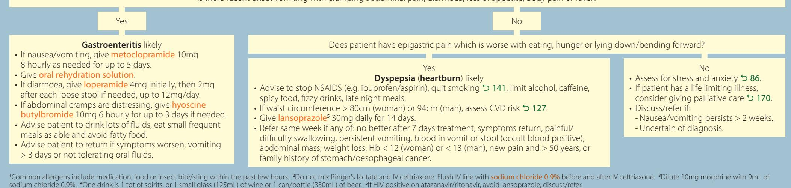

**[TB](#page-85-0) CONTENTS SYMPTOMS CONTENTS CHRONIC CONDITIONS[HIV](#page-102-0) [COVID-19](#page-117-0) [CHRONIC RESPIRATORY DISEASE](#page-119-0) [HEPATITIS B \(HBV\)](#page-116-0) [CARDIOMETABOLIC CONDITIONS](#page-123-0) [MUSCULOSKELETAL DISORDERS](#page-147-0) [MENTAL HEALTH](#page-136-0) [EPILEPSY](#page-145-0) [WOMEN'S HEALTH](#page-150-0) [PALLIATIVE CARE](#page-166-0)**

### **DIARRHOEA**

#### **Give urgent attention to the patient with diarrhoea and any of:**

- Thirst, dry mouth, poor skin turgor, sunken eyes, drowsiness/confusion, BP < 90/60, pulse ≥ 100, **dehydration** likely
- •If patient has watery diarrhoea (with or without vomiting) and has been in cholera outbreak area in past 5 days, **cholera** likely [47](#page-43-0).

### **Management:**

- Give oral rehydration solution (ORS) and observe: encourage small frequent sips. Aim for at least 1-2L in first 2 hours. If patient vomits, wait 10 minutes and try again more slowly.
- If no better after 2 hours, give IV fluids as below and refer same day.

**[TB](#page-85-0)**

**CONTENTS SYMPTOMSCONTENTS CHRONIC CONDITIONS**

•

- •If unable to drink or BP < 90/60, give sodium chloride 0.9% 1L IV rapidly, repeat until systolic BP > 90. Continue 1L 6 hourly. Stop if breathing worsens. Refer same day.
- If patient has been in cholera outbreak area in past week, **cholera** likely. Give single dose ciprofloxacin 1g orally.

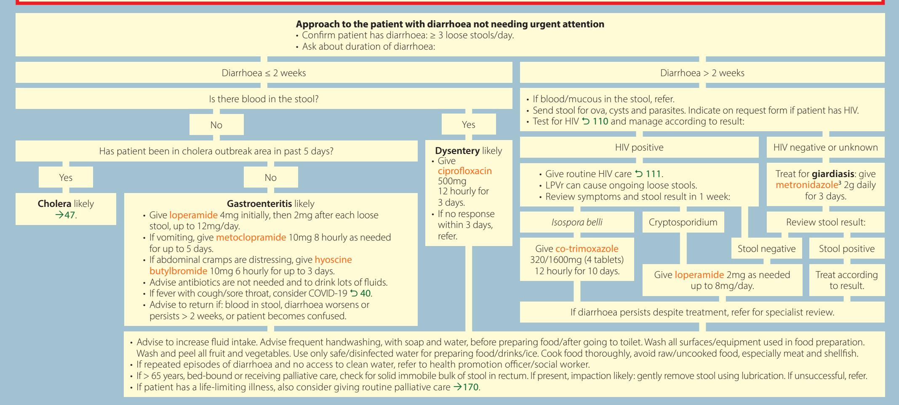

1Rice water stool is cloudy watery diarrhoea with no blood/pus and no faecal odour (may have fishy odour). 2If > 2 hour delay between specimen collection and laboratory processing, discuss with laboratory. 3Advise no alcohol until 24 hours after last dose of metronidazole.

**[HIV](#page-102-0) [CHRONIC RESPIRATORY DISEASE](#page-119-0) [CARDIOMETABOLIC CONDITIONS](#page-123-0) [MUSCULOSKELETAL DISORDERS](#page-147-0) [MENTAL HEALTH](#page-136-0) [EPILEPSY](#page-145-0) [WOMEN'S HEALTH](#page-150-0) [PALLIATIVE CARE](#page-166-0)**

**[HEPATITIS B \(HBV\)](#page-116-0) [COVID-19](#page-117-0)**

### **CHOLERA**

- If patient has watery diarrhoea (with or without vomiting) and has been in cholera outbreak area in past 5 days, **cholera** likely.
- If possible, isolate patient. Health worker to wear gloves and apron while attending to patient. Disinfect surfaces contaminated with secretions with 70% alcohol or chlorine-based disinfectant.
- Check glucose: if glucose < 3 or > 11 [17](#page-13-0).

**[TB](#page-85-0)**

**CONTENTS SYMPTOMSCONTENTS CHRONIC CONDITIONS**

Record each episode of diarrhoea and vomiting and use this to calculate ongoing losses1 when giving fluid replacement below. Decide on further management according to level of dehydration:

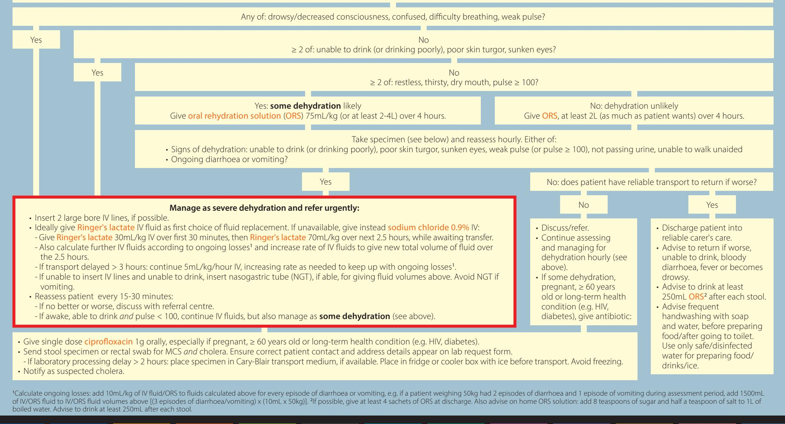

**[HIV](#page-102-0) [COVID-19](#page-117-0) [CHRONIC RESPIRATORY DISEASE](#page-119-0) [HEPATITIS B \(HBV\)](#page-116-0) [CARDIOMETABOLIC CONDITIONS](#page-123-0) [MUSCULOSKELETAL DISORDERS](#page-147-0) [MENTAL HEALTH](#page-136-0) [EPILEPSY](#page-145-0) [WOMEN'S HEALTH](#page-150-0) [PALLIATIVE CARE](#page-166-0)**

### **CONSTIPATION**

#### **Give urgent attention to the patient with constipation and:**

No stools or flatus/wind in the past 24 hours with abdominal pain/distension

#### **Refer same day.**

### **Approach to the patient with constipation not needing urgent attention:**

- Review diet, fluid intake and medication (amitriptyline, schizophrenia treatment, codeine and morphine can cause constipation: discuss with doctor). Ask about regular use of enemas or laxatives.
- •Exclude pregnancy [157](#page-153-0). If pregnant, advise that constipation is common during pregnancy and give advice as below.
- If weakness/tiredness, weight gain, low mood, dry skin or cold intolerance, check TSH. If abnormal, refer to doctor.
- If patient is bed-bound or has a life-limiting illness, also consider giving palliative care [170](#page-166-0).
- •If > 65 years, bed-bound or receiving palliative care, check for solid immobile bulk of stool in rectum. If present, impaction likely: gently remove stool using lubrication. If unsuccessful, refer.
- Advise a high fibre diet (vegetables, fruit, coarse mielie meal, bran and cooked dried prunes), adequate fluid intake and at least 30 minutes moderate exercise (e.g. brisk walking) most days of the week.
- If no better with diet and exercise, give sennosides A and B 13.5mg at night or lactulose 10-20 mL once or twice daily.
- If no response after 1 week of laxative use, or if recent change in bowel habits, weight loss, blood in stool or occult blood positive, or cause uncertain, refer.

### **ANAL SYMPTOMS**

### **Give urgent attention to the patient with anal symptoms and any of:**

Extremely painful lump on anus • Unable to pass stool because of anal symptoms

### **Refer same day.**

•

### **Approach to the patient with anal symptoms not needing urgent attention**

 If patient has anal sex, ask about genital symptoms and treat partner [49](#page-45-0). If painless bleeding, passing mucus or unable to pass stools despite feeling the need to (tenesmus), treat for sexually transmitted **proctitis**: give single dose ceftriaxone 250mg IM1 and azithromycin 1g orally. If severe penicillin allergy2, omit ceftriaxone and increase azithromycin to 2g. If diarrhoea [46](#page-42-0). Then examine anal area to look for cause:

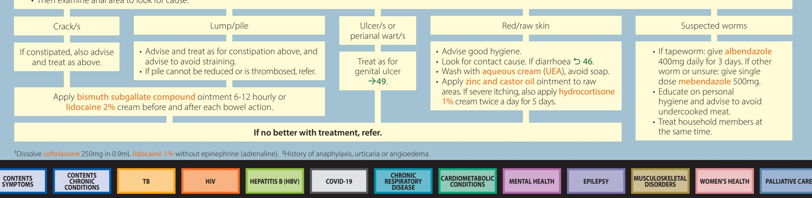

### **49**

### **GENITAL SYMPTOMS**

| he ien it h g ita l sy d h is / he /s As t at t w to art se ss p en mp ms an r p ne r |                                                                                                                                                                                                                                                                                                                                                                                                                                                                                                                                                                                                                                                                                                                                                                                    |  |  |  |
|------------------------------------------------------------------------------------------------------------------------------------------------------------------------|------------------------------------------------------------------------------------------------------------------------------------------------------------------------------------------------------------------------------------------------------------------------------------------------------------------------------------------------------------------------------------------------------------------------------------------------------------------------------------------------------------------------------------------------------------------------------------------------------------------------------------------------------------------------------------------------------------------------------------------------------------------------------------|--|--|--|
| As se ss                                                                                                                                                         | No te                                                                                                                                                                                                                                                                                                                                                                                                                                                                                                                                                                                                                                                                                                                                                                           |  |  |  |
| Sy tom mp s                                                                                                                                                   | k a bo l d ha h, h, lum lce d low b do l p d m be low f a l sy (p les b lee d d f f ic lty l )  As ita isc itc mi in a I in ing ing i ing 48 ut tom sto g en rg e, r as p s, u rs a n er a na a n an ag e a s na mp s a s , p ass m ucu s o r p ass o u                                                                                                                                                                                                                                                                           |  |  |  |
| l hea lt h Sex ua                                                                                                                                       | f ri f lu f a fe f p f a  I ky l be hav iou lt ip le p /s, do lia b ly, has de r in lco ho l / dru ive dv ice As k i ien has l se i l sy 48 art at t tom s sex ua r: n ew or m u ne r use s c on ms un re se x u n en ce o g s, g sa sex a an a x: na mp s                                                                                                                                                                                                                                                                                 |  |  |  |
| bu A se                                                                                                                                                          |  As k a bo l as lt. I f y 8 8. ut sex ua sau es                                                                                                                                                                                                                                                                                                                                                                                                                                                                                                                                                                                                                                                                                         |  |  |  |
| Fam ly lan i nin p g                                                                                                                                 | ds  d d fer lity lu de  Ass ien 's c ive 154 isc in i Exc 15 7. at t tra t t ess p on cep ne e an uss p reg na ncy                                                                                                                                                                                                                                                                                                                                                                                                                                                                                                                                                   |  |  |  |
| Exa mi ion nat                                                                                                                                                | b do for loo k for d ha lce h, lum lvic hec k for /p lvic d s lum for l a bn lit Wo ine isc Do ina ion in o ing rvix ina ion rvic ies t to t ma n: e xam a me n m ass es, rg e, u rs, ras p s. p e ex am c p a n m ov ce e m ass es an p ecu ex am ce a orm a • loo k for l d ha lce h, lum b lice l sw l ling de Ma ita isc ic rot ten n: g en rg e, u rs, ras p s, p or sc a e rne ss o r m ass es. u • ,   |  |  |  |
| H I V                                                                                                                                                            | for  f  f n for  Tes H I V I H I V p I de d Pr E P t 110 it ive ive ut ine 11 1. at ive i 10 6. os , g ro ca re eg , co ns r n ee                                                                                                                                                                                                                                                                                                                                                                                                                                                                                                           |  |  |  |
| hi lis Sy p                                                                                                                                                   |   C hec k sy hi lis log f: s l ly lte d, s da /te hi lis 1 su d o l / f le hy /w l w f p for hi lis f sy hi lis i iary ica ita I vis it 16 2. I it ive 5 3. rt ect r at et art nt, tes t at p ser o y exu a ass au eco n ry sy p sp e y p s g en s. reg na sy p eve ry p p os • hs l l tr d w h do line l lin be d. Re R P R a 6 m in a it /am ic i /p i eat t t eat p on e cy c ox ro nec xy • |  |  |  |
| l sc Ce rvic a ree n                                                                                                                                    | l sc f n de d  f a bn l va l d ha de lay l sc l tr d  f d ha fte do l sc f ce loo ks a bn l Do ica n i I ina isc ine rvic i I isc ists rvic I rvix / 55 ut nt eat 51 r tr eat nt, a c erv ree ee orm a g rg e, ro ce a ree n u e rg e p ers a me ce a ree n. orm a f ca fer k. ic iou sus p s o nce r, re sa me we e                                                                                                                                                                            |  |  |  |
|                                                                                                                                                                        |  6 9                                                                                                                                                                                                                                                                                                                                                                                                                                                                                                                                                                                                                                                                                                                                                                           |  |  |  |

### **Advise the patient with genital symptoms and his/her partner/s**

Discuss safe sex. Provide male and female condoms, advise patient to stay with one partner at a time. Offer referral for medical male circumcision.

If patient has a sexually transmitted infection (STI), educate about cause and increased risk of HIV transmission. Urge to adhere to treatment and abstain from sex for at least 1 week after treatment.

Stress importance of partner treatment in cure of STI: give partner notification slip with the patient's diagnosis code for each partner. Consider other notification methods like active tracing and treatment.

| he h g l sy Tre ien it ita at t at t w to p en mp ms |                                                               |                                                          |                                        |                                   |          |                      |                     |
|---------------------------------------------------------------------------------------------------|---------------------------------------------------------------|----------------------------------------------------------|----------------------------------------|-----------------------------------|----------|----------------------|---------------------|
| ha D isc rg e                                                                         | Sc l p /sw l lin in rot a a e g | h Itc                                                 |                                        | lce /so U rs res      | Lu mp | /s Wa rts      |                     |
| 5 5 Wo Ma 1 0 ma n n                                                    | 5 0                                                       | 5 D ha isc in w 1 rg e om an | 5 G lan is 0 s p en | 5 Pu b ic a 4 rea | 5 2  | 2 Gro in 5 | 5 S kin 4 |
|                                                                                                   |                                                               |                                                          |                                        |                                   |          |                      |                     |

|                             | he d ing de ive i f ic ion l ip Tre /s at t art to ot at p ne r ac co r co g n o n n s                                                                                                                                                                                                                                                                                                                                                                                                                                                                                                                                                                                                                                                                                                                                                                                                                                                                                                                                                                                                                                                                                                                                                                                                                                                                                                                                                                                                |                                                                                                                                                                                                                                                                                                                                                                                                                                                                                                                            |  |  |  |  |  |  |  |
|-----------------------------|------------------------------------------------------------------------------------------------------------------------------------------------------------------------------------------------------------------------------------------------------------------------------------------------------------------------------------------------------------------------------------------------------------------------------------------------------------------------------------------------------------------------------------------------------------------------------------------------------------------------------------------------------------------------------------------------------------------------------------------------------------------------------------------------------------------------------------------------------------------------------------------------------------------------------------------------------------------------------------------------------------------------------------------------------------------------------------------------------------------------------------------------------------------------------------------------------------------------------------------------------------------------------------------------------------------------------------------------------------------------------------------------------------------------------------------------------------------------------------------------------------------------------------------------------------------------------|----------------------------------------------------------------------------------------------------------------------------------------------------------------------------------------------------------------------------------------------------------------------------------------------------------------------------------------------------------------------------------------------------------------------------------------------------------------------------------------------------------------------------|--|--|--|--|--|--|--|
|                             | f ic f p fo No i ion de Tre he ic /s be low l ha he S T I sy d s ig lev S T I a lg it hm d o l ist d a bo t at at t to t art art t to t co as y mp ma p ne r ne r s o r mp ms an ns , m an ag e a s p er re an or un n p ag es e ve                                                                                                                                                                                                                                                                                                                                                                                                                                                                                                                                                                                                                                                                                                                                                                                                                                                                                                                                                                                                                                                                                                         |                                                                                                                                                                                                                                                                                                                                                                                                                                                                                                                            |  |  |  |  |  |  |  |
|                             | V D S o L A P r                                                                                                                                                                                                                                                                                                                                                                                                                                                                                                                                                                                                                                                                                                                                                                                                                                                                                                                                                                                                                                                                                                                                                                                                                                                                                                                                                                                                                                                                                                                                            | ftr 3 a 2 2 f se ftr G le do iax 25 0m I M d a it hro in l ly d m i da le I l lin l lerg 4, o d it hro in t 2g ive art ing 1g etr ic i mit iax inc p ne r s se ce on e g n z my c ora an on zo g. ve re p en a y ce on e a n rea se az my c o                                          |  |  |  |  |  |  |  |
|                             | M U S o S S W r                                                                                                                                                                                                                                                                                                                                                                                                                                                                                                                                                                                                                                                                                                                                                                                                                                                                                                                                                                                                                                                                                                                                                                                                                                                                                                                                                                                                                                                                                                                                            | le do ftr 3 a d a hro l ly. f se l lin l lerg 4, o ftr d hro G ive ing iax 25 0m I M it in I ic i mit iax inc it in t 2g art 1g p ne r s se ce on e g n z my c ora ve re p en a y ce on e a n rea se az my c o                                                                                                       |  |  |  |  |  |  |  |
|                             | d ha G U S (no isc ) rg e                                                                                                                                                                                                                                                                                                                                                                                                                                                                                                                                                                                                                                                                                                                                                                                                                                                                                                                                                                                                                                                                                                                                                                                                                                                                                                                                                                                                                                                                                                                         | do l ho ly for day f p d s le do be h be lp l l 5. G ive ine 10 0m 12 14 I ive in ing ine ic i in 2.4 M U I M art art nt, ste t cy c nza nzy en p ne r xy g ur s. ne r p reg na g a se                                                                                                                                                 |  |  |  |  |  |  |  |
|                             | h G U S w it V D S                                                                                                                                                                                                                                                                                                                                                                                                                                                                                                                                                                                                                                                                                                                                                                                                                                                                                                                                                                                                                                                                                                                                                                                                                                                                                                                                                                                                                                                                                                                                      | le do ftr 3 a d a hro l ly d m da le 2 2 f se l lin l lerg 4, o ftr d hro G ive ing iax 25 0m I M it in 1g i I ic i mit iax inc it in t 2g art etr p ne r s se ce on e g n my c ora an on zo g. ve re p en a ce on e a n rea se az my c o z y                                          |  |  |  |  |  |  |  |
|                             | h G U S w it M U S                                                                                                                                                                                                                                                                                                                                                                                                                                                                                                                                                                                                                                                                                                                                                                                                                                                                                                                                                                                                                                                                                                                                                                                                                                                                                                                                                                                                                                                                                                                                      | le do ftr 3 a d a hro l ly. f se l lin l lerg 4, o ftr d hro G ive ing iax 25 0m I M it in 1g I ic i mit iax inc it in t 2g art p ne r s se ce on e g n z my c ora ve re p en a ce on e a n rea se az my c o y                                                                                                       |  |  |  |  |  |  |  |
|                             | R P R+                                                                                                                                                                                                                                                                                                                                                                                                                                                                                                                                                                                                                                                                                                                                                                                                                                                                                                                                                                                                                                                                                                                                                                                                                                                                                                                                                                                                                                                                                                                                                                 | for hi lis: f p  f n do l ho ly for day f p d s le do be h be lp l l 5. Tes i it ive 3. I ive ive ine 10 0m 12 I ive in ing ine ic i in 2.4 M U I M t p art 5 at art 14 art nt, ste t ne r sy p os eg , g p ne r xy cy c g ur s. ne r p reg na g a se nza nzy en |  |  |  |  |  |  |  |
|                             | bo Bu                                                                                                                                                                                                                                                                                                                                                                                                                                                                                                                                                                                                                                                                                                                                                                                                                                                                                                                                                                                                                                                                                                                                                                                                                                                                                                                                                                                                                                                                                                                                                                     | le do hro G ive ing it in 1g. art p ne r s se az my c                                                                                                                                                                                                                                                                                                                                                                                                                      |  |  |  |  |  |  |  |
|                             | VD S: v ina ag                                                                                                                                                                                                                                                                                                                                                                                                                                                                                                                                                                                                                                                                                                                                                                                                                                                                                                                                                                                                                                                                                                                                                                                                                                                                                                                                                                                                                                                                                                                                                      | l di sch ndr P: l bdo al p ale thr dro l sw elli tal ulc dro hili ult L: b ala LA min ain MU S: m itis SSW GU S: g eni RP R+ osit ive BA niti rota arg e sy om e ow er a ure syn me : sc ng er s yn me : sy p s p res s                                                                                                                                     |  |  |  |  |  |  |  |
|                             | 1Se dar hilis eek s af ulc lise d ra sh ( lud alm les) flu- like flat rt-li ke g tal lesi h u lcer hy hai r lo hilis late ffec kin, bo hea . 2A dvi lco hol til : 6- 8 w inc s/so eni ss. T erti ter tom out atc ts s rt, n tem con y sy p er; gen era es p sym p s, wa ons , m s, p ary syp : m any ye ars r; a ne, erv ous sys se n o a un , fter f m 3Di cef 4Hi f an a. 5 24 hou las t do nid le. lve tria e 2 50m in 0 .9m L lid ine 1% wi tho ine hrin e (a dre nal ine ). hy laxi rtic aria ioe dem Dis solv e b ath ine be lpe nic illin 2.4 MU in 6m L lid ine 1% wi tho etro ut e sto ut rs a se o azo sso xon g oca p p ry o ap s, u or ang enz nzy oca If b for . If s /ref ine hrin e (a dre nal ine ). ath ine be lpe nic illin ilab le, g ive inst ead oxi cill in 1 8 h ly a nd ben eci d 2 50m 8 h ly 14 d eni cilli llerg disc ep p enz nzy un ava am g our pro g our ays eve re p n a y, uss er. |                                                                                                                                                                                                                                                                                                                                                                                                                                                                                                                            |  |  |  |  |  |  |  |
| TS SYM CON TEN PTO | CON TS CHR TEN IC CON ON MS DIT ION S                                                                                                                                                                                                                                                                                                                                                                                                                                                                                                                                                                                                                                                                                                                                                                                                                                                                                                                                                                                                                                                                                                                                                                                                                                                                                                                                                                                                                                                                                                                | IC RES CHR ON CAR LIC CON DIO ABO SCU LOS MET MU L DIS KEL ETA TB HIV HEP ATI TIS B (H BV) COV ID-1 9 RY DIS PIR ATO MEN TAL HE ALT H EPI LEP SY WO MEN 'S H EAL TH PAL LIAT DIT ION S ORD ERS EAS E                                                                                                                                                                       |  |  |  |  |  |  |  |

### **GENITAL SYMPTOMS IN A MAN**

#### **Give urgent attention to the man with genital symptoms and any of:**

- Scrotal swelling/pain with any of: sudden severe pain, affected testicle higher/rotated, preceding trauma/strenous activity: **torsion of testicle** likely
- •Foreskin retracted over glans and unable to be pulled back to normal position (reduced) with swollen and very painful glans: **paraphimosis** likely
- •Prolonged erection > 4 hours: **priapism** likely

### **Management:**

•

•

•If likely **torsion of testicle** or **priaprism:** refer urgently.

**[TB](#page-85-0)**

**CONTENTS SYMPTOMSCONTENTS CHRONIC CONDITIONS**

- •If **paraphimosis** likely:
- If glans blue/black: refer urgently.
- If not, attempt manual reduction: wrap glans in gauze and apply increasing pressure for 10-15 minutes until foreskin can be replaced over glans. If unsuccessful, refer urgently.

### **Approach to the man with genital symptoms not needing urgent attention**

- •First assess and advise the man with genital symptoms [49](#page-45-0).
- Check for urethral discharge: if no visible discharge, ask patient to milk the urethra. If no urethral discharge and urinary symptoms (burning/frequency/urgency) [59](#page-55-0).

Exclude**Testicular cancer** Refer.If able to, retract foreskin, wash with water, dry and examine: If ulcer [52](#page-48-0). If glans inflamed, treat for **balanitis/ balanoposthitis** (**BAL**): Advise to retract and wash daily with water, avoid soap. Dry fully. Give clotrimazole cream 12 hourly for 7 days. Check urine dipstick for glucose. If glucose present, check for diabetes [17](#page-13-0). Offer referral for medical male circumcision. Advise to return if no better in 7 days: If poor adherence, repeat treatment. If still no better, refer. Treat for **scrotal swelling** (**SSW**)**:** Give single dose ceftriaxone 250mg IM1 *and* Give azithromycin 1g now and another dose of azithromycin 1g in 1 week. If severe penicillin allergy2, omit ceftriaxone and increase azithromycin to 2g. • Give partner notification slip/s with code: SSW. For pain, give ibuprofen 400mg 8 hourly with food for up to 5 days (avoid if peptic ulcer, asthma, hypertension, heart failure or kidney disease). Review after 7 days or earlier if needed: if no better, refer. Painless lump Treat for **male urethritis syndrome** (**MUS**): Pain with/without swelling or discharge If unable to retract foreskin, refer. Give single dose ceftriaxone 250mg IM1 *and* Give single dose azithromycin 1g. If severe penicillin allergy2, omit ceftriaxone and increase azithromycin to 2g. If partner has vaginal discharge syndrome (VDS), add single dose metronidazole3 2g. Give partner notification slip/s with code: MUS. Advise patient to return in 7 days if symptoms persist: ceftriaxone treatment failure likely. Refer within 7 days. Urethral discharge (with or without dysuria/burning urine) © University of Cape Town Scrotal swelling or pain © University of Cape Town Painful, itchy or foul-smelling glans, difficulty retracting foreskin © University of Cape Town 1For ceftriaxone 250mg IM injection: dissolve 250mg in 0.9mL lidocaine 1% without epinephrine (adrenaline). 2History of anaphylaxis, urticaria or angioedema. 3Advise no alcohol until 24 hours after last dose of metronidazole.

**[HIV](#page-102-0) [CHRONIC RESPIRATORY DISEASE](#page-119-0) [CARDIOMETABOLIC CONDITIONS](#page-123-0) [MUSCULOSKELETAL DISORDERS](#page-147-0) [MENTAL HEALTH](#page-136-0) [EPILEPSY](#page-145-0) [WOMEN'S HEALTH](#page-150-0) [PALLIATIVE CARE](#page-166-0)**

**[HEPATITIS B \(HBV\)](#page-116-0) [COVID-19](#page-117-0)**

### **ABNORMAL VAGINAL DISCHARGE**

Abnormal vaginal discharges are itchy or different in colour/smell. First assess and advise the patient with an abnormal vaginal discharge [49](#page-45-0).

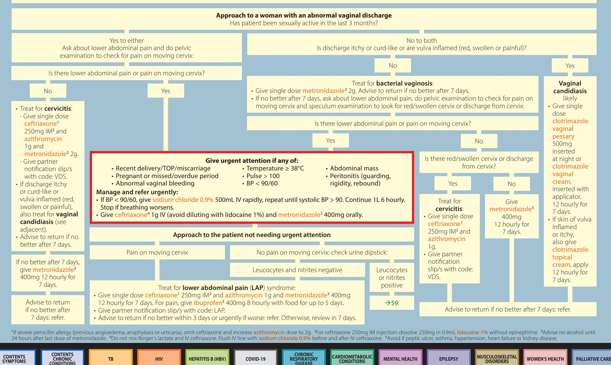

**52**

### **GENITAL ULCER SYNDROME**

First assess and advise the patient with genital ulcer/s [49](#page-45-0). The patient may have a blister, sore or an ulcer.

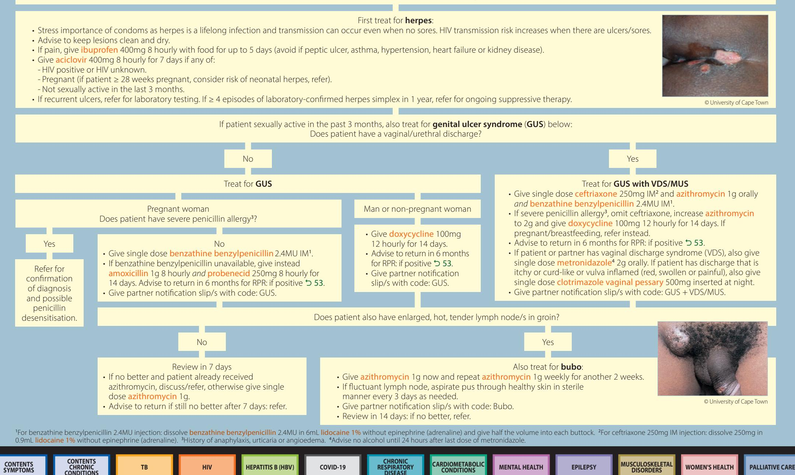

# **POSITIVE SYPHILIS RESULT**

#### **Approach to the patient with a positive syphilis result**

- If fingerprick syphilis test1 done and positive:
- If any of the following, start treatment same day with benzathine benzylpenicillin 2.4MU IM2: pregnant, partner treatment, genital ulcer present, signs of secondary syphilis3 present. Send blood for syphilis serology (RPR) to confirm result. On request form, write: "If RPR negative, do specific syphilis test on same specimen". Review in 1 week.

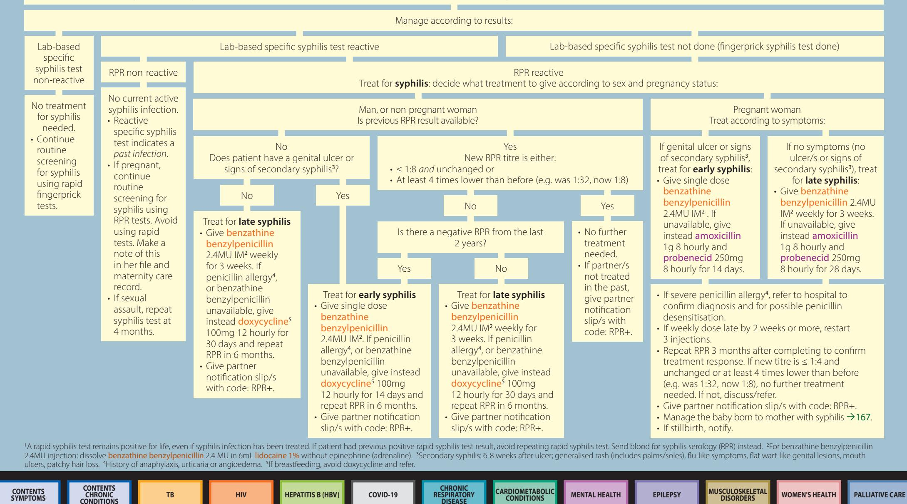

### **OTHER GENITAL SYMPTOMS**

- First assess and advise the patient [49](#page-45-0).
- Then manage according to main symptom:

#### Painless, raised skin coloured growths with round/ cauliflower-like surface (skin around genitals, anus or cervix)

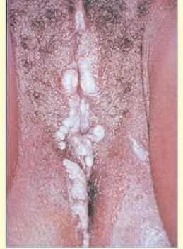

© University of Cape Town

### **Genital warts** likely

- If warts atypical/fleshy/wet, test for syphilis. If positive [53](#page-49-0).
- Arrange a cervical screen for patient/partner if needed [55](#page-51-0).
- Offer to arrange medical male circumcision for patient/partner.
- Reassure that most warts resolve spontaneously within 2 years.
- Refer to gynaecology, urology or sexual health services if:
- Warts > 10mm
- Numerous lesions
- Warts inside vagina, involving cervix or urethra
- Pregnant with large warts
- Bleeding or infected warts

#### Papules with central dent

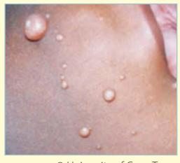

© University of Cape Town

### **Molluscum contagiosum**

- likely Reassure that most papules resolve spontaneously within 9-12 months.
- Apply tincture of iodine BP topically with an applicator to the core of the lesions.
- • If no response to treatment, refer.

Intensely itchy bites May see lice or nits (size of a pinhead) in pubic and peri-anal areas

#### **Pubic lice** (**pediculosis**) likely

- Apply benzyl benzoate 25% lotion to affected area for 24 hours. Avoid mucous membranes, face and eyes, urethral opening and raw areas. Repeat treatment after 1 week.
- Advise to shave genital area.
- Treat all sexual partners even if asymptomatic.
- Before treatment, wash and thoroughly dry clothing and linen that may have been contaminated within past 2 days.
- • For itch, give chlorphenamine 4mg 8 hourly as needed for up to 10 days.

If eyelashes/eyebrows involved, **pediculosis of eyelashes/ eyebrows** likely.

Apply yellow petroleum jelly to eyelid margins to (cover eyelashes) and eyebrows daily for 10 days to smother lice/nits. Advise patient to avoid getting petroleum in eye.

### Lumps or warts Itchy rash in pubic area

### Itch worse at night, with red papules and nodules

© University of Cape Town

#### **Genital scabies** likely

- Apply benzyl benzoate 25% lotion from neck to soles of feet and rub in well:
  - Leave on for 24 hours, then wash off with soap and water.
  - If severe, repeat once after 24 hours or within 5 days.
- • If no better, apply permethrin 5% lotion at night from neck to soles of feet. Wash off after 8-12 hours. Repeat after 1 week if needed.
- • For itch, give chlorphenamine 4mg 8 hourly for up to 10 days. If mild itch, use only at night.
- Advise can return to work after first treatment.
- • Treat all household contacts and sexual partners at the same time, even if asymptomatic.
- Wash recently used linen and clothing in very hot water and dry well. Expose to direct sunlight.

If scratch marks infected (pus/red/swollen/crusts), also treat for likely **impetigo** [78](#page-74-0).

1Avoid in pregnancy and breastfeeding.

**CONTENTS SYMPTOMSCONTENTS CHRONIC CONDITIONS**

**[TB](#page-85-0)**

**[HEPATITIS B \(HBV\)](#page-116-0) [COVID-19](#page-117-0)**

### **CERVICAL SCREENING**

A Pap smear (conventional cytology using glass slides/smear) is the common method of cervical screen. *If available*1, use instead liquid-based cytology (LBC) and human papillomavirus (HPV) DNA testing. If cytology unavailable, use visual inspection with acetic acid (VIA).

| ien ha Pa t t s n | to o s y mp ms |  |
|----------------------------------|----------------------------|--|
|                                  |                            |  |

• If HIV negative: do 3 screens in a lifetime, each 10 years apart from age 30. If HIV positive: do cervical screen at HIV diagnosis (regardless of age), then 3-yearly.

**Patient has symptoms.** *(Symptoms include: irregular or heavy vaginal bleeding, bleeding after sex or an abnormal vaginal discharge)* Do cervical screen if symptoms are not responding to treatment, regardless of when routine screen was done.

#### **Assess the patient needing a cervical screen**

| As se ss                                                                                            | No te                                                                                                                                                                                                                                                                                                                                                                                                                                                                                                                                                                                                                                                                                                                                                                                                                                                                                                        |
|-----------------------------------------------------------------------------------------------------------|-----------------------------------------------------------------------------------------------------------------------------------------------------------------------------------------------------------------------------------------------------------------------------------------------------------------------------------------------------------------------------------------------------------------------------------------------------------------------------------------------------------------------------------------------------------------------------------------------------------------------------------------------------------------------------------------------------------------------------------------------------------------------------------------------------------------------------------------------------------------------------------------------------------------|
| Sy tom mp s                                                                                      | f a bn l va l d ha  f a bn l va l b lee d  f ro l sc de lay l a fte Ma I ina isc 51 i ina ing 57 I ine rvic i tom tom ut t r tr eat nt. nag e s y mp s a s o n s y mp p ag es. orm a g rg e orm a g ce a ree n, un me ; • f a bn l va l d ha b lee d d do l sc I ina isc / ing ing rvic vis it. t re to tre atm t, t sa orm a g rg e no sp on en ce a ree n a me •                                                                                                                                                                                                  |
| ly lan Fam i nin p g                                                                    |  f p fe Ass 's c ds I do l sc ly ks g at ien t tra t ive 154 nt, rvic to 20 est at ion ess p on cep ne e reg na ce a ree n s a up we e                                                                                                                                                                                                                                                                                                                                                                                                                                                                                                                                                                                                                                                 |
| Exa mi ion nat                                                                                   |  Do lvic hec k for d p lvic f p for low b do ina l p in ( P ) sy dro f m fer ina ion in o ing rvix I in o ing rvix L A 44 I t to tre at p e ex am c p a n m ov ce an e m ass es. a n m ov ce er a m a n me ass , re • , lum loo k for bn lit f ce f an les ly lce d c l sc d d r fer k for lp b Do ina ion ies rvix i ion /m /p /er ion /u /so i ica nin ins / iop t to tea sp ecu ex am a orm a o ass o p os r re, avo erv ree g an e sa me we e co osc op sy. : y y • |
| H I V                                                                                               | for  f  d r l sc ly. f n de d for  Tes H I V 110 I H I V p it ive ive ine H I V c rvic nin 3 y I ive i Pr E P 10 6. t ut 11 1, a eat at os , g ro are n ep ce a ree g ear eg , co ns r n ee                                                                                                                                                                                                                                                                                                                                                                                                                                                                                                                              |
| l lom Hu i iru ( H P V ) D N A t est ma n p ap av s | f liq d- bas d c log la b le 1, a lso I i ( L B C ) a i H P V D N A t im to t est u e y y va re q ues on sa me sp ec en                                                                                                                                                                                                                                                                                                                                                                                                                                                                                                                                                                                                                                                           |

#### **Advise the patient needing a cervical screen**

•Educate that cervical cancer is a disease that affects the mouth of the womb. Certain types of HPV cause cervical cancer. HPV is transmitted sexually and can persist for years. Emphasise condoms.

- Cervical screening is able to prevent cervical cancer as it detects changes in the cervix years before cancer develops. Colposcopy is a closer examination of the cervix to confirm these abnormal changes.
- Advise that smoking increases the risk of cervical abnormalities. If patient smokes, encourage to stop [141](#page-137-0).
- •Advise patient to return if symptoms of cervical cancer (abnormal vaginal bleeding, vaginal discharge) occur.

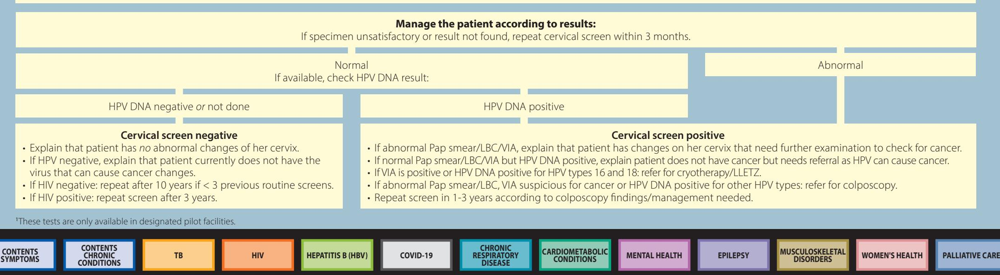

50

### **MENSTRUAL SYMPTOMS**

#### **Approach to the patient with menstrual symptoms**

Manage according to symptom: ask if abnormal periods, crampy pain during periods or bloating/headache/tender breasts/tired/moody around time of periods.

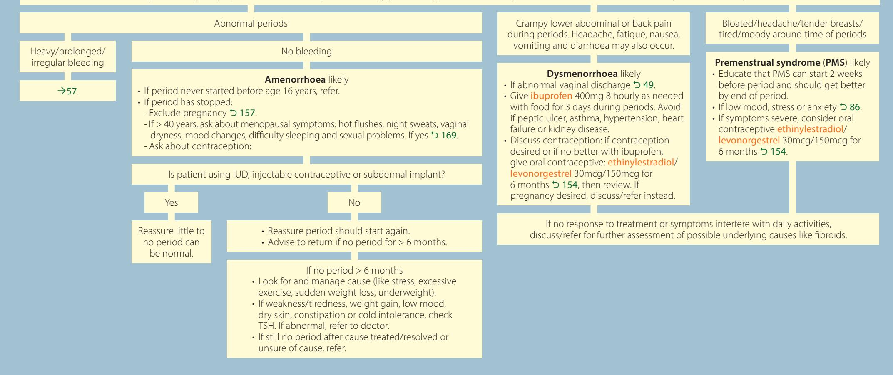

### **Advise the patient with menstrual symptoms**

**[HIV](#page-102-0) [CHRONIC RESPIRATORY DISEASE](#page-119-0) [CARDIOMETABOLIC CONDITIONS](#page-123-0) [MUSCULOSKELETAL DISORDERS](#page-147-0) [MENTAL HEALTH](#page-136-0) [EPILEPSY](#page-145-0) [WOMEN'S HEALTH](#page-150-0) [PALLIATIVE CARE](#page-166-0)**

- • Explain that menstruation (having a period) is normal and healthy, and educate what menstruation is: every month the uterus lining thickens to prepare for pregnancy. When pregnancy does not happen, the thickened lining is released through the vagina, as bleeding for a few days.
- Reassure that dysmenorrhoea (abdominal/back pain with periods) is common. Encourage to continue with daily activities and exercise.

**[HEPATITIS B \(HBV\)](#page-116-0) [COVID-19](#page-117-0)**

•If premenstrual syndrome: advise to do daily exercise and try relaxation techniques [86](#page-82-0).

**[TB](#page-85-0)**

**CONTENTS SYMPTOMSCONTENTS CHRONIC CONDITIONS**

### **ABNORMAL VAGINAL BLEEDING**

BP < 90/60

•

Pallor with pulse ≥ 100, respiratory rate ≥ 30, dizziness/

**Give urgent attention to the patient with vaginal bleeding and any of:**

•

•

Pregnant [159](#page-155-0)

| de l Re ive /m isc iag /te nt ce ry arr e • fer Ma d r ly t na g e a n e ur g en : f B P < / d h lor I 9 0 6 0, ive ium i g so c •                                                                                                                                                                                                                                                                                                                                                                                                                                                                                                                                                                                                                                                                                                                                                                                                                                                                                                                                                                                                                                                                                                                                                                                                                                                                                                                                                                                                                                                                                                                                       | f p  ina ion t rm o reg na nc y de 0. 9 % 5 0 0m L I V o r 3 0 m ve                                                                                                                                                                                                                                                                                                                                                                                                                                                                                                                                                                                                                                                                    | b < fa 16 H 6 int 4 ne ss or • l sy l B P > Co ho inu i ic 9 0. inu e 1 L 6 tes t u nt sto nt , re p ea                                                                                                                                                                                                                                                                                                                                                                                                                                                                                                                                                                                                                                                                                                                                                                                                                                                                                                                                                                                                                                                                                                                                                                                                                                                                                                                                                                                                                                                                                                                                                                                                                                          | he in st c p a ly. Sto f bre h i ing at ur p w ors en s.                                                                                                                                                                                                                                                                                                                                                                                                                                                                                                                                                                                                                                                                                                                                                                                                                                                                                                                                                                                                                                                                                                                 |                                                                                                                                                                                                                                                                                                                                                                                                |                                                                                                         |
|--------------------------------------------------------------------------------------------------------------------------------------------------------------------------------------------------------------------------------------------------------------------------------------------------------------------------------------------------------------------------------------------------------------------------------------------------------------------------------------------------------------------------------------------------------------------------------------------------------------------------------------------------------------------------------------------------------------------------------------------------------------------------------------------------------------------------------------------------------------------------------------------------------------------------------------------------------------------------------------------------------------------------------------------------------------------------------------------------------------------------------------------------------------------------------------------------------------------------------------------------------------------------------------------------------------------------------------------------------------------------------------------------------------------------------------------------------------------------------------------------------------------------------------------------------------------------------------------------------------------------------------------------------------------------------------------------------------------------------------------------------------------------------------------------------------------|--------------------------------------------------------------------------------------------------------------------------------------------------------------------------------------------------------------------------------------------------------------------------------------------------------------------------------------------------------------------------------------------------------------------------------------------------------------------------------------------------------------------------------------------------------------------------------------------------------------------------------------------------------------------------------------------------------------------------------------------------------------------------------------------------------------|--------------------------------------------------------------------------------------------------------------------------------------------------------------------------------------------------------------------------------------------------------------------------------------------------------------------------------------------------------------------------------------------------------------------------------------------------------------------------------------------------------------------------------------------------------------------------------------------------------------------------------------------------------------------------------------------------------------------------------------------------------------------------------------------------------------------------------------------------------------------------------------------------------------------------------------------------------------------------------------------------------------------------------------------------------------------------------------------------------------------------------------------------------------------------------------------------------------------------------------------------------------------------------------------------------------------------------------------------------------------------------------------------------------------------------------------------------------------------------------------------------------------------------------------------------------------------------------------------------------------------------------------------------------------------------------------------------------------------------------------------------------------------------------------------------------------------------------------------|-----------------------------------------------------------------------------------------------------------------------------------------------------------------------------------------------------------------------------------------------------------------------------------------------------------------------------------------------------------------------------------------------------------------------------------------------------------------------------------------------------------------------------------------------------------------------------------------------------------------------------------------------------------------------------------------------------------------------------------------------------------------------------------------------------------------------------------------------------------------------------------------------------------------------------------------------------------------------------------------------------------------------------------------------------------------------------------------------------------------------------------------------------------------------------------------------------------------------------------|------------------------------------------------------------------------------------------------------------------------------------------------------------------------------------------------------------------------------------------------------------------------------------------------------------------------------------------------------------------------------------------------|---------------------------------------------------------------------------------------------------------|
| Do lvic ina t ion a p e ex am • f > k a bo I 40 ut y ea rs, as • f n b lee d I ing ew oc cu f p I at ien t is n ot me no p •                                                                                                                                                                                                                                                                                                                                                                                                                                                                                                                                                                                                                                                                                                                                                                                                                                                                                                                                                                                                                                                                                                                                                                                                                                                                                                                                                                                                                                                                                                                                                            | h t he Ap o t at p roa c p for he k lvic to c c p e m ass es, l sy ho tom me no p au sa mp s: fte f in l p d, 1 io rs > ea r a r a er re y l, de he ter mi t ty au sa ne p e o                                                                                                                                                                                                                                                                                                                                                                                                                                                    | h a bn l v l b lee d d ien it ina ing ing t w t n or ma ag no ee ur lum lise d a ina t ion to vi rvi rvi a sp ec u ex am sua ce x a n ce f lu he ht l dry d c ha ig ina t ts, s s, n sw ea va g ne ss, mo o ng es, fer hin ks. it 2 we e w f b lee d b lem ing p ro :                                                                                                                                                                                                                                                                                                                                                                                                                                                                                                                                                                                                                                                                                                                                                                                                                                                                                                                                                                                                                                                                                                                                                                                                                                                                                                                   | ion t a tte nt g en : f n  f a l sc de d I bn n i 55 ca ree ee orm a d f f ic lty lee d s l p b lem i ing u s p an ex ua ro s                                                                                                                                                                                                                                                                                                                                                                                                                                                                                                                                                                                                                                                                                                                                                                                                                                                                                                                                                                         | fer l, re  16 9.                                                                                                                                                                                                                                                                                                                                                                  |                                                                                                         |
| lon d p ds He io avy or p ro g e er                                                                                                                                                                                                                                                                                                                                                                                                                                                                                                                                                                                                                                                                                                                                                                                                                                                                                                                                                                                                                                                                                                                                                                                                                                                                                                                                                                                                                                                                                                                                                                                                                                                                                                                                               | lar ds Irre io g u p er (cy le da < 2 1 c y s o r                                                                                                                                                                                                                                                                                                                                                                                                                                                                                                                                                                                                                                                                                                            | be ds Sp ing io ott tw ee n p er                                                                                                                                                                                                                                                                                                                                                                                                                                                                                                                                                                                                                                                                                                                                                                                                                                                                                                                                                                                                                                                                                                                                                                                                                                                                                                                                                                                                                                                                                                                                                                                                                                                                                                                                                                                      |                                                                                                                                                                                                                                                                                                                                                                                                                                                                                                                                                                                                                                                                                                                                                                                                                                                                                                                                                                                                                                                                                                                                                                                                                                   |                                                                                                                                                                                                                                                                                                                                                                                                |                                                                                                         |
| f b lee d fro lse he li ke bru I ing is ing / m e w re ea sy • le h b lee d d / ing F B C a p urp ras g um s, a rra ng e n                                                                                                                                                                                                                                                                                                                                                                                                                                                                                                                                                                                                                                                                                                                                                                                                                                                                                                                                                                                                                                                                                                                                                                                                                                                                                                                                                                                                                                                                                                                                                           | da ) > 3 5 y s                                                                                                                                                                                                                                                                                                                                                                                                                                                                                                                                                                                                                                                                                                                                                                                | for  As S T I 49 ses s •  C he k H b: f H b < for li ke ly ia i 12 27 tre at c an ae m • ,                                                                                                                                                                                                                                                                                                                                                                                                                                                                                                                                                                                                                                                                                                                                                                                                                                                                                                                                                                                                                                                                                                                                                                                                                                                                                                                                                                                                                                                                                                                                                                                                                                               |                                                                                                                                                                                                                                                                                                                                                                                                                                                                                                                                                                                                                                                                                                                                                                                                                                                                                                                                                                                                                                                                                                                                                                                                                                   |                                                                                                                                                                                                                                                                                                                                                                                                | fte a r se x As ses s •                                                            |
| fer do da to cto ext re r n y. f b < for li ke ly ia  I H 12 27 tre at an ae m • , 1: e h les d l lev l G ive C O C iny io / t tra est on org re • for  f / hs I 3 0m 15 0m 3 nt 15 4. cg cg mo de d o C O C c d d 2, ire in ica tra te p reg na nc y s r on d fer isc /re uss fen 3 4 foo for G i bu ho ly h d ive 0 0m 8 wi t p ro g ur • da 3 y s. f o b le c b de l I n i nj ive ect tra t a on ce p or su rm a • lan hat bn l b lee d im t: r re t ing is p ea ssu a orm a f irs hs. in 3 m t t co mm on on f b lee d hs, 1 o I ing ists 3 m ive C O C t p ers > on g r • bu fen bo i p ro as a ve Re fer he ien t at t: p • k i f m b do Sa in me ee ass a me n w - f n be fte hs I r 3 tte nt tre atm t o r a mo on en - I f e b lee d fte I U D ive ing ins ion ert xce ss a r - f se l a bu d I ect xu a se sus p e - f his f for bo dy d I ig in int ina tor te y o e n ser o v ag - | I f w ht ha ig e c ng e, • lse 10 0, tre ≥ p u mo r, kn dn /t ire we a ess ess , dry kin nst ip at ion s , co ler l d int to or o an ce co he he k T S H. at, or c c f a fer I bn l, re to orm a do cto r. 1: G ive C O C • h iny les d io l / et tra lev l est on org re for 3 0m / 15 0m cg cg hs  f 6 m I t 15 4. on de d o ire p reg na ncy s r d d 2, C O C c in ica tra te on d fer isc /re uss | f o ho l co I ntr t n rm on a ace p • l co Or ive nt t a rac ep : En d r ha ing is ct t t s ott su re co rre use an ea ssu re p • f irs hs. in 3 m t t co mm on on f > ho d ho dv I 24 iar /vo mi ing ise t to urs r ea , a us e • for do (co da d ho / nt inu 7 iar co n ms e y s o nc e r ea lve d ). mi ing t vo re so f o fam he ba I A R T, r i ic in, in ine to n p p ny or ca r ma ze p • ,  ha I U D o b le e t r in j ect 15 4. c ng o c op p er a f b lee d hs: I ing ists 3 m t > p ers on • f o ly l l an d b lee d I i ing est n p rog ero ne -on p -  b les ha ho d tro et 15 4. u om e, c ng e m Sw h t C O C 1 c low do f itc ini ta est o on ng se o - hin les d l ( ). f b lee d io i.e. 3 0m I ing ists et tra cg p ers y , h t /et h iny les d io l itc rot tra sw o c y p ero ne / da ly dv lte 2m 0. 0 35 i ise ive t g mg or a a rna ho d. f n be fte les d I r 3 isc t tte me o r a cy c uss , | d ho d: ive ing to et , m an ag e a cco r m b le In j ive ta nt t ec co rac ep or b de l im lan t: su rm a p ha Re ing is t t s ott ass ure p • f irs hs. in 3 m t t co mm on on I f b lee d b les ing tro ive u om e, g • b d o l co ine ive ntr t co m ra ace p h les d l ( C O C ) e iny io / t tra lev l 3 / est 0m 15 0m on org re cg cg de ds Du ion rat p en on ho d: ive ntr t et co ace p m f su for I b de l im lan t, g ive rm a p - da 20 y s. f o b le, for da I n in j ive 14 ta ec g s. y - f 2, g I C O C c d d tra in ica te ive on • d bu fen 3 4 ins i 0 0m tea p ro g ho ly for da 8 3 ur s. y | I U D: Re ha t t ass ure • ing is ott sp in co mm on f irs hs, t 3 m t on ha fu l is n ot rm d u l ly an sua lve res o s. G ive • bu fen 3 i p ro 40 0m g ho ly 8 ur h foo d for wit 3 da y s. | for S T I  49 f a lt I ssa u • bu or a se  8 8. |
| f p  I du ds in rin io 5 a g p er                                                                                                                                                                                                                                                                                                                                                                                                                                                                                                                                                                                                                                                                                                                                                                                                                                                                                                                                                                                                                                                                                                                                                                                                                                                                                                                                                                                                                                                                                                                                                                                                                                                                                                                                             | 6.                                                                                                                                                                                                                                                                                                                                                                                                                                                                                                                                                                                                                                                                                                                                                                                                           | fer he hin ks f: Re ien it 2 i t at t w p we e f d Un iag is. su re o no s • f p Pat la lvic ien t c ins in. om p o e p a • B lee d k a fte S fte d ho /vo ing ists 1 w T I tr iar mi ing tm t o t st > p ers ee r ea en r a r r ea op • lee d de B ing ists ite tre atm t. p ers sp en •                                                                                                                                                                                                                                                                                                                                                                                                                                                                                                                                                                                                                                                                                                                                                                                                                                                                                                                                                                                                                                                                                                                                                                                                                                                                       |                                                                                                                                                                                                                                                                                                                                                                                                                                                                                                                                                                                                                                                                                                                                                                                                                                                                                                                                                                                                                                                                                                                                                                                                                                   |                                                                                                                                                                                                                                                                                                                                                                                                |                                                                                                         |

1Combined oral contraceptive. 2Avoid COC if smoker ≥ 35 years, migraines and ≥ 35 years old or visual disturbances, up to 6 weeks postpartum, BP ≥ 140/90, hypertension, CVD risk > 10%, blood clots, previous stroke, ischaemic heart disease or diabetes complications (eye, nerve, kidney damage). 3Avoid if peptic ulcer, asthma, hypertension, heart failure or kidney disease.

### **SEXUAL PROBLEMS**

Ask about problems getting or maintaining an erection, pain with sex, painful ejaculation or loss of libido:

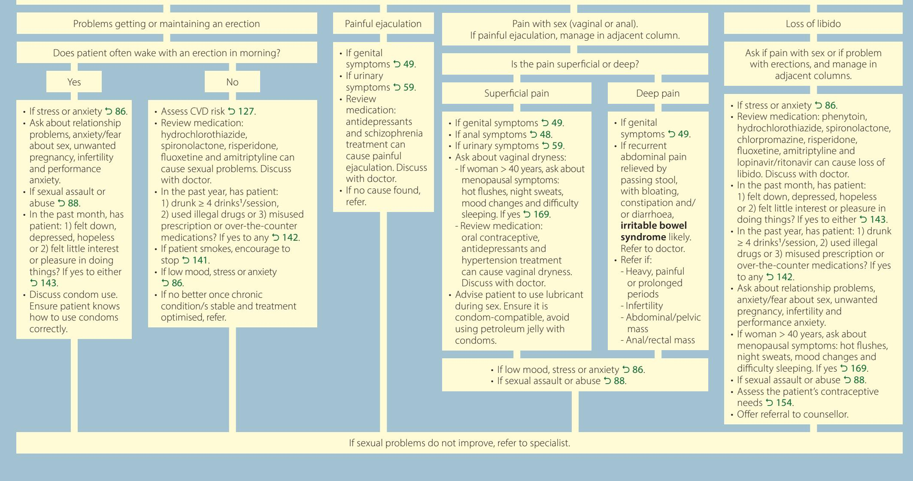

1One drink is 1 tot of spirits, or 1 small glass (125mL) of wine or 1 can/bottle (330mL) of beer.

**[TB](#page-85-0)**

**CONTENTS SYMPTOMSCONTENTS CHRONIC CONDITIONS**

**[HEPATITIS B \(HBV\)](#page-116-0) [COVID-19](#page-117-0)**

**58**

**[HIV](#page-102-0) [CHRONIC RESPIRATORY DISEASE](#page-119-0) [CARDIOMETABOLIC CONDITIONS](#page-123-0) [MUSCULOSKELETAL DISORDERS](#page-147-0) [MENTAL HEALTH](#page-136-0) [EPILEPSY](#page-145-0) [WOMEN'S HEALTH](#page-150-0) [PALLIATIVE CARE](#page-166-0)**

# **URINARY SYMPTOMS**

### **Give urgent attention to the patient with urinary symptoms and any of:**

- •Unable to pass urine with lower abdominal discomfort/distention
- • Blood/protein in urine and new swelling of face/feet, BP ≥ 140/90 or passing little urine: **kidney disease** likely Blood in urine and sudden, severe, one-sided pain in flank or groin: **kidney stone** likely

### **Manage and refer urgently:**

- If unable to pass urine, insert urinary catheter.
- •If **kidney disease** likely: if pulse > 100 or respiratory rate ≥ 30, give face mask oxygen and furosemide 80mg slow IV, avoid IV fluids. If BP > 150/100, give amlodipine 5mg and furosemide 40mg orally.
- If **kidney stone** likely: give sodium chloride 0.9% 1L IV 6 hourly. If pain severe, give morphine 10mg IM or 3-10mg slow IV. For IV: dilute 10mg morphine with 9mL of sodium chloride 0.9%.
- If **complicated pyelonephritis** likely: first collect urine for MCS and then give ceftriaxone 1g IV1/IM. If BP < 90/60, give sodium chloride 0.9% 500mL IV over 30 minutes, repeat until systolic BP > 90. Continue 1L 6 hourly. Stop if breathing worsens.

### **Approach to the patient with urinary symptoms not needing urgent attention**

If flank pain with leucocytes/nitrites, **uncomplicated pyelonephritis** likely: send urine MCS. Give ciprofloxacin 500mg 12 hourly for 7 days and paracetamol 1g 4-6 hourly. Advise to return if worse: refer.

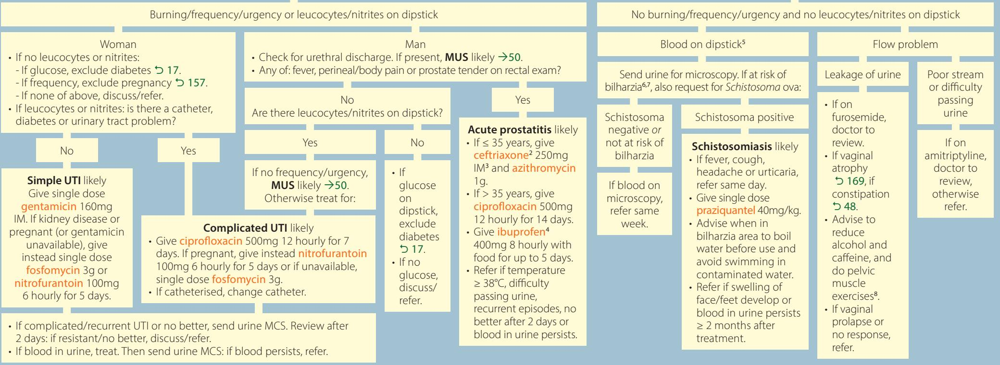

Do not mix Ringer's lactate and IV ceftriaxone. Flush IV line with sodium chloride 0.9% before and after IV ceftriaxone. 2If severe penicillin allergy (history of anaphylaxis, urticaria or angioedema), omit ceftriaxone and increase azithromycin to 2g. For ceftriaxone 250mg IM injection: dissolve 250mg in 0.9mL lidocaine 1% without epinephrine (adrenaline). 4Avoid if peptic ulcer, asthma, hypertension, heart failure or kidney disease. 5If menstruating, repeat dipstick after period has finished. Patient at risk of bilharzia if s/he has washed/swam in dams, streams or lakes in an endemic area (Limpopo, North West, Mpumalanga, KwaZulu-Natal and parts of Eastern Cape). 7If microscopy not available and patient lives in endemic area, treat as schistosomiasis. 8Repeated contraction and relaxation of pelvic floor muscles.

-  Flank pain with leucocytes/nitrites on urine dipstick, and any of: vomiting, BP < 90/60, pulse ≥ 100, diabetes, male, pregnant or post menopause: **complicated pyelonephritis** likely
- •

### **BODY/GENERAL PAIN**

•A patient has body/general pain if his/her body aches all over or most of body is painful.

If pain localised to one area: if in back [63](#page-59-0), arm/hand [64](#page-60-1), leg [65](#page-61-0), foot [66](#page-62-0), neck [64](#page-60-0).

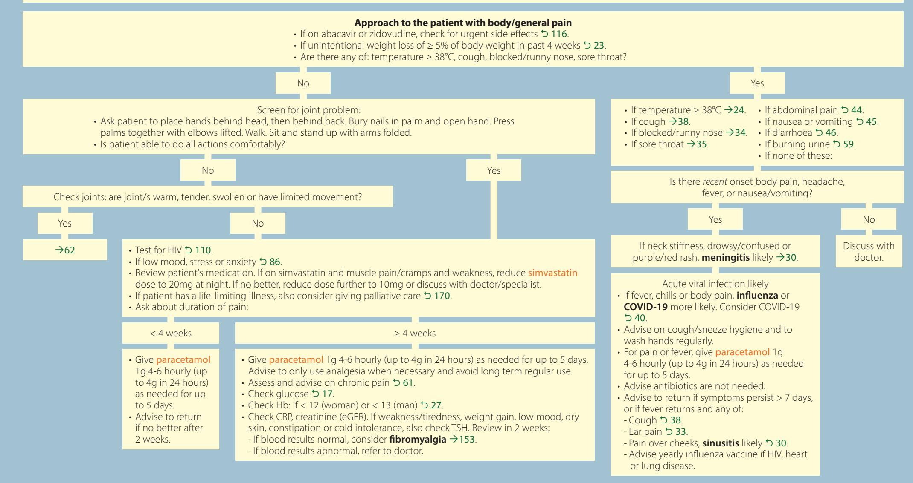

#### 1Test for malaria with rapid diagnostic test if available, and parasite slide microscopy.

### **CHRONIC PAIN**

Chronic pain is pain that lasts longer than 4 weeks. A doctor should confirm the underlying cause of the pain.

|                                                                                 | he ien it h c hro ic p in is it As t at t w at se ss p n a ev ery v                                                                                                                                                                                                                                                                                                                                                                                                                                                                                                                                                                                                                                                                                                                                                                                                                                                                                                                                                              |
|---------------------------------------------------------------------------------|-------------------------------------------------------------------------------------------------------------------------------------------------------------------------------------------------------------------------------------------------------------------------------------------------------------------------------------------------------------------------------------------------------------------------------------------------------------------------------------------------------------------------------------------------------------------------------------------------------------------------------------------------------------------------------------------------------------------------------------------------------------------------------------------------------------------------------------------------------------------------------------------------------------------------------------------------------------------------------------------------------------------------------------------------------------------------------------------------|
| As se ss                                                                  | No te                                                                                                                                                                                                                                                                                                                                                                                                                                                                                                                                                                                                                                                                                                                                                                                                                                                                                                                                                                                                                                                                                        |
| d du f p S ite ion in rat an o a                  | k w he he d w he he d. d he As in i in s Do in r iate ? re t n t tar te p a s a n p a es p a a an y w re                                                                                                                                                                                                                                                                                                                                                                                                                                                                                                                                                                                                                                                                                                                                                                                                                                                                                     |
| f p Ty in p e o a                                                | hav Do ien in o in ? at t es p e c an cer p a r n on -ca nce r p a • f n f p I de de has l p in, i i at ien t t issu in, in o ntr in: on -ca nce r p a c e p a ne rve p a r ce a a • f a hri low bac k /ne k p hro lun b lem iss in li ke ly. I is, j int in, in o nic rt t t o p a er c a r c g p ro ue p a - , f p hin les l ne lg he l ne hy d bet hy, li ke ly I iou ig ina ia, ip ia ic n in tr at at rev s s g em ura p er ra uro p or eu rop ne rve p a - , f f i I bro lg b le bo l sy dro l p in li ke ly. ia o r ir rita ntr my a we n me , ce a a - |
| f p Sev ity in er o a                                         | lim f fe lee f da ly livi d o l k fun Do in it a ivit ivit ies i ia /w ion ing ? ct ct act ct es p a y or a s p, o ng , m oo r so c or • As k p de le fro h 0 be d 1 be he las fy i l d ( ), m de ( ) o ( ). ien in o 0 - 10, it ing in a 0 ing in: i in a 1-3 rat 4-7 8-1 0 at t to t rst g ra p a n a sc a m w no p a n wo p a c s p a s m o e r se ve re •                                                                                                                                                                                                                                                                                                                                                                                |
| fac Re liev d a ing at ing tor an g g rav s | W hat kes he bet ? W hat has be he lp ? Do d he lp ? Use his he lp de de hic h p l l he lp he t in ter at ien t ing to in in m ica t ion t to at ien t i in s tra teg ies i t st. m a p a or wo rse p en us p a es p a e p c w a w mo                                                                                                                                                                                                                                                                                                                                                                                                                                                                                                                                                                                                                 |
| Me l hea lt h nta                                                |  k ho d w hat d /or l ca de d. f low d, s As ien is c ing irit is n I xie 8 6. at t ort tre ty w p op an su p p an sp ua re ee m oo ss o r an                                                                                                                                                                                                                                                                                                                                                                                                                                                                                                                                                                                                                                                                                                                                                                                                                 |
| lco ho l / dru A g use                                     | he has ) dru k ≥ dr ks 1/s ) u d l leg l dru ) m d p he d f y  In t ien t: 1 4 in ion 2 i r 3 isu ip ion ica ion ? I 142 ast at t t ter t to p ear p n ess se a g s o se res cr or ov er- -co un m e s es any y , ,                                                                                                                                                                                                                                                                                                                                                                                                                                                                                                                                                                                                                                                                |
| hro d C nic it ion co n s                               | for l l his he he hro d Ens ien is r ivin riat / nic it ion Ma ine /s. at t t t ure p ece g ap p rop e c are a r o r c co n s. nag e a s o n r ou ca re p ag e                                                                                                                                                                                                                                                                                                                                                                                                                                                                                                                                                                                                                                                                                                                                                                                  |
| l liat Pa ive ca re                                              | f p has li fe- lim l lne lso de l liat  I ien it ing i i ivin ive 170 at t a ss, a co ns r g g p a ca re                                                                                                                                                                                                                                                                                                                                                                                                                                                                                                                                                                                                                                                                                                                                                                                                                                                                                    |
| f p Exa mi in ne are a o a                                 | f s  f j  f foo I kin b lem I b lem I bac k, n k, leg ha d p b lem 67 int 6 2. t, a tom p ro o p ro ec rm or n ro , m an ag e a s o n s y mp p ag e. ,                                                                                                                                                                                                                                                                                                                                                                                                                                                                                                                                                                                                                                                                                                                                                                                     |

#### **Advise the patient with chronic pain**

- •Ask what patient thinks is causing pain and what impact it is having on his/her life and family. Address patient's and family's concerns about pain. For tips on communicating effectively [176](#page-172-0).
- Educate that non-cancer chronic pain can be because pain signals in the brain stop working normally and get stuck in the 'on' position, even when the cause has resolved. It does not always mean a disease or cancer. Tests cannot always show the reason for the pain and often are not needed.
- •Help the patient, along with his/her family, to choose strategies to get help and cope with chronic pain:

Spend time with supportive friends or family.

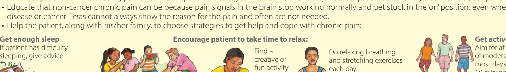

to do.

**Get active** Aim for at least 30 minutes of moderate exercise most days. Start with 10 minutes/day and increase steadily.

**Manage activities**  Advise to stagger tasks and to avoid trying to fit too many activities into one day.

medication.

**Access support** Link patient with helpline or support group [178](#page-174-0).

**Limit alcohol and avoid drugs** Limit alcohol to ≤ 2 drinks/day and avoid alcohol on at least 2 days/week. Avoid drugs and unnecessary pain

### **Treat the patient with chronic pain**

- Manage pain together with patient and interdisciplinary team: refer if needed to physiotherapist, occupational therapist, spiritual counsellor/psychologist, social worker and community health worker.
- Together with the patient, set realistic pain management goals: to be as pain-free as possible (this might not be completely pain-free) so that s/he can do the things s/he wants and enjoys doing.
- Treat the patient's chronic pain on relevant symptom or routine care page. If appropriate, suggest patient tries movement exercise and heat/cold packs as these may help ease the pain.

1One drink is 1 tot of spirits, or 1 small glass (125mL) of wine or 1 can/bottle (330mL) of beer.

[87](#page-83-0).

### **JOINT SYMPTOMS**

#### **Give urgent attention to the patient with a joint symptom/s and:**

- Short history of single warm, swollen, extremely painful joint with limited range of movement, **septic arthritis** likely
- •Injury in past 48 hours and severe pain/swelling or deformity, **fracture** likely [18](#page-14-0).

### •**Management:**

- • If known gout and affected joint involves big toe, midfoot or ankle *and* no fever, wound, surgery or injection into joint, discuss with specialist if referral needed: if not, **acute gout** likely [152](#page-148-0).
- •Refer urgently.

### **Approach to the patient with joint symptoms not needing urgent attention**

 Check joints and ask patient to place hands behind head, then behind back. Bury nails in palm and open hand. Press palms together with elbows lifted. Walk. Sit and stand up with arms folded. Is there any of: joint warm/tender/swollen or unable to do all actions comfortably?

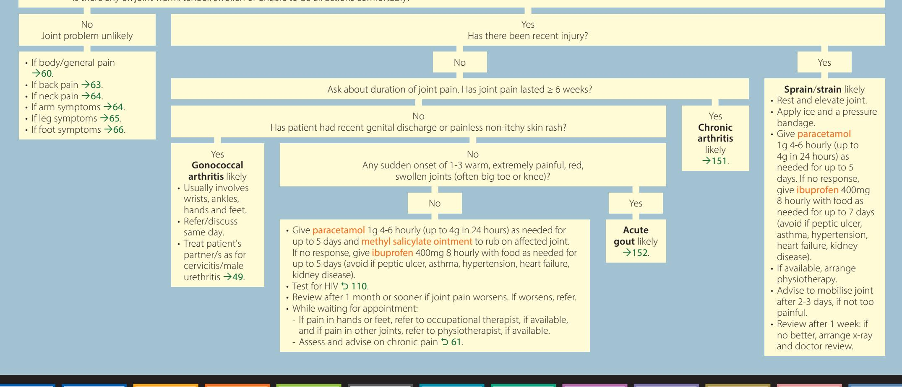

**[HEPATITIS B \(HBV\)](#page-116-0) [COVID-19](#page-117-0)**

**[HIV](#page-102-0) [CHRONIC RESPIRATORY DISEASE](#page-119-0) [CARDIOMETABOLIC CONDITIONS](#page-123-0) [MUSCULOSKELETAL DISORDERS](#page-147-0) [MENTAL HEALTH](#page-136-0) [EPILEPSY](#page-145-0) [WOMEN'S HEALTH](#page-150-0) [PALLIATIVE CARE](#page-166-0)**

•

•

Temperature ≥ 38°C

Unable to weight-bear

### **BACK PAIN**

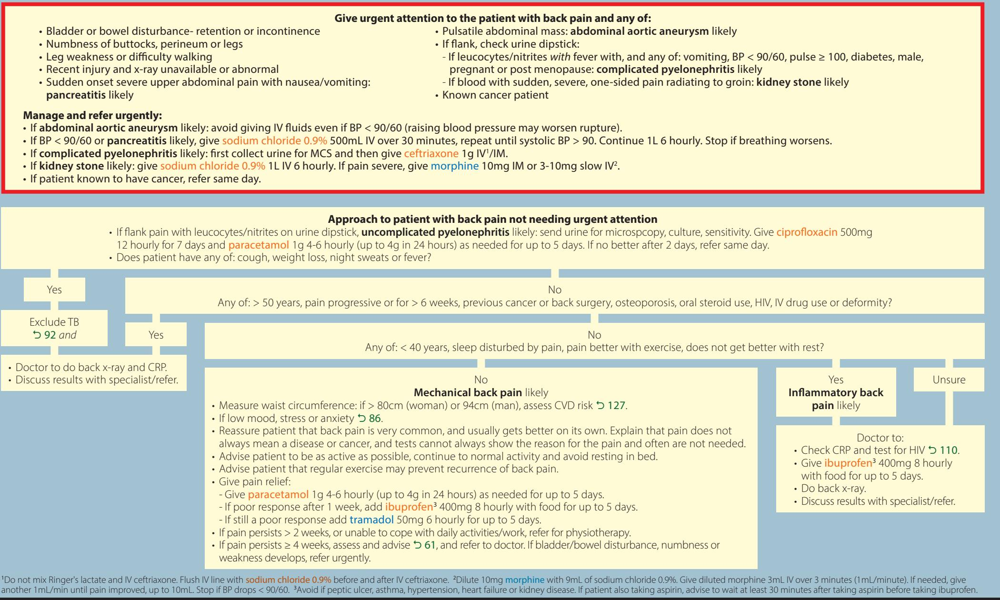

### **NECK PAIN**

### **Give urgent attention to the patient with neck pain and any of:**

- • Neck stiffness and any of: temperature ≥ 38°C, headache, drowsy/confused or purple/red rash: **meningitis** likely. Give ceftriaxone 2g IV1/IM. Avoid injecting > 1g IM at one injection site. •Neurological symptoms in arms/legs: weakness, numbness, clumsiness, stiffness, change in gait or difficulty with co-ordination
- Recent injury and x-ray unavailable/abnormal or neurological symptoms: apply rigid neck collar and immobilise head with tape and sandbags/IV fluid bags on either side of head.

### **Refer urgently.**

### **Approach to the patient with neck pain not needing urgent attention**

Any of: >50 years, pain progressive or lasting > 6 weeks, oral steroid use, HIV, diabetes, IV drug use, unexplained weight loss/fever or TB/neck surgery/previous cancer?

| Ye s                                                                                                                                                             | No                                                                                                                                                                                                                                                                                                                                                                                                                                                                                                                                                                                                                                                                                                                                                                                                                                                                                                                                                                              |
|---------------------------------------------------------------------------------------------------------------------------------------------------------------------|---------------------------------------------------------------------------------------------------------------------------------------------------------------------------------------------------------------------------------------------------------------------------------------------------------------------------------------------------------------------------------------------------------------------------------------------------------------------------------------------------------------------------------------------------------------------------------------------------------------------------------------------------------------------------------------------------------------------------------------------------------------------------------------------------------------------------------------------------------------------------------------------------------------------------------------------------------------------------------|
| l sp Do rvi ine ce ca x- ray • he k C C R P. c • D h s list isc it ia uss w p ec • | G l 1 ho ly (up ho ) for da f n bu fen 2 4 ho ly h foo d for da ive 4-6 4g in 24 5 I ive i 0 0m 8 wi 5 tam to to t to p ara ce o g ur urs up y s. o r esp on se, g p ro g ur up y s. • f n be fte da d n fer for hy he f p ks, d a dv  I r 5 in, iot I in ≥ 4 ise 61 tte o r a s a n o a rm p a re p s rap a ee ass ess an y y. w • f n fte fer I ks, kn /n bn de lop do l sp d r r 6 in, in rvi ine o r esp on se a w ee arm p a we a ess um ess ve s o r p a wo rse ns, ce ca x- ray s a n e • |

# **ARM OR HAND SYMPTOMS**

- Check joints and ask patient to place hands behind head, then behind back. Bury nails in palm and open hand. Press palms together with elbows lifted. Walk. Sit and stand up with arms folded.
- If joint warm/tender/swollen or unable to do all actions comfortably, **joint problem** likely [62](#page-58-0).

| Ar in m p a • f re I t cen • d Ne su w •                                                                                                                                                       | he G ive ion t a tte nt to t ur g en p 3 it h c he in st 7. w p a d s l l de for fra in j in /sw ing ity, ury an eve re p a e or m de f w kn f a h ho d it /w it et ut n o ns o ea ess o rm w | h a ha d s d a f: ien it at t w to rm or n mp ms an ny o y l ke ly  i 18. ctu re f f ic lty k l d ba de ke i ing isu ist i T I A r st sp ea or a ur nc e: co ns ro or u v  |  13 6.                                                                                                                                                                                                                                                                                                                  |  |
|---------------------------------------------------------------------------------------------------------------------------------------------------------------------------------------------------------------------------------------------|---------------------------------------------------------------------------------------------------------------------------------------------------------------------------------------------------------------------------------------------------------------------------------------------------------------------------------------------------------------------------------------------|-----------------------------------------------------------------------------------------------------------------------------------------------------------------------------------------------------------------------------------------------------------------------------------------------------------------------------------------------------------|--------------------------------------------------------------------------------------------------------------------------------------------------------------------------------------------------------------------------------------------------------------------------------------------------------------------------------|--|
|                                                                                                                                                                                                                                             | h t he ien it h a Ap o t at t w p roa c p rm                                                                                                                                                                                                                                                                                                         | ha d s d ing ion to t n t a tte nt or n y mp ms no ee ur g en                                                                                                                                                                                                                                    |                                                                                                                                                                                                                                                                                                                                |  |
| Pa fu l s ho l de in u r                                                                                                                                                                                            | Wr / ha d p ist in: int itte nt, n a erm w ors e ht, liev d by ha kin be nig Ma at re e s g. y                                                                                                                                                                                                       | E l bo h o fte l bo f le /ex in wi xio ion t ten w p a r a r e w n s ha de d g h. Ma rip st t y ve cre ase ren g                                                                                                                           | Pa ba f t hu b w d by hu b o in at t se o m ors en e m r hin loc kin f f in ist / nt cat wr mo ve me or c g g o g er                                                                                   |  |
| fer d p li ke ly Re in re a As k a bo k p (se bo ), c h / in ut ne c a e a ve ou g                                                                            | bn lin d a d d /t ing in 2n 3r 1st nu m ess g n , f in f kn ha d. g ers or w ea ess o n                                                                                                                                                                                                           | Te is o l fer 's e l bo li ke ly nn r g o w                                                                                                                                                                                                                                                                        | Te it is o f ha d /w ist li ke ly no sy no v n r d s lint Re j int st a n p o • bu fen 2 4 ho ly h foo d G ive i 0 0m 8 wi t p ro g ur • for da to 5 up y s. |  |
| d f f ic lty bre hin 3 he i 8, c in at st p g a u 3 b do l p 4 mi in 7, a 4, na a p reg na ncy  15 7.                             | l tu l sy dr li ke ly Ca rp a nn e n om e Sp lint l p ht. rist in utr it ion at ni w ne a os g                                                                                                                                                                                                       | dv ly l bo d r A ise ien ice at t to to est p ap p e an ar m. w • bu fen 2 4 ho ly h foo d for da G ive i 0 0m 8 wi 10 t p ro g ur y s. • Re fer for hy he iot p s rap y. • |                                                                                                                                                                                                                                                                                                                                |  |
|                                                                                                                                                                                                                                             |                                                                                                                                                                                                                                                                                                                                                                                             | f n be fte ks fer do I r 6 tte to cto o r a w ee or wo rse ns, re r.                                                                                                                                                                                                                          |                                                                                                                                                                                                                                                                                                                                |  |
| 1Do er's lac d IV ftri Flu sh IV l ix R ing ine t m tate no an ce axo ne. s af tak be fore tak ibu fen min ing irin ing ute ter as p pro | th s od ch lor ide % b efo nd afte ftri wi ium 0.9 r IV re a ce axo                                                                                                                                                                                                                                                                         | 2A d if ulc hm hyp hea rt fa ilur r ki dne dis voi tic ion ast ert ne. pe p er, a, ens e o y eas ,                                                                                                                                                                             | e. If t al tak dvi at l tien ing irin ait t 30 se t pa so as p , a o w eas                                                                                                                                                                                                  |  |
| CON TS CHR TEN TS SYM CON TEN IC CON ON TB PTO MS DIT ION S                                                                                                                                          | TIS B (H BV) COV HIV HEP ATI ID-1 9                                                                                                                                                                                                                                                                                                                                 | IC RES CHR ON CAR LIC CON DIO MET ABO ATO SY RY DIS PIR MEN TAL HE ALT H EPI LEP DIT ION S EAS E                                                                                                                                                                                     | MU SCU L DIS LOS KEL ETA WO 'S H CA MEN EAL TH PAL LIAT IVE ORD ERS                                                                                                                                                                                                            |  |

### **LEG SYMPTOMS**

#### Screen for joint problem:

Check joints and ask patient to place hands behind head, then behind back. Bury nails in palm and open hand. Press palms together with elbows lifted. Walk. Sit and stand up with arms folded.

- If joint warm/tender/swollen or unable to do all actions comfortably, **joint problem** likely [62](#page-58-0).
- If the problem is only in the foot [66](#page-62-0).

#### **Give urgent attention to the patient with leg symptoms and any of**

Unable to bear weight following injury, **fracture** likely [18](#page-14-0).

**[TB](#page-85-0)**

**CONTENTS SYMPTOMSCONTENTS CHRONIC CONDITIONS**

- Swelling and pain in one calf: **deep venous thrombosis** likely, especially if BMI1 > 30, smoker, immobile, pregnant, on oestrogen, leg trauma, recent hospitalisation, TB or cancer
- •Sudden severe leg pain at rest with any of the following in the leg: numbness, weakness, pallor, no pulse: **acute limb ischaemia** likely
- Muscle pain in legs or buttocks on exercise associated with pain at rest, gangrene or ulceration: **critical limb ischaemia** likely

**Refer urgently.**

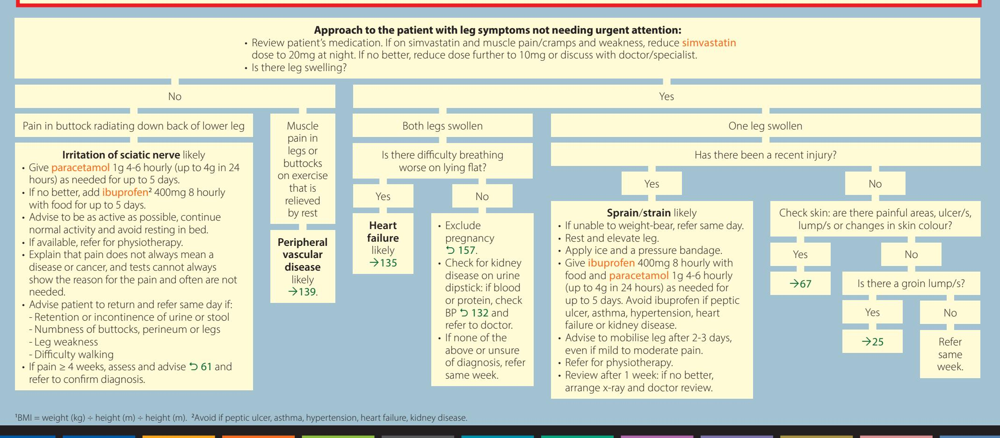

**[HIV](#page-102-0) [COVID-19](#page-117-0) [CHRONIC RESPIRATORY DISEASE](#page-119-0) [HEPATITIS B \(HBV\)](#page-116-0) [CARDIOMETABOLIC CONDITIONS](#page-123-0) [MUSCULOSKELETAL DISORDERS](#page-147-0) [MENTAL HEALTH](#page-136-0) [EPILEPSY](#page-145-0) [WOMEN'S HEALTH](#page-150-0) [PALLIATIVE CARE](#page-166-0)**

### **FOOT SYMPTOMS**

Check if problem is in the joint: ask patient to walk. Sit and stand up with arms folded. If unable to do all actions comfortably and problem seems to be specifically in the joint [62](#page-58-0).

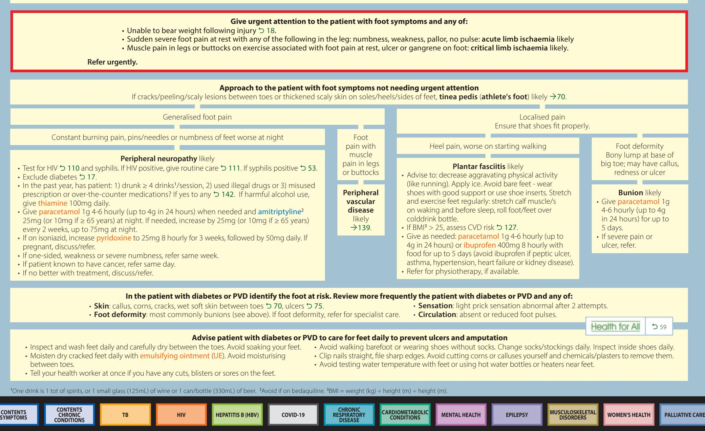

### **SKIN SYMPTOMS**

- If sudden generalised itch/rash or face/tongue swelling and any of: wheeze, difficulty breathing, BP < 90/60, dizziness/collapse, abdominal pain, vomiting or exposure to possible allergen1, check for anaphylaxis [20](#page-16-0).
- •Purple/red rash with any of: neck stiffness, drowsy/confused, temperature ≥ 38°C, headache: **meningococcal disease** likely
- Diffuse rash appearing within 3 months of starting a new medication *and* any of the following, **serious drug reaction** likely:
- BP < 90/60

- Involves mouth, eyes or genitals
- Temperature ≥ 38°C
- Blisters, peeling or raw areas
- Abdominal pain
- Jaundice
- Vomiting or diarrhoea

### **Management:**

- •If **meningococcal disease** likely: give ceftriaxone 2g IV2/IM. Avoid injecting > 1g IM at one injection site.
- Prevent disease in close household contacts:
- If pregnant or child contact < 6 years old, give ceftriaxone 250mg IM.
- •If child 6-12 years old, give ciprofloxacin 250mg as a single dose.
- If ≥12 years, give ciprofloxacin 500mg as a single dose.

**[TB](#page-85-0)**

**CONTENTS SYMPTOMSCONTENTS CHRONIC CONDITIONS**

- If **serious drug reaction** likely: stop all medication. If peeling or raw skin, also manage as for burns before referral [21](#page-17-0).
- •If BP < 90/60, give sodium chloride 0.9% 500mL IV over 30 minutes, repeat until systolic BP > 90. Continue 1L 6 hourly. Stop if breathing worsens.
- Refer urgently.

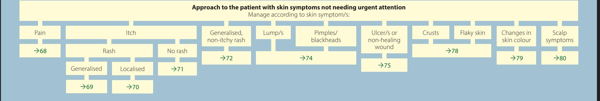

**If rash is extensive, recurrent or difficult to treat, test for HIV [110](#page-106-0).**

1Common allergens include medication, food or insect bite/sting within the past few hours. 2Do not mix Ringer's lactate and IV ceftriaxone. Flush IV line with sodium chloride 0.9% before and after IV ceftriaxone.

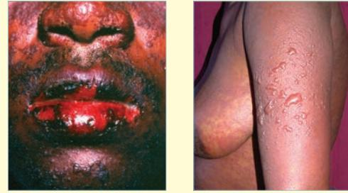

© University of Cape Town

### **PAINFUL SKIN**

#### **Check if the patient needs urgent attention [67](#page-63-0).**

Red, warm, swollen skin

Red, warm, painful lump which may be fluctuant in the centre. May discharge pus.

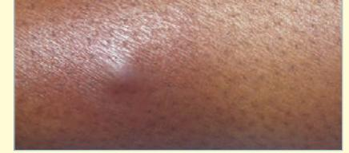

© University of Cape Town

#### **Boil**/**abscess** likely

- If fluctuant, arrange incision and drainage.
- Give paracetamol 1g 4-6 hourly (up to 4g in 24 hours) as needed for up to 5 days.
- If multiple lesions, lesion on face, extensive surrounding infection, temperature ≥ 38°C, HIV or diabetes, give antibiotic:
- Give flucloxacillin 500mg 6 hourly *or* cefalexin 500mg 6 hourly for 5 days.
- If severe penicillin allergy1, give instead azithromycin 500mg daily for 3 days.
- Advise to wash with soap and water, keep nails short and avoid sharing clothing or towels.
- If recurrent boils or abscesses:
- Test for HIV [110](#page-106-0) and diabetes [17](#page-13-0). Wash once with chlorhexidine 0.05%
- solution from neck down.
- Refer same day if:
- BP < 90/60
- Pulse > 100
- Deep abscess difficult area to drain (hands, breast, perineum)
- No response to treatment within 2 days

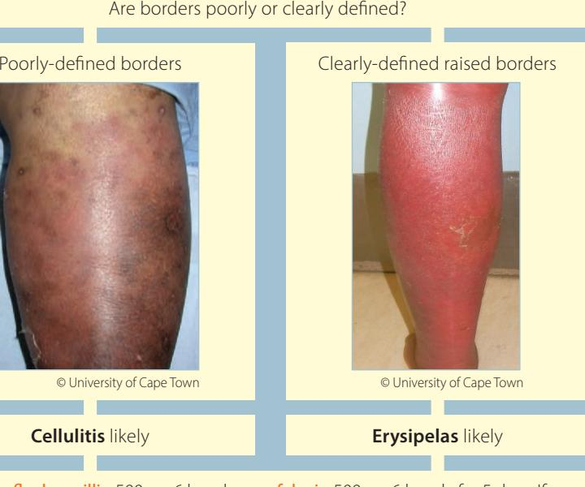

- Give flucloxacillin 500mg 6 hourly *or* cefalexin 500mg 6 hourly for 5 days. If severe penicillin allergy1, give instead azithromycin 500mg daily for 3 days. Give paracetamol 1g 4-6 hourly (up to 4g in 24 hours) as needed for up
- to 5 days.
- •If limb affected, advise to keep elevated.
- Refer same day if:
- BP < 90/60
- Pulse > 100
- Confused
- Hand, face or scalp involvement
- Extensive infection
- Blisters or grey/black skin
- Poorly controlled diabetes
- Recurrent infections with underlying problem (like lympoedema)
- No response to treatment within 2 days

### Painful blisters in a band along one side

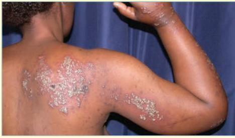

© University of Cape Town

#### **Herpes zoster** (**shingles**) likely

- Test for HIV [110](#page-106-0).
- • Advise to keep lesions clean and dry, and to avoid skin contact with others until crusts have formed.
- Give aciclovir 800mg 5 times a day (4 hourly missing the middle of the night dose) for days if:
- ≤ 3 days since onset of rash *or*
- At risk of severe infection (> 65 years, HIV, diabetes, severe heart/ liver disease or alcohol abuse) and lesions not yet crusted.
- For pain:
- Give paracetamol 1g 4-6 hourly (up to 4g in 24 hours) as needed.
- If needed, add tramadol 50mg 6 hourly. If poor response, doctor to increase dose to tramadol 100mg 6 hourly.
- If pain persists after rash has healed, give amitriptyline2 25mg at night. If no response, increase by 25mg every 2 weeks, up to 75mg if needed.
- If still poor response, refer.
- If infected (skin red, warm, swollen):
- Give flucloxacillin 500mg 6 hourly *or* cefalexin 500mg 6 hourly for 5 days.
- If severe penicillin allergy1, give instead azithromycin 500mg daily for 3 days.
- Refer same day if:
- Eye, ear or nose involvement
- Suspected meningitis (headache, temperature ≥ 38°C, neck stiffness)
- Rash involves more than one region

**68**

1History of angioedema, anaphylaxis or urticaria. 2Avoid if on bedaquiline.

**CONTENTS SYMPTOMSCONTENTS CHRONIC CONDITIONS**

**[HEPATITIS B \(HBV\)](#page-116-0) [COVID-19](#page-117-0)**

# **GENERALISED ITCHY RASH**

#### **Check if the patient needs urgent attention [67](#page-63-0).**

If red itchy crops of bumps that may have blistered or healed with darkening of skin, may have scratch marks, **insects bites** likely [70](#page-66-0).

Small red bumps and burrows in webspaces of fingers, axillae, waist and genitals. Very itchy, especially at night.

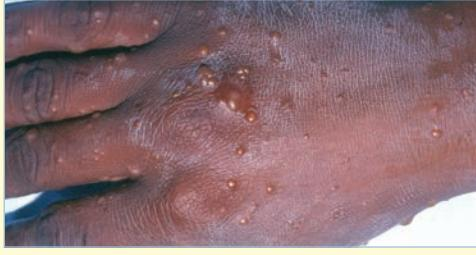

© University of Cape Town

#### **Scabies** likely

- Apply benzyl benzoate 25% lotion from neck to soles of feet and rub in well:
- Leave on for 24 hours, then wash off with soap and water.
- If severe, repeat once after 24 hours or within 5 days.
- Only if no better, apply permethrin 5% lotion at night from neck to soles of feet. Wash off after 8-12 hours. Repeat after 1 week if needed. Avoid using permethrin and benzyl benzoate together as may be toxic.
- • For itch, give chlorphenamine 4mg 8 hourly for up to 10 days. If mild itch, use only at night.
- Advise can return to work after first treatment.
- • Treat all household contacts and sexual partners at the same time, even if asymptomatic.
- Wash recently used linen and clothing in very hot water and dry well. Expose to direct sunlight.

**[TB](#page-85-0)**

If yellow crusts, also treat for likely **impetigo** [78](#page-74-0).

### Hyperpigmented, itchy bumps on limbs, trunk or face

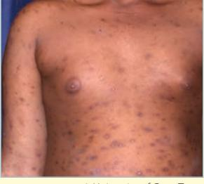

### **Papular pruritic eruption** (**PPE**) likely

- Test for HIV [110](#page-106-0).
- If lesions in webspaces, axillae or genitals, also
- treat for scabies in adjacent
- column. Apply hydrocortisone 1% cream twice a day for 7 days (apply sparingly to face, avoid eyes)
- For itch, give certirizine 10mg daily.
- •Advise patient:
- Reduce exposure to insect bites.
- May be long-standing and skin often remains hyperpigmented.
- May temporarily worsen after starting ART.
- If no response to treatment, discuss/refer.

© University of Cape Town

# © University of Cape Town

### **Eczema** likely

- Advise that eczema is a chronic condition with episodes of acute exacerbations.
- Advise to avoid triggers such as soap, detergents, heat, fabrics that cause itch, overheating at night.
- If low mood, stress or anxiety [86](#page-82-0).
- If severe, start at Step 3.

•

- **Step 1**. Wash with aqueous cream (UEA) instead of soap. Moisturise skin with emulsifying ointment (UE) twice a day and immediately after bathing.
- **Step 2**. If no better after 7 days or more severe eczema: apply hydrocortisone 1% cream twice a day for 7 days (apply sparingly to face, avoid eyes). If good response, reduce to once a day for 3 days, then stop.
- **Step 3**. If poor response to hydrocortisone or severe eczema, apply instead betamethasone 0.1% ointment once a day for 7 days (avoid face and neck). If good response, reduce to once a day for 3 days, then stop.
- For itch, give certirizine 10mg daily.
  - If oozing, pus or yellow crusts, treat for infection: give flucloxacillin 500mg 6 hourly or cefalexin 500mg 6 hourly for 5 days. If severe penicillin allergy1, give instead azithromycin 500mg daily for 3 days.
  - Refer if: no better after 2 weeks, extensive involvement or painful pustules.

### Very itchy, red, raised wheals that appear suddenly and usually disappear within 24 hours

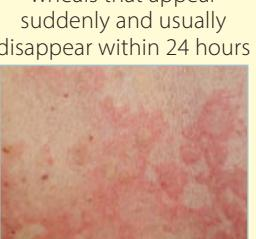

### **Urticaria** likely

- Help to identify and advise to avoid triggers2.
- Apply calamine lotion as needed.
- If recurrent eye problem, exclude allergic conjunctivitis [31](#page-27-0).
- If recurrent nose problem, exclude
- allergic rhinitis [34](#page-30-0). If recurrent cough or wheeze, exclude asthma [123](#page-119-0).
- For itch, give
- chlorphenamine 4mg 6-8 hourly.
- Advise to return immediately if any symptoms of anaphylaxis3 occur.
  - If no better after 24 hours, refer.

of starting a new medication.

Diffuse red rash mainly on trunk, arms and legs, which appeared within 3 months

© BMJ Best Practice

#### **Drug reaction** likely [73](#page-69-0).

1History of anaphylaxis, urticaria or angioedema. 2Common triggers include foods (milk, eggs, nuts, wheat, seafood), medications, insect bites/stings and latex. 3Symptoms of anaphylaxis include wheeze, difficulty breathing, dizziness/collapse, abdominal

**CONTENTS SYMPTOMSCONTENTS CHRONIC CONDITIONS**

pain, vomiting.

**Check if the patient needs urgent attention [67](#page-63-0).**

- If rash on scalp [80](#page-76-0).
- If very itchy, small red bumps and burrows in webspaces of fingers, axillae, waist or genitals, **scabies** likely [69](#page-65-0).
- •If patches of dry, scaly, itchy skin on wrists, ankles, inside elbows or behind knees, **eczema** likely [69](#page-65-0).

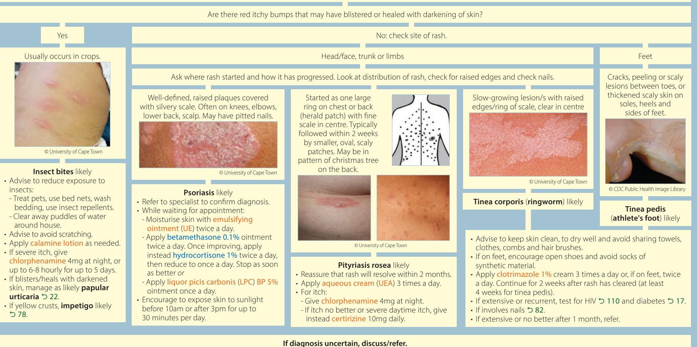

**[HIV](#page-102-0) [CHRONIC RESPIRATORY DISEASE](#page-119-0) [CARDIOMETABOLIC CONDITIONS](#page-123-0) [MUSCULOSKELETAL DISORDERS](#page-147-0) [MENTAL HEALTH](#page-136-0) [EPILEPSY](#page-145-0) [WOMEN'S HEALTH](#page-150-0) [PALLIATIVE CARE](#page-166-0)**

**[HEPATITIS B \(HBV\)](#page-116-0) [COVID-19](#page-117-0)**

**[TB](#page-85-0)**

**CONTENTS SYMPTOMSCONTENTS CHRONIC CONDITIONS**

### **ITCH WITH NO RASH**

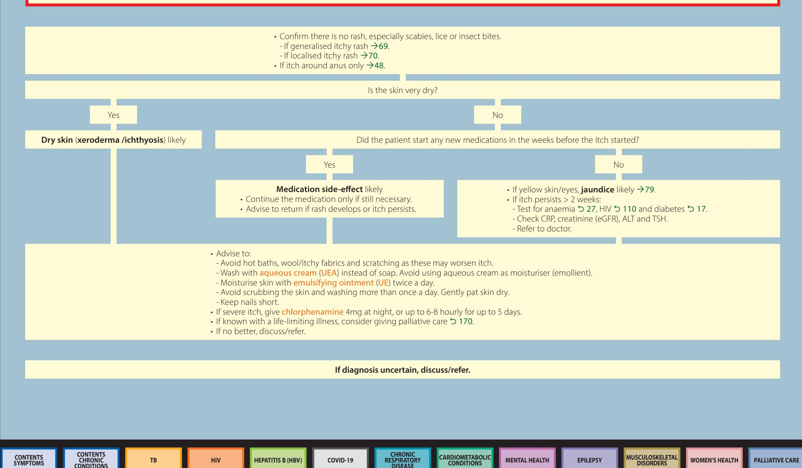

### **GENERALISED NON-ITCHY RASH**

**Check if the patient needs urgent attention [67](#page-63-0).**

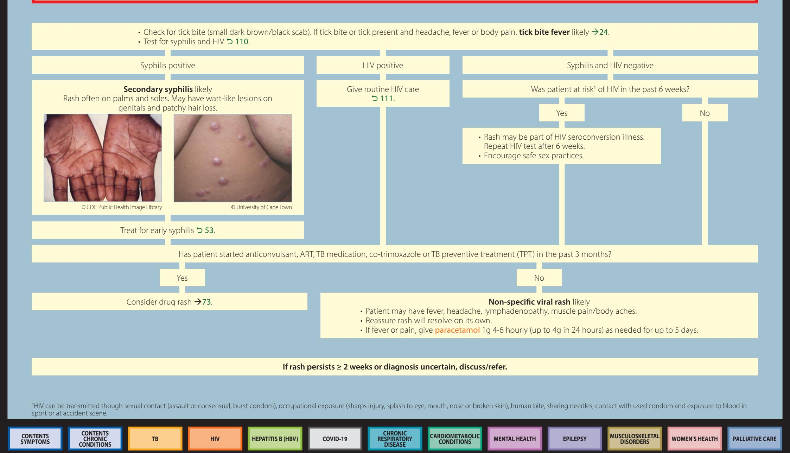

# **DRUG RASH**

 A drug rash can be caused by any medication, commonly antibiotics, anticonvulsants especially lamotrigine, ART, TB medication, co-trimoxazole, TB preventive treatment (TPT) and NSAIDs (like ibuprofen). Suspect a drug rash in a patient with a generalised rash which appeared within 3 months of starting a new medication.

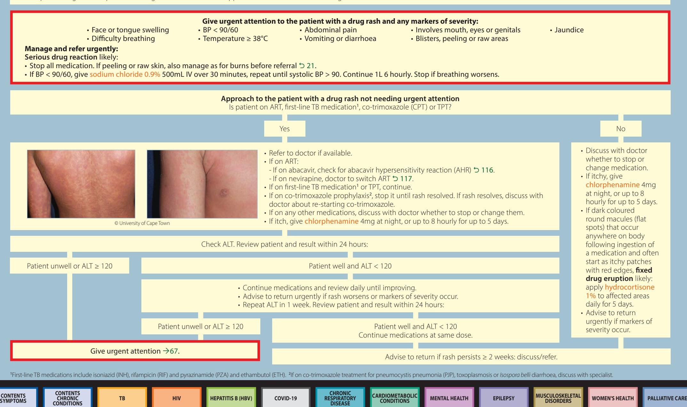

#### **Refer same week the patient with a mole that:**

•

 Is irregular in shape or colour Changed in size, shape or colour

•

•

- • Differs from surrounding moles Is > 6mm wide
- • Bleeds easily •Itches
- If painful, firm, red, warm lump which softens in the centre to discharge pus, **boil**/**abscess** likely [68](#page-64-0).

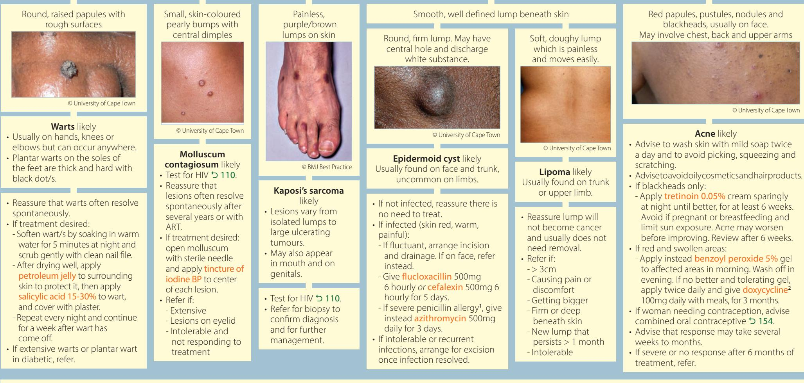

### 1History of angioedema, anaphylaxis or urticaria. 2Doxycycline may interfere with oral contraceptive, advise patient to use condoms as well. Avoid if pregnant or breastfeeding. Avoid giving together with iron or antacids. **If diagnosis uncertain, refer. [HEPATITIS B \(HBV\)](#page-116-0) [COVID-19](#page-117-0) [TB](#page-85-0) CONTENTS SYMPTOMS CONTENTS CHRONIC CONDITIONS[HIV](#page-102-0) [CHRONIC RESPIRATORY DISEASE](#page-119-0) [CARDIOMETABOLIC CONDITIONS](#page-123-0) [MUSCULOSKELETAL DISORDERS](#page-147-0) [MENTAL HEALTH](#page-136-0) [EPILEPSY](#page-145-0) [WOMEN'S HEALTH](#page-150-0) [PALLIATIVE CARE](#page-166-0)**

### **SKIN ULCER OR NON-HEALING WOUND: DIAGNOSIS**

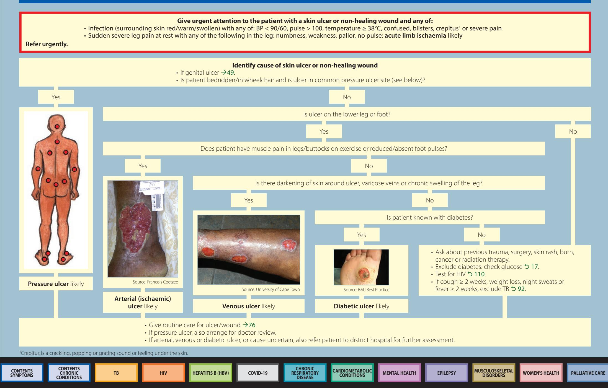

### **SKIN ULCER OR NON-HEALING WOUND: ROUTINE CARE**

If arterial, venous or diabetic ulcer, or cause uncertain, ensure patient has been referred to district hospital for further assessment.

|                                                                      |                                                                                                                                         | he ien it h a k in lce -he l ing d As t at t w se ss p s u r o r n on a w ou n                                                                                                                                                                                                                                                                                                                                                                                                                                                                                                                                                                                                                                                                                                                                                                                                                                                                                                                                                                                                                                                                                                                                                                                                                                                                                                                                                                                                                                                                                                                                                                                                                                                                                                                                                                                                                                                                                                                                                                                                                                                                                                                        |
|----------------------------------------------------------------------|-----------------------------------------------------------------------------------------------------------------------------------------|-------------------------------------------------------------------------------------------------------------------------------------------------------------------------------------------------------------------------------------------------------------------------------------------------------------------------------------------------------------------------------------------------------------------------------------------------------------------------------------------------------------------------------------------------------------------------------------------------------------------------------------------------------------------------------------------------------------------------------------------------------------------------------------------------------------------------------------------------------------------------------------------------------------------------------------------------------------------------------------------------------------------------------------------------------------------------------------------------------------------------------------------------------------------------------------------------------------------------------------------------------------------------------------------------------------------------------------------------------------------------------------------------------------------------------------------------------------------------------------------------------------------------------------------------------------------------------------------------------------------------------------------------------------------------------------------------------------------------------------------------------------------------------------------------------------------------------------------------------------------------------------------------------------------------------------------------------------------------------------------------------------------------------------------------------------------------------------------------------------------------------------------------------------------------------------------------------------------------------------------------------------------------------------|
| As se ss                                                       | he W n t o a sse ss                                                                                                      | No te                                                                                                                                                                                                                                                                                                                                                                                                                                                                                                                                                                                                                                                                                                                                                                                                                                                                                                                                                                                                                                                                                                                                                                                                                                                                                                                                                                                                                                                                                                                                                                                                                                                                                                                                                                                                                                                                                                                                                                                                                                                                                                                                                                                                                                                                            |
| Pa in                                                             | Eve vis it ry                                                                                                                  | f p  I ks, d a dv in ≥ 4 w ise 61 a ee ass ess an • f n d p lso hec k for d fec be low I nin in, in ion t ew or wo rse g wo un a a c wo un as • f m le p leg bu ks o hat liev d by du d bse foo lse he l va lar d ( ) li ke ly  f I in i / ise is /a ip ise P V D ive ine 13 9. I tto t t, o nt t p ut usc a n s c n e xer c re e res r re ce s, p er ra scu ase : g ro ca re u • fer ly d d w h P V D, a lso k. iag it new no se re sa me we e                                                                                                                                                                                                                                                                                                                                                                                                                                                                                                                                                                                                                                                                                                                                                                                                                                                                                                                                                                                                                                                                                                                                                                                                                                                                                                                                                                                                           |
| C hro d nic it ion co n s                    | As de d nee                                                                                                                    | for l l his he hro d f d bet  hy  he l va lar d ( )   Ens ien is r ivin ine / nic it ion I ia 13 0, ion 13 3, p ip ise P V D 13 9, H I V 11 1. at t t ert ure p ece g rou ca re a r c co n s. es p en s er ra scu ase                                                                                                                                                                                                                                                                                                                                                                                                                                                                                                                                                                                                                                                                                                                                                                                                                                                                                                                                                                                                                                                                                                                                                                                                                                                                                                                                                                                                                                                                                                                                                                                                                                                                                                                                                                                                                                   |
| d Me ica ion t s                                      | Eve vis it ry                                                                                                                  | d bu fen dn d c he he de lay d hea ling h do Rev iew ica ion N S A I Ds (e.g i ), p iso D isc it t t cto m e : p ro re ne an mo rap y can ca use e uss w r.                                                                                                                                                                                                                                                                                                                                                                                                                                                                                                                                                                                                                                                                                                                                                                                                                                                                                                                                                                                                                                                                                                                                                                                                                                                                                                                                                                                                                                                                                                                                                                                                                                                                                                                                                                                                                                                                                                                                                                   |
| De ion p res s                                           | h ly Mo nt                                                                                                                     | he h, has fe lt do de d, ho les fe lt litt le lea do hin f y he  In t ien ) r 2 ) int in ing ? I it 143 ast t at t: 1 st o t to p m on p wn p res se p e s o ere r p sur e g s es e r ,                                                                                                                                                                                                                                                                                                                                                                                                                                                                                                                                                                                                                                                                                                                                                                                                                                                                                                                                                                                                                                                                                                                                                                                                                                                                                                                                                                                                                                                                                                                                                                                                                                                                                                                                                                                                                                                                                                           |
| A lco ho l / dru g use                          | Firs t v is it                                                                                                                 | he has ) dru k ≥ dr ks 1/s ) u d l leg l dru ) m d p he d ? f y  In t ien t: 1 4 in ion 2 i r 3 isu ip ion ica ion I 142 ast at t t ter t to p y ear p n ess se a g s o se res cr or ov er- -co un m e s es any , ,                                                                                                                                                                                                                                                                                                                                                                                                                                                                                                                                                                                                                                                                                                                                                                                                                                                                                                                                                                                                                                                                                                                                                                                                                                                                                                                                                                                                                                                                                                                                                                                                                                                                                                                                                                                                                                                    |
| l liat Pa ive ca re                                   | Firs is it t v                                                                                                                 | f p has li fe- lim l lne lso de l liat  I ien it ing i i ivin ive 170 at t a ss, a co ns r g g p a ca re                                                                                                                                                                                                                                                                                                                                                                                                                                                                                                                                                                                                                                                                                                                                                                                                                                                                                                                                                                                                                                                                                                                                                                                                                                                                                                                                                                                                                                                                                                                                                                                                                                                                                                                                                                                                                                                                                                                                                                                                                                                                        |
| 2 a B M I d n utr it ion n                   | Mo h ly nt                                                                                                                     | f f f n f ic 3, a fer I B M I < l su I B M I < l de lso d 19. 5: a utr it ion ort 18. 5 o ig utr it ion ien to iet it ian rra ng e n a p p r s ns o a cy re •  f B dv hea lt hy d d r lar hy l ac f n f B lso fer d I M I > 25: ise iet ica ivit 11. I im r i M I > 3 0, a iet it ian t t o to a an eg u p s y o p rov em en re •                                                                                                                                                                                                                                                                                                                                                                                                                                                                                                                                                                                                                                                                                                                                                                                                                                                                                                                                                                                                                                                                                                                                                                                                                                                                                                                                                                                                                                                                                                                                                                                                                             |
| C k V D r is                                             | Firs is it t v                                                                                                                 | f a k fac 4, a k  I C V D r is C V D r is 127 tor ny s sse ss                                                                                                                                                                                                                                                                                                                                                                                                                                                                                                                                                                                                                                                                                                                                                                                                                                                                                                                                                                                                                                                                                                                                                                                                                                                                                                                                                                                                                                                                                                                                                                                                                                                                                                                                                                                                                                                                                                                                                                                                                                                                                                                                                          |
| Wo d a d un n d kin ing sur rou n s | Eve vis it ry                                                                                                                  | f w Me ize d de h o d a d r d in n t ote asu re s an p ou n n eco r s. • f > fer l (w ho le w d lim b ), v b le fat /m le /te do / bo de h, r fer I 10 ircu ia is i inc ing in ize t t cm , c m en ay rou n usc n n ne or rea s s or p e - lou f w d be d: k (ep he lia lis ), r d (g lat ), y l low (s lou hy ) o b lac k (ne ) Ass is it p in it ing ing ic ? t ess co r o ou n e ran e g r cro u • d d ha hec k c lou d s l l. Ass isc iste nt ess wo un rg e: c o r, c on s ncy , am ou an me • I f su d kin d /w /sw l len f d bet lce d d ha f fe l l, in fec ion li ke ly ing r i ia ic u inc ing isc ive t rro un s re arm o , o r an rea s rg e, p us or o ns sm e : • f lse fus d, b list 5 o fer ly. I B P < 9 0 / 6 0, p 10 0, 3 8 °C, itu in, tem tur t > e ≥ u p era co n e ers , cr ep s r se ve re p a re ur g en - f in fec de b de d w d e dg lce d e ds bo ly l le d d bet h I ion ive ing ite i iot ics ine /w ia iou it t ten ett ant xte to ntr ex s or g wo rse sp , un rm ou n e, u r ou n n ne, p oo r co o es or p rev s s urg ery w - f ic fer l im lan ( li ke late lac ), r day art i ia t in, j int t p p p or o re p em en e sa me |
| B loo d s ly leg to up p                        | I f u lce /w d o leg r ou n n : vis it eve ry                                                 | I f re du d o bse foo lse l lary f i l l t ds, d f fe bet fee ha kin lou los f ha hin kin bn i im 5 s i in t in s ir, s nt t p tur t, c e > ce r a u s, c ap re eco n ren ce em p era e we en ng e co r, s o y s , n um ess or • kne du d b loo d s ly li ke ly we a ss, re ce up p : f n ha d f re fer l w h s list fer l ho l. I isc it ia ita ew c ng es, uss ur g en cy o ra p ec or re ra sp - I f kno h r du d b loo d s ly d a lrea dy d a fer l ho l, c lan it t re ita t inu t p ive wn w e ce up p an ass ess e ra sp on e m an ag em en g n. -                                                                                                                                                                                                                                                                                                                                                                                                                                                                                                                                                                                                                                                                                                                                                                                                                                                                                                                                                                                                                                                                                                                                                                                                      |
| b lity Mo i                                                 | Eve vis it ry                                                                                                                  | f p b lem h m b lity fer hy he l t he for ha b lita I it i iot ist ion ist i ion to at t ort ro w o , re p s rap or occ up a rap re su p p                                                                                                                                                                                                                                                                                                                                                                                                                                                                                                                                                                                                                                                                                                                                                                                                                                                                                                                                                                                                                                                                                                                                                                                                                                                                                                                                                                                                                                                                                                                                                                                                                                                                                                                                                                                                                                                                                                                                                                                                         |
| luc G ose                                                      | Firs is it t v                                                                                                                 | f n kno h d bet hec k g luc  f kno d bet  I it ia I ia ive ine 13 0. ot 17. ut wn w es, c ose wn es, g ro ca re                                                                                                                                                                                                                                                                                                                                                                                                                                                                                                                                                                                                                                                                                                                                                                                                                                                                                                                                                                                                                                                                                                                                                                                                                                                                                                                                                                                                                                                                                                                                                                                                                                                                                                                                                                                                                                                                                                                                                                                                                                                       |
| b H                                                               | Firs is it t v                                                                                                                 |  f b < (wo ) o (m ), a ia li ke ly I H 12 13 27 r < ma n an na em                                                                                                                                                                                                                                                                                                                                                                                                                                                                                                                                                                                                                                                                                                                                                                                                                                                                                                                                                                                                                                                                                                                                                                                                                                                                                                                                                                                                                                                                                                                                                                                                                                                                                                                                                                                                                                                                                                                                                                                                                                                                                                                                                   |
| H I V                                                          | Firs is it t v                                                                                                                 | for  f d e  Tes H I V 110 I H I V p it ive ive ine ien is o A R T t ut at t 11 1. os , g ro ca re a n nsu re p n                                                                                                                                                                                                                                                                                                                                                                                                                                                                                                                                                                                                                                                                                                                                                                                                                                                                                                                                                                                                                                                                                                                                                                                                                                                                                                                                                                                                                                                                                                                                                                                                                                                                                                                                                                                                                                                                                                                                                                                                                                                |
| d s b Wo un wa                                           | f in fec d a d n bet I te ter n o fte day f a b r 2- 3 i iot ic nt a s o | lea d w h s d h lor de d lea for he d d e dg b a d be d hi le r b C it ium i 0. 9 % mi T i ing in a zig ion ing 5 tes t ota t n w ou n o c an ve nu n, a vo wo un es, m ove sw a cro ss w ou n -za g mo , w sw a • bet he f in I f w d dry b t h s d ium h lor i de lut be for kin b. iste ip wit 0. 9 % ion t e t we en g ers ou n , m o n s wa o c so a g sw a l low lts hec k in fec has be d a ly. Fo ion riat to t tre ate -up re su c en p p rop e •                                                                                                                                                                                                                                                                                                                                                                                                                                                                                                                                                                                                                                                                                                                                                                                                                                                                                                                                                                                                                                                                                                                                                                                                                                                                                                                                                                                |

1One drink is 1 tot of spirits, or 1 small glass (125mL) of wine or 1 can/bottle (330mL) of beer. 2BMI = weight (kg) ÷ height (m) ÷ height (m). 3Signs of nutritional deficiency include red/cracked corners of mouth, brittle/ridged nails, dry hair that falls out easily, very dry skin, muscle wasting. 4CVD risk factors include smoking, BMI > 25, waist circumference > 80cm (woman) or 94cm (man), hypertension, diabetes, cholesterol > 5.2, parent/sibling with early onset CVD (man < 55 years or woman < 65 years). 5Crepitus is a crackling, popping or grating sound or feeling under the skin.

**[HIV](#page-102-0) [CHRONIC RESPIRATORY DISEASE](#page-119-0) [CARDIOMETABOLIC CONDITIONS](#page-123-0) [MUSCULOSKELETAL DISORDERS](#page-147-0) [MENTAL HEALTH](#page-136-0) [EPILEPSY](#page-145-0) [WOMEN'S HEALTH](#page-150-0) [PALLIATIVE CARE](#page-166-0)**

**[HEPATITIS B \(HBV\)](#page-116-0) [COVID-19](#page-117-0)**

**[TB](#page-85-0)**

**CONTENTS SYMPTOMSCONTENTS CHRONIC CONDITIONS**

#### **Advise the patient with a skin ulcer or non-healing wound**

- Advise a healthy diet [11](#page-7-0) and to be as active as possible. If patient smokes, advise that smoking delays healing and encourage to stop [141](#page-137-0). Support patient to change [177](#page-173-0).
- If **pressure ulcer**, advise to move (lift, avoid dragging) patient every 1-2 hours if unable to shift own weight.
- •If **venous** or **diabetic ulcer**, advise to avoid prolonged standing and to elevate limb whenever possible.
- If **diabetes** or **PVD**, give foot care education [66](#page-62-0).
- Encourage patient to adhere to chronic treatment and to aim towards achieving control of chronic conditions. If difficulty with adherence [173](#page-169-0).
- Advise patient to keep dressing in place and not to tamper with wound/dressing. If patient instructed to change dressing, advise to wash hands with soap and water before doing so.
- Refer patient to community health worker. Also consider referral to social worker if available.

### **Treat the patient with a skin ulcer or non-healing wound**

- If pain worse with dressing changes, give dose of patient's regular pain medication one hour before removing dressing.
- Gently remove dressing to avoid damaging healing tissue. If dressing sticks, wet with sodium chloride 0.9% solution and wait 5-10 minutes before gently re-attempting.
- Remove dead tissue from wound. If large areas of dead tissue or undermined wound edges, arrange for debridement. Avoid debridement if reduced blood supply or cancer wound.
- Gently clean/irrigate wound, remove any plaster debris and apply appropriate dressing, if available, according to type of wound bed:

#### **Epithelialising wound (pink)** Source: Anne Berzen• Avoid cleaning wound bed: clean surrounding skin only with sodium chloride 0.9% solution or clean tap water. Apply paraffin or petroleum gauze, or other non-adherent dressing. If wound dry, apply hydrogel to wound before dressing. **Granulating wound (red)** Source: Vanessa Lomas Irrigate wound and clean surrounding skin with sodium chloride 0.9% solution or clean tap water. Apply paraffin or petroleum gauze, or other non-adherent dressing. **Sloughy wound (yellow)** Source: Vanessa Lomas• Irrigate wound and clean surrounding skin with sodium chloride 0.9% solution or clean tap water. If slough remains, gently remove with moistened gauze. If excessive discharge, apply barrier film/paste to surrounding skin. Apply hydrocolloid, hydrofibre or foam dressing. **Necrotic wound (black, dry)** Source: Anne Berzen Apply hydrogel to wound, then apply paraffin or petroleum gauze, or other non-adherent dressing. Cover with film dressing if available. Doctor to assess need for debridement.**Infected wound**Normal edge Undermined edge Source: Francois Coetzee Source: Anne Berzen Irrigate wound and clean surrounding skin with sodium chloride 0.9% solution or povidone iodine 10% solution (up to 2 weeks only). If slough remains, gently remove with moistened gauze. Apply thin layer of silver sulfadiazine or medicinal honey to wound, then apply absorbant dressing. If excessive discharge, apply instead silver hydrofibre or alginate dressing.

- If non-adherent dressing used, cover with cling bandage. Avoid compression if reduced blood supply to limb.
- If **venous ulcer**, apply compression bandage over dressing, starting at toes (not higher on foot) and ending below knee.
- Avoid compression bandage if reduced blood supply to limb.
- If numbness, pins and needles, or severe pain develop, advise patient to remove compression bandage and return immediately.
- If pain, give paracetamol 1g 4-6 hourly (up to 4g in 24 hours) as needed. If no response, give ibuprofen1 400mg 8 hourly with food as needed.
- If **infection** likely, give amoxicillin/clavulanic acid2 875/125mg 12 hourly for 7 days, or 10 days if diabetic ulcer. If no better after 2-3 days, take wound swab [76](#page-72-0). If worsens despite antibiotic, refer same day.

### **Review the patient with a skin ulcer or non-healing wound**

- If wound **infected**: change dressing daily. If silver hydrofibre dressing used, change dressing every 2-3 days instead.
- If wound **sloughy** or **necrotic**: change dressing around every 2 days, depending on amount of discharge.
- If wound **epithelializing** or **granulating**: change dressing weekly.

### **If cause uncertain, recurrent ulcers or no better after 1 month, refer.**

1Avoid if peptic ulcer, asthma, hypertension, heart failure or kidney disease. 2If penicillin allergy, discuss/refer.

# **CRUSTS OR FLAKY SKIN**

#### **Check if the patient needs urgent attention [67](#page-63-0).**

#### Are there crusts or flaky skin? Blisters which dry to form yellow crusts often around mouth or nose. May complicate insect bites, scabies or skin trauma. © University of Cape Town Crusts**Impetigo** likely Impetigo is contagious: Advise to avoid close contact with others and sharing of towels, and to keep nails short. Advise patient and household contacts to wash with soap and water twice a day. Apply povidone iodine 5% cream *or* povidone iodine 10% ointment to lesions 8 hourly. Give flucloxacillin 500mg 6 hourly *or* cefalexin 500mg 6 hourly for 5 days. If severe penicillin allergy1, give instead azithromycin 500mg daily for 3 days. If not completely resolved, repeat antibiotic If sores have been present for > 1 week, check urine dipstick. No better after 2nd course of antibiotics If ≥ 1+ blood on urine dipstick or little/no urine. Swelling of face or limbs. **Seborrhoeic dermatitis** likely • If extensive, test for HIV [110](#page-106-0). If on scalp [80](#page-76-0). Advise patient to avoid scratching, keep nails short and to avoid scented soap. Apply hydrocortisone 1% cream twice a day. Once improved, reduce to once or twice a week as needed. If poor response or severe, apply instead betamethasone 0.1% ointment once a day for 7 days (avoid face, neck and creases). If no response within 3 months, refer. **Psoriasis** likely Refer to specialist to confirm diagnosis. While waiting for appointment: Moisturise skin with emulsifying ointment (UE) twice a day. Apply betamethasone 0.1% ointment twice a day. Once improving, apply instead hydrocortisone 1% cream twice a day, then reduce to once a day. Stop as soon as better or apply liquor picis carbonis (LPC) BP 5% ointment once a day. • Encourage to expose skin to sunlight before 10am or after 3pm for up to 30 minutes per day. **Eczema** likely Manage [69](#page-65-0). Red/pink scaly patches with fine, greasy scales. Usually on scalp, between eyebrows, in nose folds, behind ears, in axillae, groin, under breasts. © University of Cape Town Well-defined, raised plaques covered with silvery scale. Often on knees, elbows, lower back, scalp. May have pitted nails. © University of Cape Town Patches of dry, scaly, itchy skin on wrists, ankles, inside elbows or behind knees.© University of Cape Town Flaky skin

**78**

1History of angioedema, anaphylaxis or urticaria.

**CONTENTS SYMPTOMS**

course.

•Refer if:

### **CONTENTS CHRONIC CONDITIONS**

**[TB](#page-85-0)**

**[HIV](#page-102-0) [CHRONIC RESPIRATORY DISEASE](#page-119-0) [CARDIOMETABOLIC CONDITIONS](#page-123-0) [MUSCULOSKELETAL DISORDERS](#page-147-0) [MENTAL HEALTH](#page-136-0) [EPILEPSY](#page-145-0) [WOMEN'S HEALTH](#page-150-0) [PALLIATIVE CARE](#page-166-0)**

**[HEPATITIS B \(HBV\)](#page-116-0) [COVID-19](#page-117-0)**

# **CHANGES IN SKIN COLOUR**

| l low kin k p he ht bse f c lou Ye Da Lig A atc s r s nc e o o r he atc p s d li ke ly he he bo dy bse f c lou hy lise d Ja ice W ? Is a ? atc atc un re are p s o n nc e o o r p or g en era leg k Pat hy Ge lise d Low Fac Tru er s e n c ne ra fer ly he h d d a f: Re ien it j ice t t at t w ur g en p au n an ny o Te °C tu ≥ 3 8 mp era re b < (w ) o (m ) fro H 12 13 Re d- bro d lou F lat bro he Lig ht da k p he h Pre b h. isc rat ion atc atc it t irt r < om an an wn o wn p s o n or r s w sen m , B P < 9 0 / 6 0 hav bre ks kin he ks, for he d a d f in le. l ly k, lve kin ha Ma in s Us Inv ir tru y e a or c e e a n e s ca ua on n o s s , Se b do ina l p in lce de lip k a d u d e i ins ve re a m a rs, sp ry ve up p er ne c n p p er arm s. an es. u y Dr fus d ow sy or co n e bru b lee d Ea is ing ing sy or l b in ism li ke ly A Pre nt g na dv d A ise i to av o •  A lco ho l de de lco ho l b ing nt 14 2 o nt p en r re ce a e bu su n rn: of C ( dr ks 1/s ) © U nive rsity Tow ≥ 4 in ion ape n ess d s Av i o un ex p os ure - , d 2 o l leg l dr Us ing ica ion i t an y me r a ug s l ly be ia tw esp ec ee n l li ke ly V it i ig o 10a d 3p m an m. fer Re to © U nive rsity of C Tow ly de ape n Ap inc i • p z ox Se d b loo d for A L T, A L P, l b liru b fu l l b loo d tot i in, - n a • of C © U nive rsity Tow de log ape n ist. ato rm int nt o me or he I N R, it is A Ig M, H Bs Ag t, at co un p dv d A ise i to av o d de ita ium iox i Me las li ke ly • t n dv f w ma A ise n i to tur re ors en s. • lor li ke ly ive T ine ico exc ess su n a v ers /cr d s lig ht int Ho nt o me ea m rm on es an un Rev h r lts hin da iew it wit 2 • w esu y s: • d dv l A ise to © B MJ B Prac tice ex p os ure an est ( b loc k ) da ly l l w las w ea r c oo U V i wi at • ors en m e ma : ly ita ium lot hin ho he t in t w t r to ap p n lea c g ea mi A dv ly st 15 tes ise to nu ap p - fer f d o f p i A L T ≥ 20 0, I N R ≥ A L P r ise ion 1. 5, ut ort d iox i de a o rop du ira ion t re ce p ers p be for da ly d ing in to Ve is li ke ly i st e g o su nsc ree n an no us as A L T, H b < (w ), H b < (m ) o lts to 12 13 < 1 5 0. /cr om an an r p ly len lp h de int Ap ium i nt o me ea m ly d s p se su Re 2 i En ise to • su n. ap p avo un ex p os ure co ura g e e xe rc • ( b loc k ) a lea U V Lat he t st 2.5 % ion ho ly f in he fac sus p en s r o n i dv lev leg t A ise ing at ur su n. e e. • be for mi f fe d a 15 tes cte He it is A Ig M it ive He it is nu e at at a rea s: Us hat d he b le a d d o l co i Av i ive p p os p ntr t e s un an o ra ace p w n p oss n - - , ly da ly for da ing in Ap i 3 to A Ig M g o su n las d he d f fe p y s: d p lon d i i rat t to - su ng ses an r u se a ren avo ro g e be for n 1 0a lea tw 3 0 m inu tes ee m ive lon lee at  ve on d ho d ne g ing t 15 4. sta we ar g- s ve s. ien ha he it is in fec ion n me A t t te at t s a cu p d 3p So he h o f f o t an m. me fer n w as r Re ly dv to Ap ion A ise ien at t: fy. p No i p co mp res s t • • • ly k ly for ks: is Ap 3 w su n-e xp os ure de log d f p ke p we e ee ist ba da fro foo I ato t to nt, ta - rm an reg na m ay up du ha fec l l re lve by C he k n g e m E in ion i cat e t t t - w so c be f ic l be for ia lea ht he ig t ne e ht ha lm log fte ve on ov ern n ist. kn to 1 y op o l f a d n f ic de d. ee ea r a r p reg na ncy itse i H Bs Ag tre atm t n n o s p ec en ee d a fte 10a h o f f. m an r f a wa s I kin les k  lve ion As C V D r is 12 7. to ny s s dv ha dw hin lts res o A ise ric ise ses s • st t t • n as g p rac s, res u ke hs for 3p Ma ta nt m. mo de lop l ly foo fte d f f ic lt t y ia in G dv O i ive t c ice • ve , es p ec  n u o l ly be for ha d lin foo d a d are a ia 12 0. • - esp ec e n g n lou A bse r to tur d a d m co re n. nc e 6 6. tre at su n-e xp ose rea s, fte let d a lco ho l an d an ay ne ve r ing i Av i to a r u s o f sc le d de in ica tes te fer o a a q ua lu de kin f u lce  let ly lve to I 75 re ex c s l w hi lst l l. co mp e res o i r cet • p ara am o tre atm t. en f n d bo I ing ot to ca nc er.  res p on a ve C he k H Bs Ag lts 12 0. • c re su Re Re is c d ler b le, fer cu rre nc e om mo n. int •  f n d u b le t an o a re I /vo mi ing t au sea an na o be de d. tre atm t m en ay ne e ler f lu ds, fer i to ate re f fer I d iag is u in, d isc /re ert no s nc a us s | • • • • • • • • • |  |  |  |
|------------------------------------------------------------------------------------------------------------------------------------------------------------------------------------------------------------------------------------------------------------------------------------------------------------------------------------------------------------------------------------------------------------------------------------------------------------------------------------------------------------------------------------------------------------------------------------------------------------------------------------------------------------------------------------------------------------------------------------------------------------------------------------------------------------------------------------------------------------------------------------------------------------------------------------------------------------------------------------------------------------------------------------------------------------------------------------------------------------------------------------------------------------------------------------------------------------------------------------------------------------------------------------------------------------------------------------------------------------------------------------------------------------------------------------------------------------------------------------------------------------------------------------------------------------------------------------------------------------------------------------------------------------------------------------------------------------------------------------------------------------------------------------------------------------------------------------------------------------------------------------------------------------------------------------------------------------------------------------------------------------------------------------------------------------------------------------------------------------------------------------------------------------------------------------------------------------------------------------------------------------------------------------------------------------------------------------------------------------------------------------------------------------------------------------------------------------------------------------------------------------------------------------------------------------------------------------------------------------------------------------------------------------------------------------------------------------------------------------------------------------------------------------------------------------------------------------------------------------------------------------------------------------------------------------------------------------------------------------------------------------------------------------------------------------------------------------------------------------------------------------------------------------------------------------------------------------------------------------------------------------------------------------------------------------------------------------------------------------------------------------------------------------------------------------------------------------------------------------------------------------------------------------------------------------------------------------------------------------------------------------------------------------------------------------------------------------------------------------------------------------------------------------------------------------------------------------------------------------------------------------------------------------------------------------------------------------------------------------------------------------------------------------------------------------------------------------------------------------------------------------------------------------------------------------------------------------------------------------------------------------------------------------------------------------------------------------------------------------------------------------------------------------------------------------------------------------------------------------------------------------------------------------------------------------------------------------------------------------------------------------------------------------------------------------------------------------------------------------------------------------------------------------------------------------------------------------------------------------------------------------------------------------------------------------------------------------------------------------------------------------------------------------------------------------------------------------------------------------------------------------------------------------------------------------------------------------------------------------------------------------------------------------------------------------------------------------------------------------------------------------------------------------------------------------------------------------------------------------------------------------------------------------------------------------------------------------------------------------------------------------------------------------------------------------------------------------------------------------------------------------------------------------------------------------------------------------------------------------------------------------------------------------------------------------------------------------------------------------------------------------------------------------------------------------------------------------------------------------------------------------------------------------------------------------------------------------------------------------------------------------------------------------------------------------------------------------------------------------------------------------------------------------------------------------------------------------------------------------------------------------------------------------------------------------------------------------------------------------------------------------------------------------------------------------------------------------------------------------------------------------------------------------------------------------------------------------------------------------------------------------------------------------------------------------------------------------------------------------------------------------------------------------------------------------------------------------------------------------------------------------------------------------------------------------------------------------------------------------------------------------------------------------------------------------------------------------------------------------------------------------------------------------------------------------------------------------------------------------------------------------------------------------------------------------------------------------------------------------------------------------------------------------------------------------------------------------------------------------------------------------------------------------------------------------------------------------------------------------------------------------------------------------------------------------------------------------------------------------------------------------------------------------------------------------------------------------------------------------------------------------------------------------------------------------------------------------------------------------------------------------------------------------------------------------------------------------------------------------------------------------------------------------------------------------------------------------------------------------------------------------------------------------------------------------------------------------------------------------------------------------------------------------------------------------------------------------------------------------------------------------------------------------------------------------------------------------------------------------------------------------------------------------------------------------|-------------------------------------------|--|--|--|
|                                                                                                                                                                                                                                                                                                                                                                                                                                                                                                                                                                                                                                                                                                                                                                                                                                                                                                                                                                                                                                                                                                                                                                                                                                                                                                                                                                                                                                                                                                                                                                                                                                                                                                                                                                                                                                                                                                                                                                                                                                                                                                                                                                                                                                                                                                                                                                                                                                                                                                                                                                                                                                                                                                                                                                                                                                                                                                                                                                                                                                                                                                                                                                                                                                                                                                                                                                                                                                                                                                                                                                                                                                                                                                                                                                                                                                                                                                                                                                                                                                                                                                                                                                                                                                                                                                                                                                                                                                                                                                                                                                                                                                                                                                                                                                                                                                                                                                                                                                                                                                                                                                                                                                                                                                                                                                                                                                                                                                                                                                                                                                                                                                                                                                                                                                                                                                                                                                                                                                                                                                                                                                                                                                                                                                                                                                                                                                                                                                                                                                                                                                                                                                                                                                                                                                                                                                                                                                                                                                                                                                                                                                                                                                                                                                                                                                                                                                                                                                                                                                                                                                                                                                                                                                                                                                                                                                                                                                                                                                                                                                                                                                                                                                                                                                                                                                                                                                                                                                                                                                                                                                                                                                                                                                                                                                                                                                                                                                                                    |                                           |  |  |  |
|                                                                                                                                                                                                                                                                                                                                                                                                                                                                                                                                                                                                                                                                                                                                                                                                                                                                                                                                                                                                                                                                                                                                                                                                                                                                                                                                                                                                                                                                                                                                                                                                                                                                                                                                                                                                                                                                                                                                                                                                                                                                                                                                                                                                                                                                                                                                                                                                                                                                                                                                                                                                                                                                                                                                                                                                                                                                                                                                                                                                                                                                                                                                                                                                                                                                                                                                                                                                                                                                                                                                                                                                                                                                                                                                                                                                                                                                                                                                                                                                                                                                                                                                                                                                                                                                                                                                                                                                                                                                                                                                                                                                                                                                                                                                                                                                                                                                                                                                                                                                                                                                                                                                                                                                                                                                                                                                                                                                                                                                                                                                                                                                                                                                                                                                                                                                                                                                                                                                                                                                                                                                                                                                                                                                                                                                                                                                                                                                                                                                                                                                                                                                                                                                                                                                                                                                                                                                                                                                                                                                                                                                                                                                                                                                                                                                                                                                                                                                                                                                                                                                                                                                                                                                                                                                                                                                                                                                                                                                                                                                                                                                                                                                                                                                                                                                                                                                                                                                                                                                                                                                                                                                                                                                                                                                                                                                                                                                                                                                    |                                           |  |  |  |
|                                                                                                                                                                                                                                                                                                                                                                                                                                                                                                                                                                                                                                                                                                                                                                                                                                                                                                                                                                                                                                                                                                                                                                                                                                                                                                                                                                                                                                                                                                                                                                                                                                                                                                                                                                                                                                                                                                                                                                                                                                                                                                                                                                                                                                                                                                                                                                                                                                                                                                                                                                                                                                                                                                                                                                                                                                                                                                                                                                                                                                                                                                                                                                                                                                                                                                                                                                                                                                                                                                                                                                                                                                                                                                                                                                                                                                                                                                                                                                                                                                                                                                                                                                                                                                                                                                                                                                                                                                                                                                                                                                                                                                                                                                                                                                                                                                                                                                                                                                                                                                                                                                                                                                                                                                                                                                                                                                                                                                                                                                                                                                                                                                                                                                                                                                                                                                                                                                                                                                                                                                                                                                                                                                                                                                                                                                                                                                                                                                                                                                                                                                                                                                                                                                                                                                                                                                                                                                                                                                                                                                                                                                                                                                                                                                                                                                                                                                                                                                                                                                                                                                                                                                                                                                                                                                                                                                                                                                                                                                                                                                                                                                                                                                                                                                                                                                                                                                                                                                                                                                                                                                                                                                                                                                                                                                                                                                                                                                                                    | Re Pa                                  |  |  |  |
|  e d rink is t of irits ll g lass (12 L) o f w ine n/b le ( 330 mL ) o f be 2If o vir 116                                                                                                                                                                                                                                                                                                                                                                                                                                                                                                                                                                                                                                                                                                                                                                                                                                                                                                                                                                                                                                                                                                                                                                                                                                                                                                                                                                                                                                                                                                                                                                                                                                                                                                                                                                                                                                                                                                                                                                                                                                                                                                                                                                                                                                                                                                                                                                                                                                                                                                                                                                                                                                                                                                                                                                                                                                                                                                                                                                                                                                                                                                                                                                                                                                                                                                                                                                                                                                                                                                                                                                                                                                                                                                                                                                                                                                                                                                                                                                                                                                                                                                                                                                                                                                                                                                                                                                                                                                                                                                                                                                                                                                                                                                                                                                                                                                                                                                                                                                                                                                                                                                                                                                                                                                                                                                                                                                                                                                                                                                                                                                                                                                                                                                                                                                                                                                                                                                                                                                                                                                                                                                                                                                                                                                                                                                                                                                                                                                                                                                                                                                                                                                                                                                                                                                                                                                                                                                                                                                                                                                                                                                                                                                                                                                                                                                                                                                                                                                                                                                                                                                                                                                                                                                                                                                                                                                                                                                                                                                                                                                                                                                                                                                                                                                                                                                                                                                                                                                                                                                                                                                                                                                                                                                                                                                             | 1On                                       |  |  |  |

### **SCALP SYMPTOMS**

- If hair loss with no rash/itch [81](#page-77-0).
- •Is there a rash or only an itch?

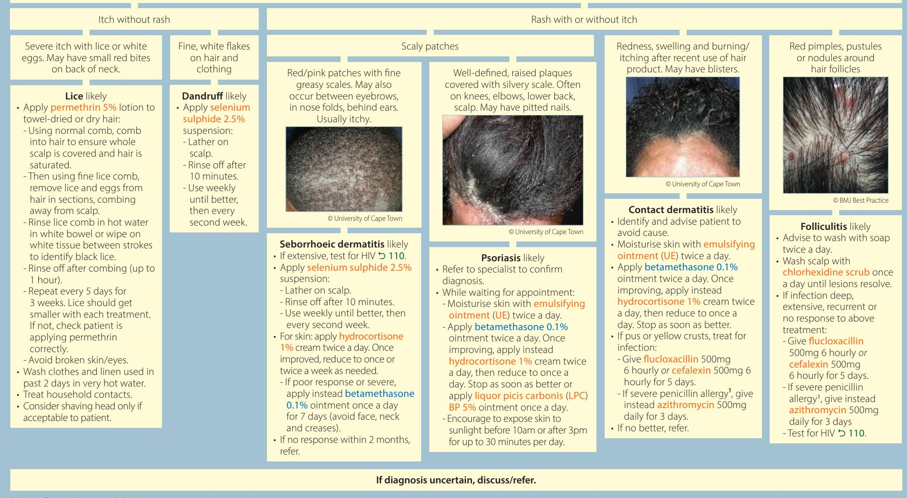

1History of angioedema, anaphylaxis or urticaria.

**CONTENTS SYMPTOMSCONTENTS CHRONIC CONDITIONS**

**[TB](#page-85-0)**

**[HEPATITIS B \(HBV\)](#page-116-0) [COVID-19](#page-117-0)**

**[HIV](#page-102-0) [CHRONIC RESPIRATORY DISEASE](#page-119-0) [CARDIOMETABOLIC CONDITIONS](#page-123-0) [MUSCULOSKELETAL DISORDERS](#page-147-0) [MENTAL HEALTH](#page-136-0) [EPILEPSY](#page-145-0) [WOMEN'S HEALTH](#page-150-0) [PALLIATIVE CARE](#page-166-0)**

**80**

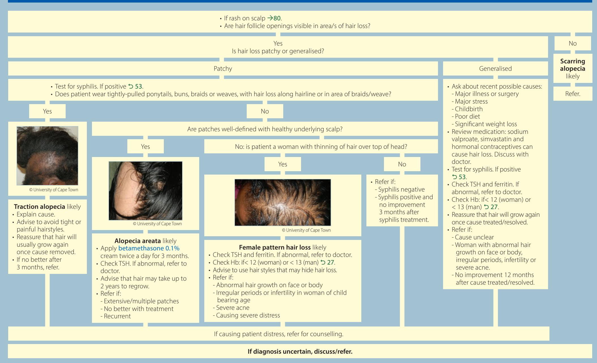

**[TB](#page-85-0)**

**CONTENTS SYMPTOMSCONTENTS CHRONIC CONDITIONS**

**[HIV](#page-102-0) [COVID-19](#page-117-0) [CHRONIC RESPIRATORY DISEASE](#page-119-0) [HEPATITIS B \(HBV\)](#page-116-0) [CARDIOMETABOLIC CONDITIONS](#page-123-0) [MUSCULOSKELETAL DISORDERS](#page-147-0) [MENTAL HEALTH](#page-136-0) [EPILEPSY](#page-145-0) [WOMEN'S HEALTH](#page-150-0) [PALLIATIVE CARE](#page-166-0)**

### **NAIL SYMPTOMS**

- If nails long and dirty and patient unkempt, screen for mental health problem and abuse/neglect [86](#page-82-0).
- Manage according to type of nail problem:

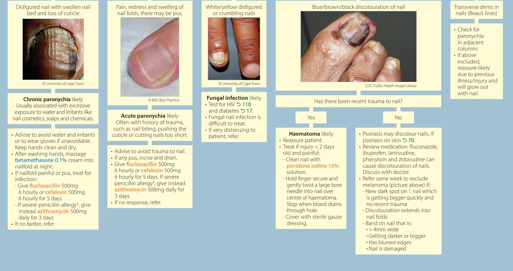

1History of angioedema, anaphylaxis or urticaria.

**CONTENTS SYMPTOMSCONTENTS CHRONIC CONDITIONS**

**[TB](#page-85-0)**

**[HEPATITIS B \(HBV\)](#page-116-0) [COVID-19](#page-117-0)**

**82**

**83**

# **SELF-HARM OR SUICIDE**

### **Give urgent attention to the patient who has attempted or considered self-harm or suicide:**

### **Has patient attempted self-harm or suicide?**

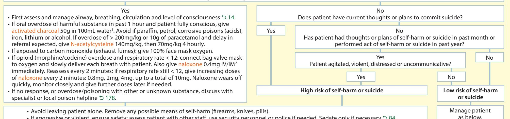

- •If aggressive or violent, ensure safety: assess patient with other staff, use security personnel or police if needed. Sedate only if necessary [84](#page-80-0).
- Refer urgently: while awaiting transport, monitor closely. If patient refuses admission, consider involuntary admission [140](#page-136-0).

### **Assess the patient whose risk of self-harm or suicide is low**

| As se ss                                       | he W n t o a sse ss | No te                                                                                                                                                                                                                                                                                                                                                                                                                                                                                                                                                                                                                                                              |
|------------------------------------------------------|------------------------------------|-----------------------------------------------------------------------------------------------------------------------------------------------------------------------------------------------------------------------------------------------------------------------------------------------------------------------------------------------------------------------------------------------------------------------------------------------------------------------------------------------------------------------------------------------------------------------------------------------------------------------------------------------------------------------|
| De ion p res s                           | Eve vis it ry             | f kno de  he k: he h, has fe lt do de d, ho les fe lt litt le lea do hin I ion ive ine ise in t ien ) r 2 ) int in ing ? ut 144 t ast t at t: 1 st o t wn p res s , g ro ca re , o rw as p m on p wn p res se p e s o ere r p sur e g s , f y  I he to it 143 es e r                                                                                                                                    |
| A lco ho l / dru g use          | Eve vis it ry             | he has ) dru k ≥ dr ks 1/s ) u d l leg l dru ) m d p he d ? f y  In t ien t: 1 4 in ion 2 i r 3 isu ip ion ica ion I 142 ast at t t ter t to p y ear p n ess se a g s o se res cr or ov er- -co un m e s es any , ,                                                                                                                                                                                                                                      |
| he l i l lne Ot ta r m en ss | Eve vis it ry             |  f ha l luc de lus d d s h, d d o be hav d h s list day f m b lem for de I ina ion ion iso ise iso ise ic iou isc it ia I ia 148 t tat nt s, s, rg an p eec rg an r ca on r, uss w p ec sa me em ory p ro , sc ree n me •                                                                                                                                                                                                                                   |
| Str ess ors                                    | Eve vis it ry             |  I f n kno h a l i l lne for d a ot it ta st nxi ety 8 6. wn w m en ss, ass ess res s a n • lp de fy ho l st k a bo l a bu /v len  fam ly lat hip b lem f in l d f f ic lty, be hro l l- hea lt h. He i i ia As io 8 8, i ion ia i nic i nt ut tra nt, p sy c soc res sor s. um a, s exu a se ce or re s p ro s, an c u rea ve me c • |
| hro d C nic it ion co n         | Eve vis it ry             |   f c hro d m d u de ly d k p h he lp line I nic in, in 6 0 a ing it ion Lin ien it 178 at t w ort p a ass ess an an ag e p a n n r co n or su p p g rou p • f p has li fe- lim l lne lso de l liat  I ien it ing i i ivin ive 170 at t a ss, a co ns r g g p a ca re •                                                                                                                          |

### **Advise the patient whose risk of self-harm or suicide is low**

- Discuss with patient reasons to stay alive. Encourage carers to closely monitor patient as long as risk persists and to bring patient back if any concerns.
- Advise patient and carers to restrict access to means of self-harm (remove firearms from house, keep medications and toxic substances locked away) as long as risk persists.
- Suggest patient seeks support from close relatives/friends and offer referral to counsellor or local mental health centre or helpline [178](#page-174-0).
- •Discharge into care of family, if possible. Review patient at least weekly for 2 months: involve a counsellor, psychiatric nurse/psychologist or social worker if possible.
- If self-harm or suicide risk is still low follow up monthly. If thoughts or attempts of self-harm or suicide recur, reassess suicide risk above.

1If able, give this charcoal mixture via nasogastric tube if the airway is protected and patient co-operative. Charcoal may be useful if these poisons are taken in overdose: carbamazepine, barbiturates, phenytoin, dapsone, quinine, theophylline, salicylates, mushroom poisoning, slow release preparations, digoxin, beta-blockers, NSAIDs. 2Give naloxone IM only if IV not possible.

### **AGGRESSIVE/DISRUPTIVE PATIENT**

|                                                                                                                                                                                                                                                                                                                                                                                                                                                                                                                                                                                                                                                                                                                                                                                                                                                                                                                                                                                                                                                                                                                                                                                                                                                                                                                                                                                                                                                                                                                                                                                                                                                                                                                                                                                                                                                                                                                                                                                                                                                     |                                                                                                                                                                                                                                                 | G ive t a tte ur g en                                                                                                                                                                                                    | ion he ive / d isr nt to t ag g res s up                                                                                                                                                  | ive ien it h a f: t at t w p ny o                                                                                                                                                 |                                                                                                                                                                               |                                                                   |
|-----------------------------------------------------------------------------------------------------------------------------------------------------------------------------------------------------------------------------------------------------------------------------------------------------------------------------------------------------------------------------------------------------------------------------------------------------------------------------------------------------------------------------------------------------------------------------------------------------------------------------------------------------------------------------------------------------------------------------------------------------------------------------------------------------------------------------------------------------------------------------------------------------------------------------------------------------------------------------------------------------------------------------------------------------------------------------------------------------------------------------------------------------------------------------------------------------------------------------------------------------------------------------------------------------------------------------------------------------------------------------------------------------------------------------------------------------------------------------------------------------------------------------------------------------------------------------------------------------------------------------------------------------------------------------------------------------------------------------------------------------------------------------------------------------------------------------------------------------------------------------------------------------------------------------------------------------------------------------------------------------------------------------------------------------|-------------------------------------------------------------------------------------------------------------------------------------------------------------------------------------------------------------------------------------------------|--------------------------------------------------------------------------------------------------------------------------------------------------------------------------------------------------------------------------------------------|----------------------------------------------------------------------------------------------------------------------------------------------------------------------------------------------------------------------------------|-----------------------------------------------------------------------------------------------------------------------------------------------------------------------------------------------------------------|-------------------------------------------------------------------------------------------------------------------------------------------------------------------------------|-------------------------------------------------------------------|
| An g ry • Lo d, u •                                                                                                                                                                                                                                                                                                                                                                                                                                                                                                                                                                                                                                                                                                                                                                                                                                                                                                                                                                                                                                                                                                                                                                                                                                                                                                                                                                                                                                                                                                                                                                                                                                                                                                                                                                                                                                                                                                                                                                                                            | be ha iou v r ive h res s ee c                                                                                                                                                                                    | ha l len lt be ha C ing ins ing ive iou at g u or p rov oc v r • , Fre ly ha ing bo dy it ion ing nt ue c os ac •           |                                                                                                                                                                                                                                  | l ke Te ing i ip ing tu ns e p os r g r p ar • Ag ive l i ke d ing ts res s ac ou n w •                            | ls t ht ly, len h f is i ig ing ts m ra c c l ls, hro ing b j h itt ing t ts, a w o ec |                                                                   |
| Ma t: na g em en                                                                                                                                                                                                                                                                                                                                                                                                                                                                                                                                                                                                                                                                                                                                                                                                                                                                                                                                                                                                                                                                                                                                                                                                                                                                                                                                                                                                                                                                                                                                                                                                                                                                                                                                                                                                                                                                                                                                                                                                                     | ag g sp                                                                                                                                                                                                                                   | q ng                                                                                                                                                                                                                                    | p , p                                                                                                                                                                                                                         | g p                                                                                                                                                                                                          |                                                                                                                                                                               |                                                                   |
| fet f y f, f n f s En he l he ien d t ho d y ity l p l l p l ice i de d. T he ho l d d isa ien i / he ha As t t at t a t, c at t su re sa y o ou rse p n se aro un ou : e ns ure se cu r p ers on ne res en a o ee y s u rm p s a w ea p on • f f. it h o he En it is n b loc ke d. t r st ot w a su re ex Try ba l ly lm he ien to t at t: ve r ca p • d d d de d a h fro be h d. Sta d a lea 's len hs Av i ire ing ien in ct tac t, s ts at t t st tw t o ey e c on u n m ov em en an p p roa c p m n o a rm g aw ay -                                                                                                                                                                                                                                                                                                                                                                                                                                                                                                                                                                                                                                                                                                                                                                                                                                                                                                                                                                                          |                                                                                                                                                                                                                                                 |                                                                                                                                                                                                                                            | fe in ses s a s a roo m                                                                                                                                                                                     |                                                                                                                                                                                                                 |                                                                                                                                                                               |                                                                   |
| ho hre d t l k do he d h / he lm do fr d ly l ke f fe dr k o foo d. Us ing Av i ing ien ing ing im Us ien i ing in st, n-t ate to t at t, a r to est e a n ne no n m an ne r. o a wn p rg u or co mm an ca wn e a g ure o r a r - de fy h he fee l d de d o f fe ho ke l l t hre ly. L ist ien i i is / ing ire ice Ta iou to at t, nt ats en p r s a n s s a n r c s. a se r s - de lun dm f s f m l l lne d r fus dm d a da l f, o he f in l  Co i inv iss ion i ig i iss ion ion ia int /p 0. tar ta tre atm t o to t uta t st ert 14 ns r o a ns o en ss an e es en r a an ng er se rs, ow n r ep or an ere rop y c y • d da ly f a bs lut ly de d: ha l f he d f da ba l at lm fa le d. Re in /o i im ine /ot isr ion im iro ien i str te nt to t ort t t tm t, e t t, v tem ts to at t a an r se on o e ne e m rm se rs, up o p an rea en ma g o e nv nm en er p ca p •  I f p i b le, be for da ion d m i b le f a bn l t ho hts be ha iou t 85 os s e s e : as ses s a n an ag e p os s ca use s o orm a ug or v r - |                                                                                                                                                                                                                                                 |                                                                                                                                                                                                                                            |                                                                                                                                                                                                                                  |                                                                                                                                                                                                                 |                                                                                                                                                                               |                                                                   |
| f re d, I int str a s u se c -                                                                                                                                                                                                                                                                                                                                                                                                                                                                                                                                                                                                                                                                                                                                                                                                                                                                                                                                                                                                                                                                                                                                                                                                                                                                                                                                                                                                                                                                                                                                                                                                                                                                                                                                                                                                                                                                                                                                                                                           | he k r int ite est c ra s s e ve ry                                                                                                                                                                               | 3 0 m inu tes                                                                                                                                                                                                                     |                                                                                                                                                                                                                                  |                                                                                                                                                                                                                 |                                                                                                                                                                               |                                                                   |
|                                                                                                                                                                                                                                                                                                                                                                                                                                                                                                                                                                                                                                                                                                                                                                                                                                                                                                                                                                                                                                                                                                                                                                                                                                                                                                                                                                                                                                                                                                                                                                                                                                                                                                                                                                                                                                                                                                                                                                                                                                                     | Try i d I M to av o or                                                                                                                                                                                                  | I V m d ica ion da he t to te t e se ag                                                                                                                                                             | ive / d isr ive ien t at t, e g res s up p sp                                                                                                                                          | f > ia l ly i W i l l p ien 65 at t a ec y ea rs. cce                                                                                                        | l m d ica ion ? t o t p ra e                                                                                                                       |                                                                   |
|                                                                                                                                                                                                                                                                                                                                                                                                                                                                                                                                                                                                                                                                                                                                                                                                                                                                                                                                                                                                                                                                                                                                                                                                                                                                                                                                                                                                                                                                                                                                                                                                                                                                                                                                                                                                                                                                                                                                                                                                                                                     |                                                                                                                                                                                                                                                 |                                                                                                                                                                                                                                            | Ye s                                                                                                                                                                                                                          |                                                                                                                                                                                                                 |                                                                                                                                                                               | No                                                                |
|                                                                                                                                                                                                                                                                                                                                                                                                                                                                                                                                                                                                                                                                                                                                                                                                                                                                                                                                                                                                                                                                                                                                                                                                                                                                                                                                                                                                                                                                                                                                                                                                                                                                                                                                                                                                                                                                                                                                                                                                                                                     | bu l 1 m da lam d l ly. G ive i 7. 5-1 5m iaz 5m cca zo g or ep am g ora • fte As r 3 0 m inu tes ses s r es p on se a : • |                                                                                                                                                                                                                                            |                                                                                                                                                                                                                                  |                                                                                                                                                                                                                 |                                                                                                                                                                               |                                                                   |
| lm Pa ien t t c a                                                                                                                                                                                                                                                                                                                                                                                                                                                                                                                                                                                                                                                                                                                                                                                                                                                                                                                                                                                                                                                                                                                                                                                                                                                                                                                                                                                                                                                                                                                                                                                                                                                                                                                                                                                                                                                                                                                                                                                                                    | l l ag d fte Pa ien i ive / isr ive r 3 0 m inu t t s t t tes g res s up a                                                                                                 |                                                                                                                                                                                                                                            |                                                                                                                                                                                                                                  |                                                                                                                                                                                                                 |                                                                                                                                                                               |                                                                   |
|                                                                                                                                                                                                                                                                                                                                                                                                                                                                                                                                                                                                                                                                                                                                                                                                                                                                                                                                                                                                                                                                                                                                                                                                                                                                                                                                                                                                                                                                                                                                                                                                                                                                                                                                                                                                                                                                                                                                                                                                                                                     | De i de h ic h m d ica ion d ing l i ke ly t to to c w e us e a cco r ca use :                                                                                 |                                                                                                                                                                                                                                            |                                                                                                                                                                                                                                  |                                                                                                                                                                                                                 |                                                                                                                                                                               |                                                                   |
|                                                                                                                                                                                                                                                                                                                                                                                                                                                                                                                                                                                                                                                                                                                                                                                                                                                                                                                                                                                                                                                                                                                                                                                                                                                                                                                                                                                                                                                                                                                                                                                                                                                                                                                                                                                                                                                                                                                                                                                                                                                     | kn Exa ct ca use un ow n                                                                                                                                                                                                   | lco ho l / dru h dra l A it g w wa                                                                                                                                                                     | St lan dru im int ica ion t t u g ox                                                                                                                                                            | De l ir ium                                                                                                                                                                                            | lco ho l A int ica ion t ox                                                                                                                           | Psy ho 2 is c s                                    |
|                                                                                                                                                                                                                                                                                                                                                                                                                                                                                                                                                                                                                                                                                                                                                                                                                                                                                                                                                                                                                                                                                                                                                                                                                                                                                                                                                                                                                                                                                                                                                                                                                                                                                                                                                                                                                                                                                                                                                                                                                                                     |                                                                                                                                                                                                                                                 | da lam G ive i 7. 5-1 5m I m zo g                                                                                                                                                                         | M.                                                                                                                                                                                                                               | ha lop do l 5 ( G ive i I M 2.5 er mg mg                                                                                                                                 | f > ) a d p ha I M i 65 et y ea rs n rom                                                                                               | ine 25 I M. z mg                                   |
|                                                                                                                                                                                                                                                                                                                                                                                                                                                                                                                                                                                                                                                                                                                                                                                                                                                                                                                                                                                                                                                                                                                                                                                                                                                                                                                                                                                                                                                                                                                                                                                                                                                                                                                                                                                                                                                                                                                                                                                                                                                     |                                                                                                                                                                                                                                                 |                                                                                                                                                                                                                                            | As ses s r es p on se a                                                                                                                                                                                     | fte r 3 0 m inu tes :                                                                                                                                                                            |                                                                                                                                                                               |                                                                   |
|                                                                                                                                                                                                                                                                                                                                                                                                                                                                                                                                                                                                                                                                                                                                                                                                                                                                                                                                                                                                                                                                                                                                                                                                                                                                                                                                                                                                                                                                                                                                                                                                                                                                                                                                                                                                                                                                                                                                                                                                                                                     |                                                                                                                                                                                                                                                 |                                                                                                                                                                                                                                            |                                                                                                                                                                                                                                  |                                                                                                                                                                                                                 |                                                                                                                                                                               |                                                                   |
|                                                                                                                                                                                                                                                                                                                                                                                                                                                                                                                                                                                                                                                                                                                                                                                                                                                                                                                                                                                                                                                                                                                                                                                                                                                                                                                                                                                                                                                                                                                                                                                                                                                                                                                                                                                                                                                                                                                                                                                                                                                     | Pa ien lm t t c a                                                                                                                                                                                                                | Pa ia l re ly. rt sp on se on do f Re I M t s p ea am e se o d d a bo ica ion t me us e ve                                                       | f m da lam d a bo I i zo us e ve • f ha lop do l ha I i /p et er rom •                                                                                   | No re sp on se ha lop do l 5 ( ive i I M 2.5 I , g er mg mg d a bo da lam ine ive i 7. us e ve , g m zo z | f > ) a d p ha M i 65 et y ea rs n rom z 5-1 5m I M. g                                                                  | ine 25 I M. mg                                        |
| d r Mo ito n r a n ec • I f ha lop i do l u er • On ien is c at t ce p •                                                                                                                                                                                                                                                                                                                                                                                                                                                                                                                                                                                                                                                                                                                                                                                                                                                                                                                                                                                                                                                                                                                                                                                                                                                                                                                                                                                                                                                                                                                                                                                                                                                                                                                                                                                                                                                                                                    | d t B P, r tu or em p era re, es p d a d p in fu l m le se n a usc sp lm for de a er, re ass ess un r                                              | d p lse lev l o f c ira to te, ry an u ra e dy ic ion l te sto ct asm s, a cu n rea ly f n lre dy do ing i ot ca use a a ne | iou inu 15 tes on sc sn ess ev ery m i ke ly, ive b ip i de I M. n 2 .5m g er g d m fur he  85 t , a n an ag e r | for f irs ho he 3 0 m inu t t tes ur, n e ve ry Re inu i l sp t e 3 0 m tes nt p ea ve ry , u asm                        | l p fer d, ler i ien t at t re un re or a lve do in to 3 24 s r eso , u p ses                            | d w l k ing t a n a ho urs                |
| fer he l ly Re i t ta m en • for I f re int str m. a s u se                                                                                                                                                                                                                                                                                                                                                                                                                                                                                                                                                                                                                                                                                                                                                                                                                                                                                                                                                                                                                                                                                                                                                                                                                                                                                                                                                                                                                                                                                                                                                                                                                                                                                                                                                                                                                                                                                                                                | l l ag ive ien at t s g res s p am e d, let M H C A 4 for 8 co mp e m.                                                                                                     | da ho l 3: do h ita isto to nt sp y cu me                                                                                                                                                           | d t d do f m d im ica ry, an e a n se o e                                                                                                                                                 | f e dm ion ive I iss ion t g n. me rg en cy a ne                                                                                                                   | de d w ho it ien ut at t c t, e p on sen                                                                                                  | f i l l in M H C A 0 1                 |
| 1Bu l: u IV f ula f m tio cca se orm n o                                                                                                                                                                                                                                                                                                                                                                                                                                                                                                                                                                                                                                                                                                                                                                                                                                                                                                                                                                                                                                                                                                                                                                                                                                                                                                                                                                                                                                                                                                                                                                                                                                                                                                                                                                                                                                                                                                                                                                                 | ida zol dr ring e to am , us e sy aw up                                                                                                                                                                              | t d dle d g ive co rrec ose , re mo ve nee an                                                                                                                                                             | mid lam be the ch eek d g twe azo en an                                                                                                                                                            | . 2P hos is li kely if p /he atie nt n ot a um syc wa re s                                                                                                                  | ab lly a nd has f: H ting 1 o ac nor ma ≥                                                                                                       | allu (se / h cin atio ein ing ns g ear |
| thi ); De lus s (u ual / b ion izar ngs nus                                                                                                                                                                                                                                                                                                                                                                                                                                                                                                                                                                                                                                                                                                                                                                                                                                                                                                                                                                                                                                                                                                                                                                                                                                                                                                                                                                                                                                                                                                                                                                                                                                                                                                                                                                                                                                                                                                                                                                           | re b elie fs); Dis sed ani org sp eec                                                                                                                                                                                   | h o r be hav r. 3 If d ela iou in t rt: t ran spo ry y                                                                                                                                                 | alm /qu to tien t to st c iet mo ve pa mo                                                                                                                                                          | nd enl hel f a fam ily mb ist er t are a a p o me o m                                                                                                                    | oni tor tien t. pa                                                                                                                                                |                                                                   |
|                                                                                                                                                                                                                                                                                                                                                                                                                                                                                                                                                                                                                                                                                                                                                                                                                                                                                                                                                                                                                                                                                                                                                                                                                                                                                                                                                                                                                                                                                                                                                                                                                                                                                                                                                                                                                                                                                                                                                                                                                                                     |                                                                                                                                                                                                                                                 |                                                                                                                                                                                                                                            |                                                                                                                                                                                                                                  |                                                                                                                                                                                                                 |                                                                                                                                                                               |                                                                   |

**[HIV](#page-102-0) [CHRONIC RESPIRATORY DISEASE](#page-119-0) [CARDIOMETABOLIC CONDITIONS](#page-123-0) [MUSCULOSKELETAL DISORDERS](#page-147-0) [MENTAL HEALTH](#page-136-0) [EPILEPSY](#page-145-0) [WOMEN'S HEALTH](#page-150-0) [PALLIATIVE CARE](#page-166-0)**

**[HEPATITIS B \(HBV\)](#page-116-0) [COVID-19](#page-117-0)**

**[TB](#page-85-0)**

**CONTENTS SYMPTOMSCONTENTS CHRONIC CONDITIONS**

### **ABNORMAL THOUGHTS OR BEHAVIOUR**

| ive ion he ien it h a bn l t ho hts be ha iou d a f: G t a tte nt to t at t w ur g en p or ma ug or r a n ny o v f a Su d de bn l t ho hts be ha iou et n o ns o orm a ug or v r • f a bn l t ho hts be ha Re iou t o et cen ns o orm a ug or v r •                                                                                                                                                                                                                                                                 |                                                                                                                                                                                                                                                                                                                                                                                                                                                                                                                                                   |                                                                                                                                                                                                                                                                                                                                                                                                                                                                                                                                                                                                                                                                                               |                                                                                                                                                                                                                                                                                                                                                                                                                                                                                                                                                                                       |                                                                                                                                                                                                                                                                                                                                                                                                                                                                                                                                        |                                                                                                                                                                                                                                                                                                                                                                                                                                                                                                                                                                                                                                                                                                                                                                                                                                                                                                                                                             |                                                                                                                                                                                                                                                                                                                                                                                                            |
|---------------------------------------------------------------------------------------------------------------------------------------------------------------------------------------------------------------------------------------------------------------------------------------------------------------------------------------------------------------------------------------------------------------------------------------------------------------------------------------------------------------------------------------------------------------------------------------------------------------------------------------------------------------------------------------------------------------------------------------------------------------|---------------------------------------------------------------------------------------------------------------------------------------------------------------------------------------------------------------------------------------------------------------------------------------------------------------------------------------------------------------------------------------------------------------------------------------------------------------------------------------------------------------------------------------------------|-----------------------------------------------------------------------------------------------------------------------------------------------------------------------------------------------------------------------------------------------------------------------------------------------------------------------------------------------------------------------------------------------------------------------------------------------------------------------------------------------------------------------------------------------------------------------------------------------------------------------------------------------------------------------------------------------|---------------------------------------------------------------------------------------------------------------------------------------------------------------------------------------------------------------------------------------------------------------------------------------------------------------------------------------------------------------------------------------------------------------------------------------------------------------------------------------------------------------------------------------------------------------------------------------|----------------------------------------------------------------------------------------------------------------------------------------------------------------------------------------------------------------------------------------------------------------------------------------------------------------------------------------------------------------------------------------------------------------------------------------------------------------------------------------------------------------------------------------|-------------------------------------------------------------------------------------------------------------------------------------------------------------------------------------------------------------------------------------------------------------------------------------------------------------------------------------------------------------------------------------------------------------------------------------------------------------------------------------------------------------------------------------------------------------------------------------------------------------------------------------------------------------------------------------------------------------------------------------------------------------------------------------------------------------------------------------------------------------------------------------------------------------------------------------------------------------|------------------------------------------------------------------------------------------------------------------------------------------------------------------------------------------------------------------------------------------------------------------------------------------------------------------------------------------------------------------------------------------------------------|
| Ma t: na g em en f ha d a f it  I j ust • f a d I ive / isr g g res s • f n d de I ew su n a sy • f re he d I in j nt ce a • f s da l t ho hts I ic i u ug • I f d i f f ic lty bre h at u • he k g luc f < C i c os e: • f t h dry I irs t, t m ou • i l sy l ic B P > t sto un Co de lun i inv ns r o • f I H I V p it ive it os w • for Lo k de l ir ium o • | 19 8 ive t 4. up ic w kn etr mm ea ess or  18 ury lan  8 3. or p s ing ira to rat e > , re sp ry  3 ≥ 1 1.1 17 i or or h, k in tu p oo r s rg or, su Co inu L 6 ho 9 0. nt e 1 dm f s iss ion i ig tar y a ns h r it ive t p ec en os cr p y ia, ho is, int , m an p sy c s | bn f fac /ar / leg d i f f ic nu m ess o e m , ion 3 0, tu rat 94 % < ox y g en sa or f d be d <  ia 4 13 0. tes an ke de d u ine ive n n e y es, cre ase r : g f ly. Sto i bre h ing at ur p w ors en s. f m l l lne d r fus i ta tre o en ss an e es l a fer for ig toc nt te st, oc ca en re ur ica ion it h dra l o iso t ox , w wa r p o n | lty k ing isu l d ist u sp ea or v a ion h ine tu rat ox y g en sa m ac l re hy dra lut ion ion I t or a so dm d a iss ion atm t o en r a an lum ba ( L P ). t ctu g en r p un re for fer ing d m be an an ag e e r e                                                                                                                                                     | ba i de ke r st ur nc e: co ns ro or i la b le, ive fac t a no va g e m as f u b le t dr k o in B P < 9 0 / na o r da l f, o he to t ng er se rs, ow n r l: ra                                                                                                                                                                                                                |  T I A 13 6. k o xy g en d h lor de 6 0, ive ium i 0. 9 % 0 0m L I V o 5 g so c ve f in l /p  ion ia int 14 uta t st ert ep or an c ere rop y                                                                                                                                                                                                                                                                                                                                                                                                                                                                                                                                                                                                                                                    | r 3 0 m inu tes t , re p ea 0.                                                                                                                                                                                                                                                                                                                                                     |
| lev ls o f Va ing ry e iou co ns c sn ess ho / da ov er urs y s d t tu an em p era re °C ≥ 3 8 De l ir ium l i ke ly ftr G ive iax ce on e 1/ 2g I V I M. Av i d in j ing t o ec > 1 I M at g on e in j ion ite t ec s                                                                                                                                                                                                                                                                                                          | bn l ly A orm a ha p p y, ic, et en erg l kat ive ta , irr ita b le or k les rec s ia l ke ly Ma i n                                                                                                                                                                                                                                                                                                                                        | k o f ht h ≥ f: La ins ig it 1 c o w Ha l luc ina ion (se ing / t s e • he h ) ing ing t ar s lus l De ion (un / s us ua • fs b iza be l ie ) rre d s h o D iso ise rg an p ee c r • be ha iou r v ho l ke ly Psy is i c s                                                                                                                                                                                                                                | lat d p ls, D i i e up les ia, t res sn ess , p ara no ing at na use a, s we lse 10 0, ≥ or p u B P ≥ / 14 0 9 0 St im lan dr t u ug int ica ion l ke ly i t ox f p lse lar, he I irre st u g u c in B P ≥ / 14 0 9 0, p a or do d d E C G a isc n uss h s l loc l it ia ist p ec or a w | l ls o f a lco ho l, Sm e lur d s h, s re p ee c d inc ina ion t oo r , dy it ste un a g a lco ho l A int ica ion t ox l i ke ly h G ive iam ine t • 10 0m I V / I M. g G ive d ium h lor i de so c • ho ly. 0. 9 % 1 L 6 ur he k for he d C in j c a ury • | lco ho l dr ho ha Kn / ow n a ug us er s w d /re du d int ke it h t sto p p e ce a w rem or, les / ing t t sw ea , n au sea , se ve re res sn ess ha l luc ita ion ina ion t t ag or s lco ho l dr h dr l l ke ly A / it i ug w aw a I f n he da ion ive ive t t o o r se g n, g • d l ly. iaz 10 ep am mg or a f a lco ho l w h dra l, a lso I it ive wa g • h iam ine I V / I M d o l t 10 0m g an ra hy dra lut ion ion t re so f ≥ ho las lco ho l, I 8 inc t a urs s e • | Ex ia p os ure v ing ion / est ha lat / in ion bs f ion t a orp o d ica ion / t me kn un ow n bst su an ce l ke ly Po iso ing i n D isc ly t uss ur g en h s l it ia ist w p ec loc l p iso or a o n |

### **Refer urgently** *unless:*

 Patient with known schizophrenia who is otherwise well: give routine schizophrenia care [146](#page-142-0).

• Patient with diabetes and low glucose, not on glicazide/insulin: if abnormal thoughts/behaviour resolve with dextrose, no need to refer, give routine diabetes care [130](#page-126-0).

poison helpline

[178](#page-174-0). start alcohol detoxification

[142](#page-138-0).

helpline [178](#page-174-0).

programme

• Patient with known alcohol use who is otherwise well: if abnormal thoughts/behaviour resolve once sober, no need to refer [142](#page-138-0).

### **Approach to the patient with abnormal thoughts or behaviour not needing urgent attention:**

- If for at least 6 months ≥ 1 of: memory problems, disorientation, language difficulty, less able to cope with daily activities and work/social function: consider **dementia** [148](#page-144-0).
- If unsure of diagnosis, refer for further assessment.

1Do not mix Ringer's lactate and IV ceftriaxone. Flush IV line with sodium chloride 0.9% before and after IV ceftriaxone.

# **LOW MOOD, STRESS OR ANXIETY**

#### **Give urgent attention to the patient with suicidal thoughts or behaviour [83](#page-79-0).**

| he h low d, f p kn h de he de  As ien it iet I ien it ion ive ine ion t at t w str at t t ut 14 4. se ss p m oo es s o r a nx y. ow n w p res s , ra r g ro p res s ca re |                                                                                                                                                                                                                                                                                                                                                                                                                                                                                                                                                                                                                                                                                                                                                                                                                                                                                                                                                                                                                                                                                                                                                                                                                                                                                                                                                                                                                                                                                                                                                                                                                                                                                                                                                                           |  |  |  |
|----------------------------------------------------------------------------------------------------------------------------------------------------------------------------------------------------------------------------------------------------------------------------------------------------------------------------------------------|---------------------------------------------------------------------------------------------------------------------------------------------------------------------------------------------------------------------------------------------------------------------------------------------------------------------------------------------------------------------------------------------------------------------------------------------------------------------------------------------------------------------------------------------------------------------------------------------------------------------------------------------------------------------------------------------------------------------------------------------------------------------------------------------------------------------------------------------------------------------------------------------------------------------------------------------------------------------------------------------------------------------------------------------------------------------------------------------------------------------------------------------------------------------------------------------------------------------------------------------------------------------------------------------------------------------------------------------------------------------------------------------------------------------------------------------------------------------------------------------------------------------------------------------------------------------------------------------------------------------------------------------------------------------------------------------------------------------------------------------------------------------------|--|--|--|
| As se ss                                                                                                                                                                                                                                                                                                                               | No te                                                                                                                                                                                                                                                                                                                                                                                                                                                                                                                                                                                                                                                                                                                                                                                                                                                                                                                                                                                                                                                                                                                                                                                                                                                                                                                                                                                                                                                                                                                                                                                                                                                                                                                                                                  |  |  |  |
| An xie ty                                                                                                                                                                                                                                                                                                                              | I f ex d fun / d for lea hs h ≥ f: m le t les b lity d f f ic lty lee dn l ise d a iet ive im ire ion istr 6 m wit 3 o ion irri i i ing ion ire ct at st t st ta ntr at t ces s wo rry ca use s p a ess on usc en s , re sne ss, u s p , p oo r co nce ess : g en era nx y • , , d iso de li ke ly  144 r r f a du d by lar b ho b d s d de fea h p hy l sy d n bv d fer I nxi is in icu itu ion /o j (p ia ) o r is it ica iou (p ic ), isc /re ety art at ect eat tom ce a p s re p e u n r w s mp s a n o o s c au se an uss • I f a h lin ke d t ba d e h ≥ f: 1 ) n htm f las h bac ks ) av ds /p le ) co ly d, o ly le d 4 ) fee ls n b o de he d fro nxi ety 1 m t ien it 3 o ig 2 i itu at ion 3 nst ant i sta rt tac > on o a xp er ce, w are s o r o s s eo p on g uar r ea s um r m • he d ic s d iso de ( ) li ke ly, d fer / s ing P S T D isc /re ot ost -tr t tre rs urr ou n s, p au ma ss r r uss |  |  |  |
| De ion p res s                                                                                                                                                                                                                                                                                                                   |  I f n lrea dy do he h, has ) fe lt do de d, ho les ) fe lt litt le lea do hin ? I f y he ot in t ast t at ien t: 1 r 2 int st o in ing t to it 143 a ne p m on p wn p res se p e s o ere r p sur e g s es e r : ,                                                                                                                                                                                                                                                                                                                                                                                                                                                                                                                                                                                                                                                                                                                                                                                                                                                                                                                                                                                                                                                                                                                                                                                                                                                                                                                                           |  |  |  |
| lco ho l / dru A g use                                                                                                                                                                                                                                                                                                  | he has dru k ≥ dr ks 1/s d l leg l dru d p he d f y  In t ien ) in ion 2 ) u i r 3 ) m isu ip ion ica ion ? I 142 ast at t: 1 4 t t ter t to p y ear p n ess se a g s o se res cr or ov er- -co un m e s es any , ,                                                                                                                                                                                                                                                                                                                                                                                                                                                                                                                                                                                                                                                                                                                                                                                                                                                                                                                                                                                                                                                                                                                                                                                                                                                                                                                                          |  |  |  |
| A bu se                                                                                                                                                                                                                                                                                                                                | f p be bu d  I ien is ing 8 8. at t a se                                                                                                                                                                                                                                                                                                                                                                                                                                                                                                                                                                                                                                                                                                                                                                                                                                                                                                                                                                                                                                                                                                                                                                                                                                                                                                                                                                                                                                                                                                                                                                                                                                                                                       |  |  |  |
| Str ess ors                                                                                                                                                                                                                                                                                                                            |  He lp de fy ho l st As k a bo fam ly lat hip b lem fer lity f in l d f f ic lty, be hro l l- hea lt h. I f se l p b lem i i ia i ion in i ia i nic i 5 8. nt ut t nt, p sy c soc res sor s. or re s p ro s, an c u rea ve me c xu a ro s • , f p has li fe- lim l lne lso de l liat  I ien it ing i i ivin ive 170 at t a ss, a co ns r g g p a ca re • f o l de k a bo lon line d f av la b le, fer l c lu b for l de le he I i i ia in t ut to st s r p ers on : as e ss a n a re ne are oc o r p eo p are a. •                                                                                                                                                                                                                                                                                                                                                                                                                                                                                                                                                                                                                                                                                                                                             |  |  |  |
| Wo 's hea lt h me n                                                                                                                                                                                                                                                                                                        | f re de live l ca  d f av la b le, fer he I ive 164 i i 's s t ost nat to ot ort cen ry : g p a re an a re m r up p g rou p. • f w k a bo l sy ho f lu hes ht l dry d c ha d f f ic lty lee d s l p b lem  I 0 y ig ina i ing 16 9. > 4 ut tom t eat om an ear s, a s me no p au sa mp s: s , n sw s, v ag ne ss, mo o ng es, u s p an exu a ro s •                                                                                                                                                                                                                                                                                                                                                                                                                                                                                                                                                                                                                                                                                                                                                                                                                                                                                                                                                                                                                                                                              |  |  |  |
| Me d ica t ion                                                                                                                                                                                                                                                                                                                   | d dn fav lop de heo hy l line d c d c ha h do de lte  Rev iew ica ion iso ire i ive D isc it Co i ive ive 154 t eto t tra t cto t ntr t m e : p re ne, e nz, m c ram p an on cep s c an cau se mo o ng es. uss r. ns r a rna co ace p w ,                                                                                                                                                                                                                                                                                                                                                                                                                                                                                                                                                                                                                                                                                                                                                                                                                                                                                                                                                                                                                                                                                                                                                                                                                                                                                                     |  |  |  |

#### **Assess the patient with low mood, stress or anxiety. If patient known with depression, rather give routine depression care [144](#page-140-0).**

### **Advise the patient with low mood, stress or anxiety**

- Encourage patient to question negative thinking and be realistic if s/he often predicts the worst, generalises, exaggerates problem, inappropriately takes the blame, takes things personally.
- •Help the patient to choose strategies to get help and cope:

### **Get enough sleep**

give advice [87](#page-83-0).

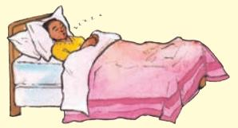

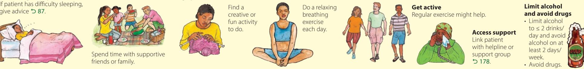

- If stressors identified, discuss possible solutions. If needed, refer to available counsellor, psychiatric nurse/psychologist or social worker.
- Deal with bereavement issues if patient or family member has a life-limiting illness or if patient is recently bereaved:
- Acknowledge grief reactions: denial, disbelief, confusion, shock, sadness, bargaining, yearning, anger, humiliation, despair, guilt and acceptance.
- Allow patient/family to share sorrow and talk of memories, the meaning of the patient's life or religious beliefs. Suggest connecting with a spiritual counsellor as appropriate.
- Identify worrying issues (e.g. child care, will and funeral arrangements) and who can give practical support with these before and after the patient dies.
- For tips on how to communicate effectively [176](#page-172-0).

### **Offer to review the patient in 1 month.**

1One drink is 1 tot of spirits, or 1 small glass (125mL) of wine or 1 can/bottle (330mL) of beer.

104

### **DIFFICULTY SLEEPING**

#### **Assess the patient with difficulty sleeping**

- Confirm that the patient really is getting insufficient sleep. Adults need on average 6-8 hours sleep per night. This decreases with age.
- Determine the type of sleep difficulty: waking too early or frequently, difficulty falling asleep, insufficient sleep.

### **Exclude medical problems:**

- Ask about pain, difficulty breathing, urinary problems. See relevant symptom pages. If persistent snoring, consider **obstructive sleep apnoea** [38](#page-34-0). If restless legs, refer to doctor for further assessment.
- If patient has a chronic condition, give routine care.
- If pulse ≥ 100, weight loss, palpitations, tremor, dislike of hot weather or thyroid enlargement, check TSH. If abnormal, refer to doctor.

### **Review medication:**

- Over-the-counter decongestants, salbutamol, fluoxetine, efavirenz can cause sleep problems. Discuss with doctor.
- •Reassure patient that difficulty sleeping from efavirenz is usually self-limiting and resolves within 6 weeks on ART. If severe or > 6 weeks, discuss with doctor.

### **Assess alcohol/drug use:**

In the past year, has patient: 1) drunk ≥ 4 drinks1/session, 2) used illegal drugs or 3) misused prescription or over-the-counter medications? If yes to any [142](#page-138-0).

### **Screen for possible stressors and mental health problem:**

- If stress or anxiety [86](#page-82-0).
- Has the patient ever had a bad experience that is causing nightmares, flashbacks, avoidance of people/situations, jumpiness or a feeling of detachment? If yes [88](#page-84-0).
- In the past month, has patient: 1) felt down, depressed, hopeless or 2) felt little interest or pleasure in doing things? If yes to either [143](#page-139-0).
- If abnormal thoughts or behaviour [85](#page-81-0).
- If for at least 6 months ≥ 1 of: memory problems, disorientation, language difficulty, less able to cope with daily activities and work/social function: consider dementia [148](#page-144-0).

### **Ask about menopausal symptoms:**

If woman > 40 years ask about menopausal symptoms: hot flushes, night sweats, vaginal dryness, mood changes and sexual problems [169](#page-165-0).

### **Advise the patient with difficulty sleeping**

- Encourage patient to adopt sensible sleep habits. These often help to resolve a sleep problem without the use of sedatives. Get regular exercise.
- Avoid caffeine (coffee, tea, sweetened fizzy drinks), alcohol and smoking for several hours before bedtime.
- Avoid day-time napping.
- Encourage routine: get up at the same time each day (even if tired) and go to bed the same time every evening.
- Allow time to unwind/relax before bed.
- Use bed only for sleeping and sex. Spend only 6-8 hours a night in bed.
- Once in bed, avoid clock-watching. If not asleep after 20 minutes, do a low energy activity (read a book, walk around house). Once tired, return to bed.
- Keep a sleep diary. Review this at each visit.
- Review the patient regularly. A good relationship between practitioner and patient can help.

### **Refer patient for further assessment if problems with daytime functioning, daytime sleepiness, irritability, anxiety or headaches that do not get better with 1 month of sensible sleep habits.**

### 1One drink is 1 tot of spirits, or 1 small glass (125mL) of wine or 1 can/bottle (330mL) of beer.

**[TB](#page-85-0)**

### **TRAUMATISED/ABUSED PATIENT**

| G ive ion he ise d /a bu d p ien it h a f: t a tte nt to t tr t at t w ur g en au ma se ny o                                                                                                                                                                                                                                                                                                                                                                                                                                                                                                                                                                                                                                                                                                                                                                                                                                                                                                                                                                                                                                                                                                                                                                                                                                                                                                                                                                                                                                                                                                                                                                                                                                                                                                                                                                                                                                                                                                                                                                                                                                                                                                                                                                                                                                                                                                                                                                                                                                                                                                                                                                                                                                                                                                                                                                                                                                                                                                                                                                                                                                                                                                                                                                                                                                                                                                                                                |
|------------------------------------------------------------------------------------------------------------------------------------------------------------------------------------------------------------------------------------------------------------------------------------------------------------------------------------------------------------------------------------------------------------------------------------------------------------------------------------------------------------------------------------------------------------------------------------------------------------------------------------------------------------------------------------------------------------------------------------------------------------------------------------------------------------------------------------------------------------------------------------------------------------------------------------------------------------------------------------------------------------------------------------------------------------------------------------------------------------------------------------------------------------------------------------------------------------------------------------------------------------------------------------------------------------------------------------------------------------------------------------------------------------------------------------------------------------------------------------------------------------------------------------------------------------------------------------------------------------------------------------------------------------------------------------------------------------------------------------------------------------------------------------------------------------------------------------------------------------------------------------------------------------------------------------------------------------------------------------------------------------------------------------------------------------------------------------------------------------------------------------------------------------------------------------------------------------------------------------------------------------------------------------------------------------------------------------------------------------------------------------------------------------------------------------------------------------------------------------------------------------------------------------------------------------------------------------------------------------------------------------------------------------------------------------------------------------------------------------------------------------------------------------------------------------------------------------------------------------------------------------------------------------------------------------------------------------------------------------------------------------------------------------------------------------------------------------------------------------------------------------------------------------------------------------------------------------------------------------------------------------------------------------------------------------------------------------------------------------------------------------------------------------------------------------------------------------------------------------------------------------------------------------|
| d  da l t ho hts be ha  l as lt In j ies ing ion 18 Su ic i iou 8 3 Re at ten t nt ce rap e o r se xu a sau ur ne e ug or v r • • •                                                                                                                                                                                                                                                                                                                                                                                                                                                                                                                                                                                                                                                                                                                                                                                                                                                                                                                                                                                                                                                                                                                                                                                                                                                                                                                                                                                                                                                                                                                                                                                                                                                                                                                                                                                                                                                                                                                                                                                                                                                                                                                                                                                                                                                                                                                                                                                                                                                                                                                                                                                                                                                                                                                                                                                                                                                                                                                                                                                                                                                                                                                                                                                                                                                          |
| f re Ma /se l a lt: t o nt na g em en ce rap e xu a ssa u da do i de l ly de ig d fac i l ity for f ra d s l as lt. Co let ire d for d r ist f ra ict im fer Ar cto t, at te t o I nt, ran g e s am e y r a sse ssm en a a s na m an ag em en p e a n ex ua sau mp e r eq u ms an eg ers p e v p reg na re • f s l o l b lee d b do l p lt le h f t he f a for b fer ly. I ina ing ina in, ip in j ies ist ig j t, r t ev ere va g r a na , a m a m u ur or ory o us e o e n o ec e ur g en • d he  Pre H I V a it is 10 8. nt at ve n p • Pre S T Is: ive ing le do h o f c ftr iax I M 1, a it hro in l ly d m i da le 2 2 l ly. I f s ic i l l in l ler 3, o it c ftr iax d inc nt 25 0m 1g etr ve g s se ea c e on e g z my c or a an on zo g ora ev ere p en a g y m e on e a n rea se • hro do l ly. it in 2g to az my c se or a do f p  f n l b le d ≤ da Pre I 9. I ia ion inc ive ion nt tes t. nt 15 ot nt, t o ntr t 5 ntr t ve p reg na nc y : p reg na nc y reg na p reg na no n r e co ac ep an y s s e r ap e, g em erg en cy co ac ep : • G ive ing le do lev l 1 l ly. est .5m s se on org re g ora - f p kg 4 ≥ fav fam he ba do f lev l to f fe d. I ien 8 0 B M I 3 0, ire i ic in, in ine inc 3m I U D ins at t > to est tea or on e nz , r p p ny or ca r ma ze p rea se se o on org re g or o r • , , lop de ho ly de d for f p ho fte k lev l, r do f fe d. G ive i 10 8 /vo it ing I ien its < 2 ing I U D ins eto at t v r ta est t tea m c ram mg ur as ne e na use a m om urs a on org re ep ea se or o r • f o f Pre i d a d n im ise d in las ive i d L I M it h in ho in j nt tet ot t 5 te tan tox 0.5 48 ve an us : p en w ou n n mu n y ea rs, g us o m w urs o ury • lso d s he be low A ien ort t at t a as ses s a n up p p s • |
|                                                                                                                                                                                                                                                                                                                                                                                                                                                                                                                                                                                                                                                                                                                                                                                                                                                                                                                                                                                                                                                                                                                                                                                                                                                                                                                                                                                                                                                                                                                                                                                                                                                                                                                                                                                                                                                                                                                                                                                                                                                                                                                                                                                                                                                                                                                                                                                                                                                                                                                                                                                                                                                                                                                                                                                                                                                                                                                                                                                                                                                                                                                                                                                                                                                                                                                                                                                                                                                                                                                                    |

#### **Assess the traumatised/abused patient**

| As se ss                                                              | W he n t o a sse ss | No te                                                                                                                                                                                                                                                                                                                                                                                                                                                                                                                                                                                                                                                                                                                                                                                                                                                                                                                                                                                                                                                                                                                                                                                                                                                                                                                                                                                                              |
|-----------------------------------------------------------------------------|------------------------------------|-----------------------------------------------------------------------------------------------------------------------------------------------------------------------------------------------------------------------------------------------------------------------------------------------------------------------------------------------------------------------------------------------------------------------------------------------------------------------------------------------------------------------------------------------------------------------------------------------------------------------------------------------------------------------------------------------------------------------------------------------------------------------------------------------------------------------------------------------------------------------------------------------------------------------------------------------------------------------------------------------------------------------------------------------------------------------------------------------------------------------------------------------------------------------------------------------------------------------------------------------------------------------------------------------------------------------------------------------------------------------------------------------------------------------|
| Sy tom mp s                                                        | Eve vis it ry             | k a bo l sy f n l as lt  Ma As ita n i 49 tom tom ut tom nt nag e s y mp s a s o n s y mp p ag es. g en mp s e ve o r ece rap e o r se xu a sau                                                                                                                                                                                                                                                                                                                                                                                                                                                                                                                                                                                                                                                                                                                                                                                                                                                                                                                                                                                                                                                                                                                                           |
| ly lan Fam i nin p g                                      | Eve vis it ry             | f fe lon  f se l as lt a d n l m has d w hin ks, f p  O ive 154 I ion it 4 w I 15 9. r to sta rt ter ntr t str uat t o eat te st. nt g m co ace p a sau n orm a en no ccu rre ee rep p reg na ncy reg na xu                                                                                                                                                                                                                                                                                                                                                                                                                                                                                                                                                                                                                                                                                                                                                                                                                                                                                                                                                                                                                     |
| Me l hea lt h nta                                            | Eve vis it ry             | f st  I xie 8 6. ty res s o r an • he h, has fe lt do de d, ho les fe lt litt le lea do hin f y he  In t ien ) r 2 ) int in ing ? I it 143 ast t at t: 1 st o t to p m on p wn p res se p e s o ere r p sur e g s es e r • , I f p has ha d a ho b le t hat / he has ha d ≥ f t he fo l low for h: 1 ) Nig htm lun ho hts / f las h bac ks ) Av de d c at ien t ien rri 3 o ing 1 m t r in tar t 2 i ert in > ev er n e xp er ce so s on are s o vo y ug o a • le ) ly d, w h fu l or ly le d 4 ) lt n b o de he d fro he le, d ic s itu ion /p 3 Bee i Fe ivit ies ing at sta nt atc sta rt tac ot act ost -tr t tre s s eo p n c on on g uar ea s um r m r p eo p or su rro un s: p au ma ss d de li ke ly, fer iso r r re |
| lco ho l / dru A g use                                 | Eve vis it ry             | he has ) dru k ≥ dr ks 5/s ) u d l leg l dru ) m d p he d f y  In t ien t: 1 4 in ion 2 i r 3 isu ip ion ica ion ? I 142 ast at t t ter t to p ear p n ess se a g s o se res cr or ov er- -co un m e s es any y , ,                                                                                                                                                                                                                                                                                                                                                                                                                                                                                                                                                                                                                                                                                                                                                                                                                                                                                                                                                                                      |
| So l ia c                                                          | Eve vis it ry             | f im f f s fer I d k o be ha d a d d o he lte / d h s l w ker day iate ris ing in n isc it ia me rm e n ee r, re uss w oc or sa me                                                                                                                                                                                                                                                                                                                                                                                                                                                                                                                                                                                                                                                                                                                                                                                                                                                                                                                                                                                                                                                                                                                                                                  |
| H I V                                                                 | Firs is it t v            | for  Tes H I V 110 t                                                                                                                                                                                                                                                                                                                                                                                                                                                                                                                                                                                                                                                                                                                                                                                                                                                                                                                                                                                                                                                                                                                                                                                                                                                                                                                                                                            |
| Sy hi lis ( f se l as lt ) i p xu a sau | Firs is it t v            | f p  I it ive 5 3. os                                                                                                                                                                                                                                                                                                                                                                                                                                                                                                                                                                                                                                                                                                                                                                                                                                                                                                                                                                                                                                                                                                                                                                                                                                                                                                                                                                           |

### **Advise the traumatised/abused patient**

- •Find a quiet place to talk. Comfort patient, remind him/her that you are there to help. Reassure that s/he is safe and all information is confidential. Allow a trusted friend/relative to stay close.
- Be patient, listen attentively and avoid pressurising the patient. Clearly record patient's story in his/her own words. Include nature of assault and, if possible, identity of the perpetrator.
- Ask if patient has specific needs/concerns and link with support structures. Refer to available trauma counsellor/psychiatric nurse/psychologist/social worker/helpline [178](#page-174-0).
- Refer to police Victim Empowerment office or family violence NGOs for assistance.
- Encourage patient to file a J88 form and to report case to police. Encourage patient to apply for protection order at local magistrate's court. Respect patient's wishes if s/he declines to do so.

### **If rape/sexual assault, review within 3 days [109](#page-105-0). Offer to review the traumatised/abused patient who has not been sexually assaulted in 1 month.**

1For ceftriaxone 250mg IM injection: dissolve 250mg in 0.9mL lidocaine 1% without epinephrine (adrenaline). 2Advise no alcohol until 24 hours after last dose of metronidazole. 3History of angioedema, anaphylaxis or urticaria. 4BMI = weight (kg) ÷ height (m) ÷ height (m). 5One drink is 1 tot of spirits, or 1 small glass (125mL) of wine or 1 can/bottle (330mL) of beer.

### **ASSESS AND MANAGE TB INFECTION**

**TB tests changing from 'Xpert Ultra' to 'TB NAAT'** (**NAAT** = nucleic acid amplification test and includes Xpert as well as newer TB tests).

'TB infection' is different from 'TB disease'. TB infection refers to TB bacteria that has entered the body but is not yet making the body sick – often called latent TB, which means hidden/inactive TB.

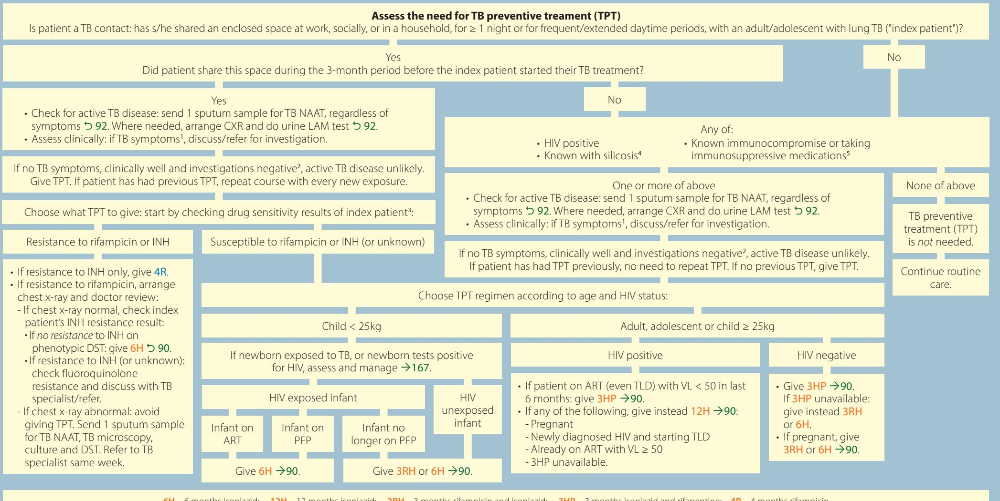

**6H** – 6 months isoniazid; **12H** – 12 months isoniazid; **3RH** – 3 months rifampicin and isoniazid; **3HP** – 3 months isoniazid and rifapentine; **4R** – 4 months rifampicin

1TB symptoms in adults may include: current cough, weight loss, drenching night sweats, fever or coughing up blood. TB symptoms in children may include: current cough, poor weight gain/failure to thrive, fever, lethargy or decreased playfulness, visible neck mass. 2If investigations are not available, continue to give TPT if patient has no symptoms of TB. 3If drug susceptibility results of index patient unknown, ask where index patient receives TB treatment and contact clinic for treatment details. 4Sillicosis is a chronic lung disease caused by breathing in silica dust while working in mining or construction. 5Cancer, those waiting/received blood/organ transplant or receiving chemotherapy, dialysis or corticosteroids, diabetes). 5Cancer, uncontrolled diabetes, those awaiting/received blood/organ transplant or receiving chemotherapy, dialysis or long term corticosteroids.

**[HIV](#page-102-0) [COVID-19](#page-117-0) [CHRONIC RESPIRATORY DISEASE](#page-119-0) [HEPATITIS B \(HBV\)](#page-116-0) [CARDIOMETABOLIC CONDITIONS](#page-123-0) [MUSCULOSKELETAL DISORDERS](#page-147-0) [MENTAL HEALTH](#page-136-0) [EPILEPSY](#page-145-0) [WOMEN'S HEALTH](#page-150-0) [PALLIATIVE CARE](#page-166-0)**

**TB**

**CONTENTS SYMPTOMSCONTENTS CHRONIC CONDITIONS**

### **At TPT initiation, decide patient category**

If never had TPT before or took TPT < 4 weeks, document as **new**.

•If completed TPT before or took TPT ≥ 4 weeks and stopped (due to adverse event, developed TB or was lost to follow up), document as **previously treated**.

### **Treat the patient needing TPT according to chosen regimen and weight**

- Give pyridoxine together with TPT.
- If severe peripheral neuropathy, active liver disease or known alcohol use disorder, defer TPT.

### **Rifapentine and isoniazid (3HP):**

- 3HP is weekly rifapentine and isoniazid for 3 months.
- Give with or immediately after eating.
- • Rifapentine decreases levels of protease inhibitors (lopinavir/atazanavir/ritonavir), nevirapine, and dolutegravir (when starting): use instead 12H.
- Rifapentine decreases levels of oral contraceptive and subdermal implant: use instead barrier method *and* injectable or IUD contraceptive.

| ig ht We       | d Iso iaz i n (w k ly ) ee                | fap R i ine t en (w k ly ) ee      |  |
|----------------------|----------------------------------------------------------------------|------------------------------------------------------------------|--|
| kg ( )         | b let 3 0 0m ta g s (w k ly ) ee | b let 15 0m ta g s (w k ly ) ee |  |
| 25 – 2 9. 9 | b lets 2 t a                                                | b lets 4 t a                                            |  |
| ≥ 3 0             | b lets 3 t a                                                | b lets 6 t a                                            |  |

### **Isoniazid (6H and 12H):**

- 6H is daily isoniazid for 6 months.
- 12H is daily isoniazid for 12 months.

| ht We             | iaz i d ( i ly ) Iso Da n       |                                                                |  |
|----------------------|------------------------------------------------------------|----------------------------------------------------------------|--|
| ig kg ( )   | b let 10 0m ta g da ly ( i ) | b let 3 0 0m ta g da ly ( i ) |  |
| 2 – 3. 4       | b let ¼ t a                                       | -                                                              |  |
| 3.5 9 – 4      | b let ½ t a                                       | -                                                              |  |
| 5 – 7. 4       | b let ¾ t a                                       | -                                                              |  |
| – 9 9 7.5      | b let 1 ta                                           | -                                                              |  |
| 10 9 – 1 4. | 1 ½ b let ta                                      | -                                                              |  |
| 15 – 1 9. 9 | b lets 2 t a                                      | -                                                              |  |
| ≥ 2 0             | b lets 3 t a                                      | b let 1 ta                                               |  |

### **Rifampicin and isoniazid (3RH):**

 3RH is daily dosing rifampicin and isoniazid for 3 months. Rifampicin interacts with ART2: adjust doses or TPT regimen.

|                                | ly R H ( Da i ) |                       |                                                                                                                       |               |
|--------------------------------|-----------------------------------|-----------------------|-----------------------------------------------------------------------------------------------------------------------|---------------|
| ig ht We kg ( ) | / 3 0 0 15 0       | / 15 0 75    | f / 0 (us L i 75 5 e m b let d isp d in ta ers e ) ter wa |               |
| 2-2 9                       | -                                 | -                     | b let ½ t a                                                                                                  | 5m L       |
| 3- 3. 9                  | -                                 | -                     | b let ¾ t a                                                                                                  | 7.5 L m |
| 4-5 9                       | -                                 | -                     | b let 1 ta                                                                                                      | 10m L      |
| 6-7 9                       | -                                 | -                     | b let 1 ½ ta                                                                                                 | 15m L      |
| 8-1 9 1.                 | -                                 | -                     | b lets 2 t a                                                                                                 | 20 L m  |
| 12 9 -15                 | -                                 | -                     | b lets 3 t a                                                                                                 | 3 0m L  |
| 16 -24 9                 | -                                 | -                     | b lets 4 t a                                                                                                 | 40 L m  |
| 25 – 3 9 7.           | -                                 | 2 t b lets a | -                                                                                                                     | -             |
| 3 8 – 54 9            | -                                 | b lets 3 t a | -                                                                                                                     | -             |
| ≥ 5 5                       | b lets 2 t a             |                       | -                                                                                                                     | -             |

### **Rifampicin (4R):**

- 4R is daily dosing rifampicin for 4 months.
- Rifampicin interacts with ART2: adjust doses or TPT regimen.

| < 1 0 y ea rs | kg da ly 15m / i g |
|------------------------|--------------------------------------|
| ≥ 1 0 y ea rs | kg da ly 10m / i g |

### **Pyridoxine**

 Give pyridoxine whenever using isoniazid to prevent peripheral neuropathy.

| < 5 y ea rs | 12. da ly 5m i g |
|----------------------|---------------------------------|
| ≥ 5 y ea rs | da ly 25 i mg       |

- Review monthly while on TPT: check for TB symptoms and side effects. Adjust dose according to weight, if needed. If peripheral neuropathy develops while on TPT [66](#page-62-0). Advise to avoid alcohol/smoking.
- Explain possible side effects to patient: low appetite, nausea, abdominal discomfort, fatigue/weakness, dark urine, pale stools.
- •If sudden new vomiting, upper abdominal pain, jaundice, hives, wheeze, difficulty breathing, BP < 90/60 or dizziness/collapse, stop TPT, refer and report ADR2.
- If TB symptoms develop: send 1 sputum sample for TB NAAT [92](#page-88-0).
- If patient interrupts TPT:
- Explore reasons for treatment interruption, address individual concerns. Educate on the importance of adherence and provide adherence support [173](#page-169-0).
- Screen clinically for TB symptoms:
- If symptoms of TB are present, check for TB [92](#page-88-0).
- If no symptoms TB, continue treatment including missed doses.
- If individual interrupts for the second time, avoid restarting treatment.

### **Once TPT complete, decide on treatment outcome**

- If completes full duration of TPT, document as **treatment completed**.
- If on 3HP, 3RH or 4R: if interrupts treatment for ≥ 4 weeks, document as **lost to follow-up**.
- If stops TPT due to serious adverse event or developed TB, document as **treatment stopped**.
- If died during TPT, document as **died**.
- If on 6H or 12H: if interrupts treatment for 3 consecutive months, document as **lost to follow-up**.

1Rifampicin decreases levels of protease inhibitors (lopinavir/atazanavir/ritonavir), efavirenz and nevirapine: use instead 12H. If on dolutegravir: offer 12H or increase dolutegravir dose to 50mg 12 hourly. Continue until 2 weeks after TPT completed. Discuss if unsure. 2Email or fax adverse drug reaction (ADR) form to adr@sahpra.org.za or (012) 842 7609/10.

# **HOW TO COLLECT A GOOD SPUTUM SPECIMEN FOR TB TESTING**

Aim to collect sputum in the early morning. This improves the chance of an accurate result. However, avoid missing the opportunity to collect sputum anytime during a consultation.

- Explain that a good quality sputum specimen is important to make an accurate diagnosis of TB.
- •Advise to avoid putting saliva or nasal secretions into specimen jar. Sputum is the secretion that comes from deep within the lungs and a forceful cough is needed to bring it up for collection.
- If observing sputum collection, health worker to use mask (N95/FFP2) in well ventilated area. Stand behind patient and check air stream (fan, air conditioner) is coming from behind back to avoid exposure.
- Explain how to collect a good sputum specimen:

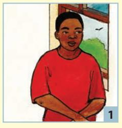

- Ensure collection area is well ventilated and private.
- Use a designated sputum collection area if available.

**CONTENTS SYMPTOMSCONTENTS CHRONIC CONDITIONS**

 Rinse mouth with water to remove food, mouth wash or medication.

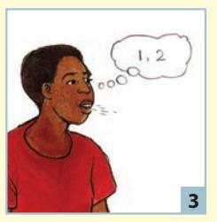

- Breathe in and out deeply two times.
- Have an open specimen jar ready.
- Keep the jar sterile (clean), avoid touching inside it.

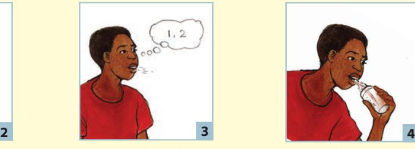

- On the third breath, give a strong cough.
- Cough 5-10mL (1-2 teaspoons) sputum into the jar.
- You may need several coughs to get at least 5mL.
- Avoid putting saliva/nasal secretions into jar.

**[HIV](#page-102-0) [COVID-19](#page-117-0) [CHRONIC RESPIRATORY DISEASE](#page-119-0) [HEPATITIS B \(HBV\)](#page-116-0) [CARDIOMETABOLIC CONDITIONS](#page-123-0) [MUSCULOSKELETAL DISORDERS](#page-147-0) [MENTAL HEALTH](#page-136-0) [EPILEPSY](#page-145-0) [WOMEN'S HEALTH](#page-150-0) [PALLIATIVE CARE](#page-166-0)**

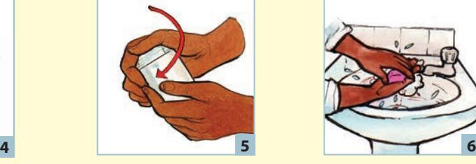

- Replace lid and screw on tightly to prevent leaking.
- Give to health worker.

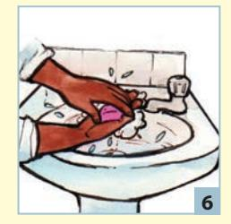

 Wash your hands after sputum collection.

- **If patient unable to produce sputum, use nebuliser to induce sputum**
- Health worker to wear a N95/FFP2 respirator mask in a well ventilated area. Explain process to patient: follow same steps as above only use nebuliser to help produce sputum.
- Add 5mL 3% saline to nebuliser and nebulise at 8L/min for 10 minutes or until sputum coughed up. While nebuliser runnng, ask patient breathe in and out deeply 2-3 times, followed by a strong cough to try and bring up sputum from deep within the chest. If able to generate sputum, ask patient to remove mask and cough it into the specimen jar, then continue with nebulisation. Repeat until at least 5mL sputum collected.
- If no sputum coughed up by 10 minutes, repeat nebulisation once.

**TB**

### **Prepare specimens for transport to the laboratory:**

- Check specimens are adequate: if patient unable to produce 5mL (1 teaspoon) but quality of sputum is still good, still send specimens to laboratory. If quality of specimen is inadequate, see below.
- •Ensure lid is closed tightly and correctly, and that the specimen jar is correctly labelled as above. Wash hands after handling specimens.
- If room temperature is > 25°C or transport delayed for > 24 hours, store in refrigerator (2-8°C). Keep cool but do not freeze.
- Complete request form and advise patient to return for results in 2 days. If patient HIV-positive, indicate this on request form.

### **If specimen inadequate:**

- If specimen is inadequate and of poor quality after repeated attempts, discard used jar in medical waste bin and give patient new labelled specimen jar. Instruct on how to collect sputum at home: Collect sputum specimen early in the morning after waking up, before eating or taking any medications. Collect sputum specimen outside home. Follow the same steps tried above.
- Once collected, protect sputum specimen sample from heat and light. Keep at room temperature and bring to the clinic as soon as possible.
- If specimen from home is adequate, prepare for transport to laboratory (above). If still not adequate, refer to hospital for further investigation or to a doctor for chest x-ray and review.

### **TUBERCULOSIS (TB): DIAGNOSIS**

**TB tests changing from 'Xpert Ultra' to 'TB NAAT'** (**NAAT** = nucleic acid amplification test and includes Xpert as well as newer TB tests).

- Check for TB if any TB symptoms: current cough, weight loss, drenching night sweats, fever or coughing up blood.
- Also routinely check for TB, even if no TB symptoms, if:
- Patient completed TB treatment in last 2 years: check for TB yearly, for 2 years after completing TB treatment. Patient HIV positive: at HIV diagnosis, then yearly (when viral load checked) and if pregnant at first antenatal visit.

 Excluding TB disease during TB preventive treatment (TPT) work up. Abnormal TB screening chest x-ray, even if no known TB exposure.

**Give urgent attention to the patient with suspected TB and any of:**

- •Respiratory rate ≥ 30
- Breathless at rest or while talking •
  - Drowsy/confused
- Prominent use of breathing muscles • Coughs up ≥ 1 tablespoon of fresh blood Neck stiffness
- • Persistent vomiting New weakness of arm/leg

- **Manage and refer urgently:**
- If breathing difficulty, give face mask oxygen and ceftriaxone 1g IV1/IM to treat for suspected severe pneumonia.
- •If able, send 1 sputum sample for TB NAAT. If HIV positive with CD4 ≤ 200 *or* WHO clinical stage 3 or 4, also do a rapid urine LF-LAM test.

### **Start the workup to diagnose TB in the patient not needing urgent attention**

### **Test sputum**

- Send 1 sputum sample for TB NAAT: demonstrate how to give sputum sample [91](#page-87-0).
- •If unable to produce sputum: induce sputum [91](#page-87-0). If unsuccessful, arrange chest x-ray [93](#page-89-0).
- Ask patient to return for results in 2 days. Manage according to results: if TB NAAT positive (or trace), manage below. If TB NAAT negative [93](#page-89-0).

**Test blood**Test for HIV [110](#page-106-0).

### **Test urine**

- If HIV positive and CD4 ≤ 200 or WHO stage 3 or 4 disease, also do rapid urine LAM test (only if TB symptoms):
- If LAM positive, **diagnose TB** and start DS-TB treatment same day [94](#page-90-0) and follow up TB NAAT result (see below).
- If LAM negative, ask patient to return for TB NAAT results in 2 days.

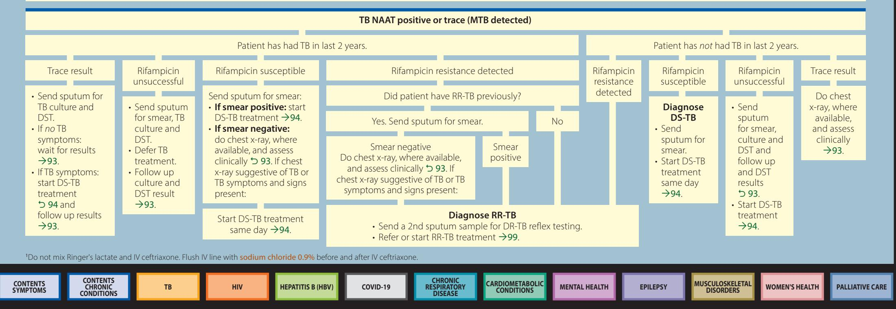

####  Review in 1 week: If TB symptoms resolve: no further follow-up needed. Advise to return if symptoms recur. Assess need for TPT [89](#page-85-0). If TB symptoms persist: send sputum for TB culture and DST and arrange chest x-ray, assess clinically and review as below. If chest x-ray unavailable, refer and follow up culture and DST results. HIV negative At this visit, also: • Send sputum for TB culture and DST. Arrange chest x-ray, assess clinically and review as below. HIV positive **TB NAAT negative (MTB not detected)** If no TB symptoms and testing for TB using TB NAAT negative, consider TB unlikely. Continue to assess need for TPT [89](#page-85-0). • If TB symptoms, manage symptom/s as on symptom page, especially if cough [38](#page-34-0), if weight loss [23](#page-19-0), if fever [24](#page-20-0). Continue to assess and manage according to HIV status: Culture positive (MTB confirmed) Culture negative TB unlikely If TB symptoms resolved, continue routine care. Advise to return if symptoms recur. If TB symptoms persist, refer. No resistance to rifampicin and INH detected **Diagnose DS-TB**: start treatment [94](#page-90-0). Resistance to INH only detected **Diagnose INH mono-resistant TB:** start treatment [95](#page-91-0).Resistance to rifampicin detected **Diagnose RR-TB:** start or refer to start RR-TB treatment [99](#page-95-0).**Follow-up culture and DST results every 1-2 weeks until available and review:** Pleural or pericardial effusion If bilateral pleural effusions or pericardial effusion, refer. If pleural effusion, aspirate fluid and send 2 samples: If clear: request TB culture, DST, ADA and cell count. If pus: request TB NAAT, microscopy, TB culture and DST. Refer same day. If previous TB in the last 2 years with positive TB NAAT [91](#page-87-0). • If *no* previous TB in the last 2 years, start DS-TB treatment [93](#page-89-1) if: TB NAAT trace. TB NAAT negative in HIV positive patient. Chest x-ray suggestive of TB in a patient with persistent TB symptoms and signs. Consider extrapulmonary TB: If abdominal pain, swelling, hepatosplenomegaly, or diarrhoea, refer for abdominal ultrasound. If severe headache/s, refer for CT scan/lumbar puncture. If back pain, arrange spinal x-ray or refer. If lymph node ≥ 2cm, aspirate lymph node for TB microscopy and cytology [25](#page-21-0). No effusion If unsure, discuss/refer. If history of mining or working in construction, consider silicosis.Yes No If not yet done, send sputum sample for TB culture and DST if able to produce sputum and assess clinically, looking for other causes. Assess clinically: does patient have persistent symptoms or signs suggestive of TB? Continue routine care. • Assess eligibility for TPT [89](#page-85-0). If done, follow up TB culture and DST results below.• Advise to return if symptoms develop. Chest x-ray abnormal Chest x-ray normal **Doctor to review the chest x-ray, where available, and clinically assess the patient:** Compare with previous chest x-rays, if available. Especially look for: upper lobe cavitation, any lung opacification in HIV positive patient, pleural effusion/s, hilar lymphadenopathy, miliary TB, pericardial effusion. TB disease unlikely **TB CONTENTS SYMPTOMS CONTENTS CHRONIC CONDITIONS[HIV](#page-102-0) [COVID-19](#page-117-0) [CHRONIC RESPIRATORY DISEASE](#page-119-0) [HEPATITIS B \(HBV\)](#page-116-0) [CARDIOMETABOLIC CONDITIONS](#page-123-0) [MUSCULOSKELETAL DISORDERS](#page-147-0) [MENTAL HEALTH](#page-136-0) [EPILEPSY](#page-145-0) [WOMEN'S HEALTH](#page-150-0) [PALLIATIVE CARE](#page-166-0)**

# **DRUG-SENSITIVE TB (DS-TB): ROUTINE CARE**

**TB tests changing from 'Xpert Ultra' to 'TB NAAT'** (**NAAT** = nucleic acid amplification test and includes Xpert as well as newer TB tests).

#### **Assess the patient with DS-TB**

| As se ss                                                                                                                                 | W he n t o a sse ss                                                                                                                                                                                                                                                                                                                                                                 | No te                                                                                                                                                                                                                                                                                                                                                                                                                                                                                                                                                                                                                                                                                                                                                                                                                                                                                                                                                                                                                                                                                                                                                                                                                                                                                                                                                                                                                                                                                                                                                                                                              |
|------------------------------------------------------------------------------------------------------------------------------------------------|----------------------------------------------------------------------------------------------------------------------------------------------------------------------------------------------------------------------------------------------------------------------------------------------------------------------------------------------------------------------------------------------------|-----------------------------------------------------------------------------------------------------------------------------------------------------------------------------------------------------------------------------------------------------------------------------------------------------------------------------------------------------------------------------------------------------------------------------------------------------------------------------------------------------------------------------------------------------------------------------------------------------------------------------------------------------------------------------------------------------------------------------------------------------------------------------------------------------------------------------------------------------------------------------------------------------------------------------------------------------------------------------------------------------------------------------------------------------------------------------------------------------------------------------------------------------------------------------------------------------------------------------------------------------------------------------------------------------------------------------------------------------------------------------------------------------------------------------------------------------------------------------------------------------------------------------------------------------------------------------------------------------------------------|
| Reg istr ion at                                                                                                                       | d At iag is no s                                                                                                                                                                                                                                                                                                                                                                    | d c lete d a d c d o R.n Ens ien T I E at t re tur et. ure p co r om p n ap e n                                                                                                                                                                                                                                                                                                                                                                                                                                                                                                                                                                                                                                                                                                                                                                                                                                                                                                                                                                                                                                                                                                                                                                                                                                                                                                                                                                                                                                                               |
| T B c tac ts on                                                                                                                    | d At iag is no s                                                                                                                                                                                                                                                                                                                                                                    | dv hat l l 1 vi he lini for d t do ho for d t A ise T B c it t T B s ing ing C H W vis it T B s ing ing t tac ts est est a on s c c cre en an or en sur e es a me cre en an                                                                                                                                                                                                                                                                                                                                                                                                                                                                                                                                                                                                                                                                                                                                                                                                                                                                                                                                                                                                                                                                                                                                                                                                                                                                            |
| lco ho l / dru A g use                                                                                                    | d At iag is no s                                                                                                                                                                                                                                                                                                                                                                    | he has dru k ≥ dr ks 3/s d l leg l dru d p he d f y  In t ien t: 1 ) 4 in ion 2 ) u i r 3 ) m isu ip ion ica ion ? I 142 ast at t t ter t to p ear p n ess se a g s o se res cr or ov er- -co un m e s es any y , ,                                                                                                                                                                                                                                                                                                                                                                                                                                                                                                                                                                                                                                                                                                                                                                                                                                                                                                                                                                                                                                                                                                                                                                                      |
| Sy tom mp s                                                                                                                           | Eve vis it ry                                                                                                                                                                                                                                                                                                                                                                             | f re bre h les hi le t l kin f bre hin les dro fus d, c hs b les fre h b loo d, n k I irat ≥ 3 0, ine /co te at t re st o nt at 1 ta ≥ sp ory ra s a r w a g, p rom use o g mu sc ws y n e ou g up p oo n s ec • , f fn f a 9 kne / leg st i iste nt mit ing ive t a tte nt ion 2. ess , p ers vo or ne w w ea ss o rm , g ur g en du l im f sy do bet fer do Exp T B t I ect t o tm t. tom t g et ter to cto g ra a p rov em en n rea en mp s w ors en or no , re r. •                                                                                                                                                                                                                                                                                                                                                                                                                                                                                                                                                                                                                                                                                                                |
| d he A ren ce                                                                                                                      | Eve vis it ry                                                                                                                                                                                                                                                                                                                                                                             |  Req br l l m d h v C hec k a d he he B c d. f p d he he ho B t ien ing ica ion is it. T I ien in T 9 8. t p at t t to t e t at t w ter ts tm t ues s a e ea c ren ce on ar oo r a ren ce, m an ag p rup rea en                                                                                                                                                                                                                                                                                                                                                                                                                                                                                                                                                                                                                                                                                                                                                                                                                                                                                                                                                                                                                                                                                                                                                                                                |
| S de f fe i cts e                                                                                                            | Eve vis it ry                                                                                                                                                                                                                                                                                                                                                                             | k a bo de f fe f tr  As i 97 ut cts eat nt s e o me                                                                                                                                                                                                                                                                                                                                                                                                                                                                                                                                                                                                                                                                                                                                                                                                                                                                                                                                                                                                                                                                                                                                                                                                                                                                                                                                                                                                                                                                                                               |
| ly lan Fam i nin p g                                                                                                         | Eve vis it ry                                                                                                                                                                                                                                                                                                                                                                             | d p du ds  f p  Enc ien i rin ien 's c ive 154 I 15 9. at t to tre atm t, a at t tra t nt ou rag e p av o reg na ncy g en sse ss p on cep ne e reg na • 2 o Av d o l co d s b de l im lan T B t d b le o I U D p lus do No d t han l bet b le. i ntr t ive t tm ent ins tea inj ect int inj ect o ra ace p an u rm a p n rea , us e a r co n ms ne e o c g e erv a we en a •                                                                                                                                                                                                                                                                                                                                                                                                                                                                                                                                                                                                                                                                                                                                                                                                                                                                               |
| De ion p res s                                                                                                                     | Eve vis it ry                                                                                                                                                                                                                                                                                                                                                                             | he h, has fe lt do de d, ho les fe lt litt le lea do hin f y he  In t ien ) r 2 ) int in ing ? I it 143 ast t at t: 1 st o t to p m on p wn p res se p e s o ere r p sur e g s es e r ,                                                                                                                                                                                                                                                                                                                                                                                                                                                                                                                                                                                                                                                                                                                                                                                                                                                                                                                                                                                                                                                                                                                                                                                                                                             |
| l liat Pa ive ca re                                                                                                             | f a dv d d I T B ise an ce ase                                                                                                                                                                                                                                                                                                                                       | f p be d o ha for f t he day de de he for lso l liat  I ien is in ir 0 % o ive ive 170 at t 5 nt ot ost r c r m ore o or p en on rs m ca re, a g p a ca re                                                                                                                                                                                                                                                                                                                                                                                                                                                                                                                                                                                                                                                                                                                                                                                                                                                                                                                                                                                                                                                                                                                                                                                                                                                                                                        |
| ht d We ig B M I an                                                                                                       | Eve vis it ry                                                                                                                                                                                                                                                                                                                                                                             |  f fer Exp ht d a d T B t do I los ht, do / ho l sa k. ect ig in o n t tm t a j ust tm t 9 6. ing ig to cto ita we g a rea en n rea en se we re r sp me we e • ht ( kg ) ÷ he ht (m ) ÷ he ht (m ). f < fer for l su B M I = ig ig ig I 18 .5, it ion tr ort we re nu a p p •                                                                                                                                                                                                                                                                                                                                                                                                                                                                                                                                                                                                                                                                                                                                                                                                                                                                                                                                                                                                                                                                   |
| G luc ose                                                                                                                                | d At iag is no s                                                                                                                                                                                                                                                                                                                                                                    | f kno d bet luc l m fte  I ia 13 0. ntr wn es, as ses s g ose co o ore o n • f n  I kno h d bet hec k g luc ot it ia 17. wn w es, c ose •                                                                                                                                                                                                                                                                                                                                                                                                                                                                                                                                                                                                                                                                                                                                                                                                                                                                                                                                                                                                                                                                                                                                                                                                                                                                                                                                       |
| H I V                                                                                                                                    | d d e At iag is a vis it no s n ve ry                                                                                                                                                                                                                                                                                                                             |    f > hs las for f d s R f o R d d / do I 3 inc H I V t H I V 110 I H I V p it ive ive ine H I V c A T 11 1. I A T, a j ica ion ing 97 nt t est tes t ut tar t ust t mo s e os , g ro are an n m e s ,                                                                                                                                                                                                                                                                                                                                                                                                                                                                                                                                                                                                                                                                                                                                                                                                                                                                                                                                                                                                                                                                                                                                                                                       |
| T B N A A T r lt esu                                                                                                      | At d iag is no s                                                                                                                                                                                                                                                                                                                                                                    | de d, de d; f d t d lt  Reg iste ien M T B R I F s it ive / R I F re ista M T B n Tra I L A M w iag T B, r iew T B N A A T r 9 2. at t a tec te nt; ot tec te r p s en s s ce. as use o no se ev esu                                                                                                                                                                                                                                                                                                                                                                                                                                                                                                                                                                                                                                                                                                                                                                                                                                                                                                                                                                                                                                                                                                                                                                                                              |
| T B m icro sco p y                                                                                                              | d At iag is no s                                                                                                                                                                                                                                                                                                                                                                    | f d d s for d s lt he f i le. I T B N A A T p it ive iag is, s icro Rec mic in t ien 's Reg iste ive it ive at utu at t at os no s en p m sm ear m sco p y. or me ar ros co p y res u p r as sm ear ne g or sm ear p os                                                                                                                                                                                                                                                                                                                                                                                                                                                                                                                                                                                                                                                                                                                                                                                                                                                                                                                                                                                                                                                                                                                                                                                   |
| 4 (sm ) ear                                                                                                                           | k 7 We e                                                                                                                                                                                                                                                                                                                                                                                     | ly f sm lm d /re Do i it ive T B a iag is istr ion t at on ear p os p u on ary no s g : • f w k 7 d 1 for lon has for h a d m fur he k 7 lg hm  I it ive D S T, p int ive 1 it ive it 97 utu nt t ee sm ear p os : se n sp m ro g en s p e mo n an ag e r as p er p os we e sm ear a or - f w for fur I k 7 d c lini l ly ha has he hs. at ive im ing e t t inu at ion t r 4 nt ee sm ear ne g an ca p rov : c ng o c on p e mo -                                                                                                                                                                                                                                                                                                                                                                                                                                                                                                                                                                                                                                                                                                                                                                  |
|                                                                                                                                                | k 2 We 3 e                                                                                                                                                                                                                                                                                                                                                                                | ly f sm lm d Do i it ive T B a iag is. t on ear p os p on ary no s u • k 2 lt t de de  Use 3 s i 9 8. tre atm t o utc we e me ar res u o c en om e •                                                                                                                                                                                                                                                                                                                                                                                                                                                                                                                                                                                                                                                                                                                                                                                                                                                                                                                                                                                                                                                                                                                                                                                                                                                                                                              |
| B c ltu d T u re a n lt D S T r esu                                                                           | f se du d kup I rin iag ic w nt st g no or • ks: f st l l sm At 8 w i i it ive ee ear p os • f I H I V p d T B N A A T n it ive at ive os an eg • ks: f st l l sm At 24 i i it ive we e ear p os • | f bo h B c ltu d B d fer ho l for fur he d h e d B do list I T T N A A T n ive iag is, ita r in ig ion isc it ien T ia t at at to t t at cto u re a n eg no s re sp ves or uss w xp er ce r o r sp ec • f ( bac be los ) o ltu hec k lt: I M T B My ium is D S T r ter tu co rcu n c re, c esu u • f su fam I b le t d I N H, t i i ic in a nt inu e t tm t. sce p o r p n co rea en - 9 f re ly, d ist B a d g I ista I N H o iag I N H m t T ive ine 5. nt to ut s n no se on o-r es an n ro ca re - f re fam d fam ( ) a d g 9 I ista ri ic in, iag i ic in- ist T B R R- T B ive ine 8. nt to t ut s p no se r p res an n ro ca re - f c ltu d, r f c ltu ho be lou bac d r fer do I ina I N T M ( No ia ), c inu tam te eat ntu ter t e t tm t a to cto u re c on ep u re s ws rcu s m y co on rea en n e r. • |
| Tre atm ent tco ou me                                                                                                           | f At let T B t ion tm t co mp o rea en                                                                                                                                                                                                                                                                                                                         | de  De i 9 8. tre atm t o utc c on en om e                                                                                                                                                                                                                                                                                                                                                                                                                                                                                                                                                                                                                                                                                                                                                                                                                                                                                                                                                                                                                                                                                                                                                                                                                                                                                                                                                                                                                                                                                                                                 |
| 9 A dv ise l a d t he ien it h D S- T B t t at t w 6. , co un se n rea p |                                                                                                                                                                                                                                                                                                                                                                                                    |                                                                                                                                                                                                                                                                                                                                                                                                                                                                                                                                                                                                                                                                                                                                                                                                                                                                                                                                                                                                                                                                                                                                                                                                                                                                                                                                                                                                                                                                                                                                                                                                                       |
| 1A T ref B c ont act to a ers                                                                                                | ho sha red clo sed (at tien t w pa an en sp ace wo                                                                                                                                                                                                                                                                                                          | rk, s ally a h el, o a h eho ld s ), for ht o r fo r fre nt/ end ed day ds, h a dul t/a dol th lmo ( "ind t"), dur the h oci , in r in ing ≥ 1 nig tim erio wit wi TB tien ing 3-m ost ett ext ent ont ous que e p n a esc pu nar y ex pa                                                                                                                                                                                                                                                                                                                                                                                                                                                                                                                                                                                                                                                                                                                                                                                                                                                                                                                                                                                                                                                                                                                                                                                                  |

period before the index patient started their TB treatment. 2If patient already has subdermal implant, advise additional non-hormonal method (copper IUD or condoms) until 4 weeks after completing TB treatment. 3One drink is 1 tot of spirits, or 1 small glass (125mL) of wine or 1 can/bottle (330mL) of beer. 4Make every effort to obtain sputum. If difficulty, try in early morning or arrange for induced sputum.

**[HIV](#page-102-0) [CHRONIC RESPIRATORY DISEASE](#page-119-0) [CARDIOMETABOLIC CONDITIONS](#page-123-0) [MUSCULOSKELETAL DISORDERS](#page-147-0) [MENTAL HEALTH](#page-136-0) [EPILEPSY](#page-145-0) [WOMEN'S HEALTH](#page-150-0) [PALLIATIVE CARE](#page-166-0)**

**[HEPATITIS B \(HBV\)](#page-116-0) [COVID-19](#page-117-0)**

**[TB](#page-85-0)**

**CONTENTS SYMPTOMSCONTENTS CHRONIC CONDITIONS**

# **INH MONO-RESISTANT TB: ROUTINE CARE**

**TB tests changing from 'Xpert Ultra' to 'TB NAAT'** (**NAAT** = nucleic acid amplification test and includes Xpert as well as newer TB tests).

**Assess the patient with INH mono-resistant TB**

| As se ss                                       | he W n t o a sse ss                                                                                                                                                                                                           | No te                                                                                                                                                                                                                                                                                                                                                                                                                                                                                                                                                                                                                                                                                                                                                                                                                                                                                               |  |  |  |
|------------------------------------------------------|----------------------------------------------------------------------------------------------------------------------------------------------------------------------------------------------------------------------------------------------|--------------------------------------------------------------------------------------------------------------------------------------------------------------------------------------------------------------------------------------------------------------------------------------------------------------------------------------------------------------------------------------------------------------------------------------------------------------------------------------------------------------------------------------------------------------------------------------------------------------------------------------------------------------------------------------------------------------------------------------------------------------------------------------------------------------------------------------------------------------------------------------------------------|--|--|--|
| Reg istr ion at                             | d At iag is no s                                                                                                                                                                                                              | d c lete d a d c d o Ens ien T I E R.n at t re tur et. ure p co r om p n ap e n                                                                                                                                                                                                                                                                                                                                                                                                                                                                                                                                                                                                                                                                                                                                                |  |  |  |
| T B c tac ts on                          | d At iag is no s                                                                                                                                                                                                              | dv hat l l 1 vi he lini for d t do ho for d t A ise T B c it t T B s ing ing C H W vis it T B s ing ing t tac ts est est a on s c c cre en an or en sur e es a me cre en an                                                                                                                                                                                                                                                                                                                                                                                                                                                                                                                                                             |  |  |  |
| A lco ho l / dru g use          | At d iag is no s                                                                                                                                                                                                              | he has ) dru k ≥ dr ks 3/s ) u d l leg l dru ) m d p he d f y  In t ien t: 1 4 in ion 2 i r 3 isu ip ion ica ion ? I 142 ast at t t ter t to p ear p n ess se a g s o se res cr or ov er- -co un m e s es any y , ,                                                                                                                                                                                                                                                                                                                                                                                                                                                                       |  |  |  |
| Sy tom mp s                                 | Eve vis it ry                                                                                                                                                                                                                       | f re f fus fre I bre h les hi le t l kin bre hin les dro /co d, c hs b les h b loo d, n k irat te ≥ 3 0, at t re st o ine nt at 1 ta ≥ sp ory ra s a r w a g, p rom use o g mu sc ws y n e ou g up p oo n s ec • , 9 f fn kne f a / leg i iste mit ing ive ion 2. st nt t a tte nt ess , p ers vo or ne w w ea ss o rm , g ur g en du l im f sy do bet fer do Exp T B t I ect t o tm t. tom t g et ter to cto g ra a p rov em en n rea en mp s w ors en or no , re r. • |  |  |  |
| A d he ren ce                            | Eve vis it ry                                                                                                                                                                                                                       | Req br l l m d h v C hec k a d he he T B c d. t p at ien t ing ica t ion to is it. t ues s a e ea c ren ce on ar                                                                                                                                                                                                                                                                                                                                                                                                                                                                                                                                                                                                                                                                              |  |  |  |
| de f fe S i cts e                  | Eve vis it ry                                                                                                                                                                                                                       | f fe f tr  As k a bo de 97 ut i cts eat nt s e o me                                                                                                                                                                                                                                                                                                                                                                                                                                                                                                                                                                                                                                                                                                                                                                                                |  |  |  |
| ly lan Fam i nin p g               | Eve vis it ry                                                                                                                                                                                                                       | d p du ds  f p  Enc ien i rin ien 's c ive I 9. at t to tre atm t, a at t tra t 154 nt 15 ou rag e p av o reg na ncy g en sse ss p on cep ne e reg na • Av d o l co d s b de l im lan 2 o T B t d b le o I U D p lus do No d t ha l bet b le. i ntr t ive t tm t, u ins tea inj ect int inj ect o ra ace p an u rm a p n rea en se a r co n ms ne e o c ng e erv a we en a •                                                                                                                                                                |  |  |  |
| De ion p res s                           | Eve vis it ry                                                                                                                                                                                                                       | fe fe f y  In t he h, has ) lt do de d, ho les r 2 ) lt litt le lea do hin ? I he 143 ast t at ien t: 1 int st o in ing t to it p m on p wn p res se p e s o ere r p sur e g s es e r ,                                                                                                                                                                                                                                                                                                                                                                                                                                                                                                                              |  |  |  |
| l liat Pa ive ca re                   | f a dv d d I T B ise an ce ase                                                                                                                                                                                 | f p be d o ha for f t he day de de he for lso l liat  I ien is in ir 0 % o ive ive 170 at t 5 nt ot ost r c r m ore o or p en on rs m ca re, a g p a ca re                                                                                                                                                                                                                                                                                                                                                                                                                                                                                                                                                                                         |  |  |  |
| ht d B We ig M I an             | Eve vis it ry                                                                                                                                                                                                                       | ht d a d do  f los ht, fer do Exp ig in o j T B t 9 6. I ing ig ect n t tm t a ust tm t to cto we g a rea en n rea en se we re r. • f < fer for B M I = ht ( kg ) ÷ he ht (m ) ÷ he ht (m ). I 18 l su ig ig ig .5, tr it ion ort we re nu a p p •                                                                                                                                                                                                                                                                                                                                                                                                          |  |  |  |
| luc G ose                                      | d At iag is no s                                                                                                                                                                                                              | f kno d bet luc l m fte  I ia 13 0. ntr wn es, as ses s g ose co o ore o n • f n  I kno h d bet hec k g luc ot it ia 17. wn w es, c ose •                                                                                                                                                                                                                                                                                                                                                                                                                                                                                                                                                                                                                        |  |  |  |
| H I V                                          | d d e At iag is a vis it no s n ve ry                                                                                                                                                                       | f > for  f  f o  I 3 hs las H I V t H I V 110 I H I V p H I V c d A R T I A R T, a d d / do 97 nt inc t est tes t it ive ive ut ine 11 1. j ust ica t ion ing mo s e os , g ro are an n m e s ,                                                                                                                                                                                                                                                                                                                                                                                                                                                                                      |  |  |  |
| T B m icro sco p y                    | d At iag is no s                                                                                                                                                                                                              | de d lt. Reg iste ive it ive ing at r as sm ear ne g or sm ear p os p en on re su                                                                                                                                                                                                                                                                                                                                                                                                                                                                                                                                                                                                                                                                                                                                              |  |  |  |
| d c ltu 4 (sm ) a ear n u re | h ly Mo nt                                                                                                                                                                                                                          | f st l l cu ltu hs, hat I i it ive 3 D S T o it ive im at nt t n t re p os mo re q ues sa me p os sp ec en • I f st l l cu ltu hs, d h s list fer dru T B u i it ive at 4 nt isc it ia to ista nt nit re p os mo uss w p ec or re g- res • f n ltu be hat I ive /cu it ive D S T o it ive im at t n t eg sm ear re co me s p os , re q ues sa me p os sp ec en •                                                                                                                                                                                          |  |  |  |
| D S T                                          | d At iag is no s • I f c ltu hs it ive 3 at nt u re p os mo • f n ltu I ive /cu at eg sm ear re • bec it ive om es p os | f re ly f st l l cu ltu hs, d h s list fer dru I ista I N H o i i it ive isc it ia ista T B u nit nt to at 4 nt to nt s n : re p os mo uss w p ec or re g- res • 9 I f re fam d i fam ic in- ist T B ( R R- T B ) a d g ista ri ic in, iag t ive ine 9. nt to ut s p no se r p res an n ro ca re •                                                                                                                                                                                                                                                                                                          |  |  |  |
| B T N A A T                           | f n de d I ee                                                                                                                                                                                                                    | f de d > day fte f D S- B t d 1 fur he le for B f irm hat he fam I I N H r ista 28 T T N A A T t is n ista ri ic in. tec te r st art tm t, s t utu t t to es nce s a o rea en en r sp m sam p o c on re o r es nce p                                                                                                                                                                                                                                                                                                                                                                                                                                                                                |  |  |  |
| Tre atm t o utc en om e            | let f At ion T B t tm t co mp o rea en                                                                                                                                                                   |  De de i tre atm t o utc 9 8. c on en om e                                                                                                                                                                                                                                                                                                                                                                                                                                                                                                                                                                                                                                                                                                                                                                                                                  |  |  |  |

**Advise and treat the patient with INH mono-resistant TB [96](#page-92-0).**

1Close TB contact: any person who shared an enclosed space (social/work/congregate/household setting) with an adolescent or adult with pulmonary TB (index patient) for > 15 minutes in 24 hours during the 3 months before index patient started TB treatment. 2If patient already has subdermal implant, advise additional non-hormonal method (copper IUD or condoms) until 4 weeks after completing TB treatment. 3One drink is 1 tot of spirits, or 1 small glass (125mL) of wine or 1 can/bottle (330mL) of beer. 4Make every effort to obtain sputum. If difficulty, try in early morning or arrange for induced sputum.

**[HIV](#page-102-0) [COVID-19](#page-117-0) [CHRONIC RESPIRATORY DISEASE](#page-119-0) [HEPATITIS B \(HBV\)](#page-116-0) [CARDIOMETABOLIC CONDITIONS](#page-123-0) [MUSCULOSKELETAL DISORDERS](#page-147-0) [MENTAL HEALTH](#page-136-0) [EPILEPSY](#page-145-0) [WOMEN'S HEALTH](#page-150-0) [PALLIATIVE CARE](#page-166-0)**

**[TB](#page-85-0)**

**CONTENTS SYMPTOMSCONTENTS CHRONIC CONDITIONS**

- Provide TB counselling and refer for community or workplace adherence support.
- • Educate about TB treatment side effects [97](#page-93-0) and advise to return promptly should they occur.
- Educate about infection control: adequate ventilation/open windows (if area is not well ventilated, to wear a face mask), cough/sneeze into upper sleeve or elbow. Wash hands with soap regularly.
- If patient smear positive, advise to stay home from work for the first 2 weeks of treatment.
- •Alert to the risks of smoking [141](#page-137-0) and alcohol/drugs and support patient to change [177](#page-173-0). If patient chooses to continue, advise safe alcohol use [142](#page-138-0) and to continue taking TB medication daily.
- Give **enhanced adherence support** to the patient with poor adherence [173](#page-169-0):
- Educate on the importance of adherence and the risks of resistance.
- Ask about alcohol/drug use [142](#page-138-0), stress/anxiety/depression [86](#page-82-0) and side effects [97](#page-93-0).
- Refer for support: adherence counsellor, support group, treatment partner, community health worker.

### **Treat the patient with drug-sensitive or INH mono-resistant TB**

#### **•If drug-sensitive TB (DS-TB):**

Treat the patient (whether a new or retreatment case) 7 days a week for 6 months:

 Give intensive phase rifampicin/isoniazid/pyrazinamide/ethambutol (RHZE) for 2 months. Prolong for 1 month if 7 week smear positive [97](#page-93-0). Then, if clinically improving (and 7 week smear negative if done), change to continuation phase rifampicin/isoniazid (RH) for a further 4 months.

- If TB meningitis, TB bones/joints or miliary TB, extend treatment to 9 months (2 months RHZE/7 months RH) or as guided by a specialist.
- If patient pregnant, misuses alcohol, or has diabetes, epilepsy or BMI < 18.5: also give pyridoxine 25mg daily. Stop on completion of TB treatment.

#### **•If INH mono-resistant TB:**

 Give daily 7 days a week: rifampicin 10mg/kg + pyrazinamide 25mg/kg + ethambutol 15mg/kg + levofloxacin 750-100mg, until TB treatment completed. To ensure adherence, give fixed dose combination tablets RHZE even though isoniazid (H) may not be active and add levofloxacin (see table).

- If inhA mutation only, consider giving high-dose isoniazid (up to total of 10mg/kg/day in total). If unsure, present to NCAC1.
- Give pyridoxine 50mg daily until TB treatment completed.

#### **•Decide treatment duration:**

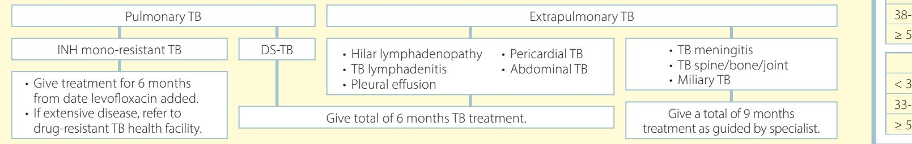

**If HIV positive:** if on ART, adjust medication/dosing [97](#page-93-2). If not on ART [114](#page-110-0).

Check that patient is up to date with his/her COVID-19 vaccination.

### **Review the patient with drug-sensitive or INH mono-resistant TB**

- If stable, review monthly during intensive phase, then arrange for treatment collection through RPCs2. Avoid treatment collection through RPCs if patient has TB and HIV.
- Review again at week 23.

**CONTENTS SYMPTOMSCONTENTS CHRONIC CONDITIONS**

•Advise to return sooner if worsening or side effects develop.

**[TB](#page-85-0)**

Assess patient for TB preventive treatment (TPT) [89](#page-85-0) and check for TB yearly for 2 years after completing TB treatment [92](#page-88-0).

**[HEPATITIS B \(HBV\)](#page-116-0) [COVID-19](#page-117-0)**

1National Clinical Advisory Committee. 2RPCs - repeat prescription collection strategies make it easier and quicker for patient to collect their chronic medications and include 'facility pick-up points' (FAC-PUPs), 'external pick-up points' (EX-PUPs) and clubs. Medications are pre-dispensed by Central Dispensing Unit (CDU) or Central Chronic Medicine Dispensing and Delivery (CCMDD).

**[HIV](#page-102-0) [CHRONIC RESPIRATORY DISEASE](#page-119-0) [CARDIOMETABOLIC CONDITIONS](#page-123-0) [MUSCULOSKELETAL DISORDERS](#page-147-0) [MENTAL HEALTH](#page-136-0) [EPILEPSY](#page-145-0) [WOMEN'S HEALTH](#page-150-0) [PALLIATIVE CARE](#page-166-0)**

| bo T B s ine / / j int p ne o Mi liar T B y |  | kg < 3 3      | f lo Lev in o xa c kg 15- 20 / mg |  |  |  |
|------------------------------------------------------------------------------------------|--|---------------------|--------------------------------------------------------------------|--|--|--|
|                                                                                          |  |                     |                                                                    |  |  |  |
|                                                                                          |  | kg 3 3-5 0 | 75 0m g                                                      |  |  |  |
| de d by list i ia atm t a en s g sp ec u             |  | kg ≥ 5 1      | 10 0 0m g                                                 |  |  |  |
|                                                                                          |  |                     |                                                                    |  |  |  |
|                                                                                          |  |                     |                                                                    |  |  |  |
|                                                                                          |  |                     |                                                                    |  |  |  |
|                                                                                          |  |                     |                                                                    |  |  |  |
|                                                                                          |  |                     |                                                                    |  |  |  |
|                                                                                          |  |                     |                                                                    |  |  |  |
|                                                                                          |  |                     |                                                                    |  |  |  |

| d ht d Do ing ig to se ac co r w e an d ht j ig inc t a a us s w e rea se s |                                                                                        |  |  |  |  |
|-----------------------------------------------------------------------------------------------------------------------------------------------------------|----------------------------------------------------------------------------------------|--|--|--|--|
|                                                                                                                                                           | R H Z E ( / / / ) 15 0 75 40 0 27 5m g |  |  |  |  |
| kg 25 -37                                                                                                                                           | b let 2 t a s                                                              |  |  |  |  |
| kg 3 8-5 4                                                                                                                                       | b let 3 t a s                                                              |  |  |  |  |
| kg 55 -70                                                                                                                                           | b let 4 t a s                                                              |  |  |  |  |
| kg ≥ 7 1                                                                                                                                            | b let 5 t a s                                                              |  |  |  |  |
|                                                                                                                                                           | R H                                                                                 |  |  |  |  |
| kg 25 -37                                                                                                                                           | b let ( ) 2 t 15 0 / 75 a s mg                        |  |  |  |  |
| kg 3 8-5 4                                                                                                                                       | b let 3 t ( 0 / ) 15 75 a s mg                        |  |  |  |  |
| kg ≥ 5 5                                                                                                                                            | b let ( / ) 2 t 3 0 0 15 0m a s g               |  |  |  |  |
|                                                                                                                                                           |                                                                                        |  |  |  |  |

78

#### **Treat the patient with TB**1 **and HIV**

- If already on dolutegravir-based ART regimen and starting TB treatment: increase dolutegravir (DTG) dose to 50mg 12 hourly2. Continue this dose until 2 weeks after TB treatment completed.
- If already on TB treatment and starting ART (patient has never been on ART): consider TEE (TDF + FTC + EFV). Switch to DTG-based regimen 2 weeks after TB treatment complete.
- Avoid atazanavir with rifampicin. If already on atazanavir, discuss with HIV expert, infectious disease specialist or HIV hotline [178](#page-174-0).
- If on lopinavir/ritonavir, increase lopinavir/ritonavir dose gradually:
- After 1 week of TB treatment, increase lopinavir/ritonavir to 600/150mg (3 tablets) 12 hourly for 1 week.
- Then increase lopinavir/ritonavir to 800/200mg (4 tablets) 12 hourly. Continue this dose until 2 weeks after TB treatment completed.
- Monitor for liver problem (jaundice, abdominal pain, vomiting) and check ALT monthly. If symptomatic with ALT > 120, or asymptomatic with ALT ≥ 200, refer.
- Aim to switch to a dolutegravir-based regimen 2 weeks after TB treatment completed.

### **Look for and manage TB treatment side effects**

| S i de f fe ct e                                                      | i ke ly L ca us e                                   | Ma t na g em en                                                                                                                                                                                                                                                                                                                                                                                                                                                                                                                                                                                                                                                                                                                                                                                                                                                                                                                                                                                                                                             |
|-----------------------------------------------------------------------------------------|-----------------------------------------------------------------------|----------------------------------------------------------------------------------------------------------------------------------------------------------------------------------------------------------------------------------------------------------------------------------------------------------------------------------------------------------------------------------------------------------------------------------------------------------------------------------------------------------------------------------------------------------------------------------------------------------------------------------------------------------------------------------------------------------------------------------------------------------------------------------------------------------------------------------------------------------------------------------------------------------------------------------------------------------------------------------------------------------------------------------------------------------------------------|
| Jau d ice n                                                                    | Mo T B m d ica ion st t e s                | fer Sto l l m d ica ion d r ho ita l sa da t to p a e s a n e sp me y.                                                                                                                                                                                                                                                                                                                                                                                                                                                                                                                                                                                                                                                                                                                                                                                                                                                                                                                                   |
| Na it ing b do ina l use a, v om , a m in p a | Mo T B m d ica ion st t e s                | C he k A L T a d r iew lt w it h in ho 24 c n ev re su urs : • f l l m d d r fer ho l sa da I A L T > 12 0, s ica ion ita top t to a e s a n e sp me y. - f for b le c de d r h k. f u d fer I A L T 5 0-1 20, i i int ing A L T w it in 1 w I isc t tre atm t a eat as ses s p oss au ses , co ns r err up en n ep ee nsu re, uss or re - f n f s f ic for I /vo it ing dv ise ke ig ht. I ig i /vo it ing ive lop i de 10 3 0 m inu be T B m d ica ion to ta tre atm t a t n t n eto tes t au sea m : a en n an au sea m , g m c ram mg e e • |
| k h h S in / itc ras                                               | d Mo T B m ica ion st t e s                |  d m As 67 ses s a n an ag e                                                                                                                                                                                                                                                                                                                                                                                                                                                                                                                                                                                                                                                                                                                                                                                                                                                                                                                                                                                                                   |
| Se izu res                                                                        | Lev f lo in, iso iaz i d o xac n        |  d r fer ho l sa da Ma izu 19 ita to na g e s e re an e sp me y.                                                                                                                                                                                                                                                                                                                                                                                                                                                                                                                                                                                                                                                                                                                                                                                                                                                                                                                                              |
| ho Psy is c s                                                               | f lo d Lev in, iso iaz i o xac n        | ho  d d fer ho l sa da Ma is 85 isc /re ita to na g e p sy c s an uss sp me y.                                                                                                                                                                                                                                                                                                                                                                                                                                                                                                                                                                                                                                                                                                                                                                                                                                                                                                                 |
| ha C in v is ion ng e                                                 | ha bu l Et to m                                        | ha bu l an d r fer l da Sto ia ist et to to p m e ey e s p ec sam e y.                                                                                                                                                                                                                                                                                                                                                                                                                                                                                                                                                                                                                                                                                                                                                                                                                                                                                                                                   |
| Jo int in p a                                                               | de lev f lo Py ina mi in raz o xac , | bu fen ho ly de d w h foo d for day (av d f p lce hm hy hea fa lur ki dn d ). G ive i 40 0m 8 it 5 i i ic u ion i ise to t st ert rt p ro g ur as nee up s o ep r, a a, p en s e o r ey ase ,                                                                                                                                                                                                                                                                                                                                                                                                                                                                                                                                                                                                                                                                                    |
| Ora rin ng e u e                                                            | fam Ri ic in p                                            | his l w hi le t kin fam Rea is ri ic in. re t ssu no rm a a g p                                                                                                                                                                                                                                                                                                                                                                                                                                                                                                                                                                                                                                                                                                                                                                                                                                                                                                                                                      |
| /nu bn f fee Pa in t m ess o                                 | d Iso nia zi                                                 | he l n hy li ke ly  Pe ip 6 6. at r ra eu rop                                                                                                                                                                                                                                                                                                                                                                                                                                                                                                                                                                                                                                                                                                                                                                                                                                                                                                                                                                                |

### **Manage the patient with DS-TB and a positive week 7 smear**

- Look for explanation for result: if poor adherence, give enhanced adherence support [173](#page-169-0), alcohol/drug use [142](#page-138-0), stress [86](#page-82-0) or treatment side effects (see above).
- Send 1 sputum for culture and DST and continue intensive phase treatment for a month.
- Follow up culture and DST result every 1-2 weeks until available and review:

|                                                                                                                                                                                                                                                                                                                                                                                                                                                                                                                                      | fam d Se it ive ri ic in I N H to ns p an                                                                                                                                                                                                |                        |                                                                                                                                                                                                                                     |                                                                                                                                                                                                                                                                                     |                                                                | ly Re ista I N H o nt to s n                                                                                                                                                                                                                                                                                                                                                                                                                                                                                          | fam Re ista ri ic in nt to s p                                                                                                                                                                                                                                                    |                              |                                                |                                                       |                                |                          |
|--------------------------------------------------------------------------------------------------------------------------------------------------------------------------------------------------------------------------------------------------------------------------------------------------------------------------------------------------------------------------------------------------------------------------------------------------------------------------------------------------------------------------------------|------------------------------------------------------------------------------------------------------------------------------------------------------------------------------------------------------------------------------------------------------------------------------------|------------------------|-------------------------------------------------------------------------------------------------------------------------------------------------------------------------------------------------------------------------------------|-------------------------------------------------------------------------------------------------------------------------------------------------------------------------------------------------------------------------------------------------------------------------------------|----------------------------------------------------------------|--------------------------------------------------------------------------------------------------------------------------------------------------------------------------------------------------------------------------------------------------------------------------------------------------------------------------------------------------------------------------------------------------------------------------------------------------------------------------------------------------------------------------------------------------|--------------------------------------------------------------------------------------------------------------------------------------------------------------------------------------------------------------------------------------------------------------------------------------------------------------|------------------------------|------------------------------------------------|-------------------------------------------------------|--------------------------------|--------------------------|
|                                                                                                                                                                                                                                                                                                                                                                                                                                                                                                                                      |  C ha ha d m lin l ly. inu ion 9 6 a ito ica e t t at ng o c on p se n on r c • (sm ) a k 1 Re T B m icr 1: t t w p ea osc op ea r ee y •     |                        |                                                                                                                                                                                                                                     |                                                                                                                                                                                                                                                                                     |                                                                | D iag I N H no se ist T B t mo no -re s an Sta rt t tm t rea en •                                                                                                                                                                                                                                                                                                                                                                                                              | D iag R R- T B no se Sto D S- T B t tm t: p rea en • f re fam ly, f fam I ista ri ic in ive "ri ic in ista T B " nt to tco nt s p on g ou me o p res - |                              |                                                |                                                       |                                |                          |
|                                                                                                                                                                                                                                                                                                                                                                                                                                                                                                                                      | Sm ea                                                                                                                                                                                                                                                                           | it ive r p os |                                                                                                                                                                                                                                     | da 9 fo l de in ien 5. at t sam e y p r. Sm ive at ea r n eg f re fam Re I d I N H, iste at ien t ista nt to ri ic in g r p s p an g • - |                                                                |                                                                                                                                                                                                                                                                                                                                                                                                                                                                                                                                                  |                                                                                                                                                                                                                                                                                                              | ive tco ou             | f "m lt dru i me o u g |                                                       |                                |                          |
| As ses • f p I - an                                                                                                                                                                                                                                                                                                                                                                                                                                                                                                | lin l ly ica s c : ha ha at ien t im ing e t t inu at ion p rov , c ng o c on p se d c for l o f 6 hs. inu t e t tm t tot t on rea en a a m on |                        | d m lin l ly. Co inu ito ica nt e t tm t a rea en n on r c • for f 6 Co l o hs. nt inu e t tm t tot t rea en a a m on • |                                                                                                                                                                                                                                                                                     | I N H m as on o ista T B. nt res | " in fo l de ista T B ien nt at t res p r. d s da 9 G ive ine R R- T B c 9. ut tar t tr tm t s ro are an ea en am e y • Re dru T B r iste r in ista nt iste g g- res eg r. • f la b le, fer dru fac lity I R R- T B c i ista T B ini iat ion i t a to nt t are no va re g- res • |                                                                                                                                                                                                                                                                                                              |                              |                                                |                                                       |                                |                          |
| f p de fer I ien ior ing at t ter at , re - 1Th clu des dr B ( DS- TB) d IN B. 2 If o n fi xed do bin fov ir/la udi ne/ do lute ( ): c e th nd add do lute hou fte D d is in sitiv e T H-m ista nt T atio miv vir TLD inu is a vir 50m 12 r TL n, t ont ug- sen an ono res se c om eno gra gra g rs a ose |                                                                                                                                                                                                                                                                                    |                        |                                                                                                                                                                                                                                     |                                                                                                                                                                                                                                                                                     |                                                                |                                                                                                                                                                                                                                                                                                                                                                                                                                                                                                                                                  |                                                                                                                                                                                                                                                                                                              |                              |                                                |                                                       |                                |                          |
| TS SYM CON TEN PTO MS                                                                                                                                                                                                                                                                                                                                                                                                                                                                                                    | CON TS CHR TEN IC CON ON DIT ION S                                                                                                                                                                                                                            | TB                     | HIV                                                                                                                                                                                                                                 | HEP TIS B (H BV) ATI                                                                                                                                                                                                                                                    | COV ID-1 9                                               | IC RES CHR ON RY DIS PIR ATO EAS E                                                                                                                                                                                                                                                                                                                                                                                                                                                                                          | CAR LIC CON DIO MET ABO DIT ION S                                                                                                                                                                                                                                                       | MEN TAL HE ALT H | EPI LEP SY                               | MU SCU L DIS LOS KEL ETA ORD ERS | WO 'S H MEN EAL TH | PAL CA LIAT IVE |

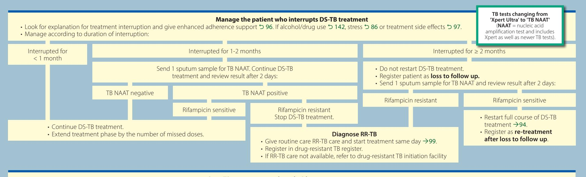

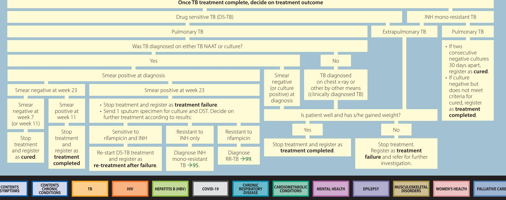

### **RIFAMPICIN-RESISTANT TB (RR-TB): ROUTINE CARE**

 RR-TB refers to TB that is resistant to rifampicin, with or without resistance to other TB medications. If patient has INH mono-resistant TB [95](#page-91-0).

**•If RR-TB care not available, refer to closest drug-resistant TB unit.**

|                                              |                                                          | B/X DR for id d f re id, MT ete ctio sist e to iso niaz ass ays rap n o anc                                                                                                                                                                                                                                                                                                                                                                                                                                                                                                                                                                                                                                                                                                                                                                                                                                                                                                                                                                                                                                                                                                                                                                                                                                                                                                                                                                                                 |                                                                                           |  |  |  |  |
|----------------------------------------------|----------------------------------------------------------|--------------------------------------------------------------------------------------------------------------------------------------------------------------------------------------------------------------------------------------------------------------------------------------------------------------------------------------------------------------------------------------------------------------------------------------------------------------------------------------------------------------------------------------------------------------------------------------------------------------------------------------------------------------------------------------------------------------------------------------------------------------------------------------------------------------------------------------------------------------------------------------------------------------------------------------------------------------------------------------------------------------------------------------------------------------------------------------------------------------------------------------------------------------------------------------------------------------------------------------------------------------------------------------------------------------------------------------------------------------------------------------------------------------------------------------------------------------------------------------------------------------------------------|-------------------------------------------------------------------------------------------|--|--|--|--|
| As se ss                               | W he n t o a sse ss                       | No te                                                                                                                                                                                                                                                                                                                                                                                                                                                                                                                                                                                                                                                                                                                                                                                                                                                                                                                                                                                                                                                                                                                                                                                                                                                                                                                                                                                                                                                                                                                       | fluo olo ikac nd eth ide uin in a ion roq nes , am am |  |  |  |  |
| Reg istr ion at                     | Eve vis it ry                                   | de ls a d dat b h late lts Ent ien 's i iag is. Up iste ( E D R.w ) w it vis it. at t ta t st s utu at er p no s e r eg r e p m res u eve ry                                                                                                                                                                                                                                                                                                                                                                                                                                                                                                                                                                                                                                                                                                                                                                                                                                                                                                                                                                                                                                                                                                                                                                                                                                               |                                                                                           |  |  |  |  |
| Sy tom mp s                         | Eve vis it ry                                   | f re f fus fre f fn I ≥ 3 0, bre h les hi le t l kin bre hin les dro /co d, c hs b les h b loo d, n k st irat te at t re st o ine nt at 1 ta i ≥ sp ory ra s a r w a g, p rom use o g mu sc ws y n e ou g up p oo n s ec ess • , , 9 kne f a / leg f p de f co hin b loo d, c de fer l for l re iste mit ing ive ion 2. I iste iso i ica vie nt t a tte nt nt p ers vo or ne w w ea ss o rm , g ur g en ers ep s o ug g on s r re ra su rg w. du l im f n d he  d r d lts. Exp I im ing 173 iew L P A a D S T r ect t. ot g ra a p rov em en p rov , as ses s a ren ce an ev n esu • f st 1 to I i l l no im hs, d 2n d line L P A a d e de d p he ic D S T a d p N C A C dv ise im t a t 4 t t 1 st a xte ty t to p rov em en m on re q ues n n n no p n res en a on re scu e r eg en • |                                                                                           |  |  |  |  |
| A d he ren ce                    | Eve vis it ry                                   | for f re f m C hec k p d lini da ly (or day ly d ). at ien t is a tte ing i tre atm t int nt i ivin ica t ion n c c en on ap p o me ce g sup p o e s                                                                                                                                                                                                                                                                                                                                                                                                                                                                                                                                                                                                                                                                                                                                                                                                                                                                                                                                                                                                                                                                                                                                                                                                                              |                                                                                           |  |  |  |  |
| f fe S de i cts e          | Eve vis it ry                                   | k a bo de f fe f tr  ly de f fe f tr As i 105 Ma i int ion ut cts eat nt t cts eat nt t s e o me nag e p rom p as s e ar e c om mo n c au se o me err up • f in lera d 2/ for d bst l or fax dve dru for dr@ hp I ica ion P C A C N C A C ica ion itut ion Em i ion ( A D R ) ( 01 2 ) 84 2 7 6 0 9 / 10. to to t ent to t ct m t nce an y me , p res m e su a a rse g rea o a sa ra.o rg. za or •                                                                                                                                                                                                                                                                                                                                                                                                                                                                                                                                                                                                                                                                                                                               |                                                                                           |  |  |  |  |
| T B c tac ts on                  | At d iag is no s                          | f p 3 o f in f y As k i ien is a T B c de ien it h R R- T B. I hec k c 's L P A a d D S T r lts he lp de i de ien 's R R- T B t im at t tac t at t w tac t to at t tm t re on x p es, c on n esu c p rea en g en • dv hat l l B c 3 v he lini for B s /p A ise T is it t T ing ion t tac ts ent a on c c cre en rev •                                                                                                                                                                                                                                                                                                                                                                                                                                                                                                                                                                                                                                                                                                                                                                                                                                                                                                 |                                                                                           |  |  |  |  |
| ly lan Fam i nin p g       | Eve vis it ry                                   | dv d p du ds  f o b le c d t ha l bet do A ise i rin ien 's c ive 154 I n in j ive int to tre atm t, a at t tra t ect tra t av o reg na ncy g en sse ss p on cep ne e a on cep , no ne e o c ng e erv a we en ses • f p  I d p N C A C. Av d de lay hi le a nt 15 9 a t to i ing tre atm t, s tar t w it ing reg na n res en o en wa re sp on se. •                                                                                                                                                                                                                                                                                                                                                                                                                                                                                                                                                                                                                                                                                                                                                                                                                                               |                                                                                           |  |  |  |  |
| De ion p res s                   | Eve vis it ry                                   | he h, has ) fe lt do de d, ho les ) fe lt litt le lea do hin f y he  In t ien t: 1 r 2 int in ing ? I it 143 ast t at st o t to p m on p wn p res se p e s o ere r p sur e g s es e r ,                                                                                                                                                                                                                                                                                                                                                                                                                                                                                                                                                                                                                                                                                                                                                                                                                                                                                                                                                                                                                                                                                                                                                      |                                                                                           |  |  |  |  |
| lco ho l dru A / g use  | d hs At iag is, 4 m t no s on | 4/s f y  In t he has ) dru k ≥ dr ks ion 2 ) u d i l leg l dru r 3 ) m isu d p ip ion he d ica ion ? I 142 ast at ien t: 1 4 in t t ter t to p y ear p n ess se a g s o se res cr or ov er- -co un m e s es any , ,                                                                                                                                                                                                                                                                                                                                                                                                                                                                                                                                                                                                                                                                                                                                                                                                                                                                                                                                                                                                                                                                                               |                                                                                           |  |  |  |  |
| Pa l liat ive ca re           | f I de ter ior at ing                  | f p bre h les b le t l k u de d o fa ling lso de l liat  I ien i i i ivin ive 170 at t at t re st, tre atm t, a s a un a o w a na r en co ns r g g p a ca re                                                                                                                                                                                                                                                                                                                                                                                                                                                                                                                                                                                                                                                                                                                                                                                                                                                                                                                                                                                                                                                                                                                                                                                                                  |                                                                                           |  |  |  |  |
| ht ( 5 ) We ig B M I | Eve vis it ry                                   | ht d a d do f los ht d h s list /re fer f fer for l su Exp ig in o j I ing ig isc it ia I B M I < 18. 5, r it ion ect n t tm t a ust tre atm t tre atm t, tr ort we g a rea en n en ses we on en uss w p ec e nu a p p                                                                                                                                                                                                                                                                                                                                                                                                                                                                                                                                                                                                                                                                                                                                                                                                                                                                                                                                                                                                                                                                                                   |                                                                                           |  |  |  |  |
| B P                                       | d At iag is no s                          | f kno hy  f n hec k f ≥  I ion 13 3. I B P: i 0 / 9 0 13 2. ert ot, 14 wn p en s c                                                                                                                                                                                                                                                                                                                                                                                                                                                                                                                                                                                                                                                                                                                                                                                                                                                                                                                                                                                                                                                                                                                                                                                                                                                                                                                                                 |                                                                                           |  |  |  |  |

#### Check routine tests according to table and review results [100](#page-96-0):

| At d iag is no s                                                                                                                                                                                                                                                                                                                                                                                                                                                                                                                                                                                                                                                                                                                                                     | ks At 2 w ee                                                                                                             | ks d t he h ly At 4 w t ee an n m on                                                                                                                                                                                                                                                                                                                                                                                                                                                                                                                                                                                                                                                              | hs At 3 m t on                                                                                                 | hs At 6 m t on                                                                               | hs At 12 nt mo                                                                               | he Ot r                                                                                                                                                                                                                                                                                                                                                                                                                                                                                                                                                                                                   |
|-------------------------------------------------------------------------------------------------------------------------------------------------------------------------------------------------------------------------------------------------------------------------------------------------------------------------------------------------------------------------------------------------------------------------------------------------------------------------------------------------------------------------------------------------------------------------------------------------------------------------------------------------------------------------------------------------------------------------------------------------------------------------------------|-----------------------------------------------------------------------------------------------------------------------------------|------------------------------------------------------------------------------------------------------------------------------------------------------------------------------------------------------------------------------------------------------------------------------------------------------------------------------------------------------------------------------------------------------------------------------------------------------------------------------------------------------------------------------------------------------------------------------------------------------------------------------------------------------------------------------------------------------------------------------------|----------------------------------------------------------------------------------------------------------------------------|----------------------------------------------------------------------------------------------------------|----------------------------------------------------------------------------------------------------------|-----------------------------------------------------------------------------------------------------------------------------------------------------------------------------------------------------------------------------------------------------------------------------------------------------------------------------------------------------------------------------------------------------------------------------------------------------------------------------------------------------------------------------------------------------------------------------------------------------------------|
| for D R- B re f lex D S (sm ltu d d 1 s T T t ing 1st 2n utu est p m ear , cu re, an • line he ) L P A, ic D S T ty p no p hes E C G, t x- c ray • Vis ( Sn l len ha ) ion rt e c • Pre te st g na ncy •  H I V 110 • Fin k g luc ric g erp ose • d f fe l co F B C, i ia A L T, c inin ium ium T S H t t, t ota ren un rea e, p ss , m ag ne s • , f l loa d I H I V: C D4 ira , v • | f o l ine l i d: I n zo • d f fe l F B C, i ia t ren t co un | f p lm B: for B I T 1 s T utu u on ary p m • d c ltu mi cro sco p an re y u f o be da l lo faz I i ine im ine n q , c u • , f lo i in de lam i d: E C G mo x xa c or an f o l ine l i d: B C, d f fe l I F i ia t n zo ren • ( l len ha ) is ion Sn t, v rt co un e c f o ka d I i in: iom etr n a m c au y, • at inin ota ium ium cre e, p ss , m ag ne s |  H I V 110 • f o I n • h ion i de et am P A S: T S H or | C hes t x- ray • f I H I V: C D4 • , l loa d vir a |  H I V 110 • f I H I V: C D4 • , l loa d vir a | f o i ka in: bas line I n a m c e • d ( hea ) iom rin etr tes t au g y be da l d: On i ine st ce q u op p e • E C G h ly 3 m t on f l loa d h ly I H I V: vir 6 m t a on • f o h de I ion i P A S: t n e am or • T S H 3 h ly t m on f u l l: c hes I A L T, t x- nw e ray • , Cre K+, Mg at, |

#### **Review results [100](#page-96-0).**

1National Clinical Advisory Committee: NCAC@witshealth.co.za. 2Provinical Clinical Advisory Committee. 3A TB contact refers to a patient who shared an enclosed space (at work, socially, in a hostel, or in a household setting), for ≥ 1 night or for frequent/extended daytime periods, with an adult/adolescent with pulmonary TB ("index patient"), during the 3-month period before the index patient started their TB treatment. 4One drink is 1 tot of spirits, or 1 small glass (125mL) of wine or 1 can/bottle (330mL) of beer. 5BMI = weight (kg) ÷ height (m) ÷ height (m).

### **Assess the patient with RR-TB**

 **If newly diagnosed with RR-TB or pre-XDR TB:** if pretomanid available, consult the updated 'Clinical Management of RR-TB, September 2023' guideline to start patient on new short 6-mth BPaLL (or BPaL if pre-XDR) regimen.

**Note:** 1st and 2nd LPA tests are being replaced with Xpert

| iew lts d m d ing ly Re te st v res u an an ag e a cco r :                                                                                                                                                                                                                                                                                                                                                                                                                                                                                                                                                                                                                                                                                                                                                                                                                                                                                                                                                                                                                                                                                                                                                                                                                            |                                                                                                                                                                                                                                                                                                                                                                                                                                                                                                                                                                                                                                                                                                                                                                                                                                                                                                                                                                                                                                                                                                                                                                                                                                                                                                                                                                                                                                                                                                                                                                                                                                                                                                                                                                                                                                                                                                                                                                                                                                                                                                                                                      |  |  |  |  |  |
|---------------------------------------------------------------------------------------------------------------------------------------------------------------------------------------------------------------------------------------------------------------------------------------------------------------------------------------------------------------------------------------------------------------------------------------------------------------------------------------------------------------------------------------------------------------------------------------------------------------------------------------------------------------------------------------------------------------------------------------------------------------------------------------------------------------------------------------------------------------------------------------------------------------------------------------------------------------------------------------------------------------------------------------------------------------------------------------------------------------------------------------------------------------------------------------------------------------------------------------------------------------------------------------------------------------------------------------------|------------------------------------------------------------------------------------------------------------------------------------------------------------------------------------------------------------------------------------------------------------------------------------------------------------------------------------------------------------------------------------------------------------------------------------------------------------------------------------------------------------------------------------------------------------------------------------------------------------------------------------------------------------------------------------------------------------------------------------------------------------------------------------------------------------------------------------------------------------------------------------------------------------------------------------------------------------------------------------------------------------------------------------------------------------------------------------------------------------------------------------------------------------------------------------------------------------------------------------------------------------------------------------------------------------------------------------------------------------------------------------------------------------------------------------------------------------------------------------------------------------------------------------------------------------------------------------------------------------------------------------------------------------------------------------------------------------------------------------------------------------------------------------------------------------------------------------------------------------------------------------------------------------------------------------------------------------------------------------------------------------------------------------------------------------------------------------------------------------------------------------------------------|--|--|--|--|--|
| As se ss                                                                                                                                                                                                                                                                                                                                                                                                                                                                                                                                                                                                                                                                                                                                                                                                                                                                                                                                                                                                                                                                                                                                                                                                                                                                                                                              | No te                                                                                                                                                                                                                                                                                                                                                                                                                                                                                                                                                                                                                                                                                                                                                                                                                                                                                                                                                                                                                                                                                                                                                                                                                                                                                                                                                                                                                                                                                                                                                                                                                                                                                                                                                                                                                                                                                                                                                                                                                                                                                                                                             |  |  |  |  |  |
| T B m (sm ) a d c ltu icro sco p y ear n u re                                                                                                                                                                                                                                                                                                                                                                                                                                                                                                                                                                                                                                                                                                                                                                                                                                                                                                                                                                                                                                                                                                                                                                                                                                                        | f m h 4 /cu ltu /cu ltu be fte be d he  l l p lts d r d e de d I it ive it ive ing ive 173 vie iou L P A a t at utu t xte on sm ear re p os or sm ear re co me s p os a r ne g : as ses s a ren ce , re w a rev s s p m res u an eq ues n n he late ltu b le t dv de fer l for l as ic D S T o it ive im Pre N C A C a i ise im Co i ica ty st c t to t. p no p n u re p os sp ec en sen s so on as p oss o a on re scu e r eg en ns r re ra su rg ses sm en                                                                                                                                                                                                                                                                                                                                                                                                                                                                                                                                                                                                                                                                                                                                                                                                                                                                                                                                                                                                                                                                                                                                                                                                                                                             |  |  |  |  |  |
| L P A a d D S T r lts ( dru n esu g b lity ) i i t sus cep                                                                                                                                                                                                                                                                                                                                                                                                                                                                                                                                                                                                                                                                                                                                                                                                                                                                                                                                                                                                                                                                                                                                                                                                                      | d d line L P A w l l be do he f lex D S T t d a d 1st 2n i est ing is te t iag is: an ne w n r e req ues no s • f he l l be l ly d by la bo I L P A i it ive I N H, I N H p ic D S T w i ica to ty aut at tes te rat s se ns no p om ory - f f lu lon f lu lon he l l be l ly d by la bo I L P A i it ive ino ino ic D S T w i ica to ty aut at tes te rat s se ns oro q u es, oro q u e p no p om ory - f f lu I L P A i lon b les bo h in h A a d kat G m d line he D S T w l l be l ly d by la bo ista nt to ino inj ect t uta t ion t, 2n ty ic i aut at ica tes te rat s re s oro q u es or a , o r n s p res en p no p om ory -                                                                                                                                                                                                                                                                                                                                                                                                                                                                                                                                                                                                                                                                                                                                                                                                                                                                      |  |  |  |  |  |
| C hes t x- ray                                                                                                                                                                                                                                                                                                                                                                                                                                                                                                                                                                                                                                                                                                                                                                                                                                                                                                                                                                                                                                                                                                                                                                                                                                                                                                                     | I f c hes de d h s list ite isc it ia t x- tre atm t, ray wo rse sp en uss w p ec                                                                                                                                                                                                                                                                                                                                                                                                                                                                                                                                                                                                                                                                                                                                                                                                                                                                                                                                                                                                                                                                                                                                                                                                                                                                                                                                                                                                                                                                                                                                                                                                                                                                                                                                                                                                                                                                                                                                                                                               |  |  |  |  |  |
| C G E                                                                                                                                                                                                                                                                                                                                                                                                                                                                                                                                                                                                                                                                                                                                                                                                                                                                                                                                                                                                                                                                                                                                                                                                                                                                                                                                 | Ca lcu late Q 1. f ≥ Tc F I 45 0m s: f sy (c hes lp d fa ), d h s list fer ho l sa day I in, itat ion izz ine int isc it ia ita tom t p to mp s a p a s, ss o r ne ss uss p ec or re sp me w • f n I tom o s y mp s: • f Q d r C G m I Tc F < 47 0m inu ine E ito rin t e t tm t a t s: c on rea en n ou on g. - f day f irm hec k p d d t f a bn l. hec k for d hat lon l 2 a d d I Q Tc F 4 70- 49 9m E C G a C ium ium T S H a i C ica ion Q T i isc eat t re st s to ota t t s t nte s: r ep am e co n ss , m ag ne s an n rea orm a m e p ro g rva n uss - h e d do list k ly l < wit ien T B ia Re E C G w i 0m cto eat t 47 xp er ce r o r sp ec p ee un s. I f Q Tc F ≥ E C G a day f irm C hec k p d T S H a d t f a bn l. Sto l l m d hat lon Q T i l 2 in lu d R R- T B 5 0 0m ium ium i ica ion ing eat t re st s to ota t t s t nte s: r ep am e co n ss , m ag ne s an n rea orm a p a e p ro g rva c - d (m f lo de lam d, c lo faz be da line ). h e d do list day ica ion i in, i im ine i D isc it ien T B ia t cto me s ox xac an q uss xp er ce r o r sp ec sa me u w , |  |  |  |  |  |
| d ( hea ) Au iom rin etr tes t g y                                                                                                                                                                                                                                                                                                                                                                                                                                                                                                                                                                                                                                                                                                                                                                                                                                                                                                                                                                                                                                                                                                                                                                                                                                                                         | f o kac d a ha hea kac d d b le m d bst 3 w h I mi in a rin i in a isc i ica ion itu ion it P C A C / N C A C. to sto t t n a n ny c ng es g, p am n uss p oss e su s                                                                                                                                                                                                                                                                                                                                                                                                                                                                                                                                                                                                                                                                                                                                                                                                                                                                                                                                                                                                                                                                                                                                                                                                                                                                                                                                                                                                                                                                                                                                                                                                                                                                                                                                                                                                           |  |  |  |  |  |
| Vis ion                                                                                                                                                                                                                                                                                                                                                                                                                                                                                                                                                                                                                                                                                                                                                                                                                                                                                                                                                                                                                                                                                                                                                                                                                                                                                                                                  | f a ha l ac line li d a d e ha bu l an d r fer list day b le m d bst 3 w h I in v isu ity, ia D isc i ica ion itu ion it P C A C / N C A C. sto t to to t t ny c ng e a p zo n m e ey e s p ec sa me uss p oss e su s u                                                                                                                                                                                                                                                                                                                                                                                                                                                                                                                                                                                                                                                                                                                                                                                                                                                                                                                                                                                                                                                                                                                                                                                                                                                                                                                                                                                                                                                                                                                                                                                                                                                                                                            |  |  |  |  |  |
| Pre te st g na ncy                                                                                                                                                                                                                                                                                                                                                                                                                                                                                                                                                                                                                                                                                                                                                                                                                                                                                                                                                                                                                                                                                                                                                                                                                                                                                                           |  I f p d p N C A C. Av d de lay hi le a 15 9 a i ing it ing nt t to tre atm t, s tar t w reg na n res en o en wa re sp on se.                                                                                                                                                                                                                                                                                                                                                                                                                                                                                                                                                                                                                                                                                                                                                                                                                                                                                                                                                                                                                                                                                                                                                                                                                                                                                                                                                                                                                                                                                                                                                                                                                                                                                                                                                                                                                                                                                                     |  |  |  |  |  |
| luc G ose                                                                                                                                                                                                                                                                                                                                                                                                                                                                                                                                                                                                                                                                                                                                                                                                                                                                                                                                                                                                                                                                                                                                                                                                                                                                                                                             | f kno d bet luc l m fte  f n kno h d bet hec k g luc  I ia 13 0. I it ia ntr ot 17. wn es, as ses s g ose co o ore o n wn w es, c ose                                                                                                                                                                                                                                                                                                                                                                                                                                                                                                                                                                                                                                                                                                                                                                                                                                                                                                                                                                                                                                                                                                                                                                                                                                                                                                                                                                                                                                                                                                                                                                                                                                                                                                                                                                                                                                                                                |  |  |  |  |  |
| H I V                                                                                                                                                                                                                                                                                                                                                                                                                                                                                                                                                                                                                                                                                                                                                                                                                                                                                                                                                                                                                                                                                                                                                                                                                                                                                                                                 | f  f o hec k i f ds d  f n  I H I V p it ive ive ine 11 1. I A R T, c A R T r im j ing 10 1. I A R T, s 10 1. ut ust ot tar t o sta rt os , g ro ca re n eg en nee a on r re -re                                                                                                                                                                                                                                                                                                                                                                                                                                                                                                                                                                                                                                                                                                                                                                                                                                                                                                                                                                                                                                                                                                                                                                                                                                                                                                                                                                                                                                                                                                                                                                                                                                                                                                                                                                                    |  |  |  |  |  |
| d d f fe l co F B C a i ia t t n ren un                                                                                                                                                                                                                                                                                                                                                                                                                                                                                                                                                                                                                                                                                                                                                                                                                                                                                                                                                                                                                                                                                                                                                                                                                                                           | f b < hi ls < late lets line li d a d d h fer for dm I H 8, 0.7 5 o 5 0, s isc it P C A C / N C A C o iss ion utr top ne op r p < zo n uss r re a w                                                                                                                                                                                                                                                                                                                                                                                                                                                                                                                                                                                                                                                                                                                                                                                                                                                                                                                                                                                                                                                                                                                                                                                                                                                                                                                                                                                                                                                                                                                                                                                                                                                                                                                                                                                                                                                        |  |  |  |  |  |
| A L T                                                                                                                                                                                                                                                                                                                                                                                                                                                                                                                                                                                                                                                                                                                                                                                                                                                                                                                                                                                                                                                                                                                                                                                                                                                                                                                                 | f d l l m d d r fer day I A L T ≥ 20 0 o r j ice ica ion top t au n , s a e s a n e sa me • f f sy b do l p  I A L T 5 0-1 9 9: i (na /vo mit ing /a mi in ) 105 tom mp s use a na a • f n d d m for f lso k ly l < I inu ica ion ito I A L T 1 20- 19 9, a A L T w i 120 tom t t tom eat t o s y mp s: c on e m e s a n on r sy mp s. re p ee un -                                                                                                                                                                                                                                                                                                                                                                                                                                                                                                                                                                                                                                                                                                                                                                                                                                                                                                                                                                                                                                                                                                                                                                                                                                                                                                                                                                                                                                                 |  |  |  |  |  |
| Cre (e G ) inin F R at e                                                                                                                                                                                                                                                                                                                                                                                                                                                                                                                                                                                                                                                                                                                                                                                                                                                                                                                                                                                                                                                                                                                                                                                                                                                                                            | f e G d a kac f o kac kac d d b le m d bst 3 w h C C / C C. I F R ≤ 5 0, a i mi in. I mi in, i in a isc i ica ion itu ion it P A N A sto t t vo n a p am n uss p oss e su s                                                                                                                                                                                                                                                                                                                                                                                                                                                                                                                                                                                                                                                                                                                                                                                                                                                                                                                                                                                                                                                                                                                                                                                                                                                                                                                                                                                                                                                                                                                                                                                                                                                                                                                                                                                               |  |  |  |  |  |
| Pot ium ass                                                                                                                                                                                                                                                                                                                                                                                                                                                                                                                                                                                                                                                                                                                                                                                                                                                                                                                                                                                                                                                                                                                                                                                                                                                                                                                           | f p fer day I ium 2.5 ota ≤ ss , re sa me • f p do I ium 2. 6- 3.5 E C G: ota ss • , f a f p fer I hy hm E C G o has le w kne day t ia o r i at ien t mit ing ny arr n m usc ea ss o r vo , re sa me - f n he h lor de b lets ho ly d r hin k. d lt. I it ive ium i 2 t 12 ium it 1 w Ma in a ing ota eat ota to e r, g p ss c a ur an ep p ss w ee nag e a g a cco r re su -                                                                                                                                                                                                                                                                                                                                                                                                                                                                                                                                                                                                                                                                                                                                                                                                                                                                                                                                                                                                                                                                                                                                                                                                                                                                                                                                                                                                                        |  |  |  |  |  |
| Ma ium g ne s                                                                                                                                                                                                                                                                                                                                                                                                                                                                                                                                                                                                                                                                                                                                                                                                                                                                                                                                                                                                                                                                                                                                                                                                                                                                                                                   | f m h lor de l ly ho ly for h. f < fer for I ium 0. 6, g ive ium i 5 0 0-1 0 0 0m 12 1 I 0.4 I V m ium nt < ag ne s m ag ne s c g ora ur mo , re ag ne s                                                                                                                                                                                                                                                                                                                                                                                                                                                                                                                                                                                                                                                                                                                                                                                                                                                                                                                                                                                                                                                                                                                                                                                                                                                                                                                                                                                                                                                                                                                                                                                                                                                                                                                                                                                                                                       |  |  |  |  |  |
| ( hy d fun ) T S H i ion t ct ro                                                                                                                                                                                                                                                                                                                                                                                                                                                                                                                                                                                                                                                                                                                                                                                                                                                                                                                                                                                                                                                                                                                                                                                                                                                                        | f d, c hec k f low hy hy d li ke ly I T S H r ise F T4 I F T4 i ism ot a p ro : , lev hy da ly d r d fte hs, les G ive ine 10 0m i T S H a F T4 r 2 ot eat nt rox cg an ep n a mo un s: • I f ≥ d lev hy ine da ly d r T S H a d F T4 fte h. 6 0 y ive in ot 5 0m i r 1 ste eat nt ear s: g a rox cg an ep n a mo - f kno hae hea d d lev hy da ly d r d fte h. I isc mi ise ive in ine 25 i T S H a F T4 r 1 rt ste ot eat nt wn c ase : g a rox mc g an ep n a mo - f re l l low lev hy by ks l hin l ra I F T4 i inc ine 25 i F T4 wit eat st ot 4 w t p rea se rox mc g eve ry ee un no rm a ng e. • , On R R- T B t lete d, c lev hy for hs, he hi le c T S H a d F T4 tm t c t inu ot ine 2- 3 m t t t inu ing to ito ce rea en om p on e rox on n w ean w on m on r n •                                                                                                                                                                                                                                                                                                                                                                                                                                                                                                                                                                                               |  |  |  |  |  |
| inu iew lts  Co 10 1. nt e t o r ev re su                                                                                                                                                                                                                                                                                                                                                                                                                                                                                                                                                                                                                                                                                                                                                                                                                                                                                                                                                                                                                                                                                                                                                                                                                                                              |                                                                                                                                                                                                                                                                                                                                                                                                                                                                                                                                                                                                                                                                                                                                                                                                                                                                                                                                                                                                                                                                                                                                                                                                                                                                                                                                                                                                                                                                                                                                                                                                                                                                                                                                                                                                                                                                                                                                                                                                                                                                                                                                                      |  |  |  |  |  |
| for for 0.33. 2M 1QT CF is Q T in val ted he line lcu lato r ( Frid eric ia's la) be sed via ht ://w .md cal m/ ted t-in val lcu late lly: QTc F = QT /(6 0/h te) edi ion s th lon QT inte l ter art rate tps ter tc o t ra cat at m co rrec : on ca mu can ac ces ww c.co cor rec -q -q r ca ma nua ear ay pro g rva lud hy thm (e.g iod ne) hot (e.g ha lop erid ol), lide tib cs ( thr hro lari thr in), flu lon ntib cs ( rofl lev oflo xifl ) an d a ntif al d s (e inc nti- ics ics ioti in, azit cin ino ioti cip cin in, cin e: a arr am aro , ps yc rop ma cro an e.g ery om yc my , c om yc oro qu e a e.g oxa xac mo oxa ung rug .g , fluc zol ket ole ). 3Co oth edi hile se f PC AC /NC AC ntin cat ion aiti ona e, oco naz ue er m s w aw ng res pon rom |                                                                                                                                                                                                                                                                                                                                                                                                                                                                                                                                                                                                                                                                                                                                                                                                                                                                                                                                                                                                                                                                                                                                                                                                                                                                                                                                                                                                                                                                                                                                                                                                                                                                                                                                                                                                                                                                                                                                                                                                                                                                                                                                                      |  |  |  |  |  |

**[HIV](#page-102-0) [CHRONIC RESPIRATORY DISEASE](#page-119-0) [CARDIOMETABOLIC CONDITIONS](#page-123-0) [MUSCULOSKELETAL DISORDERS](#page-147-0) [MENTAL HEALTH](#page-136-0) [EPILEPSY](#page-145-0) [WOMEN'S HEALTH](#page-150-0) [PALLIATIVE CARE](#page-166-0)**

**[HEPATITIS B \(HBV\)](#page-116-0) [COVID-19](#page-117-0)**

**[TB](#page-85-0)**

**CONTENTS SYMPTOMSCONTENTS CHRONIC CONDITIONS**

**100**

| C D4                   | 1 C D4 de le p he ( C P ), s b le Use i im ive T 13. to -tr t t ta g u co oxa zo rev en rap y ee                                                                                                                                   |
|---------------------------|-------------------------------------------------------------------------------------------------------------------------------------------------------------------------------------------------------------------------------------------------------------------------------------------------------------------------------------|
| l loa d Vir a | f I V L < 5 0, c inu A R T. t on e • f  I V L ≥ d he A R T d d h e d T B do list 5 0, a to 173 isc it ien cto ia sse ss a ren ce an uss w xp er ce r o r sp ec • |

### **Advise the patient with RR-TB**

- Provide RR-TB counselling and arrange community health worker home visit. Refer to support group if available.
- Explain that duration of treatment will depend on previous treatment, site of disease and extent of drug resistance. Duration may need to be extended depending on response to treatment.
- •Educate on the importance of adherence [173](#page-169-0) and dangers of further resistance. Educate about treatment side effects [105](#page-101-0), and advise to return promptly should they occur.
- Educate about infection control: cough hygiene, adequate ventilation/open windows, avoid close contact with children/those with HIV. Give surgical mask for use in poorly ventilated areas. Advise to avoid sharing a bedroom if possible.
- •Advise that TB contacts1 need to visit the clinic for TB screening/prevention.
- If pulmonary TB, advise to return to work only when culture conversion2 occurs.
- Alert to the risks of smoking [141](#page-137-0) and alcohol/drugs and support patient to change [177](#page-173-0). If patient chooses to continue, advise safe alcohol use [142](#page-138-0) and to continue taking TB medication daily.

### **Treat the patient with RR-TB**

- •Give pyridoxine 50mg daily until TB treatment completed.
- Ensure COVID-19 vaccination is up to date.

### **If not on RR-TB treatment:**

- Start treatment using steps 1-3 [102](#page-98-0).
- **Shorter** regimen is 9-11 months treatment (4-6 months intensive and 5 months continuation phase).
- **Longer** regimen is 18-20 months treatment (6-8 months intensive and 12 months continuation phase).
- If unsure of initial regimen choice, discuss with PCAC/NCAC.

### **If on RR-TB treatment:**

- Check outstanding LPA and DST results3 and adjust regimen using step 2 [102](#page-98-0).
- If patient has gained weight, check if medication doses need adjusting [104](#page-100-0).

### Decide when to change intensive phase to continuation phase:

- If on shorter regimen: decide at end of month 4 [103](#page-99-0).
- If on longer regimen: decide at end of month 6 [103](#page-99-0).

### **Treat the patient with RR-TB and HIV**

Avoid EFV while on bedaquiline and AZT while on linezolid. Choose ART regimens according to the following scenarios:

### **Already on ART**

If already on ART when RR-TB treatment started, check if ART regimen needs changing according to latest viral load results [112](#page-108-0).

### **Starting ART**

If starting ART after RR-TB treatment has been started, decide when to start ART [115](#page-111-0).

### **Re-starting ART after ART interruption**

Provide adherence support [173](#page-169-0). Choose most appropriate ART regimen to re-start [114](#page-110-0).

 Then choose most appropriate ART regimen: ideally choose TLD (TDF + 3TC + DTG). If eGFR < 50, choose instead ABC + 3TC + DTG.

### **ABC** – abacavir; **TDF** – tenofovir; **3TC** – lamivudine; **TLD** – tenofovir + lamivudine + dolutegravir

### **Review the patient with RR-TB**

- •Assess patient at diagnosis, 2 weeks, 4 weeks and then monthly. Review sooner if not improving or any problems.
- Once RR-TB treatment complete, follow up 6 monthly (or earlier if any symptoms recur) for 2 years: at each visit check symptoms, do chest x-ray and send sputum for TB microscopy and culture.

### **Decide when to stop RR-TB treatment**

- If on shorter regimen: stop treatment 5 months after changing to continuation phase if patient well and cultures remain negative. If unwell or cultures become positive, present to NCAC.
- •If on longer regimen: stop treatment 12 months after changing to continuation phase if patient well and cultures remain negative. If unwell or cultures become positive, present to NCAC.
- Record treatment outcome [103](#page-99-0).

1A TB contact refers to a patient who shared an enclosed space (at work, socially, in a hostel, or in a household setting), for ≥ 1 night or for frequent/extended daytime periods, with an adult/adolescent with pulmonary TB ("index patient"), during the 3-month period before the index patient started their TB treatment. 2Culture conversion: 2 consecutive negative culture results one month apart. 2If sample contaminated/inadequate/leaked or LPA results inconclusive, send another sample to laboratory.

### **How to start/adjust RR-TB treatment**

**ABC** – abacavir; **AZT** – zidovudine; **BDQ** – bedaquiline; **CFZ** – clofazimine; **DTG** – dolutegravir; **EFV** – efavirenz; **FLQ** – fluoroquinolone; **FTC** - emtricitabine; **LPVr** – lopinavir/ritonavir; **LZD** – linezolid; **TDF** – tenofovir; **3TC** - lamivudine

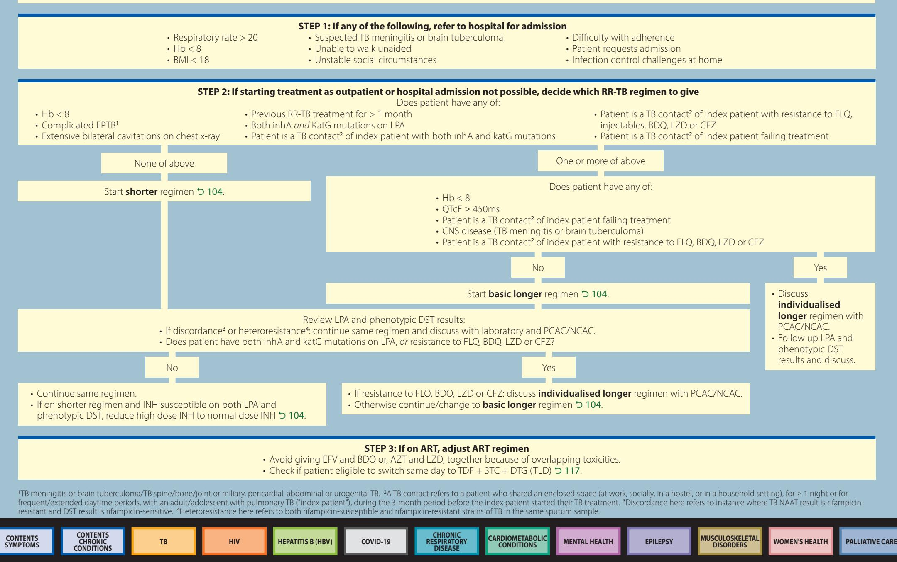

### **Decide when to change intensive phase to continuation phase**

#### **•If patient on shorter regimen:**

| f m At d o h 4 lin l co d d c he k s lts: t ica it ion utu en on , as ses s c n an c p m res u                                                                                                                                                                                                                                                                                                                                                                                                                                                                                                                                                                                                                          |                                                                                                                                                                                                                                                                                                                                                                                                                                                                                                                                                                                                                                                                                                                                                                                 |                                                                                                                                                                                                                                                                                                                                                                                                                     |                                                                                                                                                                                                                                                                                                                                                                                                                                               |                            |  |  |  |
|----------------------------------------------------------------------------------------------------------------------------------------------------------------------------------------------------------------------------------------------------------------------------------------------------------------------------------------------------------------------------------------------------------------------------------------------------------------------------------------------------------------------------------------------------------------------------------------------------------------------------------------------------------------------------------------------------------------------------------------------------------------------------------------------------------|---------------------------------------------------------------------------------------------------------------------------------------------------------------------------------------------------------------------------------------------------------------------------------------------------------------------------------------------------------------------------------------------------------------------------------------------------------------------------------------------------------------------------------------------------------------------------------------------------------------------------------------------------------------------------------------------------------------------------------------------------------------------------------|---------------------------------------------------------------------------------------------------------------------------------------------------------------------------------------------------------------------------------------------------------------------------------------------------------------------------------------------------------------------------------------------------------------------|-----------------------------------------------------------------------------------------------------------------------------------------------------------------------------------------------------------------------------------------------------------------------------------------------------------------------------------------------------------------------------------------------------------------------------------------------|----------------------------|--|--|--|
| h 4 Mo ive nt at sm ea r n eg                                                                                                                                                                                                                                                                                                                                                                                                                                                                                                                                                                                                                                                                                                                                                    |                                                                                                                                                                                                                                                                                                                                                                                                                                                                                                                                                                                                                                                                                                                                                                                 | h 4 Mo it ive nt sm ea r p os                                                                                                                                                                                                                                                                                                                                                               |                                                                                                                                                                                                                                                                                                                                                                                                                                               |                            |  |  |  |
| lin l ly C ica im ing p rov                                                                                                                                                                                                                                                                                                                                                                                                                                                                                                                                                                                                                                                                                                                                                      | lin l ly C ica im ing t no p rov                                                                                                                                                                                                                                                                                                                                                                                                                                                                                                                                                                                                                                                                                                                  |                                                                                                                                                                                                                                                                                                                                                                                                                     |                                                                                                                                                                                                                                                                                                                                                                                                                                               |                            |  |  |  |
| ha ha for hs C inu ion 5 e t t at nt ng o c on p se mo Se lec d d d do d t m ica t ion ing to im ing to e s a cco r re g en an se acc or •  ht ig 10 4. we be da lin for lea hs. En i ive 6 m at st t su re q e g n on u • f s I low lin l re b lat l ca he ica ten ive i vit at ion st c sp on se, ex s era s o n c - f lu lon f irm d, de ino it ivit i t c x-r ay or oro q u e s en s y no on e co ns r |  f fe  As d he d s de 17 3 a i cts 10 5. ses s a ren ce n e • Op f c hro d f  f d be  f hy  im ise nic it ion i H I V 11 1, i ia 13 0, i ion 13 3. t t o tes ert m an ag em en co n s: p en s • l l p lts. d d lin d e de d p he lat ltu Re vie iou Re 1st 2n L P A a ic D S T o utu st xte ty est w a rev s s p m res u q ue an e n n no p n cu re • it ive im p os sp ec en |                                                                                                                                                                                                                                                                                                                                                                                                                     |                                                                                                                                                                                                                                                                                                                                                                                                                                               |                            |  |  |  |
| d be da lin hs: ing i 9 m P C A C / N C A C. ext e t t t to en q o on p res en u lon I ien im at t o                                                                                                                                                                                                                                                                                                                                                                                                                                                                                                                                                                                               | Pre P C C. A t to sen • d ha hs d be da lin hs. Ext int ive 6 m i 9 m to t e t t en en s p se on an q o on u •                                                                                                                                                                                                                                                                                                                                                                                                                                                                                                                                                   |                                                                                                                                                                                                                                                                                                                                                                                                                     |                                                                                                                                                                                                                                                                                                                                                                                                                                               |                            |  |  |  |
| f p n g er reg en : • d o f m h 6 lin l co d d c he k s lts: At ica it ion t utu en on , as ses s c n an c p m res u                                                                                                                                                                                                                                                                                                                                                                                                                                                                                                                                                                            |                                                                                                                                                                                                                                                                                                                                                                                                                                                                                                                                                                                                                                                                                                                                                                                 |                                                                                                                                                                                                                                                                                                                                                                                                                     |                                                                                                                                                                                                                                                                                                                                                                                                                                               |                            |  |  |  |
| h 4 ltu Mo ive nt at cu re ne g                                                                                                                                                                                                                                                                                                                                                                                                                                                                                                                                                                                                                                                                                                                                               |                                                                                                                                                                                                                                                                                                                                                                                                                                                                                                                                                                                                                                                                                                                                                                                 |                                                                                                                                                                                                                                                                                                                                                                                                                     | h 4 ltu Mo nt cu                                                                                                                                                                                                                                                                                                                                                                                                                  | it ive re p os |  |  |  |
| f: Are he t re an y o 1 S low lin l re F luo lon ica ino c sp on se roq u • • b lat l ca he f irm d Ext ive i vit ion at st x t c en s era s o n c -ra y no on e •                                                                                                                                                                                                                                                                                                                                                                                                                                                                              | it ivit e s en s y                                                                                                                                                                                                                                                                                                                                                                                                                                                                                                                                                                                                                                                                                                                                               | d he  d s de f fe  As 17 3 a i 10 5. cts ses s a ren ce n e • f c hro d f  Op im ise nic it ion i H I V 11 1, t t o m an ag em en co n s: • f  f  d be hy i ia tes 13 0, i ert ion 13 3. p en s |                                                                                                                                                                                                                                                                                                                                                                                                                                               |                            |  |  |  |
| No Ye s ha inu ion ha fo hs de d C r 1 2 m Co i ing in ive e t t at t xte ten ng o c on p se on ns r e n s Se lec d d ha 8 m hs d B D Q t m ica t ion ing to im to t to e s a cco r re g en p se on an  d do d ht hs: P C C / C C. ing ig 10 4. 9 m A N A to t t to an se acc or w e on p res en                                                                                                                                                                                               |                                                                                                                                                                                                                                                                                                                                                                                                                                                                                                                                                                                                                                                                                                                                                                                 |                                                                                                                                                                                                                                                                                                                                                                                                                     | de b le t fa lur Co i i i tm t ns r p oss rea en e de d ha hs d hs, Co i ing in ive 8 m B D Q 9 m xte ten to t to t ns r e n s p se on an on ha P C A C / N C A C. ing to im t to or c ng re scu e r eg en : p res en |                            |  |  |  |
|                                                                                                                                                                                                                                                                                                                                                                                                                                                                                                                                                                                                                                                                                                                                                                                                          |                                                                                                                                                                                                                                                                                                                                                                                                                                                                                                                                                                                                                                                                                                                                                                                 |                                                                                                                                                                                                                                                                                                                                                                                                                     |                                                                                                                                                                                                                                                                                                                                                                                                                                               |                            |  |  |  |

### **Decide on treatment outcome**

**Record treatment outcome based on culture conversion, number of consecutive negative cultures, duration of minimum treatment and clinical status.** 

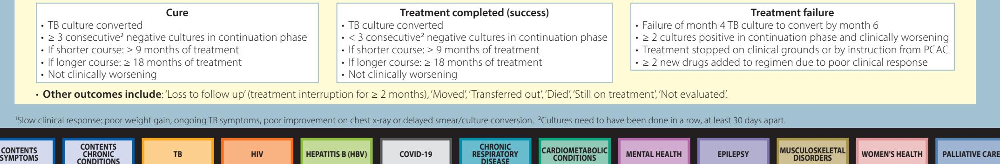

| ha Re im Int ive g en en s p                                                                                                                                                                                                                                                                                                                                                                                                                                                                                         |                                                                                                                                                         |                                                                                                    |                                                                                                  |                                                                                                                                                                           |                                                                                                                                                                                                                                                                                                                | ha Co inu ion nt at p se                                                                                                                                                                              |                                                                                                                                                                                                                                                                       |
|-------------------------------------------------------------------------------------------------------------------------------------------------------------------------------------------------------------------------------------------------------------------------------------------------------------------------------------------------------------------------------------------------------------------------------------------------------------------------------------------------------------------------------------------------|---------------------------------------------------------------------------------------------------------------------------------------------------------|----------------------------------------------------------------------------------------------------|--------------------------------------------------------------------------------------------------|---------------------------------------------------------------------------------------------------------------------------------------------------------------------------|----------------------------------------------------------------------------------------------------------------------------------------------------------------------------------------------------------------------------------------------------------------------------------------------------------------|----------------------------------------------------------------------------------------------------------------------------------------------------------------------------------------------------------------------------|-----------------------------------------------------------------------------------------------------------------------------------------------------------------------------------------------------------------------------------------------------------------------|
| S ho im rte r re g en                                                                                                                                                                                                                                                                                                                                                                                                                                                                                                         |                                                                                                                                                         |                                                                                                    | Be • Lin • Lev • C lo •                                                  | da line (a lea i t st 6 m q u li d ( hs ly ) 2 m t ezo on on f lo in o xac faz im ine | hs ) Hig h do d 1 t iso nia zi on se • de Py ina mi raz • ha bu l Et to m •                                                                                                                                                      | for Be da line ( i 6 nt q u mo • f lo Lev in o xac • lo faz C im ine •                                                                             | hs l ) Py de in t ota ina mi raz • ha bu l Et to m •                                                                                                                                                               |
| im Lo ng er reg en his lon for T im is g er reg en un co mp d d f a f: isc in i ste uss a ny o b < H 8 • d ( bra C N S ise T B m ing it is o ase en r • Res ista F L Q, B D Q, L Z D o C to nce r • Pat T B c 2 o f in de ien is a t tac t on x p • fa ling i tre atm t en | lica d c ho te ase s a s c be lom ) in t rcu a u F Z h r ien it ista at t w es nce |  in 2 10 2. ste sen p F L Q, B D Q, L Z D o to | Be • d a d Av i Lin o n • Lev • C F Z o r r      | da line i q u li d ezo f lo in o xac                                                                                                  | C lo faz im ine • do Ter izi ne •                                                                                                                                                                                                                                                | f lo Lev in o xac • lo faz C im ine • Ter izi do ne •                                                                                                                   | he h No tie wit te: e t nt m an ag pa                                                                                                                                                                                                |
|                                                                                                                                                                                                                                                                                                                                                                                                                                                                                                                                                 |                                                                                                                                                         |                                                                                                    | Do R R- se                                                                              | T B m d ica ion t e s a                                                                                                                              | d ing ig ht to cco r w e                                                                                                                                                                                                                                                               |                                                                                                                                                                                                                            | a h eal th fac ility th RR- TB at at has liab le a o R R-T B ss t re cce dic ati nd ito rin                                                                                                      |
| Me d ica ion t                                                                                                                                                                                                                                                                                                                                                                                                                                                                                                                      | Da i ly do se                                                                                                                               |                                                                                                    |                                                                                                  |                                                                                                                                                                           | No te                                                                                                                                                                                                                                                                                                       |                                                                                                                                                                                                                            | me on s a m on g uip ilab le. nt eq me ava                                                                                                                                                                                        |
|                                                                                                                                                                                                                                                                                                                                                                                                                                                                                                                                                 | kg 3 0- 35                                                                                                                                     | kg 3 6-4 5                                                                                | kg 46 -70                                                                                  | kg > 7 0                                                                                                                                                            |                                                                                                                                                                                                                                                                                                                |                                                                                                                                                                                                                            |                                                                                                                                                                                                                                                                       |
| da l Be i ine ( B D Q ) q u                                                                                                                                                                                                                                                                                                                                                                                                                                                                                    | da ly for f 40 0m i g • T he day n 2 0 0m 3 g •                                                      | irs ks 2 w t ee k ( Mo / We s a we e n                      | d / Fri )                                                                               |                                                                                                                                                                           | f p d lar hy I iou iac icu ntr t rev s c ar ve arr lon d Q T s dro iou int p ro g e y n me , p rev s (an hy hm lic de i-ar ics icy i t t tr ant r c p res , | hm ias art , se ve re c oro na ry ery lera be da line to i o nce q u , o r o d a ho ), d ip ics ts a nt t san n sy c | d kno fam ly his f ise i tor ase wn or y o , he Q T-p lon d t ing ica t ion n o r ro g m e s h C C / C C. isc it P A N A uss w |
| l d ( ) L ine i L Z D zo                                                                                                                                                                                                                                                                                                                                                                                                                                                                                          | 6 0 0m g                                                                                                                                       | 6 0 0m g                                                                                  | 6 0 0m g                                                                                | 6 0 0m g                                                                                                                                                         | d s f b < hi ls < Av i ing i H 8, tar t utr o ne op                                                                                                                                                                                                            | late lets d 0.7 5 o 5 0: isc r p <                                                                                                                                                              | d w h in it P C A C / N C A C. ste uss a                                                                                                                                                                                 |
| f lo ( ) Lev in L F X o xac                                                                                                                                                                                                                                                                                                                                                                                                                                                                                       | 75 0m g                                                                                                                                           | 75 0m g                                                                                      | 10 0 0m g                                                                               | 10 0 0m g                                                                                                                                                        |                                                                                                                                                                                                                                                                                                                |                                                                                                                                                                                                                            |                                                                                                                                                                                                                                                                       |
| lo faz C im ine ( C F Z )                                                                                                                                                                                                                                                                                                                                                                                                                                                                                            | 10 0m g                                                                                                                                           | 10 0m g                                                                                      | 10 0m g                                                                                    | 10 0m g                                                                                                                                                             | f o he lon d I Q T-p ing ica ion t t n o r ro g m e d h P C A C / N C A C. isc it uss w                                                                                                                        | hy hm lic (an i-ar ics icy t t tr s r c ,                                                                                                                                           | de d a ho i ip ics ), ant ts a nt t p res san n sy c                                                                                                                                                                  |
| Iso iaz i d H ig h do ( h d I N H ) n se                                                                                                                                                                                                                                                                                                                                                                                                                                                        | 45 0m g                                                                                                                                           | 45 0m g                                                                                      | 6 0 0m g                                                                                | 6 0 0m g                                                                                                                                                         | f p f irm I he D S T c ty ic it ivit no p on s se ns                                                                                                                                                                                                           | I N H, du l do to to y re ce no rm a                                                                                                                                                | I N H. se                                                                                                                                                                                                                                                    |
| No l do ( I N H ) rm a se                                                                                                                                                                                                                                                                                                                                                                                                                                                                                         | 20 0m g                                                                                                                                           | 3 0 0m g                                                                                  | 3 0 0m g                                                                                | 3 0 0m g                                                                                                                                                         |                                                                                                                                                                                                                                                                                                                |                                                                                                                                                                                                                            |                                                                                                                                                                                                                                                                       |
| de Py ina i ( Z ) raz m                                                                                                                                                                                                                                                                                                                                                                                                                                                                                                 | 10 0 0m g                                                                                                                                      | 0 0m 15 g                                                                                 | 0 0m 15 g                                                                               | 20 0 0m g                                                                                                                                                        |                                                                                                                                                                                                                                                                                                                |                                                                                                                                                                                                                            |                                                                                                                                                                                                                                                                       |
| ha bu l Et ( E ) to m                                                                                                                                                                                                                                                                                                                                                                                                                                                                                                   | 8 0 0m g                                                                                                                                       | 8 0 0m g                                                                                  | 120 0m g                                                                                   | 120 0m g                                                                                                                                                            |                                                                                                                                                                                                                                                                                                                |                                                                                                                                                                                                                            |                                                                                                                                                                                                                                                                       |
| do ( ) Te iz i T R D r ne                                                                                                                                                                                                                                                                                                                                                                                                                                                                                         | 5 0 0m g                                                                                                                                       | 75 0m g                                                                                      | 75 0m g                                                                                    | 75 0m g                                                                                                                                                             | f p ho d t do I iou is, a i izi rev s p sy c s vo er ne                                                                                                                                                                                                        | d p P C A C / N C A C t to an res en                                                                                                                                                | 3.                                                                                                                                                                                                                                                                    |
| lam d ( ) De i D L M an                                                                                                                                                                                                                                                                                                                                                                                                                                                                                              | ho ly 10 0m 12 g ur                                                                                                                   | ho ly 10 0m 12 g ur                                                              | ho ly 10 0m 12 g ur                                                            | ho ly 10 0m 12 g ur                                                                                                                                     |                                                                                                                                                                                                                                                                                                                |                                                                                                                                                                                                                            |                                                                                                                                                                                                                                                                       |
| S P A                                                                                                                                                                                                                                                                                                                                                                                                                                                                                                                                     | 8g                                                                                                                                                      | 8g                                                                                                 | 8g                                                                                               | 8g                                                                                                                                                                        |                                                                                                                                                                                                                                                                                                                |                                                                                                                                                                                                                            |                                                                                                                                                                                                                                                                       |
| h de ( O ) Et ion i E T am                                                                                                                                                                                                                                                                                                                                                                                                                                                                                        | 5 0 0m g                                                                                                                                       | 5 0 0m g                                                                                  | 75 0m g                                                                                    | 75 0m g                                                                                                                                                             |                                                                                                                                                                                                                                                                                                                |                                                                                                                                                                                                                            |                                                                                                                                                                                                                                                                       |
| Mo i f lo in ( M F X ) x xac                                                                                                                                                                                                                                                                                                                                                                                                                                                                                   | 40 0m g                                                                                                                                           | 40 0m g                                                                                      | 40 0m g                                                                                    | 40 0m g                                                                                                                                                             | I f o he Q T-p lon d t ing ica t ion n o r ro g m e d h isc it P C A C / N C A C. uss w                                                                                                                        | (an hy hm lic t i-ar t ics tr icy s r c ,                                                                                                                                           | de d a ho ), ant i ts a nt ip t ics p res san n sy c                                                                                                                                                                  |
| kac ( ) ( / kg ) Am i in Am 15- 20 mg                                                                                                                                                                                                                                                                                                                                                                                                                                                                    | 6 25 mg                                                                                                                                           | 75 0m g                                                                                      | 75 0-1 0 0 0m g                                                                   | 10 0 0m g                                                                                                                                                        | d ( hea ) do Ens iom rin etr tes t ure au y g                                                                                                                                                                                                                        | bas line d t he at t ne e an n m on                                                                                                                                                          | h ly.                                                                                                                                                                                                                                                              |
| R fa bu i in t                                                                                                                                                                                                                                                                                                                                                                                                                                                                                                                   | 3 0 0m g                                                                                                                                       | 3 0 0m g                                                                                  | 3 0 0m g                                                                                | 3 0 0m g                                                                                                                                                         | G for hs f het ive 6 i ista nt mo ero res nce • f o lop du I ina vir ir, r ata n or zan av e ce •                                                                                                                       | f irm d by la bo rat co n e ory an fa bu do da ri in 15 0m i t to se g                                                                             | d a d by P C C / C C. A N A p p rov e ly.                                                                                                                                                                             |
|                                                                                                                                                                                                                                                                                                                                                                                                                                                                                                                                                 | be B D Q –                                                                                                                                  | da lin i C F q u e;                                                           | lo faz Z – im ine c ;                                                          | f lu F L Q ino oro q u –                                                                                                                       | lon lev f lo f lo (e.g in xi in e o xac or mo xac                                                                                                                                                                                                                 | lin li d; ); L Z D ezo –                                                                                                                                                                           |                                                                                                                                                                                                                                                                       |
| 1If p hen ic D ST firm oty nsit ivit p con s se y h a du lt/a do lesc th lmo wit ent wi n a pu nar                                                                                                                                                                                                                                                                                                                                                                      | INH duc to e to , re no rma TB ( "ind t"), tien ex pa y                                                       | l do INH . 2A TB nta se co du th h p ring e 3 ont -m        | efe ct r rs t tien t w o a pa d b efo he ind erio re t ex | ho sha red clo sed an en d t hei r TB tien t st arte tre pa                                                                     | (at rk, ially a h el, o a h , in ost r in sp ace wo soc . 3S her dic hile atm ent tart ot atio me ns w aw                                                                                                                              | eho ld s ), for ht o ett ing ≥ 1 nig ous se f PC AC /NC aiti ng res pon rom                                                                                          | r fo r fre nt/ end ed day ds, ext tim erio que e p AC                                                                                                                                                                             |

### **Look for and manage RR-TB treatment side effects**

Report adverse events via the MedSafety App, the reporting website, or complete adverse reporting form and email to adr@sahpra.org.za or fax to (021) 448 6181 or (012) 842 7609/10.

| f fe S i de ct e                                                                                                       |                                                                                                                                 | f fe T B m d ica ion l i ke ly i de t to ct e ca us e s e                                                    | Ma lt lat N Do H g i de l ine d isc it h P C A C / N C A C. t : est na g em en co ns u u or us s w                                                                                                                                                                                                                                                                                                                                                                                                                                                                                                                                                                                                                                                                                                                                                                                                                                                                                                                                                                                                                                                                                                                                                                                                                                                                                                                       |  |  |  |
|------------------------------------------------------------------------------------------------------------------------------------------|---------------------------------------------------------------------------------------------------------------------------------|--------------------------------------------------------------------------------------------------------------------------------------------------------------------------|-----------------------------------------------------------------------------------------------------------------------------------------------------------------------------------------------------------------------------------------------------------------------------------------------------------------------------------------------------------------------------------------------------------------------------------------------------------------------------------------------------------------------------------------------------------------------------------------------------------------------------------------------------------------------------------------------------------------------------------------------------------------------------------------------------------------------------------------------------------------------------------------------------------------------------------------------------------------------------------------------------------------------------------------------------------------------------------------------------------------------------------------------------------------------------------------------------------------------------------------------------------------------------------------------------------------------------------------------------------------------------------------------------------------------------------------------------------------------------------------------------------------------------------|--|--|--|
| C he lp in, ita ion st p t a p a s                                                                      |                                                                                                                                 | da l lo faz de lam d, f lo Be i ine im ine i i in q u , c an mo x xac ,                          | C d d h C C / C C s da Do E G a isc it P A N A n uss w am e y.                                                                                                                                                                                                                                                                                                                                                                                                                                                                                                                                                                                                                                                                                                                                                                                                                                                                                                                                                                                                                                                                                                                                                                                                                                                                                                                                                                                            |  |  |  |
| da l lo faz de lam d, Fa int Be i ine im ine i ne ss q u , c an ,         |                                                                                                                                 | f lo i in mo x xac                                                                                                                                     | d d h da Do E C G a isc it P C A C / N C A C s n uss w am e y.                                                                                                                                                                                                                                                                                                                                                                                                                                                                                                                                                                                                                                                                                                                                                                                                                                                                                                                                                                                                                                                                                                                                                                                                                                                                                                                                                                                            |  |  |  |
| D izz ine ss                                                                                                                    |                                                                                                                                 | Be da l lo faz de lam d, f lo i ine im ine i i in, q u , c an mo x xac , kac i in am | Do C G a d d h P C C / C C s da E isc it A N A n uss w am e y. • f o kac kac d p for d bst 1. I i in, i in a P C A C / N C A C ica ion itu ion sto t to t t n a m p am n res en m e su •                                                                                                                                                                                                                                                                                                                                                                                                                                                                                                                                                                                                                                                                                                                                                                                                                                                                                                                                                                                                                                                                                                                                    |  |  |  |
| Jau d ice n                                                                                                                     |                                                                                                                                 | Mo R R- T B m d ica ion st t e s                                                                                                        | fer Sto l l m d ica ion d r da t p a e s a n e sa me y.                                                                                                                                                                                                                                                                                                                                                                                                                                                                                                                                                                                                                                                                                                                                                                                                                                                                                                                                                                                                                                                                                                                                                                                                                                                                                                                                                                                                                     |  |  |  |
| b do l p Na it ing ina in use a, v om , a m a                                                     |                                                                                                                                 | d Mo R R- T B m ica ion st t e s                                                                                                        | he k d r lt w h ho C A L T a iew it in 24 c n ev re su urs : • f l l m d d r fer da I A L T ≥ 10 0, s ica ion top t a e s a n e sa me y. - f for I A L T 5 do i b le c i de int ing d r A L T w it h in 0- 9 9, cto r to t tre atm t a eat as ses s p oss au ses , co ns r err up en n ep - k. f u d h s l 1 w I isc it ia ist. ee nsu re, uss w p ec f n I /vo it ing au sea m : • fte few Re hat h is u l ly im ks. t t ass ure sua p rov es a r a we e - dv fat l be for k d A ise ing ica ion to t a ty e t t ea no n- me a a m e - f n be lop de ke be for k d I ive i 10 3 0 m inu ing R R- T B m ica ion tte eto to ta tes e t t o r, g m c ram mg a e - f st I i l l no be d o h ion i de ive h ion i de in d iv i de d do tte t et r a n n e am , g am ses - |  |  |  |
| S k h / h in itc ras                                                                                                |                                                                                                                                 | d Mo R R- T B m ica ion st t e                                                                                                             | d m  As 67 ses s a n an ag e                                                                                                                                                                                                                                                                                                                                                                                                                                                                                                                                                                                                                                                                                                                                                                                                                                                                                                                                                                                                                                                                                                                                                                                                                                                                                                                                                                                                                                                                          |  |  |  |
| Se izu res                                                                                                                         |                                                                                                                                 | do lev f lo h h do Te iz i in, ig I N H r ne o xac se ,                                                      |  d r fer da Ma izu 19 na g e s e re an e sa me y.                                                                                                                                                                                                                                                                                                                                                                                                                                                                                                                                                                                                                                                                                                                                                                                                                                                                                                                                                                                                                                                                                                                                                                                                                                                                                                                                                                                                                                |  |  |  |
| Psy ho is c s                                                                                                                |                                                                                                                                 | f lo Te iz i do h ig h do I N H, lev in, h ion i de et r ne se o xac am ,                  | ho  d d fer da Ma is 85 isc /re na g e p sy c s an uss sa me y.                                                                                                                                                                                                                                                                                                                                                                                                                                                                                                                                                                                                                                                                                                                                                                                                                                                                                                                                                                                                                                                                                                                                                                                                                                                                                                                                                                                                   |  |  |  |
| ha C in v is ion ng e                                                                                                  | ha l ac l d, e ha bu l C in v isu ity L ine i t to ng e a zo m u |                                                                                                                                                                          | l l d a d e ha bu l an d r fer l da Sto ine i ia ist t to to p zo n m e ey e s p ec sam e y. • 1 w D isc i b le m d ica ion bst itu ion it h P C A C / N C A C. t t uss p oss e su •                                                                                                                                                                                                                                                                                                                                                                                                                                                                                                                                                                                                                                                                                                                                                                                                                                                                                                                                                                                                                                                                                                                                                    |  |  |  |
| fu l /re d e b lur d Pa in y es, re l ht is ion it ive ig to , se ns v |                                                                                                                                 | fa bu R i in t                                                                                                                                            | Sto fa bu d r fer l da i in a ia ist t to p r n e ey e s p ec sam e y.                                                                                                                                                                                                                                                                                                                                                                                                                                                                                                                                                                                                                                                                                                                                                                                                                                                                                                                                                                                                                                                                                                                                                                                                                                                                                                                                                                                       |  |  |  |
| He ing los /r ing ing in ar s ea rs                                                                        |                                                                                                                                 | Am i kac in                                                                                                                                                     | Sto i kac in a d d isc i b le m d ica ion bst itu ion 1 w it h P C A C / N C A C. t t p am n uss p oss e su                                                                                                                                                                                                                                                                                                                                                                                                                                                                                                                                                                                                                                                                                                                                                                                                                                                                                                                                                                                                                                                                                                                                                                                                                                                                                                        |  |  |  |
| ho D iar r ea                                                                                                                |                                                                                                                                 | hio de de lam d, be da line line li d Et mi P A S, i i na an q zo u , ,                          | hat his l ly d a dv f lu d ke. Rea im ise in i int re t t to ssu us ua p rov es an cre ase a • fur he  lop de l ly, he fte h loo l, u day Ass 46 G ive i init ia n 2 12m / t 4m t sto to ess r era m g mg a r ea c se o p g • I f se d n lvin d h P C A C / N C A C. Co de kin b loo d for Na K+ d c isc it i inin ot r ta t ve re a n res o g, uss w ns g an rea e. • ,                                                                                                                                                                                                                                                                                                                                                                                                                                                                                                                                                                                                                                                                                                                                                                                       |  |  |  |
| Jo int in p a                                                                                                                |                                                                                                                                 | de lev f lo de lam d, be da line Py ina mi in, i i raz o xac an q u ,                                  | bu fen ho ly de d w h foo d for day (av d f p lce hm G ive i 40 0m 8 it 5 i i ic u to t st p ro g ur as nee up s o ep r, a a, • fa hy hea lur ki dn d ). ert ion rt i ise p en s e o r ey ase , f av la b le, fer for hy he I i iot a re p s rap y. • f n d b le w h dra l o f p de h I im isc i it ina mi it P C A C / N C A C. t, o p rov em en uss p oss wa raz y w •                                                                                                                                                                                                                                                                                                                                                                                                                                                                                                                                                                                                                                                                                                                                                                            |  |  |  |
| f fee Pa /nu bn in t m ess o                                                                                  |                                                                                                                                 | Ter do hig h do I N H, line li d izi ne, se zo                                                                                 | Pe ip he l n hy li ke ly, d h P C A C / N C A C. at isc it r ra eu rop uss w                                                                                                                                                                                                                                                                                                                                                                                                                                                                                                                                                                                                                                                                                                                                                                                                                                                                                                                                                                                                                                                                                                                                                                                                                                                                                                                                                                     |  |  |  |
| da hes He a c                                                                                                                |                                                                                                                                 | li d, de lam d, be da line Lin i i ezo an q u                                                                                  | l 1g ho ly (up ho ) as de d for day G ive 4- 6 4g in 24 5 cet to to p ara am o ur urs ne e up s. • lso de he f hea da he  A i 3 0. t co ns r o r ca use o c •                                                                                                                                                                                                                                                                                                                                                                                                                                                                                                                                                                                                                                                                                                                                                                                                                                                                                                                                                                                                                                                                                                                                                                                                        |  |  |  |
| S kin da ken ing r                                                                                                        |                                                                                                                                 | C lo faz im ine                                                                                                                                              | Rea hat his l l im fte lete d. i re t t r tr eat nt ssu w p rov e a me co mp                                                                                                                                                                                                                                                                                                                                                                                                                                                                                                                                                                                                                                                                                                                                                                                                                                                                                                                                                                                                                                                                                                                                                                                                                                                                                                                                                                                       |  |  |  |
| d o Low xie m oo r an                                                                                                     | ty                                                                                                                              | do hig h do d Ter izi iso nia zi ne, se                                                                                                 |  f a Ass low d o I de d, a d a line (p lon Q T i l ). xie ty 8 6. nt i t st art i mit rip ty nte ess m oo r an p res san e vo ro g s rva                                                                                                                                                                                                                                                                                                                                                                                                                                                                                                                                                                                                                                                                                                                                                                                                                                                                                                                                                                                                                                                                                                                                                                                                                                                              |  |  |  |
| kin Dry s                                                                                                                          |                                                                                                                                 | lo faz C im ine                                                                                                                                              | h w h a ( ) d o f so d u (em l lien ). Wa it U E A ins Av i ing istu rise tea t s q ue ou s c rea m ap o s aq ueo us cre am as m o r o • kin h e ls fy day Mo istu rise it i ing int ( U E ) ice nt tw s w mu o me a •                                                                                                                                                                                                                                                                                                                                                                                                                                                                                                                                                                                                                                                                                                                                                                                                                                                                                                                                                                                                                                                                                          |  |  |  |

1Continue other medications while awaiting response from PCAC/NCAC.

**CONTENTS SYMPTOMSCONTENTS CHRONIC CONDITIONS**

#### **HIV: PRE-EXPOSURE PROPHYLAXIS (P rEP)**

If a HIV negative patient is at high risk of HIV infection or requests PrEP, use daily Pre-Exposure Prophylaxis (PrEP) to prevent patient from getting HIV. Continue to give condoms and lubricants as well.

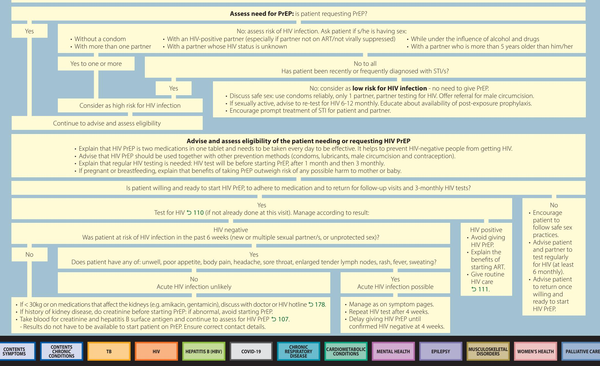

#### **HIV PRE-EXPOSURE PROPHYLAXIS (P rEP): ROUTINE CARE**

|                                                  |                                                                                                                                                                                                                                                                                                                           | he ba l h da d t he h ly. As ien ing H I V Pr E P a ine it in 28 n 3 t at t s tar t t t se ss p se s a n m on , w y                                                                                                                                                                                                                                                                                                                                                                                                                                                                                                                                                                                                                                                                                                                                                                                                                                                                                                                  |
|--------------------------------------------------|---------------------------------------------------------------------------------------------------------------------------------------------------------------------------------------------------------------------------------------------------------------------------------------------------------------------------|-----------------------------------------------------------------------------------------------------------------------------------------------------------------------------------------------------------------------------------------------------------------------------------------------------------------------------------------------------------------------------------------------------------------------------------------------------------------------------------------------------------------------------------------------------------------------------------------------------------------------------------------------------------------------------------------------------------------------------------------------------------------------------------------------------------------------------------------------------------------------------------------------------------------------------------------------------------------------------------------------------------------------------------------------------------------------------------------------------------------------------------------------------------|
| As se ss                                   | he W n t o a sse ss                                                                                                                                                                                                                                                                                        | No te                                                                                                                                                                                                                                                                                                                                                                                                                                                                                                                                                                                                                                                                                                                                                                                                                                                                                                                                                                                                                                                                                                                                                  |
| Sy tom mp s                             | Eve vis it ry                                                                                                                                                                                                                                                                                                    | f co fev  Ma I h o ks, la d w ht los ht lu de T B tom tom ≥ 2 ine ig ig eat 9 2. nag e s y mp s a s o n s y mp p ag es. ug r er we e un exp e s o r n sw s, e xc                                                                                                                                                                                                                                                                                                                                                                                                                                                                                                                                                                                                                                                                                                                                                                                                                                      |
| S T I sy tom mp s                 | Eve vis it ry                                                                                                                                                                                                                                                                                                    |  Scr for S f d ha h, h, lum /s, lce /s T I: i isc itc 49 ee n rg e, r as p u r                                                                                                                                                                                                                                                                                                                                                                                                                                                                                                                                                                                                                                                                                                                                                                                                                                                                                                                                                                                             |
| A d he ren ce                        | Eve vis it ry                                                                                                                                                                                                                                                                                                    | k a bo l l ta kin d m d do f d f f ic lty h a d he  f n de d, a lig h ba by As i isse I i wit 173 I is its wit 's r ine E P I vi it. ut att t p g p ern an ses ren ce ee n v ou ca re o r s u                                                                                                                                                                                                                                                                                                                                                                                                                                                                                                                                                                                                                                                                                                                                                                        |
| de f fe S i cts e              | Eve vis it ry                                                                                                                                                                                                                                                                                                    | k a bo de f fe f m d (se be low ). hes l ly lve hin few ks. As i ica ion Rea it ut cts t re t s e o e e ssu e u sua res o a we e w                                                                                                                                                                                                                                                                                                                                                                                                                                                                                                                                                                                                                                                                                                                                                                                                                                                                                             |
| lco ho l / dru A g use      | Eve vis it ry                                                                                                                                                                                                                                                                                                    | he has dru k ≥ dr ks 1/se d l leg l dru d p he- d f y  In t ien ) in ion 2 ) u i r 3 ) m isu ip ion ica ion ? I 142 ast at t: 1 4 t t ter t to p y ear p n ss se a g s o se res cr or ov er- co un m e s es any , ,                                                                                                                                                                                                                                                                                                                                                                                                                                                                                                                                                                                                                                                                                                                          |
| l hea lt h Sex ua                 | Eve vis it ry                                                                                                                                                                                                                                                                                                    | f ri ky l be hav lt le p do lia b ly, has de f lu f a lco ho l dru fe s dv I iou ip /s, r in / ive ice art s sex ua r: n ew or m ne r use s c on ms un re se n en ce o g s, g sa ex a u x u                                                                                                                                                                                                                                                                                                                                                                                                                                                                                                                                                                                                                                                                                                                                                                                    |
| ly lan Fam i nin p g           | Eve vis it ry                                                                                                                                                                                                                                                                                                    |   Exc lu de Ass 's c ds T he bet Pr E P a d ho l co 15 7. at ien t tra t ive 154 in ter act ion ntr t ion p reg na ncy ess p on cep ne e re a re no s we en n rm on a ace p • lig h Pr P v f p b le. A ion vis it w it E is it, i i tra t n c on cep oss •                                                                                                                                                                                                                                                                                                                                                                                                                                                                                                                                                                                                                                                 |
| H I V t est                             | Bas line 2, a h, hen hs t 1 3 m nt t t e mo ev ery on                                                                                                                                                                                                                        | f p d g  f n I it ive H I V Pr E P a ive ine H I V c 11 1. I ive inu H I V Pr E P. top ut at nt os , s n ro are eg , co e •                                                                                                                                                                                                                                                                                                                                                                                                                                                                                                                                                                                                                                                                                                                                                                                                                                                                                                   |
| H Bs Ag                                    | line Bas e                                                                                                                                                                                                                                                                                                          | f p ke b loo d for d r fer do live fun f lim f n l, re fer I it ive inu Pr E P, A L T a ito ion i A L T > 2 t im it o nt ta cto r to ct os , co e n e m on r r es up p er orm a : • f n de he  I ive inu Pr E P, c i ivin it is B v ine 120 at nt at eg , co e on s r g g p acc •                                                                                                                                                                                                                                                                                                                                                                                                                                                                                                                                                                                                      |
| Cre inin (e G F R ) at e | f ≥ bas line I 3 0 y ear s: e • f I d bet / hy bas line he ia ert ion t es p en s e n : • , ly y ear f p bas line d hs. I 3 a 6 m nt: t t reg na e , a n on • | f n f e fer day f e day f re I i G F R < 3 0, r I G F R < 5 0, r inin (e G F R ) o i G F R is 5 0, c inu Pr E P. ot nt: eat eat te eat t p reg na e sa me ep cr e n a se p ara p e ≥ on e : • f re  I G F R s l l < Pr E P a d d h do / H I V ho line eat t i 5 0, s top isc it cto t 178 p e n uss w r - f p f c day f re Pr P. I i inin 85 inin i inin is ≤ 85 inu E nt: t eat eat te eat eat nt e > reg na rea , re p cr e o n a se p ara p cr e , co e : • f re l l > d d h do ho line  I inin i 85, Pr E P a isc it / H I V 178 eat eat t sto cto t p cr e s p n uss r w - |
| hi lis Sy p                             | bas line At e                                                                                                                                                                                                                                                                                                    | fer f p  Rap i d t b le, lts im d iate ly i la b le. I it ive 3. est 5 s a re p re a as res u are me ava os                                                                                                                                                                                                                                                                                                                                                                                                                                                                                                                                                                                                                                                                                                                                                                                                                                                                                                                                        |

### **Advise the patient on/starting HIV PrEP**

- If starting, advise that daily HIV PrEP is only effective after taking it for at least 7 days. Emphasize importance of condom use until PrEP effective.
- Advise that HIV PrEP can be started and stopped according to risk. Discuss with nurse/doctor before stopping. Advise patient that HIV PrEP is not treatment for HIV and to avoid sharing medication.
- Emphasize that HIV PrEP does not prevent pregnancy or other STIs. Advise to avoid unprotected sex. Encourage reliable use of condoms and supply male and female condoms and lubricants. Offer referral for male circumcision. Explain the need for regular HIV testing and advise partner/s to test for HIV. Help patient to plan and set goals for behavior changes that may reduce his/her risk.
- Support adherence: advise that s/he needs to take the PrEP medication every day for it to be effective in preventing HIV infection.
- Suggest patient uses a weekly pillbox and/or reminders like cell phone alarms or calendar checklist
- If missed pill, advise to take it as soon as s/he remembers within 24 hours and not take more than 1 pill in one day.
- Encourage patient to identify friends/family who can support adherence. Refer patient to local/online support group or adherence club, if available.

### **Treat the patient on/starting HIV PrEP**

If starting, give medication for 1 month. If already on HIV PrEP, give medication for 3 months. Complete PrEP Clinical Form at each visit.

| Me d ica ion t                                                                               | Do se                                                       | f fe S i de cts e                                                                                                                                                                                                                                                                                                |
|----------------------------------------------------------------------------------------------------------|----------------------------------------------------------------|------------------------------------------------------------------------------------------------------------------------------------------------------------------------------------------------------------------------------------------------------------------------------------------------------------------------------------|
| fov b Te ir /em ic ita ine ( T D F / F T C ) tr no | da ly 3 0 0 / 20 0m i g on ce | hea da he, dn d ho de bn l dre h, p b lem lee ha Na ire iar ion it ing ing in a ite. t et use a, c ess r ea, p res s , a orm a am s, v om , ra s ro s s p , c ng es p p , |

### **Review after 1 month, sooner if side effects develop. Then 3 monthly: for HIV test and prescription of medications.**

### **Decide when to stop HIV PrEP**

If patient is no longer at high risk of HIV and wishes to stop PrEP, plan with patient to stop PrEP at least 7 days after last potential HIV exposure. If HBsAg-positive, avoid stopping PrEP and refer instead.

1One drink is 1 tot of spirits, or 1 small glass (125mL) of wine or 1 can/bottle (330mL) of beer. 2If starting PrEP is delayed, repeat HIV test on same day that PrEP is started [110](#page-106-0).

### **HIV: POST-EXPOSURE PROPHYLAXIS (PEP)**

Body fluids transmit infection through sexual contact (assault or consensual, burst condom), occupational exposure (sharps injury, splash to eye, mouth, nose or broken skin), sharing needles, contact with used condom and exposure to blood in sport or at accident scene. Tears, saliva (non-bloodstained), sweat, urine and stool are considered non-infectious fluids.

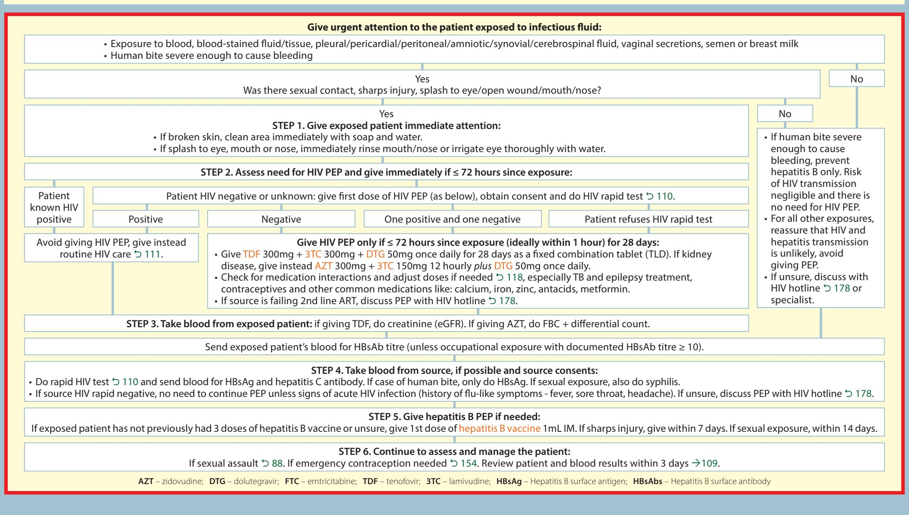

**[TB](#page-85-0)**

**[HEPATITIS B \(HBV\)](#page-116-0) [COVID-19](#page-117-0)**

### **REVIEW THE PATIENT ON POST-EXPOSURE PROPHYLAXIS (PEP)**

### **Review patient within 3 days, at 4 weeks and 4 months.**

- Check adherence and ask about side effects from HIV PEP [116](#page-112-0). Advise patient of side effects and to return promptly if they occur. Advise patient to use condoms for 4 months until results confirmed.
- If sexual assault [88](#page-84-0). If case of human bite: repeat only HBsAg (at 4 months) from table below, use HBsAbs results to continue to give only hepatitis B prophylaxis below.
- Check bloods according to table and review results as below:

**[TB](#page-85-0)**

| As se ss                                                                                    | W he n t o a sse ss                                                                                                                                                     | No te                                                                                                                                                                                                                                                                                                                                                                 |
|---------------------------------------------------------------------------------------------------|----------------------------------------------------------------------------------------------------------------------------------------------------------------------------------------|--------------------------------------------------------------------------------------------------------------------------------------------------------------------------------------------------------------------------------------------------------------------------------------------------------------------------------------------------------------------------|
| d t H I V r i est ap                                                            | d t ks a d 4 hs Re H I V r i 4 w eat est at t p ap ee n m on                                                                  | for  Enc H I V 110 e t o t est ou rag •  I f H I V n he d for Pr E P ive 10 6. at s t eg , as ses nee - f  I H I V p it ive ive ine H I V c 11 1. ut os , g ro are -                             |
| fac ( ) He it is B s ig H Bs Ag at nt p ur e a en | hs At 4 m t on                                                                                                                                                             | f p  I it ive 120 os                                                                                                                                                                                                                                                                                                                                  |
| C a bo dy He it is i at nt p                                           | Do ly f so he C a bo dy f irs i it is i it ive is it at nt t v on urc e p p os :                         | f p fer f n do he C P C R a ks. I it ive I ive it is 6 w at at t os , re eg p ee ,                                                                                                                                                                                                         |
| He it is C P C R at p                                                     | f ex d he bo dy d s ks I it is C a i ive it ive 6 w at nt at : at p ose p neg an ou rce p os ee | f p fer I it ive os , re                                                                                                                                                                                                                                                                                                                               |
| hi lis ( f se l ex ) Sy i p a p osu re xu                  | ly f so hi lis kno f irs hs Do i it ive /un is it, 4 m t v t on urc e s p p os wn on y :              | f p  I 3. it ive 5 os                                                                                                                                                                                                                                                                                                                              |
| Cre (e G F R ) re lt inin at e su                                   | C hec k bas line lts day fo l low 3- at e re su up                                                                                        | f e (or ), g d ho ly d I G F R ≤ 5 0, s T D F + 3 T C T D F + F T C ive in A Z T 3 0 0m + 3 T C 1 5 0m 12 top ste a g g ur an hec k d d f fe l co F B C a i ia t t. c n ren un |
| Fu l l b loo d c nt ou                                                       | f o I A Z T: r ks eat at 2 w n ep ee                                                                                                                  | f b ≤ hi ls ≤ d h ho line  list I H 8 o 1. 0, isc it H I V 178 ia tro t r n eu p uss w or sp ec                                                                                                                                                                            |
| b loo d r lts ( f do ) So i urc e esu ne                   | -                                                                                                                                                                                      | f so fer f sy  I H Bs Ag he C a bo dy I hi lis at it is nt i it ive at ien t. it ive 5 3. urc e or p p os , re so urc e p p p os                                                                                                             |
|                                                                                                   |                                                                                                                                                                                        |                                                                                                                                                                                                                                                                                                                                                                          |

**AZT** – zidovudine; **FTC** – emtricitabine; **TDF** – tenofovir; **3TC** – lamivudine.

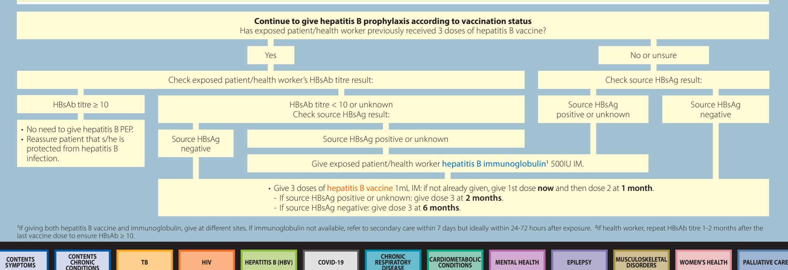

**HIV**

### **HIV: DIAGNOSIS**

- Encourage patient and his/her partner/s and children to test for HIV.
- If HIV self-screening test done, confirm results with routine tests below.

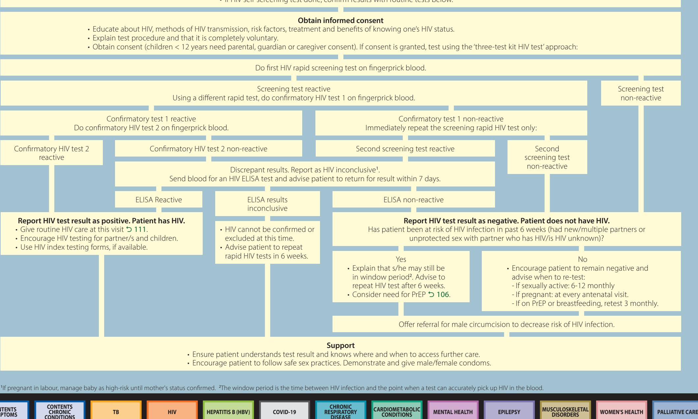

**[HEPATITIS B \(HBV\)](#page-116-0) [COVID-19](#page-117-0)**

**[TB](#page-85-0)**

**CONTENTS SYMPTOMS**

### **HIV: ROUTINE CARE**

| As se ss Sy tom mp s T B d he A ren ce de f fe S i cts e De ion p res s | he W n t o a sse ss Eve vis it ry Eve vis it ry Eve vis it ry Eve vis it ry Eve vis it ry                                                                                                                                                                                                                                                                                                                                                                                                                                                                                                        | No te Ma ien 's s at t tom nag e p y mp s a for Tes T B (se d 1 t utu n sp m f p C hec k re d o 's a d at ien t co r f fe fro As k a bo de ut i cts s e m •                                                                                                                                                                                                                                                                                                                                                                                                                                                                                                                                                                                                                                                                                                                                                                                                                                                                                                                                                                                                                                                                                            | f g l d ha lce has I ita isc /u tom art s o n s y mp p ag es. en rg e r o r p ne r for f a le T B N A A T ): a H I V d ly h V L te d t iag is, y wit sts i sam p no s ear , an fac f f f ic d lity I d lty h a d he to tre atm t a i vis its. i wit ren ce en n u ren                                                                                                                                                                                                                                                                                                                                                                                                                                                                                                                                                                                                            | be d for ks, for  S T I in 8 w S T I 49 tre ate ast en an p ee ma nag e fev  T B s de lop (co h, w ht los ht ) 9 2. tom ig ig eat ny y mp s ve ug e s, n sw s o r er                                                                                                                                                                                                                                                                                                                                                                                                                                                                                                                                                                                                                                                                                                                                                                                                                                                                                                                            |  |  |  |  |
|----------------------------------------------------------------------------------------------------------------------------------------------------|-----------------------------------------------------------------------------------------------------------------------------------------------------------------------------------------------------------------------------------------------------------------------------------------------------------------------------------------------------------------------------------------------------------------------------------------------------------------------------------------------------------------------------------------------------------------------------------------------------------------------------------------------------------------------------|-----------------------------------------------------------------------------------------------------------------------------------------------------------------------------------------------------------------------------------------------------------------------------------------------------------------------------------------------------------------------------------------------------------------------------------------------------------------------------------------------------------------------------------------------------------------------------------------------------------------------------------------------------------------------------------------------------------------------------------------------------------------------------------------------------------------------------------------------------------------------------------------------------------------------------------------------------------------------------------------------------------------------------------------------------------------------------------------------------------------------------------------------------------------------------------------------------------------------------------------------------------------------------------------------------------------------------------------------------------------------------------------------------------|----------------------------------------------------------------------------------------------------------------------------------------------------------------------------------------------------------------------------------------------------------------------------------------------------------------------------------------------------------------------------------------------------------------------------------------------------------------------------------------------------------------------------------------------------------------------------------------------------------------------------------------------------------------------------------------------------------------------------------------------------------------------------------------------------------------------------------------------------------------------------------------------------------------------------------------------------------------------------------------------------------------------------------------------------------------------------------------------------------------------------------------------|------------------------------------------------------------------------------------------------------------------------------------------------------------------------------------------------------------------------------------------------------------------------------------------------------------------------------------------------------------------------------------------------------------------------------------------------------------------------------------------------------------------------------------------------------------------------------------------------------------------------------------------------------------------------------------------------------------------------------------------------------------------------------------------------------------------------------------------------------------------------------------------------------------------------------------------------------------------------------------------------------------------------------------------------------------------------------------------------------------------------------------------------------------------------------------------------------------------------------------------------------------------|--|--|--|--|
|                                                                                                                                                    |                                                                                                                                                                                                                                                                                                                                                                                                                                                                                                                                                                                                                                                                             |                                                                                                                                                                                                                                                                                                                                                                                                                                                                                                                                                                                                                                                                                                                                                                                                                                                                                                                                                                                                                                                                                                                                                                                                                                                                                                                                                                                                           |                                                                                                                                                                                                                                                                                                                                                                                                                                                                                                                                                                                                                                                                                                                                                                                                                                                                                                                                                                                                                                                                                                                                              |                                                                                                                                                                                                                                                                                                                                                                                                                                                                                                                                                                                                                                                                                                                                                                                                                                                                                                                                                                                                                                                                                                                                                                                                                                                                  |  |  |  |  |
|                                                                                                                                                    |                                                                                                                                                                                                                                                                                                                                                                                                                                                                                                                                                                                                                                                                             |                                                                                                                                                                                                                                                                                                                                                                                                                                                                                                                                                                                                                                                                                                                                                                                                                                                                                                                                                                                                                                                                                                                                                                                                                                                                                                                                                                                                           |                                                                                                                                                                                                                                                                                                                                                                                                                                                                                                                                                                                                                                                                                                                                                                                                                                                                                                                                                                                                                                                                                                                                              |                                                                                                                                                                                                                                                                                                                                                                                                                                                                                                                                                                                                                                                                                                                                                                                                                                                                                                                                                                                                                                                                                                                                                                                                                                                                  |  |  |  |  |
|                                                                                                                                                    |                                                                                                                                                                                                                                                                                                                                                                                                                                                                                                                                                                                                                                                                             |                                                                                                                                                                                                                                                                                                                                                                                                                                                                                                                                                                                                                                                                                                                                                                                                                                                                                                                                                                                                                                                                                                                                                                                                                                                                                                                                                                                                           |                                                                                                                                                                                                                                                                                                                                                                                                                                                                                                                                                                                                                                                                                                                                                                                                                                                                                                                                                                                                                                                                                                                                              |                                                                                                                                                                                                                                                                                                                                                                                                                                                                                                                                                                                                                                                                                                                                                                                                                                                                                                                                                                                                                                                                                                                                                                                                                                                                  |  |  |  |  |
|                                                                                                                                                    |                                                                                                                                                                                                                                                                                                                                                                                                                                                                                                                                                                                                                                                                             |                                                                                                                                                                                                                                                                                                                                                                                                                                                                                                                                                                                                                                                                                                                                                                                                                                                                                                                                                                                                                                                                                                                                                                                                                                                                                                                                                                                                           |  he d he ive ort 173 ce, g a ren ce sup p                                                                                                                                                                                                                                                                                                                                                                                                                                                                                                                                                                                                                                                                                                                                                                                                                                                                                                                                                                                                                                                            |                                                                                                                                                                                                                                                                                                                                                                                                                                                                                                                                                                                                                                                                                                                                                                                                                                                                                                                                                                                                                                                                                                                                                                                                                                                                  |  |  |  |  |
|                                                                                                                                                    |                                                                                                                                                                                                                                                                                                                                                                                                                                                                                                                                                                                                                                                                             | •                                                                                                                                                                                                                                                                                                                                                                                                                                                                                                                                                                                                                                                                                                                                                                                                                                                                                                                                                                                                                                                                                                                                                                                                                                                                                                                                                                                                         |   f lu  f u A R T T B p ( T P T ) le p he ( C P T ) a d le Ma ly. D 116 ent ive tre ent 8 9, c o-t rim ent ive t 113 t isc i rev am oxa zo rev rap y n co naz o nag e p rom p uss nsu re. , f su d a dv dru he d Sa fet f i l l for d s bm ha l to dr@ hp I ion via Me it t ist, i ect ct ort t sp e ers e g rea , re p y ap p or m an u o p rm ac or em a a sa ra.o rg. za.                                                                                                                                                                                                                                                                                                                                                                                            |                                                                                                                                                                                                                                                                                                                                                                                                                                                                                                                                                                                                                                                                                                                                                                                                                                                                                                                                                                                                                                                                                                                                                                                                                                                                  |  |  |  |  |
|                                                                                                                                                    |                                                                                                                                                                                                                                                                                                                                                                                                                                                                                                                                                                                                                                                                             | he h, has ) fe lt do de d, ho les ) fe lt litt le lea do hin ? f y he  In t ien t: 1 r 2 int in ing I it 143 ast t at st o t to p m on p wn p res se p e s o ere r p sur e g s es e r ,                                                                                                                                                                                                                                                                                                                                                                                                                                                                                                                                                                                                                                                                                                                                                                                                                                                                                                                                                                                                                                 |                                                                                                                                                                                                                                                                                                                                                                                                                                                                                                                                                                                                                                                                                                                                                                                                                                                                                                                                                                                                                                                                                                                                              |                                                                                                                                                                                                                                                                                                                                                                                                                                                                                                                                                                                                                                                                                                                                                                                                                                                                                                                                                                                                                                                                                                                                                                                                                                                                  |  |  |  |  |
| A lco ho l / dru g use                                                                                                        | Eve vis it ry                                                                                                                                                                                                                                                                                                                                                                                                                                                                                                                                                                                                                                                      | he has ) dru k ≥ dr ks 1/s ) u d l leg l dru ) m d p he d f y  In t ien t: 1 4 in ion 2 i r 3 isu ip ion ica ion ? I 142 ast at t t ter t to p y ear p n ess se a g s o se res cr or ov er- -co un m e s es any , ,                                                                                                                                                                                                                                                                                                                                                                                                                                                                                                                                                                                                                                                                                                                                                                                                                                                                                                                                                                          |                                                                                                                                                                                                                                                                                                                                                                                                                                                                                                                                                                                                                                                                                                                                                                                                                                                                                                                                                                                                                                                                                                                                              |                                                                                                                                                                                                                                                                                                                                                                                                                                                                                                                                                                                                                                                                                                                                                                                                                                                                                                                                                                                                                                                                                                                                                                                                                                                                  |  |  |  |  |
| Sex l hea lt h ua                                                                                                                   | Eve vis it ry                                                                                                                                                                                                                                                                                                                                                                                                                                                                                                                                                                                                                                                      | f ri I ky l be hav iou s sex ua r: n ew                                                                                                                                                                                                                                                                                                                                                                                                                                                                                                                                                                                                                                                                                                                                                                                                                                                                                                                                                                                                                                                                                                                                                                                                                                                                                                                                  | lt le p /s, do lia b ly, has de ip art or m u ne r use s c on ms un re se x u n                                                                                                                                                                                                                                                                                                                                                                                                                                                                                                                                                                                                                                                                                                                                                                                                                                                                                                                                                                                      | f lu f a fe lco ho l / dru dv r in ive ice en ce o g s, g sa sex a                                                                                                                                                                                                                                                                                                                                                                                                                                                                                                                                                                                                                                                                                                                                                                                                                                                                                                                                                                                                                                                                                                                                   |  |  |  |  |
| ly lan Fam i nin p g                                                                                                             | Eve vis it ry                                                                                                                                                                                                                                                                                                                                                                                                                                                                                                                                                                                                                                                      |  I f w f c hi l d be l, se l ly d n lia b le c lu de ing ia ive ion 157 ote nt act ot tra t om an o ar p xu a an on re on cep , ex c p reg na ncy • ds. dv lia b le c (co do lus b de l im lan b le o lisa )  Ass ien 's c ive A ise ion I U D, s inj i ion 154 at t tra t tra t t, ect r st t ess p on cep ne e re on cep n ms p u rm a p a er • hat he h f o he lig b lity h t  d  Rea in ion it D T G. I A R T r im i i itc D T G j ion 118 re t t ter act t to 117 ust ntr t ssu re a re no s w n o r eg en , as ses s e sw o or a co ace p • f p fo fer for  I lan lat da ly d a dv de l vi l loa d < C hec k hi lis nin : st art e 5 i ise to t i 5 0. 5 3. g p reg na ncy mg an p reg na ncy un ra sy p • |                                                                                                                                                                                                                                                                                                                                                                                                                                                                                                                                                                                                                                                                                                                                                                                                                                                                                                                                                                                                                                                                                                                                              |                                                                                                                                                                                                                                                                                                                                                                                                                                                                                                                                                                                                                                                                                                                                                                                                                                                                                                                                                                                                                                                                                                                                                                                                                                                                  |  |  |  |  |
| l tra Ve ica iss ion rt nsm ( V T P ) ent ion p rev                                                   | Pre / nt g na fee bre d ast ing                                                                                                                                                                                                                                                                                                                                                                                                                                                                                                                                                                                                                  |  I f n A R T, s A R T s day I f p lso l ca ot tar t nt, ive ten ata 15 9. on am e reg na a g an re • f bre fee d hec k t hat d fan has d c d lts  I ing H I V-e in ive P E P a P C R re 16 8. ast t ect , c xp ose re ce orr n su •                                                                                                                                                                                                                                                                                                                                                                                                                                                                                                                                                                                                                                                                                                                                                                                                                                                                                                                                          |                                                                                                                                                                                                                                                                                                                                                                                                                                                                                                                                                                                                                                                                                                                                                                                                                                                                                                                                                                                                                                                                                                                                              |                                                                                                                                                                                                                                                                                                                                                                                                                                                                                                                                                                                                                                                                                                                                                                                                                                                                                                                                                                                                                                                                                                                                                                                                                                                                  |  |  |  |  |
| Pa l liat ive ca re                                                                                                                 | f I de ter ior at ing                                                                                                                                                                                                                                                                                                                                                                                                                                                                                                                                                                                                                                     | f fa ling d line d de lso l liat  I i 3r A R T a ior ing ive ive 170 ter at n , a g p a ca re                                                                                                                                                                                                                                                                                                                                                                                                                                                                                                                                                                                                                                                                                                                                                                                                                                                                                                                                                                                                                                                                                                                                                                                                                  |                                                                                                                                                                                                                                                                                                                                                                                                                                                                                                                                                                                                                                                                                                                                                                                                                                                                                                                                                                                                                                                                                                                                              |                                                                                                                                                                                                                                                                                                                                                                                                                                                                                                                                                                                                                                                                                                                                                                                                                                                                                                                                                                                                                                                                                                                                                                                                                                                                  |  |  |  |  |
| We ht ig                                                                                                                                     | Eve vis it ry                                                                                                                                                                                                                                                                                                                                                                                                                                                                                                                                                                                                                                                      | At d he ht d w ht lcu late B M I. B M I = ht ( kg ) ÷ he ht (m ) ÷ he ht (m ): iag is, ig ig ig ig ig to no s me asu re an e ca we • f fer for l su f k be low I B M I < 18. 5, r it ion I B M I ≥ 25, C V D r is tr ort e nu a p p as ses s - f w ht los f bo dy ht ks  I ig % o ig in 4 23 5 s ≥ e we we e •                                                                                                                                                                                                                                                                                                                                                                                                                                                                                                                                                                                                                                                                                                                                                                            |                                                                                                                                                                                                                                                                                                                                                                                                                                                                                                                                                                                                                                                                                                                                                                                                                                                                                                                                                                                                                                                                                                                                              |                                                                                                                                                                                                                                                                                                                                                                                                                                                                                                                                                                                                                                                                                                                                                                                                                                                                                                                                                                                                                                                                                                                                                                                                                                                                  |  |  |  |  |
| hro d C nic it ion co n s d k C V D r is an                                                           | d At iag is no s                                                                                                                                                                                                                                                                                                                                                                                                                                                                                                                                                                                                                                             | f kno hy I ion ert wn p en s , c • I f kno d bet hec k g ia wn es, c • f kno h e lep I it i wn w p sy, c • k  f Ass C V D r is 127 I C ess • in ato sta t 10m at nig rva g                                                                                                                                                                                                                                                                                                                                                                                                                                                                                                                                                                                                                                                                                                                                                                                                                                                                                                                                                                                                                                                 | hec k c l  f n kno h hy hec k f ≥  13 3. I it ion B P: i 0 / 9 0 13 2. tro ot ert 14 on wn w p en s , c   luc l an d a d do f m for f ta kin he h do lut I f n kno h d bet hec k g luc j mi n i it ir 13 0. it ia 17. ntr ust et tog et ot ose co o ses o g r w eg rav wn w es, c ose hec k se l an d for b le m d  izu i ica ion in ion 149 tro t ter act re c on p oss e s k > kno 2, a d o h t  f u b le t h t h t d c ha V D r is 20 % o C V D L P Vr A T V /r, itc D T G I wit D T G, itc A T Vr imv in t 117 ast at r wn n n or sw o na o s c o sw o an ng e s o ht. |                                                                                                                                                                                                                                                                                                                                                                                                                                                                                                                                                                                                                                                                                                                                                                                                                                                                                                                                                                                                                                                                                                                                                                                                                                                                  |  |  |  |  |
| lini l W H O C Sta ca g e                                                                                               | hec k i f Eve vis it t ry o c has d sta g e wo rse ne                                                                                                                                                                                                                                                                                                                                                                                                                                                                                                                                                                          | hec k w ht, h, s kin C ig ut e mo • Use W H O C lini l Sta e t ca g o •                                                                                                                                                                                                                                                                                                                                                                                                                                                                                                                                                                                                                                                                                                                                                                                                                                                                                                                                                                                                                                                                                                                                                                                                                                                              | d c b lem he for be lini l iou On A R T, im is ien W H O C Sta t p t at t to e 1 , p rev s a n urr en ro s. ce on a p ca g  f n f re f o de de he le I A R T, u dv d s d. I A R T, u do his i n t tar t c o-t rim 113 ot st a tag n i sta at t vis it. c w o s oxa zo on se mo an ce e e ve cov ere n se g e ne                                                                                                                                                                                                                                                                                                                                                                                                                                                                                                                                   |                                                                                                                                                                                                                                                                                                                                                                                                                                                                                                                                                                                                                                                                                                                                                                                                                                                                                                                                                                                                                                                                                                                                                                                                                                                                  |  |  |  |  |
| l l l W H O C in ica Sta e 1 W H O C in ica g                                                   |                                                                                                                                                                                                                                                                                                                                                                                                                                                                                                                                                                                                                                                                             | Sta 2 g e                                                                                                                                                                                                                                                                                                                                                                                                                                                                                                                                                                                                                                                                                                                                                                                                                                                                                                                                                                                                                                                                                                                                                                                                                                                                                                                                                                                        | l in ica l W H O C Sta 3 g e                                                                                                                                                                                                                                                                                                                                                                                                                                                                                                                                                                                                                                                                                                                                                                                                                                                                                                                                                                                                                                                                                | l l W H O C in ica Sta e 4 g                                                                                                                                                                                                                                                                                                                                                                                                                                                                                                                                                                                                                                                                                                                                                                                                                                                                                                                                                                                                                                                                                                                                                                                                       |  |  |  |  |
| No tom sy mp s • Per les iste nt in s p a s • l len lan ds sw o g                | l lit d Rec inu it is, i is, o it is m ia, t s ton t urr en s s e • ha it is p ry ng lar ( ) Pap it ic e ion P P E t u p rur rup • l na l in fec Fun i ion t g a s • He (s hin les ) ter rp es zos g • h u lce Rec t m t urr en ou rs • lar he lit An i is /st it is at g c om u • Un la d w ht los bo dy ht ine ig 10 % ig s < exp e we • |                                                                                                                                                                                                                                                                                                                                                                                                                                                                                                                                                                                                                                                                                                                                                                                                                                                                                                                                                                                                                                                                                                                                                                                                                                                                                                                                                                                                           | lm hin Pu T B w it ast on ary p y ear • Ora l ca d da i n • l ha leu kop la kia Ora iry • la d w ht los bo dy ht Un ine ig 10 % ig B M I < 18. 5 s ≥ exp e we or • Un la d d ho h ine iar > 1 t exp r ea m on • la d fev h Un ine > 1 t exp er m on • bac l in fec Sev ia ion (p ia, nin it is ) ter t ere s ne um on me g • Un la d a hro ine mi 8, utr ia < 0.5 nic a < exp nae ne op aen or c • hro bo ia < 5 0 t top m cy aen                                                                                                                                                                                                                                                                                             | lm hin ly ho Ext T B w it Kap i 's s inv ive ast rap u on ary p y ear os arc om a, mp ma as • • , We ht los d d ho l ca ig 10 % a iarr vic s ≥ n ea cer a nce r • fev h lov fec > 1 Cy iru in ion t tom t or er m on eg a s • las Pne is p ia ( P J P ) Tox is st um ocy ne um on op mo s • • Rec bac l H I V-a d de ha lop hy t se ter ia iate nt ia, at urr en ve re sso c me en cep • • Cry l d ( lu d ia ise inc ing toc p ne um on p occ a ase • lex f m h o l He im ita nin it is ) t rp es s p o ou r g en me g • h Cry d Iso be l li d ho 1 nt i ium iar tos a > are mo p p or or sp ora r ea • Oe hag l ca d da i sop ea n • |  |  |  |  |
|                                                                                                                                                    |                                                                                                                                                                                                                                                                                                                                                                                                                                                                                                                                                                                                                                                                             |                                                                                                                                                                                                                                                                                                                                                                                                                                                                                                                                                                                                                                                                                                                                                                                                                                                                                                                                                                                                                                                                                                                                                                                                                                                                                                                                                                                                           |  Co inu he ien it h nt e t t at t w H I V 11 2. o a sse ss p                                                                                                                                                                                                                                                                                                                                                                                                                                                                                                                                                                                                                                                                                                                                                                                                                                                                                                                                                                                                                    |                                                                                                                                                                                                                                                                                                                                                                                                                                                                                                                                                                                                                                                                                                                                                                                                                                                                                                                                                                                                                                                                                                                                                                                                                                                                  |  |  |  |  |
| 1On e d rink t of is 1 to irits sp                                                                                            | ll g lass (12 L) o 1 s 5m , or ma                                                                                                                                                                                                                                                                                                                                                                                                                                                                                                                                                                                                                      | f w n/b le ( ) o ine 1 ca ott 330 mL or                                                                                                                                                                                                                                                                                                                                                                                                                                                                                                                                                                                                                                                                                                                                                                                                                                                                                                                                                                                                                                                                                                                                                                                                                                                                                                                                        | f be 2Ca rdio cul ar d ( CV D) lud isch ic h t d isea inc isea er. vas se es aem ear se,                                                                                                                                                                                                                                                                                                                                                                                                                                                                                                                                                                                                                                                                                                                                                                                                                                                                                                                                                                                      | her al v ula r di nd ke/ ip stro TIA per asc sea se a                                                                                                                                                                                                                                                                                                                                                                                                                                                                                                                                                                                                                                                                                                                                                                                                                                                                                                                                                                                                                                                                                                                                                                        |  |  |  |  |

| f a C he k t d ing b le d r iew lts be low Re lts do ha be i la b le t ien A R T s da Re d c de i ls in bn l re lts l l p ien est to ta t to tar t p at t o ect nta ct ta to at t. c s a cco r an ev re su su no ve av a o s n am e y. co r orr co cas e o orm a su rec a |                                                                                                                                                                                                                                                                                                                                                                                                                                                                                                                                                                                                                                                                                                                                                                                                                                                                                                                                                                                                                                                                                                                                                                                                                                                                                                                                                                                                                                                                                                                                                                                                                                                                                                                                                                                                                                                                                                                                                                                                         |                                                                                                                                                                                                        |                                                                                                                           |                                                                                                                                                                                                                                                                                    |                                                                                                |                                                                                                           |                                                                                                                                      |                                                                                                                                                                                                                                                                                                                                                                                           |
|------------------------------------------------------------------------------------------------------------------------------------------------------------------------------------------------------------------------------------------------------------------------------------------------------------------------------------------------------------------------------------------------------------------------------------------------------------------------------------------------------------------------------------|---------------------------------------------------------------------------------------------------------------------------------------------------------------------------------------------------------------------------------------------------------------------------------------------------------------------------------------------------------------------------------------------------------------------------------------------------------------------------------------------------------------------------------------------------------------------------------------------------------------------------------------------------------------------------------------------------------------------------------------------------------------------------------------------------------------------------------------------------------------------------------------------------------------------------------------------------------------------------------------------------------------------------------------------------------------------------------------------------------------------------------------------------------------------------------------------------------------------------------------------------------------------------------------------------------------------------------------------------------------------------------------------------------------------------------------------------------------------------------------------------------------------------------------------------------------------------------------------------------------------------------------------------------------------------------------------------------------------------------------------------------------------------------------------------------------------------------------------------------------------------------------------------------------------------------------------------------------------------------------------------------|--------------------------------------------------------------------------------------------------------------------------------------------------------------------------------------------------------|---------------------------------------------------------------------------------------------------------------------------|------------------------------------------------------------------------------------------------------------------------------------------------------------------------------------------------------------------------------------------------------------------------------------|------------------------------------------------------------------------------------------------|-----------------------------------------------------------------------------------------------------------|--------------------------------------------------------------------------------------------------------------------------------------|-------------------------------------------------------------------------------------------------------------------------------------------------------------------------------------------------------------------------------------------------------------------------------------------------------------------------------------------------------------------------------------------|
| At d iag is no s                                                                                                                                                                                                                                                                                                                                                                                                                                                                                                    |                                                                                                                                                                                                                                                                                                                                                                                                                                                                                                                                                                                                                                                                                                                                                                                                                                                                                                                                                                                                                                                                                                                                                                                                                                                                                                                                                                                                                                                                                                                                                                                                                                                                                                                                                                                                                                                                                                                                                                                                         | Sta ing /c ha ing A R T rt ng                                                                                                                                               | fte A h r 1 t m on A R T on                                                                 | fte A hs A R T r 3 t m on on                                                                                                                                                                                                                         | fte A hs r 1 0 m t on A R T on                                   | h ly 6 m t on                                                                                 | Ye ly ar                                                                                                                       | A lso                                                                                                                                                                                                                                                                                                                                                                                  |
| d k a d p 1 Ur ine ip ic st te st n reg na ncy : • Sp T B N A A T utu m: • B loo d: b, Bs C D4 inin H H Ag at cre e, • , (an d 2 i f ) Cr Ag C D4 10 0 < l sc Ce ica ing rv ree n •                                                                                                                                                      |                                                                                                                                                                                                                                                                                                                                                                                                                                                                                                                                                                                                                                                                                                                                                                                                                                                                                                                                                                                                                                                                                                                                                                                                                                                                                                                                                                                                                                                                                                                                                                                                                                                                                                                                                                                                                                                                                                                                                                                                         | ha C ing T D F: to ng • at inin cre e C ha ing fro D Bs T F: H Ag ng m • b Sta ing A Z T: H rt • | d f f A Z T: F B C + i                                                                         | l loa d Vir a • T D F: c t inin rea e • B C + d f f A Z T: F i • l A T Vr L P Vr: to ta or • ho les l, ly de ig i ter tr c o cer s | l loa d Vir a • C D4 • D T F: c inin t rea e • | f p I iou rev s C D4 20 0 < t o or no n A R T: C D4 | l loa d Vir a • T D F: c t inin rea e • Sp B T N A A T utu m: • | hec k v l loa d m fte C ira ore o n : • Pre l vi nt: at 1st ten ata it g na an s - d de live an ry fee d h ly Bre ing 6 m ast t on : - h ly R R- T B: 6 m t on - Ce l sc ly rvic n 3 a ree y ear • |
| AB Hb - h aem                                                                                                                                                                                                                                                                                                                                                                                                                                                                                                             | aba C - ir ATV cav lob HB sAg in og                                                                                                                                                                                                                                                                                                                                                                                                                                                                                                                                                                                                                                                                                                                                                                                                                                                                                                                                                                                                                                                                                                                                                                                                                                                                                                                                                                                                                                                                                                                                                                                                                                                                                                                                                                                                                                                                                                                                          | zid ir/r iton avi AZ T – taz r - a anv r ovu – h B s urfa LPV titis ant ige epa ce n                                                       | din CrA e g - cry p lop vir/ ina rito ir r – nav                                      | al a Diff - d iffe ntig toc occ en ren RR- TB fam t TB – ri in-r esis tan pc                                                                                                                                                    | tial wh cel l co ite unt TD F – ofo TE ten vir                | fav EFV iren - e z E - TD F + FT C +                                           | – f ull blo od FBC nt cou EF V TLD - T DF TC + 3                                              | tab FTC rici ine mt - e + D TG 3TC - la udi miv ne                                                                                                                                                                                                                                                                                                    |
| d k Ur ine ip ic st                                                                                                                                                                                                                                                                                                                                                                                                                                                                                              |  f p hec k c (e G R ) f n lrea dy do lt be low f p hec k u d k, do B P a d m fur he I inu ria, inin F i Int I rin ip ic 16 1. rot t ot ret nt, st t e c rea e a ne erp re su reg na rec e n an ag e r • fro TB han ing tes ts c f g luc hec k ra do f in k g luc  I in ine ric 17. g m ose ur : c n m g erp ose •                                                                                                                                                                                                                                                                                                                                                                                                                                                                                                                                                                                                                                                                                                                                                                                                                                                                                                                                                                                                                                                                                                                                                                                                                                                                                                                                                                                     |                                                                                                                                                                                                        |                                                                                                                           |                                                                                                                                                                                                                                                                                    |                                                                                                |                                                                                                           |                                                                                                                                      |                                                                                                                                                                                                                                                                                                                                                                                           |
| Ur ine p reg na ncy tes t                                                                                                                                                                                                                                                                                                                                                                                                                                                                                     | f p I te reg na ncy • f p I te reg na ncy •                                                                                                                                                                                                                                                                                                                                                                                                                                                                                                                                                                                                                                                                                                                                                                                                                                                                                                                                                                                                                                                                                                                                                                                                                                                                                                                                                                                                                                                                                                                                                                                                                                                                                                                                                                                                                                                                                                                      | l ca  it ive ive st p ten ata os , g an re dv lia b le c st n at ive ise to eg , a us e r e                                | d f n 9 a i A R T, s 15 ot n on ( I U D, s tra t ion on cep u | day tar t sa me b de l im lan lisa t o r st i t ion rm a p er                                                                                                                                                                   | lus do ). , p co n ms                                                        |                                                                                                           |                                                                                                                                      | 'Xp Ul ' to 'TB NA AT ' ert tra ( NA AT ucl eic id = n ac lific nd lud atio n te st a inc am p es                                                                                                                                                                                                           |
| T B s utu m t est p                                                                                                                                                                                                                                                                                                                                                                                                                                                                                                 | Xp ell er T B te sts) ert as w as n ew lts  ly, ly l loa d do Int T B N A A T r 9 2. Re T B s im vir ret utu eat utu m t est at e t erp sp m esu p p y ear sam e a s y ear a ne                                                                                                                                                                                                                                                                                                                                                                                                                                                                                                                                                                                                                                                                                                                                                                                                                                                                                                                                                                                                                                                                                                                                                                                                                                                                                                                                                                                                                                                                                                                                                                                                                                                            |                                                                                                                                                                                                        |                                                                                                                           |                                                                                                                                                                                                                                                                                    |                                                                                                |                                                                                                           |                                                                                                                                      |                                                                                                                                                                                                                                                                                                                                                                                           |
| C D4                                                                                                                                                                                                                                                                                                                                                                                                                                                                                                                            | f hec k lt. f d d le p hy lax her  d do d u for f  I C D4 10 0, c Cr Ag I C D4 20 0 o W H O s 2, 3 o r 4 ise H I V iag is, s imo is t ( C P T ) 113 i rine L A M t T B i T B sy 9 2. tag at tar t co -tr est tom < res < r e ase no s xaz o rop ap an a r ap mp s u y                                                                                                                                                                                                                                                                                                                                                                                                                                                                                                                                                                                                                                                                                                                                                                                                                                                                                                                                                                                                                                                                                                                                                                                                                                                                                                                                                                                                                                                            |                                                                                                                                                                                                        |                                                                                                                           |                                                                                                                                                                                                                                                                                    |                                                                                                |                                                                                                           |                                                                                                                                      |                                                                                                                                                                                                                                                                                                                                                                                           |
| 2 Cr Ag                                                                                                                                                                                                                                                                                                                                                                                                                                                                                                                      | f c l an ( ) p fer for lum ba ( ). f sy ( hea da he, fus ) o fer ly. I ig Cr Ag it ive L P I ic ion toc t ctu tom at nt, t ry p occ a en os , re r p un re mp c co n r p reg na re ur g en                                                                                                                                                                                                                                                                                                                                                                                                                                                                                                                                                                                                                                                                                                                                                                                                                                                                                                                                                                                                                                                                                                                                                                                                                                                                                                                                                                                                                                                                                                                                                                                                                                   |                                                                                                                                                                                                        |                                                                                                                           |                                                                                                                                                                                                                                                                                    |                                                                                                |                                                                                                           |                                                                                                                                      |                                                                                                                                                                                                                                                                                                                                                                                           |
| b ( H F B C + d f fe l co i ia ) t unt ren                                                                                                                                                                                                                                                                                                                                                                                                                                            | f b < li ke ly, do d d f fe l co f n lrea dy do  f d f f ic lty bre hin hes d fer day I H 12 (wo ) o 13 (m ), a ia F B C a i ia i 27 I i in o izz ine t t ot at t p r < ma n an na em n ren un a ne u g, c a r ss, re sa me • f f a f o f  I H b ≤ hi ls ≤ d z do d I lrea dy do d h t T D F o A B C. I A Z T be ki dn b lem d A B C hy d h H I V ho line 8 o tro 1. 0: a i i ine zi ine itc it ivit isc it t 178 r n eu p vo vu on vu , sw o r n cau se o ey p ro an p ers en s y, uss w •                                                                                                                                                                                                                                                                                                                                                                                                                                                                                                                                                                                                                                                                                                                                                                                                                                                                                                                                                                                                     |                                                                                                                                                                                                        |                                                                                                                           |                                                                                                                                                                                                                                                                                    |                                                                                                |                                                                                                           |                                                                                                                                      |                                                                                                                                                                                                                                                                                                                                                                                           |
| He B at it is p ( Bs ) H Ag                                                                                                                                                                                                                                                                                                                                                                                                                                                                          | f ho l d for f  I H Bs Ag it ive T D F s A R T r ime 120 art p os u m p o eg n • , f hec k im d g do f he f n de d  I H Bs Ag ive ive 3 it is B v ine i 120 at at ne g , c mu ne res p on se an ses o p acc ee •                                                                                                                                                                                                                                                                                                                                                                                                                                                                                                                                                                                                                                                                                                                                                                                                                                                                                                                                                                                                                                                                                                                                                                                                                                                                                                                                                                                                                                                                                                                                                           |                                                                                                                                                                                                        |                                                                                                                           |                                                                                                                                                                                                                                                                                    |                                                                                                |                                                                                                           |                                                                                                                                      |                                                                                                                                                                                                                                                                                                                                                                                           |
| l sc Ce rvic a ree n                                                                                                                                                                                                                                                                                                                                                                                                                                                                                                |  f n Int lt Re 3 y ly l. ret 55 eat i erp re su p ear orm a                                                                                                                                                                                                                                                                                                                                                                                                                                                                                                                                                                                                                                                                                                                                                                                                                                                                                                                                                                                                                                                                                                                                                                                                                                                                                                                                                                                                                                                                                                                                                                                                                                                                                                                                                                                                                                                                                      |                                                                                                                                                                                                        |                                                                                                                           |                                                                                                                                                                                                                                                                                    |                                                                                                |                                                                                                           |                                                                                                                                      |                                                                                                                                                                                                                                                                                                                                                                                           |
| Cre inin (e G F R ) at e                                                                                                                                                                                                                                                                                                                                                                                                                                                                                   |  f e G R < fer / d h ho line I F 3 0, r isc it H I V 178 t e uss w • f e (or ): r l l p h d bs lt: I G F R ≤ 5 0 inin 85 in ien ien Sw itc A R T a ing H Ag eat nt at t at t. to cr e > p reg na p eca cco r re su • f d. f o h t f p hy d o f I H Bs Ag ive T D F, u A B C ins I T L D o T E E: s wit A B C + 3 T C + D T G. I iou it ivit A B C, A Z T i A B C. at : st tea to nst ne g op se n r c o rev s p ers en s y use ea - f  I H Bs Ag d h e d A R T c lini H I V ho line it ive isc t w it ien ian t 178 p os uss m an ag em en xp er ce c or : - C hec k i f o he d do d a d be d a b le e f c lea ( Cr C l ). C hec k for d r fte h. f re fer ica ion j ing G F R c im inin inu ria G F R a r 1 I G F R ≤ 5 0, r t t ust ta st ate t rot eat nt eat r m e ses ne e : e an use s a cce p o rea e c ran ce p e an ep e mo p e e • do hec k luc d k, s d u for d a ki dn ltra d. B P, g ine ip ic rin in /cr inin io a to cto r to st rot eat at c ose , ur en e p e e r n rra ng e ey u sou n |                                                                                                                                                                                                        |                                                                                                                           |                                                                                                                                                                                                                                                                                    |                                                                                                |                                                                                                           |                                                                                                                                      |                                                                                                                                                                                                                                                                                                                                                                                           |
| A L T                                                                                                                                                                                                                                                                                                                                                                                                                                                                                                                        | f d d d d fer day I A L T ≥ 20 0 o r j ice ica ion isc /re top t au n , s m e s a n uss sa me • f I A L T < 20 0: • I f n d d m for A lso A L T w k ly l < tom t inu ica t ion ito tom eat t i 120 o s y mp s, c on e m e s a n on r sy mp s. re p ee un - f sy (na /vo /a b do l p ): I mit ing mi in tom mp s use a na a - f (or l b liru b f do ): s l l m d d d fer day I A L T 1 20- 19 9 i in > 40 i ica ion isc /re to ta top t ne a e s a n uss sa me • , f do for hec k de lco ho l or dru du d live de de lay hin k. f u d h s list I A L T 5 0-1 20: (c H Bs Ag i in r in j ), c i r in ing / ing A R T. Re A L T w it I isc it ia cto r to ter t eat 1 w as ses s ca use s ; co ns r a g- ce ury on s rup p ee nsu re, uss w p ec •                                                                                                                                                                                                                                                                                                                                                                                                                                                                                                                              |                                                                                                                                                                                                        |                                                                                                                           |                                                                                                                                                                                                                                                                                    |                                                                                                |                                                                                                           |                                                                                                                                      |                                                                                                                                                                                                                                                                                                                                                                                           |
| l c ho les l, Tot ter a o ly de tr ig i cer s                                                                                                                                                                                                                                                                                                                                                                                                                                            | f tr ly de d fer day I ig i 10 isc /re s ≥ cer uss sa me • , f to  f u fas I l c ho les l > ly de d o L P Vr A T V /r, h t D T G I b le t h t D T G, h t A T Vr d c ha in ht. Re ta ter 6 o r tr ig i 5, itc 117 wit itc imv ast at in t tor tat 10m at nig eat t ing s > o cer an n or sw o na o s c o sw o an ng e s o a vas g p • l c ho les l an d t ly de fte hs: f st l l ra d, d /re fer rig i r 3 i i ise isc tot ter nt a o cer s a mo uss                                                                                                                                                                                                                                                                                                                                                                                                                                                                                                                                                                                                                                                                                                                                                                                                                                                                                                                                                                                                                                                                                                                                  |                                                                                                                                                                                                        |                                                                                                                           |                                                                                                                                                                                                                                                                                    |                                                                                                |                                                                                                           |                                                                                                                                      |                                                                                                                                                                                                                                                                                                                                                                                           |
| Vir l loa d ( V L ) a                                                                                                                                                                                                                                                                                                                                                                                                                                                                                      | f (se b le a bo ). f n h  hec k i f e lig b le t l lec d fro l lec  I V L < 5 0, c inu ine V L m ito rin I T L D, s wit A R T 117 C i ica ion ip ion ion int 11 3. t t e t ot et t m t eat t t on e r ou on g a ve on c o c o e s m a re p p res cr co p o y • f d v l loa d  I V L ≥ 0, m ira 119 5 an ag e u nsu p p res se •                                                                                                                                                                                                                                                                                                                                                                                                                                                                                                                                                                                                                                                                                                                                                                                                                                                                                                                                                                                                                                                                                                                                                                                                                                                                                                                                     |                                                                                                                                                                                                        |                                                                                                                           |                                                                                                                                                                                                                                                                                    |                                                                                                |                                                                                                           |                                                                                                                                      |                                                                                                                                                                                                                                                                                                                                                                                           |
|  A dv ise d t he ien it h H I V 3. t t at t w 11 an rea p                                                                                                                                                                                                                                                                                                                                                                                                                |                                                                                                                                                                                                                                                                                                                                                                                                                                                                                                                                                                                                                                                                                                                                                                                                                                                                                                                                                                                                                                                                                                                                                                                                                                                                                                                                                                                                                                                                                                                                                                                                                                                                                                                                                                                                                                                                                                                                                                                                         |                                                                                                                                                                                                        |                                                                                                                           |                                                                                                                                                                                                                                                                                    |                                                                                                |                                                                                                           |                                                                                                                                      |                                                                                                                                                                                                                                                                                                                                                                                           |

1Only do pregnancy test if woman of child bearing potential has missed period and is not on contraception. 2CrAg - cryptococcal antigen. Laboratory will usually automatically do this if CD4 < 100.

**[HEPATITIS B \(HBV\)](#page-116-0) [COVID-19](#page-117-0)**

**[TB](#page-85-0)**

**CONTENTS SYMPTOMSCONTENTS CHRONIC CONDITIONS**

#### **Advise the patient with HIV**

- 74
- •Encourage disclosure to supportive partner, family member or friend and refer to counsellor/support group. Advise patient's partner/s and children be tested for HIV.
- Encourage safe sex even if partner has HIV or patient on ART. Advise correct and consistent use of condoms with all partners. Demonstrate and give male/female condoms.
- Explain that HIV is treatable but not curable and needs lifelong adherence to treatment to stay well and to prevent resistance.
- Explain the benefits of starting ART early, regardless of CD4 or stage but especially if CD4 ≤ 200, stage 3 or 4, pregnant or breastfeeding.
- • If patient chooses not to start ART: identify barriers, link to counselling and review blood results and ART readiness in 1 week. If remains unwilling to start, re-educate about importance of early treatment, refer to wellness programme, and advise to return immediately if s/he becomes unwell.

| Tre he ien it h H I V at t at t w p                                                                                                |                                                                                                                                                                                                                                                                                          |  |  |
|------------------------------------------------------------------------------------------------------------------------------------------------------------------------|------------------------------------------------------------------------------------------------------------------------------------------------------------------------------------------------------------------------------------------------------------------------------------------|--|--|
| f p ien R I at t n A T ot on                                                                                                                | f p ien R I at t o A T n                                                                                                                                                                                                                                         |  |  |
| lan ( ) 1, s da f P T D F + 3 T C + D T G T L D i to st art sta rt or re am e y | f n ba d r he k i f e lig b le t h s da  I D T G- im i wi 11 7. ot tc on a se eg en , c c o s am e y •                                                                            |  |  |
| b le hin da l low  i (or it ). Fo Ste 7 s 1 -5 11 4. p oss w y s p                               | k a bo d l ly d e lep d o he As ica ion ia T B a i ive ut t tre atm t, c tra t t an y ne w me s: e sp ec n p sy en on ce p s a n r c om mo n • |  |  |
|                                                                                                                                                                        |  d li ke: lc ds, for I f n de d, d A R T o do ica ion ium iro inc i mi j ing 11 8. t tac et ust me s ca n, z , an m n. ee a r s ,                         |  |  |

- Give influenza vaccine 0.5mL IM yearly. Avoid if CD4 ≤ 100. Check that patient is up to date with his/her COVID-19 vaccination.
- •Give prophylaxis: TB preventive treatment (TPT), co-trimoxazole preventive therapy (CPT) and fluconazole as needed:

| d ica ion Me t                                                                                          | he ive /av i d W n t o g o                                                                                                                                                                                                                                                                                                                                                                                                                                                                                                            | ha ive W t t o g                                                                                                                                                                                                                                                                                                                                                                                                                                                                                                                                                                                                                                                                                                                                                                           | S i de f fe cts e                                                                                                                                                                                                                                                                                                                                                                                                                                                                                          | he W n t to o s p                                                                                                                                                                                                                                                              |
|---------------------------------------------------------------------------------------------------------------------|---------------------------------------------------------------------------------------------------------------------------------------------------------------------------------------------------------------------------------------------------------------------------------------------------------------------------------------------------------------------------------------------------------------------------------------------------------------------------------------------------------------------------------------------------------------|--------------------------------------------------------------------------------------------------------------------------------------------------------------------------------------------------------------------------------------------------------------------------------------------------------------------------------------------------------------------------------------------------------------------------------------------------------------------------------------------------------------------------------------------------------------------------------------------------------------------------------------------------------------------------------------------------------------------------------------------------------------------------------------------------------|------------------------------------------------------------------------------------------------------------------------------------------------------------------------------------------------------------------------------------------------------------------------------------------------------------------------------------------------------------------------------------------------------------------------------------------------------------------------------------------------------------------------------|-----------------------------------------------------------------------------------------------------------------------------------------------------------------------------------------------------------------------------------------------------------------------------------------------|
| T B p ive t rev en tre atm t en ( ) T P T                                 | f n lrea dy ha d d n Sta T P T i T P T a T B s rt ot t tom a n o c urr en y mp s. • Av d f p R R- T B, n hy, live d lco ho l m i i iou ise isu at o rev s eu rop r ase , a se. • f 2: s f a lrea dy ha d I T B c T P T e n i T P T. tac t tar t on ve •                                                       | f a lrea dy h las hs, I A R T w it V L < 0 in 6 m ive 3 H P 5 t t on on g •  d p i do ine 8 9. an y r x f st d v l loa d ≥ I ing A R T o A R T a ira 5 0, g ive art r o n n • d d for hs da ly. ins iso iaz i 12 ( 12 H ): g ive 3 0 0m i tea t n m on g A lso i do ine da ly. ive 25 i g p y r x mg                                                                                                                                                                                   | f p bn f fee he l I in /nu ip t, p a m ess o er ra •  hy li ke ly at 6 6. ne uro p f ra h  I 67 s • f j d fer day I ice au n : re sa me • I f n b do l p hec k A L T mit ing mi in: au sea , vo , a na a c • d r lt w hin ho  iew it 24 11 2. an ev re su urs | f o fte I n 3 H P, s top a r • hs. 3 m t on f o fte I n 1 2 H, s top a r • hs. 12 nt mo                                                                                                                      |
| Co  le tr im oxa zo ive t p rev en he ( C P T ) t rap y | f: Sta i rt C D4 20 0 o ≤ r • O s d W H 2, 3 o r 4 ise tag e ase •                                                                                                                                                                                                                                                                                                                                                                                                                          | f l > le da ly. I Cr C 5 0, g ive im 16 0 / 8 0 0m i -tr co ox azo g • f I Cr C l 10 im le / da ly. -5 0, g ive -tr 8 0 40 0m i co ox azo g • f Cr C l < le / day k I 10, ive im 8 0 40 0m 3 -tr g co ox azo g s a we e • d ( Mo / We / Fri ). n                                                                                                                                                                                                                                                                                           | f j d fer day I ice au n : re sa me • f n I b do l p hec k A L T mit ing mi in: au sea , vo a na a c • d r lt w hin ho  iew it 24 11 2. an ev re su urs f n  I /vo mit ing 45 au sea • f ra  I h 67 s •                                                                                                                | fte lea Sto r at st 1 p a C D4 20 0, > y ear on ce d les f st reg ar s o ag e. f st d for d I T B a art e n fte C D4 20 0, s top > a r hs. 6 m t on |
| luc le F on azo                                                                                         | f 3 re lt p fer for lum ba ( ). f de lay I Cr Ag it ive L P I in ctu su os , re r p un re • fer for f lu l L P, s le. tar t re ra co naz o f p / bre fee d live d C C 4, d I ing ise iou M isc nt ast reg na r ase , p rev s uss • , h ho line be for  wit H I V ing 178 t tar t e s | f de lay d, g f lu le I in L P e ive 120 0m ect xp e co na zo g. • f 3: o f lu I C C M d ha d, g le 20 0m da ly isc ive i nce rg e co na zo g • lete lea st 1 to at co mp y ear f n d lea lete f lu le I L P c tom o s mp s a n r: c om p co na zo y • da ly for ks, he da ly for hs. 120 0m i 2 w n 8 0 0m i 2 t nt g ee g mo T he f lu le da ly lete lea 20 0m i st 1 to at n co na zo g co mp y ear | f j d fer day I ice au n : re sa me • f n I b do l p hec k A L T mit ing mi in: au sea , vo a na a c •  d r lt w hin ho iew it 24 11 2. an ev re su urs f n  I /vo mit ing 45 au sea •                                                                                                                                                       | fte lea Sto r at st p a f C D4 20 0 1 y i > ear d V L < 5 0. an                                                                                                                                                                |

### **Review the patient with HIV**

| V is it | Ba l ine is it se v                                                                                                                                                         | Mo h 1 nt                                                                                                                                                                                           | Mo h 3 nt                                                                                                                                                         | Mo h 4 nt                                                                                                                             | Mo h 1 nt 0                                                                                                                                                    | h ly 6-m t on                                                                                                    | Ye ly ar                                                                                                                                                          |
|---------------|-----------------------------------------------------------------------------------------------------------------------------------------------------------------------------------------------|-----------------------------------------------------------------------------------------------------------------------------------------------------------------------------------------------------------|-------------------------------------------------------------------------------------------------------------------------------------------------------------------------|---------------------------------------------------------------------------------------------------------------------------------------------|-------------------------------------------------------------------------------------------------------------------------------------------------------------------------|------------------------------------------------------------------------------------------------------------------------------|-------------------------------------------------------------------------------------------------------------------------------------------------------------------------|
| No te      | fo Bas line l low te sts e up • - lts. l l p f n de d. Rec ien i at t res u a ee Sta A R T. rt • | Rev iew at ien t. p • f w l l, g hs I ive 2 A R T. nt e mo • f u l l, re fte I vie nw e mo re o n. w • | Rev iew at ien t. p • l loa d a d o he Do vir t a n r • b loo d t nit ing est mo or s. | Rev lts. iew re su • for Ass eat ess re p • ( be low ). ip ion t p res cr | Rev iew at ien t. p • l loa d a d o he Do vir t a n r • b loo d t nit ing est mo or s. | Re d eat ica t ion p m e • ip t. scr f n de d. Do C D4 i ee • | Rev iew at ien t. p • l loa d a d o he Do vir t a n r • b loo d t nit ing est mo or s. |

Patient eligible to use repeat prescription collection point (RPC)5 if: 1) Viral load < 50, 2) Clinically well with no infections, 3) No other uncontrolled chronic conditions, 4) Not pregnant.

If not eligible or RPC5 refused: if patient well enough, give more than 1 month of medication at a time.

1**TDF** – tenofovir; **3TC** – lamivudine; **DTG** – dolutegravir; **TLD** – fixed combination dose tablet of TDF + 3TC + DTG. 2A TB contact refers to a patient who shared an enclosed space (at work, socially, in a hostel, or in a household setting), for ≥ 1 night or for frequent/extended daytime periods, with an adult/adolescent with pulmonary TB ("index patient"), during the 3-month period before the index patient started their TB treatment. 3CrAg - cryptococcal antigen. 4CCM - Cryptococcal meningitis. 5Repeat prescription collection points (RPC) include 'facility pick-up points' (FAC-PUP), 'external pick-up points' (EX-PUP), clubs. Medications are pre-dispensed by Central Dispensing Unit (CDU) or Central Chronic Medicine Dispensing and Delivery (CCMDD).

| <b>CONTENTS</b> |  |
|-----------------|--|
| <b>SYMPTOMS</b> |  |
|                 |  |

**[TB](#page-85-0)**

**[HIV](#page-102-0) [COVID-19](#page-117-0) [CHRONIC RESPIRATORY DISEASE](#page-119-0) [HEPATITIS B \(HBV\)](#page-116-0) [CARDIOMETABOLIC CONDITIONS](#page-123-0) [MUSCULOSKELETAL DISORDERS](#page-147-0) [MENTAL HEALTH](#page-136-0) [EPILEPSY](#page-145-0) [WOMEN'S HEALTH](#page-150-0) [PALLIATIVE CARE](#page-166-0)**

### **Start or restart ART**

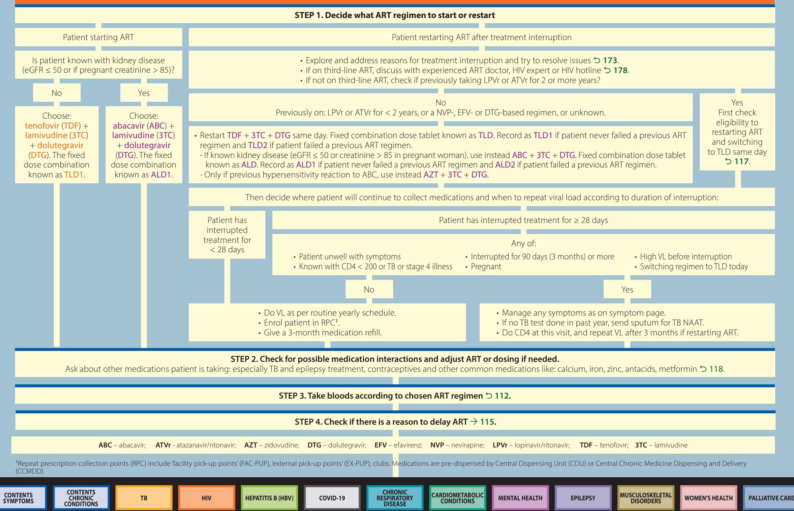

#### **STEP 4. Check if there is a reason to delay ART**

Aim to start same day but first check if there is a reason to delay ART:

If any of: difficulty breathing, respiratory rate ≥ 30, temperature ≥ 38°C, pulse > 100, BP < 90/60, confusion or agitation, or unable to walk unaided, delay starting ART and refer same day. Yes Start ART after 4-8 weeks of TB treatment. If pregnant or breastfeeding, start ART 4-6 weeks after starting TB treatment. • If DS-TB and CD4 < 50, start ART within 2 weeks of TB treatment as soon as tolerating TB treatment. • If RR-TB, start ART after 2 weeks of TB treatment if stable and tolerating TB treatment. If pregnant or breastfeeding, start ART within 2 weeks of starting TB treatment, when patient's symptoms are improving, and TB treatment is tolerated. No Yes Start ART after 8 weeks of TBtreatment.Yes If jaundice, check ALT and total bilirubin and manage according to results before starting ART [112](#page-108-0). If signs of meningitis, refer urgently. • If other severe acute illness, treat for 1-2 weeks before starting ART. Follow up blood results. If unsure, discuss with experienced ART doctor or HIV hotline [178](#page-174-0). Does patient have any of: CD4 < 50 RR-TB• Pregnant/breastfeeding YesYesNoDoes patient have jaundice, signs of meningitis (severe headache with neck stiffness/vomiting), or signs of other acute illness (like COVID-19, pneumonia or PJP)? CrAg not done (CD4 ≥ 100) CrAg negative CrAg positive Delay ART and refer for lumbar puncture (LP). If symptomatic (headache, confusion) or pregnant, refer urgently. If no cryptococcal meningitis on LP and no symptoms, start ART after 2 weeks of fluconazole. Start ART same day. • Follow-up blood results when available. Start ART after 4-6 weeksof meningitis treatment.Is patient known with TB1? Does patient have cough, weight loss, night sweats, fever, chest pain or blood-stained sputum? Known with TB meningitis or brain tuberculoma? Is patient known with cryptococcal meningitis1? NoNoIf CD4 < 100, check cryptococcal antigen (CrAg) result. Is CD4 result available?• Exclude TB [92](#page-88-0). Plan to start ART within 1 week once TB excluded.YesNo Yes NoNo

**STEP 5. Dose ART correctly according to chart [116](#page-112-0).**

1If patient has TB and cryptococcal meningitis, discuss with experienced ART clinician about when to start ART.

#### **STEP 5.Dose ART correctly according to chart**

- •Give 3 antiretrovirals (1 from each of the 3 sections in the table below) according to chosen ART regimen and blood results, if available.
- Where available, use fixed dose combination tablets. Prescribe in full (e.g. for TLD (TDF + 3TC + DTG): write tenofovir, oral, 300mg daily + lamivudine, oral, 300mg daily + dolutegravir, oral, 50mg daily.

|   | d Me ica ion t                                                             | Do se                                                                                                                                                                                                                                                                                                                                                                                                                                                                                                                                                                                                                                                                                                                    | he d W i n t o a vo                                                                                                                                                                | i de f fe (s Ur t s cts to g en e p l a d r fer da ire ira ) t tro an n e sa me v y                                                                                                                                                                                                                                                        | S ho i de f fe ha l ly rt- ter cts t t u m s e su a lve f p ks, I ist 6 s ≥ res o ers we e d fer isc /re us s                                                                                                                                                                                                                                                  | i de Lo -te ng rm s f fe cts e                                                                                                                                                       |
|---|----------------------------------------------------------------------------------------|-----------------------------------------------------------------------------------------------------------------------------------------------------------------------------------------------------------------------------------------------------------------------------------------------------------------------------------------------------------------------------------------------------------------------------------------------------------------------------------------------------------------------------------------------------------------------------------------------------------------------------------------------------------------------------------------------------------------------------|------------------------------------------------------------------------------------------------------------------------------------------------------------------------------------------------------|--------------------------------------------------------------------------------------------------------------------------------------------------------------------------------------------------------------------------------------------------------------------------------------------------------------------------------------------------------------------------------------------------------------------------------|----------------------------------------------------------------------------------------------------------------------------------------------------------------------------------------------------------------------------------------------------------------------------------------------------------------------------------------------------------------------------------------------------------------------------------------------------------------------------|--------------------------------------------------------------------------------------------------------------------------------------------------------------------------------------------------------------------|
| 1 | fov ir Te no ( ) T D F                                         | Cr C l > da ly. 5 0: g ive 3 0 0m i g • l ≤ d. Cr C 5 0: a i vo •                                                                                                                                                                                                                                                                                                                                                                                                                                                                                                                                                                                         | dn d Ki ise ey ase : • l ≤ G F R o Cr C 5 0 e r f p I nt: reg na • at inin 85 e > cre                            | dn fa lur Ki i ey e: f l < fer day I Cr C 3 0, r e sa me • f l 3 d u l l, re fer day I Cr C 0-5 0 a n nw e sa me • I f Cr C l 3 d w l l, re fer do 0-5 0 a to cto n e r. •                                                                                | Na it ing use a, v om                                                                                                                                                                                                                                                                                                                                                                                                                                       |                                                                                                                                                                                                                    |
|   | ba A ir cav ( A B C )                                          | ho ly da ly 3 0 0m 12 6 0 0m i g ur or g • lert d fou d kag f bac G ive "a " in p ing rni A ir ca r n ac wa ng o av • Hy Rea ( A H R ). it ivit ct ion p ers en s y                                                                                                                                                                                                                                                                                                                                                                              | Pre vio A H R us                                                                                                                                                                      | li ke ly f ≥ f: 1 ) ) h 3 ) A H R i 2 o Fev 2 Ras er bo dy Fat ig / in 4 ) Na it ing ue p a use a, v om , d ho b do l p ) So iar mi in 5 r ea or a na a re hro h o d f f ic lty bre hin i t at, at co ug r u g. |                                                                                                                                                                                                                                                                                                                                                                                                                                                                            |                                                                                                                                                                                                                    |
|   | do d Z i ine vu ( A Z T )                                | ly f d b le. Use i T D F a A B C n ita ot on n su • Cr C l ≥ ho ly. 10: ive 3 0 0m 12 g g ur • Cr C l < da ly. 10: ive 3 0 0m i g g •                                                                                                                                                                                                                                                                                                                                                                                                                                          | b ≤ b ≤ f H 8 ( H i 7, • ) nt p reg na hi ls ≤ Ne 1. 0 utr op • line li d On zo •                                | l lor h r An ia (p ) w it irat ≥ 3 0, te aem a esp ory ra d / fa hes izz ine int t p in. ss ne ss o r c a                                                                                                                                                                                                                            | da he, le p fat He in, ig a c na use a, m usc a ue f  ( H b ≤ do h A R T ). i 8 cto r to itc 117 sw                                                                                                                                                                                                                                                                       | hy fat los Lip ( oat rop s fac lim bs d in e, an bu ks ): s h t wit tto c c o T D F o A B C. r                           |
| 2 | La ivu d ine m ( C ) 3 T                                    | Cr C l > ho ly da ly. 5 0: g ive 15 0m 12 3 0 0m i g ur or g • Cr C l 10 da ly. -5 0: g ive 15 0m i g • l < da ly. Cr C 10: ive 5 0m i g g •                                                                                                                                                                                                                                                                                                                                                                                                                                   |                                                                                                                                                                                                      | Un co mm on                                                                                                                                                                                                                                                                                                                                                                                                           | Un co mm on                                                                                                                                                                                                                                                                                                                                                                                                                                                       | Un co mm on                                                                                                                                                                                               |
|   | Em ic ita b ine tr ( F T C )                             | Cr C l > 0: g 20 0m da ly. 5 ive i g • Cr C l 3 day 0-5 0: g ive 20 0m 2 g eve ry s. • l < d Cr C 3 0: isc uss •                                                                                                                                                                                                                                                                                                                                                                                                                                                                                                |                                                                                                                                                                                                      | Un co mm on                                                                                                                                                                                                                                                                                                                                                                                                           | Un co mm on                                                                                                                                                                                                                                                                                                                                                                                                                                                       | f p Da ken lm / ing r o a s les so                                                                                                                                                |
| 3 | Do lut ir eg rav ( D G ) T                                  | da ly 5 0m i g • f a lso f t hes d d d / I ica ion j ica ion t ust t on an y o e m e s, a m e s • do  fam ( ), lc ing 118 i ic in D S- T B iro ium s : r p n, c a , for lum ba ium iniu t mi ine ma g ne s or a m, me n, c ar ma zep , he in. to p ny                                                                                                                                                                                                             |                                                                                                                                                                                                      | Un co mm on                                                                                                                                                                                                                                                                                                                                                                                                           | He da he, d ho iarr a c na use a, ea • dv ke Ins nia ise in to ta tre atm t om : a en • he rni t mo ng                                                                                                                                                                                                                                                                     |                                                                                                                                                                                                                    |
|   | fav E ire nz ( ) E F V                                         | kg: da ly. 40 ive 6 0 0m i ≥ g g • kg: da ly. 40 ive 40 0m i < g g •                                                                                                                                                                                                                                                                                                                                                                                                                                                                                                                                                                                | Ac hia t ive tr ic p sy c • l lne i ss be da line On i q u •                                                                          | h  d ho Ras 67 Jau ice Psy is. n c s • b do l p hec k Na /vo mit ing /a mi in: use a na a c • A L T a d r lts hin 24 ho iew wit n ev re su urs  112                                                                                                                          | h  Ras 67 • da he, d lee b lem He izz ine a c ss, s p p ro s •  Low d 8 6. m oo •                                                                                                                                                                                                                                                                                              | Gy st ia nae co ma ( bre larg ): ast t en em en h t itc D T G sw o  117                                                                      |
|   | Lo ina ir / p v ito ir r na v ( L P Vr )  | ho ly (w h foo d ). f n ken 40 0 / 10 0m 12 it I L P Vr A T Vr r ta g ur eve or • da ly. in p ive 8 0 0 / 20 0m i ast , g g I f a lso f t hes d d d / do ica t ion j ust ica t ion ing on an y o e m e s, a m e s s •  fam ba he lam 118 i ic in, ine in, ig ine to otr : r p car ma zep , p ny , l co f lu bu de de ive ica / i ntr t t ora ace p son e son , | hro d ho C nic iar r ea • ho les l C / ter o • ly de d tr ig i ise cer s ra C k > V D r is 20 % • | d Jau ice n • b do l p hec k Na /vo mit ing /a mi in: use a na a c • A L T a d r lts hin ho iew wit 24 n ev re su urs  112                                                                                                                                                                               | ho f in lera b le o ks, D iar i 6 w to r ea: r > ee h t  itc D T G 117 sw o                                                                                                                                                                                                                                                                                                                          | lip dae f Dy i mia i s : l c ho lest l tot a ero ly de > 6 tr ig i or cer s h to > 5 itc A T Vr , sw  11 2. |
|   | Ata ir / za na v ito ir r na v ( A T Vr ) | / da ly (w h foo d ) 3 0 0m 10 0m i it g g • f a lso f t hes d d d I ica ion j ica ion / t ust t on an y o e m e s, a m e s • do  fam ba he ing 118 i ic in, ine in, to s : r p car ma zep , p ny f lu lam l co / bu de de otr ig ine ntr t ive t ica i , o ra ace p son e son ,                                                                                                                                                          | On fam ri ic in p • lan le On sop raz o •                                                                                                                     | Jau d h o he ice wi t t tom n r sy mp s • b do l p Na /vo mi ing /a mi in: t use a na a • he k d r lts hin A L T a iew wit c c n ev re su  ho 24 11 2. urs                                                                                                           | He da he a c • d ho he Jau ice wi t ut ot tom n r sy mp s: • hec k lt w hin A L T, r iew it 24 c ev re su ho A T Vr d ho j ice it ut urs can ca use au n w he h do it is. D isc it A R T at cto p uss w r o r ho line  H I V 178 t |                                                                                                                                                                                                                    |

**CONTENTS SYMPTOMSCONTENTS CHRONIC CONDITIONS**

**[TB](#page-85-0)**

**[HEPATITIS B \(HBV\)](#page-116-0) [COVID-19](#page-117-0)**

### **Switch ART**

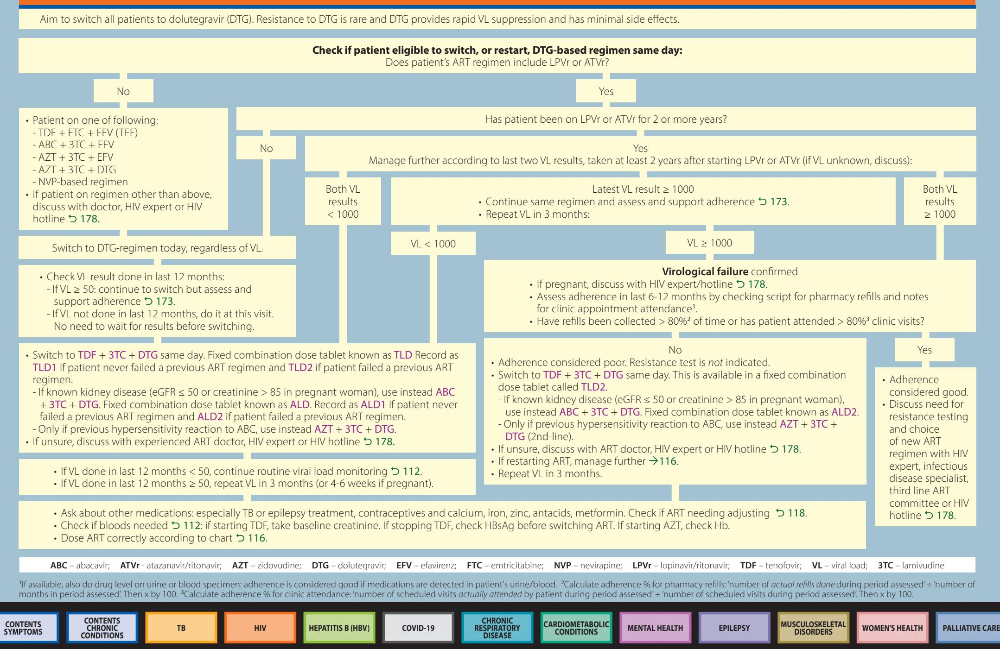

### **Manage ART medication interactions**

Ask patient if s/he is taking any over-the-counter or herbal/traditional medications.

If on or needing contraception: reassure that there are no interactions with DTG. If on other ART regimen, assess eligibility to switch to DTG [117](#page-113-0), otherwise manage below.

For other interactions: check SAMF, EMGuidance app, Liverpool HIV iChart app, use web-based interaction checker (see QR code) or discuss with HIV expert/hotline [178](#page-174-0).

| me As d m d ica ion int ion t ct se ss an an ag e c om mo n m e era s: |                                                                                                                      |                                                                                                                                                                                                                                                                                                                                                                                                                                                                                                                                                                                                                                                                                                                                                                                                                                                                                                                                                                                                                                                                                                                                        |                                                                                                              |    |
|---------------------------------------------------------------------------------------------------------------------------------------|----------------------------------------------------------------------------------------------------------------------|----------------------------------------------------------------------------------------------------------------------------------------------------------------------------------------------------------------------------------------------------------------------------------------------------------------------------------------------------------------------------------------------------------------------------------------------------------------------------------------------------------------------------------------------------------------------------------------------------------------------------------------------------------------------------------------------------------------------------------------------------------------------------------------------------------------------------------------------------------------------------------------------------------------------------------------------------------------------------------------------------------------------------------------------------------------------------------------------------------------------------------------|--------------------------------------------------------------------------------------------------------------|----|
| f o h d I is A R T m ica ion n t t e                                                              | he k fo d C int ing ica ion ct t c r era m e s                       | d d d do A j ica ion /o t m t us e s a n r se s                                                                                                                                                                                                                                                                                                                                                                                                                                                                                                                                                                                                                                                                                                                                                                                                                                                                                                                                                                                                                                     | int ion ct era s                                                                                 |    |
| lut ir ( ) Do D T G eg rav                                                                                 | fam Ri ic in p                                                                                           | do ho ly. f o f ixe d do b b let, d d ho fte Inc D T G 5 0m 12 I T L D o A L D ina ion D T G 5 0m 12 T L to t ta rea se se g ur n r se co m a g urs a r • his do l 2 ks a fte lete d, o i T B t t t tm t c se un we e r rea en om p r I f a lrea dy T B t d s A R T (p has be A R T ): c de T E E ( T D F + F T C + E F V ). Sw h t tm t a tar t ing at ien t i itc on rea en n ne ve r en on on s r o • ks a fte lete 2 w T B t tm t c ee r rea en om p                                                                                                                                                                                                       | do D o A L D Co inu nt r se. D T G- bas d r im e eg en | e  |
|                                                                                                                                       | lsa An ico t nts nvu : ba Ca ine r ma zep • P he in to ny • | d g ba he he h Av i ivin ine in t it D T G: to et o g car ma zep or p ny og r w • h t lam  f u b le t lam de lp  d v lp f w f c hi l d- Sw itc ig ine 9. I ig ine i 9. Av i i otr 14 otr te 14 te o na o u se , co ns r va roa o a roa om an o - I f u b le t h a lsa d p ba do f D T G t ho wit ico ien in o ine inc ive 5 0m 12 nt nt at t to na o s c nvu an re ma n c ar ma zep rea se se o o g g - ,                                                                                                                                                                                                                                                                                                                                        | bea l. rin ia ote nt g p ly. ur                                                   |    |
|                                                                                                                                       | d /or lc Iro ium n a n ca                                                                       | f ta kin ly, dv ke d D G t he h foo d. I iro ise iro T it to ta et g n o n a n a n og r w • f ta kin lc ly, dv ke lc d he h foo d. I ium ise ium D T G t it to ta et g ca on a ca an og r w • f ta kin d c lc dv ke d c lc he h foo d, he ke lea ho late I iro ium ise D T G a ium it iro to ta to et t n t o t t st 4 g n a n a , a n a g r w a n a urs r. •                                                                                                                                                                                                                                                                                                                                                                                                                             |                                                                                                              |    |
|                                                                                                                                       | Zin c                                                                                                             | for fte A dv ke lea ho be ho D T G. ise to ta zin t st 6 r 2 c a urs e o urs a r                                                                                                                                                                                                                                                                                                                                                                                                                                                                                                                                                                                                                                                                                                                                                                                                                                                                                                                                                                            |                                                                                                              |    |
|                                                                                                                                       | Ma /a lum (an ds ) ium iniu tac i g ne s m                                    | for fte A dv ke d a lea ho be ho D T G. ise to ta ant i t st 6 r 2 ac urs e o urs a r                                                                                                                                                                                                                                                                                                                                                                                                                                                                                                                                                                                                                                                                                                                                                                                                                                                                                                                                                                 |                                                                                                              |    |
|                                                                                                                                       | Me for mi t n                                                                                            | d g ha for ho ly. f d bet l le d, m (s lim de )  Av i ivin n 5 0 0m mi n 1 2 I ia 2 iri 13 1. re t t ntr to ste tar t g o g mo g me ur es un co o ove p ep                                                                                                                                                                                                                                                                                                                                                                                                                                                                                                                                                                                                                                                                                                                                                                                                                      |                                                                                                              |    |
| Lo ina ir /r ito ir ( L P Vr ) p na v v                                                     | fam Ri ic in p                                                                                           |  f n for f Ass lig b lity h t D T G I lig b le D T G s h, g du l ly do L P Vr d A L i i to itc 11 7. ot i wit inc ing to ess e sw o e c ra a rea se se o acc or •                                                                                                                                                                                                                                                                                                                                                                                                                                                                                                                                                                                                                                                                                                                                                                                             |  T 97                                                                                                 |    |
|                                                                                                                                       | An lsa ico t nts nvu : ba Ca ine r ma zep • he P in to ny • | lig b lity h t  f sw hin bo (se do lut ). Ass i i itc D T G 11 7. I itc D T G, inu ir r to to nt e t ess e sw o g co o m an ag e a s a ve e eg rav ow • f n for I lig i b le D T G s wit h, a i d g ivin ba ine he in t he it h L P Vr: ot to et e c vo g car ma zep or p ny og r w •  Sw h a lsa lam ig ine d do b le lam do f u b le t lam de lp itc ico otr ig ine 14 9. I ig ine i nt nt to otr otr nvu an u se na o u se , co ns r va - lp f w f c hi l d- be l. f u d h ho line  i ing ia I isc it H I V e / 17 8. te ote nt ert t va roa om an o ar p nsu re, uss xp w |  d 14 9. Av i te roa o                                                              |    |
|                                                                                                                                       | l co Ora ive ntr t ace p                                                                           |  f n Av d w h L P Vr. Ass lig b lity h to D T G I lig b le t h to D T G, d a I U D, s b de l im lan i it i i to itc 117 ot i wit ins tea o ess e sw e o s c use n u rm a p                                                                                                                                                                                                                                                                                                                                                                                                                                                                                                                                                                                                                                                                                                                                                                                    | b le a d c do t o r in j ect a n on                                            | ms |
|                                                                                                                                       | F lut / bu de de ica i son e son                                                       | d w h lig b lity h t  f n lig b le t h t d be lom ha Av i it L P Vr. Ass i i itc D T G 11 7. I i wit D T G, in e 1 to ot ste et o ess e sw o e o s c o use a c son                                                                                                                                                                                                                                                                                                                                                                                                                                                                                                                                                                                                                                                                                                                                                                                               | ho ly. 2 ur                                                                                         |    |
| Ata ir /r ito ir ( A T Vr ) za na na v v                                                    | fam Ri ic in p                                                                                           | for  Av d A T Vr. Ass lig b lity h t D T G i i i itc 11 7. o ess e sw o •  f n lig b le for h, d h / ho line h r fam fa bu h I i D T G s wit isc it T B e itc i ic in t i in o itc A T Vr L P Vr ot ert t to t to e c uss w xp sw p o r r sw •                                                                                                                                                                                                                                                                                                                                                                                                                                                                                                                                                                                                                                 | 17 8.                                                                                                     |    |
|                                                                                                                                       | ba he Ca ine in to r ma zep or p ny                                                 | lig b lity h t  f sw hin lso d ho f a lsa for bo Ass i i itc D T G I itc D T G, j ice ico L P V /r a to 11 7. to ust nt nt ess e sw o g a a c o nvu as ve. •  I f u b le t h t D T G, d h H I V ho line wit isc it 17 8 t na o s c o uss w •                                                                                                                                                                                                                                                                                                                                                                                                                                                                                                                                                                                                                                      |                                                                                                              |    |
|                                                                                                                                       | Ora l co ive ntr t ace p                                                                           | d w h lig b lity h to  f no lig b le t h to d a b de l im lan Av i it A T Vr. Ass i i itc D T G 11 7. I i wit D T G, ins I U D, s to t e tea o ess e sw o s c use n rm a p u                                                                                                                                                                                                                                                                                                                                                                                                                                                                                                                                                                                                                                                                                                                                                                                  | b le a d c do r in j t o ect a n on                                            | ms |
|                                                                                                                                       | lut bu de de F ica / i son e son                                                       |  Av d w h A T Vr. Ass lig b lity h t D T G I f n lig b le t h t D T G, d be lom ha i it i i itc 11 7. i wit in et e 1 to ot ste o ess e sw o e o s c o use a c son                                                                                                                                                                                                                                                                                                                                                                                                                                                                                                                                                                                                                                                                                                                                                                                               | ho ly. 2 ur                                                                                         |    |
| fav ire ( ) E E F V nz                                                                                        | Be da line i q u                                                                                      | d h t  Av i E F V. Sw itc D T G 11 7. o o                                                                                                                                                                                                                                                                                                                                                                                                                                                                                                                                                                                                                                                                                                                                                                                                                                                                                                                                                                                                                                             |                                                                                                              |    |
|                                                                                                                                       | l co Ora ive ntr t ace p • Su b de l im lan t rm a p •            |  Av d g hes he h E F V. Ass lig b lity h t D T G i ivin ive it i i itc 11 7. t tra t s to et to o g e c on cep g r w ess e sw o • f n lig b le t h t d b le a d c do I i wit D T G, in I U D o r in j ot ste ect e o s c o use a a n on ms •                                                                                                                                                                                                                                                                                                                                                                                                                                                                                                                                                                                                                                             |                                                                                                              |    |
| do d Z i ine ( A Z T ) vu                                                                               | li d Lin ezo                                                                                                |  Av d A Z T. D h H I V e / ho line i isc it ert t 17 8. o uss w xp                                                                                                                                                                                                                                                                                                                                                                                                                                                                                                                                                                                                                                                                                                                                                                                                                                                                                                                                                                                            |                                                                                                              |    |
|                                                                                                                                       |                                                                                                                      |                                                                                                                                                                                                                                                                                                                                                                                                                                                                                                                                                                                                                                                                                                                                                                                                                                                                                                                                                                                                                                                                                                                                        |                                                                                                              |    |

**ATVr** - atazanvir/ritonavir; **AZT** – zidovudine; **EFV** - efavirenz; **FTC** - emtricitabine; **LPVr** – lopinavir/ritonavir; **TDF** – tenofovir; **TEE** - TDF + FTC + EFV; **TLD** - TDF + 3TC + DTG; **3TC** - lamivudine

**[HEPATITIS B \(HBV\)](#page-116-0) [COVID-19](#page-117-0)**

Check for HIV

### **Manage the patient with an unsuppressed viral load (VL ≥ 50)**

**Assess and manage possible causes of unsuppressed viral load (VL ≥ 50):**

- If pregnant or breastfeeding [166](#page-162-0).
- Check for underlying causes of unsuppressed VL, especially adherence issues and medication interactions [173](#page-169-0).
- Emphasise condom use and contraception, especially while VL is unsuppressed

 If patient is *not* on TLD (or ALD), check if same day ART switch is appropriate [117](#page-113-0). •

If patient is on DTG-based regimen, continue below.

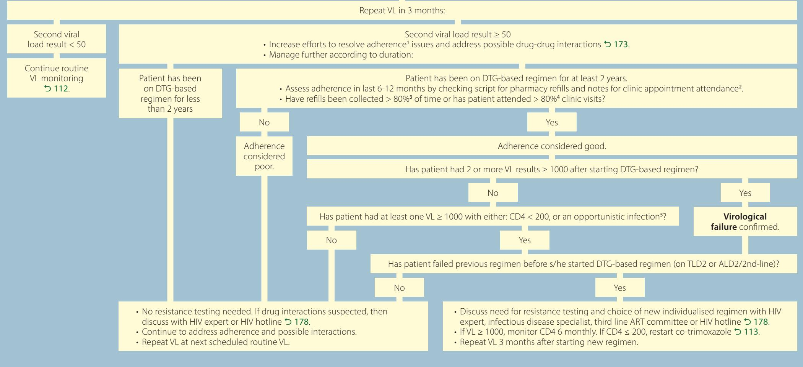

1Resistance to a DTG-based regimen is rare – the most probable cause for VL non-suppression is poor adherence. 2If available, also do drug level on urine or blood specimen: adherence is considered good if medications are detected in patient's urine/blood. 3Calculate adherence % for pharmacy refills: 'number of *actual refills done* during period assessed' ÷ 'number of months in period assessed'. Then x by 100. 4Calculate adherence % for clinic attendance: 'number of scheduled visits *actually attended* by patient during period assessed' ÷ 'number of scheduled visits during period assessed'. Then x by 100. 5Examples of opportunistic infections include TB, *Cryptococcal disease, Pneumocystis jirovecii* pneumonia *(PJP), Cryptosporidium, Isospora belli (Cystoisospora belli).* 

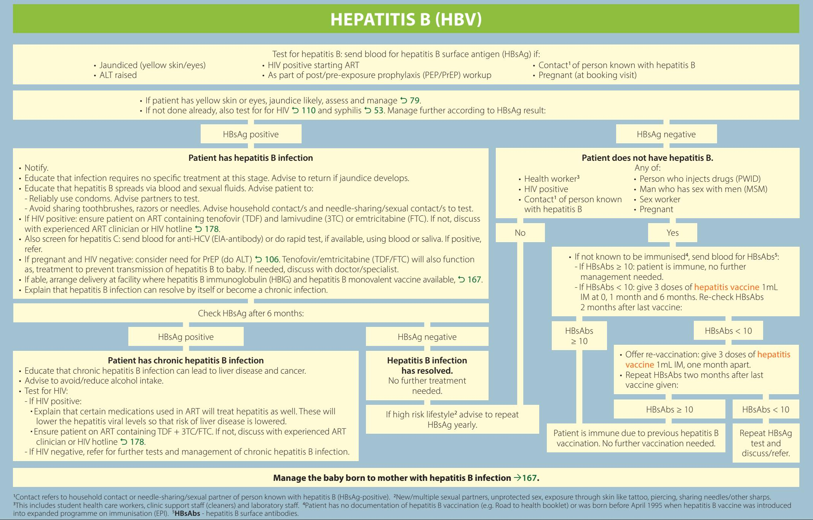

# **LONG COVID: ROUTINE CARE**

A patient is considered to have 'Long COVID' if s/he has ongoing symptoms for 2 or more months following acute COVID-19 infection (usually 3 months from the onset of COVID-19 symptoms).

| he h As ien it Lo C O V I D t at t w se ss p ng |                                                                                           |                                                                                                                                                                                                                                                                                                                                                                                                                                                                                                                                                                                                                                                                                                                                                                                                                                                                                                                                                                                                                                                                                                                                                                                                                                                                                                                                                                                                |  |  |  |
|----------------------------------------------------------------------------------------------------|-------------------------------------------------------------------------------------------|------------------------------------------------------------------------------------------------------------------------------------------------------------------------------------------------------------------------------------------------------------------------------------------------------------------------------------------------------------------------------------------------------------------------------------------------------------------------------------------------------------------------------------------------------------------------------------------------------------------------------------------------------------------------------------------------------------------------------------------------------------------------------------------------------------------------------------------------------------------------------------------------------------------------------------------------------------------------------------------------------------------------------------------------------------------------------------------------------------------------------------------------------------------------------------------------------------------------------------------------------------------------------------------------------------------------------------------------------------------------------------------------|--|--|--|
| As se ss                                                                                     | W he n t o a sse ss                                                        | No te                                                                                                                                                                                                                                                                                                                                                                                                                                                                                                                                                                                                                                                                                                                                                                                                                                                                                                                                                                                                                                                                                                                                                                                                                                                                                                                                                                                       |  |  |  |
| Sy tom mp s                                                                               | Eve vis it ry                                                                    | k a bo f ica l ly k a bo d f f ic lty lee d o As /s: i i ing ing in. Ma ut tom ut tom sy mp sp ec as u s p an ng o p a nag e a s o n s y mp p ag es. • I f p ho lise d for C O V I D- d bre h les las ks a fte d ha fer hy he f av la b le, for / ho ien ita 19 6 w isc iot ist, i i at t w at ts > to t as sp an sne ss ee r rg e, r e p s rap a as ses sm en me p rog ram me • f p dry h ≥ ks, de fer l to h a d lan he f av la b le. I iste 8 w i ist, i i nt e t ers co ug ee co ns r re ra a s p eec n g uag rap a • f sy l l p d t b ling fte ks, li ke lp kin h fer d h do list I i r 12 ( itat ion ), r / isc it /sp ia tom s st t a cto mp res en n rou a we e or un co mm on p a s, s ra s e uss w r ec • |  |  |  |
| T B                                                                                             | Eve vis it ry                                                                    | l low lts. f n du 'Lo C O ' w k-u d 1 le for his  Fo T B s I T B s rin V I D T B N A A T a vis it 9 2. utu utu nt utu t t up p m res u o p ms se g ng or p, sen sp m sam p                                                                                                                                                                                                                                                                                                                                                                                                                                                                                                                                                                                                                                                                                                                                                                                                                                                                                                                                                                                                                                         |  |  |  |
| ly Da i ivit ies act                                                                | Eve vis it ry                                                                    | f p b le t h a f da ly livi ( li ke bat hin dre ho kin ), c de fer l to la b le r ha b t be I ien it ivit ies i ing mi i i at t n ot ct a o c op e w o ng g, ss , g roo ng me ma g on s r re ra av a e eam m em r. ,                                                                                                                                                                                                                                                                                                                                                                                                                                                                                                                                                                                                                                                                                                                                                                                                                                                                                                                                                                        |  |  |  |
| hro d C nic it ion co n s                                                  | Eve vis it ry                                                                    | f p has hro d hec k c l an d g hec k t hat b loo ds hav be do I ien nic it ion ive ine C ine at t tro ut ut c co n , c on ro ca re. ro e en ne                                                                                                                                                                                                                                                                                                                                                                                                                                                                                                                                                                                                                                                                                                                                                                                                                                                                                                                                                                                                                                                                                                                   |  |  |  |
| l hea lt h Me nta                                                                   | Eve vis it ry                                                                    |  f st low d, a d m fur he I nxi 8 6. ety t res s, a or m oo sse ss a n an ag e r                                                                                                                                                                                                                                                                                                                                                                                                                                                                                                                                                                                                                                                                                                                                                                                                                                                                                                                                                                                                                                                                                                                                                                                                                                      |  |  |  |
| ly lan Fam i nin p g                                                             | d At iag is no s                                                           | f p ha d s d b d o l co ( ), do d ks o f t hro bo d c de h t ly l l, I ien C O V I D- 19 is o ine ive C O C isc ris is a i itc i at t ntr t cto r to est eve re an n c om ra ace p uss m s n on s r sw o p rog og en -on p b de l im lan fam ly lan ds  I U D o Ass i nin t. 154 co p p er r su rm a p ess p g nee                                                                                                                                                                                                                                                                                                                                                                                                                                                                                                                                                                                                                                                                                                                                                                         |  |  |  |
| fam Ca / ly i rer                                                                   | Eve vis it ry                                                                    | fam As k ho / ly i is c ing w c are r op                                                                                                                                                                                                                                                                                                                                                                                                                                                                                                                                                                                                                                                                                                                                                                                                                                                                                                                                                                                                                                                                                                                                                                                                                                                                                                                   |  |  |  |
| C V D r k is                                                                           | At d iag is no s                                                           | k a d  Ass C V D r is iag is 127 t ess no s                                                                                                                                                                                                                                                                                                                                                                                                                                                                                                                                                                                                                                                                                                                                                                                                                                                                                                                                                                                                                                                                                                                                                                                                                                                                                                         |  |  |  |
| ht We ig                                                                                     | Eve vis it ry                                                                    | f w fur  I ht los he ig t 23 e s, a sse ss r                                                                                                                                                                                                                                                                                                                                                                                                                                                                                                                                                                                                                                                                                                                                                                                                                                                                                                                                                                                                                                                                                                                                                                                                                                                                                                        |  |  |  |
| C hes t x- ray                                                                            | f co h / bre h les ks I ≥ 1 2 w at ug sne ss ee | f c hes bn l, re fer / d I isc t x- ray a orm a uss                                                                                                                                                                                                                                                                                                                                                                                                                                                                                                                                                                                                                                                                                                                                                                                                                                                                                                                                                                                                                                                                                                                                                                                                                                                                                                  |  |  |  |
| hy d T i ro                                                                            | dn ks Tir 12 ≥ e ess we e                                         | C hec k S f a bn l, re fer do T H. I to cto orm a r.                                                                                                                                                                                                                                                                                                                                                                                                                                                                                                                                                                                                                                                                                                                                                                                                                                                                                                                                                                                                                                                                                                                                                                                                                                                                                           |  |  |  |

#### **Advise the patient with Long COVID**

- Reassure that many people with COVID-19 have ongoing symptoms, even in mild cases. Explain that, normally, symptoms slowly resolve without specific treatment.
- Advise that symptoms may fluctuate and to expect good days and bad days. Advise to rest and pace activity. Set achievable targets and gradually increase activity according to symptom severity.
- Advise to look after general health: eat a healthy diet, get enough sleep, limit alcohol and caffeine and avoid illicit drugs.
- Extend sick leave as needed. Suggest patient speaks to employer about options to return to work more slowly. If unemployed, refer to SASSA to apply for COVID-19 Social Relief of Distress Grant.
- If needed, discuss what can be done to support carer/s and family. Identify local resources, social worker, counsellor, NGO, community action networks. Refer to occupational therapy if available.

#### **Treat the patient with Long COVID**

- Treat pain with paracetamol 1g 4-6 hourly (up to 4g in 24 hours) or ibuprofen 400mg 8 hourly with food for up to 2 weeks. Review need for pain medications after 2 weeks.
- Chronic overuse may cause headaches: if using painkillers > 2 days/week for ≥ 3 months, advise to reduce or stop pain medication.
- Encourage patient to get vaccinated unless unwell and being actively investigated, then discuss with specialist.

**[TB](#page-85-0)**

**CONTENTS SYMPTOMSCONTENTS CHRONIC CONDITIONS**

Help patient to manage ongoing symptoms of tiredness, breathlessness and cough [122](#page-118-0). Avoid prescribing inhalers used for asthma to treat breathlessness unless patient known with asthma.

### **Review the patient with Long COVID**

**[HIV](#page-102-0) [COVID-19](#page-117-0) [CHRONIC RESPIRATORY DISEASE](#page-119-0) [HEPATITIS B \(HBV\)](#page-116-0) [CARDIOMETABOLIC CONDITIONS](#page-123-0) [MUSCULOSKELETAL DISORDERS](#page-147-0) [MENTAL HEALTH](#page-136-0) [EPILEPSY](#page-145-0) [WOMEN'S HEALTH](#page-150-0) [PALLIATIVE CARE](#page-166-0)**

- If TB sputums sent at this visit: review in 2 days, otherwise review 2-4 weekly as needed. Expect gradual improvement.
- If no gradual improvement, refer/discuss. Advise to return urgently if breathlessness worsens, new or worsening confusion or unable to wake patient, chest pain or pressure that won't go away, new sudden weakness or numbness in face, leg or arm: refer.

### **Support the patient with 'Long COVID' to manage his/her symptoms at home**

 Explain that symptoms may differ between patients (no typical presentation) and may vary from day to day. S/he may find normal activities difficult (like washing/dressing/doing housework). •Invite patient to look at the below and help him/her to choose lifestyle changes that may help to manage his/her symptoms. Explore what might hinder or support this.

### **Pace yourself, plan and prioritise tasks**

- Build a regular routine. Plan each day so important tasks are done first.
- Avoid overdoing things on a good day. This may cause exhaustion the next day.
- Allow enough time to complete activities and to rest in between. Break tasks down into smaller ones.
- Ask others to help with the less important tasks. Think about how others can help you save your energy, like helping with groceries, cleaning and cooking.

### **Keep active**

**•**

**CONTENTS SYMPTOMSCONTENTS CHRONIC CONDITIONS**

- Start with light exercise (walking) for around 4-6 weeks. Gradually increase intensity to aim for 150 minutes per week (moderate intensity working in garden). Monitor immediate symptoms (like fatigue/breathlessness) as well as delayed symptoms and adapt as needed.
- Before returning to sport, ensure you are able to complete activities of daily living and walk 500m on the flat without excessive fatigue or breathlessness. Ensure you have at least 10 days' rest and be symptom-free for a minimum of 7 days before starting.

### **Keep a diary to track**

**improvement** Learn your patterns: learn what brings on utter exhaustion or other symptoms, and try to avoid these.

### **Eat well**

- Where possible, eat regular healthy meals that include
- fruit and vegetables.
- Drink plenty of water.
- Limit alcohol and caffeine.

### **Look after your mental health**

- Find time to relax: relaxing activities can help sleep and mental well-being– try deep breathing exercises, yoga, reading or having a relaxing bath or shower.
- •Find a creative or fun activity that you enjoy.
- Set small achievable goals that will give you a sense of accomplishment.
- Stay connected: spend time with supportive family and friends.
- • Talk to your family/family or friends: share/explain the impact that symptoms are having on your life. It can be hard for them to understand.

### **Help the patient to manage ongoing breathlessness and cough**

### **Advise patient to do the following when feeling breathless:**

 Stay calm, relax your neck and shoulders and choose a position that eases your work of breathing (see pictures). Think about your breathing: breathe in slowly through your nose, as if you are smelling roses. Breathe out through your mouth, pursing your lips as if you are blowing out a candle and try to relax rather than forcing it. Slowly count to 2 when inhaling and 3 counts during relaxation. Wipe a cool wet cloth over your nose and cheeks, this can help to relieve the feeling of breathlessness.

#### **•Advise the patient with ongoing dry cough:**

- Avoid breathing through your mouth as dry air irritates the airways and causes a cough. Try to interrupt cough cycle by closing your mouth, swallowing repeatedly and gently breathing through your nose until the urge to cough goes away. Sip drinks regularly (hot or cold). Suck boiled sweets or lozenges.
- **If productive cough, arrange physiotherapist for further techniques.**

**[TB](#page-85-0)**

 Sit on a chair and lean forward with elbows resting on knees.

**[HEPATITIS B \(HBV\)](#page-116-0) [COVID-19](#page-117-0)**

 Lean forward with elbows resting on the back of a chair.

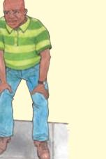

**[HIV](#page-102-0) [CHRONIC RESPIRATORY DISEASE](#page-119-0) [CARDIOMETABOLIC CONDITIONS](#page-123-0) [MUSCULOSKELETAL DISORDERS](#page-147-0) [MENTAL HEALTH](#page-136-0) [EPILEPSY](#page-145-0) [WOMEN'S HEALTH](#page-150-0) [PALLIATIVE CARE](#page-166-0)**

• Lean forward with hands resting on knees.

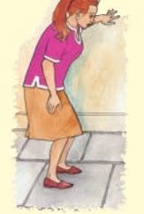

 Lean against a wall for support and rest your hand on your thigh or tuck your hand into your pocket.

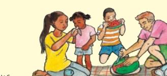

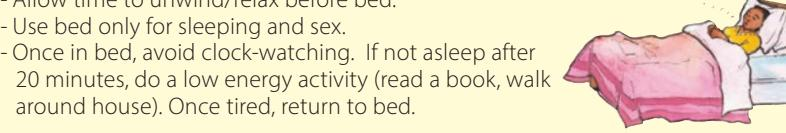

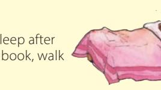

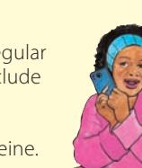

# Discuss your worries with someone you trust. Join a support group, if available. Consider speaking to your employer about options to return to work more slowly. If you have financial worries, arrange to see a social worker.

**Get help when you need it** 

 Allow time to unwind/relax before bed. Use bed only for sleeping and sex.

around house). Once tired, return to bed.

**Get enough sleep**

 Tiredness feels much worse if sleep patterns are disturbed. If difficulty sleeping: Establish a routine: try to get up at the same time each day (even if tired) and go

to bed the same time every evening. Avoid day time napping if able. Avoid caffeine and smoking for several hours before bedtime.

# **ASTHMA AND COPD: DIAGNOSIS**

Asthma and chronic obstructive pulmonary disease (COPD) both present with cough, wheeze, tight chest or difficulty breathing. Distinguish asthma from COPD:

### **Asthma** likely if several of:

- Onset before 20 years of age
- Associated hayfever, allergic conjunctivitis or eczema, other allergies
- Intermittent symptoms with normal breathing in between
- Symptoms worse at night, early morning, with cold or stress
- Patient or family have a history of asthma
- PEFR1 response to inhaled beta-agonist (e.g. salbutamol) improves ≥ 20% (see below). **Give routine asthma care [125](#page-121-0).**

### **COPD** likely if several of:

- Onset after 40 years of age
- Symptoms are persistent and worsen slowly over time
- Cough with sputum starts long before difficulty breathing
- History of heavy smoking or worked in dusty environment
- Previous diagnosis of TB
- Previous doctor diagnosis of COPD
  - **Give routine COPD care [126](#page-122-0).**

**Doctor to confirm diagnosis. If doctor not available, treat as asthma [125](#page-121-0) and refer to doctor within 1 month.**

### **How to measure peak expiratory flow rate (PEFR)**

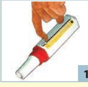

Move marker to bottom of numbered scale.

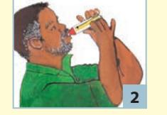

 Stand up and take a full, deep breath. • Hold breath and place mouthpiece between teeth.

Form a seal with lips.

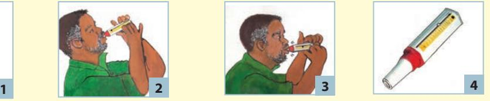

Breathe out as hard and as fast as possible (keeping fingers clear of Read the result. Move marker back to bottom and repeat twice. Use the highest of the 3 readings.

### **How to assess response to inhaled beta-agonist**

### **Calculate % PEFR response to inhaled beta-agonist to help diagnose asthma**

- Measure 'initial PEFR'. Use the highest reading of 3 results.
- Give inhaled salbutamol 200mcg (2 puffs via a spacer) and wait for 15 minutes.
- Repeat PEFR this is the 'repeat PEFR'
- Calculate % PEFR response = (repeat PEFR initial PEFR) x 100

Initial PEFR

If % PEFR response is ≥ 20%, **asthma** likely.

### **Using inhalers and spacers2**

 If patient unable to use an inhaler correctly, add a spacer to increase drug delivery to lungs, especially if using inhaled corticosteroids. This may also reduce the risk of oral candida. Clean the spacer before first use and weekly: remove the canister and wash spacer with soapy water. Allow to drip dry. Avoid rinsing with water after each use.

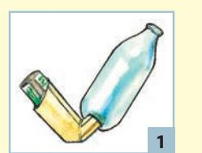

•

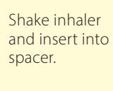

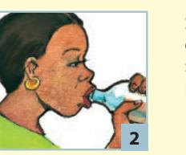

scale).

Stand up and breathe out. Then form a seal with lips around mouthpiece.

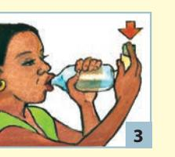

Press pump once to release one puff into spacer.

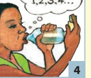

 Then take 4 breaths keeping spacer in mouth.

- Repeat step 3 and 4 for each puff.
- Rinse mouth after using inhaled corticosteroid.

1Peak expiratory flow rate. 2If no spacer available, explain how to use inhaler without spacer: take off cap and shake inhaler. Stand up and breathe out. Then form seal with lips around inhaler mouthpiece. Breathe in slowly. As breathing in, press pump once and keep breathing in slowly. Close mouth and hold breath for 10 seconds. Breathe out.

### **Calculate % of predicted PEFR**

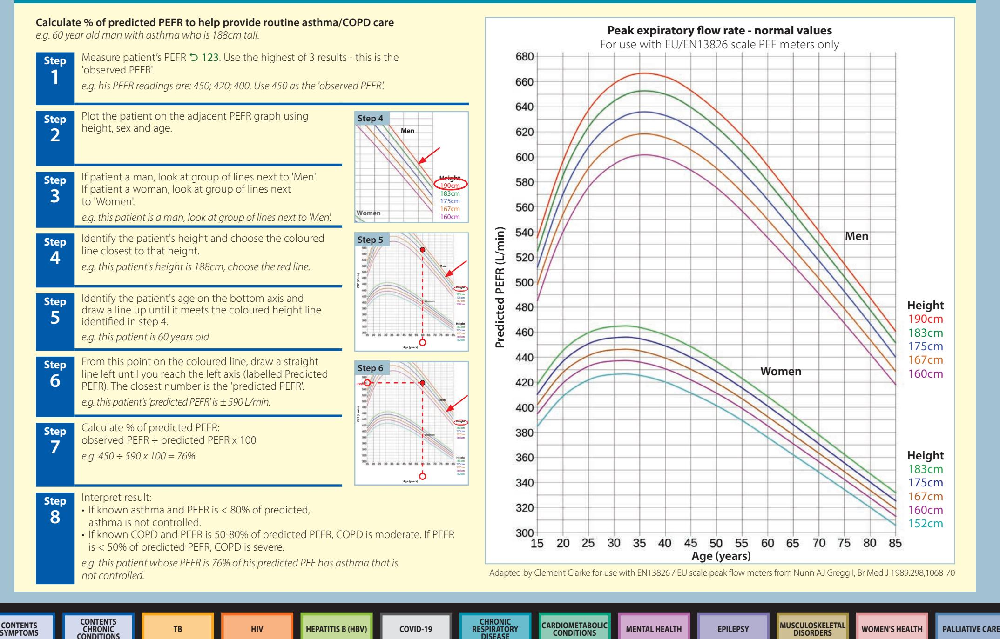

### **ASTHMA: ROUTINE CARE**

Ensure that a doctor confirms the diagnosis of asthma within 1 month. Refer the patient with newly diagnosed asthma for community health worker support, if available.

| he ien it h a hm As t at t w st se ss p a           |                                                                                                                                                                                                  |                                                                                                                                                                                                                                                                                                                                                                                                                                                                                                                                                                                                                                                                                                                                                                                                                                                                                                                                                                                                                                                                                                                                                                                                            |  |  |  |  |  |
|--------------------------------------------------------------------------------------------|--------------------------------------------------------------------------------------------------------------------------------------------------------------------------------------------------|------------------------------------------------------------------------------------------------------------------------------------------------------------------------------------------------------------------------------------------------------------------------------------------------------------------------------------------------------------------------------------------------------------------------------------------------------------------------------------------------------------------------------------------------------------------------------------------------------------------------------------------------------------------------------------------------------------------------------------------------------------------------------------------------------------------------------------------------------------------------------------------------------------------------------------------------------------------------------------------------------------------------------------------------------------------------------------------------------------------------------------------------------------------------------------------------------------|--|--|--|--|--|
| As se ss                                                                             | he W n t o a sse ss                                                                                                                                                               | No te                                                                                                                                                                                                                                                                                                                                                                                                                                                                                                                                                                                                                                                                                                                                                                                                                                                                                                                                                                                                                                                                                                                                                                                                   |  |  |  |  |  |
| Ast hm tom s to a s y mp de l mi ter ntr ne co o | Eve vis it ry                                                                                                                                                                           | f w hee ht hes d f f ic lty bre hin d n l bu l in ha ler, bat  I ig i ion 3 9. t t o at to tam cut ze, c r u g an o r esp on se sa o m an ag e a e e xac er • f t he fo l low d hat he hm l le d: An ing in ica ien 's a is n te t t at t st ot ntr co o y o p a • f f ic Da h, d lty bre hin hee k t im i at > 2 t im y e c ou g u g or w ze es a w ee - ht- h, w hee ht hes d f f ic lty bre hin h Nig im ig i t t t o at t > o e c ou g ze, c r u g nce a m on - f da ly du hm Lim itat ion i ivit ies act e t st tom o o a a s mp s y - f n f a I bo he hm l le d. t st is c tro on e o ve n a a on • |  |  |  |  |  |
| he Ot tom r sy mp s                                                         | Eve vis it ry                                                                                                                                                                           |   Ma As k a bo d m l lerg hin d dy tom tom ut ic r it is 34 ia 44 nag e s y mp s a s o n s y mp p ag es. an an ag e a an sp ep s • f u ha le d c d a d w hit hes hee ks /g /to /p late l ca d i da li ke ly  I ing in ico i 35 ort ste atc s ro n e p on c um s ng ue a , o ra n •                                                                                                                                                                                                                                                                                                                                                                                                                                                                                                                                                                                                                                                 |  |  |  |  |  |
| A d he d ha ler hn in tec iq ren ce an ue           | Eve vis it ry                                                                                                                                                                           | hec k a d he d t hat ha ler d s ly  f n d he d he  C ien is u ing in 123 I ive 173 at t ct ot t, g ort ren ce an p s an p ace r co rre a ren a ren ce sup p                                                                                                                                                                                                                                                                                                                                                                                                                                                                                                                                                                                                                                                                                                                                                                                                                                                                                              |  |  |  |  |  |
| Pea k e f lo ( P E F R ) irat rat xp ory w e  | At d f sy f iag is, i tom ing i no s mp s w ors en , ha d las ica ion is it e t t at t v c ng o m e | lcu late f p d d  f < hm l le d. Ca % icte P E F R 124 I 8 0 %, is n ast ot ntr o re a co o                                                                                                                                                                                                                                                                                                                                                                                                                                                                                                                                                                                                                                                                                                                                                                                                                                                                                                                                                                                                                  |  |  |  |  |  |
|                                                                                            |                                                                                                                                                                                                  |  116                                                                                                                                                                                                                                                                                                                                                                                                                                                                                                                                                                                                                                                                                                                                                                                                                                                                                                                                                                                                                                                                                                                                                                                                   |  |  |  |  |  |

#### **Advise the patient with asthma**

- Advise to avoid triggers that may worsen asthma/hayfever (e.g. animals, cigarette smoke, dust, chemicals, pollen, grass), aspirin/NSAIDs (e.g. ibuprofen) and beta-blockers (e.g. atenolol).
- If patient smokes, encourage to stop [141](#page-137-0). Support the patient to make a change [177](#page-173-0).
- • Ensure the patient understands medication: beta-agonist inhaler (salbutamol) relieves symptoms but does not control asthma. Inhaled corticosteroid (beclomethasone or fluticasone) prevents but does not relieve symptoms and it is the mainstay of treatment.
- Inhaled corticosteroids can cause oral candida: advise patient to rinse and gargle after each dose of inhaled corticosteroid.

### **Treat the patient with asthma**

- Give influenza vaccine 0.5mL IM yearly. Check that patient is up to date with COVID-19 vaccine.
- Give inhaled salbutamol 100-200mcg (1-2 puffs) 6-8 hourly, as needed. If exercise-related symptoms, advise patient to use salbutamol 200mcg (2 puffs) before exercise.
- • If acute exacerbation was managed at this visit:
  - Give prednisone 40mg daily for a total of 7 days. If > 2 courses of oral prednisone given in past 6 months or exacerbation occurs on maximum treatment, also refer to doctor.
- Only give antibiotic if fever or thick yellow/green sputum: give amoxicillin1 500mg 8 hourly for 5 days. If severe penicillin allergy1, give instead azithromycin 500mg daily for 3 days. Manage further according to asthma control:

| As hm l le d o ba ion t ot ntr te t a n co o r a cu ex ac er                                                                                                                                     | As hm l le d t tro a c on                                                                                                                                                                                                         |
|-----------------------------------------------------------------------------------------------------------------------------------------------------------------------------------------------------------------------------------------------------------|-----------------------------------------------------------------------------------------------------------------------------------------------------------------------------------------------------------------------------------------------------------|
|  for d he d u ha ler /sp ly d Be ing ing in 12 3 a tep tre atm t, e t a t e s p up en nsu re a ren n s ace r c orr ec n •                 | Co ha le d m d do inu in ica ion nt t at e e sa me se. •                                                                                                                                            |
| he k p d kin l ler d c d 2. ien is a i ing in ica ion at t ert t c c vo sm o g, a g en s a n a me s                                                    | f c l le d a d n ba for hs, do I ion 6 m tro te t t st tre atm t: on n o a cu exa ce r s ≥ on ep wn en •                                               |
| f a G ha le d be lom ha ho ly. I lre dy do ive in et 20 0m 12 it, in to 40 0m c so ne cg ur a on cre ase se cg •                              | f o f lu 3 4 I lm l / ica his d g ive in d be lom ha 0 0m 12 ho ly. ete t top t ste et n s a ro so ne , s an a c so ne cg ur - |
| ho ly. 12 ur                                                                                                                                                                                                                                     | I f o be lom ha de do ho ly. I f a lre dy et to 20 0m 12 20 0m top n c so ne cre ase se cg ur a on cg , s - ,                                    |
| f st l l n l le d, do be lom ha d g d ha le d s lm l I i ive in in / ot ntr cto r to st et ste ete co o op c so ne an a a ro • | be lom ha et c so ne                                                                                                                                                                                                                    |
| f lu 3 5 f f 1 f st fte fer ica 0 / 25 0m 2 ho ly. I i l l n l le d a r 3 hs, t 1 p ot ntr t so ne cg u ur co o m on re ,         | f sy d d do he l le d. I ica ion ien tom tep to t at t w ntr mp s w ors en , s up sa me m e an se n p as co o w -                             |

If asthma controlled, review 3 monthly. If not controlled, review monthly. If acute exacerbation, review after 1 week. **Advise to return before next appointment if symptoms persist/worsen.** 

1History of anaphylaxis, urticaria or angioedema. 2NSAIDS (aspirin/ibuprofen), beta blockers. 3If on lopinavir/ritonavir or atazanavir/ritonavir, avoid *budesonide* and fluticasone, and discuss/refer instead.

### **CHRONIC OBSTRUCTIVE PULMONARY DISEASE (COPD): ROUTINE CARE**

Ensure that a doctor confirms the diagnosis of COPD within 1 month and refer for spirometry if available. Refer the patient with newly diagnosed COPD for community health worker support.

| he ien it h As C O P D t at t w se ss p         |                                                                                                                                                                                                        |                                                                                                                                                                                                                                                                                                                                                                                                                                                                                                                                                                                                                                                                                                                                                                                                                                                                                                                                                                                              |  |  |  |  |
|-------------------------------------------------------------------------------------------|--------------------------------------------------------------------------------------------------------------------------------------------------------------------------------------------------------|----------------------------------------------------------------------------------------------------------------------------------------------------------------------------------------------------------------------------------------------------------------------------------------------------------------------------------------------------------------------------------------------------------------------------------------------------------------------------------------------------------------------------------------------------------------------------------------------------------------------------------------------------------------------------------------------------------------------------------------------------------------------------------------------------------------------------------------------------------------------------------------------------------------------------------------------------------------------------------------------|--|--|--|--|
| As se ss                                                                            | he W n t o a sse ss                                                                                                                                                                     | No te                                                                                                                                                                                                                                                                                                                                                                                                                                                                                                                                                                                                                                                                                                                                                                                                                                                                                                                                                                                     |  |  |  |  |
| C O P D s tom y mp s                                                 | Eve vis it ry                                                                                                                                                                                 | f p has hee /t ht hes d bre h les hi le t l kin bat  I ien ig irat ≥ 3 0, m ion 3 9. at t t a at t re st o te cut w ze c n s a r w a g or res p ory ra an ag e a e e xac er • d f p l k a fas he f sa l d. f n de Ass ise rity i ien C O P D is m i I C O P D is m at t c t a t ot, rat o e o r se ve re. ess ase se ve : an wa s s o rs o me ag e, • for f p  Inv T B o ly has he T B s li ke ht los ht b loo d-s d s est ig ate i at ien t ot tom ig ig eat ta ine utu 9 2. n r y mp s we s, n sw s, p m • |  |  |  |  |
| he Ot tom r sy mp s                                                        | Eve vis it ry                                                                                                                                                                                 | Ma tom tom nag e s y mp s a s o n s y mp p ag es. • f u ha le d c d a d w hit hes hee ks late l ca d da li ke ly  I ing in ico i /g /to /p i 35 ort ste atc , o ra n s ro n e p on c um s ng ue a • I f sw l ling bo h leg fer do de hea fa lur in t to cto r to i rt i e s, r e co ns r e. • f p ks, d a dv  I in ≥ 4 w ise 61 a ee ass ess an •                                                                                                                                                                                                                                                                                                            |  |  |  |  |
| d he d ha ler hn A in iq tec ren ce an ue          | Eve vis it ry                                                                                                                                                                                 |   C hec k a d he d t hat ha ler ly f n d he d he ien in 123 I ive 173 at t c ct ot t, g ort ren ce an p an use co rre a ren a ren ce sup p                                                                                                                                                                                                                                                                                                                                                                                                                                                                                                                                                                                                                                                                                                                |  |  |  |  |
| De ion p res s                                                                | Eve vis it ry                                                                                                                                                                                 |  In t he h, has ) fe lt do de d, ho les ) fe lt litt le lea do hin ? I f y he ast t at ien t: 1 r 2 int st o in ing t to it 143 p m on p wn p res se p e s o ere r p sur e g s es e r ,                                                                                                                                                                                                                                                                                                                                                                                                                                                                                                                                                                                                                    |  |  |  |  |
| l liat Pa ive ca re                                                        | Eve vis it ry                                                                                                                                                                                 | f se for fa  I C O P D w h bre h les > 3 ho l a dm C O P D hea lur lon he de d 170 it at t re st, ita iss ion in 1 y rt i ter t ve re sne ss a sp s ear e o r g m oxy g en rap y nee ,                                                                                                                                                                                                                                                                                                                                                                                                                                                                                                                                                                                                                        |  |  |  |  |
| C k V D r is                                                                  | d At iag is no s                                                                                                                                                                        | he h d r k o f ca d lar d k  T ien it C O P D is a inc is iov ise Ass C V D r is 127 at t w t p rea se r asc u ase ess                                                                                                                                                                                                                                                                                                                                                                                                                                                                                                                                                                                                                                                                                                                                                    |  |  |  |  |
| Pea k e f lo ( P R ) irat E F rat xp ory w e | d At iag is no s • f sy I ing tom mp s w ors en • f c ha d las I ica ion is it e t t at t v ng o m e • | lcu late f p d d  Ca % icte P E F R 124 o re f 5 I 0- 8 0 %, C O P D de is m rat o e. • f < C O P D I 5 0 %, is s ev ere •                                                                                                                                                                                                                                                                                                                                                                                                                                                                                                                                                                                                                                                                                                                              |  |  |  |  |

#### **Advise the patient with COPD**

 If patient smokes, encourage to stop [141](#page-137-0). Stopping smoking is the mainstay of COPD care. Support patient to change [177](#page-173-0).

Encourage the patient to take a walk daily and to increase activities of daily living like gardening, housework and using stairs instead of lifts.

Inhaled corticosteroids can cause oral candida: advise patient to rinse and gargle after each dose of salmeterol/fluticasone.

#### **Treat the patient with COPD**

- Give influenza vaccine 0.5mL IM yearly. Check that patient is up to date with COVID-19 vaccine.
- Give inhaled salbutamol 100-200mcg (1-2 puffs) 6-8 hourly, as needed.
- Before adjusting or starting treatment, ensure patient is adherent and knows how to use an inhaler and spacer correctly [123](#page-119-0).
- If patient has **moderate** or **severe** COPD and not controlled on salbutamol alone, decide which treatment to add:
- If COPD diagnosis confirmed on spirometry and < 2 exacerbations in past year: add inhaled formoterol 12mcg, 1 puff 12 hourly.
- If spirometry not done, ≥ 2 exacerbations in past year or no better with formoterol: add inhaled salmeterol/fluticasone1 50/250mcg, 1 puff 12 hourly (stop formoterol if on it).
- If acute exacerbation was managed at this visit:

•

- If patient received prednisone or hydrocortisone, continue prednisone 40mg daily for a total of 7 days.
- If sputum increased or colour changed to yellow/green, give amoxicillin 500mg 8 hourly for 5 days. If severe penicillin allergy2, give instead doxycycline 100mg 12 hourly for 5 days.

If recent exacerbation, treatment adjustment, symptoms worse than usual or not coping as well as before, review monthly. Otherwise review 3-6 monthly.

- If no better with treatment after 3 months, discuss/refer.
- Refer to Lung Unit to arrange long-term home oxygen therapy if patient is not smoking and still has moderate to severe symptoms (decreased oxygen saturations) despite treatment for ≥ 3 months.

1If on lopinavir/ritonavir or atazanavir/ritonavir, avoid fluticasone and discuss/refer instead. 2History of anaphylaxis, urticaria or angioedema.

120

### **CARDIOVASCULAR DISEASE (CVD) RISK: DIAGNOSIS**

|                                                                                                                                                                                                                                                                                                                                                                                                                                                                                                                                                                                                                                                                                                                                                                                                                                                                                                                                                                                                                                                                                                                                                                                                                                                                                                                                                                                                                                                                                                        |                                                                                                        |                                                                                                                                                           |                                                                                                                                                       | C V                                                                                                                                                           | k D r is is t                                                                                    | he ha f ha c nc e o                                                                                                                                     | ing v a                                                                                                                  | he art at                                                                       | k o ke tac tro r s                                                                                                           | he t ov er ne                                                                                                          | 10 xt y ea rs                                         |                                              |                                   |                                    |               |         |
|--------------------------------------------------------------------------------------------------------------------------------------------------------------------------------------------------------------------------------------------------------------------------------------------------------------------------------------------------------------------------------------------------------------------------------------------------------------------------------------------------------------------------------------------------------------------------------------------------------------------------------------------------------------------------------------------------------------------------------------------------------------------------------------------------------------------------------------------------------------------------------------------------------------------------------------------------------------------------------------------------------------------------------------------------------------------------------------------------------------------------------------------------------------------------------------------------------------------------------------------------------------------------------------------------------------------------------------------------------------------------------------------------------------------------------------------------------------------------------------------------------|--------------------------------------------------------------------------------------------------------|-----------------------------------------------------------------------------------------------------------------------------------------------------------|-------------------------------------------------------------------------------------------------------------------------------------------------------|------------------------------------------------------------------------------------------------------------------------------------------------------------------|-----------------------------------------------------------------------------------------------------------|---------------------------------------------------------------------------------------------------------------------------------------------------------------------------|--------------------------------------------------------------------------------------------------------------------------------|---------------------------------------------------------------------------------------|------------------------------------------------------------------------------------------------------------------------------------------|------------------------------------------------------------------------------------------------------------------------------------|-------------------------------------------------------------------|----------------------------------------------|-----------------------------------|------------------------------------|---------------|---------|
| de fy f t he i i nt f p I ha at ien t s • f c /re I t urr en f c I /re t urr en f n I d de ew su                                                                                                                                                                                                                                                                                                                                                                                                                                                                                                                                                                                                                                                                                                                                                                                                                                                                                                                                                                                                                                                                                                                                                                                                                                                                                                       | ien at p ha d p nt c nt sy                                                     | ha b t sta s e he iou art rev s in, st p a in, p a esp etr ic w ea                            | l he d is C V D: k, s at tac tro l ly ia ec on l ly ia on a w kn ess or nu | ke T I or ion ert kin g an bn ess                                                                                                  | A o kn r is d r liev e d r liev d e e f fac e, a                   | h a it ina ow n w ng d by i t, c res on s by de i t, c res on s f f ic leg d i or u ; | ( ha isc de isc r ip r p er lty sp ea                                                         | he ic art em ha ic em he l v ra as kin g or    | d ) o ise ase r p er d ise art as e lar d ise as e l d ba istu ua r nc | he l va ip ra scu 13 7. 13 9. de i on s                                                        | lar d ise ase ke T I ro or                | , m an ag e a s  13 6. |  C V D 12 9.      |                                    |               |         |
| k for d i o m o k a bo As ut Ca lcu lat B M e Me asu re wa k for hy Lo p o Lo k for d ia o                                                                                                                                                                                                                                                                                                                                                                                                                                                                                                                                                                                                                                                                                                                                                                                                                                                                                                                                                                                                                                                                                                                                                                                                                                                                                                             | b le k ing o I: w ig e irc c en s tes i :                    | k C V D r is de i r t : co ns ht ( kg ) ÷ he fer en ce he k ion : c c kn ot ow | to rs: ien at p ht (m ) ÷ ig hi le s d tan f P. I B P ≥ h d it ia                      | ho q u ht ig ing or 0 / 9 0 a n he tes , c                                                                             | kin mo g ). A B M I > hin at g d n kn ot k g luc c ose | he t ast p y ea k fac 25 is is a r dw be i t, m ay h hy it ert n w p  17                         | sm o ee n ion s                                                                                                 | for C V b a ri est 13 2.                                         | k a is sse ssm en d t f i liac op o                                                                           | t. Mo est t re                                                                                                         | n 8 0c m                                                    | ) o r 9 om an                       | (m ) m an                | k fac ris tor             |               |         |
| lcu lat he k f n b l he d Ca ien 's C V D r is i is C V D: e t at t sta p o e Ste p f to I l an d H D L c ho les l re lts la b le, lcu lat he 's 1 C V D r k s be low he E M Gu da l. ta ter i e t at ien t 0-y is e t i too o su ava ca p ea r co re or us nc e a p p • 3 f c ho les l re lts la b le, d t he ha ha lcu lat C k u  I i in V D r is B M I 12 8. ter t a ste rt t t c o su are no va use a c a es s •                                                                                                                                                                                                                                                                                                                                                                                                                                                                                                                                                                                                                                                                      |                                                                                                        |                                                                                                                                                           |                                                                                                                                                       |                                                                                                                                                                  |                                                                                                           |                                                                                                                                                                           |                                                                                                                                |                                                                                       |                                                                                                                                          |                                                                                                                                    |                                                                   |                                              |                                   |                                    |               |         |
| f n I b l is he d C V D a d c ho les l av i la b le, lcu lat he ien 's 1 0-y C V D r is k u ing he ing be low sta ter e t at t t ste o e n o a ca p ea r s sc or sy m Ca lcu lat C D r k s by d d he h o f t he b les be low 's a l c ho les l, D ho les l, B P, s kin d d be V is ing int in ing ien H L c ia t ta at t to ta ter ter sta tus tes st atu e co re a p o s ea c , u s p g e, s ex, o o mo g an s: • f m f sc he k is f sc he k is f sc he k is I i 11, C V D r is 10 %. I 11 -14 C V D r is 10 -20 %. I 15, C V D r is 20 %. t t t an ore < n < ore n ore ≥ n > : - , f w f sc he k is f sc he k is f sc he k is I i 13, C V D r is 10 %. I 13 C V D r is 10 -20 %. I 18, C V D r is 20 %. t -17 t t < < ≥ > om an : ore n ore n ore n - , |                                                                                                        |                                                                                                                                                           |                                                                                                                                                       |                                                                                                                                                                  |                                                                                                           |                                                                                                                                                                           |                                                                                                                                |                                                                                       |                                                                                                                                          |                                                                                                                                    |                                                                   |                                              |                                   |                                    |               |         |
| (y ) Ag e ea rs                                                                                                                                                                                                                                                                                                                                                                                                                                                                                                                                                                                                                                                                                                                                                                                                                                                                                                                                                                                                                                                                                                                                                                                                                                                                                                                                                                                                                                                                         | Ma n                                                                                                | Wo ma n                                                                                                                                             | l To ta                                                                                                                                         | Ma                                                                                                                                                               | Wo ma n                                                                                             | D H L                                                                                                                                                               | Ma n                                                                                                                        | Wo ma n                                                                         | Sy l ic B sto                                                                                                                |                                                                                                                                    | n                                                                 | Wo                                           | n                                 |                                    | Ma Wo n | ma n |
| 35 -3 9                                                                                                                                                                                                                                                                                                                                                                                                                                                                                                                                                                                                                                                                                                                                                                                                                                                                                                                                                                                                                                                                                                                                                                                                                                                                                                                                                                                                                                                                                          | 2                                                                                                      | 2                                                                                                                                                         | ho les c                                                                                                                                        | l o                                                                                                                                                           |                                                                                                           | ho les ter c o                                                                                                                                                | l                                                                                                                              |                                                                                       | (m Hg ) m                                                                                                                       | No B P t o n                                                                                                           | On B P                                                      | No B P t o n                     | On B P                      | Sm ke o r                 | 4 3        |         |
| 40 -44                                                                                                                                                                                                                                                                                                                                                                                                                                                                                                                                                                                                                                                                                                                                                                                                                                                                                                                                                                                                                                                                                                                                                                                                                                                                                                                                                                                                                                                                                              | 5                                                                                                      | 4                                                                                                                                                         | mo                                                                                                                                                    |                                                                                                                                                                  |                                                                                                           | mo                                                                                                                                                                        |                                                                                                                                |                                                                                       |                                                                                                                                          | tre atm t en                                                                                                              | tre atm t en                                             | tre atm t en                        | tre atm t en             | ia be D tes               | 3 4        |         |
|                                                                                                                                                                                                                                                                                                                                                                                                                                                                                                                                                                                                                                                                                                                                                                                                                                                                                                                                                                                                                                                                                                                                                                                                                                                                                                                                                                                                                                                                                                        |                                                                                                        |                                                                                                                                                           |                                                                                                                                                       |                                                                                                                                                                  |                                                                                                           |                                                                                                                                                                           |                                                                                                                                |                                                                                       |                                                                                                                                          |                                                                                                                                    |                                                                   |                                              |                                   |                                    |               |         |
|                                                                                                                                                                                                                                                                                                                                                                                                                                                                                                                                                                                                                                                                                                                                                                                                                                                                                                                                                                                                                                                                                                                                                                                                                                                                                                                                                                                                                                                                                                        |                                                                                                        |                                                                                                                                                           |                                                                                                                                                       |                                                                                                                                                                  |                                                                                                           |                                                                                                                                                                           |                                                                                                                                |                                                                                       |                                                                                                                                          |                                                                                                                                    |                                                                   |                                              |                                   |                                    |               |         |
|                                                                                                                                                                                                                                                                                                                                                                                                                                                                                                                                                                                                                                                                                                                                                                                                                                                                                                                                                                                                                                                                                                                                                                                                                                                                                                                                                                                                                                                                                                        |                                                                                                        |                                                                                                                                                           | 6. 2-7 2                                                                                                                                        | 3                                                                                                                                                                | 4                                                                                                         | 0. 9-1 .1 9                                                                                                                                                      | 1                                                                                                                              | 1                                                                                     |                                                                                                                                          |                                                                                                                                    |                                                                   |                                              |                                   |                                    |               |         |
|                                                                                                                                                                                                                                                                                                                                                                                                                                                                                                                                                                                                                                                                                                                                                                                                                                                                                                                                                                                                                                                                                                                                                                                                                                                                                                                                                                                                                                                                                                        |                                                                                                        |                                                                                                                                                           | > 7 2                                                                                                                                              | 4                                                                                                                                                                | 5                                                                                                         | < 0 9                                                                                                                                                                  | 2                                                                                                                              | 2                                                                                     | 0-1 9 15 5                                                                                                                      |                                                                                                                                    |                                                                   |                                              |                                   |                                    |               |         |
|                                                                                                                                                                                                                                                                                                                                                                                                                                                                                                                                                                                                                                                                                                                                                                                                                                                                                                                                                                                                                                                                                                                                                                                                                                                                                                                                                                                                                                                                                                        |                                                                                                        |                                                                                                                                                           |                                                                                                                                                       |                                                                                                                                                                  |                                                                                                           |                                                                                                                                                                           |                                                                                                                                |                                                                                       | ≥ 1 6 0                                                                                                                            | 3                                                                                                                                  | 5                                                                 | 5                                            | 7                                 |                                    |               |         |
| -79 75                                                                                                                                                                                                                                                                                                                                                                                                                                                                                                                                                                                                                                                                                                                                                                                                                                                                                                                                                                                                                                                                                                                                                                                                                                                                                                                                                                                                                                                                                              |                                                                                                        |                                                                                                                                                           |                                                                                                                                                       |                                                                                                                                                                  |                                                                                                           |                                                                                                                                                                           |                                                                                                                                |                                                                                       |                                                                                                                                          |                                                                                                                                    |                                                                   |                                              |                                   |                                    |               |         |
|                                                                                                                                                                                                                                                                                                                                                                                                                                                                                                                                                                                                                                                                                                                                                                                                                                                                                                                                                                                                                                                                                                                                                                                                                                                                                                                                                                                                                                                                                                        |                                                                                                        |                                                                                                                                                           |                                                                                                                                                       |                                                                                                                                                                  |                                                                                                           |                                                                                                                                                                           |                                                                                                                                |                                                                                       |                                                                                                                                          |                                                                                                                                    |                                                                   |                                              |                                   |                                    |               |         |
| la in he to t p f k is I C V D r is f I C V D r is k is f C D r k is I V is                                                                                                                                                                                                                                                                                                                                                                                                                                                                                                                                                                                                                                                                                                                                                                                                                                                                                                                                                                                                                                                                                                                                                                                                                                                                                                                                              | at 10 %, -20 20 %,                                                                      | ha h is / t w t he les is a re he is a t re he is a re m                                               | he is k o f r r ha n 1 in s t 2 i 0 c ha n 1 ha n 2 t                                                    | art at ha c nc hat e t ha 10 c                                                                                                        | k o tac r st hat he / e t s / he m ay hat / e t s            | ke ig ht be m hav he m ay e a he art at e a hav m ay e a                                                               | er ne at k o r st art at                                                                                     | 10 xt y ea k o r st ro ke ro ov er k o r st ro | he t xt ov er ne he 10 xt ne y ea he t ov er ne                                          | ea rs. y 10 y ea rs.                                                                                             |                                                                   |                                              |                                   |                                    |               |         |
| he ien                                                                                                                                                                                                                                                                                                                                                                                                                                                                                                                                                                                                                                                                                                                                                                                                                                                                                                                                                                                                                                                                                                                                                                                                                                                                                                                                                                                                                                                                                              |                                                                                                        |                                                                                                                                                           |                                                                                                                                                       |                                                                                                                                                                  |                                                                                                           |                                                                                                                                                                           |                                                                                                                                |                                                                                       |                                                                                                                                          |                                                                                                                                    |                                                                   |                                              |                                   |                                    |               |         |
| • • • • • • • • • • •                                                                                                                                                                                                                                                                                                                                                                                                                                                                                                                                                                                                                                                                                                                                                                                                                                                                                                                                                                                                                                                                                                                                                                                                                                                                                                                                                                                                                                                    | Lo 45 -49 5 0-5 4 55 -5 9 6 0- 64 65 -6 9 70 -74 Ex | ce leg ce n a f ia sm ist ert be 6 8 10 11 12 14 15 p < 10 >                                  | he mm um f n 5 7 8 9 10 11 12 ien t %, t                                                                    | esp l ec fac he w B 14 be n w ter l (m / L < 4 .1 4.1 -5. 19 5. 2-6 .1 9 1- in ore | ex m t w he ) 0 1 2 he 10 nc                                                | an o it s (m bre n 0 1 3 s nc                                                                                                               | e rm in ou ow l (m / L ) > 1 .5 1. 3-1 .4 9 1. 2-1 29 ro hav he | r a tor tw en -2 -1 0 ov art tac he                     | ker low  ing -2 -1 0 tac tac                                                                                    |  he cu vis D r n < 1 20 12 0-1 29 13 0-1 3 9 0-1 49 14 rs: ke t ke |  e: c cr P -2 0 1 2 2 10 rs. xt | r st ha Ma 0 2 3 4 4    | A (w -3 0 1 2 4 | 4c ma -1 2 3 5 6 | is a          |         |

**CHRONIC DISEASES OF LIFESTYLE**

**[HIV](#page-102-0) [COVID-19](#page-117-0) [CHRONIC RESPIRATORY DISEASE](#page-119-0) [HEPATITIS B \(HBV\)](#page-116-0) [CARDIOMETABOLIC CONDITIONS](#page-123-0) [MUSCULOSKELETAL DISORDERS](#page-147-0) [MENTAL HEALTH](#page-136-0) [EPILEPSY](#page-145-0) [WOMEN'S HEALTH](#page-150-0) [PALLIATIVE CARE](#page-166-0)**

**[TB](#page-85-0)**

**CONTENTS SYMPTOMSCONTENTS CHRONIC CONDITIONS**

### **CVD risk: diagnosis if cholesterol not available**

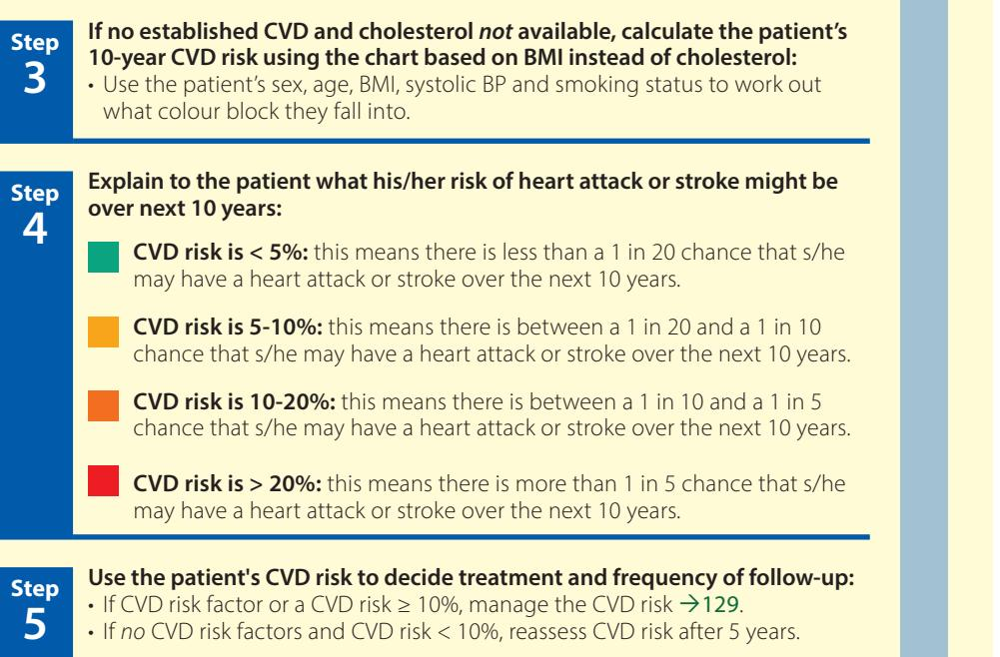

|                            | Ma                                                                                                    | n                                                                                                     | Wo ma                                                                                              |                                                                                        |                                                                                 |
|----------------------------|-------------------------------------------------------------------------------------------------------|-------------------------------------------------------------------------------------------------------|-------------------------------------------------------------------------------------------------------|----------------------------------------------------------------------------------------|---------------------------------------------------------------------------------|
| Ag e (ye ) ars | No ker n-s mo                                                                                | Sm ker o                                                                                        | No ker n-s mo                                                                                | Sm ker o                                                                         | Sy ic B l sto P                                                     |
| 70- 74                  |                                                                                                       |                                                                                                       |                                                                                                       |                                                                                        | ≥ 1 80 160 -17 9 140 -15 9 120 -13 9 20 < 1 |
| 65- 69                  |                                                                                                       |                                                                                                       |                                                                                                       |                                                                                        | ≥ 1 80 160 9 -17 140 -15 9 120 -13 9 < 1 20 |
| 60- 64                  |                                                                                                       |                                                                                                       |                                                                                                       |                                                                                        | ≥ 1 80 160 -17 9 140 -15 9 120 -13 9 < 1 20 |
| 55- 59                  |                                                                                                       |                                                                                                       |                                                                                                       |                                                                                        | ≥ 1 80 160 -17 9 140 -15 9 120 -13 9 < 1 20 |
| 50- 54                  |                                                                                                       |                                                                                                       |                                                                                                       |                                                                                        | 80 ≥ 1 160 -17 9 140 -15 9 120 -13 9 < 1 20 |
| 45- 49                  |                                                                                                       |                                                                                                       |                                                                                                       |                                                                                        | 80 ≥ 1 160 -17 9 140 -15 9 120 -13 9 < 1 20 |
| 40- 44                  |                                                                                                       |                                                                                                       |                                                                                                       |                                                                                        | ≥ 1 80 160 -17 9 140 9 -15 120 -13 9 < 1 20 |
|                            | 4 9 5 0 2 2 5 3 - - - 2 3 < ≥ 0 5 0 2 2 3 | 4 9 5 0 2 2 5 3 - - - 2 3 < ≥ 0 5 0 2 2 3 | 4 9 5 0 2 2 5 3 - - - 2 3 < ≥ 0 5 0 2 2 3 | 4 9 5 0 2 2 3 - - - 2 < 0 5 0 2 2 3 | 5 3 ≥                                                                     |
|                            |                                                                                                       | dy Bo in m ass                                                                            | de kg 2) ( /m x                                                                        |                                                                                        |                                                                                 |
|                            |                                                                                                       |                                                                                                       |                                                                                                       |                                                                                        |                                                                                 |

1Adapted from WHO cardiovascular disease risk non-laboratory-based Southern Sub-Saharan Africa. From: HEARTS technical package for cardiovascular disease management in primary health care: risk based CVD management. World Health Organization. Geneva, 2020.

# **CARDIOVASCULAR DISEASE (CVD) RISK: ROUTINE CARE**

| he ien it h is k As C V D r t at t w se ss p |                                                                                                                                                  |                                                                                                                                                                                                                                                                                                                                                                                                                                                                         |  |  |  |
|-------------------------------------------------------------------------------------------|--------------------------------------------------------------------------------------------------------------------------------------------------|-------------------------------------------------------------------------------------------------------------------------------------------------------------------------------------------------------------------------------------------------------------------------------------------------------------------------------------------------------------------------------------------------------------------------------------------------------------------------|--|--|--|
| As se ss                                                                            | he W n t o a sse ss                                                                                                               | No te                                                                                                                                                                                                                                                                                                                                                                                                                                                                |  |  |  |
| Sy tom mp s                                                                      | Eve vis it ry                                                                                                                           | k a bo hes  d f f ic lty bre hin  leg  d s f st ke  As in 37 i 3 8, in 65 / T I A 13 6. ut t p at tom c a g p a an mp s o ro u y ,                                                                                                                                                                                     |  |  |  |
| d f ia b le k fac Mo i C V D r is tor s         | Eve vis it ry                                                                                                                           | k a bo kin d lco ho l dru d a f da ly livi be low As iet, / mi ise ivit ies i Ma ut tre ct sm o g, a g sus e, s ss, exe rc an o ng nag e a s                                                                                                                                                                                              |  |  |  |
| B M I                                                                               | d ly h ly f tr los ht At iag is, y 3 m i ing ig t to no s ear or on y e w e | ht ( kg ) ÷ he ht (m ) ÷ he ht (m ). for B M I = ig ig ig Aim 25. < we                                                                                                                                                                                                                                                                                                                                |  |  |  |
| fer Wa ist ircu c m en ce                                            | d ly h ly f tr los ht At iag is, y 3 m i ing ig t to no s ear or on y e w e | hi le s d bre hin dw bet low b a d t f i liac for (wo ) a d < (m ). Me ing i ri Aim 8 0cm 94 tan at t, m est est < asu re w , o n g ou ay we en n op o cr ma n n cm an                                                                                                                                               |  |  |  |
| B P                                                                                    | Eve vis it ry                                                                                                                           | f kno hy  f n hec k f ≥  I ion 13 3. I B P: i 14 0 / 9 0 13 2. ert ot, wn p en s c                                                                                                                                                                                                                                                                                          |  |  |  |
| C k ( f n kno C 1) V D r is i V D o wn          | d he de d k At iag is, ing ris t no s n p en on                                                  | f < h C k fac fte f > fte hs. I 10 % w it V D r is r 10 -20 %, r 1 I 20 %, r 6 tor nt s o rea sse ss a y ear rea sse ss a mo                                                                                                                                                                                                                                   |  |  |  |
| D bet k ia ris es                                                          | d he de d lt At iag is, ing t no s n p en on re su                                            | f kno d bet  f n kno h d bet hec k g luc  I ia 13 0. I it ia 17. ot wn es wn es, c ose w                                                                                                                                                                                                                                                                                       |  |  |  |
| do l c ho les l Ran m t ota ter o                              | f e ly 2 fam ly d I C V D in p ien / i iag is set at t : at ar on no s      | f e ly 2 fam ly his f e ly 2 fam lia l hy lip da hec k c ho les l. I C V D in p ien i C V D o i i ia, set at t o tor set ter ar on r o ar on r p er em c o y • f c ho les l > hec k d r fer do I T S H a ter 7.5 to cto o , c n e r. • |  |  |  |

Advise the patient with CVD risk

- Discuss CVD risk: explore the patient's understanding of CVD risk and the need for a change in lifestyle. Support the patient to change [177](#page-173-0).
- Invite patient to address 1 modifiable CVD risk factor at a time: help plan how to fit the lifestyle change into his/her day. Explore what might hinder or support this. Together set reasonable target/s for next visit.

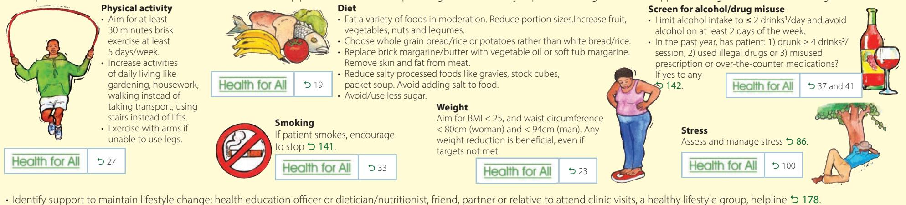

•Be encouraging and congratulate any achievement. Avoid judging, criticising or blaming. It is the patient's right to make decisions about his/her own health. For tips on communicating effectively [176](#page-172-0).

### **Treat the patient with CVD risk**

- If **known CVD**1: give simvastatin4 40mg at night. If on amlodipine, give instead simvastatin4 20mg at night. Avoid simvastatin if pregnant or liver disease.
- If patient develops muscle pain/cramps, reduce dose to 10mg at night.

**[TB](#page-85-0)**

**CONTENTS SYMPTOMSCONTENTS CHRONIC CONDITIONS**

If **no known CVD**: if CVD risk > 20%, give simvastatin4 10mg at night. Avoid if pregnant or liver disease.

### **Review the patient with CVD risk ≤ 20% yearly. Review the patient with CVD risk >20% 6 monthly. If trying to lose weight, review 3 monthly.**

**[HIV](#page-102-0) [COVID-19](#page-117-0) [CHRONIC RESPIRATORY DISEASE](#page-119-0) [HEPATITIS B \(HBV\)](#page-116-0) [CARDIOMETABOLIC CONDITIONS](#page-123-0) [MUSCULOSKELETAL DISORDERS](#page-147-0) [MENTAL HEALTH](#page-136-0) [EPILEPSY](#page-145-0) [WOMEN'S HEALTH](#page-150-0) [PALLIATIVE CARE](#page-166-0)**

1Cardiovascular disease (CVD) includes ischaemic heart disease, peripheral vascular disease and stroke/TIA. 2CVD that develops in a woman < 55 years or in a man < 65 years. 3One drink is 1 tot of spirits, or 1 small glass (125mL) of wine or 1 can/bottle (330mL) of beer. 4If on lopinavir/ritonavir or atazanavir/ritonavir, avoid simvastatin, give instead atorvastatin 10mg at night. No dose adjustment needed for rosuvastatin, pravastatin, atorvastatin.

92

# **DIABETES: ROUTINE CARE**

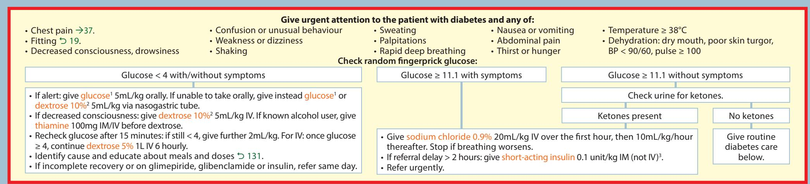

### **Assess the patient with diabetes not needing urgent attention:**

| As ses s                                                                                             | he W n t o a sse ss                                                                                                                                                                                                                              | No te                                                                                                                                                                                                                                                                                                                                                                                                                                                                                                                                                                      |  |  |  |  |
|------------------------------------------------------------------------------------------------------------|-----------------------------------------------------------------------------------------------------------------------------------------------------------------------------------------------------------------------------------------------------------------|-------------------------------------------------------------------------------------------------------------------------------------------------------------------------------------------------------------------------------------------------------------------------------------------------------------------------------------------------------------------------------------------------------------------------------------------------------------------------------------------------------------------------------------------------------------------------------|--|--|--|--|
| Sy tom mp s                                                                                       | Eve vis it ry                                                                                                                                                                                                                                          |   Ma As k a bo hes d leg in 37 in 65 tom tom ut t p nag e s y mp s a s o n s y mp p ag es. c a an p a                                                                                                                                                                                                                                                                                                                                                                    |  |  |  |  |
| De ion p res s                                                                                 | d d f co l p At iag is a i ntr no s n o oo r                                                                                                                                                                          | he h, has fe lt do de d, ho les fe lt litt le lea do hin f y he  In t ien ) r 2 ) int in ing ? I it 143 ast t at t: 1 st o t to p m on p wn p res se p e s o ere r p sur e g s es e r ,                                                                                                                                                                                                     |  |  |  |  |
| A lco ho l / dru g use                                                                | At d d f co l p iag is a i ntr no s n o oo r                                                                                                                                                                          | he has ) dru k ≥ dr ks 4/s ) u d dru ) m d p he- d f y  In t ien t: 1 4 in ion 2 r 3 isu ip ion ica ion ? I 142 ast at t t ter t to p ear p n ess se g s o se res cr or ov er- co un m e s es any y , ,                                                                                                                                                                         |  |  |  |  |
| B P                                                                                                     | Eve vis it ry                                                                                                                                                                                                                                          |   f kno hy f n hec k B P: f ≥ / I ion 13 3. I i 14 0 9 0 13 2. ert ot, wn p en s c                                                                                                                                                                                                                                                                                                                                                                                                |  |  |  |  |
| d w B M I an ist a fer ircu c m en ce                                     | ht: We ig vis it at e ver y • fer d B M I, w ist ircu iag is at a c m en ce: no s •                                                                                               | ht ( kg ) ÷ he ht (m ) ÷ he ht (m ). B M I = ig ig ig we • for d w fer f tr los ht: hec k fer h ly. Aim B M I ≤ 25 ist ircu < 8 0cm (wo ) o 94 (m ). I ing ig B M I /w ist ircu 3 m to t r < an a c m en ce ma n cm an y e w e c a c m en ce on •                                                                                   |  |  |  |  |
| Ey es                                                                                                   | f vi At d ly d l p b lem iag is, y i no s ear an sua ro s                                                                                                                                                    | fun f vi fer C hec k v l ac d do I l p b lem hy, isu ity ata ts o t ino at a u an sco p y. sua ro s, c rac r re p re                                                                                                                                                                                                                                                                                                                                                       |  |  |  |  |
| Fee t                                                                                                   | d ly d m fte f p b lem At iag is, y n i no s ear an ore o ro s                                                                                                                                            | hec k for lse de for kin b lem foo d foo du  C in, ion mit For ion 6 6. sat t sc t ca cat p a p u s, s en y, s p ro s. ree n a n re e ,                                                                                                                                                                                                                                                                                                           |  |  |  |  |
| Fam ly lan i nin p g                                                                     | Eve vis it ry                                                                                                                                                                                                                                          | ds  f p lan fer for list Ass ien 's c ive 154 I nin ia at t tra t t o ess p on cep ne e reg nan r p g p reg nan cy, re sp ec ca re.                                                                                                                                                                                                                                                                                                                        |  |  |  |  |
| luc G ose                                                                                            | Eve vis it ry                                                                                                                                                                                                                                          |  I f fas luc -fa luc ken ho fte t ing 8 o st ing ta 2 t ing 10, ste tre atm ent 13 1. > > g ose r n on g ose urs a r ea p up                                                                                                                                                                                                                                                                                                                               |  |  |  |  |
| b (g luc l H A1c ntr ose co o hs 3 m ) ast t ove r p on | ly f b Yea i H A1c 8 % ≤ r • hs fte han 3 m t r tr eat nt on a me c g e •                                                                                                         | f b d bet l le d, c for d bet I H A1c 8 %: ia inu ia ntr t e t tm ent ≤ es co o on e s am rea es. • f b d bet l le d, f a d he  f n d he d r b fte hs. I H A1c 8 %: ia i 13 I ive H A1c r 3 ntr t, s tep tre atm ent 1. ot t, g ort eat nt > un co o es ren up a ren su p p an ep a mo • |  |  |  |  |
| Ur d k ine ip st ic                                                                      | At d d y ly iag is a no s n ear                                                                                                                                                                                                      | f p lap l i f n lrea dy  I in, i it 13 1. rot sta rt e ot e na r a on • f n d n lap l, se d u la b for l bu f ra lap l  I in a ri rin mi /cr inin io. I io > 3, i 13 rot ot e t eat t t sta rt e 1. o p e n on en a n o a n e ra na r •                                                                                                             |  |  |  |  |
| Cre (e G F R ) at inin e                                                           | At d he ly iag is, t no s n y ear • f o lap l: at bas line d 4 ks 5 I ri n e na e an we e • f e h ly I G F R < 6 0: 3- 6 m t on • | for f e f e fer G d s I G F R < d h do I G F R < ive 6 0, isc it cto 3 0, r ag e a n ex on m. uss w r. e • f cr by lap l an d r fer do I inin inc > 2 0 %, ri eat sto to cto e rea ses p en a e r. •                                                                                                                                                                                |  |  |  |  |
| Pot ium ass                                                                                          | f o I lap l: at bas line ks 5, he ly ri 4 w t n e na e ee n y ear ,                                                                                                                                    | f p fer I d /st lap l an d r do ota ium 5. 0, a i ri to cto > ss vo op en a e r.                                                                                                                                                                                                                                                                                                                                                                                                                      |  |  |  |  |
| ds Lip i                                                                                             | d At iag is no s                                                                                                                                                                                                                                 | hec k fas l c ho les l, ly de k  f to l c ho les l > ly de fer d C ing ig i H D L / L D L. Ass C V D r is 127 I 7.5 ig i 10 / isc t to ta ter tr ta ter tr o cer s, ess o or cer s > , re uss                                                                                                                                                                                         |  |  |  |  |

1Three teaspoons sugar (15g) in 1 cup (200mL) water. 2If dextrose 10% unavailable: mix 1 part dextrose 50% to 4 parts water to make a dextrose 10% solution. 3Avoid IV insulin as it may cause low potassium and heart dysrhythmia. Avoid using an insulin needle to give IM insulin. 4One drink is 1 tot of spirits, or 1 small glass (125mL) of wine or 1 can/bottle (330mL) of beer. 5If eGFR < 60, repeat instead at 2 weeks.

**CONTENTS CHRONIC CONDITIONS**

**[HEPATITIS B \(HBV\)](#page-116-0) [COVID-19](#page-117-0)**

**[HIV](#page-102-0) [CHRONIC RESPIRATORY DISEASE](#page-119-0) [CARDIOMETABOLIC CONDITIONS](#page-123-0) [MUSCULOSKELETAL DISORDERS](#page-147-0) [MENTAL HEALTH](#page-136-0) [EPILEPSY](#page-145-0) [WOMEN'S HEALTH](#page-150-0) [PALLIATIVE CARE](#page-166-0)**

86

#### **Advise the patient with diabetes**

- Help the patient to manage his/her CVD risk [129](#page-125-0). Educate on foot care to prevent ulcers and amputation [66](#page-62-0).
- •Discuss diet: avoid white/brown sugar and honey, use artificial sweetener instead. Cut down on starch (rice, noodles, bread, potato, sweet potato, butternut, mielies, pap, samp).
- Explain importance of adherence and to eat regular meals. If difficulty with adherence, give adherence support [173](#page-169-0) and refer to a community health worker, if available.
- Ensure patient can recognise and manage hypoglycaemia (shaking, sweating, palpitations, weakness, hunger):
- Drink milk with sugar or eat a sweet. Always carry something sweet. If not in clinic and fits, confusion or coma, rub sugar inside mouth and call ambulance. Go to clinic if illness (like diarrhoea). Identify and manage the cause: increased exercise, missed meals, inappropriate dosing of glucose-lowering medications, alcohol, infections.
- Advise patient that s/he is at risk of severe COVID-19 disease and should adhere strictly to physical distancing, good hand/respiratory hygiene and keep up to date with his/her COVID-19 vaccinations.
- If on/starting insulin: discuss injection technique/sites (abdomen, thighs, arms), store insulin in fridge/cool dark place, meal frequency, symptoms of hypoglycaemia/hyperglycaemia, disposal of sharps. Injection technique and sites (abdomen, thighs, arms), store insulin in fridge/cool dark place, meal frequency, recognising hypoglycaemia/hyperglycaemia, sharps disposal at clinic.
- Advise that if unwell and vomiting/not eating as usual: to increase fluid intake, check glucose 3 times a day if possible and adjust insulin dose if necessary (avoid stopping insulin).

### **Treat the patient with diabetes**

- Check that patient is up to date with COVID-19 vaccine. If age > 65 years , or known HIV or heart or lung disease, give influenza vaccine 0.5mL IM yearly.
- If **known CVD**1: give simvastatin2 40mg3 at night and aspirin daily. Avoid simvastatin if pregnant and avoid aspirin if peptic ulcer, dyspepsia, kidney disease. Avoid both if liver disease.
- If **no known CVD**1 but CVD risk > 20%, eGFR < 60, known with diabetes > 10 years or age > 40 years, give simvastatin2 10mg at night. Avoid if pregnant or liver disease.
- If albuminuria/proteinuria, give enalapril4 5mg 12 hourly, regardless of BP. If proteinuria persists and systolic BP > 100, increase up to 10mg 12 hourly, if tolerated.
- Give glucose-lowering medication using stepwise approach as in table below. Ensure patient is adherent before increasing treatment.

| Ste p | Me d ica ion t                                                                                                                                                                                         | fas Bre k t a                                                                                                                                                                                                                                                              | Su p p er                                                                                                                                                                                                                               | fo Be dt im ( be 22 h0 0 ) e re                                                                                                           | No te                                                                                                                                                                                                                                                                                                                                                                                                                                                                                                                                                                                                                                                                                                                                                                                                                                                                                                                                                                                                                                                                                                                                                                                                                                                                                                                                                                                                                                                                                                                                                                                                                                                                                                       |  |  |
|----------|--------------------------------------------------------------------------------------------------------------------------------------------------------------------------------------------------------------------|----------------------------------------------------------------------------------------------------------------------------------------------------------------------------------------------------------------------------------------------------------------------------------------|--------------------------------------------------------------------------------------------------------------------------------------------------------------------------------------------------------------------------------------------------|----------------------------------------------------------------------------------------------------------------------------------------------------------------------------|----------------------------------------------------------------------------------------------------------------------------------------------------------------------------------------------------------------------------------------------------------------------------------------------------------------------------------------------------------------------------------------------------------------------------------------------------------------------------------------------------------------------------------------------------------------------------------------------------------------------------------------------------------------------------------------------------------------------------------------------------------------------------------------------------------------------------------------------------------------------------------------------------------------------------------------------------------------------------------------------------------------------------------------------------------------------------------------------------------------------------------------------------------------------------------------------------------------------------------------------------------------------------------------------------------------------------------------------------------------------------------------------------------------------------------------------------------------------------------------------------------------------------------------------------------------------------------------------------------------------------------------------------------------------------------------------------------------|--|--|
| 1        | for Me in t m                                                                                                                                                                                          | 5 0 0m g 5 0 0m g 85 0m g 1g                                                                                                                                                                                                                          | 5 0 0m g 85 0m g 1g                                                                                                                                                                                                         |                                                                                                                                                                            | d f e live d l le d hea fa lur lco ho lism Av i i G F R < 3 0, ise i ntr rt o r ase , un co o e, a • f o do lut ha lve do f m for ho ly. I ir o G F R 3 0-4 5, im mi n 5 0 0m 12 to et n eg rav r e se, up m ax um o g ur • ke h m ls. l f- lim b do l cr d ho dv Ta wit Ma it ing mi iar A ise t to sto tre atm t. ea y cau se se na use a, a na am p s o r r ea. no p en • Inc h ly f fas luc (or d l 5 g luc ) o H b A1c d p d he nt i t ing 8 ost ia 10 8 %, at ien t is a t. > > > rea se mo g ose p p ran ose r an ren • f u de d da ly, for be ho ly d o f 1g da ly. I 2g i mi ive 85 0m 8 ins ice i to t tea tw p ne e me n m ay g n a s g ur • f a fte hs do b I r 3 im H A1c 8 %, 2. nt to ste mo on m ax um se > mo ve p •                                                                                                                                                                                                                                                     |  |  |
| 2        | d d g l de A im ir i ep ferr d l der ly ( Pre in e e ) ien > 6 5 y at ts: p ear s or l be lam de i i g nc | 1m g 2m g 3m g (up ) 4m 8m to g g 2.5 mg 5m g 5m g 5m g 7.5 mg 10 mg                                                                                                                                           | 2.5 mg 5m g 5m g 5m g                                                                                                                                                                                                       |                                                                                                                                                                            | for Co inu mi nt et e m n. • l de ke lim de h bre k fas G im ir i iri it : ta t. ep g ep w a • f fas Inc lim de by k ly ls, u da ly luc (or d l 5 g luc iri 1m at w int to 8m i i t ing 8 ost ia > rea se g ep g, ee erv a p g g ose p p ran ose - ) o b d p d he > 1 0 H A1c 8 %, ien is a at t t. > r an ren l be lam de d g li be lam de f > G i i i i i 65 nc : av o nc ear s. y • for fas Ta ke li be lam de 3 0 m be bre k Av d m ls. i inu tes t. i iss ing g nc e a o m ea - ks f fas luc (or d l 5 g luc ) o b d p d he Inc 2 w i ing 8 ia 10 H A1c 8 %, ien is a t ost at t t. > > > rea se eve ry ee g ose p p ran ose r an ren - d bo h in ki dn (e ) a d live d le a l lerg Av i G F R < 6 0 ise im t -tr o p reg na ncy , se ve re ey n r ase , co oxa zo y. • f a fte hs do b I r 3 im H A1 8 %, 3. nt to ste c > mo on m ax um se mo ve p • |  |  |
| 3        | d d ba l l A ins in sa u d ( int iate erm e or lon ) act ing g                                                                                      |                                                                                                                                                                                                                                                                                        |                                                                                                                                                                                                                                                  | f g luc Sta t 1 0 I U. I rt a ose d, by ins ise inc rem a ra rea se h w k. 2-4 its un eac ee | lim de li be lam de bu for he lin. du bo lin bo Sto iri /g i inu mi ing in E ins t c t et tar t cat ut p g ep nc on e m n w n s su e a u as a ve. • dv hec k g luc da ly fte l an d o kin k. d o f re d A ise ien i 3 t im Kee ing at t to p c ose a r a me a n w a g es a w ee p a re co r a s. • f fas fre I luc ly > 8 (or d l 5 g luc 10 ), by 2-4 h w k. t ing nt ost ia inc its > g ose q ue p p ran ose rea se un eac ee • I f > I U n de d o f p hav de f hy ly d /re fer do 20 r i ien ing iso mi isc at t to cto ee ep s o p og cae a, uss r. •                                                                                                                                                                                                                                                                                                                                                                                                                                                                                                                                                                                                                                    |  |  |
| 4        | bst h Su itu wit te b ip ha ic ins l in s u                                                                                                                              | kg 0. 2 I U / 0. 2 I U / kg I U + 4 I U / kg I U 0. 2 + 4 kg 0. 2 I U / + 8 I U kg 0. 2 I U / + 8 I U I U / kg I U 0. 2 + 1 2 | kg 0.1 I U / I U / kg 0.1 / kg 0.1 I U + 4 I U kg 0.1 I U / + 4 I U kg 0.1 I U / + 8 I U I U / kg I U e 0.1 + 8 tc |                                                                                                                                                                            | h m for lim de li be lam de d bas l in lin. du bo lin bo Co inu it mi Sto iri /g i E ins nt et cat ut e w n. p g ep nc an a su e a as a ve. u • f to for fas Sta it h 0 3u nit / kg / day Pat ien ive hir ds l da i ly ins lin do 3 0 m inu be bre k d rt w t to tw o-t ta tes t a s g o u se e a n • hir d o f to l da ly lin do be for i ins 3 0 m inu e-t ta tes on u se e s up p er. dv hec k g luc da ly fte l an d o kin k. d o f re d A ise ien i 3 t im Kee ing at t to p c ose a r a me a n w a g es a w ee p a re co r a s. • f fas luc fre ly d l 5 g luc do by h w k. I ing > 8 (or ia 10 ), inc 4 u nit t nt ost g ose q ue p p ran ose > rea se se s e ac ee • f fte I H b A1c 8 % a r 3 hs, d isc it h s ia list nt > mo uss w p ec •                                                                                                                                                                                                                                                     |  |  |
|          | iew he ien it h d ia be h ly b le. Re 6 t at t w tes nt sta v p mo on ce                                                                   |                                                                                                                                                                                                                                                                                        |                                                                                                                                                                                                                                                  |                                                                                                                                                                            |                                                                                                                                                                                                                                                                                                                                                                                                                                                                                                                                                                                                                                                                                                                                                                                                                                                                                                                                                                                                                                                                                                                                                                                                                                                                                                                                                                                                                                                                                                                                                                                                                                                                                                                |  |  |

1Cardiovascular disease (CVD) includes ischaemic heart disease, peripheral vascular disease and stroke/TIA. 2If HIV positive on lopinavir/ritonavir or atazanavir/ritonavir, avoid simvastatin, give instead atorvastatin 10mg at night. 3If on amlodipine, reduce simvastatin dose to 20mg at night. No dose adjustment needed for rosuvastatin, pravastatin, atorvastatin. 4Avoid in pregnancy, previous angioedema or renal artery stenosis. If persistent cough, refer to doctor to consider alternative. 5Two hours after eating.

#### **CONTENTS SYMPTOMSCONTENTS CHRONIC CONDITIONS**

**[TB](#page-85-0)**

### **HYPERTENSION: DIAGNOSIS**

#### **Check blood pressure (BP)**

- **Position patient:** ask patient to remove tight clothing covering upper arm. Seat with back against chair, both feet flat on floor and arm supported at heart level. Patient to avoid talking during reading.
- **Position cuff** correctly and ensure appropriate size: if obese (mid-upper arm circumference is ≥ 33cm), use a large BP cuff.
- **Measure and record** systolic BP (SBP) and diastolic BP (DBP). Take at least two readings 1-2 minutes apart.
- If first time BP measurement, or readings differ by > 5mmHg, or if BP ≥ 180/110, take a third reading. If able, use average of last 2 readings to interpret BP measurement, otherwise use lowest BP reading.
- If taking BP manually, SBP is the first appearance of sound. DBP is the disappearance of sound.
- If patient is pregnant, interpret reading [159](#page-155-0).

### **Give urgent attention to the patient with BP ≥ 180/110 (SBP ≥ 180 and/or DBP ≥ 110) and any of:**

- Visual disturbances
- Dizziness
- •Confusion
- Severe headache
- Chest pain [37](#page-33-0).
- •Difficulty breathing worse on lying flat or with leg swelling [135](#page-131-0).
- Sudden weakness on 1 or both sides, vision problems, dizziness, difficulty speaking or swallowing [136](#page-132-0).

### **Manage and refer:**

- • If BP ≥ 180/130 (SBP > 180 and/or a DBP > 130) with symptoms listed above, treat as **hypertensive emergency**: give single dose amlodipine 10mg orally. Avoid short-acting nifedipine as it may drop the BP too quickly, causing a stroke. Refer urgently.
- If dizzy or faint after treatment, lie patient down. If BP < 160/100, raise legs.

### **Approach to interpreting a BP in a patient not needing urgent attention**

If systolic BP and diastolic BP fall into 2 different categories, use the higher blood pressure reading to classify further.

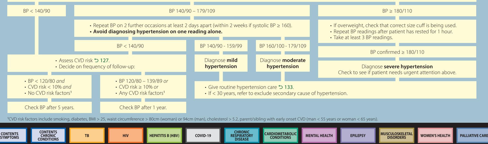

### **HYPERTENSION: ROUTINE CARE**

| he ien it h hy ion As t at t w ert se ss p p en s |                                                                                                                                                                                                                                                                                                                               |                                                                                                                                                                                                                                                                                                                                                                                                                                                                                                                                                                                                                                                                                                                                                                                                                                                                                                                                    |  |  |  |  |
|---------------------------------------------------------------------------------------------------|-------------------------------------------------------------------------------------------------------------------------------------------------------------------------------------------------------------------------------------------------------------------------------------------------------------------------------|------------------------------------------------------------------------------------------------------------------------------------------------------------------------------------------------------------------------------------------------------------------------------------------------------------------------------------------------------------------------------------------------------------------------------------------------------------------------------------------------------------------------------------------------------------------------------------------------------------------------------------------------------------------------------------------------------------------------------------------------------------------------------------------------------------------------------------------------------------------------------------------------------------------------------------|--|--|--|--|
| As se ss                                                                                    | he W n t o a sse ss                                                                                                                                                                                                                                                                                            | No te                                                                                                                                                                                                                                                                                                                                                                                                                                                                                                                                                                                                                                                                                                                                                                                                                                                                                                                           |  |  |  |  |
| Sy tom mp s                                                                              | Eve vis it ry                                                                                                                                                                                                                                                                                                        | k a bo f hea fa lur  hae hea d  ke  Ma As i 135 isc mi ise 137 / T I A 13 6. tom tom ut tom rt rt st nag e s mp s a s o n s mp p ag es. sy mp s o e c ase or ro y y ,                                                                                                                                                                                                                                                                                                                                                                                                                                                                                                                                                                                         |  |  |  |  |
| Pre g na ncy                                                                             | f c Wo hi l d be ing vis it me n o ar ag e: e ve ry                                                                                                                                                                                                                              | f p fer I d d, s A C E-in hi b ( li ke lap l ), g d m hy l do ho ly d r hig h-r k a l c lini iag top ito ri ive in ste et 25 0m 8 to is nte nat reg na ncy no se rs en a a p a g ur an e a c. • f p lan fer do I nin to cto g p reg na ncy , re r. • ds  Ass ien 's c ive 154 at t tra t ess p on cep ne e •                                                                                                                                                                                                                                                                                                                            |  |  |  |  |
| A lco ho l / dru g use                                                       | At d iag is no s                                                                                                                                                                                                                                                                                               | In t he has ) dru k ≥ dr ks 1/s ) u d l leg l dru ) m d p he d ? I f ien t: 1 4 in ion 2 i r 3 isu ip ion ica ion ast at t t ter t p y ear p n ess se a g s o se res cr or ov er- -co un m e s , ,  142 to y es any                                                                                                                                                                                                                                                                                                                                                                                                                                                                                                |  |  |  |  |
| A d he ren ce                                                                         | Eve vis it ry                                                                                                                                                                                                                                                                                                        |  f l le d, a d s d he I B P is 173 t c tro ort no on sse ss a n up p a ren ce                                                                                                                                                                                                                                                                                                                                                                                                                                                                                                                                                                                                                                                                                                                                                                             |  |  |  |  |
| l B P c tro on                                                                        | hec k 2 d Eve vis it (c ing ) ry re a s •  For ho d 13 2. ct m et co rre •                                                                                                                                                                           | f l le d: d r h ly. I B P < 0 / 9 0, B P is inu iew 6 14 ntr nt t tr eat nt nt co o co e c urr en me an ev mo • f f a  f n  I B P ≥ / B P is l le d: d he I d he d r h. 14 0 9 0, t c tro i t, s tep tre atm t 134 ot t, g ive ort 173 iew in 1 m t no on ren up en a ren su p p an ev on • f ≥ / lso hec k i f n ds  I 18 0 110 ion 13 2. t a tte nt : a c ee urg en - f ly de de do d I S B P c iste ≤ 1 10, i ing ica ion nt t on s co ns r cre as se or me s. • |  |  |  |  |
| We ht, B M I, w ig ist a fer ircu c m en ce                | We ht: ig at vis it eve ry • fer d B M I, w ist ircu iag is at a c m en ce: no s •                                                                                                                                                              | B M I = ht ( kg ) ÷ he ht (m ) ÷ he ht (m ). ig ig ig we • for d w fer (wo ) o (m ). Aim B M I < 25 ist ircu < 8 0cm 94 r < an a c m en ce ma n cm an •                                                                                                                                                                                                                                                                                                                                                                                                                                                                                                                                                                                                                            |  |  |  |  |
| C V D r is k                                                                          | At d iag is, he de d ing ris k t no s n p en on                                                                                                                                                                                                                               |  C D r k Ass V is 127 ess                                                                                                                                                                                                                                                                                                                                                                                                                                                                                                                                                                                                                                                                                                                                                                                                                                                                                 |  |  |  |  |
| d k Ur ine ip ic st                                                             | d he ly At iag is, t no s n y ear                                                                                                                                                                                                                                                               |  I f 1 d k, c hec k c d e G F R. I f g luc d k, s for d bet rot inu ria ip st ic t inin ip st ic ia 17. + p e on rea e a n ose on cre en es                                                                                                                                                                                                                                                                                                                                                                                                                                                                                                                                                                                                                                                         |  |  |  |  |
| bet k D ia ris es                                                                  | ly d f g luc d k Yea i ine ip ic st r an ose on ur                                                                                                                                                                                                                            | f  f n  I kno d bet I kno h d bet hec k g luc ia 13 0. ot it ia 17. wn es wn w es, c ose                                                                                                                                                                                                                                                                                                                                                                                                                                                                                                                                                                                                                                                                                                                                                  |  |  |  |  |
| (e ) Cre inin G F R at e                                                  | f 1 d k I inu ria ip ic rot st + p e on • ly f: 2, hy for Yea i C V D ion 10 ert ≥ r p en s y ear s, • l le d hy G F R < ntr ert ion 6 0 un co o p en s , e | f e fer I G F R < 3 0, r e • f e d u la b for l bu d r fer do f ra d fer I G F R < 6 0, s rin mi /cr inin io a i io > 3, isc /re e t eat at to cto t en o a n e r n e r: uss • f c fer I by lap l an d r do t inin inc > 2 0 %, sto ri to cto rea e rea ses p en a e r. •                                                                                                                                                                                                                                                                                                                                                                                                    |  |  |  |  |
| Pot ium ass                                                                                 | f o lap l or d I ri G F R < 3 0: a iag is t n e na e no s • f o lac h ly I iro G F R < 3 0: 6 m ton t n s p no e o r e on •                                                                           | f p lap l an d s lac d r fer do I ium 5. 0, s ri iro ota top ton to cto ss > en a p no e a n e r.                                                                                                                                                                                                                                                                                                                                                                                                                                                                                                                                                                                                                                                                                                                                              |  |  |  |  |

#### **Advise the patient with hypertension**

Educate the patient that blood pressure changes slightly during the day and night: hypertension is when it stays high, above a certain level. S/he may not have any symptoms.

- Emphasise salt restriction ≤ 1 teaspoon/day, regular physical exercise (150 minutes/week), weight reduction and smoking cessation. If patient smokes, encourage to stop [141](#page-137-0).
- •Advise to avoid NSAIDs (e.g. ibuprofen) and combined oral contraceptive.
- Explain importance of adherence and that patient will need lifelong hypertension care to prevent stroke, heart disease, eye disease and kidney disease.
- If newly diagnosed, refer for community health worker support.

**[TB](#page-85-0)**

**CONTENTS SYMPTOMSCONTENTS CHRONIC CONDITIONS**

•Advise patient on hydrochlorothiazide to limit exposure to sunlight and use sunscreen when exposed to sunlight.

1One drink is 1 tot of spirits, or 1 small glass (125mL) of wine or 1 can/bottle (330mL) of beer. 2Cardiovascular disease (CVD) includes ischaemic heart disease, peripheral vascular disease and stroke/TIA.

82

- •Give influenza vaccine 0.5mL IM yearly. Check that patient is up to date with his/her COVID-19 vaccine.
- If **known CVD**1:
-  Give simvastatin2 40mg at night. If on amlodipine, give instead simvastatin2 20mg at night. No dose adjustment needed for rosuvastatin, pravastatin, atorvastatin. If patient develops muscle pain/ cramps, reduce dose to 10mg at night. Avoid if pregnant or liver disease.
- Give aspirin 150mg daily. Avoid if peptic ulcer, dyspepsia, kidney or liver disease.
- If **no known CVD**1: if CVD risk > 20%, give simvastatin2 10mg at night. Avoid if pregnant or liver disease.
- •If BP is **controlled**, continue current treatment step and review 6 monthly.
- If BP is **not controlled**, decide treatment for hypertension using algorithm and table below. If already on step 7, refer instead.

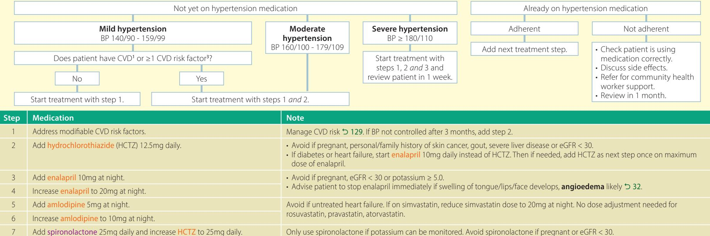

Review the patient monthly until BP controlled. Once controlled, review 6 monthly.

If BP not controlled after 1 month on step 7, refer.

**[TB](#page-85-0)**

**CONTENTS SYMPTOMSCONTENTS CHRONIC CONDITIONS**

1Cardiovascular disease (CVD) includes ischaemic heart disease, peripheral vascular disease and stroke/TIA. 2If on lopinavir/ritonavir or atazanavir/ritonavir, avoid simvastatin, give instead atorvastatin 10mg at night. 3CVD risk factors include age > 55 (man) or > 65 (woman), diabetes, smoker, waist circumference > 80cm (woman) or > 94cm (man).

**[HIV](#page-102-0) [CHRONIC RESPIRATORY DISEASE](#page-119-0) [CARDIOMETABOLIC CONDITIONS](#page-123-0) [MUSCULOSKELETAL DISORDERS](#page-147-0) [MENTAL HEALTH](#page-136-0) [EPILEPSY](#page-145-0) [WOMEN'S HEALTH](#page-150-0) [PALLIATIVE CARE](#page-166-0)**

**[HEPATITIS B \(HBV\)](#page-116-0) [COVID-19](#page-117-0)**

# **HEART FAILURE: ROUTINE CARE**

The patient with heart failure has leg swelling and difficulty breathing which worsens on lying down/with effort. **A doctor must confirm the diagnosis and refer the patient for specialist assessment.**

### **Give urgent attention to the patient with heart failure and any of:**

Chest pain [37](#page-33-0). • Rapid worsening of symptoms • Respiratory rate ≥ 30 or difficulty breathing • BP < 90/60 • New wheeze

### **Manage and refer urgently:**

•Sit patient up and if oxygen saturation < 94%, give 40% face mask oxygen (6-8L/min).

•If systolic BP > 90: give furosemide 40mg slow IV. If no response after 30 minutes, give another 80mg IV. If good response, give 40mg IV after 2-4 hours.

- If systolic BP > 90: give sublingual isosorbide dinitrate 5mg even if there is no chest pain. Repeat once if pain relief needed. Repeat after 4 hours.
- •If BP ≥ 180/130: give single dose enalapril 10mg orally.

### **Assess the patient with heart failure**

| As se ss                                                                        | he W n t o a sse ss                                          | No te                                                                                                                                                                                                                                                                                                                                                                                                                                                                                                                                                                                                                                                         |
|---------------------------------------------------------------------------------------|-----------------------------------------------------------------------------|------------------------------------------------------------------------------------------------------------------------------------------------------------------------------------------------------------------------------------------------------------------------------------------------------------------------------------------------------------------------------------------------------------------------------------------------------------------------------------------------------------------------------------------------------------------------------------------------------------------------------------------------------------------|
| Sy tom mp s                                                                  | Eve vis it ry                                                      | f fa b lac kou fer day Ma I int ing / tom tom ts, nag e s y mp s a s o n s y mp p ag es. re sa me                                                                                                                                                                                                                                                                                                                                                                                                                                                                         |
| ly lan Fam i nin p g                                                | Eve vis it ry                                                      |  f p fer for Ass 's c ds I lan list at ien t tra t ive 154 nt nin ia ess p on cep ne e reg na or p g p reg na ncy , re sp ec ca re.                                                                                                                                                                                                                                                                                                                                                                                                        |
| A lco ho l / dru g use                                           | Eve vis it ry                                                      |  he has ) dru k ≥ dr ks 1/s ) u d l leg l dru ) m d p he d ? f y In t ien t: 1 4 in ion 2 i r 3 isu ip ion ica ion I 142 ast at t t ter t to p y ear p n ess se a g s o se res cr or ov er- -co un m e s es any , ,                                                                                                                                                                                                                                 |
| ht We ig                                                                        | Eve vis it ry                                                      | ha f lu d ba lan by h w ht he lea Ass in i ing it ig ien ic. at t st s tom at ess c ng es ce co mp ar w e w n p y mp                                                                                                                                                                                                                                                                                                                                                                                                                              |
| B P a d p lse n u                                                      | Eve vis it ry                                                      | f kno hy  f n hec k f ≥  f n lar lse fer day I ion 13 3. I B P: i 14 0 / 9 0 13 2. I irr ert ot, wn p en s c ew eg p , re sa me u u                                                                                                                                                                                                                                                                                                                                                                                     |
| l liat Pa ive ca re                                                    | d f de At iag is, i ior ing ter at no s | f d b ling ho f bre h a dm he hs, lso l liat  I isa im iss ion in t 6 ive ive 170 rtn at t re st o tre atm t o 5 a ast nt r ≥ s ess o n m ax um en s p mo a g p a ca re                                                                                                                                                                                                                                                                                                                                |
| d Cre inin (e G F R ) a at e n ota ium p ss | d h ly At iag is, 6 m t no s on               | f st do f e lap l lac lso hec k a ks f e ks f e I ing / inc ing ri /sp iro 2 w ( i G F R < 6 0 ) o r 4 ( i G F R ≥ 6 0 ). art ton t rea s se o na no e: a c ee we e • f c I by G F R < lap l /sp lac d d h s list t inin inc > 2 0 %, 3 0 o ota ium 5. 0, s top ri iro ton isc it ia > rea e rea ses e r p ss en a no e a n uss w p ec • |
| Ot he b loo d t est r s                                          | At d iag is no s                                             |   C hec k b, S d f n kno d bet hec k g luc f a bn l, d h s list for H T H a i ia 17. I isc it ia Tes H I V 110 ot t n wn es, c ose orm a uss w p ec                                                                                                                                                                                                                                                                                                                                                         |

### **Advise the patient with heart failure**

•Advise to adhere to treatment even if asymptomatic. Advise regular exercise within limits of symptoms. Help the patient to manage his/her CVD risk [129](#page-125-0).

Advise to restrict salt to < half a teaspoon/day and fluids to 1.5L/day (6 cups). If possible, advise to monitor weight daily. If s/he gains ≥ 2kg in 2 days, advise to return to clinic.

### **Treat the patient with heart failure**

- Give influenza vaccine 0.5mL IM yearly. Check that patient is up to date with his/her COVID-19 vaccine.
- Aim to have patient on steps 1 and 2. Add step 3 if patient has ongoing symptoms on steps 1 and 2. If uncontrolled on steps 1-3, refer to specialist for digoxin.

|     | Ste p                                                                                                                                                                                               | Me d ica ion t                                                                                                                                                                                                                                                                     | Do se                                   |                                                                                                                                                                                                                                                                        | No te                                                                                                                                                                                                                                                                                                                                                                                                                                                        |                                                                                                                                                                                                                                                                                                                    |                                                                                                                                                                                                                                                                                        |                                                                                                                                                                                                                                                                                                                                                                                                                                                          |                              |                  |                                                       |                                |                                |  |
|-----|--------------------------------------------------------------------------------------------------------------------------------------------------------------------------------------------------------|------------------------------------------------------------------------------------------------------------------------------------------------------------------------------------------------------------------------------------------------------------------------------------------------|--------------------------------------------|------------------------------------------------------------------------------------------------------------------------------------------------------------------------------------------------------------------------------------------------------------------------|-----------------------------------------------------------------------------------------------------------------------------------------------------------------------------------------------------------------------------------------------------------------------------------------------------------------------------------------------------------------------------------------------------------------------------------------------------------------|--------------------------------------------------------------------------------------------------------------------------------------------------------------------------------------------------------------------------------------------------------------------------------------------------------------------|----------------------------------------------------------------------------------------------------------------------------------------------------------------------------------------------------------------------------------------------------------------------------------------|----------------------------------------------------------------------------------------------------------------------------------------------------------------------------------------------------------------------------------------------------------------------------------------------------------------------------------------------------------------------------------------------------------------------------------------------------------|------------------------------|------------------|-------------------------------------------------------|--------------------------------|--------------------------------|--|
|     | 1                                                                                                                                                                                                      | G hy dro h lor h iaz i ive ot c                                                                                                                                                                                                                                  | de da ly 25- 5 0m i g |                                                                                                                                                                                                                                                                        |                                                                                                                                                                                                                                                                                                                                                                                                                                                                 |                                                                                                                                                                                                                                                                                                                    | f m fa Use l d hea lur d e G F R ≥ Av d live d Use h c kin i i rt i 6 0. i in ise it aut ion in t, p iou e a n o r ase w g ou rev s s ca nce r. |                                                                                                                                                                                                                                                                                                                                                                                                                                                          |                              |                  |                                                       |                                |                                |  |
|     |                                                                                                                                                                                                        | fur de i or ose m d an                                                                                                                                                                                                                                                    | Sta 0m rt 4 tom sy mp       | da ly. f n de d, day l i I inc 2-3 i nt g ee rea se eve ry s u / day im 25 0m to s p rov e, u p g                                                                         |                                                                                                                                                                                                                                                                                                                                                                                                                                                                 |                                                                                                                                                                                                                                                                                                                    |                                                                                                                                                                                                                                                                                        | f s f ica hea fa lure d, c de h to hy dro h loro hia de f e Use i ig ni i G F R < 6 0. On im i itc zi i G F R ≥ 6 0. nt rt tom t sy mp s o r e ce p rov e on s r sw c • I f > de d, g ha l f do ho ly. 8 0m ive 12 g nee se ur • |                              |                  |                                                       |                                |                                |  |
|     |                                                                                                                                                                                                        | f n Sta ho ly. I de d, lap l rt 2.5 12 inc to 10 i mg ur ee rea se up mg en a r                                                                                                                                     |                                            |                                                                                                                                                                                                                                                                        | ho ly. 12 ur                                                                                                                                                                                                                                                                                                                                                                                                                                           | f p Av d de hy hic bst d hy, l ar i i t, p iou ioe rt ic s ten is, ert t ive iom at ter ste is. o reg nan rev s a ng ma , ao os p rop o ruc ca r y op re na y no s |                                                                                                                                                                                                                                                                                        |                                                                                                                                                                                                                                                                                                                                                                                                                                                          |                              |                  |                                                       |                                |                                |  |
|     | 2                                                                                                                                                                                                      | d d c d lo l ho ly. f to lera d, do b le do A i Sta 3.1 25 12 I rt te arv e mg ur u se l sy ho ly. i im 25 12 t tom to un mp s p rov e, u p mg ur |                                            | ks 2 w eve ry ee                                                                                                                                                                                                                                           | l do f e lap l. d a lo l in hea fa lur Sta im ri Av i i rt o t ten rt nce on op a se o na o o e. • d f se f lu d o loa d, hm d o de do f p lse Av i i i B P < 9 0 / 6 0, a Av i i 6 0. st < o ve re ve r a. o r cre ase se u • |                                                                                                                                                                                                                                                                                                                    |                                                                                                                                                                                                                                                                                        |                                                                                                                                                                                                                                                                                                                                                                                                                                                          |                              |                  |                                                       |                                |                                |  |
|     | 3                                                                                                                                                                                                      | d d s lac da ly A iro 25 i ton p no e mg                                                                                                                                                                                                                |                                            | d ki dn fun d f e lem Mo nit ium ion Av i i G F R < 3 0 o ium 5. Sto ium ota ct ota ota ts. or p ss an ey o r p ss > p p ss su p p en |                                                                                                                                                                                                                                                                                                                                                                                                                                                                 |                                                                                                                                                                                                                                                                                                                    |                                                                                                                                                                                                                                                                                        |                                                                                                                                                                                                                                                                                                                                                                                                                                                          |                              |                  |                                                       |                                |                                |  |
|     | 1On e d rink t of ll g lass (12 L) o f w n/b le ( ) o f be is 1 to irits 1 s 5m ine 1 ca 330 mL ott sp , or ma or er. |                                                                                                                                                                                                                                                                                                |                                            |                                                                                                                                                                                                                                                                        |                                                                                                                                                                                                                                                                                                                                                                                                                                                                 |                                                                                                                                                                                                                                                                                                                    |                                                                                                                                                                                                                                                                                        |                                                                                                                                                                                                                                                                                                                                                                                                                                                          |                              |                  |                                                       |                                |                                |  |
|     |                                                                                                                                                                                                        |                                                                                                                                                                                                                                                                                                |                                            |                                                                                                                                                                                                                                                                        |                                                                                                                                                                                                                                                                                                                                                                                                                                                                 |                                                                                                                                                                                                                                                                                                                    |                                                                                                                                                                                                                                                                                        |                                                                                                                                                                                                                                                                                                                                                                                                                                                          |                              |                  |                                                       |                                |                                |  |
| CON | TS SYM TEN PTO MS                                                                                                                                                                             | CON TS CHR TEN IC CON ON DIT ION S                                                                                                                                                                                                                                        | TB                                         | HIV                                                                                                                                                                                                                                                                    | TIS B (H BV) HEP ATI                                                                                                                                                                                                                                                                                                                                                                                                                                | COV ID-1 9                                                                                                                                                                                                                                                                                                   | IC RES CHR ON ATO RY DIS PIR EAS E                                                                                                                                                                                                                                | CAR LIC CON DIO MET ABO DIT ION S                                                                                                                                                                                                                                                                                                                                                                                                   | MEN TAL HE ALT H | SY EPI LEP | MU SCU L DIS LOS KEL ETA ORD ERS | WO 'S H MEN EAL TH | CA PAL LIAT IVE RE |  |

# **STROKE: ROUTINE CARE**

**Sudden onset** of one or more of the following suggests a stroke (or a transient ischaemic attack (TIA) if symptoms lasted < 24 hours and resolved completely):

- Weakness or numbness of the face, arm or leg, especially on one side of the body
- Blurred or decreased vision in one/both eyes or double vision

- Difficulty speaking or understanding
- Difficulty walking, dizziness, loss of balance or co-ordination

### **Give urgent attention to the patient with a new stroke/TIA:**

If oxygen saturation < 94% or respiratory rate ≥ 30, give face mask oxygen.

- •Keep patient nil by mouth until swallowing is formally assessed.
- •Check glucose: if < 3 (< 4 if diabetes) [17](#page-13-0).
- Avoid treating BP ≥ 140/90 as this may worsen stroke. If BP ≥ 220/120, discuss with specialist about need for pre-referral treatment.
- •Decide where to refer the patient depending on when symptoms started:
- If patient can reach hospital within 3 hours of onset of symptoms, *refer urgently* for thrombolysis (to specialist stroke unit if available).
- If patient cannot reach hospital within 3 hours of onset of symptoms, refer same day and give single dose aspirin 300mg (avoid if on long-term anticoagulant or headache/neck stiffness) if fully conscious and can swallow.

### **Assess the patient with stroke/TIA**

| As se ss                                                                                   | he W n t o a sse ss                                                                          | No te                                                                                                                                                                                                                                                                                                                                                                                                                                                                                      |
|--------------------------------------------------------------------------------------------------|-------------------------------------------------------------------------------------------------------------|-----------------------------------------------------------------------------------------------------------------------------------------------------------------------------------------------------------------------------------------------------------------------------------------------------------------------------------------------------------------------------------------------------------------------------------------------------------------------------------------------|
| Sy tom mp s                                                                             | Eve vis it ry                                                                                      | k a bo f a he ke / lso k a bo hes  leg  As T I A. A in 37 in 65 ut tom t r st ut t p sy mp s o no ro as c a or p a                                                                                                                                                                                                                                                        |
| De ion p res s                                                                       | Eve vis it ry                                                                                      |  he h, has ) fe lt do de d, ho les ) fe lt litt le lea do hin ? f y he In t ien t: 1 r 2 int in ing I it 143 ast t at st o t to p m on p wn p res se p e s o ere r p sur e g s es e r ,                                                                                                                     |
| ha b lita ds Re i ion t ne e                                          | Eve vis it ry                                                                                      | fer he hy he for b lity hy he l t he for l f ca h t he for l low Re riat ist: iot i iot /oc ion ist ing to e t at ap p rop rap p s rap m o , p s rap cu p a rap se re, sp eec rap sw a y y y , fte hin kin d dro ling t ing co ug g a r ea , sp ea g an o |
| l liat Pa ive ca re                                                               | Eve vis it ry                                                                                      | f a f: s ly d b le d, w b lem h s h o l low bre hin b lem lso l liat  I isa ing it ing ive ive 170 at ny o eve re ors en p ro s w p eec r sw a or g p ro , a g p a ca re                                                                                                                                                         |
| B P                                                                                           | Eve vis it ry                                                                                      | f kno hy  f n hec k f ≥  f n hy ly ho fte ke  I ion 13 3. I B P: i 14 0 / 9 0 13 2. I ion 48 13 3. ert ot, ert tar t tr eat nt stro wn p en s c ew p en s , s me on urs a r a                                                                                                                                |
| D bet k ia ris es                                                                 | At d d y ly iag is a no s n ear                                                  | f kno d bet  f n kno h d bet hec k g luc  I ia 13 0. I it ia 17. ot wn es wn es, c ose w                                                                                                                                                                                                                                                                                                             |
| Fas ho les l an d t ly de t ing ter rig i c o cer s | f n At d lrea dy do iag is i ot no s a ne                            | f c fer I ho les l > ly de hec k T S H a d r do ter 7.5 tr ig i 10 to cto s > o or cer , c n e r.                                                                                                                                                                                                                                                                                                   |
| H I V                                                                                      | d l ly f ag At iag is, e ia i 5 0 y e < no s sp ec ear s | for  f  Tes H I V 110 I H I V, g ive ine t ut 11 1. ro ca re                                                                                                                                                                                                                                                                                                                                                                 |
| C G E                                                                                      | d f n lrea dy do At iag is i ot no s a ne                            | f a bn l, d /re fer I isc orm a uss                                                                                                                                                                                                                                                                                                                                                                                                                             |

### **Advise the patient with stroke/TIA**

•Educate the patient that stroke/TIA is a brain attack. Quick treatment of a minor stroke or TIA can reduce the risk of a major stroke. Refer to available helpline/s [178](#page-174-0).

- Help patient to manage CVD risk [129](#page-125-0). If < 55 years (man) or < 65 years (woman), advise the first degree relatives (parents, siblings, children) to have CVD risk assessment [127](#page-123-0).
- Avoid oral contraceptives containing oestrogen. Advise other method such as copper IUD, injectable, progestogen-only pill [154](#page-150-0).

### **Treat the patient with stroke/TIA**

- • Give aspirin 150mg daily for life. Avoid if < 30 years, haemorrhagic stroke, previous peptic ulcer, dyspepsia or on anticoagulant. If prosthetic heart valve, valvular heart disease or atrial fibrillation, refer for warfarin instead.
- Give simvastatin1 40mg2 at night for life, regardless of cholesterol if patient had an ischaemic stroke. If patient develops muscle pain/cramps, reduce dose to 10mg at night. Avoid if pregnant or liver disease.
- Check that patient is up to date with COVID-19 vaccine. If age > 65 years, or known HIV or heart or lung disease, give influenza vaccine 0.5mL IM yearly.

1If HIV positive on lopinavir/ritonavir or atazanavir/ritonavir, avoid simvastatin, give instead atorvastatin 10mg at night. 2If on amlodipine, reduce simvastatin dose to 20mg at night. No dose adjustment needed for rosuvastatin, pravastatin, atorvastatin.

### **ISCHAEMIC HEART DISEASE (IHD): INITIAL ASSESSMENT**

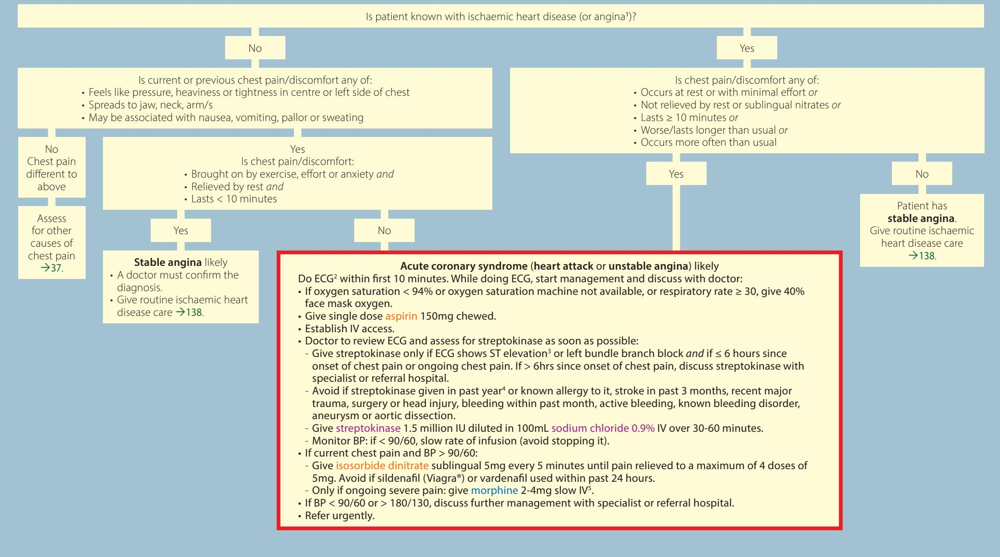

1Chest pain caused by ischaemic heart disease. 2ECG may show ST segment depression or elevation, but a normal ECG does not exclude diagnosis of unstable angina or heart attack. 3ST elevation > 1mm in two or more contiguous limb leads *or* ST elevation > 2mm in two or more contiguous chest leads. 4Discuss use of alteplase with specialist/referral hospital. 5Dilute 10mg morphine with 9mL of sodium chloride 0.9%. Give diluted morphine 5mL IV over 5 minutes (1mL/minute). If needed, give another 1mL/min until pain improved, up to 10mL. Stop if BP drops < 90/60.

**[HIV](#page-102-0) [COVID-19](#page-117-0) [CHRONIC RESPIRATORY DISEASE](#page-119-0) [HEPATITIS B \(HBV\)](#page-116-0) [CARDIOMETABOLIC CONDITIONS](#page-123-0) [MUSCULOSKELETAL DISORDERS](#page-147-0) [MENTAL HEALTH](#page-136-0) [EPILEPSY](#page-145-0) [WOMEN'S HEALTH](#page-150-0) [PALLIATIVE CARE](#page-166-0)**

**[TB](#page-85-0)**

**CONTENTS SYMPTOMSCONTENTS CHRONIC CONDITIONS**

# **ISCHAEMIC HEART DISEASE: ROUTINE CARE**

| he ien it h isc ha ic he d ise As t at t w art se ss p em as e |                                                            |                                                                                                                                                                                                                                                                                                                                                                                                                                                       |  |
|----------------------------------------------------------------------------------------------------------------------------|------------------------------------------------------------|-------------------------------------------------------------------------------------------------------------------------------------------------------------------------------------------------------------------------------------------------------------------------------------------------------------------------------------------------------------------------------------------------------------------------------------------------------|--|
| As se ss                                                                                                             | W he n t o a sse ss                         | No te                                                                                                                                                                                                                                                                                                                                                                                                                                              |  |
| Sy tom mp s                                                                                                       | Eve vis it ry                                     | f re de f c hes d for hae hea d f n lrea dy do  I iso in / isc isc mi ise i 137 t e t p t, a rt tom ot cen p s o a om sse ss c ase sy mp s a ne •   As k a bo leg d s f st ke / T I A in 65 13 6. ut tom p a an y mp s o ro • |  |
| De ion p res s                                                                                                 | Eve vis it ry                                     | fe fe f y  In t he h, has ) lt do de d, ho les ) lt litt le lea do hin ? I he ast t at ien t: 1 r 2 int st o in ing t to it 143 p m on p wn p res se p e s o ere r p sur e g s es e r ,                                                                             |  |
| B P                                                                                                                     | Eve vis it ry                                     | f kno hy  f n hec k f ≥  I ion 13 3. I B P: i 0 / 9 0 13 2. ert ot, 14 wn p en s c                                                                                                                                                                                                                                                                        |  |
| bet k D ia ris es                                                                                           | d d y ly At iag is a no s n ear | f kno d bet  f n kno h d bet hec k g luc  I ia 13 0. I it ia 17. ot wn es wn w es, c ose                                                                                                                                                                                                                                                                     |  |

#### **Advise the patient with ischaemic heart disease**

- If patient has had a heart attack, s/he can resume normal daily and sexual activity 1 month after heart attack if symptom free.
- Emphasize the importance of lifelong adherence to medication. If difficulty with adherence, give adherence support [173](#page-169-0).
- •Ensure patient knows how and when to use sublingual nitrates. Explain that they are not addictive and can also be used before activities which may provoke chest pain.
- Patient should avoid non-steroidal anti-inflammatories (like ibuprofen), as they may precipitate chest pain.
- If < 55 years (man) or < 65 years (woman), advise the first degree relatives (parents, siblings, children) to have CVD risk assessment.

#### **Treat the patient with ischaemic heart disease**

- Give influenza vaccine 0.5mL IM yearly. Check that patient is up to date with COVID-19 vaccine.
- Help the patient to manage his/her CVD risk [129](#page-125-0).
- Giveaspirin 150mg daily for life. Avoid if peptic ulcer, dyspepsia, kidney or liver disease.
- Give simvastatin1 40mg at night. If on amlodipine, give instead simvastatin1 20mg at night (no dose adjustment needed for rosuvastatin, pravastatin, atorvastatin). Avoid if pregnant or liver disease.
- Give atenolol 50mg daily, even if no chest pain/discomfort. Avoid in asthma, COPD, heart failure, peripheral vascular disease.
- If unstable angina or following heart attack: if signs of heart failure, give enalapril 2.5mg 12 hourly and increase slowly to 10mg 12 hourly. Avoid if pregnant, angioedema or renal artery stenosis.
- •If patient has **stable angina**, treat using stepwise approach as in table below:
- If chest pain/discomfort controlled, continue same medication and dose.
- If still gets episodes of chest pain/discomfort, increase to maximum dose. If symptoms continue after this, add next step. Ensure patient is adherent before increasing medication.

| Ste p | d Me ica ion t                                                                                                                            | Do se                                                          | do Ma im um se x                                                                                       | No te                                                                                                                                                                                                                                                                                                                                                                                                                                                                                                                                                                                                                                                           |
|----------|-------------------------------------------------------------------------------------------------------------------------------------------------------|-------------------------------------------------------------------|-----------------------------------------------------------------------------------------------------------------------|--------------------------------------------------------------------------------------------------------------------------------------------------------------------------------------------------------------------------------------------------------------------------------------------------------------------------------------------------------------------------------------------------------------------------------------------------------------------------------------------------------------------------------------------------------------------------------------------------------------------------------------------------------------------|
| 1        | Iso b i de d in itra h c hes te wit t sor d be for in a ion t p a n e e xer d | b ling l w h a 5m it ina g su ua ng | f 5 do h e h 3 it ses o mg w ac de f c hes iso in t p ep o a | f c f c fur f n I hes d t ke do I hes ke he do I bet t p in o t ion st a 1st t p in p ists ta t r 2 5 mi tes art ter a n e xer , re n a se. a ers a ses nu ap o , fte d do k m d l at ly. 5 m inu r 3 ien ica ion tes at t m ust ten t t a r se, p se e e ur g en                                                                                                                                                           |
|          | an Ate lo l no                                                                                                                            | 0m da i ly 5 g                                     | 10 0m da i ly g                                                                                        | f 6 f as fa Tit ing lse 0 bea /m inu Av i d i hm C O P D, u l le d hea i lure ip he l va lar d ise rat e t est rat ts te. t ntr rt o r p u e o o a, nco o , p er ra scu ase f s de f fe ( hea dac he, l d han ds / fee ht hes fat ) ar lera b le. lo d d. i i im ig ig int Use ip ine in cts t, ote t t, ste or e co p nce c ue e o am a , |
| 2        | d d a lo d A ip ine m                                                                                                            | he 5m in t rni g mo ng                          | da ly 10m i g                                                                                             | d f hea fa lur d h s list du do ht. Av i i i isc it ia Re imv in 20 ni rt ast at to at o e, uss p ec ce s se mg g w                                                                                                                                                                                                                                                                                                                                                                                                                              |
| 3        | A d d: iso b i de itra te sor m on on                                                                             | d 10m at 8am 2p g an m                       | d 20 at 8a 2p mg m an m                                                                       | -                                                                                                                                                                                                                                                                                                                                                                                                                                                                                                                                                                                                                                                                  |
|          | or b de d iso i in itra te sor                                                                                             | d 20 8a 2p at mg m an m                   | d 3 0m 8am 2p at g an m                                                                       | -                                                                                                                                                                                                                                                                                                                                                                                                                                                                                                                                                                                                                                                                  |

•If atenolol and amlodipine contra-indicated/not tolerated or chest pain/discomfort persists on full treatment, refer to specialist.

Review monthly until symptoms controlled. Then review 3-6 monthly.

**[TB](#page-85-0)**

1If on lopinavir/ritonavir or atazanavir/ritonavir, avoid simvastatin, give instead atorvastatin 10mg at night.

### **PERIPHERAL VASCULAR DISEASE (PVD)**

 Peripheral vascular disease is characterised by claudication: muscle pain in legs or buttocks on exercise that is relieved by rest. Leg pulses are reduced and skin may be cool, shiny and hairless. Refer the patient newly diagnosed with peripheral vascular disease for specialist assessment.

#### **Give urgent attention to the patient with peripheral vascular disease and any of:**

- •Sudden severe leg pain at rest with any of the following in the leg: numbness, weakness, pallor, no pulse: **acute limb ischaemia** likely
- Leg pain occurring at rest, ulcer or gangrene on leg: **critical limb ischaemia** likely
- Pulsatile mass in abdomen with abdominal/back pain or BP < 90/60: **ruptured abdominal aortic aneurysm** likely

#### **Management:**

- **Acute limb ischaemia** likely: refer urgently.
- **Critical limb ischaemia** likely: discuss same day urgency of referral with specialist.
- •**Ruptured abdominal aortic aneurysm** likely: avoid giving IV fluids even if BP < 90/60 (raising blood pressure may worsen the rupture) and refer urgently.

| he ien it h p ip he l v lar d ise As t at t w se ss p er ra as cu as e |                                                                 |                                                                                                                                                                                                                                                                                                                                                                                                                               |  |  |
|------------------------------------------------------------------------------------------------------------------------------------------|-----------------------------------------------------------------|-------------------------------------------------------------------------------------------------------------------------------------------------------------------------------------------------------------------------------------------------------------------------------------------------------------------------------------------------------------------------------------------------------------------------------|--|--|
| As se ss                                                                                                                           | W he n t o a sse ss                              | No te                                                                                                                                                                                                                                                                                                                                                                                                                      |  |  |
| Sy tom mp s                                                                                                                     | Eve vis it ry                                          |   Ma As k a bo hes d s f st ke / T I A in 137 13 6. tom tom ut t p tom nag e s y mp s a s o n s y mp p ag es. c a an y mp s o ro • he l kin d be for f c lau d Do ista ica ion nt t t o t cu me wa g nce e o nse • |  |  |
| De ion p res s                                                                                                               | Eve vis it ry                                          |  he h, has ) fe lt do de d, ho les ) fe lt litt le lea do hin ? f y he In t ien t: 1 r 2 int in ing I it 143 ast t at st o t to p m on p wn p res se p e s o ere r p sur e g s es e r ,                                                     |  |  |
| B P                                                                                                                                   | Eve vis it ry                                          |   I f kno hy I f n hec k B P: f ≥ / ion 13 3. i 14 0 9 0 13 2. ert ot, wn p en s c                                                                                                                                                                                                                                                |  |  |
| d fee Leg t s a n                                                                                                         | Eve vis it ry                                          | for for foo foo  C hec k lse de kin b lem For d du in, sat ion mit t sc t c cat ion 6 6. p a p u s, s en y, s p ro s. ree n a n are e ,                                                                                                                                                        |  |  |
| b do A me n                                                                                                                  | Eve vis it ry                                          | f a lsa le m fe lt, r fer for for b le a b do l ao fer ly f a b do l bac k p I i i mi ic a Re i mi / in o B P < 9 0 / 6 0. t t rt t p u ass e as ses sm en p oss na ne ury sm ur g en na a r                                           |  |  |
| D ia bet ris k es                                                                                                         | At d iag is, he ly t no s n y ear |   f kno d bet f n kno h d bet hec k g luc I ia 13 0. I it ia 17. ot wn es wn w es, c ose                                                                                                                                                                                                                                             |  |  |

#### **Advise the patient with peripheral vascular disease**

- •Advise the patient to keep legs warm and below heart level (especially at night), and to avoid decongestant medications that may constrict blood vessels.
- If patient smokes, encourage to stop [141](#page-137-0). Support the patient to make a change [177](#page-173-0).
- Advise patient that physical activity is an important part of treatment. It increases the blood supply to the legs and may significantly improve symptoms.
- • If < 55 years (man) or < 65 years (woman), advise the first degree relatives (parents, siblings, children) to have CVD risk assessment [127](#page-123-0).

#### **Treat the patient with peripheral vascular disease**

- Help the patient to manage his/her CVD risk [129](#page-125-0).Advise brisk exercise for 30 minutes at least 3 times a week (preferably daily). Advise patient to pause and rest whenever claudication develops.
- Give simvastatin1 40mg2 at night regardless of cholesterol level. If patient develops muscle pain/cramps, reduce dose to 10mg daily. Avoid if pregnant or liver disease.
- Give aspirin 150mg daily for life. Avoid if peptic ulcer, dyspepsia, kidney or liver disease.

Refer to specialist at diagnosis (start medications and exercise while waiting for appointment) and if pain interferes with activities of daily living after 3 months of medication and exercise.

**•Review 3 monthly until stable (coping with activities of daily living and able to work), then yearly.**

1If on lopinavir/ritonavir or atazanavir/ritonavir, avoid simvastatin, give instead atorvastatin 10mg at night. 2If on amlodipine, reduce simvastatin dose to 20mg at night. No dose adjustment needed for rosuvastatin, pravastatin, atorvastatin.

### **THE MENTALLY ILL PATIENT NEEDING TREATMENT OR ADMISSION**

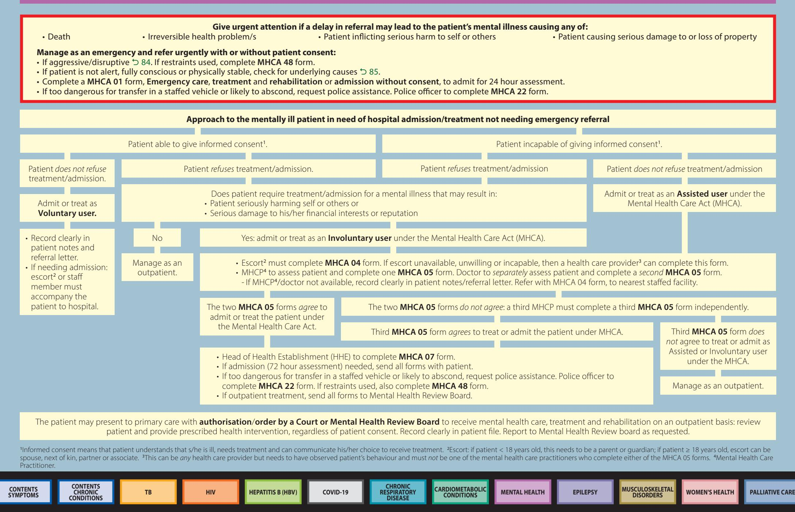

### **TOBACCO SMOKING**

| he ien ho ke ba ly ly d As t at t w s t nt t sto se ss p sm o o cco cu rre or rec en p p e |                                    |                                                                                                                                                                                                                                                                                                                                                                                                                                                                                                                                                                                                                                                                                                                                                                                                                                                                                                                                                                                                                                                                                    |  |  |
|--------------------------------------------------------------------------------------------------------------------------------------------------------------------------------------|------------------------------------|------------------------------------------------------------------------------------------------------------------------------------------------------------------------------------------------------------------------------------------------------------------------------------------------------------------------------------------------------------------------------------------------------------------------------------------------------------------------------------------------------------------------------------------------------------------------------------------------------------------------------------------------------------------------------------------------------------------------------------------------------------------------------------------------------------------------------------------------------------------------------------------------------------------------------------------------------------------------------------------------------------------------------------------------------------------------------------|--|--|
| As se ss                                                                                                                                                                       | he W n t o a sse ss | No te                                                                                                                                                                                                                                                                                                                                                                                                                                                                                                                                                                                                                                                                                                                                                                                                                                                                                                                                                                                                                                                                           |  |  |
| Sy tom mp s                                                                                                                                                                 | Eve vis it ry             |    k a bo hat ht h / d f f ic lty bre hin ht los As ig i 3 8, u rin 5 9 o ig 23 ut tom s t est at tom sy mp m sug g ca nce r: c ou g u g ary sy mp s r w e s • k a bo f 1: c hes  leg  d de f a f: a kne f fac leg bn d f f ic lty kin l As C V D in 37 in 65 ic w i vis ut tom t p t o etr sy mp s o a p a , ne w s n o nse ny o sy mm ea ss o e, a rm or ; n um ess sp ea g or ua u u • , , d ba  istu 13 6. r nce Ma he t tom tom nag e o r sy mp s a s o n s y mp p ag es. •                                                                                                                        |  |  |
| bac To co use                                                                                                                                                               | Eve vis it ry             | k a bo be f c day d w hat do hi le s kin As ig ivit ies ien ut tte t at t nu m r o are s p er an ac p es mo g. w • f re for f its  I ly d, p d e d r dv bo ks, be d hn d s he lp line /g la b le 178 t sto ise at ien t a e t i tar t ing in ice ut ris istr act ion te iq ort i cen p p e ra p n nco ura g o a vo e-s : re ce a a ne c ues an up p rou p s a va • , k a bo hat he lp d a d w hy fa le d, a d dre for lap be for he As iou ing vie i it a ut tte t a t st att t t tte t. p rev s a mp op p : re w w e n em p ss rea son re se e a no r q u mp • |  |  |
| Str ess ors                                                                                                                                                                    | Eve vis it ry             |  He lp de fy he do l an d w k fac bu kin bac I f low d, s i nt i t st ic, ia tor tr i t ing to to tre xie ty 8 6. me soc or s c on sm o g co. m oo ss o r an                                                                                                                                                                                                                                                                                                                                                                                                                                                                                                                                                                                                                                                                                                                                                                   |  |  |
| C O P D                                                                                                                                                                     | d At iag is no s    | f f f ic fas  f  I d lty bre hin he l kin /up hi l l, c de C O P D 123 I kno C O P D 126 i at t i u g w n w a g a on s r wn                                                                                                                                                                                                                                                                                                                                                                                                                                                                                                                                                                                                                                                                                                                                                                                                         |  |  |
| C k V D r is                                                                                                                                                             | d At iag is no s    | k  Ass C V D r is 127 ess                                                                                                                                                                                                                                                                                                                                                                                                                                                                                                                                                                                                                                                                                                                                                                                                                                                                                                                                                                                                                                 |  |  |

### **Advise the patient who smokes tobacco**

- Ask if patient is willing to discuss tobacco smoking. For tips on how to communicate effectively [176](#page-172-0). Support the patient to make a change [177](#page-173-0).
- Advise patient that stopping tobacco smoking is the most important action s/he can take to improve health, quality of life and increase life expectancy.
- • Explain that nicotine is very addictive and stopping can cause withdrawal symptoms: increased appetite, mood changes, difficulty sleeping/concentrating, irritability, anxiety, restlessness. These should improve after 2-4 weeks.
- Advise that most smokers make several attempts to stop before they are successful.
- •If patient is pregnant or breastfeeding, stress the importance of stopping for baby's health.
- Ask if patient is willing/ready to stop smoking tobacco and give the advice below:

### **If patient is not ready to stop in the next month**

- Discuss risks to patient (worsening asthma, infertility, heart attack, stroke, COPD, cancer) to spouse (lung cancer, heart disease) and to children (low birth weight, asthma, respiratory infections).
- Help identify benefits of stopping tobacco smoking like saving money, improved health, taste, sense of smell and appearance and being a positive role model for children.
- Help identify barriers to stopping tobacco smoking and possible solutions.
- Ask if patient is ready to stop smoking tobacco in the next month. If not ready to stop, encourage patient to return, use helpline [178](#page-174-0) or support group when ready to stop.

### **If patient is ready to stop in the next month**

- Help patient plan: set date to stop within 2 weeks, seek support from family and friends, support group or helpline [178](#page-174-0), avoid/manage situations associated with smoking and remove cigarettes, matches, and ashtrays. Help manage cravings using a stepwise approach, starting with step 1. If urge does not subside, move on to next step. Step 1: delay as long as you can.
- Step 2: take a deep breath and blow out slowly (repeat 10 times).
- Step 3: drink water as an alternative to tobacco smoking.
- Step 4: distract yourself with reading a book, going for a walk, listening to music, watching TV or other hobby.
- Offer referral for counselling especially if failed previous attempt at stopping, previous depression or alcohol misuse.

**Review patient within the first week of stopping tobacco smoking and then as needed.**

1Cardiovascular disease (CVD) includes ischaemic heart disease, peripheral vascular disease and stroke/TIA.

**[TB](#page-85-0)**

**MENTAL HEALTH**

# **ALCOHOL AND/OR DRUG USE**

Unhealthy alcohol use refers to a pattern of use that puts the patient at risk of dependence and physical, mental and social harm. *Any* drug use is unhealthy. If patient smokes, encourage to stop [141](#page-137-0).

| As he ien it h u he lt hy lco ho l u dr t at t w se ss p n a a se or an y ug us e |                                                                                                                                                                                                                                                                                                                                                                                                                                                                                                                                                                                                                                                                                                                                                                                                                                                                                   |  |  |  |
|--------------------------------------------------------------------------------------------------------------------------------------------------------------------|-----------------------------------------------------------------------------------------------------------------------------------------------------------------------------------------------------------------------------------------------------------------------------------------------------------------------------------------------------------------------------------------------------------------------------------------------------------------------------------------------------------------------------------------------------------------------------------------------------------------------------------------------------------------------------------------------------------------------------------------------------------------------------------------------------------------------------------------------------------------------------------|--|--|--|
| As se ss                                                                                                                                                     | No te                                                                                                                                                                                                                                                                                                                                                                                                                                                                                                                                                                                                                                                                                                                                                                                                                                                                          |  |  |  |
| Sy tom mp s                                                                                                                                               | f re ly du d d u d r les d, d f f ic lty lee fus d, a ha l luc hea da he for li ke ly h dra l  I /st itat i ing nxi ina ing ing /vo mit ing it 85 t est t eat tre tre at cen re ce op p e se an s, a g e s p , co n e ou s, , sw mo rs, c or na use a w wa u • , , f ag  I ive /v io len d isru ive be hav iou 84 t o t g res s r p r •  f p has da l t ho hts lan fer day I ien ic i 8 3. at t su ug or p s, r e sa me •                                          |  |  |  |
| Ha fu l us rm e                                                                                                                                        | Ass d fre f a lco ho l us f dr kin dr ks 1/w k o dr ks 1/s la hat his ks o f ha d de de t ity i in > 1 4 in 4 in ion in t t in is r ≥ ess q uan an q ue ncy o e: g ee ess , ex p cre ase s r rm an p en nce • k for ha hy l ha ( li ke live d h u lce ), m l ha ( li ke de ), s l ha (re lat hip leg l or f in l ) o ky be hav Loo ica inj ies ise ion ia ion ia r ri iou tom ta rm : p s rm ur r ase , s ac r en rm p res s oc rm s a an c s r. • , , |  |  |  |
| de De p en nce                                                                                                                                         | de de f ≥ f: s d t bst d f f ic lty l ling h dra l on /re du lera (ne d ); n lec he d u de ha Pat ien is i 3 o i it ing ing ing ing r in inu ite t nt tro ntr sto to t ot ter est t p en ng ne e o u se su an ce; u co o us e; w wa p p c nce e m ore eg s; c on e se sp rm ;                                                                                                                                                                                                                                                                                                                                               |  |  |  |
| Str ess ors                                                                                                                                                  | lp de fy do l an d w k fac bu lco ho l dru k a bo for his he bst f p be bu d  He i i ic, ia i ing / As / I ien is ing 8 8. nt st tor tr t to ut at t me soc or s c on a g use rea son s r su an ce use a se                                                                                                                                                                                                                                                                                                                                                                                                                                                                   |  |  |  |
| l hea lt h Me nta                                                                                                                                   | fe fe f y  f st  In t he h, has ien ) lt do de d, ho les r 2 ) lt litt le int lea in do ing hin ? I it he 143 I xie 8 6. ast t at t: 1 st o t to ty p m on p wn p res se p e s o ere r p sur e g s es e r res s o r an ,                                                                                                                                                                                                                                                                                                                                                                                                                                         |  |  |  |

### **Advise the patient with unhealthy alcohol use or any drug use**

37 and 41

- If pregnant/planning pregnancy or breastfeeding, advise to avoid alcohol/drugs completely. Alcohol/drugs can harm the developing baby.
- Suggest patient seeks support from close relatives/friends who do not use alcohol/drugs, a support group or a helpline [178](#page-174-0). Refer patient to social worker, psychologist or counsellor.
- Discuss risks/harms that using alcohol/drugs may cause. Allow patient to decide for him/herself to stop or cut down. Support the patient to make a change [177](#page-173-0).

| Un he lt hy lco ho l u it ho de de ut a a se w p en nc e f p ha fu l dr kin de de b lem I in iou nt, reg na rm g, p rev s p en nc e p ro or • d li ke live da l i l lne dv lco ho l in ica ion ( ), a ise ntr t ta to sto co a r ma g e, m en ss p a let ly. Av d dr kin lac d kee lco ho l at ho i in ing co mp e o g p es an p a me f n f a bo d p ho lco ho l, a dv I ien inu ise at t c s to nt to at on e o ve an ose co e a • lea do low k a lco ho l us dr ks 1/ da d a d a lco ho l -ris 2 in i st c ut to wn e: ≤ y an vo f t lea da he k. at st 2 on y s o w ee | An dr it ho de de ut y ug us e w p en nc e dv l leg l o A ise ing i isu ing to st op us a r m s • dru let ly. ip ion t p res cr g s c om p e f p I ho dv du at ien t c s to nt inu ise to ose co e, a re ce • ha d le i inj ion ri inj ion ect ste ect rm : av o s o r u se hn lar ly for d he iq H I V a it is. tec tes t re at ue g n p u , for  Co de he d Pr E P i r t 10 6. ns ne e • | A lco ho l / dr de de ug p en nc e dv hat lco ho l dru d t A ise / t a g s n ee o be d s low ly. f a lco ho l dru I / st op p e g s f fe d s d de ly, h dra l e sto wit cts p p e u n wa be ha fu l. f ic ( be low ) De i ion tox at ca n rm l l sa fe ly he bo dy fro lco ho l wi t we an m a dru /s. or g |
|------------------------------------------------------------------------------------------------------------------------------------------------------------------------------------------------------------------------------------------------------------------------------------------------------------------------------------------------------------------------------------------------------------------------------------------------------------------------------------------------------------------------------------------------------------------------------------------------------------------------------------------------------------------------------------------------------------------------------------------------------------------------------------------------------------------------------------------------------------------------------------------------------------------------------------------------------------------------------------------------------------------------------------------------------------------------------------------------------------------------|---------------------------------------------------------------------------------------------------------------------------------------------------------------------------------------------------------------------------------------------------------------------------------------------------------------------------------------------------------------------------------------------------------------------------------------------------------------------------------------------------------------------------------------------------------------------------------------------------------------------------------------------------------------------------------------------------------------------------------------------------------------------------|-------------------------------------------------------------------------------------------------------------------------------------------------------------------------------------------------------------------------------------------------------------------------------------------------------------------------------------------------------------------------------------------------------------------------------------------------------------------------------------------------------------------------------------------------------------------------------------------------------------------------------|
|                                                                                                                                                                                                                                                                                                                                                                                                                                                                                                                                                                                                                                                                                                                                                                                                                                                                                                                                                                                                                                                                                                                        |                                                                                                                                                                                                                                                                                                                                                                                                                                                                                                                                                                                                                                                                                                                                                                           |                                                                                                                                                                                                                                                                                                                                                                                                                                                                                                                                                                                                                               |

### **If alcohol/drug dependence, doctor to treat the patient with the help of the carer**

 Arrange inpatient detoxification if previous withdrawal delirium/fits or failed detoxification, pregnant, chronic medical or mental illness, homeless/no social support, dependent on opioid or > 1 drug. Doctor can do outpatient detoxification if none of the above. Ensure patient has a close relative/friend to act as supervisor during programme.

| bs Su tan ce                                                                        | f ic for d c ho De i ion Wr ite ien iso tox at t p at t a p rog ram me ou rog ram me p n se n s up erv r -                                                                                                                                                                                                                                                                                                                                                                                                                                                                                                                                                                                                                                                                                                                                                                                                                                                                                                                        |  |  |
|----------------------------------------------------------------------------------------------|-----------------------------------------------------------------------------------------------------------------------------------------------------------------------------------------------------------------------------------------------------------------------------------------------------------------------------------------------------------------------------------------------------------------------------------------------------------------------------------------------------------------------------------------------------------------------------------------------------------------------------------------------------------------------------------------------------------------------------------------------------------------------------------------------------------------------------------------------------------------------------------------------------------------------------------------------------------------------------------------------------------------------------------------------------------------------------------------------------------------------------------|--|--|
| lco ho l A                                                                          | h da ly for day G ive iam ine 3 0 0m i 14 t g s. • d h w h dra l sy he ho ly for day he ho ly for day he da ly for day he f w h dra l sy de his fer d G ive iaz 10 it it n 5 6 3 T n 5 12 2 T n 5 i 2 T I it ist ite / isc tom s t top tom t ep am mg w wa mp mg ur s. mg ur s. mg s. n s wa mp s p ers sp , re uss •                                                                                                                                                                                                                                                                                                                                                                                                                                                                                                       |  |  |
| b k Ca is / Ti / nn a Co / Ma dra ine ca n x | d lwa de d. Me ica ion is t t a no s n ee y • for Tre lee b lem h d iaz da ly 12 ho ly, day Mo de d p ho at iety it 5m i tap ing 5-7 nit ion is. anx or s p p ro s w ep am g or ur er ov er s. or p res s an sy c s •                                                                                                                                                                                                                                                                                                                                                                                                                                                                                                                                                                                                                                                                                                 |  |  |
| d Be iaz ine nzo ep s                                                      | d s d de ly be d h dra l m ke hs. Av i ing iaz ine Wi sto t ta nt o u n p p nzo ep s. wa ay mo •  Re lac be d kin h d I f ta kin lor lac h d iaz For he be d fer S A M F, M I C ho line bst he lp line iaz ine at ien t is t wit iaz 0.5 -1m it 5m ot iaz ine to t 178 p e nzo ep p a g ep am g aze p am mg g, rep e w ep am g. r nzo ep s, r e or su an ce • d ks by f sy do for ks. f in l do de by k. De iaz 2 w 2-2 .5m I inu r in 2 On 20 % o it ia 0.5 -2m tom t at cre ase ep am ev ery ee g. mp s o ccu r, c on e o cre ase se mo re w ee ce se, cre ase g eve ry we e • |  |  |
| Re                                                                                           | he de f ic da ly l st b le. dv d ly f a b lem f p lco ho l dr iew ien i ion i i A ise im iat i Sto i ien / t at t o tox at t to tu at t re p n a p rog ram me un a re rn me e ny p ro s. p p rog ram me su me s a ug us e. v                                                                                                                                                                                                                                                                                                                                                                                                                                                                                                                                                                                                                                                                              |  |  |

1One drink is 1 tot of spirits, or 1 small glass (125mL) of wine or 1 can/bottle (330mL) of beer.

**[TB](#page-85-0)**

**[HEPATITIS B \(HBV\)](#page-116-0) [COVID-19](#page-117-0)**

### **DEPRESSION: DIAGNOSIS**

Depressed mood most of the day, nearly every day

**[TB](#page-85-0)**

**CONTENTS SYMPTOMSCONTENTS CHRONIC CONDITIONS**

Loss of interest or pleasure in activities that are usually pleasurable

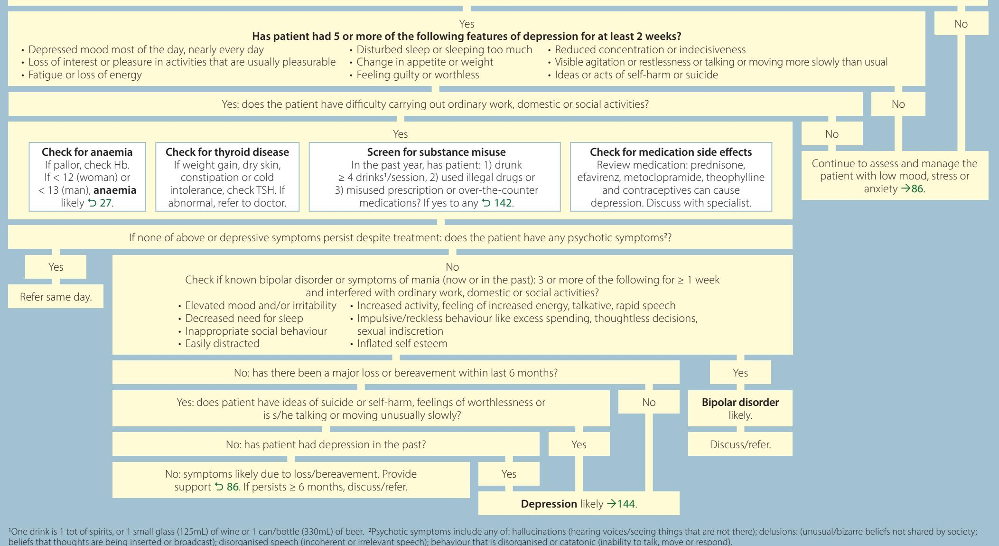

**[HIV](#page-102-0) [COVID-19](#page-117-0) [CHRONIC RESPIRATORY DISEASE](#page-119-0) [HEPATITIS B \(HBV\)](#page-116-0) [CARDIOMETABOLIC CONDITIONS](#page-123-0) [MUSCULOSKELETAL DISORDERS](#page-147-0) [MENTAL HEALTH](#page-136-0) [EPILEPSY](#page-145-0) [WOMEN'S HEALTH](#page-150-0) [PALLIATIVE CARE](#page-166-0)**

### **DEPRESSION AND/OR ANXIETY: ROUTINE CARE**

| he ien it h de ion d /o l ise d a iet As t at t w se ss p p res s an r g en era nx y |                                    |                                                                                                                                                                                                                                                                                                                                                                                                                                                                                                                                                                                                                                                                                                                                                                                                                                                                                                                                                                                                                                                                                                                                                                                                                                                                                                                                                                                                                                                                                                                                                                                            |  |
|-----------------------------------------------------------------------------------------------------------------------------------------------------------------------|------------------------------------|--------------------------------------------------------------------------------------------------------------------------------------------------------------------------------------------------------------------------------------------------------------------------------------------------------------------------------------------------------------------------------------------------------------------------------------------------------------------------------------------------------------------------------------------------------------------------------------------------------------------------------------------------------------------------------------------------------------------------------------------------------------------------------------------------------------------------------------------------------------------------------------------------------------------------------------------------------------------------------------------------------------------------------------------------------------------------------------------------------------------------------------------------------------------------------------------------------------------------------------------------------------------------------------------------------------------------------------------------------------------------------------------------------------------------------------------------------------------------------------------------------------------------------------------------------------------------------------------|--|
| As se ss                                                                                                                                                        | he W n t o a sse ss | No te                                                                                                                                                                                                                                                                                                                                                                                                                                                                                                                                                                                                                                                                                                                                                                                                                                                                                                                                                                                                                                                                                                                                                                                                                                                                                                                                                                                                                                                                                                                                                                                   |  |
| Sy tom mp s                                                                                                                                                  | Eve vis it ry             | Ass f de d a I f n bet fte ks o f tr d /re fer tom ion nxi ety ter r 8 eat nt tre atm t, isc ess sy mp s o p res s an o a we e me or wo rse on en uss • he Ma t tom tom nag e o r sy mp s a s o n s y mp p ag es. •                                                                                                                                                                                                                                                                                                                                                                                                                                                                                                                                                                                                                                                                                                                                                                                                                                                                                                                                                                                                                                                                                                                                                                              |  |
| l f- ha Se rm                                                                                                                                             | Eve vis it ry             | kin bo ho hts f se l f- ha de do he ha f t his f p has da l t ho hts lan d m k be for As ien /su ic i inc I ien ic i is inu ing at t a ut t t t at t t g a p ug o rm es no rea se c nce o su ug or p s, a sse ss a n an ag e r e c on  D h s list be for de 8 3. isc it ia ing i tar t t t. uss w p ec e s an p res san                                                                                                                                                                                                                                                                                                                                                                                                                                                                                                                                                                                                                                                                                                                                                                                                                                                                                                                                                             |  |
| Ma nia                                                                                                                                                             | Eve vis it ry             | f a bn l ly ha l kat b le o k les d fer I ic, ive irri isc /re et ta ta orm a p p en erg r re c s, uss y, ,                                                                                                                                                                                                                                                                                                                                                                                                                                                                                                                                                                                                                                                                                                                                                                                                                                                                                                                                                                                                                                                                                                                                                                                                                                                                                                                                                                             |  |
| An xie ty                                                                                                                                                       | At d iag is no s    | f ex fun for f: m f f ic I d / d lea hs h ≥ le t les b lity d lty lee dn ive im ire ct ion istr at st 6 m t wit 3 o ion st irri ta i i ing ntr at ion t ire ces s wo rry ca use s p a ess on usc en s , re sne ss, u s p , p oo r co nce ess : • , , l ise d a iet d iso de li ke ly. g en era nx y r r f a du d by lar b ho b li ke ly, fer d I nxi is in icu itu ion /o j ia / isc ety art at ect , p ce a p s re uss • f re fea fer I d s d de h p hy l sy d n bv ic d iso de li ke ly, / d eat it ica tom iou isc p e u n r w s mp s a n o o s c au se, p an r r re uss •  f p ba d e htm f las h bac ks, da f p le /s fee ling f de hm ic s d iso de li ke ly I iou ien ing ni i itu ion j ine 8 8. at tac t, p ost -tr t tre rev s xp er ce cau s g are s, avo nce o eo p s, um p ss o r a o en au ma ss r r • |  |
| De ia nt me                                                                                                                                                  | d At iag is no s    |  I f for lea hs f: m b lem d lan d f f ic lty, les b le t h da ly d w k /so l fun de de ia 6 m ≥ 1 iso rie ion i it i ivit ies ia ion i nt 148 at st t nta t act ct on o em ory p ro s, g uag e u s a o c op e w an or c : co ns r me ,                                                                                                                                                                                                                                                                                                                                                                                                                                                                                                                                                                                                                                                                                                                                                                                                                                                                                                                                                                                                                                                                                                                     |  |
| lco ho l dru A / g use                                                                                                                           | Eve vis it ry             | f y  In t he has ) dru k ≥ dr ks 1/s ) u d l leg l dru ) m d p he d ? I ast at ien t: 1 4 in ion 2 i r 3 isu ip t ion t ter ica t ion to 142 p y ear p n ess se a g s o se res cr or ov er- -co un m e s es any , ,                                                                                                                                                                                                                                                                                                                                                                                                                                                                                                                                                                                                                                                                                                                                                                                                                                                                                                                                                                                                                                                                                                                                                           |  |
| de f fe S i cts e                                                                                                                                   | Eve vis it ry             | k a bo de f fe f a de d  As i i ica ion ut cts nt t m t 145 s e o p res san e                                                                                                                                                                                                                                                                                                                                                                                                                                                                                                                                                                                                                                                                                                                                                                                                                                                                                                                                                                                                                                                                                                                                                                                                                                                                                                                                                                                                                               |  |
| Str ess ors                                                                                                                                                     | Eve vis it ry             | lp de fy do l an d w k fac bu de f p be bu d  f re ly be d  He i i ic, ia i ing ion xie I ien is ing 8 8. I 8 6. nt st tor tr t to ty. at t t me soc or s c on p res s or an a se cen rea ve                                                                                                                                                                                                                                                                                                                                                                                                                                                                                                                                                                                                                                                                                                                                                                                                                                                                                                                                                                                                                                                                                                                                                                                                   |  |
| Fam ly lan i nin p g                                                                                                                                | Eve vis it ry             | ds  Ass ien 's c ive 154 at t tra t ess p on cep ne e • f p bre fee d do d ks: he k to ba by fro d de h a k fro de f p b le, d I ien ing isc ris ris ion ig ris i I i i at t p nt ast cto r to t tre ate tw ant ts. reg na or uss m un p res s m ay ou e ny m p res san oss avo • , de f irs f p Ens l ling /su d fo l low k ly l st b le. I f p b le, d h s list i in im 2 w i i isc it ia ant ts t tr est ort t p res san er o reg na ncy ure co un se p p an -up ee un a oss uss w p ec                                                                                                                                                                                                                                                                                                                                                                                                                                                                                                                                                                                                                                 |  |
| hro d C nic it ion co n s                                                                                                                     | Eve vis it ry             | hat he hro d de ly d. f o l st ds, fav lo l, d h s list Ens nic it ion I i ire isc it ia t ot uat tre ate ate ure r c co n s a re a q e n o ra ero e nz or no uss p ec w                                                                                                                                                                                                                                                                                                                                                                                                                                                                                                                                                                                                                                                                                                                                                                                                                                                                                                                                                                                                                                                                                                                                                                                                                                                             |  |

### **Advise the patient with depression and/or generalised anxiety**

Explain that depression is a very common illness that can happen to anybody. It does not mean that a person is lazy or weak. A person with depression cannot control his/her symptoms.

- Explain that thoughts of self-harm and suicide are common. Advise patient that if s/he has these thoughts, s/he should not act, but tell a trusted person and return for help immediately.
- Educate the patient that anti-depressants can take 4-6 weeks to start working. Explain that there may be some side effects, but these usually resolve in the first few days.
- Emphasise importance of adherence even if feeling well. Advise patient that s/he will likely be on treatment for at least 9 months and it is not addictive. If difficulty with adherence, give support [173](#page-169-0).
- Advise to avoid stopping treatment abruptly as patient may have withdrawal symptoms. If stopping, treatment needs to be tapered.
- Help the patient to choose strategies to get help and cope:

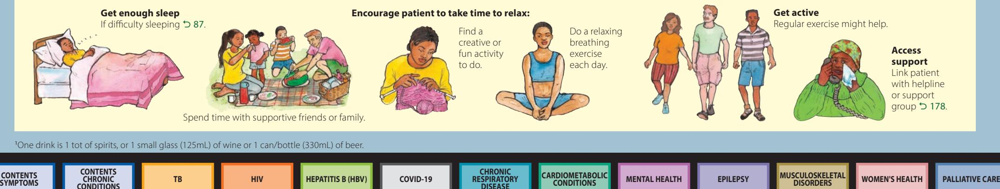

Depression

96

Anxiety

100

#### **Treat the patient with depression and/or generalised anxiety**

- Refer patient for counselling (ideally cognitive behavioural therapy or interpersonal therapy if available) and to social worker and/or helpline/support group [178](#page-174-0).
- If occupational therapist (OT) available, refer for mood, self-esteem, motivation, coping skills and constructive use of leisure time.
- Discuss benefits of antidepressants for depression and generalised anxiety disorder. Respect the patient's decision if s/he declines antidepressants.
- If generalised anxiety disorder or severe anxiety1 on starting antidepressant, consider diazepam 2.5-5mg daily as needed, for up to 10 days. Avoid if patient is known to use substances.
- • Startfluoxetine. If fluoxetine poorly tolerated, give instead citalopram. If difficulty sleeping and sedating antidepressant desired *and* no suicidal thoughts, start instead amitriptyline.

| d Me ica ion t        | Do se                                                                                                                                                                                                                                                                                                                                                                                                                                                                                                                   | No te                                                                                                                                                                                                                                                                                                                                                                                                                                                                                                                                                                                                                                                                                                                                                                                                                                                                                                                                                                                               | de f fe S i cts e                                                                                                                                                                                                                                                                          |
|-----------------------------------|----------------------------------------------------------------------------------------------------------------------------------------------------------------------------------------------------------------------------------------------------------------------------------------------------------------------------------------------------------------------------------------------------------------------------------------------------------------------------------------------------------------------------|--------------------------------------------------------------------------------------------------------------------------------------------------------------------------------------------------------------------------------------------------------------------------------------------------------------------------------------------------------------------------------------------------------------------------------------------------------------------------------------------------------------------------------------------------------------------------------------------------------------------------------------------------------------------------------------------------------------------------------------------------------------------------------------------------------------------------------------------------------------------------------------------------------------------------------------------------------------------------------------------------------|--------------------------------------------------------------------------------------------------------------------------------------------------------------------------------------------------------------------------------------------------------------------------------------------------------------|
| F luo ine xet            | Sta lter day for ks, he 20 2 w n in rt te t to mg on a na s ee cre ase da ly he f p has d a 20 i in t rni I ien in nxi at t ety mg mo ng cre ase , de lay do for he ks. in in r 2 ot cre ase se an we e                                                                                                                                   | Exp la hat l ly d t f se in t xie inc init ia i ty etu an ma y rea se an o r rn ve re. • h s list f p has lep live ki dn d D isc it ia i ien i ise at t uss w p ec ep sy, r o r ey ase • luc fte d bet Mo nit n in ia or g ose m ore o es. • fam f co A dv ly d r d (su da l t ho hts / u l ise i to nit etu i it ion ic i mo or an rn n wo rse ns ug nu sua • ha be hav ). in iou c ng es r f p b le t lera f lu f lu d s lop day I ien ine ine ita 10 at t u o t te t top t tar t c xt ram na o oxe , s oxe an mg ne • | C ha d w ht, hea da he, in a et ite ig ng es p p an e c les d f f ic lty lee i ing t res sne ss, u s p , na use a, d ho l p b lem iar r ea, se xu a ro s. |
| C ita lop ram            | Sta da ly for k, he da ly. rt 1 0m i 1 w n in 20 i t to g ee cre ase mg                                                                                                                                                                                                                                                                                                                                                                                     | Av d f hea fa lur hy hm ki dn fa lur i i i ias i rt t o e, a rr ey e. ,                                                                                                                                                                                                                                                                                                                                                                                                                                                                                                                                                                                                                                                                                                                                                                                                                                                        | Dro d f f ic lty lee hea da he, ine i ing ws ss, u s p c , dry h, n ha ing in t eat m ou au sea , sw , c ng es d w ht. ite ig et ap p an e                                  |
| itr ip l ine Am ty | Sta ht. by day 25 ni Inc 25 5 rt at mg g rea se mg ev ery s. ks: f g d r his do Rev iew 2 w i inu at nt t t ee oo esp on se, co e a se f p l or by ( ). I ia inu inc 75 art nt e t mg no re sp on se, co o rea se day de d, u / day 25 5 15 0m to mg ev ery s a s n ee p g | f f lu d c lop d d o ly lera d. d f o be da line Use i ine ita in ica Av i i i t ntr te to te oxe an ram co a r p oo r o n q u , da l t ho hts (ca be fat l in do ), hea d lau ic i ise ina ion rt ret t su ug n a ov er se ase , ur ry en , g co ma , lep d e l de ly i ien at ts. ep sy an r p                                                                                                                                                                                                                                                                                                                                                                                                                   | Dry h, c d f f ic lty ip ion i ina ing t st at t m ou on u ur , , b lur d v dat is ion ion re , se                                                                                                              |

### **SCHIZOPHRENIA**

#### **•Ensure a specialist confirms the diagnosis of schizophrenia.**

- Consider schizophrenia in the patient who (if no mental health or alcohol/drug disorder) has for at least 6 months had difficulty carrying out ordinary work, domestic or social activities *and* for at least 1 month has had ≥ 2 of the following symptoms of psychosis:
- Delusions: unusual/bizarre beliefs not shared by society; beliefs that thoughts are being inserted or broadcast.
- Hallucinations: usually hearing voices or seeing things that are not there.
- Disorganised speech: incoherent or irrelevant speech
- Behaviour that is disorganised or catatonic (inability to talk, move or respond) *or* negative symptoms: lack of emotion or facial expression, no motivation, not moving or talking much, social withdrawal.

### **Assess the patient with schizophrenia**

| As se ss                                                  | he W n t o a sse ss                                               | No te                                                                                                                                                                                                                                                                                                                                                                                                                                                                                                                                                                                                                                                                                                                                                                                                                                                                                                                                                                                                                                                                                                                                                                                              |
|-----------------------------------------------------------------|----------------------------------------------------------------------------------|-------------------------------------------------------------------------------------------------------------------------------------------------------------------------------------------------------------------------------------------------------------------------------------------------------------------------------------------------------------------------------------------------------------------------------------------------------------------------------------------------------------------------------------------------------------------------------------------------------------------------------------------------------------------------------------------------------------------------------------------------------------------------------------------------------------------------------------------------------------------------------------------------------------------------------------------------------------------------------------------------------------------------------------------------------------------------------------------------------------------------------------------------------------------------------------------------------|
| Sy tom mp s                                            | Eve vis it ry                                                           | f p ho bo f sy f p ho d: Ass is a I is a tom tom ess sy mp s o sy c s ve. mp s o sy c s n •  Ag /v len ive io t 84 g res s -  lev ls o f co ho / day d /or °C, de l ir ium li ke ly Va ing iou 3 8 85 te tur e ≥ ry e nsc sne ss o ve r urs s a n mp era - has d t lar  d e lor for d he ( li ke de f fe bst )  Pat ien in in 147 i mi 17 3. t ter te tm t: r est art tra tre atm t cts rup rea en mu scu en an xp e r eas on s p oo r a ren ce s e , su an ce sus e - f tr fer Go d a d he l do d /re to t im eat nt, isc o ren ce op a ses o me uss - he Ma t tom tom nag e o r sy mp s a s o n s y mp p ag es. • |
| l f- ha Se rm                                       | Eve vis it ry                                                           |  I f p has da l t ho hts lan fer day I f in ha he lert de d v /s f p b le. at ien t ic i 8 3. ten t to ot in ten ict im i i su ug or p s, r e sa me rm rs, a oss                                                                                                                                                                                                                                                                                                                                                                                                                                                                                                                                                                                                                                                                                                                                                                                                                                                                                  |
| Str ess ors                                               | Eve vis it ry                                                           | fy f p  He lp de hat I be bu d 8 8. i nt i stre rs t tom s to at ien t is ing sso m ay wo rse n o r ca use sy mp re cu r. a se                                                                                                                                                                                                                                                                                                                                                                                                                                                                                                                                                                                                                                                                                                                                                                                                                                                                                                                                                  |
| lco ho l / dru A g use                     | Eve vis it ry                                                           | he has dru k ≥ dr ks 1/s d l leg l dru d p he d f y  In t ien ) in ion 2 ) u i r 3 ) m isu ip ion ica ion ? I 142 ast at t: 1 4 t t ter t to p y ear p n ess se a g s o se res cr or ov er- -co un m e s es any , ,                                                                                                                                                                                                                                                                                                                                                                                                                                                                                                                                                                                                                                                                                                                                                                      |
| ly lan Fam i nin p g                          | Eve vis it ry                                                           | ds  f p lan bre fee d fer list Ass ien 's c ive 154 I ien is p nin ing ia at t tra t at t nt, ast to ess p on cep ne e reg na p g p reg na ncy or , re sp ec                                                                                                                                                                                                                                                                                                                                                                                                                                                                                                                                                                                                                                                                                                                                                                                                                                                                                               |
| Me d ica t ion                                      | Eve vis it ry                                                           | k a bo de f fe  As i 147 ut tre atm t s cts en e • k a bo d he f n d he d do lor for d r fer for hea lt h w ker As I ica ion ing ity ut t, r est art t at sto tre atm t a ort a ren ce. on -a ren m e sa me se, ex p e r eas on s p p en n e co mm un or su p p • f p fav f lo D h s list d hat ht ho li ke dn d t do isc it ia i at ien t is o ica t ion t ig te is, iso ire i in a izi uss w p ec n m e m cau se acu p sy c s p re ne, e nz, m ox xac n er ne •                                                                                                                                                                                                                                                                                       |
| ht ( ) We ig B M I                         | Eve vis it ry                                                           | ht ( kg ) ÷ he ht (m ) ÷ he ht (m ). B M I = ig ig ig we • f g ht, fer d f av la b le a d d h s list bo b le a lte hiz hre I inin ig iet ic ian i i isc it ia i ive nia to ut t tre atm t. a g we re a n uss w p ec a p oss rna sc op en •                                                                                                                                                                                                                                                                                                                                                                                                                                                                                                                                                                                                                                                                                                                           |
| G luc ose                                                 | d he ly At iag is, t no s n y ear                  | f kno d bet  f n kno h d bet hec k g luc  I ia 13 0. I it ia 17. ot wn es wn w es, c ose                                                                                                                                                                                                                                                                                                                                                                                                                                                                                                                                                                                                                                                                                                                                                                                                                                                                                                                                                                                                                     |
| Ran do l m t ota ho les l ter c o | At d he ly iag is, t n 2 no s y ear             | d m k  Ass C V D r is 127 ess an an ag e • f c ho les l in d h s list bo b le a lte hiz hre I ing isc it ia i ive nia ter ut t tre atm t. o cre as uss w p ec a p oss rna sc op en • ,                                                                                                                                                                                                                                                                                                                                                                                                                                                                                                                                                                                                                                                                                                                                                                                                                                    |
| H I V                                                     | d f st kno At iag is o r i atu no s s u n wn | for  f d e fav d h s list Tes H I V 110 I H I V p it ive i ire isc it ia t tre atm t w os , av o nz, uss en p ec                                                                                                                                                                                                                                                                                                                                                                                                                                                                                                                                                                                                                                                                                                                                                                                                                                                                                                                                                                            |
| Sy hi lis p                                            | At d iag is no s                                                  | f p  d r fer I it ive 5 3 a tre at os n e ,                                                                                                                                                                                                                                                                                                                                                                                                                                                                                                                                                                                                                                                                                                                                                                                                                                                                                                                                                                                                                                                                                                                |

1One drink is 1 tot of spirits, or 1 small glass (125mL) of wine or 1 can/bottle (330mL) of beer.

**CONTENTS SYMPTOMSCONTENTS CHRONIC CONDITIONS**

**[TB](#page-85-0)[HIV](#page-102-0) [CHRONIC RESPIRATORY DISEASE](#page-119-0) [CARDIOMETABOLIC CONDITIONS](#page-123-0) [MUSCULOSKELETAL DISORDERS](#page-147-0) [MENTAL HEALTH](#page-136-0) [EPILEPSY](#page-145-0) [WOMEN'S HEALTH](#page-150-0) [PALLIATIVE CARE](#page-166-0)**

**[HEPATITIS B \(HBV\)](#page-116-0) [COVID-19](#page-117-0)**

**147**

108

#### **Advise the patient with schizophrenia and the patient's carer**

- Educate carer/family and patient: the patient often lacks insight into the illness and may be hostile towards carers. S/he may have difficulty functioning, especially in high stress environments.
- •Encourage carer to be supportive and avoid trying to convince patient that beliefs or experiences are false or not real. Avoid hostility and criticism towards the patient.
- Advise patient to avoid alcohol/drug use and encourage regular sleep routine. Emphasise importance of treatment adherence.
- Advise the patient to continue social/educational/occupational activities if possible. Refer to social worker to help find educational or employment opportunities.
- •Consider housing/assisted living support and try to avoid long-term hospitalisation.
- Refer patient and carer to support group and cognitive behavioural therapy if available. Arrange support for carer and refer for therapy if available. Refer to community health worker.

### **Treat the patient with schizophrenia**

- Give medication as in table below. Use lowest effective dose. Give one medication at a time. Allow 6 weeks on typical effective dose before considering medication ineffective.
- • If repeated adherence problems, consider changing from oral to long-acting intramuscular medication (for health care workers with advanced psychiatric training). If possible, stabilise patient on oral antipsychotic agent before changing to IM depot preparation. Once stable on long-term depot, reduce oral formulation.
- If unsure or more than typical effective dose needed, discuss with specialist.

| Me d ica ion t                                          | Sta ing do rt se                                                                                                                                                                                                                                                                                                                                                                            | Ma int do en an ce se                                                                                                                                                                                                                                                     | No te                                                                                                                                                                                                                                                                                                                                                                                                                                               |
|---------------------------------------------------------------------|---------------------------------------------------------------------------------------------------------------------------------------------------------------------------------------------------------------------------------------------------------------------------------------------------------------------------------------------------------------------------------------------------------|---------------------------------------------------------------------------------------------------------------------------------------------------------------------------------------------------------------------------------------------------------------------------------------------|--------------------------------------------------------------------------------------------------------------------------------------------------------------------------------------------------------------------------------------------------------------------------------------------------------------------------------------------------------------------------------------------------------------------------------------------------------|
| Ha lop i do l er                                     | f p Sta l ly da ly. I du l ly da ly. rt 1 i in to 5m i mg or a oo r re sp on se, cre ase g ra a g f > ho ly d du l ly. I 65 0.7 5m 12 inc s st art y ear g ur an rea se mo re g ra a                                         | Us l ly da ly. 5m i ua g                                                                                                                                                                                                                                            | f fe for f fe Mi l an ho line de 1. Mo da l s de nim t ic ic s i cts nit tra i i cts a rg e or ex p y ram e ( S ) 2: f p h t do E P E i wit isp i t, s res en c o r er ne                                                                                                         |
| R do isp i er ne                                     | Sta l ly da ly. f p fte ks, da ly. 2m i I r 4 inc 4m i rt to g ora oo r re sp on se a we e rea se g                                                                                                                                                                                                        | l ly da ly. Us 2-4 i ua mg                                                                                                                                                                                                                                          | h e da l s de f fe ( P S ) 2. Use in ien it i i E E at ts w xtr cts p ap y ram e • ho for bre kt hro h e de f p b le. Use iso D isc i i rt t s erm a ug p s. uss oss • ,                                                                                                          |
| lup h l F ixo t en de te can oa       | le do f p fur he fte Sta ing 20m I M. I ive r 20 I M a rt s t se g oo r re sp on se, g mg r ks. f > d u f hot d h s list 1-2 I 65 i I M a ip ics, isc wi ia nt t we e y ear s: a vo se o sy c uss p ec           | l ly ks. Us 20– 8 0m I M e 4 w ua g ve ry ee                                                                                                                                                                                                      | l l re ke hs. Fu 2 m ta t sp on se can on • ho line de f fe 1 t ha h lor Few ic ic s i ine ant cts er rg e n c p rom az •                                                                                                                                                                                                               |
| lop h l Zu ixo t c en de te can oa | le do f p fur he fte Sta ing 10 0m I M. I ive r 20 0m I M a rt s t se g oo r re sp on se, g g r f > f ks. I d u I M a hot d h s list 1-2 65 i nt ip ics, isc wi t ia we e y ear s, a vo se o sy c uss p ec | l ly ks. Us 20 0- 6 0 0m I M e 4 w ua g ve ry ee                                                                                                                                                                                            | for f fe f a Mo da l s de 2 ( E P S E ): E P S E de lop nit tra i i cts i tar t or ex p y ram e ny ve , s • he dr ho ly d r fer for list ine 5 0m 8 ia vie orp na g ur an e sp ec re w.                                                                      |
| h lor C ine p rom az                              | l ly ho ly. f p ls. Sta 25 12 I inc 25 in rt at ter mg or a ur oo r re sp on se rea se mg va                                                                                                                                                                                                                        | l ly da ly bu Us 3 0 0m i 8 0 0m 75- t ua g g ma y be de d. On l le d, tom tro nee ce sy mp s c on da ly be dt do ive i im g as on ce e se. | f t he dat ho d s les he On ing ip ics Av i ing ion st s t t tar t t t e o mo e an sy c o un s n o o r o p • Co h lor ly f p b le o d c h a de inu ine i ien n it ing it i nt at t st e c p rom az on a an op w ny s • f fe cts e |

### **Look for and manage schizophrenia treatment side effects**

| Ur ina ion ret t ry en                                                                                                | fer Sto ins ina he d r da tre atm t, ert cat ter p en ur ry an e sa me y.                                                                                                                                                                                                                                                                                                                                                                                                                    |
|-----------------------------------------------------------------------------------------------------------------------------------------|-------------------------------------------------------------------------------------------------------------------------------------------------------------------------------------------------------------------------------------------------------------------------------------------------------------------------------------------------------------------------------------------------------------------------------------------------------------------------------------------------------------------------------------------------------------|
| B lur d v is ion re                                                                                                      | fer Sto d r da tre atm t a p en n e sa me y.                                                                                                                                                                                                                                                                                                                                                                                                                                                                         |
| fu l m le s dy l ke ly Pa in ic r ion i te sto ct usc p asm s: a cu n ea | l ly h da f st d b de f n de d, fte do ho fer Us it in 2 ing ica ion G ive ip i n 2 I M. I r 3 0 m inu 3 in 24 Re art t .5m eat tes to ua w y s o m e er g ee rep a , u p ses urs sa me da I f b ip i de i la b le, ive ins d p haz ine I M. tea et 5 0m y. er n u nav a g rom g |
| A bn l inv lun tar nts orm a o y mo ve me                                                        | fer Sto d d isc /re da Do i de itc h t isp i do (a bo ). tre atm t a cto r to p en n uss sa me y. co ns r sw o r er ne ve                                                                                                                                                                                                                                                                                                                       |
| Mu le r les est sc sne ss                                                                                             | fer Sto d d isc /re da Do i de itc h t isp i do (a bo ). tre atm t a cto r to p en n uss sa me y. co ns r sw o r er ne ve                                                                                                                                                                                                                                                                                                                       |
| low d S r ri i ity nts tre m ove me mo r o g ,                                                | h t do bo d a list he dr ho ly hi lst D isc itc isp i (a ) a ia vie G ive ine 0m 8 it ing vie 5 uss sw o r er ne ve n rra ng e s p ec re w. or p na g ur w aw a re w.                                                                                                                                                                                                                           |
| larg le d ha ho Bre ip isc ast t, n en em en p rg e, a me no rr ea             | h s list het he ha d D isc it ia ica ion r to t uss w p ec w c ng e m e                                                                                                                                                                                                                                                                                                                                                                                                                   |
| fa d D izz ine / int ing ing sta ss on n                                                            | l ly he do l ly l f- lim ho day dv d u low ly. Us ing / inc ing Us it ing A ise tar t to to sta ua n s rea s se. ua se ov er urs s. n p s w                                                                                                                                                                                                                                                                             |
| h Dry /ey t m ou es                                                                                                   | l ly l f- lim Us it ing ua se                                                                                                                                                                                                                                                                                                                                                                                                                                                                                                    |
| Co ip ion nst at                                                                                                            | l ly l f- lim dv hig h f i bre d d a de f lu d ke. Us it ing A ise iet i int uat ua se an q e a                                                                                                                                                                                                                                                                                                                                                             |

### **Once stable, review 3 monthly. Advise to return immediately if symptoms of psychosis. If restarting treatment after interruption, review after 2 weeks, sooner if symptoms worsen.**

1Anticholinergic side effects include: urinary retention, blurred vision, dry mouth/eyes, constipation. 2Extrapyramidal side effects (EPSE) include: acute dystonic reaction (acute painful muscle spasm), abnormal involuntary movements, muscle restlessness, slow movements, tremor or rigidity.

**[TB](#page-85-0)**

- **•Ensure a doctor confirms the diagnosis of dementia. Consider dementia in the patient who for at least 6 months has the following, which are getting worse:**
- Problems with memory: test this by asking patient to repeat 3 common words immediately and then again after 5 minutes.
- Disorientated to time (unsure what day/season it is) and place (unsure of shop closest to home or where the consultation is taking place).
- Difficulty with speech and language (unable to name parts of the body).
- Struggles with simple tasks, decision making and carrying out daily activities.
- Is less able to cope with social and work function.
- If patient has HIV, has difficulty with coordination.

| he ien it h de ia it h t he he lp f t he As t at t w nt se ss p me w o ca rer |                                                                                                 |                                                                                                                                                                                                                                                                                                                                                                                                                                                                                                                                                                                                                                                                                                                                                                                                                                                                                                                                                                                                                                      |  |          |  |
|----------------------------------------------------------------------------------------------------------------------------------------------------------|-------------------------------------------------------------------------------------------------|--------------------------------------------------------------------------------------------------------------------------------------------------------------------------------------------------------------------------------------------------------------------------------------------------------------------------------------------------------------------------------------------------------------------------------------------------------------------------------------------------------------------------------------------------------------------------------------------------------------------------------------------------------------------------------------------------------------------------------------------------------------------------------------------------------------------------------------------------------------------------------------------------------------------------------------------------------------------------------------------------------------------------------------|--|----------|--|
| As se ss                                                                                                                                           | he W n t o a sse ss                                                              | No te                                                                                                                                                                                                                                                                                                                                                                                                                                                                                                                                                                                                                                                                                                                                                                                                                                                                                                                                                                                                                             |  |          |  |
| Sy tom mp s                                                                                                                                     | Eve vis it ry                                                                          | f re ha d, e lev ls, s lee de de d d fer I in m / int ite, i ion isc /re t c st et cen ng e oo ne rg y ere e p or ap p co ns r p res s an uss •  I f su da l t ho hts lan ic i 8 3. ug or p s • f su d de de be hav  I ior ion in iou 85 ter at n r • f ha l luc hea hin de lus l b be lie fs de d fer l hea lt h p I ina ion (se ing rin ), ion (un / iza ), a itat ion rin isc /re it ion t t to ta t s e or g g s s usu a rre g or wa n g, uss m en rac er. • Ma he t tom tom nag e o r sy mp s a s o n s y mp p ag es. • |  |          |  |
| de f fe S i cts e                                                                                                                      | f o I n t tm t rea en                                                         | f a bn l m le r les d d fer day I isc /re nts est sto tre atm t a orm a ove me or m usc sne ss, p en n uss sa me                                                                                                                                                                                                                                                                                                                                                                                                                                                                                                                                                                                                                                                                                                                                                                                                                     |  |          |  |
| Vis / hea b lem ion rin g p ro s                                                                                           | Eve vis it ry                                                                          | fer for Re /au d log d p de to tom etr io vic te st ing vic op y y ser es an rop er es.                                                                                                                                                                                                                                                                                                                                                                                                                                                                                                                                                                                                                                                                                                                                                                                                                                                                   |  |          |  |
| l st Nu it ion tr atu a s                                                                                                           | Eve vis it ry                                                                          | k a bo foo d a d f lu d ke. f l su ht ( kg ) ÷ he ht (m ) ÷ he ht (m ). As i int I B M I < 18. 5 a it ion B M I = ig ig ig ut utr ort n a rra ng e n a p p we                                                                                                                                                                                                                                                                                                                                                                                                                                                                                                                                                                                                                                                                                                               |  |          |  |
| l liat Pa ive ca re                                                                                                                       | Eve vis it ry                                                                          |  f a f: be d- bo d, u b le t l k a d dre lon b le t l k m fu l ly do f da ly livi lso l liat I inc ine ing ivit ies i ive ive 170 t o t t ny o un na o w a n ss a e, on nce , un a a ean or ac o ng , a g p a ca re                                                                                                                                                                                                                                                                                                                                                                                                                                                                                                                                                                                                           |  |          |  |
| B P                                                                                                                                                   | d At iag is no s                                                                 |   I f kno hy I f n hec k B P: f B P ≥ / ert ion 13 3. ot, i 14 0 9 0 13 2. wn p en s c                                                                                                                                                                                                                                                                                                                                                                                                                                                                                                                                                                                                                                                                                                                                                                                                                                             |  |          |  |
| k C V D r is                                                                                                                                 | d he de d k At iag is, ing ris t no s n p en on |  Ass C V D r k is 127 ess                                                                                                                                                                                                                                                                                                                                                                                                                                                                                                                                                                                                                                                                                                                                                                                                                                                                                                                                                                                   |  |          |  |
| H I V                                                                                                                                              | d f st kno At iag is o r i atu no s s u n wn                | for  f  f n d h de d h s list Tes H I V 110 I H I V p it ive ive ine I H I V iag is w it ia, isc it ia t ut 11 1. nt os , g ro ca re ew no s me uss w p ec                                                                                                                                                                                                                                                                                                                                                                                                                                                                                                                                                                                                                                                                                                             |  |          |  |
| Sy hi lis p                                                                                                                                     | d At iag is no s                                                                 | f p  d r fer I it ive 5 3 a tre at os n e ,                                                                                                                                                                                                                                                                                                                                                                                                                                                                                                                                                                                                                                                                                                                                                                                                                                                                                                                                               |  |          |  |
| fun T hy d i ct ion ro                                                                                                              | At d iag is no s                                                                 | f a fer C hec k T S H. I bn l, re orm a                                                                                                                                                                                                                                                                                                                                                                                                                                                                                                                                                                                                                                                                                                                                                                                                                                                                                                                                                          |  |  112 |  |
| luc G ose                                                                                                                                          | d At iag is no s                                                                 | f  f n  I kno d bet 13 0. I kno h d bet hec k g luc ia ot it ia 17. wn es wn w es, c ose                                                                                                                                                                                                                                                                                                                                                                                                                                                                                                                                                                                                                                                                                                                                                                                                                                                    |  |          |  |
|                                                                                                                                                          |                                                                                                 |                                                                                                                                                                                                                                                                                                                                                                                                                                                                                                                                                                                                                                                                                                                                                                                                                                                                                                                                                                                                                                      |  |          |  |

#### **Advise the patient with dementia and his/her carer**

•Discuss what can be done to support the patient, carer/s and family. Identify local resources, social worker, counsellor, NGO [178](#page-174-0). Refer to occupational therapy if available.

**[HEPATITIS B \(HBV\)](#page-116-0) [COVID-19](#page-117-0)**

 Discuss with carer if respite or institutional care is needed. Advise the carer/s to: Give regular orientation information (day, date, weather, time, names)

**[TB](#page-85-0)**

**CONTENTS SYMPTOMSCONTENTS CHRONIC CONDITIONS**

- Stimulate memories and give current information with newspaper, radio, TV, photos.
- Use simple short sentences. Maintain a routine.

**[HIV](#page-102-0) [CHRONIC RESPIRATORY DISEASE](#page-119-0) [CARDIOMETABOLIC CONDITIONS](#page-123-0) [MUSCULOSKELETAL DISORDERS](#page-147-0) [MENTAL HEALTH](#page-136-0) [EPILEPSY](#page-145-0) [WOMEN'S HEALTH](#page-150-0) [PALLIATIVE CARE](#page-166-0)**

- Remove clutter and potential hazards at home.
- Maintain physical activity and plan recreational activities.

### **Treat the patient with dementia** If HIV positive, ensure patient on ART [111](#page-107-0), as HIV-associated dementia often responds well to ART. • If aggression, wandering, night-time disturbance or psychotic symptoms or anxiety, discuss/refer. Avoid benzodiazepines (lorazepam, diazepam, midazolam) if > 65 years. **Review the patient with dementia every 6 months.**

### **EPILEPSY: ROUTINE CARE**

If fitting now [19](#page-15-0). If not known with epilepsy and has had a recent fit [19](#page-15-0) to assess further.

A doctor must confirm the diagnosis of epilepsy and start long term anticonvulsant medication.

| he ien it h e i lep As t at t w se ss p p sy |                                    |                                                                                                                                                                                                                                                                                                                                                                                                                                                                                                                                                                                                                                                                                                                                                                                                                                                                                                                                                                                                                                                                                                                                                                                                                                                                                                                                                                                                                              |  |
|----------------------------------------------------------------------------------------|------------------------------------|------------------------------------------------------------------------------------------------------------------------------------------------------------------------------------------------------------------------------------------------------------------------------------------------------------------------------------------------------------------------------------------------------------------------------------------------------------------------------------------------------------------------------------------------------------------------------------------------------------------------------------------------------------------------------------------------------------------------------------------------------------------------------------------------------------------------------------------------------------------------------------------------------------------------------------------------------------------------------------------------------------------------------------------------------------------------------------------------------------------------------------------------------------------------------------------------------------------------------------------------------------------------------------------------------------------------------------------------------------------------------------------------------------------------------|--|
| As se ss                                                                         | W he n t o a sse ss | No te                                                                                                                                                                                                                                                                                                                                                                                                                                                                                                                                                                                                                                                                                                                                                                                                                                                                                                                                                                                                                                                                                                                                                                                                                                                                                                                                                                                                                     |  |
| Sy tom mp s                                                                   | Eve vis it ry             | k a bo f it fre d r f it d he As iew iary Ma ut t tom tom q ue ncy an ev nag e o r sy mp s a s o n s y mp p ag es.                                                                                                                                                                                                                                                                                                                                                                                                                                                                                                                                                                                                                                                                                                                                                                                                                                                                                                                                                                                                                                                                                                                                                                                                     |  |
| d he A ren ce                                                              | Eve vis it ry             | k i f ta kes day f n lor d he d r fer hea lt h w ker As I ity tre atm t e ot, ort to en ve ry exp e r eas on s, s up p a ren ce an e co mm un or                                                                                                                                                                                                                                                                                                                                                                                                                                                                                                                                                                                                                                                                                                                                                                                                                                                                                                                                                                                                                                                                                                                                                  |  |
| f fe S de i cts e                                                    | Eve vis it ry             | k a bo de f fe f tr  f s de f fe lera b le, h a lsa As i 15 0. I i in itc ico ut cts eat nt cts to nt nt. s e o me e sw nvu                                                                                                                                                                                                                                                                                                                                                                                                                                                                                                                                                                                                                                                                                                                                                                                                                                                                                                                                                                                                                                                                                                                                                                            |  |
| he d Ot ica ion t r m e                                           | Eve vis it ry             | f p  I he d (es l ly T B t A R T o ), c de b le hec k S A M F o d h M I C ho line at ien t o ot ica t ion ia tm t, ntr t ive i i int ct ion isc it t 178 n a ny r m e p ec rea en r co ace p on s r p oss era s: c r uss w                                                                                                                                                                                                                                                                                                                                                                                                                                                                                                                                                                                                                                                                                                                                                                                                                                                                                                                                                                             |  |
| ly lan Fam i nin p g                                                 | Eve vis it ry             | ds  Ass ien 's c ive at t tra t 154 ess p on cep ne e • f w f c f f p I hi l d- be l on d lp d he k o b h a bn lit 2 a d a dv h a lsa I h t lam ing ote nt ia ium te, isc t ris irt ies ise to itc nt ico nt. at ien t a wit otr ig ine om an o ar p so va roa uss orm a n sw nvu g ree s, s c o •  f p hes lp lia b le c 3 a d hav k a kno le dg for 4 y ly. 15 0. I ien is inu ien ion ien ig is at t w to nt te, at t o tra t at t s nt co e v a roa en sur e p n r e on cep n e p n r c w me m ear f p lan d fer list l ca  d g fo l d 5 da ly. fer hig h r k a l c lini hin ks. I nin isc /re ia G ive ine 15 9 a ive ic a i i Re is it 2 w nt to ut ten ata to nte nat c reg na or p g p reg na ncy : uss sp ec ro an re n mg a c w ee • |  |
| De ion p res s                                                             | Eve vis it ry             | he h, has ) fe lt do de d, ho les ) fe lt litt le lea do hin f y he  In t ien t: 1 r 2 int in ing ? I it 143 ast t at st o t to p m on p wn p res se p e s o ere r p sur e g s es e r ,                                                                                                                                                                                                                                                                                                                                                                                                                                                                                                                                                                                                                                                                                                                                                                                                                                                                                                                                                                                                                                                    |  |
| lco ho l dru A / g use                                            | Eve vis it ry             |  In t he has ) dru k ≥ dr ks 1/s ) u d l leg l dru ) m d p he d ? I f y ast at ien t: 1 4 in ion 2 i r 3 isu ip t ion t ter ica t ion to 142 p y ear p n ess se a g s o se res cr or ov er- -co un m e s es any , ,                                                                                                                                                                                                                                                                                                                                                                                                                                                                                                                                                                                                                                                                                                                                                                                                                                                                                                                                                                                             |  |

#### **Advise the patient with epilepsy**

124

- If newly diagnosed, refer to community health worker and Epilepsy South Africa for support [178](#page-174-0). Help to get a MedicAlert® bracelet [178](#page-174-0).
- •Advise to keep a fit diary to record frequency and duration of fits, triggers and changes in medication. Educate about the need for adherence and to continue treatment even if no fits.
- Help identify and avoid triggers like lack of sleep, alcohol/drug use, dehydration, flashing lights and video games.
- Help reduce chance of injury: advise to avoid dangers like heights, fires, swimming alone, walking/cycling on busy roads, operating machinery. Advise to avoid driving until fit free for 1 year.
- Advise patient there are many medications that may interact with anticonvulsants (see table [150](#page-146-0)) and to discuss with doctor before starting any new medication.

### **Treat the patient with epilepsy**

### **If not on treatment:**

- Choose an anticonvulsant based on if patient is a man or woman, child-bearing potential and other medication [150](#page-146-0).
- Start a single anticonvulsant at low dose and increase until fits stop or side effects intolerable.
- **If already on treatment:**
- If woman of child-bearing potential on sodium valproate, discuss risks2 and explain the need to switch anticonvulsant.
- If no further fits, continue same dose.
- If still having fits:
- If poor adherence: support adherence, continue same dose and review patient in 2 weeks.
- If medication interactions: adjust medications as needed and review patient in 2 weeks.
- If none of above: increase anticonvulsant dose [150](#page-146-0). If already on maximum dose for 4 weeks, switch anticonvulsant once [150](#page-146-0). If already on second anticonvulsant, avoid switching and refer instead.
- **If switching medication:** add new anticonvulsant and increase as needed. Continue old anticonvulsant for first 2 weeks, then slowly reduce dose over 6-8 weeks, until old anticonvulsant stopped.

### **Continue to treat the patient with epilepsy [150](#page-146-0).**

1One drink is 1 tot of spirits, or 1 small glass (125mL) of wine or 1 can/bottle (330mL) of beer. 2If woman on sodium valproate becomes pregnant, risks to baby include problems with development of spine, brain and other learning problems. 3Reliable contraception includes intrauterine device (IUD), subdermal implant, injectable or sterilisation. 4Form available from: www.sahpra.org.za/wp-content/uploads/2022/08/GLF-CEM-PV-S01\_v1-Valproate-Annual-Risk-Acknowledgement-Form.pdf

| d Me ica ion t        | Do se                                                                                                                                                                                                                                                                                                                                                                                                                                                                                                                                                                                                                                                                                                                                                                                                                                                                                                                                                                                                                                                                                                                                                                                                                                                                                                                                                                                                                                                                                                                                                                                                                                                                                                                                                                                                                                            | No tes                                                                                                                                                                                                                                                                                                                                                                                                                                                                                                                                                                                                                                                                                                                                                                                                                                                                                                                                                                                                                                                                                                                                                                                                                                                                                                                                                                                                                                                                                                                                                                                                                                                                                                                                                                                      | de f fe S i cts e                                                                                                                                                                                                                                                                                                                                                                                                                                                                                                                                                                                                                                                               |
|-----------------------------------|-----------------------------------------------------------------------------------------------------------------------------------------------------------------------------------------------------------------------------------------------------------------------------------------------------------------------------------------------------------------------------------------------------------------------------------------------------------------------------------------------------------------------------------------------------------------------------------------------------------------------------------------------------------------------------------------------------------------------------------------------------------------------------------------------------------------------------------------------------------------------------------------------------------------------------------------------------------------------------------------------------------------------------------------------------------------------------------------------------------------------------------------------------------------------------------------------------------------------------------------------------------------------------------------------------------------------------------------------------------------------------------------------------------------------------------------------------------------------------------------------------------------------------------------------------------------------------------------------------------------------------------------------------------------------------------------------------------------------------------------------------------------------------------------------------------------------------------------------------|------------------------------------------------------------------------------------------------------------------------------------------------------------------------------------------------------------------------------------------------------------------------------------------------------------------------------------------------------------------------------------------------------------------------------------------------------------------------------------------------------------------------------------------------------------------------------------------------------------------------------------------------------------------------------------------------------------------------------------------------------------------------------------------------------------------------------------------------------------------------------------------------------------------------------------------------------------------------------------------------------------------------------------------------------------------------------------------------------------------------------------------------------------------------------------------------------------------------------------------------------------------------------------------------------------------------------------------------------------------------------------------------------------------------------------------------------------------------------------------------------------------------------------------------------------------------------------------------------------------------------------------------------------------------------------------------------------------------------------------------------------------------------------------------|---------------------------------------------------------------------------------------------------------------------------------------------------------------------------------------------------------------------------------------------------------------------------------------------------------------------------------------------------------------------------------------------------------------------------------------------------------------------------------------------------------------------------------------------------------------------------------------------------------------------------------------------------------------------------------------------------|
| Lam ig ine otr           | Sta ing do rt se: • k 1 d da ly We 2: 25 i e an mg - k 3 d 4 ho ly We 25 12 e an : mg ur - We k 5 he d 5 ht 25 in rni 0m nig t at e mg mo ng an g : - k 6 ho ly We : 5 0m 12 e g ur - k 7 ds: by ks l co l le d We in 0m 2 w i 5 t ntr e on wa r cre ase g eve ry ee un o - l m int do ho ly (or da ly ) Us 5 0-1 0 0m 12 10 0- 20 0m i ua a en an ce se: g ur g • do ho ly Ma im 25 0m 12 um se: x g ur • f sw itc h ing fro d ium lp I te: m so va roa d lp hi le s lam Co inu ium ing ig ine nt te tar t otr e s o va roa w • Tit lam low ly rat otr ig ine e up s : • k 1 d lte day We 2: 25 te e an mg on a rna s - k 3 d 4 da ly We 25 i e an mg : - We k 5 25 12 ho ly e mg ur : - k 6 he d 5 ht We 25 in rni 0m nig t at e mg mo ng an g : - k 7 ho ly We : 5 0m 12 e g ur - fu l l do f lam low ly du d lp do On ig ine ium 6 otr te r 4- ce on se o , s re ce so va roa se ove • ks l st d. i t we e un op p e | Pre fer d a lsa f o A R T. ico i nt nt re nvu n • f ica h do lut No ig ni int ion it ir. nt ct s era s w eg rav • f o lop do do b le t he do f I ina vir /r ito ir: cto r to n nav u se o • lam otr ig ine lso h p l, r fam he Ma in it i ic in, ter act cet ot y a w ara am o p r • lsa l co hec k d h ico ive S A M F o isc it ant nts ntr t nvu , o ra ace p : c r uss w  M I C 178 f kno live ki dn d d h s list I ise isc it ia wn r o r ey ase uss w p ec • , f lam b le o lera d, r fer I ig ine ita otr t su ot to te no r n e • f tr for I d k, eat nt is int te 1 w t itra te in u ing > me err up ee up ag a s • do ing sta rt se.                                                                                                                                                                                                                                                                                                                                                                                                                                                                                                                                           | h  Urg 73 t: r en as • f- Se l l im it ing b lur d it ing : na use a, v om re • , do b le v d dro is ion izz ine ine or u ss, ws ss, , fat ins nia ig om ue ,                                                                                                                                                                                                                                                                                                                                                                                 |
| ba Ca ine r ma zep | do ho ly for k, he ho ly for k. Sta ing 10 0m 12 1 w n 2 0 0m 12 1 w rt t se: g ur ee g ur ee • f n I de d, k by 10 0- 20 0m / day inc ee rea se eve ry we e g l m int do ho ly Us 3 0 0- 6 0 0m 12 ua a en an ce se: g ur • do ho ly Ma im 6 0 0m 12 x um se: g ur •                                                                                                                                                                                                                                                                                                                                                                                                                                                                                                                                                                                                                                                                                                                                                                                                                                                                                                                                                                                                                                                                                                                                                                                                                                                                                                       | d f o d Av i i /ne ing A R T. o n e • fam far Ma h do lut d, r int ct w it ir, iso nia zi i ic in, in, y era eg rav p wa r • f lu line heo hy l line he lsa ine itr ip ico t ty t t t nts oxe , am p , o r an nvu , , l b de l co hec k d h /su ive S A M F o isc it M I C ntr t ora rm a ace p : c r uss w ho line  178 t                                                                                                                                                                                                                                                                                                                                                                                                                                                                                                                                                                                                                                                                                                                                                                                                                                                                                                                                                                                                                                                                                                                                                  |  Urg h t: r 73 en as • Se l f- l im it ing dro dry h, ine t : ws ss, m ou • d izz ine ss, na use a                                                                                                                                                                                                                                                                                                                                                                                                                                                                                               |
| he P in to ny         | Sta ing do ht ( his len / kg lea bo dy 20 0m nig is iva 4.5 –5 rt at t t to se: g eq u mg n • da ly f n de d, da ly ho ly i ). I inc 3 0 0m i (or 15 0m 12 ). to ma ss ee rea se up g g ur Ma im do da ly 3 0 0m i x um se: g •                                                                                                                                                                                                                                                                                                                                                                                                                                                                                                                                                                                                                                                                                                                                                                                                                                                                                                                                                                                                                                                                                                                                                                                                                                                                                                                                                                                    | On ly f a lrea dy l l co l le d o he i in. ntr to use we o n p ny • d f a d Av i i /ne ing A R T. o wo ma n o r o n e • fam far f lu Ma h is d, r int ct w it iaz i i ic in, in, t ine y era on p wa r oxe • , f lu le, heo hy l line fo late he lsa l / ico t t t nts co naz o p , o r an nvu , o ra , b de l co hec k d h ive S A M F o isc it M I C ntr t su rm a ace p : c r uss w  ho line 178 t f o da ly, dru lev ls r lar ly. ke h I 3 0 0m i nit Ta tro n > g mo or g e eg u ug • lev l 2- day fte l do d ( f tr h 3 r in it ia j im ing ust nt t e s a se a me o ou g lev ls l i f o de d r lea for lat f is n it ica ion ). I ot xte e cr n e n e se mu de d, a d do d lt. Re lev l a fte j ing ing ust to eat nee s ac co r re su p e r day l do ha k ly l st b le. 5- 8 inc init ia Re i eat t s s e se c ng e. p we e un a b le, lev ls a h in ls. On nit 3-1 2 m sta t t ter ce mo or e on va | Urg t: en • h  Ras 73 - f u fee I dy b lur d / do b le v nst t, is ion ea on re u - lur do hec k p he lev l rin in cto r to to or s g, c ny e for f do la b le, fer xic ity. I i to cto ot r n ava re day sam e Se l f- l im it ing dro ine : ws ss • he larg fac l ha Ot ia ir /co r: e g um s; urs e • fea h m d in w itc ica ion tur t es om en : sw e |

#### **Review the patient with epilepsy**

If no further fits, review 6 monthly.

- If still fitting, doctor to review monthly until fits stop.
- Refer if any of:

**CONTENTS SYMPTOMSCONTENTS CHRONIC CONDITIONS**

- Newly diagnosed for CT scan
- Seizures other than generalised tonic-clonic seizures (e.g. absence and focal seizures)
- Fits increasing in frequency or changing in type
- No fits for ≥ 2 years, for possible treatment withdrawal

**[TB](#page-85-0)**

Patient has switched anticonvulsant once and is adherent but still fitting after 4 weeks on maximum dose of second anticonvulsant.

**[HEPATITIS B \(HBV\)](#page-116-0) [COVID-19](#page-117-0)**

- If patient has discrete episodes of joint pain and swelling that completely resolve in between, consider gout [152](#page-148-0).
- The patient with chronic arthritis has had continuous joint pain for at least 6 weeks. Distinguish mechanical osteoarthritis from inflammatory rheumatoid arthritis as follows:

### **Osteoarthritis** likely if:

- Affects joints only.
- Weight-bearing joints and possibly hands and feet
- Joints may be swollen but not warm.
- Stiffness on waking lasts less than 30 minutes.
- Pain is worse with activity and gets better with rest.

### **Rheumatoid (inflammatory) arthritis** likely if:

- May be systemic: weight loss, fatigue, poor appetite, muscle wasting
- Hands and feet are mainly involved.
- Joints are swollen and warm.
- Stiffness on waking lasts more than 30 minutes.
- Pain and stiffness get better with activity.

### **If rheumatoid arthritis likely or uncertain of diagnosis, refer for specialist assessment.**

### **Assess the patient with chronic arthritis**

| As se ss                                                  | W he n t o a sse ss | No te                                                                                                                                                                                                                                                                                                                                                                  |  |
|-----------------------------------------------------------------|------------------------------------|---------------------------------------------------------------------------------------------------------------------------------------------------------------------------------------------------------------------------------------------------------------------------------------------------------------------------------------------------------------------------|--|
| Sy tom mp s                                            | Eve vis it ry             | d a dv hro  f d f f ic lty lee  Ma Ass ise nic in 61 I i ing 87 tom tom nag e s mp s a s o n s mp p ag es. ess an on c p a s p y y u                                                                                                |  |
| f da ly livi Ac ivit ies i t o ng | Eve vis it ry             | k i f p l k a l l as be for h bu d u kni fe a d for k p ly. As ien it at t c tto an wa s w e e, c an co p e w ns an se n rop er                                                                                                                            |  |
| De ion p res s                                      | Eve vis it ry             |  In t he h, has ) fe lt do de d, ho les ) fe lt litt le lea do hin ? I f y he ien t: 1 r 2 int in ing it 143 ast t at st o t to p m on p wn p res se p e s o ere r p sur e g s es e r , |  |
| Jo int s                                                  | Eve vis it ry             | k for h, de d lim f m f j Loo itat ion in int t ten nt wa rm rne ss a n ran g e o ove me o o s.                                                                                                                                                                                       |  |
| B M I                                                     | d At iag is no s    | ht kg he ht he ht ht- be f k  B M I = ig ( ) ÷ ig (m ) ÷ ig (m ). B M I > 25 ig ing j int I B M I > 25, C V D r is 127 uts st we p res s o n w e ar o s. as ses s                                      |  |
| H I V                                                     | d At iag is no s    |  for Tes H I V 110 t                                                                                                                                                                                                                                                                                                                                |  |

### **Advise the patient with chronic arthritis**

If BMI > 25, advise to reduce weight to decrease stress on weight-bearing joints like knees and feet.

Encourage the patient to be as active as possible, but to rest with acute flare-ups. If patient smokes, encourage to stop [141](#page-137-0). Refer to support group/helpline [178](#page-174-0).

Ensure the patient using disease modifying medication knows to have regular blood monitoring depending on the prescribed medications from the specialist clinic.

### **Treat the patient with chronic arthritis**

- Give methyl salicylate ointment to apply to affected joints.
- If **osteoarthritis**: give paracetamol 1g 4-6 hourly (up to 4g in 24 hours) as needed. If better, reduce dose to 500mg 6-8 hourly as needed.
- If no response to paracetamol and inflammation present, give ibuprofen1 400mg 8 hourly with food as needed for 7 days. If > 65 years, previous peptic ulcer, on aspirin, warfarin or prednisone, also give lansoprazole 30mg daily for 7 days.
- Refer to doctor if available to consider steroid injection/s.
- If **rheumatoid (inflammatory) arthritis**: refer to specialist to confirm diagnosis. Rheumatoid arthritis must be treated early with disease modifying anti-rheumatic medication to control symptoms, preserve function, and minimise further damage.
- While awaiting appointment, give ibuprofen1 400mg 8 hourly with food for up to 3 months. If > 65 years, previous peptic ulcer, on aspirin or prednisone, also give lansoprazole 30mg daily to take while on ibuprofen.
- If confirmed diagnosis and **acute flare** (symptoms much worse): refer. While waiting for appointment, give ibuprofen2 400mg 8 hourly with food for up to 2 weeks. Avoid ibuprofen if peptic ulcer, asthma, hypertension, heart failure, kidney disease or on warfarin: give instead prednisone 7.5mg daily for up to 2 weeks.
- If rheumatoid arthritis, or if osteoarthritis with difficulty with activities of daily living, refer to physiotherapist or occupational therapist.

### **Review monthly until symptoms controlled, then 3-6 monthly. If poor response to treatment, refer to specialist.**

1Avoid if peptic ulcer, asthma, hypertension, heart failure or kidney disease or on warfarin, discuss instead. If patient also taking aspirin, advise to wait at least 30 minutes after taking aspirin before taking ibuprofen. 2If > 65 years, previous peptic ulcer, on aspirin or prednisone, also give lansoprazole 30mg daily to take while on ibuprofen.

128

An acute gout attack tends to affect a single joint, most commonly the big toe or knee. There is a sudden onset of severe pain, redness and swelling. It resolves completely, usually within days.

Chronic tophaceous gout tends to asymmetrically affect > 1 joint and may not be very painful. Deposits can be seen or felt at the joints and there is incomplete recovery.

| As he ien it h g t at t w t se ss p ou |                                                                                                 |                                                                                                                                                                                                                                                                                                                                                                                                                                                                                                                                                                                                                                                                                                                                                  |
|----------------------------------------------------------------------------|-------------------------------------------------------------------------------------------------|--------------------------------------------------------------------------------------------------------------------------------------------------------------------------------------------------------------------------------------------------------------------------------------------------------------------------------------------------------------------------------------------------------------------------------------------------------------------------------------------------------------------------------------------------------------------------------------------------------------------------------------------------------------------------------------------------------------------------------------------------|
| As se ss                                                             | he W n t o a sse ss                                                              | No te                                                                                                                                                                                                                                                                                                                                                                                                                                                                                                                                                                                                                                                                                                                                         |
| Sy tom mp s                                                       | Eve vis it ry                                                                          | Ma tom tom nag e s y mp s a s p er sy mp p ag es.                                                                                                                                                                                                                                                                                                                                                                                                                                                                                                                                                                                                                                                      |
| lco ho l dru A / g use                                | Eve vis it ry                                                                          | f y  In t he has ) dru k ≥ dr ks 1/s ) u d l leg l dru ) m d p he d ? I ast at ien t: 1 4 in ion 2 i r 3 isu ip t ion t ter ica t ion to 142 p y ear p n ess se a g s o se res cr or ov er- -co un m e s es any , ,                                                                                                                                                                                                                                                                                                                 |
| d Me ica ion t                                                 | Eve vis it ry                                                                          | dro h lor hia de fur de ha bu l, p de d a du k. h do d s for k. Hy zi mi ina mi irin in D isc it Av i ing irin ive C V D r is ot t to t a tta cto top c ose , e m y raz an sp m ay ce a g ou c uss w r. o p as p g n ,                                                                                                                                                                                                                                                                                                               |
| Jo int s                                                             | Eve vis it ry                                                                          | he k: d de f 1 ho ly fu l, sw l len h r d, s hin ly kin fte b kne k le Rec nis Su -3 in j int it ing (o ig ). e t te t a tta t o t, e xtr toe og acu g ou c n o nse em e p a o o s w e y ove r s n e o r an • , Rec hro hac de les l low ha d lar lum d t he (p ). nis nic its in irre j int ict to t: og e c p eo us g ou p os ap p ear as p a s y e r g u p s a rou n o s ure • |
| k C V D r is                                                   | d he de d At iag is, ing t no s n p en k ris on |  Ass C V D r k is 127 ess •                                                                                                                                                                                                                                                                                                                                                                                                                                                                                                                                                                                                                                                                                          |
| Cre (e ) inin G F R at e                           | d he h ly At iag is, n 6 t t no s m on                   | f e fer I G F R < 6 0, r e                                                                                                                                                                                                                                                                                                                                                                                                                                                                                                                                                                                                                                                                                               |
| Ura te                                                                  | d At iag is no s • On l lop l ino a ur •              | lea ks a fte k be for hec kin lev l. f u l lop l be low Wa it a 2 w I 0.5 ino (se ). t st ute t a tta te rat tar t a e > ee r an ac g ou c e c g ura e , s ur e • I f st /on l lop l: re h ly d l lop l do f n de d u l ur he ly. art ing ino eat ate t inc ino i nt i ate 0. 35, t eat ate < a ur p ur m on an rea se a ur se ee n r ep ur y ear •                                                                         |

#### **Advise the patient with gout**

- Help the patient to manage his/her CVD risk [129](#page-125-0). If BMI2 > 25 advise to reduce weight.
- Give dietary advice:
- Reduce alcohol (especially beer), sweetened fizzy drinks, seafood, offal and meat intake.
- Increase low-fat dairy intake.
- Avoid fasting and dehydration as they may increase the risk of an acute gout attack.
- Advise patient to avoid medication above that may induce an acute gout attack. Discuss with doctor before starting any new medication.

### **Treat the patient with gout**

### **Treat the patient with an acute gout attack**

- •Give ibuprofen3 400mg with food 8 hourly until pain and swelling are better.
- If peptic ulcer, asthma, hypertension, heart failure or kidney disease, avoid ibuprofen and give instead prednisone 40mg daily for 5 days.
- If patient is already using allopurinol, avoid stopping it during the acute attack.

### **Treat the patient with chronic gout**

**CONTENTS SYMPTOMSCONTENTS CHRONIC CONDITIONS**

Patient needs allopurinol if any of: ≥ 2 attacks per year, chronic tophaceous gout (picture), kidney stones, kidney disease, serum urate > 0.5.

**[HEPATITIS B \(HBV\)](#page-116-0) [COVID-19](#page-117-0)**

Wait at least 3 weeks after an acute gout attack before starting allopurinol.

**[TB](#page-85-0)**

- • Start allopurinol 100mg (or 50mg if ≥ 65 years) daily. Use lowest dose to keep urate < 0.35: if needed, increase monthly by 100mg daily, up to 400mg daily in divided doses. Usual maintenance dose 300mg daily. For doses > 300mg, divide dose.
- If no response to treatment or unsure about diagnosis, doctor to discuss/refer patient to specialist.
- If patient < 40 years or has BMI2 < 18.5, refer within 1 month to exclude possible cancer cause for gout.

1One drink is 1 tot of spirits, or 1 small glass (125mL) of wine or 1 can/bottle (330mL) of beer. 2BMI = weight (kg) ÷ height (m) ÷ height (m). 3If patient also taking aspirin, advise to wait at least 30 minutes after taking aspirin before taking ibuprofen.

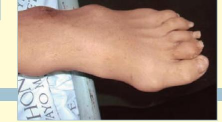

© Stellenbosch University

129

### **FIBROMYALGIA**

- Consider fibromyalgia if the patient has had general body pain above and below the waist, affecting both sides of the body for more than 3 months associated with at least 11 of 18 tender points (see picture) on palpation.
- Fibromyalgia diagnosis more likely if any of: woman, family history, fatigue, reduced ability to think and remember clearly, mood or sleep disturbances.
- Check for other causes of general body pain:
- If weight loss [23](#page-19-0).
- Screen for a joint problem: patient to place hands behind head; then behind back. Bury nails in palm and open hand. Press palms together with elbows lifted. Walk. Sit and stand up with arms folded. If unable to do screen comfortably [62](#page-58-0). Check CRP, Hb, TSH and test for HIV [110](#page-106-0).
- **A doctor must make or confirm the diagnosis of fibromyalgia.** If joint problem, HIV positive, blood results abnormal or uncertain, consider another diagnosis and refer.

#### **Assess When to assess Note** Symptoms Every visit • Manage symptoms as on symptom pages. Ask patient to identify the 3 symptoms that bother her/him most and focus on these. Do not dismiss all symptoms as fibromyalgia: exclude treatable and serious illness. If unsure, refer. Chronic pain At diagnosis Further assess and advise on chronic pain [61](#page-57-0). Sleep Every visit If patient has difficulty sleeping [87](#page-83-0). Stressors Every visit Help identify psychosocial stressors that may exacerbate symptoms. If stress or anxiety [86](#page-82-0). Depression Every visit In the past month, has patient: 1) felt down, depressed, hopeless or 2) felt little interest or pleasure in doing things? If yes to either [143](#page-139-0). Chronic arthritisEvery visit If patient also has chronic arthritis, give routine care [151](#page-147-0).

### **Advise the patient with fibromyalgia**

**Assess the patient with fibromyalgia**

- The cause is unknown but may be a result of generalised hypersensitivity of the nervous system, so patient feels more pain than others, despite normal muscles and joints.
- The patient may also have irritable bowel syndrome, tension-headache, chronic fatigue syndrome, interstitial cystitis, sleep disturbances or depression.
- Explain that s/he will have good days and bad days, but that fibromyalgia does not get worse over time. It is not life-threatening, but there is no cure.
- Advise the patient against overuse of painkillers (e.g. paracetamol and ibuprofen) as they are often not helpful for fibromyalgia and may have unwanted side effects.
- Advise patient to keep as active as possible: start with 5 minutes of gentle walking every day and build up by 1 minute a day until able to walk or run for 30 minutes at least 3 times per week.
- Encourage good sleep habits [87](#page-83-0).

1Avoid if on bedaquiline.

- Refer to available support group and helpline [178](#page-174-0).
- If no better with a combination of education, exercise and medication, refer for cognitive behavioural therapy if available.

### **Treat the patient with fibromyalgia**

- Give paracetamol 1g 4-6 hourly (up to 4g in 24 hours) as needed.
- If no better with education and exercise, give amitriptyline1 10mg at bedtime. Increase by 5mg every 2 weeks until improvement (maximum dose 75mg).
- •If still symptomatic after 3 months on maximum dose, refer/discuss.

**A supportive relationship with the same health practitioner can contain frequent visits for multiple problems. Review patient 6 monthly once stable.**

Press tender points with the pressure that would blanch a fingernail. Compare with a control site on forehead.

# **CONTRACEPTION**

#### **Give emergency contraception if patient had unprotected sex in past 5 days and does not want pregnancy:**

- Give as soon as possible single dose levonorgestrel 1.5mg orally *or* if patient wanting long-term contraception, check pregnancy test and if negative, insert Copper IUD1 instead.
- If patient > 80kg, BMI2 ≥ 30, or on efavirenz, rifampicin, phenytoin or carbamazepine, increase dose of levonorgestrel to 3mg.
- Give metoclopramide 10mg 8 hourly as needed for nausea/vomiting. If patient vomits < 2 hours after taking levonorgestrel, repeat dose.
- Offer to start long-term contraceptive at same visit (if IUD not chosen). If injectable or implant given, check pregnancy test in 2 weeks.
- •Advise patient to return for pregnancy test if next period is more than 1 week late.
- •Consider need for HIV and hepatitis B post-exposure prophylaxis [108](#page-104-0).

#### **Assess the patient starting and using contraception**

| As se ss                                    | he W n t o a sse ss                                                                                     | No te                                                                                                                                                                                                                                                                                                                                                                                                                                                                                                                                                                                                   |  |
|---------------------------------------------------|------------------------------------------------------------------------------------------------------------------------|------------------------------------------------------------------------------------------------------------------------------------------------------------------------------------------------------------------------------------------------------------------------------------------------------------------------------------------------------------------------------------------------------------------------------------------------------------------------------------------------------------------------------------------------------------------------------------------------------------|--|
| Sy tom mp s                              | Eve vis it ry                                                                                                 | C hec k for f S l d ha lce low b do l p f p  he T Is: v ina isc mi in. I 49 Ma tom t t tom tom sy mp s o ag rg e, u rs, er a na a res en nag e o r sy mp s a s o n s y mp p ag es.                                                                                                                                                                                                                                                   |  |
| C hro nic d it ion co n s | Firs t v is it                                                                                                | f m f a f: c C hec k s b lity ho d (es l ly bre l, u ), b loo d c lot hy C V D, s ke, hae hea d d bet live d ita i et i ia ast rvic ter ine ert ion tro isc mi rt ise ia ise ig ine u o ny o an cer p ec , ce a s, p en s c ase es, r ase , m ra s, o r , ,  la d v l b lee d ine ina ing 15 6. un exp ag                |  |
| Me d ica t ion                        | Eve vis it ry                                                                                                 | f o lep hec k m ho d b le  I A R T, T B o i is s ita 15 6. tre atm t, c et n r e p sy en u                                                                                                                                                                                                                                                                                                                                                                                                                         |  |
| Per ds io                                   | Eve vis it ry                                                                                                 | f As k a bo ds: l bet ds, b loo d los be day d las dy ho (p /cr d w h p ds ). ut io in ter io io ts, in iate it io p er va we en p er s, n um r o s p er sm en orr ea a am p s a sso c er                                                                                                                                                                                                                                       |  |
| Me no p au se                         | f > ly I 40 ear s: y ear y                                                                        | f lu f f ic f m  As k a bo l sy ho hes ht l dry d c ha d lty lee I l ut tom t ig eat ina i ing 16 9. me no p au sa mp s: s , n sw s, v ag ne ss, mo o ng es, u s p en op au sa                                                                                                                                                                                                                                                 |  |
| l hea lt h Sex ua                  | Eve vis it ry                                                                                                 | f ri ky l be hav lt le p do lia b ly, has de f lu f a lco ho l dru fe dv I iou ip /s, r in / ive ice art s sex ua r: n ew or m u ne r use s c on ms un re se x u n en ce o g s, g sa sex a                                                                                                                                                                                                                                      |  |
| d he A ren ce                         | Eve vis it ry                                                                                                 | f a lrea dy k a bo d s fac h m ho d. f u f ie d, c de d f fe he ha kin d p I ive is ion it I is i i ive is ntr t ut at t et t t c tra t t r t nte on co ace p , as co nce rns an w nsa on s r ren on cep , ra n r g un wa reg na ncy • f p has d l ls, m  I ien isse inj ion i 155 at t ect m s o r p an ag e • |  |
| S de f fe i cts e               | Eve vis it ry                                                                                                 | f a lrea dy k a bo d m de f fe  I ive i ntr t ut cts 155 on co ace p , as an an ag e s e                                                                                                                                                                                                                                                                                                                                                                                                                                 |  |
| ht ( 2) We ig B M I          | Eve vis it ry                                                                                                 | f k  I B M I > 25, C V D r is 127 as ses s                                                                                                                                                                                                                                                                                                                                                                                                                                                                                                                   |  |
| B P                                            | Firs is it; e vis it t v ve ry f o l l or b le i i inj ect n p a | hec k f ≥  C B P: i 0 / 9 0 13 2. 14 • I f hy B P ≥ / d /c ha fro b d o l co I f B P ≥ / lso d /c ha fro b le. ion 14 0 9 0, a i ine ive 16 0 10 0, a i inj ert ntr t ect p en s or vo ng e m co m ra ace p av o ng e m a •                                                                                                                                     |  |
| hec k Bre ast c                       | he ly 3 Firs is it, t v t n y ear                                                           |   C hec k for lum bre d a l lae in 43 xi 25 ast p s s an                                                                                                                                                                                                                                                                                                                                                                                                                                                                                        |  |
| Pre g na ncy                             | Eve vis it ry                                                                                                 |  Be for lu de ing ion 157 tar t ntr t e s co ace p , ex c p reg na ncy • f p d (na bre de d p d w he b d o l co ), e lu de  I / isse io ing ine ive 157 ect ast te ntr t reg na ncy su sp e use a n rne ss o r m er n u s co m ra ace p xc p reg na ncy •                                                                                                            |  |
| H I V                                       | Eve vis it ry                                                                                                 | for  f p  f n de d for f av la b le  Tes H I V 110 I it ive ive ine H I V c 11 1. I ive i Pr E P, i i 10 6. t ut at os , g ro are eg , co ns r n ee a                                                                                                                                                                                                                                                                                             |  |
| Ce l sc rvic a ree n               | he de d W n n ee                                                                                        | f do l sc h 1 fro  f do l sc d d les f ag he ly  I H I V n ive 3 c ica 0 y 3 0 55 i H I V p it ive rvic H I V iag is (re ), n 3 55 at art t t eg erv ree ns, ea c ear s a p m ag e os ce a ree n a no s g ar s o e ear : ; : -y                                                                                                                                            |  |

### **Advise the patient starting/on contraception**

51

- •Educate patient to use contraceptive reliably. Advise to discuss concerns/problems with method and find an alternative, rather than stopping it and risking unwanted pregnancy.
- Recommend dual contraception: one method of contraception *plus* condoms to protect from STIs and HIV. Demonstrate and give male/female condoms.
- Discuss risky sexual behaviour. Explain risks of pregnancy and infections. Encourage patient to have 1 partner at a time and if HIV negative to test for HIV between partners. Advise that partner/s test too.
- •Educate about the availability of emergency contraception (see above) and termination of pregnancy [158](#page-154-0) to prevent unwanted pregnancy. Also educate about PrEP, if available.
- Advise patient on pill or implant to tell clinician if starting ART, TB or epilepsy treatment as these may interfere with pill or implant effectiveness.
- If on pill: if vomits within 2 hours, or severe diarrhoea within 12 hours of taking pill, repeat dose as soon as possible. If persistent vomiting/diarrhoea > 24 hours, advise to use condoms or abstain during illness and for 7 days after resolved.

1The newly available levonorgestrel IUD 52mg (LNG-IUD) is not coded for emergency contraception as yet. 2BMI = weight (kg) ÷ height (m) ÷ height (m). 3If patient > 40 years old: check breasts 6 monthly.

| Tre he ien d ing he itu ion at t at t a to t s at p cco r r c ur ren :                                                                                                                                                         |                                                                                                                                                                                                                                                                                                                                                                                                                                                                |                                                                                                                                                                                                                                                                                                                                                                                                                                                                                                                                                                                                                                                                                                                                                                                                                                                                                                                                                                                                                                                                                                                                                                                                                                                                                                                                                                 |                                                                                                                                                                                                                                                                                                                                                                                                                                                                                              |  |  |  |  |
|-----------------------------------------------------------------------------------------------------------------------------------------------------------------------------------------------------------------------------------------------------------------------------------------------|----------------------------------------------------------------------------------------------------------------------------------------------------------------------------------------------------------------------------------------------------------------------------------------------------------------------------------------------------------------------------------------------------------------------------------------------------------------|-----------------------------------------------------------------------------------------------------------------------------------------------------------------------------------------------------------------------------------------------------------------------------------------------------------------------------------------------------------------------------------------------------------------------------------------------------------------------------------------------------------------------------------------------------------------------------------------------------------------------------------------------------------------------------------------------------------------------------------------------------------------------------------------------------------------------------------------------------------------------------------------------------------------------------------------------------------------------------------------------------------------------------------------------------------------------------------------------------------------------------------------------------------------------------------------------------------------------------------------------------------------------------------------------------------------------------------------------------------------|----------------------------------------------------------------------------------------------------------------------------------------------------------------------------------------------------------------------------------------------------------------------------------------------------------------------------------------------------------------------------------------------------------------------------------------------------------------------------------------------|--|--|--|--|
| ha Sta ing ing rt or c ng ion ntr t co ac ep he lp Us s 1 -4 tep to e s ho be ien at t to st p c ose d t ion ing to op ac co r  he ds 15 6. r n ee | lre dy A ing ive ntr t a us co ac ep f p f ie I d w h at ien t s at is it • ho d, he k m ho d is t et me c c l l su b le. i ita st f u I I U D o b de l ing s r su rm a • lan he k w he im t, c p c n lac de d. t n rep em en ee | de l f p Re ive isc iag ina ion ( T O P ) nt r te t ce ry, m arr e o rm o reg na nc y f f n Ins I U D w hin ho de live /m T O P i ert it 48 isc iag urs o ry arr e o r o • d  he be d ≥ ks i 15 7, o ise in 4 n t t te rea so o a vo rw ca n ser we e or b de l im lan b le o Ins inj P O P a ert t, o r st art ect t a sta su rm a p a r ny g e, o r • f fe f a O lisa ( ba l lig ), r st i t ion tu at ion i riat er p p rop e, o r • Sta C O C o O d ly fte / O P P im iat isc iag T P. rt r me e a r m arr e • d ly fte de live Sta P O P im iat rt me e a r ry : • for fte Av d C O C ks de live i 6 o we e a r ry. - d C O C for hs f bre fee d Av i 6 i ing nt ast o mo - | l Me no p au sa f < for I 5 0 y ive ntr t ion 2 ea rs, g co ace p • fte las d. io t p y ea rs a r er f ≥ ha I 5 0 y e t est ea rs, c ng o p rog og en •  ly ho l co ntr t ive on or no n- rm on a ace p l 1 fte las d. i io t t p un y ea r a r er |  |  |  |  |
|                                                                                                                                                                                                                                                                                               |                                                                                                                                                                                                                                                                                                                                                                                                                                                                |                                                                                                                                                                                                                                                                                                                                                                                                                                                                                                                                                                                                                                                                                                                                                                                                                                                                                                                                                                                                                                                                                                                                                                                                                                                                                                                                                                 |                                                                                                                                                                                                                                                                                                                                                                                                                                                                                              |  |  |  |  |

#### **Manage the patient who has missed an injection or pill:**

#### **Late injection**

#### •If ≤ 4 weeks late: give the injection.

- If > 4 weeks late: exclude pregnancy [157](#page-153-0).
- • If not pregnant, give injection and use condoms/abstain for 7 days. If unprotected sex in past 5 days, offer emergency contraception [154](#page-150-0).
- **pill (> 3 hours late)**  Take pill as soon as
- remembered, continue pack. If unprotected sex in past 5 days, also offer emergency

 **Missed progestogen-only** 

contraception [154](#page-150-0).

- **Missed combined oral contraceptive (> 24 hours late)**
- If 1 active pill missed: take 1 pill immediately and take next pill at usual time.
- If ≥ 2 active pills missed during:
- First 7 active pills: offer emergency contraception [154](#page-150-0), and restart active pills 12 hours later.
- Middle 7 active pills: take the most recent missed pill immediately (discard others). Continue remaining pills as usual. No emergency contraception required.
- Last 7 active pills: finish active pills of current pack. Omit inactive pills. Immediately start active pills of next pack.

| de f fe Ma ion i tra t cts na g e c on ce p s e                                                                              |                                                                                                                                                                                                                                                                                                                                                                                                                                                                                                                                                                                                                                                                                                                                                                                                                                                                                                                                                                                                                                                                                                                                                                                                                                      |  |  |  |  |
|------------------------------------------------------------------------------------------------------------------------------------------------------------------------------|--------------------------------------------------------------------------------------------------------------------------------------------------------------------------------------------------------------------------------------------------------------------------------------------------------------------------------------------------------------------------------------------------------------------------------------------------------------------------------------------------------------------------------------------------------------------------------------------------------------------------------------------------------------------------------------------------------------------------------------------------------------------------------------------------------------------------------------------------------------------------------------------------------------------------------------------------------------------------------------------------------------------------------------------------------------------------------------------------------------------------------------------------------------------------------------------------------------------------------------|--|--|--|--|
| S i de f fe ct e                                                                                                                                           | Ma t na g em en                                                                                                                                                                                                                                                                                                                                                                                                                                                                                                                                                                                                                                                                                                                                                                                                                                                                                                                                                                                                                                                                                                                                                                                                       |  |  |  |  |
| Me l a bn lit nst ies rua orm a                                                                                                                      | hat l a bn lit l ly lve hin hs. f n ds ds lar, hea fu l: a d m  Rea ies it 3- 6 m I io io irre in 57 re t str t ssu m en ua orm a us ua res o w on o p er or p er g u vy or p a sse ss a n an ag e                                                                                                                                                                                                                                                                                                                                                                                                                                                                                                                                                                                                                                                                                                                                                                                                                                              |  |  |  |  |
| He da hes a c                                                                                                                                                    | f Rea hat hea da hes l ly lve hin hs. I hea da hes de h t -ho l m ho d li ke I U D. re t it 3 nt ist, i itc et ssu c us ua res o w mo c p ers co ns r sw o n on rm on a co p p er • f u d f irs /se hea da hes fer I ing L N G- I U D a im ig ine t t s n e m ra s ve re c : re •                                                                                                                                                                                                                                                                                                                                                                                                                                                                                                                                                                                                                                                                            |  |  |  |  |
| Sex l p b lem ua ro s                                                                                                                                      | f u f ir f p I I U D: 's p du I U D s ho ing i rita t ion art is rin t tr ing rte s o ne r en g sex : cu s s r. • hat li ke ly f fe l fun f se l p b lem de lte ho d: c de b de l im lan lisa f a Rea ive ion I ists i ive i I U Ds, i ion i riat re t ntr t to ct ct t et t o r st t ssu co ace p s u n a sex ua xu a ro s p ers , co ns r a rna m on s r or su rm a p er p p rop e. •                                                                                                                                                                                                                                                                                                                                                                                                                                                                               |  |  |  |  |
| Ac ne                                                                                                                                                                     | f p Rea hat l ly lve hin hs. I b lem de h t C O C. re t it 3 nt i itc ssu ac ne usu a res o w mo ro , co ns r sw o                                                                                                                                                                                                                                                                                                                                                                                                                                                                                                                                                                                                                                                                                                                                                                                                                                                                                                                                                                                                          |  |  |  |  |
| ht We ig in g a                                                                                                                                               | fte f fe f lu f  fes Rea his de du d r d r lve hin hs. I B M I > C V D r k A dv hea lt hy li le. re t is te i ct e t i ete nt ion it 3 nt 25, is 127 ise ty ssu o n a mp ora ry s e o , an eso s w mo as ses s                                                                                                                                                                                                                                                                                                                                                                                                                                                                                                                                                                                                                                                                                                                                                                                                                   |  |  |  |  |
| de Bre ast te n rne ss                                                                                                                                     | hat his l ly lve hin hs. dv bra Rea it 3 A ise ive re t t nt to ort ssu us ua res o s w mo we ar s up p                                                                                                                                                                                                                                                                                                                                                                                                                                                                                                                                                                                                                                                                                                                                                                                                                                                                                                                                                                                                                                    |  |  |  |  |
| d Mo ine o ss                                                                                                                                                    | his ho l d r lve f p for low d, s  de h t -ho l m ho d li ke Rea I ists xie 8 6 o i itc I U D. re t tre ty et ssu s u eso ers , as ses s m oo ss o r an r co ns r sw o n on rm on a co p p er                                                                                                                                                                                                                                                                                                                                                                                                                                                                                                                                                                                                                                                                                                                                                                                                                                                               |  |  |  |  |
| d, s l len fu l w d Re in wo , p a ou n fte lan r im ins ion t ert a p or lisa ste ri t ion | fer do f av la b le: lea h s line lut ( d lut d p do d h lor hex d lut ), r lou h– lea for ly Re i i it ise ic s ion i i io ine i ine ion 5- 15 mi Ap ise ic o int to cto t t tes ant t nt r, a c n w a or an p o e ov ne or c so em ove s g ve on nu p an p me • lve do d h lor hex d ho d m bso be dre ha dre da ly. (s i i io ine i ine ) a istu ing C ing i nt r o r p ov ne or c or ney n o re a r ss ng e ss f su f lu fa for f u fev fer I d lve d, g lox i l l in ho ly lex in ho ly day I l l w h lse ing t issu inv ive 5 0 0m 6 5 0 0m 6 5 it 10 0, r > rro un e o c ac g ur or ce g ur s. nw e er or p u e • |  |  |  |  |

#### **Review the patient on contraception**

- If IUD or subdermal implant inserted this visit, review in 3-6 weeks. Thereafter, review yearly as needed.
- If oral or injectable contraceptive started this visit, review in 3 months. Thereafter, review as needed.

**CONTENTS SYMPTOMS**

**CONTENTS CHRONIC CONDITIONS**

**[HIV](#page-102-0) [COVID-19](#page-117-0) [CHRONIC RESPIRATORY DISEASE](#page-119-0) [HEPATITIS B \(HBV\)](#page-116-0) [CARDIOMETABOLIC CONDITIONS](#page-123-0) [MUSCULOSKELETAL DISORDERS](#page-147-0) [MENTAL HEALTH](#page-136-0) [EPILEPSY](#page-145-0) [WOMEN'S HEALTH](#page-150-0) [PALLIATIVE CARE](#page-166-0)**

### **Start or change contraception**

### **STEP 1. Help the patient decide which method is the best option according to her needs.**

If wanting long term protection, consider IUD (5 years), subdermal implant (3-5 years), injectable (3 months), sterilisation (permanent).

**[HEPATITIS B \(HBV\)](#page-116-0) [COVID-19](#page-117-0)**

If needing quick return to fertility, consider IUD or subdermal implant.

**[TB](#page-85-0)**

**CONTENTS SYMPTOMSCONTENTS CHRONIC CONDITIONS**

- •If worried about adherence issues, consider IUD, subdermal implant or injectable.
- If problems with heavy/painful/irregular periods, acne or premenstrual syndrome, consider COC.

 If the patient prefers to avoid hormones, consider copper IUD and/or reliable condom use (both hormone free), sterilisation or LNG-IUD (low dose hormone released locally into uterus). **STEP 2. Check if reasons to avoid chosen method (use table).** If there is a reason, consider another method (or sterilisation, if appropriate) that will be acceptable to patient:

|  | He av y or                         | l d 35 ≥ y ea rs o                                                                                                          | Me d ica ion t s                                                                                                                                                                                                                                | C hro ic c d it ion n on s                                                                                                                                                                                                                |
|--|---------------------------------------------|--------------------------------------------------------------------------------------------------------------------------------------------------|----------------------------------------------------------------------------------------------------------------------------------------------------------------------------------------------------------------------------------------------------------------|-------------------------------------------------------------------------------------------------------------------------------------------------------------------------------------------------------------------------------------------------------------------|
|  | fu in l p io ds p a er | d s ke an mo r                                                                                                                       | f o fam I b le, I U Ds i icin e i nj ect n r p : us a •                                                                                                                                                     | f for fte I bre (av d p d ): u I U D. ast i 5 y iag sis ca nc er o reg na ncy ea rs a r no se co p p er •                                                      |
|  | Us L N G- I U D e      | Us I U D, e                                                                                                                          | I f o he ba b le, I U D. in, ine e i nj to ect n p ny car ma zep : us a •                                                                                                                    | I f c f u /ce /ov lan b le, C O C, P O P. rvix e i inj ter t, ect an ce r o us ary : us mp a •                                                                                |
|  | C O C. or                          | lan im t, p                                                                                                                             | f o lam D, lan b le, P O P. I ig ine I U im inj otr t, ect n : us e p a •                                                                                                              | f se live d D. I ise I U ve re r ase : us e c op p er •                                                                                                                                                        |
|  |                                             | b le o inj ect a r                                                                                                                | f o b le. I E F V: I U D o r in j ect n use a •                                                                                                                                                                | f his f b loo d c lot f st b le o b loo d t hin lan O b le. I i im L N G- I U D, P P, inj tor t, ect y o s: a n ne r, u se p a • |
|  |                                             | P O P.                                                                                                                                     | f o lan b le. I N V P, L P Vr, A T Vr: I U D, im r in j t o ect n us e p a •                                                                                                  | f his ke he k, ha he d lan I / T I A, isc ic ise I U D, im P O P. tor str art at tac art t, y o em ase : us e p •                               |
|  |                                             | f o lan b le, I D T G: I U D, im inj C O C, P O P. t, ect n use p a • | f hy lan ly b le i f I sio B P ≥ 14 0 / 9 0, u I U D, im P O P. On inj B P < 16 0 / 10 0. ert t, ect p en n o r se: p use a • |                                                                                                                                                                                                                                                                   |

•If diabetes complications (eye, nerve, kidney damage): use IUD, implant, POP.

### **STEP 3. Explain possible side effects. If unacceptable to patient, consider another method. STEP 4. Explain instructions for use (use table) and check understanding.**

| ho d Me t                                                                                                                                                                                                                                                                                                                                                                                                                                                                                                                                                                                                                                                                                                                                                                                                         | i d Re s t as on o a vo                                                                                                                                                                                                                                                                                                                                                                                                                                                                                                                                                                                                                                                                                                                                                                                                                                                                                                                                                                                                                                                                                                                  | i de f fe S cts e                                                                                                                                                                                                                                                                                                                                                                                                                                                                 | ion for Ins tru ct s us e                                                                                                                                                                                                                                                                                                                                                                                                                                                                                                                                                                                                                                                                                                                                                                                                                                                                                                                                                                                                                                                                                                                                                          |  |  |
|----------------------------------------------------------------------------------------------------------------------------------------------------------------------------------------------------------------------------------------------------------------------------------------------------------------------------------------------------------------------------------------------------------------------------------------------------------------------------------------------------------------------------------------------------------------------------------------------------------------------------------------------------------------------------------------------------------------------------------------------------------------------------------------------------------------------------|---------------------------------------------------------------------------------------------------------------------------------------------------------------------------------------------------------------------------------------------------------------------------------------------------------------------------------------------------------------------------------------------------------------------------------------------------------------------------------------------------------------------------------------------------------------------------------------------------------------------------------------------------------------------------------------------------------------------------------------------------------------------------------------------------------------------------------------------------------------------------------------------------------------------------------------------------------------------------------------------------------------------------------------------------------------------------------------------------------------------------------------------------------------|-----------------------------------------------------------------------------------------------------------------------------------------------------------------------------------------------------------------------------------------------------------------------------------------------------------------------------------------------------------------------------------------------------------------------------------------------------------------------------------------------------|---------------------------------------------------------------------------------------------------------------------------------------------------------------------------------------------------------------------------------------------------------------------------------------------------------------------------------------------------------------------------------------------------------------------------------------------------------------------------------------------------------------------------------------------------------------------------------------------------------------------------------------------------------------------------------------------------------------------------------------------------------------------------------------------------------------------------------------------------------------------------------------------------------------------------------------------------------------------------------------------------------------------------------------------------------------------------------------------------------------------------------------------------------------------------------------------------------|--|--|
| de Int ine ice ( I U Ds ) ter rau v s ( Sm l l dev f itt d in de he ) ice si t ute a e rus l ( ) 1. Lev I U D 5 2m L N G- I U D est on org re g Co I U D e Cu T3 A 2. 8 0 p p er g.                                                                                                                                                                                                                                                                                                                                                                                                                                        | d bo h f: c la d v l Av i I U Ds i S T I / P I D, u ine ina t ent o urr nex p ag • b lee d bn lity f ce /ut f ing rvix r i , a orm a or ca nce r o eru s, o l l w h a dva d s H I V d it tag 3 o r 4 ise unw e nce e ase lso d f: s live d bre A i L N G- I U D i ise ast av o eve re r ase ca nce r. • , lso d c f: hea /p lon d p ds. A i I U D i erio av o op p er vy ro g e • f c Pos (≤ ho ): a d ho tp art 48 i i rioa ion itis tur um urs vo mn , ru p e • f m bra for ho hae hag 18 ost art o em nes > urs or p p um mo rr e.                                                                                                             | for du Dis ing ring / t o com r cr am p • fo l low ing ins ion ert Me l a bn litie nst rua orm a s. • l ly lts L N G- I U D u in n / sua res o u lig hte ds, bu erio t m r p ay cau se lar b lee d irre ing g u ly, hea dac hes h Rar wi L N G- I U D. t e • | d s f f t du le. Tra ine ins /re Ins tim ring ta ert ert o mo ve. an e cy c y • f p bu fen 1 40 ho ly h foo d for day I in, ive i 0m 8 wit 3 a g p ro g ur s. • Giv lon ter rot ect ion : 5 es g- m p y ear s. • f ica dru d. No sig ni int ctio nt ect g era ns exp e • dv f ex b lee d /p fev fou l-sm l ling d har fer A ise i siv ing in, isc to ret urn ces e a er, e g e: r e • f a fte f n I de live /m / T O P: ho ( d ) o isca rria ins ert 48 i to i ≤ r ry g e urs o r eas on av o r • ks. ≥ 4 we e                                                                                                                                                                                                         |  |  |
| b de l lan l l p las d Su im ( Sm tic /s j t ust rm a p a ro der kin f up ) un s o p er a rm l 6 ( d: ) 1. Eto 8m 1x 3 y est no rg re g ro ear s 2. Lev l 2x ( 2x ds: ) est 75 5 y on org re mg ro ear s                                                                                                                                                                                                                                                                                                                                                                                                                | la d v l b lee d bre Un ine ina ing iou ast exp ag , p rev s ca nce r, • live d ise r ase fam fav he bam Pat ien i icin iren in, ine t o to n r p , e z, p ny car aze p •                                                                                                                                                                                                                                                                                                                                                                                                                                                                                                                                                                                                                                                                                                                                                                                                                                     | bru Pa in / isin g. • lar b lee d bre Irre ing ast g u • , de ht ig in, ten rne ss, we g a acn e, hea dac hes d ine , m oo ss, nau sea                                                                                                                                                                                                                                      | d s f f t Tra ine ins /re ta ert o mo ve. • f in d a fte day f cy le, do bst for day I 7 o / a in 7 te ser r c use co n ms a s. • f p bu fen 1 40 ho ly h foo d for day I in: ive i 0m 8 wit 3 a g p ro g ur s. • Giv lon ion 3-5 de d ing dev ice d. ter rot ect es g- m p : y ear s p en on us e •                                                                                                                                                                                                                                                                                                                                                                                                                                                                                                                                                                                                                |  |  |
| In j b le ect a las ( Lon ting inj ion int ) ect g- o u p p er a rm dro ( ) Me D M P A I M est eg xy p rog ero ne k ly 15 0m 12 g we e                                                                                                                                                                                                                                                                                                                                                                                                                                                                                                                                              | Un la d v l b lee d bre hae hea ine ina ing ast isc mic rt exp ag ca nce r, , d ke, live d d bet lica ise ise ia tio tro ase , s sev ere r ase es com p ns , (ey ki dn da ). e, n erv e, ey ma g e                                                                                                                                                                                                                                                                                                                                                                                                                                                                                                                                                                                                                                                                                                                                                                                 | Irre lar, hea lon d b lee d ing g u vy, p ro g e ds, hot f lu hes bre erio ast or no p s , de han etit ten rne ss, ap p e c g es, ht / b loa ig in, tin we g a acn e, n aus ea g.                                                                                                                                                 | I f st d a fte day f cy le, do / a bst for day art 7 o in 7 e r c use co n ms a s. • last hs. Pro tio 3 m tec t n s on • d t d do l for lep No j sin int A R T, T B o i ust tre atm t. ne e o a g erv a r e p sy en • Ma be de lay f fer lity ( hs ). in ret ti ± 9 t y a urn o m on •                                                                                                                                                                                                                                                                                                                                                                                                                                                                                                                                                                                                                                       |  |  |
| Or l p i l l ( b let be l low d e day ) ta to a sw a e ver y Co b d o l co ( C O C ): 1. ine ntr tive m ra ace p b let da ly 1 ta i has h les d l / Mo ic: iny io . et tra no p eg • lev l 3 / est 0m 15 0m on org re cg cg has h les d l Tri ic: iny io / . et tra p eg • lev l (va do ) ing est on org re ry ses Pro ly l l ( P O P ): b let 2. est i 1 ta g og en -on p da ly lev l 3 i 0m est on org re eg cg | d bo h O d C O C i f: bre live Av i P P a t ast o n ca nce r, se ver e r • fam d he bam E F V, ise ri icin to in, ine ase or on p , p ny car aze p , N V P, L P Vr, A T Vr. lso d C O C i f: o lam b loo d c lots ke, A i ig ine otr str av o n or o • , ker d ≥ l 35 ig ine 35 r vi ≥ sm o y ear s, m ra s a n y ear s o sua d ban hy k > istu B P ≥ 0 / 9 0, sio C V D r is 10 %, 14 ert r ces p en n, , hae hea d d bet lica (ey isc mic ise ia tio rt ase es com p ns e, , ki dn da ), for ks a fte de live d for 6 w 6 ne rve ey ma g e ee r ry an , hs f bre fee d i ing nt ast mo | l a bn litie bre Me nst ast rua orm a s, de hea dac hes d ten ine rne ss, , m oo ss, ht ig in. we g a                                                                                                                                                                                                                                                                                                           | f O d a fte day f cy le, do /a bst for day f C O C I P P s 5 o in 2 I tar te r c use co n ms a s. • fte for d a day do /a bst day sta rte 5, in 7 r use co n ms a s. d he de d: t ke day les f fe f Str ict ime P O P ctiv e i at e t a ren ce nee a eve ry sam s e • ken ho late 3 ta ≥ urs f vo f ta I ho d ho ho kin l l, re do mit 2 iarr < 1 2 i eat s < urs or se ver e ea urs o g p p se. • f > ho d ho do bst for I 24 iarr /vo mit ing in. Co nti 7 urs ea , us e c on ms or a a nu e day fte bet ter s a r Ma be de lay f fer lity ( hs ). in ret ti ± 3 t y a urn o m on • h s ly. Giv 3 m t e on up p • |  |  |
| Ste i l isa ion ( Tu ba l lig / Vas ) t at ion ect r om y duc bes los d. Rep tive tu ro c e                                                                                                                                                                                                                                                                                                                                                                                                                                                                                                                                                                                                                                         | Ens de d t hat his d c at ien t u rsta t is nt not ure p n n p erm ane an an be d: a d f p i i ien at t u rev ers e vo nsu re.                                                                                                                                                                                                                                                                                                                                                                                                                                                                                                                                                                                                                                                                                                                                                                                                                                                                                                                 | fer No lity ret to ti urn • l co lica ks Su ica tio is rg mp n r •                                                                                                                                                                                                                                                                                                                                                                            | Per nt. ma ne • fer for du de d Re Co nt p roc e re. nse nee •                                                                                                                                                                                                                                                                                                                                                                                                                                                                                                                                                                                                                                                                                                                                                                                                                                                                                                                                                                                                                                                                                 |  |  |
| 1Av oid if p ulc hm hyp hea rt fa ilur r ki dne dis tic ion ast ert ep er, a, ens e o y eas e. ,                                                                                                                                                                                                                                                                                                                                                                                                                                                                                                                                                                                                                                                   |                                                                                                                                                                                                                                                                                                                                                                                                                                                                                                                                                                                                                                                                                                                                                                                                                                                                                                                                                                                                                                                                                                                                                               |                                                                                                                                                                                                                                                                                                                                                                                                                                                                                                     |                                                                                                                                                                                                                                                                                                                                                                                                                                                                                                                                                                                                                                                                                                                                                                                                                                                                                                                                                                                                                                                                                                                                                                                                         |  |  |

**[HIV](#page-102-0) [CHRONIC RESPIRATORY DISEASE](#page-119-0) [CARDIOMETABOLIC CONDITIONS](#page-123-0) [MUSCULOSKELETAL DISORDERS](#page-147-0) [MENTAL HEALTH](#page-136-0) [EPILEPSY](#page-145-0) [WOMEN'S HEALTH](#page-150-0) [PALLIATIVE CARE](#page-166-0)**

### **PREGNANCY**

#### **Approach to diagnosing pregnancy in a sexually active woman of child-bearing potential**

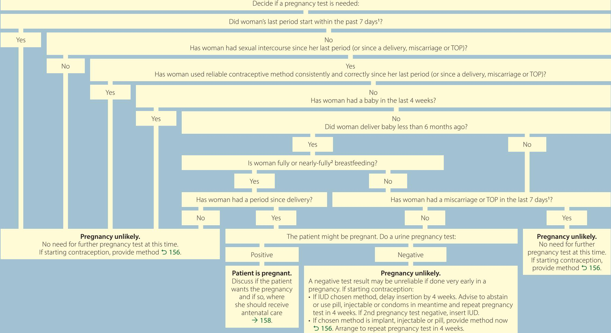

1Or 12 days if excluding pregnancy as part of work up to insert IUD. 2Fully breastfeeding means baby gets all his/her food from suckling at the breast. Nearly-fully breastfeeding means baby gets some liquid or food in addition to breastfeeding but no more than 1 or 2 mouthfuls a day.

**[HIV](#page-102-0) [COVID-19](#page-117-0) [CHRONIC RESPIRATORY DISEASE](#page-119-0) [HEPATITIS B \(HBV\)](#page-116-0) [CARDIOMETABOLIC CONDITIONS](#page-123-0) [MUSCULOSKELETAL DISORDERS](#page-147-0) [MENTAL HEALTH](#page-136-0) [EPILEPSY](#page-145-0) [WOMEN'S HEALTH](#page-150-0) [PALLIATIVE CARE](#page-166-0)**

**[TB](#page-85-0)**

**CONTENTS SYMPTOMSCONTENTS CHRONIC CONDITIONS**

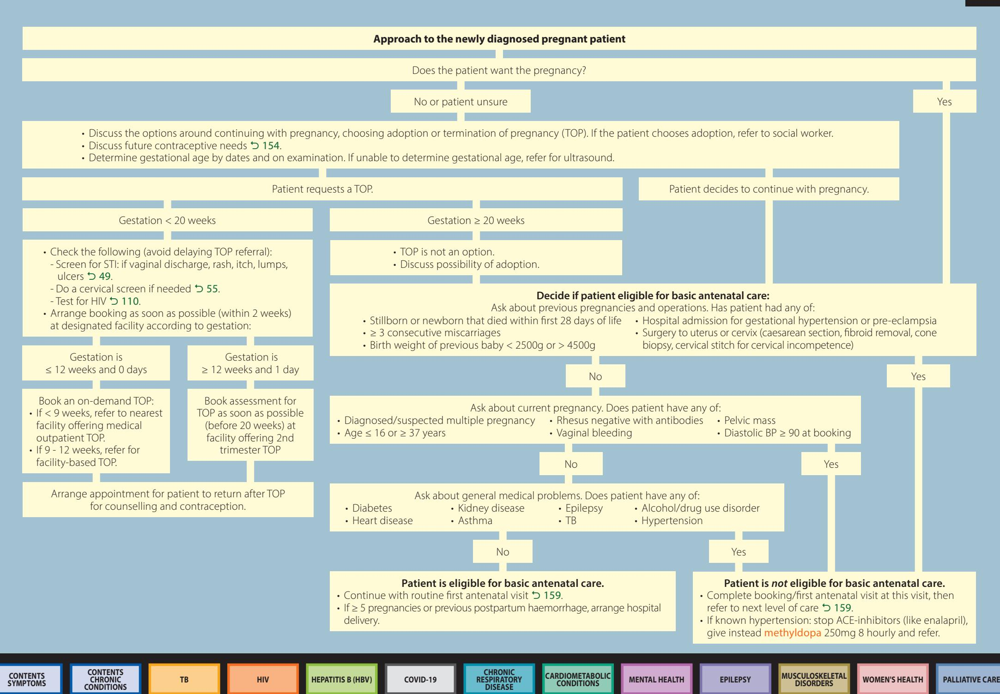

# **ROUTINE ANTENATAL CARE**

### **Give urgent attention to the pregnant patient with any of:**

- •Fitting or just had a fit
- •BP ≥ 140/90 *and* persistent headache/blurred vision/abdominal pain: treat as **severe pre-eclampsia**
- •BP ≥ 160/110 *and* ≥ 1+ proteinuria: treat as **severe pre-eclampsia**
- •BP ≥ 160/110 *without* proteinuria: treat as **severe hypertension**
- •Painful contractions < 37 weeks: **preterm labour** likely
- •Sudden gush of clear or pale fluid from vagina with no contractions: **prelabour rupture of membranes** (**PROM**) likely

### **Manage urgently:**

- If difficulty breathing, give face mask oxygen and refer urgently.
- If BP < 90/60, give sodium chloride 0.9% 500mL IV over 30 minutes, repeat until systolic BP > 90. Continue 1L 6 hourly. Stop if breathing worsens. Refer urgently.
- If temperature ≥ 38°C and difficulty breathing/back pain/abdominal pain, give ceftriaxone 1g IV1/IM unless PROM (see below). Refer urgently.

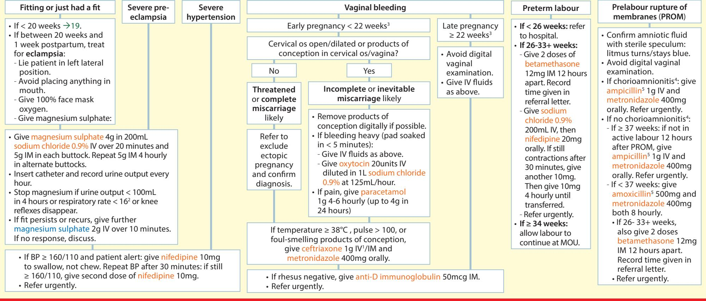

1Do not mix Ringer's lactate and IV ceftriaxone. Flush IV line with sodium chloride 0.9% before and after IV ceftriaxone. 2If respiratory rate < 16, give calcium gluconate 10% 10mL IV slowly over 2 minutes. 3If gestation not known, manage as late pregnancy if uterus palpable above umbilicus. 4Temperature ≥ 38˚C, painful abdomen or foul-smelling amniotic fluid. 5If penicillin allergy (history of anaphylaxis, urticaria or angioedema), give instead azithromycin 500mg daily.

**CONTENTS SYMPTOMSCONTENTS CHRONIC CONDITIONS**

**[HIV](#page-102-0) [COVID-19](#page-117-0) [CHRONIC RESPIRATORY DISEASE](#page-119-0) [HEPATITIS B \(HBV\)](#page-116-0) [CARDIOMETABOLIC CONDITIONS](#page-123-0) [MUSCULOSKELETAL DISORDERS](#page-147-0) [MENTAL HEALTH](#page-136-0) [EPILEPSY](#page-145-0) [WOMEN'S HEALTH](#page-150-0) [PALLIATIVE CARE](#page-166-0)**

•Vaginal bleeding

•

- Temperature ≥ 38°C and severe back or abdominal pain
- •Difficulty breathing
- •Swollen painful calf
- Decreased/no fetal movements [161](#page-157-0).

### **The booking/first antenatal visit**

| he he bo k de l ly be fo ks f a lre dy bo ke d  f n do he k p d l b le fo l  As ien ing is it, i I 16 I ien is e ig i Ba ic An Ca 8. t nt at t a t t 14 1. ot at t w ts ten ata 15 se ss p reg na p o a re ee a o ne , c c an p reg na nc an r s re v w y |                                                                                                                                                                                                                                                                                                                                                                                                                                                                                                                                                                                                                                                                                                                                                                                                                                                                                                                                                                                                                                                                                                                                                                                                                                                                                                                                                                                                                                                                                                                                                                                                                                                                                                                                                                                                                                                                                                                                                                                                                                                                                                                                                     |                                                                                                           |  |  |  |
|-------------------------------------------------------------------------------------------------------------------------------------------------------------------------------------------------------------------------------------------------------------------------------------------------------------------------------------------------------------------------------------------------------------------------------------------------------------------------------------------------------------------------------|-----------------------------------------------------------------------------------------------------------------------------------------------------------------------------------------------------------------------------------------------------------------------------------------------------------------------------------------------------------------------------------------------------------------------------------------------------------------------------------------------------------------------------------------------------------------------------------------------------------------------------------------------------------------------------------------------------------------------------------------------------------------------------------------------------------------------------------------------------------------------------------------------------------------------------------------------------------------------------------------------------------------------------------------------------------------------------------------------------------------------------------------------------------------------------------------------------------------------------------------------------------------------------------------------------------------------------------------------------------------------------------------------------------------------------------------------------------------------------------------------------------------------------------------------------------------------------------------------------------------------------------------------------------------------------------------------------------------------------------------------------------------------------------------------------------------------------------------------------------------------------------------------------------------------------------------------------------------------------------------------------------------------------------------------------------------------------------------------------------------------------------------------------|-----------------------------------------------------------------------------------------------------------|--|--|--|
| As se ss                                                                                                                                                                                                                                                                                                                                                                                                                                                                                                                | No te                                                                                                                                                                                                                                                                                                                                                                                                                                                                                                                                                                                                                                                                                                                                                                                                                                                                                                                                                                                                                                                                                                                                                                                                                                                                                                                                                                                                                                                                                                                                                                                                                                                                                                                                                                                                                                                                                                                                                                                                                                                                                                                                            |                                                                                                           |  |  |  |
| Sy tom mp s                                                                                                                                                                                                                                                                                                                                                                                                                                                                                                          | hec k i f p ds  Ma C ien tio 15 9. tom tom at t n t at ten nag e s y mp s a s p er sy mp p ag e. ee urg en n                                                                                                                                                                                                                                                                                                                                                                                                                                                                                                                                                                                                                                                                                                                                                                                                                                                                                                                                                                                                                                                                                                                                                                                                                                                                                                                                                                                                                                                                                                                                                                                                                                                                                                                                                                                                                                                                                                                                       |                                                                                                           |  |  |  |
| Est d De live im ate ry ( ) Da E D D te                                                                                                                                                                                                                                                                                                                                                                                                                                                | f irs f t Use day he 's last d a d S F H 1 to de E D D a d c t at ien t eri ter mi t g est at ion o p p o n ne n urr en • I f u f dat d S F H 1 < fer for ltra d t f irm E D D. 24 nsu re o es an cm , re u sou n o c on •                                                                                                                                                                                                                                                                                                                                                                                                                                                                                                                                                                                                                                                                                                                                                                                                                                                                                                                                                                                                                                                                                                                                                                                                                                                                                                                                                                                                                                                                                                                                                                                                                                                                                                        | fro TB han ing tes ts c g m                                                          |  |  |  |
| l m Fet nts a ove me                                                                                                                                                                                                                                                                                                                                                                                                                                                                                           |  I f > ks, k a bo fet l m f re du d 20 i 16 1. ut nts we e as a ove me ce :                                                                                                                                                                                                                                                                                                                                                                                                                                                                                                                                                                                                                                                                                                                                                                                                                                                                                                                                                                                                                                                                                                                                                                                                                                                                                                                                                                                                                                                                                                                                                                                                                                                                                                                                                                                                                                                                                                                                                                                                | 'Xp Ul ' to 'TB NA AT ' ert tra ( NA AT ucl id eic = n ac |  |  |  |
| T B                                                                                                                                                                                                                                                                                                                                                                                                                                                                                                                        |  lific nd lud I f co h, w ht los ht fev hec k for T B I f p has T B, r fer lev l o f a l ca lini atio n te st a inc eig ig 9 2. ien eat at t to xt nte nat am p ug s, n sw s o r er, c e ne e a re c c. • Xp ell er T B te ert as w as n ew f d 1 le for f n I H I V p itiv T B N A A T, e i T B s utu tom os e, s en sp m sam p ven o y mp s. •                                                                                                                                                                                                                                                                                                                                                                                                                                                                                                                                                                                                                                                                                                                                                                                                                                                                                                                                                                                                                                                                                                                                                                                                                                                                                                                                                                                                                                                                                       |                                                                                                           |  |  |  |
| Me l hea lt h nta                                                                                                                                                                                                                                                                                                                                                                                                                                                                                              | he ks, has ) be b le t hin kin h 2 ) fe lt do de d, ho les f y  In t 2 w ien t: 1 ing ? I 143 ast at top t too to p ee p en un a o s wo rry or g m uc wn p res se p e s es any • , he ks, has ha d t ho hts lan har he l f f y  In t 2 w ien ? I 8 3. ast at t s to p ee p ug or p m rse es •                                                                                                                                                                                                                                                                                                                                                                                                                                                                                                                                                                                                                                                                                                                                                                                                                                                                                                                                                                                                                                                                                                                                                                                                                                                                                                                                                                                                                                                                                                                                                                 |                                                                                                           |  |  |  |
| lco ho l / dru A g use                                                                                                                                                                                                                                                                                                                                                                                                                                                                                   | lco ho l / dru ky for ba by. he has ) dru k ≥ dr ks 2/s ) u d l leg l dru ) m d p he- d An is ris In t ien t: 1 4 in ion 2 i r 3 isu crip tio ast at t nte y a g use p y ear p n ess se a g s o se res n o r ov er- cou r m e , ,                                                                                                                                                                                                                                                                                                                                                                                                                                                                                                                                                                                                                                                                                                                                                                                                                                                                                                                                                                                                                                                                                                                                                                                                                                                                                                                                                                                                                                                                                                                                                                                                                                                                                                    | ? f y d /re fer ica tio I isc to ns es any uss ,                |  |  |  |
| 3 a 4 M U A C d B M I n                                                                                                                                                                                                                                                                                                                                                                                                                                                                         |   f C < B (or B f ): e lu de B d d r fer for l su d f av la b le. dva I M U A 23 M I < 18. 5 M I < 23 i H I V p itiv T 9 2 a H I V 110 trit ion iet icia i i Arr ort to cm or os e xc n an e nu a p p or n, a ang e a • f hec k d bet k be low I M U A C ≥ 3 3cm B M I ≥ 3 2, c ia ris or es •                                                                                                                                                                                                                                                                                                                                                                                                                                                                                                                                                                                                                                                                                                                                                                                                                                                                                                                                                                                                                                                                                                                                                                                                                                                                                                                                                                                                                                                                                                                                              | d m dw fe / do i i vie cto nce r re w.                                   |  |  |  |
| A b do me n                                                                                                                                                                                                                                                                                                                                                                                                                                                                                                       | Use f u fro hy b f u T his he hy fun da l he ht ( S F H ). ta to siz ter sis is t o t int ter is t sis- ig p e m eas ure m eas ure e o us m sy mp p u op p o o us. sy mp • lot S d S h c har h by loo kin he fa l ls i lat le line P F H a ing ion F H g Ass ion ti to est at t t. t t to cco r g on row ess g row g w re me asu rem en n r e p erc en s: • f bo kin fer for ltra d ( de l ly ks ), f fac litie la b le. I S F H < 24 i 18- 20 i i i at at cm o g, re u sou n a we e s a va - f < ks a d m bo h p le o lt le p li ke ly, fer I 28 9 0t ti ip nt we e n eas ure me a ve erc en r m u reg na ncy re - f be low h p le, hec k f st l l be low h p le, fer d for li ke ly fet l g h. I S F 10 ti S F a vis it: i i 10 ti / isc t t n ext t t erc en c erc en re uss p oo r a row - f ≥ f f fer I ks: lp bre h o lie d, r ks. I bre h o lie l l su d, r 34 ate tin art i r tr ect t ≥ 3 8 w r tr sti ect we e p a p res en g p ec ans ver se sus p e eas ses s a ee ec ans ver se sp e e : • f m he han b do lvis fer for I s in ot r t ut t. ass eru a me n o r p e , re as ses sm en • |                                                                                                           |  |  |  |
| l d har Vag ina isc g e                                                                                                                                                                                                                                                                                                                                                                                                                                                                                  |   f a bn l d har f w d har d n la bo f m bra I isc 49 I isc ctio tur 15 9. tre at ate tra ect orm a g e, ry g e a n o c on ns, su sp p re ur rup e o em ne s                                                                                                                                                                                                                                                                                                                                                                                                                                                                                                                                                                                                                                                                                                                                                                                                                                                                                                                                                                                                                                                                                                                                                                                                                                                                                                                                                                                                                                                                                                                                                                                                                                                                                                                                                                                                                                   |                                                                                                           |  |  |  |
| B P                                                                                                                                                                                                                                                                                                                                                                                                                                                                                                                        | 1 f B P ≥ / d r fer ly I 16 0 110 5 9. t , m ana g e a n e ur g en • f ≥ lie le ft s de for lea ho he I 14 0 / 9 0, ien i st 1 B P: at t o at t eat p n ur, n r ep • f re fer day  I B P ≥ 15 0 / 10 0, r 15 9. eat p e sa me - f re hec k u d k for I B P < 15 0 / 10 0, c rin ip stic ein eat rot p e p : - f ≥ fer day I ein ia, 1+ rot p ur re sa me • f n for  I ein ia bu hea da he, b lur d v isio b do mi l p in, lam ia 9. rot t tre at 15 o p ur c re n o r se ver e a na a se ve re p re- ec p s • f n I du bo (p hea da he, b lur d v b do l p ), a dv /re du k loa d a d r k: rot ein ia, cat ut rni sig iste nt isio mi in ise to st evi in 1 w o p ur e e a wa ng ns ers c re n o r a na a re ce wo r n ew ee •  I f B P a / day do /a dva d m dw fe for ion l hy ion d r k ly. I f p /sy t re vie 14 0 9 0, a cto i i iew : tre at est at ert 16 3 a evi rot ein ia w ≥ rra ng e s am e r nce rev g a p en s n ew we e ur mp - Re fer l l at ks for ho l de live 3 8 w ita a ee sp ry. -                                                                                                                                                                               |  de lop fer ly tom ent 15 9. s ve , re ur g                       |  |  |  |
| d k: Ur ine ip stic                                                                                                                                                                                                                                                                                                                                                                                                                                                                                            |  I f leu d n for li ke ly l ica d u ina in fec ion itri in ine te tra ct t 5 9. tes tes tre at coc y an ur co mp r ry •                                                                                                                                                                                                                                                                                                                                                                                                                                                                                                                                                                                                                                                                                                                                                                                                                                                                                                                                                                                                                                                                                                                                                                                                                                                                                                                                                                                                                                                                                                                                                                                                                                                                                                                                                                                                                                                                                                             |                                                                                                           |  |  |  |
| lea tes t c n, dst mi ine rea m ur                                                                                                                                                                                                                                                                                                                                                                                                                                                                 | f p I ein ia: rot ur • f tr h n l l vi f d, m bo I 1+ ein ia w it B P, r sit. I B P ra ise rot t n ext ten ata ace or p ur orm a eas ses s a an ana g e a ve. - f ≥ d k o f st l l ≥ d fer I 2+ ein ia, ip stic rin eci i i 2+ ein ia, isc /re rot eat rot p ur rep n a ne e s p me n: p ur uss w u - f g I luc hec k d bet k. in ine ia ris ose ur , c es •                                                                                                                                                                                                                                                                                                                                                                                                                                                                                                                                                                                                                                                                                                                                                                                                                                                                                                                                                                                                                                                                                                                                                                                                                                                                                                                                                                                                                                                                      |                                                                                                           |  |  |  |
| bet k Dia ris es                                                                                                                                                                                                                                                                                                                                                                                                                                                                                                  | for d bet ly f ri k fac 5. Scr ia i tor ee n es on s • for d bet fas d p l g luc l at lini hec k g luc fte ho f ≥ fur he fas To ia ive ien in 2 0m L w riva C i 8, a tin te at t o 75 5 ate r 1 7. t tes t at ose scr ee n es: g un ra g r u p on ar c c. ose a ur: rra ng e r g •                                                                                                                                                                                                                                                                                                                                                                                                                                                                                                                                                                                                                                                                                                                                                                                                                                                                                                                                                                                                                                                                                                                                                                                                                                                                                                                                                                                                                                                                                                                                                                                                            | lev l o f ca lini xt ne e re c c.                                                 |  |  |  |

**Continue to assess the pregnant patient [161](#page-157-1).**

1Symphysis-fundal height. 2One drink is 1 tot of spirits, or 1 small glass (125mL) of wine or 1 can/bottle (330mL) of beer. 3Mid Upper Arm Circumference. 4Body Mass Index (BMI) = weight (kg) ÷ height (m) ÷ height (m). 5Glucose in urine, BMI ≥ 32, age ≥ 40 years, previous diabetes in pregnancy, family history of diabetes, previous unexplained stillbirth, previous baby ≥ 4000g, polyhydramnios, SFH large for gestational age, Indian ethnicity.

| f ir Bo k ing / st o | ten ata an | l v is it c | inu d: t on e |
|-------------------------------------------|------------------|-------------------|---------------------------|
|-------------------------------------------|------------------|-------------------|---------------------------|

| As se ss                                                                              | No te                                                                                                                                                                                                                                                                                                                                                                                                                                                                                                                                                                                                                                                                                                                                                                                                                                                                                                                                                                                                                                                                |                                                                                                                                                                                                                                                     |  |
|---------------------------------------------------------------------------------------------|-------------------------------------------------------------------------------------------------------------------------------------------------------------------------------------------------------------------------------------------------------------------------------------------------------------------------------------------------------------------------------------------------------------------------------------------------------------------------------------------------------------------------------------------------------------------------------------------------------------------------------------------------------------------------------------------------------------------------------------------------------------------------------------------------------------------------------------------------------------------------------------------------------------------------------------------------------------------------------------------------------------------------------------------------------------------------|-----------------------------------------------------------------------------------------------------------------------------------------------------------------------------------------------------------------------------------------------------|--|
| Ha lo b ( H b ) in em og                                         | d b  fer f: G ive iro ing H 16 3. Re i to n a cco r f b < b h s d lse d f f ic lty bre hin fer day l ho l. I H 6, H 6-7 9 w it ( izz 10 0, i ): r ion ita tom at at t to > or y mp s y, p u u g res e sa me re g a sp • f b ho fer hin k to lev l o f ca lini I H 6-7 9 w it it 1 w ut tom xt sy mp s: r e w ee ne e re c c. • f bo kin late d b < ks: fer lev l o f ca lini d a de live ho l. I H 10 3 6 w ita at to xt at ≥ o g an ee re ne e re c c a n rra ng e ry sp •                                                                                                                             |                                                                                                                                                                                                                                                     |  |
| d r hes ( h ) Rap i R us                                            | f r hes d Co bs hec k for bo d f Co bs fer f Co bs l l ne d a lo bu lin fte de live I ive i ies i it ive I ive ien i i- D im I M a at tes t to t at at t w nt us neg , se n om c an om p os , re om neg , p e mu no g r ry. :                                                                                                                                                                                                                                                                                                                                                                                                                                                                                                                                                                                                                         |                                                                                                                                                                                                                                                     |  |
| Sy hi lis p                                                                        | de l ly, d f in k te lt d ly la b le. f kno du l hi lis d t f av la b le. f sy hi lis  f  I i ric im iate i I H I V n ive H I V s i i i I it ive 5 3. I H I V p it ive 110 st, at est a use ra p g erp as res me ava eg or un wn , us e a a p rap a p p os os u y • , f ra for for f f ic f sy  I d t la b le: d b loo d hi lis log ( R P R ). On "I R P R t les do hi lis t " I hi lis 3. i est i t ite itre 1:4 i est im it ive 5 p s u nav a sen sy p ser o y re q ues m, wr or s, sp ec sy p on sa me sp ec en p p os : • |                                                                                                                                                                                                                                                     |  |
| H I V                                                                                 |   f kno for f te de d for Pr P I H I V n ive H I V 110 I ive i E 10 6. at sta tus tes t st n at eg or un wn eg , co ns r n ee • , f day f n  f o h t bas d r f n lrea dy  f fe le I H I V p it ive A R T s i A R T y 11 1. I A R T, s wit D T G- im i 117 O /p ing tar t ot et ot art r te st os , s am e on n c o e eg en on a r co up ne •                                                                                                                                                                                                                                                                                                                                                                        |                                                                                                                                                                                                                                                     |  |
| Vir l loa d ( V L ) f i a H I V p it ive os | f o for hs: do his d les f p l low lt a ( de l ly hin k )  I A R T 3 m V L a vis it, r iou Fo vis it i wit 1 w 16 3. t t t s te sts t n ext n ≥ on eg ar s o rev up re su a ee • f o for f t I A R T hs: do V L a hs A R T o de live his 3 m t t 3 m t r at i is < n on on on ry soo ne r. •                                                                                                                                                                                                                                                                                                                                                                                                                                                                                          |                                                                                                                                                                                                                                                     |  |
| He B ( H Bs Ag ) at it is p                                   |  d lt Ma ing 120 to nag e a cco r re su                                                                                                                                                                                                                                                                                                                                                                                                                                                                                                                                                                                                                                                                                                                                                                                                                                                                                                                                                                                            | fil l in th od No e 'C #PM TCT ' te: e c the blo od t fo for on req ues rm l lo ad be ide ntifi ed hat vira to as t of p t w reg nan om an |  |
| Ce l sc rvic a ree n                                                         | f ≥ ks: de lay l sm P lan do k p l vi I 20 rvic it 6-w it. to at ost nat we e ce a ear ee a s • f < ks: I 20 we e • f f p  I H I V n d n do l sc at ive i at ien t ≥ 3 0 y in p ast 10 rvic 55 eg ear s a n o s cre en y ear s, ce a ree n : -  f do l sc d (re d les f ag ), he ly I H I V p it ive rvic H I V iag is n 3 55 t t os ce a ree n a no s g ar s o e -y ear : -                                                                                                                                                                                                                                                                                                                           |                                                                                                                                                                                                                                                     |  |

#### **Continue to advise and treat the pregnant patient [163](#page-159-0).**

| As se ss                                                                                                        | he W n t o a sse ss                        | No te                                                                                                                                                                                                                                                                                                                                                                                                                                                                                                                                                                                                                                                                                                                                                                                                                                                                                                                                                                                                                                                                                                                                                                                                                                                                                                                                                                                                                                                                                                                                                                                                                                                                                                                                                                                                                                              |  |
|-----------------------------------------------------------------------------------------------------------------------|-----------------------------------------------------------|-------------------------------------------------------------------------------------------------------------------------------------------------------------------------------------------------------------------------------------------------------------------------------------------------------------------------------------------------------------------------------------------------------------------------------------------------------------------------------------------------------------------------------------------------------------------------------------------------------------------------------------------------------------------------------------------------------------------------------------------------------------------------------------------------------------------------------------------------------------------------------------------------------------------------------------------------------------------------------------------------------------------------------------------------------------------------------------------------------------------------------------------------------------------------------------------------------------------------------------------------------------------------------------------------------------------------------------------------------------------------------------------------------------------------------------------------------------------------------------------------------------------------------------------------------------------------------------------------------------------------------------------------------------------------------------------------------------------------------------------------------------------------------------------------------------------------------------------------------|--|
| Sy tom mp s                                                                                                  | Eve vis it ry                                    |  C hec k i f p ds Ma ien tio 15 9. tom tom at t n t at ten nag e s y mp s a s p er sy mp p ag e. ee urg en n                                                                                                                                                                                                                                                                                                                                                                                                                                                                                                                                                                                                                                                                                                                                                                                                                                                                                                                                                                                                                                                                                                                                                                                                                                                                                                                                                                                                                                                                                                                                                                                                                                         |  |
| 1 Ge tio sta n                                                                                            | Eve vis it ry                                    | f ≥ ks, dva d m dw fe do f su f dat ho l at ly ks for du (g fer l lett ). f u f dat fer I 40 i i / vie i ita 41 in ctio ive I cto r to to o t act we e a nce re w: re o es, g o sp ex we e n re ra er nsu re o es, re                                                                                                                                                                                                                                                                                                                                                                                                                                                                                                                                                                                                                                                                                                                                                                                                                                                                                                                                                                                                                                                                                                                                                                                                                                                                                                                                                                                                                                 |  |
| l m Fet nts a ove me                                                                                   | fro ks Eve vis it 20 ry m we e | f re du d o bse fet l m list for fet l hea be f fet l hea be hea d, r fer I i nt nts rt at: rt at t ce r a a ove me en a a no r e • , f fet l hea be hea d, a for d h fer f n la b le a fac lity de l ly, dva d m dw fe t for d I iot ( C T G ). Re i i i I i i int C T G: rt at ot t ret a r rra ng e ca r oco g rap ava a a nce o p er m an erp •                                                                                                                                                                                                                                                                                                                                                                                                                                                                                                                                                                                                                                                                                                                                                                                                                                                                                                                                                                                                                                                                                                                                                         |  |
| T B                                                                                                                | Eve vis it ry                                    |  C hec k for T B s f co h, w ht los /p ht fev lu de T B I f p has T B, r fer lev l o f a l ca lini vis it: i eig eig in o 9 2. ien tom t e at t to xt nte nat y mp s a ver y ug s oo r w g a r er, exc e ne e a re c c. • f hec k lt s f irs ( f n do do his f n ): I H I V p itiv T B N A A T r isit i vis it, e i t at t v ot at t tom os e, c esu en ne, ven o s y mp s • f d r fer lev l o f ca l c lini I T B N A A T p itiv T B t tar t tm t a to xt nte nat os e, s rea en n e ne e re a a c. - f (or b le t du ) a d: I T B N A A T n ive at utu eg un a o p ro ce sp m n - f d do 2. f d r fer f fer d T B s i C D4 20 0 o W H O s 3 o r 4 ise rin L A M I L A M itiv T B t I C D4 20 0 o L A M ive / isc tom tag tar t tm t a at mp s: ≤ r e ase a u e p os e, s rea en n e > r neg , re uss y • , f n lrea dy do  d  No T B s A R T, i 113 T B p tive ( T P T ) 113 tom tar t ot tre atm t mp s: s a ne an rev en en y • |  |
| l hea lt h Me nta                                                                                      | Eve vis it ry                                    |  he ks, has ) be b le t hin kin h 2 ) fe lt do de d, ho les ? f y In t 2 w ien t: 1 ing I 143 ast at top t too to p ee p en un a o s wo rry or g m uc wn p res se p e s es any • ,  he ks, has ha d t ho hts lan har he l f ? f y In t 2 w ien I 8 3. ast at t s to p ee p ug or p m rse es •                                                                                                                                                                                                                                                                                                                                                                                                                                                                                                                                                                                                                                                                                                                                                                                                                                                                                                                                                                                                                                                                                                                                                                                                                                                                   |  |
| lco ho l dru A / g use                                                                           | Eve vis it ry                                    | lco ho l dru ky for he ba by. An / is ris t y a g use • has ) dru k ≥ dr ks 3/s ) u d l leg l dru ) m d p he- d f y d fer In p ien t: 1 4 in ion 2 i r 3 isu cri tio ica tio ? I isc /re ast at t ter to ear p n ess se a g s o se res p n o r ov er- co un m e ns es any uss y • , , ,                                                                                                                                                                                                                                                                                                                                                                                                                                                                                                                                                                                                                                                                                                                                                                                                                                                                                                                                                                                                                                                                                                                                                                                                                                                                                       |  |
|  Co inu he ien nt e t t nt at t 16 2. o a sse ss p reg na p |                                                           |                                                                                                                                                                                                                                                                                                                                                                                                                                                                                                                                                                                                                                                                                                                                                                                                                                                                                                                                                                                                                                                                                                                                                                                                                                                                                                                                                                                                                                                                                                                                                                                                                                                                                                                                                                                                                                                       |  |

| he As W No n t te se ss o a sse ss b do d p lot S 1 ac d S h c ha A Eve vis it Me F H ing ion F H g to est at t rt. me n ry asu re a n co r g on row • h by loo kin f g h o d w he fa l ls lat le line Ass im in r ion i t at att t r t t to t ess g row g p ern o row ve e a n re me asu rem en e p erc en s: • f < ks a d m h c le o lt le li ke ly, fer I 28 > 9 0t i ip nt t we e n eas ure me en r m u p reg na ncy re - Re fer / d for li ke ly fet l g h i f: isc t uss p oo r a row - be low h p le (or hre be low h p le ) Tw ive S F m 10 i S F m 10 i ut nts t t t te nts t t o c on sec eas ure me erc en e se p ara eas ure me erc en • hre he ken lea ks a he T ive S F m in t (or ive S F m 6 w in t ). ut nts tw ut nts ta at st art e c on sec eas ure me re ma sam e o c on sec eas ure me ee p , re ma sam e • , S F m les ha de d ly. nt s t nt 2 v is its iou eas ure me n m eas ure me rec or p rev s • f ≥ ks: lp f bre h o lie d, r ks. f st l l su d, r fer I 34 ing I 3 8 w I i ate t art r tr ect t ≥ ect we e p a p res en p ec an sve rse sus p e eas ses s a ee sp e e • l d ha f a  Vag ina isc Eve vis it I bn l d ha 49 isc tre at rg e ry orm a rg e, •  f w d ha h his f a d de h o f c lea le f lu d fro d n la bo f m bra I isc it i ina ion tur 15 ate tor tra ct ect ry rg e w y o su n g us r o r p a m v ag , an o c on s, s usp p re ur rup e o em ne s • f d r fer ly 1 B P Eve vis it I B P ≥ 16 0 / 110 5 9. t ry , m an ag e a n e ur g en • f ≥ ft s for I / lie le de lea ho he B P: 14 0 9 0, at ien t o i at st 1 t eat p n ur, n r ep • f re / fer day  I B P ≥ 15 0 10 0, r 15 9. eat p e sa me - f re hec k u d k for I B P < 15 0 / 10 0, c rin ip ic in: eat st rot p e p e - f ≥ fer I day 1+ rot inu ria, p e re sa me •  f n bu hea da he, b lur d v b do l p for lam ia I inu ria is ion mi in, 15 9. rot t tre at o p e c re or se ve re a na a se ve re p re- ec p s • f n du bo (p hea da he, b lur d v b do l p ), a dv du k loa d a d r I inu ria, rni ig iste is ion mi in ise /re iew in 1 w rot cat ut nt to st o p e e e a wa ng s ns ers c re or a na a re ce wo r n ev • f fe for  f p I B P a 40 / 9 0, a day do /a dv d m dw ion l hy ion 3 a d r k ly. I t re vie ≥ 1 cto i i iew : tr eat est at ert 16 iew rot inu w rra ng e s am e r an ce rev g a p en s n ev we e e -  de lop fer ly 15 9. tom t sy mp s ve , re ur g en fer l l at ks for ho l de live Re 3 8 w ita a ee sp ry. - d k: t f for fec  Ur ine ip ic Eve vis it I leu d n li ke ly l ica d u ina in ion st est tes itr ites in ine tre at te tra ct t 5 9. ry coc y an ur co mp r ry • lea dst f p i I inu ria: rot c n, m rea m e • f tr h n l l vi f d, m bo ine I 1+ inu ria wit B P, r it. I B P ra ise rot t n ext ten ata ur ace or p e orm a eas ses s a an s an ag e a ve. - f ≥ f st fer I d k o l l ≥ d /re 2+ rot inu ria, eat ip st ic ine im i i 2+ rot inu ria, isc p e re p n a ne w ur sp ec en p e uss : - f g luc hec k d bet k. I in ine ia ris ose ur , c es • bet k f ri k fac 2: ks fas d p l g luc l at lini hec k g luc fte ho f ≥ fur he fas hig h r k c lini D ia ris I 26 G ive ien 75 in 2 5 0m L w riva C r 1 i 7. 8, a ing is tor te at t o ate t t te st a t es s we e un ra ose g r u p on ar c c. ose a ur: rra ng e r c. lo b ( b ) d ks  fer f: Ha in H Bet 28 3 2 w G d H b 3. Re ive iro ing to 16 i em og we en an ee n a cco r • ks At 3 6 w f b < b h s ( d lse d f f ic lty bre hin ): r fer day l ho l. I H 6, H 6-7 9 w it izz 10 0, i ion ita tom at at t to > ee or y mp s y, p u u g res e sa me re g a sp • • I f p le f b ho fer hin k to lev l o f ca lini ien I H 6-7 9 w it it 1 w at t p ut tom xt a sy mp s: r e ee ne e re c c. w • • f b < h a fte f b d b fte h o f tr fer hin k to lev l o f ca lini I H 10 : 1 I H 8- 9. 9 a H is n im ing it nt ot r 1 nt eat nt: 1 w xt mo r n p rov a mo me re w ee ne e re c c. • • d I f H b < ks: fer lev l o f ca lini d a de live ho l. tre atm t st art 10 3 6 w ita at to xt at ≥ en e ee re ne e re c c a n rra ng e ry sp • f R h n D Sen d Co bs hec k for f Co bs fer I ive i- I it ive at t tes t to eg : an om c om p os , re • bo d bo d d ks f bs lo bu l fte de live fer b ly hin ho day late i ies i ies 26, 34 3 8 w I Co ive ive i- D im in 10 0m I M a /m isc iag wit 72 7 ant ant at at t to an ee om neg , g an mu no g cg r ry arr e p re a urs , up s r. • hi lis ks a d a   Sy 20, 26 3 0, 34, 3 8 w Use f in k te lt d ly la b le. I f H I V n /un kno du l H I V s hi lis d t I f H I V p I f sy hi lis t ric st, im iate i at ive i est it ive 11 1. it ive 5 p ee n g erp as res u me ava eg wn , us e a y p rap os p p os • , de live f ra d t la b le: d s hi lis s log ( ). for f les do f ic hi lis t f p  I i i R P R On ite: "I R P R t itre 1:4 i ime " I it ive 5 est t est ry p s u nav a sen y p ero y re q ues m, wr or s, sp ec sy p on sa me sp ec n. os • l low hi lis lts hec k m he has d a l l 3 do  Fo it ive ive 5 3. ot tre atm t p os sy p res u up : c r re ce en ses • ks a d a   H I V 20, 26 3 0, 34, 3 8 w f kno for f p fus f fe h v ly la bo f te de d for Pr P t I H I V n ive H I V 110 I ien is it, e n in I ive i E 10 at sta tus tes t at t re r at st n at ee n eg or un wn es, o ea c ve ea r ur. eg , co ns r n ee • , , de live f d c hec k t hat he f n day  I H I V p it ive ive ine H I V c A R T. I A R T, s A R T s 11 1. ut ot ot tar t ry os , g ro are an m r o n on am e • l loa d f hs f d r de live Vir ( V L ) i H I V 3 m A R T I V L < 5 0, c inu A R T a V L a t t eat t a on on on e n ep ry. • • fil l 'C de fiel d o fo d. No #PM TCT ' or 'C# DE LIV ERY ' in so V L n reje te: est ot cte co n re qu rm f  At de live I V L ≥ d v l loa d it ive 5 0, m ira 16 6. p os ry an ag e u nsu p p res se • •  Co inu dv ise d t he ien 16 3. nt e t t t nt at t o a an rea na | Fo l low l v is it c inu d: ten ata t -up an on e |  |                      |  |
|-----------------------------------------------------------------------------------------------------------------------------------------------------------------------------------------------------------------------------------------------------------------------------------------------------------------------------------------------------------------------------------------------------------------------------------------------------------------------------------------------------------------------------------------------------------------------------------------------------------------------------------------------------------------------------------------------------------------------------------------------------------------------------------------------------------------------------------------------------------------------------------------------------------------------------------------------------------------------------------------------------------------------------------------------------------------------------------------------------------------------------------------------------------------------------------------------------------------------------------------------------------------------------------------------------------------------------------------------------------------------------------------------------------------------------------------------------------------------------------------------------------------------------------------------------------------------------------------------------------------------------------------------------------------------------------------------------------------------------------------------------------------------------------------------------------------------------------------------------------------------------------------------------------------------------------------------------------------------------------------------------------------------------------------------------------------------------------------------------------------------------------------------------------------------------------------------------------------------------------------------------------------------------------------------------------------------------------------------------------------------------------------------------------------------------------------------------------------------------------------------------------------------------------------------------------------------------------------------------------------------------------------------------------------------------------------------------------------------------------------------------------------------------------------------------------------------------------------------------------------------------------------------------------------------------------------------------------------------------------------------------------------------------------------------------------------------------------------------------------------------------------------------------------------------------------------------------------------------------------------------------------------------------------------------------------------------------------------------------------------------------------------------------------------------------------------------------------------------------------------------------------------------------------------------------------------------------------------------------------------------------------------------------------------------------------------------------------------------------------------------------------------------------------------------------------------------------------------------------------------------------------------------------------------------------------------------------------------------------------------------------------------------------------------------------------------------------------------------------------------------------------------------------------------------------------------------------------------------------------------------------------------------------------------------------------------------------------------------------------------------------------------------------------------------------------------------------------------------------------------------------------------------------------------------------------------------------------------------------------------------------------------------------------------------------------------------------------------------------------------------------------------------------------------------------------------------------------------------------------------------------------------------------------------------------------------------------------------------------------------------------------------------------------------------------------------------------------------------------------------------------------------------------------------------------------------------------------------------------------------------------------------------------------------------------------------------------------------------------------------------------------------------------------------------------------------------------------------------------------------------------------------------------------------------------------------------------------------------------------------------------------------------------------------------------------------------------------------------------------------------------------------------------------------------------------------------------------------------------------------------------------------------------------------------------------------------------------------------------------------------------------------------------------------------------------------------------------------------------------------------------------------------------------------------------------------------------------------------------------------------------------------------------------------------------------------------------------------------------------------------------------------------------------------------------------------------------------------------------------------------------------------------------------------------------------------------------------------------------------------------------------------------------------------------------------------------------------------------------------------------------------------------------------------------------------------------------------------------------------------------------------------------------------------------------------------------------------------------------------------------------------------------------------------------------------------------------------------------------------------------------------------------------------------------------------------------------------------------------------------------------------------------------------------------------------------------------------------------------------------------------------------------------------------------------------------------------------------------------------------------------------------------------------------------------------------------------------------------------------------------------------------------------------------------------------------------------------------------------------------------------------------------------------------------------------------------------------------------------------------------------------------------------------------------------------------------------------------------------------------------------------------------------------------------------------------------------------------------------------------------------------------------------------------------------------------------------------------------------------------------------------------------------------------------------------------------------------------------------------------------------------------------------------------------------------------------------------------------------------------------------------------------------------------------------------------------------------------------------------------------------------------------------------------------------------------------------------------------------------------------------------------------------------------------------------------------------------------------------------------------------------------------------------------------------------------------------------------------------------------------------------------------------------------------------------------------------------------------------------------------------------------------------------------------------------------------------------------------------------------------------------------------------------------------------------------------------------------------------------------------------------------------------------------------------------------------------------------------------------------------------------------------------------------------------------------------------------------------------------------------------------------------------------------------------------------------------------------------------------------------------------------------------------------------------------------------------------------------------------------------------------------------------------------------------------------------------------------------------------------------------------------------------------------------------------------------------------------------------------------------------------------------------------------------------------------------------------------------------------------------------------------------------------------------------------------------------------------------------------------------------------------------------------------------------------------------------------------------------------------------------------------------------------------------------------------------------------------------------------------------------------------------------------------------------------------------------------------------------------------------------------------------------------------------------------------------------------------------------------------------------------------------------------------------------------------------------------------------------------------------------------------------------------------------------------------------------------------------------------------------------------------------------------------------------------------------------------------------------------------------------------------------------------------------------------------------------------------------------------------------------------------------------------------------------------------------------------------------------------------------------------------------------------------------------------------------------|---------------------------------------------------------------------------------------------|--|----------------------|--|
|                                                                                                                                                                                                                                                                                                                                                                                                                                                                                                                                                                                                                                                                                                                                                                                                                                                                                                                                                                                                                                                                                                                                                                                                                                                                                                                                                                                                                                                                                                                                                                                                                                                                                                                                                                                                                                                                                                                                                                                                                                                                                                                                                                                                                                                                                                                                                                                                                                                                                                                                                                                                                                                                                                                                                                                                                                                                                                                                                                                                                                                                                                                                                                                                                                                                                                                                                                                                                                                                                                                                                                                                                                                                                                                                                                                                                                                                                                                                                                                                                                                                                                                                                                                                                                                                                                                                                                                                                                                                                                                                                                                                                                                                                                                                                                                                                                                                                                                                                                                                                                                                                                                                                                                                                                                                                                                                                                                                                                                                                                                                                                                                                                                                                                                                                                                                                                                                                                                                                                                                                                                                                                                                                                                                                                                                                                                                                                                                                                                                                                                                                                                                                                                                                                                                                                                                                                                                                                                                                                                                                                                                                                                                                                                                                                                                                                                                                                                                                                                                                                                                                                                                                                                                                                                                                                                                                                                                                                                                                                                                                                                                                                                                                                                                                                                                                                                                                                                                                                                                                                                                                                                                                                                                                                                                                                                                                                                                                                                                                                                                                                                                                                                                                                                                                                                                                                                                                                                                                                                                                                                                                                                                                                                                                                                                                                                                                                                                                                                                                                                                                                                                                                                                                                                                                                                                                                                                                                                                                                                                                                                                                                                                                                                                                                                                                                                                                                                                                                                                                                                                                                                                                                                                                                                                                                                                                                                                                                                                                                                                                                                                                                             |                                                                                             |  |                      |  |
|                                                                                                                                                                                                                                                                                                                                                                                                                                                                                                                                                                                                                                                                                                                                                                                                                                                                                                                                                                                                                                                                                                                                                                                                                                                                                                                                                                                                                                                                                                                                                                                                                                                                                                                                                                                                                                                                                                                                                                                                                                                                                                                                                                                                                                                                                                                                                                                                                                                                                                                                                                                                                                                                                                                                                                                                                                                                                                                                                                                                                                                                                                                                                                                                                                                                                                                                                                                                                                                                                                                                                                                                                                                                                                                                                                                                                                                                                                                                                                                                                                                                                                                                                                                                                                                                                                                                                                                                                                                                                                                                                                                                                                                                                                                                                                                                                                                                                                                                                                                                                                                                                                                                                                                                                                                                                                                                                                                                                                                                                                                                                                                                                                                                                                                                                                                                                                                                                                                                                                                                                                                                                                                                                                                                                                                                                                                                                                                                                                                                                                                                                                                                                                                                                                                                                                                                                                                                                                                                                                                                                                                                                                                                                                                                                                                                                                                                                                                                                                                                                                                                                                                                                                                                                                                                                                                                                                                                                                                                                                                                                                                                                                                                                                                                                                                                                                                                                                                                                                                                                                                                                                                                                                                                                                                                                                                                                                                                                                                                                                                                                                                                                                                                                                                                                                                                                                                                                                                                                                                                                                                                                                                                                                                                                                                                                                                                                                                                                                                                                                                                                                                                                                                                                                                                                                                                                                                                                                                                                                                                                                                                                                                                                                                                                                                                                                                                                                                                                                                                                                                                                                                                                                                                                                                                                                                                                                                                                                                                                                                                                                                                                                             |                                                                                             |  |                      |  |
|                                                                                                                                                                                                                                                                                                                                                                                                                                                                                                                                                                                                                                                                                                                                                                                                                                                                                                                                                                                                                                                                                                                                                                                                                                                                                                                                                                                                                                                                                                                                                                                                                                                                                                                                                                                                                                                                                                                                                                                                                                                                                                                                                                                                                                                                                                                                                                                                                                                                                                                                                                                                                                                                                                                                                                                                                                                                                                                                                                                                                                                                                                                                                                                                                                                                                                                                                                                                                                                                                                                                                                                                                                                                                                                                                                                                                                                                                                                                                                                                                                                                                                                                                                                                                                                                                                                                                                                                                                                                                                                                                                                                                                                                                                                                                                                                                                                                                                                                                                                                                                                                                                                                                                                                                                                                                                                                                                                                                                                                                                                                                                                                                                                                                                                                                                                                                                                                                                                                                                                                                                                                                                                                                                                                                                                                                                                                                                                                                                                                                                                                                                                                                                                                                                                                                                                                                                                                                                                                                                                                                                                                                                                                                                                                                                                                                                                                                                                                                                                                                                                                                                                                                                                                                                                                                                                                                                                                                                                                                                                                                                                                                                                                                                                                                                                                                                                                                                                                                                                                                                                                                                                                                                                                                                                                                                                                                                                                                                                                                                                                                                                                                                                                                                                                                                                                                                                                                                                                                                                                                                                                                                                                                                                                                                                                                                                                                                                                                                                                                                                                                                                                                                                                                                                                                                                                                                                                                                                                                                                                                                                                                                                                                                                                                                                                                                                                                                                                                                                                                                                                                                                                                                                                                                                                                                                                                                                                                                                                                                                                                                                                                                             |                                                                                             |  | 9.                   |  |
|                                                                                                                                                                                                                                                                                                                                                                                                                                                                                                                                                                                                                                                                                                                                                                                                                                                                                                                                                                                                                                                                                                                                                                                                                                                                                                                                                                                                                                                                                                                                                                                                                                                                                                                                                                                                                                                                                                                                                                                                                                                                                                                                                                                                                                                                                                                                                                                                                                                                                                                                                                                                                                                                                                                                                                                                                                                                                                                                                                                                                                                                                                                                                                                                                                                                                                                                                                                                                                                                                                                                                                                                                                                                                                                                                                                                                                                                                                                                                                                                                                                                                                                                                                                                                                                                                                                                                                                                                                                                                                                                                                                                                                                                                                                                                                                                                                                                                                                                                                                                                                                                                                                                                                                                                                                                                                                                                                                                                                                                                                                                                                                                                                                                                                                                                                                                                                                                                                                                                                                                                                                                                                                                                                                                                                                                                                                                                                                                                                                                                                                                                                                                                                                                                                                                                                                                                                                                                                                                                                                                                                                                                                                                                                                                                                                                                                                                                                                                                                                                                                                                                                                                                                                                                                                                                                                                                                                                                                                                                                                                                                                                                                                                                                                                                                                                                                                                                                                                                                                                                                                                                                                                                                                                                                                                                                                                                                                                                                                                                                                                                                                                                                                                                                                                                                                                                                                                                                                                                                                                                                                                                                                                                                                                                                                                                                                                                                                                                                                                                                                                                                                                                                                                                                                                                                                                                                                                                                                                                                                                                                                                                                                                                                                                                                                                                                                                                                                                                                                                                                                                                                                                                                                                                                                                                                                                                                                                                                                                                                                                                                                                                                             |                                                                                             |  | k: ee / ria |  |
|                                                                                                                                                                                                                                                                                                                                                                                                                                                                                                                                                                                                                                                                                                                                                                                                                                                                                                                                                                                                                                                                                                                                                                                                                                                                                                                                                                                                                                                                                                                                                                                                                                                                                                                                                                                                                                                                                                                                                                                                                                                                                                                                                                                                                                                                                                                                                                                                                                                                                                                                                                                                                                                                                                                                                                                                                                                                                                                                                                                                                                                                                                                                                                                                                                                                                                                                                                                                                                                                                                                                                                                                                                                                                                                                                                                                                                                                                                                                                                                                                                                                                                                                                                                                                                                                                                                                                                                                                                                                                                                                                                                                                                                                                                                                                                                                                                                                                                                                                                                                                                                                                                                                                                                                                                                                                                                                                                                                                                                                                                                                                                                                                                                                                                                                                                                                                                                                                                                                                                                                                                                                                                                                                                                                                                                                                                                                                                                                                                                                                                                                                                                                                                                                                                                                                                                                                                                                                                                                                                                                                                                                                                                                                                                                                                                                                                                                                                                                                                                                                                                                                                                                                                                                                                                                                                                                                                                                                                                                                                                                                                                                                                                                                                                                                                                                                                                                                                                                                                                                                                                                                                                                                                                                                                                                                                                                                                                                                                                                                                                                                                                                                                                                                                                                                                                                                                                                                                                                                                                                                                                                                                                                                                                                                                                                                                                                                                                                                                                                                                                                                                                                                                                                                                                                                                                                                                                                                                                                                                                                                                                                                                                                                                                                                                                                                                                                                                                                                                                                                                                                                                                                                                                                                                                                                                                                                                                                                                                                                                                                                                                                                                             |                                                                                             |  |                      |  |
|                                                                                                                                                                                                                                                                                                                                                                                                                                                                                                                                                                                                                                                                                                                                                                                                                                                                                                                                                                                                                                                                                                                                                                                                                                                                                                                                                                                                                                                                                                                                                                                                                                                                                                                                                                                                                                                                                                                                                                                                                                                                                                                                                                                                                                                                                                                                                                                                                                                                                                                                                                                                                                                                                                                                                                                                                                                                                                                                                                                                                                                                                                                                                                                                                                                                                                                                                                                                                                                                                                                                                                                                                                                                                                                                                                                                                                                                                                                                                                                                                                                                                                                                                                                                                                                                                                                                                                                                                                                                                                                                                                                                                                                                                                                                                                                                                                                                                                                                                                                                                                                                                                                                                                                                                                                                                                                                                                                                                                                                                                                                                                                                                                                                                                                                                                                                                                                                                                                                                                                                                                                                                                                                                                                                                                                                                                                                                                                                                                                                                                                                                                                                                                                                                                                                                                                                                                                                                                                                                                                                                                                                                                                                                                                                                                                                                                                                                                                                                                                                                                                                                                                                                                                                                                                                                                                                                                                                                                                                                                                                                                                                                                                                                                                                                                                                                                                                                                                                                                                                                                                                                                                                                                                                                                                                                                                                                                                                                                                                                                                                                                                                                                                                                                                                                                                                                                                                                                                                                                                                                                                                                                                                                                                                                                                                                                                                                                                                                                                                                                                                                                                                                                                                                                                                                                                                                                                                                                                                                                                                                                                                                                                                                                                                                                                                                                                                                                                                                                                                                                                                                                                                                                                                                                                                                                                                                                                                                                                                                                                                                                                                                                             |                                                                                             |  |                      |  |
|                                                                                                                                                                                                                                                                                                                                                                                                                                                                                                                                                                                                                                                                                                                                                                                                                                                                                                                                                                                                                                                                                                                                                                                                                                                                                                                                                                                                                                                                                                                                                                                                                                                                                                                                                                                                                                                                                                                                                                                                                                                                                                                                                                                                                                                                                                                                                                                                                                                                                                                                                                                                                                                                                                                                                                                                                                                                                                                                                                                                                                                                                                                                                                                                                                                                                                                                                                                                                                                                                                                                                                                                                                                                                                                                                                                                                                                                                                                                                                                                                                                                                                                                                                                                                                                                                                                                                                                                                                                                                                                                                                                                                                                                                                                                                                                                                                                                                                                                                                                                                                                                                                                                                                                                                                                                                                                                                                                                                                                                                                                                                                                                                                                                                                                                                                                                                                                                                                                                                                                                                                                                                                                                                                                                                                                                                                                                                                                                                                                                                                                                                                                                                                                                                                                                                                                                                                                                                                                                                                                                                                                                                                                                                                                                                                                                                                                                                                                                                                                                                                                                                                                                                                                                                                                                                                                                                                                                                                                                                                                                                                                                                                                                                                                                                                                                                                                                                                                                                                                                                                                                                                                                                                                                                                                                                                                                                                                                                                                                                                                                                                                                                                                                                                                                                                                                                                                                                                                                                                                                                                                                                                                                                                                                                                                                                                                                                                                                                                                                                                                                                                                                                                                                                                                                                                                                                                                                                                                                                                                                                                                                                                                                                                                                                                                                                                                                                                                                                                                                                                                                                                                                                                                                                                                                                                                                                                                                                                                                                                                                                                                                                                             |                                                                                             |  |                      |  |
|                                                                                                                                                                                                                                                                                                                                                                                                                                                                                                                                                                                                                                                                                                                                                                                                                                                                                                                                                                                                                                                                                                                                                                                                                                                                                                                                                                                                                                                                                                                                                                                                                                                                                                                                                                                                                                                                                                                                                                                                                                                                                                                                                                                                                                                                                                                                                                                                                                                                                                                                                                                                                                                                                                                                                                                                                                                                                                                                                                                                                                                                                                                                                                                                                                                                                                                                                                                                                                                                                                                                                                                                                                                                                                                                                                                                                                                                                                                                                                                                                                                                                                                                                                                                                                                                                                                                                                                                                                                                                                                                                                                                                                                                                                                                                                                                                                                                                                                                                                                                                                                                                                                                                                                                                                                                                                                                                                                                                                                                                                                                                                                                                                                                                                                                                                                                                                                                                                                                                                                                                                                                                                                                                                                                                                                                                                                                                                                                                                                                                                                                                                                                                                                                                                                                                                                                                                                                                                                                                                                                                                                                                                                                                                                                                                                                                                                                                                                                                                                                                                                                                                                                                                                                                                                                                                                                                                                                                                                                                                                                                                                                                                                                                                                                                                                                                                                                                                                                                                                                                                                                                                                                                                                                                                                                                                                                                                                                                                                                                                                                                                                                                                                                                                                                                                                                                                                                                                                                                                                                                                                                                                                                                                                                                                                                                                                                                                                                                                                                                                                                                                                                                                                                                                                                                                                                                                                                                                                                                                                                                                                                                                                                                                                                                                                                                                                                                                                                                                                                                                                                                                                                                                                                                                                                                                                                                                                                                                                                                                                                                                                                                                             |                                                                                             |  |                      |  |
|                                                                                                                                                                                                                                                                                                                                                                                                                                                                                                                                                                                                                                                                                                                                                                                                                                                                                                                                                                                                                                                                                                                                                                                                                                                                                                                                                                                                                                                                                                                                                                                                                                                                                                                                                                                                                                                                                                                                                                                                                                                                                                                                                                                                                                                                                                                                                                                                                                                                                                                                                                                                                                                                                                                                                                                                                                                                                                                                                                                                                                                                                                                                                                                                                                                                                                                                                                                                                                                                                                                                                                                                                                                                                                                                                                                                                                                                                                                                                                                                                                                                                                                                                                                                                                                                                                                                                                                                                                                                                                                                                                                                                                                                                                                                                                                                                                                                                                                                                                                                                                                                                                                                                                                                                                                                                                                                                                                                                                                                                                                                                                                                                                                                                                                                                                                                                                                                                                                                                                                                                                                                                                                                                                                                                                                                                                                                                                                                                                                                                                                                                                                                                                                                                                                                                                                                                                                                                                                                                                                                                                                                                                                                                                                                                                                                                                                                                                                                                                                                                                                                                                                                                                                                                                                                                                                                                                                                                                                                                                                                                                                                                                                                                                                                                                                                                                                                                                                                                                                                                                                                                                                                                                                                                                                                                                                                                                                                                                                                                                                                                                                                                                                                                                                                                                                                                                                                                                                                                                                                                                                                                                                                                                                                                                                                                                                                                                                                                                                                                                                                                                                                                                                                                                                                                                                                                                                                                                                                                                                                                                                                                                                                                                                                                                                                                                                                                                                                                                                                                                                                                                                                                                                                                                                                                                                                                                                                                                                                                                                                                                                                                                             |                                                                                             |  | 3. 3.             |  |
|                                                                                                                                                                                                                                                                                                                                                                                                                                                                                                                                                                                                                                                                                                                                                                                                                                                                                                                                                                                                                                                                                                                                                                                                                                                                                                                                                                                                                                                                                                                                                                                                                                                                                                                                                                                                                                                                                                                                                                                                                                                                                                                                                                                                                                                                                                                                                                                                                                                                                                                                                                                                                                                                                                                                                                                                                                                                                                                                                                                                                                                                                                                                                                                                                                                                                                                                                                                                                                                                                                                                                                                                                                                                                                                                                                                                                                                                                                                                                                                                                                                                                                                                                                                                                                                                                                                                                                                                                                                                                                                                                                                                                                                                                                                                                                                                                                                                                                                                                                                                                                                                                                                                                                                                                                                                                                                                                                                                                                                                                                                                                                                                                                                                                                                                                                                                                                                                                                                                                                                                                                                                                                                                                                                                                                                                                                                                                                                                                                                                                                                                                                                                                                                                                                                                                                                                                                                                                                                                                                                                                                                                                                                                                                                                                                                                                                                                                                                                                                                                                                                                                                                                                                                                                                                                                                                                                                                                                                                                                                                                                                                                                                                                                                                                                                                                                                                                                                                                                                                                                                                                                                                                                                                                                                                                                                                                                                                                                                                                                                                                                                                                                                                                                                                                                                                                                                                                                                                                                                                                                                                                                                                                                                                                                                                                                                                                                                                                                                                                                                                                                                                                                                                                                                                                                                                                                                                                                                                                                                                                                                                                                                                                                                                                                                                                                                                                                                                                                                                                                                                                                                                                                                                                                                                                                                                                                                                                                                                                                                                                                                                                                                             |                                                                                             |  | 6.                   |  |
|                                                                                                                                                                                                                                                                                                                                                                                                                                                                                                                                                                                                                                                                                                                                                                                                                                                                                                                                                                                                                                                                                                                                                                                                                                                                                                                                                                                                                                                                                                                                                                                                                                                                                                                                                                                                                                                                                                                                                                                                                                                                                                                                                                                                                                                                                                                                                                                                                                                                                                                                                                                                                                                                                                                                                                                                                                                                                                                                                                                                                                                                                                                                                                                                                                                                                                                                                                                                                                                                                                                                                                                                                                                                                                                                                                                                                                                                                                                                                                                                                                                                                                                                                                                                                                                                                                                                                                                                                                                                                                                                                                                                                                                                                                                                                                                                                                                                                                                                                                                                                                                                                                                                                                                                                                                                                                                                                                                                                                                                                                                                                                                                                                                                                                                                                                                                                                                                                                                                                                                                                                                                                                                                                                                                                                                                                                                                                                                                                                                                                                                                                                                                                                                                                                                                                                                                                                                                                                                                                                                                                                                                                                                                                                                                                                                                                                                                                                                                                                                                                                                                                                                                                                                                                                                                                                                                                                                                                                                                                                                                                                                                                                                                                                                                                                                                                                                                                                                                                                                                                                                                                                                                                                                                                                                                                                                                                                                                                                                                                                                                                                                                                                                                                                                                                                                                                                                                                                                                                                                                                                                                                                                                                                                                                                                                                                                                                                                                                                                                                                                                                                                                                                                                                                                                                                                                                                                                                                                                                                                                                                                                                                                                                                                                                                                                                                                                                                                                                                                                                                                                                                                                                                                                                                                                                                                                                                                                                                                                                                                                                                                                                                             |                                                                                             |  |                      |  |
|                                                                                                                                                                                                                                                                                                                                                                                                                                                                                                                                                                                                                                                                                                                                                                                                                                                                                                                                                                                                                                                                                                                                                                                                                                                                                                                                                                                                                                                                                                                                                                                                                                                                                                                                                                                                                                                                                                                                                                                                                                                                                                                                                                                                                                                                                                                                                                                                                                                                                                                                                                                                                                                                                                                                                                                                                                                                                                                                                                                                                                                                                                                                                                                                                                                                                                                                                                                                                                                                                                                                                                                                                                                                                                                                                                                                                                                                                                                                                                                                                                                                                                                                                                                                                                                                                                                                                                                                                                                                                                                                                                                                                                                                                                                                                                                                                                                                                                                                                                                                                                                                                                                                                                                                                                                                                                                                                                                                                                                                                                                                                                                                                                                                                                                                                                                                                                                                                                                                                                                                                                                                                                                                                                                                                                                                                                                                                                                                                                                                                                                                                                                                                                                                                                                                                                                                                                                                                                                                                                                                                                                                                                                                                                                                                                                                                                                                                                                                                                                                                                                                                                                                                                                                                                                                                                                                                                                                                                                                                                                                                                                                                                                                                                                                                                                                                                                                                                                                                                                                                                                                                                                                                                                                                                                                                                                                                                                                                                                                                                                                                                                                                                                                                                                                                                                                                                                                                                                                                                                                                                                                                                                                                                                                                                                                                                                                                                                                                                                                                                                                                                                                                                                                                                                                                                                                                                                                                                                                                                                                                                                                                                                                                                                                                                                                                                                                                                                                                                                                                                                                                                                                                                                                                                                                                                                                                                                                                                                                                                                                                                                                                                             | p reg p                                                                               |  |                      |  |
| 1Sy hys is-fu nda l he ht. 2 Glu us d iab fam ily hist of dia bet lain ed still birt h, p s ba by oly hy dra H la for al a Ind eth ig e in uri BM I ≥ 32, ≥ 4 0 ye vio s in vio iou ≥ 4 000 ios, SF ion ian nic ity. ete stat mp cos ne, age ars, pre pre gna ncy ory es, pre us u nex p rev g, p mn rge ge ge, ,                                                                                                                                                                                                                                                                                                                                                                                                                                                                                                                                                                                                                                                                                                                                                                                                                                                                                                                                                                                                                                                                                                                                                                                                                                                                                                                                                                                                                                                                                                                                                                                                                                                                                                                                                                                                                                                                                                                                                                                                                                                                                                                                                                                                                                                                                                                                                                                                                                                                                                                                                                                                                                                                                                                                                                                                                                                                                                                                                                                                                                                                                                                                                                                                                                                                                                                                                                                                                                                                                                                                                                                                                                                                                                                                                                                                                                                                                                                                                                                                                                                                                                                                                                                                                                                                                                                                                                                                                                                                                                                                                                                                                                                                                                                                                                                                                                                                                                                                                                                                                                                                                                                                                                                                                                                                                                                                                                                                                                                                                                                                                                                                                                                                                                                                                                                                                                                                                                                                                                                                                                                                                                                                                                                                                                                                                                                                                                                                                                                                                                                                                                                                                                                                                                                                                                                                                                                                                                                                                                                                                                                                                                                                                                                                                                                                                                                                                                                                                                                                                                                                                                                                                                                                                                                                                                                                                                                                                                                                                                                                                                                                                                                                                                                                                                                                                                                                                                                                                                                                                                                                                                                                                                                                                                                                                                                                                                                                                                                                                                                                                                                                                                                                                                                                                                                                                                                                                                                                                                                                                                                                                                                                                                                                                                                                                                                                                                                                                                                                                                                                                                                                                                                                                                                                                                                                                                                                                                                                                                                                                                                                                                                                                                                                                                                                                                                                                                                                                                                                                                                                                                |                                                                                             |  |                      |  |

### **Advise the pregnant patient**

- Complete Maternity Case Record and give to patient, remind patient to bring it to every visit and when in labour.
- •Encourage patient to register on MomConnect (dial \*134\*550#) to receive messages to support her and her baby during pregnancy, childbirth and baby's first year.
- Advise patient to only take medications prescribed by nurse/doctor who knows she is pregnant. If she is unsure, advise her to check with nurse/doctor.
- Alert patient to the risks of smoking and drinking alcohol and urge to stop. Support patient to change [177](#page-173-0) and refer patient to available helpline [178](#page-174-0).
- •Discuss safe sex. Advise patient to use condoms throughout pregnancy and have only 1 partnership at a time.
- Discuss contraception choice for after delivery [154](#page-150-0).
- Educate about signs of early labour and pregnancy emergency: persistent headache, blurred vision, abdominal pain (not discomfort), drainage of liquor, vaginal bleeding, reduced fetal movements.
- From 30 weeks, ensure patient knows where she is going to give birth and check if transport arrangements have been made should she go into labour.
- Discuss infant feeding:
- Encourage exclusive breastfeeding for 6 months, regardless of HIV status: this means that baby gets only breast milk (no formula, water, cereal) and if HIV-exposed, infant prophylaxis.
- From 6 months, introduce food while continuing with feeding choice. Continue breastfeeding until 2 years for all, ensuring that HIV positive mother is adherent on ART and virally suppressed.
- If mother chooses to exclusively formula feed, check that mother will be able to afford it long-term, has access to clean boiled water, and that it will be acceptable (i.e. no disclosure issues).

### **Treat the pregnant patient**

- Give folic acid 5mg daily up to 13 weeks gestation. If on anticonvulsants, family history or previous baby with neural tube defect, continue folic acid throughout pregnancy.
- Give iron1 according to Hb:
- If Hb ≥ 10, give ferrous sulphate compound BPC 170mg daily or ferrous fumarate 200mg daily throughout pregnancy. If daily iron not tolerated2, give instead ferrous sulphate compound BPC 340mg once weekly with food or ferrous fumarate 400mg once weekly with food throughout pregnancy.
- If Hb < 10, give ferrous sulphate compound BPC 170mg 12 hourly with food or ferrous fumarate 200mg 12 hourly with food.
- Continue for 3 months once Hb ≥ 10, then once daily throughout pregnancy.
- Give elemental calcium 1g daily (given as 3 tablets of calcium carbonate (420mg tablets), 12 hourly) to reduce the risk of pre-eclampsia. If previous pre-eclampsia, discuss giving low-dose aspirin from 6 weeks' gestation (preferably before 16 weeks) with specialist.
- If first pregnancy, give tetanus toxoid (TT) 0.5mL IM into arm (when available, give instead Tdap). If < 5 previous tetanus vaccinations4 in lifetime documented, catch up vaccinations.
- Give influenza vaccine 0.5mL IM if at time of annual campaign.
- Check that patient is up to date with COVID-19 vaccination.
- If **gestational hypertension**:
- Start methyldopa 250mg 8 hourly and titrate up to 750mg 8 hourly if needed.
- Review weekly, check for new symptoms, BP, urine, weight, SFH and fetal heart/movements [161](#page-157-0).
- Refer at 38 weeks for delivery at hospital.
- If **HIV positive**: start or continue ART and check if prophylaxis (e.g. co-trimoxazole preventive therapy or TB preventive treatment) needed [113](#page-109-1).
- •If in **malaria** area, discuss need and choice of malaria prophylaxis with specialist.

### **Review the pregnant patient at 20, 26, 30, 34, 36, 38, 40 weeks. If undelivered, also review at 41 weeks.**

### **Treat the HIV positive patient in labour**

- •If on ART, continue ART throughout delivery. Check viral load, regardless of when last done, and review results at 3-6 day postnatal visit.
- If not on ART, give together single dose NVP 200mg as early as possible in labour *and* single dose (TLD) TDF/3TC/DTG 300/300/50mg.
- Give ideally during early labour, and urgently if delivery is imminent.
- •Start mother on ART next day [114](#page-110-0). Give mother 2 months ART supply.
- Decide HIV transmission risk of HIV-exposed baby and give infant prophylaxis according to risk [168](#page-164-0).

**DTG** - dolutegravir; **FTC** – emtricitabine; **NVP** - nevirapine; **TDF** – tenofovir; **3TC** – lamivudine, **TLD** - TDF/3TC/DTG or tenofovir/lamivudine/dolutegravir

### **Give routine postnatal care to mother and baby [164](#page-160-0).**

1If possible, avoid taking iron within 4 hours of taking calcium or methlydopa and within 2 hours of milk and tea. If on dolutegravir and taking at same time as iron, take with food. 2Abdominal pain, nausea, vomiting, constipation. 3If on dolutegravir and taking at same time as calcium, take with food. 4Tetanus vaccinations include DTP, DTP-Hib, DTaP-IPV/Hib, TD or TT.

**Note:** fill 'C#DELIVERY' in the code field on blood request form so VL not rejected.

### **ROUTINE POSTNATAL CARE**

| ive ion he l p ien it h in ks f de l ive it h a f: G (w 6 w ) w t a tte nt to t tn ata at t ur g en p os ee o ry ny o b lee d ks d ha ha l ke ly l te d b < He ing (so in < 5 inu ): p i Pe ine ing H 6 tes tp art ten to tu av a p a m os um em or r g e r a ar ex an us or rec m y • • • f it  F itt ing j ha d a k p lam ia B P < / Pa l lor it h r ira ust to 1 tp art : tr t a 15 9. 9 0 6 0 to rat 3 0, e ≥ or up we e os um ea s e c p s w es p ry • • • l l a d t ˚C Pu lse d fa he Un ≥ 3 8 10 0 izz int in tu st ≥ we n em p era re y, or c p a • • Ma d r fer ly t na g e a n e ur g en : f d h lor de d ly, l sy l ho ly. f bre h I B P < 9 0 / 6 0, ive ium i 0. 9 % 1 L I V r i i ic B P > 9 0. Co inu e 1 L 6 Sto i ing t u nt sto nt at g so c ap rep ea ur p w ors en s. • f p ha ha l ke ly l l for he lp, h l fe- hre d d r d fer l. ly I i is is a i ing it ion ire im iat Ma tp art t t ate t os um em or r g e : ca n co n an eq u s me e r e ra na g e u rg en : • fro f n Ma lot ina d e b la d de (w it h c he i de d ). ter ty at ter ssa g e u us, re mo ve c s m va g an mp r ee - h lst f n lre dy fte ba by de l d. d h lor de / ho d l W i ing I V, ive in 10 its I M i ive ive G ive in 20 its in 1 L s ium i 0. 9 % 25 0m L I V in 2n I V ine set t toc ot toc at up g ox y un a a g n a r re ox y un o c ur a - lac de l d. f c l le d c d t fa ls, l de l En is ive I ion i ive ta tro t try su re p en re on or rac m an ua ry. - f u ft a fte I i l l so h is: ter st r t us - /er / ( ) d c ly d f e lam lam kn hy he d les G ive ine 0. 5m I M in ine 5u its 0.5 1m L I M inu Av i i ia, ia, ion ise etr toc etr t ter ert art er g om g or ox y g om n mg an on ou s ma ssa g e u us o c p s p re- ec p s ow n p en s or ase un s • b lee d l fe- hre fte f n do h le fer l. ing is i ing Re r 1 0– 15 inu i 1st i ing t ate t a tes to n p ea m o r es p on se se, arr an g re ra w f o On ly i in d o in /er ine i la b le, ive iso l 6 l ly b l ing l ly. toc toc etr to 0 0m cta xy an xy g om un av a g m p ros cg re or su ua • b lee d Re ir a ing te p a ny ars - f st l l b lee d he ly, ba l loo he 1 f la h 4 f s l lam he d p k v h s bs ls I i ing i ins int in it 0 0-5 0 0m L o ine ina it ion ert at ter ter te cat ter to t e av n c o u us, a , c p an ac ag wa p rev en xp w w u - 2 fer Ap ly b im l co ion du ing tra p an ua mp res s r ns - f u l l a d t °C ftr 3/ f p fu l a b do fou l-s l l l d ha lso da le 4 l ly. I ≥ 3 8 ive iax e 1 I V I M. I in ing ina isc ive i 0 0m tu etr nw e n em p era re : g ce on g a me n o r me va g rg e, a g m on zo g ora • |                                    |                                                                                                                                                                                                                                                                                                                                                                                          |                                                                                                                                                                                                                                                                                                      |                                                                                                                                                                                                                                 |
|--------------------------------------------------------------------------------------------------------------------------------------------------------------------------------------------------------------------------------------------------------------------------------------------------------------------------------------------------------------------------------------------------------------------------------------------------------------------------------------------------------------------------------------------------------------------------------------------------------------------------------------------------------------------------------------------------------------------------------------------------------------------------------------------------------------------------------------------------------------------------------------------------------------------------------------------------------------------------------------------------------------------------------------------------------------------------------------------------------------------------------------------------------------------------------------------------------------------------------------------------------------------------------------------------------------------------------------------------------------------------------------------------------------------------------------------------------------------------------------------------------------------------------------------------------------------------------------------------------------------------------------------------------------------------------------------------------------------------------------------------------------------------------------------------------------------------------------------------------------------------------------------------------------------------------------------------------------------------------------------------------------------------------------------------------------------------------------------------------------------------------------------------------------------------------------------------------------------------------------------------------------------------------------------------------------------------------------------------------------------------------------------------------------------------------------------------------------------------------------------------------------------------------------------------------------------------------------------------------------------------------------------------------------------------------------------------------------------------------------------------------------------------------------------------------------------------------------------------------------------------------------------------------------------------------------------------------------------------------------------------------------------------------------------------------------------------------------------------------------------------------------------------------------------------------------------------------------------------------------------------------------------------------------------------------------------------------------------------------------------------------------------------------------------------------------------------------------------------------------------------------------------------------------------------------------------------------------------------------------------------------------------------------------------------------------------------------------------------------------------------------------------------------------------------------------------------------------------------------------------------------------------------------------------------------------------------------------------------------------------------------------------------------------------------------------------------------------------------------------------------------------------------------------------------------------------------------------------------------------------------------------------------------------------------------------------------------------------------------------------------------------------------------------------------------------------------------------------------------------------------------------------------------------------------------------------------------------------------------------------------------------------------------------------------------------------------------------------------------------------------------------------------------------------------------------------------------------------------------------------------------------------------------------------------------------------------------------------------------------------------------------------------------------------------------------------------------------------------------------------------------------------------------------------------------------------------------------------------------------------------------------------------------------------------------|------------------------------------|------------------------------------------------------------------------------------------------------------------------------------------------------------------------------------------------------------------------------------------------------------------------------------------------------------------------------------------------------------------------------------------|------------------------------------------------------------------------------------------------------------------------------------------------------------------------------------------------------------------------------------------------------------------------------------------------------|---------------------------------------------------------------------------------------------------------------------------------------------------------------------------------------------------------------------------------|
|                                                                                                                                                                                                                                                                                                                                                                                                                                                                                                                                                                                                                                                                                                                                                                                                                                                                                                                                                                                                                                                                                                                                                                                                                                                                                                                                                                                                                                                                                                                                                                                                                                                                                                                                                                                                                                                                                                                                                                                                                                                                                                                                                                                                                                                                                                                                                                                                                                                                                                                                                                                                                                                                                                                                                                                                                                                                                                                                                                                                                                                                                                                                                                                                                                                                                                                                                                                                                                                                                                                                                                                                                                                                                                                                                                                                                                                                                                                                                                                                                                                                                                                                                                                                                                                                                                                                                                                                                                                                                                                                                                                                                                                                                                                                                                                                                                                                                                                                                                                                                                                                                                                                                                                                                                                                                                        |                                    | he he d he ba by ho As t ot 6 se ss m r a n r                                                                                                                                                                                                                                                                                            | da d ks fte de l ive 6 6 w ur s, y s, a n ee a r ry.                                                                                                                                                                                              |                                                                                                                                                                                                                                 |
|                                                                                                                                                                                                                                                                                                                                                                                                                                                                                                                                                                                                                                                                                                                                                                                                                                                                                                                                                                                                                                                                                                                                                                                                                                                                                                                                                                                                                                                                                                                                                                                                                                                                                                                                                                                                                                                                                                                                                                                                                                                                                                                                                                                                                                                                                                                                                                                                                                                                                                                                                                                                                                                                                                                                                                                                                                                                                                                                                                                                                                                                                                                                                                                                                                                                                                                                                                                                                                                                                                                                                                                                                                                                                                                                                                                                                                                                                                                                                                                                                                                                                                                                                                                                                                                                                                                                                                                                                                                                                                                                                                                                                                                                                                                                                                                                                                                                                                                                                                                                                                                                                                                                                                                                                                                                                                        | he W n t o a sse ss | No te                                                                                                                                                                                                                                                                                                                                                                                 |                                                                                                                                                                                                                                                                                                      |                                                                                                                                                                                                                                 |
| tom mp s                                                                                                                                                                                                                                                                                                                                                                                                                                                                                                                                                                                                                                                                                                                                                                                                                                                                                                                                                                                                                                                                                                                                                                                                                                                                                                                                                                                                                                                                                                                                                                                                                                                                                                                                                                                                                                                                                                                                                                                                                                                                                                                                                                                                                                                                                                                                                                                                                                                                                                                                                                                                                                                                                                                                                                                                                                                                                                                                                                                                                                                                                                                                                                                                                                                                                                                                                                                                                                                                                                                                                                                                                                                                                                                                                                                                                                                                                                                                                                                                                                                                                                                                                                                                                                                                                                                                                                                                                                                                                                                                                                                                                                                                                                                                                                                                                                                                                                                                                                                                                                                                                                                                                                                                                                                                                         | Eve vis it ry             | he ba by Ma 's s Ma 's s ot tom tom nag e m r y mp s a s o n s y mp p ag e. nag e                                                                                                                                                                                                                                | h de it I M C I g i tom y mp s w u                                                                                                                                                                                                                               |                                                                                                                                                                                                                                 |
|                                                                                                                                                                                                                                                                                                                                                                                                                                                                                                                                                                                                                                                                                                                                                                                                                                                                                                                                                                                                                                                                                                                                                                                                                                                                                                                                                                                                                                                                                                                                                                                                                                                                                                                                                                                                                                                                                                                                                                                                                                                                                                                                                                                                                                                                                                                                                                                                                                                                                                                                                                                                                                                                                                                                                                                                                                                                                                                                                                                                                                                                                                                                                                                                                                                                                                                                                                                                                                                                                                                                                                                                                                                                                                                                                                                                                                                                                                                                                                                                                                                                                                                                                                                                                                                                                                                                                                                                                                                                                                                                                                                                                                                                                                                                                                                                                                                                                                                                                                                                                                                                                                                                                                                                                                                                                                        | Eve vis it ry             | In t he ks, has ) be b le t ast 2 w at ien t: 1 top ing p ee p en un a o s wo rry • he ks, has ha d t ho hts lan ha he In t 2 w ien ast at t s to p ee p ug or p rm •                                                                 | fe hin kin h 2 ) lt do de d, ho les ? t too or g m uc wn p res se p e s ,  l f ? f y I 8 3. rse es                                                                                         | f y  I to 143 es any                                                                                                                                                                                         |
| lco ho l / dru g use                                                                                                                                                                                                                                                                                                                                                                                                                                                                                                                                                                                                                                                                                                                                                                                                                                                                                                                                                                                                                                                                                                                                                                                                                                                                                                                                                                                                                                                                                                                                                                                                                                                                                                                                                                                                                                                                                                                                                                                                                                                                                                                                                                                                                                                                                                                                                                                                                                                                                                                                                                                                                                                                                                                                                                                                                                                                                                                                                                                                                                                                                                                                                                                                                                                                                                                                                                                                                                                                                                                                                                                                                                                                                                                                                                                                                                                                                                                                                                                                                                                                                                                                                                                                                                                                                                                                                                                                                                                                                                                                                                                                                                                                                                                                                                                                                                                                                                                                                                                                                                                                                                                                                                                                                                                                 | Eve vis it ry             | he has ) dru k ≥ dr ks 4/s ) u d l leg In t ien t: 1 4 in ion 2 i ast at p ear p n ess se y , ,                                                                                                                                                                                                | l dru ) m d p he r 3 isu ip ion t t ter a g s o se res cr or ov er- -co un                                                                                                                                                         | d f y  ica ion ? I 142 t to m e s es any                                                                                                                                             |
| ly lan Fam i nin p g                                                                                                                                                                                                                                                                                                                                                                                                                                                                                                                                                                                                                                                                                                                                                                                                                                                                                                                                                                                                                                                                                                                                                                                                                                                                                                                                                                                                                                                                                                                                                                                                                                                                                                                                                                                                                                                                                                                                                                                                                                                                                                                                                                                                                                                                                                                                                                                                                                                                                                                                                                                                                                                                                                                                                                                                                                                                                                                                                                                                                                                                                                                                                                                                                                                                                                                                                                                                                                                                                                                                                                                                                                                                                                                                                                                                                                                                                                                                                                                                                                                                                                                                                                                                                                                                                                                                                                                                                                                                                                                                                                                                                                                                                                                                                                                                                                                                                                                                                                                                                                                                                                                                                                                                                                                                 | Eve vis it ry             |  Ass ien 's c ive ds I de l ly, ins I U D w it hin at t tra t 154 ert ess p on cep ne e a fte de live f fe ba l lig f a d C O C p l l for ion i riat Av i i r tu at a r ry, or o p p rop e. o | f f n 5 o 48 ho de live i in d ica ion ins tra t ert urs o ry o c on s r, ks a fte de live d for hs f bre fee d 6 w 6 i ing nt ast ee r ry an mo                 | b de l im lan inj b le o P O P a t o r st art ect t a sta su rm a p a r ny g e                                                                          |
| fan fee d t ing                                                                                                                                                                                                                                                                                                                                                                                                                                                                                                                                                                                                                                                                                                                                                                                                                                                                                                                                                                                                                                                                                                                                                                                                                                                                                                                                                                                                                                                                                                                                                                                                                                                                                                                                                                                                                                                                                                                                                                                                                                                                                                                                                                                                                                                                                                                                                                                                                                                                                                                                                                                                                                                                                                                                                                                                                                                                                                                                                                                                                                                                                                                                                                                                                                                                                                                                                                                                                                                                                                                                                                                                                                                                                                                                                                                                                                                                                                                                                                                                                                                                                                                                                                                                                                                                                                                                                                                                                                                                                                                                                                                                                                                                                                                                                                                                                                                                                                                                                                                                                                                                                                                                                                                                                                                                            | Eve vis it ry             | f bre fee d hec k for bre b lem  hec k t hat ba by I ing 43 C ast ast : c p ro s                                                                                                                                                                                                                             | latc hes l l. f for la fee d f I ing ixin ect we mu : en sur e c orr m g o                                                                                                                                                         | for la a d w ate mu n r.                                                                                                                                                                                      |
| by                                                                                                                                                                                                                                                                                                                                                                                                                                                                                                                                                                                                                                                                                                                                                                                                                                                                                                                                                                                                                                                                                                                                                                                                                                                                                                                                                                                                                                                                                                                                                                                                                                                                                                                                                                                                                                                                                                                                                                                                                                                                                                                                                                                                                                                                                                                                                                                                                                                                                                                                                                                                                                                                                                                                                                                                                                                                                                                                                                                                                                                                                                                                                                                                                                                                                                                                                                                                                                                                                                                                                                                                                                                                                                                                                                                                                                                                                                                                                                                                                                                                                                                                                                                                                                                                                                                                                                                                                                                                                                                                                                                                                                                                                                                                                                                                                                                                                                                                                                                                                                                                                                                                                                                                                                                                                                     | Eve vis it ry             | d m he ba by d he C de Ass ing I M I g i e t to t ess an an ag acc or u • ba by b h a d ks. f m he Ens im nis ion irt 6 w I ets at t ot ure g mu s a n ee r •                                                                   | kno hav he hi lis, fec T B, it is B o in ion to at t t wn e p r sy p p rev en                                                                                                                                                | he bo  in t 167 s new rn                                                                                                                                                                                  |
| ho l ris k ia c soc                                                                                                                                                                                                                                                                                                                                                                                                                                                                                                                                                                                                                                                                                                                                                                                                                                                                                                                                                                                                                                                                                                                                                                                                                                                                                                                                                                                                                                                                                                                                                                                                                                                                                                                                                                                                                                                                                                                                                                                                                                                                                                                                                                                                                                                                                                                                                                                                                                                                                                                                                                                                                                                                                                                                                                                                                                                                                                                                                                                                                                                                                                                                                                                                                                                                                                                                                                                                                                                                                                                                                                                                                                                                                                                                                                                                                                                                                                                                                                                                                                                                                                                                                                                                                                                                                                                                                                                                                                                                                                                                                                                                                                                                                                                                                                                                                                                                                                                                                                                                                                                                                                                                                                                                                                                                     | Eve vis it ry             | lp l ly f at k o f m l hea lt h p b lem He ia i ris ort ta acc ess su p p es p ec en ro : p fam len ho bu d a hi l d, n l / ly art io at ia i p ne r, v ce me , a se s a c o s oc sup p                       | h ba by, d f f ic lt li fe las ien int ing it i in at t n ot ct nt era eve w u for de /an < 2 0 y ort iou ion xie ty, , p rev s p res s ear s, n o m on ey | ha bo bse /un ive t y ut nt ort ear , un p p a p reg na ncy , a sup p y foo fug d, p has H I V. at ien t is a re ee or |
|                                                                                                                                                                                                                                                                                                                                                                                                                                                                                                                                                                                                                                                                                                                                                                                                                                                                                                                                                                                                                                                                                                                                                                                                                                                                                                                                                                                                                                                                                                                                                                                                                                                                                                                                                                                                                                                                                                                                                                                                                                                                                                                                                                                                                                                                                                                                                                                                                                                                                                                                                                                                                                                                                                                                                                                                                                                                                                                                                                                                                                                                                                                                                                                                                                                                                                                                                                                                                                                                                                                                                                                                                                                                                                                                                                                                                                                                                                                                                                                                                                                                                                                                                                                                                                                                                                                                                                                                                                                                                                                                                                                                                                                                                                                                                                                                                                                                                                                                                                                                                                                                                                                                                                                                                                                                                                        |                                    |                                                                                                                                                                                                                                                                                                                                                                                          |                                                                                                                                                                                                                                                                                                      |                                                                                                                                                                                                                                 |

- If **postpartum haemorrhage** likely: call for help, this is a life-threatening condition and requires immediate referral. Manage urgently:

**[HEPATITIS B \(HBV\)](#page-116-0) [COVID-19](#page-117-0)**

| As W he No n t te se ss o a sse ss                                                                                |                                                                                                                                                                                                                                                                                                                                                                                                                                                                                                                                                                                                               |                                                                                                                                                                                                                                                                                                                                                                                                                                                                                                                                                                                                                                                                                                                                                                                                                                                                                                               |  |  |
|-------------------------------------------------------------------------------------------------------------------------------------------------|---------------------------------------------------------------------------------------------------------------------------------------------------------------------------------------------------------------------------------------------------------------------------------------------------------------------------------------------------------------------------------------------------------------------------------------------------------------------------------------------------------------------------------------------------------------------------------------------------------------|---------------------------------------------------------------------------------------------------------------------------------------------------------------------------------------------------------------------------------------------------------------------------------------------------------------------------------------------------------------------------------------------------------------------------------------------------------------------------------------------------------------------------------------------------------------------------------------------------------------------------------------------------------------------------------------------------------------------------------------------------------------------------------------------------------------------------------------------------------------------------------------------------------------|--|--|
| Sy tom mp s                                                                                                                            | Eve vis it ry                                                                                                                                                                                                                                                                                                                                                                                                                                                                                                                                                                                        | Ma he 's s Ma ba by 's s h I M C I g de ot tom tom tom it i nag e m r y mp s a s o n s y mp p ag e. nag e y mp s w u                                                                                                                                                                                                                                                                                                                                                                                                                                                                                                                                                                                                                                                                           |  |  |
| Me l hea lt h nta                                                                                                                |  Eve he ks, has ) be b le t hin kin h 2 ) fe lt do de d, ho les ? f y vis it In t 2 w ien t: 1 ing I 143 ast at top t too to ry p ee p en un a o s wo rry or g m uc wn p res se p e s es any • , he ks, has ha d t ho hts lan ha he l f f y  In t 2 w ien ? I 8 3. ast at t s to p ee p ug or p rm rse es • |                                                                                                                                                                                                                                                                                                                                                                                                                                                                                                                                                                                                                                                                                                                                                                                                                                                                                                               |  |  |
| lco ho l dru A / g use                                                                                                     | Eve vis it ry                                                                                                                                                                                                                                                                                                                                                                                                                                                                                                                                                                                        | f y  In t he has ) dru k ≥ dr ks 4/s ) u d l leg l dru ) m d p he d ? I ast at ien t: 1 4 in ion 2 i r 3 isu ip t ion t ter ica t ion to 142 p y ear p n ess se a g s o se res cr or ov er- -co un m e s es any , ,                                                                                                                                                                                                                                                                                                                                                                                                                                                                              |  |  |
| ly lan Fam i nin p g                                                                                                          | Eve vis it ry                                                                                                                                                                                                                                                                                                                                                                                                                                                                                                                                                                                        |  's c ds de l ly, D w hin ho f de live f n d 5 o b de l im lan b le o P O P a Ass ien ive 154 I ins I U it 48 i in ica ion ins inj at t tra t ert tra t ert t o r st art ect t a sta ess p on cep ne e a urs o ry o c on s r, su rm a p a r ny g e fte de live f fe ba l lig f a d l l for ks a fte de live d for hs f bre fee d ion i riat Av i C O C p i 6 w 6 i ing r tu at nt ast a r ry, or o p p rop e. o ee r ry an mo                                                                    |  |  |
| fan fee d In ing t                                                                                                               | Eve vis it ry                                                                                                                                                                                                                                                                                                                                                                                                                                                                                                                                                                                        | f bre fee d hec k for bre b lem  hec k t hat ba by latc hes l l. f for la fee d f for la a d w I ing 43 C I ing ixin ast ast ect ate : c p ro s we mu : en sur e c orr m g o mu n r.                                                                                                                                                                                                                                                                                                                                                                                                                                                                                                                                                    |  |  |
| by Ba                                                                                                                                        | Eve vis it ry                                                                                                                                                                                                                                                                                                                                                                                                                                                                                                                                                                                        | d m he ba by d he de Ass ing I M C I g i e t to t ess an an ag acc or u • f m fec  Ens ba by b h a d ks. I he kno hav T B, he B o hi lis, he bo ets im nis at ion t irt 6 w ot to at it is t in t ion in t 167 ure g mu s a n ee r wn e p r sy p p rev en s new rn •                                                                                                                                                                                                                                                                                                                                                                             |  |  |
| Psy ho l ris k ia c soc                                                                                                       | Eve vis it ry                                                                                                                                                                                                                                                                                                                                                                                                                                                                                                                                                                                        | f at f m f f ic fe He lp l ly k o l hea lt h p b lem h ba by, d lt li las ha bo bse /un ort ia i ris ta at ien t n ot int ct ing it i nt in t y ut nt ort ive acc ess su p p es p ec en ro : p era w u eve ear , un p p y a p reg na ncy , a sup p len ho bu d a hi l d, n l / fam ly de /an for foo d, p fug has io ia i iou ion xie < 2 0 y ien is a H I V. art at ort ty, at t p ne r, v ce me , a se s a c o s oc sup p , p rev s p res s ear s, n o m on ey re ee or |  |  |
| A b do d me n a n ine p er um                                                                                     | Eve vis it ry                                                                                                                                                                                                                                                                                                                                                                                                                                                                                                                                                                                        | I f p fu l a b do fou l-sm l ling l d ha fer / d day in ina isc isc a me n o r e va g rg e, r e uss sa me • f p l or b do l w d: c hec k hea ling dv lt bat hs da ly for l w ds. f re d fu l l len fou l-sm l l d fer I ine mi A ise ice i in w ine I /w /p in /sw / /oo zin isc /re tw ter er a a na ou n sa arm wa p er a ou n arm a o e g p us, uss •                                                                                                                                                                                                               |  |  |
| B P                                                                                                                                          | Eve vis it ry                                                                                                                                                                                                                                                                                                                                                                                                                                                                                                                                                                                        | hec k f hec k a fte ho f l l ≥  les k p d day C B P. I B P ≥ 0 / 9 0, r I B P s i 140 / 9 0 13 2, u isc 14 r 1 t. t 1 w ost art s ≤ ec ur res n ee p um : uss sa me                                                                                                                                                                                                                                                                                                                                                                                                                                                                                                                                                                        |  |  |
| B M I                                                                                                                                     | Eve vis it ry                                                                                                                                                                                                                                                                                                                                                                                                                                                                                                                                                                                        | he ht kg he ht he ht f < l su Mo 's B M I = ig ( ) ÷ ig (m ) ÷ ig (m ). I 18 .5, it ion t utr ort r we arr an g e n a p p                                                                                                                                                                                                                                                                                                                                                                                                                                                                                                                                                                                                                                                                |  |  |
| Co inu he l p ien d ba by  16 5. nt e t t tn ata at t a o a sse ss p os n |                                                                                                                                                                                                                                                                                                                                                                                                                                                                                                                                                                                                               |                                                                                                                                                                                                                                                                                                                                                                                                                                                                                                                                                                                                                                                                                                                                                                                                                                                                                                               |  |  |
|                                                                                                                                                 |                                                                                                                                                                                                                                                                                                                                                                                                                                                                                                                                                                                                               |                                                                                                                                                                                                                                                                                                                                                                                                                                                                                                                                                                                                                                                                                                                                                                                                                                                                                                               |  |  |

1If balloon catheter unavailable, make condom catheter: slip open condom over large Foley's catheter and tie with string at the base. 2Bimanual compression: insert clenched fist into vagina, with back of hand posteriorly. Place other hand on abdomen behind uterus and squeeze uterus firmly between two hands. 3Do not mix Ringer's lactate and IV ceftriaxone. Flush IV line with sodium chloride 0.9% before and after IV ceftriaxone. 4One drink is 1 tot of spirits, or 1 small glass (125mL) of wine or 1 can/ bottle (330mL) of beer. 5Avoid IUD if: chorioamnionitis, rupture of membranes for > 18 hours or postpartum haemorrhage.

**[HIV](#page-102-0) [CHRONIC RESPIRATORY DISEASE](#page-119-0) [CARDIOMETABOLIC CONDITIONS](#page-123-0) [MUSCULOSKELETAL DISORDERS](#page-147-0) [MENTAL HEALTH](#page-136-0) [EPILEPSY](#page-145-0) [WOMEN'S HEALTH](#page-150-0) [PALLIATIVE CARE](#page-166-0)**

**[TB](#page-85-0)**

59

| As se ss                                                                              | he W n t o a sse ss                                                                                                                                                                                                                                                                                                                                                  | No te                                                                                                                                                                                                                                                                                                                                                                                                                                                                                                                                                                                                                                                                                                                                                                                                                                                                                                                                                                                                                                                                                                 |
|---------------------------------------------------------------------------------------------|-------------------------------------------------------------------------------------------------------------------------------------------------------------------------------------------------------------------------------------------------------------------------------------------------------------------------------------------------------------------------------------|----------------------------------------------------------------------------------------------------------------------------------------------------------------------------------------------------------------------------------------------------------------------------------------------------------------------------------------------------------------------------------------------------------------------------------------------------------------------------------------------------------------------------------------------------------------------------------------------------------------------------------------------------------------------------------------------------------------------------------------------------------------------------------------------------------------------------------------------------------------------------------------------------------------------------------------------------------------------------------------------------------------------------------------------------------------------------------------------------------|
| hi lis Sy p                                                                        | f n do d late I r in ot t re eat ne or no p e p reg na ncy                                                                                                                                                                                                                                                                       | de l ly, d f in k te lt d ly la b le. f kno du l hi lis d t f av la b le. I i ric im iate i I H I V n ive H I V s i i i st, at est a use ra p g erp as res me ava eg or un wn , us e a a p rap a u y ,                                                                                                                                                                                                                                                                                                                                                                                                                                                                                                                                                                                                                                                                                             |
| H I V t est in he t mo r                                            | f n At de live ( do /re d ) i ot eat ry ne p e • f bre fee d ks, hs, he I ing 10 6 m ast : at t t we e on n • h ly 3 m t on                                                                                                                              | for  f te de d for  Tes H I V 110 I ive i Pr E P 10 6. t st n at eg , co ns r n ee • f d s day  ba by for day d f bre fee d fan hy lax  I H I V p it ive ive ine H I V c A R T s 113 Tes H I V s i ing ive in is 16 6. ut tar t t ast t p os , g ro are an am e am e an , g rop •                                                                                                                                                                                                                                                                                                                                                                                                                                                                                                                                      |
| Vir l loa d ( V L ) a f i H I V p it ive os | At de live ry • hs fte de live 6 m t on a r ry • f bre fee d h ly I ing 6 m ast t : on •                                                                                                                                                                                                     | Fo l low lts f V L do de live he day l vi I f V L n do de live do his 3- 6 it. vis it. at at t ost nat ot at at t up re su o ne ry s p a s ne ry, • f d g  I V L < 5 0, c inu A R T a ive ine H I V c 11 1. t ut on e n ro are • f d  I V L ≥ 0: m V L 16 6. 5 an ag e u nsu p p res se •                                                                                                                                                                                                                                                                                                                                                                                                                                                                                                                    |
| H I V t in est ba by                                                      | d: b h, ks, hs, H I V-e irt 10 6 m t xp ose we e on • hs, ks a fte bre fee d d 18 6 w ing nt ast sto mo ee r p p e d: hs H I V-u 18 nt nex p ose mo • At f ba by l l im i t any e un we • | f m he d d w h hi le bre fee d ba by l l, do day I iag it H I V w ing H I V t ot ast est r no se or un we sa me • f ba by hs l d: u l te f p d c f irm lt w h s d (or l loa d ). I < 1 8 m H I V P C R a init ia I it ive A R T a it H I V P C R H I V v ira t st. tar t on o se s os , s n on re su eco n • f ba by hs l d: u d l te f p f irm h be for I 18- 24 i H I V t in it ia I it ive it H I V P C R t ing A R T. nt est st. est tar t mo o se rap as os , co n w e s •  I f ba by hs l d: a for du lt t ≥ 2 4 m ing 110 t est on o s a • |
| lo b Ha in em og                                                             | ks 6 w ee                                                                                                                                                                                                                                                                                                                                                                     | d b (se be low ). f b < h ly l b r hes f n h a fte d fer G ive iro ing H I H 10 i H 10 I im t 1 ing isc /re to eat t t t r st art tre atm t, n a cco r e : re p m on un eac o p rov em en m on en uss                                                                                                                                                                                                                                                                                                                                                                                                                                                                                                                                                                                                                                                                                                       |
| Ce l rvic a scr ee n                                                      | Fro ks 6 w m ee                                                                                                                                                                                                                                                                                                                                                         | do l sc f ≥ d n  H I V n ive rvic n i 3 0 y in p 10 55 at ast eg ce a ree ear s a n o s cre en y ear s : • do l sc d d les f ag he ly  H I V p it ive rvic H I V iag is (re ), n 3 t t 55 os : ce a ree n a no s g ar s o e -y ear •                                                                                                                                                                                                                                                                                                                                                                                                                                                                                                                                                                                                                                        |
| R hes ( R h ) us                                                          | f m he hes ho d day I ive 6 6 vis it ot at r r us neg ur an :                                                                                                                                                                                                                                                              | f ba by hes /un kno he le do i- D im lo bu l in fer b ly hin ho day fte de live I it ive ive ing t 10 0m I M, wit 72 7 ot to r us p os wn , g m r s se an mu no g cg p re a urs , up s a r ry.                                                                                                                                                                                                                                                                                                                                                                                                                                                                                                                                                                                                                                                                                                                    |

### **Advise the mother**

Encourage mother to become active soon after delivery, rest frequently and eat well. Advise mother to keep perineum clean and to change pads 4-6 hourly.

- Advise to return urgently if heavy bleeding, foul-smelling vaginal discharge, red/oozing wound, fever, dizziness, severe headache or abdominal pain, blurred vision, calf pain or baby unwell.
- Refer to an infant feeding support group. Give feeding advice:
- Regardless of HIV status, encourage exclusive breastfeeding for 6 months: baby gets only breast milk (no formula, water, cereal) and if HIV-exposed, infant prophylaxis.
- Advise to only introduce food from 6 months of age while continuing with feeding choice. Advise the working mother to consider expressing breast milk for baby while away.
- Regardless of HIV status, continue to breastfeed until 2 years of age. If HIV positive, ensure viral suppression on ART. If HIV negative, advise 3-monthly HIV tests.
- If mother chooses to formula feed: check that she is able mix it correctly, afford it long-term, has access to clean boiled water, and that it will be acceptable (i.e. no disclosure issues).
- Discuss family planning and importance of spacing children. Advise to use reliable contraception and condoms as soon after delivery as possible.
- Explain that the first 1000 days of a child's life are vital to his/her development: encourage mother and father to respond when baby cries and to hold, talk/sing and make eye contact with baby to help with bonding and development. If mother finds this difficult, encourage her to return more frequently and refer to support group, if available.

### **Treat the mother**

- •Give iron1according to Hb:
- If Hb ≥ 10, give ferrous sulphate compound BPC 170mg daily or ferrous fumarate 200mg daily for 6 weeks after delivery.
- If daily iron not tolerated2, give instead ferrous sulphate compound BPC 340mg once weekly with food or ferrous fumarate 400mg once weekly with food for 6 weeks.
- If Hb < 10, give ferrous sulphate compound BPC 170mg 12 hourly with food or ferrous fumarate 200mg 12 hourly with food. Continue for 3 months after Hb reaches 10.
- If pain after delivery: give paracetamol 1g 4-6 hourly (up to 4g in 24 hours) and ibuprofen3 400mg 8 hourly with food for up to 5 days.
- If HIV positive mother not on ART, start ART same day [113](#page-109-1), especially if breastfeeding.
  - **Treat the HIV-exposed baby [166](#page-162-0).**
  - **•Routinely review mother and baby 6 hours, 6 days, and 6 weeks after delivery.**

1If possible, avoid taking iron within 4 hours of taking methlydopa and within 2 hours of milk and tea. If on dolutegravir and taking at same time as iron, take with food 2Abdominal pain, nausea, vomiting, constipation. 3Avoid ibuprofen if pre-eclampsia, peptic ulcer, asthma, hypertension, heart failure, kidney disease.

### **MANAGE THE PREGNANT/BREASTFEEDING PATIENT WITH AN UNSUPPRESSED VIRAL LOAD (VL ≥ 50)**

#### **Assess and manage possible causes of unsuppressed viral load (VL ≥ 50):**

- Check adherence and dosing and give enhanced adherence support [173](#page-169-0). Check if pregnant mother has been vomiting up medications. Encourage disclosure.
- • Consider medication interactions: ask about other medications, especially TB and epilepsy treatment and common over-the-counter medications like: calcium, iron, antacids. If using any of these, manage possible medication interactions [118](#page-114-0) or discuss with experienced ART doctor or HIV hotline [178](#page-174-0).

### **Switch to the DTG-based regimen**

- If *not* on TLD (or ALD), check if same day ART switch is appropriate [117](#page-113-0).
- If on DTG-based regimen, continue below.

•

### **If breastfeeding, assess and manage baby:**

Do HIV test on baby same day.

**[TB](#page-85-0)**

**CONTENTS SYMPTOMSCONTENTS CHRONIC CONDITIONS**

If baby not on prophylaxis currently, start/restart AZT 12 hourly for 6 weeks and NVP daily for *at least* 12 weeks [168](#page-164-0) (only stop NVP once mother's VL < 50 or 4 weeks after final breastfeed).

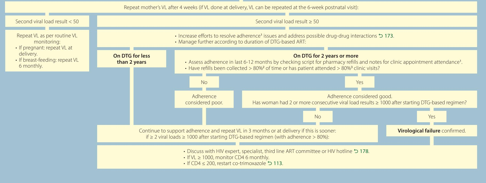

1If available, also do drug level on urine or blood specimen: adherence is considered good if medications are detected in patient's urine/blood. 2Calculate adherence % for pharmacy refills: 'number of *actual refills done* during period assessed' ÷ 'number of months in period assessed'. Then x by 100. 3Calculate adherence % for clinic attendance: 'number of scheduled visits *actually attended* by patient during period assessed' ÷ 'number of scheduled visits during period assessed'. Then x by 100.

**[HIV](#page-102-0) [CHRONIC RESPIRATORY DISEASE](#page-119-0) [CARDIOMETABOLIC CONDITIONS](#page-123-0) [MUSCULOSKELETAL DISORDERS](#page-147-0) [MENTAL HEALTH](#page-136-0) [EPILEPSY](#page-145-0) [WOMEN'S HEALTH](#page-150-0) [PALLIATIVE CARE](#page-166-0)**

**[HEPATITIS B \(HBV\)](#page-116-0) [COVID-19](#page-117-0)**

### **PREVENT COMMUNICABLE INFECTIONS IN THE NEWBORN**

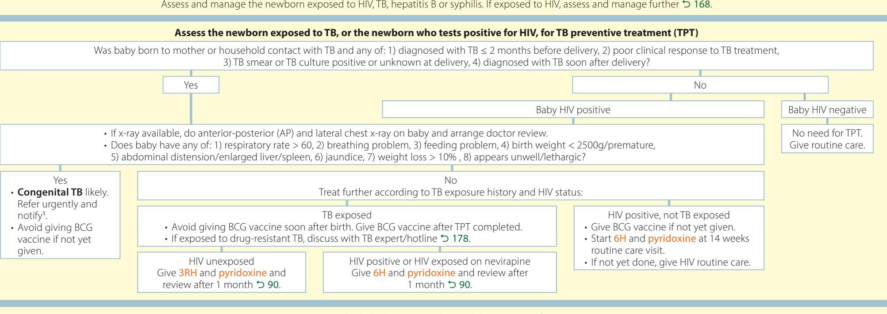

### **Manage the baby born to mother with hepatitis B infection**

 Arrange delivery at a facility that stocks immunoglobulin (HBIG) and the monovalent hepatitis B vaccine: Give hepatitis B immunoglobulin (HBIG) 200IU IM and hepatitis B vaccine 0.5mL (10mcg/0.5mL) IM, as soon after delivery as possible, within 12-24 hours.

> Baby has immunity against hepatitis B. Reassure parent/carer, no further testing needed.

Continue routine hepatitis B immunisations at 6, 10, 14 weeks and 18 months.

Arrange follow up when baby is 9 months old: take blood from baby for HBsAg and hepatitis B surface antibodies (HBsAbs): HBsAg negative and HBsAbs positive (HBsAb titre ≥ 10)

HBsAg positive Baby has **hepatitis B infection,** refer and notify1

HBsAg negative and HBsAbs negative (HBsAb titre <10) Repeat hepatitis B vaccine 0.5mL (10mcg/0.5mL) IM at this visit and again in 1 month. Then repeat HBsAbs test 1 month later: if HBsAbs still negative, refer.

### **Manage the baby born to mother with syphilis**

- If rash (peeling rash, red/blue spots or bruising especially on soles and palms), jaundice, pallor (pale conjunctiva/palms of hands), distended abdomen, swelling, birth weight < 2500g, runny nose, respiratory distress, hypoglycaemia, **congenital syphilis** likely. Refer urgently and notify1
- •If no signs/symptoms of congenital syphilis and any of the following, give baby single dose benzathine benzylpenicillin 50 000 units/kg IM into outer thigh, and discuss/refer:
- 1) Mother received < 3 doses of benzathine benzylpenicillin injections
- 2) Mother received antibiotic other than benzathine benzylpenicillin to treat syphilis
- 3) Delay (> 14 days) between maternal doses of benzathine benzylpenicillin
- 4) Baby delivered within 30 days of mother receiving last dose of benzathine benzylpenicillin

1Complete notifiable medical conditions (NMC) case notification form and send to NMCsurveillanceReport@nicd.ac.za or notify electronically: https://www.nicd.ac.za/nmc-overview/notification-process.

### **PREVENT VERTICAL TRANSMISSION OF HIV**

#### **Assess and manage the newborn exposed to HIV**

Do HIV positive mother's viral load at delivery and HIV PCR test on her baby as soon after birth as possible (within 48 hours). Place barcodes on discharge form and RtHB.

If abandoned baby, do rapid HIV test1 and HIV PCR test on baby. If < 72 hours since delivery, manage as high risk formula feeding baby below.

### **Start post-exposure prophylaxis (PEP) as soon as possible, ideally within 1 hour of birth**

Give baby zidovudine (AZT) 12 hourly (see dosing table below) and give nevirapine (NVP) once daily (see dosing table below). Give supply for 6 weeks and advise carer to bring all medication to next visit.

Advise to return for baby's HIV PCR and mother's viral load results in 3-6 days.

**[TB](#page-85-0)**

**CONTENTS SYMPTOMSCONTENTS CHRONIC CONDITIONS**

### **At 3-6 day postnatal visit, check results of baby's HIV PCR and mother's viral load and manage according to results:**

If results not available, continue AZT and NVP and follow-up after 1 week. If no HIV PCR done, do at this visit and follow-up after 1 week.

|                                                                                                                                                                                                                                                                                            | by 's C Ba H I V P R it ive p os                                                                                                                                                                                                                                                                                                                                                                                                                                                                                                                                                                                                                                                                                                                                                                                                                                                                                                                                                                                                                                                                                            | by 's C Ba H I V P R de in mi ter te na                                                                                                                           |                                                                                                                                                                                                                                 |                                                                                                                                                                                                                                                                                                     |
|--------------------------------------------------------------------------------------------------------------------------------------------------------------------------------------------------------------------------------------------------------------------------------------------|-----------------------------------------------------------------------------------------------------------------------------------------------------------------------------------------------------------------------------------------------------------------------------------------------------------------------------------------------------------------------------------------------------------------------------------------------------------------------------------------------------------------------------------------------------------------------------------------------------------------------------------------------------------------------------------------------------------------------------------------------------------------------------------------------------------------------------------------------------------------------------------------------------------------------------------------------------------------------------------------------------------------------------------------------------------------------------------------------------------------------------------------------------------------|-------------------------------------------------------------------------------------------------------------------------------------------------------------------------------------------------------------|---------------------------------------------------------------------------------------------------------------------------------------------------------------------------------------------------------------------------------|-----------------------------------------------------------------------------------------------------------------------------------------------------------------------------------------------------------------------------------------------------------------------------------------------------|
| he Mo 's V L < 5 0 t r de live at ry                                                                                                                                                                                                                   | he kn de live Mo 's V L ≥ 5 0 o t t r r u n ow n a ry                                                                                                                                                                                                                                                                                                                                                                                                                                                                                                                                                                                                                                                                                                                                                                                                                                                                                                                                                                                                                                                        | Se d 2n d H I V n • P C R t d est an fer do to cto re r ha to e t c ng o A R T.                                      | Co nt inu e • P P H I V E d ing acc or he 's to t mo r de live V L ry                                                                                |                                                                                                                                                                                                                                                                                                     |
| Lo is k w r                                                                                                                                                                                                                                                                    | he k H ig is r r  Ma he 's u d V L 16 6. ot na g e m r nsu p p res se • f m he d d for for he d ba by h ho lin  I 's V L ≥ 10 0 0, isc H I V r ista wi H I V e / ot e t est ot t ert t r uss ne e es nc m r a n xp e •                                                                                                                                                                                                                                                                                                                                                                                                                                                                                                                                                                                                                                                                                                       |                                                                                                                                                                                                             |                                                                                                                                                                                                                                 |                                                                                                                                                                                                                                                                                                     |
| 2 Sto A Z T p • da ly G ive N V P i • for ks (se 6 we e e b le ). ta f bre fee d I ing ast : • he 's t m ot rep ea r h ly. V L 6 t m on | fee d 3 Bre ing ast                                                                                                                                                                                                                                                                                                                                                                                                                                                                                                                                                                                                                                                                                                                                                                                                                                                                                                                                                                                                                                                                                                                              | la fee d Fo ing rm u                                                                                                                                                                      | dv he A ise ot m r • bre fee d to ast for lea at st                                                                                                                             | lt (se res e u d j ). nt a ace Do H I V P C R • d tes t a n l H I V v ira loa d, iew rev hi l d a d c n he k re lts c c su hin wi t da 3 y s. |
|                                                                                                                                                                                                                                                                                            | for G A Z T 1 ho ly ks (se do b le be low )an d ive 2 6 ing ta ur we e e s • da ly for lea ks (se do b le be low ) G ive N V P i 12 ing at st ta we e e s • ly he ks fte f in l bre fee d. Sto N V P o 's V L < 5 0 o r 4 t ast p n on ce mo r we e a r a • f m for f fee I he T L D d lin A R T hs d V L ≥ ler ks bre d d ha ot 2 o r 3 3 m t 10 0 0, a t to ris ast ing isc ing ≥ r o n r e on an o uss c ng • ,  for la fee d d r fer l t he ( ). h / ho lin ing it ion ic p N T P D isc it H I V e 17 8. to to tr t ert t mu an e nu a rap eu rog ram me uss w xp e | G A Z T ( ho ly ) ive 12 ur d ( da ly ) for N V P i an ks do 6 w (se ing ee e s b les be low ). ta | 2 y ea rs. f for la I mu • fee d ing , de i co ns r fea b lity f i i s o b lis hin est re- a g bre fee d ing ast |                                                                                                                                                                                                                                                                                                     |

Repeat baby's HIV test at 10 weeks, 6 months, 18 months, 6 weeks after final breastfeed or nevirapine stopped (if given ≥ 12 weeks) or any time if baby unwell.

 If mother's VL ≥ 50 at any time during breastfeeding after NVP and/or AZT stopped or mother tests HIV positive for the first time during breastfeeding: repeat/do child's HIV test at that visit, restart/start NVP and AZT (see above), and reassess once child's HIV test result available.

**[HEPATITIS B \(HBV\)](#page-116-0) [COVID-19](#page-117-0)**

| Ne ira ine ( /m L ) 10 v p sy ru p mg |                                   |                                                      |                           | Z i do d ine ( /m L ) 10 vu sy ru p mg |                                   |                                                                                    |  |
|------------------------------------------------------------------------------|-----------------------------------|------------------------------------------------------|---------------------------|----------------------------------------------------------------------------------|-----------------------------------|------------------------------------------------------------------------------------|--|
| Ag e                                                                      | ht Cu We ig nt rre | da ly do On i ce se                |                           | Ag e                                                                          | ht Cu We ig nt rre | ho ly do 12 ur se                                                   |  |
| B h t ks irt 6 w o ee                                      | kg 4 2-2 .4 9         | L ( ) da ly 1m 10m i g       |                           | B h t ks irt 6 w o ee                                          | kg 4 2-2 .4 9         | L ( ) ho ly 1m 10m 12 g ur                              |  |
|                                                                              | kg ≥ 2 .5                   | ( ) da ly 1.5 L 15m i m g |                           |                                                                                  | kg ≥ 2 .5                   | ( ) ho ly 1.5 L 15m 12 m g ur                        |  |
| 6 w ks t 6 m hs t ee o on                               |                                   | 2m L ( 20 ) da ly i mg       |                           | 6 w ks t 6 m hs t ee o on                                   |                                   | 6m L ( 6 0m ) 12 ho ly g ur                          |  |
| hs 6 t 9 m t o on                                             |                                   | ( ) da ly 3m L 3 0m i g   | ≥ 6 hs t m on |                                                                                  |                                   | Do 12 ho ly d ing ig ht. to se ur acc or we |  |
| hs 9 m t ≥ on                                                    |                                   | da ly L ( 40 ) i 4m mg       |                           |                                                                                  |                                   |                                                                                    |  |

1An HIV rapid test shows whether baby was exposed to HIV, but cannot determine whether baby is infected with HIV. An HIV PCR test determines if baby is infected with HIV. 2Return unused AZT to pharmacy to be discarded. 3A breastfed baby has breastfed in the past 7 days or is mixed feeding. 4If weight < 2kg, discuss medication options with HIV expert/hotline [178](#page-174-0).

**[HIV](#page-102-0) [CHRONIC RESPIRATORY DISEASE](#page-119-0) [CARDIOMETABOLIC CONDITIONS](#page-123-0) [MUSCULOSKELETAL DISORDERS](#page-147-0) [MENTAL HEALTH](#page-136-0) [EPILEPSY](#page-145-0) [WOMEN'S HEALTH](#page-150-0) [PALLIATIVE CARE](#page-166-0)**

### **MENOPAUSE**

Exclude pregnancy before diagnosing menopause [157](#page-153-0).

Menopause is no menstruation for at least 12 months in a row. Most women have menopausal symptoms and irregular periods leading up to menopause.

If menopausal and < 40 years, discuss with specialist.

| he l p As ien t at t se ss m en op au sa |                                                               |                                                                                                                                                                                                                                                                                                                                                                                                                                                                                                                                                                                                                                                                                                                                                                     |  |  |  |  |
|---------------------------------------------------------------------------------|---------------------------------------------------------------|---------------------------------------------------------------------------------------------------------------------------------------------------------------------------------------------------------------------------------------------------------------------------------------------------------------------------------------------------------------------------------------------------------------------------------------------------------------------------------------------------------------------------------------------------------------------------------------------------------------------------------------------------------------------------------------------------------------------------------------------------------------------|--|--|--|--|
| As se ss                                                                  | he W n t o a sse ss                            | No te                                                                                                                                                                                                                                                                                                                                                                                                                                                                                                                                                                                                                                                                                                                                                            |  |  |  |  |
| Sy tom mp s                                                            | Eve vis it ry                                        | k a bo l sy ho f lu hes ht l dry d c ha d f f ic lty lee  d s l p b lem  As ig ina i ing 87 5 8. ut tom t eat me no p au sa mp s: s , n sw s, v ag ne ss, mo o ng es, s p an exu a ro s u • f n ht k a bo he f co h, w ht los fev lu de  I ig T B s i ig T B 9 2. eat ut ot tom sw s, a s r y mp s : ug e s o r er, exc • he Ma t tom tom nag e o r sy mp s a s o n s y mp p ag es. • |  |  |  |  |
| Vag l b lee d ina ing                                         | Eve vis it ry                                        | f fte fte fre for fer I b lee d bet ds, be d- hin ks. ing io ing io 1 y it 2 w we en p er a r se x o r a r p er e ear , re w ee                                                                                                                                                                                                                                                                                                                                                                                                                                                                                                                   |  |  |  |  |
| De ion p res s                                                      | Eve vis it ry                                        | he h, has ) fe lt do de d, ho les ) fe lt litt le lea do hin ? f y he  In t ien t: 1 r 2 int in ing I it 143 ast t at st o t to p m on p wn p res se p e s o ere r p sur e g s es e r ,                                                                                                                                                                                                                                                                                                                                                                                           |  |  |  |  |
| Os k is r is teo p oro s                                   | d At iag is no s                               | Re fer for b le t f hig h o k: < h los f > he ht fra f hip /w /sp fra l st d i i is r is 6 0 y it 3c in ig rist ine iou ic i tm t ste ctu -tra at ctu p oss rea en op oro s ear s w s o m or res o , p rev s n on um res , o ra ero for hs, f m hea lco ho l us hea ker 3 m < 4 5 y B M I < 18. 5, tre atm t t set en > on on o en op au se ear s, a er, sm o vy vy                                                                      |  |  |  |  |
| ly lan Fam i nin p g                                          | d At iag is no s                               | f < for fte las d. I 5 0 y ive ion 2 y io ntr t t p ear s, g co ace p ear s a r er • f ≥ ha ly ho l co l 1 fte las d  I 0 y ive i io 5 e t est ntr t t t p 154 ear s, c ng o p rog og en -on or no n- rm on a ace p un y ear a r er •                                                                                                                                                                                                                                                                                                            |  |  |  |  |
| B P                                                                          | h ly 1 3 m H T t on on                | f  f n f ≥  I kno hy I hec k B P: / ert ion 13 3. ot, i 140 9 0 13 2. wn p en s c                                                                                                                                                                                                                                                                                                                                                                                                                                                                                                                                                                                          |  |  |  |  |
| C V D r k is                                                        | At d iag is no s                               | C k  Ass V D r is 127 ess                                                                                                                                                                                                                                                                                                                                                                                                                                                                                                                                                                                                                                                                                                                  |  |  |  |  |
| Bre hec k ast c                                                     | d h ly At iag is, 6 m t no s on | f lum /s fou d bre l lae fer k to bre lini f av la b le, 1 in I in i I i H T it iat ion ast ast at p n s o r ax , re sa me we e c c. a arr an g e m am mo g ram                                                                                                                                                                                                                                                                                                                                                                                                                                                  |  |  |  |  |
| Ce l sc rvic a ree n                                             | W he de d n n ee                               | f do l sc h 1 fro  f do l sc d (re d les f ag ), he ly  I H I V n ive 3 c ica 0 y 3 0 55 i H I V p it ive rvic H I V iag is n 3 55 at art t t eg erv ree ns, ea c ear s a p m ag e os ce a ree n a no s g ar s o e ear : ; : -y                                                                                                                                                                                                                                                                                                     |  |  |  |  |
| T hy d i ro                                                         | At d iag is no s                               | f w f a fer I ht ha lse kne /t dn dry kin lera l d o hea hec k T S H. I bn l, re do ig 10 0, tre ire nst ip at ion in to to t, c to cto ≥ e c ng e, p u mo r, w ea ss ess s , co or nce co r orm a r. ,                                                                                                                                                                                                                                                                                                                                                                         |  |  |  |  |

#### **Advise the menopausal patient**

- To cope with the flushes, advise patient to dress in layers and to decrease alcohol, avoid spicy foods, hot drinks and warm environments.
- If patient is having mood changes or not coping as well as in the past, refer to counsellor, support group or helpline [178](#page-174-0).
- Educate that long term use of hormone therapy (HT) can increase risk of breast cancer, deep vein thrombosis (DVT) and cardiovascular disease. It can be used to treat menopausal symptoms for up to 5 years.

### **Treat the menopausal patient**

- • If menopausal symptoms interfere with daily function, treat with hormone therapy (HT) if no contraindications2. If dose range given, start with lowest dose and increase until symptoms improve. If patient has had uterus removed (hysterectomy): give only estradiol 1-2mg daily *or* conjugated estrogens 0.3mg-1.25mg daily.
- If patient still has a uterus (no hysterectomy), choose HT according to menstruation pattern:

### **If ≥ 1 year since last period, give:**

- Conjugated estrogens 0.3-0.625mg *and*  medroxyprogesterone 2.5-5mg daily *or*
- Estradiol/norethisterone 1mg/0.5mg daily *or* Estradiol/norethisterone 2mg/1mg daily.

•

 Estradiol 1-2mg daily for 21 days *with* medroxyprogesterone 5-10mg daily from day 12-21, followed by no therapy from day 22-28 *or*  •Conjugated estrogens 0.3-0.625mg daily for 21 days *with* medroxyprogesterone 5-10mg daily from day 12-21, followed by no therapy from day 22-28.

**If still menstruating/recently stopped, give:**  Estradiol/cyproterone 1 tablet daily (estradiol valerate 2mg for 11 days, followed by estradiol valerate/cyproterone acetate 2mg/1mg for 10

Treat vaginal dryness and pain with sex with lubricants (avoid petroleum jelly with condoms). If no better with HT or if HT contraindicated, refer.

days, then placebo tablet for 7 days).

Review 6 monthly once on HT. Decrease/stop if symptoms are controlled. If ≥ 5 years of HT or patient ≥ 60 years, stop treatment. If still symptomatic, refer to specialist.

1Hormone therapy. 2Avoid if ≥ 60 years, abnormal vaginal bleeding, cancer of uterus or breast, previous deep vein thrombosis or pulmonary embolism, recent heart attack, liver disease , porphyria (rare hereditary disorder).

### **ROUTINE PALLIATIVE CARE**

#### **A patient can be given curative and palliative care at the same time. A doctor should confirm the patient needs palliative care:**

- Patient is in bed or chair for 50% or more of the day *or* dependent on others for most care *or* has had 2 or more *unplanned* hospital admissions in past 6 months *and*/*or*
- Patient with advanced disease chooses palliative care only and refuses curative care *and*/*or*

**[TB](#page-85-0)**

**CONTENTS SYMPTOMSCONTENTS CHRONIC CONDITIONS**

Patient with advanced disease not responding to treatment: heart failure, COPD, kidney or liver failure, cancer, HIV, TB, dementia or other progressive neurological disease.

#### **Assess the patient needing palliative care Assess Note**Symptoms • If pain: assess and advise [61](#page-57-0). Give medication/s to treat pain [171](#page-167-0). If new or sudden pain, temperature ≥ 38°C, tender swelling, redness or pus, also treat on symptom page. If no better or uncertain of cause, discuss. If constipation, diarrhoea, nausea/vomiting, abdominal cramps, itchiness, acute anxiety or cough/difficulty breathing, manage [171](#page-167-0). If patient has difficulty sleeping [87](#page-83-0). Manage other symptoms as on symptom pages. Side effects • Ask about side effects from pain medication (see next page). If on morphine, advise that nausea, confusion and sleepiness usually resolve after a few days. Check that patient is using regular laxative. Mental health • Ask if patient has persistent feelings of hopelessness or worthlessness? If yes [143](#page-139-0). If patient has suicidal thoughts or plans [83](#page-79-0). If low mood, stress or anxiety [86](#page-82-0). Chronic care • Assess how much patient and family understand about the condition and ask what further information the patient and carer need. • Assess ongoing need for chronic care in discussion with patient and health care team. Consider which medication could be discontinued. If known kidney failure with eGFR < 15, discuss. Psychosocial • Ask how patient is coping and what support and/or spiritual care is needed. Ask how the carer/family are coping and what support they need now and in the future. • Ask about distressing social issues: problems with family relationships, finances, home care. If needed, refer patient's dependents and family members to social worker. Dying If known with terminal disease and deteriorating with ≥ 2 of: bed bound, decreased consciousness, only able to sip fluid, unable to take tablets, address patient's needs [172](#page-168-0). Mouth Check oral hygiene and look for dry mouth, ulcers and thrush [35](#page-31-0). If gum or tooth problem [36](#page-32-0). If difficulty swallowing, discuss/refer. Pressure soresIf patient is bedridden or in a wheel chair, check common areas for damaged skin (change of colour) and pressure sores (see picture). If patient has pressure ulcer/sore [75](#page-71-0).

### **Advise the patient needing palliative care and his/her carer**

- In a caring manner, explain the condition and prognosis. Explaining what is happening relieves fear and anxiety. Support the patient to give as much self care as able.
- Emphasise the importance of taking pain medication regularly (not as needed) and if using tramadol/morphine to use a laxative daily to prevent constipation.
- Refer patient and carer to available community health worker, social worker, physiotherapist, counsellor, spiritual counsellor, support group [178](#page-174-0) Deal with bereavement issues [86](#page-82-0).
- Prevent mouth disease: brush teeth and tongue regularly using toothpaste or dilute bicarbonate of soda. Rinse mouth with ½ teaspoon of salt in 1 cup of water after eating and at night.
- If bedridden or in wheelchair, prevent pressure ulcers: wash and dry skin daily. Keep linen dry. Move (lift, avoid dragging) patient every 1-2 hours if unable to shift own weight. Look daily for skin colour changes (see picture).

**[HIV](#page-102-0) [CHRONIC RESPIRATORY DISEASE](#page-119-0) [CARDIOMETABOLIC CONDITIONS](#page-123-0) [MUSCULOSKELETAL DISORDERS](#page-147-0) [MENTAL HEALTH](#page-136-0) [EPILEPSY](#page-145-0) [WOMEN'S HEALTH](#page-150-0) [PALLIATIVE CARE](#page-166-0)**

If bedridden, prevent contractures: at least twice a day, gently bend and straighten joints as far as they go. Avoid causing pain. Massage muscles.

**[HEPATITIS B \(HBV\)](#page-116-0) [COVID-19](#page-117-0)**

- The patient's appetite will get less as s/he gets sicker. Offer small meals frequently and allow the patient to choose what s/he wants to eat from what is available and encourage fluid intake.
- Discuss the plan for caring for the patient. Advise whom to contact when pain or other symptoms get severe. Discuss advance-care plans and preferences. Document decisions.
- Educate the carer to recognise signs of deterioration and impending death: s/he may be less responsive, become cold, sleep a lot, have irregular breathing, and will lose interest in eating.

#### **Treat the patient needing palliative care**

If unsure, start at lower step and increase pain medication if needed.

•If pain, aim to have patient pain free at rest, able to sleep and manage daily tasks. Start pain medication based on type and severity of pain:

| No in n-c an ce r p a                                                        | Ca in nc er p a                                                                 |
|------------------------------------------------------------------------------------------------|------------------------------------------------------------------------------------------------|
| f m i l d ( ) p I 1-3 in, 1. sta rt a t st a ep • | f m i l d ( ) p I 1-3 in, 1. sta rt a t st a ep • |

- If **moderate** (4-7) or **severe** (8-10) pain start at step 2.
- If **nerve pain** or **central pain**, also give amitriptyline at any step.

Also consider adding amitriptyline at any step.

If **moderate** (4-7) pain start at step 2. If **severe** (8-10) pain start at step 3.

If pain controlled, continue same dose. Once controlled for 1 month, consider reducing dose/stepping down. If pain worsens, then increase dose/step up again.

- If pain persists > 2 days or worsens, increase dose to maximum. If still no better after 2 days, move to next step.
- If pain not responding well, assess and provide additional social, spiritual and emotional support [61](#page-57-0).
- If non-cancer pain uncontrolled on step 2, refer. If cancer pain uncontrolled on step 3, discuss.

| Ste p                                                                                                                                                                                                                          | d Pa in ica ion t me                                                                                             | do Sta rt se                                                                                      | do Ma im um se x                                                                                                                                                                                      | No te                                                                                                                                                                                                                                                                                                                                                                                                                                                                                                                                                                                                                                                                                                                                                                                                                                                                                                                                                                                                                                                                                                                                                                                           |  |  |  |
|-----------------------------------------------------------------------------------------------------------------------------------------------------------------------------------------------------------------------------------|------------------------------------------------------------------------------------------------------------------------------------|------------------------------------------------------------------------------------------------------------|----------------------------------------------------------------------------------------------------------------------------------------------------------------------------------------------------------------------|----------------------------------------------------------------------------------------------------------------------------------------------------------------------------------------------------------------------------------------------------------------------------------------------------------------------------------------------------------------------------------------------------------------------------------------------------------------------------------------------------------------------------------------------------------------------------------------------------------------------------------------------------------------------------------------------------------------------------------------------------------------------------------------------------------------------------------------------------------------------------------------------------------------------------------------------------------------------------------------------------------------------------------------------------------------------------------------------------------------------------------------------------------------------------------------------------|--|--|--|
| Ste 1 p Sta bo h o f: rt o t ne or                                                                                                                                                                  | l Par tam ace o                                                                                                        | ho ly 4-6 1g ur                                                                                | da ly i 4g                                                                                                                                                                                                  | f st l 1g lini d r fte ho f n bet d d bu fen I ing ive in in a I i art cet r 4 ter , g p ara am o c c a n eas ses s p a urs o , a p ro                                                                                                                                                                                                                                                                                                                                                                                                                                                                                                                                                                                                                                                                                                                                                                                                                                                                                                                                        |  |  |  |
|                                                                                                                                                                                                                                   | bu fen I p ro                                                                                                          | ho ly 40 0m 8 g ur                                                                       | da ly 1. 2g i                                                                                                                                                                                            | f st h i bu fen fte ho f n bet d d p l. I ing 1 w it in a r 4 I art ste ter cet p p ro , re ass ess p a urs o , a ara am o • h fte foo d. d f p lce hm hy hea fa lur ki dn d G ive it /a Av i i ic u ion i ise t st ert rt w r o ep r, a a, p en s e o r ey ase • , I f a lso kin dv ke lea ta irin ise to ta at st 3 0 m inu tes art g asp , a ap •                                                                                                                                                                                                                                                                                                                                                                                                                                                                                                                    |  |  |  |
| Ste 2 p d d t A 1: tep o s                                                                                                                                                                                | do l Tra ma                                                                                                               | ho ly 5 0m 4-6 g ur                                                                      | da ly 40 0m i g                                                                                                                                                                                       | f co /vo be low I ip ion mit ing nst at or na use a , m an ag e a s • h c f p line dat Use it ion i ien mit rip ion aut at t o ty n a as m ay cau se ove r-se w •                                                                                                                                                                                                                                                                                                                                                                                                                                                                                                                                                                                                                                                                                                                                                                                                                                                                                        |  |  |  |
| (on ly f Ste 3 i p in ) can cer p a Sto do l, tra p ma inu nt co e l / cet p ara am o bu fen d a d d: i p ro an | h Mo ine rp hy dro h lor i de c (s ho ing rt-a ct , lut ) ion so or | ho ly 5-1 0m 4 g ur f ≥ I 65 tar t y ear s: s 2.5 -5m g | No im m ax um •  t itra te ins t p in. ag a a f se dat d / I e • fus d o co n e r irat 12, te< res p ory ra | h m hin hy dro h lor de do b le, de ha lon hin lp hat Sta it i On i ing ing rt w sta to act orp e c ce se co ns r c ng g- m orp e s e. u • f A lso lac los 0- 20 L da ly Av d d ho ive tu e 1 i to t c st ip at ion i i iar g m p rev en on o r ea. • f co /vo hin be low I ip ion mit ing itc nst at , na use a or ess , m an ag e a s • f o hin hy dro h lor de d bre kt hro h p (p hat be for he du le d do ): I i in in t ext n m orp e c an a ug a a oc cu rs e n sc se • do hin he lar do he du le d t for he f t hat day G ive inu im xtr t t at t t o on e e a se mo rp e, n c on e r eg u se sc es res - |  |  |  |
|                                                                                                                                                                                                                                   | Mo h ine lp hat rp su e ( lon b let ) ing act ta g- ,                           | ho ly 10- 20 8- 12 mg ur                                                              | kip do he 1 t s se, n ha lve l do us ua ses                                                                                                                                | Inc hin do he day Ca lcu late do d d u l am f ex hin las ho ive n in 24 t t tot nt tra t rea se mo rp e ses nex ne w se: a p a ou o m orp e g urs - de his by d a d d t his h r lar ho ly do 1. D ivi 6 a 4 t nt to am ou n ea c eg ur se u                                                                                                                                                                                                                                                                                                                                                                                                                                                                                                                                                                                                                                                                                                                             |  |  |  |
| d d a d j A t uv an he t to ste rap y any p                                                                                                                                          | l Am itr ip ine ty                                                                                                  | ht 25 ni at mg g • f ≥ I 65 s: 1 0m y ear g •                 | ht 75 ni at mg g                                                                                                                                                                                      | ht. dv d dro d t d dr d u hea hin Use ni A ise it izz ine ine i ivin ing at g ma y cau se ss, ws ss a n o a vo g an s vy ma c ery • d f o be da line fer d f p l le d o bo d Av i i i / isc i in u ica ion ntr t o n q u , re uss a nco o n a ve me •                                                                                                                                                                                                                                                                                                                                                                                                                                                                                                                                                                                                                                                                                                    |  |  |  |

| i de f fe fro in d ica ion he Tre at cts t ot s e m p a me or r s y | to mp ms |
|------------------------------------------------------------------------------------------------------------------------------------------|----------------|
|------------------------------------------------------------------------------------------------------------------------------------------|----------------|

| Co ip ion nst at                                                                                                                                                                                                                                                                                                                                                                                                                                                                                                                                                                                                                                                                                                                                                                                                                                                                             | D ho iar r ea                                                                                                                                                                                                                                                                                                                                                                                                              | Na /vo mi ing t use a                                                                                                                                                                                                                                                                                                                                                                                                        | A b do l mi na                                                                                                                                                                      | Ge lise d ne ra hin itc                                                                                          | Ac ute xie                                                                                                                                              | Co h o d f f ic lty bre hin i at ug r u g                                                                                                                                                                                                                                                                                                                                                                                                                                                                                                                                                                                                                                                           |
|----------------------------------------------------------------------------------------------------------------------------------------------------------------------------------------------------------------------------------------------------------------------------------------------------------------------------------------------------------------------------------------------------------------------------------------------------------------------------------------------------------------------------------------------------------------------------------------------------------------------------------------------------------------------------------------------------------------------------------------------------------------------------------------------------------------------------------------------------------------------------------------------------------|----------------------------------------------------------------------------------------------------------------------------------------------------------------------------------------------------------------------------------------------------------------------------------------------------------------------------------------------------------------------------------------------------------------------------------------|------------------------------------------------------------------------------------------------------------------------------------------------------------------------------------------------------------------------------------------------------------------------------------------------------------------------------------------------------------------------------------------------------------------------------------------------|----------------------------------------------------------------------------------------------------------------------------------------------------------------------------------------------------|------------------------------------------------------------------------------------------------------------------------------------|---------------------------------------------------------------------------------------------------------------------------------------------------------------|-----------------------------------------------------------------------------------------------------------------------------------------------------------------------------------------------------------------------------------------------------------------------------------------------------------------------------------------------------------------------------------------------------------------------------------------------------------------------------------------------------------------------------------------------------------------------------------------------------------------------------------------------------------------------------------------------------------------------------------------------|
| he k for li d bu l k o f st l C im ion (so act c p oo • ). I f im d, ly in tum act t rec p e g en rem ov e l fro lu br f ing ica ion I sto tum t o m rec us fu l, re fer un suc ce ss G i de A a d B 1 ht ive 3.5 at ni se nn os s n mg g • d lac los l ly da ly. f /o e 1 0- 20 L o i I tu an r m ra de d, de d inc i A a B t se nn os s n ne e rea se o ht d /o lac los 27 at ni r in tu mg g an cre ase e ho ly. f n fer 12 I to ur o r esp on se, re | lop de G ive i era m l ly, he 4m ini ia t t g n fte h 2m g a r e ac loo l u sto to se o p ho ly, 6 to ur up da ly. d f 12 i Av i i mg o f lo d ho iar ov er w r ea f fe f de i ct or s e o b i iot ics t an | lop de G ive i eto m c ram • ho ly 10 8 mg ur as de d. ne e l low A ien at t to p • ho ha t to t. c ose w ea fre En nt co ura g e q ue l l m ls f /s ip sm a ea s o f lu ds li ke i ter tea wa or , dr ks. ing in g er | cra mp s G hy ine ive os c bu l bro de i ty m ho ly 10 6 mg ur as for de d to ne e up da 3 y s. | ess G ive h lor he ine c p na m ho ly 4m 6- 8 g ur de d. as ne e | ty an G ive d iaz ep am 2.5 -5m g 12 ho ly ur de d as ne e for to up da 10 y s. | f t hic k s I ive utu st p m, g ea m • ha lat I f m ha L / da in ion n 3 0m t s. ore y, de bre hin h p l wi try at t ost ep g ura dra fer hy f a la b le. ina Re io i i to g e. p s va f e I hin t utu iste nt xce ss sp m or p ers • dry h, d h p l liat isc it ive co ug uss w a list ia ca re sp ec f fer for I low tur at ion ox y g en sa , re • ho -ba d o me se xy g en |

**Review 2 days after starting or changing medication. If pain/symptoms persist despite treatment or side effects intolerable, discuss/refer.**

1Example: patient on morphine 10mg 4 hourly has 3 episodes of breakthrough pain: 10mg x 3 = 30mg (total extra morphine); 30mg ÷ 6 = 5mg. Add 5mg to each 10mg regular dose. Increase morphine to 15mg 4 hourly.

### **ADDRESS THE DYING PATIENT'S NEEDS**

The patient with a life-limiting illness is dying if s/he is deteriorating and ≥ 2 of: bed bound, decreased consciousness, only able to sip fluid or unable to take tablets. A doctor should confirm this.

| he dy ing ien 's n ds ho As 4 t at t se ss p ee ev ery ur s |                                                                                                                                                                                                                                                                                                                                                                                                                                                                                                                                                                                                                                                              |  |  |  |  |
|----------------------------------------------------------------------------------------------------------------------|--------------------------------------------------------------------------------------------------------------------------------------------------------------------------------------------------------------------------------------------------------------------------------------------------------------------------------------------------------------------------------------------------------------------------------------------------------------------------------------------------------------------------------------------------------------------------------------------------------------------------------------------------------------|--|--|--|--|
| As se ss                                                                                                       | No te                                                                                                                                                                                                                                                                                                                                                                                                                                                                                                                                                                                                                                                     |  |  |  |  |
| Sy tom mp s                                                                                                 | for d f f ic lty bre hin d ho d a b do l cr f p be low Ass isy / i itat ion in, ip ion iar /vo mit ing mi I at nst at t, m ess no g, ag , p a co r ea, na use a an na am p s. res en an ag e u ,                                                                                                                                                                                                                                                                            |  |  |  |  |
| Cu nt rre car e                                                                                          | d d d l m d Ass ica ion isc inu ia ica ion nt t t t t ess cu rre me an on e n on -es sen e s. • for Ass 's o d d h p /ca d hea lt h c at ien t ing te sts in isc ion it at ien t te ess p ng o ne e uss w rer an are am • Co de hin d f u b le t l low l ly bc i itc ica ion i t ute to uta ns r sw g me ro na o s wa or a su neo us. • |  |  |  |  |
| ke Int a                                                                                                       | hec k w h c fam ly hat f lu ds foo d ke ds d w het he f lu ds foo d de d o C it / i ien 's i / int i / is n at t are r w p a nee are an r ee r n ece ssa ry.                                                                                                                                                                                                                                                                                                                                           |  |  |  |  |
| ho log l w l l- be Psy ica ing c e                                                     | k ho d c d w hat d l ca de d. f ca b le t ho fer ho l ho As ien ing /or irit is n I ien ita / ice at t a ort t at t to p n are r ar e c op an su p p an sp ua re ee rer un a o c op e a me , re p sp sp w                                                                                                                                                                                                                                                                |  |  |  |  |
| h Mo ut                                                                                                        | hec k o l hy h is d c lea de ly kee lip h m C ien Ens ien 's m ist Co i ing ine /m ist. at t t to t ra g e. ure p ou m o an n. ns r u s g cer p s ou o                                                                                                                                                                                                                                                                                                                                                          |  |  |  |  |
| l hy Per ien son a g e                                                                          | hec k s kin lea d c ha f c lot hin d ds. C ing ien 's n to at t ca re, c n e y es an ng e o g acc or p ee                                                                                                                                                                                                                                                                                                                                                                                                                                                       |  |  |  |  |

### **Advise the dying patient and carer**

Ensure patient and/or carer is aware that patient is dying and that carer/family have been referred to social worker and community health worker.

**[HEPATITIS B \(HBV\)](#page-116-0) [COVID-19](#page-117-0)**

- Educate carer/family that food/fluids are for comfort only, will not prolong life and a reduced need for food/fluids is part of the normal dying process.
- •Advise that investigations and curative treatments like antibiotics may no longer be indicated and will be kept to a minimum according to patient's care plan.
- Discuss with patient and carer: preferred place of death (home, hospice or hospital), how family are to be informed of impending death, what to do in the event of death.
- Discuss patient's wishes, feelings, faith, beliefs and values. Discuss patient's needs now, at death and after death. Listen and respond to patient/carer's worries/fears.
- •Ensure patient and/or carer/family receive full explanation and express understanding of current plan of care. Identify and document any concerns about current plan of care.

### **Treat the dying patient**

- If noisy breathing, excessive secretions likely: try changing position.
- If difficulty breathing, use fan or open window/s. Give morphine hydrochloride solution 2.5-5mg. Increase slowly as needed.
- If urinary retention, insert urethral catheter.
- If pain, constipation, diarrhoea, nausea/vomiting or abdominal cramps, manage [171](#page-167-0).
- If agitated:

**CONTENTS SYMPTOMSCONTENTS CHRONIC CONDITIONS**

- First assess for and manage pain, urinary retention, constipation and dehydration.
- If none of above, consider changing position and give diazepam 5mg (or 2.5mg if liver failure). If no better, repeat dose.

### **Review the dying patient**

- Doctor to review every 3 days or sooner if carer/family concerned about current plan of care or if patient's conscious level, functional ability, oral intake or mobility improves.
- If carer/family unable to cope at home or difficulty breathing relieved by oxygen, refer to hospital/hospice if available.
- If unsure, discuss with palliative care specialist.

**[TB](#page-85-0)**

### **Diagnose death if:**

**[HIV](#page-102-0) [CHRONIC RESPIRATORY DISEASE](#page-119-0) [CARDIOMETABOLIC CONDITIONS](#page-123-0) [MUSCULOSKELETAL DISORDERS](#page-147-0) [MENTAL HEALTH](#page-136-0) [EPILEPSY](#page-145-0) [WOMEN'S HEALTH](#page-150-0) [PALLIATIVE CARE](#page-166-0)**

No carotid pulse in neck for 2 minutes *and* no heart sounds for 2 minutes *and* no breath sounds or chest movement for 2 minutes *and* pupils are fixed, dilated and do not respond to light.

### **SUPPORT THE PATIENT TAKING LONG-TERM MEDICATION**

| he ien k ing lon d ica ion As t at t t ter t se ss p a g- m me |                                                                                                                                                                                                                                                                                                                                                                                                                                                                                                                                                                                                                                                                                                                                                                                                                                                                                                                                                                                                                                                                                                                                                                                                                                                                                                                                                                                                                                                                                                                                                                                                                                                                                                                                                                                                                                                                                                                                                                                                                                                                                                                                                                                                                                                                                                                                                                                                                                                                                                                                                                                                                                                                                                                                                                                                                                                                                                                                                                                                                                                                                                                                                                                                                                                                                                                                                                                                                                                                                                                                                        |  |  |  |  |  |
|----------------------------------------------------------------------------------------------------------------------------|--------------------------------------------------------------------------------------------------------------------------------------------------------------------------------------------------------------------------------------------------------------------------------------------------------------------------------------------------------------------------------------------------------------------------------------------------------------------------------------------------------------------------------------------------------------------------------------------------------------------------------------------------------------------------------------------------------------------------------------------------------------------------------------------------------------------------------------------------------------------------------------------------------------------------------------------------------------------------------------------------------------------------------------------------------------------------------------------------------------------------------------------------------------------------------------------------------------------------------------------------------------------------------------------------------------------------------------------------------------------------------------------------------------------------------------------------------------------------------------------------------------------------------------------------------------------------------------------------------------------------------------------------------------------------------------------------------------------------------------------------------------------------------------------------------------------------------------------------------------------------------------------------------------------------------------------------------------------------------------------------------------------------------------------------------------------------------------------------------------------------------------------------------------------------------------------------------------------------------------------------------------------------------------------------------------------------------------------------------------------------------------------------------------------------------------------------------------------------------------------------------------------------------------------------------------------------------------------------------------------------------------------------------------------------------------------------------------------------------------------------------------------------------------------------------------------------------------------------------------------------------------------------------------------------------------------------------------------------------------------------------------------------------------------------------------------------------------------------------------------------------------------------------------------------------------------------------------------------------------------------------------------------------------------------------------------------------------------------------------------------------------------------------------------------------------------------------------------------------------------------------------------------------------------------------|--|--|--|--|--|
| As se ss                                                                                                             | No te                                                                                                                                                                                                                                                                                                                                                                                                                                                                                                                                                                                                                                                                                                                                                                                                                                                                                                                                                                                                                                                                                                                                                                                                                                                                                                                                                                                                                                                                                                                                                                                                                                                                                                                                                                                                                                                                                                                                                                                                                                                                                                                                                                                                                                                                                                                                                                                                                                                                                                                                                                                                                                                                                                                                                                                                                                                                                                                                                                                                                                                                                                                                                                                                                                                                                                                                                                                                                                                                                                                                               |  |  |  |  |  |
| d he A ren ce                                                                                                  | k p de d q li ke "W hat kes d f f ic lt for ke ? f in d d f f ic lt t be ke d ? do hav As ien ion it i Do im it i ica ion Ho at t o t to ta r tr eat nt t r to ta t p en en ues s m a u y ou y ou me y ou so me es u o r em em y ou r m e w ma ny ses e • d t his k h s li ke l l m do d t he isse ? " Enc ien it "W iss ". at t to tat ts ou m we e ou rag e p op en up em en e a ses no w a n n y w fac f lu As k a bo hat d he ut tor s t in m ay en ce a ren ce: • he f c lini b lem ( li ke los f in for he day he ke b lit ho ). Is t is its i ing i i ies st tra ort t ot to ta at co o c v a p ro nsp s co me , p ay an r p ers on on re sp on s me - , he kes lini b lem ( li ke fro k, ho b lit ). Is t im it t vis it c im i i ies t to t e a c a p ro e a wa m w or me , re sp on s y - f fe f p f a f fe fer  Are d i de ? I d t kin A R T be de do h o b le m d ica t ion ing cts at ien t st i ct, to cto r to vie w t wit ut i ica t ion 116 m e s c au s an y s e op p e a g cau se o s e re re o s c res p on s e s - he d i f f ic lt ly k ing he d ( li ke do hey b le, hey d f f ic lt t l low foo d a la b le s ds 't t ken h ). Is t ta ica ion rri i is i t t t ta ste te t ty sto re u me s are u o s wa va o m e are n a on em p ma c - , d los kee ho Is isc iss ? Is p ien ing ? at t tr to tre atm t a ret at ure an ue p en sec me y - fee l l l en h t ke d li ke he b lem h n d ho hea bu Is p ien ing ica ion ( is t it iar ip ion ). Ma at t o t t nst at rt tom we ou g a me s re a p ro w au sea r ea, co or rn nag e o n s y mp p ag es. - , he b lem h u de d ing hec k p kno his / he d d u de ds his / he d d w hat be l l co l le d. Is t it rst ien iag is a it ion it at t rsta s to ntr re a p ro w n an : c ws r no s n n n r co n an me an we o - |  |  |  |  |  |
| l lne Rec i t en ss                                                                                      | fec for f co fev  As k a bo d do in ion /s i l lne Ma he Tes T B i h, w ig ht los ig ht 9 2. ut nt t t t tom tom t eat an cu me rec en or ss. nag e o r sy mp s a s o n s y mp s p ag es. ug e s, n sw s o r er                                                                                                                                                                                                                                                                                                                                                                                                                                                                                                                                                                                                                                                                                                                                                                                                                                                                                                                                                                                                                                                                                                                                                                                                                                                                                                                                                                                                                                                                                                                                                                                                                                                                                                                                                                                                                                                                                                                                                                                                                                                                                                                                                                                                                                                                                                                                                                                                                                                                                                                                                                                                                                                                                                                                                                                                                                                                                                                                                                                                                                                                                                                                       |  |  |  |  |  |
| Co do ct rre ses                                                                                               | k p ho his / he l ls a d t l l y he do d ho fte / he ho l d t ke C hec k p kno ho he d ks a d w hy ke dv d. As ien i it. ien ica ion it is im it a ise at t to t at t w t t ort ant to ta s w y ou r p n e ou se an w o n s s u a ws me wo r n p s a • hec k t hat do for ht. C is c ig ect se orr we •                                                                                                                                                                                                                                                                                                                                                                                                                                                                                                                                                                                                                                                                                                                                                                                                                                                                                                                                                                                                                                                                                                                                                                                                                                                                                                                                                                                                                                                                                                                                                                                                                                                                                                                                                                                                                                                                                                                                                                                                                                                                                                                                                                                                                                                                                                                                                                                                                                                                                                                                                                                                                                                                                                                                                                                                                                                                                                                                                            |  |  |  |  |  |
| Dru int ion ct g era s                                                                                   | he d hat be d c hec k for kno l ly d e lep d o he d li ke: lc Rev iew ica ion ien in ion ia A R T, T B a i ive ica ion ium iro ot t s t at t m ter act tre atm t, c tra t t t r m e p ay on an wn s: e sp ec n p sy en on cep s a n r co mm on m e s ca n, • , ds, for Co lt t he So h A fric Me d For lary ( S A M F ), u b- bas d dru hec ker 2 (se Q R c de ) o M I C he lp line ( ) f u zin i mi ic ine int ion 0 21 40 6 6 8 29 i nta et ut ct c, a c m n. nsu an s mu se we e g era c e o r nsu re. k i f p kin he ba l d l m d h he lp line ( ) f u As ien is t /tr it ion ica ion D isc it M I C 0 21 40 6 6 8 29 i at t t a g r a a e s. uss w nsu re. •                                                                                                                                                                                                                                                                                                                                                                                                                                                                                                                                                                                                                                                                                                                                                                                                                                                                                                                                                                                                                                                                                                                                                                                                                                                                                                                                                                                                                                                                                                                                                                                                                                                                                                                                                                                                                                                                                                                                                                                                                                                                                                                                                                                                                                |  |  |  |  |  |
| Res ista to tre atm t nce en                                                                          |  I f o T B o H I V t de dru f o he hav be lu de d a d p d he D h H I V ho line i ista i ien is a isc it 178 tm t, c t at t t. t n r rea en on s r g res nce r ca use s e en exc n ren uss w                                                                                                                                                                                                                                                                                                                                                                                                                                                                                                                                                                                                                                                                                                                                                                                                                                                                                                                                                                                                                                                                                                                                                                                                                                                                                                                                                                                                                                                                                                                                                                                                                                                                                                                                                                                                                                                                                                                                                                                                                                                                                                                                                                                                                                                                                                                                                                                                                                                                                                                                                                                                                                                                                                                                                                                                                                                                                                                                                                                                                                                                                                                                                                    |  |  |  |  |  |
| ly Da i ine t rou                                                                                           | k a bo da ly d f it d f f ic lty h a d he de fy hat be d a de ke d As ien 's i ine i i wit I i it ies mi ica ion ut at t t nt ort t rs t o t t p rou an ca use s ren ce. op p un ca n use s re n a me u                                                                                                                                                                                                                                                                                                                                                                                                                                                                                                                                                                                                                                                                                                                                                                                                                                                                                                                                                                                                                                                                                                                                                                                                                                                                                                                                                                                                                                                                                                                                                                                                                                                                                                                                                                                                                                                                                                                                                                                                                                                                                                                                                                                                                                                                                                                                                                                                                                                                                                                                                                                                                                                                                                                                                                                                                                                                                                                                                                                                                                                                                                                                             |  |  |  |  |  |
| Su ort p p                                                                                                        | k i f p fro fam ly, frie ds he he As ien ive i in t ity. at t re ort ot ce s s up p m n or rs co mm un                                                                                                                                                                                                                                                                                                                                                                                                                                                                                                                                                                                                                                                                                                                                                                                                                                                                                                                                                                                                                                                                                                                                                                                                                                                                                                                                                                                                                                                                                                                                                                                                                                                                                                                                                                                                                                                                                                                                                                                                                                                                                                                                                                                                                                                                                                                                                                                                                                                                                                                                                                                                                                                                                                                                                                                                                                                                                                                                                                                                                                                                                                                                                                                                                                                                                                                                                          |  |  |  |  |  |
| Me l hea lt h nta                                                                                           | he h, has ) fe lt do de d, ho les ) fe lt litt le lea do hin f y he  f st  In t ien t: 1 r 2 int in ing ? I it 143 I xie 8 6. ast t at st o t to ty p m on p wn p res se p e s o ere r p sur e g s es e r res s o r an ,                                                                                                                                                                                                                                                                                                                                                                                                                                                                                                                                                                                                                                                                                                                                                                                                                                                                                                                                                                                                                                                                                                                                                                                                                                                                                                                                                                                                                                                                                                                                                                                                                                                                                                                                                                                                                                                                                                                                                                                                                                                                                                                                                                                                                                                                                                                                                                                                                                                                                                                                                                                                                                                                                                                                                                                                                                                                                                                                                                                                                                                                                                              |  |  |  |  |  |
| lco ho l dru A / g use                                                                                |  he has ) dru k ≥ dr ks 1/s ) u d l leg l dru ) m d p he d ? f y In t ien t: 1 4 in ion 2 i r 3 isu ip ion ica ion I 142 ast at t t ter t to p y ear p n ess se a g s o se res cr or ov er- -co un m e s es any , ,                                                                                                                                                                                                                                                                                                                                                                                                                                                                                                                                                                                                                                                                                                                                                                                                                                                                                                                                                                                                                                                                                                                                                                                                                                                                                                                                                                                                                                                                                                                                                                                                                                                                                                                                                                                                                                                                                                                                                                                                                                                                                                                                                                                                                                                                                                                                                                                                                                                                                                                                                                                                                                                                                                                                                                                                                                                                                                                                                                                                                                                                                                                       |  |  |  |  |  |

interactions

#### **Advise the patient taking long-term medication**

- •Be supportive and non-judgemental. If newly diagnosed or poor understanding, spend extra time educating and counseling the patient. Explain the condition and the benefits of medication.
- If difficulty with adherence, avoid blaming patient. Rather explore his/her reasons for poor adherence and come up with ideas together to improve.
- Discuss ways to help patient to remember to take medication, like diaries, alarms, pill boxes. Use reminders that form part of daily routine.
- •Explain that good adherence is taking medication at the correct dose and time every day, and will improve control and reduce risk of long-term complications.
- Encourage patient to involve partner or family member in his/her treatment.

### **Treat the patient taking long-term medication**

- Refer for extra support: if challenges taking/remembering to take treatment, refer to counsellor for enhanced adherence counselling (EAC). Consider linking with a support group, treatment buddy, or community health worker.
- Try to keep medication regimen simple with as few tablets and doses as possible. Use fixed dose combination tablets if available. Avoid changing medications or doses without good reason.
- Involve patient in his/her treatment plan and adapt treatment schedule to daily routine as much as possible. Schedule appointments on days and times that suit the patient.
- •If difficulty with adherence, see the patient more frequently (e.g. weekly instead of monthly).

1One drink is 1 tot of spirits, or 1 small glass (125mL) of wine or 1 can/bottle (330mL) of beer. 2www.hiv-druginteractions.org/checker

# **PROTECT YOURSELF FROM OCCUPATIONAL INFECTION**

### **Give urgent attention to the health worker with a sharps injury or splash to eye, mouth, nose or broken skin with exposure to any of:**

• Blood•

- • Vaginal secretions •
  - SemenBreast milk

- Blood-stained fluid/tissueWound secretions
- •Pleural/pericardial/peritoneal/amniotic/synovial/cerebrospinal fluid

### **Management:**

- •If broken skin, clean area immediately with soap and water.
- •If splash to eye, mouth or nose, immediately rinse mouth/nose or irrigate eye thoroughly with water.
- Assess need for HIV and hepatitis B post-exposure prophylaxis [106](#page-102-0).

### **Adopt measures to diminish your risk of occupational infection**

### **Protect your facility**

### **Clean the facility:**

- Clean frequently touched surfaces (door handles, telephones, keyboards) daily with soap and water.
- Disinfect surfaces contaminated with blood/secretions with 70% alcohol or chlorine-based disinfectant.

### **Ensure adequate ventilation:**

Leave windows and doors open when possible and use fans to increase air exchange.

### **Organise waiting areas:**

- Prevent overcrowding in waiting areas.
- Fast track patients with suspected respiratory infections, TB or acute gastroenteritis.

### **Manage sharps safely:**

Ensure sharps bins are easily accessible and regularly replaced.

### **Manage infection control in the facility:**

•Appoint an infection control officer for the facility to coordinate and monitor infection control policies.

### **Manage possible occupational exposure promptly**

#### **Reduce TB riskIdentify patients with possible TB promptly:**

### The patient with cough ≥ 2 weeks is has possible TB.

- Separate patients with possible TB from others in the facility.
- Educate about cough hygiene and give face mask/tissues to cover mouth/nose to protect others.

### **Diagnose TB rapidly:**

Fast track TB workup and start treatment as soon as diagnosed.

**[TB](#page-85-0)**

### **Protect yourself from TB:**

**CONTENTS SYMPTOMSCONTENTS CHRONIC CONDITIONS**

Wear an N95 respirator (not a surgical mask) if in contact with a patient with infectous TB.

### **Screen and test yourself for TB every 6 - 12 months:**

 Screen and test for TB according to your facility policy. If TB test negative and depending on your risk profile, discuss TB preventive treatment (TPT) with your occupational health practitioner.

### **Reduce risk of respiratory infections (including pertussis, influenza and COVID-19)**

- Before managing a patient with suspected or confirmed respiratory infection, wear appropriate PPE.
- Wash hands with soap and water. Wear a surgical mask over mouth and nose during procedures.
- Encourage patient to wear face mask, cover mouth/nose with a tissue when coughing/ sneezing, to dispose of used tissues correctly and to wash hands regularly with soap/water.
- Advise patient to avoid close contact with others.

- Wear gloves when handling blood, body fluids, secretions or non-intact skin. Wear surgical mask if in contact with patient with respiratory illness (N95 respirator if performing

**[HEPATITIS B \(HBV\)](#page-116-0) [COVID-19](#page-117-0)**

### **Get vaccinated:**

- Get vaccinated against hepatitis B (if not yet done) and yearly against influenza.
- Ensure COVID-19 and pertussis vaccinations are up to date.

### **Know your HIV status:**

**Wear protective gear:**

- Test for HIV [110](#page-106-0). ART and TPT can decrease the risk of TB.
- If HIV positive, you are entitled to work in an area of the facility where exposure to TB is limited.
- aerosol-generating procedure or patient has suspected or confirmed infectious TB.). Wear surgical mask with a visor or glasses if at risk of splashes.

Wash hands with soap/water or use alcohol-based cleaner after contact with patients or body fluid.

**Protect yourself**

**Adopt standard precautions with every patient:**

Dispose of sharps correctly in sharps bins.

### **PROTECT YOURSELF FROM OCCUPATIONAL STRESS**

Experiencing pressure and demands at work is normal. However if these demands exceed knowledge and skills and challenge your ability to cope, occupational stress can occur.

#### **Arrange urgent assessment for to the health worker with occupational stress and any of:**

- Alcohol or drug intoxication at work
- Aggressive or violent behaviour at work
- Inapproproate behaviour at work
- Suicidal thoughts or behaviour

### **Adopt measures to reduce your risk of occupational stress**

### **Protect yourself**

### Look after your health:

Get enough sleep.

•

•

- Exercise, eat sensibly, minimise alcohol and avoid smoking.
- Address your general health and get screened for chronic conditions.

### Look after your chronic condition if you have one:

- •Adhere to your treatment and your appointments.
- Avoid diagnosing and treating yourself.
- If you can, confide in a trusted colleague/manager.

### Manage stress:

- •Delegate tasks as appropriate; develop coping strategies.
- Talk to someone (friend, psychologist, mentor), or access helpline [178](#page-174-0).
- Take time to do a relaxing breathing exercise each day.
- •Find a fun or creative activity to do.
- Spend time with supportive family or friends.

### Have healthy work habits:

- Manage your time sensibly.
- Take scheduled breaks.
- Remind yourself of your purpose as a clinician.

•

Be sure you are clear about your role and responsibilities.

### **Protect your team**

#### Decide on an approved way of behaving at work:

- Communicate effectively with your patients and colleagues [176](#page-172-0).
- Treat colleagues and patients with respect.
- Support each other. Consider setting up a staff support group.
- Instead of complaining, rather focus on finding solutions to problems.

### Cope with stressful events

 Develop procedures to deal with events like complaints, harassment/bullying, accidents/mistakes, violence or death of patient or staff member.

### Look at how to make the job less stressful:

- •Examine the team's workload to see if it can be better streamlined.
- Identify what needs to be changed to make the job easier and frustrations fewer: equipment, drug supply, training, space, décor in work environment
- • Discuss each team member's role. Ensure each one has say in how s/he does his/her work.
- Support each other to develop skills to better perform your role.

### Celebrate:

**Recent distressing event**

 Bereavement Needlestick injury Traumatic event

- Acknowledge the achievements of individuals and the team.
- Organise or participate in staff social events.

•

### **Possible alcohol or drug problem**

 In the past year, have you/colleague: 1) drunk ≥ 4 drinks1/session, 2) used illegal drugs or 3) misused prescription or over-the-counter medications? If yes to any substance misuse likely. •Smells of alcohol

### **Identify occupational stress in yourself and your colleagues**

•

#### **Change in mood**

- Indifferent, tense, irritable or angry
- In the past month, have you/colleague:
- 1) felt down, depressed, hopeless or 2) felt little interest or pleasure in doing
- things? If yes to either depression likely.

### **Poor attendance at work**

- Diagnosis of chronic condition Frequent absenteeism
  - Frequent lateness
  - Often takes sick leave

#### **Marked decline in work performance**

- •Reduced
- concentration
- Fatigue

The health worker with any of the above may have substance misuse, stress, depression/anxiety or burnout and would benefit from referral for assessment and follow-up.

1One drink is 1 tot of spirits, or 1 small glass (125mL) of wine or 1 can/bottle (330mL) of beer.

**175**

### **COMMUNICATING EFFECTIVELY**

Communicating effectively with your patient during a consultation need not take much time or specialised skills. Try to use straightforward language and take into account your patient's culture and belief system.

#### **Integrate these four communication principles into every consultation:**

| 'I c his ' tru st t an p ers on • fee l re d a d v lue d 'I ' te sp ec n a • fee l ho fu l 'I ' p e • fee 'I l he d ' ar •                                                                                                                                      | Do 't n Ta l k to h o m uc • h t he lta Ru ion t s co nsu • l a dv G ive ice p ers on a • Int t err up •                                                                                                                                                                  | he ht fee l: T ien ig at t m p 'I a be list d t ' t ing m no en e o • fee l d d 'I ise ' mp ow ere • lue d 'I a ' t v m no a • 'I c his ' t tr ust t an no p ers on •       |  |  |  |  |  |
|--------------------------------------------------------------------------------------------------------------------------------------------------------------------------------------------------------------------------------------------------------------------------------------------------------------------------------------------------------------------------------------------|---------------------------------------------------------------------------------------------------------------------------------------------------------------------------------------------------------------------------------------------------------------------------------------------------------------------------------------------------------------------------------|-----------------------------------------------------------------------------------------------------------------------------------------------------------------------------------------------------------------------------------------------------------------------------------------------------------------------------------------------|--|--|--|--|--|
| D isc us s D b lem d lut he lp he he lm d p de lop b le lan isc ing its ion ien t at t to uss a p ro an so ca n ov erw e ve a ma na g ea p                                                                                                          |                                                                                                                                                                                                                                                                                                                                                                                 |                                                                                                                                                                                                                                                                                                                                               |  |  |  |  |  |
| at t m p ho ha de l w h 'I c I w it ' t t to ose w an a • f 'I c he lp l ' an my se • 'I fee l su d ho ' in ice ort p p e my c • h m b lem 'I c it ' an co p e w y p ro s •                                  | n de he Fo r i ien to t at t rce y ou as on p • 'f ix Be ' sp list -it ia a ec • he ke b lem Let ien t at t ta to p on o m an y p ro s • at on ce                                                                               | he ht fee l: T ien ig at t m p d 'I a ' t re te m no sp ec • 'I a b le t ke de ' is ion m un a o m a my ow n c s • 'I a d t ha fas ' te e t t m ex p ec o c ng oo •         |  |  |  |  |  |
| h ise Em at p hy he b lity d s ha he d fee lin Em is t i im ine ien 's s itu ion at to t at t at p a ag an re p an g s.                                                                                                                                                  |                                                                                                                                                                                                                                                                                                                                                                                 |                                                                                                                                                                                                                                                                                                                                               |  |  |  |  |  |
| T he ien ig ht fee l: at t m p hro h t his 'I c ' et t an g ug • de l w h m 'I c it itu ion ' at an a y s • 'M he lt h w ker de ds ' rst y a or un an me • 'I fee l su d ' ort p p e •                 | Do 't n dg b lam he Ju rit ic ise ien e t at t e, c or p • D isa g ree or ar g ue • for f Be b le w h hig h lev ls o ta it un co m e • d bu de f t he b lem ion ot em s a n r n o p ro s | T he ien ig ht fee l: at t m p be dg d 'I a ing j ' m u e • h t de l w h 'I a it ' too m m uc o a • 'I c 't c ' an op e • 'M he lt h w ker fee lin ' is y a or un g • |  |  |  |  |  |
| ise Su mm ar for Su ha ha be d d he he k t he 's u de d d t lan lut is t isc s to at ien t rst ion mm ar w s en uss e c c n an an o a ree on a a so                                                                                           |                                                                                                                                                                                                                                                                                                                                                                                 |                                                                                                                                                                                                                                                                                                                                               |  |  |  |  |  |
| he ht fee l: T ien ig at t m p ke ha li fe 'I c in ' an m a c ng es my • 'I ha hin k o ' t to ve so me g wo r n • 'I fee l su d ' ort p p e • ba k w he d t 'I c I n ' an co me c n ee o • | Do 't n he de D ire is ion ct t c s • Be bru t a p • de Fo is ion rce a c •                                                                                                                                                                                                                    | he ht fee l: T ien ig at t m p he lt h w ker d f m 'M isa a or p p rov es o y y • de is ion ' c s 'I fee l re fu l ' t sen • fee l m de d 'I isu ' rst n oo •                  |  |  |  |  |  |
|                                                                                                                                                                                                                                                                                                                                                                                            | he ht fee l: T ien ig lp ing                                                                                                                                                                                                                                                                                                                            | Do 't ing p g p                                                                                                                                                                                                                                                                                                                |  |  |  |  |  |

### **SUPPORT THE PATIENT TO MAKE A CHANGE**

Use the five-A's approach to help the patient make a change in behaviour to help avoid or lessen a health risk:

#### **Ask the patient about the risks**

Identify with the patient the risk/s to his/her health.

•Ask what the patient already knows about these risks and how they will affect the patient's health.

#### **Alert the patient to the facts**

- Request permission to share more information on this risk.
- Use a neutral, non-judgemental manner. Avoid prescribing what the patient must do.
- Build on what the patient already knows or wants to know.
- Discuss results of tests or examination that indicate a risk.
- Link the risk to the patient's health problem.

#### **Assess the patient's readiness to change**

- Assess the patient's response about the information on his/her risk. 'What do you think/feel about what we have discussed?'
- Use the scale to help patient assess the importance of this issue for him/her. Also rate how confident s/he feels about making a change.

| f i No l l im /n l l co de t a t a tan t ot at nt p or a n | 1 | 2 | 3 | 4 | 5 | 6 | 7 | 8 | 9 | 10 | f i Ve im /ve de tan t nt ry p or ry co n |
|------------------------------------------------------------------------------------------------------------------------|---|---|---|---|---|---|---|---|---|----|-------------------------------------------------------------------------------------|
|------------------------------------------------------------------------------------------------------------------------|---|---|---|---|---|---|---|---|---|----|-------------------------------------------------------------------------------------|

Ask the patient why s/he rated importance/confidence at this number. Ask what might help improve this rating.

Summarise the patient's view. Ask how ready s/he feels to make a change at this time.

#### **Assist the patient with change**

#### **If the patient is not ready to change:**

- Assist the patient to set a realistic change goal.
- Explore the factors that may help the patient to change or may make it difficult.
- Help the patient plan how s/he will fit the change into the routine of the day.
- Encourage patient to use strategies s/he used successfully in the past.
- Respect the patient's decision.
- Invite patient to identify the pros and cons of change.
- Acknowledge patient's concerns about change.
- Explore ways of overcoming the difficulties preventing change.
- Offer more information or support if the patient would like to consider the issue further.

#### **Arrange support and follow up**

- Offer referral to counselor and available support services (social worker, health promoter, community care worker, helpline [178](#page-174-0)).
- Identify a friend, partner, or relative to support the patient and if possible attend clinic visits.
- •Document decision and goals set by the patient.

**If the patient is ready to change:**

Schedule follow-up contact (clinic visit, email, phone) to review readiness and goals.

**[TB](#page-85-0)**

**[HIV](#page-102-0) [COVID-19](#page-117-0) [CHRONIC RESPIRATORY DISEASE](#page-119-0) [HEPATITIS B \(HBV\)](#page-116-0) [CARDIOMETABOLIC CONDITIONS](#page-123-0) [MUSCULOSKELETAL DISORDERS](#page-147-0) [MENTAL HEALTH](#page-136-0) [EPILEPSY](#page-145-0) [WOMEN'S HEALTH](#page-150-0) [PALLIATIVE CARE](#page-166-0)**

**177**

# **HELPLINE NUMBERS**

| lp l He ine                                                                                                          | de d Se ice i rv s p rov                                                                                                                                                                                                  | be Co /s nta ct nu m r                                                                                                                                                     |  |  |  |  |
|-------------------------------------------------------------------------------------------------------------------------------|------------------------------------------------------------------------------------------------------------------------------------------------------------------------------------------------------------------------------------------------|-------------------------------------------------------------------------------------------------------------------------------------------------------------------------------------------------|--|--|--|--|
| l co l l Ge ing ne ra un se                                                                           |                                                                                                                                                                                                                                                |                                                                                                                                                                                                 |  |  |  |  |
| fe Li line Na l Co l ling Lin t ion a un se e                                       | for fe fer Co l ling li d r l to lev is is a ant rvic un se an y cr n e ra re se es                                                                                    | ( ho he lp line ) 0 8 61 3 22 3 22 24 ur                                                                                                              |  |  |  |  |
| hi l d line (ag ) C S A 0 - 16 es y ear s                                           | hi l dre d y do les ho bu k o f a bu d v len For in c rise ris io ts w at c n a n ou ng a cen ar e s, a se or se an ce                   | ( ho he lp line ) 0 8 0 0 055 55 5 24 ur                                                                                                              |  |  |  |  |
| l l kin Na ion Co i Ag ins Sm t t a un c a o g                             | for kin Su ien it s ort at t to p p a p q u mo g.                                                                                                                                                    | day day 01 20 314 ( 0 8: 0 0-1 0 0 Mo Fri ) 1 7 5 7: to n                                                                              |  |  |  |  |
| bu A se                                                                                                                 |                                                                                                                                                                                                                                                |                                                                                                                                                                                                 |  |  |  |  |
| de len Sto Ge Vio p n r ce                                                                            | for hi l dre d m do len Su ien ing ic v io ort st p p c n, w om en an en exp er c me ce                                                                          | ho he lp line 0 8 0 0 1 0 1 0 ( 24 ) 5 5 ur                                                                                                        |  |  |  |  |
| Rap Cr is is e                                                                                                    | Co l ling d c for ivo 13 rt s ort rs > un se an ou up p ra p e s urv y ear s                                                                                                 | ( ho he lp line ) 0 21 44 7 9 76 2 24 ur                                                                                                                 |  |  |  |  |
| hro d C ic c it ion n on                                                                                 |                                                                                                                                                                                                                                                |                                                                                                                                                                                                 |  |  |  |  |
| Art hri Fou dat t is ion n                                                                               | for f i E du d m h ly h a hri d /or bro lg cat ion t ort at ien t w it rt t is a ia an on sup p g rou p s p n my a              | ( ho he lp line ) 0 8 61 3 0 3 0 3 0 24 ur                                                                                                      |  |  |  |  |
| lep h fric Ep i So A ut sy a                                                                       | du l ling d s for h e lep d his he fam ly E ion ien it i / i cat ort at t w , co un se an up p g rou p s p p sy an r            | ( day hu day day ) 0 8 6 0 37 45 37 0 8: 0 0-1 6: 3 0 Mo T 0 8: 0 0-1 4: 0 0 Fri to n rs ;   |  |  |  |  |
| fric D bet So h A ia ut es a                                                                       | for E du d lan d w ks ho h d bet cat ion iet ort at ien t w it ia ary p s, s up p g rou p s a n or p s p es ,                         | ( Mo day T hu day Fri day ) 0 8 6 1 11 3 91 3 0 8: 3 0-1 6: 0 0 to 0 8: 3 0-1 4: 0 0 n rs ;  |  |  |  |  |
| & Str ke dat He Fou ion art o n                                                                    | du d s for h s ke, hea d C k. E ion ien it it ion V D r is cat ort at t w tro rt c an up p g rou p s p an y on or                     | ( day day ) 0 21 42 2 1 5 8 6 0 8: 0 0-1 6: 0 0 Mo Fri to n                                                                      |  |  |  |  |
| l he lp line Na ion A I D S t a                                                              | l ling d for for ho has hin kin f te Co in ion ien H I V o ing t at t w r t st un se an ma p g o                                                        | ho he lp line 0 8 0 0 01 2 3 22 ( 24 ) ur                                                                                                             |  |  |  |  |
| Peo le livi h c it p ng w an cer                                                                   | Ca late d q k to fur he for / fam ly h c ries Lin ien i wit t at t nce r re ue r re sou rce s p an cer                                                     | ( l l fre ) 0 8 0 0 0 3 3 3 37 9am -5p to m, e                                                                                            |  |  |  |  |
| l he lt h Me nta a                                                                                          |                                                                                                                                                                                                                                                |                                                                                                                                                                                                 |  |  |  |  |
| Su de line ic i is is cr                                                                                 | For de late d s ic i ort an y su re up p                                                                                                                                                                   | ( ) o d a l lor l l ca l l bac k. 0 8 0 0 5 67 5 67 8am -8p 31 3 9 3 a wi m r sm s n co un se      |  |  |  |  |
| l hea lt h he lp line Me nta                                                                          | l ling d s for h m l i l lne bst Co ien it mi ort at t w ta un se an up p p en ss o r su an ce sus e                                                    | ( ho he lp line ) 0 8 0 0 1 2 1 3 1 4 24 ur                                                                                                           |  |  |  |  |
| fric A lz he 's So h A im ut er a                                                            | for for In d s t ion tra inin ort ma g an up p g rou p s ca rer s ,                                                                                                             | ( Mo day T hu day Fri day ) 0 8 6 0 1 0 2 6 81 0 8: 0 0-1 6: 0 0 to 0 8: 0 0-1 5: 0 0 n rs ; |  |  |  |  |
| lco ho lics A An on mo us y                                                                           | l ling du d s for h a lco ho l m Co ion ien it isu cat ort at t w un se , e an up p g rou p s p se                                                      | ( ho he lp line ) 0 8 61 43 5 7 22 24 ur                                                                                                                 |  |  |  |  |
| He lt h w ke a or r                                                                                         |                                                                                                                                                                                                                                                |                                                                                                                                                                                                 |  |  |  |  |
| for lp line Po iso In ion He t ns ma                                                            | dv he f ex f p bst A ice r in ion iso t t o re t est on ma nag em en p osu o o g o o no us su an ces                                                    | ( ho l he lp line ) 0 8 61 555 77 7 24 ion nat ur a                                                                                          |  |  |  |  |
| l lt h ker line Na ion H I V & T B He Ca Wo Ho t t a a re r | d late d c lini l q For H I V a T B re ries n ca ue                                                                                                                                                  | day day 0 8 0 0 212 0 6 ( 0 8: 3 0-1 6: 3 0 Mo Fri ) 5 to n                                                                   |  |  |  |  |
| Rig ht Ca du lt lp line A H I V He to re                                               | du lt late d c lini l q For H I V r ries a e ca ue                                                                                                                                                   | (a du lt he lp line ) (p d he lp line ) 0 8 2 9 57 6 6 9 8 0 8 235 26 64 2 iat ric ae                    |  |  |  |  |
| d for Me ic ine In ion Ce ( M I C ) t ntr s ma e                           | dv d late d q li ke dru de f fe do fa lure A ice ic ine inte ion i i t cts tre atm ent on m e re uer g rac s, s e sag e, y , | day day 0 21 40 6 6 8 29 ( 0 8: 3 0-1 6: 3 0 Mo Fri ) to n                                                                       |  |  |  |  |
| Nu In for Ce ( N I C U S ) tr it ion t ion ntr ma e                     | For l l nu late d q for hea lt h w ker d t he b lic. tr it ion ries a re ue or s a n p u                                                                            | ( Mo day Fri day ) 0 21 9 3 3 1 40 8 0 8: 3 0-1 6: 3 0 to n                                                                      |  |  |  |  |
| b ho line Ra ies t                                                                                             | b late d q For ies ries an ra re ue y                                                                                                                                                                            | ( ho ) 0 8 2 8 8 3 9 9 20 24 ur                                                                                                                             |  |  |  |  |
| A dm in ist ion rat                                                                                            |                                                                                                                                                                                                                                                |                                                                                                                                                                                                 |  |  |  |  |
| l d Leg Ai a                                                                                                      | for d g da leg l m hey l l re le ft a fte ho In ion i T i t att tur ma an u nce on an y a er. w n m ess ag es r urs                   | ( day day ) 0 8 0 0 1 10 110 07 0 0-1 9: 0 0 Mo Fri to n :                                                                          |  |  |  |  |
| l Wo 's Leg Ce ntr me n a e                                                                        | de fre leg l a dv ho do hav leg l se Pro vi ice rvic to t ss t s e a wo me n w no e a cce o a es.                                                          |  fo@ lce   lce 0 21 424 6 6 0 in 5 w .co .za ww w.w .co .za                                                                            |  |  |  |  |
| d lert Me ic A                                                                                                    | h a lica for d lert d bra let Ass ista it ion Me ic A isc t nce w p p or ce                                                                                                  | ( day day ) 0 8 6 1 11 29 79 0 9: 0 0-1 6: 0 0 Mo Fri to n                                                                          |  |  |  |  |

**CONTENTS SYMPTOMSCONTENTS CHRONIC CONDITIONS**

**[TB](#page-85-0)**

**[HEPATITIS B \(HBV\)](#page-116-0) [COVID-19](#page-117-0)**

**[HIV](#page-102-0) [CHRONIC RESPIRATORY DISEASE](#page-119-0) [CARDIOMETABOLIC CONDITIONS](#page-123-0) [MUSCULOSKELETAL DISORDERS](#page-147-0) [MENTAL HEALTH](#page-136-0) [EPILEPSY](#page-145-0) [WOMEN'S HEALTH](#page-150-0) [PALLIATIVE CARE](#page-166-0)**

**[TB](#page-85-0)**