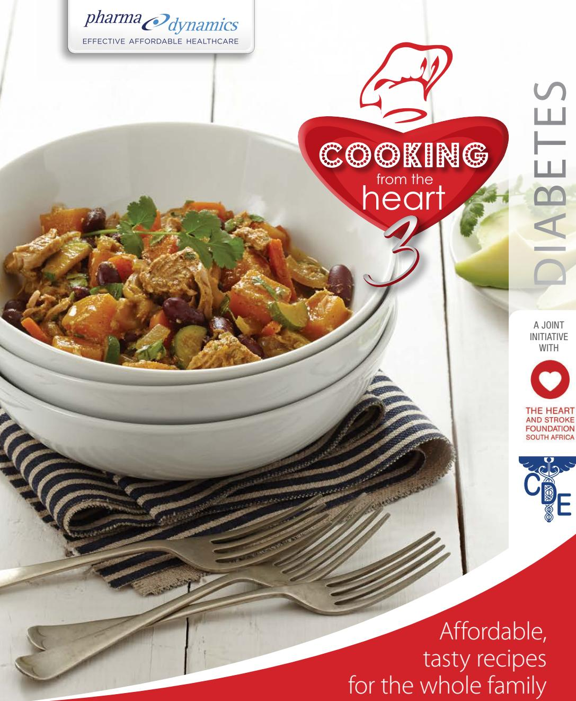

– to sustain energy & suitable for **those with diabetes**

> Compiled by **Heleen Meyer** and **Ashleigh Badham-Thornhill** Photography by **Neville Lockhart** Design by **Natascha Mostert**

## **10 Guidelines** for healthy eating

A healthy lifestyle helps to prevent and manage chronic diseases such as diabetes, high blood pressure, heart disease, stroke and cancer. Remember to keep an eye on your portion sizes, keep physically active and avoid smoking. Also read about the **Plate model** on page 12 and **more on diabetes** on pages 4-11.

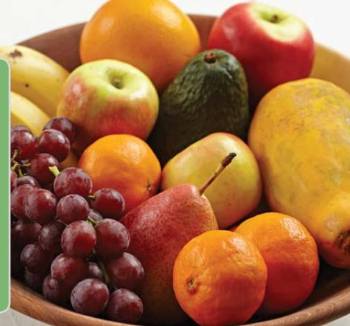

#### Enjoy a variety of foods.

Eating different foods gives your body all the nutrients it needs. The more **colourful** your plate of food is, the wider the variety. Enjoying a variety of foods prevents boredom associated with eating the same food every day. **1**

#### Eat dry beans, split peas, lentils or soya regularly.

They are a good source of **protein**, low in fat and high in **fibre**. You can replace meat in some meals with these ingredients. Keep in mind that these contain both protein and carbohydrates.

#### Eat plenty of vegetables and fruit every day.

Remember to eat vegetables and fruit from the **different colour groups** (red, green, yellow and orange). The **vitamins**, **minerals** and **fibre** in these foods help to protect you against chronic diseases. Enjoy veggies or salad at least twice a day and include about two fruits a day, but don't have too many at a time as the sugar content can be high. Aim for a total of five portions of vegetables and fruit every day and make sure that some of this is raw. **3**

#### Make unrefined starchy foods part of most meals.

These foods can help you feel **fuller for longer** and lower your risk of developing obesity, heart disease and cancer. Good choices are unrefined, unprocessed or wholegrain products, like brown or wholewheat bread, coarse maize (mealie) meal, oats and brown rice. This could also include starchy vegetables like butternut and sweet potato. Remember to enjoy these in controlled portions. **4**

**2**

**5**

**7**

#### Fish, chicken, lean meat or eggs can be eaten daily.

Choose **lean or lower fat options** with less bad (saturated) fats. Bad fats can increase your cholesterol and block your blood vessels, which can lead to a stroke or heart attack. Try to include tinned or fresh fish as part of your diet at least twice a week. Good examples are pilchards, snoek, sardines or tuna.

#### Have milk, maas or yoghurt every day.

Dairy products are an excellent source of calcium. This can help protect your bones, prevent high blood pressure, diabetes, osteoporosis and heart disease. **Good options** are unsweetened, low-fat or fat-free dairy products or reduced-fat cheeses. **6**

#### Use salt and foods high in salt sparingly.

Eating too much salt can raise your blood pressure and increase your risk of stroke, heart attack and cancer. Some salt in your diet comes from salt added at the table or during cooking, but more than half of the salt you eat can come from processed foods. Examples are stock cubes, soup powders, crisps and processed meats like polony. **Gradually cut down** on adding salt and soon you won't notice the difference.

#### Use sugar and foods and drinks high in sugar sparingly. **8**

Too much sugar can make you gain weight, which increases your **risk of chronic diseases**. Sugar in your diet comes from sugar added to cold and hot drinks, cereals and when cooking. High amounts of sugar are also found in cakes, biscuits, doughnuts, sweets, chocolates, sweetened dairy products and sweetened cold drinks. See pages 20 and 24.

#### Use fats sparingly. Choose vegetable oils rather than hard fats.

Eating too much fat and fried food can make you gain weight and raise your cholesterol. For a person with diabetes who also needs to lose weight, this is very important. Limit the amount of fatty red meat, butter, hard margarine, cream, lard and ghee that you use. Rather **use good** (unsaturated) **fats** like oils (canola, olive or sunflower oil) and soft tub margarine in small to moderate amounts. Nuts, seeds, peanut butter and avocados are also sources of good fats. See pages 20 and 24.

#### Drink lots of clean, safe water.

You need about **6-8 glasses** of water a day. Most of this should come from tap water and includes drinks like tea or coffee without any sugar. Remember that fruit juice has a high concentration of fruit sugars which can affect blood sugar levels more drastically, so rather choose fresh fruit. If you do drink alcohol, drink in moderation. **10**

**9**

## **is diabetes** What

In order to better manage diabetes it is important to understand the condition, and why healthy eating forms a key part of managing diabetes. The following pages will give you a basic understanding of the condition and a better insight into practical ways to manage your diabetes.

**Diabetes mellitus**, or simply known as diabetes, is a chronic condition that occurs when the pancreas (an organ in the body) is no longer able to make the hormone insulin, or when the body cannot make good use of the insulin it produces.

**Insulin acts like a key** to allow glucose (the main energy source from food we eat) **to pass from the bloodstream into the muscles and organs.** 

**cell**

**Glucose** is then used as the main source of energy for the body to function. However, the **cells** cannot use glucose without the help of insulin. All foods containing **carbohydrates** (starches and sugars) are broken down in the stomach and travel as glucose in the blood.

Not being able to produce insulin or use it effectively leads to **raised glucose levels**  in the blood, as the body cannot make use of it (known as hyperglycaemia). Over the long-term, **high glucose levels** are associated with **damage to the body**, like your **blood vessels** and **nerves** which may lead to **organ damage**.

**cell**

**bloodstream**

**bloodstream**

**Person** without **diabetes Person** with **diabetes**

#### **There are two main types of diabetes**

**Type 1** diabetes is usually caused by an **auto-immune reaction where the body's own defence system attacks the cells that produce insulin**. The reason for this condition is not quite clear. People with Type 1 diabetes produce very little or no insulin. Before being diagnosed, the person may experience any of the **symptoms of diabetes (***see \****)**. The disease may affect people of any age, but usually develops in children or young adults. Those with Type 1 diabetes need **insulin injections** every day to control the levels of glucose in their blood. Dietary changes to **control carbohydrate intake** is also necessary as carbohydrates affects glucose levels and increases the need for insulin. People with Type 1 diabetes should always have access to insulin in order to survive.

Cooking from the heart **5**

#### **Symptoms of diabetes** include more frequent **urination** (especially at night), **extreme thirst**, increased **hunger**, unexplained **weight loss**, **tiredness** and **loss of concentration**, **blurred vision** and **delayed healing** of wounds and bruises.

**Type 2** diabetes accounts for the majority of people with diabetes. In this case, the **body is resistant to the insulin it produces and/or the body cannot produce enough insulin**. This leads to high blood glucose levels. Type 2 diabetes is often, but not always, associated with being **overweight or obese**. Another reason for developing Type 2 diabetes could be a **family history** of diabetes. People are mostly diagnosed as adults, but lately Type 2 diabetes is even diagnosed in overweight children. Type 2 diabetes may develop gradually over many years as a result of **poor lifestyle choices** that lead to weight gain. The diagnosis is often made when a person experiences **symptoms (***see \****)** or complications, like heart disease or when a routine blood or urine glucose test is done.

If the development of Type 2 diabetes is detected early or even before diagnosis, people are sometimes diagnosed with impaired glucose tolerance or insulin resistance. This can lead to high blood glucose levels and is often referred to as **'pre-diabetes'**. Unless the diet and **lifestyle is improved** this will eventually lead to Type 2 diabetes. If overweight, the **importance of weight loss** at this stage cannot be emphasised enough. People may live with 'pre-diabetes' or Type 2 diabetes for many years without knowing it. This is why regular blood glucose testing is important, especially for those who are overweight. When someone is diagnosed later on with diabetes, they may need to start medication, in conjuction with lifestyle changes, to control their blood glucose immediately.

Once diagnosed, people with Type 2 diabetes may initially be able to manage their condition through a **healthier diet** and doing **exercise**. However, unless well-managed, most people will require oral medication and/or insulin injections after some time. Remember, Type 2 diabetes can get progressively worse over time, unless lifestyle changes are made. Worsening diabets makes it even more difficult for the body to produce insulin and may require additional oral medication and even insulin injections.

**Gestational Diabetes (GDM)** is a form of diabetes consisting of high blood glucose levels during pregnancy. GDM usually disappears after pregnancy, but women with GDM and their children are at an increased risk of developing Type 2 diabetes at a later stage. According to the International Diabetes Federation, approximately half of the women with a history of GDM develop Type 2 diabetes within five to ten years after giving birth.

## Why**should you manage diabetes**

Making changes to your lifestyle can be a challenge at times. If you have diabetes, your healthcare professional can support you to better manage your condition. The most important person in the team, however is still you.

Taking responsibility for your diabetes is the most important decision you can make. This can improve your quality of life and prevent or slow down the development of short and long term complications associated with diabetes.

#### SHORT TERM COMPLICATIONS

When blood sugar levels drop **too low** it is called **hypoglycaemia**. Symptoms of hypoglycaemia include tiredness, weakness, confusion, dizziness and sweating. Symptoms may start at a blood sugar level of **4,0 mmol/l or lower**. This can happen when you don't get enough food like when skipping meals, causing your sugar levels to drop too low. Some diabetes medication may also cause hypoglycaemia if taken in incorrect amounts.

It is important to **treat** hypoglycaemia **immediately** to prevent levels from becoming dangerously low. If the glucose levels are too low you may faint or become unconscious and need someone to help you.

**Hyperglycaemia** happens when blood glucose levels rise **too high**. One of the risks associated with high blood glucose levels occurring on a few consecutive days is that it may lead to the production of ketones. This happens when there is not enough insulin available. Fat tissue is then broken down very quickly for fuel, which results in the production of ketones as a by-product of this process. Ketones can then build up in the bloodstream and lead to a condition called ketoacidosis (more common in people with Type 1 diabetes). Ketoacidosis can be a potentially dangerous situation that can be prevented by managing your blood sugar levels effectively. It may be necessary to check for ketones with ketone strips which you can get from your healthcare professional, or purchase at a pharmacy. If you, however, have symptoms such as nausea, vomiting and cramps, contact your healthcare professional immediately.

#### LONG TERM COMPLICATIONS

These can be the result of **consistently high blood glucose levels** over a long period of time. This can cause **damage** to **blood vessels**, leading to serious diseases affecting the heart, blood vessels, eyes, kidneys and nerves. Other complications can be a higher risk of developing **infections** and **lower limb amputations**.

Maintaining blood glucose levels, blood pressure and cholesterol levels as close to normal as possible can help delay or prevent long term complications of diabetes.

## How**should you manage diabetes**

Every person with diabetes has a unique and individual situation in terms of how they should manage their condition. There are however **three** key questions that anyone with diabetes should always ask: How healthily am I eating? Am I doing regular exercise? What medication am I using? The combination of these three questions is the best way to control and manage diabetes effectively.

HOW HEALTHILY AM I EATING

**Healthy eating habits** and making sure that **portion sizes** are **controlled** is important for all of us. This is even more true for people living with diabetes. It is also quite important to know which foods contain **carbohydrates**, as these have the **biggest effect** on our **blood sugar levels** – something people with diabetes should always manage. Carbohydrates, also known as carbs, include **starches and sugars** in our food. Examples of starches are bread, pasta, rice, pap and starchy vegetables like potatoes and butternut. Sugary foods include sweets, chocolates, cakes, treats, cold drinks and other refined and sweetened products. **Dairy**, **fruit** and

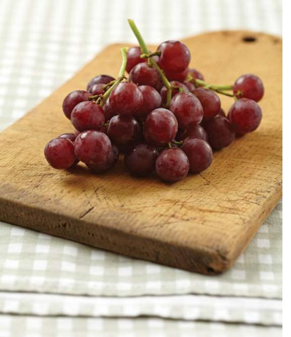

**some vegetables** also contain **natural sugars**. Foods with lots of carbohydrates should therefore be eaten in controlled quantities and **good choices** should always be made, for instance choosing brown or wholewheat bread instead of white bread. It is important to eat foods that will not cause blood sugar levels to rise or fall too drastically. For instance, after eating sweets, you may experience a dramatic rise in blood sugar levels referred to as spiking. In this case your blood sugar levels rise very quickly, but may rapidly drop too low thereafter. Read about good choices on pages 12-18 and 26-29.

Every one of us should follow a healthy lifestyle to support our general well-being. As a rule of thumb, try to **eat a variety** of foods high in **nutritional value** and in appropriate **portion sizes**. This will not only help to improve your health, but will also help to control and manage your blood sugar levels and maintain a healthy body weight.

For people with diabetes, losing weight is particulary important as losing as little as 2-5 kg can have many benefits when trying to manage this condition. The foods we enjoy as part of our personal and cultural preferences, as well as access to healthy food, plays a huge role in what we eat every day. Remember that making good, healthy choices remains vital.

**Limiting sugar** in your diet is highly recommended for people with diabetes. Eating too much sugar often contributes to weight gain, which increases your risk of lifestyle diseases, like diabetes. 'Sugar' doesn't only refer to the sugar added to tea and coffee, but also includes sugar and sweetened products added when cooking and at the table. Look out for hidden sugars in pre-prepared and processed foods, like some breakfast cereals, sweetened drinks, dairy products, sauces and sweet treats. People with diabetes should limit or avoid adding sugar as it can have a negative effect on blood sugar levels. **Rather eat**  healthy foods like **fruit**, **veggies**, **nuts** and **unsweetened dairy** and get into the habit of **reading food labels**, to avoid high levels of sugar and salt. Read about food labels on pages 19-21. See pages 22-23 for practical tips on seasoning food.

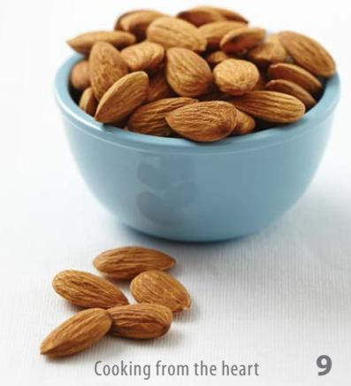

**Well-fitting footwear** and **taking care of your feet** is very important.

AM I DOING REGULAR EXERCISE

Regular physical activity is recommended and can be as easy as taking the stairs and not the lift, walking the dog or walking to the shop instead of driving there. In addition we should aim to do at least 30 minutes of moderate intensity exercise 5 times per week. If you are more fit or

prefer more intense activity, aim for 75 minutes of intense exercise 3 times per week. Try not to have more than two consecutive days of no physical activity. Regular exercise improves heart health, blood glucose control, cholesterol levels and blood pressure, quality of life and aids in weight loss. Physical activity further **reduces** the **symptoms** of **anxiety**, **stress** and **depression**. Ask your doctor's advice or speak to a fitness expert before starting any new exercise programme. Start slowly and gradually increase the time and intensity of your exercise.

**Combining** both **resistance** (like weight training or body weight exercises such as push-ups) and **aerobic exercises** (like running or cycling) may offer benefits in managing diabetes. **Well-fitting footwear** and taking care of your feet is also important. When starting a new exercise programme, ask family, friends and/or colleagues to support you or keep an activity diary to keep you motivated. People with Type 2 diabetes in particular, benefit from exercise as it helps them to lose weight and enables their bodies to make good use of the insulin they do produce. A further benefit of regular exercise is that it helps to lower blood pressure, which is also important for people with diabetes. Lower blood pressure levels could reduce the risk or slow down the development of further problems like eye, kidney and heart diseases.

#### WHAT MEDICATION AM I USING

**Diabetes medications** are important for **lowering blood glucose levels** and keeping these levels **stable**. Different kinds of medication are available and will be prescribed by your healthcare professional, according to your needs. This should always be taken in combination with a healthy diet and regular exercise.

#### Remember, medication can never be the only way to manage diabetes.

There are devices available to measure and monitor your blood glucose levels at home. When your doctor recommends that you use such a device, the results and information will guide your healthcare professional to make the right decisions to help you manage your diabetes. A home blood sugar monitor allows you to evaluate how your blood glucose levels respond to daily activities as well as what you eat, enabling you to manage your diabetes better. Your doctor or healthcare professional may also do an HbA1c blood test as this test gives an overall picture of what your average blood sugar levels have been over a three month period.

Smoking is not recommended for any of us, but even more so for those living with diabetes. Smokers and people exposed to second-hand smoke have a higher risk of heart disease and premature death. Smoking may also **accelerate** the small blood vessel **damage** that is already a high risk in people with diabetes. It is therefore crucial to **quit smoking** when being diagnosed with diabetes.

Lastly it is important to remember that **lifestyle changes** are the most effective way to prevent the onset of lifestyle diseases like diabetes and heart disease. It also plays an important role in managing these diseases effectively together with the appropriate medication.

## **PLATE MODEL** – a practical guide

Use this model to manage and control the portion sizes of the different foods you eat every day. By dividing the

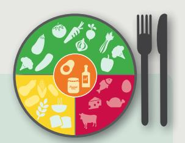

plate into starches, vegetables, proteins and fats, it is easy to determine how much of each food we should eat. See the illustration on pages 14-15.

Eating a **variety of healthy foods** in the **correct quantities** will provide our bodies with enough nutrients – an important step towards a healthy way of eating. This model makes it easier to plan balanced family meals (for anyone older than 2) in the ideal portions. The focus is to have a **balanced plate of food** and **not**, for instance, **too much starch**. Rather increase the portion of non-starchy veg and have a moderate portion of the other foods.

**12 DIABETES**

**Divide your plate as described below:**

#### STARCH

Starch is a carbohydrate-rich food. Carbohydrates are the main source of energy for our body to function properly. It also supports our digestive system by providing enough fibre. **Carbs** have the **biggest effect on blood glucose levels**, therefore **portion control** is important for both meals and snacks. If you need to lose weight as part of your healthier lifestyle, cutting down on portions of excess carbs is beneficial. An active person with a normal body weight can enjoy a slightly bigger portion of carbs, as long as it is burnt as energy. The balance between starch, protein and veg should be managed.

**One quarter of your plate** or about the **size of your fist** is the recommended starch portion size for meals. Examples of starch include **rice, potatoes, pasta, bread, pap, cereals, porridge, rotis or samp.** Wholegrain starches provide additional health benefits and nutrients, including fibre which may slow down the effect that carbs have on your glucose levels. Starchy vegetables like potatoes, butternut, sweet potatoes and mealies also count as carbs.

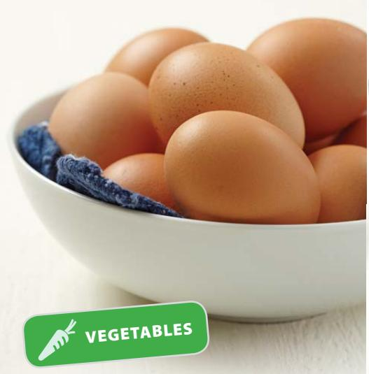

Fill the **largest portion of your plate** with **non-starchy veg** and/or **some fruit**. Nonstarchy vegetables are very **low in energy**, but **high in nutritional value**. These veggies are rich in vitamins, minerals and fibre and other nutrients. When prepared in a healthy way, they don't lead to weight gain. Make your plate appetising by adding a variety of veg with different colours, textures and tastes. Enjoy some of these raw, and avoid serving with sauces and dressings, high in hidden fat or sugar, as these can increase the total energy of your meal, and have a significant effect on your weight. Keep in mind that fruit does contain natural sugars which can affect your blood sugar levels.

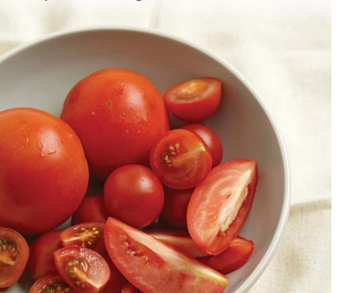

#### PROTEINS

We need proteins for our bodies to repair any damaged tissue, grow properly and function well. Proteins are also important building blocks for muscles. The **recommended protein portion size** for a meal is the **size of the palm of your hand** or a quarter of the plate. Good choices are **meat, fish, chicken and turkey, eggs, beans, lentils, soya and cheese**. Choose lean cuts of meat and remove any visible fat or skin before cooking.

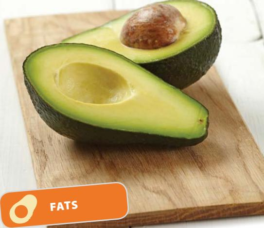

Many people believe we should avoid fats, but it is important to know that our bodies do need **healthy fats** as a valuable source of energy and to function well. Fats are important to help the body absorb fatsoluble vitamins, like vitamin A, D, E, and K. Although fats are needed, we should not eat too much, as fats are very high in energy (kilojoules) that could lead to weight gain. Fats to limit are saturated and trans fats, like in some commercially baked products and animal fats. Rather choose **healthy fats** from **nuts, avocado, olives, seeds and oily fish**.

**VEGETABLES** • Baby marrows • Beetroot

- Brinjal Broccoli Cabbage Carrots
- Cauliflower Celery Cucumber
- Green beans Lettuce Marogo
- Mushrooms Onions Peppers
- Spinach Tomatoes •

**STARCH** • Bread • Brown rice • Lentils • Pap • Pasta • Porridge • Rotis • Samp • Wholegrain cereal •

**STARCHY-VEG** • Butternut • Mealies • • Potatoes • Sweet potatoes •

**FATS** • Avocados • Nuts • Oil • Peanut butter • Seeds •

**PROTEINS** • Beef • Chicken • Chickpeas • Cheese • Eggs • Dried beans • Fish • Lentils • Ostrich • Red meat •

## **MAKING** GOOD **CHOICES**

Eating foods that keep our **blood sugar levels stable** is equally important for us all, including those who have to manage their diabetes.

Some foods have a bigger effect on blood sugar levels than others. The more these levels vary throughout the day, the more we want to eat. This could lead to unnecessary weight gain and ultimately some lifestyle diseases, such as obesity, diabetes and heart disease.

Selecting foods that provide a **slower** and **longer lasting release of energy**, should be the focus. The energy we need mainly comes from carbohydrates and fats. Foods that contain **soluble fibre**, like **legumes**, **sweet potato**, **oats** and oat bran, are great to keep blood sugar levels stable. Foods like these are known for having a **low GI (glycaemic index)** as they cause a more controlled and/or sustained release of energy into the bloodstream. These also include complex and unrefined carbs, like **wholewheat bread** and **brown rice,**  which cause a **slower rise** in your blood sugar levels compared to more refined carbs. Note that **low GI foods** are however **not lower in carbs** than a high GI version of the same food. Portion control is therefore still important. For instance low GI bread has the same amount of carbs as regular bread, but is the better option as it will increase blood sugar levels at a slower rate than regular bread. **Food labels** may often indicate whether food is low GI or not and is helpful in making better food choices. See page 19 for more about food labels.

Starchy foods, like pasta, rice, potatoes, bread and pap contain a lot of carbs and are often consumed in too large portions. People often underestimate how much of these foods they eat, due to the way it is served. For instance pasta is often eaten in a large portion – usually the equivalent of six slices of bread. The combination of more than one type of starch, e.g. potatoes and bread, at a meal, also contributes to eating too many carbs.

A healthier way of eating does not only mean avoiding foods like sugary and refined treats, but also including ingredients known for their nutritional value and health benefits. These include fresh fruit and veggies, nuts and seeds, oats, legumes, healthy fats (like avocado) and lean proteins (like eggs and chicken). Eating these foods will not only help to manage your blood sugar levels, but provide the body with important nutrients like minerals, vitamins and fibre.

**Example**

 The amount of carbs in a **medium apple** is **almost equal** to a **30 g packet of crisps**, but the nutritional value of the **apple is far higher.**

**Here are a few examples of how you can choose better starchy foods to include in your meals to improve your blood sugar control:**

# choose **better** options

**Raw, unsalted nuts and seeds** Chips and other salty snacks Wholewheat bread or low GI brown bread or wrap White bread or white wrap

**instead of** Sweet potato, in the skin Potato, peeled **Brown rice** White rice **Oats** Boxed cereals or muesli Lentils and legumes White rice, pasta or pap **Seasonal fruit** Sweets and chocolates Avocado on a sandwich Cheese and jam on a sandwich

## **Cooking from the heart tip**

**Use the Plate model** to control your portions and to make better choices. This is just as important when eating out. See page 12 for more information.

## **Cooking from the heart tip**

Only **eat one carb at a meal**, rather than combining them, and fill your plate with non-starchy, low-carb veggies.

#### **Foods and ingredients to take note of:**

#### DIABETIC PRODUCTS

Flavour is often added to processed and pre-prepared foods in the form of sugar, salt and fat. Limiting one of these three often results in a higher amount of one of the other two. This makes it very important for a person with diabetes to read the label of any product - especially those marketed as sugar-free, sucrose-free, suitable for diabetics or with no sugar added. This is often the case with some sweet treats like chocolates, jam, biscuits, ice cream and foods like cereals, salad dressings and sauces. These may be sweetened with other types of sugars which may also negatively affect your blood sugar levels (see page 21 for a list of different names for sugar used in foods). Higher levels of fat or salt added to replace the flavour of sugar is also not good for you. There is no need for 'special' diabetic products if a *Cooking from the heart* way of eating is followed, using unprocessed, fresh ingredients and healthy cooking methods.

#### DRINKS AND ALCOHOL

**Many drinks include more sugar than we may think**. This includes drinking yoghurts, flavoured milk, fruit juices, fizzy, energy and powdered drinks, cordials, and waters, iced teas and warm drinks like hot chocolate. These may cause your blood sugar levels to rise unexpectedly. Remember to read the label of so-called diet, low sugar and sugar-free drinks.

If you do drink alcohol, remember to always do so in **moderation** and plan to enjoy it with a meal. People with diabetes should note that alcohol, like beer or cider, could contain carbs and cause their blood sugar levels to rise too drastically. Alcohol taken with medication or without eating can cause your blood sugar levels to drop too low (see page 7 on hypoglycaemia). Avoid alcoholic drinks that are high in carbs and sugar. Rather choose dry wine or spirits mixed with water or soda water.

#### ARTIFICIAL SWEETENERS

Artificial sweeteners are available, either to add to food and drinks or to sweeten preprepared and processed ingredients. Foods containing artificial sweeteners may still have sugar or other types of carbohydrate, such as flour, in them, so you need to look carefully at the food label. A practical tip is to reduce your sugar intake and wean yourself off the habit of eating sweet foods regularly. See page 24 for ideas on using less sugar.

### **UNDERSTANDING FOOD LABELS**

Making a habit of always reading food labels and knowing what is in your food, will benefit the whole family.

Food labels look different and provide different information, but if you know what to look for and what it means, it makes it so much easier to understand. Use this **2-step guide** to read food labels.

#### STEP 1: **READ THE PANEL** STEP 1: **READ THE PANEL**

The **Nutrition Information Panel** on the next page can help you decide if a product is a healthy option or not. A label usually indicates this **information in two columns**. The **value per 100 g** of food and the **values per suggested serving size** are listed. Labels normally indicate the **energy**, **protein**, **fat**, **carbohydrate**, **sugar** and **sodium (salt)** in food. General guidelines for the ideal amount of each nutrient have been suggested on pages 20-21. The serving sizes will differ between products, so the best way to compare foods is to **look at the 'per 100 g' column**.

Those who inject quick acting insulin before meals and snacks need to be aware of the carb value of food. We call this **carbohydrate counting**. If you are carb counting, it is important to look at the total or glycaemic amount of carbs (indicated in grams per serving) that you are going to eat. If you are using carb exchanges then **1 exchange is equal to about 15 grams of carbohydrate**.

#### STEP 2: **READ THE LIST OF INGREDIENTS**

Ingredients are listed in **order of highest to lowest** quantity in a specific food (see the examples on page 21). Often the **first three** ingredients indicated on the label make up the largest portion of the food. Look out for added sugar, fat and salt. Bear in mind that sugar is often added to most products. If fat or sugar is at the top of the list, the product may not be a good choice. Refer to the **Nutrition Information Panel** if you are unsure of the quantities. Also remember to look at the **total amount of carbohydrates** in the food, especially important for those with diabetes.

### how to read the nutrition information panel

|  |      |                            |                                                                                                                                                         | CARBOHYDRATES | Total or glycaemic amount Sugars |                  | To calculate how many exchanges or servings are in the food, divide total carbs per serving by 15. For example 30 g carbs = 2 exchanges or 2 servings Limit foods high in added sugar Aim for less than 5 g per 100 g Note: Ignore the grams of sugar on the Nutrition Information Table as it is included in the grams of total or glycaemic carbohydrates |
|--|------|----------------------------|---------------------------------------------------------------------------------------------------------------------------------------------------------|---------------|-------------------------------------------|------------------|----------------------------------------------------------------------------------------------------------------------------------------------------------------------------------------------------------------------------------------------------------------------------------------------------------------------------------------------------------------------------------------|
|  |      |                            |                                                                                                                                                         |               | SERVING SIZE                              |                  | Note: The serving size on the label may not be the ideal portion size. Always look at the 'per 100 g' column to compare products                                                                                                                                                                                                                                           |
|  |      |                            |                                                                                                                                                         |               |                                           |                  |                                                                                                                                                                                                                                                                                                                                                                                        |
|  |      |                            |                                                                                                                                                         |               |                                           | DIETARY FIBRE | Aim for 3 g or more per serving                                                                                                                                                                                                                                                                                                                                                     |
|  |      |                            |                                                                                                                                                         |               |                                           | m)               | Aim for less than 120 mg                                                                                                                                                                                                                                                                                                                                                               |
|  | FATS | Total Saturated         | Aim for less than 10 g per 100 g For milk and yoghurt aim for less than 2 g per 100 g Aim for less than 3 g per 100 g or as low as possible |               |                                           | SALT (Sodiu   | per 100 g (see table on page 21)                                                                                                                                                                                                                                                                                                                                                    |
|  |      | Trans and use sparingly | Aim for less than 1 g per 100 g Oils and margarines are high in fat. Choose poly- and monounsaturated varieties                                   |               |                                           |                  |                                                                                                                                                                                                                                                                                                                                                                                        |
|  |      |                            |                                                                                                                                                         |               |                                           |                  |                                                                                                                                                                                                                                                                                                                                                                                        |

### how to read thelist of ingredients

#### **Example 1:**

### **Chocolate digestive biscuits**

INGREDIENTS: wheat flour, sugar, margarine (contains animal fat), milk solids non-fat, flavours, chocolate

REMEMBER THAT SUGAR, FAT AND SALT CAN BE LISTED UNDER DIFFERENT NAMES. HERE ARE SOME TO LOOK OUT FOR ON A LABEL.

**Sugar** brown sugar, concentrated fruit juice, corn syrup, dextrose, treacle, fructose, glucose, glucose syrup, golden syrup, honey, invert sugar, lactose, malt, malt extract, maltose, isomaltose, maltodextrin, maple syrup, molasses, raw sugar, sucrose, sugar, cane sugar

**Fat** animal fat, beef fat, butter, chocolate, carob, coconut oil, cream, dripping, ghee, hydrogenated oils, lard, margarine, milk solids, monoglycerides, palm oil, seeds, nuts, coconut, tallow, shortening, trans fats, vegetable fat

**Salt** baking soda, salt, MSG (monosodium glutamate), any word containing the term sodium, nitrates, nitrites

#### **Example 2: Wholewheat bread**

INGREDIENTS: white bread flour, wholewheat flour, rye meal, yeast, gluten, salt, vinegar, vegetable oil, soy flour, oat bran, cultured whey, sugar, vitamin (thiamine), emulsifiers (481, 472(E), 471) water

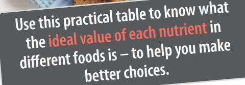

| Nutrient Per 100 g of food | Fat   | Saturated fat | Sugar | m) Salt (Sodiu |
|----------------------------------|-------|------------------|-------|----------------------|
| Low Eat more often         | < 3g  | < 1,5g           | < 5g  | < 120mg              |
| Medium Eat seldom          | 3-20g | 1,5-5g           | 5-15g | 120-600mg            |
| High Avoid                    | > 20g | > 5g             | > 15g | > 600mg              |

< stands for less **than** > stands for more **than**

## KITCHEN In your

#### GUIDELINES WHEN COOKING

Living a healthier lifestyle may seem daunting, but making a few changes can make all the difference. Start with your choice of ingredients, seasonings and cooking methods to make sure that you **eat as healthily**, **fresh** and **unprocessed** as possible. This does not mean buying expensive ingredients. There are lots of really healthy meals that can be made with everyday ingredients. If you run out of ideas, just use the recipes in this book.

When planning a meal that should keep you feeling fuller for longer or to be ideal for people with diabetes, there are a couple of choices that can determine how healthy the meal is. What you choose and how you decide to prepare it is a good starting point, and could have a positive effect on your blood sugar levels. Always keep your **Plate model** in mind (see page 12).

#### CHOICE OF COOKING METHODS

The flavour of a dish does not only depend on the ingredients and seasoning – your choice of cooking method can definitely enhance the flavour of a dish. For instance, when making a stew, ingredients that are pan-fried at the beginning, add a lot of flavour when compared to those that are just boiled together. Choose cooking methods that don't need a lot of fat or oil. Good options are **steaming**, **grilling**, **roasting**, **stir-frying**, **dry-frying**, **pot-roasting**, **baking** and **boiling**. If you are unsure, choose a cooking method from any of the recipes from the series of *Cooking from the heart* recipe books.

## Follow these **7-steps** to a healthier meal The *Cooking from the heart* way is to choose

Choose the **protein-rich food** for the meal.

**1**

**2**

**3**

**4**

**5**

**6**

**7**

Decide what the **end result** should be, e.g. is it a protein with a separate starch and veg, or a one-pot meal?

Decide on the **starch for the meal,** remember this can even be a starchy vegetable like sweet potatoes or butternut – a better choice than white rice or potatoes.

Choose **more fresh fruit and veg** and decide if they will be part of the main dish or served as a side or salad.

Before you start cooking, determine your **portions correctly** so that you have the right amount of food for the size of your family. If you are unsure, you can follow the portions indicated in each of the recipes in this book. See the Plate model on page 12.

Choose a **cooking method** as explained on page 22.

Decide on a **fat or oil best suited**  for the meal, where necessary. Sometimes you will use this to prepare the food and with other dishes it will be an accompaniment, like avocado or a salad dressing.

#### CHOICE OF INGREDIENTS AND SEASONINGS

fresh ingredients and seasonings for the healthiest and tastiest results. Salt is definitely not the only ingredient that can add flavour to food. A high intake of salt is associated with some lifestyle diseases, like high blood pressure and heart disease, and should therefore be limited. Ideally, we should not eat more than 5 g of salt per day (1 teaspoon or 5 ml).

#### A **teaspoon of salt** 5 g salt = 2000 mg sodium

**Salt** is made up of sodium and chloride, with sodium being the part that can increase your blood pressure when you eat too much of it. Look out for sodium and salt on food labels.

There are **three ways** to **manage** our **salt intake**: • **Eat less foods containing hidden salts** like bread, processed meats and sausages, breakfast cereals, savoury snacks and some sweet treats. • Use **less salt when cooking.** • **Avoid adding salt at the table**. See page 19 to understand why it is important to read food labels.

**Salty, processed ingredients** such as soup powders, polony, stock cubes, salty seasonings, sauces and spreads should not be part of our everyday meals. Instead, enjoy the natural flavours of **ginger**, **chilli**, **garlic**, **lemon**, **onion**, **fresh** and **dried herbs** and salt-free spices like **paprika**, **coriander**, **curry** and **cumin**.

**Sugar** is often used as a seasoning in cooking, we should however avoid this, especially those with diabetes. Take care when choosing ingredients, as sugar, like salt, can also be hidden in many preprepared and processed foods. Rather add a fresh, **naturally sweet ingredient** for that extra flavour. Try fruit or veggies like sweet potato or carrots, or a spice with a sweeter taste like cinnamon or mixed spice.

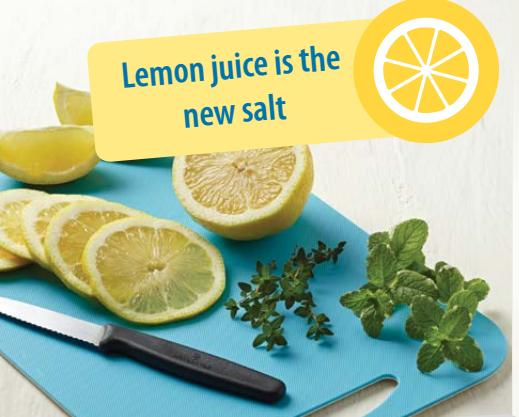

#### CHOICE OF FATS AND OILS TO COOK WITH

When cooking with oil, remember to **measure it with a measuring spoon**, instead of just pouring it. Use oils like olive, sunflower or canola oil. Avoid overheating any of these oils to prevent them from forming harmful substances and losing important nutrients in the food you are preparing.

When oil is **over-heated** it **starts to smoke** in the pan – this should never happen.

**Cooking from the heart tip**

Keep a ½ tsp **(2,5 ml)** measuring spoon in your salt dish to know how much you are adding, rather than just grabbing the salt shaker. **Cooking from the heart tip**

1 tsp stands for **1 teaspoon** = 5 ml 1 tbsp stands for **1 tablespoon** = 15 ml

## MAKE A SHOPPING LISTto help you plan your meals.

Refer to the Plate model on page 12 to make good choices of the ideal portions of vegetables, starch, fats and protein. Here is a list of useful store cupboard ingredients and fresh seasonings.

#### FRESH

N Chillies and lemons N Fresh garlic and ginger N Fresh herbs, like parsley, coriander, mint, rosemary or thyme

#### DRY

- N Bay leaves
- N Black pepper
- N Brown rice
- N Cayenne pepper
- N Coarse mealie meal
- N Curry powder
- N Dried beans
- N Dried herbs, like mixed herbs, origanum or thyme
- N Dried lentils
- N Ground cinnamon
- N Ground coriander
- N Ground cumin
- N Oats and oat bran

- N Paprika
- N Peanut butter (choose one without added sugar and salt)
- N Pitted dates
- N Popcorn kernels
- N Prepared mild mustard
- N Raisins
- N Raw unsalted nuts, like almonds or peanuts
- N Rooibos tea
- N Sunflower or pumpkin seeds
- N Sunflower, canola or olive oil

- N Tinned beans or legumes, like chickpeas, butter beans or lentils
- N Tinned fish, like tuna in brine or pilchards
- N Tinned tomatoes
- N Vanilla essence
- N Vinegar, like balsamic, red or white wine
- N Whole spices, like cloves or cinnamon sticks
- N Wholewheat flour

## **portion c ntrol**

Being able to control the portion size of foods and your meal in total is an effective way to manage body weight and blood glucose levels. This is true for everyone, not only those managing diabetes.

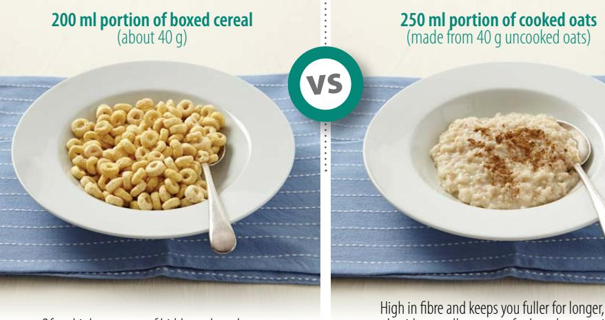

Often high amounts of hidden salt and sugar and refined carbs.

Try not to skip meals, especially breakfast, as it can lead to being too hungry later on, due to your body struggling to keep your blood sugar levels stable. Depending on your diabetes and recommendation from your healthcare professional, rather aim to eat balanced meals in the **right portions**  throughout the day. It is also important for all of us that each meal contains a controlled amount of good carbs. Always remember to follow the basic guidelines of the Plate model on page 12.

Making good choices doesn't always mean you can eat more of a specific food, e.g. bread. A similar portion of a healthier choice of food may however be more

High in fibre and keeps you fuller for longer, cook with a small amount of salt and serve with fresh fruit and cinnamon or low-fat milk.

filling without adding more carbs to your meal, like oats instead of boxed cereal (see example above). When snacking, don't be tempted to finish a 100 g packet of nuts, rather eat 30 g (30) raw almonds. Dried fruit has a high concentration of sugar, so enjoy a smaller amount, like 5 dried apple rings or 2 tbsp (30 ml) raisins. A good snack could be a fresh apple with 1 tsp (5 ml) peanut butter. If you do enjoy cereal bars as a snack, the typical 40 g bar may contain too many carbs. Rather opt for half the bar, or share with a friend.

The following pictures will further help you to choose the **SMARTER** portion sizes of a variety of foods.

**regular portion**

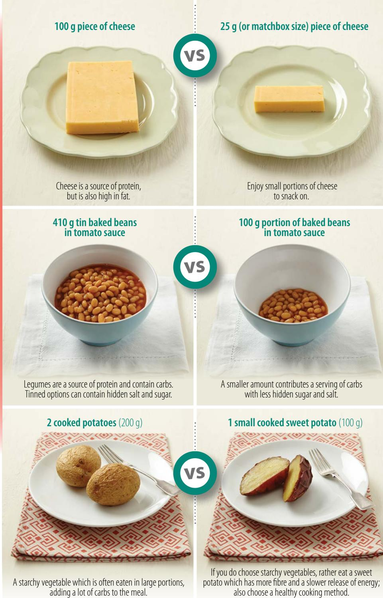

**smarter portion**

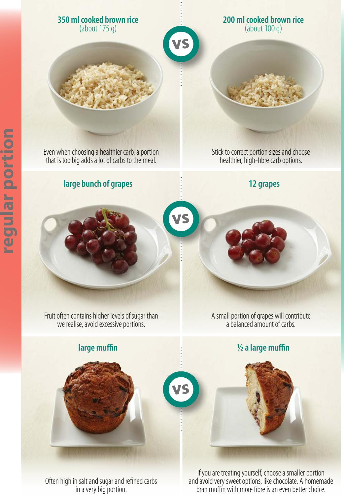

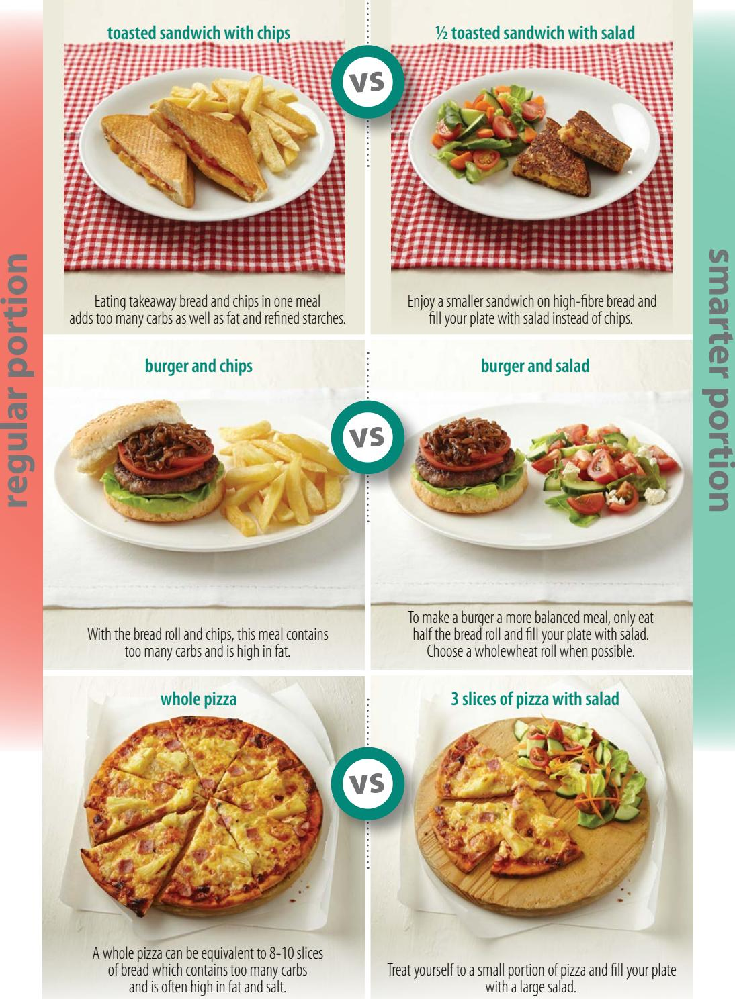

Nutritional info **per portion** Energy **1 447 kJ** Protein **40,1 g** Fat **12,6 g** Carbohydrates **13,4 g** Salt **1,1 g**

## **NUTRITIONAL INFORMATION**

Eating in moderation and choosing a variety of foods is a good way to eat healthier. Food is divided into different groups, making it easier to understand the nutritional value of each food. The main groups are protein, fat and carbohydrates (starches and sugars), all contributing to the energy (kilojoules) we get from our food. It is important for all of us, especially people with diabetes, to bear this in mind when planning meals so that energy does not only come from one nutritional group.

Every recipe in this book indicates the nutritional value of one portion of that specific dish. This is helpful for those people who use a detailed nutritional breakdown as one of the tools to manage their diabetes. Knowing what the meal consists of, will enable them to make better choices and choose the correct portions in order to manage their blood sugar levels and weight.

## **CARBOHYDRATE KEY**

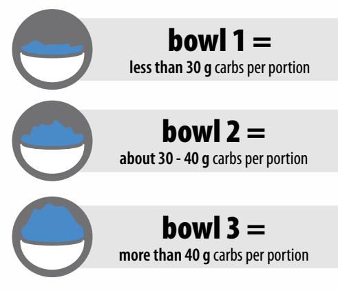

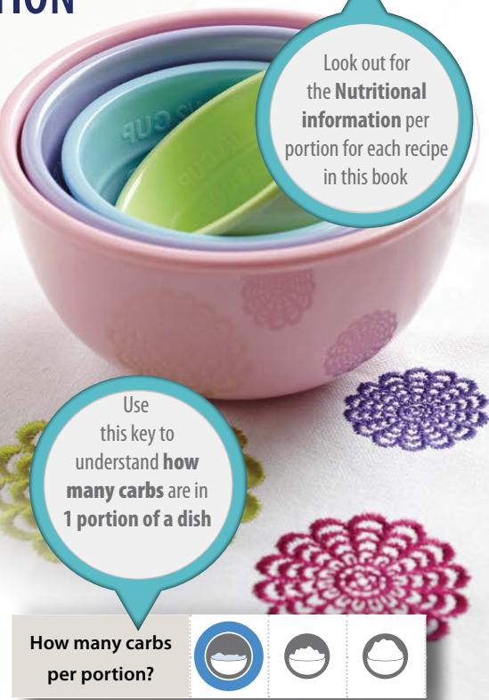

Carbohydrates are our main source of energy, but eating too much can cause weight gain, obesity and lifestyle diseases, like diabetes. Knowing how many carbs are in a meal makes it so much easier to manage your intake. Every recipe in this book indicates the amount of carbs measured in grams per portion. This will help you to calculate how many carbs are in a dish and to know how many portions of carbs the rest of your meals for the day can include.

**NOTE:** Some recipes may indicate '**bowl 1**', but are close to the range of '**bowl 2**'. Follow the recommended portions.

## **breakfast ideas** 'The most important meal of the day'

Breakfast might not be the biggest meal of the day, but it is definitely the most important meal of the day. Never skip breakfast, even if you only have something small, as it will get your metabolism going to ensure that you are full of energy for the rest of the day. This is true for everyone, but even more important when you need to manage your blood sugar levels. The healthier and more balanced the breakfast, the better you will feel and be able to function during the day.

Make sure that breakfast is interesting and full of flavour so that you are not tempted to skip it. A balanced breakfast is important and a good variety of foods are available to choose from – you definitely do not need to eat the same cereal every morning. A practical guide is to always include a protein, good choice of starch and fresh ingredients (see the Plate model on page 12). Breakfast should keep you feeling full enough until your next meal, so make good choices.

Portion sizes remain a crucial factor as eating too much is just as problematic as eating no breakfast at all. Remember to read the food labels of any ingredients you choose. Foods like boxed cereals or pre-prepared choices can be very high in sugar, salt, fat and refined carbs.

The following pages have some broad ideas suggesting good combinations. There are no quantities indicated, as this will depend on what you are going to eat for the rest of the day and what your healthcare professional recommends as the best foods for your individual needs.

#### PILCHARDS IN TOMATO SAUCE

Tinned pilchards in tomato sauce, served with a slice of wholewheat or health bread and fresh tomato wedges. Enjoy with papaya slices.

#### AVO ON TOAST

A slice of health or wholewheat bread, toasted and spread with crushed avocado, seasoned with lemon juice. Enjoy with low-fat or fat-free unsweetened yoghurt and a small portion of fresh fruit salad.

#### PEANUT BUTTER TOAST

A slice of wholewheat or health bread, spread with peanut butter. Serve with a glass of lowfat or fat-free milk and seasonal fruit.

#### MUESLI AND YOGHURT

Low-fat or fat-free unsweetened yoghurt with some low GI muesli. Sprinkle with a small amount of raw almonds or pumpkin seeds and enjoy with a sliced apple or pear, or berries when in season.

#### SCRAMBLED EGGS WITH MUSHROOMS

Scrambled eggs, cooked in very little oil and seasoned with fresh herbs. Enjoy with stir-fried mushrooms and tomatoes on health or wholewheat bread. Serve with grapes or an orange.

#### OMELETTE

Make an omelette with spinach and a small amount of cheese. Cook in very little oil and serve with avocado slices.

#### SARDINES WITH TOMATO

Tinned sardines, drained and flaked, served on a slice of wholewheat or health bread and fresh tomato wedges. Serve with seasonal fruit, like peaches or plums.

#### CEREAL AND FRUIT

Low-fat unsweetened high-fibre cereal with low-fat or fat-free milk. Serve with seasonal fruit, like an apple, pear, banana or some berries. Sprinkle with a small handful sunflower seeds or raw almonds.

#### OATS WITH FRUIT

Cooked oats with low-fat or fat-free milk, served with slices of banana, strawberries, mango or papaya and a sprinkle of cinnamon.

#### BAKED BEANS AND EGG

Fry an egg in very little oil and serve on warm baked beans, seasoned with paprika, with slices of avocado. Enjoy with fresh fruit.

When you feel like snacking, choose one of the suggestions from the following pages. Consider what you have eaten at the previous meal and what the next meal will be, to enjoy a **variety** and good **balance** of food **throughout the day.** Be creative, but always follow the *Cooking from the heart* guidelines for a healthy way of eating, as explained in this book.

#### AVERAGE PORTION SIZE FOR A SNACK:

• Any fruit the size of one closed fist • 1 cup (250 ml) cut fruit • 10 small grapes or strawberries • 1 small banana • 2 small plums or apricots • 1 cup (250 ml) low-fat or fat-free milk • 1 cup (250 ml) plain or fat-free unsweetened yoghurt • 100 ml low-fat sweetened yoghurt

## **snack ideas** 'The inbetweeners'

Snacking is something we all love to do and even when following a healthy lifestyle, there are plenty of healthy options to choose from. The important thing is to know why you are snacking, what you choose to eat, how much you eat at a time and how often you feel like nibbling. This is true for all of us – even if you don't have diabetes. People with diabetes are not encouraged to snack too much and only if they really have to, so that their blood sugar levels do not rise suddenly (spike) or fall too quickly again.

Only snack when it is really necessary. Ask these questions to know why you want to snack: Am I really hungry or is it just a habit? Are my blood sugar levels dropping between meals or have I been advised to snack at times?

The best way to know if a snack is necessary, is to monitor your blood sugar levels on a regular basis. There are situations when it is a good idea to snack. If you are extremely hungry and don't want to overeat at the next meal, a snack could be a good idea. People with diabetes should rather choose a carb-free snack or a protein-based option, so that their blood sugar levels remain stable. Before or just after exercising, a person with diabetes could find that a snack helps to prevent their blood sugar levels from dropping. With some prescribed diabetes medication your doctor may recommend a snack at certain times of the day. Speak to your doctor to know when snacking is really necessary.

If you find that you often have to snack between meals, try to determine what the reason is. Maybe your meals are not the right choice of foods to keep you full till the next meal. Or maybe the meals are too small in size. It is better to enjoy a meal that will keep you full enough, than developing a cycle of eating too little at meal times and then snacking on foods, high in kilojoules, but low in nutritional value. This could lead to weight gain as well as unstable blood sugar levels. If you have diabetes, speak to your healthcare professional to make sure that your medication is correct. When you do snack, choose something that will form part of a balanced, healthy way of eating and in small to moderate portions.

#### SNACKS THAT ARE ALMOST CARB-FREE

Take care not to overeat on these, just because they are carb-free. Snacks like olives, cheese and biltong can be very high in salt.

• Cherry tomatoes, carrots, cucumber or celery sticks with **low-fat cottage cheese**• Small handful unsalted **raw nuts or seeds** • Olives • **Avocado** or guacamole dip with veggies like cucumber, celery or tomatoes • Biltong snapsticks • Small piece of low-fat cheese

#### QUICK IDEAS:

•**Season** low-fat cottage cheese with some wholegrain mustard or fresh or dried herbs of your choice. • **Coarsely** crush avo and stir in chopped tomato, fresh coriander or parsley, lemon juice and a pinch of paprika.

#### SNACKS WITH LESS THAN 10 g OF CARBS

• 2 wholewheat crackers topped with low-fat cottage cheese, cheese or peanut butter (remember to read the label of the crackers and peanut butter) • ¼ cup (60 ml) fresh **berries** • Small unsweetened yoghurt •**Cheese and fruit skewers:** combine cheese with grapes, strawberries or any seasonal fruit •**Cheese and veggie skewers:** combine pieces of cucumber, tomato or mushrooms with cheese • **Homemade popcorn** seasoned with a pinch of salt and dried herbs

#### QUICK IDEA:

•**Slice** 2-3 apples with the skin in thin slices, place on a baking tray and dry at 100 ˚C for 20-30 minutes or until dried to your preference. Enjoy 5 slices as a snack and keep the rest in an airtight container.

#### SNACKS WITH 10-20 g OF CARBS

• 1 small **apple or orange** • 1 cup (250 ml) homemade vegetable **soup**  • 2 rice cakes with a 1 tbsp (15 ml) **crunchy peanut butter** (remember to read the labels of these products) • ½ a **wholewheat sandwich**, spread with low-fat cottage cheese and filled with tuna or left-over chicken, lettuce and cucumber • 3-4 wholewheat crackers with low-fat cheese (read the labels of these products) • 1 cup (250 ml) milk or **low-fat unsweetened yoghurt** • **1 boiled egg** with 3-4 wholewheat crackers

#### SNACKS WITH 20-30 g OF CARBS

• **1 small bran muffin** (preferably low GI and homemade) • Cereal bar (check label for carb, sugar, salt and fat content) • ½ cup (125 ml) low-fat unsweetened yoghurt **with a banana or berries** • Wholewheat sandwich with slices of tomato, cucumber and avocado with a drizzle of lemon juice and black pepper

#### QUICK IDEA:

•**Mix** 2 tbsp (30 ml) peanut butter with ¼ cup (60 ml) lowfat cottage cheese as a dip or spread with veggie sticks.

**39**

#### QUICK IDEA:

• For a **smoothie** blend ½ cup (125 ml) cubed seasonal fruit, with ½ cup (125 ml) low-fat unsweetened yoghurt or milk for a smoothie. Try papaya, banana, strawberries, mango, peaches, pineapple and pear. For an interesting flavour, add a piece of ginger or fresh mint, lemon juice or ground almonds. Add 1 tbsp (15 ml) uncooked oats or ground almonds to make it more filling.

## **one-pot meals** 'For the whole family'

Suppertime is family time and a great opportunity to encourage everyone in the family to enjoy healthy meals. With busy schedules, cooking supper is often neglected and yet such an important daily meal. Takeaways and pre-prepared foods may be convenient, but homemade is always best.

When meals are cooked at home, using fresh ingredients and a good choice of cooking methods, it is so much easier to control the amount of fat, sugar, salt and carbs that we eat. Fast food can very quickly become 'fats' food, as these are often high in fat and carbs and flavoured with lots of salt and/or sugar. Supper is often the biggest meal of the day, but we should all try to make this a healthy meal and also not eat too much just before going to bed.

This selection of delicious recipes are all one-pot meals, making it easier to cook weekly family meals. A one-pot meal does not need many other dishes served with it, maybe just a salad or some fruit, so it saves you time and effort. The following recipes all have enough or some carbs included, which make them healthier already, as we are not tempted to eat too many additional carbs with it – something that is important for all of us, but especially those family members with diabetes. Choose a recipe and look at the suggested side dishes to make it easy to serve a balanced and healthy meal to your family. Rather enjoy a satisfying portion of a dish, than filling up unnecessarily with carbs. Each recipe also indicates the amount of healthy portions and carbohydrates it serves.

#### TUNA & BEAN HOT POT

Tuna is a healthy and affordable source of lean protein and this meal is perfect to enjoy in a bowl – to warm you up.

**2 tbsp (30 ml) desiccated coconut 200 ml low-fat milk 1 tbsp (15 ml) olive or canola oil 2 onions, coarsely chopped 3 carrots, halved and sliced 3 baby marrows, halved and sliced 4 tsp (20 ml) curry powder or to taste 4 tsp (20 ml) ground cumin 2 tsp (10 ml) paprika 300 g butternut, peeled and cubed 1½ cups (375 ml) Rooibos tea or water 1 small red chilli, whole (optional) 1 x 410 g tin red kidney beans, drained 2 x 175 g tins tuna, with the liquid ½ tsp (2,5 ml) salt lemon juice and black pepper to taste handful fresh coriander leaves, chopped** **1.** Mix the coconut into the milk and allow to stand.

**2.** Heat the oil in a large pot over a medium heat and fry onions, carrots and baby marrows for a few minutes.

**3.** Add spices and butternut and fry until aromatic. Reduce the heat and stir in the tea or water with the chilli. Simmer with the lid for 20 minutes or until the veggies are just cooked.

**4.** Add beans, tuna with the liquid, coconut with the milk and salt. Simmer for another 5 minutes or until heated through.

**5.** Season with lemon juice and pepper. Stir in chopped coriander and garnish with more fresh leaves.

**Serve** in bowls with slices of avocado. This dish has enough carbs to fill you up, so it is not necessary to serve with more carbs. Enjoy with a green salad.

> **1. If** preferred, add another 50-100 ml milk with the coconut for a saucier hot pot.

**42 DIABETES**

**Tip**

#### VEGGIE & MINCE 'LASAGNE'

Veggies are layered instead of pasta, making a tasty and equally filling meal. The buttermilk topping is a great way to reduce the cheese – do try it.

**2 tbsp (30 ml) olive or canola oil 500 g lean beef or ostrich mince 1 large onion, chopped 2 celery stalks, finely chopped 2 baby marrows, coarsely grated 1 tsp (5 ml) paprika 2 tsp (10 ml) ground coriander 2 tsp (10 ml) dried origanum 2 x 410 g tins chopped tomatoes 1 tsp (5 ml) Worcestershire sauce 6 tbsp (90 ml) chopped fresh parsley lemon juice and black pepper to taste 1 medium brinjal, thinly sliced lengthwise 3-4 spinach leaves 300 ml buttermilk 100 ml grated cheddar cheese**

**1.** Heat 2 tsp (10 ml) of the oil in a large saucepan. Fry mince until brown.

**2.** Spoon out the mince. Add another 1 tsp (5 ml) oil and fry onion until soft. Add celery and baby marrows and fry for a few minutes. Add paprika, coriander, origanum, tomatoes and Worcestershire sauce.

**3.** Stir in the mince. Simmer for 30 minutes with a lid. Add 4 tbsp (60 ml) of the parsley and season with lemon juice and pepper. **4.** Meanwhile, preheat the oven to 180 ˚C. Place brinjal on a baking tray and brush on both sides with remaining oil. Roast for 15 minutes until golden and cooked.

**5.** Spoon half of the mince into a deep oven dish. Cover with spinach. Spoon remaining mince on top and cover with a layer of brinjal.

**6.** Mix buttermilk, remaining herbs and cheese and spread over the brinjal. Bake for 20 minutes or until golden and cooked. **Serve** with a tomato salad with fresh herbs or lightly cooked green veggies.

**1. Use** the veggies on page 57, instead of the mince, to make a vegetarian lasagne. **2. To** make sure that the buttermilk topping covers the dish completely, rather use a deeper than wider oven dish. **Tips**

Cooking from the heart **43**

Nutritional info **per portion** Energy **1 614 kJ** Protein **38,3 g** Fat **16,7 g** Carbohydrates **16,1 g** Salt **1,2 g**

**Serves Ready in 6** 1 hour 45 mins **How many carbs per portion?**

**1 x 410 g tin chopped tomatoes ½ cup (125 ml) strong Rooibos tea ½ cup (125 ml) uncooked red lentils lemon juice and black pepper to taste 750 g butternut, peeled and cubed ¼ tsp (1,2 ml) salt**

**1.** Heat half the oil in a large saucepan and fry mince until brown. Spoon out.

**2.** Heat remaining oil in the same pan and fry onions, carrots and mushrooms until soft. Add mixed herbs, coriander, mustard, mince and tomatoes. Reduce

the heat and simmer over a low heat, with a lid, for 20 minutes.

**3.** Add tea and lentils and simmer with the lid for another 15- 20 minutes or until lentils are soft. Season well with lemon juice and pepper.

**4.** Preheat the oven to 200 ˚C. Meanwhile, place butternut and salt in a pot with ¾ cup (180 ml) water. Bring to a boil.

BUTTERNUT & LENTIL COTTAGE PIE

With the added lentils, and butternut instead of the traditional potatoes, you have a healthy winner.

**4 tsp (20 ml) olive or canola oil 500 g lean beef or ostrich mince 2 onions, chopped 2 carrots, peeled and chopped 250 g mushrooms, chopped 2 tsp (10 ml) dried mixed herbs 1 tsp (5 ml) ground coriander 2 tsp (10 ml) mild mustard**

**5.** Reduce the heat and simmer for 20 minutes or until just soft. Drain well and lightly mash or crush with a fork. Season with lemon juice and black pepper.

**6.** Spoon mince mixture into an oven dish, spread butternut on top in an even layer. Bake for about 20 minutes or until golden brown and heated through.

**Serve** with green veggies like pan-fried or steamed broccoli and baby marrows, seasoned with fresh herbs and lemon juice or fill your plate with a tomato salad.

Nutritional info per portion **per portion** Energy Energy **1 336 kJ 0 kJ** Protein Protein **27,3 g 0 g** Fat Fat **6,2 g 0 g** Carbohydrates Carbohydrates **29,5 g 0 g** Salt Salt **0,4 g 0 g**

#### CHICKEN & BROCCOLI BAKE

**2 tsp (10 ml) olive or canola oil 3 chicken breasts on the bone, skin and fat removed 100 ml strong Rooibos tea 1 bay leaf 2 strips of lemon rind, cut with a vegetable peeler 175 ml plain low-fat yoghurt 8 tsp (40 ml) cornflour, mixed with a little water to form a paste 550 ml low-fat milk 1 tbsp (15 ml) chopped fresh rosemary 400 g broccoli, cut into florets ½ cup (125 ml) frozen peas, rinsed 1 tsp (5 ml) salt lemon juice and black pepper to taste ¼ cup (60 ml) grated cheddar cheese 3 tbsp (45 ml) sunflower seeds 3 tbsp (45 ml) chopped fresh parsley**

**1.** Heat oil in a large saucepan or pot and fry chicken until brown. Reduce the heat and add tea, bay leaf and lemon rind. **2.** Cover with a lid and simmer for about 20 minutes or until cooked through, but not dry. Spoon out chicken and allow to cool slightly. Remove chicken from bones and shred meat. Preheat oven to 180 ˚C.

**3.** Meanwhile, mix yoghurt, cornflour and milk and add to the liquid in the pan. Stir over a low heat, until well combined. It may look like it has split, but don't worry, the cornflour will bring it back together – just keep stirring.

**4.** Stir until it thickens and add rosemary and broccoli. Cover with the lid for 1-2 minutes to gently steam the broccoli. Stir in peas, salt and chicken. Season with lemon juice and pepper.

**Serves Ready in 6** 1 hour 30 mins

**5.** Spoon chicken mixture into an oven dish. Mix cheese, seeds and parsley and sprinkle on top.

**6.** Bake for 20 minutes or until the cheese has melted.

**Serve** with a salad of lettuce, tomato and cucumber and 2-3 grated carrots. Drizzle with lemon juice and a few drops of olive oil. A small portion of carbs, like cooked butternut could be enjoyed with this meal.

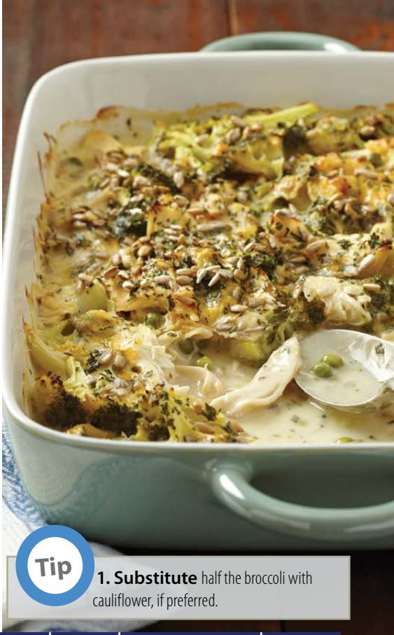

Cooking from the heart **45**

#### SWEET & SOUR PORK

- **½ tbsp (7,5 ml) cornflour**
- **5 tbsp (75 ml) strong Rooibos tea**
- **3 tbsp (45 ml) lemon juice or white grape vinegar**
- **1 tbsp (15 ml) soy sauce**
- **2 tbsp (30 ml) olive or canola oil**
- **500 g pork shoulder or leg, removed from the bone, cut into strips and excess fat removed**
- **1 red or green pepper, seeded and sliced**
- **2 carrots, peeled, halved lengthwise and diagonally sliced**
- **4 tsp (20 ml) finely grated fresh ginger**
- **1 small pineapple, peeled, sliced and cut into triangles**
- **¼ cabbage, shredded**
- **100 g green beans, halved**
- **black pepper to taste**
- **handful fresh parsley or mint, chopped**

**1.** Mix cornflour with some of the tea to form a paste. Add remaining tea, lemon juice or vinegar and soy sauce and mix well. **2.** Heat half the oil in a large frying pan. Fry pork until brown. Spoon out and keep warm.

**3.** Add remaining oil and stir-fry pepper, carrots and ginger for a few minutes. Add pineapple and fry for another few minutes. Add cabbage and stir-fry until just softened. **4.** Stir in the sauce to coat the veggies. Add meat and green beans. Stir to heat through. **5.** Cover with a lid for a few minutes to steam the beans. The beans should remain green and crunchy. Season with pepper, sprinkle with herbs and serve immediately. **Serve** with a green salad or some fruit. The veggies and pineapple add enough bulk to this dish and starch like noodles or rice is not necessary.

**1. Minute** steak, stroganoff meat or chicken strips will work just as well. **2. If** your pan is not big enough – fry the veggies in batches. Mix together in step 4 before adding the sauce. **Tips**

Nutritional info **per portion** Energy **1 430 kJ** Protein **31,3 g** Fat **12,4 g** Carbohydrates **18,5 g** Salt **0,8 g**

| How many carbs |
|----------------|
| per portion?   |

#### LENTIL BOBOTIE

A typical South African dish, prepared as a vegetarian version. The sweet potato bulks up the recipe to make a filling meal, without the need for additional rice – especially when you need to control your carb portions.

- **2 tsp (10 ml) olive or canola oil**
- **2 onions, chopped**
- **1 tbsp (15 ml) finely grated fresh ginger**
- **1 clove of garlic, crushed**
- **200 g (1 medium) sweet potato in the skin, coarsely grated**
- **4 tsp (20 ml) each curry powder and ground cumin**
- **2 tsp (10 ml) ground coriander 1 tsp (5 ml) ground turmeric 1 cup (250 ml) uncooked brown lentils 2 cups (500 ml) strong Rooibos tea ⅓ cup (80 ml) raisins 8 tsp (40 ml) red wine vinegar ½ tsp (2,5 ml) salt lemon juice and black pepper to taste 2 eggs, beaten**
- **1 cup (250 ml) buttermilk 4 small bay leaves ¼ cup (60 ml) flaked almonds**

**1.** Heat oil in a large saucepan and fry onions, ginger and garlic until soft. Add sweet potato and spices and fry until aromatic. Reduce the heat.

**2.** Add lentils and tea and cover with a lid. Simmer for 30-40 minutes or until lentils are cooked. Preheat the oven to 180 ˚C.

**3.** Add raisins, vinegar and salt. Season with lemon juice and pepper. Spoon into an oven dish.

**4.** Mix eggs and buttermilk and season with pepper. Pour on top of the lentil mixture.

Place bay leaves in the egg mixture and sprinkle with almonds.

**5.** Bake for 30 minutes or until golden brown and cooked.

**Tip**

**Serve** with green veggies, like broccoli or spinach, or a salad. Bobotie is delicious with a chunky salsa of cucumber, tomato and fresh herbs.

> **1. Substitute** sweet potato with butternut, if preferred.

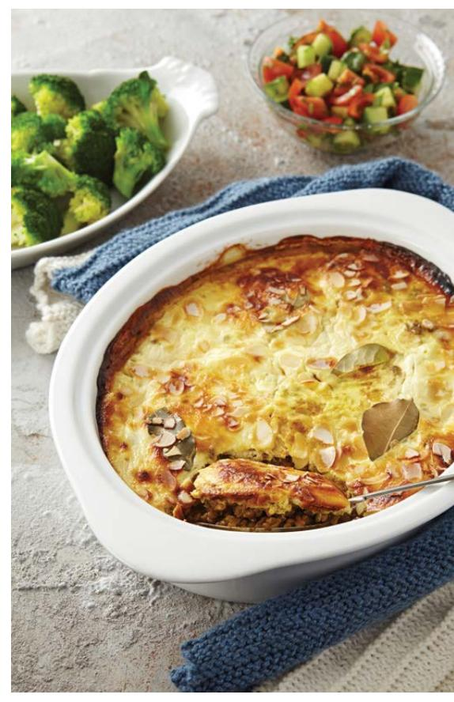

**Serves Ready in 4** 1 hour 30 mins

#### BEAN & BEEF CASSEROLE

Soaking the beans overnight takes some planning, but worth the wait for a hearty family meal.

**1 cup (250 ml) dried white beans 2 tsp (10 ml) olive or canola oil 750 g stewing beef on the bone, cut into cubes and excess fat removed 2 onions, coarsely chopped 2 celery stalks with the leaves, thickly sliced 4 carrots, peeled and thickly sliced 1 tbsp (15 ml) grated fresh ginger 1 clove of garlic, crushed 4 tsp (20 ml) dried mixed herbs 4 whole cloves 2 bay leaves ½ tsp (2,5 ml) salt 4 cups (1 litre) strong Rooibos tea 3 ripe tomatoes, cubed 300 g cauliflower, cut into florets 2 large spinach leaves, cut into strips lemon juice and black pepper to taste 3 tbsp (45 ml) chopped fresh parsley**

**1.** Place beans in a large bowl and cover with 3 cups (750 ml) cold water. Soak overnight, drain and rinse.

**2.** Heat the oil in a large pot and fry meat until brown. Spoon out.

**3.** Fry onions, celery and carrots in the pot for a few minutes. Add ginger, garlic, dried herbs, cloves and bay leaves and fry for another few minutes.

**4.** Add the beans, meat, salt and tea and stir through. Simmer with a lid for 1½-2 hours or until the meat and beans are cooked.

**5.** Stir in the tomatoes, cauliflower and spinach and simmer with a lid for 15-20 minutes or until just cooked. Add more tea, if necessary. Season with lemon juice and pepper and stir in the parsley.

**Serve** with a green salad or lightly cooked green veggies, if preferred. The beans and veggies provide enough carbs and this casserole does not have to be served on another starch – perfect when you need to manage the carbs in your meals.

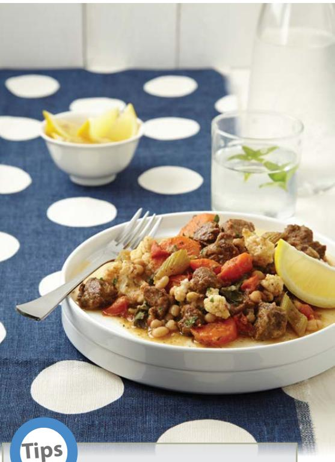

**1. If** you are short on time, use tinned beans. Cook the meat and veggies as above, without the beans. Add 1 x 410 g tin butter beans, drained in step 5. **2. Make** sure that you cut the meat into small cubes, so

that it cooks in the same time as the beans. **3. Note** that the carb key is close to the range of 'bowl 2'. See page 30 for more detail on the carb key.

**\* Allow for soaking time**

#### CHICKEN & BARLEY SOUP

**4 tsp (20 ml) olive or canola oil 3 chicken breasts on the bone, skin and fat removed 2 onions, chopped 4 carrots, peeled and chopped 4 celery stalks with leaves, chopped 4 baby marrows, chopped 8 cups (2 litres) strong Rooibos tea 1 cup (250 ml) water 5 sprigs fresh rosemary 2 bay leaves 1 cup (250 ml) uncooked barley ¼ tsp (1,2 ml) salt lemon juice and black pepper to taste 3 tbsp (45 ml) chopped fresh parsley**

**Serves Ready in 4** 1 hour 45 mins

**1.** Heat the oil in a large pot and fry chicken until brown. Spoon out.

**2.** In the same pot, fry onions, carrots, celery and baby marrows until brown.

**3.** Add chicken, tea, water, rosemary, bay leaves, barley and salt. Reduce the heat. Simmer with a lid for about 20 minutes or until the chicken is cooked.

**4.** Spoon out the chicken. Cook the soup for 40-45 minutes or until the barely is soft. **5.** Meanwhile, debone chicken and shred the meat. Add back to the soup once the barley is cooked. Season well with lemon juice and pepper.

**6.** Stir in the parsley and serve hot. **Serve** this soup on its own and don't be tempted to make bread part of this meal. The barley has enough carbs to make it filling. Rather bulk up by adding more green veggies to the soup if preferred – broccoli or spinach will be delicious.

**1. Avocado** is also delicious served with this soup.

**Tip**

Cooking from the heart **49**

## **side dishes** 'An exciting part of your meal'

The side dishes we choose should be an exciting part of the meal. Typical choices include rice, potatoes or mealie pap, but that doesn't have to be the only options. There are a wide variety of foods that can be delicious side dishes, ranging from starches to vegetables as well as starchy veggies. When planning a meal or the meals for a whole day, it is necessary to look at the amount of carbs that are included. This is important for all of us, but even more so for those with diabetes. Side dishes often include a lot of starch, so we must make sure that we don't eat too many carbs which could lead to weight gain and higher blood sugar levels.

Aim to include one portion of a starchy side dish per meal and then fill the rest of your plate with interesting and flavourful low-carb side dishes of vegetables and salad. When you choose starchy side dishes, choose better, more nutritious options, like sweet potatoes instead of potatoes or brown rice instead of white rice. This ensures that you enjoy an appetising meal with more healthy nutrients and not too many carbs.

By adding ingredients like lentils to rice, the side dish remains filling enough, but doesn't only consist of high-carb foods. Season side dishes with interesting flavours like fresh or dried herbs, spices, ginger, chilli and lemon juice rather than sugar, cream or pre-prepared sauces. This will keep these dishes as healthy as possible.

The recipes in this section have been divided into starchy side dishes and veggie sides, which are lower in starch. Choose the one that will make your meal balanced and not include too many carbs. Take into account whether you will be having dessert as well. The amount of carbs per portion has been indicated, so use as a guide to know what other side dishes you can include and how much of it you can eat.

#### LEMONY BROWN RICE

Brown rice has a delicious nutty flavour and is a much better carb choice as it has a slower release of energy and contains fibre. Although it cooks longer, it is well worth the wait – especially with this lemony flavour.

#### **1 lemon**

**1 cup (250 ml) uncooked brown rice ½ tsp (2,5 ml) salt 1 tbsp (15 ml) chopped fresh parsley** **1.** Peel off 4 strips of lemon rind with a vegetable peeler, take care not to peel any white pith with it.

**2.** Squeeze out lemon juice and add with the rind, rice and salt to a pot with about 2½ cups (625 ml) water.

**3.** Bring to the boil, reduce the heat and simmer with a lid for 20-25 minutes or until cooked. Drain well. Stir in the parsley and serve immediately.

**Serve** a stew, mince dish or casserole on this rice instead of plain white rice. It is also great with a portion of fish or chicken. Another starch is not necessary, so fill your plate with non-starchy, low-carb vegetables or a salad.

**Tips**

**1. Allow** the rice to cool down completely and use as a base for a rice salad. Add any salad ingredients of your choice or add cooked chicken or lentils to make this a light meal.

**2. Add** peas or spinach to the rice or sprinkle toasted sunflower seeds over before serving.

Nutritional info **per portion** Energy **778 kJ** Protein **3,7 g** Fat **1,3 g** Carbohydrates **37,3 g** Salt **0,5 g**

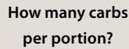

**Serves Ready in**

## BROWN LENTILS WITH HERBS

**1 cup (250 ml) uncooked brown lentils ½ tsp (2,5 ml) salt 1 sprig fresh rosemary or dried bay leaf 1 tbsp (15 ml) dried mixed herbs 1 clove of garlic, whole 2 tsp (10 ml) olive or canola oil**

- **3 ripe tomatoes, cubed**
- **3 tbsp (45 ml) chopped fresh parsley**
- **3 tbsp (45 ml) chopped fresh origanum or more parsley**

#### **lemon juice and black pepper to taste**

**1.** Place lentils, salt, rosemary, dried herbs and garlic in a pot with 2½ cups (625 ml) water. Bring to the boil, reduce the heat and simmer with a lid for 30 minutes or until lentils are just soft. Drain well.

**2.** Heat oil in the pot and fry tomatoes until just soft. Add lentils and herbs. Toss through and remove from the heat. **3.** Season with lemon juice and pepper. **Serve** warm or at room temperature with chicken, pork or as an alternative to rice or pasta with mince. Fill your plate with another small portion of starch and any green veggies, seasoned with lemon juice and black pepper, or a colourful salad.

**1. The** clove of garlic can be removed just before serving, if preferred.

**2. Allow** lentils to cool down and serve as a salad, as is, or with more fresh salad ingredients.

|  | Nutritional info per portion | Energy 612 kJ | Protein 9 g | Fat 2 g | Carbohydrates 15,4 g | Salt 0,3 g |
|--|------------------------------|---------------|-------------|---------|----------------------|------------|
|--|------------------------------|---------------|-------------|---------|----------------------|------------|

starchy side **Serves Ready in 6** 1 hour 30 mins

**How many carbs per portion?**

**1. To** make wedges: Cut sweet potatoes into wedges and coat in oil mixture as below. Roast for just 30 minutes and serve with the sauce as a dip. **2. Add** fresh grated lemon rind to the cottage cheese for more flavour.

#### JACKET SWEET POTATOES WITH COTTAGE CHEESE

As delicious as baked potatoes and sour cream – but without the guilt. Sweet potatoes are a better carb choice and the onions add a sweet flavour!

**4 tsp (20 ml) olive or canola oil ¼ cup (60 ml) lemon juice 2 tbsp (30 ml) water 4 tsp (20 ml) finely grated fresh ginger 1 small chilli, seeded and chopped (optional) 1 clove of garlic, crushed 2 onions, cut into wedges 6-8 (± 800 g) small sweet potatoes, in the skin black pepper to taste ¾ cup (180 ml) plain smooth low-fat cottage cheese handful fresh coriander leaves**

**1.** Preheat the oven to 180 ˚C.

**2.** Mix oil, lemon juice, water, ginger, chilli and garlic in a large bowl. Add onions and sweet potatoes and toss to coat the veggies. Season with pepper.

**3.** Place in an oven dish, with all the liquid and seasonings. Roast for 45 minutes or until the sweet potatoes are soft.

**4.** Stir onions with the pan juices into the cottage cheese. Cut a deep slit into each sweet potato and fill with about 2 tbsp (30 ml) of the mixture. Garnish with fresh coriander.

**Serve** with grilled or roasted fish, chicken or pork and fill your plate with any green veggies, lightly cooked and seasoned with lemon juice and black pepper. A green salad will also be delicious.

Nutritional info **per portion** Energy **814 kJ** Protein **5,2 g** Fat **4,4 g** Carbohydrates **29 g** Salt **0,2 g**

| How many carbs |  |  |
|----------------|--|--|
| per portion?   |  |  |

starchy side **Serves Ready in 6** 50 mins

#### BEAN & ONION SALAD

A change from the typical three bean salad with no added sugar.

**200 g green beans, cut into thirds 1 tbsp (15 ml) olive or canola oil 2 onions, quartered and thinly sliced 2 tbsp (30 ml) red wine vinegar ¼ cup (60 ml) water 1 tsp (5 ml) dried thyme 2 tbsp (30 ml) tomato paste 1 x 410 g tin butter beans or red kidney beans, drained 1 x 410 g tin four bean mix or more butter beans, drained ½ tsp (2,5 ml) salt lemon juice and black pepper to taste 2 ripe tomatoes, cubed**

**handful lettuce leaves**

**1.** Pour boiling water over green beans and allow to stand until cooked, but still crispy. Drain and rinse with cold water. Repeat if necessary and allow to cool.

**2.** Heat oil in a large frying pan and fry onions, very slowly until golden and caramelised. If they brown too fast before softening, add a little water and allow it to cook out and fry again. The more golden and soft, the better the flavour.

**3.** Reduce the heat and add vinegar, water and thyme and simmer for a few minutes. Add tomato paste and stir well. Stir in tinned beans, add salt and season with lemon juice and pepper. Allow to cool. **4.** Combine bean mixture with the green beans and tomatoes. Spoon over lettuce. **Serve** with roasted fish or chicken. It's delicious as a starch with a braai. Fill your plate with veggies of your choice and another salad. Another small portion of starch could also be enjoyed.

**Tip**

**1. Any** tinned beans of your choice will be delicious in this salad.

Cooking from the heart **55**

#### BUTTERNUT & CAULIFLOWER MASH

Remember that although butternut contains carbohydrates it is a better choice than potatoes. Cauliflower adds more bulk to this side dish.

**500 g butternut, peeled and cubed 200 g cauliflower, cut into florets ½ tsp (2,5 ml) salt 1 tsp (5 ml) dried thyme or 1 tbsp (15 ml) fresh thyme pinch of ground nutmeg or mixed spice 2 tsp (10 ml) olive or canola oil lemon juice and black pepper to taste 2 tbsp (30 ml) chopped fresh parsley or thyme**

**How many carbs per portion?**

**1.** Place butternut, cauliflower, salt and thyme in a pot with 300 ml water. Bring to the boil, reduce the heat and simmer with a lid for 20 minutes or until butternut and cauliflower is just soft enough to mash. **2.** Drain, but keep some of the liquid. Place back on the stove and simmer for a few minutes to cook out any excess water. **3.** Mash with a potato masher until smooth and stir in nutmeg or mixed spice, oil, lemon juice and pepper. Add some of the retained liquid, if necessary. Stir in fresh herbs and serve immediately. **Serve** as a healthy substitute for mashed

potatoes with a meal of your choice. Fill your plate with any green veggies and maybe another small portion of starch, if preferred. A salad or fruit is another delicious way to fill your plate.

**Tip**

**1. Substitute** butternut for more cauliflower and follow the recipe as above for a cauliflower mash. Alternatively substitute the butternut for 2 tins butter beans, drained, and simmer with the cauliflower.

**56 DIABETES**

#### VEGGIE & TOMATO BAKE

**1 x 410 g tin tomato and onion mix 4 tsp (20 ml) olive or canola oil 1 tbsp (15 ml) dried origanum or 2 tbsp (30 ml) chopped fresh origanum lemon juice and black pepper to taste 4 baby marrows, cut into thick slices 1 brinjal, cut into cubes 250 g mushrooms, quartered 2 ripe tomatoes, cut into wedges 3 carrots, peeled and cut into thick slices 1 slice feta cheese, crumbled**

**1.** Preheat oven to 180 ˚C. Mix tomato and onion mix with oil and herbs and season with lemon juice and black pepper. **2.** Place veggies and half the feta in an oven dish and pour tomato mixture over. Mix to coat the veggies. Cover with foil and bake for 20 minutes.

**3.** Remove the foil and sprinkle with remaining feta. Bake for another 30-45 minutes or until veggies are cooked. **Serve** hot or at room temperature, with any meat of your choice or at a braai. Another portion of starch could also be served or fill your plate with a green salad.

**1. Stir** veggies into 200 g cooked pasta for a quick meal for 4-6 people.

**2. Add** 2 tins of tuna to the mixture for a light meal. **3. Add** a tin of lentils, beans or chickpeas to the tomato mix and stir in as above. Enjoy as a light vegetarian meal.

**4. These** veggies are also great with eggs. Make 6-8 holes in the cooked veggies in the oven dish. Crack an egg into each hole and return to the oven, covered with foil. Bake for 5-7 minutes or until cooked to your preference. Or pour veggies into a large pan and add eggs in the same way.

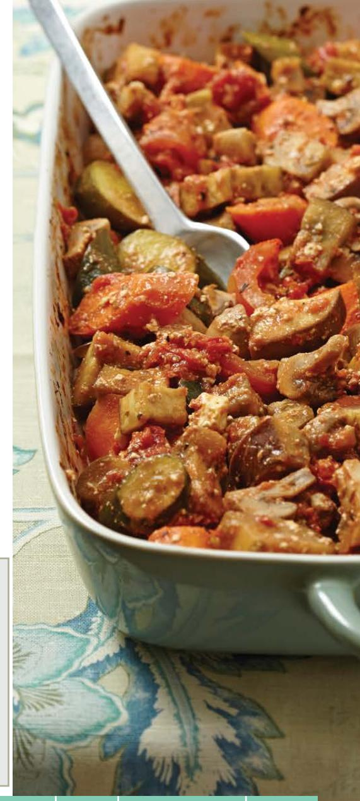

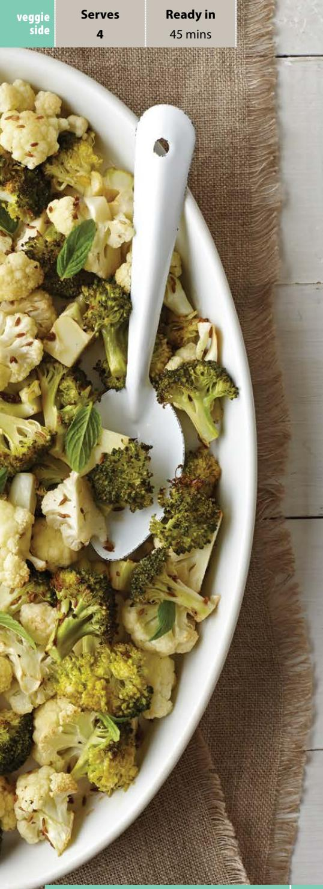

**How many carbs per portion?**

#### ROASTED CAULIFLOWER & BROCCOLI

The roasted flavour of two everyday ingredients combined with cumin makes this a special side dish. A low-carb veggie to fill your plate with.

**300 g broccoli, cut into florets 300 g cauliflower, cut into florets 2 tbsp (30 ml) olive or canola oil lemon juice and black pepper to taste 2 tsp (10 ml) cumin seeds or 1 tbsp (15 ml) ground cumin ¼ cup (60 ml) Rooibos tea handful fresh mint or parsley**

**1.** Preheat the oven to 200 ˚C. Place veggies in a large bowl with the rest of the ingredients, except the mint or parsley. **2.** Toss to coat the veggies with the seasonings and place in a large oven dish. **3.** Roast for 15-20 minutes or until just cooked. Stir in fresh herbs and serve hot or at room temperature.

**Serve** as a green veggie with pan-fried, grilled or roasted fish, chicken or meat of your choice. Enjoy a big portion of this side and add a moderate portion of another starchy side dish. Choose any of the recipes from the side dish section.

**Tips**

**1. Add** chickpeas to the veggies for a more filling side dish.

**2. Chilli** or other seasonings like paprika or turmeric can be added to the veggies before roasting.

**How many carbs per portion?**

veggie side

#### BABY MARROW NOODLES

A delicious way to bulk up a portion of pasta for a meal. Or enjoy as a green veggie to fill your plate.

**6-8 large baby marrows**

**1 strip of lemon rind, cut with a vegetable peeler (optional) ½ cup (125 ml) frozen peas, rinsed 2 tsp (10 ml) olive or canola oil ¼ tsp (1,2 ml) salt**

**lemon juice and black pepper to taste 2 tbsp (30 ml) chopped fresh mint or basil**

**1.** Using a vegetable peeler, cut long, thin slices of baby marrows. Cut these slices into thick 'noodles'.

**2.** Heat a pot with 1-2 cups (250-500 ml) water and bring to a boil. Add baby marrows and lemon rind and simmer with a lid for 3 minutes or until just cooked. Add peas and simmer for 1 minute. Drain well. Return veggies to the pot.

**3.** Add oil and salt and season with lemon juice and pepper. Toss through with the herbs and serve immediately.

**Serve** this side dish as one of the veggies that can fill half your plate. Or stir into pasta, to bulk it up, without eating too much carbs. Mince will be delicious on this or a portion of any meat or fish of your choice. A tomato salad or fruit will complement this.

**1. If** preferred, stir 1 slice of feta into the baby marrows, but leave out the salt. Or sprinkle with roasted sunflower seeds for a crunch. **Tip**

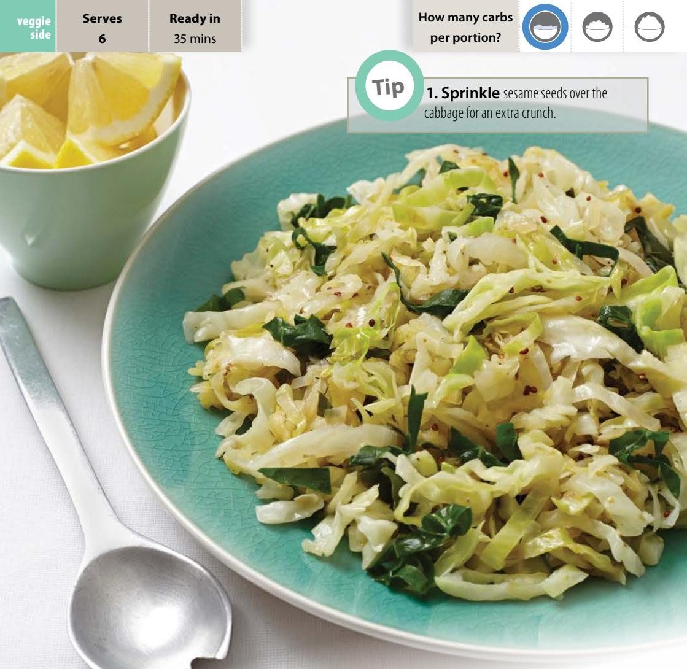

#### PAN-FRIED CABBAGE

**2 tbsp (30 ml) olive or canola oil 1 onion, chopped ½ cabbage, thinly sliced 1 Granny Smith apple with the skin, grated 1 tbsp (15 ml) mild or wholegrain mustard 4 large spinach leaves, thinly sliced lemon juice and black pepper to taste**

**1.** Heat oil in a large frying pan and fry onion until soft. Add cabbage and apple. Fry gently until soft, but not mushy.

**2.** Add mustard and spinach and fry for about 1 minute.

**3.** Season with lemon juice and pepper and serve immediately.

**Serve** with mince, chicken or pork dishes and a small portion of starch. Fill your plate with orange, yellow or red salad ingredients and veggies to enjoy a balanced meal.

Nutritional info **per portion** Energy **488 kJ** Protein **2,7 g** Fat **5,1 g** Carbohydrates **11,4 g** Salt **0,6 g**

veggie side **Serves Ready in 4** 1 hour 30 mins

#### BUTTERNUT & CHICKPEA SALAD

A flavourful way to add colour and variety to your plate is to roast butternut with aromatic spices.

**1 tsp (5 ml) ground coriander 1 tsp (5 ml) paprika 2 tsp (10 ml) dried origanum 1 tsp (5 ml) ground cumin ½ tsp (2,5 ml) curry powder 3 tbsp (45 ml) olive or canola oil ¼ tsp (1,2 ml) salt 2 tbsp (30 ml) lemon juice 3 tbsp (45 ml) water 500 g butternut, peeled and cubed black pepper to taste 1 x 410 g tin chickpeas, drained 4 small spinach leaves or 2 handfuls lettuce leaves, roughly torn**

**1.** Preheat oven to 180 ˚C. Place spices, half the oil, salt, lemon juice, water and butternut in a large bowl and mix well. **2.** Season with black pepper and place in an oven dish. Roast for 30 minutes or until butternut is tender. Allow to cool. Stir in chickpeas.

**3.** Spoon onto spinach or lettuce and drizzle with remaining oil. Enjoy as a salad. **Serve** with oven-baked or roasted fish, chicken or meat. Fill your plate with green veggies, fruit or a tomato salad.

**Tips**

**1. Crumble** 1 slice of feta over the salad for more flavour, but omit the salt.

**2. For** added texture, serve with raw pumpkin seeds.

**3. The** spinach can be stirred into the hot butternut to soften the leaves a little. Serve as above.

**4. Add** any fresh ingredients of your choice like tomatoes, cucumber or green beans to the salad.

Cooking from the heart **61**

#### **How many carbs per portion?**

#### VERSATILE DRESSING

Shop-bought salad dressings can be high in hidden sugar, salt and fat. Therefore, homemade is best, as you can control what and how much of it you put in the dressing. This dressing is great with salad, but do not pour the dressing over the salad, rather serve at the table so everyone can add their own. Or use it to marinate or roast meat and chicken. Vegetables can also be prepared with the dressing. See the tips below.

- **3 tbsp (45 ml) olive and canola oil**
- **2 tbsp (30 ml) balsamic or red wine vinegar**
- **1 tbsp (15 ml) lemon juice**

#### **2 tsp (10 ml) chopped fresh rosemary or thyme 1 tsp (5 ml) mild mustard ¼ tsp (1,2 ml) salt black pepper to taste**

**1.** Mix all the ingredients together and season with black pepper.

**2.** Store in a clean, airtight container in the fridge and use as suggested. The dressing keeps well for up to 2 weeks.

**Serve** about 1 tbsp (15 ml) per portion.

#### **Tips**

**1. Use** this dressing to cook chicken breasts on the bone. Remove skin and fat from the chicken and pan-fry on both sides until golden brown. Pour some of the dressing over, reduce the heat, cover with a lid and simmer for 20 minutes or until cooked through. **2. Use** the dressing as a marinade for fish portions, pork or lamb chops, excess fat removed. Braai or cook as in Tip 1. **3. Salad** ingredients, like cucumber, green beans, tomatoes and even broccoli will be delicious with this dressing. Or serve over lightly cooked green veggies. **4. Toss** butternut, baby marrows or veggies of your choice in the dressing and roast at 180 ˚C.

Nutritional info **per portion** Energy **297 kJ** Protein **0,1 g** Fat **7 g** Carbohydrates **2,2 g** Salt **0,2 g**

## **MENU IDEAS**

Whether planning meals for a weekday or special event, it is important to look at the total amount and variety of food we eat every day. Those living with diabetes also need to consider their total carb intake. Look at the carb content of your main meal and side dish before deciding if you can include a dessert. See the sample menus below.

#### WEEK DAY

**Tuna & bean hot pot** — page **42** Green salad

No dessert

#### WEEK DAY

**Sweet & sour pork** — page 46

Dessert: ½ cup (125 ml) seasonal fruit salad per person

#### SPECIAL MEAL

**Veggie & mince 'lasagne'** — page 43

**Roasted cauliflower & broccoli** — page 58

Green salad with **Versatile dressing** — page 62

Dessert: **Granadilla cheesecakes** with strawberries — page 69

#### WEEKEND

Roasted chicken pieces **Lemony brown rice** — page 52

**Baby marrow noodles** — page 59

No dessert

#### WEEKEND

Snoek or other line fish cooked over the coals

**Jacket sweet potatoes with cottage cheese** — page 54

Green salad

Dessert: **Pan-fried pineapple with coconutyoghurt** — page 71

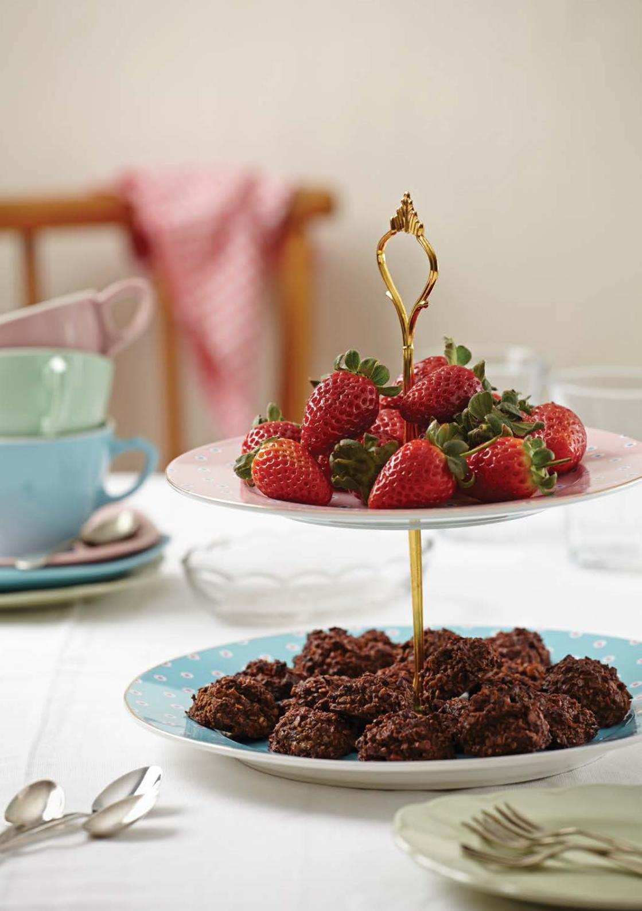

## **treats** 'For special occasions'

A treat every now and then is one way to spoil yourself, but it is important to remember that it is indeed a treat and not a necessity. Making good choices and eating small portions will allow you to still enjoy a treat for special occasions.

The desserts and treats in this section do contain carbs and small amounts of sugar, but these are better options than most other desserts and puddings. If you plan a meal that will include dessert, remember to take this into consideration and 'allow' for this after the main meal. If a dessert with a higher carb content is chosen, then you need to compensate with the meal and either have a 'no carb' side dish or choose a low-carb dinner. This way it is easier to make the best choices and to ensure that your dinner and dessert doesn't contain too many carbs. This is a great tip for all of us to enjoy healthy meals and even more so for those with diabetes.

There are a wide range of ingredients and options to help make healthier choices. Be creative with different seasonal fruit and rather sprinkle with toasted nuts than chocolate. A homemade custard, where you can manage the amount of sugar added, is a better option than shopbought custard. Serve desserts with plain unsweetened low-fat yoghurt seasoned with vanilla, cinnamon or lemon rind instead of cream or ice cream. A sprinkle of toasted coconut can add wonderful flavour to many desserts. Ground spices like cinnamon, mixed spice and allspice add lots of flavour to fruit based desserts.

#### **Serves Ready in 6** 1 hour 15 mins

#### APPLES WITH DATES & NUTS

**2 tbsp (30 ml) desiccated coconut 2 tbsp (30 ml) oats ¼ cup (60 ml) chopped raw almonds 2 tbsp (30 ml) chopped dates 1 tbsp (15 ml) butter 1 tsp (5 ml) ground cinnamon pinch of ground cloves 4-6 (400-600 g) small apples with the skin, cored ¾ cup (180 ml) Rooibos tea 175 ml plain low-fat yoghurt**

**1.** Preheat the oven to 180 ˚C. Mix all the ingredients, except the apples, tea and yoghurt, until well combined. **2.** Place apples in an oven dish and fill with the coconut mixture and pour tea over. Cover with foil and bake for 20 minutes. Remove the foil and spoon over liquid. **3.** Bake for another 10-20 minutes, uncovered, until just soft, but not burst open. The apples shouldn't fall apart. **Serve** with 2 tbsp (30 ml) plain low-fat yoghurt per person.

**1. The** same recipe can be used to roast different fruit like pears, pineapple, naartjies or peaches, berries and plums in summer. Use one or a combination of seasonal fruit, cut into wedges, slices or quarters and sprinkle with the coconut mixture. Roast uncovered or until the fruit is cooked, but not mushy. **Tips**

**2. Flavoured** Rooibos tea will work well. Whole spices like cinnamon sticks, cloves, allspice or cardamom are all delicious added to the fruit.

**3. Low-sugar** homemade custard: Prepare custard with 2 cups (500 ml) low-fat milk, 3 tbsp (45 ml) custard powder and 2 tbsp (30 ml) sugar by following the cooking instructions on the packaging. Season with vanilla essence and lemon rind to taste. This serves 6 people with ⅓ cup (80 ml) custard per person.

Nutritional info **per portion** Energy **728 kJ** Protein **3,2 g** Fat **7,4 g** Carbohydrates **19,7 g** Salt **0,1 g**

**How many carbs per portion?**

**Serves Ready in 4** 40 mins\*

**Tips**

**1. For** a special treat, grate 1-2 small blocks of dark chocolate over the hot pudding.

- **2. To** serve as a custard, add ½ cup (125 ml) extra milk.
- **3. Omit** the cornflour to serve as a hot cocoa drink.
- **\* Allow 1 hour cooling time**

#### CHOCOLATE CUSTARD PUDDING

This velvety pudding has lots of flavour and very little sugar.

**1 tbsp (15 ml) sugar 3 tbsp (45 ml) cornflour 3 tbsp (45 ml) cocoa powder ¼ tsp (1,2 ml) ground cinnamon 2 cups (500 ml) low-fat milk 1 tsp (5 ml) vanilla essence 4 small (400 g) ripe pears with the skin, cut into wedges**

**¼ cup (60 ml) chopped raw almonds**

**1.** Mix sugar, cornflour, cocoa and cinnamon with a little milk to form a paste. **2.** Gently heat remaining milk in a small saucepan. Add some warm milk to the paste and stir back into the rest of the milk. **3.** Stir continuously over a medium heat until thickened. Remove from the heat and stir in the vanilla.

**4.** Divide hot mixture into 4 small bowls or cups. Allow to cool and chill in the fridge. **Serve** with the pears and 1 tbsp (15 ml) chopped nuts per person. Alternatively, serve as a warm custard over the pears.

Cooking from the heart **67**

#### APPLE BAKE WITH MIXED SPICE

**500 g sweet apples with the skin, cut into wedges 100 ml strong Rooibos tea 1 cinnamon stick 1 cup (250 ml) buttermilk 100 ml low-fat milk 1 tbsp (15 ml) vanilla essence 2 eggs 1 tbsp (15 ml) finely grated lemon rind ¼ cup (60 ml) ground almonds 100 ml cake flour ½ tsp (2,5 ml) baking powder 1 tbsp (15 ml) sugar ½ tbsp (7,5 ml) ground mixed spice 1 tsp (5 ml) icing sugar mixed with a pinch of ground mixed spice 175 ml plain low-fat yoghurt**

**1.** Preheat oven to 200 ˚C. Place apples, tea and cinnamon stick in a saucepan. Simmer for 7-10 minutes or until just tender. Spoon apples and tea into a lightly greased oven dish.

**2.** Beat buttermilk, milk, vanilla, eggs and lemon rind together. Stir in almonds, flour, baking powder, sugar and mixed spice to form a runny batter. Pour over the apples. **3.** Bake for 30-40 minutes or until golden brown and cooked.

**Serve** immediately with a light dusting of the icing sugar and 2 tbsp (30 ml) plain lowfat yoghurt per person.

**Tips**

**1. This** recipe works just as well with ripe pears.

**2. Note** that the carb key is close to the range for bowl 2. See page 30 for more detail on the carb key.

Nutritional info **per portion** Energy **863 kJ** Protein **7,2 g** Fat **5,8 g** Carbohydrates **26,5 g** Salt **0,3 g**

#### GRANADILLA CHEESECAKES

These little desserts have a smooth, soft and creamy texture. The yoghurt and cottage cheese adds a cheesecake flavour that is delicious.

**¾ cup (180 ml) plain smooth low-fat cottage cheese 175 ml plain low-fat yoghurt 1 tbsp (15 ml) sugar 1 tbsp (15 ml) cornflour 1 tsp (5 ml) vanilla essence 2 eggs 1 x 119 g tin granadilla pulp 12-18 medium strawberries or orange segments**

**1.** Preheat the oven to 160 ˚C. Whisk all the ingredients, except the strawberries or oranges, together until well combined. **2.** Divide the mixture between 6 individual ovenproof dishes or ramekins.

**3.** Place dishes on a baking tray and bake for 25-30 minutes or until just set. To test, gently shake the tray to see how firm it is. It will continue to set as it cools down. **4.** Turn off the oven and allow to cool down in the oven. Refrigerate and allow to cool completely. **Serve** cold with 2-3 strawberries or orange segments per person.

**1. Grate** 1-2 blocks of dark chocolate over the cheesecakes. Or garnish with toasted nuts, coconut or cocoa powder. **Tip**

**\* Allow 1 hour cooling time**

Nutritional info **per portion** Energy **488 kJ** Protein **7,1 g** Fat **3,8 g** Carbohydrates **10,1 g** Salt **0,2 g**

#### CHOCOLATE & COCONUT CLUSTERS

The banana adds a natural sweetness to these clusters, making them a tasty treat without any added sugar.

#### **1 banana**

**1 egg, beaten 8 tsp (40 ml) sunflower oil 2 tsp (10 ml) vanilla essence 1 tbsp (15 ml) brown sugar ¼ cup (60 ml) desiccated coconut 1 cup (250 ml) uncooked oats 2 tbsp (30 ml) cocoa powder ¼ cup (60 ml) chopped raw almonds**

**1.** Preheat the oven to 200 ˚C and line a baking tray with baking paper. **2.** Mash the banana in a large bowl and beat in the egg, oil and vanilla.

**3.** Stir in the remaining ingredients until well combined and place spoonfuls of the mixture onto the baking tray.

**4.** Bake for 10-15 minutes or until cooked. Allow to cool and store for 2-3 days in an airtight container.

**Serve** 3 clusters as a portion for a tea time treat or even as a dessert with coffee.

**70 DIABETES**

#### PAN-FRIED PINEAPPLE WITH COCONUT-YOGHURT

**1 medium pineapple, peeled 3 tbsp (45 ml) desiccated coconut 2 tsp (10 ml) sunflower oil 175 ml plain low-fat yoghurt handful fresh mint leaves to serve**

**1.** Cut pineapple into 6 thick, even slices. **2.** Heat a frying pan over a medium heat and toast coconut without any oil until golden brown. Take care not to burn it. Spoon out.

**3.** In the same pan, heat oil and fry pineapple slices on both sides until golden brown and just cooked.

**4.** Mix 2 tbsp (30 ml) of the coconut with the yoghurt.

**Serve** 2 tbsp (30 ml) of the yoghurt mixture per person with the pineapple, sprinkle with remaining coconut and garnish with fresh mint leaves.

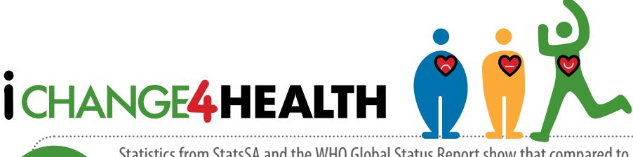

Statistics from StatsSA and the WHO Global Status Report show that compared to Brazil, Russia, India and China, **South African women** have the **highest** incidence of **heart disease** and **diabetes**, and only Russian men rank higher than South African men for the same conditions.

Chronic **lifestyle related illnesses** are rapidly **increasing** because of **sedentary lifestyles**, **poor diet**, **physical inactivity** and other factors.

Research done by the Food and Agriculture Organisation also shows that:

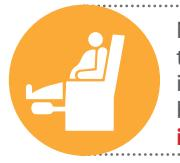

Nearly **50 % of men** aged 25 to 34 and **60 % of women** in the same category can be described as **physically inactive**.

**One in five men** and **one in four women** suffer from **high blood pressure** at a relatively young age.

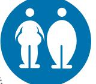

A **third of men** and more than **two-thirds of women** have a **BMI** of **over 25**, making them overweight or obese.

Many people want to live healthier lives and reduce their risk of developing chronic lifestyle diseases, but are unsure how to start. Others are unaware of the unhealthy behaviours in their lives. To address this problem, and to help South Africans change their bad habits and put new, healthier ones in their place, **Pharma Dynamics**, as the largest supplier of cardiovascular medication in SA, partnered with the Chronic Disease Initiative for Africa (CDIA) to launch **iChange4Health**.

**iChange4Health** has a series of helpful motivational booklets, including the successful *Cooking from the heart* recipe book launched in 2012, (available for download on www.ichange4health.co.za) that provide information, guidance and tips regarding lifestyle changes and also showcase other people who have broken their unhealthy habits.

The **iChange4Health** and *Cooking from the heart* Facebook pages further offer helpful information and advice to motivate South Africans to take the first step towards a healthy lifestyle to ultimately reduce the burden of chronic disease on South Africa.

## **More about Pharma Dynamics**

Pharma Dynamics was founded in September 2001 by CEO, Paul Anley. Determined to take on the big players in the pharmaceutical industry, Anley and his team set about implementing the company's mission to become a world-class marketer and distributor of healthcare products in Southern Africa.

The company's core focus is the provision of generic medicine in South Africa, an environment where access to healthcare is often limited due to high cost and where education and awareness of health conditions and treatment are limited. Their goal is to overcome these barriers and to supply effective and affordable healthcare to more South Africans.

From humble beginnings and in the space of a mere 14 years, the company is today the biggest supplier of medicine that work on the Cardiovascular System (CVS) in South Africa (IMS data, May 2015). It is also the fastest growing pharmaceutical company in SA amongst the top 15 Pharma companies.

Besides CVS, Pharma Dynamics has successfully entered various other treatment categories, including medicine that work on the Central Nervous System (CNS), in the Female Healthcare categories, antimicrobial (antibiotics), pain, respiratory, several Over the Counter (OTC) products and various injectables.

The company's growth has not been confined to South Africa. During 2011, Pharma Dynamics launched into Africa with exports of its CVS, antibiotic, allergy and cold & flu medication to Zambia and Mozambique. Further launches in Nigeria and Angola are anticipated during the course of 2015.

While consistently striving to achieve and maintain world-class standards in the marketing and distribution of its products, Pharma Dynamics is equally committed to a caring approach that places a high priority on supporting the broader community with initiatives like **iChange4Health** and *Cooking from the heart*.

## **More about CDE**

The CDE (Your Partner in DiabetesTM) is proud to be associated with this book as a valuable resource, for people who need to understand the importance of a healthy lifestyle, and more specifically, the importance of healthy eating.

Diabetes, and especially Type 2 diabetes, is usually associated with various health risks, which can be effectively managed if correct approaches are taken. Internationally, it is widely accepted that a 'team approach' is necessary to achieve the best possible health results for people with diabetes.

Registered dietitians, who have knowledge and experience in diabetes and cardiovascular health, are considered a vital element in the diabetes healthcare team. The CDE Diabetes Management Programmes all include an annual consultation with a CDE-contracted registered dietitian, during which important advice and support is provided to people with diabetes. The adoption of healthy eating by following good dietary guidelines is an important part of each patient's treatment plan.

This book was made possible by the collaboration of Pharma Dynamics, The Heart and Stroke Foundation, and the CDE dietitian team.

It is this type of partnership that can make a big difference in healthcare in South Africa. Enjoy preparing the recipes to help you on your way to a healthier lifestyle.

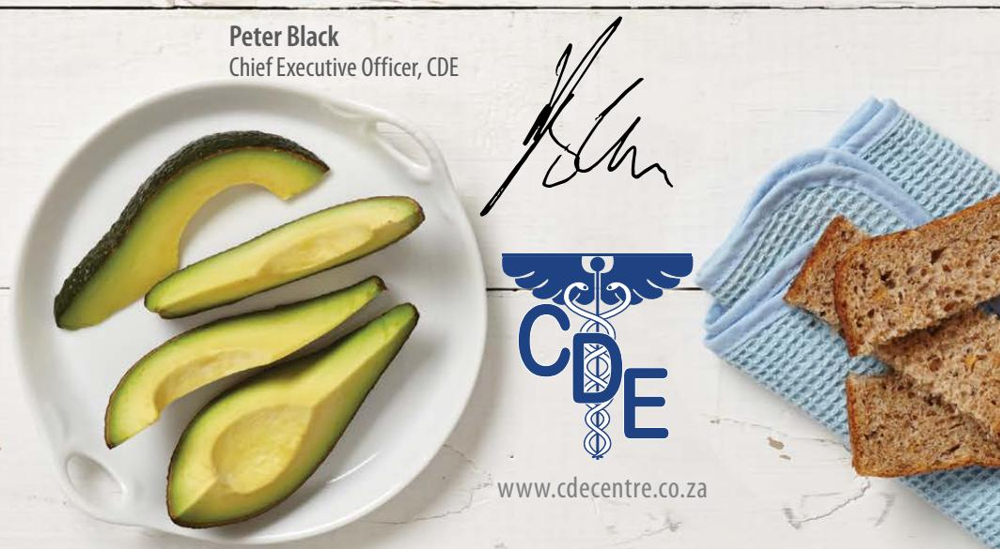

A high salt diet is a key contributor to high blood pressure which is one of the leading causes for **heart disease and stroke**

You should eat no more than **5 g of salt per day** – this is the same as one teaspoon and includes the salt that you add to your food as well as salt already found in foods

South Africans consume more than double the recommended amount of salt **(6 – 11 g per day)**

Half of the salt we eat is from salt added by manufacturers during the **processing of foods**

The other half of the salt we eat comes from salt we **add during cooking and salt sprinkled on at the table**

**Bread** is the single highest contributor to the total salt intake of South Africans

Salt is made up of two parts – sodium and chloride. Sodium is the part of salt that can **increase your blood pressure** when you eat too much of it

For more information visit **www.saltwatch.co.za** or call the Healthline **0860 1HEART** (43278)

**SALT**

**AND YOUR**