ISSN 1607-0658

# Food-Based Dietary Guidelines for South Africa

www.sajcn.co.za S Afr J Clin Nutr 2013;26(3)(Supplement):S1-S164

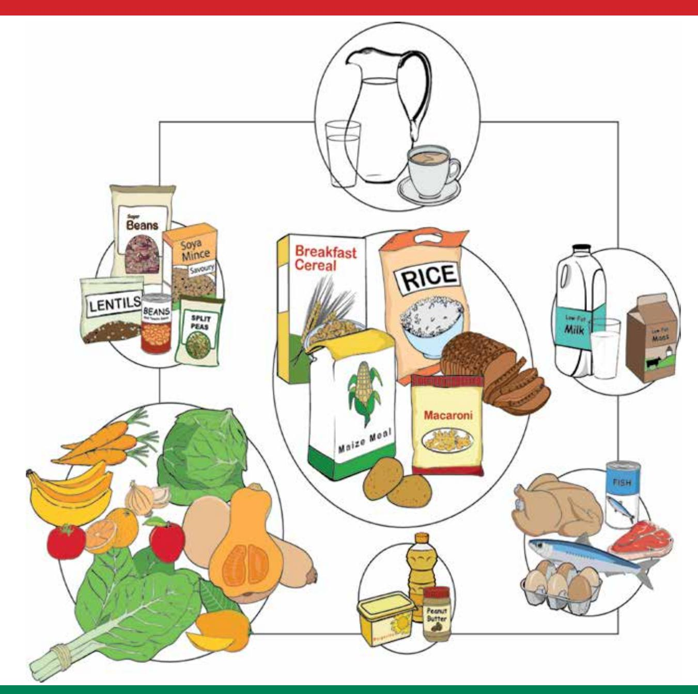

## Developed and sponsored by:

FBDG-SA 2013

# **Revised food-based dietary guidelines for South Africa: challenges pertaining to their testing, implementation and evaluation**

Food-based dietary guidelines (FBDGs) are brief, positive dietary recommendation messages that are used to inform consumers how to choose food and beverage combinations that will lead to a diet that is adequate, that meets nutrient need and that is, at the same time, prudent, for example, which lowers the risk of noncommunicable diseases (NCDs).1 FBDGs are based on the best available scientific evidence on the relationship between what we eat and our health. Furthermore, country-specific FBDGs are influenced by prevailing eating patterns and public health problems within the country.1

This special supplement in the current issue of the *SAJCN* publishes the technical support papers which motivate and explain each of the recently revised South African FBDG messages.

The revisions were executed for the following reasons:

- Firstly, when the South African FBDGs were initially designed and adopted by the Department of Health as "official" dietary recommendations for South Africa, it was advised that they should be revised regularly to assess if they still reflect the most recent available scientific evidence on the influence of dietary intake on health and disease.2
- Secondly, the Department of Health, Chief Directorate: Health Promotion and Nutrition, recently developed the first country-specific food guide for South Africa, and wanted to ensure that the FBDGs and the food guide were aligned, so that the latter could be used with confidence to implement the FBDGs in efforts to educate consumers about healthy eating.
- Thirdly, reports from practising dietitians and nutritionists indicated that some of the FBDGs in the first set, especially the alcohol FBDG,3-4 might be misinterpreted by consumers.
- Finally, the Department of Health requested that the existing paediatric FBDGs for South Africa5 should be revisited, so that they could become an integral part of the general recommendations for healthy eating.

The main purpose of the South African FBDGs, together with the food guide and education material that must be developed based on the technical support papers published in this supplement, is to inform, educate and empower South African consumers to change their eating behaviour.

Changed eating behaviour is necessary to address the double burden6-9 of nutrition-related public health problems in the country. This double burden is characterised by persistent food and nutrition insecurity6-7

and undernutrition6,8 in segments of the population, while overweight and obesity, and the consequent risk of NCDs, are on the increase.6,7,9 The rapid nutrition transition,7 an outcome of the present economic development, urbanisation and modernisation of South African society, is a major contributor to this double burden. Therefore, the challenge is to use the FBDGs to guide undernourished and overnourished consumers towards behavioural change that will lead to optimal nutrition. This challenge dictated the format of the FBDGs, ensuring that they were user friendly to a wide variety of consumers.

The aim of changed behaviour will only be reached if the FBDGs are used in nutrition programmes and interventions that are holistic and transdisciplinary, and which take into account factors that influence dietary choice. These factors include which food and beverages are available, affordable and preferred, and are themselves influenced by numerous other factors. Factors relate to poverty and food insecurity, lack of care, illness, and possibly the absence of knowledge among the undernourished about the best food and beverage choices to make within the confines of a low budget. Clearly, there is a need to help consumers adopt better child feeding practices and to choose more adequate diets.

At the same time, the consequences of overnutrition, associated with a high intake of energy from highly processed, energy-dense, micronutrient-poor, oily and salty take-away convenience foods and beverages, are major contributors to morbidity and mortality in South Africa.9 The many factors leading to this unfortunate modern eating pattern of a population in economic transition probably relate to complicated social, psychological and biological interactions. Clearly, there is a need to influence dietary behaviour towards a more prudent diet.

The South African FBDGs were developed to address both dietary adequacy and prudency. When the dietary recommendations are followed, the result should be optimum nutrition, commensurate with optimum physical and mental development, a lowered risk of NCDs, and health and well-being throughout the life course.

Therefore, the way in which the FBDGs are used to inform consumers about healthier eating behaviour will differ, depending on the needs of the target group. This is probably the biggest challenge with regard to implementation of the FBDGs: to change the consumer behaviour of people with the same nutrient requirements, but with very different social, economic and biological circumstances, as well as very different food preferences and eating behaviours. The global epidemic of obesity, in the face of the hundreds of millions who go to bed hungry at night, attests to the worldwide failure to attain the goal of optimal nutrition for everyone.

FBDGs can be a powerful tool in helping to achieve this worthy goal if they are applied with care and sensitivity, while taking into account traditional and existing eating patterns, available food and beverages, affordability and the inter-related factors that drive eating behaviour. This is supported by recommendations that emanated from the recently published South African National Health and Nutrition Examination Survey (NHANES),6 that FBDGs should be used as a tool to educate the population to adopt healthier eating and activity patterns. This requires the development of targeted educational material and welldesigned implementation programmes. Such programmes will have to use marketing principles to motivate consumers to change their behaviour. Furthermore, they should include evaluation components10 to monitor processes and outcomes, and both the short-term and long-term impact of the FBDGs. The results of such evaluations should be used to adapt the FBDG messages when, and where, indicated.

But, first, as indicated in many of the technical support papers published in this supplement, some testing of the formulated FBDGs needs to be performed as a matter of urgency. The previous set of general,11 as well as some of the paediatric,5 FBDGs were tested for comprehension.

At this stage, it is recommended that further testing of the guidelines should include:

- *• Testing for adequacy and prudency:* Linear programming,12 or other models, can be used to test how well different combinations of food and beverages, as recommended by the FBDGs, comply with standards for an adequate and prudent diet.
- *• Testing for comprehension:* It is important that before education material is developed for specific target groups, the understanding of the meaning of the FBDG messages by members of the target groups must be examined. Such testing could also assess barriers to implementation in the target groups, and should assist with decisions on how to overcome these barriers.

The first suggested testing is a theoretical exercise, and is ideal for postgraduate studies in nutrition or dietetics. The second suggested testing may be a daunting task. However, with good planning and coordination, this can be carried out at national level by researchers and postgraduate students at South Africa universities that train dietitians and nutritionists, in a series of repeated studies in the target groups. Such groups could include health, agricultural and other professionals who are involved in advising people on what to eat, mothers and caregivers of infants and children, primary school children, adolescent girls and boys, sports men and women, homogenous consumer groups (adult men and women), pregnant and lactating women, and the elderly. Within these groups, there will be subgroups from different socioeconomic backgrounds.

From reading the technical support papers in this supplement, it is obvious that great care was taken in designing FBDGs for South Africa. The process of developing the FBDGs took into account many relevant factors, as advised by the Food and Agriculture Organization of the United Nations and the World Health Organization.1 It is recommended that with the implementation of these FBDGs, the same level of care should be taken to ensure that they will impact on dietary behaviour and better nutritional health for the population. The latter approach would also be in line with the South African NHANES6 recommendations. Therefore, it is also recommended that the use of the FBDGs should be continuously monitored and evaluated to assess their potential impact. The Department of Health must ensure that the necessary human resources and funding are in place to test, implement and evaluate the revised FBDGs for South Africa.

The volunteers participating in the national working group and serving on specific working groups for individual FBDGs, as well as the authors and co-authors of this series of technical support papers, must be thanked and congratulated on a task well done!

#### **Hester Vorster,** DSc

Research Professor Centre of Excellence, North-West University, Potchefstroom

## **References**

- 1. Food and Agriculture Organization of the United Nations/World Health Organization. Preparation and use of food-based dietary guidelines. Geneva: FAO/WHO; 1998.
- 2. Gibney M, Vorster H. South African food-based dietary guidelines. S Afr J Clin Nutr. 2001;14(3):S2.
- 3. Morojele N. Alcohol consumption, nutrition, cardiovascular disease and iron status in South Africa: implications for South Africa's drinking guidelines. S Afr J Clin Nutr. 2010;23(3):S2-S3.
- 4. Gopane RE, Pisa PT, Vorster HH, et al. Relationships of alcohol intake with biological outcomes in an African population in transition: the Transition and Health during Urbanisation in South Africa (THUSA) study. S Afr J Clin Nutr. 2010;23(3):S16-S21.
- 5. Bourne LT. South African paediatric food-based dietary guidelines. Mat Child Nutr. 2007;3(4):227-229.
- 6. Shisana O, Labadarios D, Rehle T, et al. South African National Health and Nutrition Examination Survey. Cape Town: HSRC Press; 2013.
- 7. Vorster HH, Kruger A, Margetts BM. The nutrition transition in Africa: can it be steered into a more positive direction? Nutrients. 2011;3(4):429-441.
- 8. Labadarios D, Steyn NP, Maunder E, et al. The National Food Consumption Survey (NFCS): children aged 1-9 years, South Africa, 1999. Pretoria: Department of Health; 2000.
- 9. Norman R, Bradshaw D, Schneider M, et al. A comparative risk assessment for South Africa in 2000: towards promoting health and preventing disease. S Afr Med J. 2007;97(8 Pt 2):637-641.
- 10. Wentzel-Viljoen E. Development of a model for the monitoring and evaluation of nutrition and nutrition-related programmes in South Africa. [Unpublished PhD thesis]. Potchefstroom: North-West University; 2004.
- 11. Love P, Maunder E, Green M, et al. South African food-based dietary guidelines: testing of the preliminary guidelines among women in KwaZulu-Natal and the Western Cape. S Afr J Clin Nutr. 2001;14(1):9-19.
- 12. Ferguson EL, Darmon N, Briend A, Premachandra IM. Food-based dietary guidelines can be developed and tested using linear programming analysis. J Nutr. 2004;134(4):951-957.

# **An introduction to the revised food-based dietary guidelines for South Africa**

**Vorster HH**, DSc, Research Professor; **Badham JB**, MSc, Research Scientist; **Venter CS**, DSc, Extraordinary Professor Centre of Excellence for Nutrition, North-West University, Potchefstroom **Correspondence to:** Este Vorster, e-mail: este.vorster@nwu.ac.za **Keywords:** food-based dietary guidelines, FBDGs, paediatric FBDGs, nutrition education, noncommunicable diseases, dietary adequacy

## **Abstract**

**1**

Food-based dietary guidelines (FBDGs) are short, positive, science-based messages that aim to change the eating behaviour of the general population towards more optimal diets that meet energy and nutrient requirements, while simultaneously helping to protect against the development of noncommunicable diseases. Recently, a national working group revised the South African set of FBDGs (i.e. the draft paediatric FBDGs and the general FBDGs). Expert working groups have written technical support papers for each of the individual revised FBDGs published in this supplement of the journal. The recognition that child malnutrition remains a major public health problem in South Africa led to the formulation of a specific set of guidelines for the mothers and caregivers of infants and young children from birth to five years of age, based on existing paediatric nutrition-related health issues and local dietary habits. In this introductory paper, the process of the development and revision of the FBDGs for South Africa is briefly reviewed. The need for specific FBDGs is motivated by prevailing health risk factors and dietary intakes in South Africa. Potential barriers to the implementation of the guidelines are identified and recommendations are made for the development of educational material, as well as for the design of implementation, monitoring and evaluation programmes. It is concluded that the use of guidelines to educate and empower mothers and caregivers, as well as schoolchildren, adolescents and adults, on how to follow a healthier diet, could be a powerful tool in combating both under- and overnutrition-related public health problems throughout the life course.

 **Peer reviewed. (Submitted: 2013-04-08 Accepted: 2013-08-14.) © SAJCN S Afr J Clin Nutr 2013;26(3)(Supplement):S5-S12**

## **Introduction**

The perception that "people eat foods and not nutrients" led nutrition scientists to replace nutrientbased recommendations for the public with foodbased dietary guidelines (FBDGs), which are dietary recommendations based on local food and eating patterns.1,2 Therefore, FBDGs are science-based policy recommendations in the form of guidelines for healthy eating.3 They are a translation of the evidence-based nutrient recommendations into food or dietary patterns that should guide the general population to consume a healthy, optimal diet. The key concepts of FBDGs and the scientific evidence-based methodology for their preparation and use were conceptualised and designed by the joint Food and Agriculture Organization of the United Nations (FAO)/World Health Organization (WHO) consultation that was held in Nicosia, Cyprus in 1995.1 This effort was a response to the World Declaration and Plan of Action on Nutrition adopted by the 1992 International Conference on Nutrition.4 The action plan was to eliminate and reduce famine and famine-related deaths, starvation and specific nutritional deficiencies, and also to reduce nutrition-related noncommunicable diseases (NCDs). Thus, FBDGs became part of the FAO/WHO strategy to promote appropriate diets through recommendations of optimal dietary patterns and healthy lifestyles. Governments were called upon to provide evidence-based advice to the public in the form of guidelines that they could understand, to which they could relate, and which they could apply. Therefore, it is important to note that the purpose of FBDGs is to simultaneously ensure the adoption of adequate diets that meet all nutrient needs, and diets that help to prevent the development of deficiencies and NCDs.

In the nutrition literature, FBDGs are often suggested as a tool that can be used to improve optimal nutrition and health.5,6 Unfortunately, less is known about the successes and failures and the impact of implementation on dietary behaviour and health in the short or long term. This may be because, although the science of and supporting methodology for the development of FBDGs has been documented to a certain extent,1-3 many countries still lack the capacity with which to translate scientific evidence into FBDGs and to develop appropriate educational and promotional material, implementation programmes and monitoring and evaluation strategies.

The objectives of this introduction are to review the South African process by which FBDGs for the general population, as well as those for infants and young children, were developed and revised; to summarise nutrition-related health outcomes and dietary intakes in South Africa, in order to motivate for specific, local guidelines; and to explore the barriers to communicating nutritional messages to the public. A holistic approach towards the development of educational materials for the FBDGs messages and the design of an appropriate implementation plan, as well as monitoring and evaluation strategies, will be discussed.

## **The South African process for developing and revising FBDG messages**

The Nutrition Society of South Africa (NSSA) initiated the process of designing FBDGs for the general South African population in 19977 in partnership with the Department of Health, Directorate Nutrition, the Medical Research Council (MRC) and several other stakeholders from different United Nations' agencies and food producer organisations in South Africa. The testing of the developed messages in women of different population groups8 was funded by the United Nations Children's Fund (UNICEF). The technical support papers, promoting the guidelines from scientific literature and providing more information about the types and amounts of the different food groups to be eaten, were published in the *South African Journal of Clinical Nutrition* in 2001.9 The Department of Health formally adopted the set of FBDGs in 2003 to form the basis of nutrition communication to the public, with the addition of a guideline on sugar intake, based on the relationship between sugar consumption and dental caries. The final set of 11 guidelines is listed in Table I. These FBDGs were aimed at individuals aged seven years and older.

Therefore, a similar process was initiated by the NSSA, who established a paediatric working group to develop FBDGs for infants and children younger than seven years of age, which was published in *Maternal and Child Nutrition* in 2007.10 The paediatric guidelines were specific to the following age groups: birth to 6 months; > 6 months to

**Table I:** First set of South African food-based dietary guidelines, 2003

• Enjoy a variety of foods.

- Be active.
- Make starchy foods the basis of most meals.
- Eat dry beans, peas, lentils and soy regularly.
- Chicken, fish, meat or eggs can be eaten daily.
- Drink lots of clean, safe water.
- Eat plenty of vegetables and fruit every day.
- Eat fats sparingly.
- Use salt sparingly.
- If you drink alcohol, drink sensibly.
- Use foods and drinks containing sugar sparingly, and not between meals.

< 12 months; and > 1 year to < 7 years. They paralleled the FBDGs for children aged seven years and older,11 with the introduction of the same messages to target the younger ages. However, these paediatric FBDGs were not officially adopted by the Department of Health as, because of funding constraints, the messages had not been fully tested.

The majority of South Africans are experiencing a rapid process of economic development, urbanisation, acculturation and modernisation of their dietary habits. This phenomenon, together with new knowledge about the relationships between dietary intakes and health, led to the recommendation that the 2003 FBDGs should be reviewed and adapted accordingly on a regular basis.7 In 2011, the Department of Health, Directorate of Nutrition, embarked on a process, funded and supported by the FAO, to develop a food guide for South Africa. As part of this process, it was decided to review the existing FBDGs.

A national working group was convened and, during a workshop that took place in March 2011, several expert working groups, including a paediatric working group, were formed to review the new literature and make suggestions regarding revision of the specific guidelines. The expert and paediatric working groups reported their findings and made suggestions to the national working group during a meeting in July 2011. During this meeting, consensus was reached on the formulation of a set of FBDGs for the general population of individuals older than five years of age, a separate set of paediatric guidelines for infants and children younger than five years of age, the inclusion of a milk guideline in the general FBDGs, a focus on the quality of fats in the fat guideline, and minor changes to the wording of some of the other guideline messages. It was also agreed that the alcohol guideline created much confusion, especially the words "drink sensibly". As there are other initiatives in South Africa that address alcohol abuse, it was decided to delete this guideline message. However, a technical support paper on alcohol is included in this supplement, to assist nutritionists and dietitians in dealing with alcohol recommendations.

Special attention was given to the words "eat", "consume" and "use". "Use" was restricted to the salt, sugar and fat guidelines, because salt and sugar, and at times fats and oils, are seen as ingredients that are added in the preparation of food. Debate on the use of "regularly", "sparingly" and "moderately" led to slight reformulation of some guidelines. It was also decided that each expert working group would take responsibility for writing the technical support paper according to a specific termsof-reference document, and that information in the technical support paper should also focus on the needs of infants and children under five years of age, where relevant. Final consensus on the wording of each guideline and the information included in the technical support papers, published in this supplement, was obtained during a meeting of the national working group on 26 June 2012.

The revised set of general FBDG messages for South African adults and children aged five years and older is listed in Table II.

The food guide, illustrating the food groups that should be eaten regularly, developed in parallel to the revision of the FBDGs, is shown in Figure 1. This food guide has been developed for South Africans with support from the FAO. It only shows food groupings that are necessary for healthy eating. It does not, like many other food guides, such as the widely used food pyramid, include items such as sugar, sweetened foods and drinks, or salt. The proportional size of the food group circles symbolically reflect the proportional volume that the group should contribute to the total daily diet.

#### **Nutrition-related health outcomes in South Africa**

One of the first principles in designing FBDG messages for a specific country or region is that the guidelines should address existing public health problems.1-3 To revise the

#### **Table II:** Revised general food-based dietary guidelines for South Africans, 2012

- Enjoy a variety of foods.
- Be active!
- Make starchy foods part of most meals.
- Eat plenty of vegetables and fruit every day.
- Eat dry beans, split peas, lentils and soya regularly.
- Have milk, *maas* or yoghurt every day.
- Fish, chicken, lean meat or eggs can be eaten daily.
- Drink lots of clean, safe water.
- Use fats sparingly. Choose vegetable oils, rather than hard fats.
- Use sugar and foods and drinks high in sugar sparingly.
- Use salt and food high in salt sparingly.

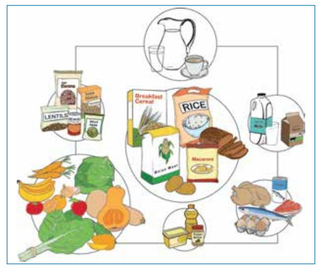

**Figure 1**: The South African food guide (Department of Health, Directorate Nutrition)

FBDGs, the MRC's comparative risk assessment for South Africa, published in 2007, was used to re-evaluate the appropriateness of the FBDGs. The assessment was based on the underlying causes of premature mortality and morbidity observed in South Africa in 2000.12 The risk factors were identified based on the burden of disease, taking into account factors such as "likely to be among the leading causes of burden of disease or injury, evidence of causality, being potentially modifiable and availability of data".12 In Table III, a summary of the contribution of 17 selected risk factors to percentages of total deaths, as well as total disability-adjusted life years, is shown.

Of the 17 selected risk factors, nine relate directly to nutrition as acknowledged in the MRC report, namely high blood pressure,13 alcohol harm,14 excess body weight,15 high cholesterol,16 diabetes,17 low fruit and vegetable intake,18 childhood and maternal underweight,19 vitamin A deficiency20 and iron deficiency anaemia.21 Two of the risk factors, namely physical inactivity (leading to an energy imbalance and overweight), and unsafe water, sanitation and hygiene (leading to diarrhoeal diseases), indirectly relate to nutrition and are therefore also addressed by the FBDGs.

**Table III:** Contribution of selected risk factors to percentage of deaths and disability-adjusted life years in South Africa in 2000 (521 thousand deaths and 16.2 million disability-adjusted life years)12

| Identified risk factor                  | % total deaths | % total DALYs |
|-----------------------------------------|----------------|---------------|
| Unsafe sex and STIs (HIV/AIDS)          | 26.3           | 31.5          |
| High blood pressure                     | 9.0            | 2.4           |
| Tobacco smoking                         | 8.5            | 4.0           |
| Alcohol harm                            | 7.1            | 7.0           |
| High BMI and excess body weight      | 7.0            | 2.9           |
| Interpersonal violence (risk factor) | 6.7            | 8.4           |
| High cholesterol                        | 4.6            | 1.4           |
| Diabetes (risk factor)                  | 4.3            | 1.6           |
| Physical inactivity                     | 3.3            | 1.1           |
| Low fruit and vegetable intake          | 3.2            | 1.1           |
| Unsafe water, sanitation and hygiene | 2.6            | 2.6           |
| Childhood and maternal underweight   | 2.3            | 2.7           |
| Urban air pollution                     | 0.9            | 0.3           |
| Vitamin A deficiency                    | 0.6            | 0.7           |
| Indoor air pollution                    | 0.5            | 0.4           |
| Iron deficiency anaemia                 | 0.4            | 1.1           |
| Lead exposure                           | 0.3            | 0.4           |

AIDS: acquired immune deficiency syndrome, BMI: body mass index, DALYs: disability-adjusted life years, HIV: human immunodeficiency virus, STIs: sexually transmitted infections

The relationship between overnutrition and NCDs (associated with the first six risk factors that relate directly to nutrition) is well established, and forms the basis for the WHO recommendations for the prevention of chronic diseases.22 The last three risk factors directly relate to undernutrition and a lack of dietary variety.

Recently, Vorster et al23 showed that the present nutrition transition, associated with economic development, urbanisation and modernisation in South Africa, is characterised by changes in dietary patterns and nutrient intakes that will increase the risk of diet-related NCDs. These changes include decreased intake of staple foods that are rich in starch and dietary fibre, increased consumption of food from animal origin which is rich in total and saturated fat, decreased intake of legumes and vegetables, and increased intake of energy-dense, micronutrient-poor snack and convenience foods (which are often very salty) and sweetened carbonated beverages. Although more fruit consumption was observed, the increased meat and fruit intake was insufficient to meet micronutrient needs.23

The primary nutrition-related conditions and risk factors in South African children include stunting, underweight, vitamin A deficiency, the risk of inadequate micronutrient intake, overweight and obesity, and the presence of early NCD risks.24,25 Nationally representative studies have been conducted on South African children. In 1994, the South African Vitamin A Consultative Group (SAVACG) recruited children aged 6-71 months24 and, in 1999, the National Food Consumption Survey (NFCS) group included children aged 1-9 years.25 Similar results were reported by the investigators. In the SAVACG study, the national prevalence for underweight [weight for age < -2 standard deviation (SD)] was 9.3%, stunting (height for age < -2 SD) was 22.9%, and wasting (weight for height < - 2 SD) was 2.6%.24

In the NFCS, the national prevalence of underweight was 10.3%, stunting 21.6% and wasting 3.7%.25 According to the NFCS,25 dietary intake in most children was confined to a relatively narrow range of foods of low micronutrient density. Reported energy intakes were variable and were particularly inadequate in rural areas. While requirements were met for protein and macronutrients in general, inadequate intakes were reported for vitamins A, C, niacin, vitamin B6 , folate, calcium, iron and zinc.25 However, it must be noted that these data were collected prior to mandatory fortification of staple foods in 2003.

In the SAVACG survey, vitamin A deficiency was identified as a public health problem, as 33% of the sampled children were marginally deficient (serum retinol < 20 mg dl/1).24 Children in the age group 36-47 months were the most affected. In 2003, regulations for the mandatory fortification of all maize meal and wheat flour with vitamin A, thiamine, niacin, riboflavin, pyridoxine, folate, iron and zinc was introduced.26 A randomised intervention trial was conducted thereafter in the North West province, to evaluate the effectiveness of vitamin-fortified maize meal in improving the nutritional status of one- to five-yearold malnourished children. 27 Despite the small sample size, after 12 months the study showed that fortified maize meal could significantly improve weight gain in children in the experimental group (4.6 kg vs. 2 kg). The micronutrient status of one- to three-year-old children was also superior.27

In the past, the problem of undernutrition in children may well have led to overweight not being investigated. In 1994, 9% of children aged 3-6 years from a representative sample of African children in Cape Town were reported to be overweight (weight for age z-score 2 SD), while 20.1% reflected weight for height z-scores > 2 SD.28 More recently, combined overweight and obesity of 20.3% was observed in infants aged 6-12 months in the Eastern Cape and KwaZulu-Natal provinces, compared to 15% of children aged 12-24 months, with a low prevalence of underweight and wasting for all age groups.29 Secondary data analysis30 of the NFCS data collected in 1999, using the body mass index (BMI) reference percentiles recommended for use in children by the International Obesity Task Force to determine the prevalence of overweight and obesity, showed that 17.1% [confidence interval (CI): 15-19.2%] of the children had BMI ≥ 25 kg/m2 (combined overweight and obesity range). These data show that in South Africa, the double burden of under- and overnutrition is already seen in young children, and call for innovative ways to tackle the problem of malnutrition.

Both nonexclusive breastfeeding and inappropriate complementary feeding are globally acknowledged to have a significant negative impact on the child mortality and disease burden.31 South Africa does not have country trend data on key indicators to monitor breastfeeding and complementary feeding practices. The available literature shows that the initiation rate of breastfeeding is approximately 88%. However, only 8% of babies are exclusively breastfed at six months, and more than 70% of infants receive solids foods before the age of six months.32 This indicates that there is cause for concern about the feeding practices of infants and young children in South Africa and specific paediatric FBDGs are certainly warranted. The paediatric working group agreed that a single set of FBDGs was not appropriate for this age group, and thus agreed that four age categories and associated FBDGs would be considered: 0-6 months, 6-12 months, 12-36 months and 3-5 years. Although the exact wording would need to be tested to ensure that the messages are clearly understood, suggested FBDGs for the four categories were proposed and are listed in Table IV.

It appears that little progress has been made in improving the nutritional status of South African children in the past two decades, with persistent high levels of stunting and growing concerns about overweight and obesity. These concerns are discussed in the technical support papers in this supplement.

## **Table IV**: Proposed paediatric food-based dietary guidelines, still to be tested

#### **0-6 months**

• Give only breast milk, and no other foods or liquids, to your baby for the first six months of life.

#### **6-12 months**

- At six months, start giving your baby small amounts of complementary foods, while continuing to breastfeed to two years and beyond.
- Gradually increase the amount of food, number of feeds and variety as your baby gets older.
- Feed slowly and patiently and encourage your baby to eat, but do not force him or her.
- From six months of age, give your baby meat, chicken, fish or egg every day, or as often as possible.
- Give your baby dark-green leafy vegetables and orangecoloured vegetables and fruit every day.
- Start spoonfeeding your baby with thick foods, and gradually increase to the consistency of family food.
- Hands should be washed with soap and clean water before preparing or eating food.
- Avoid giving tea, coffee and sugary drinks and high-sugar, high-fat salty snacks to your baby.

### **12-36 months**

- Continue to breastfeed to two years and beyond.
- Gradually increase the amount of food, number of feedings and variety as your child gets older.
- Give your child meat, chicken, fish or egg every day, or as often as possible.
- Give your child dark-green leafy vegetables and orangecoloured vegetables and fruit every day.
- Avoid giving tea, coffee and sugary drinks and high-sugar, high-fat salty snacks to your child.
- Hands should be washed with soap and clean water before preparing or eating food.
- Encourage your child to be active.
- Feed your child five small meals during the day.
- Make starchy foods part of most meals.
- Give your child milk, *maas* or yoghurt every day.

## **3-5 years**

- Enjoy a variety of foods.
- Make starchy foods part of most meals.
- Lean chicken or lean meat or fish or eggs can be eaten every day.
- Eat plenty of vegetables and fruit every day.
- Eat dry beans, split peas, lentils and soya regularly.
- Consume milk, *maas* or yoghurt every day.
- Feed your child regular small meals and healthy snacks.
- Use salt and foods high in salt sparingly.
- Use fats sparingly. Choose vegetable oils, rather than hard fats.
- Use sugar and food and drinks high in sugar sparingly.
- Drink lots of clean, safe water and make it your beverage of choice.
- Be active!
- Hands should be washed with soap and clean water before preparing or eating food.

Considering the diet-related risk factors associated with mortality and morbidity in South African society, as well as the documented changes in dietary patterns and nutrient intakes by the majority of the South African population, it is clear that the double burden of both under- and overnutrition should be addressed by the FBDGs. All of the risk factors are addressed by at least one, and mostly by more than one, of the FBDG messages. It is important to note that many of these risk factors are inter-related, and that they share common pathways. Therefore, one dietary recommendation may impact on more than one risk factor, while some risk factors would need more than one intervention. For example, a recommendation to reduce total and saturated fat intake should address both excess weight gain and high blood cholesterol levels, while advice on increased intakes of wholegrain starchy foods, legumes, milk, *maas* and yoghurt, as well as vegetables and fruit, contributes to better micronutrient nutrition.

Specific dietary deficiencies and excesses that relate to these risk factors, and how the FBDGs will address them, are discussed in more detail in each of the technical support papers in this supplement.

## **Communicating nutrition messages to the public: barriers to the implementation of FBDGs**

The purpose of FBDGs is to inform the public about healthy eating, and to motivate people to make the right choices that will result in adequate, balanced diets that will also protect against undernutrition, excess weight gain and other NCDs. This often means that people should eat improved quality diets, but in some cases they may also need to eat less of certain foods. Therefore, FBDGs aim to change dietary behaviour, which is known to be extremely difficult. This is evidenced by the worldwide obesity epidemic and increasing rates of NCDs in developing countries. Most of these countries still battle with the consequences of food and nutrition insecurity, and now have to simultaneously address direct dietary behaviour that leads to obesity and NCDs.

The problem of conveying balanced nutrition messages was recently analysed by Goldberg and Sliwa.33 They point out that four sets of interlinked factors are major challenges in nutrition communication. These factors were grouped as:

- The evolutionary nature of the science on which recommendations are based.
- The many sources of communication of that science.
- The agenda or motivation of each source.
- The multifaceted nature of consumers, who are the recipients of these communications.

When designing any intervention programme with regard to use of FBDGs in the context of the South African situation in order to promote healthier eating, these factors or barriers to implementation should be considered.

## **The changing and developing nature of nutrition science**

As will be seen in the technical support papers, the best available evidence about the relationship between nutrition and health has been used to formulate each guideline. However, continued research, based on technological developments in methodologies as part of the advancement of science, often produce new knowledge that will change dietary recommendations.

For example, in the past, the established relationship between saturated fat intake, hypercholesterolaemia and heart disease led to a recommendation that polyunsaturated fat margarine should replace saturated fat in the diet. New knowledge about the detrimental consequences of the trans*-*fat content of these margarines, as well as the beneficial effects of omega-3 fatty acids, have influenced fat recommendations over the years. Today, margarine is manufactured to be transfat free, and more emphasis is placed on the quality of fat to ensure sufficient intakes of omega-3 fatty acids. There are many other examples, such as new knowledge about the beneficial effects of whole grains, dietary fibre, and pre- and probiotics, the potentially protective effects of antioxidant chemicals found in plant foods, the anticancer properties of some vegetables, the bioactive compounds in milk, and the contribution of added sugar to childhood obesity. All these developments have influenced revision of the South African FBDGs.

Therefore, it is possible that the public could lose confidence in dietary recommendations because they change over time. This barrier should be seen as a challenge to educate the public and establish the understanding that nutrition science is evolutionary and dynamic and that new research findings for which there is convincing evidence may lead to new dietary recommendations. This illustrates the importance that dietary recommendations should be made responsibly, and only when there is convincing evidence that the advice will benefit consumers, address public health problems and cause no harm.

## **Conflicting sources of nutrition information**

There are many sources of dietary information (people and organisations, and their communication material and channels). These sources include scientists, health professionals, scientific and professional societies, academic institutions, scientific journals, government departments, the United Nations agencies involved in nutrition (WHO, FAO, UNICEF and the International Council of Nutrition), non-government organisations, the food and beverage industry, and a growing multitude of social, printed, radio and electronic media. The way in which nutrition information is presented by, and in, these sources, varies, and is often not in a format that aims to inform the public.

Unfortunately, the agendas and motivations of the many sources of nutrition information also differ. For some, ideally, the motivating factor could be the responsibility of improving health, while for others it could be the promotion and sale of specific products. Consequently, the same set of nutrition knowledge may be communicated to the public in totally different ways. This information may be difficult to understand, and misleading. Consumers who must make food and beverage choices could be so bombarded by conflicting information that they simply choose what is affordable, what they like, or what is the most convenient.

Food labels on packaged products provide some useful, standardised and quality-controlled nutrition information,34 but not always in a way that is easily understood by many consumers, or that can easily be converted into guiding relevant choices and appropriate portion sizes. Most suppliers of fresh foods and pre-prepared, ready-to-eat meals and convenience take-away foods do not provide nutritional information. In South Africa, doing so becomes mandatory when a claim is made, and many consumers have little understanding of the nutritional contribution of these foods to a healthy or unhealthy diet.

Aggressive and clever advertising and marketing of specific products to specific consumers during particular times and events may further influence food and beverage choices. An example is the many worldwide efforts to limit advertisements about sugary and salty snack foods to children during prime-time television.35 The impact of these interventions on children's health in South Africa is unknown.

In South Africa, the challenge is the establishment in the mind of consumers of which nutrition information sources can be trusted to provide unbiased, objective and responsible information, based on scientific evidence of beneficial effects, in a way that consumers can understand and be motivated enough by to change their buying and eating behaviour. This would mean the development of skills to translate complex scientific information into meaningful health promotion strategies.36 The use of FBDGs as the basis or starting point for all nutrition communication from different sources of information is a step in the right direction. But it means that all role players must adopt a science-based health agenda for their nutrition communication. They should work together in partnerships to improve the food and beverage environment in South Africa by making healthy choices affordable and available, by influencing consumers to make healthier choices, and by ensuring consistent messaging that does not deviate from the FBDGs.

## **The multifaceted nature of consumers**

Universally, humans inherently prefer palatable diets37 that contain foods that are rich in fat and cream, are refined, and are sugary and salty. This is a major barrier to the adoption of a more varied, healthier diet that contains sufficient unrefined, minimally processed plant foods.

Factors such as differences in levels of education, socioeconomic status, age, gender, fashion, peer pressure, culture and tradition, also complicate the implementation of FBDGs and should be taken into account when specific groups are targeted.

It should also be remembered that when previously disadvantaged people who were hungry or food insecure at any time of their life are suddenly confronted with a wide variety of affordable and palatable food, their choices are not necessarily governed by what is healthy.

The previous set of FBDGs was tested on women in KwaZulu-Natal and the Western Cape.8 We recommend that the new guideline on milk, *maas* and yoghurt consumption, and perhaps the ones which are differently formulated to what they were previously, are tested in the same way in various culture groups in different parts of the country. The paediatric FBDGs also require testing.

## **A holistic FBDG programme**

Taking all of the above into account, it is clear that for successful implementation of FBDGs, a holistic approach is necessary, in which all stakeholders or role players work together to improve the food environment and empower consumers to make healthier choices. A national working group has now revised the existing set of FBDGs for South Africa, a food guide has been developed and specific paediatric FBDGs have been proposed. The technical support papers published in this journal explain and promote the FBDG messages to health professionals, and are one set of educational material that can be used to support the FBDGs. Additional educational material for specific target groups should now be developed. This material must address the particular needs of target groups. It must also be arranged in a format that they will easily understand, and to which they can relate and practically implement. It is important that educational materials address the problem of the affordability of food for those suffering from poverty-related food insecurity. For example, they should indicate alternative sources of available food for the needy.

The next step would include designing implementation programmes, for example, by applying social marketing principles to promote the FBDGs in order to improve eating behaviour. It is important that as part of their design, these interventions should include monitoring and evaluation components. The evaluation components must make provision for process, outcome, impact and efficiency evaluations,38 which should indicate if adjustments to the programme are needed. The monitoring and impact evaluation of the use of FBDGs could form part of regular surveillance of the nutritional status of all South Africans.

## **Conclusion**

South Africans are continually exposed to confusing and misleading dietary information. The revised FBDGs are evidenced-based recommendations on how a healthy diet can be chosen. The technical support papers in this supplement explain how and why each guideline will contribute to a healthier diet in more detail. The FBDG messages are qualitative, but the technical support papers provide information on the amounts (frequency and weight or volumes of portion or serving sizes) recommended for healthy eating. The papers also provide practical advice on how to overcome barriers for the implementation of each guideline. If used correctly, FBDGs can be a powerful tool for addressing nutritionrelated public health problems in South Africa.

## **References**

- 1. Food and Agriculture Organization of the United Nations/World Health Organization. Preparation and use of FBDGs. Geneva: WHO; 1996.
- 2. Food and Agriculture Organization of the United Nations/World Health Organization. Preparation and use of FBDGs. Geneva: WHO; 1998.
- 3. European Food Safety Authority. FBDGs: Scientific opinion of the panel on dietetic products, nutrition and allergies. EFSA Journal. 2008;1-44.
- 4. Food and Agriculture Organization of the United Nations. World declaration and plan of action for nutrition. Rome: FAO/WHO International Conference on Nutrition; 1992.
- 5. Smitasiri S, Uauy R. Beyond recommendations: implementing FBDGs for healthier populations. Food Nutr Bull. 2007;28(1)(Suppl International):S141-S151.
- 6. Wahlqvist ML. Connected community and household food based strategy (CCH-FBS): its importance for health, food safety, sustainability and security in diverse localities. Ecol Food Nutr. 2009;48(6):457-481.
- 7. Vorster HH, Love P, Browne C. Development of FBDGs for South Africa: the process. S Afr J Clin Nutr. 2001;14(3):S3-S6.
- 8. Love P, Maunder E, Green M, et al. South African FBDGs: testing of the preliminary guidelines among women in KwaZulu-Natal and the Western Cape. S Afr J Clin Nutr. 2001;14(1):9-19.
- 9. Vorster HH. South African FBDGs. S Afr J Clin Nutr. 2001;14(3):S1-S80.
- 10. Aggett P, Moran VH. FBDGs for infants and children: the South African experience. Mat Child Nutr. 2007;3(4):223-333.
- 11. Bourne LT. South African paediatric FBDGs. Mat Child Nutr. 2007;3(4):227-229.
- 12. Norman R, Bradshaw D, Schneider M, et al. A comparative risk assessment for South Africa in 2000: towards promoting health and preventing disease. S Afr Med J. 2007;97(8 Pt 2):637-641.
- 13. Norman R, Gaziano T, Laubscher R, et al. Estimating the burden of disease attributable to high blood pressure in South Africa in 2000. S Afr Med J. 2007;97(8 Pt 2):692-698.
- 14. Schneider M, Norman R, Parry C, et al. Estimating the burden of disease attributable to alcohol use in South Africa in 2000. S Afr Med J. 2007;97(8 Pt 2):664-672.
- 15. Joubert J, Norman R, Bradshaw D et al. Estimating the burden of disease attributable to excess body weight in South Africa in 2000. S Afr Med J. 2007;97(8 Pt 2):683-690.

# **"Enjoy a variety of foods": a food-based 2 dietary guideline for South Africa**

**Steyn NP**, MPH, PhD, RD, Chief Research Scientist, Centre for the Study of Social and Environmental Determinants of Nutrition Population Health, Health Systems and Innovation, Human Sciences Research Council, Cape Town

**Ochse R,** RD, MBL, Lecturer Tshwane University of Technology, Faculty Management Sciences, Department Hospitality Management, Pretoria

**Correspondence to:** Nelia Steyn, e-mail: npsteyn@hsrc.ac.za

**Keywords:** food-based dietary guidelines, FBDGs, variety, diversity, nutrient adequacy, food security

#### **Abstract**

Eating a diverse diet is an internationally accepted recommendation for a healthy diet. The food-based dietary guideline (FBDG) "Enjoy a variety of foods" aims to encourage people to consume mixed meals, to increase variety by eating different foods from various food groups, and to alter food preparation methods. This position paper suggests ways of measuring dietary variety, addresses the consequences of poor dietary variety in South Africa, and provides results pertaining to dietary variety in South African children and adults. The literature reveals that dietary diversity is best calculated by means of different food groups, which are based on the traditional eating patterns of the population under investigation. Ideally, the recall period should be three days. Two national surveys in South Africa have provided data on dietary diversity scores (DDS) in adults and children, of 4.02 and 3.6 respectively. It was shown that in children, DDS positively relates to weightfor-height z-scores, with a z-score above zero being achieved when DDS is > 4. However, an energy-dense diet is cheaper and lower in micronutrients and also positively associated with increased body mass index in women. Hence, dietary variety is essential in improving the micronutrient intake of the diet, and is also important in preventing obesity. Household food insecurity in South Africa remains a constraint on the implementation of this guideline. This FBDG should be used in conjunction with the other South African FBDGs, to ensure the sufficient intake of food that contains protective factors and the limited intake of food that is known to increase the risk of noncommunicable diseases.

 **Peer reviewed. (Submitted: 2013-04-08. Accepted: 2013-08-12.) © SAJCN S Afr J Clin Nutr 2013;26(3)(Supplement):S13-S17**

#### **Introduction**

The terms, "dietary diversity", "dietary variety", "dietary quality" and "nutrient adequacy" are frequently used to describe the diet of an individual or population. Dietary diversity refers to the number of food groups or foods which are consumed over a specific period. Dietary variety is also commonly used, and is regarded as being synonymous with diversity. Dietary quality generally refers to dietary adequacy, which, in turn, refers to a diet that meets all energy and nutrient requirements.1,2

#### **Why variety is important**

A healthy diet contains sufficient water, energy, macronutrients and micronutrients to meet requirements. When these conditions are sustainably met, the person can be considered to be food secure. This is demonstrated by Figure 1 from Kennedy,2 based on the United Nations Children's Fund conceptual framework.3 Household food security ensures an adequate individual dietary intake, which together with health status, influences nutritional status. Household food security itself is influenced by household dietary variety. If this is poor, then food security will be compromised. An individual needs many nutrients for optimal health. Unfortunately, no one food contains all of these nutrients, hence a variety of foods need to be consumed to guarantee the provision of nutrients. Conversely, a diet that is low in variety is likely to be deficient in some nutrients and may result in food insecurity and consequent malnutrition. When people follow a monotonous diet, it is frequently based on starchy food, with few animal products and fruit and vegetables.4

A USA study that evaluated the five Food Guide Pyramid (FGP) groups and 22 subgroups showed that dietary variety increased the adequacy of intake of 15 nutrients in adults (4 969 men and 4 800 women) based on 24 hour recall data. After adjusting for energy intake and the number of FGP food group servings, all types of dietary variety were positively associated with mean nutrient adequacy across these 15 nutrients. The strongest associations were for commodity-based variety and for 22 FGP subgroup consumption servings.5,6 A national study on adults in Belgium (n = 3 245)that used 24-hour recall data also found a positive association between overall dietary diversity and dietary adequacy and balance.7 Similarly, a study on the elderly in a rural community of Iowa found that dietary variety was positively associated with the intake of a number of nutrients, energy and fibre.8 Data from the National Food Consumption Survey (NFCS) in South Africa showed that the dietary diversity and food variety of children were positively associated with dietary adequacy, as illustrated by the mean adequacy ratio of the diet.9

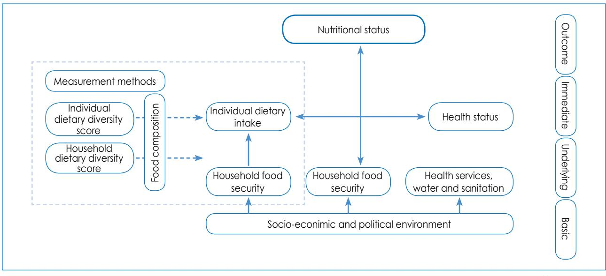

**Figure 1:** Adaptation of the conceptual framework of the causal model of nutritional status in order to show dietary diversity2,3

#### **Measuring dietary variety**

To date, there does not appear to be consensus on the optimal method of measuring dietary variety. Numerous systems have been tested over the years. This has made it difficult to compare studies that have used different systems.

The majority of researchers have used the total of different foods or food groups consumed over recall periods of 1-3 days, although seven days have also been used.4 Drewnowski et al10 used data from one 24-hour recall, together with 14 days of food records, to measure dietary variety. Some researchers have used a simple food variety count, which comprises the total of different food items eaten by the group of participants,11 while others have scored the number of food groups consumed. These have varied between four and 12 groups.10 Ruel reviewed the operationalisation of dietary diversity and made some important recommendations, namely that food group diversity is a better indicator than a count of individual foods.4 She suggested that the number and type of food groups selected should be based on the dietary patterns of the specific population group being studied, in terms of age and culture. She further recommended that the recall period should be at least three days, since one day may underestimate the true variability of intake.4

## **Nutrients that are deficient in the South African population**

Micronutrient deficiencies are still rife in South Africa, despite concentrated efforts by the Department of Health to curb them. The most serious of these are iron, vitamin A, iodine, folate and zinc deficiencies. The prevalence of iron deficiency anaemia was 28.9% in 2005 in children under five years of age. Iodine deficiency was 19.2%, zinc deficiency 45.3%, and vitamin A deficiency 63.6% in children aged 1-9 years.12 The prevalence of iron deficiency anaemia was 28.9%, iodine deficiency 26.8%, and vitamin A deficiency 27.2% in adult women.12 Numerous studies in adult women have shown the prevalence of folate deficiency in pregnant women.13,14 Despite not having biochemical measurements, the 1999 NFCS showed that numerous additional micronutrients were deficient in the diet of South African children and, by supposition, deficiency may also be found in the diets of adults. This encompasses thiamine, riboflavin, niacin, vitamin B6 , folate, vitamin B12, calcium and vitamin C.15

Through the Integrated Nutrition Programme, The Department of Health utilises three strategies to curb micronutrient deficiencies. These are micro-nutrient supplementation, food fortification and dietary diversification.16,17 The risk of deficiency of the abovementioned micronutrients, with the exception of calcium and vitamin C, is addressed by supplementation and fortification programmes. In terms of micronutrient supplementation, iron supplements are provided to children under five years of age (in the presence of pallor) as part of the Nutrition in the Integrated Management of Childhood Illnesses programme.17 Pregnant women with a blood haemoglobin level of < 10 mg/dl should take 200 mg ferrous sulphate and 5 mg folic acid per day during the first trimester of pregnancy as a precaution against the development of foetal neural tube defects. Haemoglobin assessment must take place at the first antenatal visit, and again at 28 and 36 weeks.17

Great progress has been made with regard to the fortification programme. Fortification of salt with iodine and bread flour and maize meal with vitamin A, thiamine, riboflavin, niacin, pyridoxine, folic acid, iron and zinc is mandatory in South Africa.17 This has been successful in reducing the prevalence of iodine and folate deficiencies.

Fortification with folate has resulted in a reduction in the incidence of neural tube defects from 1.41 per 1 000 births to 0.98 per 1 000 births.18 However, the results of supplementation and fortification with other micronutrients are in need of long-term assessment.

There is a paucity of data on health promotion regarding dietary diversification at health facilities and in communities. South Africa developed and implemented its own food-based dietary guidelines (FBDGs) in May 2003, after extensive testing.19 The FBDG, "Enjoy a variety of foods" was intended to promote dietary diversity. These guidelines were encapsulated in health promotion materials to be used in nutrition education opportunities linked to nutrition interventions taking place at healthcare facilities. They extended to growth monitoring and promotion, support for breastfeeding and infant feeding, and micronutrient supplementation.

However, the use and promotion of the FBDGs has not been tested in South Africa, and the level of implementation may depend on the degree of interest by the health educator. Fortunately, one of the government's priorities includes improved household food security to address malnutrition. Various government departments support the establishment of vegetable gardens, which contribute to increasing the consumption of micronutrient-rich foods at household and community level. Currently, there are numerous school gardens and more than 1 200 clinic gardens. The Department of Agriculture and Rural Development also supports the establishment of community gardens. However, the extent to which such gardens alleviate micronutrient deficiencies has not yet been evaluated (Moeng L, personal communication, June 8, 2011).

#### **How diverse is the diet of South Africans?**

A cross-sectional study, representative of adults (n = 3 287) from all provinces, geographic localities and socioeconomic strata in South Africa, was undertaken in 2009 in order to test dietary variety.20 Trained interviewers visited participants at their homes during the survey, and dietary data were collected by means of an unquantified 24 hour recall. A dietary diversity score (DDS) was calculated based on nine food groups. A DDS of < 4 was regarded as a reflection of poor dietary diversity and hence poor food security, while a score of 9 represented a very varied diet. Each food group was only counted once when calculating the DDS.

The nine groups used were:

- 1. Cereals, roots and tubers
- 2. Meat, poultry and fish
- 3. Dairy
- 4. Eggs
- 5. Vitamin A-rich fruit and vegetables
- 6. Legumes
- 7. Other fruit
- 8. Vegetables (other than legumes)
- 9. Fats and oils.

The results included calculation of the proportion of people who had consumed items from a food group at least once, and showed that, at national level, the mean DDS was 4.02 [confidence interval (95% CI): 3.96-4.07], and that there were significant provincial differences (Figure 2).20 The four provinces with the highest prevalence of poor dietary diversity (DDS < 4) were the Eastern Cape (59.6%), KwaZulu-Natal (40.8%), North West (44.1%) and Limpopo (61.8%). Differences in DDS according to ethnicity indicated that the black ethnic group had the lowest mean DDS of 3.63 (CI: 3.55-3.71) and constituted the highest percentage (50%) of individuals with a DDS of < 4, which was significantly lower than that of all the other ethnic groups (p-value < 0.05). By contrast, the white ethnic group had the highest mean DDS of 4.96 (CI: 4.82-5.10) and constituted the lowest percentage (9%) of individuals with a DDS < 4 (p-value < 0.05).

A comparison of geographic areas showed that formal urban areas had the highest mean DDS of 4.42 (CI: 4.34- 4.50), while tribal areas had the lowest mean score of 3.17 (CI: 3.05-3.29), which was significantly lower than that of any other group (p-value < 0.05). Just over one third of households nationally, and just under two thirds of households in tribal areas, had a DDS < 4. The most commonly consumed food groups, in terms of percentage of people consuming food at least once from each group per day, were cereals and roots, meat and fish, dairy, and vegetables (other than vitamin A-rich vegetables), while eggs, legumes and vitamin A-rich fruit and vegetables were the least consumed.20

The results of the preceding national study are similar to those reported by Drimi and McLachlan21 who, in 2010, estimated that 40% of the South African population was characterised as being deficient (ate from 0-3 food groups), 50% as sufficient (ate from 4-6 groups) and only 10% as food diverse (ate from 7-9 groups).21 Furthermore, an assessment of dietary diversity in women living in an informal settlement in the Vaal area showed that the mean DDS (out of six groups) was only 3.17 [standard deviation (SD) 1.21].22 An elderly population in Sharpeville had a mean DDS of 3.41 (SD 1.34).23

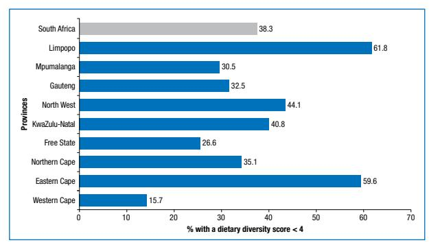

**Figure 2**: Percentage of population in each province having a dietary diversity score < 420

The dietary diversity of children was also evaluated nationally in South Africa. The calculated DDSs were validated against the anthropometry of the same children.9 Secondary data analyses were undertaken on the data of 1- to 8.9-year-old children (n = 2 200) studied in the NFCS in 1999. The average food variety score (FVS) (mean number of different food items consumed from all possible items eaten) and DDS (mean number of food groups out of nine possible groups) was calculated. The nutrient adequacy ratio (NAR) is the ratio of a subject's nutrient intake to the estimated average requirement of that nutrient calculated using the Food and Agriculture Organization of the United Nations/World Health Organization (2002) recommended nutrient intakes for children.9 The mean adequacy ratio (MAR) was calculated as the sum of NARs for all evaluated nutrients, divided by the number of nutrients evaluated, expressed as a percentage. MAR was used as a composite indicator of micronutrient adequacy. The relationship between MAR and DDS, and between anthropometric z-scores and DDS, was evaluated.

The children had a mean FVS of 5.5 (SD 2.5) and a mean DDS of 3.6 (SD 1.4). The mean MAR (ideal is 100%) was 63.3% (SD 19.4), and was lowest (57.3%) (SD 25.2) in the 7- to 8-year-old group. The most frequently consumed items were from the cereal, roots and tuber group (99.6%). Items from the dairy group were consumed by 55.8% of subjects, from the meat group by 54.1%, from the fat group by 38.9%, from the vegetables other than those rich in vitamin A group by 30.8%, from the vitamin A-rich vegetable group by 23.8%, from the other fruit (not vitamin A-rich fruit) group by 22%, from the legumes and nuts group by 19.7%, and from the eggs group by 13.3%. There was a high correlation between MAR and both FVS (r = 0.726, p-value = 0.0001) and DDS (r = 0.657, p-value = 0.0001), indicating that either FVS or DDS could be used as an indicator of the micronutrient adequacy of the diet. Furthermore, MAR, DDS and FVS showed significant correlations with height-for-age and weight-for-age z-scores, indicating a strong relationship between dietary diversity and indicators of child growth. A DDS of 4 and an FVS of 6 were shown to be the best indicators of MAR < 50%, since they provided the best sensitivity and specificity (Figure 3).9

#### **The cost of a nutrient-dense diet**

Energy-dense foods are relatively cheap sources of energy, but typically have low micronutrient density. Therefore, people with a low income may select a relatively less healthy diet because of the cheaper cost. A study based on the French national food consumption study estimated the cost of food consumed by adult participants.24 Participants in the lowest quartile of energy cost had the highest energy intake (highest energy density) and the lowest daily intake of key micronutrients. On the other hand, those in the highest quartile of energy cost had the lowest energy intake and the highest intake of micronutrients. Micronutrient-dense diets were consequently associated

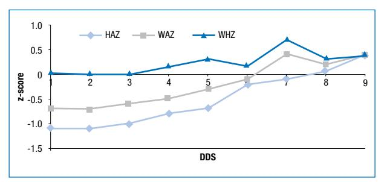

DDS: dietary diversity scores, HAZ: height for age, WAZ: weight for age, WHZ: weight for height

**Figure 3:** The relationship between the anthropometric z-scores of children in the National Food Consumption Survey (1999) and their dietary diversity scores9

with higher food costs. Lo et al25 confirmed the fact that a higher DDS, in the range of 0-6, is synonymous with higher food cost. In nutritionally vulnerable elderly Taiwanese, it was found that the food expenditure of those with a DDS of 6 was 2.2 times greater than that of subjects with a DDS < 3 when mean national food prices were used. Similarly, a study that was undertaken in Cape Town found that a healthy diet was approximately 69% more costly than the cheaper, energy-dense one.26

A high energy-dense diet is also associated with obesity. This was shown using data from adults in the 1999- 2002 National Health and Nutrition Examination Survey (NHANES).27Energy density was significantly associated with higher body mass index in women, and with a greater waist circumference in men and women. It was also independently associated with elevated fasting insulin and metabolic syndrome. Hence, a diet low in variety can have numerous consequences over and above deficiency in micronutrients.

## **Recommendations to overcome barriers to a diversified diet**

This FBDG needs to be understood in the context of the other FBDGs, and to be applied with the assistance of appropriate food guides that have been developed for South Africa. Graphic formats to provide a consumerfriendly framework have to be developed, so that consumers can select a variety of foods without necessarily having specific knowledge of nutrients. Dietary diversity can be improved by choosing from a variety of foods within and across food groups that are displayed in a food guide.28

Food policies and food aid may push consumption patterns towards a diverse diet. The consumption of a variety of low energy-dense foods (at least 20-30 biologically distinct foods) per week, drawn from all food groups, should be encouraged.29 A diverse diet can be promoted by utilising healthy traditional foods and dishes within provinces, as well as from cuisine from other provinces and countries. Dishes that are vegetable and legume based should be emphasised. Similarly, healthy modern and functional foods must be promoted as part of a diverse diet.29 Consumer messages for this FBDG should contain an explanation as to how to build a healthy meal through diversity, eating foods that give the right amount of energy, limiting the intake of sugars and fats to manage energy and prevent overweight and, when possible, enjoying meals together as a family or with friends.30

#### **Unique use of the term "enjoy"**

South Africa is one of a few countries that uses the term "enjoy" with regard to eating. This encourages families to share meals and to view meal times as occasions in which to interact and relax, which are all measures of coping with stress.30 Another country that uses the word "enjoy" is Korea. Its FBDG is: "Enjoy our rice-based diet, and enjoy every meal, and do not skip breakfast".31 Larson et al found that young adults enjoyed eating meals with others, but many did not find the time to sit down to a meal.32 Eating dinner with others is associated with better markers of dietary intake.32 Furthermore, enjoying meals is also associated with improved metabolic effects.33 Regular eating is associated with a lower energy intake, greater postprandial thermogenesis and lower fasting total and low-density lipoprotein cholesterol levels. Regular eating has beneficial effects on fasting lipid and postprandial insulin profiles and thermogenesis in healthy obese women.33

#### **Conclusion**

Overall South Africans do not have sufficient variety in their diet. This has been shown by the high prevalence of certain micronutrient deficiencies. Hence, the FBDG "Enjoy a variety of food" is an important one, since it is hoped that it will sensitise and encourage people to select a more diverse diet.

#### **References**

- 1. Ruel MT. Is dietary diversity an indicator of food security or dietary quality? A review of measurement issues and research needs. Food Nutr Bull. 2003;242(2):231-232.
- 2. Kennedy G. Evaluation of dietary diversity scores for assessment of micronutrient intake and food security in developing countries. [PhD thesis]. Wageningen: Wageningen University; 2009.
- 3. United Nations Children's Fund. The nutrition strategy. New York: UNICEF; 1990.
- 4. Ruel MT. Operationalizing dietary diversity: a review of measurement issues and research priorities. J Nutr. 2003;133(11 Suppl 2):3911S-3926S.
- 5. Foote JA, Murphy SP, Wilkens LR, et al. Dietary variety increases the probability of nutrient adequacy among adults. J Nutr. 2004;134(7):1779-1785.
- 6. Murphy SP, Foote JA, Wilkens LR, et al. Simple measures of dietary variety are associated with improved dietary quality. J Am Diet Assoc. 2006;106(3):425-429.
- 7. Vandevijvere S, De Vriese S, Huybrechts I, et al. Overall and within-food group diversity are associated with dietary quality in Belgium. Public Health Nutr. 2010 Dec;13(12):1965-1973.
- 8. Marshall TA, Stumbo PJ, Warren JJ, Xie XJ. Inadequate nutrient intakes are common and are associated with low diet variety in rural, community-dwelling elderly. J Nutr. 2001;131(8):2192-2196.
- 9. Steyn N, Nel J, Nantel G, et al. Food variety and dietary diversity scores in children: are they good indicators of dietary adequacy? Public Health Nutr. 2006;9(5):644-650.
- 10. Drewnowski A, Renderson SA, Driscoll A, Rolls BJ. The dietary variety score: assessing diet quality in healthy young and older adults. J Am

Diet Assoc. 1997;97(3):266-271.

- 11. Hatloy A, Torheim LE, Oshaug A. Food variety: a good indicator of nutritional adequacy of the diet? A case study from an urban area in Mali, West Africa. Eur J Clin Nutr. 1998;52(12):891-898.
- 12. Labadarios D, editor. National Food Consumption Survey-Fortification Baseline (NFCS-FB). Pretoria: Directorate of Nutrition, Department of Health; 2005.
- 13. Ingram CF, Fleming AF, Patel M, Galpin JS. Pregnancy- and lactationrelated folate deficiency in South Africa: a case for folate food fortification. S Afr Med J. 1999;89(12):1279-1284.
- 14. Ubbink JB, Christianson A, Bester MJ, et al. Folate status, homocysteine metabolism, and methylene tetrahydrofolate reductase genotype in rural South African blacks with a history of pregnancy complicated by neural tube defects. Metabolism. 1999;48(2):269-274.
- 15. Steyn NP, Labadarios D. The dietary intake of children in South Africa based on the 24-hour recall method. In: Labadarios D, Steyn NP, Maunder E, et al, editors. The National Food Consumption Survey (NFCS) Children aged 1-9 years, South Africa, 1999. Pretoria: Department of Health; 2002.
- 16. Directorate Nutrition, Department of Health. Nutrition strategy for the South African health sector 2010-2014.Pretoria: Department of Health; 2011.
- 17. Moeng TL, De Hoop M. Community nutrition textbook for South Africa: a rights-based approach. In: Steyn NP, Temple NJ, editors. Cape Town: Chronic Diseases of Lifestyle Unit, South African Medical Research Council; 2008.
- 18. Sayed A-R, Bourne D, Pattinson R, et al. Decline in the prevalence of neural tube defects following folic acid fortication and its cost-benefit in South Africa. Birth Defects Res A Clin Mol Teratol. 2008;82(4):211-216.
- 19. Love P. Developing and assessing the appropriateness of the preliminary food-based dietary guidelines for South Africans. [PhD thesis]. Pietermaritzburg: University of KwaZulu-Natal; 2002.
- 20. Labadarios D, Steyn NP, Nel JH. How diverse is the diet of adult South Africans? Nutr J. 2011;10:33.
- 21. Drimi S, McLachlan M. Food security in South Africa: it affects us all. Stellenbosch: Division Human Nutrition, International Food Policy Research Institute; 2009.
- 22. Oldewage-Theron W, Kruger R. Dietary diversity and adequacy of women caregivers in a peri-urban informal settlement in South Africa. Nutrition. 2011;27(4):420-427.
- 23. Oldewage-Theron WH, Kruger R. Food variety and dietary diversity as indicators of the dietary adequacy and health status of an elderly population in Sharpeville, South Africa. J Nutr Elder. 2008;27(1-2):101-133.
- 24. Andrieu E, Darmon N. Low-cost diets: more energy, fewer nutrients. Eur J Clin Nutr. 2006;60(3):434-436.
- 25. Lo YT, Chang YH, Lee MS, Wahlqvist ML. Dietary diversity and food expenditure as indicators of food security in older Taiwanese. Appetite. 2012;58(1):180-187.
- 26. Temple N, Steyn NP. Food prices and energy density as barriers to healthy food patterns in Cape Town. J Hunger Environ Nutr. 2009;4:203-213.
- 27. Mendoza JA, Drewnowski A, Christakis DA. Dietary energy density is associated with obesity and the metabolic syndrome in US adults. Diabetes Care. 2007;30(4):974-979.
- 28. Food-based dietary guidelines in Europe. The European Food Information Council [homepage on the Internet]. c2012. Available from: http://www.eufic.org/upl/1/default/doc/FBDG%20workshop%20 proceedings.pdf
- 29. Nutrition fact sheet. Nutrition Australia [homepage on the Internet]. c2012. Available from: http://www.nutritionaustralia.org/national/ resource/food-variety
- 30. Maunder EMW, Matji J, Hlatshwayo-Moleo T. Enjoy a variety of foods: difficult, but necessary in developing countries. S Afr J Clin Nutr. 2001;14(3):S7-S11.
- 31. Jang YA, Lee HS, Kim BH, et al. Revised dietary guidelines for Koreans. Asia Pac J Clin Nutr. 2008;17 Suppl 1:55-58.
- 32. Larson NI, Nelson MC, Neumark-Sztainer D, et al. Making time for meals: meal structure and association with dietary intake in young adults. J Am Diet Assoc. 2009;109(1):72-79.
- 33. Farshchi HR, Taylor MA, Macdonald IA. Beneficial metabolic effects of regular meal frequency on dietary thermogenesis, insulin, sensitivity and fasting lipid profiles in healthy obese women. Am J Clin Nutr. 2005;81(1):16-24.

## **"Be active!" Revisiting the South African food-based dietary guideline for activity**

**Botha CR,** PhD, BSc, HMS, Senior Lecturer; **Wright HH,** PhD, Senior Lecturer Centre of Excellence for Nutrition, North-West University **Moss SJ,** PhD, MSc, BSc, HMS, MBA, Professor, Physical Activity, Sport and Recreation, North-West University **Kolbe-Alexander TL,** PhD, BSc, HMS, Senior Lecturer UCT/MRC Exercise Science and Sports Medicine Research Unit Faculty of Health Sciences, University of Cape Town **Correspondence to:** Chrisna Botha, e-mail: chrisna.botha@nwu.ac.za **Keywords:** food-based dietary guidelines, FBDGs, physical activity participation, noncommunicable disease, South Africa, public health

#### **Abstract**

**3**

The objective of this paper was to review current evidence on physical activity for health in order to support the foodbased dietary guideline (FBDG) "Be active!". Physical activity, defined as at least 30 minutes of moderate-intensity physical activity per day for adults, and 60 minutes for children and adolescents, is advised in the FBDG because of the role it plays in maintaining energy balance, improving body composition and promoting general health and wellbeing. The reviewed outcome measures are changes in physical activity patterns and the reported prevalence of noncommunicable diseases (NCDs) in South Africa. Despite the previous set of FBDGs, no improvements in physical activity, obesity or NCDs have been reported in South Africa. Recent literature emphasises the beneficial effects of physical activity on the reduction of risk factors associated with the prevalence of NCDs. Physical activity has a positive effect on appetite and weight control, insulin sensitivity, dyslipidaemia, hypertension, stress relief and burnout. Barriers that prevent children and adults from participating in regular physical activity have been identified, and recommendations how to overcome these have been made. It has been concluded that South Africans are not sufficiently physically active for their general health status to be improved. It is recommended that methods to promote physical activity at national, provincial, district and local level need to be developed, implemented and sustained.

 **Peer reviewed. (Submitted: 2013-04-08. Accepted: 2013-08-09.) © SAJCN S Afr J Clin Nutr 2013;26(3)(Supplement):S18-S27**

## **Introduction**

South Africans have diverse origins, but everybody faces the challenges of addressing the burden of noncommunicable diseases (NCDs) and associated risk factors. As in other developing countries, there is potential to prevent and control NCDs, in spite of limited resources.1 The double burden of under- and overnutrition-related disease in South Africa, and efforts to optimise the nutritional status of South Africans, motivated the development of the food-based dietary guideline (FBDG).2,3 The FBDG "Be active!" was included, because physical activity is a determinant of energy balance, and because of the well-established link between reduced risk of mortality and morbidity that is associated with physical activity.2-4 The recommendation for adults is 30 minutes of moderate-intensity physical activity each day of the week, which can be accumulated in bouts of at least 10 minutes during the course of the day.4 For children and adolescents, this is 60 minutes of activity per day.5

The recommendations for both adults and children are still relevant, and are included in the revised set of FBDGs, based on the continuing burden of NCDs and mortality due to lifestyle diseases in the South African population.5 Recent research results provide evidence of the beneficial effects of physical activity on psychological health and management of stress and burnout,6 and highlight the importance of physical activity in managing overall well-being, instead of just body weight. Therefore, as concluded by Ding and Hu,7 promoting a healthy diet and encouraging physical activity are not mutually exclusive, but equally important to maintain a healthy body weight and reduce the risk of NCDs and premature death.7

The purpose of this paper is to review current evidence linking physical activity and health, to support the FBDG on physical activity.

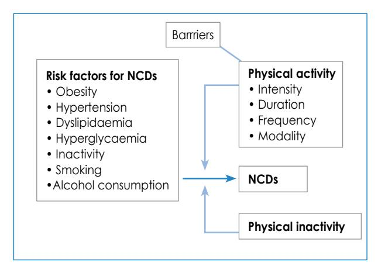

NCDs: noncommunicable diseases

**Figure 1:** Conceptual framework illustrating the role of physical activity and noncommunicable diseases

The interrelationship of physical activity, risk factors and NCDs are presented in Figure 1.

## **Mortality and noncommunicable diseases in South Africa**

Great strides have been made in collating accurate data on the cause of death in South Africa.5 The leading cause of death has been tuberculosis (12.6%) since 1997.5 Heart disease (4.4%), cerebrovascular disease (4.1%) and diabetes (3.3%) collectively account for 11.8% of deaths. Hypertensive diseases are ranked at number 10 (2.8%).5 The burden of these diseases is projected to increase, which could result in an exponential increase in the burden of NCDs.8 There is also an increased prevalence of obesity in South Africa,9 an established risk factor for NCDs.10 South Africa, like several other developing countries, is experiencing a unique demographic moment in which to focus on the introduction of policies that will reduce the future impact of NCDs.11

Approximately one third of the South African population is between the ages of five and 19 years, of which 21% are between the ages of 10 and 19.11 Children and the youth account for a large proportion of our population, and their health and well-being will play an important role in shaping the health profile of the nation in the future.11 Intestinal and infectious diseases were the leading cause of deaths in infants (22.4%) and children aged 1-4 years (27.3%), accounting for more than 20% of all deaths.8 Malnutrition was the third leading cause of death for those aged 1-4 years, and the seventh leading cause for those under one year of age.8 This is a classic example of the double burden of persisting undernutrition in the midst of the ever-increasing epidemic of obesity and NCDs.

## **Consequences of physical inactivity**

The increase in the prevalence of overweight and obesity is concurrent with increased levels of inactivity in South Africans. It is commonly reported that physical inactivity and poor diet are associated with a wide range of NCDs, including hypertension, type 2 diabetes mellitus, coronary artery disease, strokes, cancer and osteoporosis.12 NCDs can also be referred to as hypokinetic diseases or chronic diseases of lifestyle.13 These diseases arise because of a lack of physical activity, which ultimately results in an increased risk of developing cardiovascular disease. They are also linked to other health risk indicators, such as obesity, hypercholesterolaemia and hypertension.13 This, combined with other destructive habits, such as smoking, the overconsumption of alcohol and an excess intake of fatty foods and salt, increases the risk of developing NCDs.14 More recently, the relationship between insufficient sleep and the development of cancer has also been indicated.15

Participation in physical activity may also have therapeutic effects that provide protection against the development of NCDs, despite the presence of primary risk factors.16 Stringer17 noted that moderate aerobic physical activity can augment the immune system, indicating the importance of exercise for persons with HIV/AIDS.

Long-term physical inactivity decreases self-dependence because of the reduction in muscle power, reaction time and muscle strength, particularly in older adults (> 60 years old).16 Cardiovascular function will inevitably decrease as the effect of the specific adaptation to imposed demands principle is reversed.16

The increase in the prevalence of NCDs in South Africa emphasises the need to promote a healthy lifestyle through an increase in physical activity and healthy eating habits.18 However, although most people know that inactivity is a risk factor, they lack knowledge on the implementation, execution and management of physical activity to inspire them to maintain it in daily life.19 This inability to change behaviour is evidenced by the large number (57%) of South Africans reportedly treated with chronic prescription medication for conditions that are treatable or managed through regular physical activity19 combined with other lifestyle factors, such as healthy eating14, cessation of smoking14, regular sleep15 and appropriate use of alcohol.14 The cost of prescription medication has a direct effect on the economic burden of NCDs in the country. The current focus on treatment of chronic diseases should be shifted to the prevention of risk factors instead. Physical activity as a noninvasive, preventative or complementary treatment to medication should be considered.20

## **Physical activity as a modifier of the risk factors of chronic diseases pertaining to lifestyle**

## **Underweight, overweight and obesity**

South Africa is becoming one of the countries with the highest prevalence of overweight and obesity, due to destructive lifestyle behaviour.14 Obesity is the consequence of a disrupted energy balance, which is maintained in the body through the coupling of energy intake and expenditure. Energy intake is regulated through physiological mechanisms,20-24 but these can easily be overridden by environmental, psychological, social and cultural factors.25

A mismatch between energy intake and energy expenditure was recognised as early as the 1950s in sedentary individuals or those with negligible physical activity.26 This mismatch can lead to a positive energy balance and weight gain over time. However, more active individuals seem to be able to adapt their subsequent energy intake after an exercise session to match the exercise energy expenditure almost perfectly.27-29 King et al concluded that exercise appears to sensitise appetite control mechanisms and foster more "sensitive" eating behaviour in moderately active individuals who are normal or overweight, as well as in those who are obese.30-32 Individuals tend to respond differently to the effect of exercise on hunger and satiety, where some people experience increased hunger after training. This may determine whether or not one loses or maintains weight when embarking on an exercise programme. Therefore, exercise programmes and dietary intake should be individualised.30-33

However, exercise can play an important role in attenuating this postprandial effect if performed prior to mealtimes. Petitt and Cureton34 found that aerobic exercise of moderate intensity (in 30-minute intervals, three times daily, or a 90-minute continuous session) performed up to 12-18 hours prior to a meal can attenuate the postprandial lipaemia response (with a moderate effect of d = -0.5) in healthy individuals. The larger the energy expenditure during the exercise, the greater the magnitude of this effect. Therefore, exercise has an important role to play as part of any modification programme that aims to prevent or reduce the risk of NCDs.34

Even though exercise has been shown to play an important role in appetite control, following an energy-controlled diet in combination with an exercise programme when weight loss is warranted is essential for long-term weight management.34 However, acute and chronic activity or exercise can create a negative energy balance, which is important to consider in normal-weight individuals, i.e. athletes and manual labourers who are involved in vigorous exercise sessions or manual work. Some of these individuals fail to increase their energy intake when energy expenditure levels increase and find themselves in an energy deficit, often referred to as exercise-induced anorexia.35 This increases the risk for conditions such as malnutrition, impaired growth and maturation (depending on the person's age), compromised reproductive function, decreased bone health and increased susceptibility to sport injuries and illnesses.36,37 It is recommended that these individuals eat according to a plan, and do not only rely on their appetite as a cue for food intake to ensure sufficient energy and nutrient ingestion.35-37

## **Diet**

The global strategy of the World Health Organization to address the rapid increase of NCDs includes the promotion of both diet and physical activity. This is especially applicable to low- to middle-income countries, such as South Africa.38 Since these two factors both directly influence the energy availability and energy balance in the body, they should always complement each other in order to best obtain the desired outcome (weight loss, weight gain or weight maintenance) in any lifestyle intervention programme.27-28 Various dietary strategies to prevent and treat NCDs and to facilitate weight loss have been investigated and can be reviewed in more detail elsewhere.39 The general FBDG for weight (fat) loss is to create a daily energy deficit of between 2 100-4 200 kJ through diet and/or exercise and physical activity. Women should ingest a minimum of 4 200-5 000 kJ/day and men 5 000-6 400 kJ/day.39 Focusing only on energy restriction as a weight loss strategy can lead to 5-10% of body weight loss, but is associated with weight regain within 4-5 years.40

## **The long-term reduction of NCD risk factors**

The evidence that physical activity addresses NCD risk factors has been strengthened over the last few years.16,19 Currently, it seems as if physical activity can be as effective as medical treatment and, in some instances, can be even more successful than medication.19

In metabolic syndrome-related conditions (insulin resistance, type 2 diabetes mellitus, dyslipidaemia, hypertension and obesity), 40% of persons with glucose intolerance will develop impaired glucose tolerance within 5-10 years.41 Physical activity combined with dietary intervention in the management of these conditions has been shown to contribute to the reduction of insulin resistance.41

Two randomised control trials have indicated that physical activity as a lifestyle modifier decreases the risk of type 2 diabetes by 58% in persons with insulin resistance.41-42 In both these studies, the effect of exercise combined with dietary modifications had the same effect. Therefore, exercise and diet reduced the risk of type 2 diabetes more than the 31% reduction reported when the treatment was metformin.41

Studies that have investigated the optimal dose of exercise in the treatment of insulin sensitivity have indicated that 170 minutes of aerobic exercise per week improved insulin sensitivity, regardless of exercise intensity and volume.43 Muscle strength conditioning should be included in a prevention intervention, as high-repetition strength conditioning also improves insulin sensitivity.44

Long-term obesity, characterised by hyperglycaemia and abnormal glucose, fat and protein metabolism, is a risk factor for type 2 diabetes.45 Physical activity has been well documented to increase glucose sensitivity and improve the ability of muscle to absorb glucose.41 This means that daily exercise or physical activity benefit the regulation of insulin sensitivity in people with type 2 diabetes. According to an extensive literature review, glycaemic control was better established in adults with diabetes and dislipidaemia when there was participation in strength and conditioning exercises, together with dietary intervention.17,43

In order to maintain body weight, which is defined as < 3% change in current body weight,30 results from various studies suggest that moderate to vigorous intensity physical activity of 150-250 minutes/week, with energy expenditure of 5 000-8 400 kJ/week, is adequate. This supports the suggestion of 30-45 minutes of physical activity, on most days of the week, at a moderate intensity for weight maintenance.40, 46 In order to achieve weight loss, there is a direct relationship between the time and duration of physical activity and the amount of weight lost.40,46 The American College of Sports Medicine's (ACSM) position on appropriate physical activity intervention strategies for weight loss and the prevention of weight regain in adults47 is moderate physical activity of approximately 420 minutes/week to achieve weight loss of 5 - 7.5 kg. Higher doses of physical activity will result in larger weight loss.46 The dose can be manipulated by increasing the time involved in physical activity or by increasing the intensity thereof. The manipulations between intensity and duration are influenced by the current physical activity level, the participant's risk factors and injury history, contraindications to exercise and preferences for different modalities of physical activity.47

Recently, the role of resistance training in the management of weight has been included in the debate.48 The conceptual model of the potential role of resistance training in energy expenditure indicates that resistance training that results in an increase in muscle mass may accelerate up the resting metabolic rate, with a subsequent total energy expenditure increase, resulting in a decrease in body fat.48

As mentioned, dyslipidaemia, a group of disorders of lipoprotein metabolism, forms part of the metabolic diseases. The increased intake of fat often relates to this condition.43,46,47 Physical training has been indicated, independent of weight loss, to benefit the lipid profile.48-52 Current evidence indicates that high-density lipoprotein (HDL) cholesterol is increased and low-density lipoprotein (LDL) cholesterol and triglycerides decreased with more than three months of high-volume training.51 Since lipids relate to NCD development, an improvement in the lipid profile indicates a reduced prevalence of NCDs in the future.48-52 Hypertension is an important risk factor for stroke, acute myocardial infarction, cardiac insufficiency and sudden death.13 A lowering of 20 mmHg in systolic blood pressure and 10 mmHg in diastolic blood pressure in patients with hypertension halves the risk of cardiovascular death.18 Various reviews on randomised controlled trails have been performed over the last 15 years, with overlapping results.18 The general finding from all these studies is that physical activity reduces blood pressure up to 4-10 hours after cessation of exercise.18,53 However, this effect can last up to 24 hours.53 The mode of physical activity is mainly aerobic activity at an intensity of 40-70% of heart rate reserve for 30-60 minutes, and should be performed on a daily basis.53

Besides the influence of exercise on metabolic diseases, regular individualised exercise programmes, as prescribed by qualified health professionals (biokineticists), also improve the health status and functional fitness of persons with cardiorespiratory diseases.47

## **Exercise and bone health**

Regular exercise has a protective effect on bone, which is noticeable throughout the life cycle and can reduce the risk of frailty and osteoporotic fractures later in life.54-58 Furthermore, the improved mineralisation of bone through physical activity in childhood (from as young as five years of age) can persist into young adulthood, increasing bone mineral density.58,59

#### **HIV**

The high incidence of HIV/AIDS in South Africa necessitates a comment on the impact of physical activity on these individuals. Recent advances in antiretroviral therapy (ART) have decreased HIV-related morbidity and mortality, but the ART-related side-effects, such as metabolic syndrome and age-related co-morbidities (frailty), have increased, and present major challenges to patients and providers.60,61 A recent meta-analysis performed by O'Brien et al suggests that quality of life, general health, vitality and mental health increased in HIV-positive patients who participated in moderate- to high-intensity aerobic exercise, like brisk walking for one hour three times per week, compared with a control group.60 There is also evidence that a combination of moderate endurance (cycling, walking or running) and resistance exercises (working with weights or resistance bands) three times per week, for at least six weeks, improves cardiovascular, metabolic and muscle function in older (45-58 years) populations living with HIV.60 The results on physical exercise in HIV-infected patients, and on treatment or reduction in the development of side-effects in those on ART, are inconclusive.60,61

### **What are the health risks for inactive children?**

Overweight and obesity in South African children are also on the increase.62 The obesity rates in children in urban areas (5.5%) were recorded as being higher than the national average (4.8%).11 Recent research on grade 1 children of a low socio-economic status in North West province reported an incidence of 16% overweight and obesity.63 Similar results were also observed in adolescents (n = 256) from both the low- and middle-income areas of Potchefstroom.64 The prevalence of overweight was higher in adolescent girls (28%) than in boys (11%).64 Similarly, 7% of teenage girls and 3% of teenage boys are obese, with a body mass index > 30 kg/m2 . 64. In a recent review, these findings were confirmed to be the norm throughout South Africa.62 The authors concluded that prevalence is strongly dependent on age, gender and population group.62 Therefore, all of these factors need to be considered when devising intervention programmes and policies. It is important to note that in addition to overnutrition, South African adolescents are also faced with the challenge of undernutrition. The most recent Youth Risk Behavior Survey reported that 13% of South African adolescents are malnourished and stunted for height, while 4% are wasted.11 A national study in South African children62 clearly demonstrated that both overweight and obese children, as well as a high prevalence of stunted and underweight children exist, and this might be influenced by socio-economic status. Kruger et al concluded from their study that differences in income, have an effect on the growth of children in South Africa.65 This was also observed in urban areas and might be associated with migration from rural to urban areas, and earning minimal income and poor living conditions.66

Obese and overweight children are often less physically active than their leaner counterparts.63 Childhood is the period in which gross motor development takes place. The presence of overweight, obesity or undernutrition inhibits participation in movement during this important developmental phase.63 These children are also less likely to participate in sporting activities that develop various skills.63 A lack of motor skills relates to deterioration in the academic performance of children and adolescents.64-65

Physical activity data for children indicate that adolescence is the stage where physical activity patterns change.67 Adolescent girls tend to become less physically active and also acquire an increased body fat percentage compared to boys.68,69 The onset of puberty in girls and the resulting changes in their physiques are greater than those for boys, and this may affect their lower levels of physical activity and increased body fat percentage.62,64,69 This reduced physical activity level, together with overnutrition, increases the risk of obesity in teenage girls.70 Other studies have also indicated that being excessively fat has a negative impact on performance tasks and thus decreases participation in physical activity by overweight individuals.71 This becomes a cycle that can only be addressed with a conscious effort and strategic intervention.

Fifty per cent South African adolescent males and 35% of adolescent females meet the physical activity recommendation of 150 minutes per week.11 Furthermore, national data have demonstrated that 41% of the youth in South Africa reported participating in no physical activity, despite two thirds of learners saying that physical education was part of their school timetable.11,70 In this study, the reasons that the youth gave for insufficient physical activity included lack of interest (29%), being ill (18%), safety concerns (10%), no access to equipment (13%) and being unsure of why they were inactive (30%).66 These results suggest that providing the motivation, education and opportunities for physical activity for adolescents is important. Decreasing the amount of time spent in front of a screen is one of the ways of reducing sedentary behavior in children and adolescents. This is particularly relevant in South Africa, where 29% of children watch more than three hours of television per day.67 Some of this time should be spent participating in physical activity, and failing to do so will result in an increase in risk factors in this cohort at an earlier age. The consequences are that the clinical horizon of disease may appear at an earlier age, together with the onset of accompanying NCDs.70,71

## **Physical activity in South Africa**

Physical activity was measured at population level in South Africa for the first time during the 1998 South African Demographic and Health Survey, which found that 48% of men and 63% of women were inactive (n = 10 159).12 Therefore, increasing habitual levels of physical activity in South Africans could play a role in reducing the burden of NCDs, while simultaneously increasing quality of life.

## **Reasons for physical inactivity**

South Africa is experiencing a migration from rural to urban areas, with people searching for better work and living conditions. This has had a dramatic impact on their dietary intake and degree of participation in physical activity.5,10 The effect of urbanisation can be considered to be one of the major reasons for the increase in inactivity. People are now exposed to motorised commuting, more dangerous living conditions and a lack of family support systems.72

High crime rates and parents working long hours may be two of the reasons for sedentary behaviour and, in particular, increased television viewing time by children.72 This has also been implicated higher rates of obesity,68 as in other developing countries.67 The previous reduction of physical education in the school curriculum also contributed to increased inactivity. Physical education now forms one of the learning outcomes for life orientation, where other topics are also addressed.68 Facilities in which children can participate in sport activities are unavailable in schools in low socio-economic areas.69,70

Barriers to physical activity in adults include limited access to recreational facilities. Another factor is the lack of personnel to manage these facilities in order to make optimal use thereof. Many communities are widespread and do not have a community centre, as well as not being informed when initiatives are being implemented.70

In a study conducted by Roshan73 on free-living adults in the Khayelitsha area, 79% of club members (n = 26) and 80% of non-members (n = 60) perceived one of the barriers to healthy living to be that healthy food is too expensive. Health problems and family commitments were also cited as perceived barriers to improving physical activity.74 A recent presentation at the University of the Western Cape underlined the fact that the situation in Africa is quite unique and that barriers to physical activity exist at all levels of the social environment.74 Therefore, it is important that the evaluation process should be part of initiatives and their implementation, as it will provide a measure of the physical activity in these populations in which these programmes will be implemented.

## **Overcoming barriers**

Based on findings in various publications,71,72,75 the following points need to be considered if barriers are to be overcome:

- Advocacy and skills training to promote the implementation of physical activity in schools.
- Accredited clinical exercise professionals to implement sustainable physical activity in public health sector settings.
- Sufficient training of community health workers to oversee these programmes.
- Building-standardised regulations and town planning to create an environment that is supportive of physical activity.
- Safe community centres for physical activity and recreation.

#### **Implementation of the FBDG "Be active!"**

#### **What are we doing to change?**

In the context of global and national trends, including the rising prevalence of obesity, inactivity and NCDs, and in response to the WHO's mandate to promote physical activity and health, "Vuka South Africa: Move for Your Health" was initiated.71 This campaign is multisectoral, and includes the National Departments of Health, Education, and Sports and Recreation, as well as educational institutions and the private sector. Vuka South Africa formed part of the Department of Health's "Healthy Lifestyle Campaign", which has five main pillars, namely promoting physical activity, healthy nutrition and tobacco control, as well as responsible sexual behaviour and combating the abuse of alcohol.72

The Charter of Physical Activity, Sport, Play and Well-Being for all Children and Youth in South Africa (Youth Fitness and Wellness Charter) initiative has been underway since October 2004, and received input from over 200 individuals representing national (Departments of Health, Education, and Sport and Recreation), local and provincial government, non-government and non-profit organisations, parents, caregivers, sporting organisations, clubs, schools, the private sector, the media and other key role players. The underlying aim of the charter is to educate schools, caregivers and communities about physical activity, nutrition and wellness; provide a support base to improve and enhance existing school and community-based interventions; and highlight the role of physical activity in social and community development.75

In addition, a school-based physical activity programme, Healthnutz, has been implemented in schools in the Western Cape and Gauteng provinces. Healthnutz is aimed at learners in the foundation phase and was first implemented in 1997.72 Teachers are trained by the Community Health Intervention Programme (CHIP), after which they have a period of co-implementation with the CHIP staff.72 Once the teachers feel confident in leading the twice-weekly exercise sessions, they take ownership of their school's Healthnutz programme. The implementation and success of the Healthnutz programme in the Limpopo province was investigated by Draper et al. The initial programme in this province included 1 500 learners from three primary schools. Qualitative methods were used to collect data from the teachers and programme leaders of the Healthnutz programme (n = 45).72 Teachers reported that the programme was another way of increasing weekly physical education and impacted both teachers and learners positively.72 The quantitative data that were collected from the same group of participants showed fitness parameters, such as the sit-and-reach test for flexibility, sit-ups and the "shuttle run", improved significantly in the intervention schools, but remained unchanged in the control schools.11 This research study also reported that learners enjoyed the nutrition lessons which formed a component of the Healthnutz programme.11 Thus, these examples suggest that school-based interventions are promising and are able to improve the health and fitness of learners. However, similar programmes should be expanded to other areas of the country, including rural areas, to be effective on a national level.

Despite these initiatives, some researchers still felt that control over the increase in NCDs and health-risk factors was not given sufficient priority in low socioeconomic status populations.27 Very few articles have been published on the efficacy of the implementation of these programmes or other initiatives to promote and increase physical activity. However, Roshan70 described the promotion of a healthy lifestyle through a health club using the FBDG specifically. Members of the club were reportedly more aware of a healthy lifestyle and made healthier choices about diet and exercise. The question arises: Is this enough, and is the mass population being targeted effectively?

#### **Current FBDGs: are they enough?**

As indicated throughout this paper, it is important to ensure that energy intake and expenditure are kept in balance. Besides nutrient intake, regular physical activity plays a major role in the maintenance of healthy body weight by increasing energy expenditure. According to the ACSM, this expenditure should equal 8 400 kJ/week in adults, in order to ensure health advantages.47

National data obtained from the South African Demographic and Health Survey for South Africans in 2003 indicate that inactivity is reported by 49% of persons in the Western Cape area.13 Women describe the highest levels of inactivity and the prevalence of inactivity increases with age. Similar results were found in the North West province, with more than 50% of respondents reporting inactivity.12 This was based on the criteria of persons performing at least 150 minutes of activity per week. A limitation of these large surveys is that questionnaires are the main tools used to collect physical activity data and they are, therefore, based on self-reported measures. A study in a smaller sample of women (n = 171), in a rural setting that collected physical activity objectively, found that the rural women reached the set criteria of 150 minutes of activity per week.76 Those working in the forestry industry engaged in five times higher levels of activity than their urban counterparts.76

This might, in part, be influenced by the definition of physical activity, and is also based on the required intensity levels. Furthermore, perceptions of what constitutes physical activity might differ. For example, occupationrelated physical activity might be perceived as work and not physical activity. However, what is clear is that despite the barriers, NCDs are on the increase and the current physical activity levels of South Africans are not modifying the risk factors that relate to NCDs. South Africa is a unique country with its own challenges. Therefore, we suggest that the current guideline for South Africans should be increased to those levels suggested for weight loss, for example, at least 40-60 minutes of moderateintensity physical activity on most days of the week, and possibly accumulated in bouts of at least 10 minutes of activity.75 These suggestions concur with the guidelines of the WHO,74 which suggest that adults need 150 minutes of moderate-intensity aerobic activity per week. Moderateintensity aerobic physical activity should be increased to 300 minutes per week, of which at least 75 minutes should be vigorous intense aerobic physical activity to promote weight loss, and that will have additional health benefits. This vigorous intense aerobic physical activity may also be accumulated over the day in bouts of at least 10 minutes.

The additional benefits of regular physical activity include physiological adaptations of the vascular system, an increase in bone mineral density, a reduction in depression and a significant improvement in insulin sensitivity in persons with diabetes.6,40,41 Although regular physical activity plays a major role in the maintenance of body weight and the prevention of obesity, various studies have indicated that as little as 2-3% weight loss has resulted in improvements in NCD risk factors.15,42 However, the National Heart, Lung and Blood Institute guidelines recommend 10% weight loss for a beneficial effect on cardiovascular disease risk factors.73 These benefits include decreased blood pressure,53 improved lipid profiles52,51 and improved glucose tolerance.45

In order to reap the benefits of regular physical activity supplementary to weight management, the same principles of exercise should be applied, namely frequency, intensity and time and type of exercise. The implication is that not only should the frequency of physical activity be addressed, but also the intensity, time and type of activity.75

## **Children**

The ACSM recommends that children aged 5-11 years and youth aged 12 -17 years73 should engage in at least 60 minutes of moderate- to vigorous-intensity physical activity per day. Similar to adults, this physical activity can be accumulated in bouts of 10 minutes or more at a time. The one hour of activity is in addition to the incidental activity that children accumulate during the day.77 It can be achieved by participation in sports (school based and non-school based), games, part of natural play and active transportation.78 Another means of meeting the guideline's recommendation is to try to include familybased activities that promote physical activity.

This suggestion is supported by Tremblay et al who reported that activities should be diverse and include those that children enjoy, and which promote physical development.78 Activities that strengthen the muscles and bones of children should be performed three times a week.78 It is important to note that strength training in this age group should be limited to body weight exercises, such as push-ups and lunges.

Infants who are younger than one year of age should engage in floor play several times per day, which might include "tummy time" and crawling.79 Similarly, toddlers and preschoolers should accumulate 180 minutes of activity per day.79 These three hours can be of any intensity and comprise short bouts of activity.76 Physical activity should form part of toddlers' daily lives and include the games that they play.79 These guidelines are for "apparently healthy" children. The parents of children with illness, injuries or disabilities should consult a physician prior to embarking on a physical activity programme.76

Additional guidelines on managing sedentary behaviour in children and the youth include limiting screen time to a maximum of two hours per day.76 Similarly, caregivers should minimise the time that infants, toddlers and preschoolers are inactive.76,77 Time in the pram or car seat should not exceed one hour at a time.78 Children who are younger than two years of age should not watch any television, while those who are older than that should limit screen time to no more than two hours per day.

There appears to be a dose-related response, whereby the more time spent on physical activity and the less time on sedentary activities, the greater the benefits in terms of the prevention of childhood obesity and the establishment of habits that promote physical activity.73 If children do not meet the current 60 minute/day guideline, they should start with a small amount of activity and gradually increase it until the recommended level is reached.73

#### **Conclusion**

From the available evidence, it is clear that being active is an important intervention for the promotion of health and in addressing NCDs in South Africa. Research should start to focus on strategies that increase the knowledge of physical activity in the population, supported with interventions to overcome barriers to activity. The advantages of being physically active, as well as knowledge of how to be active with regard to duration, intensity, frequency and modalities of physical activity, should also be addressed. Various programmes have been implemented to try and promote physical activity, but we think that it is time to educate, rather than propagate. In addition, exercise specialists, such as biokineticists, should be consulted to prescribe physical activity. A national physical activity policy must be developed for all age groups and should be one of the highest priorities when treating and preventing disease. This policy should be implemented in the public health sector using trained professionals.

Research on best practice and evidence for implementing programmes should form an integral part of initiatives and programmes that aim to promote physical activity. South Africa remains a unique setting, with unique requirements. Therefore, methods of measuring physical activity should be sensitised and standardised. Furthermore, the effectiveness of both existing and new programmes should be evaluated, with the aim of disseminating the results to the South African population. Including physical activity as an FBDG is a first step in making people more aware of the importance of being physically active in order to obtain the health benefits. In the near future, it will be necessary to work together with other allied health professionals to increase physical activity levels in South Africans.

#### **References**

- 1. Epping-Jordan JE, Galea G, Tukuitonga C, Beaglehole R. Preventing NCDs: taking stepwise action. Lancet. 2005;366(9497):1667-1671.
- 2. Gibney M, Vorster HH. South African food-based dietary guidelines. S Afr J Clin Nutr. 2001;14(3):S2.
- 3. Vorster HH, Love P, Browne C. Development of food-based dietary guidelines for South Africa: the process. S Afr J Clin Nutr. 2001;14(3):S3-S6.
- 4. Lambert EV, Bohlmann I, Kolbe-Alexander T. Be active: physical activity for health in South Africa. S Afr J Clin Nutr. 2001;14(3):S12-S15.
- 5. Tremblay MS, Warburton DE, Janssen I, et al. New Canadian physical activity guidelines. Appl Physiol Nutr. 2011;36(1):36-46, 47-58.
- 6. Bradshaw D, Nannan N, Groenewald P, et al. Provincial mortality in South Africa, 2000: priority setting for now and a benchmark for the future. S Afr Med J. 2005;95(7):496-503.
- 7. Edwards SD, Ngcobo HSB, Edwards DJ, Palavar K. Exploring the relationship between physical activity, psychological well-being and physical self-perception in different exercise groups. S Afr J Res Sport Phys Educ Recr. 2005;27(1):59-74.
- 8. Ding EL, Hu FB. Commentary: The relative importance of diet vs. physical activity for health. Int J Epidemiol. 2010;39(1):209-211.
- 9. Mortality and causes of death in South Africa, 2008: Findings from death notification. Statistics South Africa [homepage on the Internet]. c2012. Available from: http://www.statssa.gov.za/publications/ P03093/P030932008.pdf
- 10. Kruger HS, Venter CS, Vorster HH. Obesity in African women in the North West Province, South Africa is associated with an increased risk of noncommunicable diseases: the THUSA study. Br J Nutr. 2001;86(6):733-740.
- 11. Draper CE, Nemutandani SM, Grimsrud AT, et al. Qualitative evaluation of a physical activity-based chronic disease prevention program in a low-income, rural South African setting. Rural Remote Health. 2010;10(3):1467.
- 12. Reddy SP JS, Sewpaul R, Koopman F, et al. Umthente Uhlaba Usamila: The South African Youth Risk Behaviour Survey 2008. 2nd ed. Cape Town: South African Medical Research Council; 2010.
- 13. South African Demographic and Health Survey; 2003.
- 14. Strydom GL. Biokinetika: 'n Handleiding vir studente in menslike bewegingskunde'. Potchefstroom: Potchefstroom University; 2005.
- 15. Steyn K, Fourie J, Temple N. NCDs of lifestyle in South Africa: 1995-2005 [homepage on the Internet]. c2012. Available from: http://www.mrc. ac.za/chronic/cdl 1995-2005.pdf
- 16. Von Reusten A, Wiekert C, Fietze I, Boeing H. Association of sleep duration with chronic diseases in the European Prospective Investigation into Cancer and Nutrition (EPIC)-Potsdam Study. PLoS One. 2012;7(1):e30972.
- 17. Pedersen BK, Saltin B. Evidence for prescribing exercise as therapy in chronic disease. Scand J Med Sci Sports. 2006;16 Suppl 1:3-63.
- 18. Stinger WA. The role of aerobic exercise for HIV-positive/AIDS patients. Int Sport Med J. 2000;5:1-5.
- 19. Lewington S, Clark R, Qizilbash N, Peto R. Age specific relevance of usual blood pressure to vascular mortality: a meta-analysis of individual data for one million adults in 61 prospective studies. Lancet*.*  2002;360(9349):1903-1913.
- 20. Moss SJ, Lubbe MS. The potential market demand for biokinetics in the private health care sector of South Africa. S Afr J Sports Med. 2011;23:14-19.
- 21. Neary NM, Goldstone AP, Bloom SR. Appetite regulation: from the gut to the hypothalamus. Clin Endocrinol (Oxf). 2004;60(2):153-160.
- 22. Cummings DE, Purnell JQ, Frayo RS, et al. A preprandial rise in plasma ghrelin levels suggests a role in meal initiation in humans. Diabetes. 2001;50(8):1714-1719.
- 23. Wilding JPH. Neuropeptides and appetite control. Diabet Med. 2002;19(8):619-627.
- 24. Trayhurn P, Bing C. Appetite and energy balance signals from adipocytes. Philos Trans R Soc Lond B Biol Sci. 2006;361(1471):1237-1249.
- 25. Schwartz MW, Baskin DG, Kaiyala KJ, Woods, SC. Model for the regulation of energy balance and adiposity by the central nervous system. Am J Clin Nutr. 1999,69(4):584-596.
- 26. De Castro JM. How can eating behavior be regulated in the

## **"Make starchy foods part of most meals": a food-based dietary guideline for South Africa 4**

**Vorster HH,** DSc, Research Professor, Centre of Excellence for Nutrition, North-West University, Potchefstroom **Correspondence to:** Hester Vorster, e-mail: este.vorster@nwu.ac.za **Keywords:** dietary carbohydrates, food-based dietary guidelines, FBDGs, starch, dietary fibre, non-starch polysaccharides

### **Abstract**

A national working group, convened by the Directorate Nutrition in the Department of Health, recently revised the set of South African food-based dietary guidelines (FBDGs). The objective of this technical review paper is to motivate and support the FBDG "Make starchy foods part of most meals". The wording of this FBDG has not changed substantially from the original, but international scientific developments in carbohydrate nutrition necessitated a new look at the importance of this guideline. A brief review of the classification, definition and terminology used to describe the different types of dietary carbohydrates as advised by a Food and Agriculture Organization of the United Nations and World Health Organization consultation is followed by a discussion of the beneficial physiological and metabolic health effects of dietary carbohydrates. The review further warns against the practice of a low-carbohydrate diet and shows that, although carbohydrate intake may still be high in some South Africans, there is an unfortunate pattern of decreased intake of total carbohydrates and increased intake of added sugar as part of the nutrition transition. The implications of existing nutrient intake data on South Africans and the proven beneficial effects of minimally processed starchy foods (additional micronutrients and dietary fibre to the total diet) support the recommendation that South Africans should eat starchy foods in the form of minimally processed or whole grains, legumes and root vegetables, rather than as refined starches and sugars. It is recommended that this FBDG should not be implemented and promoted in isolation. Consumers should be informed about food that contributes starch to the diet, and to eat this food as part of a varied diet.

 **Peer reviewed. (Submitted: 2013-04-08. Accepted: 2013-09-12.) © SAJCN S Afr J Clin Nutr 2013;26(3)(Supplement):S28-S35**

## **Introduction**

A national working group, convened by the Directorate Nutrition in the Department of Health, recently revised the set of South African food-based dietary guidelines (FBDGs). The FBDG message "Make starchy foods part of most meals" has not changed much from the message in the first set of FBDGs which advised South African to "make starchy foods the basis of most meals".1,2 The corresponding paediatric FBDG3 recommends that after six months of exclusive breastfeeding, babies should receive small amounts of solid food with gradual increases, so that by one year of age, the basis of most of these small meals should be starchy foods. The purpose of this FBDG was, and still is, to promote the intake of sufficient dietary carbohydrates from minimally processed, traditional and indigenous foods that are rich in starch, such as wholegrain and cereal products, legumes and some root vegetables, such as potatoes and sweet potatoes. The FBDG is formulated in a way to motivate consumers to plan meals around "starchy" or high-carbohydrate food, rather than protein food. These foods and their products are also sources of other types of carbohydrates and many micronutrients. The technical support paper motivating the message in 20012 focused on the classification of dietary carbohydrates, their role in human nutrition and health and the prevention of chronic diseases, the intake of carbohydrates in South Africa and how to choose appropriate carbohydrate-containing foods.

During the past 10 years, there have been many developments in our understanding of the role of different carbohydrates in health and disease, in harmonisation with terminology that classifies and measures the different types of carbohydrates and in the measurement of these types, and a renewed focus on controversies surrounding a low-carbohydrate diet.

This new technical support paper builds on the original one.2 The classification of carbohydrates and the terminology recommended for use by the Food and Agriculture Organization (FAO) of the United Nations and the World Health Organization (WHO) will be briefly reviewed and updated from the recent literature. This will be based on:

- The chemical classification and physiological effects of carbohydrates.
- The use of the glycaemic index and glycaemic load to plan diets.
- The benefits of different carbohydrates, food and diets that are rich in carbohydrates.
- The short- and long-term effects of low- carbohydrate diets.

The paper includes new information on carbohydrate intake by South Africans during the present nutrition transition from a traditional to a more Westernised diet. It also recommends how to implement this important FBDG.

#### **The classification of dietary carbohydrates**

Carbohydrates are a diverse group of substances, each with distinct properties. In 1998, the FAO/WHO consultation4 recommended that the classification and description of dietary carbohydrates should be based primarily on molecular size, dependent on the degree of polymerisation of monomeric (single sugar) units, with additional terms used to define nutritional groupings based on physiological properties.

There are three classes of chemically defined dietary carbohydrates, i.e. sugars, oligosaccharides and polysaccharides, as shown in Table I. Most of these carbohydrates are stored in plant-based foods. The main carbohydrates in foods from animal sources are lactose (milk sugar), milk oligosaccharides, and limited amounts of glucose (in the blood) and glycogen (a polysaccharide in liver and muscle meat).

#### **Carbohydrate terminology**

Several terms, often based on physiological properties, are used to describe dietary carbohydrates, and also for labelling purposes. These terms, as defined by the FAO/ WHO,4,5 are briefly described below. Although there is a separate FBDG for sugar and a technical support paper to support this FBDG,6 the recommended terminology to describe sugar is included in this section for purposes of clarity.

#### **Total carbohydrate**

The term, "total carbohydrate" is often used to identify carbohydrates in food composition tables and is derived using two methods. The first calculates carbohydrate content "by difference", where the moisture, protein, fat, ash and alcohol contents of a food are determined, and subtracted from the total weight of the food. The difference is considered to be carbohydrates.5 The problem with this approach is that the value includes non-carbohydrate components, such as lignin, organic acids, tannins, waxes and some Maillard products. The method also combines the analytical errors of the other analyses. The second approach measures total carbohydrate by direct analysis and summation of all carbohydrate components. This approach has been used in the UK since 1929.7 The obtained total carbohydrate value does not include cell-wall polysaccharides, and was termed "available carbohydrates" by McCance and Lawrence.7 This is the preferred method used to measure total carbohydrates.5

The value given in the South African food tables8 for total carbohydrates is the sum of "available carbohydrates plus dietary fibre". Available carbohydrate values are also given, and defined as the sum of the free sugars, dextrins, starch and glycogen. The value includes added sugar (in any form), and includes sugars, oligosaccharides, starch (including dextrins), sugar alcohol and glycogen for vegetables and fruit.8

#### **Sugar and sugars**

The term "sugar" refers to sucrose (table sugar), while the term "sugars" is used to describe the monosaccharides (glucose, fructose and galactose) and disaccharides (sucrose, maltose and lactose) in food. Corn syrup is glucose syrup produced by the hydrolysis of corn starch, while high-fructose corn syrup contains both glucose and fructose. High-fructose corn syrup is used in some countries, but not in South Africa, to sweeten beverages and other products. The sugar alcohol, such as sorbitol, that is found in some fruit or manufactured from glucose is used to replace the sucrose in food, for example, in weight-loss and diabetic diets.5

The term "total sugars" is defined as all mono- and disaccharides, other than polyols, and is regarded as the most useful way of describing sugars.5

The term "free sugars", in contrast to "intrinsic sugars", was originally used to describe the mono- and disaccharides that are present in foods, including lactose. In recent

| Class                          | Degree of polymerisation | Subgroups                                        | Principal components                                                                                                          |
|--------------------------------|-----------------------------|--------------------------------------------------|-------------------------------------------------------------------------------------------------------------------------------|
| Sugars                         | 1                           | Monosaccharides                                  | Glucose, fructose and galactose                                                                                               |
|                                | 2                           | Disaccharides                                    | Sucrose, lactose, maltose and trehalose                                                                                       |
|                                | 2                           | Polyols (sugar alcohol)                          | Sorbitol, mannitol, lactitol, xylitol, erythritol, isomalt and malitol                                                     |
| Oligosaccharides               | 3-9                         | Malto-oligosaccharides (α-glucans) Maltodextrins |                                                                                                                               |
|                                |                             | Non-α-glucan oligosaccharides                    | Fructo- and galacto-oligosaccharides, raffinose and stachyose                                                              |
| Polysaccharides 10 and more |                             | Starch (α-glucans)                               | Amylose, amylopectins and modified starches                                                                                   |
|                                |                             | Non-starch polysaccharides                       | Cellulose, hemicelluloses, pectin, arabinoxylans, ß-glucan, glucomannans, plant gums, plant mucilages and hydrocolloids |

### **Table I:** Classification of dietary carbohydrates4,5

years, the term has been used to describe mono- and disaccharides added to food by manufacturers, cooks or consumers, and includes sugars that are naturally present in honey, syrups and concentrated fruit juices. This term is synonymous with the terms "non-milk extrinsic sugars" and "added sugars". The latter terms may be confusing, and their use is not recommended.5

However, the term "added sugars" is used in South Africa and is synonymous with "free sugars", indicating sugars that are added to food and beverages during the manufacturing of products, home preparation, cooking and eating, and include table sugar and brown sugar (sucrose), honey, molasses, fruit juice concentrate, corn sweetener, lactose, glucose, high-fructose corn syrup and malt syrup.5

The South African food composition tables8 give values for "added sugar", which include "all mono- and disaccharides added to food and do not include sugars that are naturally present in the food, e.g. the lactose in milk and the fructose in fruit. Added sugar also includes honey". The values for added sugars versus intrinsic sugars cannot be determined in a laboratory, so are derived from recipe analysis.

#### **Starch, modified starch and resistant starches**

Starch consists of glucose polymerised to form amylose (non-branched helical chains with a degree of polymerisation of approximately 103 ) and amylopectin (highly branched chains with a degree of polymerisation of 103 -104 ). Starches occur in partially crystalline granules in plant foods. Starch is the principal carbohydrate in most diets because it is the storage carbohydrate in plant foods, such as cereals, grains, root vegetables and legumes.5 Most common cereals contain 15-30% amylose, but some foods, such as "waxy" maize, sorghum or rice, contain mostly amylopectin.5

The term "modified starch" is used to describe starches in which the amylase to amylopectin ratio has been modified by plant breeding or other techniques during manufacturing to change the functional properties of the starch to produce foods with a high-resistant starch content.5 "Resistant starch" is the term to describe the sum of starch and its digestion products, such as maltose, maltotriose and α-limit dextrins that are not hydrolysed and absorbed as glucose in the small intestine.

As reviewed by Cummings and Stephen,5 the crystalline configuration of amylose and amylopectin confers distinct X-ray diffraction patterns on starch granules. The "A" type is characteristic of cereals, the "B" type of potato, green banana and high amylose starches, and the "C" type of legume starch. When raw, B-type starches are resistant to amylase digestion in the small gut. When cooked, starch granules gelatinise, lose their crystalline structure and can be digested by amylase. However, when cooled, starch granules re-crystallise because of retrogradation and become resistant to digestion in the small gut.5 This characteristic is nutritionally important, because it partly determines the glycaemic response to starch. Cold starches have a lower glycaemic index than hot, starchy food. Also, starch that is not digested in the small gut will move to the large gut, where it will be fermented, together with non-starch polysaccharides, with all the health benefits of this process. Therefore, as mentioned previously, "resistant starch" is the term to describe the sum of starch and its digestion products, such as maltose maltotriose and α-limit dextrins that are not hydrolysed and absorbed as glucose in the small gut.

Functionally, resistant starch can be divided into four groups:9

- Resistant starch I: Starch that is physically inaccessible to digestive enzymes in the mouth and small gut, and which is mostly present in whole grains.
- Resistant starch II: Starch granules with "B" diffraction patterns, e.g. potato, green banana and waxy starches.
- Resistant starch III: Retrograded starch, e.g. starchy foods that have cooled after processing and cooking.
- Resistant starch IV: Modified starches that are resistant to digestion in the small gut.

## **Oligosaccharides**

Oligosaccharides or short-chain carbohydrates5 are a diverse group of carbohydrates,5,10 with a degree of polymerisation of between 2 and 9 (sometimes more than 9, as in insulin) consisting of monosaccharides joined by glycosidic linkages that are resistant to digestion in the small gut. They include raffinose, stachyose, verbacose, inulin and other fructo- and galacto-oligosaccharides. Oligosaccharides are found in plant seeds, such as peas, beans and lentils, and in artichokes, chicory, asparagus, onions, garlic and leeks, as well as in human milk as lacto-N-tetraose. Because they are indigestible, they move to the large gut, where they are fermented. The oligosaccharides in human milk are the principal growth factor for bifidobacteria in the infant gut.5 Therefore, they act as prebiotics and are now developed by the food industry as ingredients.

## **Prebiotics**

The term "prebiotics" is a physiological one used to designate all carbohydrates (disaccharides, oligosaccharides and polysaccharides) that are not digested in the small gut, and which are fermented in the large gut.5,10 During this process, they stimulate the growth and activity of bifidogenic and lactic acid bacteria in the large gut, with beneficial effects for the host.11 They are thought to "balance" the microflora in the large gut to a healthier distribution thereof, and there is some evidence that they improve gut health, increase calcium absorption and bone mineral density, and prevent the risk of several diseases.11 "Probiotics" is the term used to describe the live microorganisms that are found in naturally fermented products. They may be added to food, such as yoghurt, because of their health benefits.

#### **Non-starch polysaccharides and dietary fibre**

"Dietary fibre" is an umbrella term that describes a group of intrinsic cell wall non-starch polysaccharides that are not digested in the small gut, but are fermented in the large gut to short-chain fatty acids (acetic, butyric and propionic acids). These products are absorbed, provide energy, and have distinct physiological and metabolic effects in the gut.5,12 The fact that dietary fibre is broken down in the large gut to provide energy and other substances for metabolism is the reason why fibre and nondigestible starch should not be described as "unavailable carbohydrates".

The controversy surrounding an internationally agreed definition of dietary fibre, how to label the attributes of fibre-containing food products, and how to measure the dietary fibre content of foods,5,12 resulted from a complex set of circumstances. These circumstances were the verification of the original hypothesis from the 1970s that diets that are high in fibre protect against many noncommunicable diseases (NCDs) (which established the concept that fibre "is healthy"), the promotion and marketing of high-fibre products by the food industry (developed by adding fibre components and novel fibre and oligosaccharides to food products), and the inability to agree on dietary fibre measurements. Most of the methods in use, except the measurement of nonstarch polysaccharides, also measure non-carbohydrate substances which gives false high values for dietary fibre.

The terms "soluble dietary fibre" and "insoluble dietary fibre" were adopted to describe groups of fibre components with different, but overlapping, physiological effects. Soluble fibre, mainly from legumes, some fruit and oats, has beneficial metabolic effects, because it influences digestion and the absorption of glucose and lipids. Insoluble fibre, mainly bran from cereals, exerts a beneficial effect in the large gut, affecting fermentation, stool weight and bowel habits.5 However, the measurement of these components is pH dependent5 and the description is not useful, because it does not reflect the physiological properties of whole foods.

#### **Glycaemic carbohydrates**

The term "glycaemic carbohydrates" is used to describe all carbohydrates that are digested and absorbed as glucose for metabolism. Glycaemic carbohydrates include most mono- and disaccharides, some oligosaccharides (maltodextrins) and rapidly digested starches. Slowly digested starches are also glycaemic, but resistant starch, non-starch polysaccharides and most oligosaccharides are nonglycaemic. Most foods contain a mixture of glycaemic and non-glycaemic carbohydrates. The extent to which a carbohydrate food raises blood glucose, compared to the equivalent amount of carbohydrates in a reference food, has been expressed as the glycaemic index of the food and can be used to describe the physiological effect of a particular carbohydrate-containing food.5

#### **Glycaemic index and glycaemic load**

As mentioned, the terms "glycaemic index" and "glycaemic load" are based on the ability of a food to raise blood glucose levels.13 The glycaemic index of a food is the ability of a fixed amount of carbohydrates in the food to raise blood glucose, in comparison with the same amount of carbohydrates from glucose or another reference food. It is expressed as a percentage of the area under the glucose response curve after ingestion of the food, in relation to the area obtained with glucose or the reference food.13 Low-glycaemic index foods are used to plan diabetic diets, in particular.13 However, the glycaemic index of foods is influenced by many food factors (e.g. the presence of dietary fibre and protein and fat) and processing methods, and also individual factors that influence digestion and absorption. Therefore, the glycaemic index is variable, and should be used with care when planning diets, because it is only one characteristic of the food. For example, low-glycaemic index foods may be high in saturated fat or low in micronutrients. The concept of the glycaemic load was developed because different serving sizes of carbohydrate-containing foods are eaten.

The glycaemic load also takes into account the total amount of carbohydrates eaten. It is calculated as the product of the glycaemic index and the glycaemic carbohydrates in the serving size. Therefore, the glycaemic load of whole diets can also be calculated. Venn and Green13 reviewed the evidence of the beneficial, although small, effects of the consumption of low-glycaemic index and low-glycaemic load foods and diets. Their review showed that the glycated proteins haemoglobin A1c and fructosamine could be lowered by reducing the glycaemic index of the carbohydrate foods consumed by patients with diabetes. This effect was modest, and the long-term impact of such a modest effect has not been tested. The review also indicated that there are many controversies and conflicting findings on the effects of lowering the glycaemic index or glycaemic load of foods and total diet on specific blood lipids [total cholesterol and low-density lipoprotein (LDL) and highdensity lipoprotein (HDL) cholesterol], the insulin response, satiety and the control of body weight. The authors concluded that there are limitations to a previous FAO/ WHO statement4 that "the concept of the glycaemic index of a food provides a useful means of selecting the most appropriate carbohydrate-containing food for the maintenance of health and several disease states". These limitations include the wide inter- and intra-individual variations of the glycaemic index of foods (especially if only a small number of subjects is studied to measure the glycaemic index of a food), and our present lack of knowledge about the magnitude of possible beneficial long-term effects of low-glycaemic index foods and lowglycaemic load diets on health. As mentioned above, it is important to utilise glycaemic index with care, because it is only one characteristic of the food and does not provide information on the total nutrient composition.

#### **Whole grains**

"Whole grain" is defined by the South African Department of Health14 in the *Government Gazette* as "grains from cereals, which, after milling (if milled), naturally contain all the components, namely endosperm, bran, germ and all the macronutrients, micronutrients and trace elements of the original unprocessed whole kernel". Other authorities, such as the US Food and Drug Administration,15 have similar, but slightly differently worded, definitions: "Whole grains are cereal grains that consist of the intact, ground, cracked or flaked caryopsis, whose principal anatomical components, the starchy endosperm, germ and bran, are present in the same relevant proportions as they exist in the intact caryopsis".

Wholegrain products are actively promoted as desirable foods for both adequate dietary intake and protection against NCDs. There is scientific evidence that whole grains provide energy, macronutrients (proteins, carbohydrates, fats and dietary fibre), micronutrients (vitamins and minerals) and several anti-nutrient phytochemicals in proportions and forms that contribute to nutrient requirements, and slower digestion and absorption of carbohydrates, the colonic fermentation of fibre and resistant starch, bile acid excretion (lower blood cholesterol levels) and numerous other physiological and biochemical effects. Collectively, these effects result in improved maintenance of optimal body weight and a reduced risk of many NCDs. However, evaluating the evidence at population level is difficult, because of the many variations of the wholegrain content of products that are eaten. More research is needed on the effects of specific wholegrain products.

In the USA and other countries, a product may bear the stamp of the Whole Grain Council, which also carries a number that indicates the percentage of whole grain in the product. A stamp labelled "100%" means that all of the grain ingredients in the product are whole grain. Three servings of this product would provide the recommended daily amount of whole grain. Therefore, a lower number implies that more servings would need to be consumed. In the USA, manufacturers can make factual statements about whole grain on the label (e.g. 100% or 10 g of whole grains), provided that the claims are not false or misleading.15 The absence of officially formulated and published requirements or guidelines for labelling wholegrain products in South Africa has resulted in varied practices related to the labelling of wholegrain products, and may lead to confusion among consumers.

#### **The benefits of a high carbohydrate intake**

The discussion on the terminology used to describe and define carbohydrates in food, based on chemical, physical and physiological (health outcome) characteristics, suggests that this diverse group of substances has a number of positive effects. Although many experimental and controlled studies have indicated the specific effects of exact carbohydrates, the basis of dietary recommendations is epidemiological evidence, which has demonstrated that a diet that is rich in whole grains and cereals, fruit, vegetables and legumes is protective against the development of NCDs.16-21 As mentioned, the purpose of the FBDG "Make starchy foods part of most meals", is to ensure that sufficient unrefined or minimally processed foods that are rich in starch and non-starch polysaccharides are consumed by South Africans. "Starchy foods" include grains or cereals (mainly wheat, maize, rice, oats and sorghum in South Africa), legumes (dried beans, lentils, peas and soya) and some root vegetables, such as potatoes and sweet potatoes.

#### **Dietary energy and adequacy**

All food groups contribute to dietary adequacy. However, carbohydrates from whole grains and minimally processed starchy foods should be the principal energy source in the diet. These foods also provide many other substances, such as fibre and micronutrients, that are necessary for adequate nutrition. The physiological effects of carbohydrates depend on the extent, site and rate of digestion or fermentation and the absorption of the end products, which are influenced by the food matrix, processing, effects of other consumed foods, and individual gut function. The 2003 FAO/WHO consultation16 advised that 55-75% of total dietary energy should be provided by carbohydrates, with less than 10% from added sugars. The subsequent FAO/WHO consultation17 questioned the justification of the lower recommended limit, and suggested a revision to 50%. The consultation also concluded that "the nature of dietary carbohydrates appears to be a more important determinant of health outcomes than the proportion of dietary energy derived from carbohydrate intake".17

In South Africa, the staples, maize meal and white and brown bread flour, have been fortified with several micronutrients since October 2003 to contribute to dietary adequacy. The amount (frequency, number and size of the serving) of carbohydrate-rich foods needed to provide 50% of total energy depends on the age and energy requirements of individuals. A general guideline is to eat 10 food guide units daily, which could include porridge, a carefully selected breakfast cereal that is rich in whole grain (without added sugar), and rice, pasta, potatoes and bread. One food guide unit is equivalent to one slice of bread (35-40 g).

#### **Protection against NCDs**

Diets that are rich in starchy foods (e.g. grains and cereals in minimally processed forms, legumes and root vegetables), help to protect against the development of NCDs such as heart disease, diabetes and cancer, through a variety of mechanisms.16-21 Evidence of these effects, reviewed by Mann20 in relation to cardiovascular disease and diabetes, and by Key and Spencer21 in relation to cancer, comes from randomised controlled trials that measured dietary effects on risk factors and markers of cardiovascular disease.20 Epidemiological studies that examined the relationship between dietary exposure and morbidity and mortality, in relation to several NCDs, also provide support. The mechanisms include the replacement of fat, especially saturated fat, in the diet,16-21 and the presence of oligosaccharides, resistant starch and dietary fibre contributed by these foods, which all have beneficial effects on blood lipids.20 These foods also ensure that the glycaemic index of meals and the total diet is low, protecting against insulin resistance and several NCDs.20 The presence of dietary fibre, oligosaccharides and resistant starch in these foods stimulates fermentation in the colon, contributing to health by having a positive effect on stool volume and frequency, beneficial bacterial growth, the production of butyric acid (which protects against colon cancer), the absorption of calcium, and the strengthening of immune responses.16-21

#### **Variety and satiety: healthy food behaviour**

Although there is controversy on the satiety value of specific foods and diets, there is some evidence that diets that are high in dietary fibre, oligosaccharides and resistant starch have a high satiety index and will counter the intake of too much energy and overweight.16,18 These foods also bring variety to the diet and help to expose children to different foods, once they have been introduced to complementary foods. This helps to develop healthy eating patterns.22

#### **Affordability and traditional eating patterns**

Starchy foods, and specifically grains (cereals), are staples in many countries because of their availability and affordability. Thus, they became part of traditional eating patterns which are generally known to protect against NCDs. The adequacy and protein quality of traditional diets can be improved by adding sufficient amounts of legumes, vegetables, milk or fermented milk, or small amounts of peanuts and meat (chicken), to cereal-based diets.23 Cereals, and thus, carbohydrates, will form the largest part of energy intake, up to 70% of total energy, in any country struggling with poverty, food and nutrition insecurity and malnutrition. The challenge is to convince consumers that these foods should largely be eaten in minimally processed forms, and that a variety of other foods should be eaten with the starchy staple.

#### **Low-carbohydrate diets**

The scientific evidence on low-carbohydrate diets has been reviewed by several authors.24,25 These reviews clearly indicate that the weight loss achieved by lowcarbohydrate diets can be ascribed to lower energy intake, and not specifically to low carbohydrate intake. Furthermore, the reviewers have demonstrated that lowcarbohydrate diets are not sustainable. They often do not contain sufficient dietary fibre, thiamine, folate, vitamins A, E and B6 , calcium, magnesium and potassium, which may lead to ketosis, raised blood uric acid, dehydration, gastrointestinal symptoms and hypoglycaemia. All these potentially pose a serious health risk to individuals. Potential long-term effects include detrimental changes in serum lipids (increases in LDL cholesterol and decreases in HDL cholesterol) with an increased risk of cardiovascular disease, as well as mobilisation of calcium from the bones (because of chronic metabolic acidosis) and the consequent effects on bone health.

Therefore, it is unfortunate and irresponsible that lowcarbohydrate diets are promoted aggressively in South Africa, especially against the background of our high burden of disease, including chronic diseases and conditions related to underdevelopment.26 Cereal and other starchy food form an important part of the diet, especially in countries suffering from poverty, food and nutrition insecurity and malnutrition. There is no good reason to limit the intake of cereals, and specifically wholegrain cereals with little added sugar, in the diets of both children and adults. Detrimental effects on health and the risk of disease have been documented as a result of low-carbohydrate diets. If individuals have to follow a lowcarbohydrate diet, necessary adjustments (i.e. increases) to vegetable and dairy intake should be made in an effort to increase dietary adequacy and the protective effects against NCDs.

#### **The carbohydrate intake of South Africans**

The Medical Research Council computer programme, based on the new South African food composition tables,8 provides data on starch and individual mono- and disaccharide sugars. Unfortunately, these data are not available for all foods, and cannot be used to evaluate the mean nutrient intake at population level. However, although limited, some data on total and "available carbohydrates", added sugar and the dietary fibre intake of South African groups are available. These data have been analysed and reviewed by Steyn.27

The pattern that emerged from the review is that white, coloured and Indian South Africans have a relatively low total carbohydrate intake (mean < 50% of energy) and a high intake of added sugar (mean > 10% of energy), while Africans, especially rural Africans, have a high intake of total carbohydrates (50-70% of energy) and varying

| Variable                  | Rural men            | Urban men              | Rural women          | Urban women            |
|---------------------------|----------------------|------------------------|----------------------|------------------------|
| Year                      | 2005                 | 2005                   | 2005                 | 2005                   |
| Number                    | 332                  | 392                    | 634                  | 592                    |
| Total energy (kJ)         | 6 973 (6 627-7 319)  | 10 054 (9 641-10 468)  | 6 107 (5 914-6 300)  | 9 008 (8 694-9 323)    |
| Total carbohydrates (g)** | 259 (246-271)        | 334 (320-349)          | 236 (229-243)        | 294 (283-304)          |
| % energy of total energy  | 63                   | 56                     | 65                   | 55                     |
| Added sugar (g)           | 26 (23-29)           | 43 (40-47)             | 27 (25-29)           | 46 (43-48)             |
| % energy of total energy  | 6                    | 7                      | 7                    | 8                      |
| Total dietary fibre (g)   | 19 (18-19)           | 28 (25-28)             | 17 (17-18)           | 23 (22-24)             |
| Year                      | 2010                 | 2010                   | 2010                 | 2010                   |
| Number                    | 212                  | 205                    | 469                  | 367                    |
| Total energy (kJ)         | 9 924 (9 207-10 642) | 13 922 (13 186-14 659) | 9 589 (9 174-10 005) | 12 000 (11 487-12 513) |
| Total carbohydrates (g)   | 343 (318-369)        | 449 (423-474)          | 343 (328-358)        | 388 (372-405)          |
| % energy of total energy  | 58                   | 54                     | 60                   | 54                     |
| Added sugar (g)           | 61 (53-70)           | 74 (67-82)             | 64 (57-71)           | 78 (72-85)             |
| % energy of total energy  | 10                   | 9                      | 11                   | 11                     |
| Total dietary fibre (g)   | 26 (24-28)           | 37 (34-39)             | 25 (24-27)           | 32 (31-34)             |

**Table II:** Mean (95% confidence intervals) of carbohydrate intake of Prospective Urban and Rural Epidemiological study subjects in 2005 and 2010\*

**\*** Unpublished data, with the permission of the study leaders

**\*\*** "Available carbohydrates" according to South African food composition tables8

amounts of added sugar. All groups seem to have a relatively low total dietary fibre intake (mean < 20 g/day).

Several of the reviewed studies also reported that, with the urbanisation of Africans and the corresponding rapid nutrition transition that has been observed in South Africa, there has been a decrease in total carbohydrate and an increase in added sugar intake.27

In Table II, the carbohydrate intake of rural and urban African men and women in the North West province, followed up for five years in the Prospective Urban and Rural Epidemiological (PURE) study, is provided to illustrate these unfortunate changes during the nutrition transition (unpublished data). Total carbohydrate intake was lower in urban men and women, and added sugar intake higher. Total carbohydrate intake decreased and added sugar intake increased over time in both rural and urban areas. These findings indicate a change in the type of carbohydrate-rich foods chosen, contributing less total carbohydrates, but more added sugar. The dietary fibre intake actually increased, probably as result of the reported higher availability and intake of vegetables and fruit in urban areas, and over time in these subjects.

The existing pattern of relatively low intake of total carbohydrates and dietary fibre and relatively high intake of added sugar in many groups of South Africans, as well as the changes observed during the urbanisation of Africans, is a strong motivation to promote an increased intake of starchy foods in unrefined and minimally processed form.

## **Promotion of the FBDG message "Make starchy foods part of most meals"**

In summary, this paper has indicated that most South Africans should eat, and continue to eat, starchy foods in unrefined forms for many health reasons. The current national fortification of the staples, maize meal and bread flour, is a step in the right direction, especially given the widespread subclinical micronutrient deficiencies present in South Africa.28

The real challenge lies in encouraging South Africans to eat more wholegrain foods and not to rely on highly processed foods, such as breakfast cereal with added dietary fibre extracts and sugar. Because of the lack of appropriate labelling regulations, South African consumers may be misled by food labels that indicate "whole grain". A product made from refined flour with a few whole grains sprinkled on top is not a wholegrain product. An alternative would be to use the word "minimally processed" to promote the intake of wholegrain foods and products.

Concomitant with the promotion of whole grains, increased consumption of legumes and root vegetables is advised. In addition to explaining the health benefits of these foods to consumers through programmes that utilise social marketing principles, such food must be made available and affordable to everybody. When providing food and supplements for the vulnerable (e.g. those in antenatal clinics and participating in school nutrition programmes), the focus should be on wholegrain, legume and root vegetable products. A barrier to implementation may be the shorter shelf life of wholegrain or minimally processed foods and products. The reason for the shorter shelf life is that the oils found in the germ of wholegrains may be negatively affected by exposure to heat, light and moisture over long periods.29,30 Consumers should be informed on how to overcome this barrier, for example, by buying smaller quantities more often, or storing these foods and products in airtight containers in a cool, dry place or in the fridge or freezer.

When implementing this guideline, it is important that it is promoted with the whole set of FBDGs, especially the legume and vegetable and fruit FBDGs, to educate consumers that starchy food could constitute one or more of these foods. This could be carried out by focusing on traditional recipes in the different population groups where whole grains, legumes and root vegetables are combined together in dishes.

#### **Conclusions and recommendations**

The pattern of declining total carbohydrate intake of South Africans was confirmed by the results of the PURE study, which compared the carbohydrate intake of rural and urban Africans over time. The PURE study also showed an increased intake of added sugar, indicating an unfortunate change in the type of carbohydraterich foods eaten. Therefore, existing nutrient intake data provide the motivation for South Africans to eat more starchy foods in the form of whole grains (minimally processed cereal and grain products), legumes and root vegetables, to increase their total carbohydrate intake without increasing added sugar consumption.

It is recommended that nutritionists in South Africa use the terminology to describe different carbohydrates that is advised by the FAO/WHO consultation. It is also suggested that this terminology should be used in South African food legislation. It is further advised that the implementation of this FBDG should not be promoted in isolation, that consumers should be made aware that starchy foods include whole grains, legumes and root vegetables, and that food from these three groups is often eaten together in traditional diets.

#### **References**

- 1. Vorster HH, Love P, Browne C. Development of food-based dietary guidelines for South Africa: the process. S Afr J Clin Nutr. 2001;14(3): S3-S6.
- 2. Vorster HH, Nell TA. Make starchy foods the basis of most meals. S Afr J Clin Nutr. 2001;14(3):S17-S24.
- 3. Bourne LT. South African paediatric food-based dietary guidelines. Matern Child Nutr. 2007; 3(4):227-229.
- 4. Food and Agriculture Organization of the United Nations. Carbohydrates in human nutrition. Rome: FAO; 1998.
- 5. Cummings JH, Stephen AM. Carbohydrate terminology and classification. Eur J Clin Nutr. 2007;61(S1):S5-S18.
- 6. Steyn NP, Temple NJ. Evidence to support a food-based dietary guideline

on sugar consumption in South Africa. BMC Public Health. 2012;12(502).

- 7. McCance RA, Lawrence RD. The carbohydrate contents of foods. London: Her Majesty's Stationary Office; 1929.
- 8. Wolmarans P, Danster N, Dalton A, editors. Condensed food composition tables for South Africa. Parow Valley: Medical Research Council, 2010.
- 9. Englyst HN, Cummings JH. Resistant starch, a "new" food component: a classification of starch for nutritional purposes. In: Morton ID, editor. Cereals in a European context. Chichester: Ellis Horwood, 1987; p. 2212-233.
- 10. Varki A. Biological roles of oligosaccharides: all of the theories are correct. Glycobiol. 1993;3(2):97-130.
- 11. Patel S, Goyal A. The current trends and future perspectives of pre-biotics research: a review. Biotech. 2012;2:115-125.
- 12. Cummings JH, Mann JI, Nishida C, Vorster HH. Dietary fibre: an agreed definition. Lancet. 2009;373(9661):365-366.
- 13. Venn BJ, Green TJ. Glycemic index and glycemic load: measurement issues and their effect on diet-disease relationships. Eur J Clin Nutr. 2007;61(S1):S122-S131.
- 14. Government Notice No. R 146. Foodstuffs, Cosmetics and Disinfectants Act, 1972 (Act 54 of 1972). Pretoria: Government Gazette; 2010.
- 15. US Food and Drug Administration. Draft guidance: whole grain label statements. FDA [homepage on the Internet]. 2006. c2012. Available from: http://www.fda.gov/Food/GuidanceComplianceregulatoryInformation/ GuidanceDocu
- 16. World Health Organization. Diet, nutrition and the prevention of chronic diseases. Geneva: WHO/FAO; 2003.
- 17. Mann JI, Cummings JH, Englyst HN, et al. FAO/WHO scientific update on carbohydrates in human nutrition: conclusions. Eur J Clin Nutr. 2007;61 Suppl 1:S132-S136.
- 18. Elia M, Cummings JH. Physological aspects of energy metabolism and gastrointestinal effects of carbohydrates. Eur J Clin Nutr. 2007;61 Supp 1:S40-S74.
- 19. Van Dam RM, Seidell JC. Carbohydrate intake and obesity. Eur J Clin Nutr. 2007;61 Suppl 1:S75-S99.
- 20. Mann JI. Dietary carbohydrate: relationship to cardiovascular disease and disorders of carbohydrate metabolism. Eur J Clin Nutr. 2007;61 Suppl 1:S100-S111.
- 21. Key TJ, Spencer EA. Carbohydrates and cancer: an overview of the epidemiological evidence. Eur J Clin Nutr. 2007;61 Suppl 1:S112-S121.
- 22. Stephen A, Alles M, De Graaf C, et al. The role and requirements of digestible carbohydrates in infants and toddlers. Eur J Clin Nutr. 2012;66(7):765-779.
- 23. Vorster HH, Venter CS, Menssink E, et al. Adequate nutritional status despite restricted dietary variety in adult rural Vendas. S Afr J Clin Nutr. 1994;7(2):3-16.
- 24. Bilsborough SA, Crowe TS. Low-carbohydrate diets: what are the potential short- and long-term health implications? Asia Pac J Clin Nutr. 2003;12(4):396-404.
- 25. Bravata DM, Sanders L, Huang J, et al. Efficacy and safety of lowcarbohydrate diets: a systematic review. JAMA. 2003;289(14):1837-1850.
- 26. Bradsshaw D, Norman R, Lewin S, et al*.*Srengthening public health in South Africa: building a stronger evidence base for improving the health of the nation. S Afr Med J. 2007;97(8):643-649.
- 27. Steyn NP. Nutrition and chronic diseases of lifestyle in South Africa. In: Steyn K, Fourie J, Temple N, editors. Chronic diseases of lifestyle in South Africa: 1995-2005. Cape Town: Medical Research Council; 2006; p. 33-47.
- 28. Academy of Science of South Africa. Consensus study on improved nutritional assessment of micronutrients. Pretoria: ASSAf; 2013.
- 29. Van de Vijver LPL, Van den Bosch LMC, Van den Brandt PA, Goldbohm RA. Whole grain consumption, dietary fibre intake and body mass index in the Netherlands cohort study. Eur J Clin Nutr. 2009;63(3):31-38.
- 30. Vulicevic IR, Abdel-Aal ESM, Mittal GS, Lu X. Quality and storage life of parbaked frozen breads. Food Sci Technol. 2004;37(2):205-213.

## **"Eat dry beans, split peas, lentils and soya regularly": a food-based dietary guideline**

**Venter CS**, DSc(Dietetics), **Vorster HH**, DSc(Physiology) Centre of Excellence for Nutrition, Faculty of Health Sciences, North-West University, Potchefstroom Campus, Potchefstroom **Ochse R**, RD, MBL, Tshwane University of Technology, Tshwane **Swart R**, PhD(Nutrition), University of the Western Cape, Cape Town **Correspondence to:** Christine Venter, e-mail: christine.venter@nwu.ac.za **Keywords:** food-based dietary guidelines, FBDGs, pulses, legumes, nutrients, non-nutrients, noncommunicable diseases

#### **Abstract**

**5**

The objective of this paper is to review recent scientific evidence to support the food-based dietary guideline (FBDG): "Eat dry beans, split peas, lentils and soya regularly". In this review, legumes are synonymous with the term "pulses", while soy beans are classified as "oilseeds". The FBDG was originally introduced to address both under- and overnutrition in South Africa. The nutrient and non-nutrient content, results of recent epidemiological and intervention studies on health effects, recommended intakes and barriers to consumption are briefly reviewed. Legumes are rich and economical sources of good-quality protein, slow-release carbohydrates, dietary fibre (non-starch polysaccharides), various vitamins and minerals and non-nutritive components which may have several beneficial health effects. Pulses have a low energy, fat and sodium content. Therefore, legumes contribute to dietary adequacy, while protecting against noncommunicable diseases through many mechanisms. Evidence is presented that concerns about excessive flatulence from eating beans may be exaggerated, and that there is individual variation in response to different bean types. It is recommended that nutritionists should aggressively encourage consumers to consume more legumes. They should also be advised to evaluate different legume varieties to minimise undesirable symptoms. More research is needed to assess gastrointestinal responses between types of available and consumed legumes in South Africa. The FBDG should be tested in different population groups to determine how to maintain legumes as a traditional food. Increasing familiarity with legumes could help to increase the likelihood that they may be incorporated more regularly into the diet.

 **Peer reviewed. (Submitted: 2013-04-09. Accepted: 2013-07-07.) © SAJCN S Afr J Clin Nutr 2013;26(3)(Supplement):S36-S45**

## **Introduction**

Legumes are plants with seed pods that split into two halves. These include alfalfa, clover, lupin, green beans, peas, peanuts, soy beans, dry beans, broad beans, chickpeas and lentils. According to the Food and Agriculture Organization of the United Nations,1 pulses are a type of legume that are exclusively harvested for dry grain. Therefore, they exclude peanuts and soy beans, which are harvested for oil. Pulses are sometimes also referred to as grain legumes or pulse grains. The species *Phaseolus vulgaris* includes kidney, navy, haricot and pinto beans. While soy beans and peanuts are also leguminous plants, they differ from other legumes by having a much higher fat content, as well as from an agricultural perspective. Traditionally, they are seen as oilseed crops. Green beans and peas are also legumes, but are considered to be vegetable crops in agricultural terms.

Therefore, the legume family includes:

- • Vegetable crops
- • Oilseeds
- • Sow crops (clover and alfalfa) and pulses (dry beans, split peas, chickpeas and lentils).1

Because the term "legume" was not well understood when the South African food-based dietary guidelines (FBDGs) were tested before publication in 2001, the formulated FBDG was "Eat dry beans, peas, lentils and soy regularly".2 In this paper "legumes" refers to pulses and soy beans. The terms "soy" and "soy beans" are usually used in scientific literature, but consumers may be more familiar with "soya".

## **Background**

This FBDG was introduced to improve the overall health of South Africans, as a result of the nutrient and nonnutrient content, to prevent malnutrition (including protein and micronutrient deficiencies), and noncommunicable lifestyle-related diseases (NCDs).2 Pulses are economical sources of good-quality protein, and are rich in dietary fibre, generally low in fat and virtually free of saturated fatty acids. Soy beans provide significant levels of monoand polyunsaturated fatty acids, including α-linolenic acid. Substituting dry beans, peas and lentils for food that is high in saturated fat or refined carbohydrates may lower the risk of type 2 diabetes and cardiovascular disease,3,4 obesity5 and cancer,6-8 which are major NCDs in South Africa.9 Dry beans elicit a low glycaemic response relative to other high carbohydrate-containing foods, because of their high fibre and high resistant starch content. This may be a contributing factor in the prevention or treatment of these health problems.10 It has been proposed that several non-nutritive phytochemicals, such as phytates, saponins, isoflavones and oligosaccharides, may also have a role to play in cancer prevention.11

Darmadi-Blackberry et al12 reported, in a longitudinal study of older people from different cultures, that every 20 g increase in daily legume intake reduced the risk of death by 8%, concluding that higher legume intake is the most protective dietary predictor of longevity. The results from the Greek European Prospective Investigation into Cancer and Nutrition (EPIC) study, which found that the Mediterranean diet was associated with 14% lower mortality and that high legume consumption contributed to almost 10% of the protective effect, support this relationship.13 Finally, a comparison of nutrient and food group intake of dry bean and pea consumers in the 1999- 2002 National Health and Nutritional Examination Survey (NHANES) showed that daily consumption of half a cup of beans or peas resulted in higher intakes of fibre, protein, folate, zinc, iron and magnesium, with lower intakes of saturated fat and total fat, therefore improving diet quality.14 All these results support an FBDG for legume intake for South Africans.

The aim of this paper is to motivate for the FBDG by summarising recent research results on the health effects of legumes and comparing figures for intakes by South Africans and other populations, with recommendations from health organisations, as well as speculating on general reasons for non-compliance with recommended legume intakes.

## **Nutrient profile of legumes**

Some of the major nutrients provided by cooked legumes are shown in Table I.15 The protein content of most beans (uncooked) averages 20-25% according to weight, whereas the protein content of soy beans is approximately 36% according to weight.15 In general, legumes provide adequate amounts of lysine and isoleucine, but some are deficient in sulphur-containing amino acids (methionine and cystine) and others in tryptophan (cowpeas and lentils).16 Grains such as maize and wheat contain limited amounts of lysine and a combination of legumes and maize, the staple food of many South Africans,9 improves the protein quality of their diet.16 With regard to some soy protein products, the protein digestibility-corrected amino acid score, adopted by the World Health Organization and the US Food and Drug Administration to evaluate protein quality, is close to 1. This is the same score as that of casein and egg protein.17

The fat content of dried beans averages only 1% according to weight, with unsaturated fatty acids predominating.15 Soy beans are richer sources of fat (~18-20% according to weight) and contain saturated, monounsaturated and polyunsaturated fatty acids; 15%, 23% and 58% of total fat, respectively.15 The polyunsaturated fatty acids in soy beans are linoleic acid (18:2 n-6, 51% of total fat) and α-linolenic acid (18:3 n-3, 7%).18 Although soy foods are relatively high in fat, they may still be lower in total fat than the foods that they frequently replace, such as meat and cheese. However, soy foods are lower in saturated fat and, as with all plant foods, contain no cholesterol.

Dry beans consist of approximately 70% carbohydrate. Starch (43-45%), non-starch polysaccharides or fibre (16 - 20%), α-galactosides [also known as oligosaccharides

100 g cooked weight15 **Nutrient Sugar beans Chick peas Lentils Soy beans** Total fat (g) 0.5 2.6 0.2 9.0 Saturated fat (g) 0.08 0.27 - 1.30 Monounsaturated fat (g) 0.06 0.58 - 1.98 Polyunsaturated fat (g) 0.41 1.16 - 5.06 Protein (g) 7.1 8.9 8.6 16.6 Carbohydrate (g) 19.5 20.8 13.7 4.8 Calcium (mg) 8.2 6.6 7.0 5.1 Magnesium (mg) 32 49 27 102 Potassium (mg) 55 48 27 86 Iron (mg) 368 291 270 515 Zinc (mg) 2.1 2.9 2.3 5.1 Thiamine (mg) 1.06 1.53 - 1.15 Niacin (mg) 0.12 0.12 0.08 0.16 Folate (µg) 0.04 0.06 0.07 0.29

**Table I:** Nutrient composition of sugar beans, chick peas, lentils and soy beans, expressed per

(stachyose, verbascose and raffinose) 3-5%] and sucrose (3-5%) are the major types of carbohydrate. Beans are an excellent source of fibre, as can be seen in Table I. Bean and soy fibre is roughly one third soluble and two thirds insoluble. Soy fibre measurably lowers the postprandial increase in serum glucose concentrations, but has only a modest effect on serum cholesterol concentrations.19 Many soy foods, such as soy beans, soy nuts, soy flour, textured soy protein and tempeh, are rich in fibre. However, isolated soy protein does not include dietary fibre.19

Dry beans and soy beans are low in sodium, but are excellent sources of minerals, including calcium, copper, iron, magnesium, phosphorus, potassium and zinc.15 The content and bioavailability in dry beans and soy foods varies according to the processing methods and phytate content.20

Dry beans and soy beans are good sources of watersoluble vitamins, especially thiamine, riboflavin, niacin and folate, but poor sources of fat-soluble vitamins and vitamin C.15 In terms of meeting the dietary reference intakes21 for adults, a one-cup serving of cooked dry beans can provide 44% of the recommended folate, 33% of thiamine, 14-16% of vitamin B6 , 8-10% of niacin and 14- 16% of riboflavin.

#### **Non-nutrient profile of legumes**

Legumes contain a number of compounds that have potential health benefits, as well as some that can reduce the bioavailability of nutrients. These compounds include saponins, phytic acid, plant sterols, phenolic compounds, enzyme inhibitors and lectins. Isoflavones are nutritionally relevant only in soy beans.22

#### **Saponins**

Saponins in legumes are poorly absorbed by humans.23 Saponins are surfactants and were initially thought to be harmful because of their strong haemolytic activity in vitro. However, Hassan et al24 recently reported that there is no haemolytic activity from soy bean saponin-rich extracts in the concentrations that were investigated. Saponins may have anti-cancer properties, as discussed by Gurfinkel and Rao25 and Kerwin.26

#### **Phytic acid**

Phytic acid (myoinositol hexaphosphate) is the main storage form of phosphorous in dry beans. Different forms of phytic acid exist, depending on the pH and metal ions present. Phytate is the calcium salt and phytin is the calcium-magnesium salt.27 The amount of phytic acid in legumes varies between 0.4% and 2.06%. The consumption of food that is high in phytate influences zinc, calcium and iron bioavailability by forming insoluble mineral phytate complexes in the intestine. These effects are of concern for vegetarians and in developing countries, where cereal and grain products are consumed in large quantities.28 However, phytate has antioxidant effects and may lower the risk of colon cancer.22

#### **Phytosterols**

Beta-sitosterol, campesterol and stigmasterol are the most common types of phytosterols in beans. Plant sterols are structurally similar to cholesterol, but the absorption of phytosterols is low relative to cholesterol (20-50%). Only approximately 5% of phytosterols are absorbed, and the remainder is excreted from the colon.29,30 Bean sterols reduce plasma cholesterol in humans, possibly because of a reduction in cholesterol solubilisation into bile salt micelles, resulting in a reduction of cholesterol absorption.30 Phytosterols may also have anticarcinogenic effects.31

#### **Phenolic compounds**

Various phenolic compounds are present in beans, especially ferulic acid, quercitin and kaemphenol. Although polyphenolics are generally poorly absorbed, beneficial effects have been found in humans after consumption of plant phenolics.22

#### **Enzyme inhibitors and lectins**

Alpha-mylase inhibitors are present in a variety of plants, but are particularly high in common beans. Cooking destroys most, if not all, the α-amylase inhibitor activity.32 Proper cooking methods (preferably moist heat) also eliminate lectin activity. Lectins are large glycoprotein molecules that bind to glycoconjugates on cell membranes, leading to agglutination of red blood cells in vitro.22 The lectin, by virtue of its ability to bind to glycoprotein receptors on the epithelial cells lining the intestinal mucosa, inhibits growth by interfering with the absorption of nutrients.22

In the past, trypsin and chemotrypsin (protease) inhibitors in legumes were considered to be antinutritional, because of observations that feeding animals raw beans caused growth suppression and stimulated pancreatic hypertrophy.22 However, commonly employed cooking methods reduce trypsin inhibitor activity in beans by 80- 95%. Based on animal studies, only 55-69% of the trypsin inhibitor activity must be destroyed to reduce pancreatic hypertrophy in susceptible animals.33 Protease inhibitors, especially those that inhibit chymotrypsin (Bowman-Birk inhibitor), have been investigated in several model systems for their ability to suppress carcinogenesis.34

#### **Isoflavones**

Isoflavones are another group of phytochemicals in beans, but the soy bean is the only nutritionally relevant source of these compounds. The primary isoflavones in soy beans are genistein and diadzein, and their respective β-glycosides, genistin and diadzin. Smaller amounts of glycitein and its glycoside glycitin are present.35 The isoflavones, which are strikingly similar in chemical structure to mammalian oestrogens, can bind to both α and β isoforms of oestrogen receptors (ERs). However, their binding affinity to ERβ is approximately 20 times higher than that of ERα. 36 ERα and ERβ have opposite effects on regulating gene expression and physiological functions. For example, oestrogenic compounds stimulate the proliferation of human breast cancer cells through binding with ERα, but suppress proliferation via ERβ. 37 Soy isoflavones have potent antioxidant properties37 and are now being extracted and sold as supplements.

#### **Public health problems addressed by the FBDG**

From the discussion of the nutrient content of legumes, it is clear that their contribution of protein and micronutrients will help to address undernutrition. But the total composition of legumes also makes them an ideal food group to include in diets that aim to reduce the risk of chronic NCDs.

#### **Atherosclerotic cardiovascular disease**

Epidemiological studies have reported that legume consumption is significantly and inversely associated with cardiovascular disease risk.3,38,39 In the NHANES 1 epidemiological follow-up study,40 legume consumption of four times or more per week, compared to less than once a week, was associated with a 22% lower risk.

In the Japan Collaborative Cohort (JACC) study, the highest bean intake (4.5 servings a week) was associated with a 16% reduction in total cardiovascular disease risk and a 10% reduction in total mortality.41 A meta-analysis of 23 trials, using soy isoflavones, revealed a low-density lipoprotein (LDL) cholesterol-lowering effect of 5%, independent of baseline cholesterol levels.42 A more recent meta-analysis of 30 studies that contained 42 treatment arms (n = 2 913), with an average soy protein intake of 26.9 g in adults with normal or mild hypercholesterolaemia, resulted in lowering total and LDL cholesterol, equivalent to a 6% LDL reduction.43

Soy isoflavone extract supplements44 and lupin kernelenriched bread45 also reduce systolic blood pressure. According to Jenkins et al,46 the extrinsic potential of soy (e.g. displacing foods higher in saturated fat and cholesterol) and the intrinsic potential effect of soy in reducing LDL cholesterol are 3.6-6% and 4.3%, respectively. Therefore, the combined intrinsic and extrinsic effects of soy protein foods range from 7.9-10.3%. Anderson and Major47 reported the results of a meta-analysis of 11 clinical intervention trials involving legumes other than soy beans. They found an overall 6.2% lowering of LDL cholesterol and a 22% lowering of triglycerides. Bazzano et al48 also concluded that non-soy legume consumption has a significant beneficial effect on serum cholesterol levels. Despite the fact that, up to 2008, a food labelling health claim for soy proteins has been approved in nine countries, including South Africa,49 since 1999, an assessment of 22 randomised trials by the Nutrition Committee of the American Heart Association, showed a slightly decreased LDL cholesterol (3%), but no effect on HDL cholesterol, triglycerides, lipoprotein(a) or blood pressure.50 Therefore, some inconsistencies in the lipid-lowering functions of soy, especially the magnitude of the effects, still prevail. The contributing factors to these discrepancies are not fully understood, but the source of soy beans and processing procedures of the protein or isoflavones are believed to be important.49

In 2010, the Food Regulatory Issues Division of Agriculture and Agri-Food Canada commissioned a systematic literature review to assess the strength of evidence of a relationship between the consumption of pulses and cardiovascular disease.51 A highly consistent effect on LDL cholesterol and total cholesterol was found, as well as a low consistency of effect on high-density lipoprotein (HDL) cholesterol and triglycerides. A moderate-strength association was reported, with changes in total cholesterol, and a low-strength association with other investigated parameters, including LDL cholesterol, HDL cholesterol, triglycerides, homocysteine and blood pressure.51

The proposed mechanisms for LDL cholesterol reduction by beans and soy beans have been reviewed by several authors.3,38,52The hypocholesterolaemic effects appear to relate, in estimated order of importance, to soluble dietary fibre, vegetable protein (amino acid composition or protein subunits or composite peptides), oligosaccharides, isoflavones, phospholipids, fatty acids and saponins. Furthermore, soy-based diets may have antioxidant and anti-inflammatory functions which contribute to the prevention of atherosclerosis.39 The antioxidant properties of the polyphenol flavonoids have to be taken into consideration in cardiovascular health promotion. Small red beans, red kidney beans and pinto beans are in the United States Department of Agriculture (USDA) list of top antioxidant foods.53

Martin et al54 reviewed the mechanisms of action and potential clinical applications of soy isoflavones in hypertension. Soy isoflavones relax vascular smooth muscle via a combination of mechanisms, including the potentiation of endothelial-dependent and endothelialindependent vasodilator systems and the inhibition of constrictor mechanisms.

## **Type 2 diabetes mellitus and blood glucose control**

There is strong evidence to suggest that eating a variety of whole grain foods and legumes is beneficial in the prevention and management of diabetes.55 However, most epidemiological studies do not separate the effect of wholegrain foods and legumes sufficiently, possibly because of the relatively low intake of leguminous foods in the studied populations. Legumes share several qualities with wholegrains, with the potential benefit of glycaemic control, including slow-release carbohydrate and highfibre content. For example, the glycaemic index of kidney beans does not exceed 27 (glucose is 100), and those of lentils and chickpeas, 28 and 33, respectively.56 Legumes alone lower haemoglobin A1c or fructosamine.57 Finally, the Shanghai Women's Health study revealed significant inverse associations between legume intake and the incidence of type 2 diabetes. The relative risk associated with soy beans alone was 0.53, and with other non-soy legumes, 0.76.58

Generally, lifestyle interventions which combine diet and increased physical activity, leading to weight loss, reduce the risk of diabetes in subjects with impaired glucose tolerance. It seems as if weight loss is a major driving force in reducing the incidence of diabetes. However, in the randomised controlled studies of Salas-Salvado et al,59,60 diabetes incidence reduced by 52% in the absence of significant changes in body weight or physical activity. Based on the evidence from several prospective observational studies and randomised trials, these authors concluded that a diet that might prevent diabetes in healthy subjects, and contribute to glycaemic control in patients with established disease, should contain abundant fibre from wholegrain foods and fruits and vegetables, including pulses and nuts.

#### **Obesity**

Compared with glycaemia and dyslipidaemia, the antiobesity effects of pulse grains are scarce. However, epidemiological studies have consistently found a relationship between pulse consumption and reduced risk of obesity.61 A recent review5 presented evidence that indicated reduced hunger and increased satiety two to four hours after pulse consumption. These authors also presented results from observational studies on pulse consumption and weight status, which consistently showed that individuals with lower body mass index consumed a greater amount of pulses as part of their usual diet. Marinangeli and Jones suggest62 that pulse-derived fibres, trypsin inhibitors and lectins may reduce food intake by inducing satiety via prolonging cholecystokinin secretion, and that arginine and glutamine (major components of pulse proteins) may produce thermogenic effects. It has further been reported that the protein component of yellow peas suppresses short-term food intake and glycaemia.63 Results of these studies should be interpreted with caution, because pulse consumption may be part of an overall healthy lifestyle.

## **Cancer**

Although legumes are rich in a number of compounds that could potentially reduce the risk of certain cancers, according to the panel of experts of the World Cancer Research Fund and American Institute for Cancer Research, the results of epidemiological studies are too inconsistent to draw any firm conclusions on legume intake

and cancer risk in general.6 However, fibre-containing foods were considered to be probable in reducing the risk of cancer in the colon and rectum, and since legumes are rich in fibre, it can be inferred that eating beans would probably reduce the risk of developing colon and rectal cancer. Data that link the consumption of legumes to a reduction of stomach and prostate cancer were considered to be limited, but suggestive. However, recent meta-analyses of epidemiological investigations suggest that soy consumption is associated with a reduction in prostate,7 breast64,65 and colorectal cancer risk in women, but not in men.66 The expert panel did not include animal studies.6 The Bean Institute34 presents results from epidemiological investigations, as well as experimental studies, in animal models, to substantiate its opinion that eating beans may reduce cancer of the colon, prostate and breast, and possibly pancreas and oesophagus.

## **Actual legume intake compared to recommendations**

Few health-related organisations make specific recommendations for legumes. The USDA MyPyramid includes legumes in the vegetable and "meat and beans" groups,67 while the National Heart, Lung and Blood Institute's (NHLBI) Dietary Approaches to Stop Hypertension (DASH) eating plan,68 Harvard's Healthy Eating Pyramid,69 and Canada's Food Guide,70 include legumes with the "meat and beans" groups. Downs and Willows71 concluded that the grouping of animal products with legumes, nuts and seeds into a single category in Canada's Food Guide is a shortcoming. The Australian FBDGs classify legumes in the vegetables and fruit group, recommending five vegetable and legume servings per day, as well as two servings of fruit.72 However, legumes and nuts are also included in the lean meat, poultry, fish and egg group.72 Recently, the American Heart Association recommended at least four servings of nuts, legumes and seeds per week.73

Quantitative recommendations for legumes for 8 400-kJ diets are 50 g according to the NHLBI's DASH eating plan,68 and 81 g one to three times per day according to the Harvard Healthy Eating Pyramid.69 The USDA's MyPyramid67 regards 60 ml of cooked, dry beans as the equivalent of 30 g of meat, poultry or fish, while the Australian FBDGs regard a serving of 120 ml of cooked beans to be the equivalent of one serving from the animal sources.72

Data from the most recent Spanish Food Consumption Survey showed that the consumption of legumes and pulses was 11.9 g per person per day.74 Compared with respondents in Central England, those from a French Mediterranean region consumed beans and pulses significantly less frequently (48.8% once a week in the

French region versus 71.5% in the English region).75 Compliance with the FBDGs of the Spanish Society of Community Nutrition revealed that 63% of the Catalan population did not meet the recommendation for pulses of 2-4 servings per week.76 Data from the 1999-2000 NHANES showed that on any given day, only 7.9% of adult Americans consumed dry beans and peas77 in quantities of 0.1-0.3 servings of legumes per day, which is one third or less than what is recommended.77

An investigation into food diversity in South Africa showed that legumes were one of the groups least consumed. The percentage of South Africans consuming legumes daily was reported to be 15.23%.9 An average daily per capita pulse consumption of 35.66 g was estimated from secondary dietary data analyses.78 The intake of nuts and oilseeds was reported separately (1.93 g per day). Therefore, the total legume intake, when adding oilseeds, was approximately 37 g per day.

In the Prospective Urban Rural Epidemiology (PURE) study, the daily intake of pulses was found to be 15.54 g for men and 12.36 g for women in the North West province, while consumption of soy bean products was 20.51 g and 21.40 g for men and women respectively (Wentzel-Viljoen, unpublished data). Furthermore, the mean daily intake of mixed dishes with beans, e.g. bean soup, was 22.81 g and 27.88 g for men and women, respectively. When adding the mean soy intake to the mean pulse intake, the average daily per capita consumption of legumes was approximately 34.91 g, excluding the mixed dishes with beans (Wentzel-Viljoen, unpublished data). This figure compares well with the estimated 37 g from secondary data analyses from previous South African studies,78 suggesting that the legume intake of South Africans has remained constant over the past decade.

More recently, in a cross-sectional study on the diversity of the diet of the adult South African population, Labadarios et al79 reported that 18% of all adults consumed legumes and nuts, and more in KwaZulu-Natal and the Eastern Cape than in Limpopo, where only 8% consumed legumes. More women than men, more tribal (23%) than urban formal (16%) respondents, more respondents in the olderage category than younger-age category, and more low living standards measure (LSM) (24%) than high LSM (15%) groups consumed legumes,79 which is not surprising, given the low cost of pulse foods relative to animal protein sources.

The Food Habits in Later Life (FHILL) cohort study12 identified the following mean daily intakes of legumes (pulses and soy) between 1988 and 1991: Japanese 85 ± 68 g, Swedes 21 ± 18 g, Anglo-Celts in Australia 14 ± 19 g, Greeks in Australia 86 ± 58 g and Greeks in Greece 63 ± 47 g.12 The legume food group showed a 7-8% reduction in mortality hazard ratio for every 20 g increase in daily intake.12 Much lower median legume intakes of 9.13 g (5.75-13.32) by Greek men and 6.66 g (3.62-10.52) by Greek women were observed in the Greek EPIC prospective cohort study between 1994 and 1997,13 which may suggest that legume consumption is decreasing in Greece. Trends are very different from one country to another, as are traditional habits in terms of type of pulses consumed.80 The USDA recommended that the amount of legume consumption81 for most adults aged 19 years and older is three cups per week, with the exception of women aged 51 years and older, for whom the recommendation is 2.5 cups per week.81 However, the weighted average legume intake in the USA, based on available studies up to 2009, was ~ 0.15 cups per day (36 ml).

## **Implementing the FBDG**

#### **Barriers to increased legume intake**

Barriers to eating plant foods were investigated in an Australian study.82 Taste, variety and environmental benefits were considered to be important. Main barriers included lack of knowledge and skills (not knowing how to prepare legumes), length of preparation time (soaking and cooking), flatulence, and lack of availability when eating out at work or in restaurant. Canned legumes were not considered to taste as good as dry legumes that are prepared at home.82

#### **Flatulence**

Most individuals can incorporate legumes into their diet, particularly if doing so is carried out gradually in order to lessen the discomfort of flatulence caused by the fermentation of the prebiotic oligosaccharides in the colon to short-chain fatty acids and gas.83 This side-effect usually subsides when the beans become a regular part of the diet. Variety breeding and processing provide some opportunities to reduce α-galactosides, the major factor involved in flatulence, but the results of research have not yet provided sufficient satisfactory data.83 Soaking cowpeas and yam beans for 12 hours and cooking for 30 minutes degrades malabsorbed oligosaccharides.84 Furthermore, a recent randomised, double-blind, placebo-controlled, crossover study demonstrated that consumption of 100 g dry-weight Kabuli chickpeas, green Laird lentils and green peas for 28 consecutive days, compared with a potato control, were well tolerated, with negligible perceived changes in flatulence.85 Windham and Hutchins86 investigated the perception of increased flatulence in participants who consumed a half a cup of beans daily for eight weeks in randomised, controlled, crossover trials, with canned carrots as the control. Less than 50% reported increased flatulence from eating pinto or baked beans during the first week of each trial,

but only 19% had a flatulence increase with black-eyed peas. A small percentage reported increased flatulence across these studies, even on control diets. The authors concluded that people's concerns about excessive flatulence from eating beans may be exaggerated, and that there is individual variation in response to different bean types.88 Additionally, commercial products such as Beano® (AkPharma, Pleasontville, New Jersey), a digestive aid that contains α-galactosidase, are available so that individuals can eat beans without discomfort. However, the beneficial effects associated with oligosaccharide consumption are then diminished.

#### **Unfamiliarity**

Another barrier to legume consumption may be unfamiliarity with regard to the health promotion aspects. Simply increasing familiarity with legumes could help to increase the likelihood that they may be incorporated into a diet more regularly.

#### **Long cooking time**

Raw dried beans, peas and soy must be soaked and cooked for hours, resulting in expensive fuel consumption. Solutions to these preparation barriers are to use tinned products or the haybox principle. Lentils can be cooked for a shorter period than the bean varieties.

## **Soy milk allergy and concerns about isoflavones (oestrogens)**

Although all food proteins have the potential to be allergenic for some people, eight foods have been identified as the most frequent human food allergens and account for ∼ 90% of food allergies. These foods include soy, according to the Food and Agricultural Organization of the United Nations.87 However, soy has a long history of successful use in managing cow's milk allergies in infants. Halpern et al88 compared allergy in cow's milk protein-based formula-fed infants with soy allergy in soy protein-based formula-fed infants, and reported that food allergy was reduced 3.6-fold with soy. A meta-analysis of allergen reactivity patterns in high-risk infants showed soy allergy occurring in 3-4% of subjects versus 25% in those consuming cow's milk.89 Cordle90 indicated that soy proteins tend to be less immunologically reactive than many other food proteins. Furthermore, according to the American Academy of Pediatrics,91 there is no convincing evidence that the use of soy products in infant feeding has any effect on the development of atopic disease. In response to the concern about oestrogens in soy milk and the safety thereof in children, Willet92 pointed out that regular cow's milk contains many hormones, including oestrogens, and because the long-term effects of these hormones are not yet known, moderation in the diet of children is recommended (one to two glasses of soy milk a day).

## **Practical applications of dry beans and soy beans**

In an Australian study, the benefits perceived by participants were that dry beans and soy beans were tasty and could be stored for long periods of time. They also found canned legumes to be convenient.82 If the benefits of change outweighed the barriers, it is mostly likely that behavioural change would occur. Taste and visual appeal should be stressed when promoting them, rather than predominantly focusing on health. A strong practical emphasis is required. In-store cooking demonstrations and recipe cards may be useful.82 A soy recipe book with instructions for various interesting soy dishes for South Africans has been developed by researchers at the Centre of Sustainable Livelihoods at the Vaal University of Technology.93

A guide to using dry beans and soy foods in practical ways is provided by Anderson et al.94 Most consumers will be able to find ways of incorporating legumes into their daily diets. The heath advantages far outweigh the slight inconvenience involved in changing shopping habits and eating patterns.

## **Sustainability of pulse supply**

Unlike in South Africa, dry beans are a staple in many countries around the world. However, the fact that meat and other protein products have become comparatively expensive has resulted in greater market opportunities for pulse production in sub-Saharan Africa. According to Akibode,95 the global demand for legumes is expected to grow by 10% by 2020 and 23% by 2030, with a higher expected growth rate in sub-Saharan Africa. In South Africa, three types of beans are mainly produced, namely red speckled beans, which are most popular for preparation at home, small white canning beans and large white kidney beans.96 The domestic consumption of dry beans in South Africa, which is approximately 2.5 kg per head or 105 000-110 000 tons per annum in total, far exceeds the domestic production of between 42 000 and 92 000 tonnes.96 Beans are imported from China mainly, at an average of 75 000 tonnes per annum, to meet the ever-increasing demand for dry beans. South Africa exports approximately 25 000 tons of dry beans annually to neighbouring African countries. According to the Dry Bean Producers Organisation, there is great potential to expand plantings in South Africa.96

Trytsman et al97 and the Dry Beans Producers Organisation96 confirm the considerable diversity of legumes that are indigenous to South Africa. The *Phaseoleae* tribe is well presented, with 22 genera and 180 species.97 The diverse growth forms and distribution patterns are useful in selecting and breeding legumes for specific agricultural applications. 97

#### **Conclusion and recommendations**

This paper presents strong scientific evidence that demonstrates the nutritional value of legumes, and supports the positive effect of eating legumes to prevent and manage NCDs. Legumes are a valuable source of lysine-rich protein, complementing maize as the staple food of most South Africans. Drewnowski98 recently reported that beans are among the top five classes of food that have the highest micronutrient to price ratio. Legumes have a particularly low glycaemic index. Benefits include that they are affordable and can easily be stored over a long period. Furthermore, legumes may be the solution to current consumer concerns about personal health, food quality and safety, and environmentally friendly crop production.

It is recommended that dietary interventions for disease prevention, as well as educational programmes for the general public, should specifically target legume consumption. Simply increasing familiarity with legumes could help to increase the likelihood that they may be incorporated into a diet more regularly. Lentils can be cooked more rapidly, offer considerable possibilities for cooking a range of dishes, and do not have the military image of canned beans in tomato sauce. Nutrient claims should be used on product labels for pulses and pulsecontaining foods to promote them as a source of vitamins, minerals and fibre, as well as advance the knowledge that they are low in fat, and particularly in saturated and trans fat.

Influencing eating behaviour requires more than addressing nutrition knowledge and perceptions about healthy eating. Utilising social marketing and the media to change social norms, as well as upstream strategies by means of public policies and regulatory measures (e.g. the use of legumes in school feeding) are required. Further research is needed to determine existing patterns of legume consumption in South Africans, the sustainability of effects over the long term, the minimum effective intake, beneficial constituents and the effects of different legumes.

## **References**

- 1. Definition and classification of commodities: pulses and derived products. Food and Agriculture Organization of the United Nations [homepage on the Internet]. 1994. c2012. Available from: http://www. fao.org/waicent/faoinfo/economic/faodef/fdef04e.htm
- 2. Venter CS, van Eyssen E. More legumes for better overall health. S Afr J Clin Nutr. 2001;14(3 Suppl):S32-S38.
- 3. Hutchins AM, Winham DM, Thompson SV. Phaseolus beans: impact on glycaemic response and chronic disease risk in human subjects. Br J Nutr. 2012;108 Suppl 1:S52-S65.
- 4. Trinidad TP, Mallillin AC, Loyola AS, et al. The potential health benefits of legumes as a good source of dietary fibre. Br J Nutr. 2010;103(4):569-574.
- 5. McCrory MA, Hamaker BR, Lovejoy JC, Eichelsdoefer PE. Pulse

consumption, satiety and weight management. Adv Nutr. 2010;1(1):17-30.

- 6. World Cancer Research Fund and American Institute for Cancer Research [homepage on the Internet]. 2006. Available from: http:// www.wcrf.org/research/research\_pdfs/slr\_manual\_15.doc
- 7. Yan L, Spitznagel E. Soy consumption and prostate cancer risk in men: a revisit of a meta-analysis. Am J Clin Nutr. 2009;89(4):1155-1163.
- 8. Mathers JC. Pulses and carcinogenesis: potential for the prevention of colon, breast and other cancers. Br J Nutr. 2002;88(Suppl 3):S273-S279.
- 9. Steyn NP, Bradshaw D, Norman R, et al. Dietary changes and health transition in South Africa: implications for health policy. Cape Town: MRC; 2003.
- 10. Ludwig DS. The glycemic index: physiological mechanisms relating to obesity, diabetes and cardiovascular disease. JAMA. 2002;287(18):2414-2423.
- 11. Champ MM. Non-nutritive bioactive substances of pulses. Br J Nutr. 2002;88(Suppl 3):S307-S319.
- 12. Darmadi-Blackberry I, Wahlqvist M, Kouris-Blazos A, et al. Legumes: the most important predictor of survival in older people of different ethnicities. Asia Pac J Clin Nutr. 2004;13(2):217-220.
- 13. Trichopoulos A, Bamia C, Trichopoulos D. Anatomy of the health effects of the Mediterranean diet: Greek EPIC prospective cohort study. BMJ. 2009;338:b2337.
- 14. Mitchell DC, Lawrence FR, Hartman TJ, Curran JM. Consumption of dry beans, peas and lentils could improve diet quality in the US population. J Am Diet Assoc. 2009;109(5):909-913.
- 15. Langenhoven ML, Kruger M, Faber M. MRC food composition tables. 3rd ed. Parow Valley: Medical Research Council; 1991.
- 16. Iqbal A, Khalil IA, Ateeq N, Khan MS. Nutritional quality of important legumes. Food Chem. 2006;97:331-335.
- 17. Young VR. Soy protein in relation to human protein and amino acid nutrition. J Am Diet Assoc. 1991;91(7):825-835.
- 18. Linscheer WG, Vergroesen AJ. Lipids. In: Shils ME, Olson JA, Shika M, editors. Modern nutrition in health and disease. 8th ed. Philadelphia: Lea & Febiger, 1994; p. 47-88.
- 19. Lo GS, Goldberg AP, Lim A, et al. Soy fibre improves lipid and carbohydrate metabolism in primary hyperlipidemic subjects. Atherosclerosis. 1986;62(3):239-248.
- 20. Liener IE. Implications of antinutritional components in soybean foods. Crit Rev Food Sci Nutr. 1994;34(1):31-67.
- 21. Institute of Medicine. Dietary Reference Intakes. Food and Nutrition Board. Washington: National Academy Press; 2003.
- 22. Campos-Vega R, Loarca-Pina GF, Oomah BD. Minor components of pulses and their potential impact on human health. Food Res Int. 2010;43:461-482.
- 23. Milgate J, Roberts DCK. The nutritional and biological significance of saponins. Nutr Res.1995;15:1223-1249.
- 24. Hassan SM, Byrd JA, Cartwright AL, Baily CA. Hemolytic and antimicrobial activities differ among saponin-rich extracts from guar, quillaja, yucca and soybean. Appl Biochem Biotechnol. 2010;162(4):1008-1017.
- 25. Gurfinkel DM, Rao AV. Soyasaponins: the relationship between chemical structure and colon anticarcinigenic activity. Nutr Cancer. 2003;47(1):24-33.
- 26. Kerwin SM. Soy saponins and the anticancer effects of soybeans and soy-based foods. Curr Med Chem Anticancer Agents. 2004;4(3):263-272.
- 27. Oatway L, Vasanthan T, Helm JH. Phytic acid. Food Rev Int. 2001;7(4):419-431.
- 28. Plaami S. Myoinositol phosphates:analysis, content in foods and effects in nutrition. Food Sci Tech. 1997;30(7):633-647.
- 29. Salen G, Shore V, Tint GS, et al. Increased sitosterol absorption, decreased removal and expanded body pools compensate for reduced cholesterol synthesis in sitosterolemia with xantomatosis. J Lipid Res. 1989;30(9):1319-1330.
- 30. Ikeda I, Sugano M. Inhibition of cholesterol absorption by plant sterols

## **"Eat plenty of vegetables and fruit every day": a food-based dietary guideline for South Africa 6**

**Naude CE,** PhD, RD(SA), Senior Researcher Centre for Evidence-based Health Care, Faculty of Medicine and Health Sciences, Stellenbosch University **Correspondence to:** Celeste Naude, e-mail: cenaude@sun.ac.za **Keywords:** food-based dietary guidelines, FBDGs, vegetables, fruit, South Africa

#### **Abstract**

An extensive body of research demonstrates an association between vegetable and fruit intake and reduced disease risk. Available evidence indicates that greater vegetable and fruit intake has been associated with the reduced risk of many of the nutrition-related diseases and risk factors that contribute substantially to the burden of disease in South Africa. The objective of this paper is to examine current information on vegetable and fruit intake in South Africa. Using this information and other evidence, it aimed to substantiate the need for a food-based dietary guideline (FBDG) that promotes vegetable and fruit intake, namely: "Eat plenty of vegetables and fruit every day". Furthermore, it serves to provide healthcare workers and policy-makers with background and quantitative information that is relevant the FBDG that promotes vegetable and fruit intake. Available data indicate that on national, household and individual levels in South Africa, quantities of available and consumed vegetables and fruit are much lower than the recommendations for children and adults, and the contribution of vegetables and fruit to nutrients in the diets of children is low. The evidence supports the need for a South African FBDG that promotes vegetable and fruit intake, in order to educate the public and inform policy-makers about the importance of greater vegetable and fruit intake. Practical considerations that complement this FBDG have been provided, including recommendations on variety, quantities and serving sizes across the life cycle. Recommendations for the implementation of the FBDG and overcoming barriers to eating adequate quantities of vegetables and fruit are outlined. It is recommended that evaluation and monitoring processes, at all levels of implementation of this and other FBDGs, be instituted.

 **Peer reviewed. (Submitted: 2013-04-09. Accepted: 2013-08-09.) © SAJCN S Afr J Clin Nutr 2013;26(3)(Supplement):S46-S56**

## **Introduction**

An extensive body of research indicates that there is an association between vegetable and fruit intake and reduced disease risk. The majority of these studies have examined the risk of noncommunicable diseases (NCDs) and related risk factors. However, data exploring the link between vegetable and fruit intake and other conditions are also available, including ocular and skeletal health.

The culinary definitions of vegetables and fruit are commonly preferred, despite the fact that the botanical definitions are more accurate. Aside from these definitions, the classification of vegetables and fruit in this context should also relate to the health advantages and nutritional qualities of these foods. From a nutritional point of view, vegetables and fruit can be described as foods that are low in energy, comparatively rich in micronutrients, phytochemicals and other bioactive compounds, and good sources of dietary fibre.1

The nutrition-related disease risk profile in South Africa is characterised by a double burden, with both under- and overnutrition being prevalent.2-4 The primary nutritionrelated conditions and risk factors in South African children include stunting, underweight, vitamin A deficiency, the risk of inadequate micronutrient intake, overweight and obesity and the presence of early NCD risks.2-11 In South African adults, these conditions and risk factors include cancer (lung, oesophageal and prostate in males, and cervical, breast and lung in females), diabetes, chronic respiratory diseases, overweight and obesity, cardiovascular diseases, hypertension and hypercholesterolaemia.4,12,13 Available evidence from published systematic reviews and scientific health reports indicate that vegetable and fruit intake has been associated with a reduced risk of many of the nutrition-related diseases and risk factors that contribute substantially to the burden of disease in South Africa.14 This evidence has been briefly summarised in Table I.

From this evidence, it is clear that interventions that aim to improve vegetable and fruit intake in the South African population have the potential to contribute to reducing the burden of nutrition-related disease, specifically by playing a role in the reduction of the risk of vitamin A deficiency in preschool children, prevalent cancers (lung and gastrointestinal), coronary heart disease, ischaemic heart disease and cerebrovascular accidents in adults.14 However, it should be noted that most of the evidence is from observational studies, and causal mechanisms of reported associations remain to be demonstrated. Furthermore, evidence is predominantly from developed

#### **Table I:** Evidence from systematic reviews and scientific reports on the relationship between nutrition-related diseases and risks that are prevalent in South Africa, and vegetable and fruit intake14

| Nutrition-related diseases and risks | Evidence from systematic reviews and scientific reports                                                                                                                                                                               | Findings in brief and comments                                                                                                                                                                                                                                                                                                                                                                                                                                                  |  |  |
|--------------------------------------------|------------------------------------------------------------------------------------------------------------------------------------------------------------------------------------------------------------------------------------------|---------------------------------------------------------------------------------------------------------------------------------------------------------------------------------------------------------------------------------------------------------------------------------------------------------------------------------------------------------------------------------------------------------------------------------------------------------------------------------|--|--|
|                                            | Preschool children (< 5 years)                                                                                                                                                                                                           |                                                                                                                                                                                                                                                                                                                                                                                                                                                                                 |  |  |
| Vitamin A deficiency                    | Systematic review of intervention studies15                                                                                                                                                                                              | • Increased intake of vitamin-A rich vegetables and fruit can improve biochemical vitamin A status. • Two single intervention studies in South Africa16,17 reported that an increased intake of vitamin-A rich vegetables and fruit can improve vitamin A intake.                                                                                                                                                                                                   |  |  |
| Adiposity                                  | Systematic review,18 including two longitudinal studies in preschool children19,20                                                                                                                                                    | • There is no association between vegetable and fruit intake and adiposity. • There is a positive association between vegetables and fruit and adiposity in children who are at risk of overweight and obesity. • There is limited evidence available.                                                                                                                                                                                                              |  |  |
|                                            | School-going children and adults (> 5 years)                                                                                                                                                                                             |                                                                                                                                                                                                                                                                                                                                                                                                                                                                                 |  |  |
| Cancer                                     | • AICR report21 • Systematic reviews of cohort and case control studies22-27 • WHO Global Health Risks Report28 • WHO Comparative Quantification of Health Risks study29 • South African Comparative Risk Assessment30 | • Vegetable and fruit intake is associated with a reduced risk of cancer, specifically lung and gastrointestinal cancer. • There are mostly dose-response relationships. • A proportion of cancer-related burden of disease globally and in South Africa can be attributed to a low vegetable and fruit intake.                                                                                                                                                     |  |  |
| Cardiovascular disease                  | • Systematic review of cohort studies29,31-35 • WHO Global Health Risks Report28 • WHO Comparative Quantification of Health Risks study29 • South African Comparative Risk Assessment30                                      | • Vegetable and fruit intake is inversely associated with coronary heart disease. • Vegetable and fruit intake is inversely associated with the risk of ischaemic heart disease and CVAs. • There are mostly dose-response relationships. • A proportion of the cardiovascular disease-related burden of disease globally and in South Africa is attributable to low vegetable and fruit intake, especially ischaemic heart disease and ischaemic CVAs. |  |  |
| Type 2 diabetes mellitus                | Systematic reviews of cohort studies36,37                                                                                                                                                                                                | • There is no association between vegetable and fruit intake and type 2 diabetes mellitus risk. • The intake of green leafy vegetables is inversely associated with type 2 diabetes mellitus risk. • There is limited evidence available.                                                                                                                                                                                                                           |  |  |
| Obesity and adiposity                   | Systematic reviews of experimental and longitudinal studies18,38                                                                                                                                                                      | • There are modest inverse associations between vegetable and fruit intake and adiposity, weight gain and the risk of overweight and obesity. • There is no association between vegetable and fruit intake and body weight. • The evidence is conflicting. • The clinical significance may be regarded as questionable.                                                                                                                                       |  |  |

AICR: American Institute for Cancer Research; CVA: cerebrovascular accidents; WHO: World Health Organisation

countries, with less data from the developing world. Consequently, risk estimates may be influenced by the varying prevalence of confounding risk factors, like smoking, obesity and infections, in developing countries such as South Africa. These findings support the need to promote optimal vegetable and fruit intake in South Africa.

Food-based dietary guidelines (FBDGs) have been promoted globally as an important part of national food and nutrition policies to educate the public and inform policy-makers about a healthy diet.39 In line with these recommendations "Eat plenty of vegetables and fruit every day" was included in the first set of FBDGs adopted by the National Department of Health in South Africa in 2003.40 The need to revise these FBDGs was identified by a national working group in 2011. Therefore, the objective of this paper is to examine current information on vegetable and fruit intake in South Africa. Using this information and other evidence, it aims to substantiate the need for the inclusion of this FBDG in the revised FBDGs. Furthermore, it aims to provide healthcare workers and policy-makers with background and quantitative information relevant to promoting vegetable and fruit intake.

#### **Method**

In order to examine available information on vegetable and fruit intake in South African children and adults, including changes in dietary patterns (nutrition transition), data were extracted from work in the public domain, including published research papers, scientific health reports and monographs from authoritative organisations, both globally and in South Africa, as well as from library copies of theses and dissertations.

#### **Eligibility criteria**

Human studies, published in English, that reported on the dietary intake of vegetables and/or fruit, and relevant dietary information that related to vegetables and/or fruit pertaining to South Africans of all ages, were included.

#### **Search strategy and selection of evidence**

A search was conducted in the electronic database Medline, and the African database Sabinet Online (within the "current and completed research" category of SAePublications), from January 1958 to February 2012. The search used combinations of full and truncated forms of the keywords "vegetable", "fruit", "diet", "eating", "intake", "practice" and "South Africa". Medical subject headings were used when appropriate. The websites of authoritative organisations were searched for relevant scientific reports, including the World Health Organization (WHO), Food and Agricultural Organization of the United Nations (FAO), South African Medical Research Council and Human Sciences Research Council of South Africa. Additionally, the reference lists of studies and reviews that were included were scanned to identify additional relevant studies. The titles and abstracts of publications identified by searches were screened, and pre-specified eligibility criteria applied. Potentially eligible publications were retrieved in full text for detailed evaluation and consideration for final inclusion.

## **Results**

The search yielded a total of 510 articles. After initial screening, 39 were retrieved in full text for a more detailed evaluation, of which 13 studies met the eligibility criteria and were included. Four studies reported on vegetable and fruit intake in South African preschool children (< 5 years), and nine studies in school-going children and adults (5 years and older). Additional searches that included publications obtained from websites and reference lists were referenced accordingly.

## **Preschool children (< 5 years)**

Secondary analysis of National Food Consumption Survey (NFCS) dietary data (quantified food frequency questionnaire) reported a mean vegetable and fruit intake of 180.2 g/day [standard deviation (SD) 135.8] in 1- to 3-year-old children, and 206.2 g (SD 181.9) in 4- to 6-year-old children.41 Fruit excluded avocados, olives and nuts, and included juices. Vegetables excluded potatoes, sweet potatoes, mealies and sweet corn. Children from poorer households, or who were stunted or wasted, had lower intakes of vegetables and fruit compared to better nourished children or those from more affluent households. In terms of frequency of intake, vegetables and fruit were consumed 2.06 times per day (SD 1.24) by 1- to 3-year-old children and 2.16 times per day (SD 1.54) by 4- to 6-yearold children.41 Data from smaller regional studies in South African children under five years of age also indicate poor vegetable and fruit intake. A cross-sectional survey in 4 to 24-month-old infants (n = 115) in a low socio-economic rural African community in KwaZulu-Natal reported irregular intakes of vegetables and fruit, especially those that are rich in vitamin A.6 Only 18% of infants aged 6-12 months (n = 475) in rural KwaZulu-Natal consumed vitamin A-rich vegetables and fruit during a single 24-hour recall period.42 According to a study in the Limpopo province, low vegetable and fruit intake was the cause of low intakes of folate, vitamin A and vitamin C in a cohort of children aged one (n = 156) and three years (n = 162).10

Using data from the NFCS (24-hour recall), Steyn et al reported that vitamin A-rich vegetables and fruit were eaten by only 23.8% of children, other vegetables by 30.8%, and other fruit by 22% of children. In this analysis, a dietary diversity score (DDS) was determined and validated against mean adequacy ratio (MAR) of the diet and anthropometric status. A DDS of at least 4 was demonstrated to be the lowest minimum requirement, and provided a specificity of 70% at > 50% MAR and a sensitivity of 75% at < 50% MAR of the overall diet. The diet of South African children was deemed to have a low mean DDS (3.6, SD 1.4) compared with that of other developing countries.43 A second analysis of NFCS data (24-hour recall data) determined which foods contributed most to energy, and the macronutrient and micronutrient intakes of South African children. Overall, the contribution of vegetables and fruit to all nutrients in the diet was found to be low.44

## **School-going children and adults (> 5 years)**

Analyses of the NFCS dietary data (quantified food frequency questionnaire) found that mean vegetable and fruit intake in 7- to 8.9-year-old children was 237.4 g (SD 297.7), and children in this age group consumed vegetables and fruit 2.29 times per day (SD 2.12).41 The most recent Youth Risk Behaviour Survey, conducted in a national sample of grade 8-11 adolescents (n = 10 270, aged 11-20 years), reported that during the week preceding the survey, 58% of the sample reported consuming fresh fruit often, defined as on four or more days. Thirty-nine per cent and 50% reported that they had eaten uncooked vegetables and cooked vegetables often, respectively.11 Data from the Transition and Health during Urbanisation of South Africans (THUSA BANA) study in the North West province reported a low intake of vegetables and fruit in a sample of 10- to 15-year-olds.45 A recent study that assessed lunchbox behaviour in primary school learners in the Western Cape (n = 717, aged 1012 years) reported that only 9% of lunchboxes contained fruit.46 Longitudinal data from the Birth to 20 study in South Africa collected at the ages of five (1995), seven (1997), nine (1999), 10 (2000) and 13 (2003) years (n = 173), showed that the number of recordings of vegetables and fruit decreased steadily in the sample from 1995 to 2003. Fruit juice showed a highly irregular pattern of recordings, with an overall increase from 1995 to 2003.47 In peri-urban households in KwaZulu-Natal, vegetable and fruit intake was reportedly low, and average per capita intake ranged from 99 g/day for 2- to 5-year-old children (n = 73), 109 g/day for grade 6 and 7 learners (n = 399) and 124 g/ day for female caregivers (n = 394).48

In South Africa, the prevalence of low vegetable and fruit intake (< 400 g/day) was reported to be 72.2% [95% confidence interval (CI): 69.1-75.3] in men and 66.7 (95% CI: 63-70.3) in women. This was according to data from the World Health Survey (2002-2003), which included a sample of 196 373 adults in 52 countries.49 According to a cross-sectional survey on South Africans aged 16 years and older, representative of adults from all specified ages, provinces, geographic areas and socio-economic strata (n = 3 287), the least consumed food group was the vitamin A-rich vegetable and fruit food group, with only 17% (95% CI: 15-18) of adults having consumed an item from this group. Twenty-five per cent (95% CI: 24-27) of adults had consumed an item from the other vegetable food group and 52% (95% CI: 50-54) from the other fruit group. Variations in DDS were evident according to province area and living standards measure (LSM), but overall, most South Africans consumed a diet that was low in dietary variety (DDS 4.02, 95% CI: 3.96-4.07). The results reflected that poorer people have a diminished ability to access a large variety of food.50

There are no national quantitative dietary data on South African adolescents or adults. Secondary analyses have been carried out using data extrapolated from isolated surveys in adults.51 For the South African Comparative Risk Assessment (CRA), the pooled data from these secondary analyses were re-analysed to determine the mean vegetable and fruit consumption, excluding potatoes, in g/day for adults who were older than 15 years of age.30 The population-weighted mean per capita vegetable and fruit intake over all ages was just under three servings (235 g/day in males and 226 g/day in females). It was estimated that approximately 80% of adults 15 years and older consumed less than 400 g/day (five servings). In the CRA in 2000, low intake accounted for 3.2% of total deaths and was ranked eleventh on the list of 17 selected risk factors, accounting for 1.1% of the 16.2-million disabilityadjusted life years.30 Dietary intake data in South Africa indicate an increase in vegetable and fruit intake after urbanisation. However, consumption levels of vegetables and fruit remain below recommendations,52,53 and are combined with dietary changes that are consistent with a population undergoing the nutrition transition, namely changes from a traditional high-carbohydrate, high-fibre, low-fat diet to one with a higher fat and sugar intake and a lower carbohydrate and fibre intake.54

#### **Food balance sheets**

Although they are a very crude estimate, food balance sheets provide an indication of the dietary intake of populations. The most recent national data from the FAO statistics for South Africa show that 192 g per capita per day of vegetables and fruit, excluding starchy roots, are supplied at national level (33.8 kg of fruit/capita/year or 92.6 g/person/day, and 36.1 kg of vegetables/capita/ year or 98.9 g/person/day).55

## **Discussion**

#### **Vegetable and fruit intake in South Africa**

Available data indicate that at national, household and individual levels in South Africa, the quantities of available and consumed vegetables and fruit are much lower than those recommended. Theoretically, vegetable and fruit intake of 192 g/day, excluding starchy roots,55 cannot begin to meet recommendations in children or adults (Table II). Estimated intakes in all age groups41 were well below recommendations.

To protect against certain cancers and cardiovascular disease, the WHO recommends an intake of 400 g of vegetables and fruit per day in adults, the equivalent of five servings of 80 g each.60 This recommendation was based on a dose-response effect, which indicates an increased risk of disease at < 200 g/day, yet little benefit > 400 g/day.61This quantity is believed to provide sufficient micronutrients, particularly vitamin A, vitamin C, folate, vitamin E, potassium and fibre, in the diet.62 This distributions of 480 and 600 g/day in five-to 14-year-olds and adults, respectively, were estimated for the WHO Comparative Quantification of Health Risks.29 This is the exposure distribution that would result in the lowest population health risk, irrespective of whether or not currently attainable in practice.59 The estimated daily intake of vegetables and fruit in South Africans aged 15 and older (235 g/day in males and 226 g/day in females)30 were well below the 400 g/day and 600 g/day recommendations established by the WHO. The WHO estimated that increasing individual vegetable and fruit intake up to the theoretical minimum-risk distribution could reduce the global burden of disease for ischaemic heart disease 30% for men and 31% for women and for ischaemic strokes by 18% for men and 19% for women. The potential reduction in disease attributable to an increase in vegetables and fruit was 19% and 20% for cancers of the stomach and oesophagus, respectively. Attributable risk fractions were lower for lung and colorectal cancers (12% and 2%).29

The assumption that a standard serving of vegetables or fruit weighs approximately 80 g is widely recognised and seems appropriate. However, actual consumed servings tend to be greater than 80 g for fruit and less than 80 g for vegetables. Naturally, actual serving sizes are extensively

| Estimated intakes of vegetables and fruit41 |       | Recommended intake of vegetables and fruits for preschool and school-going children |                                                |                         |                         |                                                               |
|------------------------------------------------|-------|----------------------------------------------------------------------------------------|------------------------------------------------|-------------------------|-------------------------|---------------------------------------------------------------|
| Age (in years)                              | g/day | Age (in years)                                                                      | South African paediatric FBDGs (g/day)56 | MyPlate (g/day)57    | AAP (g/day)58        | WHO theoretical minimum-risk distribution* (g/day)29 |
| 1-3                                            | 180   | 1-7                                                                                    | 320-480                                        |                         |                         |                                                               |
|                                                |       | 1                                                                                      |                                                |                         | 280 (1.75 cups)         |                                                               |
| 4-6                                            | 206   | 2-3                                                                                    |                                                | 320 (2 cups)            | 320 (2 cups)            |                                                               |
| 7-9                                            | 237   | 4-8                                                                                    |                                                | 400-480 (2.5-3 cups) | 400-480 (2.5-3 cups) |                                                               |
|                                                |       | 0-4                                                                                    |                                                |                         |                         | 330                                                           |

**Table II:** A comparison of estimated intakes of vegetables and fruit in South African children, and associated recommendations41

AAP: American Academy of Pediatrics, FBDGs: food-based dietary guidelines, WHO: World Health Organization

Half a cup equivalent to 80 g Theoretical minimum risk is the exposure distribution that would result in the lowest population health risk, irrespective of whether or not currently attainable in practice59

variable between individuals of the same country and across countries. When a variety of both vegetables and fruit is eaten, the average intake quantity of 80 g per serving becomes more realistic.1

#### **Dietary diversity and micronutrient adequacy**

Together with poor vegetable and fruit intake, the diets of many South African children and adults have a low DDS43,50 and thus poor micronutrient adequacy, since DDS is a valid indicator of the micronutrient adequacy of the diet.43 Dietary data in South Africa indicate that the diets of many children and adults may be low in certain essential micronutrients3,63 and the contribution of vegetables and fruit to nutrients in the diets of children are low.44 Dietary diversity is also deemed to be an outcome measure of food security at individual or household level.64 In line with the predominance of low dietary variety, studies suggest that household food insecurity is widespread in South Africa, exacerbating inadequate micronutrient intakes by household members.50,65 Low vegetable and fruit consumption has been recognised as a key contributor to micronutrient deficiencies in the developing world.66 An increase in the diversity of food in the diet results in improved nutrient adequacy.43 Increasing vegetable and fruit intake in the diets of South Africans across the life cycle will contribute to increased dietary diversity and improved micronutrient intakes, since vegetables and fruit are low in energy and comparatively rich in micronutrients, phytonutrients and other bioactive compounds, as well as being good sources of dietary fibre.1 Increasing the diversity of foods provided to young children, particularly vegetables and fruit, meat, poultry, fish and eggs, is recommended in order to improve micronutrient intake.67 Data from 11 countries on children between six and 23 months of age reported a positive association between child dietary diversity and nutritional status, independent of socio-economic factors, and reported that dietary diversity may reflect diet quality.68

Emphasis has been placed on the quantity of vegetables and fruit in most scientific studies that have examined vegetable and fruit intake and human health. However, research also supports an increased consumption of a variety of vegetables and fruit.69 Globally, national guidelines, health professionals and organisations advocate the need for people to consume a variety of vegetables and fruit. This is to promote the nutritional quality of the diet. Also, by increasing variety, the likelihood for greater total intake is increased.1,70 Recent studies suggest that variety might be an important factor in the protective effect of vegetables and fruit on human health.71,72

The low vegetable and fruit intake by children in the NFCS is reflected in the low frequency of the intake of vegetables and fruit (approximately twice per day).41 It follows that encouraging frequent consumption of vegetables and fruit increases the likelihood of greater quantities of vegetable and fruit intake. Furthermore, quantitative recommendations for intake promote the daily intake of these plant foods.57,58,60

#### **The promotion of vegetable and fruit intake: FBDGs**

Following inclusion of the guideline "Eat plenty of vegetables and fruit every day" in the first set of FBDGs,40 the reviewed evidence strongly supports the inclusion of this message in the 2011 revision of the FBDGs, to educate the public and inform policy-makers about the need for greater vegetable and fruit intake. This message meets recommendations that FBDGs should be short, clear and comprehensible in order to be remembered easily and to promote the implementation thereof.73

## **The FBDG in practice**

Both children and adults in South Africa should aim to eat plenty of vegetables and fruit every day. The word "plenty" and the phrase "every day" require emphasis. Both promote the recommendation of high intakes of vegetables and fruit regularly. Results from the South African FBDG consumer study underlined two ways in which the word "plenty" could be interpreted. The first was frequency, e.g. "as often as possible" and "every day", and the second was quantity, e.g. "at least two per day".74

Recommendations for vegetable and fruit intake for preschool children depend on age. Parents and caregivers should aim for at least 320 g of vegetables and fruit every day (four servings of 80 g) in older children in this group. The recommendation for school children and adults is at least 400 g/day of vegetables and fruit (five servings of 80 g). A guide for serving sizes is provided in Table III. These recommendations exclude white potatoes, also called Irish potatoes, as vegetables. The inclusion or exclusion of potatoes and tubers as vegetables is regarded as controversial by some. The group includes yams, sweet potatoes, cassava or manioc and taro, and the starch content of these foods varies between 12% and 50%. Several dietary guidelines place potatoes in the cereal group, while others regard potatoes as vegetables. Some dietary guidelines overtly exclude potatoes from the recommendation to increase vegetable intake.1 According to the WHO, potatoes and starchy tubers should not be included as vegetables.60

A wide variety of vegetables and fruit should be consumed every day, including different coloured vegetables and fruit and various types of these plant foods. Variety can be encouraged by aiming for a daily intake of at least one serving each of cruciferous vegetables (e.g. broccoli, cauliflower, Brussels sprouts and cabbage); dark-green leafy vegetables (e.g. spinach and *imifino,* a collective term for various dark-green leaves eaten as a vegetable; the leaves either grow wild or derive from vegetables such as pumpkin, beetroot and sweet potato);17 yellow-orange vegetables (e.g. orange-flesh sweet potato, carrots and butternut); and at least one daily serving of yellow-orange fruit types (e.g. mango and paw-paw, when in season). Some vegetables are acceptable eaten raw, while it is best to cook others to make them more digestible and palatable. Fruit should mostly be eaten fresh and raw, but can be eaten cooked or dried, preferably without added sugar. Most of the properties of the original produce are generally preserved in canned, frozen and dried vegetables and fruit.1 Tinned and frozen vegetables and fruit, preferably without added sugar, salt or fat, can be used as nutritious alternatives to fresh vegetables and fruit. Fruit juices made from 100% pure juice provide most

#### **Table III:** A guide to the serving sizes of vegetables and fruit

| Vegetables or fruit                   | Serving size                               |
|---------------------------------------|--------------------------------------------|
| Fresh, frozen, tinned vegetables   | Half a cup (green or orange, cooked)    |
| Leafy vegetables                      | One cup (raw)                              |
| Fresh fruit                           | One medium (whole) or two small (whole) |
| Fresh, frozen, tinned fruit           | Half a cup (diced or cooked)               |
| 100% pure fruit or vegetable juice | 125 ml (half a cup)                        |

of the micronutrients that are present in the original fruit, but fibre is lost, and in some instances sugar is added. Many products branded as "fruit drinks" contain only small quantities of the original fruit juice.1 Consequently, eating fruit is preferable to drinking fruit juice because of its higher fibre content, but 100% pure fruit juice is acceptable as an occasional substitute.

From six months of age, puréed and mashed vegetables and fruit are important in the diets of infants, and choices of vegetables and fruit should be varied to ensure adequate energy and nutrient intake. By 12 months of age, infants should have progressed from puréed or mashed vegetables and fruit to smaller pieces that can be eaten as "finger foods", and should consume a wide variety of vegetables and fruit, as eaten by the rest of the family. Vegetables and fruit of suitable texture should be selected and hard vegetables and fruit (e.g. raw pieces) should be avoided until the risk of choking has diminished. Different coloured, textured and tasting vegetables and fruit, both fresh and cooked, should be offered frequently to preschool children, and parents and caregivers should display model behaviour by themselves consuming a wide variety of vegetables and fruit. As with all foods, some vegetables and fruit may need to be introduced more than 10 times before being accepted by children in this age group.75 An adequate intake of vegetables and fruit remains important throughout adulthood and into old age. Softer textured or cooked vegetables and fruit may be preferable to older people because of deteriorating dentition and taste perception. Table IV outlines practical ways to increase vegetable and fruit intake, maximising nutrients from vegetables and fruit and enabling economical vegetable and fruit purchasing.

#### **FBDG for vegetables and fruit in other countries**

The majority of other countries with FBDGs have included the promotion of vegetable and fruit intake either as a single guideline or as part of composite guideline that includes a number of food groups. The FBDGs that target vegetable and fruit intake in other developing countries mostly tend to be similar to the proposed guideline in South Africa, being only qualitative, such as the corresponding guideline in Namibia: "Eat fruit and vegetables every day". However, some developing countries have a quantitative element to the vegetable and fruit guideline, such as Chile, while certain developed countries only have a qualitative vegetable and fruit guideline, such as the UK: "Eat plenty of fruits and vegetables". The vegetable and fruit guideline in the USA is more detailed, comprehensive and quantitative: "Consume a sufficient amount of fruit and vegetables, while staying within energy needs". Two cups of fruit and two-and-a-half cups of vegetables per day are recommended for a referenced 2 000-calorie intake, with higher or lower amounts, depending on the calorie level.77

#### **Barriers to eating plenty of vegetables and fruit every day**

The poor vegetable and fruit intake observed among South Africans of all ages is a cause for concern. Steyn et al evaluated the dietary content of NFCS dietary data (24-hour recall) according to the FBDG in children older than seven years.78 The guideline aimed at vegetable and fruit intake was one of those that was not being met.44 The question that arises is: Why is vegetable and fruit intake poor, and why is there poor compliance with this FBDG?

A review of quantitative studies on the determinants of vegetable and fruit consumption in children and adolescents reported that determinants that were most consistently supported by evidence were gender, age, socio-economic position, preferences, parental intake and

#### **Table IV:** Practical approaches to increasing vegetable and fruit intake, maximising the nutrients from vegetables and fruit, and enabling economical vegetable and fruit purchasing76

#### **Increasing vegetable and fruit intake**

- Try a new vegetable and fruit each week.
- Double the normal serving size of vegetables.
- Eat raw and dried fruit and raw vegetables, and drink fruit or vegetable juices as snacks.
- Eat fruit breakfast cereals and porridges that contain bananas, apples, grapes and berries.
- Make a fruit salad or try baked fruit for dessert (use fruit in season).
- Make fruit kebabs.
- Add vegetables to sandwiches, stews, soups and curries.
- Eat a vegetarian dinner at least once a week.
- Enjoy a raw vegetable platter at parties.
- Add vegetables to favourite pasta and rice dishes.
- Use vegetables in egg dishes (e.g. onions, peppers, tomatoes and mushrooms).
- Enjoy international cuisine that makes use of vegetables, such as Spanish paellas, Chinese stir-fries, Greek moussaka, French ratatouille, Mexican enchiladas and Indian curries.

#### **Maximising nutrients from vegetables and fruits**

- Shop for vegetables and fruit weekly, and consume as soon as possible.
- Check the sell-by dates on packages when making a selection.
- Do not leave cut vegetables and fruits to stand exposed to air or soak them in water.
- Try using all parts of the plant (e.g. beetroot bulb leaves, and carrot tops).
- Cook vegetables for the shortest possible time, using a minimum amount of water.

## **Saving money on vegetable and fruit purchases**

- Buy vegetables and fruit that are in season.
- Plan the weekly menu before shopping, so excess is not purchased that will spoil.
- Cook and freeze excess vegetables and fruit before they spoil and use them later (e.g. in stews or desserts).
- Store vegetables and fruit properly to maximise their shelf life (e.g. store bananas outside of the fridge).
- When buying in bulk, first consider the storage space at home. • Pre-processed foods cost more (e.g. peeled, cut and packaged pumpkin).
- Compare the cost of fresh and frozen vegetables and fruit.
- Match the quality or grade of food to suit the intended purpose.

home availability or accessibility.79 A study in semi-urban (n = 100) and rural (n = 100) black adults in the Northern Province reported that vegetable and fruit intake was not associated with perceived barriers to healthy eating, including preparation time and effort, dining out regularly, expense and confusing recommendations, nor perceived health benefits (i.e. the belief that the risk of developing heart disease or cancer could be reduced by increasing vegetable and fruit intake or reducing fat intake), nor knowledge of healthy eating practices. However, there was a significant correlation between good perceived eating habits and vegetable and fruit intake consumption. Rural dwellers perceived more barriers to vegetable and fruit consumption, such as expense, confusing recommendations and time and effort.80

Although participants in the South African FBDG consumer study were aware of the health benefits of eating plenty of vegetables and fruit daily, they pointed out the following constraints to compliance with this guideline:74

- Black rural, informal urban and formal urban dwellers: Affordability (lack of household income) was regarded as the primary constraint on compliance. Cost was not mentioned as a barrier by Indian and white urban formal groups.
- All groups (black, coloured, Indian and white): Availability was strongly linked to fruit intake, and intake was highly dependent on seasonal supply fluctuations.
- All groups: Household taste preference was a barrier, with most resistance to vegetable and fruit intake from children and, in some instances, men in the households.

Similarly, in lower socio-economic groups, affordability was mentioned as a constraint to compliance with the proposed South African paediatric FBDG "Children need plenty of vegetables and fruit every day".81 Cost was also reported to be the major barrier that prohibited daily consumption of vegetables and fruit in periurban households in KwaZulu-Natal, although it was less of a constraint in higher LSM groups. Frequency of usual consumption for both vegetables and fruit increased over the LSM groups.48 Likewise, in the NFCS, greater consumption of vegetables and fruit was also demonstrated in households with a higher income.41 Work by Drewnowski et al in the USA and France also found cost to be a major barrier to vegetable and fruit intake. A greater intake of vegetables and fruit was associated with an increase in diet costs, while energydense diets that were high in fat and sugar and low in vegetables and fruit were more affordable.82,83 These findings were confirmed in a study in the Western Cape province. Healthier food choices were considerably more expensive than commonly consumed less healthy food.84 In terms of availability, data suggest that healthier food choices, including vegetables and fruit, seem to nearly always be available in supermarkets in urban areas in South Africa. However, food costs pressure lower-income groups in these areas to select cheaper sources of energy, such as refined cereals and foods with added sugar and fat.84 In rural areas in the Western Cape, larger towns were typically found to have a supermarket that sold a wide selection of healthy food choices. However, in small towns, the local food stores were usually small and had a limited choice of healthy foods.84 In summary, then, data show the affordability of vegetables and fruit to be a major barrier to adequate daily intake of these foods, especially when income levels are low, as is the case for most of the population of South Africa.85 Availability and taste preferences have also been identified as barriers to the daily intake of plenty of vegetables and fruit in South Africa. It should also be noted that other factors within the biological environments of populations influence vegetable and fruit intake. A systematic review of psychosocial determinants of fruit and vegetable intake in adult populations reported that the most consistent variables that predicted behaviour were habits, motivation and goals, beliefs about capabilities, and knowledge and taste.86

## **Recommendations for the implementation of the FBDG and overcoming barriers thereto**

Both nutrition education and communication are integral components of nutrition intervention approaches,87 such as the FBDGs. Consequently, part of the effective implementation of the FBDG for vegetable and fruit intake includes educating the South African public about the importance and benefits of eating adequate quantities of vegetables and fruit every day. This can be achieved through effective education and communication strategies, rather than aiming to motivate and enable citizens to comply. The FAO and WHO recommend that educational materials should be developed to support the implementation of FBDGs. Material was developed by the National Department of Health following the adoption of the FBDGs in 2003.88 It should provide additional accessible information on the practical application of increasing vegetable and fruit intake in everyday living. Suggestions of radical changes to current habits tend to be less successful than recommendations on small changes. Educational material should include visual aids that are clear and comprehensible.73 The food guide that is currently under development by the Department of Health should be aligned with the FBDG for vegetable and fruit intake. It is recommended that stakeholders should be involved in producing educational material that promotes vegetable and fruit intake, as this enhances the quality of the material.73

A variety of communication strategies and media that target all age groups and levels of literacy should be used to promote vegetable and fruit consumption in South Africa. Repeated communication of the same message via different media reinforces the message and this helps to achieve a more significant impact. The content of the education, communication and intervention strategies should provide practical, affordable, accessible and culturally acceptable ways in which to improve vegetable and fruit intake, and must be tailored to suit the different population groups in South Africa. Education without practical information is less likely to be implemented by the public.73

Education, communication and intervention strategies should be based on practical ideas that aim to overcome the identified barriers of vegetable and fruit intake, namely taste preferences, accessibility and affordability. In this regard, the increased use of indigenous crops in the South African diet has been identified as having the potential to contribute to an increased intake of vegetables.89 The benefits of indigenous vegetables are that they require minimum production input, are familiar, and people know how to cultivate and prepare them. Examples of indigenous vegetables include African leafy vegetables (*imifino*). In general, these vegetables grow quickly in soils of limited fertility, can be harvested within a short period of time, provide good ground cover, are relatively drought tolerant, and are often cultivated without pesticides or fertilisers.90 Recently, the availability of, access to, and nutrition-related uses of African leafy vegetables in rural and urban households in two provinces in South Africa were determined. The authors concluded that the aforementioned factors were context specific, with differences between provinces and rural and urban areas. Consequently, findings in specific geographical areas cannot be generalised to the overall population of South Africa. In this study, amaranth was reported to have the potential to contribute significantly to the vitamin A needs of nutritionally vulnerable communities.91 These are important considerations for education, communication and intervention strategies that aim to increase indigenous vegetable intake. The barriers of, accessibility to, and affordability of vegetables and fruit can be addressed through targeted home gardens, as recommended by Faber et al.92

Strategies which motivate the public to eat plenty of vegetables and fruit every day should be target all age groups, socio-economic levels and consumer domains. Identified consumer domains for vegetables and fruit in South Africa include rural smallholders (who produce vegetables and fruit for their own consumption), marketdependent consumers, mixed consumers and institutional consumers.93 All stakeholders, particularly those at regulatory and government level, need to be involved in promoting vegetable and fruit intake, including the public sector, private sector, nongovernmental organisations, (e.g. 5-A-Day for Better Health Trust), and international stakeholders, such as the WHO. According to Dwyer, endorsement from the private sector is particularly valuable for the successful implementation of such a campagin.94 In addition, government-related food distribution, food services and nutrition programmes should adopt and apply the guideline that promotes vegetable and fruit intake.73 Furthermore, it is important that all messages that relate to this FBDG are consistently disseminated to all stakeholders.

The promotion of vegetables and fruit should serve as a platform for broader health strategies that form part of wider health promotion and disease prevention strategies and campaigns at population level. This has been judged to be more likely to result in behavioural change, whether targeting a specific target group or setting, or focusing on specific approaches.95 Thomson and Ravia reiterated this in a recent systematic review in which it was stated that achieving and sustaining vegetable and fruit intake at recommended levels across the population will need stronger behavioural interventions that are strategically combined with other approaches. The latter includes efforts to use social marketing and behavioural economics to address costs, health benefits, convenience, access and availability, competitive foods and the perceived value of habitually adopting this health behaviour in an effort to decrease disease burden in the population.96 The affordability of vegetables and fruit is a particularly important barrier in South Africa, where food insecurity affects a large percentage of the population.50,65 The promotion of more costly foods to low-income and food-insecure households is not an effective strategy for public health.82 It is recommended that the government and business sector implement strategies that enable poor households to comply with the FBDG "Eat plenty of vegetables and fruits every day", through adequate access to a variety of affordable vegetables and fruit.48 This should include policies and strategies, such as the manipulation of vegetable and fruit prices through taxation and subsidies.84 A comprehensive policy approach that takes behavioural nutrition and the economics of food choice into account is required to make healthier foods more affordable.82

#### **Conclusion and recommendations**

The evidence reviewed in this paper shows that vegetable and fruit intake is below recommendations in South Africans of all ages. Interventions such as the FBDG, which is aimed at improving vegetable and fruit intake, have the potential to contribute to reducing the burden of nutritionrelated disease in South Africa, specifically by being a factor in the reduction of the risk of vitamin A deficiency in preschool children and of certain prevalent cancers (e.g. lung and gastrointestinal), as well as cardiovascular disease mortality, coronary heart disease, ischaemic heart disease, stroke and cardiac failure in adults. It is clear that vegetable and fruit intake needs to be promoted in South Africa. Consequently, the FBDG "Eat plenty of vegetables and fruit every day" is an essential guideline for inclusion in the revised FBDGs, in order to educate the public and inform policy makers. A number of practical considerations that complement this FBDG have been provided in this paper, including recommendations on variety, quantities and serving sizes across the life cycle. The primary barriers to vegetable and fruit intake in South Africa are affordability, availability and taste preferences. Recommendations for the implementation of the FBDG, and for overcoming barriers to eating adequate quantities of vegetables and fruit, have been outlined. The processes of evaluation and monitoring of all levels of implementation of this and other FBDGs need to be instituted, as these are invaluable in ascertaining the progress made, whether or not the target groups have been reached, and whether improvement in vegetable and fruit intake has been achieved.

## **Acknowledgements**

Leigh-Ann Silber is acknowledged for her input into this manuscript.

## **References**

- 1. Agudo A. Measuring intake of fruit and vegetables. Kobe: Joint FAO/ WHO Workshop on Fruit and Vegetables for Health; 2004 [homepage on the Internet]. Available from: http://www.who.int/dietphysicalactivity/ publications/f&v\_intake\_measurement.pdf
- 2. Bosman L, Herselman MG, Kruger HS, Labadarios D. Secondary analysis of anthropometric data from a South African national food consumption survey, using different growth reference standards. Matern Child Health J. 2011;15(8):1372-1380.
- 3. Labadarios D, Steyn NP, Maunder E, et al. The National Food Consumption Survey (NFCS): South Africa, 1999. Public Health Nutr. 2005;8(5):533-543.
- 4. Norman R, Bradshaw D, Schneider M, et al. A comparative risk assessment for South Africa in 2000: towards promoting health and preventing disease. S Afr Med J. 2007;97(8 Pt 2):637-641.
- 5. Bourne LT, Langenhoven ML, Steyn K, et al. Nutritional status of 3-6 year-old African children in the Cape Peninsula. East Afr Med J. 1994;71(11):695-702.
- 6. Faber M, Benade AJ. Nutritional status and dietary practices of 4-24-month-old children from a rural South African community. Public Health Nutr. 1999;2(2):179-185.
- 7. Labadarios D, Middelkoop A. Children aged 6-71 months in South Africa, 1994: the anthropometric, vitamin A and iron status. Pretoria: South African Vitamin A Consultative Group; 1995.
- 8. Labadarios D, Steyn NP, Maunder E, et al. The National Food Consumption Survey (NFCS): children aged 1-9 years, South Africa, 1999. Pretoria: Department of Health; 2000.
- 9. Labadarios D, Swart R, Maunder EMW, et al. Executive summary of the National Food Consumption Survey Fortification Baseline (NFCS-FB-I) South Africa, 2005. S Afr J Clin Nutr. 2008;21(3):S247-S300.
- 10. Mamabolo RL, Steyn NP, Alberts M. Can the high prevalence of micronutrient deficiencies, stunting and overweight in children at ages 1 and 3 years in the Central Region of Limpopo province be explained by diet? S Afr J Clin Nutr. 2006;19(3):102-113.
- 11. Reddy SP, James S, Sewpaul R, et al. Umthente Uhlaba Usamila: The South African Youth Risk Behaviour Survey 2008. Cape Town: South African Medical Research Council; 2010.
- 12. Mayosi BM, Flisher AJ, Lalloo UG, et alo. The burden of non-communicable diseases in South Africa. Lancet. 2009;374(9693):934-947.
- 13. Norman R, Bradshaw D, Groenewald P, et al. Revised burden of disease estimates for the Comparative Risk Factor Assessment, South Africa 2000. Cape Town: South African Medical Research Council; 2006.
- 14. Naude CE. Would an increase in vegetable and fruit intake help reduce the burden of nutrition-related disease in South Africa? An umbrella review of the evidence. S Afr J Clin Nutr. 2013;26(3):104-114.
- 15. Masset E, Haddad L, Cornelius A, Isaza-Castro J. A systematic review of agricultural interventions that aim to improve nutritional status of children [homepage on the Internet]. 2011: Available from: http:// www.dfid.gov.uk/R4D/PDF/Outputs/SystematicReviews/Masset\_etal\_ agriculture\_and\_nutrition.pdf
- 16. Faber M, Laubscher R. Seasonal availability and dietary intake of betacarotene-rich vegetables and fruit of 2-year-old to 5-year-old children in a rural South African setting growing these crops at household level. Int J Food Sci Nutr. 2008;59(1):46-60.

## **"Have milk,** *maas* **or yoghurt every day": a food-based dietary guideline for South Africa 7**

**Vorster HH**, DSc, Professor in Nutrition; **Wenhold FAM**, **2** PhD, RD(SA), Senior Lecturer; **Wright HH**, **1** PhD, RD(SA), Senior Lecturer **Wentzel-Viljoen E**, **1** PhD, RD(SA), Professor in Nutrition; **Venter CS**, **1** DSc, RD(SA), Professor in Nutriton **Vermaak M,3** BDiet, Postgrad Dipl Hosp Diet, RD(SA), Dietitian Centre of Excellence for Nutrition, North-West University, Potchefstroom Department of Human Nutrition, University of Pretoria, Pretoria 3 Consumer Education Programme of Milk SA, Menlo Park **Correspondence to:** Hester Vorster, e-mail: este.vorster@nwu.ac.za **Keywords**: food-based dietary guidelines, FBDGs, milk, dairy, nutrients, health benefits, barriers

### **Abstract**

A national working group recently reached consensus that a guideline message for milk consumption should form part of the set of revised food-based dietary guidelines (FBDGs) for South Africa. The message was formulated as: "Have milk, *maas* or yoghurt every day". This paper provides scientific support for this FBDG, based on the nutrition and health profile of South Africans; addresses concerns about possible detrimental effects of milk consumption, such as lactose intolerance, saturated fat and trans-fat content, milk allergies and dental caries in children; and identifies barriers to increased consumption. The guideline refers to milk, *maas* and yoghurt, and not all dairy products. This is based on the nutrient contribution of these products to a healthy diet. Milk (and some dairy products) has a low sodium-to-potassium ratio, as well as bioactive peptides, which may protect against the development of noncommunicable diseases. There is some evidence that the calcium in milk and dairy plays an important role in the regulation of body weight and bone mineral content in children. Available data show that milk and calcium intake in South Africans is low. Identified barriers include perceptions about lactose intolerance, taste, price, lack of knowledge on the nutritive value of milk and milk products, and possibly cultural taboos. As a result, increasing the consumption of milk, *maas* and yoghurt of South Africans will require active, multifaceted and multilevel promotion.

 **Peer reviewed. (Submitted: 2013-04-09. Accepted: 2013-08-20.) © SAJCN S Afr J Clin Nutr 2013;26(3)(Supplement):S57-S65**

## **Introduction**

The first set of food-based dietary guidelines (FBDGs) for South Africa,1 published in 2001, did not include a separate FBDG for milk and other dairy products. At the time, the rationale focused on cost and affordability by a large section of the population. Milk and dairy products were part of the FBDG on animal foods, which included meat, chicken, fish and eggs. Another reason for this decision was concern about lactose intolerance in Africans and the low prevalence of osteoporosis in elderly South Africans. It was also argued at the time that since the guidelines were formulated for people older than seven years of age, other food sources could contribute the nutrients needed for an adequate diet.

However, in the light of consistent reports of low calcium and potassium intakes by the South African population,2-4 and the high prevalence of hypertension5 and other noncommunicable diseases (NCDs),6a national working group that revised the South African set of FBDGs recommended a separate FBDG for milk for South Africans.

The national working group examined the milk and dairy guidelines of 56 different sets of FBDGs in Africa, Asia, Europe and the Americas,7 and recommended that the FBDG should specifically promote milk, either fresh or powdered, and the traditional fermented milk product *maas* (also known as *amasi*), as well as unsweetened yoghurt, to prevent an increase in the intake of saturated fatty acids (SFAs), sodium and sugar, which are found in many highly processed dairy products. Cheeses are not included in the guideline, and are also not featured in the South African food guide. The guide only shows examples of foods in the food groups that must be eaten regularly to meet nutrient needs. If questions are raised about where cheeses should fit into the different food groups, it should be noted that their origin, protein and fat content makes it suitable for them to be classified as food products from animals, as are fish, chicken, meat and eggs. Blends and non-dairy creamers are explicitly omitted.

The aim of this paper is to provide a rationale for the FBDG on milk for South Africans. This was achieved by discussing the nutrient composition and other attributes of milk and dairy products, which led to an overview of the evidence of the health benefits associated with milk and dairy product consumption, and a discussion of the perceived and possible adverse health effects of milk and dairy. A review of current milk consumption patterns in South Africa is followed by an examination of barriers to increased milk and dairy consumption, and lastly, recommendations on how these barriers should be addressed in the implementation of this FBDG. The ultimate purpose is to improve the nutritional status and health of all South Africans.

South Africa has separate paediatric FBDGs for infant and child feeding,8 which are also currently being revised. The present guideline8 includes detailed advice on breastfeeding, in which international guidelines on exclusive breastfeeding for six months are followed, with continued breastfeeding for two years and beyond.9 FBDGs for the general population are recommended for children aged five years and older. Because of separate technical report papers on infant feeding, the advantages of breastfeeding and milk consumption by children younger than five years of age will not be covered in this paper, other than to reiterate that because of the rapid growth and high energy needs of infants under two years of age, reduced-fat milk is not recommended as the main source of milk food for this age.

## **The health benefits of milk and dairy consumption**

The main purpose of FBDGs is to guide the population to choose healthy diets, meaning diets that are adequate, which meet all nutrient requirements and which also protect against diet-related NCDs. There is no doubt that historically, the production and consumption of milk and dairy products played an important role in human development and well-being.10 In order to make a responsible recommendation on milk and dairy consumption and its role in health and disease prevention in contemporary South Africa, its nutrient contribution and attributes and the role that it plays in the development of NCDs should be taken into account, as well as any possible adverse effects associated with milk and dairy consumption. These aspects will now be considered, using the most recent evidence.

## **The nutrient composition of milk and dairy products**

The nutrient composition of milk of varying fat content and some selected dairy products, as detailed in the South African food composition tables,11 is summarised in Table I. These products and nutrients were included in the table to illustrate that milk and dairy products are excellent sources of several micronutrients, as well as being relatively low in sodium and high in potassium.

Milk is a good source of high-quality protein, and contains useful amounts of all the indispensible (essential) amino acids.12 Milk can be used to complement foods with lysinedeficient protein, such as maize and wheat. Adding milk or other dairy products to these foods results in a meal with all the amino acids, and is beneficial in populations where maize and bread are staples.

The 400-500 ml low-fat milk per day recommended for adults will provide 480-610 mg calcium, which is 48-61% of the recently revised dietary reference intake for calcium. On average, 1 000 mg of calcium is appropriate for women aged 19-50, and men up to the age of 70 years.13

| Nutrient    | Unit  | Fresh milk (full fat) | Fresh milk (2% fat) | Maas/ fermented milk | Yoghurt (plain, low-fat and unsweetened) | Yoghurt (fruit, fat-free and sweetened) | Cottage cheese (fat-free) | Cheddar cheese |
|-------------|-------|--------------------------|------------------------|----------------------------|------------------------------------------------|-----------------------------------------------|---------------------------------|-------------------|
| Energy      | kJ    | 262                      | 213                    | 270                        | 254                                            | 375                                           | 266                             | 1 646             |
| Protein     | g     | 3.2                      | 3.3                    | 3.3                        | 4.3                                            | 3.8                                           | 10.5                            | 24.7              |
| Fat         | g     | 3.4                      | 2.0                    | 3.7                        | 1.9                                            | 1.5                                           |                                 | 32.3              |
| SFAs        | g     | 1.90                     | 1.28                   | 2.35                       | 1.16                                           | 0.94                                          | 0.09                            | 18.43             |
| Cholesterol | mg    | 10                       | 7                      | 11                         | 8                                              | 7                                             | 1                               | 115               |
| CHO         | g     | 4.8                      | 4.9                    | 4.5                        | 6.5                                            | 15.0                                          | 4.9                             | 1.8               |
| Iron        | mg    | 0.10                     | 0.10                   | 0.10                       | 0.10                                           | 0.10                                          | 0.60                            | 0.07              |
| Calcium     | mg    | 120                      | 122                    | 162                        | 149                                            | 145                                           | 120                             | 788               |
| Potassium   | mg    | 157                      | 152                    | 190                        | 194                                            | 197                                           | 185                             | 82                |
| Sodium      | mg    | 48                       | 46                     | 71                         | 66                                             | 74                                            | 161                             | 487               |
| Vitamin A   | µg RE | 47                       | 24                     | 40                         | 22                                             | 25                                            | 2                               | 390               |
| Thiamine    | mg    | 0.02                     | 0.02                   | 0.02                       | 0.02                                           | 0.02                                          | 0.04                            | 0.04              |
| Riboflavin  | mg    | 0.16                     | 0.16                   | 0.15                       | 0.19                                           | 0.15                                          | 0.21                            | 0.36              |
| Niacin      | mg    | 0.1                      | 0.1                    | 0.1                        | 0.1                                            | 0.1                                           | 0.1                             | 0.1               |
| Vitamin B12 | µg    | 0.4                      | 0.4                    | 0.4                        | 0.5                                            | 0.3                                           | 0.7                             | 0.8               |
| Vitamin D   | µg    | 0.03                     | 0.01                   | 0.03                       | 0.01                                           | 0.01                                          | 0.08                            | 0.25              |

**Table I:** Summary of the nutrient composition of selected dairy products (per 100 g)11

CHO: total carbohydrates (including added sugar), RE: retinol equivalents, SFAs: saturated fatty acids

The same amount of low-fat milk will provide 608-760 mg potassium, which is 30-38% of the recommended adequate intake of 2 000 mg potassium per day.14 The substantial contribution of milk to potassium intake is important for the nutrient adequacy of populations that do not meet the vegetable and fruit intake recommendations. The sodium content of milk is relatively low (46 mg per 100 ml for lowfat milk). A daily intake of 400-500 ml contributes 184-230 mg sodium, which is 9.2-11.5% of the maximum of 2 g/day recommended for the prevention of high blood pressure.15

Table I further shows that the energy content of sweetened yoghurt, and the energy and sodium contents of cheeses (except cottage cheese), is increased through a concentration effect, or by the addition of sucrose and fruit, justifying the focus of the new FBDG on milk, *maas* and yoghurt alone. The reason why cottage cheese was not included in the formulation of the FBDG was to avoid possible confusion why some, but not all, cheeses may replace milk, *maas* or yoghurt. Low-fat products should be considered in situations in which overweight and obesity are of concern, for example South African adults.16

#### **Other attributes of milk and dairy**

In addition to a unique nutrient composition, milk and some dairy products have attributes that are not reflected in traditional food composition tables. These include bioactive peptides, specific fatty acids, the low pH of fermented milk, and the low sodium-to-potassium ratio of milk and *maas*. These attributes may be responsible for some of the health benefits associated with milk consumption.

#### **Bioactive peptides**

The bioactive peptides are defined by Choi et al17 as "hydrolysates with specific amino acid sequences that exert a positive physiological influence on the body. They are inert within the native protein, but once cleaved from the native protein by microbial or added enzymes and/or gastrointestinal enzymes during the digestive process, they apply their beneficial traits. Dairy products, particularly fermented products, are potential sources of bioactive peptides". One of these beneficial traits is that they act as inhibitors of angiotensin 1-converting enzyme, which may explain the protective effects of milk on raised blood pressure.18,19

Calder at al20 reviewed dietary factors that influence lowgrade inflammation in relation to overweight and obesity, and concluded that dairy consumption has beneficial effects on markers of low-grade inflammation (C-reactive protein and adiponectin) in obese subjects. They speculated that possibly, these effects may be explained by the actions of the casein-derived bioactive tripeptides in milk.

#### **Specific fatty acids in milk**

Milk fat is a complex natural fat. Its triacylglycerols are synthesised from 400 different fatty acids.21 In addition to the monounsaturated fatty acids (approximately 25% of the total), and the SFAs (roughly 60% of the total), milk fat contains several other fatty acids with possible beneficial effects against the risk of acquiring NCDs. These include the short-chain fatty acid, butyric acid, and the sphingolipids. The trans-fatty acids and rumenic and vaccenic acids in milk need to undergo more biological research before a judgement on their beneficial and/or detrimental effects can be made. These fatty acids are thought to be anticarcinogenic and anti-atherosclerotic, and may play a role in the prevention of obesity.22-24

#### **Fermented milk (***maas)*

Milk products that are soured in calabashes, clay pots, milk sacks, stone jars or baskets are part of traditional South African cuisine. *Maas (amasi)* is the common name for the most popular fermented milk, originally prepared by storing unpasteurised whole cow's milk in these containers, seeded with a microbial inoculum for fermentation. Lactic acid bacteria, especially *Leuconostoc*, *Lactococcus* and *Lactobacillus,* dominate the microflora.25 *Maas* is also produced commercially by fermentation with *L. lactis*  and *L. lactis cremoris,* after which it is pasteurised. It has a shelf life of 21 days at 4°C and is an ideal vehicle for the delivery of probiotics.26 The incorporation of probiotics in fermented milk has beneficial health effects, such as the improvement of lipid profiles.27 Haug et al28 reviewed the health benefits of bovine milk in human nutrition, and mentioned that the low pH of fermented milk may help to delay gastric emptying, with a resultant beneficial effect on glycaemic responses and perhaps also on appetite regulation. The perception that dairy is acid producing has no scientific foundation. Milk and dairy products do not produce acid upon metabolism, they do not cause metabolic acidosis, and systemic pH is not affected by diet.29

#### **The low sodium-to-potassium ratio in milk and** *maas*

The high potassium and relatively low sodium content of milk and *maas*, which leads to a low sodium-to-potassium ratio, is important in the light of emerging evidence that this ratio may be important for the prevention of hypertension and cardiovascular disease.30-33 The World Health Organization (WHO) recommends an increase in potassium intake and a decrease in sodium intake to reduce blood pressure, cardiovascular disease, stroke and coronary heart disease and improve bone density.34

#### **Milk, dairy products and calcium in NCDs**

For many years, the consumption of milk and dairy products were suspected to contribute to NCDs, based on their SFA content. However, during recent years, many publications have emerged that have indicated that milk and dairy intake may actually protect against some NCDs.

#### **Cardiovascular disease and cancer**

Alvarez-Leon et al35critically reviewed the epidemiological evidence that dairy consumption is associated with the risk of several NCDs. They selected 14 meta-analyses or systematic reviews from 85 000 articles on dairy consumption. Of these, six were on dairy and cancer, six on cardiovascular disease and two on bone health. The authors concluded that there is an inverse association between dairy intake and colorectal cancer, hypertension and stroke. They found no evidence that dairy intake relates to breast cancer, but found some evidence that a high intake of dairy is associated with an incremental risk of prostate cancer.

#### **Bone health**

The same review35 also reported that at this stage, evidence of a protective relationship between dairy and bone health is weak, and recommended that more prospective studies should be carried out to examine this relationship. Nevertheless, in the latest revision of dietary reference intakes, the Institute of Medicine36 concluded that available scientific evidence supports the importance of calcium and vitamin D in skeletal health, consistent with a cause-and-effect relationship. A systematic review and meta-analysis of 21 randomised controlled trials designed to determine the impact of the dietary intake of calcium, dairy-associated nutrients and dairy products on bone mineral content in children, revealed that an increased intake of these nutrients and products, with and without vitamin D, significantly increased total body and lumbar spine bone mineral content. In all likelihood, calcium and dairy intake has a much more profound impact on bone accretion in children than presently appreciated, particularly in those with dietary intakes below currently recommended levels.37

A review of numerous intervention and observational studies in many countries showed that milk intake reduced morbidity in stunted children in developing societies, whereas its long-term consequences were less clear in well-nourished children.38 Clearly, the relationship between dairy intake and bone health is very complex, resulting in discordant publications.39 This confirms the need for more well-designed studies, particularly in countries with a high prevalence of stunting. Nevertheless, overall, the consumption of milk and other animal-source foods by undernourished children in low-income countries improves their anthropometric indices, cognitive performance and levels of physical activity, while simultaneously reducing micronutrient deficiencies. This results in lower morbidity and mortality.40

#### **Hypertension**

Approximately 50% of the reduction in blood pressure associated with the Dietary Approaches to Stop Hypertension (DASH) diet has been attributed to dairy. Conversely, the low consumption of milk in the National Health and Nutrition Examination Survey (NHANES) I study was associated with a high incidence of hypertension.41 The calcium in dairy offers several potential mechanisms with which to explain the positive effect on blood pressure,19 particularly in people with low dietary intakes of calcium.42

#### **Overweight and obesity**

Evidence from prospective cohort studies suggests that dairy intake may have a protective effect on the development of overweight and obesity.43 Whey protein and other bioactive components of dairy could induce satiation and satiety.44,45 An emerging body of literature suggests that dietary calcium may play a role in the regulation of body weight and body fat, and the development of the metabolic syndrome.46,47 These beneficial effects may be linked to dairy specifically, although methodological and other challenges hinder the ability to draw final conclusions.48

#### **Metabolic syndrome**

Metabolic syndrome is a group of metabolic disorders characterised by abdominal obesity, hypertension and dyslipidaemia. In a meta-analysis by Elwood et al that links dairy to morbidity and mortality from metabolic disease,49 the conclusion was reached that the relative risks of developing metabolic syndrome and myocardial infarction in high milk intake groups were 0.74 [95% confidence interval (CI): 0.64-0.84] and 0.84 (95% CI: 0.66- 0.99), respectively. In prospective studies, the relative risks of stroke and ischaemic (coronary) heart disease in the high milk intake group were 0.79 (95% CI: 0.75-0.82) and 0.84 (95% CI: 0.76-0.93), respectively, where "milk intake" referred to low-fat milk in the latter. The relative risk in the high milk intake group was 0.92 (95% CI: 0.86-0.97) for incident diabetes mellitus.49 This provides evidence of an overall survival advantage associated with milk and dairy intake.

The intricate relationship between dairy products and metabolic syndrome is illustrated in Figure 1. It shows that many interlinked mediators are present, some with promoting and others with protective effects. On the one hand, dairy as "exposure" can refer to specific nutrients, foods or other compounds, individually or in interaction. On the other, metabolic syndrome as an "outcome" is a disorder that is characterised by a complex interaction among many risk factors.

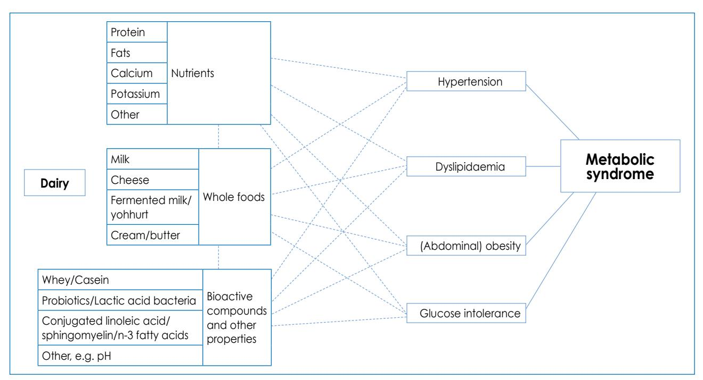

**Figure 1:** Dairy products and metabolic syndrome

## **Health concerns about dairy consumption: possible negative effects**

#### **Lactose intolerance**

Lactose or "milk sugar", the dipeptide carbohydrate in milk, is digested to the monosaccharides glucose and galactose by the enzyme lactasephlorizin hydrolase,50 which is reduced by up to 90-95% in individuals with lactase non-persistence, a condition known as lactose intolerance. These individuals, mainly from South-East Asia, the Middle East and parts of Africa, cannot digest lactose in the small gut, which results in the fermentation of lactose by bacteria in the large gut. This is associated with symptoms such as flatulence, diarrhoea, abdominal bloating and pain.

Lactase persistence is common in people of European ancestry, probably because of a genetic mutation that maintains the functionality of lactase production into adulthood. Itan et al51 examined the conservation of the responsible lactase gene, haplotype, and found that the derived allele is recent in origin, that it has a strong positive selection, and that lactase persistence possibly co-evoluted with dairy farming in Europe in the last 5 000- 10 000 years.

Lactose intolerance is often given as a reason for noncompliance with recointakes of milk and dairy, making it very difficult to meet calcium needs. Therefore, several groups have studied the consequences of milk ingestion by lactose-intolerant individuals. Savaiano et al50 conducted a meta-analysis of studies in which this phenomenon was examined, and concluded that the intake of one cup (250 ml or equivalent of other dairy products) was not a major cause of symptoms in lactose maldigesters. Keith et al52 determined self-reported lactose intolerance and its influence on dairy consumption in African American adults, and found that it was lower than commonly reported. Beyers and Savaiano53 reiterated that lactose-intolerant individuals can consume at least one cup of dairy without experiencing symptoms. Tolerance can be improved by consuming milk with a meal, by choosing yoghurt or other fermented milk or hard cheese in which lactose has been digested, by consuming lactose-reduced milk, or even by using lactase supplements. Lawrence21 advises that up to two cups of milk a day can be consumed by lactoseintolerant individuals if taken with food at separate meal times. She also mentions that tolerance improves with regular milk consumption. Unfortunately, no recent data on lactose intolerance in South African population groups are available. Given the above, as well as the fact that *maas* or fermented milk can replace fresh milk, it is unlikely that lactose intolerance should pose a real problem to milk consumption in South Africa.

## **Saturated fatty acids in dairy**

It is accepted that dietary SFAs with a chain length of 12- 16 carbon atoms increase serum low-density lipoprotein (LDL) cholesterol, and thus the risk of coronary heart disease. However, Griffin18 pointed out that "there has always been a lack of evidence to link dairy foods with cardiovasular diseases, and that there is rather evidence of a protective effect of dairy". The protective effects of dairy on LDL cholesterol and high-density lipoprotein (HDL) cholesterol, as well as blood pressure, are now thought to relate to the calcium and biopeptides in milk.

Lorenzen and Astrup54 showed an attenuation of the effect of SFAs on serum lipids by milk in a clinical trial, probably because the calcium in milk binds and sequesters SFAs and bile acids in the gut, similar to the mechanism of action of cholesterol-lowering drugs and some dietary fibre. Givens55 emphasised that simply reducing milk and dairy intake to limit SFA intake is unlikely to have an effect on serum lipids and NCD risk.

It has been established that the fatty-acid profile of milk can be changed by feeding cows56 and sheep57 modified diets, creating the possibility that milk with less SFAs can be produced if required or demanded.

#### **Trans-fatty acids in milk**

The trans-fatty acids in milk are sometimes used as an argument to avoid dairy products. Trans-fatty acids are known to have adverse effects on health and increasing the risk of NCDs. These include increasing the total HDL cholesterol ratio, lipoprotein(a), cardiovascular disease risk, systemic inflammation, abdominal obesity, weight gain, insulin resistance, and type 2 diabetes, and adverse effects on haemostasis.58,59 However, there is evidence, reviewed by Tardy et al,59 that the origin of trans-fatty acids may result in different biological effects. Industrial trans-fatty acids*,* produced by partial hydrogenation of vegetable oils, differ from ruminant-derived trans-fatty acids that are found in milk. More information is needed before conclusions can be reached on the effects of ruminant trans-fatty acids on human health. Given the overwhelming evidence of the beneficial effects of milk consumption, it is unlikely that these trans-fatty acids have major detrimental effects in the amounts consumed with the recommended milk intake.

The WHO scientific update on trans-fatty acids60 specifies that "there is convincing evidence that trans-fatty acids from commercial partially hydrogenated vegetable oils increase coronary heart disease risk factors and coronary heart disease events", but more research is needed on ruminant trans-fatty acids.

## **Milk allergies**

Cow's milk allergy, an adverse reaction that is mediated by an immunoglobulin E mechanism upon exposure to milk allergens, is the most common food allergy in children. It affects 2-5% of children in the first three years of their lives,61 and could be a major cause of inadequate nutrient intake and retarded growth in small children.62 Only children with a milk allergy that was confirmed by a doubleblind, placebo-controlled food challenge should avoid dairy proteins.63 Treatment consists of total avoidance of exposure to the allergens through elimination diets, and replacing cow's milk with soy or rice milk. Children often outgrow cow's milk allergy by 3-5 years of age, but symptoms may persist beyond childhood in some.61

## **Dental caries**

In a recent review, Aimutus64 mentioned that lactose cariogenicity has been debated for many years, "but the buffering capacity and potential bioactive components present in food that contains lactose offer tooth enamel protection from cariogenicity". In breastfed infants, dental care practices contribute more to dental caries than breast-milk *per se,* and improved parental personal and oral hygiene could mitigate potential problems. However, regularly putting children to bed with a bottle of milk is discouraged.65 The role of nutrition in oral health, including dental caries, in children under five years of age is reviewed by Naidoo65 in this issue of the journal.

## **The consumption of milk and dairy products in South Africa**

In the motivation of milk consumption as part of the FBDG on animal foods, the 2001 technical support paper66 reviewed milk consumption in South Africa, and concluded that although milk and dairy products are consumed by many South Africans from all ethnic groups, mean intakes for adults in six different studies from 1988- 1989 were low, with mean intakes far below the 400 ml per day recommended for adults.

The mean baseline intakes of rural and urban African adults participating in the 12-year Prospective Urban and Rural Epidemiological (PURE) study are shown in Table II (Wentzel-Viljoen E, personal communication, 14 November 2012). These values confirm the previously reported low intake and emphasise the need for active promotion of the milk guideline. The table shows that fresh milk (all types, including *maas*) was consumed by the most people and in the largest quantities. In the Transition and Health during Urbanisation of South Africans (THUSA) study,67 mean intakes varied from 133 g/day for men in informal settlements to 375 g/day for women living on commercial farms. Non-dairy creamers and milk powder blends were popular and used by men and women in both urban and rural areas. Women and, to a lesser extent, men, from the urban areas, regularly consumed a variety of dairy products (e.g. cheese, yoghurt, custard, milk drinks and ice cream), but consumption of these in rural areas was low, and probably related to availability and affordability.

## **Barriers against increased consumption of milk,** *maas* **and other dairy products**

The perceived negative effects of milk and dairy are often reported as barriers to adequate consumption. Concerns about low calcium intakes have motivated research on

| Group            | Fresh milk (all types) | Milk powder (all types) | Canned milk (all types) | Cheese (all types) | Non-dairy creamers and milk blends | Yoghurt (all types) | Milk products (custard and milk beverages) | Ice cream (all types) |
|------------------|---------------------------|----------------------------|----------------------------|-----------------------|---------------------------------------------|------------------------|-----------------------------------------------------|--------------------------|
| Urban men**      | 354                       | 5                          | 4                          | 88                    | 68                                          | 80                     | 93                                                  | 66                       |
| Average          | 143.6                     | 7.4                        | 17.9                       | 3.1                   | 6.8                                         | 27.2                   | 9.8                                                 |                          |
| SD               | 123.2                     | 5.3                        | 14.8                       | 10.1                  | 7.9                                         | 27.9                   | 30.8                                                |                          |
| Urban women** | 556                       | 7                          | 3                          | 168                   | 101                                         | 209                    | 224                                                 | 155                      |
| Average          | 146.1                     | 6.6                        | 24.0                       | 3.0                   | 6.8                                         | 29.1                   | 7.8                                                 | 18.2                     |
| SD               | 119.1                     | 6.2                        | 33.7                       | 4.5                   | 8.0                                         | 27.3                   | 14.2                                                | 24.4                     |
| Rural men**      | 170                       | 1                          | 0                          | 3                     | 155                                         | 0                      | 1                                                   | 0                        |
| Average          | 106.9                     | 4.0                        | -                          | 2.3                   | 6.4                                         | -                      | 3.6                                                 | -                        |
| SD               | 131.7                     | -                          | -                          | 0.9                   | 4.5                                         | -                      | -                                                   | -                        |
| Rural women**    | 317                       | 5                          | 1                          | 4                     | 304                                         | 3                      | 7                                                   | 0                        |
| Average          | 91.4                      | 16.3                       | 35.7                       | 2.4                   | 7.6                                         | 21.4                   | 73.4                                                | -                        |
| SD               | 108.8                     | 17.5                       | -                          | 2.0                   | 7.7                                         | 19.9                   | 118.6                                               | -                        |

**Table II:** Average intakes in g/day of milk and other dairy products by urban and rural subjects who participated in the Prospective Urban and Rural Epidemiological (PURE) study\*

SD: standard deviation

**\*** Reported intakes from a validated quantitative food frequency questionnaire during baseline in 2005 (unpublished, data provided by the PURE research team)

\*\* Number of consumers [1 397 subjects, n = 524 (men) and n = 873 (women)]

#### these barriers.

Jarvis and Miller68 found that a low intake of milk and dairy in African Americans related to perceived lactose intolerance, but that culturally determined food preferences and dietary practices learned early in life played a bigger role. Zablah et al69 interviewed 90 African American women in a grocery store and found that perceived negative taste and association with digestive problems, and the belief that they were already achieving adequate calcium intakes, were the main reasons for low milk intakes. Substituting soft drinks for milk was mentioned as a barrier to adequate calcium intake.70

A New Zealand study71that examined barriers to milk consumption in adult men and women showed that consumption related to what was important in the lives of the respondents. Concern about the fat content of milk was the main barrier for the women. There was less awareness by the men of the nutritional benefits of milk, and therefore less appreciation of its value in their diets.

A study on the acceptance of milk by 8- to 16-yearolds72 showed that within the flavoured milk category, children preferred lactose-free cow's milk, rather than soysubstitute beverages.

The price of milk and dairy may be a barrier to consumption in developing countries. In the 2001 technical paper that supported the South African FBDG on animal foods,66 the reasons why milk and dairy products were relatively expensive in South Africa were discussed. These were based on deregulation of the dairy industry and the fact that the industry is only protected by import tariffs. However, the price of milk and dairy, compared to that of other commodities, should be calculated based on its nutrient content. For example, when the price of 100 mg of calcium from different sources was calculated, it was found that this amount of calcium (provided by whole fresh milk) was R0.62, compared with R1.27 from by canned pilchards in brine, and R5.74 from frozen broccoli. This comparison was made using prices in June 2011, obtained from a "middle-priced" supermarket by the working group, in order to motivate the need for a separate FBDG for milk during the national consensus meeting.

Another barrier to consumption relates to culture and religious taboos and practices, also discussed in the previous technical support paper.66 For example, consumption is affected by the fasting practices of different religions. Although milk, and especially fermented milk, have always been a favourite food of black South Africans, numerous taboos influenced consumption in the past. Only small children and the elderly drank fresh milk. A man could only drink milk in his own household, or in that of a paternal or maternal relative. A woman could only drink milk from her husband's herd after she had been accepted by her husband's family. "Impure" women (menstruating or having had a miscarriage) had to avoid all milk and milk products.

Adequate calcium intake is difficult to achieve with dairyfree diets, even when other nutrient recommendations are met.73 Furthermore, milk is a good source of the so-called "shortfall nutrients" of many consumers.74 To meet calcium requirements and benefit from other health attributes of milk, it is necessary to promote increased consumption of milk and *maas* in South Africa.

Barriers to consumption must be overcome in order for South Africans to realise that "milk matters". A start could be made by explaining the core nutrient contribution of dairy,52 but should also address salient misconceptions and perceptions,75,76 as well as recent research findings. The promotion of dairy intake has to come from many angles, employing multiple techniques and involving all stakeholders; from producers, industry and government, to health professionals, caregivers and consumers.

#### **Conclusion**

The inclusion of milk (especially calcium and potassium) in the diet is essential in order to meet the nutrient needs of most South Africans. In addition, milk, *maas* and yoghurt have many other attributes which recent studies have indicated may be protective against some NCDs, including overweight and obesity. As stated in the introduction paper of this series of technical support papers to the South African FBDGs,77 the nutrition-related NCDs are already responsible for unacceptable high rates of morbidity and mortality in South Africa, justifying efforts to improve the dietary intake of the population. Milk, *maas* and yoghurt can play an important role in meeting this objective, yet concerted promotion efforts, which must also address concerns about milk and dairy consumption, are still required.

## **References**

- 1. Vorster HH, Love P, Browne C. Development of food-based dietary guidelines for South Africa: the process. S Afr J Clin Nutr. 2001;14(3):S3-S6.
- 2. Vorster HH, Oosthuizen W, Jerling JC, et al. The nutritional status of South Africans: a review of the literature. Narrative and tables. Durban: Health Systems Trust, 1997; p. 1-48; 1-122.
- 3. MacIntyre UE, Kruger HS, Venter CS, Vorster HH. Dietary intakes of an African population in different stages of transition in the North West Province, South Africa: the THUSA study. Nutr Res. 2002;22(3):239-256.
- 4. MacKeown JM, Cleaton-Jones PE, Norris SA. Nutrient intake among a longitudinal group of urban black South African children at four interceptions between 1995 and 2000 (Birth-to-Ten Study). Nutr Res. 2003;23(2):185-197.
- 5. Steyn K. Hypertension in South Africa. In: Steyn K, Fourie J, Temple N, editors. Chronic diseases of lifestyle in South Africa: 1995-2005. Cape Town: South African Medical Research Council, 2006; p.80-96.
- 6. Mayosi BM, Flisher AJ, Lalloo UG, Bradshaw D. The burden of non-communicable diseases in South Africa. Lancet. 2009;374(9693):934-947.
- 7. Food and Agriculture Organiziation of the United Nations. Food-based dietary guidelines. FAO [homepage on the Internet]. c2013. Available from: http://www.fao.org/ag/humannutrition/nutritioneducation/ fbdg/en/
- 8. Bourne LT. South African paediatric food-based dietary guidelines. Matern Child Nutr. 2007;3(4):227-229.
- 9. Meyer A, Van der Spuy DA, Du Plessis LM. The rationale for adopting

current international breastfeeding guidelines in South Africa. Matern Child Nutr. 2007;3(4):271-280.

- 10. Maijala K. Cow milk and human development and well-being. Livestock Prod Sci. 2000;65(1-2):1-18.
- 11. Wolmarans P, Danster N, Rossouw K, Schonfeldt H, editors. Condensed food composition tables for South Africa. Parow Valley: Medical Research Council, 2010; p.1-126.
- 12. Anderson JJB. Minerals. In: Mahan LK, Escott-Stump S, editors. Krause's food, nutrition and diet therapy, 10th ed. Philadelphia: WB Saunders, 2000; p.111-152.
- 13. Dietary reference intakes for calcium and vitamin D: report at a glance. Institute of Medicine [homepage on the Internet]. c2013. Available from: http://www.iom.edu/Reports/2010/ Dietary-Reference-Intakes-for-calcium-and-vitamin-D
- 14. Institute of Medicine. Dietary reference intakes. Washington DC: National Academy Press; 2003.
- 15. World Health Organization. Reducing salt intake in populations. Geneva: World Health Organization; 2007.
- 16. Puoane T, Steyn K, Bradshaw D, et al. Obesity in South Africa: the South African Demographic and Health Survey. Obes Res. 2002;10(10):1038-1048.
- 17. Choi J, Sabikhi L, Hassan A, Anand S. Bioactive peptides in dairy products. Int J Dairy Tech. 2012;65:1-12.
- 18. Griffin BA. Dairy, dairy, quite contrary: further evidence to support a role for calcium in counteracting the cholesterol-raising effect of SFA in dairy foods. Brit J Nutr. 2011;1-2.
- 19. Van Meijl LEC, Vrolix R, Mensink RP. Dairy product consumption and the metabolic syndrome. Nutr Res Rev. 2008;21(2):148-157.
- 20. Calder PC, Ahluwalia N, Brouns F, et al. Dietary factors and lowgrade inflammation in relation to overweight and obesity. Brit J Nutr. 2011;106(Suppl 3):S5-S78.
- 21. Lawrence AS. Milk and milk products. In: Mann J, Truswell S, editors. Essentials of human nutrition. 4th ed. Oxford: Oxford University Press, 2012; p.420-423.
- 22. Troegeler-Meynadier A, Enjalbert F. Conjugated linoleic acids: variations of their concentrations in milk and dairy products. Rev Med Veterin. 2005;156(6):323-331.
- 23. Lock AL, Bauman DE. Modifying milk fat composition of dairy cows to enhance fatty acids beneficial to human health. Lipids. 2004;39(12):1197-1206.
- 24. Larsen M, Toubro S, Astrup A. Efficacy and safety of dietary supplements containing CLA for the treatment of obesity: evidence from animal and human studies. J Lipid Res. 2003;44(12):2234-2241.
- 25. Beukes EM, Bester BH, Mostert JF. The microbiology of South African fermented milks. Int J Food Microbiol. 2001;63(3):189-197.
- 26. McMaster LD, Kokott SA, Reid SJ, Abratt VR. Use of traditional African fermented beverages as delivery vehicles for Bifidobacterium lactis DSM 10140. Int J Food Microbiol. 2005;102(2):231-237.
- 27. Ooi L-G, Ahmad R, Yuen K-H, Liong M-T. Hypocholesterolemic effects of probiotic-fermented dairy products. Milchwissenschaft-Milk Sci Int. 2011;66(2):129-132.
- 28. Haug A, Hostmark AT, Harstad OM. Bovine milk in human nutrition: a review. Lipids Health Dis. 2007;6:25.
- 29. Fenton TR, Lyon AW. Milk and acid-base balance: proposed hypothesis versus scientific evidence. J Am Coll Nutr. 2011;30(5):471S-475S.
- 30. Yang QH, Liu TB, Kuklina EV, et al. Sodium and potassium intake and mortality among US adults prospective data from the third National Health and Nutrition Examination Survey. Arch Intern Med. 2011:171(13):1183-1191.
- 31. Huggins CE, O'Reilly S, Brinkman M, et al. Relationship of urinary sodium and sodium-to-potassium ratio to blood pressure in older adults in Australia. Med J Aus. 2011;195(3):128-132.
- 32. O'Donnell MJ, Yusuf S, Mente A, et al. Urinary sodium and potassium excretion and risk of cardiovascular events. JAMA. 2011;306(20):2229-2238.
- 33. Tomonari T, Fukuda M, Miura T, et al. Is salt intake an independent risk factor of stroke mortality? Demographic analysis by regions in Japan. J Am Soc Hypertens. 2011;5(6):456-462.
- 34. World Health Organization. Prevention of recurrent heart attacks

# **"Fish, chicken, lean meat and eggs can be eaten daily": a food-based dietary guideline for South Africa**

**Schonfeldt HC,** PhD, Professor; **Pretorius B,** PhD, Research Consultant; **Hall N,** MSc, Research Consultant Institute for Food, Nutrition and Well-being, University of Pretoria, Pretoria **Correspondence to:** Hettie Schoenfeldt, e-mail: hettie.schonfeldt@up.ac.za **Keywords:** fish, chicken, lean meat, eggs, daily, food-based dietary guidelines, FBDGs

#### **Abstract**

**8**

Food products from animals provide a variety of macro- and micronutrients. Animal sources of food, such as fish, chicken, meat and eggs, constitute high-quantity and high-quality protein, as they contain essential amino acids in the right proportions. In South Africa, eight micronutrients, namely vitamin A, vitamin B1 , vitamin B2 , vitamin B6 , vitamin B12, niacin, iron and zinc, have been identified as lacking in the population's diet. Animal-sourced food is a particularly rich source of these nutrients. Relatively small amounts of these foods, added to a mixed diet, make a substantial contribution to nutrient adequacy. Generally, animal sources of food are associated with nutrients that are less desirable in the diet, such as saturated fat and cholesterol. However, by choosing lean prudent portions of these foods, the intake of such macronutrients can be controlled. Animal sources of food add variety and nutrients to the diet. Adding a small amount of these food products to a plant-based diet can yield considerable improvements in human health. For a variety of reasons, some people choose not to eat meat, but as there is no evidence that a moderate intake of fish, chicken, lean meat and eggs has a negative effect on health, there is no scientific justification to exclude them from the diet. As recommended in global food-based dietary guidelines, when consumed in moderation, fish, chicken, lean meat and eggs can be part of a healthy, South African diet.

 **Peer reviewed. (Submitted: 2013-04-09. Accepted: 2013-09-21.) © SAJCN S Afr J Clin Nutr 2013;26(3)(Supplement):S66-S76**

#### **Introduction**

The food-based dietary guideline (FBDG) "Fish, chicken, lean meat and eggs can be eaten daily" was formulated based on the valuable nutritional contribution that these foods make to a balanced, South African diet. In appropriate amounts, these foods are important sources of complete, high-quality, easily digestible protein, as well as essential micronutrients, such as iron, zinc, vitamin A, vitamin B12 and calcium. Animal sources of food are not essential to the human diet, yet they remain desirable and popular.1 Including small amounts of animal sources of food in the diet of malnourished individuals plays a key role in improving their nutritional status.2

The objectives of this article are:

- • To discuss the nutritional contribution that fish, chicken, lean meat and eggs can make to the South African diet.
- • To review evidence relating to risks associated with the consumption of animal products.
- • To compare international FBDGs on animal products.
- • To discuss optimal amounts and best practices for the consumption of these foods.

## **Nutritional considerations**

Although the production of livestock has increased in developing countries, undernutrition, including the insufficient consumption of protein, remains a persistent

problem in the developing world. Compared with what has been recommended, many diets in developing countries are deficient in energy, protein and other nutrients. Therefore, the quality of the sources of protein is especially important.1 By contrast, the overconsumption of food, and specifically that which is high in saturated fat and cholesterol, has been linked to overweight, obesity and subsequent diseases of lifestyle.2

### **Important nutrients provided by animal sources of food**

Although there has been a longstanding global fight against hunger, it is well documented that the provision of energy, without an adequate intake of critical protein and micronutrients, may increase weight, but not length, promoting adipose tissue gain and obesity. This can contribute to stunting and obesity in a single individual.3,4

#### **Protein**

According to the World Health Organization, dietary protein intake in developing countries falls significantly short of the recommended 0.66 g/kg/day.3 In these countries, protein is obtained from staple foods which are mainly cereal-based.1 These foods contain a lower quantity of protein compared to that in animal sources of protein (Table I), and are often low in the essential amino acids, lysine and tryptophan,2 and sulphur-containing amino acids. Therefore, the quality of the protein source is compromised.5 The latter has a direct influence on protein digestibility. Protein that is obtained from food sourced from animals is of high quantity and quality, as it contains essential amino acids in the right proportions.2

Research has shown that adding even small amounts of animal-derived protein to a plant-based diet can yield significant improvements in maternal health and

#### **Table I:** The protein content of a serving of selected food commonly consumed by South Africans6

| Selected food         | One serving                                | Protein amount (g) |
|-----------------------|--------------------------------------------|-----------------------|
| Meat, chicken         | 85 g beef (lean, cooked)                   | 28                    |
| and fish              | 85 g chicken (cooked)                      | 26                    |
|                       | 85 g sardines (pilchards) with the bone | 21                    |
| Legumes               | 172 g (1 cup) cooked soybeans           | 29                    |
|                       | 196 g (1 cup) boiled split peas         | 16                    |
|                       | 256 g (1 cup) red kidney beans          | 13                    |
| Egg                   | 50 g (1 large) boiled egg                  | 6                     |
| Dairy                 | 245 g (1 cup) milk                         | 8                     |
|                       | 28 g cheddar cheese                        | 7                     |
|                       | 30 g low-fat cottage cheese                | 3                     |
| Starch and cereals | 158 g (1 cup) white rice (cooked)       | 4                     |
|                       | 219 g (1 cup) oat bran                     | 7                     |
|                       | 28 g (1 slice) wholewheat bread         | 4                     |
| Vegetables and        | 180 g (1 cup) spinach                      | 5                     |
| fruit                 | 1 (118 g) banana                           | 1                     |

child development.7,8 Significant associations have been found between animal protein intake and lean mass, but no such association has been reported with vegetable protein. High-quality protein, in combination with the micronutrients provided by animal sources of food, facilitates protein synthesis during normal and active growth, repair after extreme physical activity, and repair in elderly individuals with regard to postponing and treating sarcopenia.9

#### **Beneficial fatty acids**

Fat is generally a valued element in the diet and provides energy and palatability to dry foods, and also serves as a cooking medium. Originally, dietary fat was considered to be a source of energy. Later research introduced the concept of essential fats which need to be provided by the diet to prevent deficiencies. Two dietary fatty acids are classified as essential, namely linoleic acid and a-linolenic acid. Research has also shown that fatty acids play a major role in preventing chronic conditions, such as cardiovascular diseases. This has resulted in an increased interest in the quality of the dietary lipid supply as a major determinant of long-term health and well-being.10

The contribution of meat and meat products to the supply of total fat and saturated fatty acids (SFAs) is well known, but their contribution with regard to dietary polyunsaturated fatty acids (PUFAs) is less widely recognised. The fatty acid composition of various products is compared in Table II. Overall, red meat contains similar proportions of monounsaturated fatty acids (MUFAs) and SFAs, although the exact proportions of the fatty acids vary, depending on their fat content. Lean meat is relatively higher in PUFAs, and lower in SFAs and total

**Table II:** A comparison of the fat content and lipid profile of the edible portion of different animal sources of food

| Food (per 100 g, raw, edible                           | Fat   | SFAs  | MUFAs | PUFAs | n-3  | n-6  | n-9  | n-fatty acids | C   | P:S ratio |
|--------------------------------------------------------|-------|-------|-------|-------|------|------|------|------------------|-----|-----------|
| portion)                                               | g     | g     | g     | g     | g    | g    | g    | g                | mg  |           |
| Beef15*                                                | 14.20 | 5.95  | 5.29  | 0.64  |      |      |      |                  | 76  | 0.10      |
| Lamb** (lean) (average of shoulder, loin and leg)16 | 6.79  | 3.62  | 2.92  | 0.25  | 0.04 | 0.25 | 3.08 | 3.37             | 63  | 0.07      |
| Mutton (lean) (average of shoulder, loin and leg)16 | 7.85  | 4.18  | 3.36  | 0.31  | 0.09 | 0.24 | 3.45 | 3.78             | 49  | 0.07      |
| Pork (average of shoulder, loin and leg)17          | 5.23  | 2.08  | 2.15  | 1.00  | 0.05 | 0.92 |      | 0.97             | 40  | 0.48      |
| Chicken (fresh, white meat)6                           | 2.70  | 0.75  | 1.05  | 0.68  |      |      |      |                  | 41  | 0.89      |
| Chicken (fresh, dark meat)6                            | 7.60  | 2.06  | 3.14  | 1.98  |      |      |      |                  | 62  | 0.96      |
| Eggs, chicken (whole and raw)6                      | 10.30 | 3.01  | 4.00  | 1.36  |      |      |      |                  | 419 | 0.45      |
| Cheddar cheese6                                        | 32.30 | 18.40 | 8.11  | 0.75  |      |      |      |                  | 115 | 0.04      |
| Low-fat cottage cheese6                                | 4.00  | 2.67  | 0.98  | 0.13  |      |      |      |                  | 5   | 0.05      |
| Pilchards in tomato sauce6                             | 5.40  | 1.60  | 1.09  | 2.13  |      |      |      |                  | 70  | 1.33      |

C: cholesterol, MUFAs: monounsaturated fatty acids, n-3: omega-3, n-6: omega-6, PUFAs: polyunsaturated fatty acids, P:S ratio: polyunsaturated to saturated fatty acid ratio, SFAs: saturated fatty acids.

\* A study to determine the nutritional composition of lean South African beef (trimmed of subcutaneous fat) is currently underway. No lean values for South African beef have been determined before.

\*\* The average age of a lamb carcass in South Africa is 5-9 months, and has a weight of 17.18 kg.16 The younger the animal, the higher the cholesterol content, as most of the cholesterol in the muscle has a definite metabolic or structural function in the cell membranes. Cholesterol content normally has an inverse relationship with fat, e.g. the leaner the meat, the higher the percentage of cholesterol to fat content.18,19

fat, than untrimmed meat. Meat and meat products make an important dietary contribution to the intake of linoleic (C18:2 n-6) and α-linolenic (C18:3 n-3) acids, as well as to C20 and C22 PUFAs that are present in meat phospholipids. Ruminant meats and oily fish are the only significant sources of preformed C20 and C22 PUFAs in the diet.11,12 Although humans have the metabolic capacity to synthesise the latter from the omega-6 (n-6) or omega-3 (n-3) precursors derived from linoleic and α-linolenic acids, respectively, an increase in the consumption of C20 and C22 n-3 PUFAs has the potential to overcome the perceived imbalance in the ratio of n-6:n-3 PUFAs in modern diets. N-3 fatty acids have been shown to reduce the incidence of cardiovascular disease in epidemiological and clinical trials.13 Large-scale epidemiological studies suggest that individuals at risk of coronary heart disease benefit from the consumption of plant-, animal- and marine-derived n-3 fatty acids, although the ideal intake is still unclear.13 The data are supportive of the American Heart Association and the South African Heart Foundation14 dietary guidelines, to include at least two servings of fish per week, and fatty fish in particular.13

Animal sources of food contain naturally occurring trans fats. Generally, the results from epidemiological studies have shown an inverse association or no association between ruminant trans-fatty acid intake and coronary heart disease in multiple geographical locations.20 Conjugated linoleic acid (CLA), a naturally occurring trans-fatty acid, is associated with beneficial health properties, such as a reduction in the risk of cancer, atherosclerosis and diabetes. CLA has also been shown to have positive effects on immune function and body composition. The biological synthesis of CLA occurs through the microbial isomerisation of dietary linoleic acid in the digestive tracts of ruminant animals. Therefore, the products from ruminant species are rich dietary sources of CLA.11,20,21 According to recent reviews, the transfatty acids in the food supply should be limited to the "natural" ruminant fats in meat and dairy products.11,20,22 However, more clinical studies are warranted, because of the limited number of studies and inconsistencies in the available data.

#### **Micronutrients**

In many developing countries, including South Africa, aside from the low energy intake in many communities, there is a deficit in iron and vitamin A status, especially in vulnerable groups such as children and women of childbearing age. In South Africa, mandatory fortification of cereal-based staple foods with a combination of micronutrients has yet to be successful in improving the vitamin A or iron status of individuals.23 Many current programmes aimed at improving food security promote a sustainable, foodbased approach to combat malnutrition.24

The nutrient levels in selected foods are presented in Table III. Animal sources of food tend to be richer sources of nutrients that cause concern (i.e. those that are lacking in the diet), such as iron and zinc. Although the nutrient density of animal-derived food products provides ample reason to promote the inclusion of these in optimal diets, the quality and bioavailability of the specific nutrients that cause concern should also be considered.25,26 According to the 1999 National Food Consumption Survey, the five foods consumed most often are maize porridge, brown bread, black tea, sugar and a small amount of full-cream milk.27 The naturally present fibres, phytates, oxalates and tannins in the three foods consumed most often may interfere with the absorption of nutrients. Although essential minerals, such as iron and zinc, are also present in cereal staples, they have a lower bioavailability in plant-based foods owing to their chemical form and the presence of inhibitors within the food source, such as phytic acid and dietary fibre.

As an example, animal and plant food sources contain different types of iron. Plant sources of food, such as the popularly referenced spinach, contain only non-haem

| Nutrient    | Unit | Fortified maize porridge (stiff)6 | Fortified brown bread6 | Spinach (boiled)6 | Chicken with skin (frozen, (boiled)6 | Egg and chicken (boiled)6 | Beef fillet (cooked, not trimmed)6 | Pilchards in tomato sauce6 | Lamb loin (cooked, untrimmed)16 | NRI28 |
|-------------|------|--------------------------------------------|------------------------------|----------------------|--------------------------------------------|---------------------------------|------------------------------------------|----------------------------------|---------------------------------------|-------|
| Energy      | kJ   | 455                                        | 1 029                        | 134                  | 923                                        | 616                             | 803                                      | 531                              | 1171                                  | -     |
| Protein     | g    | 2.7                                        | 9.0                          | 2.7                  | 26.8                                       | 12.6                            | 30.9                                     | 18.8                             | 23.5                                  | 56.0  |
| Fat         | g    | 0.6                                        | 1.4                          | 0.3                  | 12.6                                       | 10.3                            | 7.5                                      | 5.4                              | 20.9                                  | -     |
| Vitamin B1  | mg   | 0.13                                       | 0.46                         | 0.02                 | 0.08                                       | 0.11                            | 0.24                                     | 0.02                             | -                                     | 1.20  |
| Vitamin B2  | mg   | 0.05                                       | 0.11                         | 0.07                 | 0.15                                       | 0.38                            | 0.19                                     | 0.29                             | -                                     | 1.30  |
| Vitamin B6  | mg   | 0.12                                       | 2.13                         | 0.04                 | 0.17                                       | 0.04                            | 0.44                                     | -                                | -                                     | 1.70  |
| Vitamin B12 | µg   | 0                                          | 0                            | 0                    | 0.3                                        | 1.6                             | 2.3                                      | 12                               | -                                     | 2.40  |
| Calcium     | mg   | 2                                          | 14                           | 104                  | 11                                         | 39                              | 7                                        | 300                              | -                                     | 1 300 |
| Iron        | mg   | 1.30                                       | 4.10                         | 2.20                 | 0.80                                       | 1.80                            | 2.50                                     | 2.70                             | 2.87                                  | 18.00 |
| Zinc        | mg   | 0.63                                       | 4.49                         | 0.49                 | 1.78                                       | 1.15                            | 7.45                                     | 1.60                             | 3.11                                  | 11.00 |

**Table III:** The composition of selected foods (per 100g) compared with the nutrient reference intake for individuals aged four years and older

NRI: nutrient reference intake

iron, while animal food sources contain both haem and non-haem iron. The bioavailability of ingested iron (the amount which is absorbed and available for bodily functions) differs significantly between the type of iron. In general, the rate of non-haem iron absorption relates to its solubility in the upper part of the small intestine. Thus, the presence of soluble enhancers and inhibitors consumed during the same meal will have a significant effect on the amount of non-haem iron that is absorbed. Haem iron is much less affected by other dietary factors, and contributes significantly to absorbable iron. Animal sources of food are considered to be good sources of the more bioavailable haem iron.29

The high nutrient density of animal food has an advantage in food-based interventions that target vulnerable groups such as infants, children and people living with HIV/AIDS, who may have difficulty consuming the large volumes of plant sources of food needed to meet their nutritional requirements.30

Cooked beef (100 g) provides almost an entire day's recommended intake of vitamin B12 and half the recommended intake of protein and zinc, and contributes substantially to meeting the vitamin B1 , vitamin B2 , vitamin B6 and iron recommendations. Similarly, two large eggs supply more than 20% of daily protein requirements, nearly 30% of daily vitamin B2 requirements, and two thirds of daily vitamin B12 requirements (Table III).

Furthermore, animal sources of food provide multiple micronutrients simultaneously, which may be important in diets that are marginally lacking in more than one nutrient. For example, vitamin A and riboflavin are needed for iron mobilisation and haemoglobin synthesis, and iron supplements may not reduce the prevalence of anaemia if the intake of these other nutrients is low.31 Thus foods, such as liver, which contain substantial levels of both iron and preformed vitamin A, may be more effective than singlenutrient supplements in alleviating poor micronutrient status. This emphasises the delivery of nutrients within a specific food matrix.

In addition, the bioavailability of carotenoids, such as vitamin A precursors, is now believed to be lower than that indicated in traditional food composition tables.32-34 Thus, more fruit and vegetables are needed to meet vitamin A requirements than was previously thought in diets that depend on plant sources for provitamin A carotenoids. All vitamin B12 requirements must be met from animal sources of food or from supplementation, as there is virtually no vitamin B12 in plant food sources.31

#### **Product-specific nutritional considerations**

Animal sources of food, as a concentrated nutrient source, were traditionally considered to be essential for optimal growth and development. This reputation diminished as the fat versus health debate increased. Generally, animal sources of food also supply nutrients that are less desirable in the diet, such as saturated fat and cholesterol. A concentrated source of macronutrients, such as fat and protein, is often desirable in children in developing countries, although excessive consumption of energydense foods may lead to overconsumption of energy in people in more affluent countries. As populations urbanise, an increase in the intake of animal sources of food is observed. Consequently, there is an increased need to educate the population on nutritional concerns about the excessive consumption of macronutrients in these foods.

In response to consumer demand, progress has been made in both total fat reduction and modifications to the fatty acid profiles of animal sources of food, including South African red meats and eggs. Furthermore, recommending lean portions, i.e. trimming excess visible fat and reducing the addition of fat during preparation and cooking, could reduce overconsumption of energy and total and saturated fat from these food types. The consumed portion size is also of importance.

## **Chicken**

At present, poultry is one of the leading meat products that is consumed in South Africa. Poultry meat is a nutritious food of high-nutrient density. It has a high protein content and is an excellent source of water-soluble B vitamins and minerals, such as iron and zinc.6 The fat in chicken is mostly subcutaneous. Therefore, the fat content of chicken, as with all poultry, can easily be lowered by removing the skin. Chicken (white and dark meat) has a fat content < 10%. However, it is of concern that chicken is often deep fried with the skin on, which increases the fat content considerably. It is strongly advised that consumers are educated about the meaning of "lean".

## **Fish**

The importance of fish as part of a balanced diet, especially in the diet of infants, young children and pregnant women, is widely recognised. The contribution of fish to the supply of protein and micronutrients is particularly important (Table III), as well as to the supply of fatty acids necessary for the development of the brain and body.35

Aquatic animals contain a high level of protein (17-20%), with an amino acid profile that is similar to that of meat. The flesh of fish is also readily digestible and immediately utilisable by the human body, which makes it suitable when needing to complement the high-carbohydrate diet of maize porridge and brown bread that is prevalent in most of the country. Compared with land animals, with exceptions like shellfish, aquatic animals have a high percentage of edible flesh, and there is little wastage.36

Oil-rich fish are higher in saturated fat than white fish and shellfish. However, a significant proportion of additional fatty acids derive from the long-chain, n-3 PUFAs group, which has been linked to health benefits. The human body cannot produce these essential fatty acids, so it is very important that these are consumed in the diet. N-3 fats are important for good health.35 There are two types of n-3s: long-chain fatty acids found in oily fish [docosahexaenoic acid (DHA) and eicosapentaenoic acid (EPA)], and the fatty acid a-linolenic acid (ALA), found in vegetable oils such as flaxseed, walnut, rapeseed and soya oils. The long-chain n-3 fatty acids are beneficial to the body. The current recommendation is to eat two portions of fish a week. The short-chain, n-3 fatty acids may not have the same benefits.

As very few other foods contain the essential n-3 PUFAs, EPA and DHA, fish intake is strongly recommended. Oil-rich fish includes herring, trout, mackerel, sardines and salmon, but n-3 fatty acids are also present in lean fish, albeit at lower concentrations. There is scientific evidence that a regular intake of EPA and DHA reduces the risk of heart attacks. Limited evidence also indicates that non-salted fish is protective against colorectal cancer.36

The key micronutrients provided by fish are the mineral phosphorus, selenium, potassium, iodine, zinc and magnesium and vitamins B2 , B12 and D. Because of the presence of small edible bones, tinned sardines are a source of calcium, particularly in people who choose not to consume dairy products.36

#### **Beef**

Significant differences in the nutritional composition of beef carcasses of varying ages, and even more noteworthy disparities within a specific age group, and among different fat classes were reported by Schönfeldt.37 There is a larger variation in the fat content of varying cuts within the same carcass than in beef carcasses of different age groups and fat levels. For instance, a cooked fillet of an A-age animal (i.e. a young animal with no permanent incisors) with a fat level of 2, contains 8% fat on average, compared to 34% fat in the thin flank of the same carcass.37 South Africa has not escaped the obesity epidemic. Thirty per cent of adult men and 52% of adult women are overweight or obese, and the figures continue to increase.23 Health, as a driver in the consumption of beef, and a consumer preference for leaner meat has led to a significant reduction in the fat level of beef carcasses from 32% in 1949, to 18% in 1981, and 13% in 1991. Cuts that are low in both fat and SFAs can be included in a low-fat, balanced diet.15

## **Lamb and mutton**

In a series of research studies conducted by the University of Pretoria, in collaboration with the Agricultural Research Council, it was found that lean South African lamb and mutton, trimmed of external fat, contains less than 10% fat on average, and can be included as part of a healthy, well-balanced diet. Forty-seven per cent of the fat in South African lamb and mutton is in the form of healthy MUFAs and PUFAs. Lamb and mutton are natural sources of CLA. CLA has been shown to protect the body from cancer and heart disease and to lower cholesterol levels.16 These studies were based on carcasses that are consumed most often in South Africa, namely lamb and mutton with a fatness code of 2, according to the South African carcass classification system.

## **Pork**

A significant study that was carried out by the Agricultural Research Council in 2008 revealed that South Africanproduced pork is scientifically bred to be leaner and to provide a lower fat content. The fat in pork is mostly visible as subcutaneous fat, and can be trimmed without much difficulty.17 The fat in pork is a combination of SFAs, PUFAs and MUFAs, in varying amounts. It contains less than 50% of SFAs, while the rest comprises MUFAs and PUFAs. Pork is an excellent source of thiamine (vitamin B1 ) and a good source of niacin (vitamin B3 ).

## **Offal**

In general, offal is richer than lean meat in iron, copper and certain B vitamins. Liver is a particularly rich source of vitamins A, B1 , B2 , B6 , B12, niacin and pantothenic acid, with traces of vitamin D.6 The amount of vitamin A that is present in liver can be variable and, indeed, very high. It depends on the age of the animal and the composition of the consumed feed. As fat-soluble vitamins are not excreted by the body, very high doses can have adverse health effects.33 Kidneys are a rich source of vitamin B1 , B2 and B12. Pancreas meat is a good source of vitamins B1 , B2 and C and pantothenic acid. Other organ meats compare well with lean meat as sources of vitamins. All meat products are good sources of zinc and iron. The liver, lungs and spleen are especially rich in iron.38

## **Eggs**

In the past, research on eggs focused on associations with serum cholesterol levels and heart health. However, many of these studies are now considered to be methodologically weak, since they had not adequately controlled for potential confounders such as pre-existing hypercholesterolaemia, saturated fat intake or smoking.39

Eggs are a rich source of protein and several essential nutrients, such as vitamin A, the B vitamins, including thiamine, riboflavin, folate, B12 and B6 , and vitamin D, selenium and choline, when compared with other protein foods.6 They provide a nutrient-dense source of energy (approximately 314 kJ per large egg) derived from protein and fat. Eggs have traditionally been used as the standard of comparison for the measurement of protein quality because of their essential amino acid profile and high digestibility, which is important for children, adolescents and young adults, since protein is required to sustain growth and build muscle.39 High-quality protein may prevent the degeneration of skeletal muscle19 and protect against health risks associated with ageing in older adults.35,36 In addition, the antioxidants (lutein and zeaxanthin) that are found in egg yolk may help to prevent age-related macular degeneration.40,41

Although eggs are a rich source of cholesterol (419 mg/ 100 g), they have a low SFA content.6 Epidemiological studies have consistently shown a non-significant relationship between egg intake and the risk of cardiovascular heart disease. Emerging evidence suggests that eating eggs is associated with satiety, good weight management and better diet quality.31

#### **Processed meats**

According to Linseisen, processed meat includes meat that has been preserved by methods other than freezing, such as salting, smoking, marinating, air drying or heating. Examples include ham, bacon, sausages, hamburgers, salami, corned beef and tinned meat.42 According to the South African national standard (SANS 885:2012), processed meat is meat that has been subjected to any process which alters its original state, excluding sectioning and freezing, with or without other ingredients, and which, as a result of this process or these processes, is irreversibly changed. It excludes raw processed meat, as defined in the current relevant legislation.43

The composition of different processed meat varies widely between type and producer. Overall, processed meat is more likely to have a higher content of sodium and nitrites than that of lean meat. Sodium is added to meat products to enhance and modify the flavour, physical properties and sensory attributes of the food, and to contribute to preservation of the product. Legislation has recently been promulgated within the country to reduce and control the amount of salt in processed meat products, because of adverse health effects associated with a high intake of sodium.

Nitrites have been consumed since the beginning of time in a variety of foods, including those that occur naturally in vegetables and cured meat. Nitrites are considered to be essential curing ingredients, responsible for developing colour, creating a unique flavour profile and controlling lipid oxidation. They are also effective antimicrobial agents. Despite controversies about the safety of nitrites, ongoing research focused on the metabolism of nitrites, nitrates and nitric oxide is re-evaluating the possible benefit of nitrates and nitrites in human health.44,45

It was indicated that it is important to distinguish between meat groups in a cross-sectional study of Irish adults, as there is a large variation in dietary quality between consumers of red, white and processed meat. For example, increasing processed meat intake has been found to be associated with a lower intake of wholemeal bread, fruit, vegetables and fish, as well as poorer overall dietary quality.46 Other factors, such as fruit, vegetable and fibre intake and physical activity, are also important. The risk of cancer may be more effectively reduced by taking both diet-related and lifestyle risk factors into account.

Although meat intake has been associated with an increased risk of colon cancer in some studies, processed meat appears to be a stronger predictor of this than unprocessed fresh meat. The contribution of meat to improved nutrient intake more than offsets this uncertain association with cancer, particularly in developing countries.11,47,48

## **Other constraints on the consumption of animal sources of food**

Although consumer attitudes to animal sources of food are influenced by a number of factors, such as price and availability, major variations in the volume and type of product consumed in different countries are thought to be primarily because of differences in culture and traditional eating habits.49 As populations have urbanised, a corresponding increase in animal product consumption has been observed.50

Furthermore, some individuals choose to avoid meat altogether or certain types of animal food sources for a variety of reasons, including taste, ethical or religious reasons, health concerns about additives, hormones, fat and cholesterol, or because of socio-economic factors.11,51 The consequences of production and consumption, such as greenhouse gas emissions, the water footprint and land use, are also receiving considerable attention.52

The delicate balance between adequate, over- and underconsumption of animal sources of food remains a very complicated aspect of ensuring healthy and nutritionally adequate, yet environmentally sustainable, diets.

## **Vegetarian diets**

People choose to follow a vegetarian diet for a variety of reasons. Well-planned vegetarian diets can be both nutritious and healthy. These have been associated with a lower risk of heart disease, type 2 diabetes, obesity and certain types of cancer, and lower blood cholesterol levels.53 However, restrictive or unbalanced vegetarian diets may lead to nutritional deficiencies, particularly in situations of high metabolic demand. The nutrients of major concern in a vegetarian diet are protein, iron, calcium, vitamin B12 and n-3 fatty acids.

While proteins from animal sources contain the complete mix of essential amino acids, few plants do.2,5,53 Plants provide some protein. Each plant contains a different combination. Provided that a mixture of different plant proteins is consumed over the course of a day, all of the necessary essential amino acids will be provided in the diet. Vegetarian protein sources include beans, lentils, soya, soya products, seeds, nuts and whole grains.

Although red meat is the richest and most easily absorbed source of iron,29 a number of plant foods can make a significant contribution. To increase iron intake levels in a vegetarian diet, it is necessary to eat plenty of fortified breakfast cereals, beans, lentils, leafy green vegetables, seeds and nuts. Fortified maize meal porridge and brown bread should be included on a regular basis. To aid the absorption of iron from plant foods, when having a meal, a source of vitamin C should be included, such as a glass of fruit juice.29,53

Tinned sardines and dairy products are rich sources of calcium. If none of these are consumed, a diet that is rich in tofu (soya), calcium-fortified foods, green leafy vegetables, seeds, nuts and dried fruit must be consumed. Although spinach contains calcium, it is bound to a compound called oxalate. This greatly reduces its absorption, making it a poor source of usable calcium.54

Consuming eggs and dairy foods will ensure enough vitamin B2 and B12 in the diet. Vegans should consider including fortified foods that contain vitamin B2 and B12. To increase the content of these vitamins in the diet, it is important to eat plenty of yeast extract, soya milk and breakfast cereals. With regard to fatty acids, the body has the ability to convert some ALA into the n-3 PUFAs, EPA and DHA, yet this conversion isn't very efficient. If no fish is consumed, a supplement of DHA should be considered.53

The FBDG guideline "Fish, chicken, lean meat and eggs can be eaten daily" was formulated to indicate that animal sources of food should be eaten daily to help meet nutrient needs during the life cycle. Extra care must be taken to ensure that nutritional needs are being met when animal foods are omitted from the diet.

#### **Current intake and recommended portion sizes**

Apart from deciding what and when to eat, the amount of food that is consumed plays a significant role in the amount of nutrients and energy consumed.

According to the previous FBDG on animal sources of food, the recommended amounts that should be consumed include:55

- • Two to three fish portions per week (80-90 g per portion).
- • Three to four eggs per week.
- • Not more than 560 g red meat per week (approximately a 80-90 g portion per day).

Urbanisation is a growing phenomenon in South Africa. People are continually moving from rural areas into urban settlements in search of better work and incomegeneration opportunities. These changes in lifestyle are often accompanied by acculturation and an increase in the utilisation of animal sources of food.56

Table IV indicates the consumption of red and white meat and eggs over the last decade. According to data extrapolated from the *Abstract of Agricultural Statistics,* there has been an increase in beef, veal, pork and chicken meat and egg consumption. Sheep meat consumption during the same period decreased, but the total consumption of eggs and red and white meat increased.57

Publications such as the *Abstract of Agricultural Statistics,57 The South African Agricultural Baseline59* and *FAO Fishery Statistical Collections,60* from which production and consumption data are extrapolated, provide broad statistical data on population, food production and consumption figures. Such statistics can be used to obtain estimates of food consumption, but these estimates are not fully representative of actual food intake. Food balance sheets are based on statistical data on the production, import and export of carcasses, and eventual shifts in stock. Because of the large quantities of discarded material prior to meat reaching the table for consumption (e.g. bones and cartilage) and at the table (e.g. trimmed fat and wastage), the apparent supply from this source will always be an overestimation of the true meat intake in a population. From the time of slaughter to actual consumption, up to 70% of the slaughtered product is wasted.61

Table V calculates the estimated actual consumption of animal products, including meat and offal, from the consumption data reported from agricultural statistics using yield factors,62 when wastage is taken into consideration. The data presented in Table V do not include food waste from possible spoilage or plate loss from production to consumption, reported to be up to 40% in the UK.61

#### **Table IV:** Per capita consumption (g/day) of red meat, white meat and eggs over the last decade58

| Protein source  | 2000/2001 | 2010/2011 |  |  |  |
|-----------------|-----------|-----------|--|--|--|
| Beef and veal   | 35        | 47        |  |  |  |
| Pork            | 7         | 13        |  |  |  |
| Lamb and mutton | 10        | 5.5       |  |  |  |
| White meat      | 59        | 96        |  |  |  |
| Eggs            | 19        | 23        |  |  |  |

|  |  |  |  |  |  | Table V: Estimated edible portion available for consumption (g/capita/day), calculated from agricultural statistics using yield factors |  |
|--|--|--|--|--|--|-----------------------------------------------------------------------------------------------------------------------------------------|--|
|--|--|--|--|--|--|-----------------------------------------------------------------------------------------------------------------------------------------|--|

| Animal products | Raw product (kg/capita/year)63 | Raw (g/capita/day) | Yield factor (edible portion)*62 | Edible portion (cooked product g/capita/day) |
|-----------------|-----------------------------------|-----------------------|-------------------------------------|-------------------------------------------------|
| Beef and veal   | 17.07                             | 46.77                 | ± 0.60                              | 28.06                                           |
| Pork            | 4.60                              | 12.60                 | ± 0.60                              | 7.56                                            |
| Sheep and goat  | 2.90                              | 7.95                  | ± 0.50                              | 3.98                                            |
| White meat      | 34.91                             | 95.64                 | ± 0.40                              | 38.26                                           |
| Eggs            | 8.48                              | 23.20                 | ± 0.90                              | 20.9                                            |
| Fish            | 7.60                              | 20.82                 | ± 0.60                              | 12.5                                            |
| Total           | 75.56                             | 206.98                |                                     | 111.26                                          |

\* Following cooking loss, bone, fat and plate waste

| Group               |                               |                     | 2000/2001                                |                                             | 2010/2011                     |                     |                                                           |         |
|---------------------|-------------------------------|---------------------|------------------------------------------|---------------------------------------------|-------------------------------|---------------------|-----------------------------------------------------------|---------|
| (g/day)             | Agricultural statistics57,63  |                     | Summary of food consumption surveys58 |                                             | Agricultural statistics57,63  |                     | Adopted from Food Consumption Surveys (2000-2010)58 |         |
|                     | Raw slaughtered product | Edible portion** | Children (aged 1-5 years)          | Adults and children aged ≥10 years | Raw slaughtered product | Edible portion** | Children (< 9 years)                                   | Adults  |
| Meat***             | 119                           | 63.6                | 45                                       | 86                                          | 163                           | 77.9                | 58                                                        | 44 - 60 |
| Fish and seafood | 17                            | 10.2                | 10                                       | 12                                          | 21                            | 12.5                | 7                                                         | 15      |
| Eggs                | 19                            | 17.1                | 7                                        | 15                                          | 23                            | 20.9                | -                                                         | 16.5    |

**Table VI:** Estimated food consumption data (g/day) from agricultural statistics (2000/2001) over the last decade, compared to data from food consumption surveys during the same periods\*

\* The data were adopted from combined databases, using secondary data analyses to show the dietary intake of adults and children58

\*\* The edible portion is calculated using yield factors62

\*\*\* The value includes the consumption of red and white meat, meat products and offal

**Table VII:** Production and consumption data on red meat (beef, sheep and pork), white meat (poultry), fish and seafood and eggs59

| Year      |                     | Total South African production and imports (1 000 tons) |          |      | Per capita consumption (g/day) |            |          |       |
|-----------|---------------------|------------------------------------------------------------|----------|------|-----------------------------------|------------|----------|-------|
|           | Fish and seafood | White meat                                                 | Red meat | Eggs | Fish and seafood               | White meat | Red meat | Eggs  |
| 2000/2001 | 667                 | 869                                                        | 833.4    | 329  | 16.76                             | 58.85      | 51.95    | 19.42 |
| 2001/2002 | 785                 | 896                                                        | 881.9    | 330  | 19.08                             | 59.32      | 53.56    | 18.96 |
| 2002/2003 | 798                 | 925                                                        | 940.6    | 340  | 19.10                             | 62.22      | 56.36    | 18.85 |
| 2003/2004 | 847                 | 928                                                        | 999.9    | 328  | 19.36                             | 63.84      | 59.15    | 18.00 |
| 2004/2005 | 917                 | 1 019                                                      | 1 044.4  | 348  | 27.03                             | 70.82      | 61.97    | 19.34 |
| 2005/2006 | 830                 | 1 143                                                      | 1 161.7  | 375  | 23.33                             | 80.79      | 67.92    | 20.85 |
| 2006/2007 | 634                 | 1 200                                                      | 1 252.4  | 412  | 21.64                             | 85.01      | 71.70    | 22.63 |
| 2007/2008 | 697                 | 1 276                                                      | 1 128.3  | 438  | 20.87                             | 86.36      | 63.75    | 23.84 |
| 2008/2009 | 662                 | 1 358                                                      | 1 151.3  | 473  | -                                 | 87.70      | 63.67    | 25.26 |
| 2009/2010 | 529                 | 1 430                                                      | 1 238.4  | 450  | -                                 | 91.40      | 68.38    | 23.56 |
| 2010/2011 | 642                 | 1 488                                                      | 1 225.2  | 453  | -                                 | 95.64      | 67.04    | 23.23 |

Agricultural data, such as those reported in the *Abstract of Agricultural Statistics,* also do not differentiate between population groups and affluent and less affluent communities, but present an available average for each individual in the total population per day. Table VI compares the estimated values from the *Abstract of Agricultural Statistics* (raw slaughtered product and estimated cooked product available for consumption using yield factors).62 The values derive from food consumption surveys.

### **The production of animal sources of food**

Data from the Food and Agricultural Organization of the United Nations shows that global meat production has more than tripled, and that egg production has increased by nearly four times since 1960.64 Population growth estimates indicate that the demand for meat will double by 2050. This will be because of increasing demand in developing countries, on par with population growth and increased rates of urbanisation.65

According to data extrapolated from the *Abstract of Agricultural Statistics* (Table VII), in the last decade there was an increase in the production of red and white meat and eggs in South Africa.57 However, South Africa is a net importer of beef and sheep (mainly mutton), as the annual average growth in production has been outpaced by consumption growth.59,63 South Africa produces 85% of its meat requirements, with 15% being imported.12 Chicken production will increase to 1.9 million tons over the next decade. Approximately 350 000 tons of chicken meat will be imported in 2020. In 2011, local egg producers were able to comfortably match the increase in local egg consumption.59 Only 10% of anchovy fish that is caught is used for human consumption. There is an opportunity for growth in this sector (Department of Agriculture, Forestry and Fisheries Anchovy for Human Consumption Task Team, personal communication, August 2012).

#### **Dietary guidance on animal sources of food**

In order for dietary guidance to be effectively formulated, the nutritional contribution of the products to the diet needs to be considered, both in terms of critical nutrients and risk exposure. A comprehensive definition of the product at hand must be presented, and clear quantity and best practice recommendations provided. As previously mentioned, the delicate balance between adequate, over- and underconsumption of animal sources of food remains a significant challenge to ensure healthy and nutritionally sufficient, yet environmentally sustainable, diets. Underconsumption of animal sources of food could result in a diet that is low in protein, iron, zinc, calcium and vitamins A and B12, which might lead to anaemia, vitamin A deficiency and poor physical and cognitive development. The overconsumption of animal sources of food that are high in saturated fats and kilojoules is associated with an increased risk of obesity, coronary heart disease and other noncommunicable diseases.

## **Considering the nutritional contribution of food sources**

Fish, meat and eggs provide many important nutrients, particularly protein, long-chain n-3 fatty acids, iron, zinc, selenium, vitamin D and vitamin B12. Meat is a wellrecognised source of bioavailable iron and zinc. In light of the current low levels of iron and zinc intake in South Africa, particularly in women and children, meat has the potential to make an important contribution to the intake of these nutrients. Fish, meat and eggs also contain a range of B vitamins, although levels vary between the different food products. Red meat and fish, in particular, are a good source of vitamin B12. As this vitamin is only naturally found in foods of animal origin, subgroups of the population who do not consume meat or animal products may have an inadequate intake of vitamin B12.

Although meat and eggs are seen as contributors to SFA intake, lean meat contains a higher proportion of unsaturated fatty acids. Fish contains high levels of the long-chain n-3 fatty acids, EPA, DPA and DHA. Work is currently underway to identify methods through which the fatty acid profile of meat can be altered, in order to reflect a more positive fatty acid profile in terms of heart health. Various research studies have been conducted to establish if there is link between red and processed meat intake and the risk of chronic disease. Obtaining definitive evidence to confirm diet-risk relationships is a challenging process because of complex interactions and confounding factors, including genetics, lifestyle, and infectious and environmental factors.

#### **Defining lean meat**

Meatisthefleshandorgansofanimalsandfowls. Numerous legal definitions of meat in different countries have been created to control the composition of products made with meat. The flesh of cattle, pigs and sheep is distinguished from that of poultry, with the exception of ostrich, by the term "red meat", while the flesh of poultry (chicken, turkeys, ducks, pigeons and guinea fowl) is termed "white meat". Red meat mostly refers to beef, veal, pork, mutton and lamb (fresh, minced and frozen), but also includes

**Table VIII:** Examples of dietary guidance recommendations on animal-derived protein sources in various countries

| Country              | Recommendations                                                                                                                                                                                                                                                                                                                                                                                                                                                                                                                                                                                          | Guideline                                                     |
|----------------------|----------------------------------------------------------------------------------------------------------------------------------------------------------------------------------------------------------------------------------------------------------------------------------------------------------------------------------------------------------------------------------------------------------------------------------------------------------------------------------------------------------------------------------------------------------------------------------------------------------|---------------------------------------------------------------|
| USA                  | •	 Eat a variety of foods from the protein group each week. •	 Eat seafood in place of meat or poultry twice a week. •	 Select lean meat and poultry. •	 Trim or drain the fat from meat and remove poultry skin before cooking or eating. •	 Try grilling, broiling, poaching or roasting, as these cooking methods do not add extra fat. •	 Drain fat from ground meats after cooking. •	 Avoid adding bread to meat and poultry, e.g. breadcrumbs.                                                                                                                            | Dietary Guidelines for Americans68                            |
| European region   | •	 Eat a nutritious diet that is based on a variety of foods that originate from plants, rather than from animals. •	 Replace fatty meat and meat products with beans, legumes, lentils, fish, poultry or lean meat. •	 Use milk and dairy products (kefir, sour milk, yoghurt and cheese) that are low in both fat and salt. •	 Choose a low-salt diet. Total salt intake should not be more than one teaspoon (6 g) per day, including the salt in bread and processed, cured and preserved foods. (Salt iodisation should be universal when iodine deficiency is endemic.) | Food-Based Dietary Guidelines in the WHO European Region69 |
| Pacific countries | •	 Choose a variety of foods from the three food groups (energy foods, protective foods and body-building foods). •	 Local produce is best.                                                                                                                                                                                                                                                                                                                                                                                                                                                        | Healthy Eating in the Pacific70                               |
| Canada               | •	 Choose lower-fat dairy products, and leaner meats and foods that are prepared with little or no fat.                                                                                                                                                                                                                                                                                                                                                                                                                                                                                               | Canada's Guidelines for Healthy Eating71                      |
|                      | WHO: World Health Organization                                                                                                                                                                                                                                                                                                                                                                                                                                                                                                                                                                           |                                                               |

goat, ostrich and venison.11,37,38 Other animal products include offal, fish, eggs and dairy products such as milk, cheese and yoghurt.

There is no international definition of "lean" meat, but standards seem to be similar in different countries:

- • Australia and New Zealand: Meat containing less than 10% fat meets the Heart Foundation's approval.66
- • Denmark: Meat containing 5-10% fat is classified as "lean".66
- • The USA: Less than 10 g of total fat, 4.5 g or less of saturated fat, and less than 95 mg of cholesterol.67
- • South Africa: Minced meat and processed meat products with less than, ≤ 10% of total fat can be classified as "lean". Meat with ≤ 5% of total fat can be classified as "extra lean".28

## **Considering international guidelines on animal product consumption**

Globally, guidelines on the consumption of these foods also differ, but remain consistent in terms of the message that protein foods such as chicken, fish, lean meat and eggs should form part of a diet that is varied and balanced and which provides adequate amounts of fibre and other nutrients from alternative food groups, such as vegetables, pulses and whole grains. In Table VIII, dietary guidance on animal-derived protein sources in different countries is presented. It should be noted that, generally, the recommendations include the preparation of food without the addition of fat.

#### **Conclusion and recommendations**

The challenge in the context of this paper, as part of a series of background papers for the revised South African FBDGs, is to aim for an optimal and diverse diet for all South Africans from all socio-economic groups.

Based on evidence on nutritional considerations which advocate the inclusion of these products as part of a healthy, balanced diet, together with a review of current international FBDGs, it is therefore recommended that: "Fish, chicken, lean meat and eggs can be eaten daily".

Diets should include:

- • Two to three fish servings per week, and preferably oily fish, such as sardines, pilchards, tuna, anchovies and mackerel (including tinned versions).
- • Approximately four eggs per week.
- • A serving of lean meat, as defined by the regulations,8 can be eaten daily, but should be limited to 90 g/day. Trim the visible fat from red meat and remove the skin and fat from chicken. Prepare the meat with little or no added fat and salt.

## **References**

1. Layman D. Dietary guidelines should reflect new understandings about adult protein needs. Nutr Metab (Lond). 2009;6:12.

- 2. Millward DJ. Meat or wheat for the next millennium? Proc Nutr Soc. 1999;58(2):209-201.
- 3. Food and Agricultural Organization of the United Nations. Dietary protein quality evaluation in human nutrition. Auckland: FAO; 2011.
- 4. Uauy R, Kain J. 2002. The epidemiological transition: need to incorporate obesity prevention into nutrition programmes. Public Health Nutr. 2002;5(1A):223-229.
- 5. Pieniazek D, Rakowska M, Szkilladziowa W, Grabarek Z. Estimation of available methionine and cysteine in proteins of food products by in vivo and in vitro methods. Br J Nutr. 1975;34(2):175-190.
- 6. Wolmarans P, Danster N, Dalton A, et al, editors. Condensed food composition tables for South Africa. Cape Town: Medical Research Council; 2010.
- 7. Dagnelie PC, Van Dusseldorp M, Van Staveren WA, Hautvast JG. Effects of macrobiotic diets on linear growth in infants and children until 10 years of age. Eur J Clin Nutr. 1994;48 Suppl 1:S103-S111.
- 8. Neumann CG, Bwibo NO, Murphy SP, et al. Animal source foods improve dietary quality, micronutrient status, growth and cognitive function in Kenyan school children: background, study design and baseline findings. J Nutr. 2003;11 Suppl 2:3941S-3949S.
- 9. Paddon-Jones D, Rasmussen BB. Dietary protein recommendations and the prevention of Sarcopenia: protein, amino acid metabolism and therapy. Curr Opin Clin Nutr Metab Care. 2009;12(1):86-90.
- 10. Uauy, R. Dietary fat quality for optimal health and well-being: overview of recommendations. Ann Nutr Metab. 2009;54(Suppl 1):2-7.
- 11. Wyness L, Weichselbaum E, O'Connor A, et al. Red meat in the diet: an update. Nutr Bull. 2011;36:34-77.
- 12. Enser M, Hallett KG, Hewett B, et al. Fatty acid content and composition of UK beef and lamb muscle in relation to production system and implications for human nutrition. Meat Sci. 1998;49(3):329-341.
- 13. Kris-Etherton PM, Harris WS, Appel LJ; Nutrition Committee. Fish consumption, fish oil, omega-3 fatty acids and cardiovascular disease. Arterioscler Thromb Vasc Biol. 2003;23(2):20-31.
- 14. Dietary guidelines. Heart Foundation [homepage on the Internet]. 2013. c2013. Available from: http://www.heartfoundation.co.za/ guidelines-healthy-eating
- 15. Schönfeldt HC, Hall N. Changes in the nutrient quality of meat in an obesity context. Meat Sci. 2008;80(1): 20-27.
- 16. Schönfeldt HC, Hall N, van Heerde SM. The nutrient content of South African lamb and mutton. Menlo Park: Lamb and Mutton South Africa.
- 17. Van Heerden SM, Smith MF, Sainsbury J, Meissner HH. The nutrient composition of three cuts obtained from P-class South African pork carcasses. Pretoria: The South African Pork Producers' Organisation; 2008.
- 18. Del Vecchio A, Ancel Keys A, Anderson JT. Concentration and distribution of cholesterol in muscle and adipose tissue. Proc Soc Exp Biol Med. 1955;90(2):449-451.
- 19. Arsenos G, Zygoyjannis D, Kufidis D, et al. The effect of breed slaughter weight and nutritional management on cholesterol content of lamb carcasses. Small Rum Res. 2000;36(3):275-283.
- 20. Gebauer SK, Chardigny JM, Jakobsen MU, et al. Effects of ruminant trans fatty acids on cardiovascular disease and cancer: a comprehensive review of epidemiological, clinical and mechanistic Studies. Adv Nutr. 2011;2(4):332-354.
- 21. Schmid A, Collomb M, Sieber R, Bee G. Conjugated linoleic acid in meat and meat products: a review. Meat Sci. 2006;73(1):29-41.
- 22. Craig-Schmidt MC, Rong Y. Evolution of worldwide consumption of trans fatty acids. Trans fatty acids in human nutrition. 2nd ed. In: Destaillats F, Sebedio JL, Dionisi F, Chardigny JM, editors. Bridgwater: The Oily Press, PJ Barnes and Associates, 2009; p. 329-380.
- 23. Executive summary of the National Food Consumption Survey Fortification Baseline (NFCS-FB-I), South Africa, 2005. S Afr J Clin Nutr. 2008:21(3) (Supplement 2): 245-300.

## **"Drink lots of clean, safe water": a food-based dietary guideline for South Africa**

**Van Graan AE,1** PhD, Senior Lecturer; **Bopape M,2** MNutr, Senior Lecturer; **Phooko D,2** BNutr, Lecturer **Bourne L,3** (RD)SA, PhD,1 Senior Specialist Scientist; **Wright HH,1** PhD, Senior Lecturer Centre of Excellence for Nutrition, North-West University, Potchefstroom Department of Human Nutrition, University of Limpopo (Turfloop Campus) Environment and Health Research Unit, Medical Research Council **Correspondence to:** Averalda van Graan, e-mail: averalda.vangraan@nwu.ac.za **Keywords:** clean, safe water, food-based dietary guidelines, FBDGs, flouride

#### **Abstract**

**9**

The purpose of this review is to summarise the literature that supports the importance of the food-based dietary guideline on water consumption. General recommendations for total daily water intake are between 2 and 3.7 l for women and men, 0.7 l for infants aged 0-6 months, 0.8 l for infants aged 7-12 months, 1.3 l for children aged 1-3 years, and 1.7 l for children aged 4-8 years. Water recommendations for the elderly and people who are involved in exercise or hard physical labour may be higher and might need special consideration. Water remains one of the primary sources of fluoride, and in areas with low levels, the fluoridation of drinking water is recommended. Defluoridation of water is suggested in areas where water fluoride levels exceed 3 mg/l. There is a paucity of South African data on general fluid intake, but some evidence suggests an increase in the intake of energy-containing beverages and in the demand for bottled water, posing unique challenges relating to weight gain and diabetes incidence, and effects on the environment and chemical leaching, respectively. Water quality remains a concern. Low rainfall, declining fresh water sources and the impact of industrial activity, urbanisation, climate change, deforestation, mining and agriculture add pressure on water bodies. This effect on water quality could lead to water-borne illnesses and disease. Managing the quality of drinking water is of utmost importance, and pertains to the microbiological and chemical safety of water, as well as to the physical and organoleptic qualities of drinking water, which is an important cornerstone for health.

 **Peer reviewed. (Submitted: 2013-04-11. Accepted: 2013-09-21) © SAJCN S Afr J Clin Nutr 2013;26(3)(Supplement):S77-S86**

## **Introduction**

It is a known fact that water is essential to life.1 The Constitution of the Republic of South Africa states that as a basic human right, each individual has the right to access clean, safe water. This right is potentially threatened by the scarcity of water in the country. The demand for water continues to grow, which could also impact on its quality. South Africa is faced with the challenge of supplying high-quality drinking water to all its people, from those in urban areas to those living in deep rural settings. Water is also essential for sanitation, agriculture, industry, power generation, mining and the tourism industry. Each poses a unique challenge with regard to keeping our drinking water clean and safe.

The purpose of this review is to give a broad overview of recommended water intake in the various categories of the population, and summarise the literature that highlights the importance of a water guideline as part of the South African food-based dietary guidelines (FBDGs). The paper presents current recommendations on general fluid intake and reports pertaining to daily fluid (water and other beverages) consumption trends, highlights South African water statistics, focuses on water quality and water-borne illnesses and disease, and suggests fluid recommendations in people who are at increased risk of dehydration.

## **Recommended daily fluid intake**

Water is an essential nutrient2 and an important multifunctional constituent of the body, with roles as thermo-regulator, building material of cells in the body, a shock absorber, lubricant, solvent and carrier of various compounds, nutrients and waste products.3 Water balance and hydration status is precisely regulated by an array of sensitive physiological mechanisms which respond to changes in consumption and losses, and thus changes in plasma osmolarity.3,4 Fluid output mainly includes insensible losses, sweat, urine and faecal loss. Total fluid intake includes fluid consumed as beverages (milk, tea, coffee, juice, sweetened beverages and water, the optimal beverage),5 water in food, and also the small volumes that are created through the breakdown of body tissue and food oxidation.4 Current requirements, recommended intake and guidelines are based on the retrospective recall of water intake from food and beverages in order to meet the nutritional adequacy needed for healthy non-institutionalised individuals.1,3

Nutritional authorities around the world have established general guidelines for daily water intake which are guided by the dietary habits of the specific population. It is assumed that water from food contributes 20-30% to the adequate intake of total water (boiled cabbage contains 93.4 g water/100 g; watermelon contains 91.8 g water/ 100 g and brown bread contains 39 g water/100 g),6 and that water from beverages contributes 70-80%.3

The World Health Organization (WHO)7 advises a total water intake of 2.2 l/day for women and 2.9 l/day for men in average conditions, while the Food and Nutrition Board's dietary reference intakes recommend an adequate intake of water of 2.7 l/day and 3.7 l/day for women and men, respectively, including 2.2 l/day and 3 l/day from beverages, respectively.6 The Australian and New Zealand adequate intake for total water is 2.8 l/day for women and 3.4 l/day for men, including a fluid intake from beverages of 2.1 l/day for women and 2.6 l/day for men.8 According to the European Food Safety Authority, daily water intake of 2 l for women and 2.5 l for men is considered to be adequate. Thus, the recommended intake of daily water and beverages varies between 2 l and 2.8 l for women, and between 2.5 l and 3.7 l for men (Table I).9

In comparison to recommendations for adults, the fluid requirements for infants and young children are higher in relation to body weight, because of the limited capacity of their kidneys to handle the renal solute load, their higher percentage of body water and their larger body surface area per unit of body weight.10 Exclusive breastfeeding meets the fluid requirements of an infant for the first six months of life.11 The Food and Nutrition Board's dietary reference intakes recommends a total water adequate intake of fluid of 0.7 l/day for infants aged 0-6 months (assumed to be from human milk), 0.8 l/day for infants aged 7-12 months (assumed to be from human milk, complementary food and beverages), 1.3 l/day for children aged 1-3 years, and 1.7 l/day for children aged 4-8 years.6

#### **Table I:** Various recommendations pertaining to total daily water intake for adults

| Nutritional authoritative body                                                           | Males          | Females       |
|------------------------------------------------------------------------------------------|----------------|---------------|
| World Health Organization: Total water* (litres/day)7                              | 2.9            | 2.2           |
| Food and Nutrition Board: Adequate intake of total water** (litres/day)6              | 3.7(3)***      | 2.7(2.2)***   |
| Australian Government: Adequate intake of total water**** (litres/day)8               | 3.4 (2.6)***** | 2.8(2.1)***** |
| European Food Safety Authority: Adequate intake of total water****** (litres/day)9 | 2.5            | 2             |

\* Fluid consumed as water, other beverages, water in food and water from the metabolism of food

\*\* All water contained in food, beverages and drinking water

\*\*\* Total beverage intake, including water

\*\*\*\* Food and fluids

\*\*\*\*\* Fluids, including plain water, milk and other drinks

\*\*\*\*\*\* Water from beverages, including drinking water, and food moisture

These guidelines pertain to a healthy population in standard circumstances and under average conditions, and need to be adjusted for cases that fall outside of the set criteria.

## **Special considerations in individuals at increased risk of dehydration**

Dehydration is defined as the loss of water to the extent that normal physiological functions become negatively affected. Dehydration can potentially occur in any individual in varying circumstances. This can be because of inadequate water intake, fluid losses associated with normal metabolism and a failure to replenish the water, or high-performance activities or illnesses if water or physiological fluid losses are not replenished. Mild dehydration does not disturb homeostasis and the water is easily replenished. Severe dehydration, especially of a chronic nature, disrupts homeostasis and thereby results in a number of symptoms associated with dehydration. Highrisk population groups for dehydration include babies and older children, the elderly and other individuals who fail to replenish water and physiological fluid losses (Table II).

## **Fluid requirements of the elderly**

Dehydration is a common problem in older adults, and is associated with increased morbidity and mortality.13,14 Inadequate fluid intake can have far-reaching consequences, such as death, and those who survive can face medical consequences, such as urinary tract infections, bowel obstruction, delirium and cardiovascular complications.13 Dehydration in this age group is accounted for by certain anatomical and physiological changes that take place as people age, and which affect their ability to maintain a normal fluid balance. The kidneys decrease in size, renal blood flow declines, and glomerular filtration rate (GFR) decreases. Other causes of dehydration include a decline in total body water and changes in hormonal control and thirst sensation.14,15

### **Table II:** Clinical signs of dehydration12

| Type of dehydration | Clinical signs                                                 |  |
|---------------------|----------------------------------------------------------------|--|
| Extracellular       | Arterial hypotension, especially orthostatic Tachycardia |  |
|                     | Hypotonia of ocular globes                                     |  |
|                     | Sunken fontanelles (infants)                                   |  |
|                     | Concentrated urine                                             |  |
|                     | Weight loss                                                    |  |
|                     | Persistent skinfolds                                           |  |
| Intracellular       | Altered thirst                                                 |  |
|                     | Mucosal dryness                                                |  |
|                     | Occasional fever                                               |  |
|                     | Arterial ischaemia                                             |  |
|                     | Neuropsychiatric symptoms                                      |  |

The adult kidney reaches its maximum size and blood flow by the age of 30, and shrinks by 30-40% by the age of 90, while the GFR falls to 70-90 ml/minute by the age of 80, compared to 100-125 ml/minute at 40 years of age.14,16 As the size of the kidney declines, so does its ability to form concentrated urine, which may affect the maintenance of the fluid and electrolyte balance. This change leads to the production of diluted urine, irrespective of the hydration status of the individual.16 This deficiency of the renal system puts the elderly at high risk of water and sodium loss.16

Total body water decreases with age,13 accounted for by the loss of muscle that is typically seen in the elderly.15 Water is estimated to contribute to 60% of body weight in young adults, and decreases to 40% of body weight in the elderly. Any small decrease in body weight puts an older person at higher risk of dehydration than it does a younger person.13 Thirst, a self-regulatory mechanism against dehydration, diminishes in the elderly.13 The inability to sense thirst leads to poor voluntary fluid intake. Fear of incontinence may also be a factor in the decline in fluid intake.3,12 The decrease in food intake is also associated with water deficit.12

The risk of dehydration increases as adults become dependent on others because of to immobility, frailty, visual problems, reduced alertness, dementia, or any other cognitive alterations that lessen the ability to communicate.16,12 The presence of fever, diarrhoea, vomiting and swallowing difficulties also predisposes the elderly to dehydration.12 Other risk factors include having more than four chronic medical conditions, taking more than four medications, using diuretics, abusing laxatives, using sedatives and experiencing chronic infections.12,16,17 Medications such as angiotensin-converting enzyme inhibitors and nonsteroidal anti-inflammatory drugs, commonly used by the elderly, should be used with caution, as they have the potential to reduce GFR.16 Dehydrated elderly persons are also unable to regulate body temperature, because of their inability to insulate their bodies in excessive heat. Sweat production decreases, and this puts them at a risk of heat stress and exhaustion, which can eventually lead to death.18

There are no standardised methods for the clinical assessment of dehydration.19 However, diagnosis is made based on a combination of physical signs and symptoms which have unfortunately been found to be less specific in the older generation.16 Physical, rather than biochemical, parameters have been found to be more reliable in diagnosing dehydration. Vivanti et al3 reported no differences in blood or urinary biochemistry levels between patients who were and were not considered to be clinically dehydrated.19 The study reported a marked and statistically significant reduction in systolic blood pressure on standing in the dehydration group, and a difference in body mass index of 7.5 kg/m2 between the well-hydrated and the dehydrated groups.19 Knight and Minaker, quoted in the work authored by Larson,16 state that the most significant sign of volume depletion is acute weight loss, defined as weight loss of 3% or greater. Thus, weight needs to be closely monitored on a regular basis in order to detect any changes.19 Common complaints associated with dehydration include weakness, fatigue, muscle cramps, sunken eyes and dizziness.16 More severe dehydration may cause chest pain, abdominal pain and confusion. Although affected by medication, in some diseases such as diabetes, mouth breathing and dryness of the tongue and the mucous membranes may be indicative of dehydration, and are easily measured in a clinical setting. Skin turgor, with its weaker precision because of loss of subcutaneous fat and skin elasticity,14,16 may also be used to assess fluid status in the elderly. It is recommended that skin turgor is tested on the inner thigh or sternum.16

Education plays an important role in good fluid management and the prevention of dehydration in the elderly.16 Older people who are independent in their activities should be educated on the importance of increasing fluid intake and not to wait until they are thirsty before they drink water. Nurses and caregivers of the elderly should encourage sufficient intake by regular prompting throughout the day, while offering and positioning beverages and foods that contain water within reach, especially for those with disabilities.15 The elderly should be encouraged to drink frequently rather than drink large quantities at a time, since gastric distension quickly decreases thirst sensation.12 Drugs that suppress thirst disturb thermoregulation or fluid balance, (e.g. diuretics and laxatives) should be reconsidered or their dose reduced.18

## **Fluid requirements during hard physical labour and exercise**

During hard physical labour and exercise, there is an increase in the metabolic rate, which, combined with working muscles, leads to an increase in body temperature. Depending on environmental conditions (e.g. temperature, humidity and sun and wind exposure), as well as the type of clothing worn, the rise in body temperature during exercise or manual work can be substantial (2-3oC).20 Heat-loss mechanisms are stimulated to help maintain body temperature and prevent a rise in core body temperature. The body cools itself mostly through sweating in hot environmental conditions, defined as an ambient temperature > 30oC, which results in body water losses.21 Body water loss can be more than 3 l a day in adults, especially when hard physical labour or exercise is performed in a hot environment.22 Even though thermoregulatory responses in children are different to those in adolescents and adults, when corrected for body mass, generally children experience similar water losses during exercise to those of adolescents and adults.23 Apart from body water, sweat also contains electrolytes, of which sodium and chloride are the most abundant.24 Thus, appropriate replacement of lost body water and electrolytes is important during extended periods of hard physical labour and exercise to prevent the development of dehydration (which refers to the loss of body water) and hyperhydration (consuming more fluid than sweat losses), as well as hyponatraemia, all of which can have a negative influence on work, exercise performance and health.25 Individuals who are most at risk of increased body temperature include athletes of all ages, military personnel and industrial workers, but this does not exclude anyone else who is exposed to hot and humid environments over prolonged periods.26,27

Dehydration has been associated with decreased cognitive and mental performance, heat illnesses, skeletal muscle cramps and increased consequences of rhabdomyolysis.25,28 The level of dehydration at which these health and performance-related consequences occur depends on environmental conditions (i.e. a hot and humid environment versus a cold environment), the individual's tolerance to dehydration, sweating rates, sweat electrolyte concentration and the exercise or work task, and varies between 2% and 7% of body weight.25,29 There are insufficient available data on dehydration levels and performance or health consequences in children and adolescents, but as little as 1% body weight loss may impair endurance performance.30,31

Symptomatic hyponatraemia can occur when plasma sodium levels fall to ~ 130 mmol/l. Individual tolerance of 109-125 mmol/l has been reported. Dilutional encephalopathy and pulmonary oedema can develop and, as hyponatraemia progresses, severe cerebral oedema with seizures and death may result.32 The first documented report of exercise-associated hyponatraemia was at the Comrades Marathon in the early 1970s.33 Exercise-associated hyponatraemia can occur when active individuals fail to replace sodium losses in sweat, or drink large volumes of (hyperhydrating) water or hypotonic beverages, often referred to as dilutional hyponatraemia. Dilutional hyponatraemia is more prevalent in recreational marathon runners who run slowly and sweat less, and in those who drink too much water and other hypotonic beverages before, during and after a race.34,35 Increased sodium losses seem to be more prevalent in elite endurance athletes, individuals with cystic fibrosis and those whose occupational activities include hard physical labour in hot environments.36-38 Common symptoms of hyponatraemia are sometimes confused with those pertaining to dehydration, such as headaches and vomiting. This resulted in the misdiagnosis of American soldiers who were advised to drink large volumes of water.38

Dietary sources of fluid include drinking water and other beverages and food that contain water. The availability of water for absorption, distribution and retention in the body depends on the presence of various ingredients in foods and beverages that are consumed, since some accelerate water absorption (e.g. salt and carbohydrates), while others may have a diuretic effect (e.g. caffeine and alcohol).39 However, research has shown that the consumption of caffeinated beverages, such as tea and coffee, can add to the daily water balance in individuals who are used to ingesting these beverages. Acute increases in urine output only occur in individuals who are not accustomed to regular consumption of caffeinated beverages, and water should not be seen as the only beverage that can contribute to an individual's daily fluid needs.4

During meals, most people can restore body water and electrolyte losses that took place through sweating.25 Similarly, ingesting a meal and water after dehydration due to exercise (2% body weight) has been shown to promote water balance.40 Electrolytes, particularly sodium, are an important ingredient in any recovery meal or beverage after dehydration (> 2% body weight) has occurred. Electrolytes accelerate the recovery of plasma volume and total body water by encouraging fluid retention in the kidneys, as well as preventing the development of hyponatraemia.25,41

Various studies41 have been conducted on active individuals to identify the most effective rehydration technique to optimise thermoregulation and prevent more than 2% body weight loss due to sweat loss. The general consensus is that water is the beverage of choice when manual work and exercise is performed for less than two hours in temperate conditions, and when little body weight loss occurs.41 However, sodium should be added to water when a substantial amount of body weight has been lost (> 2% body weight), when an individual has lost more than 3-4 g of sodium in his or her sweat, and when the exercise lasts for longer than two hours.

It is unadvisable to drink according to a fixed drinking regimen, as this can result in overdrinking and hyponatraemia.42 However, to drink only in accordance with thirst can result in dehydration in certain occupational or sports situations. Therefore, it is recommended that people who sweat a lot because of manual work or sport-related activities should develop an individualised hydration strategy to ensure health and the preservation of performance and productivity. The main goal should be to limit body mass loss to less than 2%, but people must also be cautioned not to drink so much that weight gain is achieved during hard physical labour and exercise, since this can result in hyponatraemia.43

## **Current trends in daily water, beverage and fluid consumption**

#### **Beverage consumption and weight status**

Beverage consumption has changed over the past century and has resulted in a significant increase in energy intake from energy-containing beverages.1 Patterns in beverage consumption appear to vary in age groups and populations. A French study reported that energy from beverages represented 10% of daily energy intake.44 Carbonated drinks are mostly consumed by adolescents, followed by children and adults, who consume 169 ml/ day, 114 ml/day and 92 ml/day, respectively. Water intake represented approximately 50% of the total daily beverage intake of 1 046 ml in children, 1 111 ml in adolescents, 1 306 ml in adults, and 1 197 ml in the elderly (over 55 years of age).44 Data on energy-giving beverage intake per capita in the American population from the US National Food Consumption Survey showed a net increase in consumption. Intake increased from 250 ml to 442 ml, and 201 ml to 474 ml, in children and adults respectively, between 1977 and 2005.1

A growing body of evidence is focusing on the impact of energy-containing beverages on health and disease. Results from a study by Tam et al45 showed a higher carbohydrate intake from soft drinks and cordials in children who were obese or overweight, and that soft drinks and cordial intake was associated with excess weight gain in early adolescence. Similarly, findings by Welsh and Dietz indicated that the consumption of sugar-sweetened soft drinks was positively associated with energy intake, weight gain and the incidence of diabetes.46 A meta-analysis47 investigated the impact of drinking water with meals on total energy intake. The change in total energy intake was compared in situations where meals were accompanied by water, other beverages or having nothing to drink. No significant increase in total energy intake was found when non-nutritive sweetened drinks and water were consumed prior to or with a meal. However, when sweetened beverages were consumed, instead of water, prior to or with a meal, the energy intake increased by 7.8%. Furthermore, when water was replaced with milk or juice, there was a tendency for increased total energy intake, but more studies are needed to verify this. The conclusion is that water consumption with meals has the potential to play an important role in the reduction of daily energy intake, and thus could be pivotal in preventing overweight and obesity in the long term.47 However, some findings do not support this hypothesis. In the National Health and Nutrition Examination Survey (NHANES), Kant et al showed no relation between water intake, energy intake and body mass index.48

South African data on the consumption of beverages are limited. A study by Van Zyl et al showed soft drinks to be the most popular beverage consumed by young adults with meals (56%), while 13.8% consumed fruit juice, 7% flavoured bottled water and 7.6% unflavoured water.49 However, it is not clear what the contribution of beverages is to daily energy intake. More research is needed in this regard.

#### **Bottled water versus tap water**

The demand for bottled water has been increasing worldwide, making it the fastest growing segment of the non-alcoholic beverage market in the world.50 South Africa is no exception. The bottled water industry is estimated to be expanding at an average of 22.5% per year.51 Reasons for the increase in bottled water consumption are not straightforward, and surveys report diverse results.52 Results from most studies that have investigated possible reasons for bottled water preference indicate dissatisfaction with tap water, health risk concerns, taste, purity, convenience, cost, the quality of water sources and perceived health benefits.50,51,53

However, bottled water raises concerns. Consumers seem to be apprehensive about possible links between plastic bottles and cancer, as well as about the impact of empty bottles on the environment.54 Recently, various studies have investigated chemical leaching from different types of water-packing materials. Key factors that could lead to chemical leaching into the water include temperature, bottle reuse and bottle type.55-57 The migration of bisphenol A (BPA) from polycarbonate bottles into the water was evaluated by Le et al.55 The results showed the migration of BPA into the water at room temperature, which increased 55-fold when the bottles were exposed to boiling water. Schmid et al investigated the transfer of organic substances from polyethylene terephthalate (PET) bottles under solar water disinfection conditions. Concentrations of 0.046 µg/l di(2-ethylhexyl) adipate (DEHA) and 0.71 µg/l di(2-ethylhexyl) phthalate (DEHP) were reportedly found in the water; 10% less than guideline values. DEHA and DEHP levels were far below maximum safe dosages, and the carcinogenic risk of DEHP was distinctly below the maximum contaminant levels of the US national primary drinking water standards.58

Andra et al investigated the effect of temperature, ultraviolet exposure and bottle reuse on the leaching of antimony and bromine from reused PET and polycarbonate containers. The frequency of bottle reuse showed a linear increase in antimony leaching, but the concentrations did not pose a serious health risk according to acceptable intake estimates, as was the case with the leached bromine concentrations.57 However, acceptability dose estimates for oral ingestion of organobrominated plasticisers have not been established. Similarly, results from a study by Al-Saleh et al56 showed low levels of phthalates in bottled water after investigating the presence thereof in branded bottled water under different storage conditions. Levels of DEHP in the samples also did not exceed the maximum established limits.56

Results from these studies show that levels of the leaching compounds were below relevant guidelines and regulations. However, there are no regulatory levels for some of the substances. Because of the total burden of these substances, related to multiple exposures from different sources, additional research on the potential leaching of organic chemicals from water-packing materials, and the resultant health effects, is warranted.55,57

Studies that assessed the quality of bottled water indicated that bottled water generally complied with drinking water legislation.59 A Norwegian study determined the microbial quality and nutritional aspects of five of the country's leading brands of bottled water and reported that the water met standards of hygiene, as no named pathogens and indicator organisms that had been specified for testing were found. Indigenous yeasts and species associated with opportunistic infections were observed, but were not considered to constitute primary pathogens.52,60 Güler evaluated maximum contaminant levels in Turkish bottled drinking water against the manufacturers' labels and governmental regulations. The results showed that a significant number of the bottled water contained elements such as sodium, chloride, sulphide, fluoride and heavy metals above the maximum allowed concentrations.60 A South African study59 included a random survey on the microbial quality of bottled water, and reported that no total and faecal coliform bacteria, enterococci, *Costridium perfringens,* bacteriophages or enteric viruses were detected in any of the 10 different water products that were tested over three months, on three different occasions. However, two of the 10 bottled water samples did not meet the requirements set by the South African Bureau of Standards (SABS) for heterotrophic plate count bacteria. Subsequently, the quality of bottled water in South Africa has been placed under official regulation by the Department of Health.61

#### **Fluoride and drinking water**

Fluoride is a natural element that is found in different concentrations in drinking water and soil.62-64 It is beneficial to both bone and dental development in human beings. The American Dietetic Association position statement reaffirms that fluoride is an important element for mineralised tissue in the body.65 Optimum fluoride intake plays a key role in the development of tooth enamel. However, excessive intake interferes with the normal formation of tooth enamel and bones, which consequently increases the risk of dental fluorosis.63,66 On the other hand, a low intake in childhood may be a causal factor for dental caries in later years.

An adequate intake of fluoride from infancy to adulthood ranges from 0.01 - 3 mg/day. The tolerable upper limit is 0.7 mg/day in infancy and 10 mg/day in adulthood, irrespective of gender. The optimum intake of fluoride in children is in the range of 0.05-0.07 mg/kg/day.67 Continual use of fluoride at levels of more than 8-20 mg/day may cause tooth loss and bone changes in the form of exostosis.68 The SABS specifies that the ideal concentration of fluoride in water that is suitable for lifelong consumption is 0.7 mg/l, with an upper limit of 1.5 mg/l. This level has been shown to decrease the level of tooth decay by approximately 60%.63,69,70

Sources of fluoride include:

- Fluoridated drinking water
- Natural fluoride-rich water reservoirs, streams and groundwater
- Fluoridated salt
- Food that is prepared with fluoride-rich water
- Topical fluoride application sources, such as fluoride mouth rinses, dentrifices, gels and foams
- Fluoride-rich beverages, such as tea and agricultural products.62,63,71-73

The consumption of five or more bags of non-herbal tea can increase fluoride levels. Some tea infusions, especially decaffeinated varieties, expose children to a high risk of fluorosis if consumed as the primary source of hydration.74

There are several benefits to consuming fluoride in optimal levels in water and food, and from the topical application of fluoridated dentrifices, oral rinses, gels and foams.64,75 The consumption of fluoride during tooth development makes the enamel more resistant to later acid attacks. The result is stronger tooth enamel throughout life. High levels of fluoride in the mouth (dental plaque and saliva) remineralise tooth enamel areas which have been decalcified by acid. This process of remineralisation results in the early reversal of dental caries.62,66,71

Systemic fluoride benefits the teeth before birth and up to 12 years of age. However, pre-eruptive fluoride is no longer considered to be the major mechanism by which fluoride provides the best protection against dental caries.72,73 Adults who consume fluoridated water have a lower prevalence of dental decay. Van Wyk and Van Wyk76 showed a 22.7% decrease in the prevalence of dental caries in 12-year-old children over a 20-year period, partly attributed to the widespread use of fluoridated toothpaste in South Africa.

The topical application of fluoride is said to have a positive effect in the post-eruptive tooth. This was shown to be independent of systemic effects in preventing dental caries.72 The recommended levels needed to achieve maximum protection from dental caries are 0.5-1 mg/l.73 Dental fluoride supplementation is only recommended in children who are at high risk of developing caries because of a deficiency of fluoride in the drinking water,77 as the risk of developing dental fluorosis from excessive consumption of other sources of fluoride, other than that found in water,64 should be kept in mind.

The Centers for Disease Control and Prevention and the South African Dental Association regard the fluoridation of water as one of the 10 most important public health strategies of the twentieth century.63,64 Kroon and Van Wyk76 showed that the fluoridation of water in South Africa is still a viable strategy for the prevention and reduction of the prevalence of dental caries. The cost of water fluoridation is estimated to be R1 per person per year.63 Community water fluoridation even reaches disadvantaged sections of the population. However, if the risk of dental caries is high, fluoridation of water alone cannot provide full protection against the onset of caries.63,64,69 The South African Department of Health recommends the fluoridation of public water to not more than 0.7 ppm2 . This initiative is supported by organisations such as the South African Dental Association, the WHO, the South African Medical Research Council and the Nutrition Society of South Africa.63 Although fluoridation of public water is recommended, legislation has been halted pending further research by water companies, municipalities and the public. Municipalities are concerned about the cost and technical issues, while the public is apprehensive about major long-term health problems. Thus, to date, South Africa does not have artificially fluoridated water.70,78

On the other hand, high levels of fluoride in drinking water can lead to dental fluorosis and the development of skeletal fluorosis. The threshold for severe dental fluorosis is believed to be 2 mg/l. Another threshold for dental fluorosis is the consumption of drinking water that contains more than 1 mg/l of fluoride during permanent teeth calcification. However, African countries have not yet established the threshold for dental fluorosis.70,78

Fluoride in drinking water is not the only causal factor of dental fluorosis. Studies that were conducted in African countries, such as Tanzania, Sudan and Nigeria, showed a high prevalence of dental fluorosis, although the populations consumed fluoride levels as low as 0.5 mg/l in the drinking water. This was partially attributed to increased consumption of tea and the use of fluoridecontaining trona.79 A study that was conducted in the main Ethiopian Rift region, where there is high fluoride levels of 7.8-18 mg/l in the groundwater, indicated a 100% prevalence of fluorosis.79 The levels far exceed the WHO standard of fluoride in drinking water of 1.5 mg/l,69 and the No-Observed-Adverse-Effects-Level level of 0.06 mg/kg/day.70 In determining the fluoride content of commercially available bottled water, Ayo-Yusuf et al80 reported irregularities with the labelling, as some samples had fluoride concentrations < 0.3 ppm, while others had higher concentrations > 0.3 ppm. Some brands had a higher concentration of fluoride than was indicated on the label.

In South Africa, a great variation exists in fluoride levels in drinking water that is supplied by municipalities.81 In a study of two South African rural sites, one with a low fluoride level of 0.19 mg/l and the other with a high fluoride level of 3 mg/l, there was a 49% prevalence of fluorosis in the low-fluoride area, compared with 96% in the high-fluoride area.82 The prevalence of dental fluorosis in South African communities, such as the North West province, which depends largely on groundwater for drinking water purposes, is as high as 97%.68 Many sources of water (groundwater and ocean) in provinces such as Limpopo, North West, Northern Cape, Western Cape and KwaZulu-Natal, require partial defluoridation. Processes such as reverse osmosis or activated alumina treatment can be employed, and have been shown to reduce the level of fluoride by 12 mg/l in potable and drinkable water. Defluoridation is recommended if the fluoride level exceeds 3 mg/l.68,81

Fluoride also plays an integral role in bone density. There is controversy when considering appropriate fluoride levels. Some studies have demonstrated a high incidence of bone fractures at four times the level of fluoride, while others have indicated no effect.82 Fluoride levels of 9-23 mg/l/day for four years showed an increase in bone density. An optimal fluoride level in drinking water (1 mg/l) was associated with no benefit of increased bone mineral density. Thus, fluoride levels that are optimal in drinking water are not protective of bone health, and higher levels may increase the risk of dental and skeletal fluorosis.82

A healthy mouth enables an individual to socialise and eat without embarrassment.79,83 Annually, more than 50 million school hours are lost because of oral health problems.81 Consequently, children's performance at school and their success later in life is affected.84,85

### **South African water statistics: access and intake**

South Africa is a water-scarce, semi-arid country, with a growing demand for water. The provision of clean, safe water has a key role to play in reaching a number of the Millennium Development Goals, such as eradicating extreme poverty and hunger, reducing childhood mortality, improving maternal health, combating HIV/AIDS, malaria and other diseases, and ensuring environmental sustainability. Approximately 88% of the South African population has access to basic water service levels,86 while 73.2% of households have access to free basic water services.87 Unfortunately, 5.7-million people86 do not have water security (i.e. water that is sufficient, safe, acceptable, accessible and affordable).88

Very few South African studies have been conducted that have specifically investigated water and total fluid intake. Bourne and Seager2 reported mean tap water intake to be 2.19 l in the white population, 1.26 l in the coloured population, and 1.4 l per day in the black population in Cape Town.

#### **Water quality, water-borne illness and disease**

Human health is affected by poor water quality, which has a negative ripple effect on agriculture, industry and the economy at large. South Africa's water quality is regulated by a myriad of policies and legislation,86 but the quality of water is becoming a cause for concern. The quality of South Africa's fresh water resources is declining because of increased pollution from industry, urbanisation, deforestation, mining, agriculture and power generation. The problem is further exacerbated by outdated and inadequate water and sewage treatment plant infrastructure, as well as unskilled operators. A growing body of literature reports that health-threatening microorganisms, toxic metals and organic compounds are present in the aquatic environment.86

Industrial development has had a negative impact on water quality, as many industrial processes produce wastes that contain hazardous chemicals, which may be discharged into sewers, rivers and wetlands.86 Longterm mining has a degrading impact on the environment, because of contamination of surface water, sediment and soil which contains heavy metals, such as mercury and radioactive uranium.90 A number of small studies have shown the exposure of drinking water to heavy metals, such as uranium and mercury, in pockets of mining communities in parts of South Africa, and have alluded to possible health-related implications, such as cancer.91 Other factors that threaten water quality include salination (man-made processes that increase the salinity of a water system), eutrophication (the excessive growth of algae) and human-induced acidification due to industrial effluents, mine drainage and acid rain.86 Acid mine drainage remains a current concern,92 and will continue to contribute to an increased concentration of dissolved salt, metal ions and radionuclides in stressed river and reservoir systems. The low pH values in acid mine drainage increase the solubility of trace metals locked up in the sediment, resulting in their release into overlaying water.86

Water quality is further compromised because of the discharge of inadequately treated sewage that emanates from urban areas because of incomplete, broken, overloaded and mismanaged sewage treatment plants.86,93 Unsafe water and the lack of sanitation are key risk factors for a number of diseases.69 Several recent studies have reported the occurrence of pathogenic microorganisms in water sources. Authors report viral quantities above recommended limits in treated waste water effluent that is produced by waste water treatment plants. Microorganisms, such as *Escherichia coli, Salmonella typhimurium, Listeria, Cryptosporidium, Giardia* and *Vibrio cholerae,* have been found in treated effluent, making them a public health concern.93-95 The 2011 Green Drop report states that "Waste water treatment is the first barrier in a multi-barrier system of ensuring public and environmental health".96

The burden of disease in the country in 2000, attributable to unsafe water and lack of sanitation, was estimated by Lewin et al.97 The 13 434 deaths attributable to unsafe water, sanitation and hygiene accounted for 2.6% of total deaths in the country.97 Unsafe water was regarded as the seventh largest risk factor of the total burden of disease in the country in the year 2000, not taking into account the poor quality of waste water treatment services, as shown by the Green Drop reports.96,98

The Blue and Green Drop programmes were instituted by the Department of Water Affairs in 2008 as an incentivebased regulation programme to encourage municipalities to improve quality levels in the drinking water and waste water management. Results from the Blue Drop water (drinking water) annual reports show an increase in water systems that achieved Blue Drop scores higher than 50% [2009 (45.5%); 2010 (47%) and 2011 (58.7%)], and thus a decrease in the number of Blue Drop scores below 50%.99 In the Green Drop report, when evaluating waste water management, an increase in the number of assessed treatment systems was reported. However, a negative trend was observed, with a decline in the number of systems that scored more than 50% (49% vs. 44% in 2009, compared to 2010/2011). High priority needs to be given to continuing to improve access to safe and sustainable sanitation and water facilities.97

#### **Conclusion and recommendations**

Water is a critical nutrient, which is involved in many diverse bodily functions. Insufficient intake leads to dehydration, which is detrimental to health. Therefore, it is important to include a water guideline in the South African FBDGs.

Statistics on water and fluid consumption, and patterns, in normal and special-care groups in South Africa, are limited, meaning that further research is warranted. South Africa must identify areas with insufficient fluoride levels in drinking water, and recommend the appropriate treatment thereof.

Lastly, it is recommended that access to safe and sustainable sanitation and water facilities should receive high priority, since it is a key factor in addressing the hurdles that prevent the country from achieving the Millennium Developmental Goals.

## **References**

- 1. Popkin BM, D'Anci KE, Rosenberg IH. Water, hydration and health. Nutr Rev. 2010;68(8):439-458.
- 2. Bourne LT, Seager JR. Water: the neglected nutrient. S Afr J Clin Nutr. 2001;14(3):S64-S77.
- 3. Jéquier E, Constant F. Water as an essential nutrient: the physiological basis of hydration. Eur J Clin Nutr. 2010;64(2):115-123.
- 4. Grandjean AC, Reimers KJ, Buyckx ME. Hydration: issues for the 21st century. Nutr Rev. 2003;61(8):261-271.

## **The importance of the quality or type of fat in the diet: a food-based dietary guideline for South Africa 10**

**Smuts CM,** PhD, RNT(SA, Professor in Nutrition Centre of Excellence in Nutrition, North-West University, Potchefstroom **Wolmarans P,** PhD, RD(SA), Chief Specialist Scientist Nutritional Intervention Research Unit, Medical Research Council, Parow Valley **Correspondence to:** Cornelius Smuts, email: marius.smuts@nwu.ac.za **Keywords:** food-based dietary guidelines, FBDGs, fats, oils, fat intake, fatty acids

#### **Abstract**

The aim of this paper is to review the latest total fat intake data for South Africa, as well as scientific evidence on the effect of the total amount and quality or type of fat in the diet. The total fat intake of South Africans is within the goal of ≤ 30% of total energy, but the quality or type of fat in the diet requires attention. Fats are key nutrients required for early growth and development, and influence the body's response to nutrition-related noncommunicable diseases later in life. Based on the total fat intake data for South Africa, and the latest evidence on the unique properties of certain fatty acids for health and disease, revision of the previous food-based dietary guideline (FBDG), "Eat fat sparingly", was needed. "Use fats sparingly: choose vegetable oils, rather than hard fats" is the new FBDG formulated for the fat intake of South Africans. Replacing animal and plant sources of saturated fatty acids with polyunsaturated fatty acids (PUFAs) and monounsaturated fatty acids is recommended. The regular intake of oily fish to increase omega-3 long-chain PUFAs is important. Energy balance remains an important aspect, in addition to the composition of the diet. The FBDG "Use fats sparingly: choose vegetable oils rather than hard fats" is meant to convey a positive message, to ensure that the right types of fats and oils are eaten and used in food preparation for early development and long-term health. An alternative FBDG is: "Eat and use the right type of fats and oils in moderation".

 **Peer reviewed. (Submitted: 2013-04-11. Accepted: 2013-08-09.) © SAJCN S Afr J Clin Nutr 2013;26(3)(Supplement):S87-S99**

## **Introduction**

The original South African food-based dietary guideline (FBDG) for fat intake reads: "Eat fats sparingly". This FBDG was mainly aimed at people who followed or adopted a Western-type diet that was high in total fat, especially saturated fatty acids (SFAs), and who were at risk of developing cardiovascular disease and weight gain. The process to update the South African FBDGs is essential, as new scientific information on the food intake of South Africans has become available since the first set was published in 2001.1 In addition, based on new research, several international organisations have published new dietary goals for fat and fatty acid intake. These organisations recommend a total fat intake of 30-35% of total energy (percentage of energy).2,3 In South Africa, previously, this guideline was less than 30% energy.1 Although the quantitative dietary goals always recommended that SFA intake should be reduced and that monounsaturated fatty acids (MUFAs) and polyunsaturated fatty acids (PUFAs) should replace SFAs, the focus was on the total amount of fat consumed, rather than on the type of fatty acids. Today, there is a shift in this approach. The emphasis is on the type of fatty acids, rather than the total amount of fat, consumed. The importance of energy balance (i.e. energy intake and energy expenditure), was often overlooked as a result of the emphasis on lowering total fat intake. The impact of different individual fatty acids on health and disease is also better understood than it was previously. Dietary fats are not only a source of energy. The omega-3 (n-3) and omega-6 (n-6) fatty acids are essential nutrients that are involved in important physiological processes like brain development, while others affect the development of nutrition-related noncommunicable diseases later in life. In this narrative review, information on the fat intake of South Africans is provided, and the scientific basis for the importance of fat, especially the type of fat, in the diet is discussed. The new consensus FBDG formulated for South Africa is: "Use fats sparingly: choose vegetable oils rather than hard fats", while an alternative FBDG: "Eat and use the right type of fats and oils in moderation" is also proposed by the authors, especially for those at the lower end of total fat intake who do not require a lowering of total fat intake.

## **Fat intake of South Africans**

Dietary intake data collected before the previous FBDG was formulated indicated that there were different total fat intake patterns in South Africa. Parts of the population followed a diet with a total fat intake of > 30% energy.1,4 Studies carried out in the Cape Peninsula in the early 1990s in black South Africans showed that total fat intake was moving towards 30% of energy.5 Bourne6 summarised data collected from African adults living in different rural areas of South Africa. The results showed that the percentage of energy from total fat varied between 17% and 26.5% of energy in the studies carried out between 1988 and 1992.

Since the previous set of FBDGs was published, a few cross-sectional studies have been undertaken to describe the dietary intakes of South Africans.1 The National Food Consumption Survey (NFCS) of children aged 1-9 years was performed in 1999.7 This study showed that the mean energy intake from total fat of the children in the study was 23% of energy. This ranged from 20-30% of energy in the nine provinces (Figure 1). It is important to note that in six of the nine provinces, the mean percentage of energy from total fat (20 - 22% of energy) was relatively low (Figure 1). The mean total fat intake was less than the country's mean of 23% of energy in these provinces. It is acknowledged that the data from the NFCS reflect the macronutrient composition of the diet of children aged 1-9 years. It does not necessarily reflect the composition of the diet of adults, but may provide some indication of the composition of the diet in the household. As the diets of children from several provinces showed that total fat intake was at the lower level of the recommendation in this regard, the previous FBDG, "Eat fats sparingly", may pose a risk, especially when recommended for infants, children and communities with a low fat intake.1

Cross-sectional studies were also carried out in selected groups of South Africans after the first set of FBDGs was published. The Transition and Health during Urbanisation of South Africans (THUSA) study and the Prospective Urban and Rural Epidemiology (PURE) study were among the major studies undertaken in adults. The THUSA study was carried out in adult black South African men and women in 1998 who were aged 16-65 years and living in the rural and urban areas of North West province.8 The percentage of energy from total fat in the diets of those living in the rural areas was approximately 23% of energy, while in the urban areas it was 27.2% of energy in the men, and 28.8%

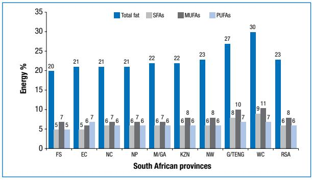

MUFAs: monounsaturated fatty acids, PUFAs: polyunsaturated fatty acids, SFAs: saturated fatty acids

**Figure 1:** Percentage of dietary energy from total fat, saturated, monounsaturated and polyunsaturated fatty acids in the nine provinces of South Africa and the mean for South Africa

of energy in the women (Table I). In the PURE study in black Africans aged 35-65 years from the North West province, it was also found that the percentage of energy from total fat was low in the rural areas: 17.6% and 22.6% of energy for men, and 20.3% and 24.1% of energy for women, in the 2005 and 2010 surveys respectively. In the urban areas, it was 25.3% and 26.2% of energy for men, and 28.3% and 27% of energy for women, in the 2005 and 2010 surveys respectively (Wentzel-Viljoen E, personal communication, November 2012). Vorster et al9 demonstrated how total fat intake increased from 21% to 30% of energy in urban African women in South Africa, and from 15.5% to 21% of energy in rural African women from 1975-1996 to 2005. An increased intake of energy from total fat was observed in the urban areas, with figures approaching or already at the upper dietary goal. However, in 2005, the percentage of energy from total fat was still low, at 21% of energy in the rural areas.

The intake of SFAs varied at 3.9 - 9.1% of energy, MUFAs at 4.2 - 10.4% of energy, and PUFAs at 5.5 - 8.3% of energy (Table I). SFA intakes were not > 10% of energy in any of the reported studies. This is in contrast with data reported earlier in South Africans following a Western-type diet, where the percentage of energy from SFAs was approximately 13%.14 Mean PUFA intakes were < 10% of energy, with some studies showing that the mean intake was < 6% of energy, the lower end of the range recommended for PUFA intake (Table I). The low PUFA intakes were especially applicable to those in whom the total fat intake was low (17.6- 23.8% of energy from fat). Therefore, PUFA intake could be compromised if the intake of total fat is too low. The data reported in Table I mainly represent South Africans who do not follow a Western-type diet, and demonstrate that there are different dietary patterns in the country. This impacts on total fat and fatty acid intake.

## **Foods that commonly contribute to fat intake in South African diets**

There are limited data on the types of food consumed, especially for adults, and some of the data reported in this section for adults are dated, but are still used as an indication of the types of food consumed by South Africans.15 Dietary intake data from the NFCS were used to identify the percentage of children who consumed food from fat-supplying food groups (Figures 2 and 3).

The milk group followed by the meat group in one- to five-year-old children, and the meat group followed by the milk group in six- to nine-year-old children, were the food groups from which foods were consumed by the highest percentage of children. Food from the vegetable fats and oil food group were ranked third in both age groups. The mean intakes of food commonly consumed by South Africans were reported in 2002 by Nel and

| Reference                                   | Study design       | Gender          | Sample | Age     | Total fat       | SFAs                | MUFAs               | PUFAs               |
|---------------------------------------------|--------------------|-----------------|--------|---------|-----------------|---------------------|---------------------|---------------------|
|                                             |                    |                 | size   | (years) | Mean (% energy) |                     |                     |                     |
| Adults                                      |                    |                 |        |         |                 |                     |                     |                     |
| MacIntyre et al8 (rural)*                | Cross-sectional    | Male            | 431    | 15-65   | 23.3            | 6.6                 | 7.2                 | 5.5                 |
| MacIntyre et al8 (rural)*                | Cross-sectional    | Female          | 610    | 15-65   | 23.9            | 7.2                 | 7.7                 | 6.0                 |
| Faber et al10 (rural)                       | Cross-sectional    | Female          | 187    | 25-55   | 23.0            | Data unavailable | Data unavailable | Data unavailable |
| Wentzel-Viljoena (rural)**                  | Prospective cohort | Male            | 332    | 35-65   | 17.6            | 3.9                 | 4.2                 | 5.7                 |
| Wentzel-Viljoena (rural)**                  | Prospective cohort | Female          | 634    | 35-65   | 20.3            | 4.5                 | 4.7                 | 6.9                 |
| Wentzel-Viljoenb (rural)**                  | Prospective cohort | Male            | 212    | 35-65   | 22.6            | 6.3                 | 6.9                 | 6.8                 |
| Wentzel-Viljoenb (rural)**                  | Prospective cohort | Female          | 469    | 35-65   | 24.1            | 6.7                 | 7.0                 | 7.7                 |
| MacIntyre et al8 (urban)*                | Cross-sectional    | Male            | 312    | 15-65   | 27.2            | 7.7                 | 9.4                 | 6.3                 |
| MacIntyre et al8 (urban)*                | Cross-sectional    | Female          | 398    | 15-65   | 28.8            | 9.0                 | 10.4                | 6.7                 |
| Wentzel-Viljoena (urban)**                  | Prospective cohort | Male            | 392    | 35-65   | 25.3            | 9.1                 | 7.2                 | 7.2                 |
| Wentzel-Viljoena (urban)**                  | Prospective cohort | Female          | 592    | 35-65   | 28.3            | 7.3                 | 8.2                 | 8.3                 |
| Wentzel-Viljoenb (urban)**                  | Prospective cohort | Male            | 205    | 35-65   | 26.2            | 7.1                 | 8.3                 | 7.6                 |
| Wentzel-Viljoenb (urban)**                  | Prospective cohort | Female          | 367    | 35-65   | 27.0            | 7.4                 | 8.8                 | 8.1                 |
| Steyn et al11 (South Africa)                | Cross-sectional    | Female          | 1726   | 15-49   | 23.8            | 6.7                 | 8.1                 | 5.7                 |
| Children                                    |                    |                 |        |         |                 |                     |                     |                     |
| Labadarios et al12 (South Africa, rural) | Cross-sectional    | Male, female | 603    | 1-9     | 21.0            | 5.5                 | 6.7                 | 6.0                 |
| Labadarios et al12 (South Africa, urban) | Cross-sectional    | Male, female | 631    | 1-9     | 26.5            | 7.3                 | 8.9                 | 6.5                 |
| Olewage-Theron et al13 (informal)        | Cross-sectional    | Male, female | 478    | 6-13    | 26.8            | 7.3                 | 8.2                 | 8.0                 |

#### **Table I:** South African studies reporting dietary fat intake

MUFAs: monounsaturated fatty acids, PUFAs: polyunsaturated fatty acids, SFAs: saturated fatty acids

"Rural" is represented by people living in traditional African villages, farm dwellers and those in informal settlements

"Urban" is represented by both middle- and upper-class individuals (black South Africans)

\* Transition and Health during Urbanisation of South Africans (THUSA) study. Weighted calculations were carried out

\*\* Prospective Urban Rural Epidemiology (PURE) study. Black South Africans. (Wentzel-Viljoen E. Personal communication, November 2012)

a Data from 2005 survey; b Data from 2010 survey

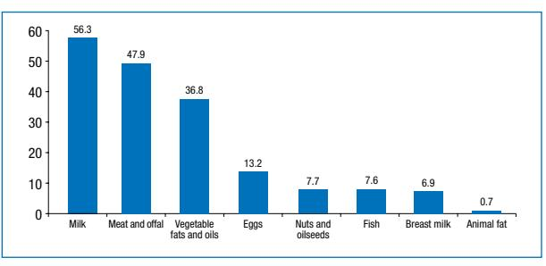

**Figure 2:** Main food groups supplying fats consumed by children aged 1-5 years15 (n = 2 048)

Steyn.15 These data provide some insight into the dietary intake of children and adults (10+ years).16 Through a series of statistical techniques, the authors succeeded in estimating the usual food consumption of adults and children in rural and urban areas. In the age category 10+ years, individual surveys were included. The method of compiling the information did not take ethnic group proportions into consideration for each specific province. In agreement with data from the NFCS, it is shown that the food groups meat and offal, milk and vegetable fats and oil were also the most popular food groups from which fat-containing food items were consumed by this age category (Figure 4).

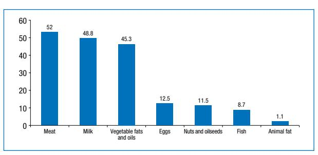

**Figure 3:** Main food groups supplying fats consumed by children aged 6-9 years15 (n = 817)

Food items are often sorted according to those that are most commonly consumed. The 10 food items that were mostly consumed and contributed to the fat intake of children participating in the NFCS and those aged 10+ years from the data reported by Nel and Steyn15 are shown in Table II. In total, 15 food items were reported, six food items (i.e. full-cream milk, margarine (brick), chicken (meat), eggs (chicken), non-dairy creamers and peanut butter) appear in all three age categories, although their position in the top 10 differed. Full-cream milk appears at the top of the list for both age categories of children who participated in the NFCS, but for the age group 10+ years, non-dairy creamers appeared at the top of the list. The

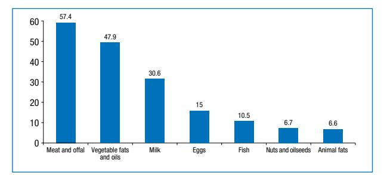

**Figure 4:** Main food groups supplying fats consumed by children and adults (10+ years) in South Africa15

latter is of special interest, as this food item often contains palm kernel oil, which is a rich source of the cholesterolelevating SFAs and lauric and palmitic acids. Between 30.6% and 56.3% of South Africans consume food items from the milk group (Figures 2-4). The mean portion per person per day was 220 g in children aged 1-5 years, 207 g in children aged 6-9 years and 239 g in the age group 10+ years. Unfortunately, the data do not allow for a distinction between milk and other milk products (e.g. cheese), which makes it difficult to determine what contribution the milk group made to total fat and calcium intake in the different age groups, for example. In the age group 10+ years, full-cream milk was only fourth on the list of mostly consumed food items. The consumers of fullcream milk were relatively low, only 39%, 35% and 19% for the different age categories, 1-5 years, 6-9 years and 10+ years, respectively. Ful-cream milk is an important source of SFAs. The consumption of full-cream milk up to the age of at least two years is recommended in children.

Salty snacks featured at number eight in the youngest age category (Table II). Cookies, cakes and tarts only featured in the age category 6-9 years as one of the top 10 food items that contribute to fat intake. Protein-rich food (e.g. beef steak, fish and chicken heads and feet) were food items in the top 10 that contributed to fat intake in the oldest age category (10+ years).

#### **Fast food intake in South Africa**

Fast foods are known to be generally high in energy and total fat, and some are also high in SFAs. A study was undertaken on a voluntary basis and, where possible, included a random sample of young adult South African citizens (19-30 years of age, n = 341) who visited selected shopping malls or similar complexes.17 The sample represented different socio-economic groups in the city of Johannesburg.17 One of the questions asked was whether or not participants "eat takeaway meals at least two to three times a month". Thirty-seven per cent of the total sample, 42.5% of those in the middle socio-economic group and 34.7% and 34.2% of those in the high and low socio-economic groups, respectively, answered positively.

Results from a nationally representative sample (n = 3 287) of South Africans also showed that approximately a third of the study population (32%) consumed fast foods 2-3 times a month or roughly once a week, while 6.8% consumed fast food two or more times a week.18 The study on young adults showed that more people in the high socio-economic group (28%) consumed fast food once a week than those in the middle socio-economic

| Food item                        | NFCS: age of 1-5 years (n = 2048)15 |                            |         | NFCS: age of 6-9 years (n = 817)15 | Age of 10+ years (n = unknown)15 |                            |
|----------------------------------|----------------------------------------|----------------------------|---------|---------------------------------------|-------------------------------------|----------------------------|
|                                  | Number*                                | % consumers, amount (g) | Number* | % consumers, amount (g)            | Number*                             | % consumers, amount (g) |
| Full-cream milk                  | 1                                      | 39 (186**)                 | 1       | 35 (171**)                            | 4                                   | 19 (204**)                 |
| Margarine (brick)                | 2                                      | 24 (12**)                  | 2       | 30 (16**)                             | 2                                   | 21 (19**)                  |
| Chicken meat                     | 3                                      | 17 (61**)                  | 3       | 19 (80**)                             | 3                                   | 19 (111**)                 |
| Butter milk or maas (full cream) | 4                                      | 12 (306)                   | 7       | 9 (322 )                              | -                                   | -                          |
| Chicken eggs                     | 5                                      | 11 (70**)                  | 6       | 11 (80**)                             | 5                                   | 15 (99**)                  |
| Non-dairy creamers               | 6                                      | 10 (7**)                   | 4       | 13 (7**)                              | 1                                   | 25 (6**)                   |
| Peanut butter                    | 7                                      | 8 (13**)                   | 5       | 11 (16**)                             | 10                                  | 6 (25**)                   |
| Salty snacks and maize           | 8                                      | 7 (27)                     |         | -                                     | -                                   | -                          |
| Chickens, stews and pies         | 9                                      | 6 (111)                    |         | -                                     | -                                   | -                          |
| Mincemeat dishes                 | 10                                     | 5 (61 )                    | 8       | 8 (48)                                | -                                   | -                          |
| Spread (medium or low fat)       |                                        | -                          | 9       | 8 (14)                                | 7                                   | 8 (15)                     |
| Cookies, cakes and tarts         |                                        | -                          | 10      | 7 (60)                                | -                                   | -                          |
| Beef, steak, sirloin and fillet  |                                        | -                          |         | -                                     | 6                                   | 12 (140)                   |
| Fish                             |                                        | -                          |         | -                                     | 8                                   | 6 (120)                    |
| Chicken (heads and feet)         |                                        | -                          |         | -                                     | 9                                   | 6 (80)                     |

**Table II:** Top 10 foods, contributing to fat intake, which were consumed by the different age groups

NFCS: National Food Consumption Survey

\* Ranking of the food item in the list of the top 10 food items that contribute to fat intake

\*\* Food items that overlap between the three groups

|                                   | Regular hamburger* | Large hamburger 'quarter pounder'** | French fries (medium portion) | Milkshake | Regular hamburger* French fries, milkshake | Four seasons pizza (standard) |
|-----------------------------------|-----------------------|----------------------------------------|----------------------------------|-----------|-----------------------------------------------|----------------------------------|
| Nutrient content***               |                       |                                        |                                  |           |                                               |                                  |
| Energy (kJ)                       | 1 326                 | 2 187                                  | 1 100                            | 1 301     | 3 727                                         | 3 308                            |
| Total fat (g)                     | 14                    | 29                                     | 11                               | 11        | 36                                            | 35                               |
| SFAs (g)                          | 6                     | 13                                     | 3                                | 7         | 16                                            | 19                               |
| % energy from fat                 | 39                    | 49                                     | 37                               | 31        | 36                                            | 39                               |
| SFAs as % of total fat            | 43                    | 45                                     | 27                               | 64        | 44                                            | 54                               |
| Contribution to 8 400 kJ diet**** |                       |                                        |                                  |           |                                               |                                  |
| Energy (%)                        | 16                    | 26                                     | 13                               | 15        | 44                                            | 39                               |
| Total fat (%)                     | 21                    | 43                                     | 16                               | 16        | 53                                            | 51                               |
| SFAs (%)                          | 26                    | 57                                     | 13                               | 30        | 70                                            | 83                               |

#### **Table III:** The nutrient content of some typical fast food products

SFAs: saturated fatty acids

\* The same hamburger was used for the calculations. It comprised one simple beef patty, cheese, no mayonnaise, pickles and condiments.

\*\* This hamburger comprised a beef patty, cheese, pickles and condiments. Higher in energy than the regular burger.

\*\*\* Nutrient content from public domain websites of fast food outlets (14 November 2012). Weights of products not available.

\*\*\*\* 30% energy from fat = 68 g; 10% energy from SFAs = 23 g

(17.9%) and low socio-economic groups (16.2%). This finding is in agreement with the results from the national survey.16,19 The participants who consumed fast foods daily constituted 10.9%, and of those, 56.8% were from the low socio-economic group.

Data on fast food intake were also collected from a consecutively selected sample of 655 black South Africans, 17.7 years of age, who participated in the Birth to Twenty study in Johannesburg.19 Data were collected for the seven-day period preceding the study, and showed that 49.7% of the males and 38% of the females consumed fast foods more than eight times during this period. The consumption of fast food by the participants in the Birth to Twenty study was higher than that reported in the other study on young adults from Johannesburg, where only 10.9% reported an intake of takeaway meals daily.17 The consumption of fast food 2-4 times and 5-7 times during this seven-day study period was reported by 20.2% and 29.8% of the study population, respectively. Only 5% of the males and 7.8% of the females consumed fast food 0-1 times during the seven-day study period.19

The most popular fast food items chosen by all three socioeconomic groups in the study carried out in Johannesburg were burgers and pizza.17 Fried chicken was the third most popular choice for the middle and low socio-economic groups, while it was French fries in the high socioeconomic group. A "quarter", consisting of a quarter loaf of white bread, french fries, processed cheese with meat or sausages and fried egg and sauces, was the most popular fast food item (30.7%), followed by chips (21.8%), and *vetkoek* (12%), in the Birth to Ten Study.19 The mean macronutrient content of a "quarter" was high: 5 369 kJ, 51.5 g fat and 12.9 g SFAs. In well-known commercial fast food outlets, one of the burgers (a beef patty, cheese, mayonnaise, condiments, lettuce, tomato and a white bun) provides 2 187 kJ, 29 g fat and 13 g SFAs (Table III). Unfortunately, the South African studies which reported on fast food intake did not report on the contribution of fast food intake to the energy and fat intake of participants, which is a shortcoming. An example of the contribution that some fast food items would make to energy and fat intake is shown in Table III. Information on the contribution of these fast foods to the energy and fat intake of an 8 400 kJ diet is provided to illustrate the possible impact of fast food intake on energy and fat intake. This information supports the inclusion of consumer information in FBDG support material on the potential negative consequences of regular consumption of these foods.

It is clear that the contribution of fast foods to energy, total fat and SFAs plays a significant role, and FBDGs should recommend food choices that promote optimal nutritional intake. An effort should be made by dietitians, nutritionists and organisations that provide information on healthy eating patterns to encourage and empower formal and informal fast food outlets to offer clients healthier fast food choices.

#### **The literature on the role of fat in the diet**

Traditionally, the nutritional role of fats in the diet was limited to their value as a good source of energy. The low-fat concept was introduced in an effort to decrease saturated fat intake. Less emphasis was placed on energy balance and the fact that the composition of the fat in the diet is of special importance. The discovery of the essential properties of certain fatty acids, and that they can influence growth and development, has provided reasons for this view to be amended.2,3,20-22 Therefore, these specific fatty acids were classified as essential fatty acids (EFAs), as they cannot be synthesised by humans and need to be provided by the diet. Currently, only two dietary fatty acids are seen as essential, namely linoleic acid (LA) (C18:2n-6) from the n-6 PUFA family and a-linolenic acid (ALA)(C18:3n-3) from the n-3 PUFA family. These fatty acids are also regarded as the parent fatty acids of the n-6 and n-3 PUFA families. Nutrition research has subsequently provided evidence in the last decade that has indicated the role of specific fatty acids with regard to cholesterol, lipoprotein and glucose metabolism, as well as insulin sensitivity.23-25 It is recognised that the longerchain metabolites of linoleic acid and a-linolenic acid are precursors for the formation of hormone-like substances called prostanoids, thromboxanes, leukotrienes and neuroprotectins that influence and regulate key physiological functions, ranging from blood pressure, vessel stiffness and relaxation, thrombotic aggregation and fibrinolytic activity, to inflammatory responses and leukocyte migration. These functions of linoleic acid and a-linolenic acid make them key nutrients.26-28

According to Uauy,29 the interest in the quality of dietary fat or lipid supply as a major determinant of long-term health and well-being keeps on growing. The quality of dietary fat depends on the amount of the individual fatty acids present as part of total fat. As a result, the health implications of dietary fats are judged on their specific fatty acid content. Any fat or oil is classified according to the main proportions of either SFAs (mainly lauric, myristic, palmitic and stearic acids), MUFAs (mainly oleic acid) or PUFAs of the n-6 (linoleic and arachidonic acids) plus n-3 [a-linolenic acid, eicosapentaenoic (EPA), docosapentaenoic and docosahexaenoic acids (DHA)] series, and trans-fatty acid (elaidic and conjugated trans linoleic acids) present in the fat or oil. Therefore, any revised FBDG for fat and supporting information should place more emphasis on the quality, rather than the quantity, of dietary fat intake, to satisfy EFA needs, to promote neurodevelopment and cardiovascular health, and to prevent degenerative diseases at all stages of the life cycle.29

## **Amount and type of fat in perspective**

The 2008 Food and Agriculture Organization of the United Nations Expert Consultation on *Fats and Fatty Acids in Human Nutrition*3 reviewed the latest evidence and concluded that the dietary recommendations for total fat, SFA, PUFA and trans*-*fatty acid intakes should be reevaluated. This was based on numerous new populationbased observational studies and controlled trials that contributed to clarifying the effects of dietary fats on health outcomes. Because of limited available dietary fat intake information in South Africa, the revised FBDG for fat will mostly rely on international recommendations, although all available national information was also considered. The latest most important evidence of the effect of the major dietary fatty acids on mostly chronic disease outcomes is briefly summarised here. As this subject has been reviewed extensively by several authors, information from review articles is reflected in many cases. Table IV provides a summary of convincing evidence on dietary fat intake and coronary heart disease, as adapted from Skeaff and Miller.30

## **Total fat**

According to Melanson et al,31 there are obvious limitations to cross-sectional population studies, in that self-reported dietary intake data are used in the majority of these studies. In addition, causality cannot be concluded. Nevertheless, large sample sizes and overall consistency in the data have supported the hypothesis that higher total fat diets are associated with higher body weight.

Although several reports in the past have concluded that excessive dietary total fat consumption increases the risk of obesity, coronary heart disease and certain types of cancer, recent results from carefully performed prospective observational studies do not necessarily support the same sentiment. Smit et al32 reported that these studies found no or small associations between dietary fat intake and obesity, weight gain, coronary disease and cancer.33-37 It is well known that despite decreased intakes of total fat, obesity rates have increased.38 This suggests that factors other than dietary fat may play a more important role in the increasing prevalence of obesity. Large-scale prospective cohort studies with repeated data have yielded mixed results. Both the Framingham studies39 and the British National Diet and Nutrition Survey40 indicated that irrespective of the decrease in percentage energy from total fat, the prevalence of obesity increased. However, in the National Health and Nutrition Examination Survey (NHANES I), the percentage of energy from fat was inversely related to weight change in women aged < 50 years, but was positively associated in men without any morbidity.41In a six-year follow-up study in Swedish women controlling total energy intake, total fat intake

**Table IV:** Summary of the effect of dietary fat on coronary heart disease30

| Type of fat          | Fatal coronary heart disease | Coronary heart disease events |
|----------------------|------------------------------|-------------------------------|
| Trans-fatty acids    | -                            | Convincing increased risk     |
| PUFAs* for SFAs   | Convincing decreased risk    | Convincing decreased risk     |
| n-3 long-chain PUFAs | -                            | Convincing decreased risk     |
| Total fat            | Convincing no relation       | Convincing no relation        |

CHD: coronary heart disease, n-3: omega 3, PUFAs: long-chain polyunsaturated fatty acids, SFA: saturated fatty acids \*: Includes both omega-6 and omega-3 polyunsaturated fatty acids

was only associated with increased weight in the subpopulation defined as "predisposed", i.e. overweight at baseline and with an obese parent.42 Conversely, in the Nurses' Health Study, the investigators found a weak relationship between baseline percentage energy from total fat and weight change, but no clear association with those "predisposed" to obesity.37 On the other hand, in the Pound to Prevention prospective cohort study that included annual measurements over three years, dietary total fat (amount or percentage) showed a positive association with weight gain.43Melanson et al31 concluded that, although prospective cohort studies have various strengths in terms of sample size, duration and the ability to evaluate the more chronic effects of diet, these data are inconclusive overall on the relationship between total fat intake and body weight.

Recent evidence from randomised controlled trials, in predominantly overweight populations from industrialised countries that compared isocaloric diets with different levels of total fat, demonstrated that the response to a diet with a high percentage of energy from total fat (40% of energy) did not differ from a diet with a low percentage of energy from total fat (20% of energy).44 Conversely, the response can even lead to greater weight loss than that observed with low-fat diets.45-47 Some controlled dietary studies indicated increased weight loss at one and two years with diets that were high in unsaturated fat,48,50 or with low-fat, high-carbohydrate vegetarian diets.50,51 A few meta-analyses of randomised controlled trials reported mixed results. Nordmann et al52 reported that a low-carbohydrate (< 60 g carbohydrate per day) nonenergy-restricted diet in terms of fat and protein intake appears to be at least as effective as low-fat, highercarbohydrate, energy-restricted diets in inducing weight loss for up to one year. Lower fat diets (< 30% energy) are usually associated with lower total cholesterol and lowdensity lipoprotein (LDL) cholesterol levels,44 but increased triacylglycerol and lowered high-density lipoprotein (HDL) cholesterol.52 Many low-fat diets in studies are characterised by energy restriction, making interpretation of the effect on body weight very difficult. The Women's Health Initiative also supports the connection between lower fat intake and weight loss, although the study was based on cohorts designed to evaluate the prevention of cancer and cardiovascular diesease.53 The intervention group received a much greater intensity of intervention than the control group, and although the outcome indicates weight loss, it is certainly insufficient for a definite conclusion to be drawn.31

In the Women's Health Trial Feasibility Study in Minority Populations, an overall lowering of dietary fat and total energy intake resulted in greater weight loss.54 A meta-analysis of 16 trials concluded that comparing *ad libitum* low-fat diets with *ad libitum* habitual diets or moderate-fat diets resulted in more weight loss, especially in heavier subjects.55 In a systematic review and meta-analysis of 33 randomised controlled trials (73 589 participants) and 10 cohort studies from developed countries only, Hooper et al56 concluded that lower fat intake leads to a relatively small but significant and sustained reduction in body weight in adults, in studies with baseline fat intakes of 28-43% energy. The limitations in study design, lack of well-controlled studies and inconsistent findings on the relationship between total fat intake and body weight make a final conclusion difficult.31 Furthermore, many studies are also characterised by nutrition education to improve eating habits and increase physical activity, making it difficult to draw conclusions about total fat intake on weight regulation.

## **Saturated fatty acids**

Animal fats and vegetable oils (e.g. palm kernel and coconut oil), are solid at room temperature and are therefore often referred to as hard fats. SFAs will remain an integral part of the human diet, as they are present in all dietary fats and oils in different quantities. Although SFAs are associated with increased LDL cholesterol concentrations, Mensink et al57 concluded that, because SFAs also raise HDL cholesterol and decrease triacylglycerol concentrations, they resulted in little net effect on the total cholesterol to HDL cholesterol ratio, compared with carbohydrates. In a recent meta-analysis of prospective epidemiological studies, the authors concluded that there was no significant evidence that SFAs are associated with an increased risk of coronary heart disease.58 However, this report was criticised for containing several weaknesses. It was convincingly shown that by replacing SFAs with PUFAs, the risk for coronary heart disease was lowered in both prospective cohort studies59 and randomised controlled trials.60 Smit et al32 stated that limiting SFA intake should be considered in the specific context of the nutrient that replaces it, as replacement with carbohydrates (particularly the easily digestible ones) may have little effect on serum lipids in reducing the risk of cardiovascular disease. Cognisance should also be taken that certain individual SFAs, like palmitic acid (C16:0), have more serum cholesterol-raising properties than lauric acid (C12:0).61 On the other hand, stearic acid (C18:0) has been shown to have favourable effects on blood lipid profiles by significantly decreasing LDL cholesterol and factor VII coagulant activity in young men, compared to diets that are high in either lauric acid or palmitic acid.62 In a study that compared stearic, oleic and linoleic acids (7% of energy) in young men and women with thrombotic tendency, stearic acid consumption reduced platelet volume relative to the other two fatty acids, but the effects on coagulation and fibrinolytic variables did not differ between the three groups.63

#### **Monounsaturated fatty acids**

Although some trials have indicated that the consumption of MUFAs has potential benefits on the blood lipid profile and cardiovascular disease risk factors,57,64,65 prospective observational studies have failed to show associations,59 and even higher risks of cardiovascular disease were observed after adjusting for age in the Nurses' Health Study.66 It needs to be mentioned that the main source of MUFAs were of animal origin, and therefore the inclusion of trans-fatty acid in the sum of MUFAs in the analysis could have contributed towards this negative effect. In the pooled analysis of 11 cohort studies by Jakobsen et al, adjustment was done for trans-fatty acid intake in the studies with available information on trans-fatty acid intake, but that did not change the outcome on hazard ratios for cardiovascular disease.59

#### **Polyunsaturated fatty acids**

The quality of dietary fat is mainly determined by the proportions of specific PUFA it contains from both the n-6 and n-3 series. Apart from the role that EFAs play in human well-being, dietary EPA and DHA consumption has been demonstrated to have various physiological benefits on blood pressure, heart rate, triacylglycerol levels, inflammation and endothelial function. Consistent evidence of a reduced risk of fatal coronary heart disease and sudden cardiac death when consuming approximately 250 mg/day of EPA plus DHA has also been shown.32

DHA is the most abundant fatty acid in the brain and plays a major role in the development of the brain and retina of the foetus and young child, at least up to two years of age.67-69 As the conversion from a-linolenic to DHA is very limited and may also vary depending on genetic polymorphisms of the FADS2 gene, it is recommended that preformed EPA and DHA are provided through the diet for optimal health at all stages of the life cycle.70,71 DHA is regarded as conditionally essential during early development.72-75 N-3 fatty acids are important during early growth and development. Convincing evidence indicates that an adequate intake for 0- to 6-month-old infants is 0.2-0.3% energy from a-linolenic and 0.1-0.18% energy from DHA.3 This is based on the content of these fatty acids in breast milk. The recommended intake for infants aged 6-24 months is 0.4-0.6% energy from a-linolenic, while 10-12 mg/kg is a probable adequate intake level from DHA.3 Although there is limited available information on the role of DHA in older children, two studies from South Africa (one of which is unpublished data) have indicated that there was a positive effect from DHA and EPA on the learning and memory of school-aged children.76 In another study by Baumgartner et al77 in children with poor iron and n-3 fatty acid status, DHA/EPA supplementation had no benefits on cognition and impaired working memory in anaemic children, and on long-term memory and retrieval in girls with iron deficiency.

### **Trans-fatty acids**

There are two types of trans-fatty acids, namely industrially produced and or naturally occurring in food products from ruminants. Industrially produced trans-fatty acids are formed as a result of the partial hydrogenation of vegetable oils, while ruminant trans-fatty acids are produced by the bacterial metabolism of PUFAs in ruminants. The industrially produced trans-fatty acids are mostly found in some brands of margarine, spreads, bakery products, fast food, soup and sauce powders. Food labels should indicate the presence of partially hydrogenated vegetable oils as an ingredient in food. The trans-fatty acid content of food that contains partially hydrogenated vegetable oils is often much higher than the amount of ruminant-produced trans-fatty acid that is present in dairy and meat products.

In general, both previous and emerging evidence indicates that trans-fatty acid consumption has unique adverse effects, as it increases LDL cholesterol, lipoprotein(a) and apolipoprotein B (ApoB) concentrations, and is also responsible for lowering HDL cholestererol and ApoA1 concentrations. In addition, it is also associated with a higher risk of coronary heart disease.64,78-80 Mozaffarian and Clarke80 further concluded that the replacement of transfatty acid from partially hydrogenated vegetable oils with alternative fats and oils would substantially lower coronary heart disease risk, and that the discrepancies between estimates from controlled dietary trials versus prospective cohort studies could at least be partially explained by considering the effects of trans-fatty acids on multiple risk factors. They further concluded that food manufacturers, food services and restaurants should maximise overall health benefit by using replacement fats and oils with a higher content of cis-unsaturated fats.

Stender et al81 concluded that on a gram-for-gram basis, industrially produced trans-fatty acids are more harmful and linked to an increased risk of coronary heart disease82 than ruminant-produced trans-fatty acids. This is in accordance with the findings of Mozaffarian and Clark.80 The conclusion is that controlled trials and observational studies have provided evidence that the consumption of trans-fatty acids from partially hydrogenated oils adversely affects several cardiovascular risk factors and contributes significantly to an increased risk of coronary heart disease events. Although ruminant trans-fatty acids cannot be removed entirely from the diet, their intake is already low in most populations and not significantly associated with coronary heart disease risk in several studies.79 On the contrary, in a quantitative review by Brouwer et al,83 it was concluded that all fatty acids with one or more bonds in the trans configuration raise the ratio of LDL to HDL cholesterol, irrespective of their origin or structure. It was further argued that the results provide additional evidence, besides the high content of SFAs, to lower the intake of ruminant animal fats.

From a biochemical point of view, there may be enough reason to believe that both sources of trans-fatty acids (industrial- and ruminant-produced) compete with longchain PUFAs during their incorporation into brain tissue.81 Avoiding the introduction of these fatty acids in the diets of newborn infants during early development seems to be a prudent approach.

*The regulations relating to trans fat in foodstuffs,* No R 127, was published in the South African *Government Gazette*. 84 They state that any oil or fat intended for human consumption with a trans-fat content that "exceeds 2 g per 100 g of oil or fat is prohibited". To make a claim that the product is trans-fat free, the trans-fat content must be "less than 1 g per 100 g of the total fat or oil in the final product".84 This new regulation on the trans-fatty acid content of food will make a significant contribution to lowering the intake of trans-fatty acids, especially industrially produced trans-fatty acids.

To summarise the literature on the role of fat intake, there are indications that total fat intake is less important than the type of fat in the diet. The reduction of trans-fatty acid seems to be especially important, as it increases LDL cholesterol concentrations and also lowers HDL cholesterol concentrations. Replacing SFAs with PUFAs decreases the risk of CHD.85 However, it is important to acknowledge that many of the studies that have demonstrated a positive effect of PUFAs, did not distinguish between the different effects of n-6 and n-3 PUFAs on health outcomes.86 There are indications from a recent, updated meta-analysis that substituting the most abundant n-6 PUFA, i.e. linoleic acid, for SFA, "increased the rates of death from all causes, coronary heart disease and CVD".60 In this meta-analysis, recovered data from the Sydney Heart Study were analysed. It needs to be mentioned that the intervention group in this study was advised to increase its intake of PUFA intake, mainly from safflower oil and margarine, from 6% energy to 15% energy, reduce SFAs to less than 10% energy, and cholesterol intake to less than 300 mg per day. This intervention increased n-6 PUFA intakes without also increasing n-3 PUFA intakes. Therefore, the international n-6 PUFA guideline of not more than 5-8% energy seems to be important.2 Increasing n-3 PUFA intake is essential to meet essential fatty acid and long-chain PUFA requirements. It is clear that dietary fat guidelines should emphasise the total fat intake, taking energy balance into account and ensuring that the optimal intake of the EFAs and the long-chain PUFAs are addressed. When diets are too low in fat, the essential fatty acid requirements and n-3 long-chain PUFA requirements may be compromised. To improve the quality of fat intake, it is recommended that SFAs are replaced with PUFAs and MUFAs, rather than only concentrating on the lowering of total fat intake as a means of lowering SFA intake. Some South Africans who follow a high total-fat diet (> 35% energy), that is also high in energy, will need to pay attention to replacing SFA with PUFA and MUFA, and also lowering total fat intake in order to lower energy intake, and balance energy intake and energy expenditure. Cognisance should be taken when replacing SFA with PUFA that both n-6 and n-3 PUFAs are included as n-6 PUFA alone may be unlikely to provide the intended beneficial effects.60 Therefore, the current international guideline supports the recommendation that the right amounts of n-6 (5-8% energy) and n-3 (1-2% energy) PUFAs are consumed to ensure that essential fatty acid requirements are met and that a more balanced n-6 and n-3 intake is ensured. Conversion of the quantitative dietary guidelines into the FBDGs is important if this goal is to be achieved.

## **Quantitative dietary goals for fat intake**

In February 2009, an international group of fatty acid experts met in Barcelona, Spain, to discuss the "health significance of fat quality in the diet". These experts decided to promote the notion of the health significance of fat quality in the diet.87 At a meeting with the same theme in Cape Town in March 2009, a group of South African fatty acid and health scientists adapted the guideline for total fat intake and decided on a total fat intake guideline of < 30% energy for the country. They adopted a statement in line with the authoritative international health bodies and current evidence for the country.

The quantity (amount) and quality (type) of fat required for optimal health from the age of two years onwards are as follows:

- Total fat should provide 20-30% of the daily energy (≤ 30% energy) intake. The total amount of energy provided should be balanced between energy intake and energy expenditure. SFAs should provide no more than 10% energy intake, and the intake should be less than 7% energy in those at risk of CVD.
- PUFAs, including EFAs, should contribute 6-10% of energy, with n-6 providing 5-8% of energy and n-3, 1-2% of energy.
- The remainder of the energy from total fat should be provided by MUFAs.
- The intake of trans-fatty acids should be less than 1% of energy.

The recommendations for infants aged 0-2 years are that during the first six months of life, total dietary fat should provide 40-60% of energy. The aim is to sufficiently supply energy needed for growth and fat for tissue deposition.

| Nutrient                   | Guideline     | Fat (g)   | Examples of food source                                                                                                                                                                                                                       |
|----------------------------|---------------|-----------|-----------------------------------------------------------------------------------------------------------------------------------------------------------------------------------------------------------------------------------------------|
| Total fat (% energy)       | < 30          | 68        | All foods containing fat in their natural form, processed fat-containing foods, fried foods and salty snacks (e.g. potato crisps), and confectionery (sweets containing fat, e.g. chocolates and toffees)                               |
| SFAs (% energy)            | < 10          | 23        | Animal fats (e.g. visible fat on meat, lard and dairy cream); vegetable fats (e.g. palm kernel, coconut and palm oil); and food products that have vegetable fats as an ingredient (e.g. non-dairy creamers)                            |
| TFAs (% energy)            | < 1           | 2         | Industrially produced trans-fatty acids, (e.g. products that have partially hydrogenated oils as an ingredient) and naturally occurring trans-fatty acids (e.g. beef, lamb, butter, milk and other milk products) have small amounts |
| MUFAs (% energy)           | ~10 (12)      | 27        | Olive and canola oil and products made from these oils, avocado, nuts and meat                                                                                                                                                             |
| PUFAs (% energy)           | 6 to < 10 (8) | 18        | Sunflower and soybean oil, and products made from these oils (e.g. soft type margarines, mayonnaise and walnuts)                                                                                                                           |
| n-3 PUFAs (ALA) (% energy) | 0.6-1.2       | 1.4 – 2.7 | Green leafy vegetables, flaxseed oil and canola oil                                                                                                                                                                                           |
| n-3 EPA plus DHA (mg)      | 250-500       | -         | Fatty fish (e.g. pilchards, mackerel, salmon and sardines)                                                                                                                                                                                    |
| Cholesterol (mg)           | < 300         | -         | Organ meats (e.g. liver and kidneys), eggs and animal products                                                                                                                                                                                |

**Table V:** Nutrient-based dietary guidelines for the intake of fat (calculated for an 8 400 kJ diet) and food-based dietary guidelines to meet nutrient goals

ALA: alpha-linolenic acid, DHA: docosahexaenoic acid, EPA: eicosapentaenoic acid, MUFAs: monounsaturated fatty acids, n-3: omega-3, PUFAs: polyunsaturated fatty acids, SFAs: saturated fatty acids, TFAs: trans-fatty acids

This requirement is met by exclusive breastfeeding. Convincing evidence indicates that from 6-24 months of age, total fat intake should be reduced gradually to ~ 35% of energy, depending on the physical activity of the child.3 The general recommendation is 30-35% of energy for children. If they are very active, higher intakes may be advisable.3

#### **The need to update the FBDG for fat**

Based on the latest available fat intake data for South Africa and evidence from the current literature, especially the unique properties and effects of individual fatty acids in the diet on health, there was a need to revisit the previous FBDG for fat intake, i.e. "Eat fats sparingly". It is necessary to emphasise the quality of fat in the diet. Therefore, the new consensus FBDG for South Africa is: "Use fats sparingly: choose vegetable oils rather than hard fats", to both address the balance between intake (amount) and quality (vegetable oils versus hard fats). An alternative guideline proposed by the authors is: "Eat and use the right type of fats and oils in moderation", especially to make provision for those at the lower end of total fat intake and those who do not require a lowering of total fat intake, but who need to improve the quality of fat in their diets.

## **Food-based approach to meet the quantitative dietary goals for fat and fatty acid intake**

The energy and nutrient goals formulated for South Africa and examples of foods that are important sources of total fat and specific fatty acids and cholesterol are shown in Table V. The food-based approach includes the recommendations discussed here.

In order to lower the intake of total fat, the consumption of all fat-containing foods, either as a natural part of the food, added preparation, or used in the production of food products, has to be decreased.

Important practices that achieve and maintain the optimal intake of SFAs include the use of low-fat milk and milk products instead of full-fat products, and consuming lean meat and chicken without the skin and fatty parts, instead of fatty meat and chicken.

Do not eat or frequently eat processed foods that contain plant oils and fats which are high in SFAs, e.g. palm kernel and coconut oil.

Consume fats and oils that are beneficial to health. Eat food that is high in PUFAs or MUFAs, and limit the intake of food that is high in SFAs.

Vegetable oils that are good sources of PUFAs and MUFAs, i.e. sunflower and canola oils, should be consumed. Food products which contain industrially produced, partially hydrogenated vegetable oils or fats should be avoided because of their trans-fat content. The ingredient list on food labels should indicate whether or not the product contains partially hydrogenated vegetable oils.

Include recommended types of fish regularly, to provide n-3 long-chain PUFAs, EPA and DHA. A daily intake of 250- 500 mg of EPA and DHA is recommended. Table VI illustrates the EPA plus DHA content per 100 g of different types of fish. The number of times per week that a 100 g portion of fish should be consumed to provide approximately 500 mg of EPA plus DHA per day, as well as the amount of fish required per day to provide this amount of EPA plus DHA, is also shown. The introduction of fish early in the diet of children is recommended, to ensure that fish is consumed

| Type of fish            | Amount (g) of EPA plus DHA per 100 g portion | Times/week 100 g portion should be consumed to provide ± 500 mg EPA plus DHA per day | Amount of fish (g) required per day to provide 500 mg EPA plus DHA |
|-------------------------|-------------------------------------------------|--------------------------------------------------------------------------------------------|--------------------------------------------------------------------------|
| Mackerel88 (salted)     | 4.584                                           | 0.8                                                                                        | 11                                                                       |
| Salmon, Atlantic88*     | 2.147                                           | 1.6                                                                                        | 23                                                                       |
| Herring, Atlantic88*    | 2.014                                           | 1.7                                                                                        | 25                                                                       |
| Bluefin tuna88*         | 1.504                                           | 2.3                                                                                        | 33                                                                       |
| Pilchards89**           | 1.480                                           | 2.4                                                                                        | 34                                                                       |
| Snoek89                 | 1.030                                           | 3.4                                                                                        | 49                                                                       |
| Rainbow trout (wild)88* | 0.988                                           | 3.5                                                                                        | 51                                                                       |
| Sardines88***           | 0.982                                           | 3.6                                                                                        | 51                                                                       |
| Hake (whiting)88*       | 0.518                                           | 6.8                                                                                        | 97                                                                       |
| Tuna (light)88****      | 0.270                                           | 13                                                                                         | 185                                                                      |

#### **Table VI**: The eicosapentaenoic acid plus docosahexaenoic acid content and requirements of different fish species

\*cooked with dry heat, \*\*Canned in brine, \*\*\*Canned in oil, drained solids, \*\*\*\*Canned in water

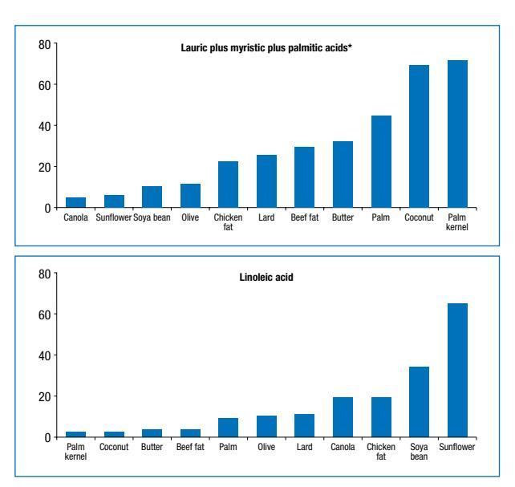

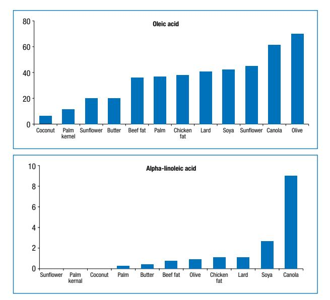

**Figure 5:** The fatty-acid composition of different vegetable oils and animal fats (g of fatty acid per 100 g oil or fat) \* Lauric, myristic and palmitic acids are the cholesterol-elevating fatty acids

on a regular basis throughout life.

A summary of the fatty acid composition of vegetable oils and animal fats is provided as a guideline for selecting the right type of fat (Figure 5).

## **Conclusion**

Current scientific evidence highlights the importance of the type of fat in the diet. Dietary fats are no longer seen merely as a good source of energy, but instead as an essential component of the human diet. They provide EFAs that are precursors of hormone-like substances that influence and regulate key physiological functions. The adequate intake of EFA, especially n-3 long-chain PUFAs, should be recommended to promote neurodevelopment and cardiovascular health, and to prevent degenerative diseases at all stages of the life cycle. Based on the strength of evidence from prospective and randomised trials, FBDGs on fat should emphasise the importance of the intake of certain fatty acids, rather than the total amount of fat in the human diet.

The available dietary intake data for South Africans indicate that there are pockets of the population where total fat intakes are at the lower end of the recommendation of 20-30% of energy. PUFA intake varies between 5.5% and 8.3% of energy at the lower end of the dietary intake goal, while information on n-3 PUFA intake is limited. The revised FBDG for fat intake recommends a moderate intake of total fat. Although fat is an important source of energy in the diet, the main message should be to balance energy intake with energy expenditure, in an effort to reach and maintain a normal body weight and to ensure that the type of fat consumed promotes health. Within the boundaries of energy intake and energy expenditure, the emphasis should be on the type, rather than on the amount, of fat in the diet. Educational material that will be used in South Africa to promote the FBDG on fat intake should place emphasis on the importance of the type of fat in the diet in order to compensate for this shortcoming in the present set of FBDGs.

More research and testing of an FBDG for fat intake, in which the importance of the type as well as the amount of fat is highlighted, is urgently required and recommended. The terms "hard" in the new statement consensus, and "moderation" in the alternative guideline proposed by the authors, should especially be consumer tested.

#### **References**

- 1. Wolmarans P, Oosthuizen W. Eat fats sparingly: implications for health and disease. S Afr J Clin Nutr. 2001;14:S48-S55.
- 2. World Health Organization/Food and Agriculture Organization of the United Nations. Diet, nutrition and the prevention of chronic diseases: report of a joint WHO/FAO expert consultation. Geneva: WHO; 2003.
- 3. Food and Agriculture Organization of the United Nations. Fats and fatty acids in human nutrition: report of an expert consultation. Rome: FAO; 2010.
- 4. Langenhoven ML, Steyn K, Van Eck M, Gouws E. Nutrient intake in the coloured population of the Cape Peninsula. Ecol Food Nutr. 1988;22:97-106.
- 5. Bourne LT, Langenhoven ML, Steyn K, et al. Nutrient intake in the urban African population of the Cape Peninsula, South Africa. The BRISK study. Cen Afr J Med. 1993;39(12):238-247.
- 6. Bourne LT. Dietary intake in an urban African population in South Africa: with special reference to the nutrition transition. [PhD thesis]. Cape Town: University of Cape Town; 1996.
- 7. Labadarios D, Steyn NP, Maunder E, et al. The National Food Consumption Survey (NFCS): South Africa, 1999. Public Health Nutr. 2005;8(5):533-543.
- 8. MacIntyre UE, Kruger HS, Venter CS, Vorster HH. Dietary intakes of an African population in different stages of transition in the North West Province, South Africa: the THUSA study. Nutr Res. 2002;22(3):239-256.
- 9. Vorster HH, Kruger A, Margetts BM. The nutrition transition in Africa: can it be steered into a more positive direction? Nutrients. 2011;3(4):429-441.
- 10. Faber M, Kruger HS. Dietary intake, perceptions regarding body weight, and attitudes toward weight control of normal weight, overweight and obese black females in a rural village in South Africa. Ethn Dis. 2005;15(2); 238-245.
- 11. Steyn NP, Nel JH. Dietary intake of adult women in South Africa and Nigeria with a focus on the use of spreads. Parow Valley: Medical Research Council; 2006.
- 12. Labadarios D, Steyn NP, Maunder E, et al. The National Food Consumption Survey (NFCS): South Africa, 1999. Public Health Nutr. 2005;8(5):533-543.
- 13. Oldewage-Theron W, Napier C, Egal A. Dietary fat intake and nutritional status indicators of primary school children in a low-income informal settlement in the Vaal region. S Afr J Clin Nutr. 2011;24(2):99-104.
- 14. Wolmarans P, Langenhoven ML, Benadé AJS, et al. Intake of macronutrients and their relationship with total cholesterol and highdensity lipoprotein cholesterol. The Coronary Risk Factor Study, 1979. S Afr Med J. 1988;9(73):12-15.
- 15. Nel JH, Steyn NP. Report on South African food consumption studies undertaken amongst different population groups (1983-2000): average intakes of foods most commonly consumed. Medical Research Council [homepage on the Internet]. 2002. c2012. Available from: http://www.mrc. ac.za/chronic/foodstudies.htm
- 16. Steyn NP, Nel JH, Casey A. Secondary data analyses of dietary surveys undertaken in South Africa to determine usual food consumption of the population. Public Health Nutr. 2003;6(7):631-644.
- 17. Van Zyl M. Characteristics and factors influencing fast food intake of young adult consumers from different socio economic areas in Gauteng, South Africa [Masters of Nutrition]. Stellenbosch: University of Stellenbosch; 2008.
- 18. Steyn NP, Labadarios D, Nel JH. Factors which influence the consumption of street foods and fast foods in South Africa: national survey. Nutr J. 2011,10:104 [homepage on the Internet]. Available from: http://www. nutritionj.com/content/10/1/104.
- 19. Feeley A, Pettifor JM, Norris SA. Fast-food consumption among 17-year-olds

in the Birth to Twenty cohort. S Afr J Clin Nutr. 2009;22(3):118-123.

- 20. Burr GO, Burr MM. Nutrition classics from The Journal of Biological Chemistry. 82:345-367, 1929. A new deficiency disease produced by the rigid exclusion of fat from the diet. Nutr Rev. 1973;31(8):248-249.
- 21. Paulsrud JR, Pensler L, Whitten CF, Holman RT. Essential fatty acid deficiency in infants induced by fat-free intravenous feeding. Am J Clin Nutr. 1972;25(9):897-904.
- 22. Holman RT, Johnson SB, Hatch TF. A case of human linolenic acid deficiency involving neurological abnormalities. Am J Clin Nutr. 1982;35(3):617-623.
- 23. Hegsted DM, McGandy RB, Myers ML, Stare FJ. Quantitative effects of dietary fat on serum cholesterol in man. Am J Clin Nutr. 1965;17(5):281-295.
- 24. Keys A, Menotti A, Karvonen MJ, et al. The diet and 15-year death rate in the Seven Countries Study. Am J Epidemiol. 1986;124(6):903-915.
- 25. Christiansen E, Schnider S, Palmvig B, et al. Intake of a diet high in trans monounsaturated fatty acids or saturated fatty acids. Effects on postprandial insulinemia and glycemia in obese patients with NIDDM. Diabetes Care. 1997;20(5):881-887.
- 26. Calder PC. n-3 polyunsaturated fatty acids, inflammation, and inflammatory diseases. Am J Clin Nutr. 2006;83(6 Suppl):1505S-1519S.
- 27. Uauy R, Mena P, Valenzuela A. Essential fatty acids as determinants of lipid requirements in infants, children and adults. Eur J Clin Nutr. 1999;53 Suppl 1:S66-S77.
- 28. Simopoulos AP. Omega-3 fatty acids in health and disease and in growth and development. Am J Clin Nutr. 1991;54(3):438-463.
- 29. Uauy R. Dietary fat quality for optimal health and well-being: overview of recommendations. Ann Nutr Metab. 2009;54 Suppl 1:S2-S7.
- 30. Skeaff CM, Miller J. Dietary fat and coronary heart disease: summary of evidence from prospective cohort and randomised controlled trials. Ann Nutr Metab. 2009;55(1-3):173-201.
- 31. Melanson EL, Astrup A, Donahoo WT. The relationship between dietary fat and fatty acid intake and body weight, diabetes, and metabolic syndrome. Ann Nutr Metab. 2009;55(1-3):229-243.
- 32. Smit LS, Mozaffarian D, Willett W. Review of fat and fatty acid requirements and criteria for developing dietary guidelines. Ann Nutr Metab. 2009;55(1-3):44-55.
- 33. Hu FB, Stampfer MJ, Manson JE, et al. Dietary fat intake and the risk of coronary heart disease in women. N Engl J Med. 1997;337(21):1491-1499.
- 34. He K, Merchant A, Rimm EB, et al. Dietary fat intake and risk of stroke in male US healthcare professionals: 14 year prospective cohort study. BMJ. 2003;327(7418):777-782.
- 35. Koh-Banerjee P, Chu NF, Spiegelman D, et al. Prospective study of the association of changes in dietary intake, physical activity, alcohol consumption, and smoking with 9-y gain in waist circumference among 16,587 US men. Am J Clin Nutr. 2003;78(4):719-727.
- 36. Xu J, Eilat-Adar S, Loria C, et al. Dietary fat intake and risk of coronary heart disease: the Strong Heart Study. Am J Clin Nutr. 2006;84(4):894-902.
- 37. Field AE, Willett WC, Lissner L, Colditz GA. Dietary fat and weight gain among women in the Nurses' Health Study. Obesity. 2007;15(4):967-976.
- 38. Marantz PR, Bird ED, Alderman MH. A call for higher standards of evidence for dietary guidelines. Am J Prev Med. 2008;34(3):234-240.
- 39. Posner BM, Franz MM, Quatromoni PA, et al. Secular trends in diet and risk factors for cardiovascular disease: the Framingham Study. J Am Diet Assoc. 1995;95(2):171-179.
- 40. Swan G: Findings from the latest National Diet and Nutrition Survey. Proc Nutr Soc. 2004;63(4):505-512.
- 41. Kant AK, Graubard BI, Schatzkin A, Ballard-Barbash R. Proportion of energy from fat and subsequent weight change in the NHANES 1 Epidemiologic Follow-up Study. Am J Clin Nutr. 1995;61(1):11-17.
- 42. Heitmann BL, Lissner L, Sørensen TI, Bengtsson C. Dietary fat intake and weight gain in women genetically predisposed for obesity. Am J Clin Nutr. 1995;61(6):1213-1217.
- 43. Sherwood NE, Jeffery RW, French SA, et al. Predictors of weight gain in the Pound of Prevention study. Int J Obes Relat Metab Disord. 2000;24(4):395-403.
- 44. Sacks FM, Bray GA, Carey VJ, et al. Comparison of weight-loss diets with different compositions of fat, protein, and carbohydrates. N Engl J Med. 2009;360(9):859-873.
- 45. Bravata DM, Sanders L, Krumholz HM, et al. Efficacy and safety of lowcarbohydrate diets: a systematic review. JAMA. 2003;289(14):1837-1850.
- 46. Dansinger ML, Gleason JA, Griffith JL, et al. Comparison of the Atkins, Ornish, Weight Watchers, and Zone diets for weight loss and heart disease risk reduction: a randomized trial. JAMA. 2005;293(1):43-53.
- 47. Gardner CD, Kiazand A, Alhassan S, et al. Comparison of the Atkins, Zone,

## **Sugar and health: a food-based dietary guideline for South Africa**

**Temple NJ,** PhD, Professor of Nutrition, Centre for Science, Athabasca University, Athabasca, Alberta, Canada **Steyn NP**, MPH, PhD, RD, Chief Research Specialist, Knowledge Systems, Human Sciences Research Council, Cape Town **Correspondence to:** Norman Temple, e-mail: normant@athabascau.ca **Keywords:** food-based dietary guidelines, FBDGs, sugar consumption, sugar-sweetened beverages, dental caries, obesity

*This article is an adaptation of a manuscript previously published by Steyn NP, Temple NJ. Evidence to support a food-based dietary guideline on sugar consumption in South Africa. BMC Public Health. 2012;12:502*

#### **Abstract**

**11**

The intake of added sugar appears to be increasing steadily across the South African population. Children typically consume approximately 40-60 g/day, possibly rising to as much as 100 g/day in adolescents. This represents roughly 5-10% of dietary energy, but could be as much as 20% in many individuals. This paper briefly reviews current knowledge on the relationship between sugar intake and health. There is strong evidence that sugar makes a major contribution to the development of dental caries. The intake of sugar displaces foods that are rich in micronutrients. Therefore, diets that are rich in sugar may be poorer in micronutrients. Over the past decade, a considerable body of solid evidence has appeared, particularly from large prospective studies, that strongly indicates that dietary sugar increases the risk of the development of obesity and type 2 diabetes, and probably cardiovascular disease too. These findings point to an especially strong causal relationship for the consumption of sugar-sweetened beverages (SSBs). We propose that an intake of added sugar of 10% of dietary energy is an acceptable upper limit. However, an intake of < 6% energy is preferable, especially in those at risk of the harmful effects of sugar, e.g. people who are overweight, have prediabetes, or who do not habitually consume fluoride (from drinking fluoridated water or using fluoridated toothpaste). This translates to a maximum intake of one serving (approximately 355 ml) of SSBs per day, if no other foods with added sugar are eaten. Beverages with added sugar should not be given to infants or to young children, especially in a feeding bottle. The current food-based dietary guideline is: "Use foods and drinks containing sugar sparingly, and not between meals". This should remain unchanged. An excessive intake of sugar should be seen as a public health challenge that requires many approaches to be managed, including new policies and appropriate dietary advice.

 **Peer reviewed. (Submitted: 2013-04-12. Accepted: 2013-08-17.) © SAJCN S Afr J Clin Nutr 2013;26(3)(Supplement):S100-S104**

## **Introduction**

In 2003, the Department of Health in South Africa adopted a set of food-based dietary guidelines (FBDGs). The FBDG on sugar states: "Use food and drinks containing sugar sparingly, and not between meals".1 Considerable new evidence has emerged over the past decade. In this paper, we evaluate present knowledge on the relationship between sugar and health. The most appropriate updated FBDG, with particular reference to South Africa, will then be proposed.

The health effects of added sugar have been debated at length for several decades. In the late 1960s and throughout the 1970s, Yudkin argued that sugar was implicated in several diseases, most notably coronary heart disease.2-4 However, the supporting evidence was weak and, as a result, the hypothesis never gained widespread acceptance.

## **Sugar consumption in South Africa**

The diet of South Africans has evolved rapidly in recent decades as the country advances down the road of the nutrition transition. One aspect of this is the increase in the consumption of added sugar by the black population, especially in the urban areas. The National Food Consumption Survey (NFCS), carried out in 1999, provided valuable information on this.5 This study reported that the mean daily intake of sugar in children aged 6-9 years was 67 g (white children) and 47 g (black children); and 42 g in urban and 26 g in rural areas.6 Sugar contributed 5.5% of overall energy intake (percentage of energy) in children aged 1-9 years.7 This figure exceeded 10% energy in the urban areas. (Unless otherwise stated, "sugar" refers to added sugar. The term excludes sugar that is naturally present in foods such as fruit or milk).

The NFCS also reported that the most commonly consumed sources of added sugar in the diet came from (in decreasing order of frequency) table sugar, sweetened squash (sweetened concentrate to which water is added), jam, biscuits, carbonated sweetened soft drinks, sweets and breakfast cereals.

As children reach adolescence, they typically increase their consumption of sugar-rich foods, especially sugarsweetened beverages (SSBs). This was clearly shown in a longitudinal study of adolescents in Gauteng that was carried out from 2000-2003.8 By 10 years of age, their mean intake of added sugar was 68 g/day (16% energy). This increased to 102 g/day by the age of 13 (20% energy).

Compared with what we know about the diets of children and adolescents, much less information is available on the role of sugar in the diets of adults. Valuable information came from the Cardiovascular Risk Study in Black South Africans (CRIBSA).9 The dietary intake of sugar was estimated in 1 010 urban adults aged 18-60 years, living in four townships in Cape Town. Men consumed approximately 52 g/day of sugar (11% energy). Women consumed 51 g/day (15% energy) in the youngest group, falling to 38 g/day (11% energy) in the oldest.

It is informative to compare sugar intake in South Africa with that in the USA. The intake of added sugar rose at a rapid rate in the USA up until 2000. This was mainly because of the enormous increase in the consumption of SSBs that started in 1960.10,11 However, between 1999 and 2000 and in 2007 and 2008, the intake of added sugar decreased by 23% from a mean of 100 g/day to 77 g/ day.12 This was mostly because of a reduction in the intake of SSBs. Sugar intake between 2007 and 2008 represented 15% of energy.

There is great variability in sugar intake in the USA and South Africa because of factors such as age, gender, socioeconomic status and the desire to consume a healthy diet. Another important consideration is that estimations of food intake have a significant error. However, the abovereported data indicate that there is now a considerable overlap between sugar intake in the two countries.

#### **Sugar and dental caries**

Tooth decay is a widespread problem in South Africa and often goes untreated.13-15 A large body of evidence has accumulated over recent decades that clearly reveals that there is a strong association between sugar intake and the risk of dental caries.16-18 The mechanism by which sugar leads to tooth decay is as follows. Sugar and other fermentable carbohydrates are metabolised to acid by plaque bacteria.18 The critical pH is 5.5. Demineralisation starts when acid production causes the pH to fall below that value. Fluoride, calcium and phosphates have a preventive action, as they raise the pH by approximately 0.5 pH units.

Sucrose is regarded as being the most cariogenic of all sugars, because of its ability to form glycan which increases adhesion to the teeth. However, two other important variables relate to sugar consumption. Firstly, the risk of caries increases when sugar is consumed more frequently. Secondly, when sugar is in a form that is retained in the mouth for relatively long periods (e.g. sucking sweets, rather than SSBs), the risk of caries increases.19

Some estimates have been made of a safe upper limit for sugar intake with respect to the prevention of dental caries. Sheiham19 proposed an upper limit of 15 kg/person/ year in the presence of adequate fluoride, and 10 kg in its absence. This translates to an intake of 41 g and 27 g per day, respectively. Sreebny16 examined food balance sheets and caries prevalence in 47 countries. He proposed that 50 g/day should be regarded as the upper limit of safe sugar consumption. However, actual sugar intake may be appreciably lower than the values indicated by the food balance sheets. Therefore, the safe upper limit may be lower than 50 g/day.

Later in this paper, general guidelines on sugar consumption are proposed. Here, we focus specifically on the prevention of dental caries. Key recommendations include:

- Avoiding the frequent consumption of juice or sugarcontaining beverages.
- Avoiding cariogenic snacks.
- Limiting cariogenic food to mealtimes.
- Restricting sugar-containing snacks that remain in the mouth for long periods or are eaten frequently, such as sweets.

An additional recommendation specific to preschool children is not to allow infants or children to sleep with feeding bottles.20 Further recommendations include appropriate use of fluoride, good oral hygiene and regular preventive and restorative dental care.

## **Sugar and malnutrition**

Sugar is devoid of all micronutrients. Therefore, it can be predicted that diets with a high sugar content tend to be depleted of micronutrients. However, a review explored this issue and found the evidence to be inconclusive. The investigators cited methodological issues as being an obstacle to reaching a firm conclusion.21

Nevertheless, several studies in Western countries have reported that people with a relatively high dietary intake of added sugar consume a smaller range of micronutrients.22-24 South African studies have provided some supporting evidence.1,25 On balance, the preponderance of evidence indicates that a relatively high intake of added sugar causes a reduced intake of micronutrients.

Socio-economic status appears to play a significant role in this question. Sugar is a low-cost source of food energy. In a study of food prices in South Africa, we showed that fruit and vegetables cost many times more than sugar when expressed as rands per 1 000 calories.26,27 For that reason, poor people are pressured to buy sugar, rather than fruit and vegetables. Of course, other factors play an important role in food selection, including taste preference and the motivation to eat a healthy diet.

## **Sugar and obesity**

Much like many other countries across the world, South Africa has been experiencing a rapid expansion in the prevalence of overweight and obesity.28 A recent survey reported a major increase in the level of overweight and obesity in adolescents.29 The problem is especially acute in females and urban residents.

The possible role of sugar in the causation of excessive weight gain has focused mainly on SSBs. Impressive incriminating evidence on the consumption of SSBs in weight gain came from the recent findings of two large prospective investigations that were carried out in the USA. The investigators tracked 121 000 men and women for a period of 20 years.30 The pooled results indicated that the intake of SSBs could explain almost one third of weight gain. (Subjects gained an average of 1.52 kg during each four-year period, of which 0.45 kg was linked to SSB). Other foods strongly associated with weight gain were French fries, potatoes, and red and processed meat (1.52 kg, 0.58 kg, 0.43 kg, and 0.42 kg, respectively).

The strongest evidence suggesting that SSBs play a causal role in the epidemic of obesity was from a systematic review and meta-analysis published in 2012.31 This study combined the findings of 38 cohort studies and 30 randomised, controlled trials. The overall findings showed that the effects of sugar intake on weight resulted from SSBs, as well as the total intake of sugar. Increased sugar intake was associated with an increase of 0.75 kg in weight, whereas a decreased sugar intake was associated with 0.80 kg less weight. Findings from cohort studies indicated that after one year of follow-up, the odds ratio for being overweight or obese was 1.55, when comparing groups who had the highest and lowest intakes of SSBs. The study authors concluded that the intake of free sugar or SSBs was a determinant of body weight, and that this was the result of increased energy intake.

These findings are not surprising, as the consumption of sugar-rich foods results in poor satiety and therefore induces increased energy intake. Sugar-fat mixtures, like cakes and biscuits, are often tasty and appealing, and therefore encourage overeating. Of particular importance is that these foods have a high energy density, owed in no small part to the sugar. Considerable evidence indicates that food with a high energy density induces excessive energy intake and therefore overweight.32,33 Feeding studies also strongly suggest that SSBs facilitate the consumption of an excessive quantity of calories.34

Another very pertinent finding was that the isoenergetic exchange of sugar with other carbohydrates did not cause weight change.31 This suggests that sugar causes weight gain as a result of increased energy intake, rather than because sugar is somehow more harmful than other carbohydrates.

As sugar, especially that in SSBs, is strongly implicated in obesity, reducing its intake is a means of helping to prevent related conditions, including type 2 diabetes, cardiovascular diseases and cancer of the colon and breast.

### **Sugar and type 2 diabetes**

Epidemiological evidence points to the role of SSBs in the aetiology of type 2 diabetes. The strongest evidence for this derives from a meta-analysis of prospective studies.35 Results from eight studies on type 2 diabetes (311 000 subjects and 15 000 cases) indicate that the consumption of SSBs (1-2 servings per day versus < 1 serving per month) was associated with an elevated risk of type 2 diabetes [relative risk (RR) = 1.26]. The meta-analysis also examined the relationship between the consumption of SSBs and risk of developing metabolic syndrome, a strong predictor of type 2 diabetes. Three studies included 19 400 subjects and 5 800 cases. Again, subjects with a relatively high intake of SSBs (consuming the above quantities thereof) had an elevated risk (RR = 1.20).

A prospective study that appeared after the metaanalysis was carried out gave supporting results.36 This study followed 40 400 men for 20 years, during which time 2 680 cases of type 2 diabetes were detected. The hazard risk for SSB intake (median intake of 6.5 servings per week versus never) and type 2 diabetes was 1.24. Interestingly, no significant association was found between the intake of artificially sweetened beverages and type 2 diabetes.

#### **Sugar and cardiovascular disease**

Some evidence implicates SSBs as a factor in cardiovascular disease. The strongest supporting evidence came from a report of a prospective study on 88 000 American women who were monitored for 24 years.37 The risk of developing coronary heart disease was 35% greater risk in those who consumed two or more SSBs per day, compared with those consuming SSBs less than once a month.

Studies have also been carried out on the relationship between the intake of SSBs and risk factors for cardiovascular disease. Excessive consumption of SSBs may detrimentally affect blood lipids. A prospective study reported that frequent consumers of SSBs were at an elevated risk of both hypertriglyceridaemia and low high-density lipoprotein cholesterol levels.38 People who consume above-average amounts of SSBs may also be at elevated risk of hypertension. However, this relationship is uncertain. In one prospective study, the risk was similar for sugared caffeinated cola and diet caffeinated cola,39 while in another, the association was not statistically significant.38

#### **Sugar and disease: a summary**

Some of the harmful effects of sugar have been well known for decades. Sugar is clearly a major factor in the development of dental caries. A high intake of added sugar may lead to a reduced intake of a variety of micronutrients. The role of sugar has been hotly debated for decades in the areas of obesity, type 2 diabetes and cardiovascular disease. However, research studies that have been published over the past decade have provided a solid body of valuable evidence that indicates that a relatively high intake of added sugar, especially SSBs, plays a significant role in obesity and type 2 diabetes, and probably cardiovascular disease too. In brief, the smoking gun has been found!

While the evidence of harm is strongest for SSBs, there is also strong evidence that sugar in itself is harmful. This has been most firmly established in connection with obesity. Additionally, sugar-rich solid foods have been linked to dental caries. Added sugar tends to reduce the dietary intake of micronutrients. For these reasons, foods that contain added sugar should be regarded as potentially harmful.

#### **Dietary recommendations**

The American Heart Association recently proposed an upper limit for added sugar in the diet of 100 calories (420 kJ, 25 g) per day for women, or 150 calories (630 kJ, 37.5 g) for men.40 This is equivalent to approximately 5-6% of dietary energy. This can be viewed as an ideal upper limit, but is probably too low to be accepted by the majority of people. For that reason, an appropriate upper limit for the intake of added sugar is 10% of energy. However, for people who are at increased risk of the negative health consequences of sugar, an intake of < 6% of energy is advisable. This applies to people who are overweight or obese who have pre-diabetes or who live in areas where the drinking water is not fluoridated.

The above guidelines are appropriate for use by health professionals when designing or evaluating diets. However, the most widely used tool is the set of FBDGs for the general population. The current South African FBDG for sugar is: "Use food and drinks containing sugar sparingly, and not between meals". This should remain unchanged. Specific (quantitative) information can be added as follows. A 355-ml tin of an SSB (one serving) contains approximately 40 g of sugar (150 calories, 630 kJ). Drinking one tin per day translates to approximately 6-7% of energy. Therefore, ideally, both adults and children should limit the consumption of SSBs to one tin per day, or the equivalent amount of added sugar from other foods.

An additional recommendation is that infants and young children should not be given beverages with added sugar. Of particular importance is that, in order to avoid frequent or prolonged exposure to sugar, infants should not be allowed to lie down with a bottle. As children grow, they demand sweetened foods and drinks. In order to help to prevent dental caries, the frequency of intake thereof should be limited, and sugar-rich foods should be consumed only with meals, where possible.

What are the recommendations for fruit juice? The rich content of micronutrients and phytochemicals therein means that fruit juices are far more nutritious than SSBs. Although they are similar to SSBs in terms of carbohydrate concentration, they have a slightly lower glycaemic index (GI). Apple juice, orange juice and Coca-Cola® have GI values of 40, 50 and 58, respectively.41 Therefore, fruit juices are preferable to SSBs, but their ease of consumption (low satiety) means they can contribute to excessive energy intake. The intake of fruit juices should not exceed 125- 250 ml (1-2 servings) per day. Vegetable juices are preferable, as they have a lower carbohydrate content than fruit juice and, in general, a lower GI.41 Whole fruit or vegetables are more valuable to the nutritional value of the eating plan as they provide fibre and satiety.

#### **Public health intervention**

Sugar should be seen as a public health challenge. Issuing FBDGs is a useful activity, but is unlikely to have a major impact on the dietary behaviour of the general population, especially young people. Many policy approaches have been tested in order to encourage healthier eating, such as fiscal measures and restrictions on advertising unhealthy foods and on the sale of unhealthy food to children in schools, as well as improved food labelling. Recently, Capacci42 et al reviewed the use and level of success of these strategies in Europe.

#### **Final note**

An interesting development in recent years has been "vitamin water". It is displayed prominently in numerous supermarkets and corner stores across many countries, including South Africa. The beverage comes in several varieties and contains vitamins and herbs. While the sugar content is only approximately half that of regular cola drinks, it is still, in essence, nothing more than sugar water. It is perhaps one of the most brilliant examples of rebranding in corporate history. At a stroke, the manufacturing company transformed a beverage that was widely

## **"Use salt and foods high in salt sparingly": a food-based dietary guideline for South Africa 12**

4

**Wentzel-Viljoen E,1** PhD(Dietetics), **Steyn K,2** MBChB, **Ketterer E,3** BSc(Dietetics), **Charlton KE,4** PhD Centre of Excellence for Nutrition, Faculty of Health Sciences, North-West University, Potchefstroom Chronic Disease Initiative for Africa, Department of Medicine, University of Cape Town, Cape Town 3 Heart and Stroke Foundation South Africa, Vlaeberg School of Health Sciences, Faculty of Health and Behavioural Sciences, University of Wollongong, Australia **Correspondence to:** Edelweiss Wentzel-Viljoen, e-mail: edelweiss.wentzel-viljoen@nwu.ac.za

**Keywords:** food-based dietary guidelines, FBDGs, salt, sodium, blood pressure, hypertension, cardiovascular disease, coronary heart disease

### **Abstract**

Increased salt intake leads to an increase in blood pressure and decreased sodium intake relative to the usual or increased intake results in lowered blood pressure in adults, with or without hypertension. Blood pressure is a strong proxy indicator for the risk of cardiovascular disease, coronary heart disease and strokes. Hypertension is estimated to have caused 9% of all deaths in South Africa in 2000. In 2008, 42% of men and 34% of women aged 35-44 years, and 60% of men and 50% of women aged 45-54 years, were hypertensive. More than 70% of both men and women older than 65 years of age were hypertensive in 2008. Multilevel and multisectorial strategies are required to lower salt intake at population level, including the legislation of food supply, clearer labelling and signposting of food packaging, and improved consumer education on behavioural change regarding salt usage practices. A comprehensive national strategy that focuses on salt reduction is needed to reduce national blood pressure levels in the future. Legislating the levels of salt in processed food is only one part of this national strategy. All health professionals and educators should also provide appropriate nutritional recommendations that will educate, motivate and enable consumers to change their nutritional behaviour to reduce salt intake to less than 5 g per day, as recommended. The aim of this review is to revise the current food-based dietary guideline for salt, the implementation of which would contribute to lowering population salt intake, and blood pressure and cardiovascular disease, in South Africa.

 **Peer reviewed. (Submitted: 2013-04-12. Accepted: 2013-07-15.) © SAJCN S Afr J Clin Nutr 2013;26(3)(Supplement):S105-S113**

## **Introduction**

It is now well established that an increase in salt intake leads to an increase in blood pressure, and that decreased salt intake relative to the usual or increased intake leads to lowered blood pressure in adults, with or without hypertension.1 Blood pressure is a strong proxy indicator for the risk of cardiovascular disease, coronary heart disease, stroke1 and kidney disease.2 Although sodium is an essential element, it is required in small amounts only. Comprehensive strategies that focus on salt reduction are needed to reduce national blood pressure levels in the future.

The previous food-based dietary guidelines (FBDGs), published in 2001, stated: "Use salt sparingly". The national working group responsible for the revision of the FBDGs agreed to change the wording to: "Use salt and foods high in salt sparingly". Thus, the aim of this paper is to provide an update on the evidence of the role of dietary salt intake on blood pressure.

The vast majority of sodium in the diet is provided by sodium chloride (NaCl), thus for the purpose of this review, it is assumed that this is the form that impacts on blood pressure and other outcomes. However, many of the studies cited in this review measure salt intake in terms of total dietary sodium intake or urinary sodium excretion. Therefore, it is not clear whether sodium is harmful to health only if it is in the form of NaCl, as compared to other sources, such as sodium bicarbonate, sodium aspartame or inherent sodium, which is naturally present in milk and other food.

## **Hypertension and disease**

According to the World Health Organization (WHO), high blood pressure is the leading preventable risk factor for deaths in the world.1,3 Worldwide, hypertension is the leading risk factor for mortality, accounting for almost 13% of deaths.4 High blood pressure contributes to the considerable burden of cardiovascular disease in South Africa. It is estimated that approximately 6 million adults in South Africa are hypertensive, which is defined as blood pressure ≥ 140/90 mmHg.5 Hypertension is estimated to have caused 9% of all deaths in South Africa in 2000. Fifty per cent of the stroke case burden, 42% of the ischaemic heart disease case burden, 72% of the hypertensive disease and 22% of other cardiovascular disease case burden in adult males and females is attributable to high blood pressure.5 Ischaemic heart disease and strokes are the leading causes of deaths after HIV infection in South Africa.6 With the significant increase in hypertension over the past 10 years, as well as inadequate diagnosis and control of raised blood pressure, an increase in heart disease and strokes was inevitable. Between 1998 and 2008, the prevalence of hypertension doubled in men (22- 42% in men aged 35-44 years, and 30-60% in men aged 45- 54 years), and increased to a lesser extent in women (24- 34% in women aged 35-44 years, and 38-50% in women aged 45-54 years). It is estimated that more than 70% of both men and women older than 65 years of age are hypertensive. The increasing prevalence in hypertension relates to trends in urbanisation; a shift in dietary patterns from reliance on traditional staples, such as maize meal, to more processed food that is high in salt; decreased physical activity levels; and increasing obesity, particularly in African women.7

#### **The role of a high sodium intake in disease**

The causal relationship between sodium intake and high blood pressure was not widely accepted in the past, but with the growing body of evidence over the past decade, it has become firmly established.1 Evidence from a wide variety of studies shows that there is a consistently direct relationship between sodium intake and hypertension. Blood pressure rises with increased sodium intake in the general population, and is reduced with decreased intake.8,9 A meta-analysis of 19 cohort studies showed that high salt intake significantly increases the risk of strokes and total CVD.10 Studies that include strokes as an outcome are considerably fewer than those investigating cardiovascular disease. However, one study in Taiwanese men demonstrated a 50% reduction in strokes over 31 months of intervention, where salt was replaced with a potassium-enriched salt substitute.11 In addition to the effect on blood pressure, a high sodium intake has also been associated with other adverse effects, including vascular and cardiac damage, and an increased risk of kidney stones, renal disease, osteoporosis, stomach cancer and the severity of asthma.9,12

A meta-analysis of controlled trials has shown that the sodium intake in children also contributes to the development of hypertension later in life. It is speculated that a high sodium intake suppresses the salt taste receptors. It is likely that this results in children preferring saltier food in later life,13 thus early intervention and the promotion of healthy eating habits from an early age is important. Chen and Wang (based on a systematic review and meta-regression analysis of the literature from diverse populations) concluded that elevated blood pressure in childhood was likely to predict adult hypertension, and that early intervention is important.14

Furthermore, the consumption of salt-preserved food and a high salt intake is associated with an increased risk of gastric15 and nasopharyngeal cancer.16 However, many of these cohort studies are limited to Asian populations who consume high amounts of Chinese-style salted fish, meat and vegetables.

Blood pressure is a function of cardiac output and peripheral vascular resistance. The kidneys, which excrete almost all ingested electrolytes and much of the water consumed daily, are responsible for managing the electrolyte and water content in the body. Volume content is tightly controlled by the regulation of sodium (and thereby chloride) excretion. Almost everyone living in societies that have access to processed food has a diet that provides quantities of salt that are far in excess of sodium requirements. However, not all individuals respond similarly to a high salt intake. A relationship between renal salt and water excretion and blood pressure can be created for any level of blood pressure and is termed the renal pressure-natriuresis or diuresis relationship, first described by Guyton.17 According to this hypothesis, the pressure-natriuresis curve is always affected in hypertension, whatever the cause initiating the hypertensive process. All forms of hypertension in animal models tested to date feature a shift in the pressurenatriuresis relationship to the right, so that a higher level of pressure is required to excrete any given amount of salt and water. The relationships between salt and water intake and excretion are very steep in normotensive individuals, so that little change in blood pressure occurs when salt and water intake and excretion are modified over a large range. Conversely, a fairly flat pressure-natriuresis curve indicates a sensitivity to salt.

The concept of salt sensitivity in humans was first described by Kawasaki et al,18 and later by Weinberger et al,19 in an attempt to explain the heterogeneity of the blood pressure response to salt. Salt sensitivity was initially defined as an increase in mean arterial pressure > 10% when a high salt diet was administered, compared with a low salt diet.20 The methodology exposed subjects to extreme changes in sodium intake (from 10-250 mmol/ day) for a period of one week. Since there is no quick or easy way in which to predict whether or not an individual is sensitive to salt, the classification has remained in the research domain, rather than being of practical or clinical importance. However, despite seemingly arbitrary and varied definitions of salt sensitivity, several findings have consistently been observed. People with hypertension are more frequently sensitive to salt than normotensive subjects, and the prevalence of salt sensitivity increases in older individuals, black populations and people with lowrenin hypertension, such as diabetics.20

## **Lifestyle factors other than salt which affect blood pressure**

Although excessive dietary sodium intake is a key risk factor for the development of hypertension, other lifestyle variables, including obesity, excessive alcohol intake, poor diet and physical inactivity, are also important contributors. The Dietary Approaches to Stop Hypertension (DASH) diet has been shown to result in a substantial reduction in blood pressure, even when sodium intake is not decreased.21 Nevertheless, evidence for the independent impact of sodium reduction on blood pressure was obtained from the findings of the follow-up DASH II study, which compared the effects of three levels of sodium and two dietary patterns on blood pressure. Sodium was found to have a significant effect on blood pressure in people following either a typical American diet or a DASH diet, and the combination of the DASH diet and reduced sodium intake achieved the greatest effect with regard to lowering blood pressure.22

### **The effects of salt reduction**

#### **The benefits of reducing salt intake on health**

The evidence consistently highlights the fact that dietary salt reduction can achieve health benefits, especially via a reduction in blood pressure.22,23 Population-based intervention studies and randomised controlled clinical trials have indicated that it is possible to achieve a significant reduction in blood pressure with reduced salt intake in adults, both with and without hypertension.1,8 A 4.6 g reduction in daily dietary intake of salt decreases blood pressure by approximately 5/2.7 mmHg (systolic/ diastolic) in individuals with hypertension, and by 2/1 mmHg in normotensive people.24

Randomised controlled trials have consistently displayed dose-response effects.25 The blood pressure-lowering effect of reducing salt intake is effective in men and women, in all ethnic groups, in all age groups, and at all starting blood pressure readings.23,26

The effect of dietary sodium reduction on blood pressure in subjects with resistant hypertension, defined as blood pressure that remains above the goal in spite of the use of three antihypertensive medications, was studied in a randomised trial.27 The results indicated that patients with resistant hypertension were particularly sensitive to salt. It was concluded that a low dietary salt intake is an important part of the clinical management and overall treatment of hypertension that is resistant.

Consuming a diet that is low in sodium has also been shown to reduce blood pressure in children. A metaanalysis of 10 trials in children and adolescents determined that sodium restriction over a period of four weeks resulted in a significant reduction in blood pressure.13 A recent meta-analysis confirmed that a reduction in sodium intake reduced blood pressure in children.28

## **Dietary salt reduction and the prevention of cardiovascular disease**

Evidence of a direct effect of sodium reduction on cardiovascular disease outcomes is the ideal. However, few such studies are available. A recent meta-analysis of six randomised trials indicated that dietary restriction 2 to 2.3 g of salt (half a teaspoon) per day was associated with a 20% reduction in cardiovascular events.29Other evidence was provided by the long-term follow-up (10-15 year) analysis of two randomised controlled Trials of Hypertension Prevention (TOHP I and II), which demonstrated a 25% reduction in cardiovascular disease events with sodium reduction.30,31 The WHO,1 in its newly published guideline on sodium intake for adults and children, concluded that the "evidence regarding the relationship between sodium intake and blood pressure was of high quality, whereas the evidence regarding sodium intake and all-cause mortality, cardiovascular disease, strokes and coronary heart disease was of lower quality". A more recent metaanalysis by He et al32 reported that a modest reduction in salt intake for four or more weeks caused a significant and important decrease in blood pressure in hypertensive, as well as normotensive, individuals.

Furthermore, modest salt reduction over a longer term had no adverse effect on hormone or lipid levels. Aburto et al28 reported that reduced salt intake had no adverse effect on blood lipids, catecholamine levels or renal function in their systematic review and meta-analysis. No associations were found between sodium intake and allcause mortality in the various undertaken observational studies. However, significant effects on mortality, from strokes and coronary heart disease, were reported.

#### **The cost-effectiveness of salt reduction**

Bibbins-Domingo et al33 projected that a regulatory intervention, designed to achieve a reduction in salt intake of 3 g per day in the USA, would save 194 000- 392 000 quality-adjusted life years and \$10-24 billion in healthcare costs annually. They calculated that even a modest reduction of 1 g salt per day between 2010 and 2019 would be more cost effective than using medication to lower blood pressure in persons with hypertension.

Asaria et al34 modelled the effect of salt reduction on blood pressure in 23 developing countries. They determined that a 15% reduction in salt intake would avert 8.5 million deaths over 10 years, at a low cost of \$0.40-1.00 per person per year.34 A recent review concluded that there is significant evidence to suggest that modifying salt intake and promoting weight reduction may reduce cardiovascular risk relating to hypertension in urban, developing communities of African descent.35 Bertram et al reported on what the effect on cardiovascular disease in South Africa would be if the sodium content of bread, margarine, gravy and soup was reduced to recommended levels.36 They calculated that the proposed reductions would result in 7 400 fewer cardiovascular deaths and 4 300 less nonfatal strokes per year, based on the 2008 information, with cost savings of up to R300 million.

#### **Salt intake patterns**

#### **Salt intake methodology**

The "gold standard" of sodium intake is the measurement of 24-hour urine sodium excretion. This method does not identify dietary sources of salt. However, dietary methods used to assess sodium intake are not sufficiently sensitive and give an underestimation of sodium intake. Specific problems with these dietary methods are the quantification of added salt during food preparation and the addition of salt and other condiments during eating. The measurement of dietary sodium, either at population or individual level, is fraught with methodological difficulties because of high intra- and inter-subject variability, in both added salt use and in the dietary intake of processed food that is high in salt.37,38 To estimate salt intake accurately by means of dietary intake studies is challenging. It has been proposed that 81 days of dietary recording would be required to gauge an individual's intake within 10% of the observed mean intake for sodium.39 Furthermore, dietary surveys do not differentiate between naturally available sodium in food and that which is added as salt (NaCl) in processed food. However, since the vast majority of sodium in the diet is provided by NaCl, it is assumed that this is the form that impacts the most on blood pressure and other outcomes.

The WHO recommends that, assuming a standard deviation of 24-hour urinary sodium excretion of roughly 75 mmol/day, a minimum sample size of 120 participants (for either groups of men or women) is required to ensure sufficient power for a 24-hour urinary sodium excretion calculation to be generalisable to the study population.40 However, because of the large day-to-day variability in urinary sodium excretion,41 precision would be improved by obtaining more than one 24-hour urine collection from each individual. Only one South African study has included multiple 24-hour collections.42

#### **Salt intake around the world**

Worldwide, most people consume far more sodium than the recommended levels. Humans are genetically programmed to take in less than 100 mg of sodium or 0.25 g of salt per day.43 Brown et al44 studied estimates of sodium intake, based on data from both a 24-hour urinary sodium excretion analysis and a dietary intake methodology. They reported that the average salt intake in most countries around the world is approximately 9-12 g per day. Asian countries have a higher intake, of more than 12 g per day. It was also determined that salt intake is usually more than 6 g per day in children who are older than five years, and that it increases with age.

Data from countries such as the UK estimate that approximately three quarters of sodium intake is derived from eating processed food, about 15% is discretionary (half of which is contributed by table salt and half by added salt during cooking), 10-11% is naturally occurring (inherent) in food, while less than 1 % is provided by water.45 It is estimated that in Canada more than 75% of sodium intake is from processed food, including food and meals that are served in restaurants.46

#### **Sodium and salt intake in South Africa**

In South Africa, current salt intake levels are similarly high, at roughly 6-11 g per day, using either the 24-hour urinary excretion or spot urine methodology.47 These studies are summarised in Table I.

| Study                               | African Programme on Genes in Hypertension, Gauteng35 | Charlton et al study, Cape Town42 Assuring Health For All in the Free State, Mangaung (Bloemfontein)48 |                                             |                   |                                          |               |                |  |
|-------------------------------------|-------------------------------------------------------------------|--------------------------------------------------------------------------------------------------------------|---------------------------------------------|-------------------|------------------------------------------|---------------|----------------|--|
| Population                          | African ancestry                                                  | Black                                                                                                        | White                                       | Mixed ancestry | Black                                    |               |                |  |
| Method                              | 24-hour urinary excretion                                      |                                                                                                              | Average of three 24-hour urinary excretions |                   | Spot urine                               |               |                |  |
| n                                   | 640                                                               | 110                                                                                                          | 103                                         | 112               | 318                                      | 71 males   | 247 females |  |
| Average sodium intake (mg), ± SD | 2 415 ± 1679                                                      | 3 112 ± 1 152                                                                                                | 3 790 ± 2 093                               | 3 393 ± 1 691     | 4 094 ± 1 219                            | 3 643 ± 1 219 | 4 223 ± 1 189  |  |
| Average salt intake (g), ± SD    | 6.04 ± 4.2                                                        | 7.8 ± 2.88                                                                                                   | 9.5 ± 5.23                                  | 8.5 ± 4.23        | 10.2 ± 3.05 9.1 ± 3.05 10.6 ± 2.97 |               |                |  |

#### **Table I:** Daily salt intake as determined from urinary sodium excretion in three surveys

SD: standard deviation

Limited data are available from dietary surveys on the sodium intake of South Africans. The studies that are available are limited in comparability because of the use of different dietary methods, such as 24-hour dietary recalls and the quantified food frequency questionnaire. Older studies performed during the 1980s and 1990s showed a higher intake, of 2 733 mg sodium for males and 1 698 mg sodium for females, than later studies.47 Average sodium intake ranged from 855-2 733 mg per day. Charlton et al42 determined that discretionary salt intake is between 33% and 46% for the three ethnic groups that were studied. This means that, on average, an additional 40% should be added to take into account the amount of salt applied during food preparation and at the table. Based on the dietary methodology, it is estimated that salt intake is between 4 g and 11 g per day.47

#### **The contribution of food to sodium intake**

Additional analysis of dietary data, collected as part of various studies performed in South Africa since the 1980s in different cultural groups, indicates that the main contribution to total sodium intake, excluding discretionary salt, is provided by white and brown bread. Bread contributes to between 5% and 35% of sodium intake, depending on the ethnic group being studied. Hard or block margarine supplies up to 13% in some groups. Soup and gravy powder adds up to 17% of total sodium intake in some populations, while atchaar contributes more than 5% to the sodium intake of the Indian population.47

#### **Public health strategies**

#### **Salt intake recommendation**

In 2003, as a result of high salt intakes globally, the WHO set a worldwide target of ≤ 5 g of salt (< 2 000 mg sodium) per day per person. This level of intake was again confirmed in 2012 by the WHO.1 Although Canada has a relatively low hypertension rate, with only approximately 20% of adults having hypertension, the country has embarked on a sodium reduction strategy, with the aim of reducing sodium intake to 2 300 mg/day by 2016.46 Targets set at the South African Non-Communicable Disease Summit in September 2011 were to reduce the mean population intake of salt to < 5 g per day by 2020. The current South African Hypertension Guidelines recommend a maximum salt intake of 6 g (2 400 mg sodium) per day.49 Table II provides an overview of current guidelines on salt or sodium intake around the world.

## **Policies**

Regardless of limited available data on specific disease end-points, policy-makers consider blood pressure to be one of the few surrogate outcomes that is sufficiently robust to guide health promotion policy. He and MacGregor8 advocate the reduction of salt intake at population level because "a modest reduction in salt intake at the population level worldwide will result in a major improvement in public health". In September 2011, a United Nations high-level meeting on noncommunicable diseases was held, at which influential political leaders reached consensus on the global priority action needed to prevent and treat these conditions. *The Lancet* Noncommunicable Disease Action Group and the Noncommunicable Disease Alliance proposed the reduction of salt intake as one of five overarching priority actions.53

Population-based interventions aimed at reducing sodium intake are being successfully implemented in various countries worldwide, and have the potential to reduce the prevalence of hypertension and cardiovascular disease. Not only is sodium reduction one of the easiest ways in which to potentially reduce the global burden of cardiovascular disease, it can also help to lessen the burden on healthcare services and is highly cost effective.34,44

There is clearly a need to give priority to the implementation of national strategies, policies and programmes aimed at the reduction of dietary salt consumption. A

#### **Table II:** Salt and sodium intake recommendations for adults

| Country or organisation                              | Salt recommendation (g per day)                                                                                       | Sodium recommendation (mg per day)                                                                                        |
|------------------------------------------------------|--------------------------------------------------------------------------------------------------------------------------|------------------------------------------------------------------------------------------------------------------------------|
| American Heart Association50                         | -                                                                                                                        | < 1 500                                                                                                                      |
| Australia and New Zealand51                          | -                                                                                                                        | 1 600-2 300                                                                                                                  |
| Canada46                                             | -                                                                                                                        | < 2 300 by 2016                                                                                                              |
| Dietary Guidelines for Americans2                    | -                                                                                                                        | < 1 500                                                                                                                      |
| Scientific Advisory Committee on Nutrition (UK)52 | 6                                                                                                                        | 2 400                                                                                                                        |
| South African Hypertension Society49                 | < 6                                                                                                                      | < 2 400                                                                                                                      |
| World Health Organization1                           | Adults: < 5                                                                                                              | < 2 000                                                                                                                      |
| World Health Organization1                           | Children: The recommended maximum level should be adjusted downwards, based on the energy requirements of children | Children: The recommended maximum level should be adjusted downwards, based on the energy requirements of the children |

comprehensive national strategy is needed to strengthen the drive for the South African public to consume less salt. The South African government published regulations for the gradual reduction of salt over a period of six years in eleven different food categories in March 2013.54 However, legislating salt levels in processed food is only one part of a national strategy. Therefore, it is important for health professionals and educators to also provide appropriate nutritional recommendations that will educate, motivate and enable consumers to change nutritional behaviour.

#### **Food-based dietary guideline**

The existing South African FBDG, "Use salt sparingly", highlights limiting discretionary salt added during food preparation and at the table, but is not explicit with regard to limiting hidden salt from processed food.55 Table III provides a summary of the sodium/salt guideline in other FBDGs around the world. Many countries include guidelines on how to choose low-salt food or on how to limit high-salt food. As a large amount of salt intake in the South African population is provided by processed food, the FBDG should be changed to include this.

#### **Table III**: Sodium/salt guidelines within the overall food-based dietary guidelines worldwide

| Country      | Sodium/salt guideline                                                                                                                                                         |
|--------------|-------------------------------------------------------------------------------------------------------------------------------------------------------------------------------|
| South Africa | Use salt sparingly                                                                                                                                                            |
| Namibia      | Use only iodised salt, but use less salt                                                                                                                                      |
| Nigeria      | Limit the intake of salt and bouillon cubes                                                                                                                                   |
| Australia    | Limit the intake of foods that contain satu rated fat, added salt, added sugars and alcohol                                                                             |
| New Zealand  | Choose pre-prepared foods and snacks that are low in fat, salt and sugar                                                                                                   |
| Bangladesh   | Avoid eating too much salt and salty foods. Limit salt intake to 5-10 g per day.                                                                                           |
| China        | Choose a light diet, that is also low in salt                                                                                                                                 |
| India        | Salt should be used in moderation. Processed and ready-to-eat foods should be used judiciously                                                                          |
| Indonesia    | Use only iodised salt                                                                                                                                                         |
| Japan        | Avoid eating too much salt. Aim for a salt intake of less than 10 g per day.                                                                                               |
| Philippines  | Use iodised salt, but avoid the excessive intake of salty foods                                                                                                            |
| Singapore    | Reduce salt intake to less than 5 g a day                                                                                                                                     |
| Bulgaria     | Reduce the intake of salt and salty foods                                                                                                                                     |
| Netherlands  | Be careful with salt                                                                                                                                                          |
| Ireland      | Try not to always rely on salt to flavour foods                                                                                                                               |
| UK           | Nothing specific                                                                                                                                                              |
| USA          | Consume less than 2 300 mg sodium per day. Choose and prepare foods with little salt. At the same time, consume potassium-rich foods, such as fruits and vegetables. |

## **Recommended new food-based dietary guideline for salt**

At a consultative meeting on reducing salt in food, held on 21 July 2011 and organised by the Department of Health, the following guideline was suggested: **"**Use salt and foods high in salt sparingly**"**.

## **Barriers to reducing salt intake**

## **Taste**

Taste is an important consideration in food preparation and food choices. One of the potential barriers to lowering salt intake is the concern that food may taste bland. When encouraging individuals to not add salt or to add less salt to their food, they should be made aware of the fact that taste adapts to lower levels of sodium. As salt intake falls, the salt taste receptors in the mouth adapt and become more sensitive to lower concentrations of salt within 1-2 months.56 Once salt intake is reduced, people prefer the taste of food with less salt and reject more salty food.57 The use of other flavourings, such as herbs and salt-free spices, should also be encouraged and emphasised in education materials. Salt reduction in bread has been shown to be acceptable to consumers in terms of flavour.58,59 Sudden, large reductions in salt content are less acceptable to consumers60 than small to moderate changes,61 which may lead to a preference for a diet that is lower in salt.62,63 An Australian study demonstrated that a gradual one quarter reduction in the sodium content of bread was not detected by consumers.60 Lowering the sodium content of bread by approximately one third, accompanied by a two- to threefold increase in the nutritionally favourable potassium and magnesium, can produce an acceptable dark European-type bread.64,65 A South African study66 reported on substitution in the diet with a similar sodium-reduced brown bread, with high consumer acceptance in terms of taste, flavour and texture. Importantly, inclusion of this reduced sodium bread, together with other diminished sodium variants of commonly consumed food items for eight weeks, resulted in a clinically significant blood pressure reduction in older South Africans with hypertension.

## **Does salt addiction exist?**

New information, based on animal studies, suggests that sodium could possess addictive qualities. Morris et al suggest that "hedonic and/or affective consequences of major fluctuations in sodium balance, together with neural plasticity that follows disturbed sodium homeostasis, may play a role in promoting excessive sodium intake".67 The Salted Food Addiction Hypothesis proposes that salted food acts in the brain like an opiate agonist and results in a hedonic reward, perceived as flavourful, tasty or delicious. With withdrawal of the stimulus of an opiate receptor, the body perceives it as "urges", "cravings" and "hunger".68

Currently, bread is the major contributor to salt intake in South Africa. Legislation has been introduced to gradually decrease the sodium content of bread. Bolhuis et al69 conducted a study in the Netherlands to examine the effects of gradually reducing the salt content of bread on bread consumption and sodium intake. They reduced the salt content of brown bread over four weeks by 31%, 52% and 67%. The results showed that reducing salt in bread up to 52% did not lead to lower consumption of bread, in comparison to controls. In addition, they found that the participants in the study did not induce compensation of sodium intake. A study by Lucas et al70 indicated that there is no association between sodium concentration and liking, and the consumption of hash browns. A recent study also showed that salt reduction of up to 48% is possible in commercial vegetable soup samples, without affecting consumers' liking of the meal.71

#### **Food labelling and consumer education**

The ingredient list, nutrition information table and health logos on food products are labelling tools which can help consumers make informed purchasing decisions. However, reading labels is often perceived as being complicated. Adequate education is necessary to assist consumers in understanding nutrition labelling. Labels reflect the sodium content, and not the salt content, of food as per the current labelling regulations, which often results in difficulties in consumer understanding. Consumer education is needed to address misunderstanding by consumers. Sodium chloride is approximately 40% sodium and 60% chloride. To calculate the salt content of food (in g), the sodium value (in g) should be multiplied by 2.5. By listing the sodium value, rather than the salt value, the information provided includes sodium from all sources, not only salt.

Other useful conversions are as follows:

- 2 300 mg of sodium is equivalent to 100 mmol of sodium and is the amount of sodium in 5.84 g of salt, which is approximately one teaspoon of salt.
- 1 500 mg of sodium is equivalent to 65 mmol of sodium and is the amount of sodium in 3.8 grams of salt, which is roughly two thirds of a teaspoon of salt.

Consumers should be made aware that if the words "salt" or "sodium" appear in the first few words of the ingredient list, it is likely that the product is high in salt, and should be used sparingly, if at all. Food with a sodium content of more than 600 mg per 100 g (1.5 g salt) in the nutrition information table may be considered to be high in sodium. Examples of highly salted food include stock cubes, soup powders, salty seasonings, processed meats or sausages, fast food or takeaway food, as well as salty snacks.

Although the Department of Health is legislating the maximum sodium content that will be allowed in certain food, it will be a number of years before the food industry will have to react, i.e. when the targets are implemented. In the interim, consumers should be encouraged to choose alternatives containing lower salt than the processed food that they consume, including bread, cereals, margarine and fat spreads. Consumer education is needed to empower the public to be able to make informed food choices at the point of purchase, by comparing the sodium content per 100 g of similar products. For many consumers, signposting of products with health logos, such as the Heart Mark of the Heart and Stroke Foundation South Africa, may be an easier and more useful tool with which to identify lower sodium alternatives.

In addition, food labelling legislation can help to guide lower sodium choices. The following categories could apply to sodium content claims that are made on food packaging, as currently outlined in Regulation 146: Regulations Relating to the Labelling and Advertising of Foodstuffs:72

- Low in sodium: Not more than 120 mg per 100 g.
- Very low in sodium: Not more than 40 mg per 100 g.
- Free of sodium: Not more than 5 mg per 100 g.

#### **Iodisation**

A potential concern of reducing salt intake within the population is that it could interfere with the national iodisation fortification programme. However, if salt is sufficiently iodated, salt intake as low as 5 g per day would provide an adequate amount of iodine. In South Africa, salt is sufficiently iodated to a concentration of 40- 60 ppm, so the salt-lowering message would not interfere with the nutritional requirements for iodine intake in the population.73

#### **Conclusion**

There is conclusive evidence of the adverse effects of excessive dietary salt consumption on health, particularly on blood pressure, leading to cardiovascular disease. In view of the significant increase in hypertension in the South African population over the past decade, predisposing factors, such as a high salt intake, need to be curtailed in order to reduce blood pressure in the future.

Current recommendations indicate that to prevent chronic disease, the average consumption of salt for the population should be < 5 g per day, i.e. 2 g per day of sodium.1 As population-based reductions in dietary sodium consumption are highly cost effective, there is clearly a need for the government to invest in this high priority. In South Africa, national strategies are in place to achieve this via regulation of the sodium content of certain categories of processed food and the reformulation of this food by the food industry. However, these policies will take a number of years to be implemented and need to be supported by concurrent changes in the environment which will empower consumers to make healthier food choices, e.g. by clear labelling of processed food, as well as active health promotion and consumer education. In South Africa, the main sources of salt have been identified and include certain categories of processed food. Discretionary salt that is added at the table and during cooking remains an important contributor to dietary salt intake. However, it is important that these categories of processed food are also reduced.

Importantly, salt is sufficiently iodated in South Africa. Therefore, a salt-restricted diet of 5 g per day will not compromise iodine status. The South African FBDGs have been developed to help guide healthier food choices by the population, which includes a reduction in sodium intake. Practically, this guideline translates to a daily diet that includes plenty of vegetables and fruit, a regular intake of legumes, and a moderate intake of minimally processed wholegrain starchy food, as well as the inclusion of low-fat dairy products and fish, lean meat or chicken. Adoption of the revised South African Food Based Dietary Guideline, which states: "Use salt and foods high in salt sparingly", strengthens the drive to lower national levels of salt intake, which will ultimately contribute to reducing the burden of hypertension and cardiovascular disease in South Africa.

#### **References**

- 1. World Health Organization. Guideline: sodium intake for adults and children. Geneva: WHO; 2012 [homepage on the Internet]. Available from: http://www.who.int/nutrition/publications/guidelines/ sodium\_intake/en/
- 2. United States Department of Agriculture. Report of the Dietary Guidelines Advisory Committee on the Dietary Guidelines for Americans, 2010. USDA; 2010.
- 3. Ezzati M, Lopez AD, Rodgers A, et al. Selected major risk factors and global and regional burden of disease. Lancet. 2002;360(9343):1347-1360.
- 4. World Health Organization. Global health risks: mortality and burden of disease attributable to selected major risks. Geneva: WHO; 2009 [homepage on the Internet]. Available from: http://www.who.int/ healthinfo/global\_burden\_disease/GlobalHealthRisks\_report\_full.pdf
- 5. Norman RGT, Laubscher R, Steyn K, Bradshaw D. Estimating the burden of disease attributable to high blood pressure in South Africa in 2000. S Afr Med J. 2007;97(8 Pt 2):692-698.
- 6. Norman R, Bradshaw D, Schneider M, Pieterse D. Revised burden of disease estimates for the comparative risk factor assessment, South Africa, 2000. Cape Town: Medical Research Council; 2006.
- 7. Bradshaw D, Steyn K, Levitt N, Nojilana B. Non-communicable diseases: a race against time. Cape Town: Medical Research Council South Africa; undated.
- 8. He FJ, MacGregor GA. Salt, blood pressure and cardiovascular disease. Curr Opin Cardiol. 2007;22(4):298-305.
- 9. He FJ, MacGregor GA. A comprehensive review on salt and health and current experience of worldwide salt reduction programmes. J Hum Hypertens. 2009;23(6):363-384.

- 10. Strazzullo P, D'Elia L, Kandala N-B, Cappuccio FP. Salt intake, stroke, and cardiovascular disease: meta-analysis of prospective studies. Br Med J. 2009;339:b4567.
- 11. Chang HY, Hu YW, Yue CSJ, et al. Effect of potassium-enriched salt on cardiovascular mortality and medical expenses of elderly men. Am J Clin Nutr. 2006;83(6):1289-1296.
- 12. De Wardener HE, MacGregor GA. Harmful effects of dietary salt in addition to hypertension. J Hum Hypertens. 2002;16(4):213-223.
- 13. He FJ, MacGregor GA. Importance of salt in determining blood pressure in children: meta-analysis of controlled trials. Hypertension. 2006;48(5):861-869.
- 14. Chen X, Wang Y. Tracking of blood pressure from childhood to adulthood: a systematic review and meta-regression analysis. Circulation. 2008;117(25):3171-3180.
- 15. D'Elia L, Rossi G, Ippolito R, et al. Habitual salt intake and risk of gastric cancer: a meta-analysis of prospective studies. Clin Nutr. 2012;31(4):489-498.
- 16. Wei-Hua J, Hai-De Q. Non-viral environmental risk factors for nasopharyngeal carcinoma: a systematic review. Semin Cancer Biol. 2012;22(2):117-126.
- 17. Guyton AC. Dominant role of the kidneys and accessory role of the whole-body autoregulation in the pathogenesis of hypertension. Am J Hypertens. 1989;2(7):575-585.
- 18. Kawasaki T, Delea CS, Bartter FC, Smith H. The effect of high-sodium and low-sodium intakes on blood pressure and other related variables in human subjects with idiopathic hypertension. Am J Med. 1978;64(2):193-198.
- 19. Weinberger MH, Miller JZ, Luft FC, et al. Definitions and characteristics of sodium sensitivity and blood pressure resistance. Hypertension. 1986;8(6 Pt 2):1127-1134.
- 20. Weinberger MH. Sodium sensitivity of blood pressure. Curr Opin Nephrol Hypertens. 1993;2(6):935-939.
- 21. Appel LJ, Moore TJ, Obarzanek E, et al. A clinical trial of the effects of dietary patterns on blood pressure. N Engl J Med. 1997;336(16):1117-1124.
- 22. Sacks F, Svetkey L, Vollmer W, et al. for the DASH-Sodium Collaborative Research Group. Effects on blood pressure of reduced dietary sodium and the dietary approaches to stop hypertension (DASH) diet. N Engl J Med. 2001;344(1):3-10.
- 23. He FJ, MacGregor GA. Effect of longer-term modest salt reduction on blood pressure. [Cochrane review]. In: The Cochrane Library, Issue 3, 2004. Oxford: Update Software.
- 24. He FJ, MacGregor GA. Effect of modest salt reduction on blood pressure: a meta-analysis of randomized trials. Implications for public health. J Hum Hypertens. 2002;16(11):761-770.
- 25. He FJ, MacGregor GA. How far should salt intake be reduced? Hypertension. 2003;42(6):1093-1099.
- 26. Cappuccio FP, Capewell S, Lincoln P, McPherson K. Policy options to reduce population salt intake. Br Med J. 2011;343:d4995.
- 27. Pimenta E, Gaddam KK, Oparil S, et al. Effects of dietary sodium reduction on blood pressure in subjects with resistant hypertension. Results from a randomized trial. Hypertension. 2009;54(3):475-481.
- 28. Aburto NJ, Ziolkovska A, Hooper L, et al. Effect of lower sodium intake on health: systematic review and meta-analyses. BMJ. 2013;346:f1326.
- 29. He FJ, MacGregor GA. Salt reduction lowers cardiovascular risk: metaanalysis of outcome trials. Lancet. 2011;378(9789):380-382.
- 30. Cook NR, Cutler JA, Obarzanek E, et al. Long term effects of dietary sodium reduction on cardiovascular disease outcomes: observational follow-up of the trials of hypertension prevention (TOHP). BMJ. 2007;334(7599):885-888.
- 31. Cook NR, Obarzanek E, Cutler JA, et al. Joint effects of sodium and potassium intake on subsequent cardiovascular disease: the Trials of Hypertension Prevention follow-up study. Arch Internal Med. 2009;169(1):32-40.

# **"If you drink alcohol, drink sensibly." Is this guideline still appropriate?**

**Jacobs L,** PhD, Postdoctoral Research Fellow; **Steyn NP,** Chief Research Specialist, MPH, PhD, RD Centre for the Study of Social and Environmental Determinants of Nutrition Population Health, Health Systems and Innovation; Human Sciences Research Council, Cape Town **Correspondence to:** Liezille Jacobs, e-mail: liezillejacobs.phd@gmail.com **Keywords:** food-based dietary guidelines, FBDGs, alcohol, alcohol abuse, South Africa

#### **Abstract**

**13**

**Background:** Alcohol abuse remains one of the most serious substance abuse disorders in South African society, resulting in inordinately large social, economic and health problems at all levels of society. Alcohol consumers in South Africa are estimated to drink 16.6 l per annum, with a per capita consumption of 7.1 l. South Africa has one of the highest rates of deaths attributable to crime, violence, traffic accidents and HIV/AIDS in the world. These rates relate directly to the high prevalence of alcohol abuse and risky drinking patterns. A food-based dietary guideline that appears to encourage alcohol consumption is not in the nation's best interest.

**Method:** A search was conducted of websites supported by the World Health Organization to find published literature on substance abuse in South Africa. The website of the Medical Research Council of South Africa for studies on the social impact of alcohol abuse on humans was also reviewed. The search terms "alcohol guidelines", "alcohol abuse", "noncommunicable diseases", "health benefits of alcohol", "moderate drinking", "alcohol" and "intake patterns" were used. Studies published between 2002 and the present were reviewed.

**Results:** Based on evidence of the past two decades, messages that convey the positive health benefits of moderate alcohol consumption (e.g. increased levels of high-density cholesterol) should be promoted and even encouraged in moderate drinkers (i.e. one alcoholic drink per day for women and a maximum of two drinks per day for men). Moderate drinking is not encouraged in those who do not consume alcohol at all. Nutrition educators should emphasise the negative consequences of alcohol abuse.

**Conclusion:** The current food-based dietary guideline "If you drink alcohol, drink sensibly", issued by the South African Department of Health, should not remain as is.

Ethnicity & Disease. © 2013. Jacobs L. Published by ISHIB. Printed with permission. All rights reserved. Ethn Dis 2013;23(1):110-115. To access other articles, or to subscribe to Ethnicity & Disease, please visit: www.ishib.org and click on the "Ethnicity & Disease" pages

#### **© SAJCN S Afr J Clin Nutr 2013;26(3)(Supplement):S114-S119**

## **Introduction**

In 2002, the Department of Health in South Africa adopted food-based dietary guidelines (FBDGs) that included an alcohol-consumption guideline to be adopted by the general public: "If you drink alcohol, drink sensibly".1 This FBDG was based on findings from the South African expert consultation group that examined published evidence on alcohol use. In this article, we examine evidence from 2002 to date in order to re-evaluate the appropriateness of this FBDG. When the FBDG was developed, the responsible expert working group discussed whether or not there should be a guideline on alcohol. Most of the discussion centred on the negative aspects of alcohol consumption, the high prevalence of alcohol addiction, related crime and violence, and concerns that an FBDG would have the unintended consequence of encouraging alcohol consumption. However, a strong body of evidence supported the cardiovascular health benefits of moderate alcohol consumption,2 which was difficult to dismiss, as the FBDGs are intended to foster nutritional health and well-being. The final decision was to include an FBDG on alcohol that would clearly identify the recommended amount of alcohol consumption in a supporting document.

## **Socio-political influences on historical trends in alcohol consumption in South Africa**

The history of alcohol dependence in South Africa includes the history of the country's segregation. In traditional African society, the use of alcoholic drinks was well regulated socially.3 After colonisation, the British unsuccessfully prohibited the use of alcohol by Africans in an attempt to prevent what they saw as social decay and disorder.4 In 1962, it became legal for black people to purchase alcohol from white-owned liquor stores.5 Alcohol was also viewed as a means of establishing and maintaining economic and social control, particularly on farms and mines and in urban industry.4 Employers at vineyards and other farms in the Cape and in the emerging diamond and gold mines to the north used alcohol to attract and retain workers from rural areas.5 Although not allowed legally, the "dop" system is still practised today on various vineyards in the Western and Northern Cape provinces,4 where workers receive alcohol as partial compensation in lieu of money. In the townships, municipal beer halls were established by local authorities to help finance township development and control. Responses to these controls were abuse and social decay, as well as defiance and resistance. Many people turned to illegal alcohol-related activities, both brewing sorghum beer and setting up illegal shebeens where alcohol was sold for on- or off-premise consumption. For some, setting up a shebeen was an act of resistance against the apartheid government, while for others it was a way of making a meagre living.4

The establishment of shebeens was also a natural response to a situation in which there were 15 times as many legal liquor outlets per unit population in white suburbs than there were in black suburbs.5 It is important to note some of the differences in alcohol consumption in urban versus rural communities. Home brews were more popular in rural areas where ancestral rituals and ceremonies were undertaken. Depression, resulting from unemployment, was also a key reason why people in rural areas consumed alcohol. Yet, in urban areas, alcohol was more accessible and affordable to the population. Reports indicate that in South Africa from 1970-1997, the consumption of malt beer increased rapidly. Roughly 87% of alcoholic beverages consumed were malt and sorghum beer.6 South Africa was considered to be the world's fastest growing alcoholic fruit beverage market, and recorded a 10% increase in 1998.6 Compared to residents in other middle-income countries, higher levels of alcohol consumption were found in South Africans.7 Urbanisation caused a shift in food intake, with increased use of cheaper and more energy-dense food and drinks lacking in micronutrients.2 Urban areas have a greater availability of cheaper, unhealthy foods, but also higher rates of alcohol consumption. Chronic drinkers, particularly those who consume a substantial portion of their daily calories in the form of alcohol, often show evidence of malnutrition (e.g. deficits in protein and certain micronutrients).2 Despite new alcoho-use policies developed between 1994 and 2009 (e.g. the regulation of retail sales of alcohol, alcohol taxation and controls on alcohol packaging) alcohol abuse in South Africa is a growing public health concern.

#### **Do South Africans consume too much alcohol?**

## **Intake patterns**

Knowledge on alcohol consumption patterns mainly derives from the South African Demographic and Health Survey of 20038 and the Youth Risk Behaviour Study of 20029 and 2008.10 Nationally, 21.4% of male and 6.9% of female adults were categorised as being alcohol dependent.9

The rate of alcohol dependency in adults was highest in coloured (31.2%) and African males (21.6%), and lowest in white (10%) and Indian (11%) males. Alcohol dependency was highest in coloured women (14%) and lowest in white women (1.7%). The highest rates of dependency in males were found in the Northern Cape (38%), Eastern Cape (35.9%) and North West (34.5%). Alcohol dependency rates in females were highest in the Northern Cape (18.8%) and the Free State (13.2%), and lowest in KwaZulu-Natal (1.9%) and Mpumalanga (2.7%).8 In 2002, 16% of South African youth started drinking alcohol before the age of 13 years,9 but the rates of early white and coloured male drinkers increased to 33.6% and 24.1%, respectively (Table I). Nearly one third (29.3%) of males and 17.9% of females indicated that they had had a binge-drinking episode in the previous month. In 2008, similar figures were found with regard to the youth. However, compared to 2003, there were a few disturbing trends. Taken over a month, bingeing had increased nationally from 23% to 28.5%: 20.7% to 26.4% in black people; 32.3% to 38.6% in coloured people and 35.9% to 40.6% in white people.9,10 These data clearly indicate that high alcohol consumption is a serious problem for South African youth and adults, and is most severe in males.

## **Per capita consumption of alcohol**

The consumption of alcohol in South Africa has been reported to be 16.6 l per person per year for those who drink alcohol, of whom 10.3% are classified as heavy drinkers (i.e. 0.40 g per day for males and 0.20 g per day for females)11 (Table II). On a scale of 1-4, with 4 being the highest level of drinking (i.e. the proportion of drinkers who drink daily or nearly daily) South Africa scored 3.1. However, the worst drinking pattern of 3.6 was attributed to the Europe C region. The percentage of heavy drinkers in the Africa E region was considerably lower than that in the Europe A and C regions. However, the percentage of heavy drinkers was double the rate in the Africa D region (Nigeria, Algeria, Angola and Gambia).11 Parry et al calculated alcohol per capita consumption in South Africa to be 7-8 l/person/year.12 However, this value includes a large percentage of people who do not drink, unlike findings from Rehm et al based solely on persons who drink, i.e. 16.6 l/person/year.11 Alcohol consumption appears to have been normalised in South Africa through cultural activities and has been reported to be the primary substance of abuse in patients in treatment centres, accounting for 62-78% of admissions in Cape Town, Durban and Port Elizabeth.9 Alcohol consumption is entrenched in South African society in all forms of media, the advertising industry and agriculture (especially vineyards), and honed through cultural rites of passages, such as male initiation ceremonies and when proving masculinity.13 Traditionally, drinking does not occur on a daily basis. People do not drink alone or just for the sake of drinking. Instead, drinking serves a communal purpose or is consumed at ceremonial

| 2002            | Ever used alcohol |        | Used alcohol (past month) |       | Binge drinking (past month) |        |       | Age of initiation (< 13 years) |        |       |         |        |
|-----------------|-------------------|--------|------------------------------|-------|--------------------------------|--------|-------|-----------------------------------|--------|-------|---------|--------|
|                 | Male              | Female | Total                        | Male  | Female                         | Total  | Male  | Female                            | Total  | Male  | Female  | Total  |
| N               | 4 897             | 5 584  | 10 481                       | 4 799 | 5 484                          | 10 283 | 4 904 | 5 592                             | 10 496 | 4 811 | 5 508   | 10 319 |
| National (%) | 56.1              | 43.5   | 49.1                         | 38.5  | 26.4                           | 31.8   | 29.3  | 17.9                              | 23.0   | 15.8  | 9.0     | 12.0   |
| CI              | 53-60             | 40-47  | 46-52                        | 36-42 | 24-29                          | 29-34  | 27-32 | 16-20                             | 21-25  | 14-18 | 8-10    | 10-14  |
| Black (%)       | 52.0              | 37.8   | 44.0                         | 34.4  | 21.7                           | 27.3   | 27.1  | 15.7                              | 20.7   | 13.0  | 7.4     | 9.8    |
| CI              | 48-56             | 34-41  | 41-47                        | 31-38 | 19-24                          | 25-30  | 24-30 | 13-18                             | 19-23  | 11-15 | 6-9     | 8-11   |
| Coloured (%) | 67.2              | 65.1   | 66.0                         | 49.1  | 44.1                           | 46.4   | 38.5  | 26.9                              | 32.3   | 24.1  | 15.3    | 19.4   |
| CI              | 61-74             | 57-73  | 60-72                        | 42-56 | 32-56                          | 39-55  | 32-45 | 19-35                             | 26-39  | 19-29 | 11-19.6 | 16-23  |
| White (%)       | 88.4              | 84.1   | 86.0                         | 65.3  | 58.3                           | 61.4   | 38.8  | 33.6                              | 35.9   | 33.6  | 19.4    | 25.7   |
| CI              | 83-94             | 79-89  | 82-90                        | 57-73 | 50-67                          | 54-69  | 31-46 | 27-41                             | 30-42  | 27-40 | 15-24   | 21-31  |
| Indian (%)      | 40.1              | 39.3   | 39.7                         | 37.3  | 21.9                           | 29.4   | 31.8  | 16.1                              | 23.7   | 20.8  | 8.4     | 14.5   |
| CI              | 26-54             | 24-55  | 28-52                        | 24-51 | 14-30                          | 22-37  | 20-44 | 5-27                              | 15-32  | 14-28 | 1-16    | 10-19  |
|                 | Ever used alcohol |        | Used alcohol (past month) |       | Binge drinking (past month) |        |       | Age of initiation (< 13 years) |        |       |         |        |
| 2008            |                   |        |                              |       |                                |        |       |                                   |        |       |         |        |
|                 | Male              | Female | Total                        | Male  | Female                         | Total  | Male  | Female                            | Total  | Male  | Female  | Total  |
| N               | 4 909             | 5 129  | 10 038                       | 4 878 | 5 102                          | 9 980  | 4 905 | 5 120                             | 10 025 | 4 914 | 5 119   | 10 033 |
| National (%) | 54.4              | 45.1   | 49.6                         | 40.5  | 29.5                           | 34.9   | 33.5  | 23.7                              | 28.5   | 15.3  | 8.6     | 11.9   |
| CI              | 51-58             | 41-50  | 46-53                        | 37-44 | 27-33                          | 32-38  | 31-36 | 21-27                             | 26-31  | 14-17 | 7-11    | 10-14  |
| Black (%)       | 51.0              | 40.3   | 45.5                         | 38.4  | 25.7                           | 31.8   | 32.4  | 20.9                              | 26.4   | 13.0  | 6.6     | 9.7    |
| CI              | 47-55             | 36-45  | 42-49                        | 35-42 | 23-29                          | 29-35  | 30-35 | 19-23                             | 24-29  | 12-15 | 5-8     | 9-11   |
| Coloured (%) | 63.7              | 70.0   | 67.0                         | 45.3  | 51.8                           | 48.7   | 37.6  | 39.5                              | 38.6   | 21.5  | 16.8    | 19.0   |
| CI              | 57-70             | 63-76  | 61-73                        | 38-53 | 47-57                          | 43-54  | 32-44 | 34-45                             | 34-44  | 18-26 | 14-21   | 16-23  |
| White (%)       | 73.9              | 78.4   | 75.9                         | 59.8  | 51.9                           | 56.4   | 41.4  | 39.6                              | 40.6   | 31.9  | 22.0    | 27.5   |
| CI              | 68-79             | 69-86  | 69-82                        | 51-68 | 44-60                          | 50-63  | 26-59 | 26-55                             | 27-55  | 24-41 | 9-43    | 19-39  |
| Indian (%)      | 68.8              | 57.8   | 62.6                         | 42.2  | 28.9                           | 34.8   | 30.2  | 17.4                              | 23.1   | 34.1  | 17.7    | 25.1   |

#### **Table I:** Percentage of high school learners (according to gender and race) who used alcohol9,10

CI: confidence interval

functions.6 In their 2011 technical paper,1 Van Heerden and Parry cited the emergence of new drinking patterns, new types of alcohol, rapid socio-cultural influences such as urbanisation, the growing number of food and wine festivals, and easy-to-access alcohol. Normalisation of alcohol consumption in South Africa is attributable to accessibility, affordability and peer influence.14

## **Detrimental aspects of alcohol consumption**

Alcohol (ethanol) is metabolised mainly in the liver by alcohol dehydrogenase to form acetaldehyde with the transfer of nicotinamide adenine dinucleotide (NAD), reducing it to NADH.15 The acetaldehyde then loses hydrogen and is converted to acetate, which is released into the blood. Because of an excess of NADH, numerous metabolic disturbances occur, including hyperuricaemia, hyperlacticacidaemia, ketonaemia and acidosis. The mitochondria use the hydrogen from ethanol, rather than the hydrogen from the oxidation of fatty acids, which leads to reduced fatty acid oxidation and accumulation of triglycerides.15 Furthermore, NADH may also promote fatty acid synthesis. Hypoglycaemia may also occur, coupled with decreased gluconeogenesis owing to ethanol. A sustained high alcohol intake leads to many social and health problems, including alcoholrelated crime, violence and traffic accidents, risky sexual behaviour and increased risk of human immunodeficiency virus (HIV), foetal alcohol syndrome, liver disease and malnutrition.2 The negative health outcomes of alcohol consumption far outweigh the positive ones in South Africa. In terms of burden of disease, alcohol accounted for 7% of deaths and 7.1% of all disability-adjusted life years (DALYs) lost in South Africa in 2000, resulting in 1.1 million lost life years.12 In terms of alcohol-attributable

| WHO region                                 | Beverage type            | Total consumption (in litres) | % unrecorded drinkers | % heavy drinkers | % drinkers (males) | % drinkers (females) | consumption per drinker (in litres) | Average drinking pattern |
|--------------------------------------------|-----------------------------|-------------------------------------|-----------------------------|---------------------|-----------------------|-------------------------|-------------------------------------------|--------------------------------|
| Africa E (Ethiopia and South Africa) | Mainly fermented beer | 7.1                                 | 46                          | 10.3                | 55                    | 30                      | 16.6                                      | 3.1                            |
| Africa D (Nigeria and Algeria)          | Mainly fermented         | 4.9                                 | 53                          | 5.3                 | 47                    | 27                      | 13.3                                      |                                |
| Europe A (Canada and the USA)        | Wine and beer            | 12.9                                | 10                          | 15.7                | 90                    | 81                      | 15.1                                      | 1.3                            |
| Europe C (Russia and Ukraine)           | Spirits                     | 13.9                                | 38                          | 18.6                | 89                    | 81                      | 16.5                                      | 3.6                            |
| Western Pacific A (Australia and Japan) | Beer and spirits         | 8.5                                 | 20                          | 4.2                 | 87                    | 77                      | 10.4                                      | 1.2                            |

#### **Table II:** Characteristics of adult alcohol consumption in different regions of the world13

WHO: World Health Organization

Population-weighted averages noted as a country in the Africa E region

disability, foetal alcohol syndrome ranked third (18.1%), interpersonal violence second (23.2%) and alcohol use disorders first (44.6%). Of the DALYs relating to injury, interpersonal violence attributed to alcohol accounted for 42.8% in males and 25.9% in females. A systematic review on alcohol use trends in South Africa showed that risky and binge drinking was associated with alcoholrelated deaths in 50% of transport and homicide deaths. Foetal alcohol syndrome was observed at a rate of 10- 74 per 1 000 births, and the practice of having multiple indiscriminate sex partners by those living with HIV.16 This review emphasised that South Africa was categorised in a group of countries that has the most hazardous patterns of drinking, whereby a third of drinkers were found to drink at risky levels over the weekend and for whom drinking to intoxication was common.16 A recent report by Rehm et al17 provides evidence of a causal relationship between an average volume of alcohol consumption and the following major diseases: oesophageal cancer; rectum and colon cancers; female breast cancer; liver cancer; diabetes mellitus; alcohol use disorders; tuberculosis; mouth, nasopharynx and oropharynx cancers; ischaemic heart disease; ischaemic and haemorrhagic strokes; hypertensive heart disease; unipolar depressive disorders; epilepsy; cardiac conduction disorders; lower respiratory tract infections (pneumonia); cirrhosis of the liver; preterm birth complications; and foetal alcohol syndrome.17

Chronic alcohol abuse leads to liver disease and cirrhosis, which is one of the most serious outcomes. The pathogenesis of alcoholic liver disease comprises three stages: hepatic steathorrhoea (fatty liver); alcoholic hepatitis (inflammation of the liver); and cirrhosis (necrosis and regeneration of the liver), which leads to an increase in fibrous tissue formation and changes in the normal liver structure.17 At this stage, the person will usually develop ascites, gastrointestinal bleeding, hepatic encephalopathy and portal hypertension.

From a nutritional point of view, it needs to be recognised that drinkers with risky habits frequently replace meals with alcohol. Although alcohol is high in calories or kilojoules (28 kJ/g), it is not metabolised as efficiently as carbohydrates and fats, and is deficient in essential micronutrients.17 Impaired digestion results in the malabsorption of thiamine, vitamine B12, folic acid, zinc and amino acids. Metabolism is also altered and certain nutrients are frequently affected, including thiamine, vitamin B6 , vitamin D, zinc, vitamin A, magnesium, phosphorus and selenium.

## **Social and legislative concerns relating to alcohol consumption**

## **Social concerns**

With consumption per capita at 7-8 l per person per year12 for all persons, not just drinkers, and given that half the population or more do not drink, the consumption of absolute alcohol per drinker is more than 16 l/person/year, and places South Africa among nations with the highest absolute alcohol consumption per drinker in the world.7 According to the World Health Organization, South Africa has also been identified as one of the nations with the most harmful patterns of alcohol consumption (e.g. heavy episodic drinking).7

Reducing the high levels of alcohol consumption in South Africa requires comprehensive primary prevention efforts that address injury-related mortality, root causes of violent and accidental deaths, child abuse, poverty and suicide.18 The physical and emotional abuse of children by parents under the influence of a substance is also of concern around the world and in South Africa. Studies have shown the harmful effects of alcohol on the foetal development of alcohol-dependent mothers.19 While child abuse is a crime in South Africa, the current Child Care Amendment Act, 1999 (No 13 of 1999), does not consider the abuse of alcohol during pregnancy to be a crime. No protection is offered to the foetus. According to Pretorius, exposure to alcohol in the family leads to rebelliousness, having friends who drink, poverty and other factors relating to adolescent alcohol consumption.20 Another study conducted in schoolchildren in the Western Cape concluded that risky drinking was associated with school truancy, mental distress and lack of parental and peer support in adolescent African schoolchildren.16 While suicide is not a leading cause of death in South Africa, it is a serious public health concern. The incidence of suicide varies across ethnic and socio-economic groups and geographical regions.4 Alcohol abuse studies have documented the association between poverty, low education levels and poor mental health, including suicide attempts.7,9,10,16 The children of parents who are dependent on alcohol are at greater risk of eating disorders, learning disorders, teenaged pregnancy and suicide.16 Contextual factors that have been identified by some studies include abject poverty as a result of unemployment, low education levels, a childhood within dysfunctional family environments, early alcohol use and current alcohol dependence, previous and current interpersonal conflict and violence, a sense of hopelessness and the absence of coping mechanisms.20,21 The South African Depression and Anxiety Group estimates that depression affects an estimated 5-6% of the South African population.

## **South African regulatory framework regarding alcohol consumption**

In an attempt to reduce heavy drinking, and consequently address the social decay caused by alcohol abuse, the South African government institutionalised a regulatory framework with regard to alcohol consumption. Initially, the sale and consumption of liquor was a nationally legislated policy, governed by the Liquor Act of 1928.22 From 1996 to 2004, the provincial governments proved competence in processing the development of local legislation that governed liquor. From 2004, as outlined by the Liquor Act of 2003, the national government regulated the manufacturing and distribution of alcohol. The provincial governments regulate micro-manufacturing and retail sale.23 To this end, the latter continue to administer the Liquor Act of 1989, but must pass their own provincial liquor legislation.23 To date, the Western Cape and KwaZulu-Natal have already started this process.24 The Western Cape Liquor Bill provides for licensing with regard to the retail sale of liquor and the micro-manufacture of liquor, monitors the manufacture of traditional African beer within the province, established the Western Cape Liquor Board and its committees and liquor forums and provides for the appointment of designated liquor officers and municipalities as agents of the Liquor Board, as well as competent licensing authorities.24 The KwaZulu-Natal Economic Development Department was responsible for piloting the KwaZulu-Natal Liquor Act.25 This Act is more controversial than the Western Cape Liquor Bill, because the KwaZulu-Natal Liquor Bill promotes expedition of granting liquor license applications, and offers R9 million for education on the KwaZulu-Natal Alcohol Act. The Act allows liquor to be sold on Sundays. Liquor stores are able to trade until 20h00 during the week.

The following socio-economic consequences have been attributed to the Western Cape and KwaZulu-Natal Liquor Acts:

- Reduced illegal liquor sales in townships across the provinces.
- Limited Sunday trading in respect of new licenses.
- A general shortening of trading hours for liquorlicensed establishments.
- A social and educational fund that places strong focus on alcohol-related social problems and the need for responsible trading.24,25

## **The positive and beneficial aspects of alcohol consumption**

## **Health**

Moderate alcohol intake (5-10 g per day) has been shown to decrease risk of myocardial infarction and coronary heart disease mortality.26 However, regular alcohol consumers should not exceed one drink per day (women) and two drinks per day (men). Moderate drinking should not be encouraged in those who do not imbibe. Alcohol that is consumed in moderation increases subfractions of high-density lipoprotein cholesterol, providing a protective cardiovascular effect.27 The typical traditional Mediterranean diet includes alcohol consumption in moderate amounts with meals, which is associated with a reduced cardiovascular risk.28 Rehm et al observed the beneficial effects of light to moderate drinking in those with ischaemic heart disease, ischaemic strokes and diabetes mellitus.17 A recent study in the Limpopo province of South Africa concluded that "traditional beer consumption seemed to prevent iron deficiency in those at risk of developing such a deficiency, but appeared to precipitate iron overload in those at risk of developing iron overload".2 This potential beneficial effect of alcohol consumption on serum ferritin levels and iron status has also been observed in other elderly African, Danish and Australian populations.2

## **Economic benefits**

It is argued that the majority of people who consume alcohol in South Africa do so without negative consequences.

Furthermore, there are some beneficial economic aspects to alcohol consumption and production in South Africa:

• The contribution of the liquor industry to the economy. For example, South African Breweries employs 8 232 people.29

- The contribution of R120 million to community partnerships to aid responsible drinking initiatives.17
- The liquor industry has contributed to black economic empowerment by financing a range of small and medium-sized empowerment business initiatives.17
- The liquor industry invests an estimated R560 million in advertising annually. The majority is spent on television advertising, followed by print and radio advertisements.21

#### **Conclusion**

Historical events, such as the prohibition of alcohol in the USA from 1920-1933, and unsuccessful attempts by the British to prohibit alcohol use in Africans after colonisation, signify that alcohol consumption cannot be prescribed. For this reason, the current FBDG, "If you drink alcohol, drink sensibly", issued by the South African Department of Health, should not remain as it is. Although this article has identified the social and health benefits of alcohol if it is used moderately, the definition of moderation needs to be carefully described within the South African context.

#### **Acknowledgments**

The authors acknowledge the Human Sciences Research Council for funding this research.

#### **References**

- 1. Van Heerden IV, Parry CDH. If you drink alcohol, drink sensibly. S Afr J Clin Nutr. 2001;14(3):S71-S77.
- 2. Pisa PT, Kruger A, VorsterHH, et al. Alcohol consumption and cardiovascular disease risk in an African population in transition: the Prospective Urban and Rural Epidemiology (PURE) study. S Afr J Clin Nutr. 2010;23(3):S29-S37.
- 3. Parry CDH. Alcohol and other drug abuse. South African Health Review [homepage on the Internet]. c2012. Available from: http:// www.hst.org.za
- 4. London L. The "dop" system, alcohol abuse and social control amongst farm workers in South Africa: a public health challenge. Soc Sci Med. 1999;48(10):1407-1414.
- 5. Parry CDH, Bennetts A. Alcohol policy and public health in South Africa. Cape Town: Oxford University Press; 1998.
- 6. Parry CDH, Bennetts A. Country profile on alcohol in South Africa. Geneva: World Health Organization; 1999.
- 7. Global status report on alcohol and health. Management of substance abuse. World Health Organization [homepage on the Internet]. 2011. C2012. Available from: who.int/substance\_ abuse/publications/ global\_alcohol\_report/en/ index.html
- 8. Department of Health, Medical Research Council. South Africa Demographic and Health Survey 2003. Pretoria: Department of Health; 2007.
- 9. Reddy SP, Panday S, Swart D, et al. *Umthenthe Uhlaba Usamila:* The South African Youth Risk Behaviour Survey 2002. Cape Town: South African Medical Research Council; 2003.
- 10. Reddy SP, James S, Sewpaul R, et al. *Umthente Uhlaba Usamila:* The

South African Youth Risk Behaviour Survey 2008. Cape Town: South African Medical Research Council; 2010.

- 11. Rehm J, Rehn N, Room R, et al. The global distribution of average volume of alcohol consumption and patterns of drinking. Eur Addict Res. 2003;9(4):147-156.
- 12. Parry CDH, Pluddemann A, Steyn K, Bradshaw D, et al. Alcohol use in South Africa: findings from the First Demographic and Health Survey. J Studies Alcohol. 2005;66(1):91-97.
- 13. Nyembezi A, Sifunda S, Funani I, et al. Correlates of risky sexual behaviours in recently traditionally circumcised men from initiation lodges in the Eastern Cape, South Africa. Int Q Community Health Educ. 2010;30(2):97-114.
- 14. Scully P. Liquor and labour in the Western Cape, 1870-1900. In: Crush J, Ambler C, editors. Liquor and labour in southern Africa. Athens, Ohio: University Press, 1992; p. 56-77.
- 15. Mahan LK, Escott-Stump S, editors. Krause's food and nutrition therapy. 12th ed. Missouri: Saunders Elsevier; 2008.
- 16. Peltzer K, Ramlagan S. Alcohol use trends in South Africa. J Soc Sci. 2009;18(1):1-12.
- 17. Rehm J, Baliunas D, Borges GL, et al. The relation between different dimensions of alcohol consumption and burden of disease: an overview. Addiction. 2010;105(5):817-843.
- 18. Garrib A. Injury mortality in rural South Africa. Trop Med Intl Health. 2011;16(4):439-446.
- 19. May A, Gossage J, Marais AS, et al. The challenge of fetal alcohol syndrome. Alcohol Clin Exp Res. 2008;32(5):738-753.
- 20. Pretorius L. Women's discourses about secretive alcohol dependence and experiences of accessing treatment. [Unpublished dissertation for the degree of Doctor of Philosophy]. Stellenbosch: Department of Psychology, Stellenbosch University; 2010.
- 21. Cochran SD, Mays VM, Sullivan JG. Prevalence of mental disorders, psychological distress, and mental health services use among lesbian, gay, and bisexual adults in the United States. J Consult Clin Psychol. 2003;71(1):53-61.
- 22. Manfred N, May HJ. The Liquor law of South Africa: the Liquor Act, No 30 1928 and references to decided cases. Johannesburg: RL Esson; 1929.
- 23. Liquor Act, No 59 2003. South African Government, South Africa [homepage on the Internet]. c2012. Available from: http:// www.gov.za/view/DownloadFileAction?id568036
- 24. Liquor Act, No 27 of 1989. Western Cape Government, South Africa [homepage on the Internet]. c2012. Available from: http://www.westerncape.gov.za/eng/pubs/acts/ prov/1989/15413
- 25. Kwazulu-Natal Liquor Licensing Bill, 2009. KwaZulu-Natal Economic Development Department [homepage on the Internet]. c2012. Available from: http://www.kznded.gov.za/ Portals/0/KZN%20Liquor%20Bill.pdf
- 26. Costanzo S, Di Castelnuovo A, Donati MB, et al. Alcohol consumption and mortality in patients with cardiovascular disease: a meta-analysis. J Am Coll Cardiol. 2010;55(13):1339-1347.
- 27. Costanzo S, Di Castelnuovo A, Donati MB, et al. Prog Med. 2011;102(3):105-108.
- 28. Bonaccio M, Iacoviello L, de Gaetano G. The Mediterranean diet: the reasons for a success. Thromb Res. 2012;129(3):401-404.
- 29. Kralingen T, Leibowitz G. Beer South Africa: overview and prospects. SAB Miller [homepage on the Internet]. c2012. Available from: http://www.sabmiller.com/files/ presentations/2004/040304/040304\_beer\_southafrica\_ prospeects.pdf

# **Commitment and capacity for the support of breastfeeding in South Africa: a paediatric food-based dietary guideline**

**Du Plessis LM,** MNutrition, RD, RNT(SA), Senior Lecturer Division of Human Nutrition, Faculty of Medicine and Health Sciences, Stellenbosch University, Stellenbosch **Pereira C**, RD(SA), Principal Dietitian, Provincial Government of the Western Cape, Metropole District **Correspondence to:** Lisanne du Plessis, e-mail: lmdup@sun.ac.za **Keywords:** breastfeeding, infants, paediatric food-based dietary guidelines, FBDGs, Tshwane Declaration, South Africa

## **Abstract**

**I**

This paper aims to summarise current evidence and highlight best practices, in order to propose a paediatric food-based dietary guideline (FBDG) on exclusive breastfeeding for South Africa. A literature search was conducted to profile the current nutritional status of children and breastfeeding practices in South Africa, reflect on the commitment and capacity that has been pledged and built for exclusive and continued breastfeeding over the past five years, and highlight the action needed to improve infant and young child feeding practices in the country. From the review, it was clear that the nutritional status of children and breastfeeding practices in South Africa remain unsatisfactory. The evidence base supporting the importance of exclusive and continued breastfeeding on a global and local level has been broadened. There are comprehensive and practical international guidelines to guide the protection, promotion of, and support for breastfeeding. Comprehensive and sound national and provincial policies and guidelines have also been developed in South Africa. The political will to address infant and young child feeding has been advanced and demonstrated, and a supportive environment created through commitment and capacity building. There is a need for focused action addressing adequate monitoring and evaluation of processes during all stages of the implementation of evidencebased and theoretical planning. These actions should drastically improve exclusive and continued breastfeeding and advance the health and survival of children in South Africa. The recent momentum gained in support of improving infant and young child feeding could further be enhanced by the process of reviewing the preliminary South African paediatric FBDG and field testing the following proposed message: "Give only breast milk, and no other foods or liquids, to your baby for the first six months of life".

 **Peer reviewed. (Submitted: 2013-04-12. Accepted: 2013-09-14.) © SAJCN S Afr J Clin Nutr 2013;26(3)(Supplement):S120-S128**

## **Introduction**

In the 2007 South African paediatric food-based dietary guideline (FBDG) technical support paper on breastfeeding, "The rationale for adopting current international breastfeeding guidelines in South Africa",1 the authors highlighted the importance for the country of properly implementing the World Health Organization (WHO) guideline of "exclusive breastfeeding for six months, followed by the appropriate and adequate introduction of complementary foods at six months, with continued breastfeeding up to two years and beyond".2

More evidence and initiatives have emerged during the past five to six years to promote, support and protect exclusive and continued breastfeeding as the ultimate source of infant nutrition.

Kramer and Kakuma3 explored the optimal duration of exclusive breastfeeding, a debate that has been termed "the weaning dilemma". They found no objective evidence for such a dilemma, and that exclusive breastfeeding for six months, as opposed to exclusive breastfeeding for 3-4 months, reduced gastrointestinal infection, aided maternal weight loss in the postnatal period and resulted in the delayed return of menses. There is no adverse effect on growth, but a reduced level of iron has been observed in developing country settings, a condition that can be rectified with delayed cord clamping4 and maternal iron supplementation.5 A Cochrane review from 20116 stated that there was no benefit to be derived from giving newborn infants water or glucose. On the contrary, doing so could negatively affect the duration of breastfeeding. It was also concluded that there was no benefit to giving infants aged 4-6 months any additional food. Therefore, no evidence was found to dispute the recommendation of exclusive breastfeeding for the first six months of life.6

Black et al7 concluded that suboptimal breastfeeding, especially nonexclusive breastfeeding that includes the provision of water or tea in the first six months of life, led to 1.4 million deaths and represented 10% of the disease burden in children younger than five years of age. Four breastfeeding patterns were used to estimate the risk of cause-specific morbidity and mortality in children younger than six months of age. The patterns were:

- Exclusive: Nothing but breast milk (reference pattern).
- Predominant: Only water or tea, in addition to breast milk.
- Partial: Other liquids or solids, in addition to breast milk.
- Other: Not breastfeeding.

In the first six months of life, the relative risks of diarrhoea, pneumonia, morbidity and mortality were increased for each of the three feeding patterns, compared to exclusive breastfeeding. Partial breastfeeding had a moderately higher relative risk than predominant breastfeeding, and not breastfeeding had a very high relative risk. Two other patterns, breastfeeding or not in children aged 6-23 months, were also considered. There was a statistically raised risk of all-cause mortality and diarrhoea incidence when no breastfeeding occurred.7

Bhutta et al5 reviewed interventions that effectively addressed child undernutrition and nutrition-related outcomes. One of these was individual and group promotion of breastfeeding. The promotion of exclusive breastfeeding for the first six months of life has been estimated to be the most effective preventive strategy for saving the lives of young children in low-income settings, and could contribute to achieving the Millennium Development Goal 4 (MDG 4) of reducing child mortality.5 The first trial undertaken in Africa (Burkina Faso, Uganda and South Africa) to assess the effect of individual home-based exclusive breastfeeding peer counselling, Promoting Infant Health and Nutrition in Sub-Saharan Africa: Safety and Efficacy of Exclusive Breastfeeding Promotion in the Era of HIV (PROMISE-EBF),8 reported that low-intensity individual breastfeeding peer counselling was achievable, and although it did not affect the diarrhoea prevalence in this study, could be used to effectively increase exclusive breastfeeding prevalence in many sub-Saharan African settings.

Internationally, efforts have been made to strategise on the best way forward to revitalise efforts to improve breastfeeding practices and increase exclusive breastfeeding rates as a key child survival strategy. The overall consensus is that there are many commitments, guidelines, policies and strategies in existence, yet the implementation of these has not been progressive enough.9 In other words, the willingness (commitment) to address infant and young child feeding has been demonstrated, but the ability (capacity) to improve the situation is lacking in certain environments.10

This paper aims to summarise the current evidence and highlight best practices, in order to propose a South African paediatric FBDG message for exclusive breastfeeding. The specific focus will not be on complementary feeding, since this topic is covered by Du Plessis et al11 in this series.

## **Method**

A literature search was undertaken to profile the current nutritional status and breastfeeding practices of children in South Africa, reflect on the commitment and capacity that has been pledged and built for breastfeeding, and highlight the action needed to improve exclusive and continued breastfeeding practices in the country.

PubMed was searched for reviews and systematic reviews, as well as studies conducted in South Africa between 2008 and 2012, using the search terms "breastfeeding and child and South Africa". The *South African Journal of Clinical Nutrition (SAJCN)* was hand searched from 2008-2012, as it is not indexed in PubMed.

The PubMed search resulted in a total of 26 articles. One article was excluded, since the research was conducted in African countries other than South Africa. Twenty-three of the remaining 25 articles reported on infant and young child feeding in the context of human immunodeficiency virus (HIV). Seven relevant articles, of which six were original research studies, as well as a journal supplement were found in the *SAJCN* archives. Information deemed to be relevant by the authors for the focus of this paper was extracted from these articles.

*The Lancet* series (2008) on maternal and child malnutrition, as well as international and national milestone documents and guidelines developed since 2007 by leading global health and infant feeding authorities, was scrutinised for relevant information. These included the WHO, the United Nations Children's Fund (UNICEF), the Scaling Up Nutrition (SUN) Movement, and the National South African Department of Health.

## **Nutritional status and breastfeeding practices of children in South Africa**

The last national nutrition survey, the National Food Consumption Survey (NFCS) Fortification Baseline of 2005,12 investigated the nutritional status and nutrient intake of South African children aged 1-9 years of age. The major nutritional problems of South African children were described as follows: one in five children were stunted and one in 10, underweight. By contrast, one in 10 children were overweight and 4% obese. However, higher figures for stunting (> 20%) and overweight and obesity combined (> 30%) were seen with a secondary analysis of anthropometric data from the NFCS (1999) using the WHO Child Growth Standards,13 when compared with the figures previously calculated with the National Centre for Health Statistics references.

Furthermore, it was reported that although the nutritional status of younger children, aged 12-71 months, had marginally improved at a national level compared to the 1999 NFCS data, micronutrient malnutrition in South Africa remains a concern, with specific reference to vitamin A and iron. Most South African children had inadequate intake of a number of other micronutrients as well.12

In comparison to international recommendations on minimum infant and young child feeding indicators that should be monitored,9,14 South Africa has very limited available infant and young child feeding data. However, the anthropometric status of young children, coupled with the presence of micronutrient malnutrition, is indicative of poor infant and young child feeding practices. There is a paucity of national data on breastfeeding rates, but initiation rates of breastfeeding remain high at around 88%. By stark contrast, different sources of data report that between 8%15 and 25%16 of babies are exclusively breastfed at six months. The majority are either formula fed or mixed fed,16 and more than 70% of infants receive solids foods before the age of six months. The early introduction of food and liquid other than breast milk poses a considerable threat to child nutrition.15

Smaller studies have confirmed the practice of introducing solids and other food or liquid too early.17-20 In the Cape Town area, it was found that high numbers of mothers (88%) in higher socio-economic areas chose to formula feed after birth.21 Factors influencing this decision were a lack of breastfeeding knowledge or experience, the absence of public facilities within which to breastfeed, fathers' involvement and working mothers. Another factor that has impacted on the decision to formula feed is the HIV epidemic in South Africa, which has had a detrimental spillover effect, leading to more mothers opting not to breastfeed. In the past, the South African prevention of mother-to-child transmission (PMTCT) of HIV programme provided free formula for a period of six months as an infant feeding option that HIV-positive mothers could choose.22

Global and local evidence is showing very slow advancement, if any, in the improvement of overall infant feeding practices, but countries that have shown a strong commitment to advancing infant and young child feeding have demonstrated significant progress.9 The following section will focus on the commitment and capacity that has been pledged and built in South Africa to this effect.

## **Milestone events for breastfeeding in South Africa**

On a global level, the latest undertaking to address infant and young child malnutrition began with the Millennium Declaration in September 2000, in which member states agreed to work towards the MDGs. These goals, with time-bound targets and indicators, synthesised in a single package, include many of the most important commitments made separately at international conferences and summits of the 1990s. But, the question that arises is: What will make these goals different from all previous goals? According to the MDG report: "The single most important success to date has been the unprecedented breadth and depth of the commitment to the MDGs, a global collective effort that is unsurpassed in 50 years of development experience".23 Appropriate breastfeeding and complementary feeding practices can contribute to the achievement of all eight of the MDGs,24 providing ample motivation to actively promote exclusive and continued breastfeeding.

The National Breastfeeding Consultative Meeting, held in August 2011, was a very important milestone event for breastfeeding in South Africa. It was convened by the National Minister of Health, Dr Aaron Motsoaledi, and included representatives from nongovernmental, nonprofit and academic organisations and institutions, as well as government officials and independent experts. This landmark meeting culminated in the signing of the Tshwane Declaration of Support for Breastfeeding in South Africa (Tshwane Declaration).25 The Tshwane Declaration symbolises the commitment of political will at the highest level, as well as the dedication by all stakeholders in South Africa, to work together to ensure the promotion, protection and support of breastfeeding. This declaration has received extensive media coverage and is used as an important reference tool. The stakeholders and government should be commended for taking bold steps at this meeting in order to ensure that South Africa takes a firm stand on this matter.

The progress in commitment to and capacity building for breastfeeding that has been made in South Africa since 2007 will be considered within the context of the Tshwane Declaration (Table I).

The Tshwane Declaration's resolutions begin by calling on South Africa to declare itself as a country that actively protects, promotes and supports exclusive breastfeeding. The Integrated Nutrition Programme (INP), Nutrition Directorate, South African Department of Health, has scaled up its commitment and capacity since 2007 to promote, protect and support breastfeeding at national level. The programme has demonstrated its priorities, with a focus on maternal care and infant and young child feeding as strategies to safeguard infant feeding practices.26,27 The first South African infant and young child feeding policy was signed by the Minister of Health in February 2008.28 The purpose of this policy was to standardise and harmonise infant feeding messages for infants and children from birth to the age of five years, to guide healthcare providers on how to address threats and challenges to infant feeding, and to promote optimal infant feeding practices. This document included recommendations on HIV and infant feeding.28 This policy has subsequently been updated to include the resolutions of the 2011 Tshwane Declaration, as well as revised HIV and infant feeding recommendations.29

In 2009, South Africa, classified as one of 36 high-burden countries, undertook a landscape analysis to identify impediments to the development of responsive solutions and opportunities to accelerate good practices in nutrition programming. The WHO developed the landscape analysis in its efforts to accelerate progress towards the achievement of the Millenium Developement Goals (MDGs), in particular MDGs 1, 4 and 5. The landscape analysis is a readiness analysis of countries with regard to the improvement of nutrition, and was launched at the end of 2007. The ultimate aim is to lay the foundation to implement consolidated and harmonised action in the 36 high-burden countries.30 The landscape analysis considers the commitment and capacity to accelerate nutrition actions, in other words, readiness to do so is understood

#### **Table I:** Main resolutions of The Tshwane Declaration for Support of Breastfeeding in South Africa25

- 1. South Africa declares itself to be a country that actively promotes, protects and supports exclusive breastfeeding.
- 2. South Africa adopts the 2010 World Health Organization guidelines on human immunodeficiency virus and infant feeding, and recommends that all human immunodeficiency virus-infected mothers should breastfeed their infants and receive antiretroviral drugs to prevent human immunodeficiency virus transmission.
- 3. National regulations on the International Code of Marketing for Breast-milk Substitutes will be finalised and adopted into legislation within 12 months.
- 4. Resources will be committed by government and other partners, excluding the formula industry, to promote, protect and support breastfeeding.
- 5. Legislation on maternity for working mothers will be reviewed to protect and extend maternity leave and ensure that all workers benefit from maternity protection.
- 6. Comprehensive services will be provided to ensure that mothers are supported in their decision to exclusively breastfeed their infants for six months, and thereafter to give appropriate complementary foods, and continue breastfeeding up to two years and beyond.
- 7. Human milk banks should be promoted and supported as a source of breast-milk for babies who cannot breastfeed.
- 8. Public hospitals and health facilities should be Baby-Friendly Hospital Initiative-accredited by 2015. Private hospitals and health facilities should be partnered to be Baby-Friendly Hospital Initiative-accredited by 2015, and all communities should be supported to be "Baby Friendly".
- 9. Community-based interventions and support should be implemented as part of the continuum of care, with facility-based services to promote, protect and support breastfeeding.
- 10. Continued research, monitoring and evaluation should inform the policy development process and strengthen implementation.
- 11. Formula feeds will no longer be provided at public health facilities, with the exception of nutritional supplements available on prescription from appropriate healthcare professionals for mothers and infants with approved medical conditions.

as being "willing and able".10,30 The country assessments mainly focus on interventions delivered through the public health sector in communities and health services. Therefore, the proposed indicators for capacity focus on the health sector. The commitment indicators are largely derived from operational strategies and the availability of financial resources, and are monitored continually.30

The landscape analysis revealed that South Africa has the potential and resources to accelerate key nutrition interventions to reduce maternal and child undernutrition. Although there is political commitment to improving the nutrition situation in South Africa, many challenges still remain, primarily because some commitments have not been translated into concrete action to improve the nutritional well-being of South Africans.31

Following the signing of the Tshwane Declaration, the South African Department of Health is in the process of finalising a policy directive for its implementation and revised guidelines on infant and young child feeding. Provinces are in the process of developing implementation plans to enforce the resolutions of the Tshwane Declaration and increase exclusive breastfeeding rates.

The South African Department of Health: Nutrition Directorate has developed a *Roadmap for nutrition in South Africa for 2012-201632* (the Roadmap). This is a medium-term strategic framework that lists a number of guiding principles and strategic approaches for nutrition. It was developed in the context of the Department of Health's strategic plan, the recommendations of *The Lancet* nutrition series and other global recommendations, as well as the achievement of the MDGs and the SUN framework for action. The Roadmap also takes into account the findings of the landscape analysis of 2009. The evidencebased and cost-effective intervention of breastfeeding promotion (the early initiation of breastfeeding and the practice of exclusive breastfeeding) is one of the first recommendations made, and is reiterated throughout the document. The continued implementation of the Baby-Friendly Hospital Initiative (BFHI) is recommended. The Roadmap is a comprehensive and integrated document to guide provinces to incorporate nutrition into their activities and actions. It also contains many of the resolutions of the Tshwane Declaration.32

Furthermore, at national level, breastfeeding has been integrated into a number of other important policy guidelines within the health sector, such as the Strategic Plan for Maternal, Newborn, Child and Women's Health and Nutrition in South Africa for 2012-201633 and the Framework for Accelerating Community-Based Maternal, Neonatal, Child and Women's Health and Nutrition Interventions.34 This is consistent with global policy frameworks, whereby breastfeeding has been incorporated into the Global Strategy for Women and Child Health. The UN Secretary General's Global Strategy for Women's and Children's Health was developed in 2010 and reinforces the notion that strategies that are needed to improve the health of women and children, but there is a need to focus on ensuring universal access to essential, evidence-based health services.35 Exclusive breastfeeding is listed as a simple intervention to reduce maternal and child mortality from preventable causes. This strategy was also developed in the context of achieving the MDGs. It is based on human rights and recommends a multilateral approach, with the involvement and commitment of partners in government and private and civil society.35 Such an approach in South Africa would strengthen the fourth resolution of the Tshwane Declaration, which states that resources should be committed by government and other partners, excluding the formula industry, to promote, protect and support breastfeeding.

The second resolution of the Tshwane Declaration, which ties in with resolution 11, was that South Africa must adopt the 2010 WHO guidelines on HIV and infant feeding. One of the main changes to these guidelines was to recommend that countries choose one infant feeding option [either exclusive breastfeeding with antiretroviral (ARV) drugs or avoiding breastfeeding], which the country would principally advise to be the strategy most likely to result in the increased HIV-free survival of infants in that country.36 This is different to previous guidelines which advised individual counselling of mothers, to provide them with different available feeding options, and which required the mother to make the decision as to which option to choose. The guidelines further recommended that if ARVs were available in a country, the recommendation to exclusively breastfeed (with the administration of ARVs) was strongly advised.

One of the main principles of the 2010 WHO guidelines is to balance HIV prevention with child survival, and to minimise non-HIV morbidity and mortality.36 Thus, ARVs should be accelerated and sustained to prevent HIV transmission through breastfeeding, and to improve the health and survival of HIV-infected mothers.36 It should be highlighted, that in South Africa, the latest data on HIV show that South Africa has an antenatal HIV prevalence of 30.2%.37 Therefore, the vast majority of mothers (~ 70%) in the country are HIV negative and should exclusively breastfeed for six months, with continued breastfeeding up to two years and beyond. This ideal is far from being realised. HIV-positive mothers constitute large numbers but are still the minority, and should be treated as such, so as to reduce the risk of the spillover effect influencing HIV-negative mothers not to breastfeed. All previous PMTCT programmes in South Africa have recommended that the option to formula feed should only be chosen by the mother, if the acceptable, feasible, affordable, sustainable and safe (AFASS) criteria are met. However, studies of the PMTCT programme highlighted problems with its implementation, including factors such as mothers opting to formula feed even when they did not meet the AFASS criteria, high levels of bacterial contamination of infant formula, inadequate mixing of infant formula, and stock-out situations at health facilities which resulted in an unreliable supply of infant formula.22,38 Given these challenges, policy-makers decided that South Africa should apply the recommendation that all HIV-infected mothers should breastfeed their infants and receive ARVs to prevent HIV transmission.25

The third resolution of the Tshwane Declaration has committed South Africa to adopting legislation, within 12 months, that includes national regulations on the International Code of Marketing for Breast-milk Substitutes (the Code), which should then be implemented and monitored.25 In March 2012, the final draft Regulations Relating to Foodstuffs for Infants and Young Children was released for comment, and was subsequently gazetted on 6 December 2012.39 The Code was adopted by the WHO in 1981,40 and while it is disappointing that it has taken over 30 years for this important regulation to be incorporated as legislation in South Africa, the Department of Health has made significant progress developing this legislation since the endorsement of the Tshwane Declaration. The regulations aim to protect and promote breastfeeding by ensuring the appropriate use of breastmilk substitutes and making sure that there are appropriate marketing and distribution practices.39

Many women who are employed in the informal sector face an additional challenge, since they do not receive any maternity protection or benefits. Even in the private sector, international recommendations are not always implemented.1,41 The Tshwane Declaration's fifth resolution is that legislation on maternity protection should be reviewed and implemented appropriately. This is an area that still needs further attention.

The new Road to Health Booklet (RtHB) for children was launched by the Department of Health in 2010, replacing the previous Road to Health Card. It incorporates the 2006 WHO Child Growth Standards, based on children who are afforded the best start in life (defined as those who are subjected to the most appropriate feeding practices, i.e. exclusive breastfeeding and complementary feeding, optimal paediatric health care and a healthpromoting environment). It was developed using a more representative reference population of children. Therefore, these standards are considered to be globally applicable and relevant,42 and use a predominantly breastfed infant as the standard by which to measure growth and development. The previous growth charts were developed by the US National Center for Health Statistics, and were largely based on formula-fed babies from one ethnic group in one country only. The WHO Child Growth Standards promote the nutritional, immunological and growth benefits of breastfeeding.43

The growth standards in the new South African RtHB do not only focus on weight for age, as in the past, but also include height-for-age and weight-for-height tables. This is a step in the right direction in addressing the stunting problem in the country, because for the first time the measurement of height for age, used to assess stunting, is being recommended as a routine growth monitoring practice.26 The RtHB also contains more information and space within which to record relevant health interventions. It features health promotion messages that include the definition and promotion of exclusive breastfeeding. The sixth resolution of the Tshwane Declaration is that comprehensive services should be provided by health workers at all levels of healthcare service delivery to ensure that mothers are supported in their decision to practise exclusive breastfeeding and appropriate complementary feeding. The new RtHB is an important, comprehensive tool, to be used at all levels of health care, which can assist with the realisation of this resolution. Currently, a research study is being conducted by Stellenbosch University to assess the implementation of the new RtHB in primary healthcare facilities (unpublished data) (Blaauw R. Stellenbosch University, personal communication, May 18, 2012). This supports resolution number 10.

In 2009, the WHO/UNICEF BFHI strategy documents were revised, updated and expanded for integrated care.24 The most important revisions were to the training course for maternity staff (increased from 18 to 20 hours), the implementation of the global criteria for each of the 10 steps (and three additional items: compliance with The Code, mother-friendly care, and HIV and infant feeding), alignment of the BFHI documents with The Global Strategy for Infant and Young Child Feeding,2 and updated recommendations on HIV and infant feeding. The BFHI strategy progressively focuses on the follow-up support of mothers once they have left the maternity unit, both at well-baby clinics and in the community, with the eventual designation of "baby-friendly" communities.24

Resolution seven of the Tshwane Declaration states that human milk banks should be promoted and supported as a source of breastmilk for babies who cannot breastfeed or be breastfed. The updated South African Infant and Young Child Feeding Policy describes human milk banks as an effective approach to reducing early neonatal and postnatal morbidity and mortality in babies who cannot be breastfed. It calls for human milk banks to be established in facilities that care for high-risk infants, including very lowbirthweight infants (< 1 500 g), preterm infants (infants born at < 32 weeks of gestational age), low-birthweight infants (< 2 500 g), and HIV-exposed infants who are not able to suckle, or whose mothers are too sick to breastfeed.29

The eighth resolution of the Tshwane Declaration is for all public hospitals and health facilities to be BFHI-accredited by 2015, for private hospitals to be "partnered" to become baby friendly by 2015, and for communities to be supported to be baby-friendly. In 2007, South Africa had 225 baby-friendly facilities out of a possible 545 (i.e. 41%). The initiative is gaining momentum and includes attempts to improve breastfeeding rates through the implementation of the BFHI.44 The BFHI was renamed the Mother and Baby-Friendly Initiative by the national INP to give more attention to the fact that the BFHI is also a strategy used to reduce maternal morbidity and mortality, and to shift the focus from only considering the BFHI in the context of the hospital. This links with resolution number nine, which calls for community-based interventions and support to be implemented as part of the continuum of care, with facility-based services to promote, protect and support breastfeeding. A further example of such interventions is breastfeeding peer counsellor programmes, whereby peer counsellors are placed at birthing units and basic antenatal care sites to provide antenatal education on the benefits of breastfeeding, as well as postnatal support to mothers.29

The barriers to exclusive breastfeeding, which need special attention, were also emphasised in the Tshwane Declaration. Barriers to exclusive breastfeeding include:

- The aggressive promotion of formula by manufacturers.
- Challenges to breastfeeding in the workplace for working mothers.

- Teenage mothers leaving their babies at home with relatives, who have to rely on formula feeding.
- The lack of family and community support for breastfeeding.
- The suboptimal involvement of men in supporting breastfeeding.
- Practices in health facilities that do not support breastfeeding, such as delayed initiation of breastfeeding or poor counselling on infant feeding.
- National policies which obstruct the promotion of breastfeeding, such as the discharge of mothers soon after delivery, before breastfeeding has been established.
- Confusion about the risks of HIV transmission and breastfeeding.
- The lack of large-scale systemic efforts to promote exclusive breastfeeding, because of a limited understanding of its benefits.25

Kent45 developed the idea of a set of "nested rings of responsibilities". Engesveen41 depicted the role players or "duty bearers" in a pictorial version of Kent's diagram of rings (Figure 1), to show the many role players at different levels within a mother's environment who can either support or hinder breastfeeding.

## **Charting the way forward**

With this background on the nutritional status and breastfeeding practices of South African children, as well as evidence-based policies, guidelines and programmes that have been developed globally and locally to address infant and young child feeding, the next required step is action in implementation.

The SUN Movement's framework for action was developed in 2010, following the *The Lancet* nutrition series in 2008, with the aim of focusing on the "first 1 000 days" for high-impact (evidence-based, cost-effective) interventions to reduce mortality and morbidity and to avoid irreversible damage.46 The SUN Movement

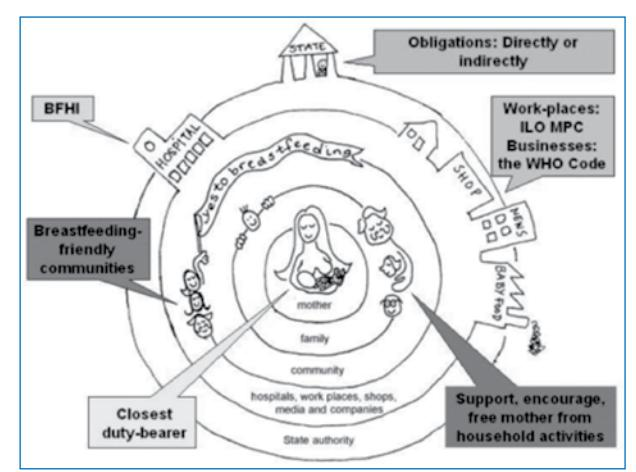

BFHI: Baby-Friendly Hospital Initiative, ILO MPC: International Labour Organization Maternity Protection Convention, WHO Code: World Health Organization International Code of Marketing for Breast-milk Substitutes **Figure 1:** Role analysis of "duty bearers"40

recommends a multisectoral approach that integrates nutrition interventions with other strategies. Consistent with other international recommendations, breastfeeding is listed as one of these interventions. The SUN Movement's framework for action provides a list of principles to guide action, which include developing country strategies, making use of international support, giving additional support to vulnerable groups and making use of evidencebased interventions.46 South Africa has adopted most of these approaches, albeit not at scale, but has not officially become a signatory to the SUN Movement to date.

The UNICEF Infant and Young Child Feeding Programming Guide provides guidance on the implementation of comprehensive infant and young child feeding programmes to improve child survival.9 This document highlights breastfeeding and complementary feeding as two important child survival interventions, and emphasises "the importance of breastfeeding as the preventive intervention with potentially the single largest impact on reducing child mortality". It indicates that some countries have demonstrated significant improvements in breastfeeding practices, but drastic changes are urgently needed in others. The UNICEF guide recommends the "large-scale implementation of comprehensive multilevel programmes, to protect, promote and support breastfeeding, with strong government leadership and broad partnerships". It reinforces the Global Infant and Young Child Feeding Strategy Guideline of exclusive breastfeeding for the first six months of life, followed by the introduction of complementary foods and continued breastfeeding up to two years or beyond. It also promotes early initiation of breastfeeding, defined as breastfeeding that starts within one hour of birth, as a strategy to be employed to prevent neonatal deaths. The UNICEF guide makes many recommendations on how to improve infant feeding practices, such as the appropriate training of healthcare staff and the institutionalisation of the BFHI.9 Therefore, training courses and material on infant and young child feeding that are standardised, evidencebased, regularly updated and in line with national and provincial guidelines should be included in the curricula of higher education training institutions, in order to increase the sustainability and training coverage of healthcare workers to ensure consistent messages.47,48

A starting point to better monitor the nutritional status of infants and young children in South Africa could be to include the WHO indicators for infant and young child feeding practices in the district health information system. Eight core indicators and seven optional indicators focus on selected food-related aspects of child feeding responsive to population-based surveys from data collected at household level.14 Currently, it is advised that this set of indicators should be used for a situation assessment in a comprehensive national planning process on infant and young child feeding,9 since it can be used for:

- Assessment: To make national and subnational comparisons and to describe trends over time.
- Targeting: To identify populations at risk, target interventions, and make policy decisions on resource allocation.
- Monitoring and evaluation: To monitor the progress in achieving goals and evaluate the impact of interventions.14

At the Tshwane meeting, one of the breakaway workshop groups was asked to deliberate the topic "Monitoring, Evaluation and Research", and discussed the possible inclusion in the district health information system of the following two indicators for breastfeeding (Doherty T, Medical Research Council, personal communication, August 23, 2011): early initiation of breastfeeding and exclusive breastfeeding at 14 weeks. These two indicators, among others, have subsequently been incorporated into the new South African Infant and Young Child Feeding Policy monitoring process in order to ensure its effective implementation.29

The proposed monitoring would be a step closer to ensuring that more meaningful information on infant and young child feeding is collected. However, there are more opportunities that are not yet being fully utilised, to incorporate data collection that is responsive to additional indicators of infant and young child feeding practices into community-based research projects, as well as larger-scale population studies, for example the South African National Health and Nutrition Examination Survey (NHANES).49

Pregnant women and mothers known to be HIV infected should be informed of the recommended infant feeding strategy by the national or provincial authority. This would improve the HIV-free survival of HIV-exposed infants, and the health of HIV-infected mothers. Pregnant women and mothers should have access to skilled counselling and support for appropriate infant feeding practices and ARV interventions to promote the HIV-free survival of infants.36 Counselling and education on infant feeding needs to be strengthened at facility and community level. When children present at facilities for routine immunisations, infant feeding should be thoroughly assessed and followed up. Existing strategies, such as the implementation of the community-integrated management of childhood illnesses, should be used by the community as an opportunity to identify and address infant feeding problems, and execute health promotion and prevention strategies that are relevant to infant feeding.50 The RtHB could be used effectively as a tool to assess, act upon and monitor these important interventions.

Two processes that would further strengthen commitment to breastfeeding pertain to the food labelling legislation that has recently been promulgated in South Africa,51 and the regulation of infant foods, which also encompasses regulation of the marketing of breast-milk substitutes.39 However, in order for national regulations to be fully effective, adequate monitoring systems need to be developed and implemented, together with the regulations.52

The commitment and capacity to advance breastfeeding as optimal nutrition for infants has been achieved at national level. From the Tshwane Declaration, a national implementation plan for breastfeeding promotion in South Africa will be developed, together with an advocacy, communication and social mobilisation plan.32 There is a great need to also build commitment and capacity at provincial, district and community levels,53 as depicted in Figure 1.41

The South African landscape analysis report highlighted the limitation of only interviewing health workers from public institutions and some NGOs, and not those from academic and research institutions, nor the private sector.31 It is of utmost importance to also assess and build commitment and capacity with a wider spectrum of stakeholders, as stated in the Tshwane Declaration.25 This includes the Departments of Health, Rural and Social Development, Education, Agriculture, and Labour, the civil society sector, traditional leaders and healers, the private and business sectors, researchers and academia, as well as the media. The role of the media as important communication channels to the public should be strengthened, and healthcare professionals encouraged to engage with the media and share messages on evidence-based practice with regard to breastfeeding promotion and support.

The recent momentum gained in support of improving infant and young child feeding could further be enhanced by the process of reviewing the preliminary South Africa paediatric FBDGs. A consumer research study of the preliminary paediatric FBDGs for infants younger than six months54 proposed that the guideline "Breastfeeding is best for your baby for the first six months" should be changed to include the word "only" in support of exclusive breastfeeding. It was further suggested that the benefits of breastfeeding should be included in supportive documentation, as well as a definition or explanation of exclusive breastfeeding. After considerable deliberation, the current paediatric FBDG working group formulated the following message that needs to be field tested: "Give only breast-milk, and no other foods or liquids, to your baby for the first six months of life".

This message should be supported by the following information:

- Give your baby only breastmilk for the first six months. No other food or drink is needed at this age. If a baby is given other food and drink, he or she will consume less breastmilk, and thereby receive less nutrition. Babies are protected against infection when they are breastfed.
- Hold your baby against your chest, skin to skin, within one hour of birth. Start breastfeeding at this time.
- Feed your baby several times during the day and

night. This will help your body to make more milk.

- Breastmilk contains substances that help to protect your baby against illness. If your baby does not get breastmilk, he or she is at a greater risk of developing serious illnesses.
- Ask for help if your baby is having difficulty breastfeeding.

## **Conclusion**

The evidence base that supports the importance of exclusive and continued breastfeeding on a global and local level has been broadened. There are comprehensive and practical international guidelines to assist with the protection and promotion of, as well as support for, breastfeeding. Comprehensive and sound national and provincial policy guidelines have been developed in South Africa. The political will to address infant and young child feeding has been advanced and displayed in our country, and a supportive environment created through commitment and capacity building. The evidence-based and theoretical planning must now be translated into action. There is a need for adequate monitoring and evaluation processes at all stages of implementation, using the above strategies to drastically improve exclusive and continued breastfeeding, and to advance the health and survival of children in South Africa. The revised South African paediatric FBDGs should be field tested to support these efforts in the country.

## **Acknowledgements**

The contributions by Aila Meyer and Debbi Marais to the first draft of the paper are acknowledged.

## **References**

- 1. Meyer A, Van der Spuy D. Du Plessis LM. The rationale for adopting current international breastfeeding guidelines in South Africa. Matern Child Nutr. 2007;3(4):271-280.
- 2. World Health Organization. Global strategy for infant and young child feeding. World Health Organization [homepage on the Internet]. 2003. c2013. Available from: http://whqlibdoc.who.int/ publications/2003/9241562218.pdf
- 3. Kramer MS, Kakuma R. Optimal duration of exclusive breastfeeding. [Cochrane review]. In: The Cochrane Library, Issue 1, 2002. Oxford: Update Software.
- 4. Rabe H, Reynolds G, Diaz-Rossello J. Early versus delayed umbilical cord clamping in preterm infants. [Cochrane review]. In: The Cochrane Library, Issue 4, 2004. Oxford: Update Software.
- 5. Bhutta ZA, Ahmed T, Black RE, et al. What works? Interventions for maternal and child undernutrition and survival. Lancet. 2008;371(9610):417-440.
- 6. Becker GE, Remmington S, Remmington T. Early additional food and fluids for healthy breastfed full-term infants. [Cochrane review]. In: The Cochrane Library, Issue 12, 2011. Oxford: Update Software.
- 7. Black RE, Allen LH, Bhutta ZA, et al. Maternal and child undernutrition: global and regional exposures and health consequences. Lancet. 2008;371(9608):246-260.
- 8. Tylleskär T, Jackson D, Ingunn NM, et al. Exclusive breastfeeding promotion by peer counselors in Sub-Saharan Africa (PROMISE-EBF): a cluster randomised trial. Lancet. 2011;378(9789):420-427.
- 9. The United Nations Children's Fund. Programming guide: infant and young child feeding. UNICEF [homepage on the Internet]. 2011. c2011. Available from: http://www.unicef.org/nutrition/files/Final\_IYCF\_ programming\_guide\_2011.pdf

## **Complementary feeding: a critical window of opportunity from six months onwards**

**Du Plessis LM,** MNutrition, RD/RNT(SA), Senior Lecturer Division of Human Nutrition, Faculty of Medicine and Health Sciences, Stellenbosch University, Stellenbosch **Kruger HS**, PhD, RD(SA), Professor, Centre of Excellence for Nutrition, North-West University, Potchefstroom **Sweet L,** RD/RNT(SA), Consultant Dietitian, Johannesburg **Correspondence to:** Lisanne du Plessis, e-mail: lmdup@sun.ac.za **Keywords:** complementary feeding, infants, young children, paediatric food-based dietary guidelines, paediatric FBDGs, South Africa

#### **Abstract**

**II**

This paper aims to propose evidence-based, paediatric food-based dietary guidelines on the complementary feeding period, from six to 24 months, of South Africa. A growing body of evidence supports the World Health Organization recommendation that, following six months of exclusive breastfeeding, appropriate and adequate complementary foods should be introduced, with continued breastfeeding for up to two years of age and beyond. A literature search was done by searching electronic databases (PubMed, the Cochrane Library and Sabinet) and hand searching key reference lists from January 2004 to April 2012, including studies published prior to 2004. Relevant international and national documents from normative bodies, global health and infant feeding authorities, professional and scientific societies and government were identified. It has been established that, in South Africa, high levels of stunting, growing concerns about overweight and obesity and the poor intake of certain micronutrients in the critical six- to 24-month period are, in part, a consequence of poor breastfeeding and complementary feeding practices, as well as the poor quality of the complementary diet. The introduction of semi-solid foods before four months of age is a common practice. The typical maize-based feeding pattern is low in food sourced from animals, vegetables and fruit and omega-3 fatty acids. Efforts by mothers to improve the quality of their children's diets by adding energy-rich food to maize meal improves energy intake, but not micronutrient intake. Low nutrient-dense liquid, such as tea and coffee, energy-dense sugar-sweetened drinks, an excessive intake of fruit juice and high-fat and salty snacks exacerbate poor nutrient intake and displace nutrient-dense food in the diet. Healthcare workers should provide consistent, evidence-based messages and guidelines to caregivers of future generations. Interventions must be implemented and strengthened at a programme level. These could include nutrition education to improve caregiver practices, the use of high-quality, locally available foods, the use of enriched complementary foods, and exceptional support of food-insecure populations.

 **Peer reviewed. (Submitted: 2013-04-12. Accepted: 2013-09-21.) © SAJCN S Afr J Clin Nutr 2013;26(3)(Supplement):S129-S140**

## **Introduction**

In 2007, a technical support paper entitled "Optimising the introduction of complementary foods in the infant's diet: a unique challenge in developing countries", on the South African paediatric food-based dietary guideline (FBDG) pertaining to complementary feeding, was published as the evidence base for an adequate diet for the optimal growth and development of children in South Africa.1 According to the State of the World's Children 2010 report,2 this challenge is still evident. The report indicated that only 58% of breastfed children aged six to nine months in developing countries were given complementary foods in a given 24-hour period. When stunting figures are reviewed to inform this picture, it becomes evident that a large proportion of young children are not receiving an adequate diet on a frequent basis.3

A growing body of evidence has emerged since 2007 that supports the World Health Organization (WHO) recommendation that, following six months of exclusive breastfeeding, appropriate and adequate complementary foods should be introduced, with continued breastfeeding for up to two years of age and beyond.4 However, inconsistent messages and selective communication have caused confusion among healthcare workers and the general public.5 In this context, it is very important to differentiate between public health messages and those that target individuals members of the public. Public health messages are intended for the general public, and can be communicated as "blanket" evidence-based messages based on proven public health problems in a population. Messages to individual members of the public should be interpreted as a oneon-one consultation, based on scientific reasoning and motivation for deviation from the public health message.6 A good example of the lack of differentiation between public health and individual messages can be found in the opinion held by some authorities on the appropriate age at which to introduce complementary feeding in infants.7 They state that "exclusive breastfeeding provides adequate nutrition up to six months of age for the *majority* of infants *(public health nutrition message),* while some infants *may need* complementary foods before six months", *(individual message),* (but not before four months). However, the two messages are combined when advising that the introduction of solid foods between "four and six months of age is safe, and does not pose a risk of adverse health effects".7 The contradiction in these messages is clear, and may confuse the audience for whom they are intended.

South Africa has adopted the WHO breastfeeding and complementary feeding recommendation.8 It is of crucial importance that there is consistent communication of this message to mothers and caregivers. In the National its Roadmap for Nutrition in South Africa 2012-2016, the National Department of Health cited the following as one of five overall goals: "To promote the optimal growth of children and to prevent overweight and obesity later in life, by focusing on optimal infant and young child feeding". Improved complementary feeding, with continued breastfeeding and targeted supplementary feeding where needed, is one of several key nutrition interventions. The document highlights the need to develop specific counselling messages on feeding and dietary practices.8 In the paper in this series by Du Plessis and Pereira, entitled "Commitment and capacity for the support of breastfeeding in South Africa", the foodlabelling legislation and new regulations on infant foods are highlighted as further strategies to be used to protect infant and young child feeding in South Africa.9

This paper, following a review of the latest evidence and current global recommendations on complementary feeding, aims to propose paediatric FBDGs for South Africa that pertain to the complementary feeding period. Optimal complementary feeding from six months of age, together with continued breastfeeding up to two years and beyond, will contribute to optimal infant and young child feeding during this critical and formative period.

## **Definitions**

The following definitions, as defined in the Foodstuffs, Cosmetics and Disinfectants Act, 1972 (Act No 54 of 1972) regulations relating to the fortification of foodstuffs, dated October 2002, apply throughout this paper:

- "Enrichment" means the addition of one or more nutrients to a food, whether or not it is normally contained in the food, with the sole purpose of adding nutritional value to the food.
- "Fortification" means the addition of one or more nutrients to a food, whether or not it is normally contained in the food, for the purpose of preventing or correcting a demonstrated deficiency in one or more nutrients in the population or specific population groups by the relevant authority.

## **Method**

## **Data sources and search strategy**

Studies were identified by searching electronic databases and hand searching key reference lists. The search strategy was developed and conducted by the authors. The following databases were used for the electronic search: PubMed, the Cochrane Library and Sabinet. Searches were carried out to include publications from January 2004 to April 2012. Relevant studies identified by hand searching that were published prior to 2004 were included. Search terms included a combination of keywords and associated terms that were relevant to the various subsections of this paper. For example, studies performed in South Africa on complementary feeding were identified using the keywords "South Africa" and "infant/child" and "nutrition", whereas for technical issues, the phrase "complementary feeding" was used together with other relevant words and associated terms. After abstracts or full articles were drawn from the literature search, they were excluded if they focused on children older than three years of age only. Relevant international and national documents (e.g. strategy, policy and survey documents), guidelines, reports, statements, opinions and position statements from normative bodies, leading global health), food and infant feeding authorities, professional and scientific societies and national government [e.g. WHO, the Pan American Health Organization (PAHO), the United Nations Children's Fund (UNICEF) and the South African Department of Health], were identified by the authors using electronic searches via the Google platform. The final search was conducted on 22 April 2012.

## **Complementary feeding practices in South Africa in relation to malnutrition**

A nationwide survey conducted in 1994 found a medium prevalence of stunting (20%) and a low level of underweight (8.3%) and wasting (3.6%) in infants aged 6-11 months.10 The prevalence of stunting increased with age, with 12- to 23-month-old children showing a high prevalence (30.2%). Rural children were nutritionally at a greater disadvantage than urban children, as evidenced by a higher prevalence of underweight, stunting and wasting in the former.10 Just under a decade later, a similar progression of growth faltering during the first two years of life was evidenced in a provincial study conducted in the rural areas of the Eastern Cape and KwaZulu-Natal, where a medium prevalence of stunting in infants aged six to 12 months (20.5%) increased to a high prevalence (30.9%) in the second year of life.11 A higher combined overweight and obesity prevalence of 20.3% was found in infants aged six to 12 months, compared to 15% in children aged 12-24 months. There was a low prevalence of underweight and wasting in all age groups.11 It appears that little progress has been made in improving the nutritional status of children since South Africa became a democracy in 1994.12,13 There are still high levels of poverty and stunting, as well as growing concerns about increased rates of overweight and obesity that are prevalent in the critical window period of six to 24 months of life.

A secondary analysis of the 1999 National Food Consumption Survey (NFCS), using the 2006 WHO reference standards, showed a medium prevalence of stunting (20.1%) in a broader age category of 12-60 months of age.14 The analysis classified 30% of the children as combined overweight and obese, leading the authors to conclude that overweight and obesity are major nutritional problems facing South African children in this age group. Stunting closely followed overweight and obesity.14 A study by Kimani-Murage et al15 found that the co-existence of stunting and combined overweight and obesity in the same child was common in children younger than five years of age. This presents evidence of a worrying double burden of malnutrition in a South African community undergoing a nutrition transition. As stunting is indicative of chronic malnutrition,10 it is reasonable to construe that the high prevalence of stunting in the second year of life is, in part, due to poor complementary feeding practices.16,17

The early introduction of semi-solid foods is common practice in South Africa and is a major challenge for healthcare workers. It has been reported that over 56% of infants in peri-urban Western Cape,18 61% in rural KwaZulu-Natal19 and 73% in rural Limpopo20 received foods before four months of age. The average age of the introduction of solid foods is reported to be two to three months of age,19- 21 although studies show that solids can be introduced as early as the first week.16,18,22 Soft maize meal porridge is the first solid food that is introduced in rural areas,18,20 and processed infant cereals in urban areas.18,23

The main constraint to the timeous introduction of solid foods (from six months of age) is the mother's lack of knowledge. Mothers perceive the inadequate production of breastmilk, and the belief that breastmilk alone is not enough to satisfy the infant, as the primary reasons for the early introduction of solid foods.18,21,22,24 Additional cited reasons included the baby being hungry, crying or not sleeping, the mother not coping well with breastfeeding, and incorrect advice from relatives, friends or nurses.20,21,24

Some cultural practices are barriers to the timely introduction of solids. The practice of introducing *tshiunza* (a traditional dish prepared from maize and roots, and fermented to make a soft sour porridge) immediately after birth was noted by Mushapi et al20 in a study conducted in the Limpopo province. More than one third (36%) of mothers indicated that they gave their infants foods for cultural or medical reasons, specifically naming *tshiunza*. This practice was encouraged by grandparents and was based upon the belief that the infants were not receiving enough breast milk and that *tshiunza* gave babies energy and helped them to pass stools and grow well.20

Soft maize meal porridge, a bulky food of low-nutrient density, is the food most often used by South African mothers to introduce solids to their infants.16,19,20,25 Maize meal is typically diluted with water to obtain a thin consistency, which lowers the nutrient density even further, and is high in phytates, which inhibit iron and zinc absorption.26 A study in KwaZulu-Natal26 reported that most mothers (96%) who fed their infants porridge added between one and four energy-rich food items (margarine, peanut butter, sugar, formula milk, fresh or powdered milk and eggs) to the porridge. Less than 20% of the infants consumed animal products or vitamin A-rich fruit and vegetables, and only 26% consumed dairy products in a 24-hour recall period. Although energy and protein intake was adequate, the nutrient composition of this typical rural South African complementary diet was found to be insufficient, especially with regard to iron, zinc and calcium. Infants who consumed commercial infant products (e.g. enriched infant cereals, ready-to-eat bottled baby foods and formula milk powder) were found to have significantly higher intakes of micronutrients than infants who did not.26

Considering the poor nutrient density of the South African complementary diet, it is unsurprising that two nationwide surveys, conducted in 1994 and 1999, found that South African children's diets were deficient in iron, selenium, calcium and zinc, as well as most vitamins, especially vitamins A, C, D, E and B2 . 10,27 The most recent national survey, conducted in 2005, highlighted a deterioration in the vitamin A and iron status of children aged one to five years, and a high prevalence of poor zinc status in children aged one to nine years.28 Deficient nutrient intake was further identified in a study in rural KwaZulu-Natal, where high prevalences of anaemia (49%), vitamin A deficiency (20%), zinc deficiency (32%) and iron deficiency anaemia (35%) were reported in infants aged 6-12 months.19 The high prevalence of overweight and obesity that has been observed in young South African children,14 and which often co-exists with stunting in the same child,15 is an additional challenge to healthcare workers who need to consider the quality of the South African complementary diet.

High levels of malnutrition persist in South Africa.10,13,14 Major constraints faced by mothers and caregivers include poverty10,13 and a dependence on plantbased staples.16,19,20,25,26 Inexpensive oils, margarine and sugar became widely available as a result of the nutrition transition, and are among the most common energy-rich food items that are added to maize meal.26 Insufficient knowledge on infant feeding,18,21,22,24 inconsistent messages20,21,24 and cultural practices20are barriers to optimal complementary feeding practices, and need to be addressed through nutrition programme interventions.24-26

## **The age at which to introduce complementary foods**

The WHO states that complementary foods should be introduced at six months of age (180 days), while continuing to breastfeed.4 This recommendation followed a report by a WHO expert consultation on the optimal duration of exclusive breastfeeding,4 which took into consideration the results of a systematic review29 (updated in 2009). The conclusion was that exclusive breastfeeding for six months confers several benefits on the infant and the mother.

Fewtrell et al30 questioned the appropriateness of exclusive breastfeeding for six months in UK babies. The basis of their argument was that delaying the introduction of solid food until the age of six months might increase the risk of iron-deficiency anaemia, coeliac disease and food allergies, and that introducing new tastes might increase acceptance of green leafy vegetables and encourage healthy eating habits later in life. They further argued that guidelines should be established based on a "current practice" perspective, rather than on the current evidence-based angle. This article elicited extensive media coverage, followed by a vast number of comprehensive responses by concerned researchers.5 UNICEF (UK) refuted each of the statements and concluded that "any new research should be considered as part of the whole body of evidence, and any recommendations made should be based on full evidence, rather than on single papers".31 Health professionals should continue to support mothers using accurate information based upon WHO guidance, to help them to recognise their infant's signs of readiness to try new foods, while continuing to breastfeed.31 Unfortunately, the relevant article was published in a reputable journal, and remains a resource that is consulted and cited, with the potential to cause confusion among healthcare professionals.

In a systematic review that investigated the determinants of the early introduction (i.e. before four to six months of age) of solid foods and the use of unmodified cow's milk in infants, Wijndaele et al32 found strong evidence for the following six determinants in developed countries:

- 1. Young maternal age.
- 2. Low maternal education.

- 3. Low socio-economic status.
- 4. Absence or short duration of breastfeeding.
- 5. Maternal smoking.
- 6. Lack of information or advice from healthcare providers.

Low maternal education and low socio-economic status were strong determinants of the early introduction, i.e. before 12 months, of unmodified cow's milk. In the short term, ensuring that the advice given by healthcare providers is improved appears to be the most manageable area with regard to intervention. These factors, including cultural practices, might be applicable to a developing country as well, but this would have to be verified. Healthcare workers should take these factors into account when developing programmes that focus on the mothers and caregivers of infants.

## **The nutritional requirements of six- to 36-monthold infants and young children**

Breastmilk continues to provide up to half of a child's nutritional needs during the second half of the first year, and up to one third during the second year of life, while continuing to impact positively on disease morbidity and mortality.33 The total energy requirement derived from complementary foods given to healthy, breastfed infants with an "average" breastmilk intake in developing countries is approximately 200 kcal (840 kJ)/day at six to eight months of age, 300 kcal (1 260 kJ)/per day at nine to 11 months of age, and 550 kcal (2 300 kJ)/day at 12-23 months of age (Table I).33

Depending on the amount of breastmilk consumed, the required amount of complementary foods has to be adapted accordingly. The principle of responsive feeding34 should guide the amount of food that is offered, while the energy density and frequency of feeding should be adequate to meet the child's needs. Since each child's needs differ, each child consumes different quantities of breastmilk and complementary foods, and each child grows differently, the amount of complementary foods should not be overly prescriptive.4 However, the frequency and quality of complementary foods should be stressed, since some infants tend to want to consume more milk and eat less food, especially during periods of illness.4

**Table I**: Total energy requirements derived from complementary foods given to healthy, breastfed infants with an "average" breast milk intake in developing countries33

| Age (in months) | Energy requirements (kJ/day) | Average breast milk energy intake in developing countries (kJ/day) | Average breast milk energy intake in industrialised countries (kJ/day) | Energy needs from complementary foods in developing countries (kJ/day) | Energy needs from complementary foods in industrialised countries (kJ/day) |
|--------------------|---------------------------------|-----------------------------------------------------------------------------|---------------------------------------------------------------------------------|------------------------------------------------------------------------------------|----------------------------------------------------------------------------------------|
| 6-8                | 2 583                           | 1 735                                                                       | 2 041                                                                           | 840                                                                                | 546                                                                                    |
| 9-11               | 2 881                           | 1 592                                                                       | 1 575                                                                           | 1 260                                                                              | 1 302                                                                                  |
| 12-23              | 3 755                           | 1 453                                                                       | 1 315                                                                           | 2 310                                                                              | 2 436                                                                                  |

High nutrient needs, due to the rapid growth and development of the infant in the first two years of life, coupled with the relatively small amounts of consumed complementary foods in this period, means that the nutrient density of complementary foods must be very high.4 Complementary diets in developing countries often do not contain adequate amounts of key nutrients, such as zinc and iron,35 because of a lack of diversity in the diet and dependence on plant-based staples, such as maize.25 The recommended foods for complementary feeding should address the key nutrient gaps that are most prevalent in a particular setting.3

#### **Suitable complementary foods**

PAHO and WHO4 provide the following guidelines with regard to complementary foods that can provide adequate nutrients to meet the growing breastfed child's nutritional needs:

- Provide a variety of foods to ensure that nutrient needs are met.
- Meat, poultry, fish and eggs should be eaten daily, or as often as possible. At this age, vegetarian diets cannot meet nutrient needs, unless nutrient supplements or fortified products are used.
- Vitamin A-rich vegetables and fruit should be eaten daily.
- Provide diets with an adequate fat content.
- Use fortified complementary foods or vitaminmineral supplements for the infant, as needed.

Complementary feeding guidelines are also available for the non-breastfed child36 but, in line with the Tshwane Declaration which encourages all mothers to breastfeed,9,37 this paper will focus on public health messages that are suitable for breastfed children. It is intended that these scientifically based guidelines will be used to develop population-specific FBDGs for complementary foods, based on local feeding practices and conditions and the composition of locally available foods.4 If these foods cannot provide sufficient micronutrients, supplementation with multiple micronutrients may be necessary, in addition to optimisation of the use of local foods.3 If locally available foods cannot provide the required levels of both macro- and micronutrients in food-insecure populations, enriched complementary foods, products for home enrichment (micronutrient powders), and lipid-based nutrient supplements (LNS) may be necessary to fill nutrient gaps.3,38

The eating of foods from animal sources is associated with improved nutrient intake and diet quality, which results in better growth outcomes. Thus, it is recommended that meat, poultry, fish and eggs should be eaten daily, or as often as possible.4,39 Unfortunately, these foods are often expensive, and so their inclusion in the diet in the required amounts may be a challenge, especially for lower-income groups. Examples of relatively inexpensive food from animal sources, containing adequate amounts of protein, iron, zinc and vitamin A, include chicken, beef or sheep liver, and eggs. The regular intake of liver was associated with a favourable vitamin A status in children in the Northern Cape province.40

Religious practices and cultural taboos may also be a constraint to the intake of food derived from animal sources.41 A study conducted in the Moretele district in North-West province identified that cultural factors and taboos have a powerful influence on feeding practices and eating patterns, mainly because of inadequate nutrition knowledge. The authors recommended that in order to improve feeding practices, nutrition education programmes should focus on changing the current knowledge, attitudes and practices.25 A study in rural KwaZulu-Natal showed that food from animal sources was not consumed frequently by six to 12-month-old infants.19 The infants had a significantly higher prevalence of iron deficiency anaemia (35%) than the national figure of 9.3% for infants aged six to 11 month-olds.42 Animal food products are high in many micronutrients, and many minerals and vitamins are better absorbed from milk, meat and eggs than from plant-derived foods. Most food from animal sources is more energy dense than plant-based food, because of the higher fat content and better source of fat-soluble vitamins and essential fatty acids (EFAs).39 Animal food products are the only foods that contains enough iron, zinc, calcium and riboflavin to supply daily requirements for complementary feeding, while being low in antinutrients.39

Infants have a great need for iron, because of rapid growth and depleted iron stores. Therefore, complementary foods should supply nearly all of the infant's iron requirements beyond the age of six months. The addition of 25 g of meat to a home-prepared vegetable meal for infants aged seven to eight months was shown to increase the absorption of non-haem iron, and also prevented a decline in haemoglobin concentration in the infants.43 In a study by Krebs et al,44 exclusively breastfed infants were randomised to receive either puréed beef or ironenriched infant cereal as the first complementary food. The mean daily zinc intake from complementary foods for the infants in the meat group was 1.9 mg, compared to 0.6 mg in the cereal group, which is approximately 25% of the estimated average requirement. An increase in the head circumference of infants aged seven to 12 months was marginally greater in the meat group. Zinc and protein intake was a predictive of head growth.44

As breastmilk is generally a more abundant source of fat than most complementary foods, total fat intake often decreases as the contribution of breastmilk to total dietary energy declines. The general fat intake recommendation to supply sufficient EFAs, while at the same time decreasing the likelihood of childhood obesity, is that fats should provide 30-45% of total energy. The amount of fat to be provided by the complementary diet is dependent on the intake of breast milk.33 It is important to also consider the potential effect of added fat on the overall nutrient density of the diet in vulnerable populations.45 Fat is an important part of the diet in infants and young children, because it provides EFAs, facilitates the absorption of fatsoluble vitamins, and enhances dietary energy density and sensory qualities.4 Omega-3 and omega-6 fatty acids, particularly docosahexaenoic acid (DHA), are known to play an important role in the growth and development of infants and young children. The associated intake in pregnancy and early life affects growth and cognitive performance later in childhood.46

Research data, including limited information from South Africa,46,47 show that most complementary foods are low in omega-3 fatty acids. The low intake of food from animal sources results in a greater risk of inadequate EFA intake in the complementary feeding period in populations in developing countries. In addition, some micronutrients have an effect on the conversion of a-linolenic acid and linoleic acid to eicosapentaenoicacid, DHA and arachidonic acid, which may further decrease the EFA content in the diet in micronutrient-deficient populations.48 Therefore, infants and young children are at risk. It is crucial to ensure adequate intakes of fat, EFAs, and especially DHA, early in life. Cost-effective dietary sources of EFA should be included either as food (e.g. fatty fish) or enrichment in the complementary feeding diet, together with continued breastfeeding of up to two years and beyond to ensure adequate EFA and DHA intake in these populations.49

Milk products are good sources of animal protein, fat and calcium, but not iron. Small amounts of dried milk powder mixed with other foods, e.g. in cooked maize meal, or small volumes of pasteurised milk, may be added to complementary foods during the first year of life, but should not displace breast milk in the infant's diet.4,50 The promotion of liquid milk products in settings with poor sanitation is risky as they become easily contaminated, especially when placed in a bottle for feeding.4 There are also concerns about faecal blood loss and lower iron status when fresh, unheated cow's milk is consumed by infants younger than 12 months of age.4 Therefore, caregivers should be advised that if cow's, or goat's, milk, is an available home-produced food, it should be heat-treated before being offered to young children in small amounts, bearing in mind the recommendation of continued breastfeeding.

The complementary diet should be rich in vegetables and fruit. In addition to their high nutrient density, vegetables are also low in energy density (kJ/g), and when consumed in sufficient quantities as part of the diet, may also serve to prevent the development of overweight and obesity in children, and chronic diseases in later life.51 Although it is important to include a wide range of vegetables and fruit, dark-green leafy vegetables and orangecoloured vegetables and fruit are important sources of vitamin A, and should be consumed daily.4 The challenge to overcome is that vegetables are often disliked by children.51Affordability and, to a lesser extent, availability, are cited as major constraints to the consumption of vegetables and fruit in South Africa.52 Infants who are offered a wide variety of vegetables in the complementary feeding period may be more accepting of vegetables and fruit,53 and are more likely to accept novel foods indicated and to increase their food repertoire. Studies have also indicated that seeking a variety of foods at age two to three years was a predictor of the same behaviour until early in adult life, highlighting the importance of establishing a varied food intake in infancy.51

Good-quality industrially processed complementary food, especially in the context of increased urbanisation, higher levels of female employment and the use of purchased foodstuffs, may be a particularly important option for sections of the population who have the means to buy these foods and the knowledge and facilities needed to prepare and provide them safely.54,55 Six- to 12-month-old infants in rural KwaZulu-Natal, who consumed enriched infant products, were shown to have a significantly higher intake of most micronutrients.26 Low-cost fortified maize meal porridge was potentially shown to have a significant effect on reducing anaemia and improving the iron status of infants in poor settings.23 Considering all of the applicable strategies used to improve the nutritional quality of a maize-based complementary diet, the enrichment of complementary foods, enrichment products used at home (micronutrient powders), LNS or supplementation may be the most effective way of achieving an adequate iron intake.26,38 Although the fortification of maize has been mandatory in South Africa since 2003, it is not expected to impact significantly on infant nutrition, because of the small amounts of food that infants consume.26

## **Foods that are not recommended in the complementary feeding period**

Infants do not need additional water when complementary feeding is being introduced. Generally, infants and children who breastfeed consume enough fluid.4 Non-breastfed infants and young children need at least 400-600 ml/day of extra fluid, in addition to the 200- 700 ml/day of water that is estimated to come from milk and other foods in a temperate climate, and 800- 1 200 ml/day in a hot climate. Plain, clean (boiled, if necessary) water should be offered from a cup several times a day to ensure that the infant's thirst is satisfied.36 Tea and coffee are not recommended as drinks for infants, because of their low nutrient content and the inhibitory effects of polyphenols on iron bioavailability.56 Faber and Benade19 reported that the consumption of tea by infants aged six to 12 months in South Africa was identified as a risk factor for anaemia. Anaemic infants were more likely to show growth faltering.19 Non-enriched cold drinks provide 7-10 g of sugar and 110-170 kJ per 100 ml, but no micronutrients.57 A South African study showed that 12% of infants aged six to 12 months consumed carbonated drinks at least four days per week, and an additional 26% at least once a week.19 The results of a systematic review58 showed that the consumption of sugar-sweetened beverages in the first five years of life was associated with later overweight and obesity.

The intake of fruit juice (including unsweetened juice) in infants aged six to 12 months should be limited to approximately 10 ml/kg of body weight, or 120- 180 ml daily.59 Excessive amounts of juice displace other nutrient-dense foods in the infant's diet,59 and is associated with increased caries from the age of four years.60 Fructose (from juice with a high fructose-to-glucose ratio) and sorbitol (in apple and pear juice), are incompletely absorbed in the small bowel. Unabsorbed sugars ferment in the intestines and cause diarrhoea. Other juices, such as grape and orange juice, have an equimolar fructoseto-glucose ratio and contain almost no sorbitol, which results in more complete carbohydrate absorption. However, infants aged five to nine months who received 10 ml/kg pear or grape juice daily showed no signs of adverse effects resulting from sugar malabsorption.61 The relationship between fruit juice intake and paediatric obesity is controversial,62,63 but there is general consensus that breastmilk should remain the primary source of nutrition throughout the first year of life, and that fruit juice should not displace breastmilk in the infant's diet.64

The consumption of honey has been associated with infant botulism. The general recommendation is that, if a mother wants to use honey, it should not be given before 12 months of age.65

Fibre-rich, plant-based foods are high in phytates which decrease iron and zinc bioavailability, and thus may contribute to iron and zinc deficiencies. This could potentially cause anaemia, impaired growth and an increased risk of diarrhoea in infants with a high intake of these foods. Swedish infants receiving porridge with regular phytate content had a 77% higher risk of diarrhoea, compared with infants receiving phytatereduced porridge during the 12- to 17-month period.66 A study in the Philippines, where complementary foods are predominantly plant-based, showed that the phytate content and phytate-to-zinc molar ratio, were higher in maize-based, rather than rice-based, complementary foods. The phytate content of complementary foods was reduced by soaking. Enrichment with protein derived from animal foods and soaking are strategies which successfully enhance the bioavailability of iron, zinc and calcium to varying degrees in maize-based complementary foods.67

The addition of extra table salt to complementary foods is discouraged,1 but complete elimination of salt from complementary foods is also contraindicated. Iodised salt is an important source of iodine, which is necessary for the growth and mental development of infants. A study in Switzerland showed that infants who did not receive iodine-enriched complementary foods were at risk of inadequate iodine intakes.67 Savoury snacks, for example fried dry maize or potato chips, provide approximately 200 kJ, 0.5 g protein, 3.5 g fat, 5.5 g carbohydrates and 100 mg sodium per 10 g snack, but contain very small amounts of micronutrients.56 A study in rural KwaZulu-Natal reported that more than 40% of infants aged six to12 months consumed savoury snacks at least four days per week.19 The high fat and sodium content of these snacks is concerning, because of the potential harmful effect of excessive sodium intake on the developing kidneys and blood pressure in later life.68 Other complementary food sources that contribute to excessive sodium intake in infants include gravy and bread with salty spreads.69 A study in Mexico indicated that infants aged five to 24 months who received high-fat snacks and sweetened cold drinks one or more times per week were more likely to be overweight or obese than those who didn't (odds ratio 1.82, 95% confidence interval 1.24-2.65).70

According to the authors of a study in rural KwaZulu-Natal, mothers added several food items, especially energy-rich foods, such as margarine, to the maize porridge, instead of micronutrient-rich foods. The addition of micronutrientrich foods would have been more appropriate, as 23% of the infants were overweight for length (z-score, > 2 standard deviations), and the complementary diet was inadequate in most micronutrients.71

Trans-fatty acids should be avoided in complementary foods, and saturated fats limited. In general, the working group of the Codex Committee on Food Labelling supports the establishment of a "free" claim for trans-fatty acids, and not pursuing consideration of claims of "low in transfatty acids", because global strategy pertains to virtual elimination of trans-fatty acids from food.72 Children of low socio-economic status should be given food products that meet long-term safety standards and are not just the cheapest source of available energy.73

## **Quantities and frequency of complementary foods**

Infants aged six to 12 months should be given small, frequent nutrient-dense meals because of their limited gastric capacity and high nutrient requirements.4 Complementary feeding should start with small amounts of food, and quantities can be increased as the infant grows older.4 Each child's needs vary according to the amount of breastmilk consumed and his or her growth rate, but if energy density of 4-6 kJ/g from complementary food is assumed, 140-90 g of complementary food should be offered at six to eight months, 200-280 g at nine to 11 months, and 380-500 g at 12- 23 months, of age.4 A thin maize porridge meal, the most frequently used complementary food in South Africa,16,19,74 of 35 g per feed provides < 30 kJ (< 1 kJ/g) and negligible protein per feed. The nutritional value of maize meal porridge consumed by some infants is improved by the addition of milk, providing additional energy and protein,74 but most caregivers add margarine or sugar to increase the energy content, but not the micronutrient content, of the food. These studies indicate that the most frequently fed complementary foods had a lower energy density than the assumed energy density of 4-6 kJ/g, and were also of low micronutrient density.16,19,74 Quantities >140-190 g (half to one cup) would then be necessary to provide 840 kJ daily from complementary foods at six to eight months of age, or more frequent meals would need to be offered.

The guiding principle for the frequency of feeding complementary foods is to increase the number of times that the child is fed complementary foods as he or she gets older. Complementary food meals should be provided two to three times per day from six to eight months, and three to four times per day from nine to 24 months of age. (The figures are based on an average healthy breastfed infant.) For children older than eight months, one meal may be a snack, defined as usually self-fed, convenient and easy-to-prepare foods eaten between meals. Mothers or caregivers should feed the infant slowly and encourage him or her to eat, without forcing him or her, while being sensitive to hunger and satiety cues.4

#### **Food consistency**

PAHO and WHO4 provide the following guideline on the consistency of complementary foods: "Gradually increase food consistency and variety as the infant gets older, adapting to the infant's requirements and abilities"*.* The minimum age at which infants are physically capable of ingesting different types of foods is dependent upon their stage of neuromuscular development. Initially, infants are only able to suckle. This is followed by "munching" and then chewing.75 Providing foods of an inappropriate consistency can result in the infant being unable to eat the food, or requiring an excessive amount of time to do so, and thus compromising intake.75 For this reason, infants should be introduced to puréed, semi-solid and mashed foods from six months of age and to "finger foods" (foods that infants can eat on their own) at eight months. By 12 months, most children are able to eat the same types of foods as the rest of the family.4 However, it is important to bear in mind that despite being physically capable of eating family foods from one year, young children still require nutrient-dense foods. Care should be taken to avoid foods that may cause choking such as nuts, raw carrots and grapes.35 The progression of food consistency from six months is important, as there is evidence to suggest that infants who are only introduced to lumpy solids (foods that require chewing) after nine months of age are more likely to have long-term feeding problems and reduced consumption of important food groups, such as vegetables and fruit.76

The practice of premastication by South African caregivers of lower socio-economic status for the purpose of homogenising food when feeding older infants77 should be cautioned, since it could be a potential route of HIV transmission to children.78

## **The safe preparation and storage of complementary foods**

It is critical to pay attention to hygienic practices during the preparation of complementary foods and feeding, especially to prevent gastrointestinal illness.4 The peak incidence of diarrhoeal disease is in the six-12-month-age period, when complementary food intake increases. The greater risk of microbial contamination is often due to lack of safe water and facilities for the safe preparation and storage of food.36 This is covered in more detail in the paper entitled "Food safety and hygiene".79 Research also shows that some traditional methods for preparing foods, in developing countries, such as fermentation, peeling, dehulling, dry roasting and toasting, may also have food safety benefits, as they reduce the risk of microbial contamination, while also having the added benefit of potentially improving the nutrient content.4,80

#### **Allergies and sensitivities to foods**

The incidence of genuine food allergy, as opposed to food intolerance, is rare.81 There has been speculation, and some observational data have also reported, that the early introduction of certain foods may be beneficial when there is a family history of true allergy. Randomised control trials are now being undertaken to test this theory. Should this prove to be the case, which is by no means certain, then high-risk families would need to be advised on a case-by-case basis. This would not affect public policy, as the majority of children are not affected by allergies.5 Once again, the difference between public health and one-on-one messages is stressed.

Most estimates for the prevalence of cow's milk protein allergy vary from 2-3%. Breastfed infants have a decreased risk of developing cow's milk protein allergy. If confirmed, an elimination diet is indicated for the mother. If a food challenge is positive in formula-fed infants, an extensively hydrolysed formula and cow's milk-free diet is recommended.82

The European Society for Paediatric Gastroenterology, Hepatology and Nutrition (ESPGHAN) Committee on Nutrition compiled commentary on complementary feeding in 2008. It focused on healthy infants in Europe. The following conclusions were formulated: "There is no convincing scientific evidence that avoidance or the delayed introduction of potentially allergenic foods, such as fish and eggs (yolk and white), reduces allergies, either in infants considered to be at increased risk of the development of allergy, or in those not considered to be at increased risk. It is prudent to avoid both the early (< 4 months) and late (> 7 months) introduction of gluten, and to introduce gluten gradually while the infant is still being breastfed, in as much as this may reduce the risk of celiac disease, type 1 diabetes mellitus and wheat allergy".50

Although food allergies are not considered to be a public health problem in South Africa, they are highlighted here because the ESPHGHAN Committee on Nutrition recommendation is often referenced by international speakers at conferences and symposia in South Africa. In the context of early sensitisation to allergenic foods, there has been lobbying for a return to the recommendation of introducing complementary food between four and six months. When the benefits of exclusive breastfeeding for six months are taken into consideration,29 the guideline of commencing complementary foods at six months and "not later than seven months" can be used as a practical recommendation in the South African context. The value of exclusive breastfeeding, and the continuation of breastfeeding while potentially allergenic foods are being introduced to prevent food allergies,49 should be promoted.

## **Communication approaches for the effective promotion of appropriate feeding practices**

The need for effective communication approaches that target caregivers cannot be overemphasised. For example, in a study in KwaZulu-Natal, caregivers listed community health workers as their main source of nutritional information.70 The majority (76%) of mothers in a study in Limpopo said they had not been taught which foods were good for their babies, and 13.5% were informed in this regard by health workers or nurses and 7% by mothers or mothers-in-law. Three per cent were influenced by radio, television or magazines.20

Studies in rural areas in South Africa have shown that nutrition education programmes undertaken by trained local women improved infant feeding practices and maternal knowledge of vitamin A.83 The UNICEF 2011 programming report recommended the need to strengthen the quality of counselling given to mothers and caregivers, and the importance of appropriate behavioural change communication to other family and community decision-makers, in order to improve infant and young child feeding practices.3

The report also recommended:

- The development of communication strategies which are based on situational assessments.
- Formative research to identify locally appropriate feeding recommendations and solutions to overcoming barriers.
- The development and pretesting of a limited set of key messages that promote action which can practically be carried out.
- Dissemination of the messages through multiple channels and contacts, including individual counselling and behavioural change communication.3

In the South African setting, the need to build the capacity of community structures, such as community health workers, lay counsellors, community caregivers and ward committees, is crucial to ensure adequate targeting of households and caregivers with appropriate messages on infant and young child feeding.9,37

### **Conclusion and recommendations**

South Africa has adopted the WHO recommendation that, following six months of exclusive breastfeeding, appropriate and adequate complementary foods should be introduced, with continued breastfeeding for up to two years of age and beyond.8 Conclusive evidence has shown that there is no benefit in giving infants aged four to six months any solid foods, and that the optimal duration of exclusive breastfeeding is six months.29,84

High levels of stunting and growing concerns about overweight, obesity and the poor intake of a number of micronutrients in the critical window period of six to 24 months of life are a consequence, in part, of poor breastfeeding and complementary feeding practices, and the poor quality of complementary diets in South Africa. The introduction of solid foods before four months of age is common pratice, and the typical maize-based diet is low in food sourced from animals, vegetables, fruit and sources of omega-3 fatty acids. Efforts by mothers to improve the quality of complementary foods by adding energy-rich foods to maize meal improve energy intake, but not nutrient intake. The practice of feeding infants and young children low nutrient-density liquid, such as tea and coffee, as well as energy-dense sugar-sweetened drinks, excessive fruit juice and high-fat and salty snacks, exacerbates poor nutrient intake and may displace other nutrient-dense foods in the diet. These practices contribute to paediatric micronutrient deficiencies and the growing problem of overweight and obesity.

The following best practice and evidence-based interventions at programmatic level should be implemented and strengthened without delay: the delivery of consistent and evidence-based nutrition education and counselling messages on complementary feeding to improve caregiver practices; use of high-quality locally available foods to improve complementary feeding; the use of enriched complementary foods, home fortification with LNS or micronutrient powders; and the provision of exceptional support to food-insecure populations.3,38,85

The Road to Health Booklet (RtHB) for children aged 0-60 months was implemented by the Department of Health in 2011 to enable healthcare workers to assess children's growth and development more comprehensively.86 By comparison with the previous Road to Health Card (RtHC), the new RtHB incorporates the 2006 WHO growth standards, based on a more representative reference population of children who are given the most appropriate infant feeding and optimal paediatric health care and who are raised in health-promoting environments.87 The new RtHB includes a larger section on age-appropriate health promotion messages,88 and not only on oral rehydration, as in the previous RtHC. All healthcare workers should be encouraged to communicate these messages to the caregivers of future generations. These messages should be regularly reviewed and updated to ensure that they are consistent with the latest evidence and aligned with the country's paediatric FBDGs.

The indicators that are used to assess complementary feeding practices have only recently been finalised (Table II).89 It is of paramount importance that South Africa considers gathering data that can be used to calculate these indicators, as well as data that assess breastfeeding practices in national and district health information systems, community-based surveys and the South African National Health and Nutrition Examination Survey (NHANES).9 Experience from other developing countries, with specific reference to South Asia, has shown that results obtained from such assessments and analyses greatly

**Table II:** Indicators to measure complementary feeding practices89

- 1. The introduction of solid, semi-solid or soft foods: The proportion of infants aged six to eight months who receive solid, semi-solid or soft foods.
- 2. Minimum dietary diversity: The proportion of children aged six to 23 months who receive foods from four or more of the seven food groups [grains, roots and tubers; legumes and nuts; dairy products (milk, yoghurt and cheese); flesh foods (meat, fish, poultry and liver or organ meats); eggs; vitamin A-rich vegetables and fruit and other vegetables and fruit].
- 3. Minimum meal frequency: The proportion of breastfed and non-breastfed children aged six to 23 months who receive solid, semi-solid or soft foods (this also includes milk feeds for non-breastfed children) for the minimum number of times or more (two times for breastfed infants aged six to eight months; three times for breastfed children aged nine to 23 months; and four times for non-breastfed children aged six to 23 months).
- 4. The minimum acceptable diet: The proportion of children aged six to 23 months who consume a diet that is minimally acceptable. This composite indicator is calculated from indicators 2 and 3 above.

assist in identifying determinants of poor complementary feeding practices and enable the contextualisation of data.90 This has implications for policies, programmes and research on infant and young child feeding.

The paediatric FBDGs for complementary feeding should be aligned with interventions at programmatic level, and should aim to address poor complementary feeding practices, optimise the use of locally available and appropriate foods, and encourage the use of enriched complementary foods, multiple micronutrients and/or LNS, when appropriate, to fill nutrient gaps.

Thus, the following messages are proposed and should be field tested for South Africa:

- From six months of age, start giving your baby small amounts of complementary foods, while continuing to breastfeed for up to two years and beyond.
- Gradually increase the amount of food, number of feeds and food variety as your child gets older.
- From six months of age, give your baby meat, chicken, fish, liver and eggs every day, or as often as possible.
- Start spoon feeding thick foods, and gradually increase to the consistency of family food.
- Give your child dark-green leafy vegetables and orange-coloured vegetables or fruit every day.
- Avoid giving tea, coffee, sugary drinks, and snacks that are high in sugar, fat or salt.

### **Acknowledgements**

This article was prepared with the support and comments of a working group. The contributions of the following persons are acknowledged: Ann Behr, South African Department of Health; Albertha Nyaku and Sophy Mabasa, Program for Appropriate Technology in Health; Nomvuyo Tyamzashe, Family Health International 360; and Pumla Dlamini, Global Alliance for Improved Nutrition.

## **References**

- 1. Van der Merwe J, Kluyts M, Bowley N, Marais D. Optimizing the introduction of complementary foods in the infant's diet: a unique challenge in developing countries. Matern Child Nutr. 2007;3(4):259-270.
- 2. The United States Children's Fund. State of the World's Children 2010 report. New York: UNICEF; 2010 [homepage on the Internet]. c2012. Available from: http://www.unicef.org/rightsite/sowc/pdfs/SOWC\_ Spec%20Ed\_CRC\_Main%20Report\_EN\_090409.pdf
- 3. The United States Children's Fund. Programming guide: infant and young childfeeding. New York: UNICEF; 2011 [homepage on the Internet]. c2011. Available from: http://www.unicef.org/nutrition/files/ Final\_IYCF\_programming\_guide\_2011.pdf
- 4. World Health Organization. Guiding principles for complementary feeding of the breastfed child. Geneva: WHO; 2001 [homepage on the Internet]. c2012. Available from: http://whqlibdoc.who.int/ paho/2003/a85622.pdf
- 5. Recent rapid responses. Fewtrell M, Wilson DC, Booth I, Lucas A. Six months of exclusive breastfeeding: how good is the evidence? BMJ. 2010;342:c5955 [homepage on the Internet]. c2012. Available from: http://www.bmj.com/content/342/bmj.c5955?tab=responses.

# **Responsive feeding: establishing healthy eating behaviour early on in life**

**Harbron J,** PhD, MSc, BSc Dietetics; **Booley S,** MSc, BSc Dietetics **Najaar B,** MNutrition, BSc Dietetics; **Day CE,** BSc(Med)(Hons)Nutrition and Dietetics Division of Human Nutrition, Department of Human Biology, Faculty of Health Sciences, University of Cape Town **Correspondence to:** Janetta Harbron, e-mail: janetta.harbron@uct.ac.za **Keywords:** responsive feeding, eating behaviour, parenting styles, feeding environment, nonresponsive feeding

#### **Abstract**

**III**

Responsive feeding (RF) refers to a reciprocal relationship between an infant or child and his or her caregiver that is characterised by the child communicating feelings of hunger and satiety through verbal or nonverbal cues, followed by an immediate response from the caregiver. The response includes the provision of appropriate and nutritious food in a supportive manner, while maintaining an appropriate feeding environment. The literature indicates that RF is the foundation for the development of healthy eating behaviour and optimal skills for self-regulation and self-control of food intake. Therefore, practising RF is associated with ideal growth standards, optimal nutrient intake and long-term regulation of weight. On the other hand, nonresponsive feeding (NRF) practices are associated with feeding problems and the development of under- or overnutrition. Different types of NRF behaviour have been described, where the caregiver is either uninvolved during meals, too restrictive or controlling, or allows the child to control mealtimes. Consequently, mealtimes may become cumbersome, characterised by inconsistent, nonresponsive interaction, and may result in a relationship that is lacking in trust. The effects of RF and NRF are reviewed in this article and the practical guideline to "Feed slowly and patiently, and encourage your baby to eat, but do not force them" is suggested as appropriate for inclusion in the proposed South African paediatric Food Based Dietary Guidelines. It is also acknowledged that RF practices are best established when mothers choose to breastfeed on demand, as they are less controlling and more responsive to their infants' internal hunger and satiety cues.

 **Peer reviewed. (Submitted: 2013-04-12. Accepted: 2013-07-07.) © SAJCN S Afr J Clin Nutr 2013;26(3)(Supplement):S141-149**

## **Introduction**

It is known that humans are born with the capacity to selfregulate their energy intake. This ability is fostered through cause-effect learning, meaning that signals from the child should be interpreted by the parent or caregiver in the correct manner and in a supportive environment. The facilitation of self-regulation skills early in life may predict future food intake and optimal responses to hunger and satiety cues.1

Newborn babies express their need for food through cues such as crying, and later (from roughly three months of age), infants are able to show signs of self-regulation of food intake by moving their hands towards their mouths, or heads, turning their bodies or heads away from undesirable food, spitting out food when they have had enough to eat, or displaying irritation when the pace of feeding is slowed (Table I).2-3 It is important that parents and caregivers acquire skills to recognise their infant's hunger and satiety cues, and respond appropriately.

It must be borne in mind that the feeding abilities and needs of children are in parallel with changes in motor, cognitive and social development in the first few years of life.6 These changes include progress from a semi-reclined position to a seated position, and from a basic suckswallow to a chew-swallow mechanism, while learning to self-feed; and making the transition to the family diet and meal patterns.7 According to the principles of psychosocial care, the manner in which infants are fed during these phases influences feeding outcomes, as does the feeding environment in which they are fed.8,9

Furthermore, the infant's emotional responses (temperament) to new circumstances and his or her activity level and socialisation skills may impact on feeding. For instance, an "easy" child adapts quickly to a regular routine and is more eager to try and accept new foods, whereas a "difficult" child struggles to adapt to change and experiencing new foods. Therefore, understanding an infant's temperament, which refers to the behavioural style of the child, is important in resolving infant feeding problems.3

It is a matter of course that the feeding behaviour of children is influenced by the relationship between the child and the parent or caregiver as he or she engages in food selection, ingestion and regulation in the process.6,10 Parents and caregivers also influence their children's eating behaviour through communicating their attitudes and beliefs about food and feeding. Eating behaviour may also be associated with genes that are inherited from parents. However, this non-modifiable influence is beyond the scope of this article.11

| Age                  | The caregiver's proactive preparation                                                                                                                                  | The child's skills and signals                                                                                               | Hunger cues                                                                                                                                                                  | Satiety cues                                                                                                                                              | Caregiver responsibility                                                                                                                                     | What the child learns                                                                                                                                   |
|----------------------|------------------------------------------------------------------------------------------------------------------------------------------------------------------------------|---------------------------------------------------------------------------------------------------------------------------------|------------------------------------------------------------------------------------------------------------------------------------------------------------------------------|-----------------------------------------------------------------------------------------------------------------------------------------------------------|-----------------------------------------------------------------------------------------------------------------------------------------------------------------|------------------------------------------------------------------------------------------------------------------------------------------------------------|
| Birth to 6 months | Prepares to feed when the infant signals hunger.                                                                                                                       | Signals hunger and satiety through voice, facial expressions and actions, and the rooting and sucking reflex. | Wakes and tosses. Sucks on fist. Cries or fusses. Opens mouth while feeding. Smiles and gazes at the caregiver.                                            | Seals lips. Turns head away. Slows or stops sucking. Spits out the nipple or falls asleep. Turns the head away. Is distracted. | Responds to infant's signals by feeding him or her when he or she is hungry, and stopping when he or she has reached satiety.              | The caregiver will respond to and meet his or her needs.                                                                                          |
| 6-12 months          | Ensures that the child is comfortably positioned. Establishes family mealtimes and a routine.                                                              | Sits, chews and swallows semi-solid foods. Self-feeds by hand .                                                     | Reaches for the spoon or food. Points to food. Gets excited when food is presented. Expresses a desire for specific food with words or sounds. | Shakes head to indicate that no more is desired.                                                                                                    | Responds to the child's signals, using increased variety, texture and tastes. Responds positively to the child's attempts to self-feed. | To begin to self-feed. To experience new tastes and textures. That eating and mealtimes are fun.                                      |
| 12-24 months         | Offers three to four healthy meal choices . Offers two to three healthy snacks each day. Offers food that can be picked up, chewed and swallowed. | Self-feeds using many different foods. Uses baby-safe utensils. Uses words to signal requests.                | As above. Increased vocabulary in relation to food requests.                                                                                                     | As above. Increased vocabulary when refusing food.                                                                                               | Responds to the child's signals of hunger and satiety. Responds positively to the child's attempts to self-feed.                           | To try new foods, To do things for him- or herself. To ask for help. To trust that the caregiver will respond to his or her requests. |

#### **Table I:** The progression of feeding behaviour and responsivity for young children and caregivers4,5

## **Parenting practices and styles**

Infant and child feeding is guided by parenting practices and parenting styles, both of which are aspects of parental care. According to Ventura and Birch,12 three parenting practices are recognised, namely parents as providers, role models or controllers. These practices determine what, when and how a child should eat through what is made available, by the effect of modelling eating behaviour and through restricting, pressuring and monitoring the child's food supply and intake. These practices can differ from sibling to sibling within a family, and are often context specific, for example when the child is sick, overweight or obese.12

"Parenting style" refers to the manner in which parents and caregivers interact with a child in terms of attitude and behaviour across all areas of parenting. Therefore, the parenting style filters into the parental feeding style,12 which refers to the interactive pattern of behaviour between caregivers and children which occurs during feeding.13 Black and Hurley13 mention four relevant parenting styles, namely authoritative, authoritarian, indulgent and uninvolved (Table II). The authoritative style equates to sensitive or responsive parenting.13 Evidence from observational and intervention research indicates that responsive parenting that is warm and involves positive interaction with the child results in a child who has secure attachments and relationships, better cognitive and language development, and the ability to self-feed earlier.14 Responsive parenting involves, prompt responses to verbal cues and contingencies which are appropriate to the stage of development.15 It is argued that this type of approach contributes to the establishment of a partnership between infants and children and their parents and caregivers, by which they learn to recognise and interpret both verbal and nonverbal communication signals from one another.15 This reciprocal process forms the basis of an emotional bond or attachment that is essential for healthy social functioning, as well as optimal feeding behaviour.13,16 Parents and caregivers who practice responsive parenting are most likely to exercise responsive feeding (RF) strategies. Thus, it is unsurprising that the World Health Organization (WHO) and the United Nations Children's Fund (UNICEF) have advocated RF as a component of their guidelines for feeding infants and young children.17,18

## **Responsive feeding**

RF is a component of active feeding that provides complementary foods in an "active" manner.18 Active

| Parental style                                                                                       | Feeding style                                                                     | Characteristics of the parent or caregiver                                                                                                                                                                                                                                                                                                                                                                                                                                                                  | Characteristics of the child                                                                                                                                             | Consequences                                                                                                                                                                                                                                                                                                                                                                                                                                                                       |
|------------------------------------------------------------------------------------------------------|-----------------------------------------------------------------------------------|----------------------------------------------------------------------------------------------------------------------------------------------------------------------------------------------------------------------------------------------------------------------------------------------------------------------------------------------------------------------------------------------------------------------------------------------------------------------------------------------------------------|-----------------------------------------------------------------------------------------------------------------------------------------------------------------------------|------------------------------------------------------------------------------------------------------------------------------------------------------------------------------------------------------------------------------------------------------------------------------------------------------------------------------------------------------------------------------------------------------------------------------------------------------------------------------------|
| Authoritative (democratic) • Involved • Nurturing • Structured                           | Responsive (Demanding + and responsive +)                                   | See Table III on how to promote responsive feeding.                                                                                                                                                                                                                                                                                                                                                                                                                                                      | Positive behaviour: • Accepts food when offered it. • Learns that the caregiver responds to his or her hunger and satiety cues in a responsive manner. | • The child learns: - To self-regulate food intake via hunger and satiety cues - To self-feed - That mealtimes are fun. • The child develops healthy eating habits                                                                                                                                                                                                                                                                                |
| Authoritarian (controlling) • Forceful • Restrictive • Structured • Low in nurturance | Nonresponsive feeding style (controlling) (Demanding + and responsive -) | • Dominates the feeding situation. • Uses forceful and restrictive strategies to control mealtimes. • Speaks loudly to get the child's attention. • Uses force-feeding. • Overpowers the child.                                                                                                                                                                                                                                                                                        | • Has no say. • Displays negative behaviour, such as refusing to eat, crying, and being distracted or picky.                                                 | • Distress and/or avoidance. • Overweight or obesity. Controlling type: • The child does not develop the ability to self-regulate food intake and to respond to natural hunger and satiety cues. • Eats in the absence of hunger. • Has a lower body mass index. Restrictive type: • Seeks out food that has been restricted by parents and when finding it, overindulges. • Could lead to over weight or underweight. |
| Uninvolved (neglectful) • Unengaged • Insensitive • Unstructured • Low in nurturance  | Nonresponsive feeding style (uninvolved) (Demanding - and responsive -)  | • No or little active physical help during mealtimes. • No or little verba lisation during mealtimes. • Provides no guidelines regarding food intake. • Lack of reciprocity; ignores the child's hunger and satiety cues. • Creates a negative feeding environment. • Provides no feeding structure or routine. • Ignores the child's nutritional needs or has limited knowledge of them. • Is unaware of when and what the child is eating. | Decides when and what to eat, as well as how much.                                                                                                                    | • Child is unable to recognise hunger and satiety cues. • Eats just because food is there. • Is overweight or obese.                                                                                                                                                                                                                                                                                                                                                |
| Indulgent (permissive) • Involved • Nurturing • Unstructured                             | Nonresponsive feeding style (indulgent) (Demanding - and responsive +)   | • Provides no guidelines regarding food intake. • Uses food as a reward. • Uses food as a comforter or to control a child's behaviour.                                                                                                                                                                                                                                                                                                                                                          | Decides when and what to eat, as well as how much.                                                                                                                    | • Child has a high intake of food that is high in salt and sugar. • Child has a low intake of fruit and vegetables. • Child is overweight or obese.                                                                                                                                                                                                                                                                                                              |

#### **Table II:** Parenting and feeding styles, as well as the characteristics and consequences of each feeding style1,4,11,13,19-21

feeding is when the parent or caregiver engages in positive behaviour with the child, while encouraging and bearing in mind the interests of the child during mealtimes. Examples of positive active behaviours include having conversations about food, modelling good food behaviour (healthy choices), playing food games and encouraging the child verbally. Conversely, negative behaviour includes aversive and intrusive attempts at direct feeding, i.e. force-feeding, holding the child's head, and threatening or shaking the child, and is known as nonresponsive feeding (NRF).19

The term "responsive feeding" was first introduced as a construct of psychosocial care and developmental psychology in order to explain the feeding situation.8

Since its introduction, the framework surrounding RF has grown and can be defined as "reciprocity between the child and the caregiver", conceptualised as a four-step process:

- 1. The creation of a structured routine, whereby expectations are made known and emotions promote interaction.
- 2. The signalling of cues by the child through motor actions, facial expressions or vocalisation.
- 3. The prompt response of the caregiver to these signals in a manner that is supportive, contingent and appropriate.
- 4. The perception of the response by the child in a predictable manner.22

### **Nonresponsive feeding**

A lack of reciprocity between the caregiver and child consequently leads to NRF. Three different types have been described:

- 1. Indulgence type, where the child controls the feeding situation.
- 2. Uninvolved type, where the caregiver ignores the child during meals.
- 3. Pressuring and controlling or restricting type, where the caregiver takes excessive control and dominates the feeding situation.

The restrictive type is either covert (high-fat food and purchases from fast-food restaurants are avoided), or overt (the caregiver limits the total amount of food the child eats).23

It is likely that parents or caregivers who do not practice responsive parenting will not exercise RF strategies. Consequently, feeding times may become cumbersome, characterised by inconsistent, nonresponsive interaction and a relationship lacking in trust.16,24 This has potentially negative effects on the child's internal hunger and satiety cues, self-regulation and social and emotional development, including the development of temperament and autonomy, all of which may contribute to feeding problems.6,13,15,25

Common feeding problems in young children include:

- Overeating.
- Poor eating, i.e. failure to thrive and picky eating.
- Feeding behaviour problems, i.e. post-traumatic feeding disorders, such as phobias, because of a food-induced allergy or reaction, such as choking.
- Unusual food choices, i.e. the ingestion of non-food substances, known as pica.
- Unhealthy food choices, i.e. poor food preference or alternative diets.

Feeding problems, such as overeating, may manifest as a medical condition, i.e. diabetes mellitus or hypertension, as well as disturbances in self-esteem, body image and socialisation later in life. Therefore, it is crucial to avoid early-life problems with regard to parent-child feeding experiences.6

## **Other factors that affect responsive feeding**

Various other factors, including time, socio-economic status, the environment, perceptions, ethnicity and birthweight, may influence the feeding style of the parent or caregiver.

For instance, parents or caregivers who display controlling behaviour usually have competing demands on their time and resources and feel pressured. Therefore, the feeding situation is often characterised by frustration and inattention to the child's verbal and internal cues, which, in turn, may result in mistrust. Parents or caregivers who display disinterest often struggle with feeding times, as the child may throw food around or refuse to eat to attract the attention of the parent or caregiver.15

According to Faith et al,26 parents and caregivers may also engage in restrictive NRF behaviour if a child is overweight or obese, in an attempt to address the child's weight status. Investigations showed that the mothers of infants born with a low birthweight showed signs of indulgent feeding, compared to the mothers of their higher birthweight counterparts, who displayed signs of restrictive feeding.27 Furthermore, parents and caregivers who feel highly responsible for their child's food intake, as well as those who are restrained eaters themselves, may exhibit restrictive feeding behaviour.28 Hurley et al20 also noted that parental weight status and psychosocial characteristics may result in restrictive behaviour.

Moore et al19 point out that the majority of parents and caregivers in low-income populations, such as Bangladesh, use controlling feeding behaviour, which results in frequent refusals by children to feed. Inevitably, parents and caregivers turn to forceful tactics and subsequently do not allow the child to feed him- or herself, even when he or she is developmentally capable of, and shows an interest in, doing so.29 As the prevalence of undernutrition is rife in many low- and middle-income countries, health and nutrition counsellors are tasked with the enormous

#### **Table III:** Strategies to promote responsive feeding4,18,32

| How to feed responsively                                                                                                                                                                                                                                                                                                                          |                                                                                                                                                                                                                                             |                                                                                                                                                                                                                                                                                                                                                                               |                                                                                                                                                                                                                                                                               |  |
|---------------------------------------------------------------------------------------------------------------------------------------------------------------------------------------------------------------------------------------------------------------------------------------------------------------------------------------------------|---------------------------------------------------------------------------------------------------------------------------------------------------------------------------------------------------------------------------------------------|-------------------------------------------------------------------------------------------------------------------------------------------------------------------------------------------------------------------------------------------------------------------------------------------------------------------------------------------------------------------------------|-------------------------------------------------------------------------------------------------------------------------------------------------------------------------------------------------------------------------------------------------------------------------------|--|
| Actively engage in: • Conversations and eye-to-eye contact with your child during feeding times. • Clear communication regarding expectations. • Responding to hunger and satiety cues. • Feeding infants directly, or assisting older children to feed themselves.                                                             |                                                                                                                                                                                                                                             | Feeding progression: • Slowly and patiently, while encouraging and motivating the child to eat. • Never force-feed children.                                                                                                                                                                                                                                         |                                                                                                                                                                                                                                                                               |  |
| Modelling healthy behaviour: • Parents, caregivers and family members should all make healthy food-based choices. Offered food must be: • Healthy, tasty and developmentally appropriate. To overcome food refusal, experiment with: • Different food combinations, tastes and textures. • Various methods of encouragement. |                                                                                                                                                                                                                                             | Required environment • Pleasant feeding environment • Child is seated in a relaxed and comfortable manner • Child is face to face with other family members • Distractions are minimised during meals • Routines are established as a result of organising mealtimes, following a predictable schedule, and eating preferably at the same time and place |                                                                                                                                                                                                                                                                               |  |
| Additional responsive feeding strategies during special circumstances                                                                                                                                                                                                                                                                             |                                                                                                                                                                                                                                             |                                                                                                                                                                                                                                                                                                                                                                               |                                                                                                                                                                                                                                                                               |  |
| When the child is sick: • Feed slowly and patiently. • Give mashed or soft food, especially if the child has difficulty swallowing. • Give the child his or her favourite foods. • Give small, frequent meals. • Breastfeed more often and for longer at each feed, and increase fluid intake.                      | When the child is recovering from illness: Be responsive to the child's increased hunger and escalate the amount of food by giving additional meals or snacks each day for two weeks, and offering more food per meal. | When the child refuses to eat: • Give an alternative food. • Make food more presentable to the child, e.g. in the shape of a character or a smiley face. • Talk and/or sing to the child. • Ensure that the child does not eat alone.                                                                                                                 | When the child has a reduced appetite: • Feed slowly and patiently. • Feed the child his or her favourite food. • Breastfeed more often. • Provide more feeding opportunities. • Prepare smaller portion sizes, as opposed to three main meals. |  |

burden of reducing the prevalence of child morbidity and mortality.15 As a result, they may unintentionally promote force-feeding as parents and caregivers may interpret the recommendations as "get the child to eat more under any circumstances".15

Various cross-sectional studies have shown that parental responsivity is affected by beliefs about care giving and the perceptions of children's needs and abilities. For example, in Bangladesh, parents and caregivers believe that children are unable to appropriately self-feed in the first 2-3 years of life.15 It has also been indicated that ethnicity may play a role in the feeding style adopted by mothers. It was observed that most caregivers in Hispanic and African American populations engaged in NRF styles, compared to their Caucasian counterparts.30

NRF practices are also often used when children are sick or recovering from illness. Results from a study conducted in Ghana indicated that 81.2% of parents and caregivers of children aged 6-24 months used NRF practices, such as force-feeding, when the child was recovering from illness. However, the recommended RF practices during the recovery period such as "giving an additional meal each day for two weeks" and "giving more food per meal" (Table III) was only practised by 11.8% of parents and caregivers.31

When children were sick, Ghana parents and caregivers used NRF practices, such as ceasing the feeding, forcefeeding, administering punishment, or putting the child to sleep. However, the recommended RF practices during child illness is to feed slowly and patiently, offer the child his or her favourite food, or breastfeed more frequently. In Ghana, this was carried out by 35.2%, 17.8% and 38.9% of parents and caregivers, respectively.31

## **Feeding options**

Breastfeeding has well-recognised benefits, such as the establishment of attachment, as well as optimal nutrition and protection from illness. Hence, the recommendation of exclusive breastfeeding for the first six months and continued breastfeeding up until two years of age with the introduction of solids at six months, remains unchanged.17,33

Breastfeeding has been shown to promote the selfregulatory ability of infants.11 It is most likely that this can be attributed to the feed-on-demand system that is encouraged in breastfeeding, which ensures that both mother and infant become more in sync with the child's natural hunger and satiety cues. Consequently, there is lower maternal control of food intake and greater maternal responsiveness to infant cues.27 The amount that the infant or child consumes depends equally upon his or her self-regulating capacity and on the sensitivity of the parents to these cues.11 The latter has a beneficial effect on infant feeding style and food intake, acknowledges the infant's ability to self-regulate appropriate food intake, and may contribute to healthier eating patterns.27

The results of several studies suggest that breastfeeding may promote parenting styles that are more responsive to infant hunger and satiety cues, and maternal feeding styles that are less controlling.34 For instance, in a longitudinal study of mother-infant pairs, Fisher et al35 reported that mothers who breastfed their infants for at least 12 months used less control when feeding their infants at 18 months of age, including less restriction and pressure, compared to mothers who did not breastfeed. They also reported a significantly higher energy intake at 18 months, which was associated with a lower level of maternal control.35

Taveras et al34 examined the type of feeding during the first six months and the duration of breastfeeding after six months, and whether or not the type of feeding was related to maternal control of infant feeding. The mother's level of agreement with the statement "I have to be careful not to feed my infant too much" was used as the measure of restriction. The authors found that increased breastfeeding duration predicted less restriction of the child's food intake at one year, even after adjusting for demographic characteristics, the mother's pre-existing attitudes, and infant birthweight or six-month weight for length.34

Farrow and Blisset36 explored whether or not breastfeeding, mediated by lower maternal use of controlling strategies, predicted interaction at mealtimes between mothers and their one-year-old infants. It was found that mothers who breastfed, rather than formula fed, were less likely to exert control over their child's intake, and were more sensitive to the child's cues at mealtimes, which predicted more positive mother-child mealtime interactions at one year of age.36

When compared to breastfeeding, bottle feeding, is driven by infant cues to a lesser degree.12 The explanation for this may be that, with bottle feeding, the infant can extract milk with less effort than from the breast. The result is that the formula-fed infant assumes a more passive role in the feeding process. By contrast, the breastfed infant assumes an active role in the process of extracting milk from the breast. Hence, this may suggest that bottle feeding promotes higher levels of maternal control, which, in turn, reduces the infant's opportunities to control the amount consumed at a feeding, making it easier for overfeeding to occur.35 Furthermore, in formula-fed or mixed-fed infants, higher energy intake at the age of four months predicted greater weight gain in the first three years, and higher body weight and body mass index (BMI) from 1-5 years of age.37

In summary, the self-regulating ability of infants can be influenced by maternal feeding practices.35 Wright38 reported that mothers of bottle-fed infants were less able to recognise changes in their infants' hunger states throughout the day, compared to the mothers of breastfed infants. This may be because of the greater dependence that mothers of bottle-fed infants have on visual cues, i.e. the volume of milk remaining in the bottle.35 These differences do not infer that bottle feeding is necessarily less responsive than breastfeeding, but instead that responsiveness to the infant by the parent or caregiver is of great importance in feeding.21

### **Advantages of responsive feeding**

Fostering a reciprocal relationship between the parent or caregiver and the child, and thus practising RF, is hypothesised to be beneficial to both parties. For the child, RF encourages eating in a competent and responsible manner, being attentive to internal hunger and satiety cues, and cultivating skills of optimal self-regulation and self-control of food intake.1,15 Furthermore, RF promotes the child's attentiveness and interest in feeding, and the ability to communicate his or her needs by distinct and meaningful signals.15 In the long term, RF may foster healthy eating habits and growth, as well as reduce child under- and overnutrition.1,15,16

Studies that have investigated the effect of RF on eating behaviour, growth, dietary intake and illness in children have recently been summarised and reviewed.16 It seems the effect of RF on eating behaviour in children has been investigated mainly in observational studies. There have been promising results with regard to caregiver verbalisation, but inconclusive findings on maternal encouragement, physical action and child autonomy.16 For instance, in a cross-sectional observation study in Vietnamese mother-child pairs, it was found that children aged 12-18 months were 2.4 times more likely to accept the food offered to them when they received positive comments from the parent and caregiver, compared to those who received no encouragement. However, mechanical and directive comments resulted in the children being less likely to accept what was being offered.21,39

The work by Dearden et al21 has indicated that parental control that restricts the child's mobility or opportunity to reject food negatively affects food intake in 12-month-old children, but it is not applicable to those who are 18 months of age. These authors specifically found that 12-month-old children who sat on the caregiver's lap, or were in their arms while eating (thus restricting their mobility), were less likely to take food than those who were unrestricted in terms of mobility (being allowed to crawl during feeding time) and who were consequently more likely to accept bites of food.21 By contrast, children of 17 months of age were more likely to accept bites of food when they sat on a lap, on the floor or on a chair, stool or bed, or were in the arms of the caregiver. Furthermore, it was found that children who fed themselves were 10.6 times more likely to accept bites of food, compared to those who were fed by others.35 In addition, distraction during mealtimes (e.g. children who played), was associated with reduced intake (less likely to accept bites of food) in 17-month-old children. This was also more evident in boys than in girls.21

In a study conducted in Bangladesh, Moore et al19 illustrated that the children of mothers who used RF practices clearly indicated when they were hungry or thirsty, and ate more mouthfuls of food. However, the children of mothers who employed different strategies to enhance eating, such as verbal direction or temporarily diverting the child's attention (defined as active behaviour, whereby the mother focused, stimulated and encouraged the child to act), were less responsive and refused food.19

The effect of RF on child growth outcomes have been investigated in several intervention studies. Bentley et al16 summarised the results of 15 intervention studies with an RF component that they were able to trace. The authors concluded that the results of 14 of the 15 studies showed a positive effect on child growth outcomes. However, it was noted that most interventions consisted of a number of strategies, such as education on nutrition, supplementation and managing a child's sleep and crying, in which RF messages were embedded. Therefore, the isolated effect of RF on child growth could not be elucidated. Only two of the 15 studies were specifically designed to investigate the sole effect of RF.16 These two studies were both clustered, randomised intervention trials that were conducted in low-income mothers from Bangladesh, with children aged from 8-24 months.29,39 In both studies, the intervention consisted of a six-session educational programme that focused on improving self-feeding and the mother's responsiveness, while the control group received information on child feeding and sickness. The results indicated that the intervention had a positive effect on child growth (weight and weight gain) and increased child self-feeding and maternal responsive verbalisations during mealtimes.29,39

The effect of RF on the nutrient and food intake of children has been investigated in four intervention studies, as summarised by Bentley et al.16 Although the results were promising (all of the studies reported improved nutrient and/or healthy food intakes in the intervention groups), RF was again not an isolated intervention strategy and other treatment modalities could have influenced these results.16

Lastly, although investigated in three studies, no definite conclusions can be made about role of RF in nutritionrelated child illnesses.16 It can be speculated that RF could help to reduce the development of nutritionrelated diseases or improve treatment outcomes in these children. However, the isolated effect of RF still needs to be investigated.

## **Disadvantages of nonresponsive feeding**

NRF behaviour is thought to be linked to the development of overnutrition, mostly in high-income countries, and undernutrition and stunting, mostly in low- and middleincome countries.16 For instance, in the 1980s, studies conducted in Nigeria showed that women chose to hand feed their children in order to save time, as most women worked an average of eight hours per day as market traders. This resulted in restrictive NRF, as the children were effectively force-fed. From the results of this study, it was observed that children who were force-fed by hand had lower z-scores for weight for age, weight for height and height for age, compared to infants whose mothers did not hand feed their children.40

In a systematic review of studies conducted in highincome countries, Hurley et al concluded that current evidence points to an association between NRF and child overweight and obesity.20 This relationship is evident in toddlers and preschool children. However, studies performed in infants aged 0-12 months were limited and showed mixed results. Thus, more research in this age group is necessary before conclusions can be made. Overall, the most common association that was found was a positive relationship between parental control of feeding and overweight status in children. More specifically, restriction was associated with a higher BMI and overweight or obesity, while pressure during feeding was associated with a lower BMI. Furthermore, the majority of studies linked indulgence with overweight and obesity. For example, this indulgent behaviour was apparent in the children of parents or caregivers who used food as a reward or to calm or regulate the child's behaviour.20 Indulgent behaviour has also been associated with a lower intake of fruit and vegetables41 and a higher intake of sweets and soft drinks.42

Providing a pleasant feeding environment is the cornerstone of RF, and research has linked non-ideal environments with having a negative impact on food intake and weight. Conflict during mealtimes predicts heavier weight in preschool children,43,44 while watching TV during mealtimes, instead of eating at a table, predicted less healthy eating, such as food containing high fat, as well as a low fruit and vegetable intake in children.44,45 On the other hand, the presence of household routines, including family mealtime routines, has been associated with reduced odds of obesity in preschoolers.46

## **Strategies to promote responsive feeding**

Standards for infant and young child feeding47 have been set by WHO17,33,48 and UNICEF,18 and incorporate five different guidelines for RF, namely:

- Feed infants directly and assist older children when they feed themselves, being sensitive to their hunger and satiety cues.
- Feed slowly and patiently, and encourage children to eat, but do not force them.

- If children refuse many foods, experiment with different food combinations, tastes, textures and methods of encouragement. Or, offer new foods several times. Children sometimes refuse new food for the first few tries.
- Minimise distractions during meals if the child loses interest easily.
- Remember that feeding times are periods of learning and love. Talk to children during feeding, with eye-toeye contact.

Strategies to ensure an optimal feeding environment during mealtimes that subsequently promote RF have been summarised in Table III, based on the core messages from the abovementioned guidelines, as well as strategies proposed by others.15,19

When a child is sick or recovering from illness, additional strategies have been suggested to ensure optimal and responsive feeding. These include behaviour that focuses on the quantity and quality of food, the frequency of feeds, and the duration of attention and care. It must also be borne in mind that a child's appetite increases during the recovery period after illness, and that parents and caregivers should be responsive to this.32 These additional RF messages for the sick child and those recovering from illness, as well as strategies to use when children refuse to eat or have reduced appetites, are also summarised in Table III.

## **Conclusion**

From the body of literature on RF, it is evident that more research is necessary to provide further insight and formulate clear evidence-based conclusions and recommendations. Limitations in the research methodologies of available studies must be addressed. For instance, various questionnaires or observational methods are currently used to measure RF, which makes comparisons across studies and the interpretation of the results difficult. Therefore, standardised and validated instruments to assess RF and treatment outcomes, such as acceptance of food intake or mouthful of bites taken, should be developed. Secondly, randomised controlled trials with RF as an isolated treatment arm are required, as only two studies that show mixed results could be traced with such a design. Furthermore, longitudinal studies, beginning in early infancy, are also necessary to confirm the long-term effects of RF, as well as changes in caregivers' feeding practices because of the developing characteristics of the child.16

However, bearing these limitations in mind, it is widely recognised that RF is necessary to cultivate optimal skills for self-regulation and self-control of food intake. Furthermore, current evidence on the effects of RF on various outcomes definitely points in the direction of benefits that relate to children's growth, eating behaviour and nutrient and food intake, as well as the long-term regulation of healthy eating habits and weight.16 On the other hand, NRF has been associated with feeding problems and both underand overnutrition.

In South Africa, the available draft paediatric Food-Based Dietary Guidelines (FGDGs) for children between one and seven years of age focus largely on "what" and "how much" should be eaten.49 Black and Aboud15 argue that "nutritional recommendations which focus on food and ignore the feeding context may be ineffective". Currently, RF messages are encouraged in interventions for children at primary healthcare centres in South Africa as part of the Integrated Management of Childhood Illness guidelines.50 However, including RF as an essential topic in infant and young child feeding strategies will provide specific standardised guidelines for health professionals (Table III), and will strengthen the current approach to the management of nutritional challenges (undernutrition and obesity) in children. Therefore, we suggest that it is essential that an RF guideline is incorporated into existing nutrition interventions and policies.

We suggest that the following messages are adopted in the South African paediatric FBDGs:

- For the age group 6-12 months of age: "Feed slowly and patiently, and encourage your baby to eat, but do not force them".
- For the age group 12-36 months of age: "Assist your child when they feed themselves, and encourage them to eat, but do not force them".

## **References**

- 1. DiSantis KI, Hodges EA, Johnson SL, Fisher JO. The roles of responsive feeding in overweight during infancy and toddlerhood: a systematic review. Int J Obesity. 2011;35(4):480-492.
- 2. Bronson MB. Self-regulation in early childhood: nature and nurture. 1st ed. New York: The Guilford Press; 2000.
- 3. Brown JE. Nutrition through the life cycle. 4th ed. Australia: Wadsworth, Cengage Learning, 2011; p. 222-247.
- 4. Aboud FE, Akhter S. A cluster- randomized evaluation of a responsive stimulation and feeding intervention in Bangladesh. Pediatrics. 2011;127(5):e1191-e1197.
- 5. WIC. When to feed: birth to 6 months. Comparison of infant feeding recommendations in WIC's old and new pamphlet. California Department of Public Health [homepage on the Internet]. 2009. c2012. Available from: http://www.cdph.ca.gov/programs/wicworks/ Pages/WICNEInfantFeedingGuidelinesandPamphlets.aspx
- 6. Lui HY, Stein MT. Feeding behaviour of infants and young children and its impact on child psychosocial and emotional development. In: Tremblay RE, Boivin M, Peters R Dev, editors. Encyclopedia on early childhood development. Montreal: Centre of Excellence for Early Childhood Development and Strategic Knowledge Cluster on Early Child Development; 2012 [homepage on the Internet]. c2012. Available from: http://www.child-encyclopedia.com/pages/pdf/ eating\_behaviour.pdf
- 7. Ramsay M. Feeding skill, appetite and feeding behaviour of infants and young children and their impact on their growth and psychological development. In: Tremblay RE, Boivin M, Peters R Dev, editors. Encyclopedia on early childhood development. Montreal: Centre of Excellence for Early Childhood Development and Strategic Knowledge Cluster on Early Child Development; 2012 [homepage on the Internet]. c2012. Available from: http://www.child-encyclopedia. com/documents/RamsayANGxp.pdf

# **Oral health and nutrition for children under five years of age: a paediatric food-based dietary guideline**

**Naidoo S,** BDS(UK), LDSRCS(UK), MDPH(UK), DDPHRCS (UK), MChD, PhD Department of Community Oral Health, University of the Western Cape, Cape Town **Correspondence to:** Sudeshni Naidoo, e-mail: suenaidoo@uwc.ac.za **Keywords:** food-based dietary guidelines, FBDGs, oral health, nutrition in children, five years

#### **Abstract**

**IV**

Good nutrition is essential for good health and the development and integrity of the oral cavity. Oral health is integral to general health and essential to well-being. Dental caries is the most common oral disease in children under five years of age, and although preventable, still affects many children, particularly those from disadvantaged socio-economic backgrounds. High consumption levels of sugary food and drinks have been implicated as an important dietary cause of obesity, diabetes, coronary heart disease and dental caries. The global obesity epidemic has attracted policy-makers' attention to the relationship between diets that are rich in added sugars (particularly glucose, sucrose and high-fructose corn syrup) and obesity, diabetes, metabolic syndrome and cardiovascular disease risk factors. The aim of this paper is to review the literature and summarise the evidence that relates to diet and nutrition as a cause of oral diseases, such as dental caries, and early childhood caries. The Common Risk Factor Approach will be described as a way in which health promotion and preventive initiatives that advance oral health and nutrition in children under five years of age can be achieved. Recommendations are provided on public health strategies with regard to nutrition education, food policies, diet counselling and the promotion of adequate fluoride exposure via appropriate vehicles.

 **Peer reviewed. (Submitted: 2013-04-12. Accepted: 2013-09-29) © SAJCN S Afr J Clin Nutr 2013;26(3)(Supplemet):S150-S155**

## **Introduction**

Good nutrition is essential for good health and the development and integrity of the oral cavity. Oral health is integral to general health and essential to well-being.1 A nutritious diet that protects against other major health conditions, such as obesity, may also reduce dental caries. Oral health and noncommunicable diseases share risk factors, such as diet, tobacco and alcohol, and have high co-morbidity (cancer and diabetes). The World Health Organization (WHO) recommends that member states focus their policies on the determinants of health, of which diet is a main influential factor. Therefore, policies that aim to promote health should include the provision of safe, adequate and affordable food for the whole population.2

The prevalence of dental caries is high, but has received insufficient attention because it is not a life-threatening condition. The most recent National Children's Oral Health Survey (1999-2002) showed that dental caries was more severe in primary than permanent dentition. The Western Cape province had the highest prevalence of dental caries in all age groups. Based on weighted national means, the Unmet Treatment Needs index was 92% for children aged 4-5 years. The report concluded that "the prevention of early childhood caries should be an important priority for provinces", and that "every effort should be made to encourage and promote positive oral health habits".3

Dental caries is the most common oral disease in children under five years of age, and although preventable, still affects many children, particularly those from disadvantaged socio-economic backgrounds.4 The presence of dental caries greatly impacts on the quality of life of a child and his or her family because of pain and discomfort, the disruption of eating patterns, sleepless nights and an increase in the risk of chronic infection.5 In addition, high consumption levels of sugary food and drinks have been implicated as an important dietary cause of obesity, diabetes, coronary heart disease and dental caries. The global obesity epidemic has attracted policy-makers' attention to the relationship between diets that are rich in added sugars (particularly glucose, sucrose and high-fructose corn syrup) and obesity, diabetes, metabolic syndrome and cardiovascular disease risk factors.6

## **The nutrition transition**

Global economic growth has given rise to what has been termed the "nutrition transition"*.* 7 As incomes have risen and populations became more urban, there has been a shift in diet from complex carbohydrates, fibre, whole grains, vegetables and fruit to a Western diet that has a high proportion of fat, salt and added sugar.7,8 The progression through the nutrition transition in many lowincome countries where Western diets have been adopted has resulted in increasing rates of caries levels, weight gain, obesity and related diseases. The cost of food poses a significant barrier to many consumers trying to balance good nutrition with affordability, and consequently diets consist mainly of cheap, highly processed food and drink (soft drinks and fruit juice), sugar, sweets and ready-to-eat cereals. Over the past 50 years, sugar consumption has tripled worldwide.9 It is important to distinguish between sugar that is naturally present in vegetables, fruit, grains and milk for oral health and general health purposes (as evidence shows that these foods are not associated with dental caries), and sugar that is added.10 Published research has examined the association between key risk factors and the development of dental caries crosssectionally and longitudinally.11 However, little is known of the vertical interaction in the paradigm between molecular impact and psychosocial impact in developing countries, and particularly within and between ethnically diverse or disadvantaged, impoverished populations.

## **Sugar, sugar-sweetened beverages, health and oral health in children**

Literature from a growing body of epidemiological evidence, including human observational and intervention studies, animal experiments and experimental laboratory studies, has shown that sugar is the principal cause of dental caries,10,12-14 and is a threat to oral health from infancy into old age.13 There is no good evidence, with the exception of lactose, that the cariogenicity of the different sugars, such as sucrose, glucose and fructose, varies.15 Population studies have shown that there is a low risk of developing dental caries from consuming starch-rich staple food, without the addition of sugar. Starchy staple food is of little importance in the development of caries. Cooked staple starchy food, such as rice, potatoes and bread, is of low cariogenicity in humans. The cariogenicity of uncooked starch is very low.10,16 In general, people who consume high-starch, low-sugar diets experience caries less often than those who consume low-starch, high-sugar diets.10

In addition to the harmful effects on the teeth, experimental, epidemiological and intervention studies have shown that sugar consumption and, in particular, fructose, induces all the diseases associated with metabolic syndrome,17 such as obesity, hypertension, high triglyceride levels, insulin resistance and diabetes from increased liver glucose production.12,18-20 Lustig, Schmidt and Brindis21 consider that fructose exerts a toxic effect on the liver, similar to that of alcohol. The harmful effect of added sugars, such as high-fructose corn syrup and sucrose, has led to requests to regulate and tax products with high levels of those sugars. The effect of an excess intake of sugar on nutrient adequacy is of concern. Soft drinks, sugar and sweets are more likely to have a negative impact on diet quality. Johnson et al showed a direct relationship between an energy-dense, low-fibre, high-fat dietary pattern and increased obesity in childhood in a prospective study.22

Experimental, epidemiological and intervention studies have suggested that sucrose and other free sugars contribute to the development of chronic diseases, including the global epidemic of weight gain and obesity.12,18,19,22 (The term "free sugars" includes sugar added by manufacturers, cooks or consumers, as well as sugar that is present in fruit juices, honey and syrups.) Consensus international and national guidelines already exist on the need to reduce sugar consumption.12 Governments should develop strategies to implement the recommendations of the report of the joint WHO/ Food and Agricultural Organization of the United Nations expert consultation on diet and the prevention of chronic diseases. They should also support food-based dietary guidelines (FBDGs).10

Sugar-sweetened beverages contain added caloric sweeteners, such as sucrose, high-fructose corn syrup or fruit juice concentrates. They include soft drinks, carbonated soft drinks, fruit juices, sports drinks, energy and vitamin drinks, sweetened iced tea, cordials, squashes and lemonade,23 and contribute from 35% to more than 50% to the total intake of added sugar in some children's diets.24 Dental erosion is the chemical dissolution of dental hard tissue by extrinsic and intrinsic acid without bacterial involvement,25 and if not controlled, can result in severe tooth surface loss, tooth sensitivity and poor aesthetics.26 Dental erosion is commonly associated with the frequent intake of sugar-sweetened beverages,27 which weakens the integrity of the tooth and increases caries risk. The prevalence of dental erosion is associated with dietary factors.28-30 Malik et al found that the use of vitamin C supplements, frequency of the use of fizzy drinks and the consumption of fruit syrup from a feeding bottle at bedtime or during naps by babies significantly increased the prevalence of erosion. They reported that in a survey of 3.5- to 4.5-year-old children who drank carbonated drinks on most days of the week, 22% had erosion, compared to only 8% of children who consumed this type of drink less often.30

A higher intake of soft drinks has been associated with a lower intake of milk, calcium and other nutrients, greater energy intake and body weight, and less desirable health indices.29-32 Ludwig et al33 showed that for each additional serving of sugar-sweetened drink that was consumed, body mass index and frequency of obesity increased. Evidence from systematic reviews and a meta-analysis of prospective studies has found a clear association between the consumption of sugar-sweetened beverages and the increased risk of developing type 2 diabetes34 and cardiovascular disease.23,34 High regular consumption of sugar-sweetened beverages by young children is a risk indicator for dental caries in the primary dentition.35-37 Overweight children appear to consume more sweet drinks than normal-weight children.38

In summary, there is evidence to show that high levels of sugar consumption lead to an increase in a number of chronic diseases, including dental caries. International recommendations suggest that sugar should provide less than 10% of total energy intake, or less than 60 g per person per day. This should be approximately 30 g/day in young children.10 The frequency of sugar-containing food and drinks should be limited to a maximum of four per day. When sugar is consumed more than four times a day, caries levels increase. Parents and caregivers needed to be alert to the presence of "hidden sugar", which is found in many processed and manufactured food and drink.10

#### **Sugar in baby foods and paediatric medicine**

Sugar should not be added to food or drink that is given to babies, as this can lead to tooth decay when the first teeth come through. Governments should set stringent codes of practice on the sugar content of commercial baby food. Paediatric medicine and medicine that is sold over the counter should not contain sugar. Health professionals should always check if a medicine contains sugar and prescribe or offer sugar-free alternatives, wherever possible. In addition, government control on advertising, including on the Internet, of sugar-rich items directed at children, needs to be implemented. Food manufacturers could produce low-sugar or sugar-free alternatives to products that are rich in free sugars, including baby drinks.10,12,13

#### **The role of fluoride in caries prevention**

The role of fluoride in protecting teeth against dental caries is well established,39 and optimal exposure to fluoride remains the cornerstone of caries prevention. Exposure to fluoride alters the sugar-caries relationship. When there is good exposure to fluoride, sugar consumption is a moderate risk factor for caries. With widespread use of fluoride, sugar consumption still has a role to play in the prevention of caries, but this role is not as strong as it is without exposure to fluoride.10 At a biological level, fluoride promotes the remineralisation and inhibits the demineralisation of the tooth structure. The sustained presence of low concentrations of ionic fluoride in the oral environment enhances remineralistaion and has a bacteriostatic effect.39,40 The twice-daily use of a peasized amount of fluoridated toothpaste is an important preventive practice to reduce dental caries and, if available, fluoride varnishes are also useful.41 Improving access to affordable fluoride toothpaste is an essential component of a caries-prevention programme. Many countries are undergoing nutritional transitions and may not have adequate exposure to fluoride. There is a call for the promotion of fluoride via appropriate vehicles, like affordable toothpaste, water, salt and milk.42 Water fluoridation, when feasible and culturally acceptable, could be considered as a public health option, particularly in populations with high levels of caries.42

#### **Early childhood caries**

Early childhood caries is a complex, multifactorial, but preventable dental disease in infants and preschool children. It is a public health concern because of widespread and increasing prevalence, inequitable distribution in preschool children and its negative consequences on children, their families and public health programmes.43 Early caries affects a disproportionate number of children from low socio-economic groups and ethnic minorities. Epidemiological data have shown consistent patterns of inequalities in early childhood caries that is determined by socio-economic status.44 Milnes45 reported that, while the prevalence rate of early childhood caries varied from 1-12% in developed countries, in developing countries and within disadvantaged populations of developed countries (immigrants and ethnic minorities), the prevalence rate was as high as 70%. Many barriers to obtaining dental care exist for young children in many parts of the world, but there appears to be a clear stepwise social gradient, replicating the pattern found in other childhood conditions.46,47 In addition, different cultural beliefs about health, diet, disease, hygiene and the importance of primary teeth may create additional oral health risk factors through dietary and feeding practices and child-rearing habits.48

As described by Fass,49 the presentation of a child suffering from rampant caries is a shocking experience. He published the first comprehensive description of caries in infants, which he termed "nursing bottle mouth". The clinical appearance of early childhood caries includes the presence of one or more decayed (noncavitated or cavitated lesions), missing (due to caries) or filled teeth in any primary tooth in a child 71 months or younger.50 Noncavitated lesions appear as smooth, dull, white or brown spots on the primary maxillary (upper) teeth. Cavitated lesions appear as brownish, rough breaks, normally on the smooth enamel surfaces. This is indicative of severe early childhood caries in a child who is younger than three years of age.51

Diet and nutrition have a direct influence on the progression of tooth decay. It is widely recognised that dental caries is a preventable infectious disease that is strongly modified by diet. The caries process is influenced by the susceptibility of the tooth, the bacterial profile, the quantity and quality of saliva and the presence of fluoride, which promotes remineralisation and inhibits demineralistaion of the tooth enamel. Prevention, intervention and reversal of dental caries can be enhanced by either reducing the pathological factors or enhancing the protective factors.40 However, in young children, bacterial flora and host defence systems are still being developed, and carers need to negotiate the dietary transition through breast and bottle feeding, first solids and children's food preferences. It has been reported that there may be unique risk factors for dental caries in infants and young children.52 Early childhood caries is preventable and, with proper oral hygiene and regular exposure to fluoride, the risk of caries can be reduced.53 Contributing factors that predispose children to early childhood caries include prolonged and night-time bottle feeding of milk and sweetened juice by infants and toddlers, nocturnal breastfeeding after 12 months of age, linear hypoplasia of the primary teeth associated with malnutrition, and the prolonged use of a pacifier covered with honey, sugar or other sweetened foods.54,55 The risk of developing early childhood caries increases in a very young child whose older siblings have a history of dental caries.51

#### **The implications of early childhood caries**

Early childhood caries is characterised by a high prevalence,46 high impact44 and high resource requirements.44 If left untreated, it results in pain, bacteraemia, reduced growth and development, speech disorders and premature tooth loss, with its sequelae of compromised chewing, loss of self-esteem and harm to the permanent dentition.56 Its seriousness and societal costs continue to be a significant public health issue, especially in racial or ethnic minorities.55 There is considerable evidence that children who experience early childhood caries continue to be at high risk of new lesions as they grow older, both to the primary and permanent dentitions.57 Treatment of early childhood caries is expensive and time consuming, often requiring extensive restorative treatment and extraction of teeth at an early age.58

Early childhood caries has also been implicated in contributing to other health problems. Children with early childhood caries were shown to weigh less than 80% of their ideal weight, and to be in the lowest tenth percentile for weight.59 The mean age of "low-weight" patients with early childhood caries was significantly greater than that of patients at, or above, their ideal weight, indicating that the progression of early childhood caries may affect growth adversely. In addition, the quality of life of the child suffers. Pain or infections associated with early childhood caries may make it difficult for the child to eat. Alternatively, poor nutritional practices may be responsible for reduced weight and caries. Severe dental caries affects nutrition, growth and weight gain.60,61 Intervention studies have shown that children with severe caries weighed less than their matched controls, and that after treatment of decayed teeth, there was more rapid weight gain.62,63 The association between dental caries and growth is thought to be because dental pain restricts dietary intake. The chronic inflammation caused by caries is also known to suppress growth through a metabolic pathway, and to reduce haemoglobin as a result of depressed erythrocyte production.64

## **Breastfeeding and early childhood caries**

The evidence that suggests that prolonged and nocturnal breastfeeding is associated with an increased risk of early childhood caries is limited and inconsistent, and is based primarily on cross-sectional studies that rely on the retrospective recall of infant feeding practices.65-68 Furthermore, these studies and subsequent longitudinal studies have failed to adequately measure and control for confounding variables in their study design, such as dental hygiene practices, fluoride usage and dietary factors, including the intake of sugar-based food or beverages, and noncariogenic food, such as milk and dairy products. Scientific evidence of the beneficial effects of breastfeeding on general health is well accepted. Epidemiological studies have also shown minimal adverse effects from breastfeeding on caries development.14, 69,70

## **The prevention of early childhood caries**

Any heathcare worker who cares for children under five years of age is in an ideal position to assist in the prevention of early childhood caries. The education of mothers or caregivers in the prenatal period, prior to the first tooth eruption and following eruption of the first tooth, is critical. The goal of the educational initiative is to increase the knowledge of the mother of causes and risk factors associated with early childhood caries, encourage breastfeeding, promote good oral hygiene and improve the dietary habits of mothers through positive role modelling. It is assumed that an increase in the knowledge of mothers or caregivers will influence their self-care habits and dietary practices and, in turn, improve the dietary and oral hygiene habits of infants, leading to the prevention of early childhood caries.56

The primary emphasis of diet counselling should be on sugar intake frequency. The combination of infant feeding practices and repeated consumption of fermentable carbohydrates, such as sweetened beverages or highly processed starchy or sugary foods, increases caries risk.70 Bottle-fed infants should not be put to sleep with the bottle. Weaning from the bottle should be encouraged at 12-14 months of age.70 Established dietary recommendations emphasise that the selection of a variety of foods, a low intake of fat, saturated fat and cholesterol, and moderate use of salt and sodium reduce the risk of chronic disease..4 However, dental diseases, especially caries, are rarely addressed. Dietary advice that is given for general development and well-being needs to be integrated with oral health counselling.71

Nutrition education and counselling for the purposes of reducing caries in young children aims to teach parents the importance of reducing high-frequency exposure to obvious and hidden sugar.

Guidelines include:

- Avoiding the frequent consumption of juice or other sugar-containing drinks.
- Discouraging the child from sleeping with a bottle.
- Promoting noncariogenic foods as snacks.
- Fostering eating patterns that are consistent with healthy eating guidelines.
- Limiting cariogenic food to mealtimes.
- Rapidly clearing cariogenic food from the child's oral cavity, either by brushing his or her teeth, or ensuring the consumption of protective foods, e.g. cheese and nuts.
- Restricting sugar-containing snacks that are slowly eaten, e.g. sweets, lollipops and suckers.

A reduction in sugar, in line with the WHO recommendations, promotes good oral health and also has a significant impact on reducing levels of overweight and obesity in children.14

Together with nutritional factors, a comprehensive approach and a paradigm shift in preventive approaches is urgently needed3 to prevent dental caries in preschool children. Changing eating and drinking patterns requires a coordinated strategic approach, which addresses underlying influences on food consumption and creates a more supportive environment promoting healthier nutrition. Food policies and health promotion initiatives need to adopt a range of complementary intervention strategies. A coalition of partners working together is required to achieve a common goal.71 In addition, efforts should focus on ensuring that there is a wide range of processed baby food and medicine for children that is sugar-free. Policy makers need to make healthy choices the easier choices.

Appropriate advice which targets mother from disadvantaged backgrounds on infant feeding, dietary practices and oral hygiene measures should be a major focus. Furthermore, health professionals require nutrition training so that they are able to offer evidence-based nutritional preventive support in primary healthcare and other community settings, particularly at strategic times in the life course, such as during pregnancy. Infant feeding policies which promote exclusive breastfeeding and appropriate complementary food choices are critically important.3 The South African paediatric FBDGs include specific advice pertaining to oral health. The following FBDGs have been proposed: "Avoid giving tea, coffee and sugary drinks and high-sugar, high-fat and salty snacks" to children aged 6-36 months; and "Use sugar and food and drinks high in sugar sparingly"71 in children aged 3-5 years. The paediatric FBDGs still need to be field tested to ensure accurate communication of the oral health message.

#### **Conclusion**

This paper has reviewed the literature and summarised the evidence that shows that diet and nutrition are associated with oral diseases such as dental caries, early childhood caries and dental erosion in children under five years of age. Evidence-based strategies to prevent and improve oral health and nutrition need to be integrated into policies, programmes and practices that reduce the overall caries burden. In addition, partnerships between local, national and international governmental structures and the private sector need to be forged at all levels. A paradigm shift in health promotion and preventive initiatives is needed to promote oral health in children under five years of age, and to alleviate the barriers (physical, cultural, racial, ethnic, social, educational, environmental and those pertaining to health care) that prevent optimal oral health from being achieved.

#### **References**

- 1. Petersen PE. The World Oral Health Report, 2003. Continuous improvement of oral health in the 21st century: the approach of the World Health Organization Oral Programme. Geneva: WHO; 2003.
- 2. World Health Organization. Global action plan for the prevention and control of non-communicable diseases, 2013-2020. Geneva: WHO; 2013.
- 3. Van Wyk PJ, Louw AJ, du Plessis JB. Caries status and treatment needs in South Africa: report of the 1999-2002 National Children's Oral Health Survey. SADJ. 2004;59(6):239-242.
- 4. Petersen PE, Bourgeois D, Ogawa H, et al. The global burden of oral diseases and risks to oral health. Bull World Health Organ*.* 2005;83(9):661-669.
- 5. Low W, Tan S, Schwartz S. The effect of severe caries on the quality of life in young children. Pediatr Dent. 1999;21(6):325-326.
- 6. Wijnhoven TM, van Raaij JM, Spinelli A, et al. WHO European Childhood Obesity Surveillance Initiative 2008: weight, height and body mass index in 6-9-year-old children. Pediatr Obes. 2013;8(2):79-97.
- 7. Drewnowski A. Nutrition transition and global dietary trends. Nutrition. 2000;16(7-8):486-487.
- 8. Drewnowski A, Popkin BM. The nutrition transition: new trends in the global diet. Nutr Rev. 1997;55(2):31-43.
- 9. Drewnowski A, Eichelsdoerfer P. Can low-income Americans afford a healthy diet? Nutr Today. 2010;44(6):246-249.
- 10. Putnam JJ, Allshouse JE. Food consumption, prices, and expenditures, 1970-1997. Washington, DC: Food and Consumers Economics Division, Economic Research Service, US Department of Agriculture; 1999.
- 11. Moynihan P, Petersen PE. Diet, nutrition and the prevention of dental diseases. Public Health Nutr. 2004;7(1A):201-226.
- 12. Hausen H. Caries prediction: state of the art. Community Dent Oral Epidemiol. 1998;25(1):87-96.
- 13. World Health Organization/Food and Agricultural Organization of the United Nations. Diet, nutrition and the prevention of chronic diseases. Geneva: WHO; 2003.
- 14. Moynihan P. The role of diet and nutrition in the aetiology and prevention of oral diseases. Bull World Health Organ. 2005;83(9):694-699.
- 15. Sheiham A. Dietary effects on dental diseases. Public Health Nutr. 2001;4(2B):569-591.
- 16. Touger-Decker R, van Loveren C. Sugars and dental caries. Am J Clin Nutr. 2003;78(4):881S-892S.
- 17. Rugg-Gunn AJ, Nunn JH. Nutrition, diet and oral health. Oxford: Oxford University Press; 1999.
- 18. Lustig RH. Fructose: metabolic, hedonic, and societal parallels with ethanol. J Am Diet Assoc. 2010;110(9):1307-1321.
- 19. Malik VS, Willet WC, Hu FB. Sugar-sweetended beverages and BMI in children and adolescents: reanalysis of a meta-analysis. Am J Clin Nutr. 2009;89(1):438-439.
- 20. Vartanian LR, Schwartz MB, Brownell KD. Effects of soft drink

## **Food hygiene and sanitation in infants and young children: a paediatric food-based dietary guideline V**

**Bourne LT**, (RD)SA, PhD, Senior Research Specialist, Environment and Health Research Unit, Medical Research Council **Pilime N**, MSc, Nutrition Advisor, United States Agency for International Development **Sambo M**, BSc, Research Intern, Environment and Health Research Unit, Medical Research Council **Behr A**, BSc, RD(SA), Deputy Director: Nutrition, National Department of Health **Correspondence to:** Lesley Bourne, e-mail: lbourne@mrc.ac.za **Keywords:** food-based dietary guidelines, FBDGs, hygiene, sanitation, infants, young children

## **Abstract**

This paper has three related aims. Firstly, it aims to profile the current food hygiene and safety needs of children under the age of five in South Africa. Secondly, to reflect the importance of domestic hygiene, access to water and sanitation in reducing the transmission of gastrointestinal pathogens while feeding infants and young children. And, thirdly, to highlight the need for collaboration between healthcare professionals and the local authorities who provide basic services. Food safety and hygiene needs for people living with HIV/AIDS (PLWHA) have been mainstreamed in the various sections addressed in this paper that underpin the importance of food safety and hygiene in immune-compromised individuals. The following topics have been covered: water and sanitation, food safety and hygiene, hand washing and personal hygiene, hygiene and sanitation for PLWHA, relevant primary healthcare strategies (e.g. oral rehydration solutions), rotavirus immunisation, and vitamin A and zinc supplementation. Additionally, the paper discusses relevant interventions to prevent diarrhoeal disease. This review utilises sourced references in both global and local evidence-based studies by conducting repeated literature searches via PubMed, the Cochrane Collaboration, Google Scholar, EBSCO Information Services and United Nations' agency documents, as well as the "grey" literature (theses, research reports and other nonindexed material). The main keywords "hygiene", "sanitation", "infants" and "young children" were used, in addition to other keywords and key phrases referred to in the text. On the basis of the literature review, it is proposed that the following message is tested for inclusion in the food-based dietary guidelines for infants and young children: "Hands should be washed with clean water and soap before preparing, feeding or eating, and after going to the toilet".

 **Peer reviewed. (Submitted: 2013-04-13. Accepted: 2013-10-12) © SAJCN S Afr J Clin Nutr 2013;26(3)(Supplement):S156-S164**

## **Introduction**

The under-five mortality rate in South Africa remains unacceptably high. According to the November 2011 National Department of Health Report of the Health Data Advisory and Coordination Committee (HDACC), the figures for under-five infant mortality rates, neonatal mortality rates and live births were 56 per 1 000, 40 per 1 000 and 14 per 1 000, respectively.1 Child mortality according to cause of death, derived from adjusted vital statistics data in combination with the Actuarial Society of South Africa model,2 appears in the 2000 Medical Research Council report that dealt with estimates of provincial mortality as part of a South African burden of disease study.3 The major causes of childhood deaths include diarrhoeal disease, lower respiratory tract infections and neonatal conditions. Human immunodeficiency virus (HIV) and acquired immune deficiency syndrome (AIDS) and malnutrition contribute to primary and underlying causes of child mortality.

Deaths due to diarrhoeal diseases are classified as preventable deaths. The HDACC reports that the implementation of the interventions entailed in the national strategic plan for HIV, AIDS and tuberculosis (2012- 2016) can be expected to produce a decline in the underfive mortality rate of 10%. Additional efforts to strengthen routine immunisation and the provision of vitamin A supplementation, the introduction of the rotavirus and pneumococcal vaccines, and the promotion of exclusive breastfeeding also suggest that the under-five mortality rate could decline by 10% between 2009 and 2014.1 Community-based strategies to reduce diarrhoea, such as hand washing and knowledge of oral rehydration therapy (ORT), must be implemented if substantial reductions are to be achieved.4

The leading cause of death in all provinces is HIV and AIDS, followed by diarrhoeal diseases (recognising that the two may also overlap). For instance, in the Eastern Cape and KwaZulu-Natal, arguably the most impoverished provinces, diarrhoeal diseases account for 16.15% and 9.6% of deaths in children aged 0-4 years, respectively, while in Gauteng and the Western Cape, arguably the two most affluent provinces, mortality from diarrhoeal diseases account for 5.3% and 10.2% of deaths, respectively, in this age group.

Inadequate sanitation, water supply and poor hygiene practices increase exposure to infectious diseases, especially diarrhoea.3 Water is essential for health, hygiene and sanitation. Young children are particularly vulnerable to illnesses that are associated with poor water quality, such as diarrhoea and cholera. In 2008, approximately 7 million children lived in households without access to clean drinking water on site. There was little improvement in access to water from 2002-2008.5 Poor sanitation compromises children's health, safety and nutritional status, and is associated with diarrhoea and other diseases. Despite the state's goal to provide adequate sanitation to everybody, and to eradicate the bucket system, approximately 7 million children still use unventilated pit latrines, buckets or open land.6 Improving access to water and sanitation will improve infant and child health only if it is supported by safe hygiene practices.

Access to basic services for piped water, drinking water on site and basic sanitation varies among the provinces. To exemplify this, in the Eastern Cape, 35.3% of children live in households with drinking water on site. In Limpopo, 28.8% of children live in households with basic sanitation. The percentage of households with access to piped water varies from 70.8% in the Eastern Cape, to 97.9% in Gauteng.7

## **Method**

This review paper has utilised sourced references in both global and local evidence-based studies, by conducting repeated literature searches via PubMed, the Cochrane Collaboration, Google Scholar, EBSCO Information Services and United Nations' agency documents, as well as the "grey" literature (theses, research reports and other non-indexed material). The main keywords "hygiene", "sanitation", "infants" and "young children" were used, in addition to other keywords and key phrases referred to in the text.

## **Literature review**

## **Movement of pathogens and combating pathogens: the F diagram**

Infants (children < 1 year old) are more prone to foodborne diseases, because of their immature immune systems and developing gastrointestinal tracts. In addition, infants and young children consume more food in proportion to their body weight than adults, hence the physiological consequences of food-borne toxins and contaminants are greater. Diarrhoea is caused by infectious organisms, including viruses, bacteria, protozoa and helminth infestations that are transmitted from the stool to the mouth8 through contaminated water (fluids), hands (fingers), flies and soil (fields and floors) and food. A schematic diagram (Figure 1) shows the environmentrelated different disease transmission routes. This diagram is also known as the F diagram, because the main pathways begin with the letter "F". This diagram is frequently used in health education.

Understanding how pathogens are transmitted allows public health workers and carers of children to intervene in appropriate ways to break the transmission cycle, save lives and reduce unnecessary suffering.

Fingers are probably the most important transmission route, because children tend to put them in their mouths after contact with contaminated food and surfaces. The

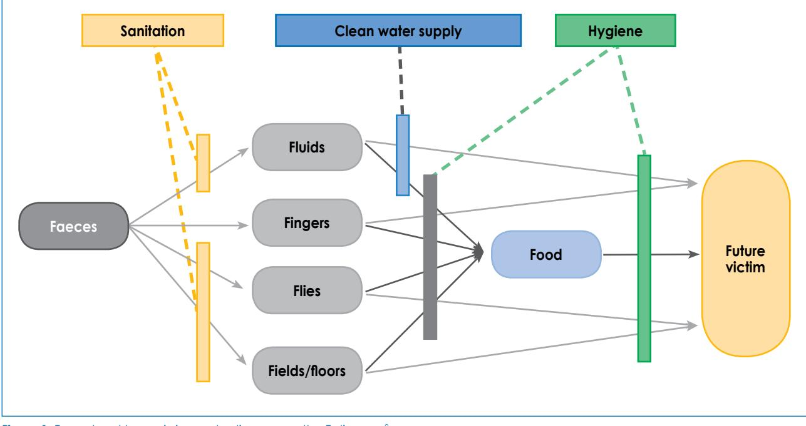

environment in which children live and play inside and outside the home has a large influence on children's exposure to gastrointestinal pathogens. Children may lack hygienic practices, and there may be random defecation prior to toilet training.10

Disease may also spread through close interpersonal contact with other children and adults. Flies carry disease, and are particularly attracted by pit latrine or bucket system toilets. Flies can transfer organisms from faeces to food by carrying them on their bodies, by vomiting on solid food in order to liquefy the food, and by defecating on food. The faeces and vomitus of the fly may contain viable infective organisms from human faeces. Barriers can effectively stop the transmission of disease. These can be primary, e.g. preventing initial contact with the faeces, or secondary, e.g. preventing it being ingested by a new person. Transmission can be controlled by water, sanitation and hygiene interventions.

#### **Water supply**

Clean water is essential for human survival. An adequate and safe water supply is needed for drinking, washing vegetables and fruit, preparing food and drinks, cleaning utensils and personal hygiene, especially hand washing. Water is a route of transmission of faecal material, both at the source and at the point of use. Safe water collected outside the house can become recontaminated in the home from contact with faecally contaminated hands or fingers, or storage in dirty or uncovered containers.11

Space constraints in low-income areas necessitate that water storage is mostly in the form of small containers. These are often kept open inside a dwelling, and are thus susceptible to faecal and other contamination.12 In some cases, water is collected from a contaminated source to begin with. In other cases, water is obtained from a source of high microbiological quality, including treated supplies that contain residual chlorine, but it becomes contaminated in the home because of inadequate and unsanitary storage conditions which facilitate the introduction or proliferation of disease-causing microbes. In either situation, the microbially contaminated water poses health risks that can be reduced by improved storage conditions and household treatment. By contrast, large containers are generally kept closed and outside the home, which is far safer with respect to contamination. In order to reduce the risk of microbial contamination, health professionals frequently advise sick individuals to boil water. However, various barriers, such as lack of social support, expense and maternal depression, are known to compromise the effectiveness of such barriers.13

In Tanzania, Pickering et al found that stored water contained between 1.4 and 1.8 times more faecal indicator bacteria material, which is used to indicate the presence of faeces in water and on hands, than the sources from which it was obtained.14 In the southeastern Free State, Jagals et al found that members of the case group living between 10 m and 100 m from their respective communal taps were exposed to higher total coliform counts in container-stored water, which could be attributed to the type of container used, as well as to the way water was fetched and stored in these containers.15 However, when water is freely available at close range, hand washing becomes more frequent.16 Households in rural and informal settlements have no access to basic water, and often share water points at a distance of approximately 200 m from the dwelling.17

## **Sanitation**

Adequate sanitation aims to prevent the spread of disease and promote health through safe and hygienic waste disposal. Good sanitation is essential for a safe and healthy childhood. It is very difficult to maintain good hygiene without water and toilets. Poor sanitation is associated with diarrhoea, cholera, malaria, bilharzia, worm infestations, eye infections and skin diseases. These illnesses compromise children's nutritional status. Using public toilets and open fields away from home can also put children in physical danger. The use of open areas and bucket toilets is also likely to have consequences on water quality in the area, and to contribute to the spread of disease.18

A wide gap exists between urban and informal settlements with regard to access to proper sanitation in Cape Town, as well as other urban settings in South Africa. Approximately 47 650 informal households have no access to toilets.19 Most of the people dispose of their faeces in near proximity to their houses because public toilets are far from their homes, a practice that is associated with a high incidence of diarrhoea in children. A study from Uganda found that the incidence of childhood diarrhoea was highest in households without any established toilet structure. It also showed that access to a private, covered pit latrine was associated with the greatest reduction in the incidence of diarrhoea in children.20 Two studies in Lesotho reported that water source and sanitation correlated with linear growth in children. In addition, latrine ownership was associated with a reduction in the risk of stunting. A field study of 230 Peruvian children younger than three years of age showed that improved water supply and sanitation may improve the linear growth of children.21 Children with the worst circumstances with regard to water source, storage and sanitation were one centimetre shorter and experienced 54% more diarrhoeal episodes than those children in optimal conditions.21 Inadequate water and sanitation correlated with increased diarrhoeal incidence, but was not associated with the duration of diarrhoea.22

#### **Hand washing and personal hygiene**

Hand washing with clean water and soap is one of the most effective and cheapest measures against gastrointestinal infection. Hand washing with ordinary non-antibacterial soap is much more effective in removing bacteria from hands than hand washing with water alone.23 In many low-income homes, household soap is costly and is often stored in places that are not easily accessible,24 while liquid soap and alcohol-based sanitisers are expensive for these communities.25 In fact, spaza shops stock soap and cut it into small blocks, since some households cannot afford to buy an entire bar. Soap plays an important role in the hand washing process, because it can effectively remove dirt and soil on surfaces and skin.26 Hand washing should be carried out after using the toilet in particular, after changing nappies, before expressing breast milk and before food preparation. However, it is important to continue practising hand washing before and after handling raw meat, poultry and fish products during food preparation to prevent cross-contamination, before serving, before eating, after coughing, blowing the nose and sneezing, as well as after handling unsanitary objects, such as garbage containers, and contact with toxic chemicals.27

In a systematic review of 17 studies, Curtis and Cairncross concluded that hand washing with soap plays an important role in preventing diarrhoeal disease, and that hand washing was also correlated with a reduced risk of severe outcome.28 In a study conducted in rural Bangladash, Luby et al29 concluded that household interventions which improve the presence of water and soap at a designated place for hand washing could improve hand washing behaviour. Generally, anecdotal evidence points to the fact that in South Africa, the further an individual has to walk to wash his or her hands after defecation or before preparing food, the more likely it is that he or she will be distracted by another activity.

## **The role of primary healthcare interventions in diarrhoea, and in morbidity and mortality**

#### **Rotavirus and oral rehydration therapy**

Rotavirus is the most common cause of severe dehydrating diarrhoea in infants worldwide.30 A review by Munos et al31 on the effectiveness of the rotavirus vaccine estimated that rotavirus vaccines were associated with a 74% reduction in very severe rotavirus infections, a 61% reduction in severe infections, and reduced rotavirusrelated hospital admission in young children of 47%.

In most cases, deaths due to diarrhoeal disease are caused by dehydration. Oral rehydration therapy involves the administration of appropriate fluids by mouth to prevent or correct dehydration that is the result of diarrhoea. This can be achieved at home using a salt-sugar solution, or by giving an adequate glucose-electrolyte solution called an oral rehydration solution by mouth. The salt-sugar solution and oral rehydration solution are the simplest, most effective and cheapest ways of keeping children alive during severe episodes of diarrhoea. The oral rehydration solution is absorbed in the small intestine, thus replacing the water and electrolytes lost.31

In a review of the efficacy and effectiveness of oral rehydration solution and recommended home fluids, Munos et al32 (WHO)45 concluded that the use of oral rehydration solution reduced diarrhoea-specific mortality by 69% and rates of treatment failure by 0.2%, mostly in developing countries.

### **Vitamin A and zinc supplementation**

The Scaling Up Nutrition framework recommends improved hygienic practices, vitamin A supplementation and therapeutic zinc treatment for the management of diarrhoea as key evidence-based direct nutrition interventions, to prevent and treat undernutrition in young children and their mothers.33 In their review of zinc supplementation for diarrhoea, Walker et al34 concluded that zinc administration for diarrhoea management significantly reduced all-cause mortality by 46% [relative risk (RR) 0.54, 95% confidence interval (CI): 0.32-0·88) and hospital admission by 23% (RR 0.77, 95% CI: 0.69-0.85). Zinc treatment resulted in a nonsignificant reduction in diarrhoea mortality of 66% (RR 0.34, 95 CI: 0.04-1.37), and diarrhoea prevalence of 19% (RR 0.81, 95% CI: 0.53-1.04).

Vitamin A deficiency compromises the immune system, which, in turn, increases the risk of disease, and even death, from diseases such as malaria, measles and diarrhoea. A Cochrane review of 43 randomised trials showed that vitamin A supplementation reduced all-cause mortality by 24%, and diarrhoea-related mortality by 28%, in children aged 6-59 months. Vitamin A supplementation also reduced the incidence of diarrhoea and measles in this age group.35

While the management of childhood illness focuses on treatment, the United Nations Children's Fund Integrated Management of Childhood Illnesses approach also provides the opportunity to emphasise the prevention of illness through education on the importance of rotavirus immunisation, ORT, micronutrient supplementation (zinc and vitamin A), breastfeeding and infant feeding.36

#### **Home sterilisation of water**

The practice of home purification of water is important in reducing diarrhoeal incidences. In the study entitled "An investigation into risk factors associated with the cholera epidemic in KwaZulu-Natal during 2000", knowledge and use of home water purification techniques was shown to be significantly associated with decreased diarrhoeal disease. Boiling and the use of sodium hypochlorite, (i.e. household bleach) were the most common techniques used.37

Methods for water purification include:38

- Bringing the water to a rolling boil, and then cooling it before consumption.
- Adding calcium hypochlorite, such as household bleach, to a bucket of water (one teaspoon or 5 ml in 25 l), mixing it thoroughly and allowing it to stand for at least 30 minutes prior to consumption. Turbid water should be clarified by settling and/or filtration before disinfection.
- Vigorously shaking small volumes of water in a clean transparent container, such as that used for a soft drink, for 20 seconds, and exposing to it to sunlight for a least six hours.

The most common techniques used to purify water that has been contaminated at the source include boiling and the use of sodium hypochloride (i.e. household bleach). However, boiling water requires energy from fire wood, electricity, paraffin or gas. These sources of energy are expensive for the majority of the people in rural areas, and can be economically and environmentally unsustainable. Household bleach is inexpensive. However, it may contain impurities and additives that may be harmful if ingested. Using too much bleach may result in an unpleasant taste that may discourage use.39 Therefore, standard concentrations of household bleach should be monitored at manufacturing and distribution points to ensure consumer safety.

#### **Infant and young child feeding**

Table II provides guidance on how to maintain good hygiene during exclusive breastfeeding and expressing milk for infants.

The WHO recommends five key steps for food safety. South Africa has adopted these: 41

- Keep clean by washing the hands, surfaces and equipment used in food preparation, washing cutting boards (as pathogens are carried on the hands), and wiping cloths and utensils. Protect kitchen areas and food from insects, pests and other animals, as they can also transfer pathogens.
- Separate raw and cooked food, such as raw meat, fish and chicken, which may contain gastrointestinal

pathogens which can be transferred to other food during preparation and storage.

- Cook food thoroughly at a minimum of 70°C to ensure that it is safe for consumption.
- Keep food at a safe temperature. Pathogens can multiply very quickly if food is stored at room temperature. Therefore, timeously refrigerate cooked and perishable food, preferably < 5°C, and keep cooked food hot (> 60°C) before serving.
- Use safe water and raw materials. Use safe water to wash vegetables and fruit, and for drinking and food preparation.

However, two extra keys steps can be included:

- Prepare fresh food for infants and young children, and give it to them immediately after preparation, when it is cool enough to eat. Food that is prepared for infants and young children should not be stored at all.
- Cooking food reduces the number of microorganisms and inhibits the growth of moulds, yeasts, and bacteria which promote decay and infection. However, when food is allowed to stand at high ambient temperatures after being cooked, the multiplication of pathogenic bacteria is promoted.42 Therefore, before feeding, stored food should be reheated thoroughly. Again, this means that all parts of the foods must reach at least 70°C, i.e. it should not boil. When available, microwave ovens can be used to heat food, as they use less energy than an electrical plate and comparatively little time.

## **Food labelling and date marking**

When selecting food, mothers and caregivers should pay attention to information that is provided on food labels in South Africa. When functional literacy is low, the terms can appear to be abstract, and so the health professional might need to take the time to educate mothers and caregivers to especially date marking.43

#### **Table II:** Hygiene and feeding40

| Exclusive breastfeeding                                                                                           | Expressing                                                                                                                                   |  |  |  |
|-------------------------------------------------------------------------------------------------------------------|----------------------------------------------------------------------------------------------------------------------------------------------|--|--|--|
| • Wash your hands with soap and water before breastfeeding • Wash your breasts with plain water daily | • Wash your hands with soap and water before expressing • Use clean containers to collect and store the expressed breast milk |  |  |  |
| General                                                                                                           |                                                                                                                                              |  |  |  |
|                                                                                                                   |                                                                                                                                              |  |  |  |

- Clean the cups and utensils
- Wash the feeding cups and expressing utensils with water and soap
- Use a soft brush or cloth to remove milk that is left in the containers
- Rinse everything in fresh hot water
- Cover the equipment with a clean cloth to keep insects and dust off it
- Only remove the equipment from under the cloth when you need to sterilise it

It is mandatory, based on the Regulations Relating to the Labelling and Advertising of Foodstuffs, for almost all food labels, with a few exceptions, to provide a "best before" and/or "use by" and/or "sell by" date on the product, depending on its nature.43 The date marking is determined by the manufacturer, based on the time during which the food product will remain safe, retain the desired sensory, chemical, physical and microbiological characteristics, and comply with any label declaration of nutritional data, such as that pertaining to nutrient content claims. The term "use by" is generally used for perishable food products, such as fresh milk, meat, fish and eggs, after which the microbiological stability, and thus food safety, is questionable. Therefore, it is not recommended that food which is past its "use by" date is given to children, especially if they are immunocompromised. A "best before" date signifies the date after which the food will not have the quality attributes that are normally expected, such as flavour and texture, although the product may be perfectly satisfactory and safe to eat, especially if it has been kept under the recommended storage conditions. This date pertains to quality, not safety, and is usually applied to food with a long shelf life. The "sell by" date is a tool for the store that sells the product to know for how long it can continue to sell the item. Therefore, often a product will contain a "sell by" and a "use by" or "best before" date. Mothers and caregivers should not purchase products that have extended beyond their "sell by" date. Date marking is now also required for donated foods.43

## **The water and sanitation needs of people living with HIV/AIDS**

South Africa has the highest number of people infected with HIV in the world.44 Clean water is crucial to maintain the quality of life of PLWHA, and for the success of home-based care of PLWHA. AIDS is not a water-related disease. HIV is not spread via contaminated water or poor hygiene. Safe drinking water is necessary to take medicine, and nearby latrines make life more tolerable for weak patients. Finally, water is needed to keep the house environment and latrine clean in order to reduce the risk of opportunistic infections.38

Diarrhoeal diseases are the most common opportunistic infections experienced by PLWHA in Africa and elsewhere. Most of these diarrhoeal opportunistic infections are water-borne or water-washed, and cause significant loss of functional days (missed work and school days) and loss of income, considerable human suffering, increased burden on caregivers, the weakening of general health, and eventually death. Diarrhoeal diseases also reduce the absorption of antiretroviral medicines and essential nutrients.45

Water, sanitation and hygiene practices, such as hand washing and water treatment and safe storage, have all been proven to reduce the rate of diarrhoea by 30-40%.36,46,47 Water quality and supply, sanitation and hygiene practices also help to prevent caregivers and other household members from contracting water-related diarrhoeal diseases. A healthier and stronger household is more economically viable and resilient in the face of HIV challenges.

PLWHA have compromised immune systems, making them more susceptible to opportunistic infections, such as diarrhoea and skin diseases. For example, diarrhoeal rates are 2-6 times higher in PLWHA than in those who are not infected, and the rate of acute and persistent diarrhoea is twice as high in populations of PLWHA as it is in uninfected populations.48 Infections reduce the quality of life of people living with HIV, and can speed the progression from HIV to AIDS.

Therefore, PLWHA and households that are affected by HIV and AIDS have a substantially greater need for access to water and sanitation. Evidence indicates that HIVaffected households require more than the 20 l of water per capita daily,49 including 1.5 l of safe water required to take medication. Women in southern Africa require 24 buckets of water a day to wash people living with AIDS, as well as the clothing, bedding and the house, especially during bouts of extreme diarrhoea.50 A study from South Africa by Kgalushi et al51 surveyed home-based caregivers who estimated a need for 200 l of water daily, a figure that included water that is necessary for income-generating activities and food production. A case study by the Mvula Trust in the Limpopo province in South Africa showed that as a result of public water services breaking down or not being properly managed, residents with already weak immune systems were forced to revert to unprotected water sources. When infants who are born to HIV-positive mothers are not breastfed, a safe water source must be used to mix formula for the babies. Such infants are at greater risk of dying from diarrhoeal diseases. In the first two months, a child who receives replacement feeding is six times more likely to die than a breastfed child. 52,53

### **Health education and promotion**

#### **Health education**

The importance of immunisation with rotavirus vaccine and breastfeeding in preventing diarrhoea and other diseases has been recognised by public health authorities. However, no attention has been paid to safe food handling during the preparation and feeding of complementary foods. If there is to be a substantial improvement in the prevention of diarrhoeal diseases in infants and children, the education of mothers and caregivers on food safety principles is important. Most primary health centres already advise mothers about breastfeeding, cup feeding, infant feeding and nutrition, as well as other aspects of care of infants and children. Health workers should demonstrate how to express breast milk safely by hand, and how to feed infants with a cup, ideally on a one-to-one basis. The role of primary healthcare facilities in managing diarrhoea through ORT "corners" (i.e. designated spaces in clinics) can reduce diarrhoeal disease deaths in children under five years. For example, the Western Cape Department of Health managed to achieve a 90% reduction in diarrhoeal disease-related, in-hospital deaths of children under five in 2011, compared to 2010, in the metro. The department developed strategies and interventions, in collaboration with the City of Cape Town and community-based health organisations, to deal with the seasonal rise of diarrhoea, especially in areas where water and sanitation facilities are shared.54

These interventions at primary healthcare facilities include:

- A rapid triage of children on entry into a primary healthcare facility.
- Well-situated and functional ORT corners.
- Skilled clinicians and staff who are deployed to manage diarrhoea cases.

The ORT corners are simple areas in the emergency centre where children who are dehydrated or are unable to drink enough fluid are given a trial of oral rehydration solution. The parent gives small amounts of fluid frequently to the child, while the health worker monitors whether adequate fluid is being consumed, and that the correct technique is being used by the parent. This is also an ideal place in which to convey key messages on how to make a home oral rehydration solution (the sugar-salt solution) and diarrhoea management. The salt-sugar solution is a mixture of eight teaspoons of sugar and half a teaspoon of salt in one litre of clean water.55 It is important that primary healthcare centres extend their education to include information on safe food handling practices,24 domestic hygiene and hand washing during antenatal and postnatal visits.

## **Health promotion**

The education of households and consumers in food safety and hygiene in communities should involve primary healthcare workers, home-based care workers, nongovernmental organisations (NGOs), government departments and the private sector. Educating and informing mothers in the community plays a key role in the promotion of safe complementary food and the prevention of diarrhoea in infants and young children. Other modes of food safety and hygiene education are via pamphlets or televison.24 Some innovative means of educating with entertainment, known as "edutainment", have been used by Soul City entertainment education. Entertainment education "is the process of purposely designing and implementing a media message to both entertain and educate, in order to increase audience members' knowledge of an educational issue, create favourable attitudes, shift social norms and change overt behaviour".56 The Soul City Institute for Health and Development Communication is an NGO that was established in 1992 to "harness the mass media when promoting health". The Soul City initiative shares health messages, including how to address diarrhoea, through soap operas.

Clearly, the above measures are valuable, but haven't solved the problem sufficiently, given mortality rates. Thus, innovative strategies need to be sought, such as the development of a training manual to inform health workers, training on its application, and advising on how the information can be adapted according to specific cultural and geographical settings. Ideally, a "diarrhoea corner" should be created in healthcare facilities to provide focused education. The role of consumer education, using pamphlets in point-of-sale settings, could also be tested. However, the education of children in schools should be a priority.

## **Child care and early learning centres**

Staff in all child care facilities should be trained in hygiene and food safety regulations. Environmental health practitioners need to regularly visit these centres, including formal and informal crèches, to educate staff and inspect the facilities. Day care staff must teach children personal hygiene, especially hand washing. Ideally, school health programmes should be provided by authorities to monitor child care centres, where primary healthcare workers are trained to check on the immunisation status and development of the children.57

## **Policy and advocacy**

Food safety and hygiene play a role in preventing infectious disease and food-borne illness, especially in children. However, relatively low priority is given to these issues in the public health agenda of many developing countries. Advocacy on issues such as water, sanitation, hygiene and food safety can help to improve child health. This can be achieved by creating a platform for dialogue among stakeholders, collecting and disseminating relevant data and literature in a readily understandable form that targets audiences, monitoring policies and the law-making process on food safety and hygiene, and public awareness and education.58,59

### **Local level responses**

In some parts of South Africa, the management of water treatment plants has either collapsed or is poorly controlled. In many instances, this can be attributed to a high turnover of staff or a lack of capacity at local and provincial level. This applies to other significant aspects of service delivery, such as refuse removal. The control of dogs and rodents scavenging in bins has become overwhelming for both the authorities and the public. Constucting and clearing storm water drains and other forms of drainage is highly problematic in areas where there is very rapid development, as well as in informal settlements. This can lead to contaminated bodies of water in which children play, and where water is accessed for domestic use or the irrigation of crops.

In South Africa, studies have found that water from municipal sources is of good microbial quality, but the water quality deteriorates significantly after handling and storage, in both case and control households in a study conducted in Khayelitsha.60 Safe water from municipal sources can become recontaminated in the home because of contact with faecally tainted hands or fingers, or storage in dirty uncovered containers. Education on hand washing, before handling water and using water storage containers with a small opening of 5-8 cm in diameter, is important to prevent recontamination.

Contamination mainly occurs at source in the rural areas. A study in Venda found that water from the Khandanama River and two water storage tanks was of poor microbial quality when compared to that recommended in the South African drinking water quality guidelines.61,62 Momba et al63 also reported that rural water treatment plants are still failing to produce safe drinking water in the Eastern Cape.

## **Conclusion**

Ideally, general awareness of hygiene should be created and constantly reinforced in various ways, from the time that young children can understand simple instructions, throughout childhood and adolescence, and into adulthood. Each generation must become mutually supportive of the next. It is also important that children's mothers or caregivers are educated on the importance of hygiene, as they will be responsible for teaching children its importance. Mothers and caregivers must wash their hands before feeding children and preparing food. Hand washing with soap is the most effective way of reducing diarrhoeal disease. It is worth mentioning that hand washing with water alone also reduces the prevalence of diarrhoeal disease.29 It is proposed that the following message is tested and included in the food-based dietary guidelines for infants and young children: "Hands should be washed with clean water and soap before preparing, feeding or eating, and after going to the toilet".

## **References**

- 1. National Department of Health. South Africa's national strategic plan for a campaign on accelerated reduction of maternal and child mortality in Africa. Pretoria: Department of Health; 2011.
- 2. Bradshaw D, Nannan N, Laubsher R, et al. South African Burden of Disease Study: estimates of provincial mortality Western Cape Province, 2000. Cape Town: Medical Research Council; 2004.
- 3. Sanders D, Bradshaw D, Ngongo N. The status of child health in South Africa. In: Kibel MLL, Pendlebury S, Smith C, editors. South Africa child gauge. Cape Town: University of Cape Town, Children's Institute, 2010; p. 29-40.
- 4. ASSA 2000 AIDS and demographic model. Actuarial Society of South Africa AIDS Committee; 2002.
- 5. Guidelines for human settlement planning and design. Pretoria: Council for Scientific and Industrial Research; 2005.
- 6. Hall K, Marera D-H. Children's access to basic services. In: Kibel MLL, Pendlebury S, Smith C, editors. South Africa child gauge. Cape Town: University of Cape Town: Children's Institute, 2010; p. 130-134.
- 7. Statistics South Africa. General household survey. Statistics South Africa; 2005.
- 8. Keusch GT, Fontaine O, Bhargava A. Disease control priorities in developing countries. Diarrheal diseases. 2nd ed. New York: Oxford University Press, 2006; p. 372-387.
- 9. Wagner EG, Lanoix JN. Excreta disposal for rural areas and small communities. Geneva: World Health Organization; 1958.
- 10. Pickering LK. The day care center diarrhea dilemma. Am J Public Health. 1986;76(6):623-624.
- 11. Sobsey MD. Managing water in the home: accelerated health gains from improved water supply. Geneva: World Health Organization; 2002.
- 12. Duse AG, da Silva MP, Zietsman I. Coping with hygiene in South Africa, a water scarce country. Int J Environ Health Res. 2003;13 Suppl 1:S95-S105.
- 13. Joubert G, Jagals P, Theron, L. Water-related household practices in section K, Botshabelo, and associations with diarrhoea. S Afr J Epidemiol Infec. 2003;19:13-19.
- 14. Pickering AJ, Davis J, Walters SP, et al. Hands, water, and health: fecal contamination in Tanzanian communities with improved, nonnetworked water supplies. Environ Sci Technol. 2010;44(9):3267-3272.
- 15. Jagals P, Nala NP, Bokako TC, Genthe B. An assessment of the link between stored water quality and the occurrence of diarrhoea in an urban community: a community case-control study. eWISA [homepage on the Internet]. 2000. c2013. Available from: http://www. ewisa.co.za/literature/files/221nala.pdf
- 16. Cairncross S. More water: better health. People Planet. 1997;6(3):10-11.
- 17. Thomas EP, Seager JR, Viljoen E, Potgieter, et al. Household environment and health in Port Elizabeth, South Africa. Cape Town: Medical Research Council; 1999.
- 18. Hall K. Housing and services: access to basic sanitation [homepage on the Internet]. 2010. c2013. Available from: http://www.childrencount. ci.org.za/indicator.php?id=3&indicator=42
- 19. Goldberg K, Kula, S, Mhlalisi M, et al. The water dialogues: Cape Town case study. Cape Town: The Water Dialogues; 2009.
- 20. Kasirye I. Household environmental conditions and disease prevalence in Uganda: the impact of access to safe water and improved sanitation on diarrhea. International Development Research Center [homepage on the Internet]. 2010. c2013. Available from: http://hdl. handle.net/10625/43094