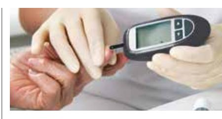

Management of

# type 2 diabetes in adults

## *AT PRIMARY CARE LEVEL - JANUARY 2014*

A Long and Healthy Life for All South Africans

# Foreword by the Minister

Diabetes is a major public health problem. The rising incidence of Diabetes Type 2 is related to the effects of urbanization and unhealthy lifestyles. Research studies show that healthy eating and regular physical activity can prevent or delay the onset of Diabetes Type 2, even in high-risk individuals.

Early detection and effective management may be associated with a normal lifespan and quality of life. Lifestyle modification, behavioural change, team decision-making and self-care will aid every individual with diabetes to manage his/her condition and prevent deterioration and complications.

The implementation of this updated guideline, as one of the tools available to manage diabetes, will, with the cooperation of the patients and relevant health professionals, achieve the reduction of complications of diabetes and the reduction of premature mortality from diabetes. The guideline is an integral part of the Diabetes Implementation Strategy for South Africa, which was developed in response to the African Diabetes Declaration and Strategy.

Health professionals should acquire the relevant knowledge, skills and attitudes needed for successful management of diabetes, so that patients can be empowered with the necessary information and skills. Support from family, friends, community and health professionals is encouraged.

I would like to thank all the role players who have given many hours of their time to the development of this guideline. This collaborative effort, involving experts in various fields, has resulted in a single guideline being available in South Africa.

\_\_\_\_\_\_\_\_\_\_\_\_\_\_\_\_\_\_\_

Dr A Motsoaledi (MP) Minister of Health

# Statement by the Deputy Minister

The effective implementation of this diabetes guideline will support the Negotiated Service Delivery Agreement objectives of 'increasing life expectancy' and 'decreasing maternal mortality'.

This guideline will also support the achievement of some of the ambitious targets that have been set by the department, towards reducing the burden of non-communicable diseases by 2020. These targets arose from the Non-Communicable Diseases Summit held in September 2011.

Prevention, screening, diagnosis, non-pharmacological and pharmacological management are included, as well as prevention and management of complications and emergencies.

Persons diagnosed with diabetes, will receive comprehensive diabetes care, and will enter into a partnership with the relevant health professionals so that they may live well and healthy into old age.

\_\_\_\_\_\_\_\_\_\_\_\_\_\_\_\_\_

Dr G Ramokgopa Deputy Minister: Health

3

# Acknowledgements by the Director General

It is with very sincere appreciation that I acknowledge, on behalf of the Department of Health, the roles played by the various experts in the development of this collaborative national guideline, Updated Management of type 2 diabetes in Adults at Primary Care Level.

Particular thanks are due to the members of the SEMDSA Steering Committee and the Advisory Committee, who were representing their respective organisations. Their contributions and comments gave rise to vociferous debate with ultimate agreement.

The leadership provided by The Society for Endocrinology, Metabolism and Diabetes for South Africa was invaluable.

Thank you, one and all.

\_\_\_\_\_\_\_\_\_\_\_\_\_\_\_\_\_\_\_

Ms MP Matsoso Director-General: Health

This document was compiled by Directorate: Chronic Diseases, Disabilities and Geriatrics, National Department of Health.

ISBN: 978-1-920031-21-3

# TABLE OF CONTENTS

| Statement by the Deputy Minister 2            |  |
|-----------------------------------------------|--|
| Acknowledgements by the Director General 3 |  |
| Abbreviations 6                               |  |
| Introduction 6                                |  |
| Goals at PHC level  8                         |  |
| Scope of the Policy guidelines 8              |  |

Foreword by the Minister.......................... 1

**A. DEFINITION, SYMPTOMS, DIAGNOSIS, SCREENING, ORGANIZATION OF DIABETES CARE...................9**

|   | Definition of diabetes mellitus 9                        |  |
|---|----------------------------------------------------------|--|
|   | Symptoms 9                                               |  |
|   | Diagnosis10                                              |  |
|   | Screening for early detection11                          |  |
|   | Organization of diabetes care 12                         |  |
| - | Requirements at Clinic level for a diabetes service12 |  |

- Schedule of visits to a diabetes clinic...............................................................14

| B. MANAGEMENT OF BLOOD          |  |
|---------------------------------|--|
| GLUCOSE  17                     |  |
|                                 |  |
| Targets for glycaemic control17 |  |
| Glycaemic management18          |  |
| - Non-pharmacological 18     |  |
| - Pharmacological 18         |  |
| Self monitoring of blood        |  |
| glucose (SMBG) 22               |  |
| "Sick days"23                   |  |
| Follow-up 24                    |  |
| Referrals24                     |  |
| Hypoglycaemia25                 |  |
| Hyperglycaemic emergencies27    |  |
| - DKA 27                     |  |
| - HHS27                      |  |
|                                 |  |

**C. MANAGEMENT OF COMORBIDITIES AND COMPLICATIONS IN PATIENTS WITH DIABETES ...................... 30**

| Obesity30                                  |  |
|--------------------------------------------|--|
| Cardiovascular risk and dyslipidaemia31 |  |
| Aspirin therapy35                          |  |
| Hypertension 35                            |  |
| Chronic Kidney Disease (CKD) 36            |  |
| Retinopathy38                              |  |
| Feet40                                     |  |

#### **D. DIABETES CARE IN SPECIFIC POPULATIONS ........................ 44**

| Pregnancy 44                       |
|------------------------------------|
| Family planning and                |
| pre-conception care46              |
| Older Persons46                    |
| High risk ethnic groups47          |
| HIV48                              |
| Fasting50                          |
| High risk individuals – prevention |
| and delay of type 2 diabetes52     |
| Driving53                          |
| Tuberculosis55                     |
| Periodontal (gum) disease56        |
| Rehabilitation56                   |
| REFERENCES  57                     |
| ACKNOWLEDGEMENTS  59               |

#### **List of Algorithms, Figure and Tables**

| Algorithm 1:                                                                                                                              |
|-------------------------------------------------------------------------------------------------------------------------------------------|
| Non-insulin and insulin therapy19                                                                                                         |
| Algorithm 2: Statin therapy34                                                                                                             |
| Figure 1: Progression of classic diabetic nephropathy 37                                                                               |
| Table 1: Criteria for the diagnosis of diabetes and categories of intermediate hyperglycaemia 10                                    |
| Table 2: Use of HbA1c in the diagnosis of diabetes mellitus10                                                                          |
| Table 3: Criteria for screening for type 2 diabetes in asymptomatic adults12                                                        |
| Table 4: Patient history, physical examination, biochemistry and other activities recommended for visits to a diabetes clinic 14 |
| Table 5: Monitoring of patients with diabetes and frequency of tests15                                                              |
| Table 6: Targets for fasting plasma glucose, post-prandial glucose, HbA1c in different patient types17                              |
| Table 7: Differentiation between the types of hyperglycaemic coma 29                                                                   |
| Table 8: CVD risk factors and targets for patients with type 2 diabetes32                                                           |

| Table 9: Harmonised criteria for the                           |  |
|----------------------------------------------------------------|--|
| clinical diagnosis of the metabolic                            |  |
| syndrome 33                                                    |  |
| Table 10: Ideal lipid profile for a patient with diabetes33 |  |
| Table 11: Risk categorisation system for diabetic feet42    |  |
| Table 12: Targets for control in                               |  |
| older persons 46                                               |  |

#### **Annexures**

| Annexure A1 Diabetes Education60                                   |
|-----------------------------------------------------------------------|
| Annexure A2 Lifestyle Modification62                               |
| Annexure B General Principles for Foot Care65                      |
| Annexure C1 Foot Screening Assessment Form 66                      |
| Annexure C2 Rapid screening for diabetic neuropathy67           |
| Annexure D Clinic structure69                                      |
| Annexure E Glycated haemoglobin70                                  |
| Annexure F A guide to patient adherence in chronic conditions71 |

# ABBREVIATIONS

| CKD – chronic kidney disease                  | LDLC – low-density lipoprotein cholesterol |
|-----------------------------------------------|--------------------------------------------|
| CVD – cardiovascular disease                  | MAX – maximum                              |
| CSR – Cataract Surgery Rate                   | MI – myocardial infarction                 |
| DBP – diastolic blood pressure                | OGTT – oral glucose tolerance test         |
| eGFR – estimated Glomerular Filtration Rate   | PAD – peripheral artery disease            |
| FPG - Fasting plasma glucose                  | -ve – negative                             |
| GDM – gestational diabetes mellitus           | +ve – positive                             |
| HbA1c – glycosylated haemoglobin              | RPG - Random plasma glucose                |
| HCT – hydrocholorothiazide                    | SBP – systolic blood pressure              |
| HDLC – High-density lipoprotein cholesterol   | SMBG – self monitoring of blood glucose    |
| hr – hour                                     | TC – total cholesterol                     |
| HAART – Highly Active Anti-Retroviral Therapy | TG – triglycerides                         |
| IFG – Impaired Fasting Glucose                | WHO – World Health Organization            |
| IGT – Impaired Glucose Tolerance              |                                            |
|                                               |                                            |

- kg kilogram
- K+ potassium

# INTRODUCTION 1,2

Diabetes Mellitus is a major public health problem, with Type 2 diabetes accounting for more than 90% of diabetes cases. The insidious and initially asymptomatic nature of the disease results in persons not seeking early medical attention, so that 30-85% of cases of type 2 diabetes are undiagnosed. At eventual diagnosis, approximately 20% of patients will have complications of the disease.

The conservative South African estimate is that 6.5% of adults aged 20-79 years have diabetes. The effects of urbanisation and an unhealthy lifestyle are important contributors to the rising prevalence of obesity and diabetes. The 2003 South Africa Demographic and Health Survey showed that 55% of women and 30% of men, aged 15 years and older, are overweight or obese.

Effective prevention of obesity and type 2 diabetes requires a paradigm shift from a patient-centred approach to a "whole of government" and a "whole of society" approach. Hence, government departments such as Agriculture, Trade and Industry, Sport and Recreation, Basic Education amongst others, together with non-governmental organizations, need to join forces with Health in preventing and combating diabetes. Collaborating partners must effectively work together at all levels of service delivery.

It is imperative that focused screening of high-risk persons be introduced, to improve the rate of early detection, thereby reducing late entry - with established long-term complications - into the health system.

6

Early, good control of glycaemia, blood pressure and dyslipidaemia, together with regular examinations for micro- and macrovascular complications, with appropriate and timely interventions, is the only way to prevent or reduce morbidity and mortality.

Well organized clinics, with staff suitably trained in diabetes care using effective protocols and appropriate tools (SA Diabetes Declaration Implementation Strategy; Long-term care model Implementation Plan; National Guideline: Non-Communicable Diseases: A Strategic Vision, Chronic Diseases Indicators and Records) together with these updated guidelines, will facilitate improved quality of diabetes care. Appropriate monitoring of the application of the available tools, together with effective Clinic management and treatment management, will result in increased numbers of patients with controlled diabetes and a consequent reduction in numbers of complications.

Many individuals may present with the characteristic symptoms of diabetes (thirst, polyuria (frequent urination), weight loss and blurring of vision) but some individuals, especially older persons, may be asymptomatic. The **acute complications** of diabetes are hypoglycaemia [usually as a complication of therapy] and uncontrolled hyperglycaemia [due to improper management and/or patient non-adherence], whilst the **long-term relatively specific** effects of diabetes include the development of retinopathy, nephropathy and neuropathy.

People with diabetes are also at increased risk of other diseases, including cardiac, peripheral arterial and cerebrovascular disease.

The metabolic syndrome - abdominal obesity, elevated serum triglycerides, low HDL-cholesterol, hypertension, elevated fasting blood glucose level - increases the risk of developing diabetes approximately 5-fold and doubles the risk of atherosclerotic cardiovascular disease.

Diabetes, regardless of its aetiology, progresses through several clinical stages during its natural history. The spectrum of glucose tolerance extends from normoglycaemia, to intermediate hyperglycaemia (impaired fasting glucose [IFG] and impaired glucose tolerance [IGT]) to diabetes.

#### **IFG and IGT are high-risk states for developing diabetes.**

Patient education is imperative - an informed patient can make informed decisions regarding his/her diabetes management and will remind the health professional of the various tests that should be performed during her/his visit to the health facility.

All health professionals (including Health Promoters and Community Health Workers, lay health workers, and traditional and complementary healers) should promote healthy living and know the common risk factors for developing non-communicable diseases (NCDs) and cancers; they should also know and recognize the symptoms of diabetes, so that suitable referral pathways are established and utilized to achieve early detection and management.

Notwithstanding the responsibilities of government, it is extremely important to note that all patients have obligations to themselves, their families and friends, and to the health system in terms of maintaining their health at acceptable levels. Required actions would include lifestyle modification, adherence to mutually agreed chronic illness management plans and prescribed medication, and responsible self-management with the support of various health professionals.

# GOALS AT PRIMARY HEALTH CARE LEVEL

- • education of patients on healthy lifestyle issues including nutrition, physical activity and weight control
- • effective screening for diabetes with early detection and correct diagnosis
- • education of patients, families and health care workers, about diabetes
- • appropriate treatment for, and management of all persons with diabetes
- • ensuring the permanent availability of oral anti-diabetic agents, insulin, syringes and other disposables, and other medication
- • patient self-monitoring to achieve glycaemic control, using appropriate technology and instruction in its use
- • prevention, detection and management of complications
- • regular oral health promotion and routine oral screening to prevent oral disease, with appropriate referral to oral hygienists for preventive treatment and to dentists for periodontal treatment
- • appropriate referral to a higher level of care, and return referral, as required
- • appropriate maintenance of patient records and medical history
- • regular assessment of effectiveness of services for diabetic patients
- • regular assessment of patient's chronic illness coping skills
- • patient planning of pregnancies.

# SCOPE OF THE POLICY GUIDELINES

## **Target population**

#### **Primary target:**

- • Adults with Type 2 diabetes
- • Family members/care givers of above
- • All health professionals at PHC level
- • Persons at high risk of developing Type 2 diabetes

#### **Secondary target:**

- • Health professionals at other levels of care
- • Provincial, District and Facility Managers and NCD Managers

# A. DEFINITION, SYMPTOMS, DIAGNOSIS, SCREENING, ORGANIZATION OF DIABETES CARE

#### **DEFINITION OF DIABETES MELLITUS 2,3,4,5,6**

Diabetes mellitus (diabetes) is a metabolic disorder with heterogenous aetiologies, which is characterized by chronic hyperglycaemia and disturbances of carbohydrate, fat and protein metabolism resulting from defects in insulin secretion, insulin action or both.

Several pathogenic processes are involved in the development of diabetes. These include processes that impair or destroy the function of the pancreatic beta cells, with consequent *insulin deficiency*, and others that result in resistance to insulin action (*insulin resistance/insulin insensitivity).* The abnormalities of carbohydrate, fat and protein metabolism are due to deficient action of insulin on target tissues resulting from insensitivity or lack of insulin or both.

#### **SYMPTOMS of diabetes**

| Characteristic symptoms: | polydipsia, polyuria, weight loss              |
|--------------------------|------------------------------------------------|
| Other symptoms:          | blurring of vision                             |
|                          | general body weakness and lethargy             |
|                          | susceptibility to infections, especially skin, |
|                          | urogenital tract and respiratory tract         |
|                          | pruritus vulvae                                |
|                          | poor wound healing                             |

Symptoms may not be severe, or may be absent.

#### 10**DIAGNOSIS OF DIABETES AND OTHER CATEGORIES OF INTERMEDIATE GLYCAEMIA 2,3,4,5,6**

For clinical purposes, the diagnosis of diabetes should always be confirmed by repeating the same test on another day.

The diagnosis of diabetes should be based on formal laboratory test results (not point of care tests) prior to the initiation of any therapy.

#### *Table 1 Criteria for the diagnosis of diabetes and categories of intermediate hyperglycaemia*

| Diagnostic test                                                                     | Impaired Fasting Glucose (IFG) | Impaired Glucose Tolerance (IGT) | Diabetes                                                                                         |
|-------------------------------------------------------------------------------------|-----------------------------------|-------------------------------------|--------------------------------------------------------------------------------------------------|
| Random plasma glucose (RPG) i                                                    | –                                 | –                                   | ≥ 11.1 mmol/L if classic symptoms of diabetes or hyperglycaemic crisisii is present; or |
| Fasting plasma glucose (FPG) iii                                                 | 6.1 – 6.9 mmol/L                  | < 7.0 mmol/L (if measured)       | ≥ 7.0 mmol/L; or                                                                                 |
| Two-hour plasma glucose (2-h PG) during oral glucose tolerance test (OGTT) iv | < 7.8 mmol/L (if measured)     | 7.8 – 11.0 mmol/L                   | ≥ 11.1 mmol/L; or                                                                                |
| Glycated haemoglobin A1c (HbA1c) v                                               | –                                 | –                                   | > 6.5%                                                                                           |

Random (casual) – any time of day without regard to time of last meal. ii Hyperglycaemic crisis - refers to diabetic ketoacidosis or hyperosmolar non-ketotic hyperglycaemia iii Fasting - no caloric intake for at least 8 hours iv OGTT - as per WHO recommendation using a glucose load of 75g anhydrous glucose (or 90g monohydrous glucose) dissolved in 250ml water, ingested over 5 minutes v

HbA1c – provided the test method meets stringent quality assurance, that the assay is standardized according to criteria aligned with the international reference values [National Glycohemoglobin Standardization Program (NGSP) – certified and standardized to the Diabetes Control and Complications Trial (DCCT) assay], and that there are no conditions present which preclude its accurate measurement.

#### *Table 2 Use of HbA1c in the diagnosis of diabetes mellitus*

| Diagnosis of diabetes                                                                    | • HbA1c > 6.5% • HbA1c < 6.5% does not exclude diagnosis by blood glucose • Glucose-based tests (FPG, OGTT) are still valid                                                                                                                                                                                               |  |  |
|------------------------------------------------------------------------------------------|------------------------------------------------------------------------------------------------------------------------------------------------------------------------------------------------------------------------------------------------------------------------------------------------------------------------------------------|--|--|
| Interpretation of HbA1c < 6.5%                                                        | • No recommendation because of insufficient evidence                                                                                                                                                                                                                                                                                  |  |  |
| Provisos for use of HbA1c for diagnosis                                               | • Stringent quality assurance tests in place • Assays standardized to criteria aligned with international reference values • Low cost and wide availability • No conditions present which preclude accurate measurement                                                                                             |  |  |
| Choice between HbA1c and plasma glucose should be based on local considerations | • Cost • Availability of equipment • National quality assurance system • Population characteristics (prevalence of malaria or haemoglobinopathies) • Accurate blood glucose measurement must generally be available at primary health care level before introducing HbA1c measurement as a diagnostic tool |  |  |

#### **1. Diagnosis in symptomatic individuals and unequivocal hyperglycaemia (Table 1)**

In patients with symptoms of diabetes (polyuria, polydipsia, weight loss) or unequivocal hyperglycaemia (i.e. hyperglycaemic crisis: diabetic ketoacidosis or hyperosmolar non-ketotic hyperglycaemia) – a single abnormal test is sufficient to confirm the diagnosis of diabetes.

i

**However**, even severe hyperglycaemia detected under conditions of acute infective, traumatic, cardiovascular or other stress, may be transitory and should not be regarded as diagnostic of diabetes until subsequently confirmed.

#### **2. Diagnosis in asymptomatic individuals or doubtful hyperglycaemia and high risk individuals**

• Fasting plasma glucose ≥ 7.0 mmol/L

#### **OR**

• 2-h plasma glucose ≥ 11.1 mmol/L during 75 g OGTT

A 75g OGTT is indicated in the following circumstances:

- High-risk individuals (refer Table 3 below)
- If at initial testing

FPG: 5.6 - 6.9 mmol/l

RPG: 5.6 - 11.0 mmol/l (testing for FPG instead of OGTT also acceptable

Diagnosis will be more difficult in asymptomatic persons or persons about whom there is doubt about the presence of persistent hyperglycaemia – a single abnormal test result may not be used to diagnose diabetes. The same test must be repeated on another day to confirm diagnosis. Two abnormal results, using the same test method, will confirm the diagnosis of diabetes.

#### **REFER Annexure E – Glycated Haemoglobin**

## **SCREENING FOR EARLY DETECTION OF TYPE 2 DIABETES IN ADULTS 2,3,4,5,6**

Screening should only be carried out **within a health care setting,** because of the need for follow up. As previously stated, with the increasing global prevalence of diabetes, there is a major need for improved screening.

Community screening **outside** a health care setting (fun days, shopping centres) is not recommended because individuals with abnormal/positive tests may not seek, or have access to appropriate follow-up testing and care. For those who test negative, there may be failure to ensure appropriate repeat testing. Community screening may also be poorly targeted – it may fail to reach groups most at risk and inappropriately test those at low risk or even those already diagnosed.

Random screening for all adults is not recommended until after the age of 45 years.

Notwithstanding the above, diabetes may be identified in the following instances:

- • low-risk individuals undergoing incidental glucose testing (random screening) or
- • individuals identified as being at high-risk during routine consultations for unrelated health matters (opportunistic screening)

#### **or**

• individuals deliberately identified and tested because of their high-risk status (targeted screening).

#### 12*Table 3 Criteria for screening for type 2 diabetes in asymptomatic adults*

| At Primary Care Level              |
|------------------------------------|
|                                    |
|                                    |
|                                    |
|                                    |
|                                    |
|                                    |
|                                    |
|                                    |
|                                    |
|                                    |
|                                    |
|                                    |
|                                    |
|                                    |
|                                    |
| Adults                             |
|                                    |
|                                    |
|                                    |
|                                    |
|                                    |
| tes In                             |
|                                    |
|                                    |
|                                    |
|                                    |
|                                    |
|                                    |
|                                    |
|                                    |
|                                    |
|                                    |
|                                    |
|                                    |
|                                    |
|                                    |
|                                    |
|                                    |
|                                    |
|                                    |
|                                    |
|                                    |
|                                    |
|                                    |
|                                    |
|                                    |
|                                    |
|                                    |
|                                    |
|                                    |
|                                    |
|                                    |
|                                    |
|                                    |
|                                    |
|                                    |
|                                    |
|                                    |
|                                    |
|                                    |
|                                    |
|                                    |
|                                    |
|                                    |
|                                    |
|                                    |
| Updated Management Of Type 2 Diabe |

| Indications | High-risk individuals: All adults, any age, with BMI > 25 kg/m2 (overweight or obese) + 1 or more additional risk factors for future diabetes                              |
|-------------|-------------------------------------------------------------------------------------------------------------------------------------------------------------------------------|
|             | • physical inactivity                                                                                                                                                      |
|             | • hypertension (BP > 140/90 mmHg)                                                                                                                                          |
|             | family history of diabetes (1st degree) •                                                                                                                                  |
|             | • dyslipidaemia (serum high-density lipoprotein [HDL] cholesterol < 0.90 mmol/L or triglycerides > 2.82 mmol/L)                                                         |
|             | • polycystic ovarian syndrome                                                                                                                                              |
|             | • high-risk ethnic group (those of South Asian descent)                                                                                                                    |
|             | • cardiovascular disease history                                                                                                                                           |
|             | • history of GDM (gestational diabetes mellitus) or baby > 4 kg at birth                                                                                                   |
|             | • IFG or IGT (previously diagnosed)                                                                                                                                        |
|             | • other conditions associated with insulin resistance                                                                                                                      |
|             | If no risk factors: Age > 45 years                                                                                                                                            |
| Frequency   | At 3 year intervals if tests are normal More frequently, based on initial result and risk status (annually in those with IFG, IGT, or those with multiple risk factors) |
| Test method | FPG, 2 hour PG (OGTT) or HbA1c OGTT is the preferred test in high-risk individuals                                                                                         |
|             |                                                                                                                                                                               |

#### **ORGANIZATION OF DIABETES CARE 4,5**

As diabetes is a complex disorder, a systematic approach to the organization of care is essential. The elements in this approach include well-trained and dedicated personal; calibrated and functioning equipment; management and referral protocols; regular and sustainable supply of medication, syringes and consumables; a register of all patients to facilitate recall for nonattendance/contact for specific aspects of regular care; legible patient records; flow charts and annual review charts.

A process of regular audit needs to be instituted, to review implementation of interventions, so as to improve standard of care and service delivery.

#### **Requirements at Clinic Level for a Diabetes Service**

- • appropriately trained personnel, dedicated to the management of chronic diseases
- • adequate space:
  - for individual consultation and patient privacy
  - for group education
- • Protocols and guidelines covering:
  - screening
  - regular care
  - referrals
- • Basic PHC equipment as per standards and norms, including
  - tape measure (for waist circumference)
  - scale for weight
  - height measure
  - accurate and regularly calibrated BP machines including 3 cuff sizes

- Monofilament or tuning fork
- Blood glucose meters regularly calibrated and in working order with the appropriate test strips
- HbA1c testing equipment, to enable on site testing
- fundoscope
- Snellen chart
- • Uninterrupted supply of medication, syringes, consumables
- • Register with recall system for non-attendees
- • Annual audit of:
  - numbers of patients reaching targets for controlled glycaemia, blood pressure and lipids (indicator will utilise the guideline cutpoints)
  - numbers of patients receiving designated processes of care, as per guidelines (i.e. each procedure would be listed on a YES/NO tick list (e.g. BP checked at each visit; HbA1c done; record of foot exam; retinopathy assessed) and a yes/no would be recorded. A certain number of randomly selected patient records would be reviewed. The % of patients from the random sample that had had all procedures performed would be reported.
- • Education material
- • Support groups

#### 14**REFER: Annexure D - Clinic structure**

#### **Schedule of visits to a diabetes clinic**

The frequency of examinations and tests are based on the assumption that the last set of observations was normal. In the presence of abnormalities, the frequency must be increased.

#### *Table 4 Patient history, physical examination, bio-chemistry and other activities recommended during visits to a diabetes clinic*

| INITIAL VISIT                                                                                                                                                                                                                                                                                                                                                                                                                                                                                                                                                                                                                                                                                                                                                                                                                                                                                               |                                                                                                                                                                                                                                                                                                                                                                                                                                                                                                                                                                                                                                                                                                                                                                |                                                                                                                                                                                                                                                                                                                                                                                                                                                                                                                                                                            |  |  |  |  |
|-------------------------------------------------------------------------------------------------------------------------------------------------------------------------------------------------------------------------------------------------------------------------------------------------------------------------------------------------------------------------------------------------------------------------------------------------------------------------------------------------------------------------------------------------------------------------------------------------------------------------------------------------------------------------------------------------------------------------------------------------------------------------------------------------------------------------------------------------------------------------------------------------------------|----------------------------------------------------------------------------------------------------------------------------------------------------------------------------------------------------------------------------------------------------------------------------------------------------------------------------------------------------------------------------------------------------------------------------------------------------------------------------------------------------------------------------------------------------------------------------------------------------------------------------------------------------------------------------------------------------------------------------------------------------------------|----------------------------------------------------------------------------------------------------------------------------------------------------------------------------------------------------------------------------------------------------------------------------------------------------------------------------------------------------------------------------------------------------------------------------------------------------------------------------------------------------------------------------------------------------------------------------|--|--|--|--|
| HISTORY                                                                                                                                                                                                                                                                                                                                                                                                                                                                                                                                                                                                                                                                                                                                                                                                                                                                                                     | PHYSICAL EXAMINATION                                                                                                                                                                                                                                                                                                                                                                                                                                                                                                                                                                                                                                                                                                                                           | BIOCHEMISTRY                                                                                                                                                                                                                                                                                                                                                                                                                                                                                                                                                               |  |  |  |  |
| • Symptoms of hyperglycaemia and duration • Relevant family history • Other risk factors: – high birth-weight baby – gestational diabetes • Relevant medical history – co-morbid conditions – symptoms of complications * Cardiovascular; neurological * bladder and sexual functions (i.e. erectile dysfunction) * Feet/vision * Infections • Medication history – current medicine use – allergies to medication • Symptoms of hypoglycaemia • Vaccinations – Pneumococcal (date) – Influenza (date) • Lifestyle – weight history – physical activity – eating pattern – tobacco smoking – alcohol consumption • Psycho-social – depression – occupation – family/community support • Home monitoring chart (if | • Weight & height & BMI kg/m2 • Waist circumference (cm) • Blood pressure (mmHg) • Feet – Inspection: soft tissue injuries, ulcers, infections, – deformities, Footwear – monofilament assessment – vibration sense using tuning fork, or pinprick sensation – Ankle jerk – peripheral neuropathy: – foot pulses • Oral cavity – dental caries – gum disease • Eyes – visual acuity – direct fundoscopy (dilated pupils) indirect fundoscopy, or fundus photographs • Cardiovascular system • Injection sites (if appropriate) • ECG: for patient with known ischaemic heart disease, >45 years, other CVD risk factors | • Blood – glucose – HbA1c – lipids (TC, HDLC, LDLC, TG) – creatinine; calculate eGFR – potassium – HIV • Urine – protein: (albumin/creatinine ratio) OTHER ACTIVITIES • Education – Lifestyle and behavioural changes including smoking cessation – self-management – nutrition advice, eating habits and meal planning • Goal setting • Pre-conception counselling/family planning (as appropriate) • Medication revision/adjustment • Immunisations |  |  |  |  |
| relevant)                                                                                                                                                                                                                                                                                                                                                                                                                                                                                                                                                                                                                                                                                                                                                                                                                                                                                                   |                                                                                                                                                                                                                                                                                                                                                                                                                                                                                                                                                                                                                                                                                                                                                                |                                                                                                                                                                                                                                                                                                                                                                                                                                                                                                                                                                            |  |  |  |  |

#### **3-6 MONTHLY VISITS UNTIL TREATMENT GOALS ARE ACHIEVED**

| HISTORY                                                                                                                                                                                                                                           | PHYSICAL EXAMINATION                                                                                                                                                                                                  | BIOCHEMISTRY                                                                                                                                                                          |  |  |  |  |
|---------------------------------------------------------------------------------------------------------------------------------------------------------------------------------------------------------------------------------------------------|-----------------------------------------------------------------------------------------------------------------------------------------------------------------------------------------------------------------------|---------------------------------------------------------------------------------------------------------------------------------------------------------------------------------------|--|--|--|--|
| • Symptoms of hyperglycaemia and duration • Medication – assess adherence and side effects • Symptoms of hypoglycaemia • Lifestyle (as at initial visit) • Depression • Review home monitoring chart | • Weight & BMI • Waist circumference • Blood pressure • Feet • - Inspection: soft tissue injuries, ulcers, infections, deformities, Footwear • Injection sites (if applicable) | • Blood – glucose – HbA1c – 3-6 monthly if NOT at target and when changing medication OTHER ACTIVITIES As at initial visit especially medication review |  |  |  |  |
| ANNUAL VISIT                                                                                                                                                                                                                                      |                                                                                                                                                                                                                       |                                                                                                                                                                                       |  |  |  |  |
| HISTORY                                                                                                                                                                                                                                           | PHYSICAL EXAMINATION                                                                                                                                                                                                  | BIOCHEMISTRY                                                                                                                                                                          |  |  |  |  |
| As at initial visit                                                                                                                                                                                                                               | As at initial visit                                                                                                                                                                                                   | As at initial visit                                                                                                                                                                   |  |  |  |  |
|                                                                                                                                                                                                                                                   | Screening for retinopathy:                                                                                                                                                                                            | OTHER ACTIVITIES                                                                                                                                                                      |  |  |  |  |
|                                                                                                                                                                                                                                                   | • 2 yearly if last 2 examinations were normal;                                                                                                                                                                  | As at initial visit                                                                                                                                                                   |  |  |  |  |
|                                                                                                                                                                                                                                                   | • more frequent examinations in the presence of abnormalities                                                                                                                                                   |                                                                                                                                                                                       |  |  |  |  |

#### *Table 5 Monitoring of patients with diabetes and frequency of tests*

|                                                                                                 | FREQUENCY OF TESTS |            |           |           |            |
|-------------------------------------------------------------------------------------------------|--------------------|------------|-----------|-----------|------------|
| TESTS/PROCEDURES                                                                                | First visit        | Each Visit | 3 monthly | 6 monthly | 12 monthly |
| Blood glucose (finger prick)                                                                    | Ÿ                  | Ÿ          |           |           |            |
| HbA1c – at target; no change in treatment                                                    | Ÿ                  |            |           |           | Ÿ          |
| HbA1c - above target or medication has been adjusted                                         | Ÿ                  |            | Ÿ or      | Ÿ         |            |
| Blood Pressure                                                                                  | Ÿ                  | Ÿ          |           |           |            |
| Lipid profile                                                                                   | Ÿ                  |            |           |           | Ÿ          |
| • abnormal Every diabetic >40 years will receive 10 mg statin irrespective of baseline |                    |            | Ÿ         |           |            |
| Injection sites                                                                                 | Ÿ                  |            | Ÿ         |           |            |
| Self-monitoring technique                                                                       |                    |            |           | Ÿ         |            |
| Weight and waist                                                                                | Ÿ                  | Ÿ          |           |           |            |
| BMI                                                                                             | Ÿ                  |            | Ÿ         |           |            |
| Foot and shoe inspection                                                                        | Ÿ                  | Ÿ          |           |           |            |
| (Refer section C7)                                                                              |                    |            |           |           |            |
|                                                                                                 |                    |            |           |           |            |
| Foot examination                                                                                | Ÿ                  |            |           |           | Ÿ          |
| (Refer Table 11)                                                                                |                    |            |           |           |            |

|                                                                                                                              | FREQUENCY OF TESTS |            |           |           |            |
|------------------------------------------------------------------------------------------------------------------------------|--------------------|------------|-----------|-----------|------------|
| TESTS/PROCEDURES                                                                                                             | First visit        | Each Visit | 3 monthly | 6 monthly | 12 monthly |
| Protein                                                                                                                      |                    |            |           |           |            |
| Albumin/creatinine ratio                                                                                                     | Ÿ                  |            |           |           | Ÿ          |
| Screening for CKD:                                                                                                     |                    |            |           |           |            |
| 1) Random 20ml urine sample for albumin-to-creatinine ratio (ACR)                                                         | Ÿ                  |            |           |           | Ÿ          |
| Normal range:                                                                                                                |                    |            |           |           |            |
| Men: <2mg/mmol                                                                                                               |                    |            |           |           |            |
| Women: <2.8mg/mmol                                                                                                           |                    |            |           |           |            |
| If abnormal, repeat twice within the following 3 months                                                                   |                    |            |           |           |            |
| 2) 10ml non-fasting clotted blood for Serum creatinine concentration,                                                     | Ÿ                  |            |           |           | Ÿ          |
| for conversion into the eGFR                                                                                                 |                    |            |           |           |            |
| Normal: > 60 ml/minute                                                                                                       |                    |            |           |           |            |
| If abnormal, repeat once within the following 3 months                                                                    |                    |            |           |           |            |
| Eye examination for retinopathy (more frequently if there is blurring, loss of visual acuity, significant retinopathy) | Ÿ                  |            |           |           | Ÿ          |
| Referral to health educator and/or dietician                                                                              | Ÿ                  |            | Ÿ         |           | Ÿ          |
| (more frequently if out-of-control, over weight or obese)                                                                 |                    |            |           |           |            |
| ECG: known ischaemic heart disease, > 45 years; other CVD risk factors.                                                   | Ÿ                  |            |           |           | Ÿ          |

Glycosuria is a poor measure of glycaemic control.

If this is the only tool available, then test the second voided specimen of the day.

## B. MANAGEMENT OF BLOOD GLUCOSE

#### **TARGETS FOR GLYCAEMIC CONTROL 8,9,10**

#### **Blood glucose targets:**

#### **1. Fasting plasma glucose (FPG)**

The "normal' FPG is accepted as 6.1 mmol/L, however, the recommended fasting or pre-prandial target is 4.0 - 7.0 mmol/L

#### **2. Post-prandial glucose (PPG)**

In non-diabetic individuals, peak PPG generally does not exceed 7.8 mmol/L. The actual target for persons with diabetes will depend on the target HbA1c (see Table below)

#### **HbA1c targets:**

Epidemiological evidence shows that persons with type 2 diabetes, with HbA1c levels > 7.5%, have a 2.5- to 5-fold greater relative risk of developing microvascular complications and a 5-fold greater risk of developing peripheral artery disease. HbA1c targets must be individualized (see Table below)

#### *Table 6 Targets for fasting plasma glucose, post-prandial glucose, HbA1 in different patient types*

| Patient type                                                                     | Target FPG       | Target PPG        | Target HbA1c |
|----------------------------------------------------------------------------------|------------------|-------------------|--------------|
| Majority of patients                                                             | 4.0 – 7.0 mmol/L | 5.0 – 10.0 mmol/L | < 7 %        |
| Young Low risk Newly diagnosed No cardiovascular disease                | 4.0 – 7.0 mmol/L | 4.4 -7.8 mmol/L   | < 6.5 %      |
| Older persons High risk Hypoglycaemic unaware Poor short-term prognosis | 4.0 – 7.0 mmol/L | < 12 mmol/L       | < 7.5 %      |

**Very important: Young diabetics < 30 years should be referred for hospital level assessment at least once per year.**

#### 18**GLYCAEMIC MANAGEMENT OF TYPE 2 DIABETES 3**

#### **1. Non-pharmacological management:**

#### **REFER: Annexure A1 - Diabetes Education**

#### **Annexure A2 - Lifestyle Modification**

#### **2. Pharmacological management:**

#### **HbA1c < 7% is the primary target for glycaemic control**

There are 3 main types of hypoglycaemic agents available for use - these are biguanides, sulphonylureas (SU), and insulin.

*Biguanides*: Metformin is the only product available and is the 'anchor' oral anti-diabetic agent in the management of type 2 diabetes.

About 30% of users will report gastro-intestinal side-effects, which can be minimised by titrating the dose gradually over one or two months, or by temporarily discontinuing the drug before re-introducing it. When used as monotherapy, metformin can reduce HbA1c by 1 – 2 %.

In patients with severe renal impairment, adjust metformin dose according to the table below:

| eGFR                | Action                                                     |  |  |
|---------------------|------------------------------------------------------------|--|--|
| > 30 – 60 ml/minute | Continue, use 50% of dose (maximum 500 mg 12 hourly)       |  |  |
|                     | Increase monitoring of renal function (every 3 – 6 months) |  |  |
| < 30 ml/minute      | Stop metformin                                             |  |  |

*Sulphonylureas*: Major adverse effects include hypoglycaemia (the most serious adverse effect) especially in older persons and in the presence of poly-pharmacy and weight gain (average weight gain of 5.3 kg over the first 6 years with most of the weight gain occurring in the first year of treatment). HbA1c reduction ranges from 1.5 – 2 %

*Insulin*: Patients with type 2 diabetes often require insulin to achieve glycaemic control, thus insulin may be added to other therapies, as second- or third-line therapy.

#### **STEPS 1 – 3 TO ACHIEVE EFFECTIVE GLYCAEMIC MANAGEMENT**

All the required tests at the initial visit, must be completed.

#### **ENTRY TO STEP 1**

- At diagnosis of diabetes mellitus, after the required tests have been completed, including serum creatinine/eGFR.
- If patient is thin (BMI <20kg/m2 ), refer to hospital level care.

#### **STEP 1**

Lifestyle modification + metformin (biguanide) for 3 months

| STEPS                  | TREATMENT AND DURATION                                                                                                                                                  | TARGET                                           | CAUTION                                                                                                                                                                                                                         | CONTRA INDICATIONS                                                                                                                                                                                                                                       |
|------------------------|----------------------------------------------------------------------------------------------------------------------------------------------------------------------------|--------------------------------------------------|---------------------------------------------------------------------------------------------------------------------------------------------------------------------------------------------------------------------------------|-------------------------------------------------------------------------------------------------------------------------------------------------------------------------------------------------------------------------------------------------------------|
| Lifestyle modification | For life • provide appropriate eating plan; • provide weight loss plan until ideal weight is reached • assess monthly until stabilised | HbA1c < 7 Body weight reduced by 5 -10%    |                                                                                                                                                                                                                                 |                                                                                                                                                                                                                                                             |
| Metformin, oral        | 500mg daily x 2 weeks 500mg 12 hourly x 2 weeks 850mg 12 hourly X 2 weeks 850mg 8 hourly                                                                 | MAX: 2550mg daily, in 2 or 3 divided doses | Use with care in the elderly if serum creatinine is > 130 µmol/L Gastro-intestinal side effects in + 30% of users may limit compliance. Pregnant patients should be managed at a specialist level | • Severe renal impairment (see "biguanides" above) • Severe liver disease • Use of intravenous contrast media • Major surgical procedures • Congestive heart failure • Acute myocardial infarction |

#### **ENTRY TO STEP 2**

Failed step 1 (HbA1c > 7% and < 8.5% or FPG > 8 mmol/L, despite lifestyle modification and adherence to treatment with maximal dose of metformin for 2-3 months).

#### **STEP 2**

Continue lifestyle modification + metformin and add sulphonylurea (gliclazide or glibenclamide)

Before adding the sulphonylurea check dietary and medicine regimen adherence.

Prescribe second oral agent incrementally.

| STEPS                                                                                  | TREATMENT AND DURATION                                                                                                                                                                                     | TARGET                                                    | CAUTION                                                                                                                                                                                                                        | CONTRA INDICATIONS                                                                                                                                                                                 |
|----------------------------------------------------------------------------------------|---------------------------------------------------------------------------------------------------------------------------------------------------------------------------------------------------------------|-----------------------------------------------------------|--------------------------------------------------------------------------------------------------------------------------------------------------------------------------------------------------------------------------------|-------------------------------------------------------------------------------------------------------------------------------------------------------------------------------------------------------|
| Lifestyle modification + metformin at maximum dose                               | Continue                                                                                                                                                                                                      | HbA1c < 7 Body weight further reduced, if necessary |                                                                                                                                                                                                                                |                                                                                                                                                                                                       |
| + Sulphonylurea a) Gliclazide, oral - every dose to be taken with meals OR | 40mg daily with breakfast Increase dose by 40mg daily at 2-weekly intervals. If more than 80mg daily is needed, divide total daily dose in two                                           | MAX: 320mg daily, in two divided doses              | Hypoglycaemia occurs in > 11% of patients. Older persons Causes weight gain Persons with porphyria During lactation                                                                                       | • Brittle or unstable diabetes • Renal impairment (eGFR < 60 ml/ minute) • Severe liver dysfunction • Allergy to sulphonamides Sulphonyureas are ABSOLUTELY |
| b) Glibenclamide, oral - every dose to be taken with meals                    | 2.5mg daily with breakfast Increase dose by 2.5mg daily at 2-weekly intervals. If 7.5mg daily or more is needed, divide total daily dose into two, with larger dose in the morning | MAX: 15 mg daily, in two divided doses                 | Glibenclamide has a long duration of action and is associated with a high rate of hypoglycaemia Older persons – risk of hypoglycaemia increases exponentially with age (gliclazide preferred) | contra-indicated in renal impairment - eGFR has not been measured in the preceding year or it is < 60 ml/ minute/1.73m2                                                             |

#### **ENTRY TO STEP 3**

• Failed step 2: (HbA1c > 7% and < 8.5% or FPG > 8 mmol/L, despite lifestyle modification and adherence to combination oral medication after 3 months

#### **STEP 3 - Insulin therapy**

Continue lifestyle modification + metformin + insulin (sub-cutaneous injection)

Discontinue sulphonylurea if patient is placed on biphasic insulin.

Continue with metformin, especially in the overweight/obese patient because it reduces insulin resistance and thus reduces the insulin dosage.

| STEPS                                                                                                                         | TREATMENT AND                                   | TARGET | CAUTION                                                                                                                                                                                                                              | CONTRA INDICATIONS |
|-------------------------------------------------------------------------------------------------------------------------------|-------------------------------------------------|--------|--------------------------------------------------------------------------------------------------------------------------------------------------------------------------------------------------------------------------------------|-----------------------|
| Lifestyle modification                                                                                                        |                                                 |        |                                                                                                                                                                                                                                      |                       |
| + Metformin                                                                                                                   |                                                 |        |                                                                                                                                                                                                                                      |                       |
| + Sulphonylurea                                                                                                               | Discontinue if patient is placed on biphasic |        |                                                                                                                                                                                                                                      |                       |
| + Insulin (either basal or pre-mix) + Education on insulin therapy Refer: Self Monitoring Blood Glucose (SMBG) |                                                 |        | If unexplained hypoglycaemia occurs when using insulin, instruct patient to reduce last injected insulin dose by 10% The current insulin regimen should be re evaluated if targets are not reached within |                       |
|                                                                                                                               |                                                 |        |                                                                                                                                                                                                                                      | 3-6 months            |

| INSULIN TYPE                                                                | STARTING DOSE                                                                                                                                                        | INCREMENT                                                                                                                                                                                   | MAXIMUM DAILY DOSE                                                                                | REQUIRED TARGET                                                                                                        |
|-----------------------------------------------------------------------------|----------------------------------------------------------------------------------------------------------------------------------------------------------------------|---------------------------------------------------------------------------------------------------------------------------------------------------------------------------------------------|------------------------------------------------------------------------------------------------------|------------------------------------------------------------------------------------------------------------------------|
| Intermediate- (NPH) or long-acting (Maintain all oral medications) | 10 units at bedtime, not later than 22: 00 (10 p.m.)                                                                                                           | Titrate by 2 units every 3 – 7 days until fasting glucose target is reached                                                                                                        | 20 units Ensure that patient is adherent before increasing insulin dose (See Annexure F) | Fasting glucose is 4-7 mmol/L If control is not achieved and HbA1c >7%, then change to Biphasic insulin |
| Biphasic (Discontinue all oral medication except Metformin)        | Starting dose: total daily insulin – 15 units/day Administer 2⁄3 of the total dose (10 units) before breakfast, and ¹⁄3 (5 units) before supper | Titrate by 4 units per week until fasting glucose target is reached • First increment is added to morning dose • Second increment is added to evening dose | 30 units Ensure that patient is adherent before increasing insulin dose (See Annexure F) | Fasting glucose is 4-7 mmol/L If control is not achieved and HbA1c >7% - REFER                             |

#### **ENTRY TO STEP 4 – HOSITAL LEVEL CARE**

- presence of severe decompensation (includes **any** of the following: FPG > 15mmol/L, HbA1C > 11%, marked polyuria & polydipsia, weight loss > 5% or ketoacidosis).
- thin patients (BMI <20kg/m2 ) or ill patients
- patients with severe infections; undergoing major surgery; in the presence of severe hyperglycaemia (FPG >20mmol/L) or DKA, and pregnancy.
- severe liver or kidney failure

#### 22**General notes when patients are started on insulin:**

- • Patients must be given structured education on types of insulin; injection technique; injection sites (abdomen, thighs, arms are recommended) ; insulin storage.
- • Patients should be informed of increased risk of weight gain.
- • Patients should be aware of the significant risk of hypoglycaemia.
- • The insulin regimen must be matched with the patient's lifestyle, acceptance and numeracy skills.
- • Patients must be given **written** instructions for insulin dose titration this titration must be ongoing.
- • Patients should monitor their finger-prick glucose as per the written instructions and MUST be provided with sufficient glucometer strips for their needs.
- • Patients must be counselled on 'sharps disposal' and should use a clinic or pharmacy for this purpose.
- • Patients should be advised on frequency of meals and snacks, according to their individual insulin regimen.
- • Patients should be informed about possible acute complications (hypoglycaemia and hyperglycaemia), and how to recognise and manage them.
- • Re-evaluate the current insulin regimen if targets are not reached within 3 6 months.
- • If glycaemic targets are not met with basal or biphasic insulin then intensive insulin therapy (with multiple daily injections) must be considered by the Doctor.
- • Specialist referral is appropriate at any stage if glycaemic targets remain unmet.

#### **SELF-MONITORING OF BLOOD GLUCOSE (SMBG) :**

- • SMBG will encourage 'qualifying' patients to assume a greater responsibility for glycaemic control, thereby improving confidence and self-management.
- • Self-monitoring technique should be checked 6 monthly by the health care team.
- • Increased testing will be required with the development of
  - acute illness
  - periods of poor glycaemic control
  - frequent hypoglycaemic episodes
  - pregnancy
  - adjustments to therapy

#### **Self-monitoring for individuals on oral agents**

• there is a lack of evidence to support the use of self monitoring with glucose tests strips in patients on oral agents.

#### **Self-monitoring for individuals on insulin:**

SMBG is essential, but the frequency depends on the insulin regimen being used.

| Persons injecting insulin 2 – 4 times a day:                          | Testing should be undertaken at least twice daily.  |
|-----------------------------------------------------------------------|-----------------------------------------------------|
|                                                                       | When stable this can be reduced to once daily.      |
| Persons injecting insulin once daily, with or without oral agents: | Once daily testing at variable times is recommended |

Intermediate- or long-acting insulin:

- • Patient must monitor fasting (on waking) finger-prick glucose daily.
- • Patient must calculate average fasting glucose every 3 7 days

Biphasic insulin:

• Patient must monitor his/her finger-prick glucose before breakfast and before supper

A glucometer with sufficient test strips **must** be available to all patients on insulin therapy.

## **'SICK DAYS' - Information for patients during periods of illness or stress**

During illnesses or times of stress, or when "out of control" for any reason, diabetic patients may require additional insulin, or escalation of therapy to include insulin therapy.

Additional insulin, with appropriate Instructions, should only be given to patients who are able to test their glucose at home and who will be able to carry out the instructions safely and correctly when their blood glucose is raised.

- • Additional doses of insulin: Only **short acting** insulin is used, which should be added to the usual insulin doses and injected **before each meal.** This can be done in **one** of the following ways:
  - increase the dose of the short acting insulin by **10% of the total daily insulin dose,**

**or**

- increase the usual short acting dose by 20%
- • Do not discontinue the usual insulin doses.
- • Continue oral agents.
- • If vomiting or dehydrated, STOP metformin and seek medical advice or go to the clinic/hospital **urgently**.
- • If patient is vomiting, or if consciousness is impaired, **urgent** assistance should be sought from a doctor, clinic or hospital.
- • If unable to reduce blood glucose levels to resolve the hyperglycaemia, seek medical advice or go to clinic/hospital **urgently**.
- • *All insulin patients* with blood glucose levels sustained **above 15mmol/L** despite **two** correcting doses of insulin, require medical review.
- • *All non-insulin patients* staying **above 15mmol/L** over a 4 hour period, require medical review.

*Food:* Patients should keep to their usual diet. If this is not possible, small frequent helpings of soft foods or liquids containing carbohydrates (starch) should be taken e.g. porridge, soup.

*Fluids:* Patients should drink plenty of water or diet mineral drinks.

*Nausea:* When patient is feeling nauseous and not tolerating solids, he/she should drink unsweetened drinks. Small quantities of sweetened drinks (fruit juice) should also be included to prevent hypoglycaemia.

*Blood glucose:* Should be checked before every meal and at bedtime

#### 24**FOLLOW-UP**

Regular follow-up appointments and the institution of a patient recall system are fundamentally important in achieving therapeutic objectives.

#### **The aims of follow-up are to:**

- • Monitor and optimise glycaemic control, blood pressure and blood lipids.
- • Monitor weight.
- • Assist and motivate patient to initiate and continue self-care and lifestyle modification.
- • Re-evaluate self-monitoring techniques and injection techniques
- • Provide therapeutic education and re-education.
- • Detect and manage long-term complications at an early stage.
- • Assess compliance and drug side effects
- • Assess interaction of disease and treatment with social factors
- • Advise on treatment and referral if necessary.

## **REFERRALS**

#### **1. Urgent Referrals – same day**

- Metabolic
  - dehydration and hypotension
  - nausea, vomiting and abdominal pain
  - stupor, confusion, pre-coma
  - hyperglycaemia >25 mmol/L
  - hypoglycaemic coma unresponsive to intravenous glucose therapy
  - DKA
- Severe complications
  - sepsis, infections with a slow onset of progressive apathy leading to confusion, stupor, pre-coma and coma
  - gangrene
  - sudden deterioration in vision
  - serious infections (TB, urinary tract infections, abscesses/boils, pneumonia)
- Oral health complications

Start sodium chloride 0.9% infusion before transfer of ill patients – **do not** administer insulin during transportation.

#### **2. Standard Referrals (as per guidelines)**

- Thin patients (BMI <20kg/m2 ) or ill patients
- Patients with severe infections
- Patients undergoing major surgery
- Pregnant women.

- Failure to optimise diabetes control with insulin [HbA1c > 7.0%]
- All type 1 diabetics
- Pregnancy with glycosuria/hyperglycaemia/poor obstetric history.
- High-risk feet, including persistent infections and ulceration of the foot.
- Persistent proteinuria of ANY degree. Exclude common causes.
- Undiagnosed visual difficulties/disturbances. Retinopathy on fundoscopy.
- Patients with hepatic and renal dysfunction.

#### **3. Back-referrals**

Comprehensive back-referral to primary care level is mandatory.

## **HYPOGLYCAEMIA 11,12**

Hypoglycaemia is a serious and common complication of sulphonylurea and insulin treatment, and may manifest during sleep.

Hypoglycaemia is recognised when plasma glucose falls to < 4.0 mmol/L.

Symptoms may occur at higher values when glucose levels decrease rapidly. Low finger prick blood glucose levels should be confirmed with laboratory measurements, but treatment should not be withheld while awaiting results - hypoglycaemia should be managed immediately.

*Complications:* Severe hypoglycaemia may cause permanent neurological damage or brain death, and may be responsible for sudden death (the "dead in bed" syndrome) related to cardiac arrhythmia.

*Possible causes* of hypoglycaemia in patients with diabetes.

- • increased exercise (common)
- • decreased food intake (common) (missed, late, small meals)
- • inappropriate insulin dose
- • inappropriate sulphonylurea dose (especially glibenclamide)
- • progressive renal failure (causing decreased insulin clearance)
- • alcohol intake

#### *Presenting features (symptoms and signs) of hypoglycaemia:*

| Symptoms           | Signs                  |
|--------------------|------------------------|
| hunger             | change in behaviour    |
| sweating           | confusion              |
| palpitations       | seizures (convulsions) |
| tremor             | coma                   |
| tingling sensation |                        |
| anxiety            |                        |
| weakness           |                        |
| faintness          |                        |
| headache           |                        |

#### 26**Treatment of Mild Hypoglycaemia**

Patients who are aware of the signs and symptoms of hypoglycaemia will be able to relieve the condition early by taking glucose or 2 - 4 teaspoonfuls of sugar with a little water. If necessary, this step should be repeated within 10 - 15 minutes. Thereafter, slowly digestible carbohydrates (e.g. bread) and protein (e.g. milk) should be taken for prolonged restoration of blood glucose.

Glucose/sucrose should **always** be carried by patients in pocket/handbag for possible emergencies.

#### **Treatment of Severe Hypoglycaemia (requires the intervention of another person)**

Treat patient immediately. Arrange admission to hospital once patient has recovered.

The following steps should be taken on presentation of a suspected hypoglycaemic patient:

- 1. Establish a large bore intravenous line.
- 2. Immediate rapid intravenous injection of up to 50ml of 50% Dextrose solution. Assess clinical **and** biochemical response over the next 5 -10 minutes.
- 3. If blood glucose remains < 4.4 mmol/L give a second IV injection of 20 50ml 50% dextrose.
- 4. Continue IV infusion of 5% Dextrose in Water, at a rate of about 1 litre in 6 hours (to prevent recurrent hypoglycaemia, particularly if induced by long acting insulin and/or sulphonylurea agents).

#### **NOTE: For patients that are alcoholic, malnourished, mal-absorbers etc. – continue IV infusion with 5% Dextrose in Water + Thiamine 100mg IMI**

- 5. Once blood glucose is normal or elevated, and the patient is awake, provide patient with a snack.
- 6. If the **patient has not regained consciousness** after **30 minutes,** despite a normal or elevated blood glucose, other causes of coma will need to be considered (e.g. meningitis). **Urgent referral to hospital is indicated.**
- 7. Refer all hypoglycaemic patients to hospital for observation and education to prevent further hypoglycaemic episodes.
- 8. In hospital, monitor the clinical state and blood glucose 4-hourly for 24 48 hours.
- 9. Always try to identify the underlying cause of the hypoglycaemic episode.

#### **Important points to remember:**

- • If hypoglycaemia was caused by a sulphonylurea, the patient may need hospitalisation and IV dextrose/glucose infusion for several days - especially if glibenclamide was the cause.
- • Honey or syrup may be rubbed in the gums of patients losing consciousness if other medication is not readily at hand.

#### **Patient education:**

All diabetic patients must receive education on the recognition and treatment of hypoglycaemia.

It is essential that the cause of each hypoglycaemic episode is established and appropriate preventive action taken to prevent further episodes.

#### **Recurrent hypoglycaemia:**

Patients who experience recurrent severe hypoglycaemic reactions should be given more intensive adherence and monitoring counselling.

All patients with recurrent hypoglycaemia should be referred to hospital for assessment.

Updated Management Of Type 2 Diabe tes In Adults At Primary Care Level

Consider the following in cases of recurrient hypoglycaemia:

- • inappropriate management;
- • poor adherence to treatment regimen and management plan;
- • alcohol abuse;
- • self-induced hypoglycaemia
- • the advent of renal failure
- • hypoglycaemia unawareness.

#### **Hypoglycaemia awareness:**

Recurrent hypoglycaemia may be the cause **or** consequence of hypoglycaemic unawareness.

This complication occurs after some years of diabetes and is associated with hypoglycaemia-associated autonomic failure. These patients do not exhibit the early symptoms of hypoglycaemia, and consequently present with neuroglycopenia (confusion, seizures, coma).

Evidence exists that in some of these individuals scrupulous avoidance of hypoglycaemia for several weeks can reverse hypoglycaemic unawareness.

#### **HYPERGLYCAEMIC EMERGENCIES 13,14,15**

#### **(1) Diabetic ketoacidosis (DKA)**

#### **(2) Hyperglycaemic hyperosmolar state (HHS)**

DKA and HHS should be suspected whenever patients have significant hyperglycaemia, especially if they are systemically unwell or are known to have diabetes.

These conditions have significant morbidity and mortality, and emergency treatment with intravenous fluids and insulin is essential.

#### **1. DIABETIC KETOACIDOSIS [DKA]**

DKA is characterised by uncontrolled hyperglycaemia, metabolic acidosis and increased total body ketones. In South Africa, DKA carries a higher mortality than in the developed world. It can present at any age although it is more common in young patients.

An acute DKA episode usually develops within 24 hours

#### **2. HYPERGLYCAEMIC HYPEROSMOLAR STATE [HHS]**

Hyperglycaemic hyperosmolar state is characterised by the slow development of marked hyperglycaemia (usually > 50 mmol/L), hyperosmolality and severe dehydration. Ketonuria may be slight or absent. The condition usually affects middle-aged or older patients and carries a high mortality.

HHS usually evolves over several days to weeks.

#### 28*Clinical features*

For both DKA and HHS the classical clinical picture includes a history of

polyuria,

polydipsia,

vomiting,

dehydration,

weight loss,

weakness and

change in mental status (can vary from mild confusion to profound lethargy or coma, the latter is more common in HHS).

Focal neurological signs and seizures may occur in HHS.

Patients with DKA commonly complain of diffuse abdominal pain. Physical findings may include Kussmaul breathing (in DKA only) or shock, with hypotension and tachycardia.

History taking and examination should not delay the initial investigations, management and referral to hospital.

#### *Precipitating factors of DKA and HHS*

• Infection is the most common precipitating factor in DKA and HHS.

Other precipitants include:

- discontinuation of insulin,
- myocardial infarction (MI) or
- cerebrovascular accident (CVA).
- • In elderly patients, restricted water intake due to the patient being bedridden can lead to dehydration and precipitate HHS. Drugs such as diuretics may exacerbate the condition.
- • In addition, new-onset diabetes commonly leads to DKA in patients with type 1 diabetes and HHS in patients with type 2 diabetes mellitus.
- • In a significant proportion of patients, no precipitant may be identified.

#### *Treatment of Hyperglycaemic Coma at Primary Care Level*

#### **Rapid** treatment **and referral** is essential.

The following steps should be followed:

• Confirm diagnosis

Check capillary glucose and urine ketones to confirm hyperglycaemia and ketonuria.

Be cautious in renal and cardiac disease.

- • In the absence of renal or cardiac compromise, administer intravenous (IV) fluids, starting with normal saline, 15–20 ml/kg in the first hour
  - Subsequent infusion rate: 10 ml/kg/hour with 20 ml/kg boluses if shocked.
  - Do not exceed 50 ml/kg in the first 4 hours.
  - Correct estimated deficits over 24 hours.

In the older patient with suspected HHS or cardiac compromise, change to 0.45% saline after the first litre of normal saline.

• Insulin

When referral will take more than 2 hours and a diagnosis of diabetes with hyperglycaemia is confirmed, administer short acting insulin, IM, 0.1 unit/kg.

– When giving insulin IM, do not use insulin needle.

#### **CAUTION**

Do not administer IV short-acting insulin if the serum electrolyte status, especially potassium, is not known.

Continue with IV fluids but delay giving insulin in these cases in consultation with referral facility as this delay should not negatively influence the patient, but hypokalaemia with resultant cardiac dysrhythmias definitely will.

See section 8.6.2: Diabetic Ketoacidosis (DKA) and Hyperosmolar Nonketotic Diabetic Coma (HONK) of the STG and EML for Hospital Level (Adult), 2012 edition

#### **Refer urgently with drip in place and running at planned rate.**

#### *Table 7: Differentiation between the types of hyperglycaemic coma*

|                   | DIABETIC KETOACIDOSIS (DKA)                                                                      | HYPERGLYCAEMIC HYPEROSMOLAR COMA (HHS)                                           |
|-------------------|--------------------------------------------------------------------------------------------------|-------------------------------------------------------------------------------------|
| History           | Known T1 diabetes Newly-diagnosed                                                             | Known T2 diabetes Newly-diagnosed                                                |
| Precipitants      | Infection Non-compliance on insulin                                                           | Infection Myocardial infarction Cerebrovascular accident diuretic use         |
| Age frequency     | Younger patients                                                                                 | Usually older persons                                                               |
| Onset             | Hours to days                                                                                    | Days to weeks                                                                       |
| Symptoms          | Polyuria Polydipsia Anorexia Nausea and vomiting Abdominal pain                      | Polyuria, Polydipsia, Increasing somnolence                                   |
| Signs             | Kussmaul respiration: deep, sighing breathing Dehydration Confusion Nausea and vomiting | Severe dehydration Mental status changes Focal neurological signs Seizures |
| Urine ketones     | Strongly positive                                                                                | Positive or negative                                                                |
| Serum ketones     | Strongly positive                                                                                | Negative or only weakly positive                                                    |
| Blood glucose     | Raised                                                                                           | Markedly raised                                                                     |
| Blood pH          | Decreased                                                                                        | Normal or slightly decreased                                                        |
| Serum bicarbonate | Low                                                                                              | Normal or slightly decreased                                                        |

# C. MANAGEMENT OF CO-MORBIDITIES AND COMPLICATIONS

#### Obesity

Cardiovascular risk and dyslipidaemia

Aspirin therapy

Hypertension

Chronic kidney disease

Retinopathy

Neuropathy and foot problems

#### **C1. OBESITY 16,17,18**

The aim is to lose 5 – 10% of body weight; maintain weight loss; prevent weight regain.

The optimal rate of weight loss is 1 – 2 kg per month

Obesity induces insulin resistance and pancreatic beta-cell dysfunction, which over time lead to worsening hyperglycaemia. Abdominal fat is directly associated with an increased risk of obesity-related cardio-metabolic complications.

Type 2 diabetic patients are very prone to weight gain especially after the introduction of sulphonylureas and the commencement of insulin therapy. In addition, other medications (certain beta blockers, anti-depressants, other) prescribed for diabetes co-morbidities are associated with weight gain.

Patients **must** be made aware of this possibility and precautions (such as starting with a low dose and reinforcing lifestyle modification) should be taken to prevent weight gain.

Weight loss should be supported by **'behavioural therapy'** and should involve:

- • Developing specific and realistic goals that can be easily measured
- • Developing a reasonable plan for reaching those goals and to prevent relapse
- • Making incremental changes rather than large changes

The South Africa Demographic and Health Survey, 2003 reported the following percentages for overweight and obese adult persons:

| Age              | Overweight |       | Obese |       |
|------------------|------------|-------|-------|-------|
|                  | Men        | Women | Men   | Women |
| Adults 15+ years | 21%        | 28%   | 8.8%  | 27%   |

These percentages infer the potential magnitude of worsening hyperglycaemia and associated complications.

#### **REFER: Annexure A1 – Diabetes Education**

#### **Annexure A2 – Lifestyle Modification**

**National Guideline: Prevention and Management of Overweight and Obesity in South Africa**

#### **C2. CARDIOVASCULAR RISK AND THE MANAGEMENT OF DYSLIPIDAEMIA 19,20**

It is important to recognise that type 2 diabetes affects both small (microvascular) and large (macrovascular) vessels. Dyslipidaemia is a major contributor to macrovascular disease, or atherosclerosis, which accounts for up to 70% of all diabetic mortality.

Type 2 diabetes should, therefore, be considered a coronary artery disease risk equivalent and dyslipidaemia and other cardiovascular risk factors should be looked for and aggressively treated in every patient with diabetes.

#### **2.1 Macrovascular disease**

The risk of CVD in persons with type 2 diabetes is increased 2- to 3-fold in men and 3- to 5-fold in women compared with people without diabetes.

Myocardial infarction and stroke in diabetic patients appear to be more extensive and are likely to be more rapidly fatal than in non-diabetics.

Atherosclerosis is often accelerated and severe in diabetes. Risk factors for accelerated atherosclerosis include chronic hyperglycaemia, in addition to others - race, gender, hypertension, dyslipidaemia, smoking, social deprivation and obesity.

All these risk factors, **except chronic hyperglycaemia,** also affect non-diabetics.

Table 8 summarises the traditional modifiable risk factors for CVD with the recommended target values in diabetes

#### 32*Table 8: CVD risk factors and targets for patients with type 2 diabetes*

| Traditional CVD risk factors |                            | Targets      |
|------------------------------|----------------------------|--------------|
| Cigarette smoking            |                            | Cessation    |
| Dyslipidaemia                |                            |              |
| Total Cholesterol            |                            | <4.5 mmol/L  |
| LDL-Cholesterol *            |                            | <1.8 mmol/L  |
| HDL-Cholesterol              | Men                        | > 1.0 mmol/L |
|                              | Women                      | > 1.2 mmol/L |
| Triglycerides                |                            | < 1.7 mmol/L |
| Obesity                      |                            |              |
| Body Mass Index (BMI) kg/m2  |                            | < 25         |
|                              |                            |              |
| Waist circumference          | Men                        | < 94 cm      |
|                              | Men of South Asian descent | < 90 cm      |
|                              | Women                      | < 80 cm      |
| Hypertension                 |                            |              |
| Systolic blood pressure      |                            | < 140 mmHg   |
| Diastolic blood pressure     |                            | < 80 mmHg    |

\* The LDL cholesterol goal is < 2.5 mmol/L in patients with type 2 diabetes who meet the following criteria:

• no cardiovascular disease and no chronic kidney disease

• less than 40 years old OR duration of diabetes is less than 10 years

• no other cardiovascular risk factors

#### **2.2 The Metabolic Syndrome**

The Metabolic Syndrome, or insulin resistance syndrome, has become one of the major public-health challenges worldwide. Over the past few decades the prevalence of the Metabolic Syndrome has increased exponentially, affecting up to 25% of Western populations. The increase has paralleled the global epidemic of obesity.

The Metabolic Syndrome increases the risk of developing diabetes approximately 5-fold and doubles the risk of atherosclerotic cardiovascular disease.

Characteristic features of the Syndrome include:

abdominal obesity,

atherogenic dyslipidaemia (elevated serum triglyceride and a lowered HDL-cholesterol),

hypertension and

elevated fasting glucose.

Other ancillary features may include the polycystic ovarian syndrome (PCOS), non-alcoholic fatty liver disease (NAFLD) as well as sleep apnoea.

#### *Table 9: Harmonised criteria for the clinical diagnosis of the Metabolic Syndrome*

| Measure                      | Categorical cut points |         |
|------------------------------|------------------------|---------|
| Elevated waist circumference | Men                    | Women   |
|                              | ≥ 94 cm                | ≥ 80 cm |
| Elevated triglycerides       | ≥ 1.7 mmol/L           |         |
| Reduced HDLC                 | < 1.0 mmol/L – males   |         |
|                              | < 1.3 mmol/L - females |         |
| Elevated blood pressure      | Systolic ≥ 130 and/or  |         |
|                              | Diastolic ≥ 85 mmHg    |         |
| Elevated fasting glucose     | ≥ 5.6 mmol/L           |         |

The presence of 3 of the 5 risk factors constitutes the diagnosis of the Metabolic syndrome.

Drug treatment specifically targeted at any one of criteria 2-5 makes that criterion positive, even if the measured variable falls below the cut-off.

Lifestyle changes (diet, weight loss, regular physical activity) - the cornerstone of therapy - can delay, or even prevent, the onset of type 2 diabetes in patients with the metabolic syndrome.

#### **2.3 Diabetic dyslipidaemia**

Atherosclerosis accounts for up to 70% of all diabetic mortality in White, Coloured and Asian patients, and whilst it is still uncommon in Blacks, it is on the increase.

Lipid disturbances are common in patients with diabetes, and probably contribute to the high incidence of vascular disease. Lipid abnormalities should therefore be looked for and treated in every patient with diabetes.

The most frequently encountered lipid disturbances in type 2 diabetes are increased serum triglycerides and decreased HDL cholesterol.

#### *2.3.1 Goals of therapy*

#### *Table 10: Ideal lipid profile for a patient with diabetes*

| Total Cholesterol |       | < 4.5 mmol/L |
|-------------------|-------|--------------|
| LDL-Cholesterol * |       | < 1.8 mmol/L |
| HDL-Cholesterol   | Men   | > 1.0 mmol/L |
|                   | Women | > 1.2 mmol/L |
| Triglycerides     |       | < 1.7 mmol/L |

\* The LDL cholesterol goal is < 2.5 mmol/L in patients with type 2 diabetes who meet the following criteria:

- - no cardiovascular disease and no chronic kidney disease
- - less than 40 years old OR duration of diabetes is less than 10 years
- - no other cardiovascular risk factors

#### *2.3.2 Monitoring serum lipids*

A full fasting (10 hour fast) lipid profile should be performed when first evaluating a diabetic patient.

If the results of the fasting lipid profile are satisfactory, repeat annually, otherwise repeat in 3 months, after the patient has been following an appropriate lipid-lowering diet, weight reduction has been encouraged, glucose control has been established, and lipid-lowering therapy has been instituted. Three monthly follow-up measurements are required during the titration phase of lipid-lowering therapy.

#### *2.3.3 Non-pharmacological therapy*

Diet is the cornerstone of therapy, with particular stress on:

- 1. Calories: The calorie content of the diet must be adjusted to achieve ideal body weight. Even moderate weight loss (e.g. 5-10%) can be of great value in improving the dyslipidaemia.
- 2. Fat intake: This should be limited to < 30% of daily energy content. Cholesterol intake should be restricted to < 300 mg per day.
- 3. Fibre: The fibre content of the diet should be increased.
- 4. Alcohol: In the presence of obesity and/or hypertriglyceridaemia alcohol should be avoided. Otherwise alcohol should be restricted to 1-2 units per day.

Poor metabolic control is a contributor to diabetic dyslipidaemia - diabetes **must** be under adequate control. It is important to always exclude secondary causes of hyperlipidaemia (e.g. hypothyroidism, renal disease and alcohol abuse).

#### *2.3.4 Pharmacological therapy*

Achieving the recommended LDL-cholesterol level is the primary goal of therapy.

Statins are first line agents for lowering LDL-cholesterol in diabetic patients.

Statin therapy should be added to lifestyle therapy, regardless of baseline lipid levels.

#### *Algorithm 2: Statin therapy*

#### **Group 1**

Type 2 diabetic patients

- **with existing** cardiovascular disease (ischaemic heart disease, cerebrovascular disease or peripheral vascular disease)
- with chronic kidney disease (estimated GFR < 60 ml/min/1.73m2 )
- older than 40 years, or duration of diabetes > 10 years, with one or more additional cardiovascular risk factors (hypertension; smokes cigarettes; low HDL-cholesterol level; family history of early coronary heart disease; micro- or macroalbuminuria)

Lifestyle modification + statin therapy (regardless of baseline lipid levels)

| STATIN                 | TREATMENT  | COMMENT                                                                                  |
|------------------------|------------|------------------------------------------------------------------------------------------|
| Lifestyle modification |            | These patients are at high risk                                                          |
| Simvastatin, oral      | 10mg daily | Refer patients on protease inhibitors (lopinavir/ritonavir) for alternate therapy. |

#### **Group 2**

Type 2 diabetic patients

- **without established** cardiovascular disease or chronic kidney disease
- under 40 years of age, with duration of diabetes < 10 years, without additional cardiovascular risk factors

Assess risk of developing MI of > 20% in 10 years.

**REFER** 

Random cholesterol > 7.5 mmol/L

Fasting (14 hours) triglycerides > 10 mmol/L

#### **C3. ASPIRIN THERAPY IN DIABETES 21,22,23**

Aspirin therapy should be initiated by a medical officer.

The recommended daily dose ranges from 75 – 150 mg of aspirin.

For primary prevention:

Aspirin therapy is not beneficial in all patients with diabetes, and is associated with a significant increase in GIT bleeds and, to a lesser extent**,** intracranial bleeds.

Aspirin is NOT beneficial in younger patients **without** significant risk factors (<5% risk of CVD over next 10years)

- • Give aspirin to all patients with diabetes with a history of cardiovascular disease, i.e.:
  - ischaemic heart disease,
  - peripheral vascular disease,
  - previous thrombotic stroke.
- • Determine individual aspirin therapy in diabetic patients with an intermediate risk, (i.e. the10 year risk of CVD is from 5 – 10%). These include men under 50 years and women under 60 years with no cardiovascular risk factors.

## **C4. MANAGEMENT OF HYPERTENSION IN PATIENTS WITH TYPE 2 DIABETES 24,25,26,27**

Patients with type 2 diabetes and concomitant hypertension have a high risk of developing macro- and microvascular complications. Early and effective treatment of hypertension in Type 2 diabetes is associated with a consistent reduction in macrovascular disease and a variable reduction in microvascular disease.

#### **Diagnosis of hypertension**

The revised value for the **diagnosis** of hypertension in patients with type 2 diabetes is:

BP > 140/80 mmHg on two separate days

The **revised BP target** for most persons with type 2 diabetes is between 120/70 and 140/80 mmHg (120/70 and < 140/80)

Systemic hypertension is common in type 2 diabetes and will affect the majority of patients at some point in the course of their disease. Hypertension is an important modifiable risk factor for micro- and macrovascular disease.

Blood pressure (BP) must be measured at every clinic visit, after the patient has been seated and has rested for 5 minutes. It is essential to use an appropriately sized cuff, as small cuffs will yield falsely elevated BP readings.

Measure the BP in both arms at the initial consultation, and thereafter in the arm with the higher BP. The systolic BP should first be estimated by palpation and then auscultation, to avoid missing the auscultatory gap.

Ambulatory BP measurement (ABPM) should be utilised in selected cases when "white-coat hypertension" is suspected

#### **Treatment of hypertension**

Diabetes type 2 with/without evidence of microalbuminuria or proteinuria, start ACEi\* as the treatment of choice, provided there are no contraindications.

If BP is not controlled on ACEi after one month despite adherence, titrate dose on a monthly basis to the maximum dose, until target BP is achieved.

Measure eGFR at initiation of treatment; 1–2 weeks after starting ACEi; and after dose titration.

- 36If target BP is not achieved after 1 month on maximum dose of ACEi, add a diuretic.
  - If eGFR < 30 ml/min/1.73 m2 , do not use a thiazide diuretic**.**

If target BP is not reached after 1 month, despite adequate adherence, add a DHP CCB\*\*.

If target BP is still not achieved, refer patient to hospital level.

If contraindication or intolerance to ACEI, use alternative agents.

- \* ACEi angiotensin-converting enzyme inhibitor
- \*\* DHP CCB dihydropyridine calcium-channel blocker (amlodipine, nifedipine)

#### **Potential problems with certain antihypertensives**

- • Angiotension converting enzyme inhibiters (ACEi) may induce hyperkalaemia, renal failure, a persistent cough and lower glucose levels. Beware of angioedema and advise patients of the symptoms thereof (usually swelling around eyes and lips, life threatening airway obstruction can occur).
- • Diuretics in large doses inhibit insulin release.
- • Beta-blockers may mask symptoms of hypoglycaemia and exacerbate peripheral vascular disease
- • Beta-blockers and diuretics may worsen dyslipidaemia

## **Additional treatment instructions for the healthcare provider**

Renal function should be monitored. If potassium level is elevated, or creatinine level doubles, therapy with ACE inhibitors should be stopped and the patient referred for specialist investigation and management.

Check adherence - Refer Annexure F.

Treatment should be adjusted at each visit if BP is not at target (between 120/70 mmHg and 140/80 mmHg).

Any patient planning a pregnancy must be referred to a specialist for treatment changes – ACEi and diuretics should be stopped.

With a confirmed pregnancy, therapy should be switched to methyldopa and the patient should be referred to an antenatal unit equipped to manage high-risk pregnancies.

## **C5. CHRONIC KIDNEY DISEASE (CKD) /NEPHROPATHY - screening and management 28,29,30,31,32**

Diabetic nephropathy is a frequent but potentially preventable long-term complication of diabetes mellitus, which is responsible for significant morbidity and mortality. Approximately 40% of patients with diabetes will develop CKD.

All patients diagnosed with Type 2 diabetes should be screened for CKD.

Before each screening and urine dipstick testing, transient causes of albuminuria (such as recent strenuous exercise, menstruation, fever, urinary tract infection, pregnancy, uncontrolled heart failure or acute severe elevation in blood pressure or blood glucose), low eGFR (such as dehydration, hypovolaemia) and acute renal failure on clinical grounds, should be excluded.

Classic diabetic nephropathy progresses from subclinical disease through to the earliest clinically detectable stage, which is characterized by persistent proteinuria.

#### *Figure 1: Progression of classic diabetic nephropathy*

#### **Screening for CKD in diabetes: two tests are required**

- • A random + 20ml urine sample for determination of albumin-to-creatinine ratio (ACR).
- • A 10ml non-fasting specimen of clotted blood for serum creatinine measurement, for conversion into the eGFR patient's age, sex and race must be supplied for this purpose.

#### **Frequency of screening**

- • If ACR value is within the normal range **and** eGFR > 60 ml/minute: Screen annually.
- • If the ACR is abnormal or the eGFR ≤ 60 ml/minute: Repeat ACR twice and serum creatinine once within the next 3 months.

#### **Management of CKD:**

- • Intensive diabetes management to achieve best possible glycaemic control for the prevention of onset and delay in progression to CKD.
- • Control blood pressure and aggressively manage other *cardiovascular risk factors (smoking cessation* and *dyslipidaemia management*)
- • Perform serum creatinine converted into an eGFR at least every 12 months to monitor disease progression and response to treatment.
- • Adults with diabetes and persistent albuminuria (ACR > 2.0 mg/mmol in men; ACR > 2.8 mg/mmol in women) should be prescribed an ACE inhibitor (enalapril 10-20 mg daily; perindopril 2 mg daily; ramipril 2.5-10 mg daily and lisinopril 5-20 mg daily) to delay progression of CKD, even in the absence of hypertension.

#### **NOTE: Coughing, the most common side-effect of ACE-inhibitors, may respond to a decreased dose or may spontaneously disappear after a few months. If intractable cough, refer patient.**

• Patients should be monitored with follow-up serum creatinine and potassium levels within 1-2 weeks after initiation of ACE inhibitor or titration of dose, for significant worsening of renal function or for the development of hyperkalaemia. Serum creatinine may increase by up to 30% above baseline after initiation of an ACE inhibitor. If creatinine increases by > 20% from baseline, stop ACE inhibitor and consult a specialist.

When renovascular hypertension is suspected, patients should be referred to a physician experienced in renal medicine.

• A potassium restricted diet should be considered in the case of a mild to moderate increase in serum potassium concentration. Non-potassium sparing diuretics such as hydrochlorothiazide or furosemide may also be considered.

- 38• Where eGFR is < 30 ml/minute, refer patient.
  - • ACE-inhibitors are contraindicated in pregnancy because of potential teratogenicity.

#### **Referral for specialised renal care**

Should be considered when:

- • there is chronic progressive loss of renal function in spite of the suggested measures
- • the eGFR is < 30 ml/min
- • the ACR is persistently > 60 mg/ml
- • BP targets cannot be reached
- • patients cannot tolerate ACE inhibitors due to hyperkalaemia or a >20% increase in baseline serum creatinine within 3 months of initiating therapy.

#### **Other causes of CKD in diabetes**

More than 50% of people with diabetes and significant renal dysfunction, but with normal urinary albumin levels, have renal disease unrelated to classic diabetic nephropathy. A cause other than classic diabetic nephropathy should be considered under the following circumstances:

- • The presence of extreme proteinuria (> 6 g/day)
- • Persistent haematuria (micro- or macroscopic) or active urinary sediment
- • Rapidly falling eGFR
- • Low eGFR with little or no proteinuria
- • Other complications of diabetes not present or not severe e*.g. diabetic retinopathy*
- • Known duration of diabetes ≤ 5 years
- • Family history of non-diabetic renal disease (e.g. polycystic kidney disease)
- • Signs or symptoms of systemic disease

#### **C6. DIABETIC RETINOPATHY (DR) 33,34,35,36**

Diabetic eye disease is a leading cause of visual impairment in the working-age population, and is mainly comprised of diabetic retinopathy and cataract formation. Diabetic retinopathy is preventable and/or treatable and cataract surgery is available, even though the numbers of operations performed have not achieved the South African CSR targets since 2005.

Stopping smoking and optimal control of blood glucose and blood pressure will substantially reduce the incidence of diabetic retinopathy.

Regular and thorough eye examination through dilated pupils and testing of visual acuity, should identify patients at risk of sight-threatening complications. These patients must be referred to an ophthalmologist.

#### **Prevalence of diabetic retinopathy**

Up to 40% of patients with diabetes have diabetic retinopathy while 8% have sight-threatening retinopathy. It is the responsibility of all health professionals to be vigilant and heed a patient's concern about his/her apparent eye problems.

The incidence of diabetes mellitus is increasing in the HIV population on ARVs and these patients therefore need to be screened regularly for possible eye complications.

# Updated Management Of Type 2 Diabe tes In Adults At Primary Care Level

#### **Who should be screened?**

All patients with type 2 diabetes should have a fundus examination at diagnosis, by a trained, skilled eye care professional (ophthalmic nurse, optometrist, ophthalmic medical officer).

This service should be available at District level.

#### **Risk factors**

- • Undiagnosed and uncontrolled diabetes
- • Duration of diabetes (possible presence of type 2 diabetes for 7 10 years at time of diagnosis)
- • Pregnant women with pre-existing diabetes
- • Hypertension
- • Smoking

#### *Frequency of screening*

| Diabetic retinopathy                        | Frequency of screening                          |  |
|---------------------------------------------|-------------------------------------------------|--|
| Nil or minimal (only a few micro-aneurysms) | Annually                                        |  |
| Retinopathy present, other than above       | Refer patient immediately to an ophthalmologist |  |
| High-risk (pregnancy) and no retinopathy    | See patient in 3 months                         |  |

## **Screening methods for DR**

- • Indirect ophthalmoscopy
- • Direct ophthalmoscopy
- • Fundus photographs

Screening with a mobile fundus camera has improved the quality of care of patients with diabetes and is feasible in the primary care setting. Retinal photography has been found to be effective, acceptable and cost-effective.

#### *Referrals from Primary level to Secondary level*

| Fundus                      | Patients with:                                                                                                                                         | Referral            |
|-----------------------------|--------------------------------------------------------------------------------------------------------------------------------------------------------|---------------------|
| Able to visualise fundus:   | • new vessels at disc (NVD) or new vessels elsewhere (NVE) • decrease in visual acuity, moderate to severe • pre-retinal haemorrhage | Urgent              |
|                             | • non-proliferative retinopathy (moderate/severe) • maculopathy • hard exudates within major vascular arcades                           | As soon as possible |
| Unable to visualise fundus: | • decrease in visual acuity                                                                                                                         | Urgent              |
|                             | • newly diagnosed type 2 diabetes and good visual acuity                                                                                         | Routine             |
|                             | • patients with cataracts                                                                                                                           |                     |

#### 40**How should DR be managed?**

- • Regularly review blood glucose, blood pressure and lipid control, and adjust treatment to reach targets as per guidelines.
- • Persons with sight threatening DR should be assessed by an ophthalmologist for laser therapy (effective for preservation of sight in proliferative retinopathy and macula oedema) and/or vitrectomy surgery (for advanced retinopathy) and/or pharmacological intervention
- • Visually impaired people should be referred for low-vision evaluation and rehabilitation

#### **C7. PREVENTION AND TREATMENT OF FOOT PROBLEMS IN DIABETES 37,38,39,40,41,42,43**

This section aims to highlight the morbidity and mortality associated with distal peripheral sensory diabetic neuropathy and its sequelae, and the measures that should be undertaken to prevent these.

Ulceration and amputation are preventable complications, and the health care provider should implement the measures outlined here in order to ensure optimal patient outcomes.

#### **Defining the problem**

Foot problems are a major cause of morbidity and mortality in people with diabetes and contribute to increased health care costs.

In people with neuropathy and/or peripheral arterial disease, minor trauma to the foot leads to skin ulceration, infection and ultimately gangrene, resulting in amputation. After amputation of one limb, the prognosis for the contra-lateral limb is poor.

In the North American population foot complications account for 20% of all diabetes-related hospital admissions – unfortunately these data do not exist in South Africa.

#### **Risk factors for ulceration.**

Characteristics that have been shown to confer high risk of ulceration include:

- • previous ulceration,
- • neuropathy,
- • structural deformity and limited joint mobility,
- • peripheral vascular disease and
- • microvascular complications ie. retinopathy, nephropathy.

#### **Understanding how ulcers develop**

Peripheral sensory neuropathy is present, to some degree, in more than 50% of people with diabetes who are older than 60 years. Peripheral neuropathy must usually be profound before leading to loss of the protective sensation; the consequent vulnerability to physical and thermal trauma increases the risk of foot ulceration 7-fold.

A second causative factor in foot ulceration is excessive plantar pressure.

A third component is trauma, particularly when repetitive.

PAD with obstruction of the arteries to the lower legs and feet also increases the risk of ulceration, and is a crucial factor in the delayed healing of foot ulcers.

People with PAD may present with symptoms of ischaemia, such as claudication, rest pain, ulceration or gangrene. It is important to remember that people with diabetes often present without any history of these typical symptoms of ischaemia, because most of them also have established peripheral neuropathy.

PAD in people with diabetes also occurs at an earlier age and progresses more rapidly.

#### **Prevention of foot ulceration and amputation**

A foot examination should be performed on diagnosis of diabetes. The frequency of further foot examinations should be in accordance with the 'risk categorisation system for diabetic feet'. Health care professionals trained in the assessment of feet should examine the patient's feet to detect risk factors for ulceration.

Foot assessment forms should be available and should include foot history and results of the foot examination.

#### **REFER: Annexure C1**

Effective foot care involves a partnership between the patient and/or family member/care giver and the health care personnel, who will provide the relevant foot care advice. All foot care management decisions should be agreed upon by all parties. The management plan should include promotion of self-care, ongoing foot care education and referral to the appropriate specialist as required (podiatrist, vascular unit, orthotist, surgeon, wound care unit).

The older person with poor vision and mobility, who is socially deprived and lives alone, requires extra vigilance and routine foot care.

#### **General prevention strategies**

- • Promote/encourage cessation of smoking.
- • Provide optimal treatment for elevated blood glucose, blood pressure and cholesterol.
- • Inspect feet and shoes monthly at the clinic, with a full foot examination in accordance with the 'risk categorisation system for diabetic feet'.
- • Provide ongoing foot care education to the patient, family member/care giver and health care providers, which includes the use of appropriate footwear.
- • Emphasize good foot hygiene with frequent, regular patient self-examinations.
- • Treat non-ulcerative and ulcerative foot pathology.

#### **Regular inspection of the shoes.**

Good shoes that fit well should:

- • be the correct length and width
- • allow enough room for toes
- • have a smooth lining without seams
- • have a flexible sole so that they can bend
- • have a heel not higher than 4cm
- • Slip-ons and slippers are not recommended.

#### 42**Regular examination of the feet.**

This includes assessment of:

1. *Skin:* ulcers, scars from previous ulcers, corns, calluses, fissures, fungal infections, blisters, and signs of trauma. A callus below the foot (plantar surface) over the metatarsal heads indicates high plantar pressure.

Foot examination should also include skin temperature assessment, because increased warmth is the first indicator of inflammation in an insensate foot.

- 2. *Bone:* any deformities or prominent bony surfaces, claw or hammer toes, bunions, or features of a Charcot foot.
- 3. *Nerves:* Test for loss of protective sensation.
  - Ideally use.
    - 10 gram Semmes Weinstein monofilament
    - 128 Hz tuning fork.
  - If above are not available.
    - cotton wool ball or the fingertips can be used to test sensation by lightly touching the plantar surfaces of the feet, under the first, third and fifth toes. Neuropathy is defined as ≥ 2 insensate sites out of the 6 sites.
- 4. *Vasculature:* the dorsalis pedis (on the top of the foot) and tibialis posterior pulses (behind the medial malleolus) should be palpated. If both are absent, the likelihood for PAD increases. Ask the patient whether he/she has pain in the calves when walking. PAD is more likely if intermittent claudication is present and both pulses are absent.

#### **Risk stratification and follow-up**

After examination of the feet, determine the patient's risk stratification.

Patients identified as being at moderate to high risk (Category 1 and 2) of ulceration must receive intensive education focusing on prevention. The patient should also receive routine treatment of non-ulcerative foot pathology by a podiatrist.

Feet must be inspected by a health care provider at every visit.

#### *Table 11: Risk categorisation system for diabetic feet*

| Category | Risk profile                                                   | Check up frequency      |
|----------|----------------------------------------------------------------|-------------------------|
| 0        | No sensory neuropathy and no peripheral artery disease (PAD)   | Once a year             |
| 1        | Sensory neuropathy present but no foot deformity or PAD        | Once every 6 months     |
| 2        | Sensory neuropathy and signs of foot deformity and PAD present | Once every 3 months     |
| 3        | Previous ulceration or amputation                              | Once every 1 - 3 months |

#### **Specific management of positive findings after the foot examination**

#### **1. Painless neuropathy with loss of protective sensation**

When there is loss of protective sensation (in either painless or painful neuropathy), the patient is regarded as being at risk of ulceration.

The following are crucial in order to avoid foot ulceration:

- Patient education,
- referral as needed,
- frequency of examination (Table 11)

#### **2. Painful peripheral neuropathy**

Treatment should be initiated by the appropriate health care provider.

Amitriptyline 10 to 25 mg at night, increasing to 100 mg if necessary (**avoid** in the elderly and those with cardiovascular disease, orthostatic hypotension and prostatism)

#### **AND/OR**

Paracetamol 1 gm 6 hourly as needed.

If ineffective, consider adding carbamazepine 100 mg daily increasing to 200 mg 12 hourly if needed.

#### **Refer for secondary level treatment if the patient still has severe symptoms after 14 days of treatment.**

Patients with suspected Charcot foot must be referred to a hospital where orthopaedic surgical and podiatrist services are available.

#### **3. Non-ulcerative foot pathology**

• Pathology requiring podiatric or orthopaedic care

All patients with severe non-ulcerative foot pathology (corns, calluses, nail deformities or hypertrophy, foot deformities) should be seen by a podiatrist.

Severe foot deformities could be referred to an orthopaedic surgeon

• Suspected peripheral artery disease

If both pedal pulses are absent in either foot **with or without** symptoms of chronic ischaemia, **refer** patient to a centre where vascular surgery is available.

If the patient has a foot ulcer with at least one absent foot pulse, he/she should undergo a full vascular assessment.

*Symptoms of ischaemia* include intermittent claudication and/or rest pain.

*Signs of ischaemia* include skin thinning, loss of hair growth, nail thickening, pallor on elevation, dependant rubor, ulceration and distal gangrene.

Optimize cardiovascular risk management - BP<130/85 mm Hg, adjust statin therapy to a higher dose or LDL cholesterol < 1.8 mmol/L; 150 mg aspirin daily and, promote lifestyle modification such as cessation of smoking, exercise and weight loss.

#### **4. Ulcerative foot pathology**

**Refer for specialist management at secondary or tertiary-level.**

**REFER Annexure B: General Principles for Foot Care**

**Annexure C1: Foot Screening Assessment Form**

**Annexure C2: Rapid screening for diabetic neuropathy**

# D. DIABETES CARE IN SPECIFIC POPULATIONS/SETTINGS

Pregnancy

Family planning and pre-conception care

Older persons

High-risk ethnic groups

HIV

Fasting

High-risk individuals – prevention and delay of Type 2 diabetes

Driving

Tuberculosis

Periodontal (gum) disease

Rehabilitation

#### **D1. PREGNANCY AND DIABETES**

**All** pregnant diabetic patients should be sent to the referral hospital for evaluation and management.

As a result of the epidemic of obesity, more young women are being diagnosed with gestational diabetes and type 2 diabetes in pregnancy.

Diabetes during pregnancy poses numerous problems for both mother and foetus (e.g. mothers are more prone to hypertension, the development of hydramnios, and urinary tract infections. There is an increased risk of miscarriage, stillbirths, and macrosomia, and higher rates of perinatal morbidity and mortality.

#### *Inheritance of Diabetes*

The risk of developing diabetes in offspring of diabetic parents is as follows:

| Parent with diabetes | Type 1 diabetes | Type 2 diabetes |
|----------------------|-----------------|-----------------|
| Diabetic father      | 8-9%            | 15%             |
| Diabetic mother      | 2-3%            | 15%             |
| Both parents         | Up to 30%       | Up to 75%       |

#### **Types of Diabetes in Pregnancy**

- **1. Gestational diabetes (GDM)**  diabetes first diagnosed during pregnancy
- **2. Pregestational diabetes**  Type 1 or Type 2 diabetes diagnosed before the pregnancy, with or without complications of diabetes

#### **Diagnosis of Gestational Diabetes (GDM)**

Pregnant women with the risk factors listed below, should undergo a 2-hour 75g oral glucose tolerance test (OGTT) at booking and at 24-28 weeks gestation to screen for GDM.

Pregnant women who were previously diagnosed with gestational diabetes should have an OGTT at 16-18 weeks and a further OGTT at 28 weeks if the results are normal.

- • Repeated glycosuria
- • Previous gestational diabetes
- • Family history of diabetes (first degree relative)
- • Obstetric history of stillbirths of unknown origin, previous congenital anomalies, and suspicion of polyhydramnios in present pregnancy
- • History of high birthweight infant ≥ 4.5 Kg
- • Obesity (BMI > 30 Kg/m2 )
- • Women of South Asian descent

#### **Current criteria for diagnosis - World Health Organization (WHO) \***

One or more of these criteria must be satisfied for the diagnosis of GDM to be made:

• fasting plasma glucose **≥ 7.0mmol/L**

#### **or**

- • 2-hr post glucose load (75g) plasma glucose **≥7.8mmol/L**
- \* These criteria are likely to change in the near future.

**Management of GDM has not been included in this guideline REFER: Guidelines for Maternity Care in South Africa** 

#### 46**D2. FAMILY PLANNING, PRE-CONCEPTION CARE AND DIABETES**

Intensive education on *contraception* should be offered to all adolescents and women in the childbearing age group, more especially those who have diabetes.

Effective contraception must be used until the HbA1c levels have been achieved for at least 3 months prior to conception.

Regular exercise and the ingestion of regular, small-to-moderate portions of low glycaemic-index carbohydrates are important aspects of education. Weight loss education should be provided if the BMI > 27 kg/m2 and advice should be given on smoking and alcohol cessation.

*Other aspects of pre-conception care* include folic acid supplements; review of other medication; screening for diabetic complications; screening for rubella immunity; counselling on risks of pregnancy with diabetes and/or obesity.

Where the family is complete, tubal ligation or vasectomy are the best methods of contraception.

Family planning is of paramount importance in women with diabetes. Considering the risks and burdens of pregnancy, women with diabetes should be advised to start their families at a young age - especially if diabetic complications are present - and to limit the number of children.

#### **Referral to obstetrician, physician and/or diabetes specialist, midwife is important.**

#### **D3. OLDER PERSONS AND DIABETES 44.45.46.47**

The geriatric population has a high prevalence of diabetes mellitus. In 1993, 41% of 7.8 million people with diabetes were over 65 years of age. Many physiological changes with ageing affect the recognition, presentation and progression of diabetes in these individuals.

No significant increase in FPG seems to occur with advancing age, but a small and significant increase in 2-h OGTT has been noted.

It is important to assess their diabetes knowledge, nutritional status, level of physical activity, cognitive functionality, physical ability, quality of life, depression, co-morbidity and poly-pharmacy, and life expectancy

- • In older persons with impaired glucose tolerance, implement lifestyle interventions (moderate weight loss & regular physical activity) to reduce risk of Type 2 diabetes
- • The same diagnostic criteria apply as for younger persons.
- • In the presence of multiple co-morbidities or a high level of functional dependence, goals should be less stringent.
- • In the absence of renal or cardiac contra-indications, metformin is the preferred initial therapy.
- • A short acting sulfonylurea should be initiated if metformin is contraindicated.
- • Statins are well tolerated & shown to be effective as primary & secondary prevention to significantly reduce cardiovascular morbidity & mortality
- • With age, the renal threshold for glucose rises, so glycosuria may not develop until plasma glucose is markedly elevated.

#### *Table 12: Targets for control in older persons*

| Parameter    | Patient in good health | Frail older patient |
|--------------|------------------------|---------------------|
| FPG (mmol/L) | 5.0 – 7.0              | 7.0 – 8.9           |
| HbA1c (%)    | 6.5 – 7.5              | 7.5 – 8.5           |
| BP (mmHg)    | ≤140/80                | < 150/<90           |

#### **Precautions with drug therapy:**

#### *Oral agents:*

- • Age is not a contraindication to metformin use **except** if serum creatinine >130µmol/L.
- • Regarding sulphonylureas
  - glibenclamide should not be used as the risk of hypoglycaemia increases exponentially with age
  - gliclazide & glimepiride are preferred and are associated with fewer hypoglycaemic and cardiovascular events.
- • Glitazones should be avoided in the elderly due to increased risk of salt and water retention, cardiac failure and osteoporotic fractures.

#### *Insulin:*

- • Assess the physical and cognitive capability of every older person before introducing an insulin regimen (in terms of insulin administration, monitoring, and recognising and treating hypoglycaemia).
- • Start insulin at moderate doses: 0.25 0.35 units/kg/day.

#### *Aspirin:*

The value of daily aspirin as secondary prevention of cardiovascular events is well established, and the absolute benefit has been shown to be greatest in those older than 65 years with diabetes or diastolic hypertension.

#### **Refer: C3 Aspirin Therapy in Diabetes**

#### **D4. HIGH-RISK ETHNIC GROUPS AND DIABETES 48,49,50,51,52**

The prevalence of type 2 diabetes is not the same in different population groups in South Africa. It also seems that the risk for the development of diabetic complications is not equal for the different population groups.

The overall prevalence of diabetes is estimated to be 5.5% for people older than 30 years of age, according to the SA burden of disease study. However, significant disparities exist between different population groups with regard to the prevalence of diabetes.

| People of Asian/Indian descent: | 17.1% prevalence                                                                |
|---------------------------------|---------------------------------------------------------------------------------|
|                                 | At risk from a younger age (+ 10 years earlier than other population groups) |
| Urbanised Black people:         | 6.4% prevalence                                                                 |
|                                 | Urbanised black females > 60 years at particular risk                           |
| White and Coloured people:      | 6.2% prevalence                                                                 |
|                                 | Coloured people > 60 years at particular risk, more so females                  |

It is apparent from South African anthropometric data that there is a correlation between obesity and diabetes among Coloured and African females.

The obesity prevalence in Coloured women was 26.3%, in African women 31.8% and White women 21.1%.

For people of Asian/Indian descent, a poor correlation between obesity and diabetes has been noted at the same BMI cut-off values. For this reason, the WHO recommends the use of lower BMI levels when managing these patients. These patients will be considered 'at risk' at a BMI of 22-25 kg/m2 , and at 'higher risk' with a BMI ≥ 26 kg/m2 . A smaller waist circumference should also be used to determine risk (women ≥ 80 cm and men ≥ 90 cm)

#### 48**Recommendations**

Individuals of Asian/Indian descent should be screened for type 2 diabetes from age 30, using the lower BMI and waist circumference thresholds.

Coloured individuals and Black females should be screened from the age of 40, particularly if the BMI is raised.

Health Care Providers dealing with high-risk groups should be aware of increased risk of type 2 diabetes, and should be vigilant for the development of micro- and macrovascular complications.

## **D5. HIV AND DIABETES**

South Africa, with an estimated population of 50 million people, has about 5.6 million people living with HIV. Approximately 1.4 million are on HAART and this number is expected to increase since the CD4 cut off point was increased to 350 cells/mm3 .

As patients on HAART live longer due to a decline in the acute manifestations of HIV, there is, however, a definite increase in the chronic metabolic complications. These complications are mainly iatrogenic (related to HAART) and partly related to HIV itself, and include:

- • dysglycaemia and insulin resistance
- • dyslipidaemia
- • lipodystrophy
- • accelerated atherosclerosis

The incidence of diabetes mellitus is increasing in the HIV population on ARVs, and these patients therefore need to be screened regularly for signs of diabetes.

The current estimate is that about 2.6% of patients have both diabetes and HIV.

#### **Risk Factors for HIV+ persons developing diabetes**

- 1. Classic diabetes mellitus risk factors
- 2. Human Immunodeficiency Virus itself: viral load, CD4 count, and duration of disease. It has been postulated that HIV itself, and especially fluctuating viral load levels, induces a chronic inflammatory state which may lead to insulin resistance.
- 3. Rapid weight gain after the catabolic phase: During the catabolic phase of HIV, patients lose lean muscle mass; when they gain weight it is mostly fat that replaces the lost tissue. This overwhelms the secretory capacity of the β cells, which leads to insulin resistance.
- 4. Co-infection with hepatitis C: Hepatitis C has been identified as a non-traditional risk factor for developing type 2 diabetes – the Hep C virus is associated with insulin resistance mainly at the level of the liver.
- 5. Dyslipidaemia with lipotoxicity
- 6. Lipodystrophy
- 7. Iatrogenic factors biggest cause for dysglycaemia due to the antiretroviral drugs themselves and drugs that are used for treatment of opportunistic disease.

#### **Screening and frequency**

Everyone with the above risk factors should be screened 6 monthly - fasting plasma glucose is the preferred test.

49

#### **Diagnosis**

- 1. the same diagnostic criteria apply for HIV-positive as for HIV-negative persons
- 2. The same diagnostic methods are also used, but in HIV-positive persons an oral glucose tolerance test (OGTT) is the preferred method.

HbA1c is not a recommended diagnostic test in HIV-positive patients, because of the effects of the virus on haemoglobin, comorbid conditions, and the effects of some antiretroviral drugs (zidovudine suppresses the bone marrow)

#### **Monitoring and glycaemic targets are the same as for non-HIV persons**

#### *General Management*

The same general measures apply in HIV-positive and HIV-negative persons.

- • Lifestyle modification,
- • healthy eating,
- • regular physical activity,
- • knowledge of each illness and the relevant medications,
- • scrupulous adherence to treatment regimens
- • support from family and friends.

However, when the patient is HIV-positive. the following should be noted:

- • Exclude sexually transmitted infections if present treat appropriately
- • Exclude opportunistic infections, particularly TB if present treat appropriately
- • Exclude Hepatitis C if present treat appropriately.
- • Avoid the use of so-called "immune boosters"
- • Advise against use of traditional medicines
- • Advise patient to stop smoking, this includes the use of snuff
- • Additional psychosocial aspects, especially now that the patient has to deal with double stress of two chronic diseases, exclude depression
- • Re-emphasize the importance of adherence for both diseases.

#### **Medical treatment**

All persons on ART, who are diagnosed with diabetes, should be referred for specialist assessment.

#### 50**D6. FASTING AND DIABETES 53,54,55,56**

Fasting for religious and other reasons is possible, but requires planning and education together with adjustments that need to be made at a therapeutic level to minimize the risks associated with fasting. These risks are hypoglycaemia, hyperglycaemia and dehydration.

#### **Note: Some of the drugs mentioned are not available at primary level.**

Patients with diabetes who plan to fast need to:

- • undergo assessment of risk before fasting,
- • participate in a structured education programme with respect to meal planning; physical activity; dosage and timing of medications; glucose monitoring; recognition and management of untoward events including hypoglycaemia.

**The following individuals with type 2 diabetes may fast -** provided they see a health care professional 2-4 months before the fasting period, so that the necessary changes to their therapy may be made:

- 1. Well-controlled patients being treated with sulphonylurea, combination oral treatment, oral plus insulin treatment, insulin, or short acting insulin secretogogue (glinide).
- 2. Well-controlled patients being treated with dietary adjustment alone, monotherapy with metformin, Dipeptidyl peptidase - 4 (DPP-4) inhibitors or thiazolidinediones, and who are otherwise healthy.

#### **Fasting is contraindicated in individuals with:**

- • Type 1 diabetes
- • Severe and recurrent episodes of hypoglycaemia with unawareness
- • Poor glycaemic control
- • Ketoacidosis within the three months before fasting
- • Hyperosmolar hyperglycaemic state within the three months before fasting
- • Severe acute illness
- • Occupations that require intense physical labour
- • Co-morbidities such as advanced macrovascular complications, renal insufficiency, cognitive dysfunction, uncontrolled epilepsy (particularly precipitated by hypoglycaemia)

Fasting is also contraindicated in pregnant women.

#### **Approach to persons with type 2 diabetes who are planning to fast:**

Every patient should be assessed two to four months before the intended fast

#### **1. Medical assessment**

- Health care provider must follow an individualised approach
- Assess the overall glycaemic control, blood pressure, lipids and renal function
- Measure and record the body weight & body mass index
- Assess the diabetes medication regimens, and communicate the treatment of choice, timing and dosage adjustments to the patient.

#### **2. Fast-focused education**

Patients and family members/carers should be educated on the effects of fasting on diabetes management. Aspects that should be addressed include:

- Meal planning
- Appropriate levels of exercise
- Blood glucose monitoring
- How to recognize and manage acute complications, (e.g. hypoglycaemia, hyperglycaemia, dehydration), and when it is appropriate to break the fast.

#### **3. Diet-controlled patients**

- Split daily calories over two to three smaller meals during the non-fasting interval
- Eat complex carbohydrates (oatmeal, bran, brown rice) at predawn meal, and simple carbohydrates at sunset meal
- Avoid foods that are high in sugar and fat content
- Ensure an adequate fluid intake during the non-fasting interval

#### **4. Oral hypoglycaemic agents**

- Individualize the choice of treatment
- Ensure an adequate fluid intake during the non-fasting interval
- Drug dosage adjustment is required for patients with fasting blood glucose < 4.4 mmol/L
  - Metformin

The daily doses should be modified as follows:

- \* Two thirds of daily dose at dusk/evening
- \* One third of daily dose at dawn/morning
- \* If patient is taking modified-release metformin once daily, the dose should be taken at dusk/ evening (rather than at dawn/morning).
- Sulphonylureas

Consider the following dose adjustments:

\* Reduce the morning dose if taking medication twice daily (Example: Change a twice daily dose of 80 mg gliclazide to 80 mg at dusk/evening and 40 mg at dawn/morning)

Consider a timing adjustment:

- \* Switch a once daily morning dose to be taken at dusk/evening
- \* Consider switching from glibenclamide to gliclazide, glimepiride or glinide.

#### **5. Insulin**

- Ideally, overnight intermediate-acting insulin should be injected, plus a rapid-acting insulin before meals. Adjustment to treatment will be necessary
- In the case of pre-mixed insulin, the usual breakfast dose should be administered in the evening, and the usual evening dose should be administered in the morning.
- Regular SMBG is essential to prevent hypoglycaemia, and titration of doses should occur according to SMBG results.
- Neither the insulin injection nor the breaking of the skin for SMBG will break the fast.

#### 52**General Considerations**

- • Maintenance of adequate hydration is important.
- • Self-monitoring blood glucose (SMBG) is mandatory for people with diabetes who elect to fast.
  - Once-a-day monitoring is adequate for patients on diet only or diet with metformin.
  - In patients on sulphonylureas, SMBG should be done at least three times a day.
- • Vigorous activity should be avoided during the period of fast.
- • People who fast should have ready access to their health-care providers during the period of fast.

## **D7. HIGH RISK INDIVIDUALS - PREVENTION AND DELAY OF TYPE 2 DIABETES 57,58,59,60,61,62**

The prevalence of type 2 diabetes is rapidly rising. Treatment has been a serious challenge and, despite the availability of numerous medications, control remains suboptimal. A practical approach to addressing the rising tide of diabetes is to shift the attention to prevention, or delaying onset.

Diabetes is a pandemic associated with significant morbidity and mortality.

Early detection of those at risk for developing diabetes, and early intervention strategies, can prevent the progression of intermediate hyperglycaemia to diabetes and its associated complications.

#### **High risk individuals include**

- • those with a family history of type 2 diabetes
- • those belonging to high-risk ethnic groups
- • the obese (BMI > 35 kg/m2 )
- • those with increased waist circumference (> 94 cm in men; > 80 cm in women)
- • those with a history of gestational diabetes
- • those with at least one component of the metabolic syndrome
- • those with cardiovascular disease
- • those with polycystic ovarian syndrome
- • those with IGT or IFG

Patients with high-risk "pre-diabetic" conditions like IGT and IFG have a 25 – 50% lifetime risk of developing type 2 diabetes, and should be targeted for primary prevention. To this end, a number of well-designed intervention studies have been conducted, which variously show reductions in the development of diabetes ranging from 31–46% up to 58%.

It has been conclusively shown that changes in the diet to promote moderate weight loss, and increased levels of physical activity, can prevent the development of diabetes in people with *impaired glucose tolerance* (IGT) and *impaired fasting glucose* (IFG).

Persons with IGT or IFG together with a high-risk profile, or persons who fail to control with lifestyle modifications, could benefit from the addition of metformin.

#### **Recommendation for the prevention of type 2 diabetes**

Lifestyle modification including:

- • low calorie, low-refined carbohydrate, low-saturated fat, low salt
- • regular exercise comprising sustained, moderate-intensity physical activity for a minimum period of 150 minutes/ week
- • 5% 10% reduction in body weight (where relevant)

#### **Drugs for the prevention of type 2 diabetes**

Metformin is recommended by the American Diabetes Association for use in patients who are grossly overweight (BMI > 35 kg/m2 ) and younger than 60 years, and have a family history of diabetes and have hypertension, a poor lipid profile and HbA1c >6%.

The suggested dose: 850mg metformin twice daily

Problems associated with recommending drugs for the prevention of diabetes

- • How long should the patients stay on the drugs?
- • Will the drugs alter or reverse the disease in the longer term?

The recommended therapy should:

- • be safe in the long-term
- • be effective
- • be cheap
- • show other health benefits (e.g. cardiac disease prevention)

Metformin has shown preventive potential, although at lesser efficacy. In view of its relative safety and low cost, it could be considered for diabetes prevention, together with lifestyle modification.

## **D8. DRIVING AND DIABETES 63,64,65**

The impact of diabetes mellitus, and its complications, on a person's ability to drive is not well appreciated or researched.

#### **• Effects of diabetes on ability to drive**

Retinopathy, cataracts and stroke, as chronic complications of diabetes, may affect an individual's driving performance. Hypoglycaemia may result in transient cognitive dysfunction or loss of consciousness, which could impair driving ability.

People with diabetes require medical evaluation to assess and document the presence and severity of chronic complications and short- and long-term glycaemic control, including the frequency and severity of hypoglycaemia, in order to determne their suitability to drive.

#### **• Current licensing requirements in South Africa**

The current legislation in the Road Traffic Act of 1996 on Fitness to Drive states that a person shall be disqualified from obtaining or holding a learner's or driver's licence "if he or she is suffering from uncontrolled diabetes mellitus" This is, however, not defined further, nor is any mention made of the risks of therapy. Additionally, "sudden attacks of disabling giddiness or fainting" and "defective vision" could be relevant exclusion conditions for a patient with diabetes.

The Act currently puts the burden of proof on the individual, who should "within a period of 21 days after having so become aware of the disqualification submit the licence to the MEC of the Province". There is currently no legal requirement for a healthcare worker to report patients deemed unfit to drive.

Unlike in many other countries (Europe and America), there is currently no separate legislation for drivers of commercial vehicles. Since commercial vehicle drivers drive for longer periods, at faster speeds and on the highways more than average private drivers, and since commercial vehicles are larger and potentially more lethal than private motor vehicles, and may be involved in public transportation (buses; mini-bus taxis) the potential for severe and disastrous traffic accidents is clearly of additional concern.

#### 54**• Risks of diabetes and driving**

There is no strong epidemiological data that suggest an increase in traffic accidents among people with diabetes. A meta-analysis of 15 studies suggested that the relative risk of having a motor vehicle accident for people with diabetes as a whole (without differentiating those with a significant risk from those with little or no risk) as compared with the general population, ranges between 1.126 and 1.19, a 12-19% increased risk.

Society tolerates much higher relative risks associated with a variety of other situations (such a sleep apnoea, the very young driver (s) with attention deficit/hyperactivity disorder).

It would thus be unjustified to restrict driving privileges of an entire class of individuals, such as drivers with diabetes.

The most significant subgroup of persons with diabetes, for whom a greater degree of restrictions is often applied across the rest of the world, is drivers managing their diabetes with insulin. Insulin therapy *per se* has not been found to be associated with increased driving risk. The single most significant factor in collisions involving drivers with diabetes, appears to be a recent history of severe hypoglycaemia (regardless of diabetes type or treatment used).

#### **• Recommendations for the South African situation**

Generally, fitness to drive should be assessed on a case-by-case basis and should be based on concrete evidence of actual risk.

Healthcare professionals should be knowledgeable and regularly discuss ways to reduce the risks of driving with their patients who have diabetes.

Persons with diabetes should take an active role in assessing their ability to drive and in obtaining information about the recognition, treatment and avoidance of hypoglycaemia.

Adeguate blood glucose test strips should be provided to persons with diabetes who drive, to cover additional testing before and during driving periods, if necessary.

#### **Private vehicles**

Irrespective of treatment regimen or diabetes type, persons with diabetes should have no restrictions in general, provided:

- • He/she has regular medical supervision with a minimum of 2 clinic visits per year
- • High-risk patients are offered targeted education and advice
- • Patients who have experienced severe hypoglycaemic events or hypoglycaemic unawareness, have consulted their healthcare providers to determine whether it is safe to drive and to target interventions to avoid further episodes.

#### **Commercial vehicles**

The South African law should provide clear guidance for annual assessment and clear criteria for holding a commercial licence.

Candidates with diabetes who apply for commercial licences should have an initial full medical assessment, with annual reassessments by a specialist physician, endocrinologist or family physician trained in diabetes management, including a review of medical records and glucometer readings of the previous 24 months.

The following standards should apply:

- • No severe hypoglycaemic event (requiring assistance from another person) has occurred in the previous 6 months
- • The driver has full hypoglycaemic awareness
- • The driver shows adequate control of his/her condition with regular blood glucose monitoring at least twice daily, and at times relevant to driving

- • The driver demonstrates an understanding of the risks of hypoglycaemia
- • None of the following potentially dangerous complications or co-morbidities associated with diabetes are present:
  - Sight-threatening retinopathy or cataracts (a full eye examination by an ophthalmologist or optometrist is mandatory)
  - Obstructive sleep apnoea
  - Unstable coronary artery disease or arrhythmias
  - Transient ischaemic attacks
  - Significant neurological deficits (cerebrovascular disease, peripheral or autonomic neuropathy)

#### **Patient education**

Ideally, drivers at risk of hypoglycaemia should measure their blood glucose level before and at least every four hours, during a long drive.

#### They **should not drive** when their blood glucose is **< 4.0 mmol/L**

Drivers should stop, test and treat themselves as soon as hypoglycaemia and/or impaired driving is suspected.

They **should not drive for 45-60 minutes** after effective treatment of non-severe hypoglycaemia (not requiring assistance).

Drivers, whose HbA1c may currently be in the normal range, **but who have a history of severe hypoglycaemia during the last year, or who have hypoglycaemic unawareness, or who have had a recent marked fall in glycated haemoglobin (HbA1c),** should be informed that they are at high risk of hypoglycaemia when driving, and should make every effort to minimise that risk, particularly by closely monitoring their blood glucose.

Employers should be informed of this risk.

#### **D9. TUBERCULOSIS (TB) AND DIABETES**

According to the WHO and the International Union Against Tuberculosis and Lung Disease, 2011 - Collaborative Framework for Care and Control of Tuberculosis and Diabetes (Provisional collaborative framework, 2011. Expiry date, 2015), the links between tuberculosis and diabetes are clearly identified.

The prevalence of TB is considerably higher among people with diabetes than in the general population. People with diabetes have a triple risk of developing tuberculosis.

Individuals with both conditions will require careful clinical management.

#### **Recommendations in the framework include:**

1. Surveillance of TB among patients with diabetes

At a minimum, people diagnosed with diabetes should, at the time of this diagnosis, and at each regular check-up for diabetes, be asked about the presence of cough **lasting more than 2 weeks.** 

A standardised 4-symptom screening tool should be used – cough lasting more than 2 weeks; loss of weight; night sweats; fever.

Persons with one or more symptoms should be investigated for TB.

Confirmed TB will require immediate initiation of treatment (refer "National TB Management Guidelines" for treatment protocols) with patients being monitored closely for side-effects of treatment, drug interactions and evidence of hyperglycaemia.

562. Surveillance of diabetes among patients with TB

> Patients with TB should be screened for diabetes at the start of their TB treatment as part of the basic clinical package. Abnormal glucose values should be confirmed and analysed. Persons with confirmed diabetes will be managed in accordance with this guideline.

- 3. Health-care facilities should have in place an infection control plan that includes administrative and environmental control measures to reduce transmission of TB within health-care settings
- 4. National programmes should agree (i) a core set of process and outcome indicators to accelerate the implementation of collaborative activities in South Africa, and (ii) tools to collect data for monitoring and evaluating activities to improve care and prevention of both diseases.

#### **D10. PERIODONTAL (GUM) DISEASE AND DIABETES**

Research proved a significant relevance between diabetes and periodontal disease.

#### **Periodontal disease consists of:**

- • *Gingivitis*caused by plaque which collects around the neck of teeth. Inflammation is present and the gingiva bleeds easily, and is red and swollen. Gingivitis is reversible if good oral hygiene practices are **timely** implemented. Refer patient to an oral hygienist.
- • *Periondontitis*inflammation surrounding the tooth root. It is when the periodontal ligament [which connects the tooth root to alveolar (tooth socket) bone] is destroyed. It is caused by tooth plaque and calculus.

Poorly controlled and uncontrolled diabetes increase periodontitis. The normal gingival sulcus around the tooth deepens and a pocket forms. A deeper pocket collects more bacteria which infects the mouth by causing inflammation which reduces the effectiveness of insulin produced in the body. Proper control of blood sugar levels decreases.

#### **Refer patient to a dentist.**

#### **REHABILITATION OF PERSONS DISABLED DUE TO DIABETES**

The acute metabolic, chronic microvascular and macrovascular complications of diabetes may result in impaired body functioning (e.g. impaired vision and progressive amputation of the lower limbs) with subsequent activity limitation of the affected patients. These patients would require rehabilitation services.

Rehabilitation services must occur within a multidisciplinary approach. A variety of professional staff should contribute to the overall management of the patient, with the patient and family member and/or caregiver being integral to the effective functioning of the multidisciplinary team. The family member/caregiver should be involved throughout the rehabilitation process.

A patient/client who requires rehabilitation should be identified and referred early in order to derive maximum benefit from therapeutic interventions. Early intervention is also important in preventing complications that might arise as a result of disuse or wrong use of certain parts of the body.

Rehabilitation will focus on empowering patients through detailed rehabilitation plans, home programmes as well as the provision of technical aids and devices (e.g. wheelchairs, low vision aids, white canes) when required.

# REFERENCES

The development of this guideline was a collaborative effort between the members of the SEMDSA Steering Committee and the Advisory Committee, of which the Department of Health was a member.

A complete list of references is available in the publication "The 2012 SEMDSA Guideline for the Management of Type 2 Diabetes" in JEMDSA 2012;17 (1) S1-S94.

- 1. International Diabetes Federation.IDF Diabetes Atlas c 2003 (cited 2012 March 18) Available from: http: //www.idf.org/ diabetesatlas.
- 2. Alberti KG, Zimmet PZ. Definition, diagnosis and classification of diabetes mellitus and its complications. Part 1: diagnosis and classification of diabetes mellitus provisional report of a WHO consultation. Diabet Med. 1998; 15 (7) : 539-553
- 3. Canadian Diabetes Association. 2008 Clinical Practice Guidelines for the prevention and management of diabetes in Canada. Can J of Diabetes 2008;32 (Suppl1) : 1-215
- 4. American Diabetes Association. Standards of Medical Care in Diabetes 2011. Diabetes Care. 2011;34 (Suppl1) : S11-S61
- 5. World Health Organization. Definition and diagnosis of diabetes mellitus and intermediate hyperglycaemia [homepage on the internet]. c 2006 [cited 2011 Sep 20] Available from: http: //whqlibdoc.who.int/publications/2006/9241594934\_eng.pdf.
- 6. World Health Organization. Use of glycated haemoglobin (HbA1c) in the diagnosis of diabetes mellitus [homepage on the internet] c 2006 [cited 2011 Sep. 20] Available from: http: //www.who.int/diabetes publications/report-hba1c\_2011.pdf
- 7. Standards of medical care in diabetes. ADA position statement. Diabetes Care. 2011;34 (Suppl1: S24-S25.
- 8. Heine RJ, Balkau B, Ceriello A, et al. What does post-prandial hyperglycaemia mean? Diabetic Med. 2004;21: 208-218
- 9. Stratton IM, Kohner EM, Aldington SJ, et al. UKPDS 50: Risk factors for incidence and progression of retinopathy in Type ll diabetes over 6 years from diagnosis. Diabetologia 2001;44: 156-168
- 10. Sheppard P, Bending JJ, Huber JW. Pre- and post-prandial capillary glucose self-monitoring achieves better glycaemic control than pre-prandial only monitoring. A study in insulin treated diabetic patients. Practical Diabetes Int. 2005;22: 15-22
- 11. Cryer PE,Axelrod L, Grosman AB, et al. Endocrine Society. Evaluation and management of adult hypoglycemic disorders: an Endocrine Society Clinical Practice Guideline. J Clin Endocrinol Metab. 2009; 94: 709-728
- 12. Canadian Diabetes Association Clinical Practice Guideline Expert Committee. Hypoglycemia. Clinical Practice Guidelines 2008.
- 13. Kitabchi AE, Umpierrez GE, Miles JM, Fisher JN. Hyperglycaemic crises in adult patients with diabetes. Diabetes Care*.* 2009; 32 (7) : 1335-1343.
- 14. Eledrisi MS, Alshanti MS, Shah MF, et al. Overview of the diagnosis and management of diabetic ketoacidosis. Am J Med Sci 2006; 331 (5) : 243-251.
- 15. Kitabchi AE, Umpierrez GE, Fisher JN, et al. 30 years of personal experience in hyperglycaemic crises: diabetic ketoacidosis and hyperglycaemic hyperosmolar state. J Clin Endocrinol Metab, 2008;93 (5) : 1541-1552.
- 16. Wing RR. Benefits of modest weight loss in improving cardiovascular risk factors in overweight and obese individuals with typr 2 diabetes. Diabetes Care. 2011: 34 (7) : 1481-1486.

- 5817. Exercise and type 2 diabetes: joint position statement. Medicine and Science in Sports and Exercise. 2010: 42 (12) : 2282-2303.
  - 18. Donnelly JE. Appropriate physical activity intervention strategies for weight loss and prevention of weight regain in adults. Medicine and Science in Sports and Exercise. 2009;41 (2) : 459-471.
  - 19. Mazzone T, Chait A, Plutzky J. Cardiovascular disease in type 2 diabetes mellitus: insights from mechanistic studies. Lancet 2008;371: 1800-1809.
  - 20. Alberti KGMM, Eckel RH, Grundy SM, et al. Harmonising the metabolic syndrome. Circulation. 2009;120: 1640-1645.
  - 21. Antithrombotic Trialists' (ATT) Collaboration, Baigent C, Blackwell L, Collins R, et al. Aspirin in the primary and secondary prevention of vascular disease: collaborative meta-analysis of individual participant data from randomised trials. Lancet. 2009; 373: 1849-1860.
  - 22. Pignone M, Alberts MJ, Colwell JA. Aspirin for primary prevention of cardiovascular events in people with diabetes: ADA position statement. Diabetes Care. 2010;33 (6) 1395-1402.
  - 23. Saito Y, Morimoto T, Ogawa H, et al; Japanese Primary Prevention of Atherosclerosis with Aspirin for Diabetes Trial Investigators. Low-dose aspirin therapyin patients with type 2 diabetes and reduced glomerular filtration rate; subanalysis from the JPAD trial. Diabetes Care. 2011;34 (2) : 280-285.
  - 24. Curb JD, Pressel SL, Cutler JA, et al. Effect of diuretic-based anti-hypertensive treatment on cardiovascular disease risk in older diabetic patients with isolated systolic hypertension. Systolic Hypertension in the Elderly Program Cooperative Research Group. JAMA. 1996;276: 1886-1892
  - 25. ACCORD Study Group, Cushman WC, Evans GW, Byington RP, et al. Effects of intensive blood pressure control in type 2 diabetes mellitus. N Engl J Med. 2010;363: 1575-1585.
  - 26. Tight blood pressure control and risk of macrovascular complications in type 2 diabetes: UKPDS 38.UK Prospective Diabetes Study Group. BMJ. 1998;317: 703-713
  - 27. Rhonda M, Cooper-DeHoff, Egelund EF, Pepine C, Blood pressure lowering in patients with diabetes one level might not fit all. Nature Reviews Cardiology. 2011;8: 42-49.
  - 28. Palmer AJ, Valentine WJ, Chen R, et al. A health economic analysis of screening and optimal treatment of nephropathy in patients with type 2 diabetes and hypertension in the USA. Nephrol Dial Transplant (2008) 23: 1216–1223.
  - 29. McFarlane P, Culleton B. Chronic kidney disease in diabetes: 2008 Clinical Practice Guidelines. Canadian Medical Journal 2008: S126-S133.
  - 30. Lewis EJ, Hunsicker LG, Bain RP, et al. The effect of angiotensin converting enzyme inhibition on diabetic nephropathy. The Collaborative Study Group. N Engl J Med. 1993;329: 1456-1462.
  - 31. Cooper WO, Hernadez-Diaz S, Arbogast PG, et al. Major congenital malformations after first-trimester exposure to ACE inhibitors. N Engl J Med. 2006;354: 2443-2451.
  - 32. Middleton RJ, Foley RN, Hegarty J, et al. The unrecognized prevalence of chronic kidney disease in diabetes. Nephrol Dial Transplant. 2006;21: 88-92.
  - 33. Kempen JH, O'Colmain BJ, Leske MC, et al. The prevalence of diabetic retinopathy in the United States. Arch Ophthalmol. 2004;122 (4) : 552-563.
  - 34. Boyd SR, Altomere F. Retinopathy. Canadian Diabetes Association: 2008 clinical practice guidelines for the prevention and management of diabetes in Canada. Can J Diab. 2008;Sept: S134-S139.
  - 35. Mash B, Powell D, Du Plessis F, et al. Screening for diabetic retinopathy in primary care with a mobile fundal camera evaluation of a South African pilot project. S Afr Med J. 2007;97: 1284-1288
  - 36. O'Hare JP, Hopper A, Madhaven C, et al. Adding retinal photography to screening for diabetic retinopathy: a prospective study in primary care. BMJ. 1996;312 (7032) : 679-682.
  - 37. Canadian Diabetes Association Clinical Practice Guidelines Expert Committee. Canadian Diabetes Association 2008 clinical practice guidelines for the prevention and management of diabetes in Canada. Can J Diabetes. 2008;32 (Suppl1) : S143-S146.
  - 38. American Diabetes Association: clinical practice recommendations 2004. Diabetes Care. 2004;27 (Suppl1) : S63-S64.
  - 39. Reiber GE, Boyko EJ, Smith DG. Lower extremity foot ulcers and amputations in diabetes. In: Diabetes in America. 2nd ed. Bethesda: National Diabetes Data Group, National Institutes of Health, National Institute of Diabetes and Digestive and Kidney Diseases, 1995: p409-428.
  - 40. Reiber GE, Pecoraro RE, Koepsell TD. Risk factors for amputation in patients with diabetes mellitus. A case-control study. Ann Intern Med. 1992;117: 97-105.
  - 41. Rayman G, Vas PR, Baker N, et al. The Ipswich touch test: a simple and novel method to identify in-patients with diabetes at risk of foot ulceration. Diabetes Care. 2011;34 (7) : 1517-1518.
  - 42. Apelqvist J, Bakker K, Van Houtum WH, Schaper NC, International Working Group on the Diabetic Foot (IWGDF) Editorial Board (2008). Practical guidelines on the management and prevention of the diabetic foot - based upon the International Consensus on the Diabetic Foot (2007). Diabetes Metab Res Rev. 2008;24 (Suppl1) : S18–S187.
  - 43. Lavery LA, Peters EJG, Williams JR, et al. Re-evaluating the way we classify the diabetic foot. Diabetes Care. 2008;31: 154-156.
  - 44. Wallace I. Management of diabetes in the elderly. Clinical Diabetes. 199;17 (1) : 19-25

59

- 45. Subramaniam I, Danny Gold JL. Diabetes in the elderly an overview. Journal of Indian Academy of Geriatrics. 2005;2: 77-81.
- 46. Chau D, Edelman SV: Clinical Management of Diabetes in the Elderly. Clinical Diabetes. 2001;19 (4) : 172-175.
- 47. Mollentze WF. Management of diabetes in the elderly. CME. 2010;28 (10) : 564-571
- 48. Statistics South Africa, Mid-year population estimates, 2011 [homepage on the internet] c2011 [cited 2011 Sep 11].Available from: http: //www.statssa.gov.za/publications/P0302/P03022011.pdf
- 49. Bradshaw D, Norman R, Pieterse D, Levitt NS, South African Comparative Risk Assessment Collaborating Group. Estimating the burden of disease attributable to diabetes in South Africa in 2000.S Afr Med J. 2007;97: 700-706.
- 50. Puoane T, Steyn K, Bradshaw D, et al. Obesity in South Africa: the South African demographic and health survey. Obes Res. 2012;10: 1038-1048.
- 51. WHO Expert Consultation. Appropriate body-mass index for Asian populations and its implications for policy and intervention strategies. Lancet. 2004;363: 157-163.
- 52. International Diabetes Federation. The IDF consensus worldwide definition of the metabolic syndrome [homepage on the internet] c2006 [cited 2011 Sep 11]. Available from: http: //www.idf.org/webdata/docs/MetSyndrome\_FINAL.pdf
- 53. Salti I, Bernard E, Detournay B, et al. A population-based study of diabetes and its characteristics during the fasting month of Ramadaan in 13 countries: results of the epidemiology of diabetes in Ramadaan 1422/2001 (EPIDIAR) study. Diabetes Care. 2004;27: 2306-2311.
- 54. Bravis V, Hui E, Salin S, et al. Ramadaan education and awareness in diabetes (READ) programme for Muslims with type 2 diabetes who fast during Ramadaan. Diabetes Medicine. 2010;27: 327-331.
- 55. Al-Arouj M, Assaad-Khalil S, Buse J, et al. Recommendations for management of diabetes during Ramadaan update 2010. Diabetes Care. 2010;33 (8) : 1895-1902.
- 56. Hui E, Bravis V, Hassanien M, et al. Management of people with diabetes wanting to fast during Ramadaan. BMJ. 2010;340: 1407- 1411.
- 57. Venditti EM, Bray GA, Carrion-Petersen ML, et al. First versus repeat treatment with a lifestyle intervention program: attendance and weight loss outcomes. Int J Obes (Lond) 2008;32: 1537-1544.
- 58. Pi-Sunyer X, Blackburn G, Brancati FL, et al. Reduction in weight and cardiovascular disease risk factors in individuals with type 2 diabetes: one-year results of the Look AHEAD trial. Diabetes Care. 2007;30: 1374-1383.
- 59. Tuomilehto J, Lindstrom J, Eriksson JG, et al. Prevention of type 2 diabetes mellitus by changes in lifestyle among subjects with impaired glucose tolerance. N Engl J Med. 2001;344: 1343-1350.
- 60. Pan X, Li G, Hu Y, et al. Effects of diet and exercise in preventing NIDMM in people with impaired glucose tolerance. The Da Qing IGT and Diabetes Study. Diabetes Care. 1997;20: 537-544.
- 61. Pour OR, Dagogo-Jack S. Prediabetes as a therapeutic target. Clinical Chemistry. 2011;57: 215-220.
- 62. Ramachandran A, Snehalatha C, Mary S, et al. Indian Diabetes Prevention Programme (IDPP). Diabetologia. 2006;49 (2) : 289-297.
- 63. ADA Position Statement. Diabetes and driving. Diabetes Care. 2012;35 (S1) : S81-S86.
- 64. Canadian Diabetes Association Clinical Practice Guidelines for Diabetes and Private and Commercial Driving. Canadian J Diabetes. 2003;27 (2) : 128-140.
- 65. Distiller LA, Kramer BD. Driving and diabetics on insulin therapy. S Afr Med J 1996;86: 1018-1020.

# ACKNOWLEDGEMENTS

The Department of Health would like to thank all the members of the SEMDSA Steering Committee and the Advisory Committee, representing their respective organizations, who provided valuable input to the development of this collaborative national guideline, with particular acknowledgement for the leadership provided by

The Society for Endocrinology, Metabolism and Diabetes for South Africa.

This document was compiled by Directorate: Chronic Diseases, Disabilities and Geriatrics, National Department of Health.

## **DIABETES EDUCATION**

#### **Education and Patient Empowerment**

Patient education is an interactive, problem solving process, aimed at promoting patient self-management to achieve effective diabetes care.

Sufficient time and resources should be made available in order to do this effectively.

#### **Core standards**

- • An evidence-based structured education programme on diabetes self-management is offered to all patients at the time of diagnosis, and consolidated at regular intervals thereafter.
- • An appropriately trained educator presents the education programme.
- • All people with diabetes, irrespective of language, ethnicity, culture, educational level, socioeconomic status, have access to the education programme.
- • The education programme is adapted for older persons, persons with impaired cognitive functionality, persons with disabilities, persons who live alone.
- • 'Small group' education is the most cost-effective option.
- • Specialized pre-conception education and care is offered to improve pregnancy outcomes.
- • An active learning environment is created.
- • An integrated approach to education is utilised, recognising and acknowledging the different needs of the patient, family and/or caregiver.
- • Psychological and emotional assessment is provided at regular intervals.
- • A regular audit of the programme, and its effect on outcomes, is advised

#### **Diabetes self-management education:**

- • Knowledge and skills development
- • Cognitive behavioural intervention
- • Individualized education for patients, when required
- • Effective and ongoing, and in conjunction with comprehensive healthcare.
- • Includes the involvement of family and/or caregiver.

## **Topics to be covered to achieve patient empowerment:**

- • Basic knowledge of diabetes
- • The importance of good comprehensive control
- • Methods to achieve good control:
  - Nutrition therapy including weight loss in the overweight/obese.
  - Exercise (value, type, frequency)
  - Medication

- Insulin injection technique and sites of injection
- Self monitoring of blood glucose
- • Recognition and management of acute complications, e.g. hypoglycaemia
- • Recognition and management of chronic complications
- • Foot care
- • Smoking cessation and responsible alcohol use or cessation
- • Pregnancy: planning, preconception care, managing diabetes during; appropriate pre- and post-natal care
- • Psychosocial issues, stress management and coping skills
- • Managing diabetic emergencies where to get help
- • Importance of an identification disc or bracelet
- • Management of older persons

#### **What people with diabetes and their families/care givers, need to know:**

- • that diabetes is serious, but can be controlled
- • that diabetes primarily requires self-management
- • that lifestyle modification is essential and includes weight control, regular exercise, smoking cessation, sensible alcohol use, general hygiene and oral health, what foods may be eaten, how much and how often to eat, how to exercise and what precautions to take, how and when to take medications
- • that prescribed medication must always be available
- • their metabolic and blood pressure targets
- • that complications can be prevented or delayed
- • how to look after their feet and thus prevent ulcers, gangrene and amputations
- • how to avoid other long-term complications
- • that regular medical and dental check-ups are essential
- • when to seek medical help (hypoglycaemic and hyperglycaemic emergencies; symptoms and signs of chronic complications)
- • that good glucose control is required before and during pregnancy
- • that family planning, contraception and pre-gestational counselling is essential
- • how to make informed choices about the use of traditional medicine

# ANNEXURE A2

#### **Counselling (motivational interviewing)**

- • Disease acceptance/lifelong therapy.
- • Reassurance of continuity of care
- • Value of adherence to management plan and medications
- • Dependence and independence conflict.

#### **Introduction to self-care:**

- • Identification disc or bracelet
- • Involve family members/others for support
- • Weight management (see below)
- • Dietary interventions (see below)
- • Physical activity (see below)
- • Regular self-monitoring appropriate self-monitoring equipment, with sufficient strips, should be provided at all levels of care
- • Carry simple carbohydrates (sweets) for treatment of hypoglycaemia
- • Maintain control during social/leisure activities (tobacco and alcohol use)

#### **Weight management**

Two important risk factors for type 2 diabetes are obesity and waist circumference.

Lifestyle interventions remain the first-line strategy for weight management.

Lifestyle modifications that aim to improve dietary habits and increase physical activity should be the cornerstone of all weight management programmes.

 Regular exercise intended for the primary purpose of weight loss, must be balanced with reduced total food intake. Caloric restriction is important for weight loss.

A weight reduction of 5-10% at a rate of ± 1-2 kg per week is the optimal rate.

## *Weight control and physical activity*

- • To prevent weight gain greater than 3% in most adults requires moderate physical activity of 150 to 250 minutes/ week.
- • Weight maintenance after weight loss requires moderate physical activity of about 200- to 300-minutes/week
- • Weight loss requires moderate intensity physical activity of > 225–420 minutes/week to result in 5 to 7.5kg weight loss.

*At tertiary care level,* other weight management interventions include pharmacotherapy and bariatric surgery.

#### **Dietary interventions**

- • follow a healthy balanced eating plan
- • read food package labels

Nutrition education and dietary counselling, regarding a healthy eating plan, should be provided. Refer patient to a dietician if possible.

Interventions are based on the principle of healthy eating in the context of social, cultural and psychological influences of food choices. The meal plan should be culturally acceptable and affordable and should maintain blood glucose and HbA1c levels as near normal as possible, when balanced with physical activity, oral medication and/or insulin.

#### *Patient actions:*

- • Eat at least five small meals per day
- • Avoid animal fat and salt (choose unprocessed foods)
- • Avoid pure (simple) sugars in foods and drinks
- • Prepare meals that are low in carbohydrate and high in fibre vegetables (unrefined grain products, beans and other legumes) and appropriate fruits
- • Spread the total energy requirement over the entire day
- • Drink lots of safe water
- • Avoid alcohol or limit to one to two units of alcohol per 24 hours
- • Suitable sweeteners may be used

#### **Physical activity (PA) 7, 17,18**

Regular physical activity improves metabolic control, increases insulin sensitivity, improves cardiovascular health and provides a sense of well-being.

Moderate to high levels of physical activity and cardio-respiratory fitness are associated with substantial reductions in morbidity and mortality in both Type 1 and Type 2 diabetes.

 People with type 2 diabetes should be advised to perform at least 150 minutes/week of moderate-intensity aerobic physical activity (i.e. 50-70% of maximum heart rate), or 75 minutes per week of vigorous physical activity (> 70% of maximum heart rate).

| Moderate intensity physical activities:               | Vigorous physical activities:                           |  |
|-------------------------------------------------------|---------------------------------------------------------|--|
| Brisk walking; cycling; continuous swimming; dancing, | Brisk walking up an incline; jogging; aerobics; hockey; |  |
| raking leaves, water aerobics                         | basketball; fast swimming; fast dancing.                |  |

In the absence of contraindications, people with type 2 diabetes should also be encouraged to perform resistance exercise three times per week (i.e. activities that use muscular strength to move a weight or work against a resistance load).

#### *Getting started:*

- • A detailed physical evaluation of cardiovascular, renal and foot status (including neurological) should be performed before starting an exercise programme
- • Physical activity programmes should be appropriate for patient's age, socio-economic status, state of physical fitness, lifestyle, level of glycaemic control
- • Gradually introduce low-intensity activity to sedentary persons with diabetes

- 64• Monitor blood glucose levels before and after planned strenuous physical activity as delayed hypoglycaemia may occur
  - • Proper footwear must always be worn.

#### *Caution:*

Patients with multiple cardiovascular risk factors for coronary artery disease should be assessed before an exercise programme is recommended.

Certain conditions might be contraindications to certain types of exercise, or predispose to injury:

- • uncontrolled hypertension
- • severe autonomic neuropathy
- • severe peripheral neuropathy or history of foot ulcers
- • unstable proliferative retinopathy
- • orthopaedic injuries

Exercise can also precipitate hypoglycaemia if medication dose or carbohydrate consumption is not altered, especially if preexercise glucose levels are < 6.6mmols/L

Avoid strenuous exercise if ambient glycaemia is >14 mmol/L, patient has ketonuria, or blood glucose is <4.5 mmol/L

#### *Benefits of regular physical activity*

- • Increased Cardio-respiratory fitness
- • Improved glycaemic control
- • Decreased insulin resistance
- • Improved Blood lipid profile
- • Improved blood pressure.
- • Maintenance of weight loss
- • Abdominal and overall fat % reduction
- • Improved well-being
- • Decreased stress and anxiety

#### **Anti-tobacco message**

#### Never start smoking

Stop smoking – it is important to reduce/prevent the possibility of complications. Ask for help if you need support to stop smoking.

Demand a smoke-free environment

**Alcohol:** Responsible alcohol use or cessation

Updated Management Of Type 2 Diabe tes In Adults At Primary Care Level

# ANNEXURE B

## **GENERAL PRINCIPLES FOR FOOT CARE**

- • Wash the feet daily, use lukewarm water and soft soap.
- • Daily feet inspection, including areas between the toes.
- • Dry feet gently, especially between the toes.
- • Wear clean cotton or wool socks or stockings every day.
- • Lubricating oils and creams should be used for dry skin, but **not** between toes.
- • Inspect or ask somebody to inspect the feet once a week, checking for redness, blisters, moist skin or cracks between the toes, cuts or scratches, or damaged nails.
- • Cut the toenails straight across and not too short. Never cut down the corners of the toenails as this may cause ingrown toenails. If the toenails cannot be cut, file them downwards. If your vision is impaired, ask someone to do this for you.
- • Sharp instruments must never be used to dig around toenails.
- • Never cut corns or calluses yourself or use corn plasters, other chemicals or other remedies. These preparations are acidic and often cause ulcers. Consult a health-care professional. Corns and calluses are an indication of a problem.
- • Avoid anything that restricts the blood flow to your feet. Never wear garters or socks with tight elastic tops.
- • Stop/reduce smoking as this adversely affects circulation.
- • During cold weather, always remove all heating mechanisms (like heater, hot water bottle) BEFORE getting into bed.
- • Remember to test the temperature of bath water before getting in. If unable to do so, let someone else test it. Avoid using very hot water when bathing.
- • Proper footwear is very important for the older person. It is bad for your feet and posture to wear slippers all day.
- • Persons with diabetes should never walk barefoot when outdoors.
- • Report every injury, blister, cut, scratch or sore that develops, to the health professional.
- • Have the feet professionally examined at least once a year at nearest clinic or hospital.
- • Look into shoes or feel inside them for objects before putting them on.
- • To avoid unnecessary foot irritation, do not wear worn-out shoes or worn-out socks or stockings if possible. Socks may be worn with seams outside.
- • In general, shoes should suit the activity and follow the natural outline of the foot, fitting the widest part of the foot.
- • Good shoes that fit well should:
  - be the right length and width
  - allow enough room for toes
  - have a smooth lining without seams
  - be flexible so that they can bend
  - have a heel not higher than 4cm
- • Slip-ons are not recommended.
- • Do not put on wet shoes
- • Air the shoes everyday even at night when you sleep or during the day when you rest

#### **REMEMBER!**

- 1. New shoes should be comfortable straightaway; there should be no need to 'break them in'.
- 2. If special insoles are needed, take them with you when buying shoes.
- 3. The more you walk, the more the feet swell; allow for this when buying shoes.

#### **Foot Screening Assessment Form**

|                               | Patient Name: __________________________________ Hosp/Clinic number: ____________________________ |  |
|-------------------------------|------------------------------------------------------------------------------------------------------|--|
|                               | Year that diabetes was diagnosed: ____________________________                                       |  |
| Diabetes treatment:           | Diet only / Oral agents / Insulin / Oral agents + insulin                                            |  |
| Patient Name:                 | Hosp/Clinic number:                                                                                  |  |
| Deformity or bony prominences | YES NO                                                                                            |  |
| Skin not intact (ulcer)       | YES NO                                                                                            |  |
| Plantar Callus                | YES NO                                                                                            |  |
| Neuropathy                    |                                                                                                      |  |

• Monofilament left big toe (4 times) /of 4

• Monofilament right big toe (4 times) /of 4

| Monofilament neuropathy if score < 7/8 | YES | NO |
|----------------------------------------|-----|----|
|                                        |     |    |

- Tuning fork right big toe ("on" twice, "off" twice) /of 4
- Tuning fork left big toe ("on" twice, "off" twice) /of 4

| Tuning fork neuropathy if score < 7/8                     | YES | NO |
|-----------------------------------------------------------|-----|----|
| Optional if Monofilament and/or tuning fork not available |     |    |
| Light touch (3 spots each foot)                           | YES | NO |

| Light touch neuropathy if score < 5/6           | YES | NO |
|-------------------------------------------------|-----|----|
| Foot pulses                                     |     |    |
| • Dorsalis pedis pulse – left – present      | YES | NO |
| • Dorsalis pedis pulse – right – present     | YES | NO |
| • Tibialis posterior pulse – left – present  | YES | NO |
| • Tibialis posterior pulse – right – present | YES | NO |

| Peripheral vascular disease if both pulses absent on | YES | NO |
|------------------------------------------------------|-----|----|
| a foot                                               |     |    |
| Other                                                |     |    |
| • previous ulcer                                  | YES | NO |
| • previous amputation                             | YES | NO |

• Inappropriate footwear **YES NO**

#### **Risk Categorisation system for diabetic feet**

| Category | Risk profile                                                   | Check up frequency      | Tick one or more |
|----------|----------------------------------------------------------------|-------------------------|---------------------|
| 0        | No sensory neuropathy and no peripheral artery disease (PAD)   | Once a year             |                     |
| 1        | Sensory neuropathy present but no foot deformity or PAD        | Once every 6 months     |                     |
| 2        | Sensory neuropathy and signs of foot deformity and PAD present | Once every 3 months     |                     |
| 3        | Previous ulceration or amputation                              | Once every 1 - 3 months |                     |

66

**Total** /of 8

**Total** /of 8

| Total /of 6 |
|----------------|
|----------------|

# ANNEXURE C2

#### **RAPID SCREENING FOR DIABETIC NEUROPATHY**

Taken, with permission, from the Canadian Diabetes Association Clinical Practice Guidelines (2008) 37 - via the 2012 SEMDSA Guideline Committee.

Multiple screening methods are published. These methods are designed to screen for the presence or absence of diabetic neuropathy, as opposed to screening for specific sites on the feet that are at risk of ulceration (multisite testing). If neuropathy is identified by either of these methods, other sites may be tested to identify high-risk areas for ulceration.

#### **1. Using the 10-g Semmes-Weinstein Monofilament.**

- 1. Show the 10-g Semmes-Weinstein monofilament to the patient.
- 2. Touch it first to the patient's forehead or sternum so that the sensation is understood.
- 3. Instruct the patient to say "yes" every time the monofilament stimulus is perceived.
- 4. With the patient's eyes closed, apply the monofilament to the dorsum of the great toe proximal to the nail bed as shown in the illustration below. Use a smooth motion – touch the skin, bend the filament for a full second, then lift from the skin.
- 5. Perform this stimulus 4 times per foot in an arrhythmic manner so the patient does not anticipate when the stimulus is to be applied.
- 6. Add up all correct stimuli for a score out of 8. A score of 7 or 8 correct responses likely rules out the presence of neuropathy.

#### 68**2. Using the 128-Hz Vibration Tuning Fork (The "On-Off" Method).**

- 1. Strike the tuning fork against the palm of your hand hard enough that it will vibrate for approximately 40 seconds.
- 2. Apply the base of the tuning fork to the patient's forehead or sternum and ensure that the vibration sensation (not just the touch sensation) is understood.
- 3. With the patient's eyes closed, apply the tuning fork to the bony prominence situated at the dorsum of the first toe just proximal to the nail bed. Ask if the vibration sensation is perceived.
- 4. Ask the patient to tell you when the vibration stimulus is stopped, and then dampen the tuning fork with your other hand.
- 5. One point is assigned for each vibration sensation perceived (vibration "on"). Another point is assigned if the correct timing of dampening of the vibration is perceived (vibration "off").
- 6. Repeat this procedure again on the same foot, then twice on the other foot in an arrhythmic manner so the patient does not anticipate when the stimulus is to be applied.
- 7. Add up all correct stimuli for a score out of 8. A score of 7 or 8 correct responses likely rules out the presence of neuropathy.

# ANNEXURE D

## **CLINIC STRUCTURE**

- 1. Identify sufficient staff with appropriate training in the management of chronic diseases, as per the 'Integrated Chronic Disease Management (ICDM) model'; ensure that basic PHC equipment, regularly serviced and calibrated, is always available in the consulting rooms; ensure adequate and suitably ventilated space is available in the clinic; ensure that patient records are suitably and safely filed.
- 2. Develop a screening protocol to identify and record high-risk patients who should be tested for Diabetes women previously diagnosed with gestational diabetes; obese clients with central obesity. And follow the diagnostic process in this guideline
- 3. Establish a schedule for Clinic visits: monthly; 3-6 monthly or annually.
- 4. Work smartly and efficiently. Nurses should perform some of the tests before the doctor sees the patient (BP, height, weight, foot assessment, urine dipsticks and finger-prick glucose) and can highlight potential problem areas to the doctor.
- 5. Ensure that referral protocols are in place and insist on down-referral being completed by all doctors and other health professionals. Supervisors are responsible for this activity.
- 6. Identify areas in the clinic where group education may be given.
- 7. Utilise existing structures such as established Support Groups, Luncheon Clubs, Community Recreational Activities, NGOs and other Government Departments to facilitate health education and peer support.
- 8. Facilitate regular in-service training to help health professionals keep up to date.
- 9. Monitor the 'health progress' of all chronic patients in your clinic on a quarterly basis to determine improvement/ deterioration in each patient's health status. Review values for BP, BG, weight, HbA1c results, etc. from the patient record and re-assess the interventions if necessary.
- 10. Set realistic weight loss targets in consultation with the patient.
- 11. HbA1c should ideally be < 7: Establish the current value and then set an intermediate target over an agreed period of time, to achieve an improvement.
- 12. Liaise with the Pharmacy personnel on a monthly basis regarding numbers of chronic patients on record, so that they are alerted to increasing numbers of patients and can ensure that adequate supplies of appropriate medication are always available.
- 13. Engage with local podiatrists to train the Clinic nurses to do basic foot assessments.
- 14. The Ward-based PHC outreach teams, when deployed and fully functional, will also contribute to strengthening community-based services. The deployment of the clinical specialist teams (as well as the strengthening of school health services) will strengthen services at district level.

#### **Refer: Primary Health Care Supervision Manual**

# ANNEXURE E

#### **GLYCATED HAEMOGLOBIN**

**HbA1c -** The predominant form of glycated haemoglobin, present in red blood cells, is formed when the normal haemoglobin A reacts non-enzymatically with glucose.

As the reaction is slow and only concentration dependent, the amount of HbA1c formed is proportional only to the concentration of HbA and glucose.

As HbA remains in the circulation for around 3 months, the amount of HbA1c present, expressed as a percentage of HbA, is proportional to the glucose concentration over that time.

HbA1c is a weighted average of blood glucose levels during the preceding 120 days of the erythrocytes' life span, meaning that glucose levels in the preceding 30 days contribute substantially more to the level of HbA1c than do glucose levels from 90–120 days earlier. This explains why the level of HbA1c can increase or decrease relatively quickly with large changes in glucose.

HbA1c is a useful tool for guiding therapy and predicting outcomes.

# ANNEXURE F

## **A GUIDE TO PATIENT ADHERENCE IN CHRONIC CONDITIONS**

Achieving health goals for chronic conditions such as asthma, diabetes, HIV and AIDS, epilepsy, hypertension, mental health disorders and TB requires attention to:

- • Adherence to long term pharmacotherapy incomplete or non-adherence can lead to failure of an otherwise sound pharmacotherapeutic regimen.
- • Organization of health care services, which includes consideration of access to medicines and continuity of care

#### **Patient Adherence**

Adherence is the extent to which a person's behaviour – taking medication, following a diet and/or executing lifestyle changes - corresponds with agreed recommendations from a health care provider.

Poor adherence results in less than optimal management and control of the illness and is often the primary reason for suboptimal clinical benefit. It can result in medical and psychosocial complications of disease, reduced quality of life of patients, and wasted health care resources.

Poor adherence can fall into one of the following patterns where the patient:

- • takes the medication very rarely (once a week or once a month) ;
- • alternates between long periods of taking and not taking their medication e.g. after a seizure or BP reading;
- • skips entire days of medication;
- • skips doses of the medication;
- • skips one type of medication;
- • takes the medication several hours late;
- • does not stick to the eating or drinking requirements of the medication;
- • adheres to a purposely modified regimen; and
- • adheres to an unknowingly incorrect regimen.

Adherence should be assessed on a regular basis. Although there is no gold standard, the current consensus is that a multimethod approach that includes self reports, be adopted such as that below.

#### 72*Barriers that contribute toward poor adherence*

| BARRIER                                                                                     | RECOMMENDED SUPPORT                                                                         |  |
|---------------------------------------------------------------------------------------------|---------------------------------------------------------------------------------------------|--|
| Life style                                                                               |                                                                                             |  |
| • It is often difficult to take multiple medications.                                    | • Create a treatment plan with information on how and when to take the medications.   |  |
| • A busy schedule makes it difficult to remember to take the medication.              | • Use reminders such as cues that form part of the daily routine.                     |  |
| Attitudes and beliefs                                                                 |                                                                                             |  |
| • The condition is misunderstood or denied.                                              | • Remind patients that they have a long term illness that requires their involvement. |  |
| • Treatment may not seem to be necessary.                                                | • Use change techniques such as motivational interviewing.                            |  |
| • May have low expectations about treatment.                                             | • Identify goals to demonstrate improvement/ stabilisation.                           |  |
| Social and economic                                                                   |                                                                                             |  |
| • May lack support at home or in the community                                           | • Encourage participation in treatment support programmes.                            |  |
| • May not have the economic resources to attend appointments.                         | • Consider down referral or reschedule appointment to fit in with other commitments.  |  |
| Healthcare team related                                                               |                                                                                             |  |
| • Little or no time during the visit to provide information.                             | • Encourage patient to ask questions.                                                    |  |
| • Information may be provided in a way that is not understood.                        | • Use patient literacy materials in the patient's language of choice.                 |  |
| • Relationship with the patient may not promote understanding and self management.    | • Engage active listening.                                                               |  |
| Treatment related                                                                        |                                                                                             |  |
| • Complex medication regimens (multiple medications and doses) can be hard to follow. | • If possible reduce treatment complexity                                                |  |
| • May be discouraged if they don't feel better right away.                               | • Help the patient understand the condition and the role of their medication          |  |
| • May be concerned about adverse effects.                                                | • Discuss treatment goals in relation to potential adverse effects.                   |  |

Although many of these recommendations require longer consultation time, this investment is rewarded many times over during the subsequent years of management.

For a patient to consistently adhere to long term pharmacotherapy requires integration of the regimen into his or her daily life style. The successful integration of the regimen is informed by the extent to which the regimen differs from his or her established daily routine. Where the pharmacological proprieties of the medication permits it, the pharmacotherapy dosing regimen should be adapted to the patient's daily routine. For example, a shift worker may need to take a sedating medicine in the morning when working night shifts, and at night, when working day shifts. If the intrusion into life style is too great alternative agents should be considered if they are available. This would include situations such as a lunchtime dose in a school-going child who remains at school for extramural activity and is unlikely to adhere to a three times a day regimen but may very well succeed with a twice daily regimen.

#### **Towards concordance when prescribing**

Establish the patient's:

- • occupation,
- • daily routine,
- • recreational activities,
- • past experiences with other medicines, and
- • expectations of therapeutic outcome.

Balance these against the therapeutic alternatives identified based on clinical findings.

Any clashes between the established routine and life style, with the chosen therapy, should be discussed with the patient in such a manner that the patient will be motivated to change his/her lifestyle.

#### **Note:**

Education that focuses on these identified problems is more likely to be successful than a generic approach toward the condition/medicine.

#### **Education points to consider**

- • Focus on the positive aspects of therapy whilst being encouraging regarding the impact of the negative aspects and offer support to deal with them if they occur.
- • Provide realistic expectations regarding:
  - normal progression of the illness especially important in those diseases where therapy merely controls the progression and those that are asymptomatic;
  - the improvement that therapy and non-drug treatment can add to the quality of life.
- • Establish therapeutic goals and discuss them openly with the patient.
- • Any action to be taken with loss of control or when side effects develop.
- • In conditions that are asymptomatic or where symptoms have been controlled, reassure the patient that this reflects therapeutic success, and not that the condition has resolved.
- • Where a patient raises concern regarding anticipated side effects, attempt to place this in the correct context with respect to incidence, the risks vs. the benefits, and whether or not the side effects will disappear after continued use.

#### **Note**

Some patient's lifestyles make certain adverse responses acceptable which others may find intolerable. Sedation is unlikely to be acceptable to a student but an older patient with insomnia may welcome this side effect. This is where concordance plays a vital role.

#### **Notes on prescribing in chronic conditions.**

- • Don't change doses without good reason.
- • Never blame anyone or anything for non-adherence before fully investigating the cause.
- • If the clinical outcome is unsatisfactory investigate adherence (remember side effects may be a problem here).
- • Always consider possible side effects and screen for these side effects from time to time.
- • When prescribing a new medicine for an additional health-related problem ask yourself whether or not this medicine is being used to manage a side effect.

- 74• Adherence with a once daily dose is best. Twice daily regimens show agreeable adherence. However, three times a day regimens show a sharp drop in adherence with poor adherence to 4 times a day regimens.
  - • Keep the total number of tablets to an absolute minimum too many may lead to medication dosing errors and may influence adherence

#### **Improving Continuity of Therapy**

- • Make clear and concise records.
- • Involve the patient in the care plan.
- • Every patient on chronic therapy should know:
  - his/her diagnosis
  - the name of every medicine
  - the dose and interval of the regimen
  - his/her BP or other readings

#### **Note: The prescriber should reinforce this only once management of the condition has been established.**

- • When the patient seeks medical attention for any other complaints such as a cold or headache he/she must inform that person about any other condition/disease and its management
- • If a patient indicates that he/she is unable to comply with a prescribed regimen, consider an alternative not to treat might be one option, but be aware of the consequences e.g. ethical

| Folder No. | Date (dd/mm/yyyy) | / | / |  |
|------------|-------------------|---|---|--|

#### **Self-Reporting**

| Question                                                                       | Yes | No |
|--------------------------------------------------------------------------------|-----|----|
| Do you sometimes find it difficult to remember to take your medicine?          |     |    |
| When you feel better, do you sometimes stop taking your medication?            |     |    |
| Thinking back over the past four days, have you missed any of your doses?      |     |    |
| Sometimes if you feel worse when you take the medicine, do you stop taking it? |     |    |

#### **Visual Analogue Scale (VAS)**

#### **Pill Identification Test (PIT)**

| Medication | Knows the name (Y/N) | Knows the                            |                   | Time the medication is taken |                                   |                                        |
|------------|----------------------------|--------------------------------------|-------------------|------------------------------|-----------------------------------|----------------------------------------|
|            |                            | number of pills per dose (Y/N) | Morning (hour) | Evening (hour)            | Considered Acceptable (Y/N) | Knows any additional instruction |
|            |                            |                                      |                   |                              |                                   |                                        |
|            |                            |                                      |                   |                              |                                   |                                        |
|            |                            |                                      |                   |                              |                                   |                                        |
|            |                            |                                      |                   |                              |                                   |                                        |

## **Pill Count**

#### 76**Adherence Assessment**

| Self-reporting        | Answered 'No' to all questions | Answered 'Yes' to 1 question | Answered 'Yes' to 2 or more questions |  |
|-----------------------|-----------------------------------|------------------------------|------------------------------------------|--|
| VAS                   | > 95%                             | 75–94%                       | Less than 75%                            |  |
| PIT—Client knows the… | Dose, Time, and Instructions      | Dose and Time                | Dose only or confused                    |  |
| Pill count > 95%   |                                   | 75–94%                       | Less than 75%                            |  |
| Overall Adherence     | High                              | Moderate                     | Low                                      |  |

