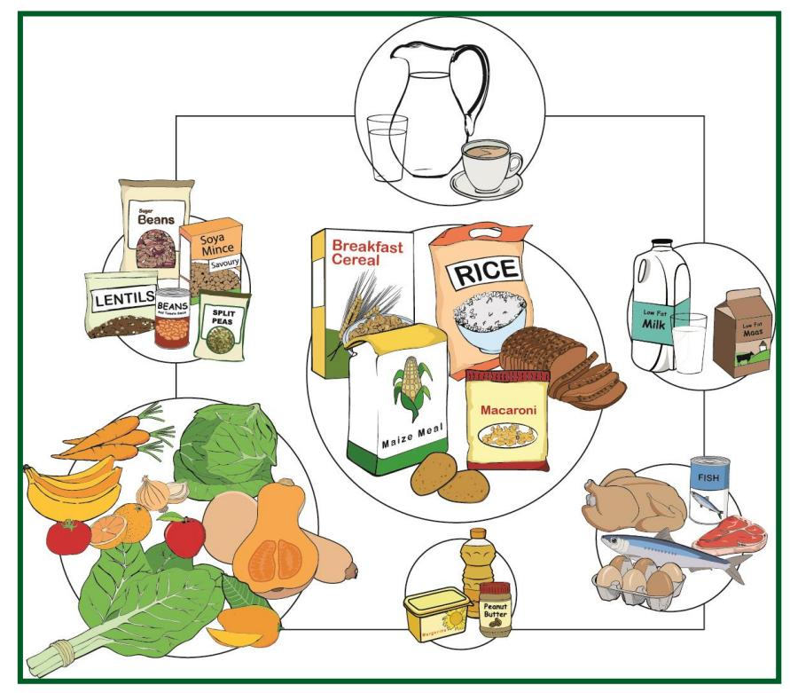
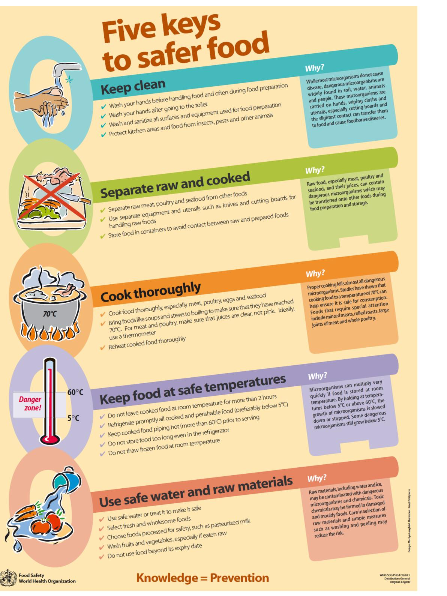

# **1. INTRODUCTION**

National Nutrition Week is celebrated every year from 9 – 15 October to create awareness of the importance of eating healthy. This document highlights the concept and supporting messages to be used during National Nutrition Week 2023. The objective of the document is to outline the key messages to be communicated and statistics to be used to ensure consistency in communication.

# **2. GUIDELINES FOR USE OF THE NATIONAL NUTRITION WEEK 2023 MESSAGES**

The messages must remain consistent as per this document. They may be adapted to meet the needs of the target audience.

- The overall messages should be used in the format stated, with the same wording to avoid mixed messages and confusion.
- The statistics given should be the statistics used in this document in order to avoid confusion or too many messages.
- Messages may only be used for generic health promotion and **may not** be used to promote any specific brands.

# **3. RATIONALE**

The *2016* SADHS found that 68 per cent of women and 31 per cent of men in the country are overweight or obese. About 20 per cent of women and three per cent of men are severely obese1 . The mean waist-to-hip circumference (WtHR) among women is 0.55; 67 per cent of women have a WtHR greater than or equal to 0.50), which means, a majority of women in South Africa are at an elevated risk for metabolic complications, such as heart disease and type 2 diabetes. Approximately 13.3 per cent of children younger than five years are overweight or obese which is more than double the global average of 6.1 per cent[1](#page-0-0) . The *2012* SANHANES showed that 14.2 per cent of children aged six to 14 years are overweight or obese2 .

Poor diet, as defined by a cluster of dietary risks, is the leading cause of death and is the first or second biggest contributor to non-communicable (NCD) disease burden in all six World Health Organization (WHO) regions. Of these dietary risks, the biggest contributors to the global burden of disease in 2017 were diets that are low in whole grains, high in sodium, or low in fruits, nuts and seeds, or vegetables. Additionally, there is an effect of higher body mass index on disease outcomes3 . Emerging evidence suggests that diet may influence the onset of mood disorders and specifically depression. For instance, many studies described in recent systematic reviews have demonstrated associations between measures of diet quality and the probability of and risk for depression. A systematic review of 61 studies by Glabska *et al* 2020 found that the consumption of fruit and vegetables seems to have a positive influence on mental health. Therefore, the general recommendation to consume at least 5 portions of fruit and vegetable a day may be beneficial also for mental health9 .

The 2016 SADHS found that among respondents 15 years and older, the consumption of sugary drinks (including fruit juice) the day or night before the survey was 35.7 per cent. The average volume consumption was 607.2 ml. 36.5 per cent of respondents consume fried foods at least once per week. Vegetable and fruit consumption the previous day or night was only 48.8 and 59.9 per cent respectively. The consumption of poor food and drink choices starts at an early age with 18 per cent of children age six to eight months consumed salty snacks and four per cent consumed sugary drinks the day or night before the survey. This increase quickly to 64 per cent and 33 per cent , respectively, of children aged 18 to 23 months[1](#page-0-0) . Children of this age (six to 24 months) should not be having any foods that do not contribute to their high nutrient needs. The concept of optimising nutrition in the first 1 000 days (the period from conception to the first two years of life) is important for the prevention of over- and under-nutrition. The World Health Organization's (WHO) member states (which includes South Africa), agreed on the goal to reduce the global population's intake of salt by 30 per cent and halt the rise in diabetes and obesity in adults and adolescents as well as in childhood overweight by the year 2025.

Leading international experts and professional health organisations recommend increased consumption of plant-based food, such as vegetables and fruit, legumes, nuts, seeds and whole grains and locally-produced, home-prepared foods.

One of the goals of the National *Strategy for the Prevention and Control of Non-Communicable Diseases in South Africa 2022 – 2027* is to promote and enable health and wellness across the life course. This goals aims to address unhealthy diet which is one of the five major shared and modifiable risk factors. Strategic objective 2.1 is to promote healthy nutrition in prioritized settings. The deliverables include to:-

- Implement healthy nutrition policies in workplaces, schools and early childhood development centres.
- Support the provision of healthy food options in public & private institutions.
- Update regular screening and awareness campaigns on obesity among children and adults.

In line with increasing evidence emphasising the importance of nutrition in preventing and managing disease, and to support the implementation of the National Strategic plan, the theme for the National Nutrition Week 2023 is: **"Feel good with food"** 

The objectives of National Nutrition Week 2023 are to:

- Increase awareness among adults, school going children and caregivers that nutritious food choices can promote physical and mental health and wellbeing.
- To increase self efficacy to plan and prepare healthy meals and snacks.

The slogan "Feel good with food" was chosen specifically for its potential to attract the attention of those that may not be naturally interested in healthy eating. The intent is that the slogan will draw individual's attention, which will then go into detail on the types of food that can make you feel good, and where "feel good" will be qualified as feeling good both physically and mentally.

# **4. TARGET AUDIENCES**

| Caregivers and ECD      | Increasing knowledge and self efficacy in this audience             |  |
|-------------------------|---------------------------------------------------------------------|--|
| Practitioners           | promotes an enabling environment for infant and young child         |  |
|                         | nutrition.                                                          |  |
| School going children   | Providing materials that encourage healthy eating shows             |  |
|                         | support for the implementation of the healthy nutrition policies at |  |
|                         | schools. It also has the potential to increase demand for           |  |
|                         | healthier food options in schools.                                  |  |
| Employees and           | Increased knowledge and self-efficacy in this audience can lead     |  |
| employers at workplaces | to more support for the provision of healthy food options,          |  |
|                         | creating a more supportive enabling environment for the             |  |
|                         | consumption of healthier food and drinks in the workplace.          |  |

# **5. FOCUS AREAS AND COMMUNICATION OBJECTIVES**

| Focus area                                                        | Communication objective                                                                                                                                                                                                                                                                      | Target audience                          |
|-------------------------------------------------------------------|----------------------------------------------------------------------------------------------------------------------------------------------------------------------------------------------------------------------------------------------------------------------------------------------|------------------------------------------|
| 1.Complementary feeding food choices                        | 1.1 To increase knowledge of caregivers and ECD practitioners of nutritious and affordable food options for children > 6 months.                                                                                                                                                    | Caregivers and ECD practitioners      |
| 2. Lunchbox and snack choices                                  | 2.1 To increase self-efficacy among employees and employers at workplaces to plan and choose healthier snack and lunch options. 2.2 To increase knowledge of regulating portion sizes, and types of foods for snacks and lunch among employees and employers at workplaces | Employees and employers at workplaces |
| 3. Home food preparation                                       | 3.1 To increase self-efficacy among employees at workplaces to plan and prepare healthier lunch                                                                                                                                                                                           | Employees and employers at workplaces |
|                                                                   | options at home to bring to work. 3.2 To increase self-efficacy of caregivers to prepare nutritious lunch options for their children 6 months to 5 years olds.                                                                                                                      | Caregivers and ECD practitioners      |
| 4. Benefits of nutritious food on                              | 4.1 To increase knowledge among school-going children and people at workplaces of the benefits                                                                                                                                                                                            | School-going children                    |
| physical well-being and performance                            | of nutritious foods on physical well-being and performance                                                                                                                                                                                                                                |                                          |
| 5. Benefits of nutritious foods                                | 5.1 To increase knowledge among school-going children, teachers and people at workplaces of the                                                                                                                                                                                        | School-going children                    |
| on mental health                                                  | benefits of nutritious foods on mental well-being                                                                                                                                                                                                                                            | Employees and employers at workplaces |
| 6. Benefits of nutritious foods on cognitive performance | 6.1 To increase knowledge among school-going children of the benefits of nutritious foods on cognitive performance                                                                                                                                                                     | School-going children                    |

# **6. QUICK FACTS**

- o The prevalence of overweight or obesity among women in South Africa rose from 56 per cent in 1998 to 68 percent in 2016, while the prevalence of underweight in women decreased from six to three per cent [1](#page-0-0) . The rise in global obesity in the last four decades increased to 14.9 per cent in women and 10.8 per cent in men4 .
- o Globalisation and trade liberalisation influence the prevalence in overweight and obesity. An analysis of food imports in 172 countries from 1994 to 2010 has shown that the level of sugar and processed food imports is significantly associated with a rise in average BMI5 .
- o Snacking prevalence (i.e. occasions of snacking); the energy density of snack foods, and its contribution to total daily energy intake is increasing. Snacks contribute to about 20 to 25 per cent of total energy intake in countries like the United States of America (USA) and United Kingdom (UK). This shift towards an increase in the frequency of eating meals and snacks away from home and the proportion of food budget spent on away from home foods has coincided with the increasing prevalence of obesity.
- o The prevalence of obesity and other diet-related chronic non-communicable diseases (NCDs), such as type 2 diabetes, hypertension, and some common cancers, is increasing worldwide6 . The Global Burden of Disease data suggest that, by 2025, 72.3 per cent of NCD related illness and deaths will occur in low-middle-income countries7 .
- o A systematic evaluation of dietary consumption patterns across 195 countries showed that the leading dietary risk factors for NCD mortality are diets high in sodium, low in whole grains, low in fruit, low in nuts and seeds, low in vegetables, and low in omega-3 fatty acids; each accounting for more than two per cent of global deaths8 .

- o Leading international experts and professional health organisations, i.e. the WHO, recommend increased consumption of plant-based food, such as vegetables and fruit, legumes, nuts, seeds, whole grains and locally-produced, home-prepared foods.
- o These experts include the WHO, EAT Lancet Commission, American Heart Association and the International Agency for Research on Cancer (IARC)

# **7. MESSAGES**

The following supportive messages may be used with the key mess age: *Feel good with food*, to help consumers make healthier food choices within their personal dietary preferences and requirements.

# **7.1 HEALTHY EATING FOR ALL**

- The South African FBDGs, also called the Guidelines for Healthy Eating promote the consumption of a variety of healthy foods. Most of what we eat should consist of mainly unprocessed or minimally foods from plants, for instance vegetables, fruit, starchy foods (preferably minimally processed) and legumes according to the proportions indicated in the Food Guide **(see Annexure I for the Guidelines for Healthy Eating and the Food Guide).** This indicates that nearly 80 per cent of what we eat should be a variety of unprocessed or minimally processed foods from these food groups. Sugar, salt and fat should be used sparingly in food preparation and at the table.
- A variety of healthy foods means eating food from more than one 'food group' at each meal, i.e. breakfast, lunch and supper as well as eating different healthy options from the same 'food 'group' on different days. Aim to have food from at least four food groups a day.
- Drinking water is an important part of healthy eating and should therefore be the beverage of choice. Avoid sugary drinks.
- Babies should be given only breastmilk for the first six months of life. Breastmilk contains all the energy, vitamins and other nutrients and water in the correct amounts that the baby needs. They should not be given any other food or fluids, not even water, except for medicine prescribed by a doctor or nurse. From the age of six months, appropriate and culturally acceptable complementary foods should be introduced and breastfeeding continued until the child is at least two years old.

- Young children who are no longer breastfed require full-cream milk instead of fat-free or lowfat milk. Avoid giving young children sweetened and/or flavoured milk or drinking yoghurt.
- Eating a variety of healthy foods makes meals more interesting and enjoyable.

# *Tips:*

- Choose a variety of foods that are affordable and in season. This can be achieved by drawing up a food budget, keeping this budget in mind when planning for the week ahead and writing down your thoughts in the form of a meal plan and then compiling a shopping list, only buying items that are needed (See message four and **Annexure VII for tips when shopping for groceries**.
- Enjoying a healthy eating plan also means preparing food in healthy ways, for instance eating raw vegetables and using cooking methods such as boiling, grilling and baking instead of frying.
- In choosing a variety of food to eat, make portion control a habit in order to avoid overeating **(See Annexure II for Portion Control Guide).**
- Try to eat regularly, this means that if you choose to eat three meals per day you do this most days of the week. Try not to skip meals as this can lead to feelings of hunger and low blood sugar (like dizziness, shaking or loss of concentration). Breakfast especially is an important meal.
- A child's Road-to-Health Book /The Caregiver Message Book: How to Raise a Healthy and Happy Child, gives some ideas on types of foods, quantities and textures for children from six months to five years.
- When feeding a young child, foods that can cause choking should be avoided, for instance nuts and seeds, whole grapes and large pieces of raw vegetables. Ensure that cooked, soft porridge for small children is of a thicker consistency and is enriched with oil, margarine or peanut butter.
- Experiment with different food combinations, tastes, textures and methods of encouraging smaller children to eat if they refuse many foods
- Nutrition needs change across across the life span. It is important to check in with a dietitian for disease specific dietary advice.

# **7.2 EAT PLENTY OF VEGETABLES AND FRUIT EVERY DAY**

- Eating plenty of vegetables and fruit regularly can help prevent chronic diseases, including heart disease, high blood pressure, strokes, some types of cancer, aging related eye diseases and type-2 diabetes. These foods are also high in fibre (roughage), which ensures proper bowel functioning and helps to prevent constipation and related symptoms like bloating.
- Vegetables and fruit comprise of mainly water and so contribute to your daily intake of fluid. This can help prevent dehydration.
- Vegetables and fruit are not only tasty and refreshing, but also provide colour and texture to meals.
- The WHO recommends that you should eat *more than five portions* (400 grams) of vegetables and fruit combined per day.
- No single vegetable or fruit provides all the nutrients you need so eat variety of types and colour every day.
- Juices (vegetables or fruit) have had their pulp removed. The pulp contains the fibre of the produce, meaning that if you remove it, you remove all the fibre. The fibre as described earlier helps to promote regular bowel functioning and also helps your body to absorb the sugar from the produce more slowly, giving you more energy for longer. More than one portion of fruit has been used to create the amount of juice you drink. This means that when you drink a whole glass of fruit juice, you are consuming more than when you eat whole fruit. Since fruit is a sugar, you are also consuming a high dose of sugar without the fibre to keep you feeling full, which makes it very easy to overconsume.

# *Tips:*

- Vegetables should be eaten every day, and not only on weekends.
- Try to include a variety of vegetables and fruit in meal plans.
- Indigenous vegetables and fruit are good sources of vitamins and minerals and should be included where possible **(See Annexure III for the Uses of Indigenous Vegetables, Fruit and Legumes)**.

- Frozen and dried vegetables can be incorporated as part of a healthy eating plan.
- Include both cooked and raw vegetables and salads in meals.
- Eat a yellow vegetable (carrots, pumpkin, butternut) or a dark green vegetable (broccoli, spinach,) at least once a day.
- Add extra vegetables to recipes such as stews, curries, stir-fries, salads, soups, sandwiches and stews or brown rice or whole-wheat pasta dishes or to egg dishes (scrambled eggs or omelettes). Baby spinach, tomatoes, carrots, beetroot and sundried tomatoes are merely some of the vegetables that are easy to add to dishes. Grating vegetables into dishes can help to "hide" it in foods and increase acceptability. Add raw vegetables such as carrots or shredded cabbage to lunchboxes. Include a fresh fruit or fresh vegetable as a snack between meals.
- Always wash vegetables and fruit well in clean water before preparing, cooking and eating.
- Once vegetables are cut, they need to be boiled in a *little* water for a short period to retain most of the nutrients. Most vegetables can be cooked in a few minutes if it is steamed, microwaved or stir-fried (in a little vegetable oil).
- Eat multiple portions of vegetables and fruit in one delicious go by blending it into a smoothie. By adding a small handful of spinach, kale, cauliflower or broccoli florets or frozen peas to your smoothie, you reap all the benefits, but will not even notice the taste.
- Veg-ify your favourite recipes by swapping some of the animal-based foods (meat, dairy and eggs) with whole plant-based alternatives. Meat can be replaced with vegetables like mushrooms, aubergine and baby marrow or with legumes like lentils, beans and chickpeas.
- Prepare vegetables and fruit with little (if any) added fat, sugar and salt.
- Portion sizes of vegetables can be more generous if a variety of vegetables is not available.
- Children are more likely to enjoy eating vegetables when they have eaten a variety from an early age (i.e. from six months) and when they see their parents enjoying vegetables.
- Get children into the habit of eating raw vegetable sticks or fruit when they are hungry between meals.

# **7.3 EAT DRY BEANS, PEAS, LENTILS AND SOYA REGULARLY**

- Eating dry beans, peas and lentils regularly, i.e. at least four times per week, can help prevent chronic diseases, including heart disease, high blood pressure, diabetes, cancer and overweight, as well as improving gut health.
- Dry beans and lentils, provide a valuable and cost-effective source of protein, some vitamins, plant-based iron and other substances that have anti-cancer properties. They are rich in slowly digested starch and fibre, helping to control blood sugar levels.
- They are low in sodium, fat and have no cholesterol.
- They can be used instead of meat or added to meat as a meat extender.
- They can be used in many dishes, such as salads, soups and stews.
- They do not require refrigeration to be stored before being cooked.
- They help the environment as they are water-efficient and help to keep the soil fertile and healthy.

# *Tips:*

- Soaking beans and chickpeas overnight in plenty of water will reduce cooking time and help to reduce bloating. Drain the soaking water and use fresh water for cooking.
- Try not to cook dry beans, peas or lentils together as each has its distinct cooking time **(See Annexure IV for the Conversion Guide for Cooking Dry Beans, Peas and Lentils).**
- Dry beans, peas and lentils should be thoroughly cooked until they are tender and drained well.
- Use a large enough pot and cover with enough water as they increase two to three times in size.
- Add seasonings such as bay leaves, onion, garlic and/or pepper corns when cooking, but leave salt, acidic foods and condiments, such as tomatoes, lemon juice and vinegar until after cooking as it can harden beans. Add herbs and spices near the end of the cooking process.

- Save energy by using a wonderbag or haybox to cook dry beans, peas and lentils **(See Annexure V for How to use a Wonderbag or Haybox to Save Energy – this can also help during loadshedding).**
- Microwaving does not reduce cooking time for dry beans, peas and lentils.
- As canned foods have a higher salt (sodium) content, if you choose to use canned beans, peas and lentils for convenience, they should be rinsed before you eat/cook with them.
- Lentils are excellent to introduce legumes into family meals as they can be easily incorporated into any mince dish (lasagne/ bolognaise/ meatballs, etc.).
- You can download dry beans, peas and lentils recipe book from [https://www.nutritionweek.co.za/NNW2016/docs/NNW2016%20Recipe%20collection.pdf.](https://www.nutritionweek.co.za/NNW2016/docs/NNW2016%20Recipe%20collection.pdf)

# **7.4 PLAN AND PREPARE HEALTHY HOME MEALS RATHER THAN BUYING READY-TO-EAT FOOD MEALS/SNACKS OR EATING OUT FREQUENTLY**

- Eating at home provides your family with the opportunity to eat a variety of healthy foods.
- Eating healthy home-cooked meals helps avoid being tempted by unhealthy food options in restaurants/canteens/fast food outlets.
- It helps to save money because homemade foods, especially for breakfast or lunch is usually much cheaper than eating at a restaurant or buying processed foods such as snacks and ready-to-eat meals.
- It can help to save time as it can be often much faster to cook something at home especially if meals are planned in advance **(See Annexure VI for an Example of a Menu Plan)**.
- It enables one to use healthy ingredients and to be able to control what and how much of each ingredient goes into a meal. Many commercially prepared foods and snacks are high in saturated fat, salt, and/or sugar.
- By knowing what the home-cooked meal contains, it can help one to prevent food allergies and sensitivities.
- It makes it easier to exercise portion control and to avoid overeating. Many restaurants and fast food outlets offer portions that are much larger than necessary.

- People who eat home-cooked meals on a regular basis tend to be happier and healthier because they consume less sugar and ultra-processed foods. Healthy home meals contain all the right nutrients that may result in higher energy levels and better mental health.
- The mental health benefits associated with regularly eating home-cooked meals increase considerably when home-cooked meals are shared with others. Communal meals bring people together and gives the entire family the opportunity to talk about their day. Sharing the joy of home cooking also preserves cultural knowledge and history as recipes are passed on from generation to generation.
- Home-cooked meals can also benefit the environment by saving money and reducing carbon footprint by cutting down on the packaging of processed meals.

# *Tips:*

- Draw up a budget for food. Have an amount in mind and do your best to stick to it. Look at past receipts as a starting point.
- Create a menu plan for the week ahead for breakfast, lunch and supper. **(See Annexure VI for an Example of a Menu Plan)** Be realistic. If you only have 20 minutes to prepare a meal, then do not choose a recipe that is complicated. This will also help to get comfortable with the basic steps of a recipe or to prepare food
- *See*

[http://www.adsa.org.za/Portals/14/Documents/2018/June/DietitiansDoPrevention%20FINAL.](http://www.adsa.org.za/Portals/14/Documents/2018/June/DietitiansDoPrevention%20FINAL.pdf) [pdf,](http://www.adsa.org.za/Portals/14/Documents/2018/June/DietitiansDoPrevention%20FINAL.pdf)

<https://www.nutritionweek.co.za/NNW2016/docs/NNW2016%20Recipe%20collection.pdf> and<http://www.heartfoundation.co.za/recipes/> for recipes that can be used*).*

- Use the guidelines for healthy eating and the food guide **(see Annexure I)** when planning meals that are mostly plant-based, i.e. vegetables, fruit, legumes and preferably minimally processed starchy foods
- If you have the capacity, double the amounts when preparing regularly eaten foods such as brown rice or dry beans/peas/lentils. You can also do the same with your favourite family recipes so that these leftovers can be eaten on the other days of the week or can be frozen or thawed when needed **(see Annexure IX for the Five Keys to Safer Food)**.

- Plan to use leftovers for a few breakfasts, lunches or dinners throughout the week to reduce time spent cooking.
- Compile a shopping list as a reminder to choose healthy foods and to stick to the food budget to avoid buying unplanned foods **(See Annexure VIII for tips when shopping for groceries)**.
- Practice portion control when dishing up meals or packing food boxes for school or work (**See Annexure V for a practical Portion Control Guide**).
- Involving children in food preparation (maybe by asking them to read the recipe out loud or mix ingredients) is not only a fun thing to do, but also a great way to teach them healthy eating habits.

# *Tips to pack a healthy breakfast/lunch:*

- Plan the breakfast/lunches for the week and put a list on the refrigerator or counter.
- Most of the breakfast/lunch box should consist of unprocessed or minimally processed plantbased foods, for instance: vegetables and/or fruit, legumes and where possible minimally processed starchy foods.
- Follow hygienic food preparation methods. This is especially important when food will be stored for many hours before eating **(see Annexure IX for the Five Keys to Safer Food).**
- Prepare the breakfast/lunches the night before and store in the fridge or freezer so it can be safely consumed the next day.
- In summer, freeze water bottles overnight to have ice-cold water throughout the day. This also can help to keep a breakfast/lunch box cool.
- Form a Green lunch club with colleagues and agree to bring and share whole plant-based lunches at work. This will keep you accountable for preparing meals at home and inspire you to play with new recipes.

# **ANNEXURE I**

# **SOUTH AFRICAN GUIDELINES FOR HEALTHY EATING (FBDGs) FOR ADULTS AND CHILDREN FIVE YEARS AND OLDER AND THE FOOD GUIDE**

- Enjoy a variety of foods.
- Be active.
- Make starchy foods part of most meals.
- Eat plenty of vegetables and fruit every day.
- Eat dry beans, split peas, lentils and soya regularly.
- Have milk, maas or yoghurt every day.
- Fish, chicken, lean meat or eggs can be eaten daily.
- Drink lots of clean, safe water.
- Use fats sparingly. Choose vegetable oils rather than hard fats.
- Use sugar and foods and drinks high in sugar sparingly.
- Use salt and food high in salt sparingly.

This picture depicts the Food Guide. The size of the circles reflects the proportional volume that those foods should contribute to the total daily intake.

#### **ANNEXURE III**

#### **USES FOR INDIGENOUS VEGETABLES, FRUIT AND LEGUMES**

| VEGETABLES | Common names                  | Botanical name      | Culinary use/edible parts                           |
|------------|-------------------------------|---------------------|-----------------------------------------------------|
|            | Amaranths, hanekam,           | Amaranthus hybridis | - Cooked leaves are eaten in stews, soups and       |
|            | imbuya, isheka, isheke,       |                     | sauces or mixed with maize meal or eaten with       |
|            | thepe, umfino, vowa           |                     | milk or eaten as side dish                       |
|            |                               |                     | - Leaves can be dried for later use                 |
|            |                               |                     | - Seeds can be used as grain                        |
|            |                               |                     |                                                     |
|            |                               |                     | MOROGO STEW                                         |
|            |                               |                     | Enough young Leaves                                 |
|            |                               |                     | 2 Chopped Potatoes                                  |
|            |                               |                     | 1 Chopped Onion                                     |
|            |                               |                     | 2 Chopped Tomatoes                                  |
|            |                               |                     | 2 Chopped Chilies                                   |
|            |                               |                     | Chopped Wild Garlic                                 |
|            |                               |                     |                                                     |
|            |                               |                     | Rinse enough leaves to fill a pot. Add potatoes, |
|            |                               |                     | onions, and optional tomatoes, chilies (seeds    |
|            |                               |                     | removed and chopped small) and/or the garlic        |
|            |                               |                     | leaves. Cook over low heat with water covering      |
|            |                               |                     | ingredients until potatoes are soft                 |
|            |                               |                     |                                                     |
|            | Blackjack, gewone             | Bidens pilosa L.    | Blackjack tender leaves and young shoots are        |
|            | knapsekêrel,                  |                     | used as a spinach                                   |
|            | mokolonyane, mushiji,         |                     | Leaves can be dried for later use                   |
|            | muchiz umhlabangubo,          |                     |                                                     |
|            | uqadolo,                      |                     |                                                     |
|            | African cabbage,              | Cleome gynandra     | - The tender leaves flowers or young shoots, are    |
|            | amazonde, bangala, cat's      |                     | cooked in stew or eaten as a side dish.          |
|            | whiskers, cleome, iklabishi,  |                     | - Leaves can be boiled for 2 hours and eaten        |
|            | lerotho, murudi, oorpeultjie, |                     | immediately                                         |
|            | rirudzu, ulude                |                     | - The leaves are rather bitter, and for this reason |
|            |                               |                     | are cooked with other leafy vegetables such as      |
|            |                               |                     | cowpea leaves, amaranth and black                   |

|                             |                        | nightshade. To reduce the bitterness, milk is        |
|-----------------------------|------------------------|------------------------------------------------------|
|                             |                        | added to the boiled leaves and the mixture left      |
|                             |                        | overnight or boil the leaves briefly, discard the    |
|                             |                        | water and combine them with other ingredients        |
|                             |                        | in a stew                                            |
|                             |                        | - Leaves can be dried for later use                  |
| Delele, gushe, jew's        | Corchorus olitorius L. | - Cooked as a spinach                                |
| mallow, thelele, wild jute, |                        | - Immature fruit is dried and grinded into a         |
| wildejute                   |                        | powder to prepare sauce                              |
|                             |                        | - Dried leaves can be used as a thickener in         |
|                             |                        | soups.                                               |
|                             |                        | - A tea can be made from dried leaves                |
| Amadilika, ilenjane,     | Portulaca oleracea     | -Leaves are cooked as a spinach or eaten raw         |
| isolate, pigweed, purslane  |                        |                                                      |
|                             |                        | Mix raw leaves with chopped cucumber, lettuce        |
|                             |                        | and mint and sprinkle over some lemon juice and      |
|                             |                        | very little oil                                      |
| Ikhokhwane                  | Alepidea longifolia    | Young leaves are cooked as spinach                   |
| Brandnetel, imbathi,        | Urtica dioica          | Leaves are cooked as a spinach or boiled with        |
| stinging nettle             |                        | other herbs to make a relish                         |
|                             |                        |                                                      |
|                             |                        | NETTLE SOUP                                          |
|                             |                        | A pot of Nettle Leaves                               |
|                             |                        | 3 Tablespoons of Oil                                 |
|                             |                        | 4 Tablespoons Flour                                  |
|                             |                        | 4 Cups of Water                                      |
|                             |                        | 1 Chopped Onion                                      |
|                             |                        | 3 Chopped Carrots OR                                 |
|                             |                        |                                                      |
|                             |                        | 1 Cup Chopped Pumpkin                                |
|                             |                        | Make a soup by washing as many nettle leaves         |
|                             |                        | and tops that will fill a pot. Place the leaves into |
|                             |                        | the pot                                              |
|                             |                        |                                                      |
|                             |                        | and cook over low heat, for 10 minutes. Drain        |
|                             |                        | and take leaves out of the pot. Place ingredients    |
|                             |                        | (on left) in pot and cook over low heat for 15       |

|       | mobola-plum, muvhula, umkhuna              |                         | - The nuts are eaten alone or mixed with vegetables           |
|-------|-----------------------------------------------|-------------------------|------------------------------------------------------------------|
|       | Bosappel, grysappel, mbulwa, mmola, mobola | Parinari curatellifolia | - Ripened fruit is edible and can dried or cooked as porridge |
|       | mufula, umganu                                |                         | - Marula nuts                                                    |
|       | Inkanyi, marula, morula,                      | Sclerocaryo caffra      | - Ripened fruit                                                  |
| FRUIT | Common names                                  | Botanical name          | Culinary use/edible parts                                        |
|       |                                               |                         | cooked.                                                          |
|       |                                               |                         | - Boil leaves with milk until the leaves are well                |
|       | Mustard                                       |                         | minutes and mixed with porridge                                  |
|       | Isihlalakuhle, iqange, wild                   | Sisymbrium thellungii   | - The leaves are chopped, boiled for a few                       |
|       |                                               |                         | towards end of cooking to keep the flavour                       |
|       |                                               |                         | - Use to add flavour to stews and soups - add                 |
|       |                                               |                         | cooked foods and to salads                                       |
|       |                                               |                         | - The leaves chopped up can be added to                          |
|       |                                               |                         | - The bulb is cooked with meat                                   |
|       | wild garlic                                   |                         | spinach.                                                         |
|       | Isihaqa, isikwa,                              | Tulbaghia alliacea      | - The green parts and flowers are used as a                      |
|       |                                               |                         | with milk until well cooked                                      |
|       |                                               |                         | - Leaves are boiled in water for a few minutes or                |
|       | pennywort                                     |                         | porridge                                                         |
|       | Izibu kentaba, isiwisa,                       | Centella asiatica       | - The leaves are chopped, boiled and mixed with                  |
|       |                                               |                         | and stews.                                                       |
|       | plantain                                      |                         | salad or cooked like spinach and added to soups                  |
|       | Indlebe-ka-tekwane,                           | Plantago major          | Young leaves can be chopped and used in a                        |
|       |                                               |                         | bread                                                            |
|       |                                               |                         | - Seeds can be ground into meal and used in                      |
|       |                                               |                         | own or with other foods.                                         |
|       |                                               |                         | - Young twigs can be boiled and eaten on their                   |
|       |                                               |                         | - Leaves be dried and used later                                 |
|       |                                               |                         | other foods.                                                     |
|       |                                               |                         | - Add leaves to porridge or used as a relish with                |
|       | Fat hen, imbilikicane                         | Chenopodium album       | - Cook young leaves as a spinach                                 |
|       |                                               |                         | and cook over low heat for 5 to 10 minutes                       |
|       |                                               |                         | and pepper to taste. If too thick add more water                 |
|       |                                               |                         | minutes. Add boiled nettle leaves in pot and salt                |

|         |                              |                    | - The oil is used for cooking                    |
|---------|------------------------------|--------------------|--------------------------------------------------|
|         | Mmupudu, moepel,             | Mimusops zeyheri   | Ripened fruit                                    |
|         | mubululu, nhlantswa,         |                    |                                                  |
|         | transvaal red milkwood,      |                    |                                                  |
|         | umpushane                    |                    |                                                  |
|         | Amantulwane, mavelo,         | Vangueria infausta | Ripened or dried fruit                           |
|         | mmilo, muzwilu, mpfilwa,     |                    |                                                  |
|         | mothwanye, umtulwa,          |                    |                                                  |
|         | umvile, umviyo, wild         |                    |                                                  |
|         | medlar, wildemispel          |                    |                                                  |
|         | Amatungulu, ditokolo         | Carissa macrocarpa | Ripened fruit                                    |
|         | noemnoem, num-num,           |                    |                                                  |
|         | umbethankunzi                |                    |                                                  |
|         | Amagokolo,                   | Dovyalis caffra    | Ripened fruit                                    |
|         | appelkoosdoring,             |                    |                                                  |
|         | dingaan's apricot, keiappel, |                    | Unripe fruit is used to make pickles             |
|         | kei apple, motlhono,         |                    |                                                  |
|         | umgokolo, umkokola, um       |                    |                                                  |
|         | qokolo, wild apricot         |                    |                                                  |
|         | Klapper, monkey orange,      | Strychnos spinosa  | Ripened or dried fruit                           |
|         | morapa, muramba, nsala,      |                    |                                                  |
|         | umhlali, umKwakwa            |                    |                                                  |
|         | bitterboela,                 | Citrullus lanatus  | - Ripened fruit (tsamma)                         |
|         | bitterwaatlemoen, karkoer,   |                    | - Fruit flesh can be cooked with maize porridge  |
|         | makataan, melon, t'sama,     |                    | - Seeds can be dried, roasted and eaten or       |
|         | tsamma, wild watermelon      |                    | ground into meal/flour to make bread             |
| LEGUMES | Common names                 | Botanical name     | Culinary use/edible parts                        |
|         | Akkerbone, cowpeas,          | Vigna unguiculata  | - Leaves are eaten as vegetable, either fresh or |
|         | dinaba, dinawa, imbumba,     |                    | dried and be added to stews or soups.            |
|         | isihlumaya, munawa,          |                    | - Fresh beans are cooked for an hour and can be  |
|         |                              |                    | cooked green in the pods                         |
|         |                              |                    | - Dried beans should be cooked 2 – 3 hours    |
|         |                              |                    | - Seed oil can be used in cooking                |
|         |                              |                    | COWPEA STEW                                      |

|                          |                   | 4–6 Cups Young Leaves                           |
|--------------------------|-------------------|-------------------------------------------------|
|                          |                   | 3 Cups Water                                    |
|                          |                   | 1 Chopped Tomato                                |
|                          |                   | 1 Chopped Chili (if liked)                      |
|                          |                   | ¼ Teaspoon Salt                                 |
|                          |                   | Place leaves in the sun for a day. Remove       |
|                          |                   | stalks. Boil water with salt. Add leaves. Cook  |
|                          |                   | covered for 30 minutes. Add tomato and chili.   |
|                          |                   | Cook for another 30 minutes                     |
|                          |                   |                                                 |
| Bambara groundnuts,      | Vigna subterranea | - Immature seeds can be eaten boiled or grilled |
| ditloo, hlanga, indlubu, |                   | - Mature seeds can be roasted or can be grinded |
| marapo, nduhu, njugo,    |                   | to make a meal/flour or cooked and added to  |
| phonda, tindhluwa        |                   | salads or other dishes                          |
|                          |                   | - Roasted ground meal can be used as a          |
|                          |                   | substitute for coffee.                          |
|                          |                   | - Seed oil can be used in cooking               |
| Dithlodi, mung bean      | Vigna radiate     | Used in dhal                                    |
|                          |                   |                                                 |
|                          |                   | Bean sprouts                                    |
| Indlubu, jugo bean       | Voandzeia         | - Young beans can be eaten cooked or raw        |
|                          | subterranea       | - Soak older beans before cooking               |
|                          |                   | - Ripe beans can be pounded into a meal/flour   |
|                          |                   | and cooked with maize meal                      |
|                          |                   |                                                 |

#### **CONVERSION GUIDE AND COOKING TIMES FOR DRY BEANS, PEAS AND LENTILS**

### **CONVERSION (Raw/cooked/tinned)**

| 500 g (2 cups) of raw beans        | = | ± 1 kg (4 cups) of cooked beans |
|------------------------------------|---|------------------------------------|
| 410 g tin of beans                 | = | 350 g of cooked beans              |
| 500 g of cooked small white beans  | = | 500 ml of cooked beans             |
| 500 g of cooked red speckled beans | = | 500 ml of cooked beans             |
| 500 g of large white beans         | = | 600 ml of cooked beans             |

#### **COOKING TIMES**

| Kidney beans (after soaking)                | 3 ½ - 4 hours   |
|---------------------------------------------|--------------------|
| Red speckled beans or bambara groundnuts | 2 ½ - 3 hours   |
| (after soaking)                             |                    |
| Small white canning beans (after soaking)   | 1 – 2 hours     |
| Chickpeas or cowpeas (after soaking)        | 1 – ½ hours     |
| Split-peas (soaking not necessary)          | 40 – 45 minutes |
| Whole lentils (soaking not necessary)       | 30 – 45 minutes |
| Red split lentils (soaking not necessary)   | 10 – 15 minutes |

# **ANNEXURE V**

### **USE A WONDERBAG OR HAY BOX TO SAVE ELECTRICITY**

A haybox or wonderbag cooks food over a long period of time, a very hot pot is places in the insulated container and keeps hot for a long time. This heat cooks the food over a long time. It works like a slowcooker, but it does not need to be connected to an electrical outlet. It can be used to prepare any recipe, which involves boiling, simmering, or steaming food. It also works great to keep cooked food warm, like putting soup in a thermos. Benefits of a haybox or wonderbag:

- Saves cooking time and energy
- Food ready is ready in the morning (e.g. porridge) or when a person comes home from work
- A dish will not burn, overcook, or dry out.

# **Wonderbag**

The wonderbag is commercially available and can be ordered online. The manufacturer's instruction regarding use and care of the wonderbag should be followed.

# **Haybox**

### **Examples of insulation material:**

- Hay/straw
- Any other material that traps pockets of air will have insulating value: sawdust, newspaper or other shredded paper, fur feathers, wood ash, cardboard, aluminium foil.
- Wool in the form of cast-off sweaters and blankets.
- Cotton or polyester batting taken from old pillows or quilts.
- Styrofoam or foam.

### **Examples of containers for the insulation (the lid must latch or otherwise secure tightly):**

- Boxes: Any wooden or cardboard box big enough to hold the pot.
- Coolers
- Kitchen drawer: Must be deep and large enough to hold the pot.
- Baskets

# **Method:**

- Fill the box up all the way with insulation to the top but do not pack it so tightly that there is no airspace.
- Make a pot-shape hollow in the insulation material. Line the hole and the top surface of the insulation with fabric. Secure the fabric to the edges of the container. This will make it easier to lift the pot in and out of the container and will also keep bits of insulation out of the food.

 Make or find a cushion/pillow big enough to fill all the empty space in the box from the top of the pot to the closed lid. There should be no open space at the top of the box.

#### **Cooking time in the wonderbag/haybox:**

- The amount of cooking needed will depend on the type of food that is prepared, the length of preliminary boiling *and* upon how tightly the haybox is insulated. A well-insulated haybox should hold heat for up to eight hours.
- At least 15 minutes boiling time is needed for most dishes (rice and lentils need less time 5 and 10 minutes respectively).
- Less liquid can be used than normal since there is less evaporation in the haybox.
- The following cooking times in the wonderbag or haybox serve as general guidelines:
  - Lentils: 1 2 hours
  - Chickpeas: 4 5 hours
  - Kidney beans: 5 6 hours

#### **ANNEXURE VI**

#### **EXAMPLE OF A MENU PLAN**

| MEAL                        | AY 1 D                             | AY 2 D              | AY 3 D                         | AY 4 D                                | AY 5 D                  | AY 6 D                | AY 7 D                         | AY 8 D                         |
|-----------------------------|---------------------------------------|------------------------|-----------------------------------|------------------------------------------|----------------------------|--------------------------|-----------------------------------|-----------------------------------|
|                             | Maize meal porridge                | High-fibre cereal      | Muesli                            | Oats                                     | Mabele/sorghum porridge | Maize meal porridge   | Toast, margarine thinly spread | Mabele/sorghum porridge        |
| Breakfast                   | Eggs                                  | Milk                   | Yoghurt                           | Milk                                     | Milk/Maas                  | Milk/Maas                | Scrambled eggs                    | Milk/Maas                         |
|                             | Fresh fruit                           | Fresh fruit            | Fresh fruit                       | Fresh fruit                              | Fresh fruit                | Fresh fruit              | Fresh fruit                       | Fresh fruit                       |
| School                      | Lentil curry                          | Soya mince             | Sugar bean stew                   | Pilchard stew                            | Sugar bean                 | Maas                     |                                   | Sugar bean stew                   |
| meal                        | Rice                                  | relish                 | Pap                               | Brown bread                              | curry                      | Pap                      |                                   | Rice                              |
| provided                    | Boiled butternut                      | Samp                   | Carrots                           | Cabbage salad                            | Rice                       | Fruit                    |                                   | Cabbage                           |
| by NSNP Morning snack | Ditloo/peanuts                        | Spinach Fresh fruit | Fresh fruit                       | Fresh fruit                              | Beetroot Fresh fruit    | Peanuts and raisins   | Yoghurt                           | Fresh fruit                       |
|                             | Whole wheat wrap                      | Brown bread         | Brown bread                       | Brown bread                              | Brown rolls                | Mashed potato            | Samp                              | Brown bread                       |
| Lunch                       | Mayonnaise thinly                     | Peanut                 | Margarine thinly                  | Margarine thinly                         |                            |                          | Grilled chicken/                  |                                   |
|                             | spread                                | butter                 | spread                            | spread                                   |                            |                          | chicken stew                      | Left-over lentil and              |
|                             | Left-over chicken                     |                        | Boiled egg                        | Maas/yoghurt                             | Soya mince                 | Pilchard fish,           |                                   | vegetable curry                   |
|                             |                                       |                        |                                   |                                          | meat balls                 | stewed                   |                                   |                                   |
|                             |                                       |                        |                                   |                                          |                            | Beetroot salad           | Mixed vegetables                  |                                   |
| Supper                      | Tasty mince (with mixed vegetable) | Pilchard kedgeree   | Grilled beef /lamb /pork chops | Beans, onion, tomato, carrots stew | Chicken liver stew      | Maas /Mopani worms    | Lentil and vegetable curry     | Cottage pie with potato/ sweet |
|                             | Rice                                  | Mashed potato       | Maize meal porridge            | Samp                                     | Maize meal porridge     | Maize meal porridge   | Rice                              | potato mash topping               |
|                             | Butternut                             | Green beans         | Mixed vegetables               | Cabbage                                  | Spinach                    | Tomato slices/ relish |                                   | Carrots                           |
| Daily                       | Water                                 | Water                  | Water                             | Water                                    | Water                      | Water                    | Water                             | Water                             |

# **ANNEXURE VII**

# **EXAMPLE OF A MASTER SHOPPING LIST**

This is a master shopping list that can be used while purchasing groceries. The list includes food items from the different food groups to ensure preparation of meals that provides the different nutrients. Always buy vegetables and fruit that are locally available and in season. Some of the items such as mopani worms and amadumbe are area specific and are included on the shopping list to indicate that they form part of a healthy plan.

| Starchy foods | Vegetables and fruit | Dry beans, peas, lentils, soya | Chicken, fish, meat, eggs | Milk | Oil | Other |
|---------------|-------------------------|-----------------------------------|------------------------------|------|-----|-------|
|---------------|-------------------------|-----------------------------------|------------------------------|------|-----|-------|

| Fortified maize   | Onions                | Beans        | Chicken, fresh     | Low-fat     | Sunflower/       | Vinegar        |
|-------------------|-----------------------|--------------|--------------------|-------------|------------------|----------------|
| meal/ mabele      |                       |              |                    | milk        | canola/olive oil |                |
| (sorghum)         | Carrots               | Lentils      | Chicken feet/      |             |                  | Salt           |
| Wheat porridge    |                       |              | gizzards/hearts    | Maas        | Peanut butter    |                |
|                   | Butternut             |              |                    |             |                  | Mixed herbs    |
| Breakfast cereals |                       | Savoury soya | Ox/lamb/chicke     | Buttermilk  | Soft margarine   |                |
| (high fibre)/oats | Pumpkin               | mince        | n livers           |             |                  | Curry          |
|                   |                       |              |                    | Low-fat,    | Peanuts/other    |                |
| Brown/whole       |                       | Split peas   | Eggs               | unsweetened | nuts (unsalted)  | Low-fat        |
| wheat/ rye bread  | Tomatoes              |              |                    | yoghurt     |                  | mayonnaise/    |
|                   |                       |              | Pilchard/salmon/   |             | Pumpkin/         | salad dressing |
| Rice/potato/sweet | Spinach/Imifino/      |              | tuna               | Mozzarella/ | sunflower seeds  |                |
| potatoes          | morogo/pumpkin        |              |                    | low-fat     |                  | Sugar          |
| /amadumbe         | leaves                |              | Mopani worms       | cottage     | Avocado          |                |
|                   |                       |              |                    | cheese      |                  | Tea            |
| Samp/corn/        | Beetroot              |              | Lean pork/beef/    |             |                  |                |
| mealie            |                       |              | lamb chops         |             |                  |                |
|                   | Cabbage               |              | (remove all        |             |                  |                |
| Macaroni/         |                       |              | visible fat before |             |                  |                |
| spaghetti         | Lettuce               |              | cooking)           |             |                  |                |
|                   |                       |              |                    |             |                  |                |
|                   | Frozen                |              |                    |             |                  |                |
|                   | vegetables            |              | Lean mince         |             |                  |                |
|                   |                       |              | (Remove all        |             |                  |                |
|                   | Fresh fruit, e.g.     |              | visible fat        |             |                  |                |
|                   | orange, apple,        |              | before cooking)    |             |                  |                |
|                   | banana,               |              |                    |             |                  |                |
|                   | pineapple,            |              |                    |             |                  |                |
|                   | pawpaw                |              |                    |             |                  |                |
|                   |                       |              |                    |             |                  |                |
|                   | Any other             |              |                    |             |                  |                |
|                   | vegetable and         |              |                    |             |                  |                |
|                   | fruit that is locally |              |                    |             |                  |                |
|                   | available             |              |                    |             |                  |                |
|                   |                       |              |                    |             |                  |                |
|                   |                       |              |                    |             |                  |                |
|                   |                       |              |                    |             |                  |                |
|                   |                       |              |                    |             |                  |                |
|                   |                       |              |                    |             |                  |                |
|                   |                       |              |                    |             |                  |                |

# **ANNEXURE VIII**

# **TIPS WHEN BUYING GROCERIES**

*Save money - buy smart*

- Make a list of what food you already have on hand in your refrigerator, freezer, and pantry.
- Keep a list in the kitchen to write down food items that you need to buy.
- Look for store sales or specials on store pamphlets, coupons, local newspapers or online advertisements.
- Avoid shopping on an empty stomach.
- Buy only what is on the shopping list. Use a calculator to help you stick to the budget.
- If not buying in bulk, use a smaller trolley to control how much food you can actually put in.
- Look at the top and bottom of the shelf for lower cost foods.
- Buy store or "no name" brands.
- Be sure you have enough extra money and storage space to buy in bulk.
- Buy only foods that your family will use up before it gets spoiled.
- Dry products like maize meal, wheat flour, rice, pasta and frozen foods keep well for a longer period and therefore can be bought in bulk.
- Single portion items, for instance single serving cans of fruit or yoghurt is often more expensive than buying a large tub of yoghurt. Decant the yoghurt into reusable containers if you need to travel with it.
- Ready-to-eat cereals cost more than double the price of maize meal, oatmeal and mabele porridge.
- Alternatives such as beans or eggs are more affordable than meat, chicken and fish.
- For better value, buy vegetables and fruit when they are in season.
- Buy vegetables and fruit in bulk if you know these will be eaten before becoming spoiled. Otherwise, share the cost and divide bulk quantities among family/friends.
- Frozen veggies can work out cheaper than the fresh produce as you can keep it in the freezer, thus minimising waste.
- Ready-to-eat bottled baby foods are costly. Use fresh foods and vegetables that can be mashed to the right consistency for smaller children. Meat and fish dishes can be grinded to the right texture for smaller children.

### *Choose healthier options when buying food*

- Buy brown bread or whole-wheat brown bread rather than white bread as brown bread and whole-wheat bread has more fibre than white bread.
- Buy porridges that you can cook, such as maize meal, oats and mabele (sorghum meal), which are healthier options than instant cereals and will keep you fuller for longer.
- Do not buy tinned meat and processed cold meats such as polony, salami and viennas, their high sodium (salt) and fat content makes them unhealthy. They are also expensive.

- Buy fewer prepared/ready-to-eat foods, especially muffins, cereal bars/energy bars. They are often higher in sugar, salt and fat.
- Check the nutritional information table of the label for the fat, sugar and sodium (salt) content of foods.
- Fresh vegetables and fruit are usually a healthier choice when compared with pre-prepared or processed foods.
- Root vegetables (like potatoes, sweet potatoes, beetroot and onions) can be bought in advance, but fresh fruit and leafy greens should be bought weekly. Buy whole-grains (brown rice, whole wheat pasta and quinoa), legumes (dry lentils and dry or canned beans and chickpeas) and other go-to items (like boxed nut milk and dried dates) in bulk and keep a few frozen fruits and vegetables options (spinach, banana, berries, peas, corn) in your freezer in case you run out of your fresh stock.
- Canned fruit and vegetables have added sugar and salt and are more expensive.
- Skim-milk powder is healthier than coffee creamers, tea whiteners or milk blends.
- Non-breastfed children can use full-cream milk from as early as 12 months. There is no need to buy infant formulas.
- Use low-fat or fat-free cottage cheese instead of full fat cheese. Use less cheese in cooking by using a little mustard or cayenne pepper to add flavour.
- Buy plant oils such as canola or sunflower oil and soft margarine instead of butter.

# **ANNEXURE IX**

#### **5 KEYS TO SAFER FO O D**

